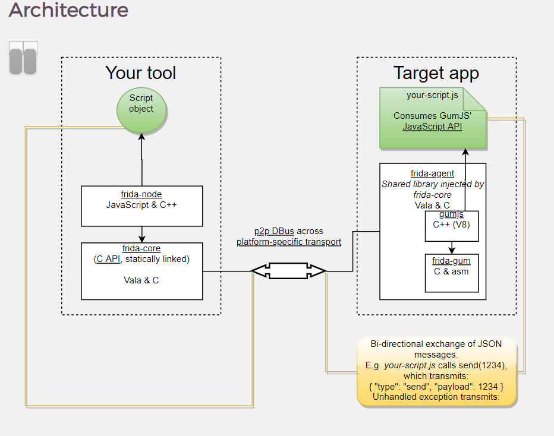
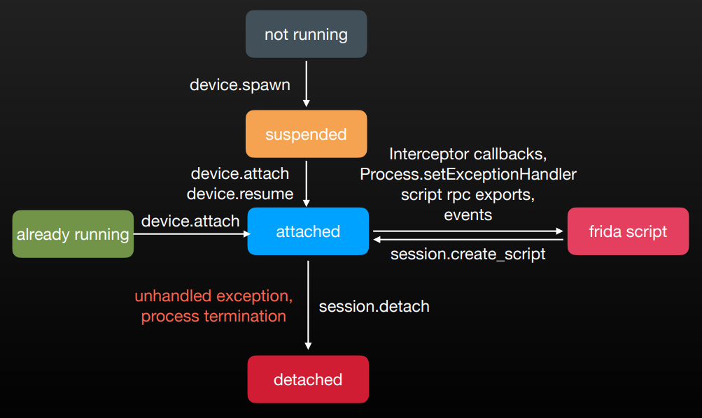
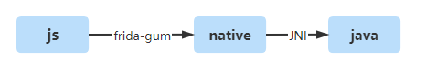
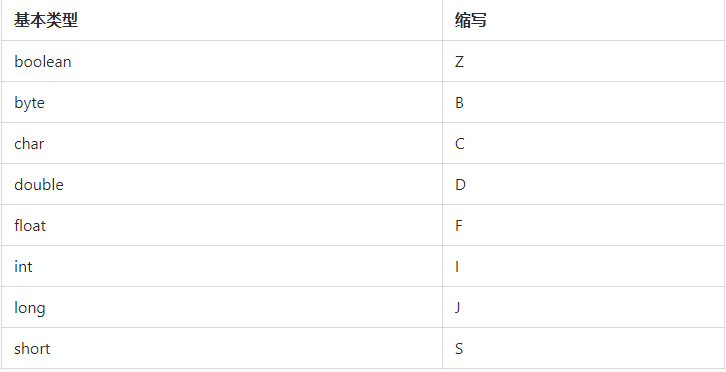

# Frida实践

Frida分客户端环境和服务端环境

* 客户端：编写Python代码，用于连接远程设备，提交要注入的代码到远程，接受服务端的发来的消息等;
* 服务端：需要用Javascript代码注入到目标进程，操作内存数据，给客户端发送消息等操作

也可以把客户端理解成控制端，服务端理解成被控端，假如要用PC来对Android设备上的某个进程进行操作，那么PC就是客户端，而Android设备就是服务端。 

<div align="center"></div>

按照功能层级，可以划分可以分为四个级别：

1. CPU 指令集级别的 inline-hook 框架: **frida-gum**
2. 使用 JavaScript 引擎对 gum 进行封装实现脚本拓展的能力: **gum-js**
3. 运行时进程注入、脚本加载、RPC 通信管理等功能: **frida-core**
4. 针对特殊运行环境的 JS 模块及其接口，如 **frida-java-bridge、frida-objc-bridge** 等

​          

# 一、frida自动化基础

   

## 1、frida  Javascript 引擎

1）由于 iOS 的 JIT 限制，以及嵌⼊式设备的内存压⼒，新版将默认脚 本引擎从 V8 迁移⾄ Duktape

2）在 Android 等⽀持 v8 的平台上仍然可以使⽤ enable-jit 选项切换回 v8 

3）Duktape ⽐ v8 缺失了⾮常多 ECMAScript 6 特性，如箭头表达式、 let 关键字

> **箭头函数**
>
> * ECMAScript 6 引⼊的书写匿名函数的特性
> * 需要启⽤ JIT，或 frida-compile 转译才可在 frida 中使⽤ 
> * ⽐ function 表达式简洁。适合编写逻辑较短的回调函数
> * 语义并⾮完全等价。箭头函数中的 this 指向⽗作⽤域中的上下⽂；⽽ function 可以通过 Function.prototype.bind ⽅法指定上下⽂

4）frida --debug 启⽤调试需使⽤ Duktape，不兼容 v8-inspector

5）以下代码等价

```javascript
// 普通函数
Process.enumerateModulesSync().filter(function(module) { return
module.path.startsWith('/Applications') }) 

// 箭头函数
Process.enumerateModulesSync().filter(module => module.path.startsWith('/
Applications'))
```

​      

## 2、npm && frida-compile

**命令参数 **

* -o 输出⽂件名
* -w 监视模式，源⽂件改动后⽴即编译 
* -c 开启 uglify 脚本压缩 
* -b 输出字节码 
* -h 查看完整命令⾏⽤法 
* -x, —no-babelify 关闭 babel 转译

​     

**特点**

> 1）需求
>
> * 默认使⽤的 Duktape 不⽀持最新的 ECMAScript 特性
> * 单个 js ⽂件，难以管理⼤型项⽬
>
> 2）可将 TypeScript 或 ES6 转译成 Duktape 可⽤的 ES5 语法
>
> 3）⽀持 Browserify 的打包，⽀持 ES6 modules、source map 和 uglify 代码压缩。甚⾄ 可⽣成 Duktape 字节
>
> 4）⽀持使⽤ require 或 es6 module 引⽤第三⽅ npm 包
>
> 5）frida-compile 是 npm 包，需要 node.js 运⾏环境，与 frida-python 不冲突，可同时安 装使⽤。其中，在npm 内可创建⽬录结构、安装依赖，并可在 package.json 中添加构建脚本
>
> 6）使⽤ TypeScript 可享受到类型系统带来的⼤型项⽬管理便利
>
> 7）Babel 添加插件⽀持⾼级的语法特性（generator / async-await）

​       

**补充**：[npm package.json文件介绍](https://segmentfault.com/a/1190000022329597)

> 1）创建package.json文件：使用 `npm init` 即可在当前目录创建一个 `package.json` 文件，依次确认即可创建。或`npm init --yes` 跳过回答问题步骤，直接生成默认值的 `package.json` 文件
>
> 2）基础属性：
>
> * name：全部小写，没有空格，可以使用下划线或者横线
>
> * version：x.x.x 的格式
>
> * description：描述信息，有助于搜索
>
> * main: 入口文件，一般都是 index.js
>
> * keywords：关键字，有助于在人们使用 npm search 搜索时发现你的项目
>
> * author：作者信息
>
> * license：默认是 MIT
>
> * bugs：当前项目的一些错误信息
>
> * 指定依赖包：指定项目依赖的包，通过`npm install` 默认下载
>
>   * `dependencies`：在生产环境中需要用到的依赖
>   * `devDependencies`：在开发、测试环境中用到的依赖
>
> * scripts：指定了运行脚本命令的npm命令行缩写，比如：start 指定了运行`npm run start`时，所要执行的命令
>
>   ```typescript
>   "scripts": {
>       "prepare": "npm run build",  // npm run prepare
>       "preinstall": "echo here it comes!",  // npm run preinstall
>       "postinstall": "echo there it goes!", // npm run postinstall
>       "start": "node index.js",  // npm run start
>       "test": "tap test/*.js"    // npm run test
>   }
>   ```

​         

## 3、frida session实例的生命周期

<div align="center"></div>

​     

## 4、firda 平台实践

  

### 4.1 frida on Android

frida-java 是 frida 内置库，即 Java 命名空间下的函数，可对 ART 和 Dalvik 运⾏时插桩（源代码 github/frida/frida-java）。其次，在 frida 框架基础上完全由 javascript 实现，frida-gum 只实现了通⽤的⼆进制插桩。总的来说，frida-java通过两步实现js世界到java世界的单向通道，首先利用frida-gum提供的js接口操作native世界，然后再基于jni连通到java世界。

<div align="center"></div>

​     

#### 1）操作对象或字段

##### a. 操作对象 

frida 既可以 new 对象实例，也可以搜索已有的对象

* `$new`：new 运算符，初始化新对象。注意与 $init 区分
* `$alloc`：分配内存，但不初始化
* `$init`：构造器⽅法，⽤来 hook, ⽽不是给 js 调⽤
* `$dispose`：析构函数
* `$isSameObject`：是否与另⼀个 Java 对象相同
* `$className`：类名

```typescript
if (!Java.available) 
 	throw new Error('requires Android'); 

Java.perform(function() { 
	const JavaString = Java.use('java.lang.String'); 
	var exampleString1 = JavaString.$new('Hello World, this is an example string in Java.'); 
	console.log('[+] exampleString1: ' + exampleString1); 
	console.log('[+] exampleString1.length(): ' + exampleString1.length()); 
});
```

​      

##### b. 访问 / 修改对象成员

`instance.field.value = newValue`，这种⽅式不区分成员可⻅性，即使是私有成员同样可以直接访问，其次除 value 的 `setter` 和 `getter` 之外，`fieldType` 和 `fieldReturnType` 获取类型信息

```typescript
// 字段赋值和读取要在字段名后加.value，假设有这样的一个类
package com.luoyesiqiu.app;
public class Person{
    private String name;
    private int age;
}

// 操作Person类的name字段和age字段
var person_class = Java.use("com.luoyesiqiu.app.Person");
// 实例化Person类
var person_class_instance = person_class.$new();

// 给name字段赋值
person_class_instance.name.value = "luoyesiqiu";
// 给age字段赋值
person_class_instance.age.value = 18;

// 输出name字段和age字段的值
console.log("name = ",person_class_instance.name.value, "," ,"age = " ,person_class_instance.age.value);
```

​      

frida 对数组做了封装，直接取下标即可访问

```typescript
// 注意 instance 和 Class 的区别
// Java.choose 找到实例后查询字段的类型
Java.perform(function () { 
	var MainActivity = Java.use('com.example.seccon2015.rock_paper_scissors.MainActivity'); 
    
	Java.choose(MainActivity.$className, { 
		onMatch: function(instance) { 
			console.log(JSON.stringify(instance.P.fieldReturnType));
		}, 
 		onComplete: function() {} 
	}); 
}) 
```

​        

#### 2）修改函数实现 Hook Java

修改一个函数的实现后，如果这个函数被调用，则avascript代码里的函数实现也会被调用

> **Java 层的插桩**：
>
> ```typescript
> // 格式
> Java.use().method.implementation = hookCallback
> 
> // 由于 Java ⽀持同名⽅法重载，需要⽤ .overload 确定具体的⽅法
> Java.use('java.lang.String').$new.overload('[B', 'java.nio.charset.Charset')
> ```
>
> **JNI 层插桩**：JNI 实现在 so 中，且符号必然是导出函数，照常使⽤ `Interceptor` 即可

​         

##### a. 函数参数类型表示

基本类型缩写表示表：

<div align="center"></div>

注意：

> `int[]`类型：重载时要写成`[I`
>
> 任意类：直接写完整类名即可，比如：`java.lang.String`
>
> 对象数组：用左中括号接上完整类名再接上分号 `[java.lang.String;`

   

##### b. 带参数构造函数

```typescript
// 修改参数为byte[]类型的构造函数的实现
ClassName.$init.overload('[B').implementation=function(param){
    //do something
}

// 修改多参数的构造函数的实现
ClassName.$init.overload('[B','int','int').implementation=function(param1,param2,param3){
    //do something
}
```

**注：**ClassName是使用 Java.use 定义的类，param是可以在函数体中访问的参数

​    

##### c. 无参构造函数

```typescript
// 默认格式
ClassName.$init.overload().implementation=function(){
    //do something
}

// 调用原构造函数
ClassName.$init.overload().implementation=function(){
    //do something
    this.$init();
    //do something
}
```

**注**：当构造函数（函数）有多种重载形式，比如一个类中有两个形式的func：`void func()` 和 `void func(int)`，要加上 ***overload来对函数进行重载***，否则可以省略overload    

​     

##### d. 普通函数 & 无参函数

```typescript
// 修改函数名为func，参数为byte[]类型的函数的实现
ClassName.func.overload('[B').implementation=function(param){
    //do something
    //return ...
}

// 无参数的函数
ClassName.func.overload().implementation=function(){
    //do something
}

// 带返回值, 则hook时也应有返回值
ClassName.func.overload().implementation=function(){
    //do something
    return this.func();
}
```

**注**： 在修改函数实现时，如果原函数有返回值，那么我们在实现时也要返回合适的值

​     

#### 3）函数调用&实例化

```typescript
// 和Java一样，创建类实例就是调用构造函数，而在这里用$new表示一个构造函数
var ClassName = Java.use("com.luoye.test.ClassName");
var instance = ClassName.$new();

// 实例化以后调用其他函数
var ClassName = Java.use("com.luoye.test.ClassName");
var instance = ClassName.$new();
instance.func();
```

​      

#### 4）常用Java hook方法

##### a. 获取调用堆栈

Android 提供了⼯具函数可以打印 Exception 的堆栈，此⽅式等价 于 Log.getStackTraceString(new Exception)

```typescript
Java.perform(function () { 
	const Log = Java.use('android.util.Log'); 
	const Exception = Java.use('java.lang.Exception'); 
	const MainActivity = Java.use('com.example.seccon2015.rock_paper_scissors.MainActivity');
    
    MainActivity.onClick.implementation = function(v) { 
		this.onClick(v); 
		console.log(Log.getStackTraceString(Exception.$new())); 
	}; 
}); 
```

​      

##### b. 枚举所有类方法

```typescript
Java.perform(function() {
	//enter class name here: example android.security.keystore.KeyGenParameterSpec$Builder
	//class inside a class is defined using CLASS_NAME$SUB_CLASS_NAME
	var class_name = "android.security.keystore.KeyGenParameterSpec$Builder";
	var methodArr = Java.use(class_name).class.getMethods();
    
	console.log("[*] Class Name: " + class_name)
	console.log("[*] Method Names:")
	for(var m in methodArr)
	{
		console.log(methodArr[m]);
	}
});
```

​      

#### 5）Hook 动态链接库（loadLibrary）

Android中我们通常使用系统提供的两种API：System.loadLibrary或者System.load来加载so文件：

```java
// 加载的是libnative-lib.so，注意的是这边只需要传入"native-lib"
System.loadLibrary("native-lib");

// 传入的是so文件完整的绝对路径
System.load("/data/data/应用包名/lib/libnative-lib.so")
```

System.loadLibrary()和System.load()的区别：

> 1）loadLibray传入的是编译脚本指定生成的so文件名称，一般不需要包含开头的lib和结尾的.so，而load传入的是so文件所在的绝对路径
>
> 2）loadLibrary传入的不能是路径，查找so时会优先从应用本地路径下(/data/data/${package-name}/lib/arm/)进行查找，不存在的话才会从系统lib路径下(/system/lib、/vendor/lib等)进行查找；而load则没有路径查找的过程
>
> 3）load传入的不能是sdcard路径，会导致加载失败，一般只支持应用本地存储路径/data/data/${package-name}/，或者是系统lib路径system/lib等这2类路径
>
> 4）loadLibrary加载的都是一开始就已经打包进apk或系统的so文件了，而load可以是一开始就打包进来的so文件，也可以是后续从网络下载，外部导入的so文件
>
> 5）重复调用loadLibrar, load并不会重复加载so，会优先从已加载的缓存中读取，所以只会加载一次
>
> 6）加载成功后会去搜索so是否有"JNI_OnLoad"，有的话则进行调用，所以"JNI_OnLoad"只会在加载成功后被主动回调一次，一般可以用来做一些初始化的操作，比如动态注册jni相关方法等

​     

底层Android 加载动态链接库Java代码：

```java
// System.load("/data/data/应用包名/lib/libnative-lib.so")
public static void load(String filename) {
    Runtime.getRuntime().load0(VMStack.getStackClass1(), filename);
}

// System.loadLibrary("native-lib")
public static void loadLibrary(String libname) {
    Runtime.getRuntime().loadLibrary0(VMStack.getCallingClassLoader(), libname);
}
```

Hook底层System.loadLibrary方式：

```typescript
// 1) overload 重载
Java.perform(function() {
    const System = Java.use('java.lang.System');
    const Runtime = Java.use('java.lang.Runtime');
    const VMStack = Java.use('dalvik.system.VMStack');

	// System.loadLibrary 函数重载
    System.loadLibrary.overload('java.lang.String').implementation = function(library) {
        console.log("[*] Loading dynamic library => " + library);
        try {
            // android OAID 动态链接库加载
            // PS: frida实践过程so库发现影响APP启动,跳过so库加载逻辑,规避导致此问题,理论上不影响APP整体功能
            if(library === 'msaoaidsec') {
                return;
            }
            
            const loaded = Runtime.getRuntime().loadLibrary0(VMStack.getCallingClassLoader(), library);
            return loaded;
        } catch(ex) {
            console.log(ex);
        }
    };
});

// 2) 重写
Java.perform(function(){
    const system = Java.use('java.lang.System');
    const Runtime = Java.use('java.lang.Runtime');
    const VMStack = Java.use('dalvik.system.VMStack');
    
    system.loadLibrary.implementation = function(library){
        console.log("[*] Loading dynamic library => " + library);
        
        // this.loadLibrary(library);
        const loaded = Runtime.getRuntime().loadLibrary0(VMStack.getCallingClassLoader(), library);
        
        // 底层注入
        var mbase = Module.getBaseAddress('libluajava.so');
        Interceptor.attach(mbase.add(0xC999), {
        	onEnter:function(args){
            	console.log(hexdump(Memory.readPointer(args[2]),{ length: 100, ansi: true }));
        	}
    	});
    }
});
```

**注**：`loadLibrary` 内部会修改 `classloader`，不能直接调用 `this.loadLibrary(library)`，故主动调用更底层的`loadLibrary0`

详情：

* [Android 加载动态链接库的过程及其涉及的底层原理](https://pqpo.me/2017/05/31/system-loadlibrary/)
* [[原创]frida hook loadLibrary](https://bbs.pediy.com/thread-263072.htm)
* [Github: hook diopen & android_dlopen_ext](https://github.com/lasting-yang/frida_hook_libart/blob/master/hook_artmethod.js)

​         

#### 6）hook dlopen 和 android_dlopen_ext

```typescript
function hook_dlopen(module_name) {
    var android_dlopen_ext = Module.findExportByName(null, "android_dlopen_ext");

    if (android_dlopen_ext) {
        Interceptor.attach(android_dlopen_ext, {
            onEnter: function (args) {
                var pathptr = args[0];
                if (pathptr) {
                    this.path = (pathptr).readCString();
                    if (this.path.indexOf(module_name) >= 0) {
                        this.canhook = true;
                        console.log("android_dlopen_ext:", this.path);
                    }
                }
            },
            onLeave: function (retval) {
                if (this.canhook) {
                    console.log("[*] android_dlopen_ext can hook");
                }
            }
        });
    }

    var dlopen = Module.findExportByName(null, "dlopen");
    if (dlopen) {
        Interceptor.attach(dlopen, {
            onEnter: function (args) {
                var pathptr = args[0];
                if (pathptr) {
                    this.path = (pathptr).readCString();
                    if (this.path.indexOf(module_name) >= 0) {
                        this.canhook = true;
                        console.log("dlopen:", this.path);
                    }
                }
            },
            onLeave: function (retval) {
                if (this.canhook) {
                    console.log("[*] dlopen can hook");
                }
            }
        });
    }
    console.log("android_dlopen_ext:", android_dlopen_ext, "dlopen:", dlopen);
}
```

详情：

* [Github: hook diopen & android_dlopen_ext](https://github.com/lasting-yang/frida_hook_libart/blob/master/hook_artmethod.js)
* [Android System.loadLibrary深度剖析](https://blog.csdn.net/xt_xiaotian/article/details/122296084)

​         

#### 7）调用APP Router实现schema跳转

假设DemoAPP的Router实例调用格式定义如下：

```java
// 包名: com.android.router
// Builder是RouteRequest类的子类
APPRouter.routeTo(RouteRequest.Builder(url).build(), Application)
```

frida调用方式

```typescript
Java.perform(function() {
    setTimeout(function() {
        Java.choose('android.app.Application', {
            onComplete: function() {

            },
            onMatch: function(instance) {
                const schema = "demoapp://test_schema"
                console.log("[*] routing to: " + schema);
                
                // 子类
                const RouteRequestBuilder = Java.use('com.android.router.RouteRequest$Builder');
                var request = RouteRequestBuilder.$new(schema).build()
                console.log(Java.use('com.android.router').routeTo(request, instance));
            }
        })
    }, 3000);
})
```

​      

#### 8）assert断言验证

配合frida动态测试框架，通过assert模块断言验证执行结果的准确性

```typescript
import assert from "assert";

export function image_test() {
    // assert
    assert.strictEqual(1, 1, "[*] image_test assert pass");

    const apples = 1;
    const oranges = 1;
    assert.strictEqual(apples, oranges, `image: apples ${apples} !== oranges ${oranges}`);
    console.log("[*] image test complete")
}

export function hook_view_click() {
    const View = Java.use('android.view.View');
    View.setOnClickListener.implementation = function (v: Object) {
        assert.ok(true, "[*] hook_view_click assert pass");
        this.setOnClickListener(v);
    };
}
```

​     

### 4.2 frida on iOS

**frida-objc**：对应 Java，ObjC api 是 frida 的另⼀个“⼀等公⺠”，源代码 github/frida/frida-objc，与 JVM 类似，Objective C 也提供了 runtime api，其次frida 将 Objective C 的部分 runtime api 提供到 ObjC.api 中

   

#### 1）特点

与 Java 显著不同，frida-objc 将所有 **class 信息** 保存到 `ObjC.classes`  中，直接对其 for in 遍历 key 即可

```typescript
// Objective C 实现
[NSString stringWithString:@"Hello World”]

// 对应 frida
var NSString = ObjC.classes.NSString; 
NSString.stringWithString_("Hello World”);
```

`new ObjC.Object` 可以将指针转换为 **Objective C 对象**，但如果指针不是合法的对象或合法的地址，将抛出异常或导致未定义⾏为

​    

#### 2）hook objective C

firda提供了3种方式hook objective C方法：

> 1）`ObjC.classes.Class.method` 以及 `ObjC.Block` ：都提供了⼀个 `.implementation` （获取内存地址）的 setter 来 hook ⽅法实现，实际上就是 iOS 开发者熟悉的 **Method Swizzling**
>
> 2）使⽤拦截器  `Interceptor.attach(ObjC.classes.Class.method.implementation)`，看上去很相似，但实现原理是对 selector 指向的代码进⾏ inline hook
>
> 3）Proxy 也是 Objective C 当中的⼀种 hook ⽅式，其次frida 提供了ObjC.registerClass 来创建 Proxy

​        

##### a. ObjC.classes.Class.method 

**格式**：`ObjC.classes.className["funcName"]`

其中，className指具体的类名称，funcName指类方法名称

```typescript
const { AVModel } = ObjC.classes;

// 获取函数内存地址
const oldImpl = AVModel["- getDataGotoType"].implementation
// 函数替换
AVModel["- getDataGotoType"].implementation = ObjC.implement(AVModel["- getDataGotoType"], (handle, selector) => {
  console.log("AVModel.getDataGotoType hooked")
  // 返回值替换
  return ObjC.classes.NSString.stringWithString_("hello, world");
});

// 初始化对象
const model = AVModel.alloc().init();
// 调用对象为 hook 函数
console.log(model.getDataGotoType());
// 解除 hook
AVModel["- getDataGotoType"].implementation = oldImpl;
// 调用原函数
console.log(model.getDataGotoType());

```

​     

##### b. Objc.Block 

**格式**：new Objc.Block(target[, options])

其中，target 是一个 **[NativePointer](https://frida.re/docs/javascript-api/#nativepointer)** 对象

```typescript
// Defining a Block that will be passed as handler parameter to +[UIAlertAction actionWithTitle:style:handler:]
var handler = new ObjC.Block({
  retType: 'void',
  argTypes: ['object'],
  implementation: function () {
  }
});

// Import ObjC classes
var UIAlertController = ObjC.classes.UIAlertController;
var UIAlertAction = ObjC.classes.UIAlertAction;
var UIApplication = ObjC.classes.UIApplication;

// Using Grand Central Dispatch to pass messages (invoke methods) in application's main thread
ObjC.schedule(ObjC.mainQueue, function () {
  // Using integer numerals for preferredStyle which is of type enum UIAlertControllerStyle
  var alert = UIAlertController.alertControllerWithTitle_message_preferredStyle_('Frida', 'Hello from Frida', 1);
  // Again using integer numeral for style parameter that is enum
  var defaultAction = UIAlertAction.actionWithTitle_style_handler_('OK', 0, handler);
  alert.addAction_(defaultAction);
  // Instead of using `ObjC.choose()` and looking for UIViewController instances
  // on the heap, we have direct access through UIApplication:
  UIApplication.sharedApplication().keyWindow().rootViewController().presentViewController_animated_completion_(alert, true, NULL);
})
```

   

##### c. Interceptor 拦截器

**格式**：Interceptor.attach(target, callbacks[, data])

其中，target是 NativePointer 指定要拦截调用的函数的地址，如果从Frida API获取地址（例如`Module.getExportByName()` ），Frida将处理详细信息

​    

###### 拦截C函数

>  fopen 函数：其功能是使用给定的模式 mode 打开 filename 所指向的文件，如果文件打开成功，会返回一个指针，相当于句柄。如果文件打开失败则返回 0
>
> 原型如下：
>
> ```c
> FILE *fopen(const char *filename, const char *mode)
> ```

​    

```typescript
// a. 底层系统函数
Interceptor.attach(Module.findExportByName(null, "fopen"), {
 	// onEnter 是进入 fopen 函数时要执行的代码
    onEnter: function(args) {
        if (args[0].isNull()) return;
        var path = args[0].readUtf8String();
        console.log("fopen " + path);
 
    },
    // onLeave 是离开 fopen 函数时要执行的代码
    onLeave: function(retval) {
        console.log("\t[-] Type of return value: " + typeof retval);
        console.log("\t[-] Original Return Value: " + retval);
        retval.replace(0);  //将返回值替换成0
        console.log("\t[-] New Return Value: " + retval);
    },
})

// b. 自定义函数
// 自定义一个 getStr 函数，返回的参数是一个字符串指针，在 onLeave 函数中新建一个变量 string，分配内存并填充字符串 4567789, 然后将返回值替换变量 string
Interceptor.attach(Module.findExportByName(null, "getStr"), {
    onEnter: function(args) {
        console.log("getStr");
    },
    onLeave: function(retval) {
        console.log("\t[-] Type of return value: " + typeof retval);
        console.log("\t[-] Original Return Value: " + retval.readUtf8String());
 
        var string = Memory.allocUtf8String("456789");  //分配内存
        retval.replace(string); //替换
 
        console.log("\t[-] New Return Value: " + retval.readUtf8String());
    },
})
```

​    

###### 拦截 Objective-C 方法

frida 不仅可以拦截 C 函数，还可以拦截 Objective-C 方法，比如编写脚本对 +[NSURL URLWithString:] 进行拦截，代码如下，其中 onEnter 调用 ObjC.classes.NSString.stringWithString_ 给 NSString 传递新的值，这样相当于替换原本的 URL。

```typescript
var className = "NSURL";
var funcName = "+ URLWithString:";
var hook = eval('ObjC.classes.' + className + '["' + funcName + '"]');

Interceptor.attach(hook.implementation, {
    onLeave: function(retval) {
        console.log("[*] Class Name: " + className);
        console.log("[*] Method Name: " + funcName);
        console.log("\t[-] Type of return value: " + typeof retval);
        console.log("\t[-] Original Return Value: " + retval);
    },
 
    onEnter: function(args){
        var className = ObjC.Object(args[0]);
        var methodName = args[1];
        var urlString = ObjC.Object(args[2]);
 
        console.log("className: " + className.toString());
        console.log("methodName: " + methodName.readUtf8String());
        console.log("urlString: " + urlString.toString());
        console.log("-----------------------------------------");
 
        urlString = ObjC.classes.NSString.stringWithString_("http://www.baidu.com")
        console.log("newUrlString: " + urlString.toString());
        console.log("-----------------------------------------");
    }
});
```

​     

#### 3）示例

##### a. iOS / macOS 定位伪造

基础：

* iOS 和 macOS 定位使⽤统⼀ API：`CLLocationManager`

* 需指定⼀个 delegate 实现如下回调⽅法获取相应事件：

  ```objective-c
  - (void)locationManager:(CLLocationManager *)manager didUpdateToLocation:
  (CLLocation *)newLocation fromLocation:(CLLocation *)oldLocation;
  ```

* 如下⽅法开始定位

  ```objective-c
  - (void)requestLocation;
  - (void)startUpdatingLocation
  ```

​    

流程：

* 先处理 requestLocation 等⽅法拿到 delegate 的指针
* 在 delegate 上查找对应回调⽅法是否存在，逐个 hook
* CLLocation 的经纬度是只读属性，需要创建新的副本。为了对抗时间戳等特征检测，最好把正确的 CLLocation 除经纬度之外所有的属性复制上去

```typescript
const { BWAJSEventAuthorizationHandler, CLLocation } = ObjC.classes;

var hook_cllocation = ObjC.classes.CLLocation["- coordinate"]
Interceptor.attach(hook_cllocation.implementation, {
  onLeave: function(return_value) {
    var spoofed_return_value = (new ObjC.Object(return_value)).initWithLatitude_longitude_(20.5937, 78.9629)
    return_value.replace(spoofed_return_value)
  }
});

var jsbHook = BWAJSEventAuthorizationHandler["- handleWithEvent:params:callback:"]
Interceptor.attach(jsbHook.implementation, {
  onEnter: function() {
    console.log("BWAJSEventAuthorizationHandler hooked")
  }
});
```

​     

##### b. 调用openURL

```typescript
// Get a reference to the openURL selector
var openURL = ObjC.classes.UIApplication["- openURL:"];

// Intercept the method
Interceptor.attach(openURL.implementation, {
  onEnter: function(args) {
    // As this is an ObjectiveC method, the arguments are as follows:
    // 0. 'self'
    // 1. The selector (openURL:)
    // 2. The first argument to the openURL selector
    var myNSURL = new ObjC.Object(args[2]);
    // Convert it to a JS string
    var myJSURL = myNSURL.absoluteString().toString();
    // Log it
    console.log("Launching URL: " + myJSURL);
  }
});
```

​    

##### c. 拦截网络请求

```typescript
//判断Object-C类方法是否已经加载进来
if(ObjC.available){
    console.log('\n[*] Starting Hooking');
    
    var _className = "AFHTTPSessionManager"; //类名
    var _methodName = "- POST:parameters:progress:success:failure:"; //方法名
    
    // 通过ObjC.classes返回当前注册类的映射表找到想要hook的类名、方法名
    var hooking = ObjC.classes[_className][_methodName];
    console.log('className is: ' + _className + ' and methodName is: ' + _methodName);
    
    const pendingBlocks = new Set()
    Interceptor.attach(hooking.implementation,{ 
        onEnter: function(args) {
            // args[0]:self, args[1]:The selector
            // args[2]: 请求url args[3] 请求参数
            var param = new ObjC.Object(args[2]);            
            var param2 = new ObjC.Object(args[3]);
            
            const block = new ObjC.Block(args[5]);
            pendingBlocks.add(block); // Keep it alive
            
            const appCallback = block.implementation;
            block.implementation = (success1, success2) => {
              console.log('网络请求成功回调success1'+success1+'success2'+success2);
              const result = appCallback(success1, success2);
              pendingBlocks.delete(block);
              return result;
            };
        },
        onLeave:function(returnValue){
            //如下代码则是在函数调用之后 打印函数的返回值及函数返回值类型
            console.log('Return value of: ');
            console.log(' ' + this._className + ' --> ' + this._methodName);
            var typeValue = Object.prototype.toString.call(returnValue);
            console.log("\t[-] Type of return value: " + typeValue);
            console.log("\t[-] Return Value: " + returnValue);
        }
    });
}
```

​      

##### d. 拦截类所有方法

想对某个类的所有方法进行批量拦截，可以使用`ApiResolver`接口，它可以根据正则表达式获取符合条件的所有方法

```typescript
var resolver = new ApiResolver('objc')

resolver.enumerateMatches('*[T1TranslateButton *]', {
    onMatch: function (match) {
        console.log(match['name'] + ":" + match['address'])
    },
    onComplete: function () {}
})
```

​      

##### e. 替换原有方法hook

Interceptor.attach() 可以在拦截目标后，可以打印参数，修改返回值，但无法阻止原方法的执行

```typescript
var didTap = ObjC.classes.T1TranslateButton['- _didTap:forEvent:']
 
var didTapOldImp = didTap.implementation
 
// 覆盖实现
didTap.implementation = ObjC.implement(setTitle, function(handle, selector, arg1, arg2) {
 
  var self = ObjC.Object(handle)
  console.log("self -- ", self) 
 
  // 调用旧实现
  // didTapOldImp(handle, selector, arg1, arg2)
})
```

需要注意的是，像`_didTap:forEvent:`这里需要传递两个参数，则`ObjC.implement`的回调中也需要写明两个参数（arg1、arg2），即需要多少参数就写多少，没有则不用写

​       

# 二、frida python实践

## 1、get_device_manager

获取设备管理器

```python
manager = frida.get_device_manager()
```

   

## 2、enumerate_devices

选择设备连接方式

```python
# a. 通过 device manager 管理器获取设备对象
devices = manager.enumerate_devices()
> Device(id="local", name="Local System", type='local')
> Device(id="socket", name="Local Socket", type='remote')
> Device(id="b868ca03", name="M2011J18C", type='usb')
device = manager.get_device(devices[2].id, timeout)  # 指定设备id连接

# b. 指定设备连接方式
device = frida.get_local_device()      # Local System
device = frida.get_usb_device(timeout) # usb
device = frida.get_remote_device()     # 远程, Local Socket
```

​    

## 3、enumerate_applications 和enumerate_processes

获取device上的所有App和进程

```python
# 等价于 frida-ps -aU
#  PID  Name    Identifier
#  5  ------  ---------------
#  21550  Gadget  re.frida.Gadget

pid = None
for a in device.enumerate_applications():
    if a.identifier == 're.frida.Gadget':
        pid = a.pid
        break

## 补充：获取设备上正则运行的进程信息
# 等价于 frida-ps -a
#  PID  Name
#  -----  ------
#  32429  Gadget

all_processes = device.enumerate_processes()
    for per_process in all_processes:
        print(per_process)
```

​    

## 4、attach

功能：附加进程或APP，生成session实例

> 1）启动新的实例：`device.spawn(‘path or bundle id’) `
>
> * 可指定启动参数
> * ⽀持在进程初始化之前执⾏⼀些操作
> * iOS 上如果已经 App 运⾏（包括后台休眠）会导致失败
>
> 2）附加到现有进程：`device.attach(pid) `
>
> * 可能会错过 hook 时机 
> * spawn 在移动设备容易出现不稳定现象，可使⽤ attach 模式

​     

```python
# 等价于 frida -U -f xx.xx.xx --no-pause
# 启动应用进入交互模式, 应用于 App 未打开的情景

# a. pid 方式, app package (identifier)，适用于iOS
pid = device.spawn([self.package])
device.resume(pid)
time.sleep(2)  # Without it Java.perform silently fails
session = device.attach(pid)

# b.app name，适用于Android
subprocess.call("adb shell pm clear app.identifier", shell=True)         # 清理APP应用数据
subprocess.call("adb shell monkey -p app.identifier -v 1", shell=True)  # 通过monkey指令指定包名唤醒APP
time.sleep(5)
session = device.attach('app name')
# session = device.attach('app identifier')
```

​    

## 5、create_script

注入JS脚本

```python
"""
def create_script(
        self, source: str, name: Optional[str] = None, snapshot: Optional[bytes] = None, runtime: Optional[str] = None
    ) -> Script
"""

# a. js字符串
jsScript = """
    console.log('this is inject javascript code')
"""
script = session.create_script(jsScript)

# b. js文件
with open("hook.js",mode='r',encoding='UTF-8') as f:
    Log.info('Inject script name: ' + full_js_file_name)
    script = session.create_script(f.read())
```

```javascript
// 程序入口: hook.js

Java.perform(function() 
{
    // 获取类
    var clazz = Java.use("com.unity3d.player.UnityPlayerActivity");
    // 获取类中所有函数
    var methods = clazz.class.getDeclaredMethods();

    console.log("have method count:"+methods.length);
	var i=0
    if(methods.length > 0){
        //遍历函数名
        methods.forEach(function(method){
			i = i+1
            console.log(i+":"+method);
        });
    }

});
```

   

## 6、load

打印日志&执行注入

```python
# 打印js注入信息
def on_message(message, data):
    if message['type'] == 'send':
        Log.send(message['payload'])
    elif message['type'] == 'error':
        Log.error(message['description'])
    else:
        Log.error(message)

# 设备事件处理
script.on("message", on_message)  # listen
# script.off("message", on_message)  # remove listen

# 执行
script.load()

# prevent the python script from terminating
log.info('Waiting for JavaScript...')
sys.stdin.read()
```

​      

## 7、listen: on / off

```python
# 设备事件处理
device_manager = frida.get_device_manager() 
device_manager.on('changed', on_changed) # listen
device_manager.off('changed', on_changed) # remove listener

# 监听设备插拔
device_manager.on('add', on_changed) 
device_manager.on('changed', on_changed) 
device_manager.on('remove', on_removed)
```

​     

## 8、Demo示例


### 8.1 初始化设备

```python
import frida

# 初始化设备连接
def init_device():
    Log.info('Current frida version: ' + str(frida.__version__))
    
    # 获取设备管理器
    manager = frida.get_device_manager()
    Log.print('Select a frida device:')

    # 默认设备连接方式
    devices = manager.enumerate_devices()
    for i, ldevice in enumerate(devices, 1):
        Log.print(str(i) + ' => ' + str(ldevice))

    # 选择设备连接方式
    select = int(input())
    if select > len(devices):
        Log.error('Out of range.')
        sys.exit(1)

    device_id = devices[select - 1].id
	
    # 链接设备: 获取指定 UID 设备
    device = manager.get_device(device_id, 1)
    Log.info('Connect to device \'' + device.name + '\' successfully.')

    return device


if __name__ == '__main__':
    try:
        device = init_device()

        # 遍历需要hook的APP&进程列表
        for per_hook_process in processes_to_hook:
            # 链接设备
            session = attach_android(per_hook_process['name'], per_hook_process['identifier'])

            # js 脚本注入
            for js_module in js_modules:
                process_name_var = 'var __process_name = "' + per_hook_process['identifier'] + '";'
                module_name_var = 'var __module_name = "' + js_module['name'] + '";'
                full_js_file_name = 'example/hook_' + js_module['type'] + '_' + js_module['name'] + '.js'

                with open(full_js_file_name) as f:
                    Log.info('Inject script name: ' + full_js_file_name)
                    script = session.create_script(process_name_var + module_name_var + f.read())

                script.on('message', on_message)
                Log.info('Load script name: ' + full_js_file_name)
                script.load()

        Log.info('Waiting for JavaScript...')
        print('----------------------------------------')
        sys.stdin.read()

    except Exception as e:
        Log.error(repr(e))
```

​     

### 8.2 设备连接 Android & iOS

#### 1）Android

```python
def attach_android(app_name: str, app_identifier: str):
    """Android设备连接方式
    """
    try:
        # 清理APP应用数据
        Log.info('Launching process \'' + app_name + '\'')
        subprocess.call("adb shell pm clear " + app_identifier, shell=True)

        # 通过monkey指令指定包名唤醒APP
        subprocess.call("adb shell monkey -v 1 -p " + app_identifier, shell=True)
    except frida.ExecutableNotFoundError as e2:
        Log.error('Unable to find execuable \'' + app_name + '\'.')

    Log.info('Attaching process \'' + app_name + '\'')
    time.sleep(5)

    return device.attach(app_name)
```

#### 2）iOS

```python
def attach_ios(app_name: str, app_identifier: str):
    """iOS设备连接方式
    """
    try:
        device.get_process(app_name)
    except frida.ProcessNotFoundError as e:
        Log.warn('Unable to find process \'' + app_name + '\', try to spawn...')

        # Must use identifier to spawn
        try:
            pid = device.spawn(app_identifier)
            device.resume(pid)
            time.sleep(5)
        except frida.ExecutableNotFoundError as e2:
            Log.error('Unable to find execuable \'' + app_name + '\'.')

    Log.info('Attaching: ' + app_name)

    return device.attach(app_name)
```

   

### 8.3 js脚本注入

```python
js_modules = [
    {'type': 'android', 'name': 'env'},
]

def inject_js(session: frida.core.Session, modules: list, app_identifier: str):
    """注入JS脚本
    """
    # js 脚本注入
    for js_module in modules:
        process_name_var = 'var __process_name = "' + app_identifier + '";'
        module_name_var = 'var __module_name = "' + js_module['name'] + '";'
        full_js_file_name = 'example/hook_' + js_module['type'] + '_' + js_module['name'] + '.js'
		
        # 加载js脚本
        with open(full_js_file_name) as f:
            Log.info('Inject script name: ' + full_js_file_name)
            script = session.create_script(process_name_var + module_name_var + f.read())
		
        # 打印日志
        script.on('message', on_message)
        
        # 执行注入
        Log.info('Load script name: ' + full_js_file_name)
        script.load()
```

   

### 8.4 执行

```python
if __name__ == '__main__':
    try:
        device = init_device()

        # 遍历需要hook的APP&进程列表
        for per_hook_process in processes_to_hook:
            # 链接设备
            session = attach_android(per_hook_process['name'], per_hook_process['identifier'])

            # js 脚本注入
            inject_js(session, js_modules)

        Log.info('Waiting for JavaScript...')
        print('----------------------------------------')
        sys.stdin.read()

    except Exception as e:
        Log.error(repr(e))
```

​    

# 三、frida-compile 实践


## 1、环境配置

 ```shell
 # 安装 frida
 pip install frida
 pip install frida-tools
 
 # 安装 node
 brew install node
 
 # 环境配置完毕后，在工程目录安装项目依赖（package.json文件）, 使用教程: https://www.runoob.com/nodejs/nodejs-npm.html
 npm install
 ```

```json
// package.json

"scripts": {
    "prepare": "npm run build",
    "build": "frida-compile agent/android.ts -o _android.js -c && frida-compile agent/ios.ts -o _ios.js -c",
    "watch": "frida-compile agent/android.ts -o _android.js -w && frida-compile agent/ios.ts -o _ios.js -w",
    "test_android": "python runner.py android",
    "test_ios": "python runner.py ios"
}
```

```python
// runner.py

import sys
import subprocess
import time

if __name__ == '__main__':
    platform   = sys.argv[1] if len(sys.argv) >= 2 else ""
    extraParam = " ".join(sys.argv[2:]) if len(sys.argv) >= 4 else ""

    if platform == 'android':
        bundle = sys.argv[2] if len(sys.argv) == 3 else "com.app.application"
		
        // 杀死应用 & 启动APP
        subprocess.call(f"adb shell am force-stop {bundle} && adb shell am start -n {bundle}/.MainActivityV2", shell=True)
        time.sleep(5)
        // 注入&执行js脚本
        subprocess.call(f"frida -U -l _android.js -F {extraParam}", shell=True)
    elif platform == 'ios':
        bundle = sys.argv[2] if len(sys.argv) == 3 else "com.app.application"
		
        // 拉起应用（iOS 手动点击启动无法 attach 进程）
        subprocess.call(f"frida -U -f {bundle} {extraParam} &", shell=True)
        time.sleep(5)
        // 注入&执行js脚本（注意attach的进程是Gadget，而不是对应的bundleid）
        subprocess.call(f"frida -U -l _ios.js -n Gadget {extraParam}", shell=True)
    else:
        print("[*] Invalid platform " + platform)
```

​    

## 2、编译执行测试代码

> 1）安装包含 Frida SDK 测试包，通过 USB 线将手机与电脑连接
>
> 2）编译 JavaScript 用例代码，编译生成  `_android.js`、`_ios.js` 两个文件，文件内包含 import 测试用例
>
> ```shell
> npm run build
> ```
>
> 3）执行测试
>
> ```shell
> # 安静模式执行测试脚本，30秒后自动退出
> npm run test_android -- com.app.application -q -t 30
> npm run test_ios -- com.app.application -q -t 30
> ```
>
> 命令支持的参数如下：
>
> ```shell
> --runtime {qjs,v8} ：执行 JS 脚本的引擎
> --pause：创建进程成功后，暂停应用主线程（main thread）
> -q ：安静模式（没有 prompt）执行完脚本后立即退出
> -t TIMEOUT：在安静模式下，等待 N 秒后退出进程
> ```
>
> 4）增量编译：开启一个终端，输入 watch 命令监听 `_android.js`、`_ios.js` 是否有变化，有变化则会重新加载 js 文件
>
> ```shell
> npm run watch
> ```
>
> **注**：增量编译后，偶现 Frida Session 关闭问题，遇到关闭后可以重新执行测试命令


​           


# 附录

1. [FRIDA 实用手册](https://zhuanlan.zhihu.com/p/56702055)
2. [hacktricks: frida-tutorial-2](https://book.hacktricks.xyz/mobile-pentesting/android-app-pentesting/frida-tutorial/frida-tutorial-2)
3. [Python frida.get_device() Examples](https://www.programcreek.com/python/example/111316/frida.get_device)
4. [Frida从入门到放弃](http://www.gouzai.pw/2019/03/07/Frida%E4%BB%8E%E5%85%A5%E9%97%A8%E5%88%B0%E6%94%BE%E5%BC%83/)
5. [全平台逆向工程资料](https://github.com/alphaSeclab/awesome-reverse-engineering/blob/master/Readme_full.md)
6. [（黑科技）Frida的用法--Hook Java代码篇](https://007.tg/2020/10/27/1452/)
7. [glider菜鸟: frida源码阅读之frida-java](https://bbs.pediy.com/thread-229215.htm)
8. [Frida开发环境搭建记录](https://blog.csdn.net/qq_38851536/article/details/104895878)
9. [[原创]FRIDA 使用经验交流分享 frida + typescript](https://bbs.pediy.com/thread-265160.htm)
9. [JavaScript: assert 模块](https://javascript.ruanyifeng.com/nodejs/assert.html)