## Frida 环境配置

下面简单记录frida在 Android 和 iOS 上分别使用 `frida-server` 和 `frida-gadget` 2种环境配置方式，为后续进一步学习实践~

​       

# 一、基础知识

​    

## 1、Android

   

### 1.1 基础概念

HTTPS 在消息通信时，必须至少解决两个问题：一是确保消息来源的真实性，二是确保消息不会被第三方篡改。

同理，在安装 apk 时，同样也需要确保 apk 来源的真实性，以及 apk 没有被第三方篡改。为了解决这一问题，Android官方要求开发者对 apk 进行签名，而签名就是对apk进行加密的过程。签名基本概念：`消息摘要`、`数字签名` 和 `数字证书`

> **消息摘要（Message Digest）**: 又称数字摘要（Digital Digest）或数字指纹（Finger Print），即在消息数据上，执行一个单向的 Hash 函数，生成一个固定长度的Hash值，这个Hash值即是消息摘要；
>
> **数字签名**：其作用就是保证信息传输的完整性、发送者的[身份认证](https://cloud.tencent.com/solution/tb-digitalid?from=10680)、防止交易中的抵赖发生。数字签名技术是将摘要信息用发送者的私钥加密，与原文一起传送给接收者。接收者只有用发送者的公钥才能解密被加密的摘要信息然后用HASH函数对收到的原文产生一个摘要信息，与解密的摘要信息对比。如果相同，则说明收到的信息是完整的，在传输过程中没有被修改，否则说明信息被修改过，因此数字签名能够验证信息的完整性；
>
> **数字证书**：是一个经证书授权（Certificate Authentication）中心数字签名的包含公钥拥有者信息以及公钥的文件，其原理就是在证书发布时，CA 机构会根据签名算法（Signature algorithm）对整个证书计算其 hash 值（指纹）并和证书放在一起，使用者打开证书时，自己也根据签名算法计算一下证书的 hash 值（指纹），如果和证书中记录的指纹对的上，就说明证书没有被修改过。

​    

总结一下，数字签名和签名验证的大体流程如下图所示：

<div align="center">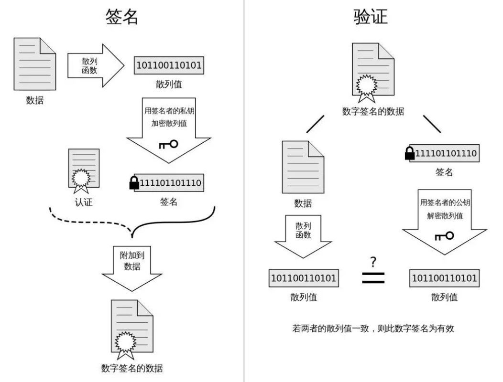</div>

​      

### 1.2 打包流程

整个Android的打包流程如下图所示： 

<div align="center">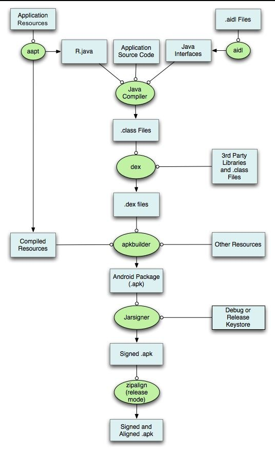</div>

​    

**编译打包步骤：**

1）**打包资源文件，生成 R.java 文件**

> 打包资源的工具是 `aapt`（The Android Asset Packaing Tool），在sdk的 build-tools 目录下；
>
> 打包过程，项目中的 `AndroidManifest.xml` 文件和布局文件XML都会编译，然后生成相应的 `R.java`，另外AndroidManifest.xml会被aapt编译成二进制。存放在APP的res目录下的资源，该类资源在APP打包前大多会被编译，变成二进制文件，并会为每个该类文件赋予一个resource id。对于该类资源的访问，应用层代码则是通过resource id进行访问的。Android应用在编译过程中aapt工具会对资源文件进行编译，并生成一个resource.arsc文件，resource.arsc文件相当于一个文件索引表，记录了很多跟资源相关的信息；

2）**处理aidl文件，生成相应的Java文件** 

> 使用的工具是 `aidl`（Android Interface Definition Language），即Android接口描述语言，在sdk的 build-tools 目录下；
>
> aidl工具解析接口定义文件，然后生成相应的Java代码接口供程序调用，如果在项目没有使用到aidl文件，则可以跳过这一步;

3）**编译项目源代码，生成class文件** 

> 项目中所有的Java代码，包括R.java和.aidl文件，都会变Java编译器（javac）编译成.class文件，生成的class文件位于工程中的bin/classes目录下;

4）**转换所有的class文件，生成classes.dex文件** 

> dex工具生成可供Android系统Dalvik虚拟机执行的classes.dex文件，在sdk的 build-tools 目录下；
>
> 任何第三方的 libraries 和 .class文件 都会被转换成.dex文件，dx工具的主要工作是将Java字节码转成成Dalvik字节码、压缩常量池、消除冗余信息等；

5）**打包生成APK文件** 

> 所有没有编译的资源，如 `images`、`assets` 目录下资源（该类文件是一些原始文件，APP打包时并不会对其进行编译，而是直接打包到APP中，对于这一类资源文件的访问，应用层代码需要通过文件名对其进行访问），同时 `编译过的资源` 和 `.dex文件` 都会被apkbuilder工具打包到最终的.apk文件中；
>
> 打包的工具apkbuilder位于 android-sdk/tools目录下。apkbuilder为一个脚本文件，实际调用的是sdk/tools/lib 文件中的 com.android.sdklib.build.ApkbuilderMain 类；

6）**对APK文件进行签名** 

> 一旦APK文件生成，它必须被签名才能被安装在设备上;
>
> 在开发过程中，主要用到的就是两种签名的 **keystore**
>
> * 一种是用于调试的debug.keystore，它主要用于调试，在Eclipse或者Android Studio中直接run以后跑在手机上的就是使用的debug.keystore
> * 另一种就是用于发布正式版本的keystore

7）**对签名后的APK文件进行对齐处理** 

> 如果你发布的apk是正式版的话，就必须对APK进行对齐处理，用到的工具是zipalign，该工具存储在sdk的 build-tools 目录下；
>
> 对齐的主要过程是 ***将APK包中所有的资源文件距离文件起始偏移为4字节整数倍***，这样通过内存映射访问apk文件时的速度会更快，对齐的作用就是减少运行时内存的使用。

从上图可以看到，签名发生在打包过程中的倒数第二步，而且签名针对的是已经存在的apk包，并不会影响我们写的代码。事实也确实是如此，Android的签名，大致的签名原理就是对未签名的apk里面的所有文件计算hash，然后保存起来 `MANIFEST.MF`，然后在对这些hash计算hash保存起来 `CERT.SF`，然后在计算hash，然后再通过上面生成的keystore里面的私钥进行加密并保存 `CERT.RSA`。

​      

### 1.3 签名方案

Android 应用的签名工具有两种：`jarsigner` 和 `apksigner`，它们的签名算法没什么区别，主要是签名使用的文件不同：

* **jarsigner**：jdk 自带的签名工具，可以对 jar 进行签名，使用 keystore 文件进行签名，且生成的签名文件默认使用 keystore 的别名命名；
* **apksigner**：Android sdk 提供的专门用于 Android 应用的签名工具，使用 pk8、x509.pem 文件进行签名，其中 pk8 是私钥文件，x509.pem 是含有公钥的文件，且生成的签名文件统一使用“CERT”命名；

​     

对应的签名方案如下：

* v1 方案：基于 JAR 签名，采用的签名工具为 jarsigner
* v2 方案：在 Android 7.0 引入，采用的签名工具为 apksigner
* v3 方案：在 Android 9.0 引入，采用的签名工具为 apksigner
* v4方案：v4 是在 Android 11 中引入的
* ... ...

其中，v1 到 v2 是颠覆性的，主要是为了解决 JAR 签名方案的安全性问题，而到了 v3 方案，其实结构上并没有太大的调整，可以理解为 v2 签名方案的升级版。

v1 到 v2 方案的升级，对开发者影响是最大的，就是渠道签署的问题。v2的签名也是为了让不同渠道、市场的安装包有所区别，携带渠道的唯一标识，也即是我们俗称的渠道包。好在各大厂都开源了自己的签渠道方案，例如：Walle（美团）、VasDolly（腾讯）都是非常优秀的方案。

   

#### 1）v1方案

v1 签名不保护 APK 的某些部分，例如 ZIP 元数据。APK 验证程序需要处理大量不可信（尚未经过验证）的数据结构，然后会舍弃不受签名保护的数据，这会导致相当大的受攻击面，其中V1签名完之后是META-INF 目录下的三个文件：`MANIFEST.MF`、`CERT.SF`、`CERT.RSA`。

完整的签名过程如下：

<div align="center">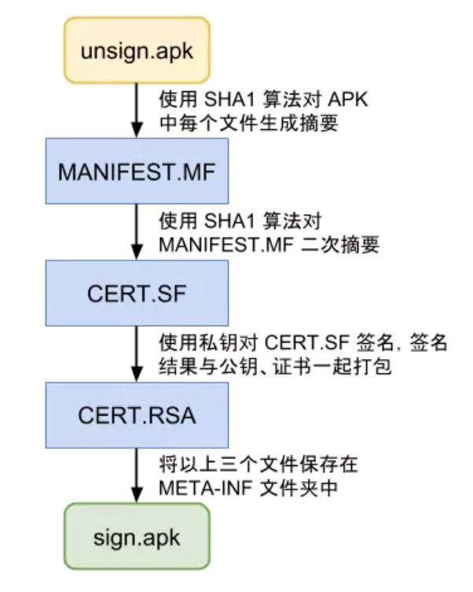</div>

签名验证是发生在 APK 的安装过程中，一共分为三步：

* 检查 APK 中包含的所有文件，对应的摘要值与 MANIFEST.MF 文件中记录的值一致；

- 使用证书文件（RSA 文件）检验签名文件（SF 文件）没有被修改过；
- 使用签名文件（SF 文件）检验 MF 文件没有被修改过；

<div align="center">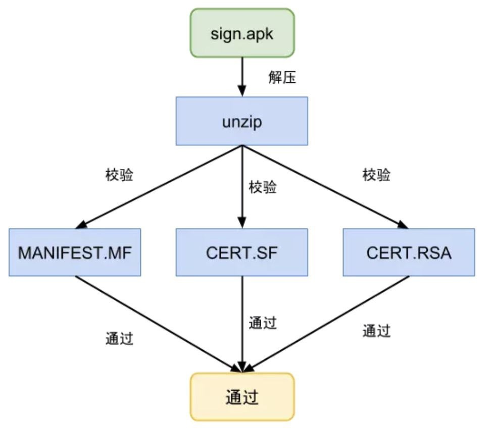</div>

​       

#### 2）v2方案

APK 签名方案 v2 是一种全文件签名方案，该方案能够发现对 APK 的受保护部分进行的所有更改，从而有助于加快验证速度并增强完整性保证。

其签名过程，就是把 APK 按照 1M 大小分割，分别计算这些分段的摘要，最后把这些分段的摘要在进行计算得到最终的摘要也就是 APK 的摘要。然后将 APK 的摘要 + 数字证书 + 其他属性生成签名数据写入到 APK Signing Block 区块。

<div align="center">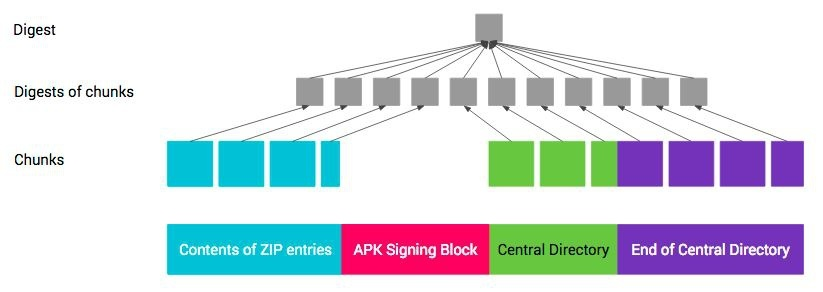</div>

签名校验过程：

<div align="center">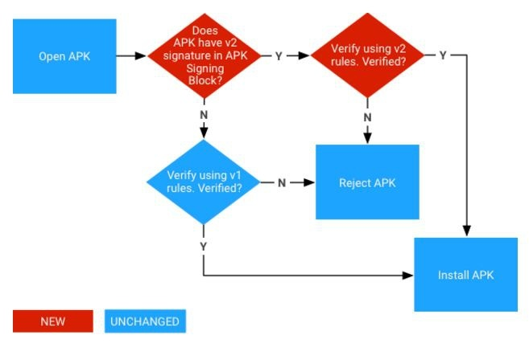</div>

其中， v2 签名机制是在 Android 7.0 以及以上版本才支持的。因此对于 Android 7.0 以及以上版本，在安装过程中，如果发现有 v2 签名块，则必须走 v2 签名机制，不能绕过，否则降级走 v1 签名机制。v1 和 v2 签名机制是可以同时存在的，其中对于 v1 和 v2 版本同时存在的时候，v1 版本的 META_INF 的 .SF 文件属性当中有一个 X-Android-APK-Signed 属性。

```java
X-Android-APK-Signed: 2
```

之前的渠道包生成方案是通过在 META-INF 目录下添加空文件，用空文件的名称来作为渠道的唯一标识。但在新的应用签名方案下 META-INF 已经被列入了保护区了，向 META-INF 添加空文件的方案会对区块 1、3、4 都会有影响。

​       

#### 3）v3方案

新版v3签名在v2的基础上，仍然采用检查整个压缩包的校验方式，不同的是在签名部分增可以添加新的证书（Attr块）。在这个新块中，会记录之前的签名信息以及新的签名信息，以密钥转轮的方案，来做签名的替换和升级。这意味着，只要旧签名证书在手，我们就可以通过它在新的 APK 文件中，更改签名。

v3 签名新增的新块（attr）存储了所有的签名信息，由更小的 Level 块，以链表的形式存储。其中每个节点都包含用于为之前版本的应用签名的签名证书，最旧的签名证书对应根节点，系统会让每个节点中的证书为列表中下一个证书签名，从而为每个新密钥提供证据来证明它应该像旧密钥一样可信。

签名校验过程：

> Android 的签名方案，无论怎么升级，都是要确保向下兼容。因此，在引入 v3 方案后，Android 9.0 及更高版本中，可以根据 APK 签名方案，v3 –  v2 –  v1 依次尝试验证 APK。而较旧的平台会忽略 v3 签名并尝试 v2 签名，最后才去验证 v1 签名。

<div align="center">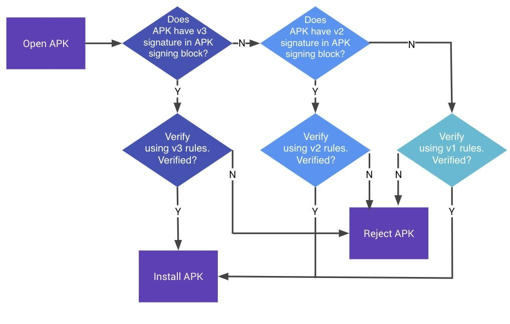</div>

​       

#### 4）v4方案

Android 11 通过 APK 签名方案 v4 支持与流式传输兼容的签名方案，其中v4 签名基于根据 APK 的所有字节计算得出的 Merkle 哈希树，完全遵循 fs-verity 哈希树的结构（例如，对salt进行零填充，以及对最后一个分块进行零填充），其次Android 11 将签名存储在单独的 .apk.idsig 文件中，且需要 v2 或 v3 签名作为补充。

<div align="center">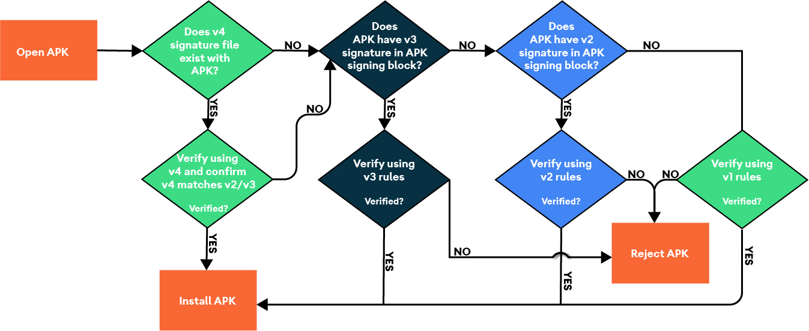</div>

需要注意的是，对于 **覆盖安装** 的情况，签名校验只支持升级，而不支持降级。也就是说设备上安装了一个使用 v1 签名的 APK，可以使用 v2 签名的 APK 进行覆盖安装，反之则不允许。

​        

### 1.4 签名步骤（工具）

#### 1）生成密钥文件

```shell
$ keytool -genkey -alias debug.keystore -keyalg RSA -validity 40000 -keystore debug.keystore

# 参数:
# 1）-genkey意味着执行的是生成数字证书操作，-v表示将生成证书的详细信息打印出来，显示在dos窗口中；
# 2）-alias debug.keystore 表示证书的别名为 “debug.keystore”，当然可以不和上面的文件名一样；
# 3）-keyalg RSA 表示生成密钥文件所采用的算法为RSA；
# 4）-validity 40000 表示该数字证书的有效期为40000天，意味着20000天之后该证书将失效
# 5）-keystore debug.keystore 表示生成的数字证书的文件名为“debug.keystore”, .keystore是证书的扩展名；

$ keytool -list -v -keystore 密钥库名
# -list 查看密钥列表
# -v    查看密钥详情
```

​     

#### 2）签名

执行顺序：

* Android 7.0以下：`v1签名` --> `zipalign对齐`
* Android 7.0及以上：`v1签名` --> `zipalign对齐` --> `v2签名`

**注意**：zipalign可以在V1签名后执行，但zipalign不能在V2签名后执行，只能在V2签名之前执行

​      

**v1签名**

```shell
$ jarsigner -keystore 密钥库名 xxx.apk 密钥别名

$ jarsigner -verbose -keystore APPkeystore.jks -storepass whytalent -signedjar out.apk in.apk alias_name
# -storepass 用于密钥库完整性的口令

# 从JDK7开始, jarsigner默认算法是SHA256, 但Android 4.2以下不支持该算法,所以需要修改算法, 添加参数-digestalg SHA1 -sigalg SHA1withRSA

$ jarsigner -keystore 密钥库名 -digestalg SHA1 -sigalg SHA1withRSA xxx.apk 密钥别名
# -digestalg  摘要算法
# -sigalg     签名算法
```

​    

**zipalign对齐**

zipalign是对zip包对齐的工具，使APK包内未压缩的数据有序排列对齐，从而减少APP运行时内存消耗

```shell
# 4字节对齐优化
$ zipalign -v 4 in.apk out.apk

# 检查APK是否对齐
$ zipalign -c -v 4 in.apk
```

​     

**v2签名**

```shell
$ apksigner sign --ks 密钥库名 --ks-key-alias 密钥别名 xxx.apk

# 若密钥库中有多个密钥对,则必须指定密钥别名
$ apksigner sign --ks 密钥库名 --ks-key-alias 密钥别名 xxx.apk

# 禁用V2签名
$ apksigner sign --v2-signing-enabled false --ks 密钥库名 xxx.apk

$ java -jar apksigner.jar sign --ks APPkeystore.jks --ks-key-alias alias_name --ks-pass pass:pswd --key-pass pass:aliaspswd --out output.apk in.apk


# --ks-key-alias       密钥别名,若密钥库有一个密钥对,则可省略,反之必选
# --v1-signing-enabled 是否开启V1签名,默认开启
# --v2-signing-enabled 是否开启V2签名,默认开启
# --v3-signing-enabled 是否开启V3签名,默认开启
# --ks-pass						 pass:**(keystore密码)
# --key-pass 					 pass:**(alias密码)
```

​     

#### 3）签名验证

`keytool`：只支持V1签名校验

```shell
$ keytool -printcert -jarfile xxx.apk (显示签名证书信息)

参数:
    -printcert           打印证书内容
    -jarfile <filename>  已签名的jar文件 或apk文件   
```

`apksigner`：支持V1和V2签名校验

```shell
$ apksigner verify -v --print-certs xxx.apk
$ java -jar apksigner.jar verify --verbose --print-certs xxx.apk

参数:
    -v, --verbose 显示详情(显示是否使用V1和V2签名)
    --print-certs 显示签名证书信息
```


**注意**：使用的签名版本还跟apk编译时使用的最低SDK版本有关，即min-sdk-version的值，如果设置的值大于等于26，即使添加 --v1-signing-enabled true 也无法通过上述步骤签V1版本的签名，仅有V2签名（Android Studio也是）。因此，可以对最后生成的apk通过执行如下命令尝试

```shell
$ java -jar apksigner.jar sign --ks xxx.jks --ks-key-alias alias_name --min-sdk-version 21 --max-sdk-version 30 --v1-signing-enabled true --v2-signing-enabled false --v3-signing-enabled false --out out.apk in.apk
```

​     

### 1.5 反编译&编译

#### 1）apk 包

[Apktool](https://ibotpeaches.github.io/Apktool/) 是一个反编译Android Apk的第三方工具，可以反编译资源，并在进行修改之后重新打包Apk。

```shell
# 反编译apk
$ apktool d[ecode] [options] <file_apk>
$ apktool d -f -s -o extractfolder/ in.apk

参数:
    -f, –force, 覆盖之前的文件
    -o, –output, 输出路径(dir)
    -p, –frame-path, 指定 framework 文件路径（dir）
    -r, –no-res, 不解释 resources 资源
    -s, –no-src, 不把dex 解释成smail
    -t, –frame-tag, framework 标签
```

```shell
# 回编译apk
$ apktool b[uild] [options] <app_path>
$ apktool b -f -o out.apk extractfolder/

参数:
    -f, –force-all, 覆盖之前的文件
    -o, –output, 输出路径(dir)
    -p, –frame-path, 指定 framework 文件路径(dir)
```

​      

#### 2）smali & dex文件

[smali/baksmali ](https://link.juejin.cn/?target=https%3A%2F%2Fgithub.com%2FJesusFreke%2Fsmali)是Android的Java VM实现dalvik使用的dex格式的汇编程序/反汇编程序，语法基于Jasmin/ dedexer的语法，并支持dex格式的全部功能。

1）**[baksmali](https://bitbucket.org/JesusFreke/smali/downloads/) 反编译输出smail文件 **

即在指定目录下, 将 .dex 文件反编译输出 .smail 文件

```shell
# baksmali disassemble [<options>] <file>
$ java -jar baksmali-2.5.2.jar disassemble -o ./decompile ./dex/classes.dex

# smail文件详情: https://juejin.cn/post/6844903800289886216
```

2）**[smali](https://bitbucket.org/JesusFreke/smali/downloads/) 重新编译输出 .dex 文件 **

即在指定目录下将注入so加载逻辑的 .smail 文件重新编译生成新 .dex 文件

```shell
# smali assemble [<options>] [<file>|<dir>]+
$ java -jar smali-2.5.2.jar assemble -o ./dex/classes.dex ./decompile

# smail文件详情: https://juejin.cn/post/6844903800289886216
```

​      

# 二、frida-server 

​       

## 1、Android

电脑 USB 连接安卓手机，针对设备是否 root 采用不同的方式

### 1.1 root设备

>**1）**查看手机型号，下载系统对应版本的 [frida-server](https://github.com/frida/frida/releases)
>
>```shell
>$ adb shell getprop ro.product.cpu.abi
>```
>
>注意：Frida-server的版本必须跟宿主机的Frida版本一致，比如宿主机Frida的版本是10.6.52，Android手机是arm64的，那么应该下载：rida-server-10.6.52-android-arm64.xz 文件。
>
>**2）**下载后解压文件，并将文件重命名为: `frida-server`, 重命名完成后使用`adb push`命令推送到手机中
>
>```shell
>$ adb root # might be required
>$ adb push frida-server /data/lcoal/tmp
>```
>
>**3）**推送完成后将frida-sever赋予执行的权限，并运行Frida-server，使用以下命令：
>
>```shell
>$ adb shell "chmod 755 /data/local/tmp/frida-server"
>$ adb shell "/data/local/tmp/frida-server &"
>```
>
>**注1**： 如果frida-server没有启动，查看一下你是否使用的是Root用户来启动，如果使用Root用户则应该是`#`，
>
>**注2**： 如果要启动frida-server作为后台进程、可以使用这个命令`./frida-server &`
>
>**4）**正常启动后，另开一个终端，使用 `frida-ps -U` 命令检查Frida是否正常运行，如果正常运行则会列出Android设备上当前正在运行的进程。
>
>参数-U 代表USB，意思让Frida检查USB设备，使用`frida-ps -R` 也可以，但是需要进行转发，执行 `adb forward tcp:27042 tcp:27042` 修改端口号，后执行`frida-ps -R`也可以看到手机上的进程。
>
>```shell
># 进行端口转发监听
>$ adb forward tcp:27042 tcp:27042
>$ adb forward tcp:27043 tcp:27043
>
># 注：27042 用于与frida-server通信的默认端口号, 之后的每个端口对应每个注入的进程，检查27042端口可检测 Frida 是否存在
>```

​       

### 1.2 非root设备

> 1）**反编译 apk**，反编译之后生成 target_app_floder 文件夹
>
> ```shell
> $ apktool d target_app.apk -o target_app_floder
> ```
>
> 2）**下载系统对应版本的 [frida-gadget](https://github.com/frida/frida/releases)**，解压并放到指定位置
>
> 下载之后将其进行解压，然后放到 `target_app_floder//lib/armeabi/libfrida-gadget.so`，注意修改名字以 `lib` 开头 `.so` 结尾，对应下一步的代码中的`frida-gadger`
>
> > **注**：测试设备是 `arm64-v8a`，所以下载 [**frida-gadget-12.2.27-android-arm64.so.xz**](https://github.com/frida/frida/releases/download/12.2.27/frida-gadget-12.2.27-android-arm64.so.xz)，但最后回编译打包之后，运行总是奔溃，不断的尝试之后才发现使用 [**frida-gadget-12.2.27-android-arm.so.xz**](https://github.com/frida/frida/releases/download/12.2.27/frida-gadget-12.2.27-android-arm.so.xz) 可以正常运行
>
> 3）**代码中加载上一步so 文件，建议在应用的入口文件中执行**
>
> 根据 AndroidManifest.xml 文件找到程序的入口文件，例如 MainActivity，在反编译生成的代码 smali 中的 onCreate 方法中注入如下代码
>
> ```java
> const-string v0, "frida-gadget"
> invoke-static {v0}, Ljava/lang/System;>loadLibrary(Ljava/lang/String;)V
> ```
>
> 4）**检查AndroidManifest.xml清单文件的网络权限**，忌重复添加，会导致回编译包出错
>
> ```java
> <uses-permission android:name="android.permission.INTERNET" />
> ```
>
> 5）**回编译 apk**
>
> > a. 重新打包
> >
> > ```shell
> > $ apktool b -o repackage.apk target_app_floder
> > ```
> >
> > b. 创建签名文件，有的话可忽略此步骤
> >
> > ```shell
> > $ keytool -genkey -v -keystore mykey.keystore -alias mykeyaliasname -keyalg RSA -keysize 2048 -validity 10000
> > ```
> >
> > c. 签名，以下任选其一
> >
> > ```shell
> > # jarsigner 方式
> > $ jarsigner -sigalg SHA256withRSA -digestalg SHA1 -keystore mykey.keystore -storepass 你的密码 repackaged.apk mykeyaliasname
> > 
> > # apksigner 方式: 如需要禁用 v2签名 添加选项--v2-signing-enabled false
> > $ apksigner sign --ks mykey.keystore --ks-key-alias mykeyaliasname repackaged.apk
> > ```
> >
> > d. 验证，以下任选其一
> >
> > ```shell
> > # jarsigner方式
> > $ jarsigner -verify repackaged.apk
> > 
> > # apksigner 方式
> > $ apksigner verify -v --print-certs repackaged.apk
> > 
> > # keytool方式
> > $ keytool -printcert -jarfile repackaged.apk
> > ```
> >
> > e. 对齐
> >
> > ```shell
> > # 4字节对齐优化
> > $ zipalign -v 4 repackaged.apk final.apk
> > 
> > # 检查是否对齐
> > $ zipalign -c -v 4 final.apk
> > 
> > # zipalign可以在V1签名后执行, 但zipalign不能在V2签名后执行, 只能在V2签名之前执行
> > ```
>
> 6）**安装 apk**
>
> ```shell
> $ adb install final.apk
> ```
>
> 7）**检查是否成功**
>
> 打开运行 final.apk，在注入代码位置进入停止等待页面

另一种非 root 方式：https://bbs.pediy.com/thread-229970.htm

​             

## 2、 iOS

在iOS设备上，Frida支持两种使用模式，具体使用哪种模式要看你的iOS设备是否已经越狱

### 2.1 已越狱设备

越狱机上使用Cydia工具配置Frida

> 1）启动 Cydia
>
> 2）添加软件源：manage -> 软件源 Sources-> 编辑 Edit（左上角）-> 添加 Add（右上角）-> 输入 https://build.frida.re/
>
> 3）通过刚才添加的软件源安装 frida 插件，注意需要根据手机进行安装：iPhone 5 及之前的机器为 32 位，5s 及之后的机器为 64 位，进入 变更 -> 找到Frida -> 进入Frida 在右上角点击安装

​    

### 2.2 未越狱设备

frida-server在运行时需要root环境，但如果没有越狱的设备，依然可以使用frida，只需要重打包ipa文件，将frida运行库注入ipa文件中，app在启动时会自动加载frida运行库，即可实现在非越狱的设备上使用Frida。

因此，为了让一个App能使用Frida，必须想办法让它加载一个 **.dylib**，就是一个 **Gadget** 模块，因此需要配置一下 **xcode** 的编译配置来让你的App可以集成Frida。当然也可以使用相关的工具来修改一个已经编译好的App， 比如 **insert_dylib** 这样的工具。

... ...

​      

### 2.3 模拟器

在模拟器中进行测试，需要把命令行中的 **-U** 替换成 **-R**，这样一来底层的内部调用也从 **get_usb_device()** 变成 **get_remote_device()**

... ...

​      

# 二、frida-gadget 注入

frida-gadget的持久化，通俗理解也就是注入frida-gadget，让目标app加载该so文件，进而实现frida的hook功能，并且和app共生，一定程度上也免去了反调试，反frida（修改so名字，从maps看检测风险减小，或许从hook原理继续检测？先不说find_mem_string检测）的情况。

​     

## 1、Android

​      

### 1.1 root环境

**方式一**：

> **操作**：通过修改程序加载动态库而实现HOOK，即如果目标app有使用so，利用 lief工具 把frida-gadget和目标app的so链接到一起，实现加载和hook（如：从/data/app/packageName-xxx/lib下，找到app的so然后和frida-gadget进行链接）
>
> ```python
> # pip install lief
> # 存在so的情况下, 可以修改其导入的so文件
> for soname in injectsolist: # 遍历apk中指定SO有哪几种架构，并添加 gadget.so 为依赖库
>     if soname.find("x86") != -1:
>         continue
>     so = lief.parse(os.getcwd() + "\\" + soname)
>     so.add_library("libfrida-gadget.so")
>     so.write(soname + "gadget.so")
> 
> # 可参考LIEFInjectFrida.py: https://github.com/nszdhd1/UtilScript
> ```
>
> **风险点**：需要过root检测，so文件完整性检测（如：目标app可扫描/data/app/packageName-xxx/lib目录下所有文件，和文件md5上传服务器做校验）
>
> **详情**：
>
> * [[翻译]在未root的设备上使用frida](https://bbs.pediy.com/thread-229970.htm)
> * [非root环境下frida的两种使用方式](https://nszdhd1.github.io/2021/06/15/%E9%9D%9Eroot%E7%8E%AF%E5%A2%83%E4%B8%8Bfrida%E7%9A%84%E4%B8%A4%E7%A7%8D%E4%BD%BF%E7%94%A8%E6%96%B9%E5%BC%8F/)
> * [基于Android9的非Root环境下Frida持久化](http://www.zhuoyue360.com/crack/78.html)

​       

**方式二**：

> **操作**：利用lief工具把frida-gadget和系统库（如libart，libc）链接到一起，实现加载和hook
>
> ```python
> # pip install lief
> # 在没有so的情况下，通常是修改apk的入口文件，也就是修改smali代码, 即通过调用System.loadLibrary来加载so。但在这种方法的情况下，则需要考虑 重打包检测（签名检测，文件完整性检测）的情况。但是有一个弊端就是时机不够靠前，没有办法hook Activity 启动之前的代码。
> 
> # 可参考 SmaliInjectFrida.py: https://github.com/nszdhd1/UtilScript
> ```
>
> **风险点**：需要过root检测
>
> **详情**：
>
> * [非root环境下frida的两种使用方式](https://nszdhd1.github.io/2021/06/15/%E9%9D%9Eroot%E7%8E%AF%E5%A2%83%E4%B8%8Bfrida%E7%9A%84%E4%B8%A4%E7%A7%8D%E4%BD%BF%E7%94%A8%E6%96%B9%E5%BC%8F/)

​    

**方式三**：

> **操作**：magisk模块方案注入frida-gadget，实现加载和hook
>
> **风险点**：需要过root检测，magisk检测
>
> **详情**：
>
> * [[原创]Frida持久化方案(Xcube)之方案三——基于Magisk和gadget](https://bbs.pediy.com/thread-268896.htm)

   

**方式四**：

> **操作**：xposed模块方案注入frida-gadget，实现加载和hook
>
> **风险点**：需要过root检测，xposed检测
>
> **详情**：
>
> * [[原创]Frida持久化方案(Xcube)之方案二——基于xposed](https://bbs.pediy.com/thread-266784.htm)

​       

### 1.2 非root环境

​     

#### 1）smail文件（无so文件）

**基本原理**：方案适用于目标app没有使用so，即将frida-gadget.so放到反编译后的apk so目录下，并修改反编译后的smali文件，插入 `System.loadLibrary("frida-gadget")` 对应的smali代码，从而实现frida的加载。但是有一个弊端就是hook时机不够靠前，没有办法hook Activity 启动之前的代码。

​       

**什么是smail文件？**

> **Smali是Android虚拟机的反汇编语言**
>
> 通常，Android代码一般是用java编写的，执行java程序一般需要用到java虚拟机，在Android平台上也不例外，但是出于性能上的考虑，并没有使用标准的JVM，而是使用专门的Android虚拟机（5.0以下为Dalvik，5.0以上为ART）。Android虚拟机的可执行文件并不是普通的 `class文件`，而是再重新整合打包后生成的`dex文件`。dex文件反编译之后就是 `Smali代码` ，所以说Smali语言是Android虚拟机的反汇编语言。
>
> **classes.dex** 是apk的核心文件，其运行在安卓Dalvik虚拟机上。通过查看apk的编译生成过程，可知Java源代码首先被编译成.class文件，然后Android SDK自带的dx工具会将这些 .class 文件转换成 classes.dex。所以只需要想办法反编译classes.dex 即可得到java源代码，即可运用安卓反编译工具dex2jar可将dex文件反编译成.jar文件，然后运用jd-gui工具即可查看反编译后得到的源代码。
>
> <div align="center">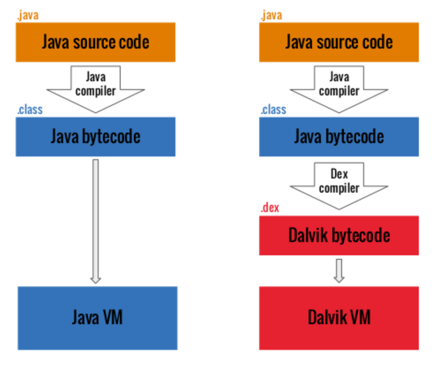</div>
>
> [Android逆向基础：Smali语法](https://www.jianshu.com/p/9931a1e77066)
>
> [android 逆向应该了解的 smali](https://bbs.huaweicloud.com/blogs/313973)

​     

**步骤详情**：

> a. **APK包文件**
>
> 包括 dex文件 / 第三方lib库等
>
> <div align="center">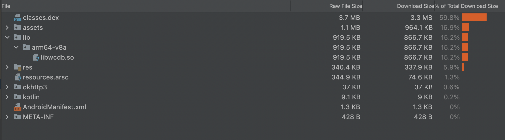</div>
>
> b. **AAPT解析APK获取启动activity页面**
>
> > PS ：[AAPT2](https://developer.android.com/studio/command-line/aapt2#download_aapt2)（Android 资源打包工具）是一种构建工具，Android Studio 和 Android Gradle 插件使用它来编译和打包应用的[资源](https://developer.android.com/guide/topics/resources/providing-resources)，AAPT2 会解析资源、为资源编制索引，并将资源编译为针对 Android 平台进行过优化的二进制格式
>
> ```shell
> # aapt 解析apk包, 获取APP启动activity页面
> aapt dump badging app-debug.apk | grep "launchable-activity"
> 
> # launchable-activity: name='com.whytalent.luna.demo.MainActivity'  label='' icon=''
> ```
>
> b. **[baksmali](https://bitbucket.org/JesusFreke/smali/downloads/) 反编译输出smail文件 **
>
> 即在指定目录下, 将 .dex 文件反编译输出 .smail 文件
>
> ```shell
> # baksmali disassemble [<options>] <file>
> java -jar baksmali-2.5.2.jar disassemble -o ./decompile ./dex/classes.dex
> 
> # smail文件详情: https://juejin.cn/post/6844903800289886216
> ```
>
> c. **smail文件注入 [FridaGadget.so](https://github.com/frida/frida/releases) 加载逻辑**
>
> 在launchable-activity页面对应的smail文件内注入加载 Frida-gadget.go 逻辑，即在类构造器方法clinit中执行 System.loadLibrary("frida-gadget.so")
>
> ```java
> // Smali代码, 相当于java代码 System.loadLibrary("FridaGadget")
> 
> // 1）若存在clinit方法, 直接写入
> const-string v0, "FridaGadget"
> invoke-static {v0}, Ljava/lang/System;->loadLibrary(Ljava/lang/String;)V
> ```
>
> ```java
> // 2）若不存在clinit方法, 直接创建一个clinit方法, 直接加载
> .method static constructor <clinit>()V
> 	.registers 1
> 	.line 10
> 	const-string v0, "FridaGadget"
> 	invoke-static {v0}, Ljava/lang/System;->loadLibrary(Ljava/lang/String;)V
> 	return-void
> .end method
> ```
>
> 如果apk没有网络权限需要在配置清单中加入如下权限申明
>
> ```xml
> <uses-permission android:name="android.permission.INTERNET" />
> ```
>
> > **注意**：[init和clinit区别](https://blog.csdn.net/u013309870/article/details/72975536)
> >
> > * `init和clinit方法执行时机不同`：init是对象构造器方法，也就是说在程序执行 new 一个对象调用该对象类的 constructor 方法时才会执行init方法，而clinit是类构造器方法，也就是在jvm进行类 加载—–验证—-解析—–初始化，中的初始化阶段jvm会调用clinit方法
> > * `init和clinit方法执行目的不同`：init是instance实例构造器，对非静态变量解析初始化，而clinit是class类构造器对静态变量，静态代码块进行初始化
>
> d. **[smali](https://bitbucket.org/JesusFreke/smali/downloads/) 重新编译输出 .dex 文件 **
>
> 即在指定目录下将注入so加载逻辑的 .smail 文件重新编译生成新 .dex 文件
>
> ```shell
> # smali assemble [<options>] [<file>|<dir>]+
> java -jar smali-2.5.2.jar assemble -o ./dex/classes.dex ./decompile
> 
> # smail文件详情: https://juejin.cn/post/6844903800289886216
> ```
>
> e. **写入 frida-gadget.so 和 新dex文件输出新apk文件**
>
> 即将上述注入so文件加载逻辑的dex 和 第三方so资源文件写入新apk文件
>
> ```python
> # 读取原始apk文件
> with zipfile.ZipFile(self.apkpath, 'r') as orig_file:
>   # 写入新apk文件
>   with zipfile.ZipFile(outapk, 'w') as out_file:
>     # infolist 返回一个列表，其中包含每个归档成员的 ZipInfo 对象
>     for item in orig_file.infolist():
>       # 跳过 classes.dex 文件, 后续重新写入
>       if item.filename.startswith("classes") and item.filename.endswith(".dex"):
>         continue
> 
>         if item.filename.find("META-INF") == -1:
>           out_file.writestr(item, orig_file.read(item.filename))
> 
>           # 1. 新apk写入已注入so加载逻辑的dex文件
>           for dex in self.dexList:
>             out_file.write(dex, os.path.split(dex)[1])
> 
>             # 2. apk中注入frida-gadget.so文件
>             print("add lib/arm64-v8a/libfrida-gadget.so")
>             out_file.write(os.path.join(self.toolPath, "frida-gadget-16.0.2-android-arm64.so"),
>                            arcname="lib/arm64-v8a/libfrida-gadget.so")
> ```
>
> f. **hook脚本持久化**
>
> 在新apk文件内写入frida持久化配置文件, 即将js脚本推送至设备指定目录（eg：/data/local/tmp/hook.js）
>
> ```python
> # 遍历apk文件
> with zipfile.ZipFile(apk_path, 'a') as apk_file:
>   for item in apk_file.infolist():
>       if item.filename == "lib/arm64-v8a/libfrida-gadget.so":
>         print("add lib/arm64-v8a/libfrida-gadget.config.so")
>         apk_file.write(os.path.join(self.toolPath, "libfrida-gadget.config.so"),
>                        arcname="lib/arm64-v8a/libfrida-gadget.config.so")
> ```
>
> ```javascript
> // frida-gadget.config.so 文件
> // 详情: https://blog.csdn.net/helloworlddm/article/details/105129705
> {
>   "interaction": {
>     "type": "script",
>     "path": "/data/local/tmp/frida_script.js", // 执行程序入口前从文件系统中加载脚步
>     "on_change":"reload"
>   }
> }
> ```
>
> > 注：重新编辑后新apk文件：
> >
> > <div align="center">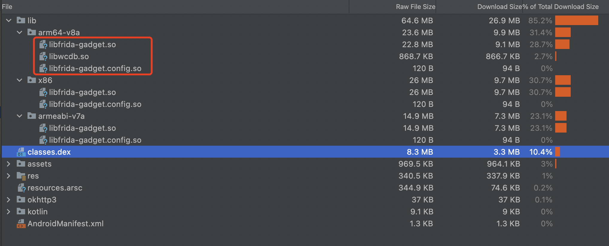</div>
> >
> > 但adb install安装时，提示 INSTALL_PARSE_FAILED_NO_CERTIFICATES 签名失败
> >
> > ```shell
> > adb: failed to install build/outputs/apk/debug/app-debug_frida.apk: Failure [INSTALL_PARSE_FAILED_NO_CERTIFICATES: Failed collecting certificates for /data/app/vmdl827904681.tmp/base.apk: Failed to collect certificates from /data/app/vmdl827904681.tmp/base.apk: Attempt to get length of null array]
> > ```
> >
> > 因此，需要对apk进行重签名
>
> g. **apk重签名**
>
> ```shell
> # 生成 keystore 文件
> $ keytool -genkey -alias debug.keystore -keyalg RSA -validity 20000 -keystore debug.keystore
> 
> # step1: v1签名
> $ jarsigner -keystore debug.keystore -storepass "pswd" -signedjar out.apk in.apk alias_name
> 
> # step2: zipalign对齐
> $ zipalign -v 4 in.apk out.apk
> 
> # step3: v2 签名
> $ java -jar apksigner.jar sign --ks debug.keystore --ks-key-alias "alias_name" --ks-pass pass:"pwd" --key-pass pass:"alias_pwd" --out out.apk in.apk
> 
> # 验证签名包是否成功
> $ apksigner verify -v --print-certs repackaged.apk
> ```
>
> **注意：**
>
> > 1）**数字证书不一致问题**：若原始APK打包使用的数字证书与APK重签名时采用证书不一致时，adb install 安装重签名apk包会提示以下异常
> >
> > ```shell
> > adb: failed to install output/app-debug_frida_signed.apk: Failure [INSTALL_FAILED_USER_RESTRICTED: Invalid apk]
> > ```
> >
> > 2）**APK签名认证问题**：因为APK 没有签名，或者项目的最低SDK版本低于24（minSdk < 24），但是签名时只使用了 v2 方案
> >
> > ```shell
> > DOES NOT VERIFY
> > ERROR: Missing META-INF/MANIFEST.MF
> > ```

**风险点**：重打包检测（签名检测，文件完整性检测）

**详情**：

* [非root环境下frida的两种使用方式](https://nszdhd1.github.io/2021/06/15/%E9%9D%9Eroot%E7%8E%AF%E5%A2%83%E4%B8%8Bfrida%E7%9A%84%E4%B8%A4%E7%A7%8D%E4%BD%BF%E7%94%A8%E6%96%B9%E5%BC%8F/)

​           

#### 2）so链接（lief工具）

**基本原理**： 利用LIEF工具将frida-gadget.so与原Apk中的某个so文件链接起来，使得加载原so时，同时也加载了frida-gadget.so文件，从而实现Frida工具

方案缺点：

* 需要向APK里添加文件
* 需要程序有至少一个native库
* 注入进去的库的加载顺序不能控制

​     

**步骤详情：**

> a. **apk注入加载so逻辑**
>
> 即APK包内寻找指定so名称（第一个启动的so文件）, 然后通过 lief 工具把frida-gadget和目标app的so链接
>
> ```python
> # 遍历apk文件
> with zipfile.ZipFile(apkpath, 'r') as apk_file:
>   for item in apk_file.infolist():
>     # 确认apk内包含指定so文件
>     if item.filename.find("libTarget.so") != -1:
>       # 将ZIP文件中的某个成员解压到当前目录, 文件名必须是完整名，dexPathpath是指定的解压目录
>       # 解压的过程不会破坏原压缩文件
>       apk_file.extract(item.filename)
>       injectsolist.append(item.filename)
> 
> # 遍历apk中指定SO有哪几种架构，并添加 gadget.so 为依赖库
> for soname in injectsolist:
>   # x86有一点问题，且不支持x86_64
>   if soname.find("x86") != -1:
>     continue
> 
>     # 返回值是一个指向LIEF::Binary对象的指针
>     so = lief.parse(os.getcwd() + "/" + soname)
>     # 注入frida-gadget.so文件
>     so.add_library("libFG.so")
>     # 重建写入新文件
>     so.write(soname + "gadget.so")
> ```
>
> b. **覆写so文件 和 注入frida-gadget.so 输出新apk**
>
> 即将上述注入so文件加载逻辑的新 so文件 和 第三方so资源文件写入新apk文件
>
> ```python
> # 读取原始apk文件
> with zipfile.ZipFile(self.apkpath, 'r') as orig_file:
>   # 写入新apk文件
>   with zipfile.ZipFile(outapk, 'w') as out_file:
>     for item in orig_file.infolist():
>       # 过滤指定so名称的文件路径
>       if item.filename.find(self.soname) != -1 and os.path.exists(
>         os.getcwd() + "/" + item.filename + "gadget.so"):
> 
>         # 覆写so文件
>         out_file.write(os.getcwd() + "/" + item.filename + "gadget.so", arcname=item.filename)
> 				
>         # apk包内写入 frida-gadget.so文件
>         if item.filename.find("lib/armeabi-v7a") != -1:
>           out_file.write(os.path.join(self.toolPath, "frida-gadget-16.0.2-android-arm.so"),
>                          arcname="lib/armeabi-v7a/libFG.so")
>           print("add lib/armeabi-v7a/libFG.so")
> ```
>
> c.  **apk重签名**
>
> 同smail注入方式

**风险点**：重打包检测（签名检测，文件完整性检测）

**详情**：

* [[翻译]在未root的设备上使用frida](https://bbs.pediy.com/thread-229970.htm)
* [非root环境下frida的两种使用方式](https://nszdhd1.github.io/2021/06/15/%E9%9D%9Eroot%E7%8E%AF%E5%A2%83%E4%B8%8Bfrida%E7%9A%84%E4%B8%A4%E7%A7%8D%E4%BD%BF%E7%94%A8%E6%96%B9%E5%BC%8F/)

​       

#### 3）一键注入 Objection

**基本原理**：与smail文件注入类似，也是使用 Apktool 反编译apk，然后植入代码，只是它将这个流程封装成一个工具，使用起来更方便。

```shell
# 使用objection自动完成frida gadget注入到apk中
$ objection patchapk -s yourapp.apk
```

​      

[Objection](https://github.com/sensepost/objection) 是基于frida的命令行hook工具，能强大，命令众多，而且不用写一行代码，便可实现诸如内存搜索、类和模块搜索、方法`hook`打印参数返回值调用栈等常用功能，是一个非常方便的，逆向必备、内存漫游神器。其启动方式和常用操作指令如下：

> a）**启动方式**
>
> ```shell
> # 启动objection, 如果objection没有找到进程，会以spwan方式启动进程
> $ objection -g package_name explore
> 
> # Obejction采用Attach附加模式进行Hook，这可能会错过较早的Hook时机，可以通过如下的代码启动Objection，引号中的objection命令会在启动时就注入App
> $ objection -g packageName explore --startup-command "android hooking watch class '包名.类名'"
> $ objection -g packageName explore --startup-command "android hooking watch class_method '包名.类名.方法' --dump-args --dump-return --dump-backtrace"
> ```
>
> b）**常用操作指令**
>
> ```shell
> # 1) Memory 指令
> $ memory list modules # 查看当前程序调用的所有so（查看内存中加载的库）
> $ memory list modules --json test.json # 查看到其所有so 并保存位json （终端所在目录）
> $ memory list exports [lib_name]  # 查看指定模块的导出函数
> $ memory list exports [lib_name] --json libart.json # 将结果保存到json文件中
> $ memory search "Authorization-QS" --string --offsets-only # 内存搜索, 即想要在内存里面找和这个Authorization-QS相关的内存的偏移地址
> 
> # 2) Android Heap 指令
> $ android heap search instances com.xx.xx.class # 堆内存中搜索指定类的实例, 可以获取该类的实例id
> $ android heap execute [ins_id] [func_name]  # 直接调用指定实例下的方法
> $ android heap execute [ins_id]  # 自定义frida脚本, 执行实例的方法
> 
> # 3) 内存漫游
> $ android hooking search classes [search_name]  # 在内存中所有已加载的类中搜索包含特定关键词的类
> $ android hooking search methods [search_name]  # 在内存中所有已加载的方法中搜索包含特定关键词的方法
> $ android hooking generate simple [class_name]  # 辅助直接生成hook代码, 可以注入js或者frida使用
> $ android hooking list classes # 列出内存中所有的类classes
> $ android hooking list class_methods sun.util.locale.LanguageTag # 打印方法体
> 
> # 4) hook 方式
> $ android hooking watch class 包名.类名  # hook类的所有方法
> $ android hooking watch class_method 包名.类名.方法 "参数1,参数2"  # 如果只需hook其中一个重载函数, 指定参数类型, 多个参数用逗号分隔
> $ android hooking watch class_method 包名.类名.方法 --dump-args --dump-backtrace --dump-return #快速hook, 默认会Hook方法的所有重载
> # --dump-args : 打印参数
> # --dump-backtrace : 打印调用栈
> # --dump-return : 打印返回值
> $ android hooking set return_value com.xxx.xxx.methodName false  # 设置返回值(只支持bool类型)
> 
> # 5) activity 和 service 操作
> $ android hooking list activities # 打印所有 activities （页面）
> $ android intent launch_activity [activity_class] # 强行启动指定activities 可以强行启懂页面
> $ android hooking list services   # 枚举services
> $ android intent launch_service [services_class] # 启动services
> 
> # 6) 任务管理器
> $ jobs list   # 查看 hook 任务列表
> $ jobs kill [job ID]  # 杀死任务
> 
> # 7) android 指令
> $ android root disable   # 尝试关闭app的root检测
> $ android root simulate  # 尝试模拟root环境
> $ android ui screenshot [image.png]    # 截图
> $ android ui FLAG_SECURE false         # 设置FLAG_SECURE权限
> 
> # 8) 监控系统剪贴板
> # 获取Android剪贴板服务上的句柄并每5秒轮询一次用于数据; 如果发现新数据，与之前的调查不同，则该数据将被转储到屏幕上
> $ help android  clipboard
> 
> # 9) 监控系统剪贴板
> $ help android shell_exec [command]
> 
> # 10）其它指令
> $ frida-ps -U |grep xxx # 筛选过滤
> $ file download [file] [outfile] # 从远程文件系统中下载文件
> ```

​       

Objection注入报错

> 现象：frida.core.RPCException: Error: expected a pointer
>
> 说明：
>
> 1）`双进程保护`：
>
> * 采用双进程的方式，对父进程进行保护，基于信号的发送和接收，实现相互的保护防止被动态攻击；
> * 简单的双进程保护，就是从原进程再fork一个空进程出来，让逆向分析的时候附加到空进程中导致hook不上；
> * 双进程进程保护主要功能： 
>   * A. 保护父进程，ptrace所有线程，防止被附加、调试、暂停； 
>   * B. 保护子进程，防止被暂停、异常退出
>
> 2）frida hook有两种模式：
>
> * `attach模式`：attach到已经存在的进程，核心原理是ptrace修改进程内存。如果此时进程已经处于调试状态（比如做了反调试），则会attach失败；
> * `spawn模式`：启动一个新的进程并挂起，在启动的同时注入frida代码，适用于在进程启动前的一些hook，比如hook RegisterNative函数，注入完成后再调用resume恢复进程；
>
> frida附加的顺序：`spawn` -> `resume` -> `attach`
>
> objection附加的顺序：`spawn` -> `attach` -> `resume`
>
> 从而可以看出，objection注入失败应该是因为objection通过spawn启动app之后attach时机比较快，然后app又正在复制进程，所以app卡死了，objection也卡死了。

​         

#### 4）xpatch

**基本原理**：既然Xpatch可以实现免Root加载Xposed插件，那么Xpatch应该也可以实现免Root使用Frida。方法其实也比较简单，只需编写一个专门用于加载frida-gadget.so文件的 **Xposed插件**，然后使用Xpatch处理原Apk文件并安装，最后让经Xpatch处理后的Apk加载该该Xposed插件即可。

​     

**步骤详情：**

> 为了实现Xposed模块中的Frida.so能被其他进程加载，可以通过以下几个步骤：
>
> a. 将 frida-gadget.so 文件内置到Xposed插件Apk的lib目录下
>
> b. 获取当前插件Apk文件路径
>
> > **方式一**: 通过PackageManager和插件Apk的包名获取Apk的安装路径, 但这种方法的前提是，插件已经在设备上安装了
> >
> > ```java
> > apkPath = context.getPackageManager().getApplicationInfo(packageName, 0).sourceDir;
> > ```
> >
> > **方式二**: 根据加载插件的classLoader，反射获取classLoader里保存的apk路径
> >
> > 加载Xposed插件模块的classLoader都是一个BaseDexClassLoader，里面保存了此插件的文件路径，通过反射可以获取到：
> >
> > ```java
> > Field fieldPathList = getClassLoader().getClass().getSuperclass().getDeclaredField("pathList");
> > fieldPathList.setAccessible(true);
> > Object dexPathList = fieldPathList.get(AppUtils.class.getClassLoader());
> > 
> > Field fieldDexElements = dexPathList.getClass().getDeclaredField("dexElements");
> > fieldDexElements.setAccessible(true);
> > Object[] dexElements = (Object[]) fieldDexElements.get(dexPathList);
> > Object dexElement = dexElements[0];
> > 
> > Field fieldDexFile = dexElement.getClass().getDeclaredField("dexFile");
> > fieldDexFile.setAccessible(true);
> > Object dexFile = fieldDexFile.get(dexElement);
> > String apkPath = ((DexFile) dexFile).getName();
> > ```
> >
> > 这种方法相对比较麻烦，但是其优点是，***插件Apk即使没有安装，也可以取到其被加载时的路径***，这样更加灵活。当插件是被内置到Apk中加载时，也可以成功获取到其原路径。
>
> c. 将插件Apk中的 frida-gadget.so 文件拷贝到主应用的 data/data 目录下
>
> > **方式一**: 使用ZipFile读取Apk压缩包中的so文件流，然后写入到指定的文件目录
> >
> > **方式二**: 利用Android sdk中的隐藏类`NativeLibraryHelper`
> >
> > 其中，`copyNativeBinaries`就是将Apk中的lib文件复制到指定的文件目录下，其实现原理是在native层遍历ZipFile，并将符合条件的so文件复制出来。由于是native层实现的，其运行效率比java层复制效率高，因此推荐使用
> >
> > ```java
> > * Copies native binaries to a shared library directory.                                   
> >  *                                                                                         
> >  * @param handle APK file to scan for native libraries                                     
> >  * @param sharedLibraryDir directory for libraries to be copied to                         
> >  * @return {@link PackageManager#INSTALL_SUCCEEDED} if successful or another               
> >  *         error code from that class if not                                               
> >  */                                                                                        
> > public static int copyNativeBinaries(Handle handle, File sharedLibraryDir, String abi) {   
> >     for (long apkHandle : handle.apkHandles) {                                             
> >         int res = nativeCopyNativeBinaries(apkHandle, sharedLibraryDir.getPath(), abi,     
> >                 handle.extractNativeLibs, HAS_NATIVE_BRIDGE, handle.debuggable);           
> >         if (res != INSTALL_SUCCEEDED) {                                                    
> >             return res;                                                                    
> >         }                                                                                  
> >     }                                                                                      
> >     return INSTALL_SUCCEEDED;                                                              
> > }                                                                                          
> > ```
>
> d. 调用 System.loadLibrary() 方法，加载data/data目录下的frida-gadget.so文件
>
> so加载成功，便实现了免Root使用Frida

**风险点**：重打包检测（签名检测，文件完整性检测，xpatch-sandhook检测）

**详情**：

* https://git.virjar.com/ratel/ratel-doc
* https://github.com/WindySha/FridaXposedModule
* [免Root使用Frida的一种简易方案](https://www.jianshu.com/p/d2d7da75990a)

​      

### 1.3 源码定制 System.load

**操作**：源码内部引入第三方so文件 [frida-gadget.so](https://github.com/frida/frida/releases)，即将文件复制到APP项目内任意模块的 JNI libs 目录，并增加 libFG.so 初始化代码（注：可选择在hook时机更早的APP初始化阶段引入）

1）Android Studio 中所有的库文件都可以扔进「libs」目录，因此将 SO 文件及上层文件夹复制到 Module 的「libs」目录。如下示例：

<div align="center"></div>

2）由于 Java 代码调用 SO 库涉及到跨语言交互，所以必须通过  `JNI`（Java Native Interface）进行，同时，通过 JNI 交互的文件也必须通过标识才能被 Android Studio 处理，因此还需要在 Module 的 build.gradle 中加入如下代码

```java
// build.gradle

android {
    ...
    sourceSets {
        main {
            jniLibs.srcDirs = ['libs']
        }
    }
}
```

3）APP初始化阶段加载so文件

```java
// DemoApp.java

import android.app.Application;
import com.whytalent.luna.TestApp;

public class DemoApp extends Application {
	// libFridaGadget.so 初始化代码
    static {
        try {
        // 加载so文件, 文件名格式 "libXXX.so",比如: libs/arm64-v8a/libFridaGadget.so
            System.loadLibrary("FridaGadget");
        } catch (Exception ex) {
            ex.printStackTrace();
        }
    }

    @Override
    public void onCreate() {
        super.onCreate();
        TestApp.init(this);
    }
}
```

注：frida-gadget.so 文件需要与Android设备的cpu处理器架构一致，否则APP启动时触发闪退，无法正常启动APP

```shell
# 查看cpu处理器架构
adb shell getprop ro.product.cpu.abi

# 比如: arm64-v8a, 则应选择对应CPU架构的so文件 frida-gadget-16.0.2-android-arm64.so
```

**风险点**：重打包检测（签名检测，so库检测冲突）

**详情**：

* [『Android Studio』如何导入 SO 库](https://liarrdev.github.io/post/How-to-Import-SO-in-Android-Studio/)
* [Android：发布aar包到maven仓库以及 maven插件 和 maven-publish 插件的区别](https://juejin.cn/post/7017608469901475847#heading-12)

​             

# 附录

​    

## Frida注入

1. [[原创]小菜花的frida-gadget持久化方案汇总](https://bbs.pediy.com/thread-268256.htm)
2. [Frida 安装和使用: root和非root设备](https://www.jianshu.com/p/bab4f4714d98)
2. [多种姿势花样使用Frida注入](https://ashenone66.cn/2021/09/20/duo-chong-zi-shi-hua-yang-shi-yong-frida-zhu-ru/)
2. [免Root使用Frida的一种简易方案](https://www.jianshu.com/p/d2d7da75990a)
2. [Frida.Android.Practice ](https://xz.aliyun.com/t/2336)
2. [Xpatch: 免Root实现App加载Xposed插件的一种方案](https://windysha.github.io/2019/04/18/Xpatch-%E5%85%8DRoot%E5%AE%9E%E7%8E%B0App%E5%8A%A0%E8%BD%BDXposed%E6%8F%92%E4%BB%B6%E7%9A%84%E4%B8%80%E7%A7%8D%E6%96%B9%E6%A1%88/)

​    

## APK 签名

1. [Android apk四代签名：APK v1、APK v2、APK v3、APK v4](https://juejin.cn/post/7068079232290652197)
2. [Android签名笔记](https://ljd1996.github.io/2019/08/26/Android%E7%AD%BE%E5%90%8D%E7%AC%94%E8%AE%B0/)
3. [详解Android v1、v2、v3签名(小结）](https://cloud.tencent.com/developer/article/1719918)
4. [一个关于APK Signature Scheme v2签名的神奇bug定位经历](https://blog.bihe0832.com/android-v2-issue.html)

​      

## Objection

1. [实用FRIDA进阶：内存漫游、hook anywhere、抓包](https://www.anquanke.com/post/id/197657)
2. [objection详情](http://static.kancloud.cn/ay66544/aypy/2837380)