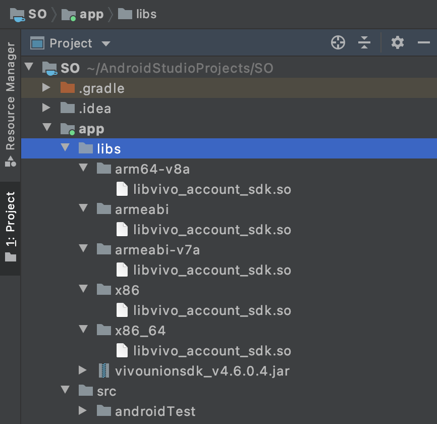

## Frida 环境配置

下面简单记录frida在 Android 和 iOS 上分别使用 `frida-server` 和 `frida-gadget` 2种环境配置方式，为后续进一步学习实践~

​       

# 一、frida-server 

```shell
## apk resign
# apktool 解压
apktool d pink.apk

# apktool 压缩
apktool b pink/

# 生成 keystore 文件：
keytool -genkey -alias debug.keystore -keyalg RSA -validity 20000 -keystore debug.keystore

# apk 签名：
java -jar apksigner.jar sign -verbose --ks debug.keystore --v1-signing-enabled false --v2-signing-enabled true --ks-key-alias debug.keystore  --out signed.apk pink.apk
```

​       

## 1、Android

电脑 USB 连接安卓手机，针对设备是否 root 采用不同的方式

### 1.1 root设备

>**1）**查看手机型号，下载系统对应版本的 [frida-server](https://github.com/frida/frida/releases)
>
>```shell
>$ adb shell getprop ro.product.cpu.abi
>```
>
>注意：Frida-server的版本必须跟宿主机的Frida版本一致，比如宿主机Frida的版本是10.6.52，Android手机是arm64的，那么应该下载：rida-server-10.6.52-android-arm64.xz 文件。
>
>**2）**下载后解压文件，并将文件重命名为: `frida-server`, 重命名完成后使用`adb push`命令推送到手机中
>
>```shell
>$ adb root # might be required
>$ adb push frida-server /data/lcoal/tmp
>```
>
>**3）**推送完成后将frida-sever赋予执行的权限，并运行Frida-server，使用以下命令：
>
>```shell
>$ adb shell "chmod 755 /data/local/tmp/frida-server"
>$ adb shell "/data/local/tmp/frida-server &"
>```
>
>**注1**： 如果frida-server没有启动，查看一下你是否使用的是Root用户来启动，如果使用Root用户则应该是`#`，
>
>**注2**： 如果要启动frida-server作为后台进程、可以使用这个命令`./frida-server &`
>
>**4）**正常启动后，另开一个终端，使用 `frida-ps -U` 命令检查Frida是否正常运行，如果正常运行则会列出Android设备上当前正在运行的进程。
>
>参数-U 代表USB，意思让Frida检查USB设备，使用`frida-ps -R` 也可以，但是需要进行转发，执行 `adb forward tcp:27042 tcp:27042` 修改端口号，后执行`frida-ps -R`也可以看到手机上的进程。
>
>```shell
># 进行端口转发监听
>$ adb forward tcp:27042 tcp:27042
>$ adb forward tcp:27043 tcp:27043
>
># 注：27042 用于与frida-server通信的默认端口号, 之后的每个端口对应每个注入的进程，检查27042端口可检测 Frida 是否存在
>```

​       

### 1.2 非root设备

> 1）**反编译 apk**，反编译之后生成 target_app_floder 文件夹
>
> ```shell
> $ apktool d target_app.apk -o target_app_floder
> ```
>
> 2）**下载系统对应版本的 [frida-gadget](https://github.com/frida/frida/releases)**，解压并放到指定位置
>
> 下载之后将其进行解压，然后放到 `target_app_floder//lib/armeabi/libfrida-gadget.so`，注意修改名字以 `lib` 开头 `.so` 结尾，对应下一步的代码中的`frida-gadger`
>
> > **注**：测试设备是 `arm64-v8a`，所以下载 [**frida-gadget-12.2.27-android-arm64.so.xz**](https://github.com/frida/frida/releases/download/12.2.27/frida-gadget-12.2.27-android-arm64.so.xz)，但最后回编译打包之后，运行总是奔溃，不断的尝试之后才发现使用 [**frida-gadget-12.2.27-android-arm.so.xz**](https://github.com/frida/frida/releases/download/12.2.27/frida-gadget-12.2.27-android-arm.so.xz) 可以正常运行
>
> 3）**代码中加载上一步so 文件，建议在应用的入口文件中执行**
>
> 根据 AndroidManifest.xml 文件找到程序的入口文件，例如 MainActivity，在反编译生成的代码 smali 中的 onCreate 方法中注入如下代码
>
> ```java
> const-string v0, "frida-gadget"
> invoke-static {v0}, Ljava/lang/System;>loadLibrary(Ljava/lang/String;)V
> ```
>
> 4）**检查AndroidManifest.xml清单文件的网络权限**，忌重复添加，会导致回编译包出错
>
> ```java
> <uses-permission android:name="android.permission.INTERNET" />
> ```
>
> 5）**回编译 apk**
>
> > a. 重新打包
> >
> > ```shell
> > $ apktool b -o repackage.apk target_app_floder
> > ```
> >
> > b. 创建签名文件，有的话可忽略此步骤
> >
> > ```shell
> > $ keytool -genkey -v -keystore mykey.keystore -alias mykeyaliasname -keyalg RSA -keysize 2048 -validity 10000
> > ```
> >
> > c. 签名，以下任选其一
> >
> > ```shell
> > # jarsigner 方式
> > $ jarsigner -sigalg SHA256withRSA -digestalg SHA1 -keystore mykey.keystore -storepass 你的密码 repackaged.apk mykeyaliasname
> > 
> > # apksigner 方式: 如需要禁用 v2签名 添加选项--v2-signing-enabled false
> > $ apksigner sign --ks mykey.keystore --ks-key-alias mykeyaliasname repackaged.apk
> > ```
> >
> > d. 验证，以下任选其一
> >
> > ```shell
> > # jarsigner方式
> > $ jarsigner -verify repackaged.apk
> > 
> > # apksigner 方式
> > $ apksigner verify -v --print-certs repackaged.apk
> > 
> > # keytool方式
> > $ keytool -printcert -jarfile repackaged.apk
> > ```
> >
> > e. 对齐
> >
> > ```shell
> > # 4字节对齐优化
> > $ zipalign -v 4 repackaged.apk final.apk
> > 
> > # 检查是否对齐
> > $ zipalign -c -v 4 final.apk
> > 
> > # zipalign可以在V1签名后执行, 但zipalign不能在V2签名后执行, 只能在V2签名之前执行
> > ```
>
> 6）**安装 apk**
>
> ```shell
> $ adb install final.apk
> ```
>
> 7）**检查是否成功**
>
> 打开运行 final.apk，在注入代码位置进入停止等待页面

另一种非 root 方式：https://bbs.pediy.com/thread-229970.htm

​             

## 2、 iOS

在iOS设备上，Frida支持两种使用模式，具体使用哪种模式要看你的iOS设备是否已经越狱

### 2.1 已越狱设备

越狱机上使用Cydia工具配置Frida

> 1）启动 Cydia
>
> 2）添加软件源：manage -> 软件源 Sources-> 编辑 Edit（左上角）-> 添加 Add（右上角）-> 输入 https://build.frida.re/
>
> 3）通过刚才添加的软件源安装 frida 插件，注意需要根据手机进行安装：iPhone 5 及之前的机器为 32 位，5s 及之后的机器为 64 位，进入 变更 -> 找到Frida -> 进入Frida 在右上角点击安装

​    

### 2.2 未越狱设备

frida-server在运行时需要root环境，但如果没有越狱的设备，依然可以使用frida，只需要重打包ipa文件，将frida运行库注入ipa文件中，app在启动时会自动加载frida运行库，即可实现在非越狱的设备上使用Frida。

因此，为了让一个App能使用Frida，必须想办法让它加载一个 **.dylib**，就是一个 **Gadget** 模块，因此需要配置一下 **xcode** 的编译配置来让你的App可以集成Frida。当然也可以使用相关的工具来修改一个已经编译好的App， 比如 **insert_dylib** 这样的工具。

... ...

​      

### 2.3 模拟器

在模拟器中进行测试，需要把命令行中的 **-U** 替换成 **-R**，这样一来底层的内部调用也从 **get_usb_device()** 变成 **get_remote_device()**

... ...

​      

# 二、frida-gadget 持久化

frida-gadget的持久化，通俗理解也就是注入frida-gadget，让目标app加载该so文件，进而实现frida的hook功能，并且和app共生，一定程度上也免去了反调试，反frida（修改so名字，从maps看检测风险减小，或许从hook原理继续检测？先不说find_mem_string检测）的情况。

​     

## 1、Android

​      

### 1.1 root环境

**方式一**：

> **操作**：通过修改程序加载动态库而实现HOOK，即如果目标app有使用so，利用 lief工具 把frida-gadget和目标app的so链接到一起，实现加载和hook（如：从/data/app/packageName-xxx/lib下，找到app的so然后和frida-gadget进行链接）
>
> ```python
> # pip install lief
> # 存在so的情况下, 可以修改其导入的so文件
> for soname in injectsolist: # 遍历apk中指定SO有哪几种架构，并添加 gadget.so 为依赖库
>     if soname.find("x86") != -1:
>         continue
>     so = lief.parse(os.getcwd() + "\\" + soname)
>     so.add_library("libfrida-gadget.so")
>     so.write(soname + "gadget.so")
> 
> # 可参考LIEFInjectFrida.py: https://github.com/nszdhd1/UtilScript
> ```
>
> **风险点**：需要过root检测，so文件完整性检测（如：目标app可扫描/data/app/packageName-xxx/lib目录下所有文件，和文件md5上传服务器做校验）
>
> **详情**：
>
> * [[翻译]在未root的设备上使用frida](https://bbs.pediy.com/thread-229970.htm)
> * [非root环境下frida的两种使用方式](https://nszdhd1.github.io/2021/06/15/%E9%9D%9Eroot%E7%8E%AF%E5%A2%83%E4%B8%8Bfrida%E7%9A%84%E4%B8%A4%E7%A7%8D%E4%BD%BF%E7%94%A8%E6%96%B9%E5%BC%8F/)
> * [基于Android9的非Root环境下Frida持久化](http://www.zhuoyue360.com/crack/78.html)

​       

**方式二**：

> **操作**：利用lief工具把frida-gadget和系统库（如libart，libc）链接到一起，实现加载和hook
>
> ```python
> # pip install lief
> # 在没有so的情况下，通常是修改apk的入口文件，也就是修改smali代码, 即通过调用System.loadLibrary来加载so。但在这种方法的情况下，则需要考虑 重打包检测（签名检测，文件完整性检测）的情况。但是有一个弊端就是时机不够靠前，没有办法hook Activity 启动之前的代码。
> 
> # 可参考 SmaliInjectFrida.py: https://github.com/nszdhd1/UtilScript
> ```
>
> **风险点**：需要过root检测
>
> **详情**：
>
> * [非root环境下frida的两种使用方式](https://nszdhd1.github.io/2021/06/15/%E9%9D%9Eroot%E7%8E%AF%E5%A2%83%E4%B8%8Bfrida%E7%9A%84%E4%B8%A4%E7%A7%8D%E4%BD%BF%E7%94%A8%E6%96%B9%E5%BC%8F/)

​    

**方式三**：

> **操作**：magisk模块方案注入frida-gadget，实现加载和hook
>
> **风险点**：需要过root检测，magisk检测
>
> **详情**：
>
> * [[原创]Frida持久化方案(Xcube)之方案三——基于Magisk和gadget](https://bbs.pediy.com/thread-268896.htm)

   

**方式四**：

> **操作**：xposed模块方案注入frida-gadget，实现加载和hook
>
> **风险点**：需要过root检测，xposed检测
>
> **详情**：
>
> * [[原创]Frida持久化方案(Xcube)之方案二——基于xposed](https://bbs.pediy.com/thread-266784.htm)

​       

### 1.2 非root环境

**方式一**：

> **操作**：目标app没有使用so，修改smali文件加入代码load frida-gadget然后再重打包，实现加载和hook
>
> **风险点**：重打包检测（签名检测，文件完整性检测）
>
> **详情**：
>
> * [非root环境下frida的两种使用方式](https://nszdhd1.github.io/2021/06/15/%E9%9D%9Eroot%E7%8E%AF%E5%A2%83%E4%B8%8Bfrida%E7%9A%84%E4%B8%A4%E7%A7%8D%E4%BD%BF%E7%94%A8%E6%96%B9%E5%BC%8F/)

​      

**方式二**：

> **操作**：目标app有使用so，解包利用lief工具把frida-gadget和目标app的so链接到一起然后再重打包，实现加载和hook
>
> **风险点**：重打包检测（签名检测，文件完整性检测）
>
> **详情**：
>
> * [[翻译]在未root的设备上使用frida](https://bbs.pediy.com/thread-229970.htm)
> * [非root环境下frida的两种使用方式](https://nszdhd1.github.io/2021/06/15/%E9%9D%9Eroot%E7%8E%AF%E5%A2%83%E4%B8%8Bfrida%E7%9A%84%E4%B8%A4%E7%A7%8D%E4%BD%BF%E7%94%A8%E6%96%B9%E5%BC%8F/)

​      

**方式三**：

> **操作**：类xpatch方式加载frida-gadget，众所周知xpatch是修改的manifest文件替换了application入口，然后进行了sandhook初始化，xp模块的查找与加载，application的修正和过签名检测，三大主要功能，然后再回头看sandhook都注入了，再注入个frida-gadget不就改改代码的事嘛
>
> **风险点**：重打包检测（签名检测，文件完整性检测，xpatch-sandhook检测）
>
> **详情**：
>
> * https://git.virjar.com/ratel/ratel-doc

​      

### 1.3 源码定制

**方式一**：

> **操作**：利用了PRODUCT_COPY_FILES的方式把文件copy到了system/lib下，然后我又改了`frameworks/base/core/jni/com_android_internal_os_Zygote.cpp的``com_android_internal_os_Zygote_nativeForkAndSpecialize`函数，实现了fork进程的时候dlopen frida-gadget给每个进程都加上frida
>
> **风险点**：重打包检测（签名检测，文件完整性检测，xpatch-sandhook检测）
>
> **详情**：
>
> * [玩转Android10源码开发定制(九)内置frida-gadget so文件和frida-server可执行文件到系统](https://bbs.pediy.com/thread-264916.htm)
> * [[原创]FridaManager:Frida脚本持久化解决方案](https://bbs.pediy.com/thread-266767.htm)

​      

 **方式二**：

> **操作**：源码内部引入第三方so文件 [frida-gadget.so](https://github.com/frida/frida/releases)，即将文件复制到APP项目内任意模块的 JNI libs 目录，并增加 libFG.so 初始化代码（注：可选择在hook时机更早的APP初始化阶段引入）
>
> 1）Android Studio 中所有的库文件都可以扔进「libs」目录，因此将 SO 文件及上层文件夹复制到 Module 的「libs」目录。如下示例：
>
> <div align="center"></div>
>
> 2）由于 Java 代码调用 SO 库涉及到跨语言交互，所以必须通过  JNI（Java Native Interface）进行，同时，通过 JNI 交互的文件也必须通过标识才能被 Android Studio 处理，因此还需要在 Module 的 build.gradle 中加入如下代码
>
> ```java
> // build.gradle
> 
> android {
>     ...
>     sourceSets {
>         main {
>             jniLibs.srcDirs = ['libs']
>         }
>     }
> }
> ```
>
> 3）APP初始化阶段加载so文件
>
> ```java
> // DemoApp.java
> 
> import android.app.Application;
> import com.bilibili.luna.LunaApp;
> 
> public class DemoApp extends Application {
> 	// libFridaGadget.so 初始化代码
>     static {
>         try {
>         // 加载so文件, 文件名格式 "libsXXX.so",比如: libs/arm64-v8a/libFridaGadget.so
>             System.loadLibrary("FridaGadget");
>         } catch (Exception ex) {
>             ex.printStackTrace();
>         }
>     }
> 
>     @Override
>     public void onCreate() {
>         super.onCreate();
>         LunaApp.init(this);
>     }
> }
> ```
>
> 注：frida-gadget.so 文件需要与Android设备的cpu处理器架构一致，否则APP启动时触发闪退，无法正常启动APP
>
> ```shell
> # 查看cpu处理器架构
> adb shell getprop ro.product.cpu.abi
> 
> # 比如: arm64-v8a, 则应选择对应CPU架构的so文件 frida-gadget-16.0.2-android-arm64.so
> ```
>
> **风险点**：重打包检测（签名检测，so库检测冲突）
>
> **详情**：
>
> * [『Android Studio』如何导入 SO 库](https://liarrdev.github.io/post/How-to-Import-SO-in-Android-Studio/)
> * [Android：发布aar包到maven仓库以及 maven插件 和 maven-publish 插件的区别](https://juejin.cn/post/7017608469901475847#heading-12)

​             

# 附录

   

1. [[原创]小菜花的frida-gadget持久化方案汇总](https://bbs.pediy.com/thread-268256.htm)
2. [Frida 安装和使用: root和非root设备](https://www.jianshu.com/p/bab4f4714d98)