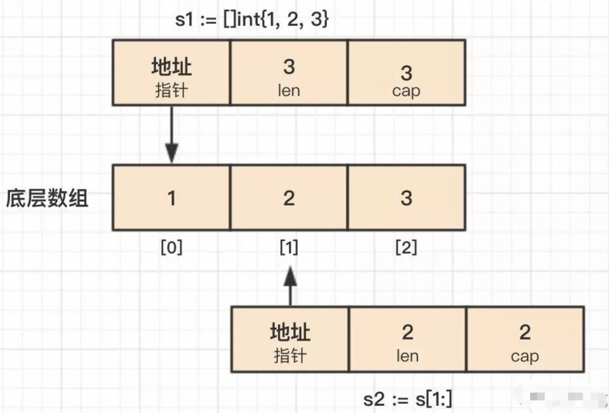
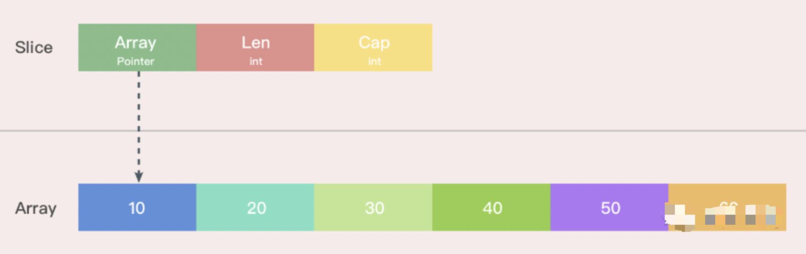
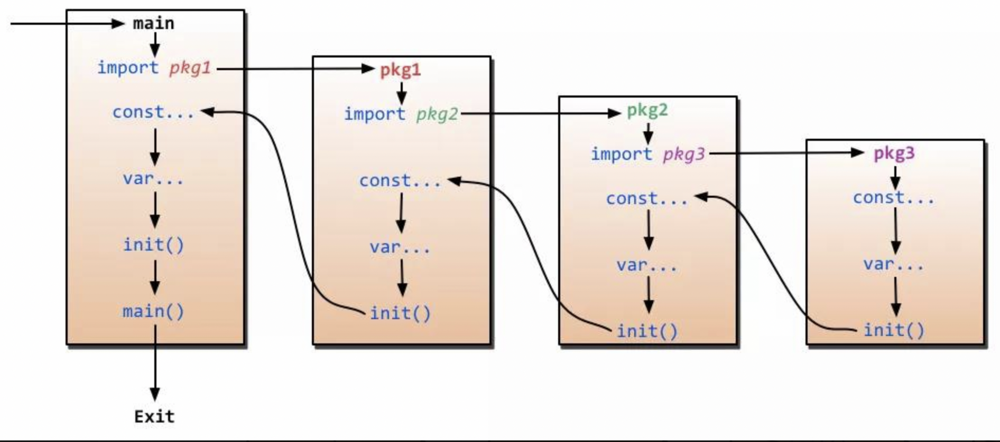
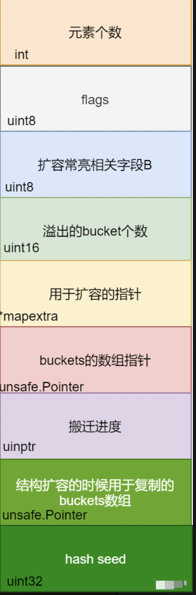
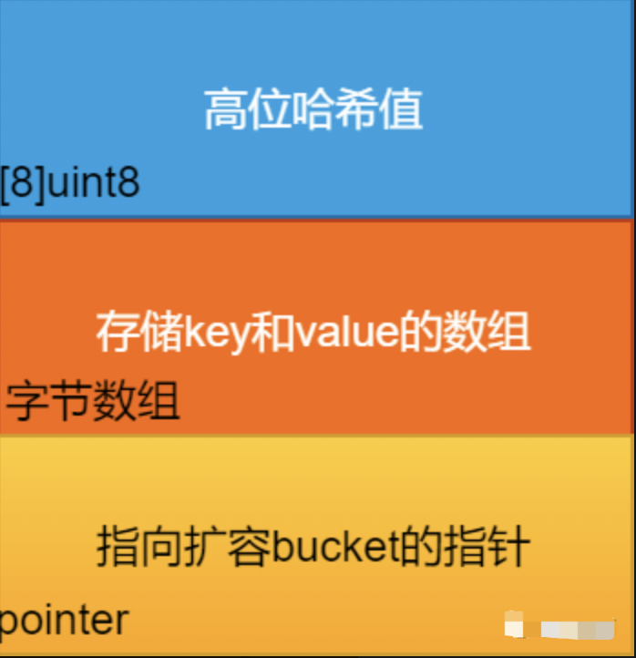
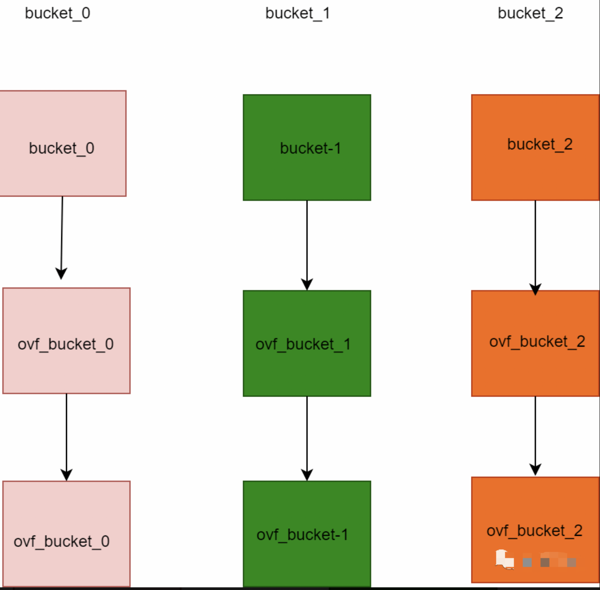
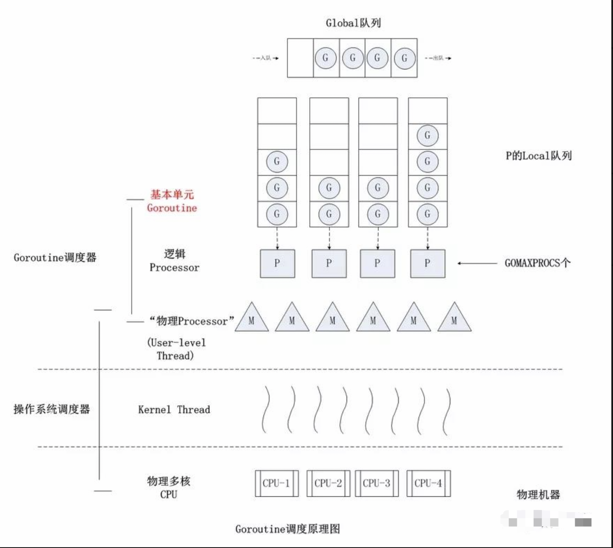
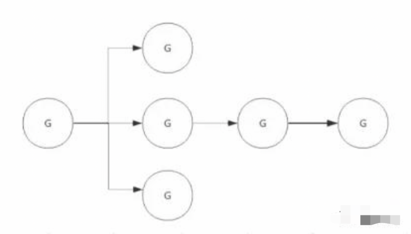

参考：https://www.topgoer.cn/docs/gomianshiti/gomianshiti-1cni1rva98j6q

  

## 一 基础知识 

### 1）defer

**后进先出**，且当出现 panic 语句的时候，会先按照 defer 的后进先出的顺序执行，最后才会执行panic；

defer() 后面的函数如果带参数，会优先计算参数，并将结果存储在栈中，到真正执行 defer() 的时候取出，即**defer 函数的参数（包括接收者）**是在 defer 语句出现的位置做计算的，而不是在函数执行的时候计算的

```go
// 案例1
func main() {
	defer fmt.Println("No1")
	defer fmt.Println("No2")
	panic("panic test")
}

// return
> No2
> No1
> panic: panic test
```

 ```go
 // 案例2
 type Person struct {
 	age int
 }
 
 func main() {
 	person := &Person{28}
 
 	// 1. 将 28 当做 defer 函数的参数，会把 28 缓存在栈中，等到最后执行该 defer 语句的时候取出
 	defer fmt.Println("a:", person.age)
 
 	// 2. defer 缓存的是结构体 Person{28} 的地址
 	defer func(p *Person) {
 		fmt.Println("b:", p.age)
 	}(person)
 
 	// 3. 闭包引用
 	defer func() {
 		fmt.Println("c:", person.age)
 	}()
 
   //person.age = 29    // no.1: 修改值
   person = &Person{29} // no.2: 创建新对象
 }
 
 // return
 > no.1: 29 29 28
 > no.2: 29 28 28
 ```

```go
// 案例3
func main() {
    a := 1
    b := 2
    defer calc("1", a, calc("10", a, b))
    a = 0
    defer calc("2", a, calc("20", a, b))
    b = 1
}

func calc(index string, a, b int) int {
    ret := a + b
    fmt.Println(index, a, b, ret)
    return ret
}

// return
> 10 1 2 3
> 20 0 2 2
> 2 0 2 2
> 1 1 3 4

/** 分析
1）程序执行到 main() 函数三行代码的时候，会先执行 calc() 函数的 b 参数，即：calc(“10”,a,b)，输出：10 1 2 3，得到值 3，因为defer 定义的函数是延迟函数，故 calc(“1”,1,3) 会被延迟执行；
2）程序执行到第五行的时候，同样先执行 calc(“20”,a,b) 输出：20 0 2 2 得到值 2，同样将 calc(“2”,0,2) 延迟执行；
3）程序执行到末尾的时候，按照栈先进后出的方式依次执行：calc(“2”,0,2)，calc(“1”,1,3)，则就依次输出：2 0 2 2，1 1 3 4
*/
```

```go
// 案例4
func Defer5(n int) (r int) {
	defer func() {
		r += n
		recover()
	}()

	var f func()
	
	defer f()
	f = func() {
		r += 2
	}

	return n + 1
}

func main() {
    fmt.Println(Defer5(3))
}

// return
> 7

/** 分析
1）第一步执行r = n +1
2）接着执行第二个 defer，由于此时 f() 未定义，引发异常
3）随即执行第一个 defer，异常被 recover()，程序正常执行
4）最后 return
*/
```

```go
// 案例5: defer() 后面的函数如果带参数，优先计算参数，并将结果存储在栈中
func F(n int) func() int {
	return func() int {
		n++
		fmt.Println("n: ", n)
		return n
	}
}

func main() {
	f := F(5)
	defer func() {   // step3
		fmt.Println(f())
	}()

  defer fmt.Println(f())  // step1
	
	i := f()  // step2
	fmt.Println(i)
}

// return
> n:  6
> n:  7
> 7
> 6
> n:  8
> 8
```

​      

### 2）for range 循环

**for 循环特点**：

* 支持 continue 和 break 来控制循环，但是它提供了一个更高级的 break，可以选择中断哪一个循环；
* 不支持以逗号为间隔的多个赋值语句，必须使用平行赋值的方式来初始化多个变量；
* for range 使用短变量声明(:=)的形式迭代变量，变量 key、val 在 **每次循环体中都会被重用，而不是重新声明**；

​        

**重点**：range 表达式是 **副本参与循环**，即循环时创建每个元素的副本，而不是元素的引用

```go
func main() {

     slice := []int{0,1,2,3}
     m := make(map[int]*int)
		
  	 // 变量 key、val 在每次循环体中都会被重用，而不是重新声明
     for key,val := range slice {
         m[key] = &val
     }

    for k,v := range m {
        fmt.Println(k,"-->",*v)
    }
}

// return
> 3 --> 3
> 0 --> 3
> 1 --> 3
> 2 --> 3

// 使用临时变量保留当前值
for i, v := range m {
    i := i           // 这里的 := 会重新声明变量，而不是重用
    v := v
    go func() {
        fmt.Println(i, v)
    }()
}
```

for range 使用短变量声明(:=)的形式迭代变量，需要注意的是，变量 key、val 在 **每次循环体中都会被重用，而不是重新声明**。m[key] = &val 取的都是 **变量 val 的地址**，所以最后 map 中的所有元素的值都是变量 val 的地址，因为最后 val 被赋值为3，所有输出都是3。

```go
/** 分析
a 是一个切片，那切片是怎么实现的呢？
切片在 go 的内部结构有一个指向底层数组的指针，当 range 表达式发生复制时，副本的指针依旧指向原底层数组，所以对切片的修改都会反应到底层数组上，所以通过 v 可以获得修改后的数组元素

参考: https://tonybai.com/2015/09/17/7-things-you-may-not-pay-attation-to-in-go/
*/
func main() {
    var a = []int{1, 2, 3, 4, 5}
    var r [5]int

    for i, v := range a {
        if i == 0 {
            a[1] = 12
            a[2] = 13
        }
        r[i] = v
    }
    fmt.Println("r = ", r)  // [1 12 13 4 5]
    fmt.Println("a = ", a)  // [1 12 13 4 5]
}

/** 分析
range 表达式是副本参与循环，就是说例子中参与循环的是 a 的副本，而不是真正的 a。就这个例子来说，假设 b 是 a 的副本，则 range 循环代码等效于对数组b循环遍历
*/
func main() {
    var a = [5]int{1, 2, 3, 4, 5}
    var r [5]int

    for i, v := range a {
        if i == 0 {
            a[1] = 12
            a[2] = 13
        }
        r[i] = v
    }
    fmt.Println("r = ", r)  // [1 2 3 4 5]
    fmt.Println("a = ", a)  // [1 12 13 4 5]
}
```

​     

### 3）new() 与 make() 的区别

new(T) 和 make(T,args) 是 Go 语言内建函数，用来分配内存，但适用的类型不同

* **new(T)** 会为 T 类型的新值 ***分配已置零的内存空间*** ，并 ***返回地址（指针）***，即类型为 `*T`的值。换句话说就是，返回一个指针，该指针指向新分配的、类型为 T 的零值。适用于值类型，如 `数组`、`结构体` 等。new 函数是内建函数，函数定义：`func new(Type) *Type`
* **make(T,args)** 返回 ***初始化之后的 T 类型的值***，这个值并不是 T 类型的零值，也不是指针 `*T`，是经过 *初始化之后的 T 的引用（实例）*。make() 只适用于 `slice`、`map` 和 `channel`。make 函数是内建函数，函数定义：`func make(Type, size IntegerType) Type`，第一个参数是一个类型，第二个参数是长度，返回值是一个类型

​     

**案例1：**

```go
func main() {
	l := new([]int)
	l = append(l, 1)
	fmt.Println(l)
}

分析：不能通过编译，new([]int) 之后的 list 是一个 *[]int 类型的指针，不能对指针执行 append 操作。可以使用 make() 初始化之后再用。同样的，map 和 channel 建议使用 make() 或字面量的方式初始化，不要用 new() 
```

   

### 4）命名返回值

返回值规范：

* 在函数有多个返回值时，只要有一个返回值有命名，其他的也必须命名；
* 如果有多个返回值必须加上括号()；
* 如果只有一个返回值且命名也必须加上括号()；

```go
func funcMui(x,y int)(sum int,error){
  return x+y,nil
}

分析：多个返回值类型不会混淆，即不能同时存在命名和未命名类型，其中第二个返回值没有命名
```

​    

### 5）切片slice 和 数组

#### a）切片 **append() **

第二个参数不能直接使用 slice，需使用 **… 操作符**，将一个切片追加到另一个切片上：append(s1,s2…)，或者直接跟上元素，形如：append(s1,1,2,3)

```go
func main() {
    s1 := []int{1, 2, 3}
    s2 := []int{4, 5}
    s1 = append(s1, s2)
    fmt.Println(s1)
}

分析：无法通过编译
```

#### b）**切片长度和容量**

数组或切片的截取操作有带 2 个或者 3 个参数，形如：[i:j] 和 [i:j:k]，假设截取对象的底层数组长度为 l

* **操作符 [i:j]** ：如果 i 省略，默认 0，如果 j 省略，默认底层数组的长度，截取得到的切片长度和容量计算方法是 j-i、l-i
* **操作符 [i:j:k]**：k 主要是用来限制切片的容量，但是不能大于数组的长度 l，截取得到的切片长度和容量计算方法是 j-i、k-i。

```go
func main() {
	s := [3]int{1, 2, 3}
	a := s[:0]
	b := s[:2]
	c := s[1:2:cap(s)]

	fmt.Println("a: len(%d) cap(%d)", len(a), cap(a))
	fmt.Println("b: len(%d) cap(%d)", len(b), cap(b))
	fmt.Println("c: len(%d) cap(%d)", len(c), cap(c))
}

// return
> s: len(3) cap(3)
> a: len(0) cap(3)
> b: len(2) cap(3)
> c: len(1) cap(2)
```

#### c）**切片和数组的区别**

数组是具有固定长度，且拥有零个或者多个，相同数据类型元素的序列

* 数组的长度是数组类型的一部分，所以[3]int 和 [4]int 是两种不同的数组类型；
* 数组需要指定大小，不指定也会根据初始化的自动推算出大小，不可改变；
* 数组是 **值传递**，因此作为参数传进函数时，***传递的是数组的原始值拷贝***，此时在函数内部是无法更新该数组的；
* 数组是内置类型，是一组同类型数据的集合，它是值类型，通过从0开始的下标索引访问元素值。*在初始化后长度是固定的，无法修改其长度*；

当数组作为 **方法的参数传入** 时，***将复制一份数组而不是引用同一指针***，已知数组的长度也是其类型的一部分，因此可通过内置函数len(array)获取其长度。

```go
// 数组定义
var array [10]int
var array =[5]int{1,2,3,4,5}
```

​    

切片表示一个拥有相同类型元素的可变长度的序列：

* 切片是一种轻量级的数据结构，它有三个属性：指针、长度和容量

* 切片不需要指定大小；
* 切片是 **地址传递**；
* 切片可以通过数组来初始化，也可以通过内置函数make()初始化；
* 初始化时len=cap，在追加元素时如果容量cap不足时将 **按len的2倍扩容**；

```go
// 切片定义
var slice []type = make([]type, len)
```

#### d）**切片和数组的关系**

golang 中切片底层的数据结构是数组

```go
func main() {
	s1 := []int{1, 2, 3}
	s2 := s1[1:]
	s2[1] = 4
	fmt.Println(s1)
  
	s2 = append(s2, 5, 6, 7)
	fmt.Println(s1)
}

// return
> [1 2 4]
> [1 2 4]
```

**分析**：当使用 s1[1:] 获得切片 s2，和 s1 共享同一个底层数组，这会导致 s2[1] = 4 语句影响 s1。而 append 操作会导致底层数组扩容，生成新的数组，因此追加数据后的 s2 不会影响 s1。

但是为什么对 s2 赋值后影响的却是 s1 的第三个元素呢？这是因为切片 s2 是从数组的第二个元素开始，s2 索引为 1 的元素对应的是 s1 索引为 2 的元素

<div align="center">

#### e）Slice底层实现

切片是 **基于数组实现的**，它的底层是数组，它自己本身非常小，可以理解为对底层数组的抽象。因为基于数组实现，所以它的 **底层的内存是连续分配的，效率非常高，还可以通过索引获得数据，可以迭代以及垃圾回收优化**。

切片本身并 **不是动态数组或者数组指针**，它内部实现的数据结构 **通过指针引用底层数组**，设定相关属性将数据读写操作限定在指定的区域内。切片本身是一个只读对象，其工作机制类似数组指针的一种封装。

切片对象非常小，是因为它是只有3个字段的数据结构：

* 指向底层数组的指针
* 切片的长度
* 切片的容量

这3个字段，就是Go语言操作底层数组的元数据

<div align="center"></div>

#### f）slice扩容机制

在使用 append 向 slice 追加元素时，若 slice 空间不足则会发生扩容，***扩容会重新分配一块更大的内存，将原 slice 拷贝到新 slice ，然后返回新 slice，扩容后再将数据追加进去**。

扩容操作只对容量，扩容后的 slice 长度不变，容量变化规则如下：

- 若 slice 容量小于1024个元素，那么扩容的时候slice的cap就翻番，乘以2；一旦元素个数超过1024个元素，增长因子就变成1.25，即每次增加原来容量的四分之一。
- 若 slice 容量够用，则将新元素追加进去，slice.len++，返回原 slice
- 若 slice 容量不够用，将 slice 先扩容，扩容得到新 slice，将新元素追加进新 slice，slice.len++，返回新 slice。

#### g）切片拷贝copy()

**copy(dst, src)** 函数返回 len(dst)、len(src) 之间的**最小值**，如果想要将 src 完全拷贝至 dst，必须给 dst 分配足够的内存空间。

```go
func main() {
    var src, dst []int
    src = []int{1, 2, 3}
  	
    dst = make([]int, len(src))
    n := copy(dst, src)
  	
    fmt.Println(n,dst)
}

// 或

func main() {
    var src, dst []int
    src = []int{1, 2, 3}
  	
    dst = append(dst, src...)
  	
    fmt.Println("dst:", dst)
}
```

```go
// 返回数值最小值: 切片复制，并且返回两者长度的较小值
func min(a int, b uint) {
    var min = 0
    min = copy(make([]struct{}, a), make([]struct{}, b))
    fmt.Printf("The min of %d and %d is %d\n", a, b, min)
}

func main() {
    min(1225, 256)
}
```

​     

### 6）变量简短声明 “:=”

变量声明的简短模式 "**:=**" 限制：

* 1）必须使用显示初始化；
* 2）不能提供数据类型，编译器会自动推导；
* 3）只能在函数内部使用简短模式；
* 4）不能用简短声明方式来单独为一个变量重复声明， := 左侧至少有一个新变量，才允许 **多变量的重复声明**
* 5）不能使用短变量声明对结构体struct字段赋值

```go
var(
    // 不能通过编译, 在代码块内不能使用简短模式定义
    size := 1024
    max_size = size*2
)

type S struct {
}

type info struct {
    result int
}

func work() (int,error) {
    return 13,nil
}

func main() {
    fmt.Println(size,max_size)
  	
  	// 多变量的重复声明, := 左侧至少有一个新变量
  	var sm S
		sm, y := S{}, S{}  // y 新变量
  	// success
		fmt.Println(sm, y)
  	
  	
  	var data info
  	// data.result, err := work() // compile error
    var err error
    data.result, err = work() //ok
}
```

​    

### 7）结构体struct

结构体访问控制，如果定义字段的**首字母是小写**，则其他包不能访问

```go
type People struct {
     name string `json:"name"`  // 小写 字段外部无法访问
  	 // Name string `json:"name"`  // OK。
}

func main() {
     js := `{
         "name":"seekload"
     }`
     var p People
     err := json.Unmarshal([]byte(js), &p)
     if err != nil {
        fmt.Println("err: ", err)
        return
    }
  	fmt.Println(p)  // {}
}
```

struct{} 是不可寻址的，不能直接调用方法（即不可寻址的结构体 **不能直接调用带结构体指针接收者的方法**），因此在方法中，**指针类型的接收者** 必须是 `合法指针`（包括 nil），或能获取实例地址

```go
type X struct {}

func (x *X) test()  {
   println(x)
}

func main() {
    var a *X
    a.test()
    X{}.test()  // Cannot call a pointer method on 'X{}'
}
```

​     

#### a）结构体比较

* 1）结构体只能比较是否相等，但是不能比较大小。
* 2）相同类型的结构体才能够进行比较，结构体是否相同不但与 **属性类型** 有关，还与 **属性顺序** 相关
* 3）如果 struct 的所有成员都可以比较，则该 struct 就可以通过 == 或 != 进行比较是否相等，比较时逐个项进行比较，如果每一项都相等，则两个结构体才相等，否则不相等；

常见可比较类型是 `bool`、`数值型`、`字符`、`指针`、`数组` 等，而 `slice`、`map`、`函数` 等是不能比较的，详情参考：https://golang.org/ref/spec#Comparison_operators

> 1) **Boolean** values are comparable. Two boolean values are equal if they are either both true or both false.
> 2) **Integer** values are comparable and ordered, in the usual way.
> Floating-point values are comparable and ordered, as defined by the IEEE-754 standard.
> 3) **Complex** values are comparable. Two complex values u and v are equal if both real(u) == real(v) and imag(u) == imag(v).
> 4) **String** values are comparable and ordered, lexically byte-wise.
> 5) **Pointer** values are comparable. Two pointer values are equal if they point to the same variable or if both have value nil. Pointers to distinct zero-size variables may or may not be equal.
> 6) **Channel** values are comparable. Two channel values are equal if they were created by the same call to make or if both have value nil.
> 7) **Interface** values are comparable. Two interface values are equal if they have identical dynamic types and equal dynamic values or if both have value nil.
> 8) **A value x of non-interface type X** and a value t of interface type T are comparable when values of type X are comparable and X implements T. They are equal if t's dynamic type is identical to X and t's dynamic value is equal to x.
> 9) **Struct** values are comparable if all their fields are comparable. Two struct values are equal if their corresponding non-blank fields are equal.
> 10) **Array** values are comparable if values of the array element type are comparable. Two array values are equal if their corresponding elements are equal.

   

**案例：**

```go
func main() {
    sn1 := struct {
        age  int
        name string
    }{age: 11, name: "qq"}
    sn2 := struct {
        age  int
        name string
    }{age: 11, name: "qq"}
  	sn3:= struct {
      name string
      age  int
    }{age:11,name:"qq"}

    if sn1 == sn2 {
        fmt.Println("sn1 == sn2")
    }
  	
  	// invalid operation
  	if sn1 == sn3 {
        fmt.Println("sn1 == sn2")
    }

    sm1 := struct {
        age int
        m   map[string]string
    }{age: 11, m: map[string]string{"a": "1"}}
    sm2 := struct {
        age int
        m   map[string]string
    }{age: 11, m: map[string]string{"a": "1"}}
		
  	// invalid operation
    if sm1 == sm2 {
        fmt.Println("sm1 == sm2")
    }
}

分析：编译不通过，即 invalid operation: sm1 == sm2
```

#### b）空 struct{} 用途

空结构体 struct{} 实例不占据任何的内存空间

```go
func main() {
 	fmt.Println(unsafe.Sizeof(struct{}{}))  // 0
}
```

   

因为空结构体不占据内存空间，因此被广泛作为各种场景下的占位符使用：

1）将 **map 作为集合(Set)** 使用时，可以将值类型定义为空结构体，仅作为占位符使用即可

```go
type Set map[string]struct{}

func (s Set) Has(key string) bool {
 	_, ok := s[key]
 	return ok
}

func (s Set) Add(key string) {
 	s[key] = struct{}{}
}

func (s Set) Delete(key string) {
 	delete(s, key)
}

func main() {
   s := make(Set)
   s.Add("Tom")
   s.Add("Sam")
   
   fmt.Println(s.Has("Tom"))
   fmt.Println(s.Has("Jack"))
}
```

2）**不发送数据的信道(channel)**：使用 channel 不需要发送任何的数据，只用来通知子协程(goroutine)执行任务，或只用来控制协程并发度

```go
func worker(ch chan struct{}) {
   <-ch
   fmt.Println("do something")
   close(ch)
}

func main() {
   ch := make(chan struct{})
   go worker(ch)
   ch <- struct{}{}
}
```

3）**结构体只包含方法，不包含任何的字段**

```go
type Door struct{}

func (d Door) Open() {
 	fmt.Println("Open the door")
}

func (d Door) Close() {
 	fmt.Println("Close the door")
}
```

#### c）struct 和 nil 比较

注意：当且仅当 **动态值** 和 **动态类型** 都为 nil 时，接口类型值才为 nil

```go
type People interface {
	Show()
}

type Student struct{}

func (stu *Student) Show() {
		fmt.Println("Student.Show()")
}

func main() {
    var s *Student
    fmt.Printf("TypeOf(s): %s, ValueOf(s): %s \n", reflect.TypeOf(s), reflect.ValueOf(s))
    if s == nil {
      fmt.Println("s is nil")
    }

    var p People = s
    fmt.Printf("TypeOf(p): %s, ValueOf(p): %s \n", reflect.TypeOf(p), reflect.ValueOf(p))
    if p != nil {
      fmt.Println("p is not nil")
    }
}

// return
> TypeOf(s): *main.Student, ValueOf(s): %!s(*main.Student=<nil>) 
> s is nil
> TypeOf(p): *main.Student, ValueOf(p): %!s(*main.Student=<nil>) 
> p is not nil

// 分析：给变量 p 赋值之后，p 的动态值是 nil，但是动态类型却是 `*Student`，是一个 nil 指针，所以相等条件不成立
```

​     

### 8）类型别名（type）

类型别名的定义格式：

```go
type 类型别名名称 = 类型名

比如：
type newInt = int 
```

Named Type 有两类：

- **内置类型**，比如 int, int64, float, string, bool 等；
- 使用关键字 type 声明的类型；

Unnamed Type 是基于已有的 Named Type 组合一起的类型，例如：struct{}、[]string、interface{}、map[string]bool 等，其次Unnamed Type **不能作为方法的接收者**。

**注**：不同类型的值是不能相互赋值的，即使底层类型一样；对于 ***底层类型相同的变量*** 可以相互赋值还有一个重要的条件，即至少有一个不是 **有名类型**（named type）；当使用 type 声明一个新类型，它不会继承原有类型的方法集；

> x's type V and T have identical underlying types and at least one of V or T is not a named type. "

​      

**案例：**

```go
type MyInt1 int
type MyInt2 = int

func main() {
    var i int =0
  	// var i1 MyInt1 = MyInt1(i)
    var i1 MyInt1 = i 
    var i2 MyInt2 = i
    fmt.Println(i1,i2)
}

分析：编译不通过，cannot use i (type int) as type MyInt1 in assignment
> 第 5 行代码是基于类型 int 创建了新类型 MyInt1；
> 第 6 行代码是创建了 int 的类型别名 MyInt2，注意类型别名的定义时 = ；
> 第 10 行代码相当于是将 int 类型的变量赋值给 MyInt1 类型的变量，Go 是强类型语言，编译当然不通过；而 MyInt2 只是 int 的别名，本质上还是 int，可以赋值；
```

  

### 9）常量计数器 iota

参考：https://www.cnblogs.com/zsy/p/5370052.html

一般情况下，常量组中如不指定类型和初始化值，则与上一行非空常量右值相同

iota在const关键字出现时将被重置为0（const内部的第一行之前），const中每新增一行常量声明将使iota计数一次（iota可理解为const语句块中的行索引），使用iota能简化定义，在定义枚举时很有用

**使用规范：**

a）iota只能在常量的表达式中使用

```go
fmt.Println(iota)

编译错误： Unresolved reference 'iota'
```

b）每次 const 出现时，都会让 **iota 初始化为0**【自增长】

```go
const a = iota // a=0
const (
	b = iota // b=0
	c        // c=1
)
const (
    a = iota  // 0
    b = iota  // 1
)
const (
    name = "name"
    c    = iota  // 1
    d    = iota  // 2
)
```

c）自定义类型：自增长常量经常包含一个自定义枚举类型，允许你依靠编译器完成自增设置

```go
// 新类型
type Stereotype int

const (
	TypicalNoob           Stereotype = iota // 0
	TypicalHipster                          // 1
	TypicalUnixWizard                       // 2
	TypicalStartupFounder                   // 3
)
```

d）**可跳过的值**

```go
type AudioOutput int

const (
	OutMute AudioOutput = iota // 0
	OutMono                    // 1
	OutStereo                  // 2
	_
	_
	OutSurround                // 5
)
```

e）**位掩码表达式**：`iota` 可以做更多事情，而不仅仅是 increment。更精确地说，`iota` 总是用于 increment，但是它可以用于 *表达式*，在常量中的存储结果值

```go
type Allergen int

const (
	IgEggs         Allergen = 1 << iota // 1 << 0 which is 00000001
	IgChocolate                         // 1 << 1 which is 00000010
	IgNuts                              // 1 << 2 which is 00000100
	IgStrawberries                      // 1 << 3 which is 00001000
	IgShellfish                         // 1 << 4 which is 00010000
)

func main() {
	fmt.Println(IgEggs, IgChocolate, IgNuts, IgStrawberries, IgShellfish)
}

// return
> 1 2 4 8 16
```

随着iota的递增，***每个常量对应表达式1 << iota，是连续的2的幂，分别对应一个bit位置***。当在一个 const 组中仅仅有一个标示符在一行的时候，它将使用增长的 iota 取得前面的表达式并且再运用它，在 Go 语言的 spec 中， 这就是所谓的隐性重复最后一个非空的表达式列表。

f）**定义数量级**

```go
type ByteSize float64

const (
	_           = iota             // ignore first value by assigning to blank identifier
	KB ByteSize = 1 << (10 * iota) // 1 << (10*1)
	MB                             // 1 << (10*2)
	GB                             // 1 << (10*3)
	TB                             // 1 << (10*4)
	PB                             // 1 << (10*5)
	EB                             // 1 << (10*6)
	ZB                             // 1 << (10*7)
	YB                             // 1 << (10*8)
)

const (
	_   = 1 << (10 * iota)
	KiB // 1024
	MiB // 1048576
	GiB // 1073741824
	TiB // 1099511627776             (exceeds 1 << 32)
	PiB // 1125899906842624
	EiB // 1152921504606846976
	ZiB // 1180591620717411303424    (exceeds 1 << 64)
	YiB // 1208925819614629174706176
)
```

不过iota常量生成规则也有其局限性，例如：它并不能用于产生1000的幂（KB、MB等），因为Go语言并没有计算幂的运算符。

g）**定义在一行的情况**

iota 在**下一行增长**，而不是立即取得它的引用

```go
const (
	Apple, Banana = iota + 1, iota + 2
	Cherimoya, Durian
	Elderberry, Fig
)

// return
> Apple: 1
> Banana: 2
> Cherimoya: 2
> Durian: 3
> Elderberry: 3
> Fig: 4
```

h）**中间插队**

```go
const (
	i = iota
	j = 3.14
	k = iota
	l
)

// return
i=0, j=3.14, k=2, l=3

const (
	x = iota
	_
	y
	z = "zz"
	k
	p = iota
)

// return
x=0, y=2, z=zz, k=zz, p=5
```

  

### 10）nil值

nil 只能赋值给 `指针`、`chan`、`func`、`interface`、`map` 或 `slice`  类型的变量，其中 允许对值为 nil 的 slice 添加元素，但对值为 nil 的 map 添加元素，则会造成运行时 panic

```go
// map 错误示例
func main() {
    var m map[string]int
    m["one"] = 1  // error: panic: assignment to entry in nil map
    // m := make(map[string]int)// map 的正确声明，分配了实际的内存
}    

// slice 正确示例
func main() {
 var s []int
 s = append(s, 1)
}
```

error 类型：

```go
type error interface {
    Error() string
}
```

其次，nil 可以用作 `interface`、`function`、`pointer`、`map`、`slice` 和 `channel` 的 “空值”，但是如果不特别指定的话，**Go 语言不能识别类型**，因此 nil 作为基本数据类型的函数返回值编译无法通过。

```go
func GetValue(m map[int]string, id int) (string, bool) {

	if _, exist := m[id]; exist {
		return "exist", true
	}
  
  // Cannot use 'nil' as the type string
	return nil, false
}
```

​      

### 11）init函数

**init()** 函数有几个需要注意的地方：

* 1）init() 函数是用于程序执行前做包的初始化的函数，比如初始化包里的变量等;
* 2）一个包可以出现多个 init() 函数，一个源文件也可以包含**多个 init() 函数**，但**不允许有其他同名函数**；
* 3）同一个包中多个 init() 函数的执行顺序没有明确定义，但是不同包的init函数是根据包导入的依赖关系决定的（看下图）;
* 4）init() 函数在代码中 **不能被显示调用**（即不能被其他函数调用）、**不能被引用（赋值给函数变量）**，包括main()函数，否则出现编译错误;
* 5）一个包被引用多次，如 A import B,C import B,A import C，B 被引用多次，但 B 包只会初始化一次；
* 6）引入包，不可出现死循坏。即 A import B,B import A，这种情况编译失败；

<div align="center"></div>

  

**案例：**

```go
func main() {
	fmt.Println("init test")
}

func init() {
	var a = 10
	fmt.Println("a=", a)
}

func init() {
	var b = 10
	fmt.Println("b=", b)
}

// return
> a= 10
> b= 10
> init test
```

   

### 12）接口interface

#### a）基础概念

函数参数为 interface{} 时可以接收 **任何类型的参数**，包括 `用户自定义类型` 等，即使是接收指针类型也用 interface{}，而不是使用 `*interface{}`

**注**：永远不要使用一个指针指向一个接口类型，因为它已经是一个指针

```go
func f(x interface{}) {
}

func g(x *interface{}) {
}

func main() {
	s := S{}
	p := &s
	f(s) // success
	g(s) // Cannot use 's' (type S) as the type *interface{}
	f(p) // success
	g(p) // Cannot use 'p' (type *S) as the type *interface{}
}
```

#### b）两个 interface 可以比较吗？

```go
// 判断类型是否一样
reflect.TypeOf(a).Kind() == reflect.TypeOf(b).Kind()

// 判断两个interface{}是否相等, 即类型和值均相等
reflect.DeepEqual(a, b interface{})

// 将一个interface{}赋值给另一个interface{}
reflect.ValueOf(a).Elem().Set(reflect.ValueOf(b))
```

#### c）interface接口比较

接口(interface) 是对 **非接口值**（例如 `指针`，`struct` 等）的封装，内部实现包含 2 个字段，**类型 T ** 和 **值 V**。因此，一个接口等于 nil，当且仅当  **T 和 V 处于 unset 状态**（T=nil，V is unset）。

* 两个接口值比较时，会**先比较 T，再比较 V**

* 接口值与非接口值比较时，会先将非接口值尝试转换为接口值，再比较

```go
func main() {
	var p *int = nil
	var i interface{} = p

	fmt.Println(i == p)   // true
	fmt.Println(p == nil) // true
	fmt.Println(i == nil) // false
}

分析：
1）例子中，将一个nil非接口值p赋值给接口i，此时 i的内部字段为(T=*int, V=nil)，i与p作比较时，将 p 转换为接口后再比较，因此 i == p
2）p 与 nil 比较，直接比较值，所以 p == nil；
3）但是当 i 与nil比较时，会将nil转换为接口(T=nil, V=nil),与i(T=*int, V=nil)不相等，因此 i != nil；

因此 V 为 nil ，但 T 不为 nil 的接口不等于 nil
```

**结论**：Go中两个Nil可能不相等

   

### 13）字符串

**规则：**

* a）golang 的字符串类型是 **不能赋值 nil ** 的，也不能跟 nil 比较

* b）string 类型的值是 **只读的二进制 byte slice**，如果真要修改字符串中的字符，将 string 转为 []byte 修改后，再转为 string 即可，即如果尝试使用索引遍历字符串，来更新字符串中的个别字符，是不允许的。

```go
// 修改字符串的错误示例
func main() {
    x := "text"
    x[0] = "T"  // error: cannot assign to x[0]
    fmt.Println(x)
}


// 修改示例
func main() {
    x := "text"
    xBytes := []byte(x)
    xBytes[0] = 'T' // 注意此时的 T 是 rune 类型
    x = string(xBytes)
    fmt.Println(x) // Text
}
```

​    

### 14）恢复recover()

#### a）**如何从Panic中恢复**

在一个 defer 延迟执行的函数中调用 recover ，它便能捕捉/中断 panic

```go
// 错误的 recover 调用示例
func main() {
   recover() // 什么都不会捕捉
   panic("not good") // 发生 panic，主程序退出
   recover() // 不会被执行
   println("ok")
}

// 正确的 recover 调用示例
func main() {
   defer func() {
    	fmt.Println("recovered: ", recover())
   }()
  	
   panic("not good")
}
```

#### b）**recover的执行时机**

recover 必须 **在 defer 函数中运行**，recover 捕获的是祖父级调用时的异常，直接调用时无效

```go
// no1: 直接调用, 无效
func main() {
    recover()
    panic("panic test")
}

// no2: 直接 defer 调用, 无效
func main() {
    defer recover()
    panic("panic test")
}

// no3: defer 调用时多层嵌套, 无效
func main() {
    defer func() {
      func() { recover() }()
    }()

    panic("panic test")
}

// no4: 必须在 defer 函数中直接调用, 有效
func main() {
	defer func() {
		if r := recover(); r != nil {
			fmt.Printf("recover from: %s, do something...\n", r)
		}
	}()

	panic("panic test")
}
// return
> recover from: panic test, do something...
```

​     

### 15）map底层实现

Golang 中 map 的底层实现是一个 **散列表**，因此实现 map 的过程实际上就是实现散表的过程。在这个散列表中，主要出现的结构体有两个，一个叫 **hmap**（a header for a go map），一个叫 **bmap**（a bucket for a Go map，通常叫其bucket）

#### a）hmap

hmap结构：

<div align="center"></div>

图中有很多字段，但是便于理解 map 的架构，你只需要关心的只有一个，就是标红的字段：**buckets 数组**。Golang 的 map 中用于存储的结构是 bucket数组。

#### b）bmap(bucket)

bucket结构：

<div align="center"></div> 

相比于 hmap，bucket 的结构显得简单一些，标橙的字段依然是“核心”，即使用的 map 中的 key 和 value 就存储在这里。

“高位哈希值” 数组记录的是当前 bucket 中 key 相关的”索引”，稍后会详细叙述。还有一个字段是一个指向扩容后的 bucket 的指针，使得 bucket 会形成一个链表结构。

整体的结构：

<div align="center"></div>

Golang 把求得的哈希值按照用途一分为二：高位和低位

* 低位用于寻找当前 key属于 hmap 中的哪个 bucket
* 高位用于寻找 bucket 中的哪个 key

需要特别指出的一点是：map中的key/value值都是存到同一个数组中的。这样做的好处是：在key和value的长度不同的时候，可以消除padding带来的空间浪费。

#### c）Map 的扩容

当 Go 的 map 长度增长到大于加载因子所需的 map 长度时，Go 语言就会将产生一个新的 bucket 数组，然后把旧的 bucket 数组移到一个属性字段 oldbucket中。

**注意**：并不是立刻把旧的数组中的元素转义到新的 bucket 当中，而是，只有当访问到具体的某个 bucket 的时候，会把 bucket 中的数据转移到新的 bucket 中。

​    

### 16）rune类型

Go语言的字符有以下两种：

* **uint8 类型**，或者叫 byte 型，代表了 ASCII 码的一个字符；
* **rune 类型**，代表一个 UTF-8 字符，当需要处理中文、日文或者其他复合字符时，则需要用到 rune 类型，其中rune 类型等价于 int32 类型；

```go
func main() {
	var str = "hello 你好" //思考下 len(str) 的长度是多少？

	// golang中string底层是通过byte数组实现的，直接求len 实际是在按字节长度计算
	// 所以一个汉字占3个字节算了3个长度
	fmt.Println("len(str):", len(str)) // len(str): 12

	// unsafe.Sizeof 计算出一个数据类型实例需要占用的字节数
	fmt.Println("Sizeof(str):", unsafe.Sizeof(str)) // Sizeof(str): 16

	// 通过rune类型处理unicode字符
	fmt.Println("rune:", len([]rune(str))) //rune: 8
}
```

​     

### 17）GPM 调度 和 CSP 模型

#### a）CSP 模型？

CSP 模型是 “**以通信的方式来共享内存**”，不同于传统的多线程通过共享内存来通信，用于描述两个独立的并发实体通过共享的通讯 channel (管道)进行通信的并发模型。

#### b）GPM 分别是什么、分别有多少数量？

* G（Goroutine）：即Go协程，每个go关键字都会创建一个协程；

* M（Machine）：工作线程，在Go中称为Machine，数量对应真实的CPU数（真正干活的对象）；
* P（Processor）：处理器（Go中定义的一个摡念，非CPU），包含运行Go代码的必要资源，用来调度 G 和 M 之间的关联关系，其数量可通过 **GOMAXPROCS()** 来设置，默认为核心数；

M必须拥有P才可以执行G中的代码，P含有一个包含多个G的队列，P可以调度G交由M执行。

#### c）Goroutine调度策略

**队列轮转**：P 会周期性的将G调度到M中执行，执行一段时间后，保存上下文，将G放到队列尾部，然后从队列中再取出一个G进行调度。除此之外，P还会周期性的查看全局队列是否有G等待调度到M中执行；

**系统调用**：当G0即将进入系统调用时，M0将释放P，进而某个空闲的M1获取P，继续执行P队列中剩下的G。M1的来源有可能是M的缓存池，也可能是新建的；

当G0系统调用结束后，如果有空闲的P，则获取一个P，继续执行G0。如果没有，则将G0放入全局队列，等待被其他的P调度。然后M0将进入缓存池睡眠

<div align="center">

​      

### 18）通道chan

chan结构体：

```go
type hchan struct {
	qcount   uint           // 队列中的总元素个数
	dataqsiz uint           // 环形队列大小，即可存放元素的个数
	buf      unsafe.Pointer // 环形队列指针
	elemsize uint16         //每个元素的大小
	closed   uint32         //标识关闭状态
	elemtype *_type         // 元素类型
	sendx    uint           // 发送索引，元素写入时存放到队列中的位置

	recvx uint  // 接收索引，元素从队列的该位置读出
	recvq waitq // 等待读消息的goroutine队列
	sendq waitq // 等待写消息的goroutine队列
	lock  mutex //互斥锁，chan不允许并发读写
}
```

#### a）读写流程

**向 channel 写数据:**

* 若等待接收队列 recvq 不为空，则缓冲区中无数据或无缓冲区，将直接从 recvq 取出 G ，并把数据写入，最后把该 G 唤醒，结束发送过程；
* 若缓冲区中有空余位置，则将数据写入缓冲区，结束发送过程；
* 若缓冲区中没有空余位置，则将发送数据写入 G，将当前 G 加入 sendq ，进入睡眠，等待被读 goroutine 唤醒；

**从 channel 读数据**

* 若等待发送队列 sendq 不为空，且没有缓冲区，直接从 sendq 中取出 G ，把 G 中数据读出，最后把 G 唤醒，结束读取过程；
* 如果等待发送队列 sendq 不为空，说明缓冲区已满，从缓冲区中首部读出数据，把 G 中数据写入缓冲区尾部，把 G 唤醒，结束读取过程；
* 如果缓冲区中有数据，则从缓冲区取出数据，结束读取过程；
* 将当前 goroutine 加入 recvq ，进入睡眠，等待被写 goroutine 唤醒。

**关闭 channel**

* 关闭 channel 时会将 recvq 中的 G 全部唤醒，本该写入 G 的数据位置为 nil。将 sendq 中的 G 全部唤醒，但是这些 G 会 panic

  

注意：panic 出现的场景还有

- 关闭值为 nil 的 channel
- 关闭已经关闭的 channel
- 向已经关闭的 channel 中写数据

#### b）channel为什么是线程安全？

Channel 可以理解是一个 **先进先出的队列**，通过管道进行通信，发送一个数据到Channel和从Channel接收一个数据都是原子性的。不要通过共享内存来通信，而是 **通过通信来共享内存**，前者就是传统的加锁，后者就是Channel。设计Channel的主要目的就是在多任务间传递数据的，本身就是安全的。

Channel是异步进行的, channel存在3种状态：

- **nil**：未初始化的状态，只进行了声明，或者手动赋值为nil
- **active**：正常的channel，可读或者可写
- **closed**：已关闭，千万不要误认为关闭channel后，channel的值是nil

<div align="center"></div>

#### c）无缓冲 Chan 的发送和接收是否同步?

```go
// 无缓冲的channel由于没有缓冲，发送和接收需要同步
ch := make(chan int)   

//有缓冲channel不要求发送和接收操作同步
ch := make(chan int, 2)  
```

channel 无缓冲时，发送阻塞直到数据被接收，接收阻塞直到读到数据；channel有缓冲时，当缓冲满时发送阻塞，当缓冲空时接收阻塞。

​     

### 19）上下文context

#### a）用途

Context（上下文）是Golang应用开发常用的并发控制技术 

* 可以 ***控制一组呈树状结构的goroutine，每个goroutine拥有相同的上下文***  
* Context 是并发安全的，主要是用于 **控制多个协程之间的协作、取消操作**

<div align="center">

#### b）数据结构

Context 只定义了接口，凡是实现该接口的类都可称为是一种 context

```go
type Context interface {
    Deadline() (deadline time.Time, ok bool)
    Done() <-chan struct{}
    Err() error
    Value(key interface{}) interface{}
}

// Deadline 方法：可以获取设置的截止时间，返回值 deadline 是截止时间，到了这个时间，Context 会自动发起取消请求，返回值 ok 表示是否设置了截止时间；
// Done 方法：返回一个只读的 channel ，类型为 struct{}。如果这个 chan 可以读取，说明已经发出了取消信号，可以做清理操作，然后退出协程，释放资源；
// Err 方法：返回Context 被取消的原因；
// Value 方法：获取 Context 上绑定的值，是一个键值对，通过 key 来获取对应的值；
```

​      

### 20）竞态、内存逃逸

#### a）竞态

资源竞争，就是在 ***程序中同一块内存同时被多个 goroutine 访问***，可通过使用 go build、go run、go test 命令时，添加 -race 标识可以检查代码中是否存在资源竞争。

解决这个问题，我们可以给资源进行加锁，让其在同一时刻只能被一个协程来操作

* sync.Mutex
* sync.RWMutex

#### b）逃逸分析

要理解什么是逃逸分析会涉及堆和栈的一些基本知识：

* **堆（Heap**）：一般来讲是人为手动进行管理，手动申请、分配、释放。堆适合不可预知大小的内存分配，这也意味着为此付出的代价是分配速度较慢，而且会形成内存碎片；
  * 通俗来讲，**堆** 就如在家里做饭，大到家，小到买什么菜，每一个环节都需要自己来实现，但是自由度会大很多；

* **栈（Stack）**：由编译器进行管理，自动申请、分配、释放。一般不会太大，因此栈的分配和回收速度非常快；常见的函数参数（不同平台允许存放的数量不同），局部变量等都会存放在栈上；
  * 通俗来讲，**栈** 就如我们去饭馆吃饭，只需要点菜（发出申请）--> 吃吃吃（使用内存）--> 吃饱就跑剩下的交给饭馆（操作系统自动回收）；

栈分配内存只需要两个CPU指令：“PUSH”和“RELEASE”，分配和释放，而堆分配内存首先需要去找到一块大小合适的内存块，之后要通过垃圾回收才能释放。

​      

**「逃逸分析」** 在编译程序优化理论中是一种 ***确定指针动态范围的方法***，简单来说就是分析在程序的哪些地方可以访问到该指针。

> 再往简单的说，Go是通过在编译器里做 **逃逸分析**（escape analysis）来 ***决定一个对象放栈上还是放堆上，不逃逸的对象放栈上，可能逃逸的放堆上***。即如果发现`变量`在退出函数后没有用了，那么就把丢到栈上，毕竟栈上的内存分配和回收比堆上快很多；反之，函数内的普通变量经过`逃逸分析`后，发现在函数退出后`变量`还有在其他地方上引用，那就将`变量`分配在堆上。

​    

逃逸场景：

* 指针逃逸
* 栈空间不足逃逸
* 动态类型逃逸
* 闭包引用对象逃逸

**注**：Go语言的内存回收机制规定，只要有一个指针指向引用一个变量，那么这个变量就不会被释放（内存逃逸），因此在 Go 语言中 ***返回函数参数或临时变量是安全的***。

​       

#### c）为什么需要逃逸分析？

了解完 `堆` 和 `栈` 各自的优缺点后，就可以更好的知道逃逸分析存在的目的了：

* 减少gc压力，栈上的变量，随着函数退出后系统直接回收，不需要gc标记后再清除；
* 减少内存碎片的产生；
* 减轻分配堆内存的开销，提高程序的运行速度。

​    

在`Go`中通过逃逸分析日志来确定变量是否逃逸，开启逃逸分析日志：

```go
go run -gcflags '-m -l' main.go

// -m 会打印出逃逸分析的优化策略，实际上最多总共可以用 4 个 -m，但是信息量较大，一般用 1 个就可以了
// -l 会禁用函数内联，在这里禁用掉内联能更好的观察逃逸情况，减少干扰
```

​    

### 21）select

机制：

* select 机制用来处理异步 IO 问题；
* select 机制最大的一条限制就是每个 case 语句里必须是一个 IO 操作，确切的说，应该是一个面向channel的IO操作；
* golang 在语言级别支持 select 关键字

```go
func main() {
    runtime.GOMAXPROCS(1)
    int_chan := make(chan int, 1)
    string_chan := make(chan string, 1)
    int_chan <- 1
    string_chan <- "hello"

    select {
    case value := <-int_chan:
      fmt.Println(value)
    case value := <-string_chan:
      panic(value)
    }
}

// return
> select 会随机选择一个可用通道做收发操作，所以可能触发异常，也可能不会
```

```go
var o = fmt.Print

func main() {
	c := make(chan int, 1)
	for range [3]struct{}{} {
		select {
		default:
			o(1)
		case <-c:
			o(2)
			c = nil
		case c <- 1:
			o(3)
		}
	}
}

// return: 321
/** 分析
第一次循环，写操作已经准备好，执行 o(3)，输出 3；
第二次，读操作准备好，执行 o(2)，输出 2 并将 c 赋值为 nil；
第三次，由于 c 为 nil，走的是 default 分支，输出 1
*/
```

​      

### 22）类型断言

类型断言语法：**i.(Type)**，其中 i 是接口，Type 是类型或接口，编译时会 **自动检测 i 的动态类型与 Type 是否一致**，如果动态类型不存在，则断言总是失败。

```go
func main() {
	x := interface{}(nil)
	y := (*int)(nil)
	
	a := y == x
	b := y == nil
	_, c := x.(interface{})

	println(a, b, c) // false, true, false
}
```

​     

### 23）cap()

> The cap built-in function returns the capacity of v, according to its type:
>
> * **Array**: the number of elements in v (same as len(v))（返回数组的元素个数）
> * **Pointer to array**: the number of elements in *v (same as len(v))
> * **Slice**: the maximum length the slice can reach when resliced, if v is nil, cap(v) is zero. （返回 slice 的最大容量）
> * **Channel**: the channel buffer capacity, in units of elements, if v is nil, cap(v) is zero. （返回 channel 的容量）

案例：

```go
func main() {
    m := make(map[string]int, 2)
    cap(m)  // compile error
}

/** 分析
1) 使用 make 创建 map 变量时可以指定第二个参数，不过会被忽略
2) cap() 函数适用于数组、数组指针、slice 和 channel，不适用于 map，可以使用 len() 返回 map 的元素个数
*/
```

​        

### 24）变量隐藏

变量隐藏：使用变量简短声明符号 := 时，如果符号左边有多个变量，只需要保证至少有一个变量是新声明的，并对已定义的变量尽进行赋值操作。但如果出现作用域之后，就会导致变量隐藏的问题

```go
func main() {
	x := 1
	fmt.Println(x) // 1

	{
      fmt.Println(x) // 1
      // 多变量赋值(至少有一个变量是新声明), 并对已定义的变量尽进行赋值操作
      i, x := 2, 2
      fmt.Println(i, x) // 2 2
	}

	// 作用域变更, 导致变量隐藏的问题
	fmt.Println(x) // 1
}
```

更多：http://devs.cloudimmunity.com/gotchas-and-common-mistakes-in-go-golang/

​        

### 25）同步Mutex & WaitGroup

sync.WaitGroup：

> 1）注意 wg.Add() 和 wg.Done() 的计数器保持一致，否则会出现Panic！其实 wg.Done() 就是执行的 wg.Add(-1)
>
> 2）sync.WaitGroup 使用场景比较局限，**仅适用于等待全部子任务执行完毕后，再进行下一步处理**，如果需求是当第一个子任务执行失败时，通知其他子任务停止运行，这时 sync.WaitGroup 是无法满足的，需要使用到通知机制（channel）
>
> 3）wg.Add() 一定要在 wg.Wait() 执行前执行，且goroutine **协程内不能使用 wg.Add()**
>
> 4）执行子任务时，使用的 sync.WaitGroup 一定要是 wg 的引用类型

同步锁特性：

> 1）当一个 goroutine 获得了 Mutex 后，其他 goroutine 就只能乖乖的等待，除非该 goroutine 释放这个 Mutex；
>
> 2）RWMutex 在读锁占用的情况下，会阻止写，但不阻止读；
>
> 3）RWMutex 在写锁占用情况下，会阻止任何其他 goroutine（无论读和写）进来，整个锁相当于由该 goroutine 独占；
>
> 4）加锁后复制变量，会将锁的状态也复制；

​        

**注**：将 Mutex 作为 **匿名字段** 时，相关的方法必须使用 **指针接收者**，否则会导致锁机制失效。使用 Lock() 加锁后，不能再继续对其加锁，直到利用 Unlock() 解锁后才能再加锁，比如：当写锁阻塞时，新的读锁是无法申请的（有效防止写锁饥饿），导致死锁

```go
type data struct {
	sync.Mutex
}

// “指针接收者”，否则会导致锁机制失效
func (d *data) test(s string) {
	d.Lock()
	defer d.Unlock()

	for i := 0; i < 3; i++ {
		fmt.Println(s, i)
		time.Sleep(time.Second)
	}
}

func main() {
	var wg sync.WaitGroup
	wg.Add(2)
	var d data

	go func() {
		defer wg.Done()
		d.test("read")
	}()

	go func() {
		defer wg.Done()
		d.test("write")
	}()

	wg.Wait()
}
```

或者可以通过嵌入 `*Mutex` 来避免复制的问题，但需要初始化

```go
type data struct {
    *sync.Mutex     // *Mutex
}

func (d data) test(s string) {    // 值方法
    d.Lock()
    defer d.Unlock()

    for i := 0; i < 5; i++ {
        fmt.Println(s, i)
        time.Sleep(time.Second)
    }
}

func main() {
    var wg sync.WaitGroup
    wg.Add(2)

    d := data{new(sync.Mutex)}   // 初始化

    go func() {
        defer wg.Done()
        d.test("read")
    }()

    go func() {
        defer wg.Done()
        d.test("write")
    }()

    wg.Wait()
}
```

```go
// 锁变量赋值
type MyMutex struct {
    count int
    sync.Mutex
}

func main() {
    var mu MyMutex
  	
    mu.Lock()
  	// 加锁后复制变量，会将锁的状态也复制
    var mu1 = mu
    mu.count++
    mu.Unlock()
  	
  	// mu1 已处于加锁状态，再加锁, 导致死锁
    mu1.Lock()
    mu1.count++
    mu1.Unlock()
  	
    fmt.Println(mu.count, mu1.count)
}

// result: fatal error
```


​         

### 26）按位取反 / 按位异或(^)

Go 语言的取反操作是 `^`，它返回一个每个 bit 位都取反的数。作用类似在 C、C#、Java 语言中中符号 `～`，对于有符号的整数来说，是按照 **补码进行取反** 操作的（快速计算方法：对数 a 取反，结果为 -(a+1) ），对于无符号整数来说就是**按位取反**。

在 Go 语言里面，^ 作为二元运算符时表示按位异或：对应位，相同为 0，相异为 1

​     

### 27）代码断行

参考：https://www.topgoer.cn/docs/gomianshiti/mian78

```go
func alwaysFalse() bool {
    return false
}

func main() {
    switch alwaysFalse()
    {
    case true:
        println(true)
    case false:
        println(false)
    }
}

// return
> true

// 如果使用go fmt命令格式化前者，一个分号将自动添加到alwaysFalse()函数调用之后
switch alwaysFalse();
{
  case true: fmt.Println("true")
	case false: fmt.Println("false")
}

// 插入此分号后，此代码块将和下者等价
switch alwaysFalse(); true {
	case true: fmt.Println("true")
	case false: fmt.Println("false")
}
```

​      

### 28）返回值return

函数的 return value 不是原子操作，而是在编译器中分解为两部分：**返回值赋值** 和 **return**


​             

## 二 语法面试

  

### 1）一个避免Goroutine内存泄露的措施

a）**在Go函数中为什么会发生内存泄露？**

**分析**：Goroutine 需要 ***维护执行用户代码的上下文信息***，在运行过程中需要消耗一定的内存来保存这类信息，如果一个程序持续不断地产生新的 goroutine，且不结束已经创建的 goroutine ，并复用这部分内存，就会造成内存泄漏的现象。

b）**Goroutine发生了泄漏如何检测？**

通过Go自带的工具 pprof 或者使用 Gops 去检测诊断当前在系统上运行的Go进程的占用的资源

c）**通过 context 包来避免内存泄漏**

```go
func main() {
    ctx, cancel := context.WithCancel(context.Background())

    ch := func(ctx context.Context) <-chan int {
        ch := make(chan int)
        go func() {
            for i := 0; ; i++ {
                select {
                case <- ctx.Done():
                    return
                case ch <- i:
                }
            }
        } ()
      	
        return ch
    }(ctx)

    for v := range ch {
        fmt.Println(v)
        if v == 5 {
            cancel()
            break
        }
    }
}
```

下面的 for 循环停止取数据时，就用 cancel 函数，让另一个协程停止写数据。如果下面 for 已停止读取数据，上面 for 循环还在写入，就会造成内存泄漏。

  

### 2）如何跳出for select循环

通常在for循环中，使用break可以跳出循环，但是注意在go语言中，for select配合时，break 并不能跳出循环

```go
func testSelectFor2(chExit chan bool){
EXIT:
    for  {
        select {
        case v, ok := <-chExit:
            if !ok {
                fmt.Println("close channel 2", v)
                break EXIT  //goto EXIT2
            }

            fmt.Println("ch2 val =", v)
        }
    }

    //EXIT2:
    fmt.Println("exit testSelectFor2")
}
```

   

### 3）如何初始化带嵌套结构的结构体

go 的哲学是组合优于继承，使用 **struct 嵌套** 即可完成组合，***内嵌的结构体属性就像外层结构的属性即可，可以直接调用***。注意初始化外层结构体时，必须指定内嵌结构体名称的结构体初始化，如下看到 s1方式报错，s2 方式正确。

```go
type stPeople struct {
    Gender bool
    Name string
}

type stStudent struct {
    stPeople
    Class int
}

//尝试4 嵌套结构的初始化表达式
//var s1 = stStudent{false, "JimWen", 3}
var s2 = stStudent{stPeople{false, "JimWen"}, 3}
fmt.Println(s2.Gender, s2.Name, s2.Class)
```

​    

### 4）Printf()、Sprintf()、Fprintf()区别

都是把格式好的字符串输出，只是输出的目标不一样

* **Printf()**，是把格式字符串输出到标准输出（一般是屏幕，可以重定向），Printf() 是和标准输出文件 (stdout) 关联的，Fprintf 则没有这个限制；
* **Sprintf()**，是把格式字符串输出到指定字符串中，所以参数比printf多一个char*。那就是目标字符串地址；*
* **Fprintf()**，是把格式字符串输出到指定文件设备中，所以参数比 printf 多一个文件指针 FILE*。主要用于文件操作。Fprintf() 是格式化输出到一个stream，通常是到文件

   

### 5）go main函数

规范：

* main 函数不能带参数；
* main 函数不能定义返回值；
* main 函数所在的包必须为 main 包；
* main 函数中可以使用 flag 包来获取和解析命令行参数；

   

### 6）go 常量无法寻址

常量不同于变量的在运行期分配内存，常量通常会被编译器在 **预处理阶段直接展开**，作为 **指令数据** 使用，所以常量无法寻址。

```go
const i = 100
var jj = 123

func main() {
	fmt.Println(&jj, jj)  // ok
	fmt.Println(&i, i)  // compile error
}

// return
> compile error: Cannot take the address of 'i'
```

​      

### 7）go 函数方法：值和指针接收者

函数的定义声明没有接收者，而方法的声明和函数类似，区别是：方法在定义的时候，会在func和方法名之间增加一个参数，这个参数就是接收者，这样我们定义的这个方法就和接收者绑定在了一起，称之为这个 **接收者的方法**。

Go语言里有两种类型的接收者：

* **值接收者**：使用值类型接收者定义的方法，在调用的时候，使用的其实是值接收者的一个副本，所以对该值的任何操作，不会影响原来的类型变量。——-相当于 **形式参数**；
* **指针接收者**：如果我们使用一个指针作为接收者，那么就会其作用了，因为指针接收者传递的是一个指向原值指针的副本，***指针的副本指向的还是原来类型的值***，所以修改时也会影响原来类型变量的值。

   

**究竟在什么情况下才使用指针？参数传递中，值、引用及指针之间的区别！**

a）方法的接收者:

- 值类型，既可以调用值接收者的方法，也可以调用指针接收者的方法；
- 指针类型，既可以调用指针接收者的方法，也可以调用值接收者的方法。

b）但是接口的实现，值类型接收者和指针类型接收者不一样：

- 以值类型接收者实现接口，类型本身和该类型的指针类型，都实现了该接口；
- 以指针类型接收者实现接口，只有对应的指针类型才被认为实现了接口。

c）通常我们使用指针作为方法的接收者的理由：

- 使用指针方法能够修改接收者指向的值。
- 可以避免在每次调用方法时复制该值，在值的类型为大型结构体时，这样做会更加高效

​    

#### a）值接收者

当 `指针值赋值给变量` 或者 `作为函数参数传递` 时，会**立即计算并复制该方法执行所需的接收者对象**，与其绑定，以便在稍后执行时，能隐式第传入接收者参数；

```go
type N int

func (n N) test() {
	fmt.Println(n)
}

func Demo1() {
  var n N = 10
	p := &n

	n++
	f1 := n.test

	n++
	f2 := p.test

	n++
	fmt.Println(n) // 13
	
	f1() // 11
	f2() // 12
}
```

#### b）指针接收者

目标方法的接收者是 **指针类型** 时，那么被复制的就是指针；

```go
func (n *N) test1(){
    fmt.Println(*n)
}

func Demo2() {
	var n N = 10
	p := &n

	n++
	f1 := n.test1

	n++
	f2 := p.test1

	n++
	fmt.Println(n) // 13
	
	f1() // 13
	f2() // 13
}
```

#### c）案例

```go
type User map[string]string

// Unnamed Type 不能作为方法的接收者
func (m map[string]string) Set(key string, value string) {
    m[key] = value
}

// Named Type: 底层数据类型相同可相互赋值
func (m User) Set(key string, value string) {
    m[key] = value
}

// 当使用 type 声明一个新类型，它不会继承原有类型的方法集
type User1 struct {
    Name string
}

func (u *User1) SetName(name string) {
    u.Name = name
    fmt.Println(u.Name)
}

type Employee User1

func main() {
  	// Named Type 和 Unnamed Type 差异
    m := make(User)
    m.Set("A", "One")
  	
  	// type 新类型方法集继承关系
  	employee := new(Employee)
    employee.SetName("Jack")
}
```

​    

### 8）nil interface 和 nil interface 的区别

虽然 interface 看起来像指针类型，但它不是，其次interface 类型的变量只有在 **类型和值** 均为 nil 时才为 nil。如果你的 interface 变量的值是跟随其他变量变化的，与 nil 比较相等时小心。如果你的函数返回值类型是 interface，更要小心这个坑：

```go
func main() {
   var data *byte
   var in interface{}

   fmt.Println(data, data == nil) // <nil> true
   fmt.Println(in, in == nil) // <nil> true

   in = data
   fmt.Println(in, in == nil) // <nil> false // data 值为 nil，但 in 值不为 nil
}

// 正确示例
func main() {
  	// 闭包
    doIt := func(arg int) interface{} {
        var result *struct{} = nil

        if arg > 0 {
        		result = &struct{}{}
        } else {
            return nil // 明确指明返回 nil
        }

        return result
    }

    if res := doIt(-1); res != nil {
    		fmt.Println("Good result: ", res)
    } else {
    		fmt.Println("Bad result: ", res) // Bad result: <nil>
    }
}
```

​    

### 9）Go语言函数传参是值类型还是引用类型？

在Go语言中 **只存在值传递**，要么是值的副本，要么是指针的副本。无论是 `值类型的变量`，还是 `引用类型的变量`，亦或是 `指针类型的变量` 作为参数传递都会发生 **值拷贝**，**开辟新的内存空间**。

另外 `值传递`、`引用传递` 和 `值类型`、`引用类型` 是两个不同的概念，不要混淆了。引用类型作为变量传递可以影响到函数外部，是因为发生值拷贝后新旧变量指向了 **相同的内存地址**。

​      

### 10）类型string()

如果类型定义了 String() 方法，当使用 fmt.Printf()、fmt.Print() 和 fmt.Println() 会自动使用 String() 方法，实现字符串的打印。

```go
type Direction int

const (
    North Direction = iota
    East
    South
    West
)

func (d Direction) String() string {
    return [...]string{"North", "East", "South", "West"}[d]
}

func main() {
    fmt.Println(South)
}

// return
> South
```

​     

### 11）map struct赋值

```go
type Math struct {
    x, y int
}

var m = map[string]Math{
    "foo": Math{2, 3},
}

func main() {
    m["foo"].x = 4
    fmt.Println(m["foo"].x)
}

// return: compilation error, Cannot assign to m["foo"].x
```

**错误原因**：对于类似 X = Y的赋值操作，必须知道 X 的地址，才能够将 Y 的值赋给 X，但  ***go 中的 map 的 value 本身是不可寻址的***

**解决方案：**

1）使用临时变量

```go
type Math struct {
    x, y int
}

var m = map[string]Math{
    "foo": Math{2, 3},
}

func main() {
    tmp := m["foo"]
    tmp.x = 4
    m["foo"] = tmp
    fmt.Println(m["foo"].x)
}
```

2）修改数据结构

```go
type Math struct {
    x, y int
}

var m = map[string]*Math{
    "foo": &Math{2, 3},
}

func main() {
    m["foo"].x = 4
    fmt.Println(m["foo"].x)
    fmt.Printf("%#v\n", m["foo"])   // %#v 格式化输出详细信息
}

// return:
> 4
> &main.Math{x:4, y:3}
```

​     

### 12）局部和全局变量作用域

案例代码：

```go
// 引用: https://tonybai.com/2015/01/13/a-hole-about-variable-scope-in-golang/

var p *int

func foo() (*int, error) {
    var i int = 5
    return &i, nil
}

func bar() {
    //use p
    fmt.Println(*p)
}

func main() {
    p, err := foo()
    if err != nil {
        fmt.Println(err)
        return
    }
  	
    bar()
    fmt.Println(*p)
}

// return
> panic: runtime error: invalid memory address or nil pointer dereference

// 分析：问题出在操作符:=，对于使用:=定义的变量，如果新变量与同名已定义的变量不在同一个作用域中，那么 Go 会新定义这个变量。对于本例来说，main() 函数里的 p 是新定义的变量，会遮住全局变量 p，导致执行到bar()时程序，全局变量 p 依然还是 nil，程序随即 Crash。
```

​        

### 13）变量作用域

```go
var f = func(i int) {
	print("x")
}

var x = 23

func main() {
  // 定义先后顺序
	f := func(i int) {
		print(i)
		if i > 0 {
			f(i - 1)
		}
	}

	f(10)
  
  // 等价于
  x := 2*x - 4
  println(x)    // 输出:42
}

// return
> 10x

/** 分析
假设 main() 函数里为 f2()，外面的为 f1()，当声明 f2() 时，调用的是已经完成声明的 f1()
*/
```

​           

### 14）实现Set

**方案**：使用 map + 读写同步锁 实现并发线程安全的set

```go
type inter interface{}
type Set struct {
    m map[inter]bool
    sync.RWMutex
}

func New() *Set {
    return &Set{
    	m: map[inter]bool{},
    }
}

func (s *Set) Add(item inter) {
    s.Lock()
    defer s.Unlock()
    s.m[item] = true
}
```


