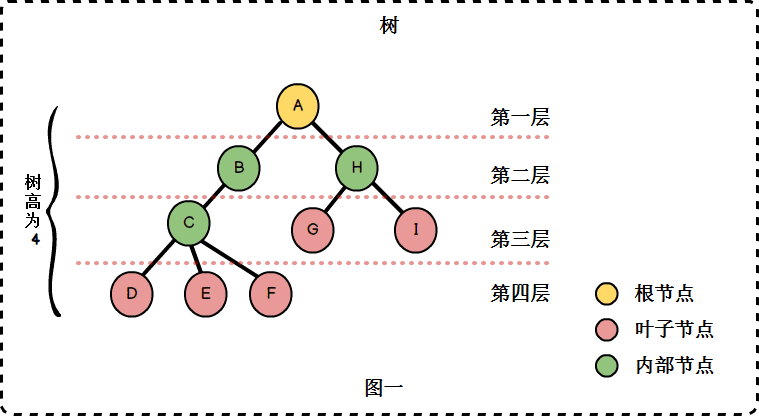
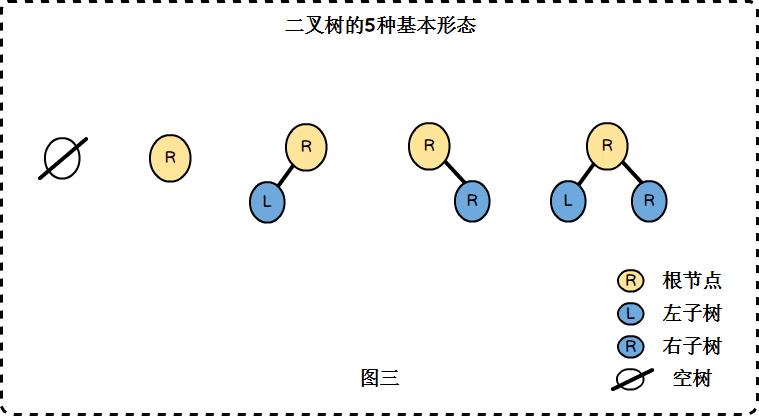
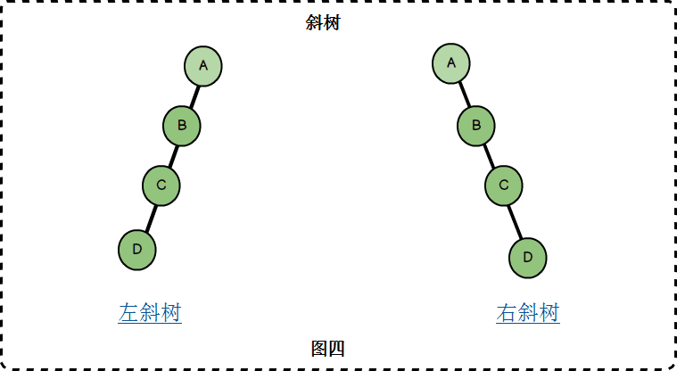
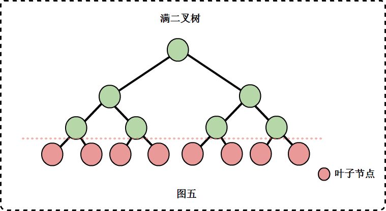
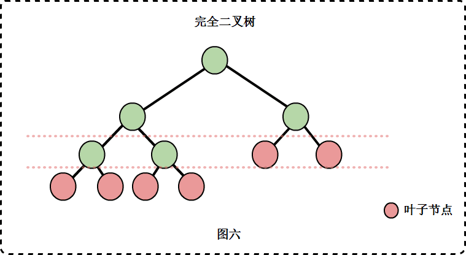
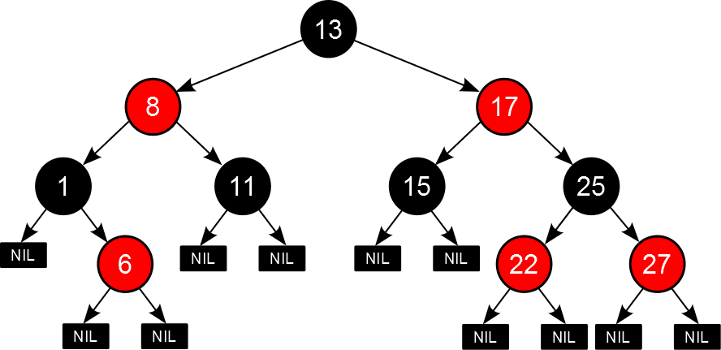

# 树结构

树是一种数据结构，它是n(n>=0)个节点的有限集。n=0时称为空树。n>0时，有限集的元素构成一个具有层次感的数据结构，区别于线性表一对一的元素关系，树中的节点是一对多的关系。

树具有以下特点:

- n>0时，根节点是唯一的，不可能存在多个根节点
- 每个节点有零个至多个子节点；除了根节点外，每个节点有且仅有一个父节点。根节点没有父节点

​    

# 二叉树 / 完全二叉树 / 满二叉树

**二叉树**: 最多有两棵子树的树被称为二叉树

**斜树**：所有节点都只有左子树的二叉树叫做左斜树，所有节点都只有右子树的二叉树叫做右斜树（本质就是链表）

**满二叉树**：二叉树中所有非叶子结点的度都是2，且叶子结点都在同一层次上

**完全二叉树**： 如果一个二叉树与满二叉树前n个节点的结构相同，这样的二叉树被称为完全二叉树

​     

# 二叉查找树BST

二叉查找树（Binary Search Tree）是指一棵空树或者具有下列性质的二叉树：

> 若任意节点的左子树不空，则左子树上所有节点的值均小于它的根节点的值；
>
> 若任意节点的右子树不空，则右子树上所有节点的值均大于它的根节点的值；
>
> 任意节点的左、右子树也分别为二叉查找树；
>
> 没有键值相等的节点。

相比于其他数据结构，二叉查找树的优势在于查找、插入的时间复杂度较低为 O ( log ⁡ n )，常用于构建更为抽象的数据结构，如集合、多重集、关联数组等。

