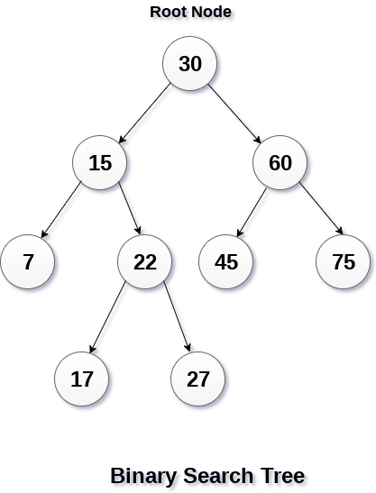

# 树结构

树是一种数据结构，它是n(n>=0)个节点的有限集。n=0时称为空树。n>0时，有限集的元素构成一个具有层次感的数据结构，区别于线性表一对一的元素关系，树中的节点是一对多的关系。

树具有以下特点:

- n>0时，根节点是唯一的，不可能存在多个根节点
- 每个节点有零个至多个子节点；除了根节点外，每个节点有且仅有一个父节点。根节点没有父节点

<div align="center"></div>

​    

# 二叉树 / 完全二叉树 / 满二叉树

**二叉树**: 最多有两棵子树的树被称为二叉树

<div align="center"></div>

**斜树**：所有节点都只有左子树的二叉树叫做左斜树，所有节点都只有右子树的二叉树叫做右斜树（本质就是链表）

<div align="center"></div>

**满二叉树**：二叉树中所有非叶子结点的度都是2，且叶子结点都在同一层次上

<div align="center"></div>

**完全二叉树**： 如果一个二叉树与满二叉树前n个节点的结构相同，这样的二叉树被称为完全二叉树

<div align="center"></div>

​     

# 二叉查找树 BST

二叉查找树（Binary Search Tree）是指一棵空树或者具有下列性质的二叉树：

> 若任意节点的左子树不空，则左子树上所有节点的值均小于它的根节点的值；
>
> 若任意节点的右子树不空，则右子树上所有节点的值均大于它的根节点的值；
>
> 任意节点的左、右子树也分别为二叉查找树；
>
> 没有键值相等的节点；

相比于其他数据结构，二叉查找树的优势在于查找、插入的时间复杂度较低为 O ( log ⁡ n )，常用于构建更为抽象的数据结构，如集合、多重集、关联数组等。

<div align="center"></div>

​      

# 平衡二叉树 AVL

含有相同节点的二叉查找树可以有不同的形态，而二叉查找树的平均查找长度与树的深度有关，所以需要找出一个查找平均长度最小的一棵，那就是平衡二叉树，具有以下性质:

> 要么是棵空树，要么其根节点左右子树的深度之差的绝对值不超过1；
>
> 节点左右子树也都是平衡二叉树；
>
> 二叉树节点的平衡因子定义为该节点的左子树的深度减去右子树的深度。则平衡二叉树的所有节点的平衡因子只可能是-1,0,1；

平衡二叉树的常用实现方法有 `红黑树`、`AVL`、`替罪羊树`、`Treap`、`伸展树` 等，其中最小二叉平衡树的节点的公式如下 **F(n) = F(n-1) + F(n-2) + 1** 这个类似于一个递归的数列，可以参考Fibonacci数列，1是根节点，F(n-1)是左子树的节点数量，F(n-2)是右子树的节点数量。

<div align="center"></div>

​       

如果在AVL树中进行插入或删除节点后，可能导致AVL树失去平衡。这种失去平衡的可以概括为4种姿态：LL(左左)，LR(左右)，RR(右右)和RL(右左)

<div align="center"></div>

上图中的4棵树都是"失去平衡的AVL树"，从左往右的情况依次是: LL、LR、RL、RR，当然除了上面的情况之外，还有其它的失去平衡的AVL树，如下图：

<div align="center"></div>

如果在AVL树中进行插入或删除节点后，可能导致AVL树失去平衡。AVL失去平衡之后，可以通过旋转使其恢复平衡，下面分别介绍 "LL(左左)，LR(左右)，RR(右右)和RL(右左)" 这4种情况对应的旋转方法

​       

## LL 旋转

**LL**：LeftLeft，也称为"左左"。插入或删除一个节点后，根节点的左子树的左子树还有非空子节点，导致"根的左子树的高度"比"根的右子树的高度"大2，导致AVL树失去了平衡。

例如，在上面LL情况中，由于"根节点(8)的左子树(4)的左子树(2)还有非空子节点"，而"根节点(8)的右子树(12)没有子节点"；导致"根节点(8)的左子树(4)高度"比"根节点(8)的右子树(12)"高2。

LL失去平衡的情况，可以通过一次旋转让AVL树恢复平衡，如下图：（**根节点k2右旋**）

<div align="center"></div>

对于LL旋转，可以这样理解为：LL旋转是围绕 "**失去平衡的AVL根节点**" 进行的，也就是节点k2；而且由于是LL情况，即左左情况，就用手抓着"左孩子，即k1"使劲摇。将k1变成根节点，k2变成k1的右子树，"k1的右子树"变成"k2的左子树"。

```go
/*
 * LL: 左左对应的情况(左单旋转)
 *
 * 返回值: 旋转后的根节点
 */
func leftLeftRotation(k2 AVLTreeNode) AVLTreeNode {
    var k1 AVLTreeNode

    k1 = k2.left
    k2.left = k1.right
    k1.right = k2

    k2.height = max( height(k2.left), height(k2.right)) + 1
    k1.height = max( height(k1.left), k2.height) + 1

    return k1
}
```

​         

## LR 旋转

**LR**： LeftRight，也称为"左右"。插入或删除一个节点后，根节点的左子树的右子树还有非空子节点，导致"根的左子树的高度"比"根的右子树的高度"大2，导致AVL树失去了平衡。

例如，在上面LR情况中，由于"根节点(8)的左子树(4)的左子树(6)还有非空子节点"，而"根节点(8)的右子树(12)没有子节点"；导致"根节点(8)的左子树(4)高度"比"根节点(8)的右子树(12)"高2；

LR失去平衡的情况，需要经过两次旋转才能让AVL树恢复平衡。如下图：（**先左旋后右旋**）

<div align="center"></div>

第一次旋转是围绕"k1"进行的"**RR旋转**"，第二次是围绕"k3"进行的"**LL旋转**"

```go
/*
 * LR: 左右对应的情况(左双旋转)
 *
 * 返回值: 旋转后的根节点
 */
func leftRightRotation(k3 AVLTreeNode) AVLTreeNode {
    k3.left = rightRightRotation(k3.left)

    return leftLeftRotation(k3)
}
```

​      

## RR旋转

**RR**： RightRight，称为"右右"。插入或删除一个节点后，根节点的右子树的右子树还有非空子节点，导致"根的右子树的高度"比"根的左子树的高度"大2，导致AVL树失去了平衡。

例如，在上面RR情况中，由于"根节点(8)的右子树(12)的右子树(14)还有非空子节点"，而"根节点(8)的左子树(4)没有子节点"；导致"根节点(8)的右子树(12)高度"比"根节点(8)的左子树(4)"高2。

RR是与LL对称的情况！RR恢复平衡的旋转方法如下：（**根节点k1的左旋**）

<div align="center"></div>

```go
/*
 * RR: 右右对应的情况(右单旋转)
 *
 * 返回值: 旋转后的根节点
 */
func rightRightRotation(k1 AVLTreeNode) AVLTreeNode {
    var k2 AVLTreeNode

    k2 = k1.right
    k1.right = k2.left
    k2.left = k1

    k1.height = max( height(k1.left), height(k1.right)) + 1
    k2.height = max( height(k2.right), k1.height) + 1

    return k2
}
```

​      

## RL旋转

**RL**： RightLeft，称为"右左"。插入或删除一个节点后，根节点的右子树的左子树还有非空子节点，导致"根的右子树的高度"比"根的左子树的高度"大2，导致AVL树失去了平衡。

例如，在上面RL情况中，由于"根节点(8)的右子树(12)的左子树(10)还有非空子节点"，而"根节点(8)的左子树(4)没有子节点"；导致"根节点(8)的右子树(12)高度"比"根节点(8)的左子树(4)"高2；

RL是与LR的对称情况！RL恢复平衡的旋转方法如下：（**先右旋后左旋**）

<div align="center"></div>

第一次旋转是围绕"k3"进行的"LL旋转"，第二次是围绕"k1"进行的"RR旋转"。

```go
/*
 * RL: 右左对应的情况(右双旋转)
 *
 * 返回值: 旋转后的根节点
 */
func rightLeftRotation(k1 AVLTreeNode) AVLTreeNode {
    k1.right = leftLeftRotation(k1.right)

    return rightRightRotation(k1)
}
```

​      

# 红黑树 R-B

红黑树也是一种自平衡的二叉查找树

> 每个结点要么是红的，要么是黑的（红或黑）；
>
> 根结点是黑的（***根黑***）；
>
> 每个叶结点都是黑的，注意叶结点是指树尾端NIL指针或NULL结点 (***叶黑***)；
>
> 如果一个结点是红的，那么它的两个儿子都是黑的 （***红子黑***）；
>
> 对于任意结点而言，其到叶结点树尾端NIL指针的 <u>*每条路径都包含相同数目的黑结点*</u>（***路径下黑相同***）

`红黑树的性质`：红黑树是一棵二叉搜索树，它在每个节点增加了一个存储位记录节点的颜色，可以是RED,也可以是BLACK；通过任意一条从根到叶子简单路径上颜色的约束，红黑树保证最长路径不超过最短路径的二倍，因而近似平衡。

<div align="center"></div>

用法最广:

- Java ConcurrentHashMap & TreeMap
- C++ STL: map & set
- linux进程调度Completely Fair Scheduler,用红黑树管理进程控制块
- epoll在内核中的实现，用红黑树管理事件块
- nginx中，用红黑树管理timer等

​       

# 哈夫曼树 Huffman

Huffman Tree，中文名是哈夫曼树或霍夫曼树，它是最优二叉树，其定义：给定 n 个权值作为 n 个叶子结点，构造一棵二叉树，若树的带权路径长度达到最小，则这棵树被称为哈夫曼树。

<div align="center"></div>

名词解释

> `路径与路径长度`: 从树中一个节点到另一个节点之间的分支构成了两个节点之间的路径，路径上的分支数目称作路径长度。若规定根节点位于第一层，则根节点到第H层的节点的路径长度为H-1。如到40 的路径长度为1；30的路径长度为2；20的路径长度为3；
>
> `节点的权`: 将树中的节点赋予一个某种含义的数值作为该节点的权值，该值称为节点的权；
>
> `带权路径长度`: 从根节点到某个节点之间的路径长度与该节点的权的乘积。例如上图节点10的路径长度为3,它的带权路径长度为10 * 3 = 30；
>
> `树的带权路径长度`: 树的带权路径长度为所有叶子节点的带权路径长度之和，称为WPL。上图的WPL = 1x40+2x30+3x10+3x20 = 190，而哈夫曼树就是树的带权路径最小的二叉树

​         

假设有n个权值，则构造出的哈夫曼树有n个叶子结点。 n个权值分别设为 w1、w2、…、wn，哈夫曼树的构造规则为:

> 1）将所有左，右子树都为空的作为根节点；
>
> 2）在森林中选出两棵根节点的权值最小的树作为一棵新树的左，右子树，且置新树的附加根节点的权值为其左，右子树上根节点的权值之和（注意：左子树的权值应小于右子树的权值）；
>
> 3）从森林中删除这两棵树，同时把新树加入到森林中；
>
> 4）重复2，3步骤，直到森林中只有一棵树为止，此树便是哈夫曼树；

<div align="center"></div>

​      

# 前缀树/字典树 Tire

Trie，又称字典树、单词查找树或键树，是一种树形结构（`N 叉树` 的一种特殊形式），是一种哈希树的变种。典型应用是用于统计，排序和保存大量的字符串（但不仅限于字符串），所以经常被搜索引擎系统用于文本词频统计。它的优点是利用字符串的公共前缀来减少查询时间，最大限度地减少无谓的字符串比较，查询效率比哈希树高。

<div align="center"></div>

Trie树的基本性质：

> 1）根节点不包含字符，除根节点外的每一个子节点都包含一个字符（便于插入和查找）；
>
> 2）从根节点到某一个节点，路径上经过的字符连接起来，为该节点对应的字符串；
>
> 3）每个节点的所有子节点包含的字符互不相同，也就是找到对应单词、字符是唯一的；

​     

***怎么设计这个字典树呢？***

对于一个字典树Trie类，肯定是要有一个根节点root的，而这个节点类型TrieNode也有很多设计方式，为了简单放一个26个大小的TrieNode类型数组，分别对应'a'-'z'的字符，同时用一个boolean类型变量isEnd表示是否为字符串末尾结束

```go
struct TrieNode {
  	son []TrieNode
    isEnd boolean //结束标志
}
```

用数组的话如果字符比较多的话可能会消耗一些内存空间，但是这里26个连续字符还好的，如果向一个字典树中添加 `big`, `bit`, `bz` 那么它其实是这样的：

<div align="center"></div>

​      

# B树

B树（B-tree）是一种自平衡的树，能够保持数据有序。这种数据结构能够让`查找数据、顺序访问、插入数据及删除的动作`，都在对数时间内完成。B树，概括来说是一种自平衡的m阶树，与自平衡二叉查找树不同，B树适用于读写相对大的数据块的存储系统，例如磁盘。

> 根结点至少有两个子女；
>
> 每个中间节点都包含k-1个元素和k个孩子，其中 m/2 <= k <= m；
>
> 每一个叶子节点都包含k-1个元素，其中 m/2 <= k <= m；
>
> 所有的叶子结点都位于同一层；
>
> 每个节点中的元素从小到大排列，节点当中k-1个元素正好是k个孩子包含的元素的值域分划；

B-Tree中的每个节点根据实际情况可以包含大量的关键字信息和分支，如下图所示为一个3阶的B-Tree：

<div align="center"></div>

​       

# B+树

B+ 树是一种树数据结构，通常用于关系型数据库（如Mysql）和操作系统的文件系统中。B+ 树的特点是能够保持数据稳定有序，其插入与修改拥有较稳定的对数时间复杂度。B+ 树元素自底向上插入，这与二叉树恰好相反。

在B树基础上，为叶子结点增加链表指针(B树+叶子有序链表)，所有关键字都在叶子结点 中出现，非叶子结点作为叶子结点的索引；B+树总是到叶子结点才命中。

b+树的非叶子节点不保存数据，只保存子树的临界值(最大或者最小)，所以同样大小的节点，b+树相对于b树能够有更多的分支，使得这棵树更加矮胖，查询时做的IO操作次数也更少。

将上一节中的B-Tree优化，由于B+Tree的非叶子节点只存储键值信息，假设每个磁盘块能存储4个键值及指针信息，则变成B+Tree后其结构如下图所示：

<div align="center"></div>

​      

# R树

R树是用来做空间数据存储的树状数据结构。例如给地理位置，矩形和多边形这类多维数据建立索引。

**核心思想** 是聚合距离相近的节点并在树结构的上一层将其表示为这些节点的最小外接矩形(MBR)，这个最小外接矩形就成为上一层的一个节点。因为所有节点都在它们的最小外接矩形中，所以跟某个矩形不相交的查询就一定跟这个矩形中的所有节点都不相交。叶子节点上的每个矩形都代表一个对象，节点都是对象的聚合，并且越往上层聚合的对象就越多。也可以把每一层看做是对数据集的近似，叶子节点层是最细粒度的近似，与数据集相似度100%，越往上层越粗糙。

<div align="center"></div>


# 附录

1. [30张图带你彻底理解红黑树](https://www.cnblogs.com/kumufengchun/p/11169138.html)
2. [一文搞懂字典树](https://segmentfault.com/a/1190000040801084)
3. [平衡二叉树（AVL树）](https://www.cnblogs.com/yichunguo/p/12040456.html)
4. [AVL树](https://www.cnblogs.com/skywang12345/p/3577479.html)
5. [Huffman树](https://pdai.tech/md/algorithm/alg-basic-tree-hafman.html)
6. [BST树](https://www.cnblogs.com/skywang12345/p/3576452.html)
7. [【经典数据结构】B树与B+树](https://www.cnblogs.com/vincently/p/4526560.html)
8. [从B树、B+树、B*树谈到R 树](https://blog.csdn.net/v_JULY_v/article/details/6530142/)

