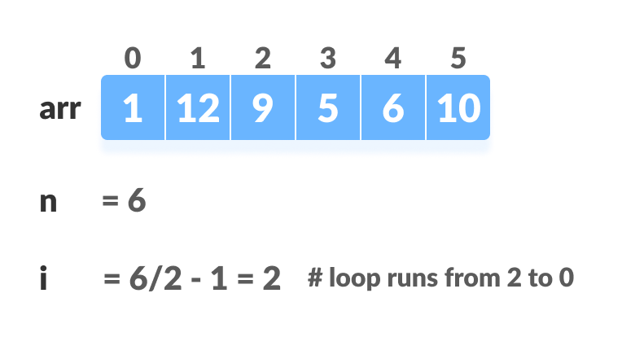
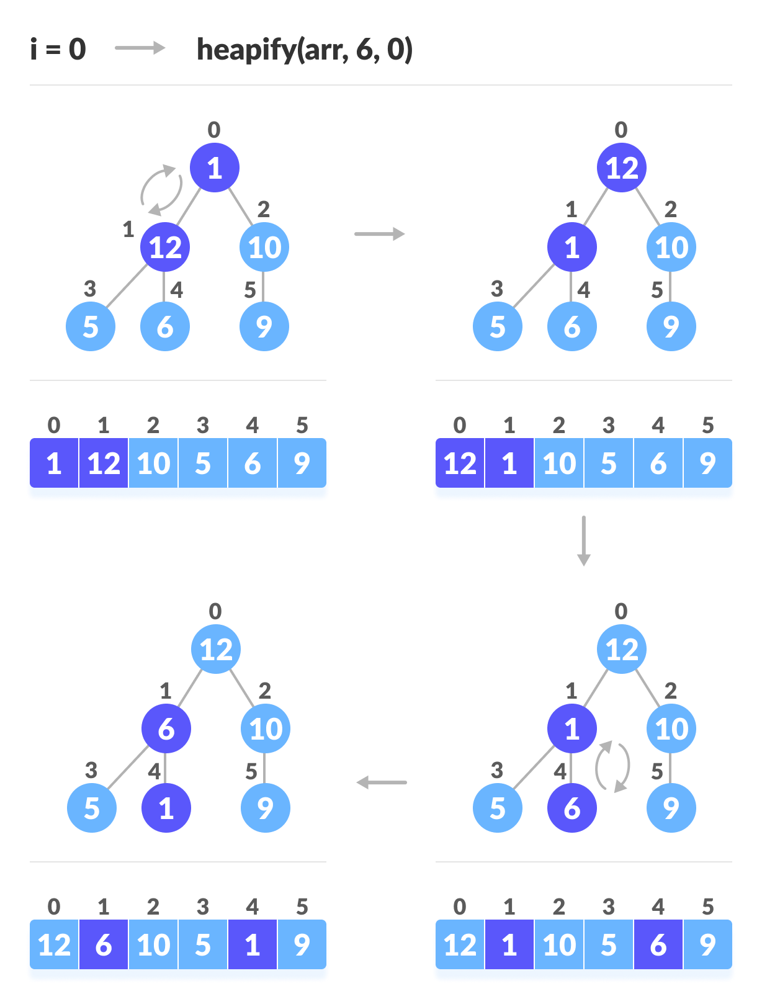
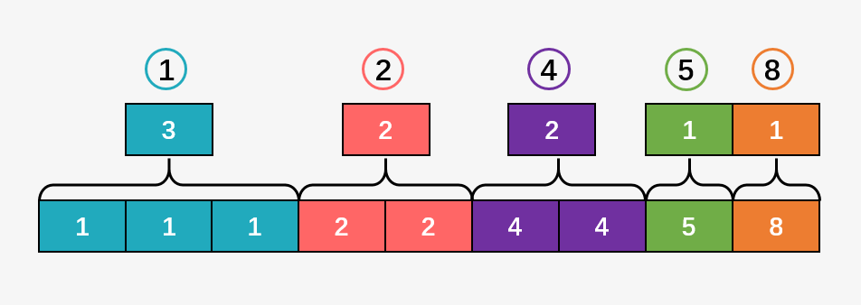

# 排序算法

常见排序算法

<div align="center"></div>

> **稳定性**：如果待排序的文件中，存在有多关键码相同的元素，经过排序后这些具有相同关键码的元素之间的相对次序保持不变，则该排序算法是稳定的；否则，如果相同关键码的元素之间的相对次序发生变化，则该排序算法是不稳定的。

​     

# 一 插入排序

插入排序类似于玩纸牌时整理手中纸牌的过程，它的基本方法是寻找一个指定元素在代排序元素中的位置，然后进行插入。

​      

## 1 直接插入排序（Insertion Sort）

**基本思想**：把n个待排序的元素看成为一个 `有序表` 和一个 `无序表`。开始时有序表中只包含1个元素，无序表中包含有n-1个元素，排序过程中每次从无序表中取出第一个元素，将它插入到有序表中的适当位置，使之成为新的有序表，重复n-1次可完成排序过程。

假设 {20,30,40,10,60,50} 中的前3个数已经排列过，是有序的了，接下来对10进行排列，即如下图中将数列分为有序区和无序区

* 1）取出无序区中的第1个数，并找出它在有序区对应的位置；
* 2）将无序区的数据插入到有序区；若有必要的话，则对有序区中的相关数据进行移位；

<div align="center"></div>

​          

时间复杂度

> 直接插入排序的时间复杂度是 **O(N^2)**，假设被排序的数列中有N个数，遍历一趟的时间复杂度是O(N)，需要遍历多少次呢? N-1！因此，直接插入排序的时间复杂度是 **O(N^2)**。

稳定性

> 直接插入排序是稳定的算法
>
> `算法稳定性` -- 假设在数列中存在a[i]=a[j]，若在排序之前，a[i]在a[j]前面；并且排序之后，a[i]仍然在a[j]前面。则这个排序算法是稳定的！

```go
func InsertionSorts(nums []int) {
	var i, j, key int

	for i = 1; i < len(nums); i++ {
		key = nums[i]

		// 从后往前顺序查找
		for j = i - 1; j >= 0 && key < nums[j]; j-- {
			// 元素后移
			nums[j+1] = nums[j]
		}

		// 插入元素
		nums[j+1] = key
	}
}
```

​     

## 2 希尔排序（Shell Sort）

**基本思想**：实质上是一种分组插入方法，即对于n个待排序的数列，取一个小于n的整数gap（**步长**）将待排序元素分成若干个组子序列，所有距离为gap的倍数的记录放在同一个组中，然后对各组内的元素进行直接插入排序。 这一趟排序完成之后，每一个组的元素都是有序的。然后减小gap的值，并重复执行上述的分组和排序，而后重复这样的操作，当gap=1时，整个数列就是有序的。

简单插入排序很循规蹈矩，不管数组分布是怎么样的，依然一步一步的对元素进行比较 / 移动 / 插入，比如[5,4,3,2,1,0] 这种倒序序列，数组末端的0要回到首位置很是费劲，比较和移动元素均需n-1次。而希尔排序在数组中采用 **跳跃式分组** 的策略，通过某个增量将数组元素划分为若干组，然后分组进行插入排序，随后逐步缩小增量，继续按组进行插入排序操作，直至增量为1。希尔排序通过这种策略使得整个数组在初始阶段达到从宏观上看基本有序，小的基本在前，大的基本在后。然后缩小增量，到增量为1时，其实多数情况下只需微调即可，不会涉及过多的数据移动。

接下来看下希尔排序的基本步骤，在此选择增量 gap=length/2，缩小增量继续以gap = gap/2的方式，这种增量选择可以用一个序列来表示 {n/2, (n/2)/2, ...1} ，称为**增量序列**。希尔排序的增量序列的选择与证明是个数学难题，但选择的这个增量序列是比较常用的，也是希尔建议的增量，称为 **希尔增量**，但其实这个增量序列不是最优的。

<div align="center"></div>

​             

时间复杂度

> 希尔排序的时间复杂度与增量（步长gap）的选取有关。例如当增量为1时，希尔排序退化成了直接插入排序，此时的时间复杂度为O(N²)，而Hibbard增量的希尔排序的时间复杂度为O(N^1.5)。

稳定性

> 希尔排序是按照不同步长对元素进行插入排序，当刚开始元素很无序的时候，步长最大，所以插入排序的元素个数很少，速度很快；当元素基本有序了，步长很小， 插入排序对于有序的序列效率很高，所以希尔排序的时间复杂度会比O(n^2)好一些。由于多次插入排序，知道一次插入排序是稳定的，不会改变相同元素的相对顺序，但**在不同的插入排序过程中，相同的元素可能在各自的插入排序中移动，最后其稳定性就会被打乱，所以shell排序是不稳定的**。

```go
func ShellSort(nums []int) {
	var i, j, d, key int

	// 以d为增量，在子序列中进行插入排序
	for d = len(nums) / 2; d >= 1; d /= 2 {
		// 一趟希尔排序
		for i = d + 1; i < len(nums); i++ {
			if nums[i] < nums[i-d] {
				key = nums[i]
				// 从后往前顺序查找
				for j = i - d; j >= 0 && key < nums[j]; j -= d {
					// 元素后移
					nums[j+d] = nums[j]
				}

				// 插入元素
				nums[j+d] = key
			}
		}
	}
}
```

​          

# 二 交换排序

交换排序基本方法是在待排序的元素中选择2个元素，将他们的关键码进行比较，如果反序则交换他们的位置，直到么有反序的记录为止。

​      

## 1 **冒泡排序（Bubble Sort）**

**基本思想**：两两比较相邻元素，如果反序则交换位置，直到没有反序的元素为止。即将整个待排序元素划分成有序区和无序区，初始状态有序区为空，无序区包括所有元素；而后对无序区从前往后依次将相邻元素进行比较，若反序则交换，从而使关键码较小（或较大）的元素向前移，关键码较大（或较小）的元素向后移；重复执行前一个步骤，直到无序区中没有反序元素为止。

> PS：基本冒泡排序算法每次只能添加一个到有序区，所以存在无序区的有序元素也需要进行比较的问题，为了去掉这种不必要开销，可将最后一次交换位置的pos，作为下一趟无序区的末尾。

<div align="center"></div>

时间复杂度

> 冒泡排序的时间复杂度是O(N^2)。 假设被排序的数列中有N个数，遍历一趟的时间复杂度是O(N)，需要遍历多少次呢? N-1次！因此冒泡排序的时间复杂度是O(N^2)。

稳定性

> 冒泡排序是稳定的算法，它满足稳定算法的定义！

```go
// BubbleSort 基本冒泡排序
func BubbleSort(nums []int) {
	n := len(nums)
	for i := 0; i < n-1; i++ {
		for j := 0; j < n-1-i; j++ {
			if nums[j] > nums[j+1] {
				nums[j], nums[j+1] = nums[j+1], nums[j]
			}
		}
	}
}

// BubbleSortOptimizedV1 冒泡排序优化算法V1, 标记位
func BubbleSortOptimizedV1(nums []int) {
	var isSwap bool
	n := len(nums)
	for i := 0; i < n-1; i++ {
		isSwap = false
		for j := 0; j < n-1-i; j++ {
			if nums[j] > nums[j+1] {
				nums[j], nums[j+1] = nums[j+1], nums[j]
				isSwap = true
			}
		}

		if !isSwap {
			break
		}
	}
}

// BubbleSortOptimizedV2 冒泡排序优化算法, 优化无序区范围
func BubbleSortOptimizedV2(nums []int) {
	pos := len(nums)
	for pos > 0 {
		bound := pos // 本次无序区元素范围
		pos = 0
		for j := 0; j < bound-1; j++ {
			if nums[j] > nums[j+1] {
				nums[j], nums[j+1] = nums[j+1], nums[j]
				pos = j + 1
			}
		}
	}
}
```

​       

## 2 **快速排序（Quick Sort）**

**基本思想**：在分区中选择一个元素作为轴值，将待排序元素划分两个分区，使得左侧元素的关键码均<=（或>=）轴值，右侧元素的关键码均>=（或<=）轴值，然后分别对两个分区重复上述过程，直到整个序列有序。

需要解决的问题

> 1）**轴值选择**：选择首位 / 中间 / 末尾 等元素都可以；
>
> 2）**分区实现**，以从小到大排序为例，分区算法要求大于轴值的元素左移，小于轴值的元素右移，因此可按照以下算法实现
>
> * **初始化**：取第一个元素作为轴值，保存在r[0]，i=1为左侧待比较元素，j=n-1为右侧待比较元素；
> * **右侧扫描**：从右往左找到第一个比轴值小的元素，移至位置i；
> * **左侧扫描**：从左往右找到第一个比轴值大的元素，移至位置j；

下图只是给出了第1趟快速排序的流程，在第1趟中，设置x=a[i]，即x=30。按照同样的方法，对子数列进行递归遍历。最后得到有序数组！

<div align="center"></div>

快速排序是不稳定的算法，时间复杂度在最坏情况下是O(N^2)，平均的时间复杂度是O(N*lgN)

> 假设被排序的数列中有N个数。遍历一次的时间复杂度是O(N)，需要遍历多少次呢? 至少lg(N+1)次，最多N次
>
> * 为什么最少是lg(N+1)次? 快速排序是采用的分治法进行遍历的，将它看作一棵二叉树，它需要遍历的次数就是二叉树的深度，而根据完全二叉树的定义，它的深度至少是lg(N+1)。因此快速排序的遍历次数最少是lg(N+1)次；
> * 为什么最多是N次? 这个应该非常简单，还是将快速排序看作一棵二叉树，它的深度最大是N。因此快读排序的遍历次数最多是N次；

```go
// Partition 快排一趟排序算法
func Partition(nums []int, left, right int) int {
	i, j := left, right
	pivot := nums[i] // 轴值
	for i < j {
		for i < j && nums[j] >= pivot { // 右侧扫描
			j--
		}
		nums[i] = nums[j]

		for i < j && nums[i] <= pivot { // 左侧扫描
			i++
		}
		nums[j] = nums[i]
	}

	// i==j 即为轴值位置, 因此分区扫描过程无需每次对轴值进行位置交换
	nums[i] = pivot

	return i
}

// QuickSort 基础快速排序算法
func QuickSort(nums []int, start, end int) {
	if start < end {
		pivotLoc := Partition(nums, start, end)
		QuickSort(nums, start, pivotLoc-1)
		QuickSort(nums, pivotLoc+1, end)
	}
}
```

​        

# 三 选择排序

选择排序的基本方法：每趟排序在待排序序列中选择关键码最小或最大的元素，顺序添加到已排好序的有序序列的最后，直到全部记录排序完毕。

​      

## 1 选择排序（Selection sort）

**基本思想**：为每一趟从待排序的数据元素中选择最小（或最大）的一个元素作为首元素，直到所有元素排完为止，简单选择排序是**不稳定排序**。

在算法实现时，每一趟确定最小元素的时候会通过不断地比较交换来使得首位置为当前最小，交换是个比较耗时的操作。其实很容易发现，在还未完全确定当前最小元素之前，这些交换都是无意义的，因此可以通过设置一个变量min，每一次比较仅存储较小元素的数组下标，当轮循环结束之后，那这个变量存储的就是当前最小元素的下标，此时再执行交换操作即可。

<div align="center"></div>

简单选择排序通过上面优化之后，无论数组原始排列如何，比较次数是不变的；对于交换操作，在最好情况下也就是数组完全有序的时候，无需任何交换移动，在最差情况下，也就是数组倒序的时候，交换次数为n-1次。因此，综合下来，时间复杂度为 **O(n^2)**。

```go
func SellectionSort(nums []int) {
	for i := 0; i < len(nums)-1; i++ {
		// 每一趟循环比较时，min用于存放较小元素的数组下标，这样当前批次比较完毕最终存放的就是此趟内最小的元素的下标，
		// 避免每次遇到较小元素都要进行交换。
		min := i
		for j := i + 1; j < len(nums); j++ {
			if nums[j] < nums[min] {
				min = j
			}
		}

		// 如果min发生变化，则进行交换
		if min != i {
			nums[min], nums[i] = nums[i], nums[min]
		}
	}
}
```

​         

## 2 堆排序（Heap Sort）

**基本思想**：根据堆的性质，堆的根结点总是堆中的最小元素（小根堆）或最大元素（大根堆），所以将根结点逐个输出，并令剩下的部分重新恢复堆的性质，从而进一步实现排序。

堆存储结构，对于一个具有n个记录的堆，可以用如下方法，由数组r[]存放它：

> 1. 根结点存放在r[0]；
> 2. 假定结点x存放在r[i]，若它有左孩子结点，则其左孩子结点存放在r[2i+1]，如果有右孩子结点，则其右孩子结点存放在r[2(i + 1)]；
> 3. 非根结点r[i]的父结点存放在r[(i-1)/2]；

堆是具有下列性质的完全二叉树：

> **大根堆**：每个结点的值 <= 左右孩子结点的值 (**arr[i] >= arr[2i+1] && arr[i] >= arr[2i+2]**  )
>
> **小根堆**：每个结点的值 >= 左右孩子结点的值 (**arr[i] <= arr[2i+1] && arr[i] <= arr[2i+2]**  )

<div align="center"></div>

同时对堆中的结点按层进行编号，将这种逻辑结构映射到数组中就是下面这个样子：

<div align="center"></div>

​     

**堆调整问题**

> **筛选**：即一颗完全二叉树中，根结点的左右子树都是堆，如何调整根结点，是整个二叉树成为一个堆？
>
> 大根堆筛选过程：总是将根结点与左右孩子进行比较，若不满足堆条件，则将根结点与较大的结点进行交换，一直到叶子结点，或所有子树均为堆为止，类似可以得到小根堆的筛选过程。
>
> <div align="center"></div>

   

**堆的建立**

> 从最后一个分支结点开始逐个向上筛选，直到根结点结束，这样从最后一颗子树开始使其符合堆性质，迭代地使整个二叉树都符合堆性质。若堆序列长度为n，则最后一个分支结点编号为【(n-1)/2】。
>
> <div align="center"></div>
>
> 则整个大根堆的建立过程如下：
>
> 1）第一次筛选
>
> <div align="center"></div>
>
> 2）第二次筛选
>
> <div align="center"></div>
>
> 3）第三次筛选
>
> <div align="center"></div>

​    

**堆排序过程**

> 1）**初始化**：将待排序的元素构造成堆；
>
> 2）**Swap**：交换堆中第一个和最后一个元素位置，即输出**堆顶**元素，并将堆中最后一个元素移至堆顶
>
> 3）**Remove**：堆序列长度减1；
>
> 4）**Heapify**：将剩余元素重新调整成堆；
>
> 5）**迭代**：反复执行步骤2～4，直至堆中只有最后一个元素；
>
> <div align="center"></div>

​    

时间复杂度

> 堆排序的时间复杂度是O(NlgN)

稳定性

> 堆排序是不稳定的算法，它不满足稳定算法的定义。它在交换数据的时候，是比较父结点和子节点之间的数据，所以，即便是存在两个数值相等的兄弟节点，它们的相对顺序在排序也可能发生变化。

```go
// Heapify 大根堆的筛选算法过程
func Heapify(r []int, k, n int) {
	// i 是要筛选的结点, left 是i的左孩子
	i := k
	left := 2*i + 1

	// n为堆序列长度
	for left < n {
		// j 是左右孩子中的较大者
		if left < n-1 && r[left] < r[left+1] {
			left++
		}

		if r[i] > r[left] { // 符合大根堆条件, 结束
			break
		} else {
			// 根结点与还在结点交换
			r[i], r[left] = r[left], r[i]
			i = left
			left = 2*i + 1
		}
	}
}

func HeapSort(nums []int) {
	n := len(nums)
	// Step1: 建堆
	for k := n/2 - 1; k >= 0; k-- {
		Heapify(nums, k, n)
	}

	// Step2: 输出堆顶元素, 并重新建堆
	for i := n - 1; i >= 0; i-- {
		nums[0], nums[i] = nums[i], nums[0]

		Heapify(nums, 0, i)
	}
}
```

​        

# 四 归并排序（Merge Sort）

**基本思想**：将两个或两个以上的有序数列合并成一个有序数列，根据具体的实现，归并排序包括"从上往下"和"从下往上"2种方式

1）**从下往上**：将待排序的数列分成若干个长度为1的子数列，然后将这些数列两两合并；得到若干个长度为2的有序数列，再将这些数列两两合并；得到若干个长度为4的有序数列，再将它们两两合并；直接合并成一个数列为止。这样就得到了我们想要的排序结果。(参考下面的图片)

2）**从上往下**：它与"从下往上"在排序上是反方向的，基本包括：

> `分解` ：将当前区间一分为二，即求分裂点 mid = (low + high)/2；
>
> `求解` ：递归地对两个子区间 a[low...mid] 和 a[mid+1...high] 进行归并排序。递归的终结条件是子区间长度为1；
>
> `合并` ：将已排序的两个子区间 a[low...mid]和 a[mid+1...high] 归并为一个有序的区间 a[low...high]；

<div align="center"></div>

```go
// merge 将一个数组中的两个相邻有序区间合并成一个
func merge(nums []int, s, m, e int) {
	r := make([]int, e-s+1)
	i := s     // i 指向 nums[s~m]
	j := m + 1 // j 指向 nums[m+1~e]
	k := 0

	// 合并 nums[s~m] 和 nums[m+1~e] 重合部分
	for i <= m && j <= e {
		if nums[i] <= nums[j] {
			r[k] = nums[i]
			i++
		} else {
			r[k] = nums[j]
			j++
		}
		k++
	}

	// 若 nums[s~m] 未处理完
	for i <= m {
		r[k] = nums[i]
		i++
		k++
	}

	// 若 nums[m+1~e] 未处理完
	for j <= e {
		r[k] = nums[j]
		j++
		k++
	}

	// 将排序后的元素，全部都整合到数组a中。
	for l := 0; l < k; l++ {
		nums[s+l] = r[l]
	}
}

func MergeSortUp2Down(nums []int, start, end int) {
	if nums == nil || start >= end {
		return
	}

	mid := (start + end) / 2
	MergeSortUp2Down(nums, start, mid) // 递归排序a[start...mid]
	MergeSortUp2Down(nums, mid+1, end) // 递归排序a[mid+1...end]

	// a[start...mid] 和 a[mid...end]是两个有序空间
	// 将它们排序成一个有序空间a[start...end]
	merge(nums, start, mid, end)
}
```

​       

# 五 桶排序（Bucket Sort）

**基本思想**：将数组分到有限数量的桶子里，然后每个桶子再分别排序，有可能再使用别的排序算法或是以递归方式继续使用桶排序进行排序。

假设待排序的数组a中共有N个整数，并且已知数组a中数据的范围 **[0, MAX)** ，则在桶排序时，创建容量为MAX的桶数组r，并将桶数组元素都初始化为0，并将容量为MAX的桶数组中的每一个单元都看作一个"桶"。在排序时，逐个遍历数组a，将数组a的值，作为"桶数组r"的下标，因此当a中数据被读取时，就将桶的值加1。例如，读取到数组a[3]=5，则将r[5]的值+1。

<div align="center"></div>

**平均时间复杂度: O(n + k)，空间复杂度: O(n * k)，且属于稳定算法**

> 桶排序最好情况下使用线性时间O(n)，桶排序的时间复杂度，取决与对各个桶之间数据进行排序的时间复杂度，因为其它部分的时间复杂度都为O(n)。很显然，桶划分的越小，各个桶之间的数据越少，排序所用的时间也会越少。但相应的空间消耗就会增大。

​     

假设存在数组 [0.42, 0.32, 0.23, 0.52, 0.25, 0.47, 0.51]（PS：各元素值在0～1），则桶排序算法思想处理如下：

<div align="center"></div>

<div align="center"></div>

```go
// BucketSort 桶排序示例
func BucketSort(nums []float64, n int) {
	if n <= 0 {
		return
	}

	// 定义 & 初始化 n个桶
	buckets := make([][]float64, n)
	for i := 0; i < n; i++ {
		buckets[i] = []float64{}
	}

	// 按照一定规则将数组元素存储到各个桶中, 比如 小数(<1) * 10
	for j := 0; j < len(nums); j++ {
		bucketInd := (int)(10 * nums[j])
		buckets[bucketInd] = append(buckets[bucketInd], nums[j])
	}

	// 对桶内元素进行排序
	for i := 0; i < n; i++ {
		sort.Float64s(buckets[i])
	}

	// 依次将桶内元素顺序输出
	ind := 0
	for i := 0; i < n; i++ {
		for j := 0; j < len(buckets[i]); j++ {
			nums[ind] = buckets[i][j]
			ind++
		}
	}
}
```

​       

# 六 计数排序（Counting Sort）

计数排序（Counting Sort）是一种针对于 **特定范围之间的整数** 进行排序的算法，通过统计给定数组中不同元素的数量（类似于哈希映射），然后对映射后的数组进行排序输出即可。

假设：待排序数组 nums = [1, 4, 1, 2, 5, 2, 4, 1, 8]，count是长度为 **9** (原始数组中的最大值 **8** 加 **1**) ，用户计算nums中各数字出现次数的数组

<div align="center"></div>

<div align="center"></div>

至此，如果不考虑计数排序的稳定性，按照数组 **`count[]`** 中对应下标的出现次数直接输出即为已排序序列。

**为了保证计数排序的稳定性，我们又该如何做呢？**

> 先不考虑这么复杂，但是从宏观的角度来看，目的就是找到待排序数组中每一个元素在排序后数组当中的正确位置。
>
> 首先看一下 **`count[]`** 数组本身， 数组中的 **0** 对于我们的输出没有任何影响，所以可以考虑将其直接去掉：
>
> <div align="center"></div>
>
> 那么就可根据去掉之后的数组得到排序后数组的一个轮廓图：
>
> <div align="center"></div>
>
> 可以看到，数组 **`count[]`** 中的每一个值 ***表示它所对应的下标在排序后数组的出现次数***，那么我们遍历数组（下标从 1 开始），并对数组 **`count[]`** 中的每一个元素执行 **count[i] = count[i] + count[i-1]** 会得到什么呢？
>
> <div align="center"></div>
>
> 此时，得到新的 **`count[]`** 将表示每个元素的位置信息，比如 **3** 表示它的下标 **1** 一定出现在前 **3** 的位置；而紧接其后 **5** 则表示下标 **2** 出现在第 **4** 和第 **5** 个位置；下标为 **3** 的 **`count[3] = 5`** ，其与前面的 **`count[2]`** 值相同，两者之差也就表示其出现次数，**0** 次，所以不占位置；下标为 **4** 的位置值为 **7** ，则表示下标 **4** 出现在第 **6** 和 **7** 的位置，依次类推，可以对新的 **`count[]`** 数组中的每一个元素做出解释。
>
> **有了这个新的 `count[]`数组，如何得到元素数组 `arr[]` 在排序后的输出数组 `output[]`  中的正确位置呢？**
>
> 从后向前遍历arr，计算每个元素排序后在输出数组ouput中的位置 **index = count[arr[i]] - 1**，注意每遍历一个元素，则需要将count[arr[i]]数减1。
>
> <div align="center"></div>
>
> **为什么从后向前遍历新的 `count[]` 数组？**
>
> 因为只有这样才能保证计数排序的稳定性，比如原始数组 **`arr[]`** 中 3 个 **1** 的在排序后的相对位置就没有发生变化，依旧保持
>
> <div align="center"></div>

可是问题又来了，如果数组变成了 **arr[] = {-1,4,1,-2,5,-2,4,-1,8}** ，上面介绍的计数排序的实现方式不就出现了问题吗？

可通过将最小元素映射到下标为0的位置即可，即只需要找到数组 **arr[] = {-1,4,1,-2,5,-2,4,-1,8}**  中的最小值 **min = -2** ，以及最大值 **max = 8** ，然后开辟一个大小为 **`max - min + 1`** 的 **count[]** 数组，统计出数组当中每一个元素出现的次数即可：

<div align="center"></div>

```go
// CountingSort 针对于特定范围之间的整数进行排序的算法
func CountingSort(nums []int) {
	n := len(nums)
	output := make([]int, n)

	// Step1: 遍历nums, 对各元素进行计数
	count := make([]int, 256)
	for i := 0; i < n; i++ {
		count[nums[i]]++
	}

	// Step2: 统计每个元素的相对位置信息, 即 count[i] = count[i] + count[i-1]
	for i := 1; i < len(count); i++ {
		count[i] += count[i-1]
	}

	// Step3: 从后向前遍历nums，计算每个元素排序后在输出数组ouput中的位置 index = count[nums[i]] - 1
	// 注意每遍历一个元素，则需要将count[nums[i]]数减1
	for i := n - 1; i >= 0; i-- {
		output[count[nums[i]]-1] = nums[i]
		count[nums[i]] -= 1
	}

	// Step4: 输出排序后数组
	for i := 0; i < n; i++ {
		nums[i] = output[i]
	}
}
```

​      

# 七 基数排序（Radix Sort）

**基本思想**：将整数按位数切割成不同的数字，然后按每个位数分别比较。

具体做法：将所有待比较数值统一为同样的数位长度，数位较短的数前面补零，然后从最低位开始，依次进行一次排序，这样从最低位排序一直到最高位排序完成，之后数列就变成一个有序序列。

通过基数排序对数组{53, 3, 542, 748, 14, 214, 154, 63, 616}，即首先将所有待比较数值统一为统一位数长度，接着从最低位开始，依次进行排序。示意图如下：

> 1）按照个位数进行排序；
>
> 2）按照十位数进行排序；
>
> 3）按照百位数进行排序；
>
> 4）排序后，数列就变成了一个有序序列；

<div align="center"></div>

​     

下面简单介绍一下对数组{53, 3, 542, 748, 14, 214, 154, 63, 616}按个位数进行排序的流程

> 1）个位的数值范围是[0,10)，因此参见桶数组buckets[]，将数组按照个位数值添加到桶中
>
> <div align="center"></div>
>
> 2）后根据桶数组buckets[]来进行排序（**计数排序**），假设将排序后的数组存在output[]中，最后依次输出数组output即为排序后序列。
>
> <div align="center"></div>

```go
// getMax 输出数组最大值
func getMax(nums []int) int {
	res := nums[0]
	for i := 1; i < len(nums); i++ {
		if res < nums[i] {
			res = nums[i]
		}
	}

	return res
}

// CountingSortForRadix 计数排序, 按照exp指数(个位/十位/百位等), 对数组nums按照该指数进行排序
func CountingSortForRadix(nums []int, exp int) {
	n := len(nums)
	output := make([]int, n)

	// Step1: 遍历nums, 对各元素进行计数
	count := make([]int, 10)
	for i := 0; i < n; i++ {
		count[(nums[i]/exp)%10]++
	}

	// Step2: 统计每个元素的相对位置信息, 即 count[i] = count[i] + count[i-1]
	for i := 1; i < len(count); i++ {
		count[i] += count[i-1]
	}

	// Step3: 从后向前遍历nums，计算每个元素排序后在输出数组ouput中的位置 index = count[nums[i]] - 1
	// 注意每遍历一个元素，则需要将count[nums[i]]数减1
	for i := n - 1; i >= 0; i-- {
		output[count[(nums[i]/exp)%10]-1] = nums[i]
		count[(nums[i]/exp)%10] -= 1
	}

	// Step4: 输出排序后数组
	for i := 0; i < n; i++ {
		nums[i] = output[i]
	}
}

// RadixSort 基数排序
func RadixSort(nums []int) {
	maxNum := getMax(nums) // 数组中的最大值

	for exp := 1; maxNum/exp > 0; exp *= 10 {
		CountingSortForRadix(nums, exp)
	}
}
```

​      

# 参考资料

1. [https://pdai.tech/md/algorithm/alg-sort-x-radix.html](https://pdai.tech/md/algorithm/alg-sort-x-radix.html)
2. [https://www.programiz.com/dsa/bubble-sort](https://www.programiz.com/dsa/bubble-sort)
3. [漫画：什么是计数排序？](https://cloud.tencent.com/developer/article/1684188)


