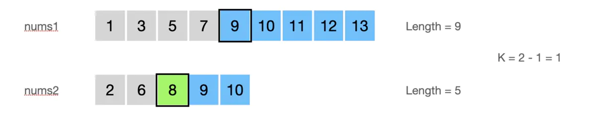
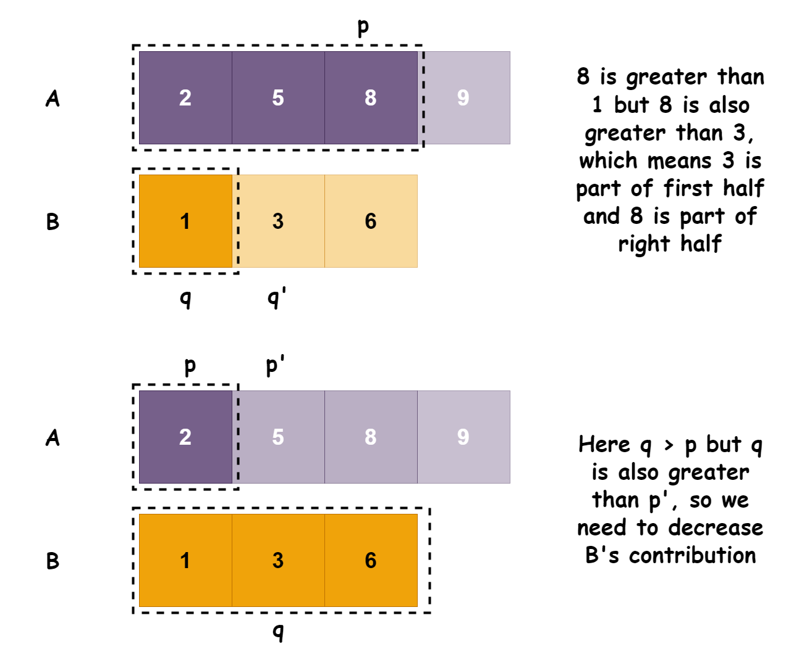

# 2个排序数组中位数

题目：https://leetcode.com/problems/median-of-two-sorted-arrays/

​    

Given two sorted arrays `nums1` and `nums2` of size `m` and `n` respectively, return **the median** of the two sorted arrays.

The overall run time complexity should be `O(log (m+n))`.

<div align="center"></div>

​          

# 1. Brute Force: T-O(m+n) / S-O(m+n)

<div align="center"></div>

```go
// 内置方法 sort.Ints
func findMedianSortedArrays(nums1 []int, nums2 []int) float64 {
    newLen := len(nums1) + len(nums2)
    // brute force
    var s []int 
    s = append(s, nums1...)
    s = append(s, nums2...)
    
    sort.Ints(s)
        
    if newLen % 2 != 0 {
        return float64(s[newLen/2])
    } else {
        return float64( float64(s[(newLen/2)-1] + s[newLen/2]) / 2.0)
    }
    
}
```

​    

# 2. Efficient Solution (Logarithmic): T-

​    

## 2.1 基础思路 - 二分法

<div align="center"></div>

```go
func BinarySearch(arr []int, target int)(index int) {
    leftIndex, rightIndex := 0, len(arr) - 1
  	
    return recursive(arr, leftIndex, rightIndex, target)
}

func recursive(arr []int, leftIndex, rightIndex, target int) int {
    if leftIndex > rightIndex { // 未找到的退出条件
        return -1
    }
    middleIndex := (leftIndex + rightIndex) / 2
    if arr[middleIndex] == target { // 找到的退出条件
        return middleIndex
    } else if arr[middleIndex] > target { //取左侧一半数组
        return recursive(arr, leftIndex, middleIndex - 1, target)
    } else { //取右侧一半的数组
        return recursive(arr, middleIndex + 1, rightIndex, target)
    }
}
```

​    

## 2.2 思路1 - 有序数组第k个数

核心问题是寻找两个数组中第K个数，K为两个数组中间的一个（数组之和为奇数）或两个数（数组之后为偶数），即：

<div align="center"></div>

以下面一组case为例：

<div align="center"></div>

即此时需要找到第7和第8个数并求平均，这里以第7个数为例进行说明

​     

**Step1**：首先先查找k/2=7/2=3个数据，比较两个数组的第三个元素的大小，可发现5 < 8，于是删除第一个数组的前三个元素。

> PS：为什么删除？因为需要保证删除的数据尽可能小，删除了5之后可以保证剩余数组中 >=5 的数的数量会大于整体长度的一半。在这个例子中大于等于5的元素的数量，可以确定至少有(9+5)-3-2=9个，其中3是nums1中删除的元素数，2是nums中小于8的元素数，这样可以保证目标值不会被删除。

<div align="center"></div>

**Step2**：删除3个元素后，问题变成了寻找第k=7-3=4个元素，即采用同样的方式：

<div align="center"></div>

**Step3**：删除4的一半个元素，即删除nums2中前2个元素。继续采用同样的方法删除剩余的2个元素中的一半

<div align="center"></div>

**Step4**：当k=1时，我们只需要取两个数组第一个元素中较小的元素即可

<div align="center"></div>

> **注意边界问题：**
>
> * 1）当其中一个数组长度为0时，我们可以直接在另一个数组中获取目标值；
> * 2）当其中一个数组长度小于k/2时，我们可以比较这个数组的最后一个元素；

```go
func findMedianSortedArrays(nums1 []int, nums2 []int) float64 {
    n := len(nums1) + len(nums2)
    if n&1 == 0 {
        return float64(
            findKth(nums1, nums2, n/2) +  
            findKth(nums1, nums2, n/2 + 1)) / 2.0
    }
    
    return float64(findKth(nums1, nums2, n/2 + 1))
}

// find the kst number
func findKth(nums1, nums2 []int, k int) int {
    if len(nums1) == 0 {
        return nums2[k-1]
    } else if len(nums2) == 0 {
        return nums1[k-1]
    }
    
    // 边界: 只有单个元素
    if k == 1 {
        return Min(nums1[0], nums2[0])
    }
    
    var num1, num2, to1, to2 int
  	// 判断num1边界
    if k / 2 > len(nums1) {
        num1 = nums1[len(nums1) - 1]
        to1 = len(nums1)
    } else {
        num1 = nums1[k / 2 - 1]
        to1 = k / 2
    }
    
  	// 判断num2边界
    if k / 2 > len(nums2) {
        num2 = nums2[len(nums2) - 1]
        to2 = len(nums2)
    } else {
        num2 = nums2[k / 2 - 1]
        to2 = k / 2
    }
    
    if num1 > num2 {
        return findKth(nums1, nums2[to2:], k - to2)
    }
    
    return findKth(nums1[to1:], nums2, k - to1)
}

// mininum number
func Min(x, y int) int {
    if x < y {
        return x
    }
    return y
}
```

​       

## 2.2 思路2 - Efficient Solution

<div align="center"></div>

<div align="center"></div>

   

代码实践：

```go
func findMedianSortedArrays(nums1 []int, nums2 []int) float64 {
    n1, n2 := len(nums1), len(nums2)
    
    // nums1 is empty
    if n1 == 0 {
        if n2&1 == 0 {
            return float64(nums2[n2/2 - 1] + nums2[n2/2]) / 2.0
        } else {
            return float64(nums2[n2/2])
        }
    }
    
    // nums2 is empty
    if n2 == 0 {
        if n1&1 == 0 {
            return float64(nums1[n1/2 - 1] + nums1[n1/2]) / 2.0
        } else {
            return float64(nums1[n1/2])
        }
    }
    
    // to reduce the number of iterations it is efficient to perform
    // he binary search on the smaller array, ensure len(nums1) is shortest
    if n1 > n2 {
        return findMedianSortedArrays(nums2, nums1)
    }
    
    mediaNum := (n1 + n2 + 1) / 2
    
    // Since A is the smaller array, it can contribute at least 0 values
    // and at most, all of its values
    minN1, maxN1 := 0, n1
    
    for minN1 <= maxN1 {
        N1Contri := minN1 + ((maxN1 - minN1) / 2)
        N2Contri := mediaNum - N1Contri
        
        if N1Contri > 0 && nums1[N1Contri - 1] >  nums2[N2Contri] {
            // Then it means A's contribution needs to be reduced
            maxN1 = N1Contri - 1
        } else if N1Contri < n1 && nums2[N2Contri - 1] > nums1[N1Contri] {
          	// Then it means A's contribution needs to be reduced
            minN1 = N1Contri + 1
        } else {
            // The left half end will be the largest value of the last
			      // elements contributed by A and B
            var lastLeftHalf int
            if N1Contri == 0 {
                lastLeftHalf = nums2[N2Contri - 1]
            } else if N2Contri == 0 {
                lastLeftHalf = nums1[N1Contri - 1]
            } else {
                lastLeftHalf = Max(nums1[N1Contri - 1], nums2[N2Contri - 1])
            }
          	
            // we know that if the length of A U B is odd
          	// then the median is last of element of half of A U B
            if (n1 + n2)&1 != 0 {
                return float64(lastLeftHalf)
            }
            
             /**
              If the length of A U B is even, then the median is average
              of two middle elements.
              The two middle elements are last of Left half and first of right
              half. We know the last of first half. The first of second half
              is computed as follows: if A contributes all of its values then
              first of right half is next element after last element B contributes
              which is B[BContri].
              if B Contributes all of its values then first of right half is A[AContri]
              Otherwise it the minimum of next elements after last elements contributed
              by A and B.
            */
            var firstRightHalf int
            if N1Contri == n1 {
                firstRightHalf = nums2[N2Contri]
            } else if N2Contri == n2 {
                firstRightHalf = nums1[N1Contri]
            } else {
                firstRightHalf = Min(nums1[N1Contri], nums2[N2Contri])
            }
            
            return float64(lastLeftHalf + firstRightHalf) / 2.0
        }
    }
    
    return -1.0   
}

func Max(a, b int) int {
    if a > b {
        return a
    }
    
    return b
}

func Min(a, b int) int {
    if a > b {
        return b
    }
    
    return a
}
```

​         

# 参考

1. [Logarithmic Algorithm for Finding Median of Two Sorted Arrays | Coding Interview](https://ganeshpr227.medium.com/logarithmic-algorithm-for-finding-median-of-two-sorted-arrays-of-different-sizes-aaecf302057e)
2. [简书：Median Of Two Sorted Arrays](https://www.jianshu.com/p/9de96aac11eb)
3. [知乎：Median of Two Sorted Arrays](https://zhuanlan.zhihu.com/p/55666669)

