# 特征提取器 - RNN / CNN / Transformer

随着深度学习领域网络越做越深，神经网络模型越来越像一个黑箱，只要喂给它数据，模型就能够根据给予的目标，自动学习抽取对于该任务最有利的特征（在CV领域更为明显，比如在卷积神经网络的不同层能够输出图像中不同层面上的细节特征），从而实现了著名的 “端到端” 模型。

CNN、RNN以及Transformer作为抽取数据特征的特征抽取器。下面简单介绍RNN、CNN及Transformer的基本结构及其优缺点。

​     

# 一 循环神经网络 RNN

RNN网络应用技术架构

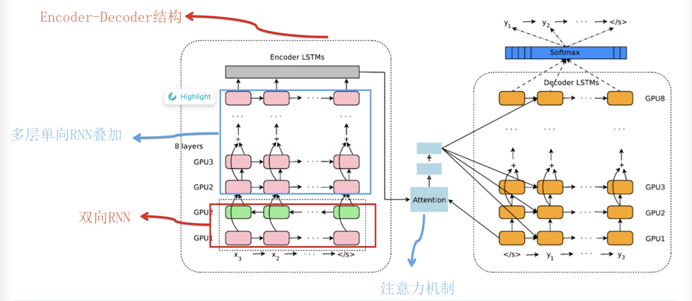

## 1 传统RNN

18年以前，在NLP各个子领域的State of Art的结果都是RNN（包含LSTM、GRU等变种）得到的，那**为什么RNN在NLP领域能够有如此广泛的应用**？

而且如果将全连接网络运用到NLP任务上，其会面临三个主要问题：

- 不同的输入样本，输入和输出可能有不同的长度，因此输入层和输出层的**神经元数量无法固定**；
- 从输入文本的不同位置学到的**同一特征无法共享**；
- 模型中的**参数太多，计算量太大**；

因此为了解决上述问题，就有了熟悉的RNN网络结构，其通过扫描数据输入的方式，使得每一个时间步的所有网络参数是共享的，且每个时间步不仅会接收当前时刻的输入，同时会接收上一个时刻的输出，从而使得其能够成功利用过去输入的信息来辅助当前时刻的判断。

但是，原始的RNN也存在问题，它采取线性序列结构不断从前往后收集输入信息，但这种线性序列结构不擅长捕获文本中的长期依赖关系，这主要是因为反向传播路径太长，从而容易导致严重的**梯度消失**（vanishing gradient）或**梯度爆炸**（exploding gradient）问题。

> 
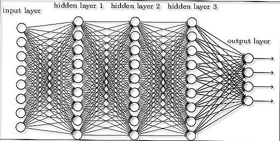

>
> 1）**什么是梯度爆炸/消失**？
>
> 目前优化神经网络的方法都是基于BP，即根据损失函数计算的误差通过梯度反向传播的方式，指导深度网络权值的更新优化，其中将误差从末层往前传递的过程是通过**链式法则（Chain Rule）**进行传递，因此反向传播算法可以说是梯度下降在链式法则中的应用。
>
> 而链式法则是一个**连乘的形式**，所以当层数越深的时候，梯度将以指数形式传播，因此梯度消失问题和梯度爆炸问题一般随着网络层数的增加会变得越来越明显。即在根据损失函数计算的误差通过梯度**反向传播**的方式对深度网络权值进行更新时，得到的**梯度值接近0**（导致**参数不可学习**）或**特别大**（导致**模型无法收敛**），也就是**梯度消失**或**爆炸**，因此梯度消失或梯度爆炸在本质原理上其实是一样的。
>
> 2）**问题原因分析**
>
> **梯度消失**
>
> * 隐藏层层数过多：从深层网络角度来讲，不同的层学习的速度差异很大，表现为网络中靠近输出的层学习的情况很好，靠近输入的层学习的很慢，有时甚至训练了很久，前几层的权值和刚开始随机初始化的值差不多，因此梯度消失/爆炸根本原因在于**反向传播训练法则**。
> * 采用了不合适的激活函数（更容易产生梯度消失，但是也有可能产生梯度爆炸），比如 sigmoid函数，当网络层数越多，求导结果越小，最终导致梯度消失的情况出现；
>
> **梯度爆炸**
>
> * 隐藏层的层数过多：同上
> * 权重的初始化值过大，导致前面的网络层比后面的网络层梯度变化更快，引起了梯度爆炸的问题
>
> 3）解决方案
>
> **梯度消失和梯度爆炸问题都是因为网络太深，网络权值更新不稳定造成的，本质上是因为梯度反向传播中的连乘效应**
>
> 对于更普遍的梯度消失问题，可以考虑以下三种方案：
>
> * 用ReLU、Leaky-ReLU、P-ReLU、R-ReLU、Maxout等替代sigmoid函数
> * 用Batch Normalization
> * LSTM的结构设计也可以改善RNN中的梯度消失问题

​      

因此为了解决这个问题，后来引入了LSTM和GRU模型，通过增加中间状态信息直接向后传播，以此缓解梯度消失问题，获得了很好的效果，于是很快LSTM和GRU成为RNN的标准模型。

​      

## 2 长短期记忆网络 LSTM

传统RNN的做法是将的所有知识全部提取出来，不作任何处理的直接输入到下一个时间步进行迭代，就像参加考试一样，如果希望事先把书本上的所有知识都记住，到了考试的时候，早期的知识恐怕已经被近期的知识完全覆盖了，提取不到长远时间步的信息是很正常的。

而人类是这样做的吗？显然不是的，通常做法是对知识有一个理性性判断，重要的知识给予更高的权重，重点记忆，不那么重要的可能没多久就忘了，这样才能在面对考试的时候有较好的发挥。

而LSTM的结构更类似于人类对于知识的记忆方式，理解LSTM的关键就在于理解两个状态𝑐(𝑡)和𝑎(𝑡)以及内部的三个门机制：

如上图可看见，LSTM Cell在每个时间步接收上个时间步的输入有两个，传给下一个时间步的输出也有两个，通常可以将𝑐(𝑡)看作**全局信息**，𝑎(t)看作全局信息对**下一个Cell影响的隐藏状态**。

其中，遗忘门（forget gate）、更新门（update gate）和输出门（output gate）分别都是一个激活函数为sigmoid的小型单层神经网络，由于sigmoid在 (0,1) 范围内的取值，有效的用于判断是保留还是“遗忘”信息（乘以接近1的值表示保留，乘以接近0的值表示遗忘），为提供了信息选择性传输的能力，这样就可以很好理解门在LSTM是怎样工作的了：

> **遗忘门**：有两个输入，当前时间步的输入 𝑥(𝑡) 以及上一层输出的隐藏状态 𝑎(𝑡−1)，遗忘门通过这两个输入训练出一个门函数，注意这个门函数的输出是在(0,1)之间的，将其与上一层输出的全局信息 𝑐(𝑡−1) 相乘，表示**全局信息被选择部分遗忘**；
>
> **更新门**：同样训练出一个门函数，将接收到的 𝑎(𝑡−1 )和 𝑥(𝑡) 一起通过一个激活函数为tanh的小型神经网络，这一部分与传统RNN无异了，就是将上一时刻得到的信息与该时刻得到的信息进行整合，最后将整合信息与门函数的输出相乘，相当于同样选择有保留的提取新信息，并将其直接加在全局信息中去；
>
> **输出门**：同样的训练出一个门函数，将新的隐藏状态 𝑐(𝑡) 通过一个简单的tanh函数（仅仅是激活函数）后与门函数的输出相乘，则可以得到该时刻全局信息对下一个Cell影响的隐藏状态𝑎(𝑡)；

但时序性结构的LSTM模型还是有其局限性：

> 1）很难具备高效的并行计算能力：即当前状态的计算不仅要依赖当前的输入，还要依赖上一个状态的输出，即比如 T时刻的计算依赖T-1时刻的隐层计算结果，而T-1时刻的计算依赖T-2时刻的隐层计算结果……..这样就形成了所谓的**序列依赖关系**。就是说只能先把第1时间步的算完，才能算第2时间步的结果，这就造成了RNN在这个角度上是无法并行计算的，只能老老实实地按着时间步一个单词一个单词往后走。
>
> 
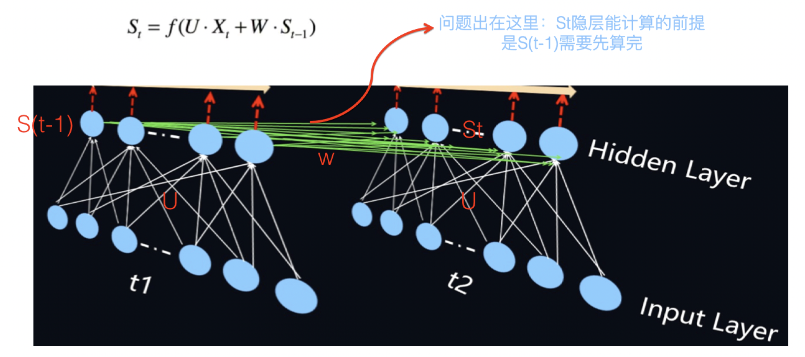

>
> 2）整个LSTM模型（包括其他的RNN模型，如GRU）总体上更类似于一个马尔可夫决策过程，较难以提取全局信息；

​       

## 3 GRU

GRU（Gate Recurrent Unit）是循环神经网络RNN的一种，和LSTM一样，也是为了解决**长期记忆**和**反向传播中的梯度等问题**而提出来的。但GRU可以看作一个LSTM的简化版本，其将 𝑎(𝑡) 与 𝑐(𝑡) 两个变量整合在一起，且讲遗忘门和更新门整合为更新门，输出门变更为重制门，大体思路没有太大变化。两者之间的性能往往差别不大，但GRU相对来说参数量更少，收敛速度更快。对于较少的数据集建议使用GRU就已经足够了，对于较大的数据集，可以试试有较多参数量的LSTM有没有令人意外的效果。

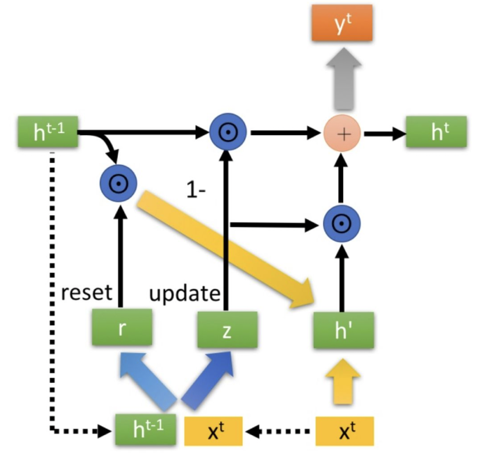

​         

# 二 卷积神经网络 CNN

## 1 概念

CNN是计算机视觉领域的重大突破，也是目前用于处理CV任务模型的核心，同时CNN同样适用于NLP任务中的特征提取，但其使用场景与RNN略有不同。

关于二维卷积核的运算如下图所示

从数据结构上来看，CV任务中的输入数据为**图像像素矩阵**，其各个方向上的像素点之间的相关性基本上是等同的，而NLP任务中的输入数据通常为序列文本，假设句子长度为𝑛，词向量的维度为𝑑，那么输入就成了一个 𝑛×𝑑 的矩阵。显然，矩阵的行列“像素”之间的相关性是不一样的，即矩阵的同一行为一个词的向量表征，而不同行表示不同词，因此如果要让卷积网络能够正常的”读“文本内容，则在NLP中就需要使用一维卷积。

14年Kim首次提出将CNN用于NLP中的文本分类任务，其提出的网络结构如下图所示：

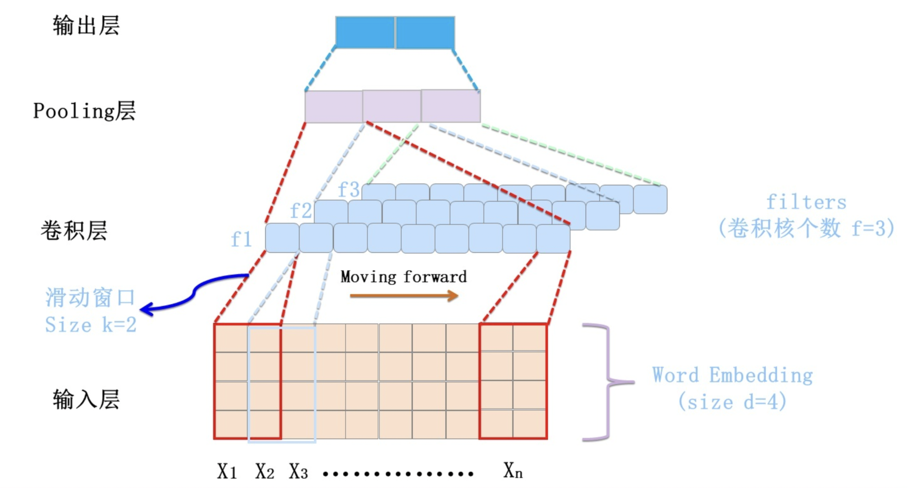

结构详情：

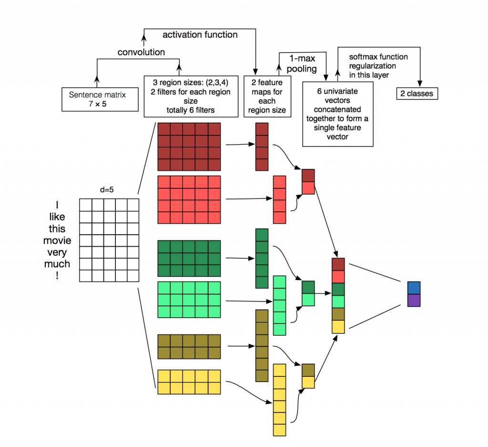

其中，卷积层本质上是个特征抽取层，可以设定超参数F来指定卷积层包含多少个卷积核（Filter）。

对于某个Filter来说，可以想象有一个d*k大小的移动窗口从输入矩阵的第一个字开始不断往后移动，其中k是Filter指定的窗口大小，d是Word Embedding长度。对于某个时刻的窗口，通过神经网络的非线性变换，将这个窗口内的输入值转换为某个特征值，随着窗口不断往后移动，这个Filter对应的特征值不断产生，形成这个Filter的特征向量，而这就是 **卷积核抽取特征的过程**。卷积层内每个Filter都如此操作，从而就形成了不同的特征序列，之后Max Pooling 层（用于抽取最显著的特征）则对Filter的特征进行降维操作，形成最终的特征，并在Pooling层之后连接全联接层神经网络，实现最后的文本分类过程。

虽然传统CNN经过简单的改变之后可以成功的应用于NLP任务，且效果还不错，但效果也仅仅是“不错“而已，很多任务还是处于完全被压制的情况，这表明传统的CNN在NLP领域中还是存在一些问题。

​     

## 2 NLP CNN模型发展

谈到CNN在NLP界的进化，首先来看看Kim版CNN存在哪些问题：

- Kim版CNN实际上类似于一个k-gram模型（k即卷积核的window，表示每次卷积的时候覆盖多少单词），对于一个单层的k-gram模型是**难以捕捉到距离𝑑≥𝑘的特征的**；
- 卷积层输出的特征向量是包含了位置信息的（与卷积核的卷积顺序有关），在卷积层之后接Max Pooling层（仅仅保留提取特征中最大值）将导致特征信息中及其重要的**位置编码信息丢失**；

 
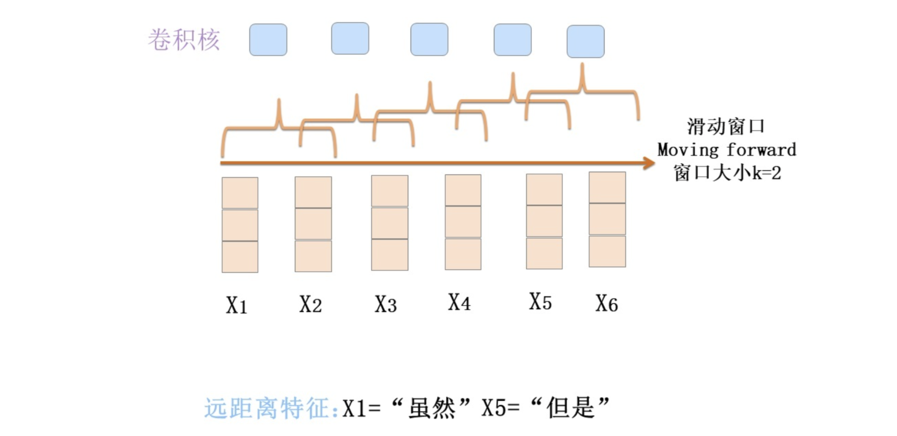

​      

为了解决上述问题，研究者们采取了一系列方法对Kim版的CNN进行改进

> 1）解决长远距离信息提取的一个方法就是采用**膨胀卷积**（Dilated Convolution）的方式，也就是说**卷积窗口不再覆盖连续区域，而是跳着覆盖**，这样同样尺寸的卷积核就能提取到更远距离的特征了。当然，这里的空洞卷积与CV中的还是不一样的，其仅仅在词间存在空洞，在词向量内部是不存在空洞的。
>
>  
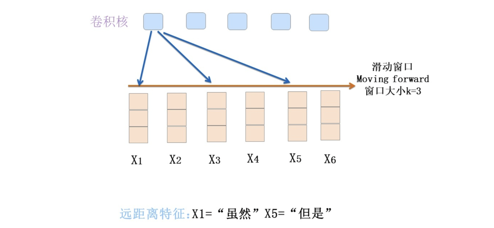

>
> 其次，相比于普通卷积，膨胀卷积的神经元感受野的范围是大大增加的。
>
>  

>
> 2）另外，也可以把网络做的更深一些，**越深的卷积核可以捕获更远距离的特征**。
>
> 如下图，假设第一层卷积层滑动窗口大小k是3，如果再往上叠一层卷积层，假设滑动窗口大小也是3，但是第二层窗口覆盖的是第一层窗口的输出特征，所以它其实能覆盖输入的距离达到了5。如果继续往上叠加卷积层，可以继续增大卷积核覆盖输入的长度。
>
>  
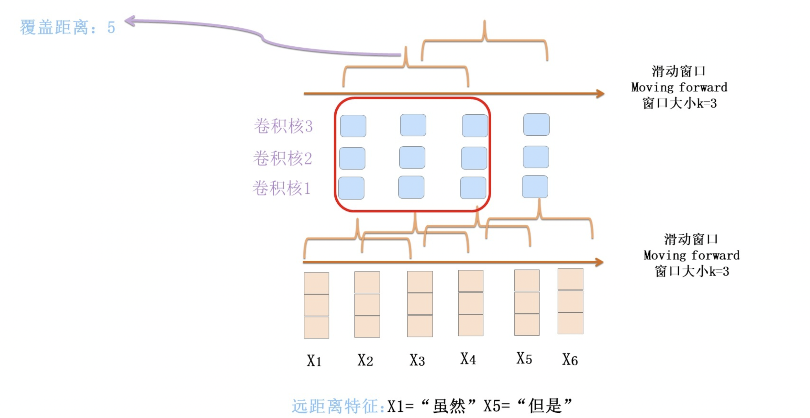

>
> 3）为了防止文本中的位置信息丢失，NLP领域里的CNN的发展趋势是抛弃Pooling层，靠全卷积层来叠加网络深度，并且在输入部分加入位置编码，人工将单词的位置特征加入到对应的词向量中（PS：位置编码的方式可以采用《Attention is All You Need》中的方案）。
>
>  
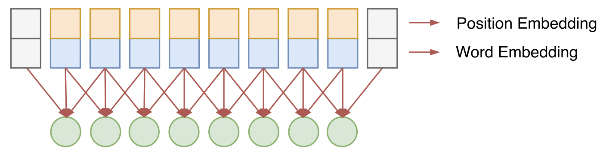

>
> 4）在CV领域中，网络做深之后将存在一系列问题，因此有了**残差网络**。在NLP中同样可以使用残差网络，解决梯度消失问题，**解决梯度消失问题的本质是能够加速信息流动**，使简单的信息传输可以有更简单的路径，从而使得网络做深的同时，能够保证良好的性能。
>
> 5）激活函数开始采用GLU（Gated Linear Unit），如下图所示，左右两个卷积核的尺寸完全一样，但是权值参数不共享，然后其中一个通过一个sigmoid函数，另一个不通过，将两者相乘。而这其实与LSTM中的门机制是相同的效果，该激活函数可以自行控制输出的特征的强弱大小。
>
>  
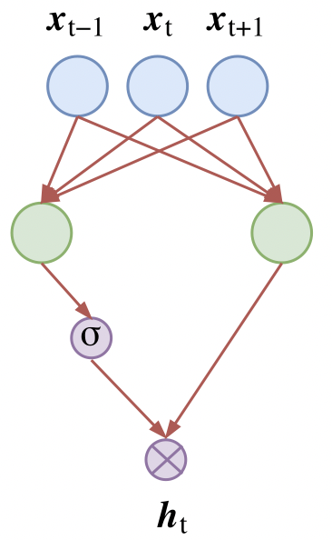

>
> 6）还有另一个应用，就是可以用 𝑤𝑖𝑛𝑑𝑜𝑤=1 的一维卷积对人工合成的词嵌入表征进行特征压缩，从而得到一个更有效的词向量表征方法。
>
>  
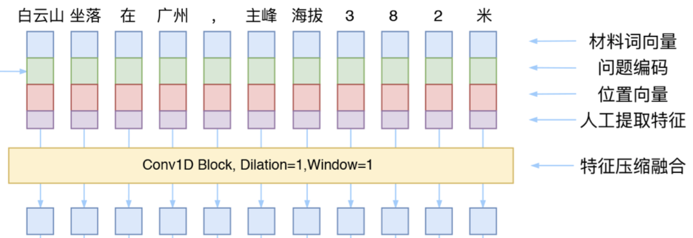

​       

当然在很多地方都看见CNN比较适用于文本分类的任务，事实上，从《Convolutional Sequence to Sequence Learning》、《Fast Reading Comprehension with ConvNets》等论文与实践报告来看，CNN已经发展成为一种成熟的特征提取器，并且相比于RNN来说，CNN的窗口滑动完全没有先后关系，不同卷积核之前也没有相互影响，因此其具有非常高的并行自由度，这是其非常好的一个优点。

​         

# 三 Transformer

详情：[NLP - Transformer模型](6）NLP - Transformer模型.md)

​         

# 四 模型比较

从几个不同的角度来分别进行对比：

* 1）NLP的特征抽取器能力强弱角度：语义特征提取能力 / 长距离特征捕获能力 / 任务综合特征抽取能力
* 2）大规模实用化的角度：并行计算能力 / 运行效率

## 1 特征抽取能力

注意：下文提到的 RNN和CNN指的是原生的RNN和CNN模型，即在经典的结构上可增加attention，堆叠层次等各种改进，但是不包含对本身结构特别大的变动。

### 1.1 语义特征

实验结论：Transformer在这方面的能力非常显著地超过RNN和CNN（在考察语义类能力的任务WSD中，Transformer超过RNN和CNN大约4-8个绝对百分点），RNN和CNN两者能力差不太多。

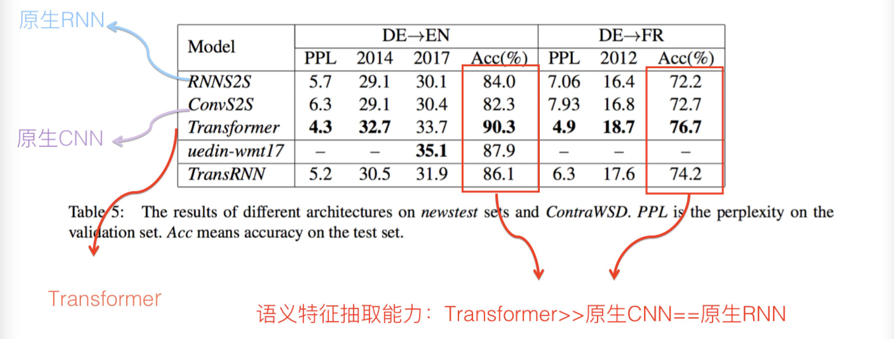

​     

### 1.2 长距离特征

实验结论：原生CNN特征抽取器在这方面极为显著地弱于RNN和Transformer，Transformer微弱优于RNN模型（尤其在主语谓语距离小于13时），能力由强到弱排序为Transformer>RNN>>CNN。但在比较远的距离上（主语谓语距离大于13），RNN微弱优于Transformer，所以综合看，可以认为Transformer和RNN在这方面能力差不太多，而CNN则显著弱于前两者。

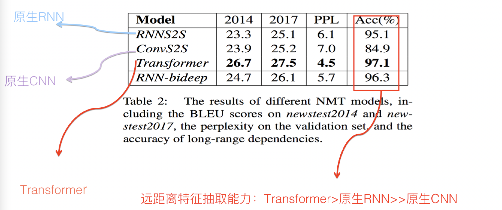

那么为什么CNN在捕获长距离特征方面这么弱呢？具体原因上文已提，但CNN解决这个问题是靠堆积深度来获得覆盖更长的输入长度的，所以CNN在这方面的表现**与卷积核能够覆盖的输入距离最大长度有关系**。如果通过增大卷积核的kernel size，同时加深网络深度，以此来增加输入的长度覆盖。实验证明这能够明显提升CNN的long-range特征捕获能力，但尽管如此，CNN在这方面仍然显著弱于RNN和Transformer。

对于Transformer来说，Multi-head attention的head数量严重影响NLP任务中Long-range特征捕获能力，而且head越多越有利于捕获long-range特征。但有个工作（The Importance of Being Recurrent for Modeling Hierarchical Structure）的结论和上述结论不一致，即在”主语-谓语一致性”任务上，Transformer表现是弱于LSTM的。

如果综合这两篇论文，看似得到了相互矛盾的结论，那么到底谁是正确的呢？Why Self-attention的论文对此进行了探索，得到的结论是这个差异是由于两个论文中的实验中Transformer的超参设置不同导致的，尤其是multi-head的数量，对结果影响严重，而如果正确设置一些超参，那么之前Trans的论文结论是不成立的。也就是说，目前仍然可以维持下面结论：**在远距离特征捕获能力方面，Transformer和RNN能力相近，而CNN在这方面则显著弱于前两者**。

​     

### 1.3 任务综合特征

上面两项对比是从特征抽取的两个比较重要的单项能力角度来评估的，其实更重要的是在具体任务中引入不同特征抽取器，然后比较效果差异，以此来综合评定三者的综合能力。

那么这样就引出一个问题：NLP中的任务很多，哪些任务是最具有代表性的呢？答案是**机器翻译**。很多NLP的重要的创新模型都是在机器翻译任务上提出来的，这背后是有道理的，因为机器翻译基本上是对NLP各项处理能力综合要求最高的任务之一，要想获得高质量的翻译结果，对于两种语言的 `词法` / `句法` / `语义` / `上下文处理能力` / `长距离特征捕获` 等等更方面都需要考虑进来才行。这是为何看到很多比较工作是在机器翻译上作出的，这里给个背后原因的解释，以避免被质疑任务单一，没有说服力的问题。

​     

那么在以机器翻译为代表的综合特征抽取能力方面，三个特征抽取器哪个更好些呢？

1）先给出一个why Self attention论文中机器翻译任务方面实验结论如下，即在两个机器翻译任务中，可以看到，翻译质量指标BLEU证明了如下结论：Transformer综合能力要明显强于RNN和CNN，而RNN和CNN看上去表现基本相当，貌似CNN表现略好一些。

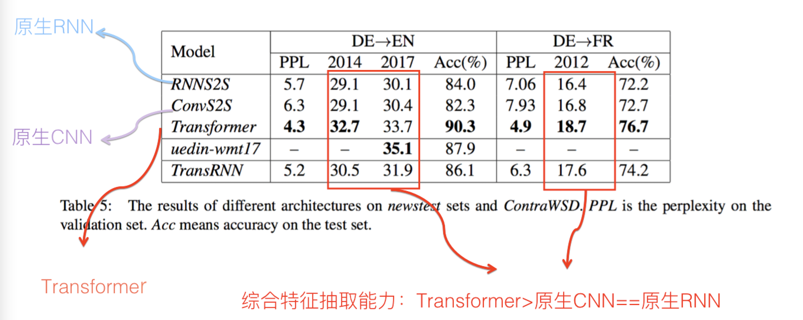

2）GPT论文的实验结论，在8个不同的NLP任务上，在其它条件相同的情况下，只是把特征抽取器从Transformer换成LSTM，平均下来8个任务得分掉了5个点以上。

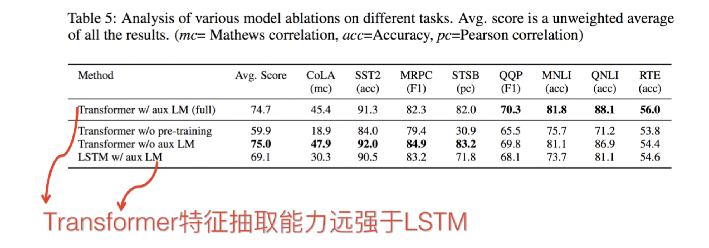

​      

## 2 并行计算能力及运算效率

并行计算能力：Transformer和CNN差不多，都远远远远强于RNN

> RNN：在并行计算方面有严重缺陷，这是它本身的序列依赖特性导致的，虽然这个线形序列依赖性非常符合解决NLP任务，这也是为何RNN一引入到NLP就很快流行起来的原因，但也正是这个线形序列依赖特性，导致它在并行计算方面无法获得质的飞跃；
>
> CNN / Transformer：因为不存在网络中间状态不同时间步输入的依赖关系，所以可以非常方便及自由地做并行计算改造；

从另外一个角度来看，如果先抛开并行计算能力的问题，单纯地比较一下三个模型的计算效率，可能大家的直观印象是Transformer比较重，比较复杂，计算效率比较低，但事实是这样的吗？

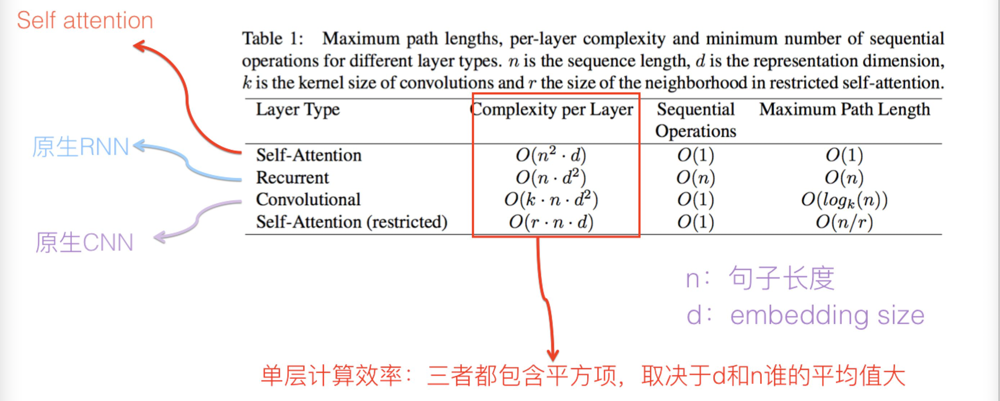

上图列出了单层的Self attention／RNN／CNN的计算效率，首先上面列的是Self attention，不是Transformer的Block，因为Transformer Block里其实包含了好几层，而不是单层。

其次，如果是self attention/CNN/RNN单层比较计算量的话，三者都包含一个平方项，区别主要是：

> self attention：平方项是句子长度，因为每一个单词都需要和任意一个单词发生关系来计算attention，所以包含一个n的平方项；
>
> RNN和CNN：平方项则是embedding size；

那么既然都包含平方项，怎么比较三个模型单层的计算量呢？首先容易看出CNN计算量是大于RNN的，那么self attention如何与其它两者比较呢？

> 即如果句子平均长度n大于embedding size，那么意味着Self attention的计算量要大于RNN和CNN；而如果反过来，就是说如果embedding size大于句子平均长度，那么明显RNN和CNN的计算量要大于self attention操作。
>
> 但实际上，一般正常的句子长度，平均起来也就几十个单词吧，而当前常用的embedding size从128到512都常见，所以在大多数任务里面其实self attention计算效率是要高于RNN和CNN的。

但如果Transformer包含多层呢？

> Transformer模型中skip connection后的Add操作及LayerNorm操作不太耗费计算量，可以先把它忽略掉，但后面的FFN操作相对比较耗时，它的时间复杂度应该是n乘以d的平方。
>
> 所以，如果把Transformer Block多层当作一个整体和RNN及CNN单层对比的话，Transformer Block计算量肯定是要多于RNN和CNN的，因为它本身也包含一个n乘以d的平方，上面列出的self attention的时间复杂度就是多出来的计算量。这么说起来，单个Transformer Block计算量大于单层RNN和CNN

上面考虑的是三者单层的计算量，可以看出结论是：Transformer Block >CNN >RNN。如果是考虑不同的具体模型，会与模型的网络层深有很大关系，另外还有常见的attention操作，所以问题会比较复杂，这里不具体讨论了。

> 1）“[Convolutional Sequence to Sequence Learning](https://arxiv.org/pdf/1705.03122.pdf)”：比较了ConvS2S与RNN的计算效率， 证明了跟RNN相比，CNN明显速度具有优势，在训练和在线推理方面，CNN比RNN快9.3倍到21倍；
>
> 2）“[Dissecting Contextual Word Embeddings: Architecture and Representation](https://arxiv.org/pdf/1808.08949.pdf)”：提到了Transformer和CNN训练速度比双向LSTM快3到5倍；
>
> 3）“[The Best of Both Worlds: Combining Recent Advances in Neural Machine Translation](https://arxiv.org/pdf/1804.09849.pdf)”：给出了RNN／CNN／Transformer速度对比实验，结论是Transformer Base速度最快，CNN速度次之，但是比Transformer Base比慢了将近一倍，Transformer Big速度再次，主要因为它的参数量最大，而吊在车尾最慢的是RNN结构；

总而言之，关于三者速度对比方面，目前的主流经验结论基本如上所述：Transformer Base最快，CNN次之，再次Transformer Big，最慢的是RNN。RNN比前两者慢了3倍到几十倍之间。

​       

​        

# 附录

1. [全面拥抱Transformer：自然语言处理三大特征抽取器（CNN/RNN/TF）比较](https://zhuanlan.zhihu.com/p/54743941)
2. [三大特征提取器 - RNN、CNN和Transformer](https://www.cnblogs.com/sandwichnlp/p/11612596.html)
3. [梯度消失和梯度爆炸及解决方法](https://zhuanlan.zhihu.com/p/72589432)
4. [也来谈谈RNN的梯度消失/爆炸问题](https://spaces.ac.cn/archives/7888)
5. [人人都能看懂的GRU](https://zhuanlan.zhihu.com/p/32481747)
6. [Why Self-Attention? A Targeted Evaluation of Neural Machine Translation Architectures](https://arxiv.org/pdf/1808.08946.pdf)
7. [Improving Language Understanding by Generative Pre-Training](https://s3-us-west-2.amazonaws.com/openai-assets/research-covers/language-unsupervised/language_understanding_paper.pdf)