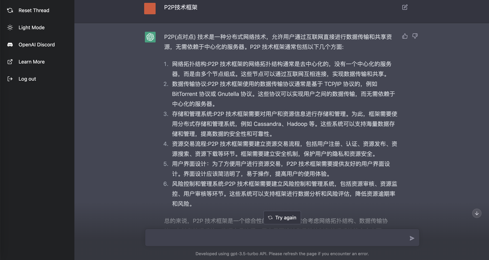
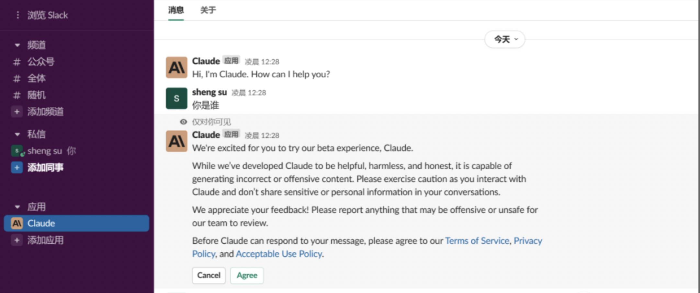
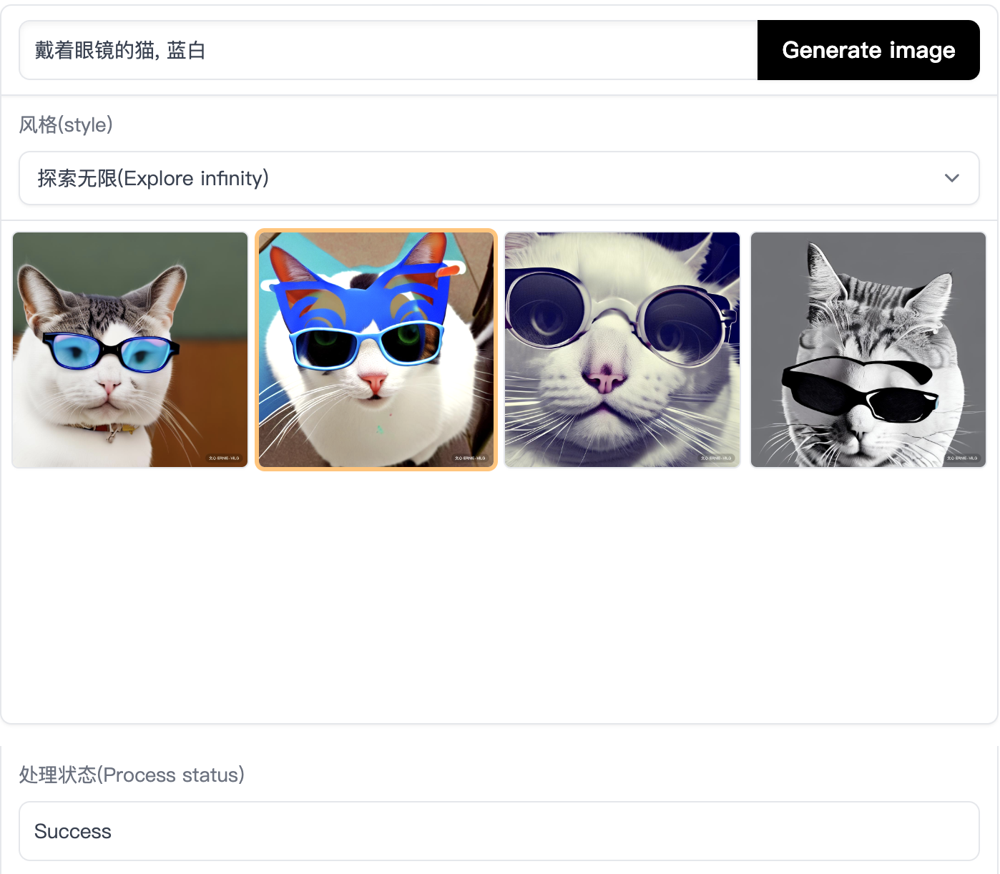

# 一 Chatgpt

Chatgpt相关应用网站&平替模型

## 1 Poe

美版知乎 Quora出的 AI 产品 poe ，提供了很多AI工具，包括 **ChatGPT**（GPT-3.5每日不限使用次数）/ **GPT-4**（每日限1次）/ **Claude+**（每日限3次） / **Claude-instant**，有网页版和iOS 版。

地址：https://poe.com/Claude-instant

​     

## 2 Perplexity AI: Ask Anything

一个 AI 解答网站，可以把它当作一个搜索引擎，输入问题，Perplexity 会在网络上智能检索相关内容，并回复给我们，结果中还会标注内容来源，非常方便。

地址：https://www.perplexity.ai/

## 3 freegpt 或 chatgpt.ai

网站界面和chat官网基本一致，免费使用

地址：https://freegpt.one/ 或 https://chatgpt.ai/gpt-3-5/

​    

## 4 Claude

堪称ChatGPT最强对手，通过Slack使用Claude，只要有Slack账号就可以把它加入你的频道对话，速度很快，可以注册或者直接用谷歌和苹果账号登陆。虽然Claude对中文支持不好，但仍可以提示用中文回答，整体使用体验不输chatgpt。

地址：https://www.anthropic.com/index/claude-now-in-slack

​     

## 5 Auto-GPT

Auto-GPT可以联网搜索信息，而ChatGPT 只能提供2021年9月之前的信息。

开源项目地址：https://github.com/Significant-Gravitas/Auto-GPT

如果不会python，可使用进行体验： 

* https://agentgpt.reworkd.ai/ 
* https://godmode.space/

​    

## 6 Chat For AI

一个**基于 OpenAI API** (GPT-3.5-TURBO) 搭建的第三方站点，国内可用，速度很快，但免费使用次数有限。

地址：https://chatforai.com/

​      

## 7 GPT开源平替模型 & Chrome插件

### 1）平替模型

地址：https://github.com/chenking2020/FindTheChatGPTer

   

### 2）Chrome插件

| 插件             | 详情                                                         |
| ---------------- | ------------------------------------------------------------ |
| 语音交互插件     | Voice Control for ChatGPT：实现语音与chagpt交互，支持多国语言 [下载地址>>](https://chrome.google.com/webstore/detail/voice-control-for-chatgpt/eollffkcakegifhacjnlnegohfdlidhn) |
| Google浏览器插件 | ChatGPT 谷歌助手和高亮显示工具 [下载地址>>](https://chrome.google.com/webstore/detail/liner-chatgpt-for-google/bmhcbmnbenmcecpmpepghooflbehcack) |

​      

# 二 AI 网站工具

## 1 BiliGPT

使用 GPT-3.5 AI 自动总结 B 站音视频内容，即输入视频地址后，点击「一键总结」，AI 会自动提取并总结字幕，从而获得视频的主要内容。

地址：https://b.jimmylv.cn/

​    

## 2 Scribble Diffusion

**AI 绘图程序**，可以讲画的草图变成精美的图片，每次生成的都不一样，喜欢的话记得及时保存

地址：https://scribblediffusion.com/

​     

## 3 ChatGPT Shortcut

简单易用的 **ChatGPT 快捷命令表**，有各种提问模板，能让 ChatGPT 更准确地回答问题

地址：https://www.aishort.top/

​    

## 4 ERNIE-ViLG

一个**文本转图像生成器**，输入对图片内容的描述，选择图像风格后点击 Generate image，会生成四张对应内容的图像。效果还不错，比较适合做头像，就是速度有点慢。

地址：https://huggingface.co/spaces/PaddlePaddle/ERNIE-ViLG

​      

## 5 AI 工具网站聚合入口

地址：https://nav.6aiq.com/

