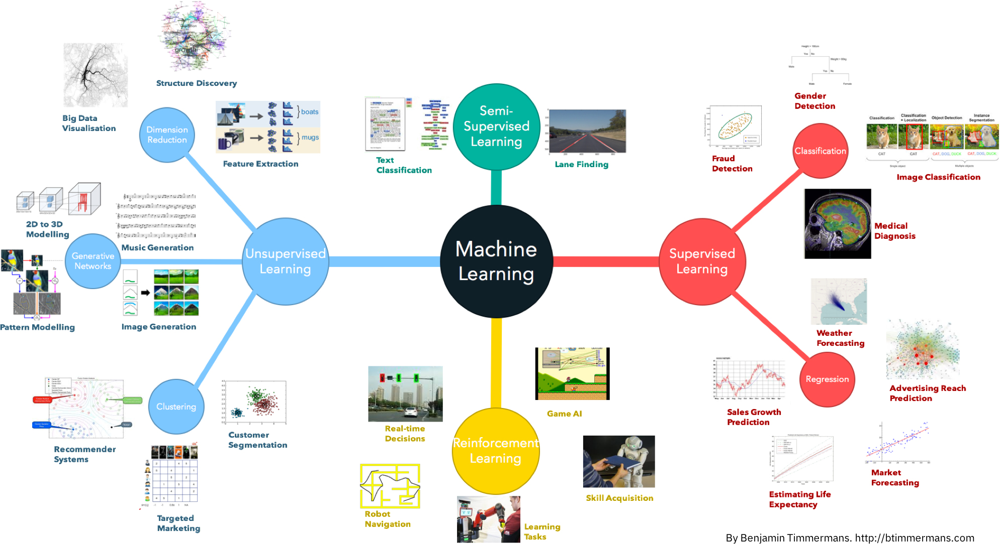

# NLP - 自然语言处理

自然语言处理 (Natural Language Processing) 是人工智能（AI）的一个子领域，是研究在人与人交互中以及在人与计算机交互中的语言问题的一门学科。为了建设和完善语言模型，自然语言处理建立计算框架，提出相应的方法来不断的完善设计各种实用系统，并探讨这些实用系统的评测方法。

​    

# 一 主要研究方向

**信息抽取：**从给定文本中抽取重要的信息，比如时间、地点、人物、事件、原因、结果、数字、日期、货币、专有名词等等。通俗说来，就是要了解谁在什么时候、什么原因、对谁、做了什么事、有什么结果；

**文本生成：**机器像人一样使用自然语言进行表达和写作，即依据输入的不同，文本生成技术主要包括

* 数据到文本生成：是指将包含键值对的数据转化为自然语言文本；

* 文本到文本生成：对输入文本进行转化和处理从而产生新的文本；

**问答系统：**对一个自然语言表达的问题，由问答系统给出一个精准的答案，即需要对自然语言查询语句进行某种程度的语义分析，包括`实体链接`、`关系识别`，形成逻辑表达式，然后到知识库中查找可能的候选答案并通过一个排序机制找出最佳的答案；

**对话系统：**系统通过一系列的对话，跟用户进行聊天、回答、完成某一项任务。涉及到用户意图理解、通用聊天引擎、问答引擎、对话管理等技术。此外，为了体现上下文相关，要具备多轮对话能力；

**文本挖掘：**包括`文本聚类`、`分类`、`情感分析`以及`对挖掘的信息和知识的可视化`、`交互式的表达界面`。目前主流的技术都是基于统计机器学习的；

**语音识别和生成：**语音识别是将输入计算机的语音符号识别转换成书面语表示。语音生成又称文语转换、语音合成，它是指将书面文本自动转换成对应的语音表征；

**信息过滤：**通过计算机系统自动识别和过滤符合特定条件的文档信息，通常指网络有害信息的自动识别和过滤，主要用于信息安全和防护，网络内容管理等；

**舆情分析：**是指收集和处理海量信息，自动化地对网络舆情进行分析，以实现及时应对网络舆情的目的；

**信息检索：**对大规模的文档进行索引。可简单对文档中的词汇，赋之以不同的权重来建立索引，也可建立更加深层的索引。在查询的时候，对输入的查询表达式比如一个检索词或者一个句子进行分析，然后在索引里面查找匹配的候选文档，再根据一个排序机制把候选文档排序，最后输出排序得分最高的文档；

**机器翻译：**把输入的源语言文本通过自动翻译获得另外一种语言的文本，机器翻译从最早的基于规则的方法到二十年前的基于统计的方法，再到今天的基于神经网络（编码-解码）的方法，逐渐形成了一套比较严谨的方法体系。

​     

# 二 NLP任务步骤

**Step1**：**获取语料**

> 语料，即NLP任务研究的数据内容，通常用一个文本集合作为语料库（Corpus），常见的语料数据来源：
>
> * 已有语料 ：积累的文档
> * 下载语料：搜狗语料 / 人民日报 
> * 抓取语料

**Step2**：**语料预处理**

> 1. 语料清洗：去除噪音数据，常见数据清洗方式
>
>    * 人工去重 / 对齐 / 删除 / 标注等
>
>    * 规则提取内容  / 正则表达式匹配 / 根据词性和命名实体提取 等
>
>    * 编写脚本 或 代码批处理等
>
> 2. 分词 Tokenization：将文本分成词语，常见分词算法
>
>    * 基于字符串匹配
>
>    * 基于理解
>
>    * 基于统计
>
>    * 基于规则
>
> 3. 词性标注：给词语打词类标签，如形容词 / 动词 / 名词等，在情感分析 和知识推理等任务中经常使用到，常见的词性标注方法
>
>    * 基于规则
>
>    * 基于统计：如基于最大墒的词性标注 / 基于统计最大概率的词性标注 / 基于HMM的词性标注
>
>    * 去停用词：去掉对文本特征无任何贡献作用的字词，比如标点符 / 语气 / 人称 等

**Step3**：**特征工程**

> 即把 分词表示成计算机能够计算的类型，一般为向量，常用表示模型
>
> * 词袋模型（Bag of Word, BOW）：TF-IDF
> * 词向量：One-hot / Word2Vec

**Step4**：**特征处理**

> 即选择合适的且表达能力强的特征，常见特征选择方法 DF / MI / IG / CHI / WLLR / WFO

**Step5**：**模型训练**

> 常见训练模型
>
> * 机器学习模型：KNN / SVM / Naive Bayes / 决策树 / GBDT / K-means 等
> * 深度学习模型：CNN / RNN / LSTM / Seq2Seq / FastText / TextCNN 等
>
> 注意事项：
>
> * 梯度消失和梯度爆炸问题
> * 过拟合和欠拟合问题
>   * 过拟合：即在训练集上表现很好，但在测试集桑表现很差，常见解决方法：
>     * 增大数据等训练量
>     * 增加正则化项（如L1和L2 正则）
>     * 特征选取不合理，人工筛选特征和使用 特征选择算法，采用Dropout方法等
>   * 欠拟合：就是模型不能够很好拟合数据，常见解决方法：
>     * 添加其它特征项
>     * 增加模型复杂度，比如神经网络加更多层，线性模型通过添加多项式使模型泛化能力更强
>     * 减少正则化参数，正则化目的是用来防止过拟合的，但是在模型中出现欠拟合，则需要减少正则化参数

**Step6**：**评价指标**

> 错误率 / 精度 / 准确率 / 精确度 / 召回率 / F1衡量
>
> ROC曲线 / AUC曲线

**Step7**：模型上线应用

> 第一种：线下训练模型，然后将模型做线上部署
>
> 第二种：在线上训练，完成后将模型pickle持久化

**Step8**：模型效果评测，并反馈优化

​       

# 三 机器学习模型

机器学习是对能通过经验自动改进的计算机算法的研究。机器学习通过历史数据**训练**出**模型**对应于人类对经验进行**归纳**的过程，机器学习利用**模型**对新数据进行**预测**对应于人类利用总结的**规律**对新问题进行**预测**的过程。

如果你是机器学习初学者，你应该知道如下的事情：

1. 机器学习能解决一定的问题，但不能奢求机器学习是万能的；
2. 机器学习算法有很多种，看具体问题需要什么，再来进行选择；
3. 每种机器学习算法有一定的偏好，需要具体问题具体分析；

​          

​    

# 附录

1. https://github.com/NLP-LOVE/ML-NLP
2. [自然语言处理 03：N-gram 语言模型](https://yey.world/2020/03/09/COMP90042-03/)
3. [不懂n-gram，怎么学好语言模型？](https://www.cnblogs.com/hithink/p/12107622.html)
4. [NLP教程 | 斯坦福CS224n · 课程带学与全套笔记解读](https://www.showmeai.tech/tutorials/36)
5. [Word2Vec: 一种词向量的训练方法](https://paddlepedia.readthedocs.io/en/latest/tutorials/sequence_model/word_representation/word2vec.html)
6. [NLP+2vec︱认识多种多样的2vec向量化模型](https://cloud.tencent.com/developer/article/1020400)
7. [三大特征提取器（RNN/CNN/Transformer）](https://www.cnblogs.com/sandwichnlp/p/11612596.html)
8. [文本分类（TextRNN/TextCNN/TextRCNN/FastText/HAN）](https://www.cnblogs.com/sandwichnlp/p/11698996.html)
9. [NLP - 基于深度学习的文本分类](https://github.com/datawhalechina/team-learning-nlp/tree/master/NewsTextClassification)
10. [Seq2Seq原理详解](https://www.cnblogs.com/liuxiaochong/p/14399416.html)
11. [Transformer模型详解](https://terrifyzhao.github.io/2019/01/11/Transformer%E6%A8%A1%E5%9E%8B%E8%AF%A6%E8%A7%A3.html)
12. [The Illustrated Transformer](https://jalammar.github.io/illustrated-transformer/)