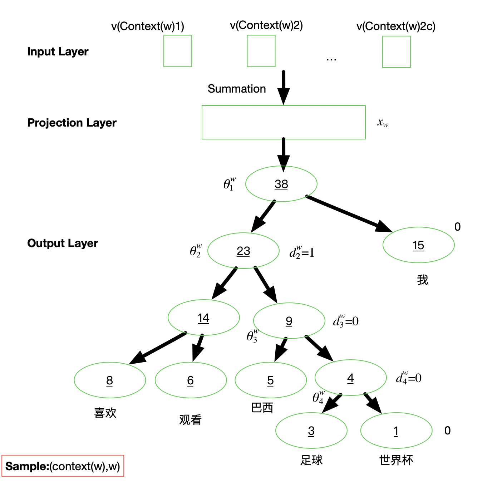

# NLP - 词嵌入Word Embedding

⾃然语⾔是⼀套⽤来表达含义的复杂系统，在这套系统中，词是表义的基本单元。词向量是⽤来表⽰词的向量，也可被认为是词的特征向量或表征，因此**把词映射为实数域向量的技术（或 文本特征提取 技术）也叫词嵌⼊（word embedding）**，近年来词嵌⼊已逐渐成为⾃然语⾔处理的基础知识。

在NLP领域，文本表示是第一步，也是很重要的一步，通俗来说就是**把人类的语言符号转化为机器能够进行计算的数字**，因为普通的文本语言机器是看不懂的，必须通过转化来表征对应文本。早期是**基于规则**的方法进行转化，而现代的方法是**基于统计机器学习**的方法。

**数据决定了机器学习的上限，而算法只是尽可能逼近这个上限**，在本文中数据指的就是文本表示，所以弄懂文本表示的发展历程，对于NLP学习者来说是必不可少的。

<div align="center"></div>

文本特征提取有两个非常重要的模型：

- 词集模型：单词构成的集合，集合自然每个元素都只有一个，也即词集中的每个单词都只有一个
- 词袋模型：在词集的基础上如果一个单词在文档中出现不止一次，统计其出现的次数（频数）

两者本质上的区别，词袋是在词集的基础上增加了频率的维度，词集只关注有和没有，词袋还要关注有几个。

​    

# 一 离散表示     

## 1 One-hot

One-Hot编码，又称为一位有效编码（简称读热向量编码），也是特征工程中最常用的方法，主要是采用N位状态寄存器来对**N** **个状态**进行编码，每个状态都有独立的寄存器位，并且在任意时候只有一位有效。简而言之，one hot编码是将类别变量转换为机器学习算法易于利用的一种形式的过程。

One-hot编码步骤如下：

* 1）构造文本分词后的字典，每个分词是一个比特值，比特值为0或者1；
* 2）每个分词的文本表示为该分词的比特位为1，其余位为0的矩阵表示，即将每个单词在词汇表对应的index维度置为1，其它元素保持不变，就能得到最终的one-hot向量；

<div align="center"></div>

例如：

```python
// a. 文本内容
I am a Chinese and I love China

// b. 以上句子可以构造一个词典（词汇表）
{"I": 1, "am": 2, "a": 3, "Chinese": 4, "and": 5, "love": 6, "China": 7}

// c. 每个词典索引对应着比特位，那么利用One-hot可得到了每个单词的embedding
I:  [1, 0, 0, 0, 0, 0, 0]
am: [0, 1, 0, 0, 0, 0, 0]
... ...
China: [0, 0, 0, 0, 0, 0, 1]
  
// d. 最后，就可以送入到机器学习或者深度学习模型中进行后续处理
```

使用示例：

```python
def test_pandas():
    """ 基于Pandas 的 One-hot编码
    """
    df = pd.DataFrame({
        "col1": ["Sun", "Sun", "Moon", "Earth", "Moon", "Venus"]
    })

    # One-hot编码
    df_new = pd.get_dummies(df, columns=["col1"], prefix="Planet", dtype=int)
    print("The transform data using get_dummies")
    print(df_new)


def test_sklearn():
    """ 基于 Sklearn 的 One-hot编码
    """
    targets = np.array(
           ["red", "green", "blue", "yellow", "pink", "white"]
    )
    labelEnc = preprocessing.LabelEncoder()
    # 打标签, 字符串转数字
    new_target = labelEnc.fit_transform(targets)
    
    onehotEnc = preprocessing.OneHotEncoder()
    # 使用 fit() 拟合原始特征
    onehotEnc.fit(new_target.reshape(-1, 1))
    # 使用 one-hot encoding 将原始特征转换为新特征
    targets_trans = onehotEnc.transform(new_target.reshape(-1, 1))

    print("The original data")
    print(targets)
    print(new_target)
    print("The transform data using OneHotEncoder")
    print(targets_trans.toarray())


def test_sklearn_newest():
    """ 基于最新版本的Sklearn 的 One-hot编码
    在较新版本的 sklearn 中，不需要将字符串转换为 int，因为 OneHotEncoder 会自动执行此操作
    """
    x = [[11, "Seattle"], [22, "London"], [33, "Lahore"], [44, "Berlin"], [55, "Abuja"]]
    y = preprocessing.OneHotEncoder().fit_transform(x).toarray()
    print("The transform data using the newest OneHotEncoder")
    print(y)
```

   

One-hot表示文本信息的**缺点**：

> 1）**容易造成维度灾难（curse of dimensionality）**：随着语料库的增加，数据特征的维度会越来越大，从而产生一个维度很高，又很稀疏的矩阵，会使得计算代价变大；
>
> 2）one-hot编码假设单词与单词之间是独立的，**无法体现单词与单词的关系远近程度**，例如，如果需要判断“Chinese” 和 “China” 向量之间的相似性，得出的向量内积值为 0（[0,0,0,1,0,0,0]\*[0,0,0,0,0,0,1]=0），与对“Chinese”和“and”之间的相似性没有任何区别，因为 “Chinese” 和 “and” 之间的one-hot向量内积也为0（[0,0,0,1,0,0,0]\*[0,0,0,0,1,0,0]=0），而明显 “China” 与 “Chinese” 的关系要近于 “China” 与 “and” 的，这在one-hot编码方式中无法体现；

​      

## 2 传统词袋模型 BOW

词袋模型（Bag-of-words model），忽略掉文本的语法和语序等要素，将其仅仅看作是若干个词汇的集合，文档中每个单词的出现都是独立的。BoW使用一组无序的单词(words)来表达一段文字或一个文档。

<div align="center"></div>

**文档的向量表示可以直接将各词的词向量表示加和**，例如：

```python
// a. 文本内容
John likes to watch movies. Mary likes too.
John also likes to watch football games.

// b. 基于上述两个文档中出现的单词, 构造一个词典（词汇表）
{"John": 1, "likes": 2,"to": 3, "watch": 4, "movies": 5,"also": 6, "football": 7, "games": 8,"Mary": 9, "too": 10}

// c. 上面的词典中包含10个单词, 每个单词有唯一的索引, 那么每个文本可以使用一个10维的向量来表示
[1, 2, 1, 1, 1, 0, 0, 0, 1, 1]
[1, 1, 1, 1, 0, 1, 1, 1, 0, 0]
```

使用示例：

```python
from sklearn.feature_extraction.text import CountVectorizer
from sklearn.linear_model import RidgeClassifier
from sklearn.metrics import f1_score

import pandas as pd

def test_bow():
    """基于 Sklearn 的 BOW 编码
    """
    # 文本物料
    corpus = [
        'This is the first document.',
        'This document is the second document.',
        'And this is the third one.',
        'Is this the first document?',
    ]

    # Convert a collection of text documents to a matrix of token counts
    vectorizer = CountVectorizer()
    # 将原始特征转换为新特征
    new_corpus = vectorizer.fit_transform(corpus).toarray()
    print(new_corpus)
   	
def test_bow_predict():
  	"""本地构建验证集计算F1得分
  	"""
    train_df = pd.read_csv('train_set.csv', sep='\t', nrows=15000)
		
    vectorizer = CountVectorizer(max_features=3000)
    train_test = vectorizer.fit_transform(train_df['text'])

    clf = RidgeClassifier()
    clf.fit(train_test[:10000], train_df['label'].values[:10000])

    val_pred = clf.predict(train_test[10000:])
    print(f1_score(train_df['label'].values[10000:], val_pred, average='macro'))
    # 0.74
```

从上可知，BoW编码后向量特点：

> 1）**向量维度**根据词典中不重复词的个数确定；
>
> 2）向量中每个元素顺序与原来文本中单词出现的顺序没有关系，**与词典中的顺序一一对应**；
>
> 3）向量中每个数字是词典中每个单词在文本中出现的频率，即**词频**表示；

​     

传统词袋模型同样有一些**缺点**：

> 1）词向量化后，词与词之间是有大小关系的，不一定词出现的越多，权重越大；
>
> 2）词与词之间是没有顺序关系的，因此无法表达语义；

​     

## 3 TF-IDF

TF-IDF（term frequency–inverse document frequency）是一种用于信息检索与数据挖掘的常用加权技术

> TF即词频（Term Frequency），IDF即逆文本频率指数（Inverse Document Frequency）

TF-IDF同时也是一种统计方法，用以评估一字词对于一个文件集或一个语料库中的其中一份文件的重要程度

> **字词的重要性随着它在文件中出现的次数成正比增加，但同时会随着它在语料库中出现的频率成反比下降，即一个词语在一篇文章中出现次数越多, 同时在所有文档中出现次数越少, 越能够代表该文章**。

TF-IDF加权的各种形式常被搜索引擎应用，作为文件与用户查询之间相关程度的度量或评级，除了TF-IDF以外，因特网上的搜索引擎还会使用**基于链接分析的评级方法**，以确定文件在搜寻结果中出现的顺序。

​    

在一份给定的文件里，TF指的是某一个给定的词语在该文件中出现的频率，这个数字是对词数（term count）的归一化，以防止它偏向长的文件（同一个词语在长文件里可能会比短文件有更高的词数，而不管该词语重要与否）。因此，对于在某一特定文件里的词语w，它的重要性可表示为：

<div align="center"></div>

IDF是一个词语普遍重要性的度量，对于某一特定词语的IDF，可以由总文件数目除以包含该词语之文件的数目，再将得到的商取对数得到：

<div align="center"></div>

分母之所以加1，是为了避免分母为0。那么，**TF−IDF = TF \* IDF**，从这个公式可以看出，当w在文档中出现的次数增大时，而TF-IDF的值是减小的，即某一特定文件内的**高词语频率**，以及该词语在整个文件集合中的**低文件频率**，可以产生出高权重的TF-IDF。因此，**TF-IDF倾向于过滤掉常见的词语，保留重要的词语**。

示例：

```python
import pandas as pd

from sklearn.feature_extraction.text import TfidfVectorizer
from sklearn.linear_model import RidgeClassifier
from sklearn.metrics import f1_score

# 本地构建验证集计算F1得分
train_df = pd.read_csv('train_set.csv', sep='\t', nrows=15000)

tfidf = TfidfVectorizer(ngram_range=(1,3), max_features=3000)
train_test = tfidf.fit_transform(train_df['text'])

clf = RidgeClassifier()
clf.fit(train_test[:10000], train_df['label'].values[:10000])

val_pred = clf.predict(train_test[10000:])
print(f1_score(train_df['label'].values[10000:], val_pred, average='macro'))
```

**缺点：**还是没有把词与词之间的关系顺序表达出来

​     

## 4 n-gram模型

N-gram与Count Vectors类似，不过加入了相邻单词组合成为新的单词，并进行计数。n-gram模型为了**保持词的顺序**，做了一个**滑窗**的操作，这里的n表示的就是滑窗的大小，例如2-gram模型，也就是把2个词当做一组来处理，然后向后移动一个词的长度，再次组成另一组词，把这些生成一个字典，按照词袋模型的方式进行编码得到结果，该模型考虑了词的顺序。

例如：

```
// a. 文本内容
John likes to watch movies. Mary likes too.
John also likes to watch football games.

// b. 基于上述两个文档中出现的单词, 构造一个词典（词汇表）
{"John likes”: 1, "likes to”: 2, "to watch”: 3, "watch movies”: 4, "Mary likes”: 5, "likes too”: 6, "John also”: 7, "also likes”: 8, “watch football”: 9, "football games": 10}

// c. 上面的词典中包含10个单词, 每个单词有唯一的索引, 那么每个文本可以使用一个10维的向量来表示
[1, 1, 1, 1, 1, 1, 0, 0, 0, 0]
[0, 1, 1, 0, 0, 0, 1, 1, 1, 1]
```

**缺点：**随着n的大小增加，词表会成指数型膨胀，会越来越大。

​    

## 5 离散表示存在的问题

由于存在以下的问题，对于一般的NLP问题，是可以使用离散表示文本信息来解决问题的，但对于要求精度较高的场景就不适合了。

> 无法衡量词向量之间的关系；
>
> 词表的维度随着语料库的增长而膨胀；
>
> n-gram词序列随语料库增长呈指数型膨胀，更加快；
>
> 离散数据来表示文本会带来数据稀疏问题，导致丢失了信息，与生活中理解的信息是不一样的；

​     

# 二 分布式表示

科学家们为了提高模型的精度，又发明出了分布式的表示文本信息的方法，即**用一个词附近的其它词来表示该词，这是现代统计自然语言处理中最有创见的想法之一**。当初科学家发明这种方法是基于人的语言表达，认为一个词是由这个词的周边词汇一起来构成精确的语义信息。就好比，物以类聚人以群分，如果你想了解一个人，可以通过他周围的人进行了解，因为周围人都有一些共同点才能聚集起来。

​       

## 1 共现矩阵

共现矩阵顾名思义就是共同出现的意思，词文档的共现矩阵主要用于发现主题(topic)，用于主题模型，如LSA。

局域窗中的word-word共现矩阵可以挖掘语法和语义信息，例如：

```python
// a. 文本内容
I like deep learning.	
I like NLP.	
I enjoy flying

// b. 基于以上三句话，设置滑窗为2，可以得到一个词典:
{"I like", "like deep", "deep learning", "like NLP", "I enjoy", "enjoy flying", "I like"}

// c. 可以得到一个如下图的共现矩阵(对称矩阵)，中间的每个格子表示的是行和列组成的词组在词典中共同出现的次数，也就体现了共现的特性
```

<div align="center"></div>

​    

**存在的问题：**

> 1）向量维数随着词典大小线性增长；
>
> 2）存储整个词典的空间消耗非常大；
>
> 3）一些模型如文本分类模型会面临稀疏性问题；
>
> 4）模型会欠稳定，每新增一份语料进来，稳定性就会变化；

​      

# 三 神经网络表示

## 1 NNLM

NNLM (Neural Network Language model)，神经网络语言模型是03年提出来的，通过训练得到中间产物--词向量矩阵，这就是得到的文本表示向量矩阵。

NNLM说的是定义一个前向窗口大小，其实和上面提到的窗口是一个意思。把这个窗口中最后一个词当做y，把之前的词当做输入x，通俗来说就是预测这个窗口中最后一个词出现概率的模型。

<div align="center"></div>

​      

## 2 Word2Vec

谷歌2013年提出的Word2Vec是目前最常用的词嵌入模型之一，其主要思想是 “**一个词的意义，应该由其周围经常出现的词来表达**” ，Word2Vec实际是一种浅层的神经网络模型，它有两种网络结构，分别是 连续词袋 **CBOW**（Continues Bag of Words）和 **Skip-gram**。Word2Vec和上面的NNLM很类似，但比NNLM简单。

<div align="center"></div>

​     

### 2.1 连续词袋模型 CBOW

**通过上下文来预测当前值**，即获得中间词两边的的上下文，然后用周围的词去预测中间的词，把中间词当做y，把窗口中的其它词当做x输入，x输入是经过one-hot编码过的，然后通过一个隐层进行求和操作，最后通过激活函数softmax，可以计算出每个单词的生成概率，接下来的任务就是训练神经网络的权重，使得语料库中所有单词的整体生成概率最大化，而求得的权重矩阵就是文本表示词向量的结果。总的来说，**相当于一句话中扣掉一个词，让你猜这个词是什么**。

<div align="center"></div>

CBOW是一个三层神经网络（如下图）

> 1. 输入层：上下文单词的one-hot {假设单词向量空间dim为V，上下文单词个数为C}
> 2. 所有one-hot分别乘以共享的输入权重矩阵W. {VxN矩阵，N为自己设定的数，初始化权重矩阵W}
> 3. 所得的向量 {因为是one-hot所以为向量} 相加求平均作为隐层向量, size为1N
> 4. 乘以输出权重矩阵W' {NV}
> 5. 得到向量 {1V} 激活函数处理得到V-dim概率分布 {PS: 因为是one-hot，其中的每一维斗代表着一个单词}
> 6. 概率最大的index所指示的单词为预测出的中间词（target word）与true label的one-hot做比较，误差越小越好（根据误差更新权重矩阵）

<div align="center"></div>

所以，需要定义loss function（一般为交叉熵代价函数），采用梯度下降算法更新W和W'。训练完毕后，输入层的每个单词与矩阵W相乘得到的向量的就是想要的词向量（word embedding），这个矩阵（所有单词的word embedding）也叫做look up table（矩阵W自身），也就是说，任何一个单词的one-hot乘以这个矩阵都将得到自己的词向量，即有了look up table就可以免去训练过程直接查表得到单词的词向量了。

​     

### 2.2 跳字模型 Skip-gram

**用中心词来预测上下文**，即通过当前词来预测窗口中上下文词出现的概率模型，把当前词当做x，把窗口中其它词当做y，依然是通过一个隐层接一个Softmax激活函数来预测其它词的概率。总的来说，**相当于给你一个词，让你猜前面和后面可能出现什么词**。

<div align="center"></div>

**Skip-gram**的网络结构共包含三层：输入层，隐藏层和输出层，处理步骤：

> 1. 输入层接收shape为 [1,𝑉] 的one-hot向量𝑥，其中 𝑉 代表词表中单词的数量，这个one-hot向量就是上边提到的中心词；
> 2. 隐藏层包含一个shape为 [𝑉,𝑁] 的参数矩阵𝑊1，其中这个 𝑁 代表词向量的维度，𝑊1 就是word embedding 矩阵，即要学习的词向量。将输入的one-hot向量 𝑥 与𝑊1 相乘，便可得到一个shape为[1,𝑁] 的向量，即该输入单词对应的词向量𝑒；
> 3. 输出层包含一个shape为 [𝑁,𝑉] 的参数矩阵𝑊2，将隐藏层输出的𝑒与 𝑊2 相乘，便可以得到shape为[1,𝑉]的向量𝑟，内部的数值分别代表每个候选词的打分，使用softmax函数，对这些打分进行归一化，即得到中心词的预测各个单词的概率；

<div align="center"></div>

​     

### 2.3 优化

Word2Vec模型是一个超级大的神经网络（权重矩阵规模非常大）。举个例子，我们拥有10000个单词的词汇表，如果想嵌入300维的词向量，那么 输入-隐层权重矩阵 和 隐层-输出层 的权重矩阵都会有 10000 x 300 = 300万个权重，在如此庞大的神经网络中进行梯度下降是相当慢的。更糟糕的是，需要大量的训练数据来调整这些权重并且避免过拟合。百万数量级的权重矩阵和亿万数量级的训练样本意味着训练这个模型将会是个灾难（太凶残了）。

下面主要介绍两种方法优化训练过程：

1）**层次Softmax**

作为一种计算高效的近似方法，Hierarchical Softmax被广泛使用，主要为了避免要计算所有词的softmax概率，该方法不用为了获得概率分布而评估神经网络中的W个输出结点，而只需要评估大约log2(W)个结点。层次Softmax使用一种二叉树结构来表示词典里的所有词，V个词都是二叉树的叶子结点，而这棵树一共有V−1个非叶子结点。

> **哈夫曼树(Huffman Tree)**：给定N个权值作为N个[叶子结点](https://baike.baidu.com/item/叶子结点/3620239)，构造一棵二叉树，若该树的带权路径长度达到最小，称这样的二叉树为最优二叉树，也称为哈夫曼树(Huffman Tree)。哈夫曼树是带权路径长度最短的树，权值较大的结点离根较近。

<div align="center"></div>

​      

2）**负例采样**（Negative Sampling）

是用来提高训练速度并且改善所得到词向量的质量的一种方法，且不同于原本每个训练样本更新所有的权重，负采样每次让一个训练样本仅仅更新一小部分的权重，这样就会降低梯度下降过程中的计算量。

<div align="center"></div>

以 “**Pineapples are spiked and yellow**” 为例进行讲解，如上图所示，其中中心词是spiked和上下文词是正样本Pineapples are and yellow，这里这个正样本代表该词是中心词的上下文。

以正样本单词Pineapples为例，**之前的做法**是在使用softmax学习时，需要最大化Pineapples的推理概率，同时最小化其他词表中词的推理概率。之所以计算缓慢，是因为需要对词表中的所有词都计算一遍。然而我们还可以使用另一种方法，就是随机从词表中选择几个代表词，通过最小化这几个代表词的概率，去**近似**最小化整体的预测概率。

例如，先指定一个中心词（spiked）和一个目标词正样本（Pineapples），再随机在词表中采样几个目标词负样本（如”dog，house”等）。

有了这些正负样本，skip-gram模型就变成了一个二分类任务。对于目标词正样本，需要最大化它的预测概率；对于目标词负样本，需要最小化它的预测概率。通过这种方式，就可以完成计算加速，这个做法就是**负采样**。

负采样整体训练流程：

> 1）获取中心词spiked的正负样本（正负样本是目标词），这里一般会设定个固定的窗口，比如中心词前后3个词算是中心词的上下文（即正样本）；
>
> 2）获取对应词的词向量，其中中心词从黄色的向量矩阵中获取词向量，目标词从灰色的向量矩阵中获取词向量；
>
> 3）将中心词和目标词的词向量进行点积并经过sigmoid函数，我们知道sigmoid是可以用于2分类的函数，通过这种方式来预测中心词和目标词是否具有上下文关系；
>
> 4）将预测的结果和标签使用交叉熵计算损失值，并计算梯度进行反向迭代，优化参数；

经过这个训练的方式，就可以训练出我们想要的词向量，但**上图**中包含两个词向量矩阵（黄色的和灰色的），一般是将中心词对应的词向量矩阵（黄色的）作为正式训练出的词向量。

​       

**Word2Vec存在的问题**

> 1）对每个local context window单独训练，没有利用包 含在global co-currence矩阵中的统计信息；
>
> 2）对多义词无法很好的表示和处理，因为使用了唯一的词向量；
>
> 3）Word2vec 是一种静态的方式，虽然通用性强，但是无法针对特定任务做动态优化；

​        

### 2.4 多样的2vec向量化模型

word2vec模型的问题在于词语的多义性，比如duck这个单词常见的含义有水禽或者下蹲，但对于 word2vec 模型来说，它倾向于将所有概念做归一化平滑处理，得到一个最终的表现形式。

比如：doc2vec / tweet2vec / batter-pitcher-2vec / illustration-2vec / lda2vec / sentence2vec / wiki2vec / topicvec / entity2vec / str2vec / node2vec / item2vec / author2vec / playlist-to-vec / sense2vec / med2vec / game2vec / paper2vec

​     

# 附录


1. https://github.com/NLP-LOVE/ML-NLP
2. [自然语言处理 03：N-gram 语言模型](https://yey.world/2020/03/09/COMP90042-03/)
3. [不懂n-gram，怎么学好语言模型？](https://www.cnblogs.com/hithink/p/12107622.html)
4. [NLP教程 | 斯坦福CS224n · 课程带学与全套笔记解读](https://www.showmeai.tech/tutorials/36)
5. [Word2Vec: 一种词向量的训练方法](https://paddlepedia.readthedocs.io/en/latest/tutorials/sequence_model/word_representation/word2vec.html)
6. [NLP+2vec︱认识多种多样的2vec向量化模型](https://cloud.tencent.com/developer/article/1020400)

