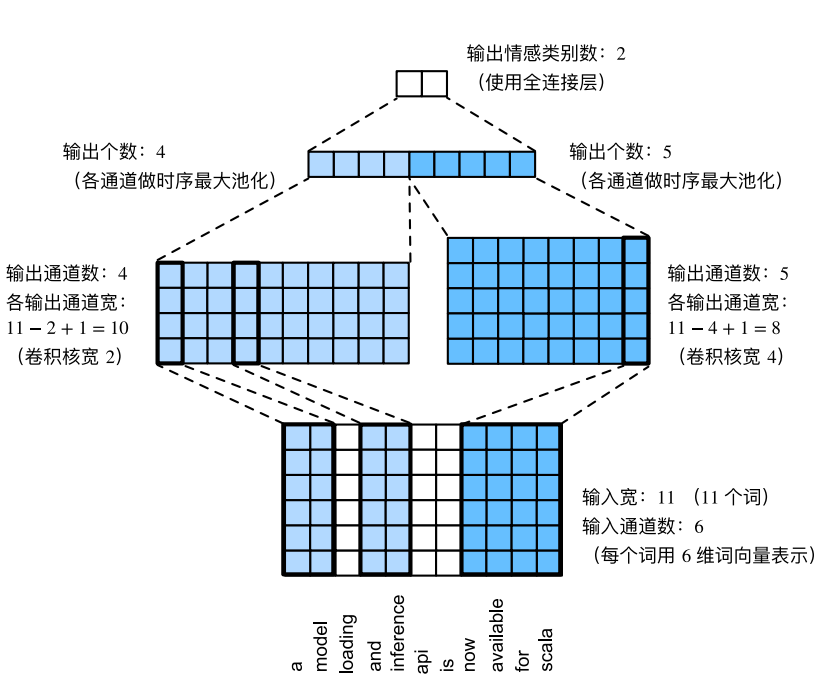

# NLP - 文本分类

通常，进行文本分类的主要方法有三种：

- 基于规则特征匹配的方法（如根据喜欢，讨厌等特殊词来评判情感，但准确率低，通常作为一种辅助判断的方法）
- 基于传统机器学习的方法（特征工程 + 分类算法）
- 给予深度学习的方法（词向量 + 神经网络）

自BERT提出以来，各大NLP比赛基本上已经被BERT霸榜了，但笔者认为掌握经典的文本分类模型原理还是十分有必要的。

​      

# 一 textRNN

textRNN指的是**利用RNN循环神经网络解决文本分类问题**，文本分类是自然语言处理的一个基本任务，试图推断出给定文本（句子、文档等）的标签或标签集合。

文本分类的应用非常广泛，如：

- 垃圾邮件分类：2分类问题，判断邮件是否为垃圾邮件
- 情感分析：2分类问题：判断文本情感是积极还是消极；多分类问题：判断文本情感属于{非常消极，消极，中立，积极，非常积极}中的哪一类。
- 新闻主题分类：判断一段新闻属于哪个类别，如财经、体育、娱乐等。根据类别标签的数量，可以是2分类也可以是多分类。
- 自动问答系统中的问句分类
- 社区问答系统中的问题分类：多标签多分类(对一段文本进行多分类，该文本可能有多个标签)，如知乎看山杯
- 让AI做法官：基于案件事实描述文本的罚金等级分类(多分类)和法条分类(多标签多分类)
- 判断新闻是否为机器人所写：2分类

​    

## 1 原理

在一些自然语言处理任务中，当对序列进行处理时，一般会采用**循环神经网络RNN**，尤其是它的一些变种，如LSTM（更常用）/ GRU。当然也可以把RNN运用到文本分类任务中。

这里的文本可以一个句子，文档（短文本，若干句子）或篇章（长文本），因此每段文本的长度都不尽相同。在对文本进行分类时，一般会指定一个固定的输入序列/文本长度：

> 1）该长度可以是最长文本/序列的长度，此时其他所有文本/序列都要进行填充以达到该长度；
>
> 2）该长度也可以是训练集中所有文本/序列长度的均值，此时对于过长的文本/序列需要进行截断，过短的文本则进行填充。
>
> 总之，要使得训练集中所有的文本/序列长度相同，该长度除之前提到的设置外，也可以是其他任意合理的数值。同时在测试时，也需要对测试集中的文本/序列做同样的处理。

​      

处理过程：

> 1）首先需要对文本进行 **分词**，然后指定一个序列长度n（大于n的截断，小于n的填充），并使用 **词嵌入** 得到每个词固定维度的向量表示;
>
> 2）对于每一个输入文本/序列，然后可以在RNN的每一个时间步长上输入文本中一个单词的向量表示，计算当前时间步长上的 **隐藏状态**，然后用于当前时间步骤的输出以及传递给下一个时间步长并和下一个单词的词向量一起作为RNN单元输入，然后再计算下一个时间步长上RNN的隐藏状态;
>
> 3）以此重复...  直到处理完输入文本中的每一个单词，由于输入文本的长度为n，所以要经历n个时间步长。

基于RNN的文本分类模型非常灵活，有多种多样的结构，下面主要介绍两种典型的结构。

​    

## 2 网络结构

TextRNN主要是将Word Embedding输入到双向LSTM中，然后对最后一位的输出输入到全连接层中，在对其进行softmax分类即可。

### 2.1 结构1

**流程**：embedding--->BiLSTM--->concat final output/average all output----->softmax layer

> TextRNN将句子中每个词的词向量依次输入到双向双层LSTM，分别将两个方向最后一个有效位置的隐藏层拼接成一个向量作为文本的表示。

一般取前向/反向LSTM在最后一个时间步长上隐藏状态，然后进行拼接，在经过一个softmax层（输出层使用softmax激活函数）进行一个多分类；或者取前向/反向LSTM在每一个时间步长上的隐藏状态，对每一个时间步长上的两个隐藏状态进行拼接，然后对所有时间步长上拼接后的隐藏状态取均值，再经过一个softmax层进行一个多分类（2分类的话使用sigmoid激活函数）。

**上述结构也可以添加dropout/L2正则化或BatchNormalization 来防止过拟合以及加速模型训练。**

​     

### 2.2 结构2

流程：embedding-->BiLSTM---->(dropout)-->concat ouput--->UniLSTM--->(droput)-->softmax layer

与之前结构不同的是，在双向LSTM（上图不太准确，底层应该是一个双向LSTM）的基础上又堆叠了一个单向的LSTM。把双向LSTM在每一个时间步长上的两个隐藏状态进行拼接，作为上层单向LSTM每一个时间步长上的一个输入，最后取上层单向LSTM最后一个时间步长上的隐藏状态，再经过一个softmax层（输出层使用softamx激活函数，2分类的话则使用sigmoid）进行一个多分类。

​    

## 3 总结

TextRNN的结构非常灵活，可以任意改变，比如 把LSTM单元替换为GRU单元，把双向改为单向，添加dropout或BatchNormalization以及再多堆叠一层等等。TextRNN在文本分类任务上的效果非常好，与TextCNN不相上下，但RNN的训练速度相对偏慢，一般2层就已经足够多了。

​       

# 二 textCNN

在“卷积神经⽹络”中，探究了如何使⽤⼆维卷积神经⽹络来处理⼆维图像数据。在之前的语⾔模型和⽂本分类任务中，将⽂本数据看作是只有⼀个维度的时间序列，并很⾃然地使⽤循环神经⽹络来表征这样的数据。其实，**也可以将⽂本当作⼀维图像，从而可以⽤⼀维卷积神经⽹络来捕捉临近词之间的关联，这里主要介绍将卷积神经⽹络应⽤到⽂本分析的开创性⼯作之⼀：textCNN**。

​      

## 1 一维卷积层

在介绍模型前，先来解释⼀维卷积层的⼯作原理，与⼆维卷积层⼀样，⼀维卷积层使⽤⼀维的互相关运算。在⼀维互相关运算中，卷积窗口从输⼊数组的最左⽅开始，按从左往右的顺序，依次在输⼊数组上滑动。当卷积窗口滑动到某⼀位置时，窗口中的输⼊⼦数组与核数组按元素相乘并求和，得到输出数组中相应位置的元素。

如下图所⽰，输⼊是⼀个宽为7的⼀维数组，核数组的宽为2。可以看到输出的宽度为 7 - 2 + 1 = 6，且第⼀个元素是由输⼊的最左边的宽为2的⼦数组与核数组按元素相乘后再相加得到的：0 *×* 1 + 1 × 2 = 2。

​    

## 2 时序最⼤池化层 MaxPooling

类似地有⼀维池化层。textCNN中使⽤的时序最⼤池化（max-over-time pooling）层实际上对应⼀维全局最⼤池化层：假设输⼊包含多个通道，各通道由不同时间步上的数值组成，各通道的输出即该通道所有时间步中最⼤的数值。因此，时序最⼤池化层的输⼊在各个通道上的时间步数可以不同。为提升计算性能，我们常常将不同⻓度的时序样本组成⼀个小批量，并通过在较短序列后附加特殊字符（如0）令批量中各时序样本⻓度相同。这些⼈为添加的特殊字符当然是⽆意义的。由于时序最⼤池化的主要⽬的是**抓取时序中最重要的特征**，它通常能使模型不受⼈为添加字符的影响。

​    

## 3 textCNN模型

textCNN模型主要使⽤了⼀维卷积层和时序最⼤池化层。假设输⼊的⽂本序列由*n*个词组成，每个词⽤*d*维的词向量表⽰。那么输⼊样本的宽为*n*，⾼为1，输⼊通道数为*d*。textCNN的计算主要分为以下⼏步：

> 1. 定义多个⼀维卷积核，并使⽤这些卷积核对输⼊分别做卷积计算，注意宽度不同的卷积核可能会捕捉到不同个数的相邻词的相关性。
> 2. 对输出的所有通道分别做时序最⼤池化，再将这些通道的池化输出值连结为向量。
> 3. 通过全连接层将连结后的向量变换为有关各类别的输出。这⼀步可以使⽤丢弃层应对过拟合。
>
> 总的来说，就是将所有卷积核的输出通过MaxPooling之后拼接形成一个新向量，再将该向量输出到全连接层分类器（Dropout + Linear + Softmax）实现文本分类。

下图⽤⼀个例⼦解释了textCNN的设计。这⾥的输⼊是⼀个有11个词的句⼦，每个词⽤6维词向量表⽰。因此输⼊序列的宽为11，输⼊通道数为6。给定2个⼀维卷积核，核宽分别为2和4，输出通道数分别设为4和5。因此，⼀维卷积计算后，4个输出通道的宽为 11 - 2 + 1 = 10，而其他5个通道的宽为 11 - 4 + 1 = 8。尽管每个通道的宽不同，我们依然可以对各个通道做时序最⼤池化，并将9个通道的池化输出连结成⼀个9维向量。最终，使⽤全连接将9维向量变换为2维输出，即正⾯情感和负⾯情感的预测。

​      

# 三 TextRCNN

就深度学习领域来说，**RNN** 和 **CNN** 作为文本分类问题的主要模型架构，都存在各自的优点及局限性

> RNN：擅长处理序列结构，能够考虑到句子的上下文信息，但RNN属于“biased model”，一个句子中越往后的词重要性越高，这有可能影响最后的分类结果，因为对句子分类影响最大的词可能处在句子任何位置。
>
> CNN属于无偏模型，能够通过最大池化获得最重要的特征，但是CNN的滑动窗口大小不容易确定，选的过小容易造成重要信息丢失，选的过大会造成巨大参数空间。

为了解决二者的局限性，这篇文章提出了一种新的网络架构RCNN，用双向循环结构获取上下文信息，这比传统的基于窗口的神经网络更能减少噪声，而且在学习文本表达时可以大范围的保留词序。其次使用最大池化层获取文本的重要部分，自动判断哪个特征在文本分类过程中起更重要的作用。

该模型的主要思想如下：

- 首先获得词向量表示𝑒(𝑤𝑖)
- 其次将词向量通过双向RNN(实践中可以是LSTM或GRU)得到 𝑐𝑙(𝑤𝑖) 和 𝑐𝑟(𝑤𝑖)
- 将𝑐𝑙(𝑤𝑖),  𝑒(𝑤𝑖) 以及 𝑐𝑟(𝑤𝑖) 拼接得到新的向量，将其输入到全连接网络对其进行整合，激活函数为tanh
- 再将全连接网络的输出进行MaxPooling
- 最后将其输入一个全连接分类器中实现分类

​       

# 四 fastText

FastText是Facebook于2016年发布的文本分类模型，其主要思想基于word2vec中的CBOW模型，在训练文本分类模型的同时，也将训练出字符级n-gram词向量。

英语单词通常有其内部结构和形成⽅式，例如可以从 “dog” / “dogs” 和 “dogcatcher” 的字⾯上推测它们的关系。这些词都有同⼀个词根“dog”，但使⽤不同的后缀来改变词的含义，而且这个关联可以推⼴⾄其他词汇。

在word2vec模型中并没有直接利⽤构词学中的信息，所以⽆论是在 **跳字模型** 还是 **连续词袋模型** 中，都将形态不同的单词⽤不同的向量来表⽰。例如：**“dog” 和 “dogs” 分别⽤两个不同的向量表⽰，而模型中并未直接表达这两个向量之间的关系**。鉴于此，fastText提出了 **⼦词嵌⼊**（subword embedding）的⽅法，从而试图将构词信息引⼊word2vec中的CBOW。如果能够学习到形态学变换到单词特征的规则，就可以利用这个规则来得到许多训练集中不可见的单词表示。

这里有一点需要特别注意，一般情况下，使用fastText进行文本分类的同时也会产生词的embedding，即embedding 是 fastText 分类的产物，除非决定使用预训练的embedding来训练fastText分类模型，这另当别论。

​       

## 1 n-gram表示单词

word2vec把语料库中的每个单词当成原子的，它会为每个单词生成一个向量。这忽略了单词内部的形态特征，比如：“book” 和“books”，“阿里巴巴” 和 “阿里”，这两个例子中，两个单词都有较多公共字符，即它们的**内部形态**类似，但是在传统的word2vec中，这种单词内部形态信息因为它们被转换成不同的id丢失了。

为了克服这个问题，**fastText使用了字符级别的n-grams来表示一个单词。**对于单词“book”，假设n的取值为3，则它的trigram有：

> “<bo”, “boo”, “ook”, “ok>”

其中，<表示前缀，>表示后缀。于是可以用这些trigram来表示“book”这个单词，进一步可以用这4个trigram的向量叠加来表示“apple”的词向量。

**这带来两点好处**：

> 1）对于低频词生成的词向量效果会更好。因为它们的n-gram可以和其它词共享；
>
> 2）对于训练词库之外的单词，仍然可以构建它们的词向量，即可以叠加它们的字符级n-gram向量；

​     

## 2 模型架构

之前提到过，fastText模型架构和word2vec的CBOW模型架构非常相似。下面是fastText模型架构图：

**注意**：此架构图没有展示词向量的训练过程，可以看到，和CBOW一样，fastText模型也只有三层：输入层、隐含层、输出层（Hierarchical Softmax），输入都是多个经向量表示的单词，输出都是一个特定的target，隐含层都是对多个词向量的叠加平均。

但不同的是：

> 1. CBOW的输入是 **目标单词的上下文**，fastText的输入是 **多个单词 **及其 **n-gram特征**，这些特征用来表示单个文档；
> 2. CBOW的输入单词被**one-hot编码**过，fastText的输入特征是**被embedding**过；
> 3. CBOW的输出是目标词汇，fastText的输出是文档对应的类标；

值得注意的是：**fastText在输入时，将单词的字符级别的n-gram向量作为额外的特征；在输出时，fastText采用了分层Softmax，大大降低了模型训练时间**。

​     

## 3 核心思想 & 输出效果

a. ***fastText文本分类的核心思想是什么？***

> 1）模型的后半部分，即从隐含层输出到输出层输出，会发现它就是一个softmax线性多类别分类器，分类器的输入是一个用来表征当前文档的向量；
>
> 2）模型的前半部分，即从输入层输入到隐含层输出部分，主要在做一件事情：生成用来表征文档的向量。那么它是如何做的呢？**叠加构成这篇文档的所有词及n-gram的词向量，然后取平均。**叠加词向量背后的思想就是传统的词袋法，即将文档看成一个由词构成的集合。
>
> 于是fastText的核心思想就是：**将整篇文档的词及n-gram向量叠加平均得到文档向量，然后使用文档向量做softmax多分类**。这中间涉及到两个技巧：字符级n-gram特征的引入以及分层Softmax分类。

​      

b. ***为何fastText的分类效果常常不输于传统的非线性分类器？***

> **假设我们有两段文本：**
>
> * 肚子 饿了 我 要 吃饭
> * 肚子 饿了 我 要 吃东西
>
> 这两段文本意思几乎一模一样，如果要分类，肯定要分到同一个类中去。但在传统的分类器中，用来表征这两段文本的**向量**可能差距非常大。传统的文本分类中，需要计算出每个词的权重，比如 **TF-IDF值**， “吃饭”和“吃东西” 算出的TF-IDF值相差可能会比较大，其它词类似，于是 VSM（向量空间模型）中用来表征这两段文本的文本向量差别可能比较大。
>
> 但是fastText就不一样了，**它是用单词的embedding叠加获得的文档向量，词向量的重要特点就是向量的距离可以用来衡量单词间的语义相似程度**，于是，在fastText模型中，这两段文本的向量应该是非常相似的，于是，它们很大概率会被分到同一个类中。
>
> 使用 **词embedding** 而非词本身作为特征，这是fastText效果好的一个原因；另一个原因就是**字符级n-gram**特征的引入对分类效果会有一些提升 。

​      

## 4 fastText与Word2Vec的不同

**相同点**：

- 图模型结构很像，都是采用embedding向量的形式，得到word的隐向量表达。
- 都采用很多相似的优化方法，比如使用Hierarchical softmax优化训练和预测中的打分速度。

|      | Word2Vec                               | fastText                              |
| ---- | -------------------------------------- | ------------------------------------- |
| 输入 | one-hot形式的单词的向量                | embedding过的单词的词向量和n-gram向量 |
| 输出 | 对应的是每一个term，计算某term概率最大 | 对应的是分类的标签                    |

**本质不同，体现在softmax的使用：**

> **word2vec** 的目的是得到词向量，该词向量最终是在输入层得到的，输出层对应的h-softmax也会生成一系列的向量，但是最终都被抛弃，不会使用；
>
> **fastText** 则充分利用了h-softmax的分类功能，遍历分类树的所有叶节点，找到概率最大的label
>
> PS：2个模型层次softmax时叶子节点差异，CBOW的叶子节点是词和词频，fasttext叶子节点是类标和类标的频数。

​      

**fastText优点**：

> 1. **适合大型数据+高效的训练速度**：能够训练模型“在使用标准多核CPU的情况下10分钟内处理超过10亿个词汇”；
> 2. **支持多语言表达**：利用其语言形态结构，fastText能够被设计用来支持包括英语、德语、西班牙语、法语以及捷克语等多种语言。FastText的性能要比时下流行的word2vec工具明显好上不少，也比其他目前最先进的词态词汇表征要好；
> 3. **专注于文本分类**，在许多标准问题上实现当下最好的表现（例如文本倾向性分析或标签预测）；

​       

# 五 HAN

HAN（Hierarchical Attention Network for Document Classification，分级注意网络）是一个基于层级注意力的分层架构模型，主要用于文档分类（长文本分类），模型在单词和句子级别分别编码并基于注意力获得文档的表示，然后经过Softmax进行分类，其中word encoder的作用是**获得句子的表示**，可以替换为TextCNN和TextRNN，也可以替换为BERT。

HAN主要由两个层次的模型架构：**词级别**和**句级别**，每个层次的模型都包括一个编码器和注意力模型两个部分。其实，HAN中使用到的的Attention就是最常用的 Soft-Attention ，整个模型的结构就相当于TextRNN + Soft-Attention的叠加。

​          

# 附录

1. https://github.com/NLP-LOVE/ML-NLP
2. [文本分类（TextRNN/TextCNN/TextRCNN/FastText/HAN）](https://www.cnblogs.com/sandwichnlp/p/11698996.html)
3. [NLP - 基于深度学习的文本分类](https://github.com/datawhalechina/team-learning-nlp/tree/master/NewsTextClassification)