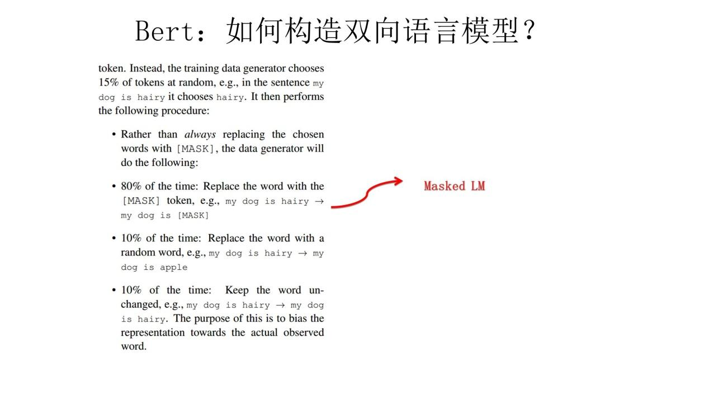

# NLP - BERT模型

**BERT**（Bidirectional Encoder Representation from Transformers），是Google2018年提出的预训练模型，即**双向Transformer的Encoder**，因为decoder是不能获要预测的信息的。模型的主要创新点都在pre-train方法上，即用了Masked LM和Next Sentence Prediction两种方法分别捕捉词语和句子级别的representation。

​     

# 一 模型发展（Word Embedding到Bert）

下面介绍从Word Embedding到Bert模型的发展简单过程

## 1 图像预训练

自从深度学习火起来后，预训练过程就是做图像或者视频领域的一种比较常规的做法，有比较长的历史了，而且这种做法很有效，能明显促进应用的效果。

那么图像领域怎么做预训练呢，上图展示了这个过程：

> 1）设计好网络结构以后，对于图像来说一般是CNN的多层叠加网络结构，可以先用某个训练集合（比如训练集合A或者训练集合B）对这个网络进行预先训练，在A任务上或者B任务上学会网络参数，然后存起来以备后用；
>
> 2）假设第三个任务C，网络结构采取相同的网络结构，在比较浅的几层CNN结构，网络参数初始化的时候可以加载A任务或者B任务学习好的参数，其它CNN高层参数仍然随机初始化。
>
> 3）之后用C任务的训练数据来训练网络，此时有两种做法：
>
> * **Frozen**：浅层加载的参数在训练C任务过程中不动；
> * **Fine-Tuning**：底层网络参数尽管被初始化了，在C任务训练过程中仍然随着训练的进程不断改变，顾名思义，就是 ***更好地把参数进行调整使得更适应当前的C任务***，一般图像或者视频领域要做预训练一般都这么做。

这样做的优点：

> 首先，如果手头任务C的训练集合数据量较少的话，现阶段的好用的CNN（比如：Resnet / Densenet / Inception等）网络结构层数很深，几百万上千万参数量算起步价，上亿参数的也很常见，训练数据少很难很好地训练这么复杂的网络，但是如果其中大量参数通过大的训练集合（比如 ImageNet）预先训练好直接拿来初始化大部分网络结构参数，然后再用C任务手头比较可怜的数据量上Fine-tuning过程去调整参数让它们更适合解决C任务，那事情就好办多了。
>
> 这样原先训练不了的任务就能解决了，即使手头任务训练数据也不少，加个预训练过程也能极大加快任务训练的收敛速度，所以这种预训练方式是老少皆宜的解决方案，另外疗效又好，所以在做图像处理领域很快就流行开来。

​    

**为什么这种预训练的思路是可行的？**

> 

>
> 对于层级的CNN结构来说，不同层级的神经元学习到了不同类型的图像特征，**由底向上特征**形成层级结构。
>
> 如上图所示，如果手头有一个人脸识别任务，训练好网络后，把每层神经元学习到的特征可视化肉眼看一看每层学到了啥特征，会看到最底层的神经元学到的是**线段等特征**，图示的第二个隐层学到的是**人脸五官的轮廓**，第三层学到的是**人脸的轮廓**，通过三步形成了特征的层级结构，越是底层的特征越是所有不论什么领域的图像都会具备的比如边角线弧线等底层基础特征，越往上抽取出的特征越与手头任务相关。
>
> 所以预训练好的网络参数，尤其是底层的网络参数抽取出特征跟具体任务越无关，越具备**任务的通用性**，所以这是为何一般用底层预训练好的参数初始化新任务网络参数的原因。而**高层特征跟任务关联较大**，实际可以不用使用，或者采用Fine-tuning用新数据集合清洗掉高层无关的特征抽取器。
>
> 

>
> **ImageNet**来做网络的预训练，主要有两点：
>
> * 一方面ImageNet是图像领域里有超多事先标注好训练数据的数据集合，分量足是个很大的优势，量越大训练出的参数越靠谱；
> * 另外一方面因为ImageNet有1000类，类别多，算是通用的图像数据，跟领域没太大关系，所以通用性好，预训练完后哪哪都能用，是个万金油；

​     

而在NLP领域，word embedding其实就是NLP的早期预训练技术。当然也不能说word embedding不成功，一般加到下游任务里，都能有1到2个点的性能提升，只是没有那么耀眼的成功而已。

​      

## 2 Word Embedding

在说Word Embedding之前，先更粗略地说下语言模型，因为一般NLP里面做预训练一般的选择是用**语言模型**任务来做。

**什么是语言模型？**

> 为了能够量化地衡量哪个句子更像一句人话，可以设计如下图所示函数，核心函数P的思想是**根据句子里面前面的一系列前导单词预测后面跟哪个单词的概率大小**（理论上除了上文之外，也可以引入单词的下文联合起来预测单词出现概率）。句子里面每个单词都有个根据上文预测自己的过程，把所有这些单词的产生概率乘起来，数值越大代表这越像一句人话。
>
> 

​     

假设现在让你设计一个神经网络结构，去做这个语言模型的任务，就是说给你很多语料做这个事情，训练好一个神经网络，训练好之后，以后输入一句话的前面几个单词，要求这个网络输出后面紧跟的单词应该是哪个，你会怎么做？

> 

>
> NNLM的思路：
>
> **训练过程**，即学习任务是输入某个句中单词Wt = "Bert" 前面句子的t-1个单词，要求网络正确预测单词Bert，即最大化：
>
> 

>
> 前面任意单词 Wi 用Onehot编码（比如：0001000）作为原始单词输入，之后乘以矩阵Q后获得向量C(Wi)，每个单词的 C(Wi) 拼接，上接隐层，然后接softmax去预测后面应该后续接哪个单词。
>
> **这个 C(Wi)  是什么？**是单词对应的**Word Embedding值**，那个矩阵Q包含V行，V代表词典大小，每一行内容代表对应单词的Word embedding值。只不过Q的内容也是网络参数，需要学习获得，训练刚开始用随机值初始化矩阵Q，当这个网络训练好之后，矩阵Q的内容被正确赋值，每一行代表一个单词对应的Word embedding值。所以通过这个网络学习语言模型任务，这个网络不仅自己能够根据上文预测后接单词是什么，同时获得一个副产品矩阵Q，这就是单词的Word Embedding是被如何学会的。

​      

2013年最火的用语言模型做Word Embedding的工具是Word2Vec，后来又出了Glove，那么Word2Vec是怎么工作的呢？

> Word2Vec的网络结构其实和NNLM是基本类似的，不过尽管网络结构相近，而且也是做语言模型任务，但是其训练方法不太一样。
>
> 

>
> Word2Vec有两种训练方法
>
> * CBOW：核心思想是从一个句子里面把一个词抠掉，用这个词的上文和下文去预测被抠掉的这个词；
> * Skip-gram：和CBOW正好反过来，输入某个单词，要求网络预测它的上下文单词；
>
> ***而NNLM是怎么训练的？*** 是**输入一个单词的上文，去预测这个单词**，这与Word2Vec有显著差异的。
>
> ***为什么Word2Vec这么处理？***
>
> 原因很简单，因为Word2Vec和NNLM不一样，NNLM的主要任务是要学习一个解决语言模型任务的网络结构，**语言模型就是要看到上文预测下文**，而word embedding只是无心插柳的一个副产品。但是Word2Vec目标不一样，它单纯就是要word embedding的，这是主产品，所以它完全可以随性地这么去训练网络。
>
> 

>
> 使用Word2Vec或者Glove，通过做语言模型任务，就可以获得每个单词的Word Embedding，那么这种方法的效果如何呢？上图给了网上找的几个例子，可以看出有些例子效果还是很不错的，一个单词表达成Word Embedding后，很容易找出语义相近的其它词汇。

​     

那么 Word Embedding 这种做法能算是预训练吗？这其实就是标准的预训练过程，要理解这一点要看看学会Word Embedding后下游任务是怎么用它的。

> 

>
> 假设如上图所示，有个NLP的下游任务（如：QA），所谓问答问题指的是**给定一个问题X，给定另外一个句子Y，要判断句子Y是否是问题X的正确答案**。假设 “问答问题” 设计的网络结构如上图所示，那网络如何使用训练好的Word Embedding的？
>
> 它的使用方法其实和前面讲的NNLM是一样的，句子中每个单词以Onehot形式作为输入，然后乘以学好的Word Embedding矩阵Q，就直接取出单词对应的Word Embedding了。
>
> **这乍看上去不像是预训练的做法是吧？**其实不然，那个Word Embedding矩阵Q其实就是网络Onehot层到embedding层映射的网络参数矩阵。所以可看到使用Word Embedding等价于什么？等价于把Onehot层到embedding层的网络用预训练好的参数矩阵Q初始化了。这跟前面讲的图像领域的低层预训练过程其实是一样的，区别无非Word Embedding只能初始化第一层网络参数，再高层的参数就无能为力了。
>
> 下游NLP任务在使用Word Embedding的时候也类似图像有两种做法：
>
> * Frozen：Word Embedding那层网络参数固定不动；
> * Fine-Tuning：Word Embedding这层参数使用新的训练集合训练也需要跟着训练过程更新掉；

​       

上面这种做法就是18年之前NLP领域里面采用预训练的典型做法，但为什么这样训练及使用Word Embedding的效果没有期待中那么好呢？

> 

>
> 这片在Word Embedding头上笼罩了好几年的乌云是什么？是**多义词问题**，多义词是自然语言中经常出现的现象，也是语言灵活性和高效性的一种体现。
>
> ***多义词对Word Embedding来说有什么负面影响？*** 
>
> 如上图所示，比如多义词Bank，有两个常用含义，但是Word Embedding在对bank这个单词进行编码的时候，是区分不开这两个含义的，因为它们尽管上下文环境中出现的单词不同，但是在用语言模型训练的时候，不论什么上下文的句子经过word2vec，都是预测相同的单词bank，而**同一个单词占的是同一行的参数空间**，这导致两种不同的上下文信息都会编码到相同的word embedding空间里去。所以word embedding无法区分多义词的不同语义，这就是它的一个比较严重的问题。

   

那有没有简单优美的解决方案呢？ELMO提供了一种简洁优雅的解决方案

​      

## 3 ELMO

ELMO（Embedding from Language Models），其实这个名字并没有反应它的本质思想，提出ELMO的论文题目：“[Deep contextualized word representation](https://arxiv.org/pdf/1802.05365.pdf)” 更能体现其精髓，而精髓在哪里？在deep contextualized这个短语，一个是deep，一个是context，其中context更关键。

> 此前，Word Embedding本质上是个**静态**的方式，所谓静态指的是**训练好之后每个单词的表达就固定住了**，以后使用的时候，不论新句子上下文单词是什么，这个单词的Word Embedding不会跟着上下文场景的变化而改变。
>
> 所以，对于比如Bank这个词，它事先学好的Word Embedding中混合了几种语义 ，在应用中来了个新句子，即使从上下文中（比如句子包含money等词）明显可以看出它代表的是“银行”的含义，但是对应的Word Embedding内容也不会变，它还是混合了多种语义。这是为何说它是静态的，这也是问题所在。

​     

**ELMO本质思想**：事先用语言模型学好一个单词的Word Embedding，此时多义词无法区分，不过这没关系。在实际使用Word Embedding的时候，单词已经具备了特定的上下文了，这个时候可以根据上下文单词的语义去调整单词的Word Embedding表示，这样经过调整后的Word Embedding更能表达在这个上下文中的具体含义，自然也就解决了多义词的问题了。所以，ELMO本身是个**根据当前上下文对Word Embedding动态调整的思路**。

> 

>
> ELMO采用了典型的两阶段过程
>
> * 第一个阶段：是利用语言模型进行预训练；
> * 第二个阶段：是在做下游任务时，从预训练网络中提取对应单词的网络各层的Word Embedding作为新特征补充到下游任务中；
>
> 上图展示的是其预训练过程，它的网络结构采用了**双层双向LSTM**，目前语言模型训练的任务目标是**根据单词Wi 的上下文去正确预测单词Wi**，Wi 之前的单词序列Context-before称为上文，之后的单词序列Context-after称为下文。
>
> * 图中左端的前向双层LSTM代表**正方向编码器**，输入的是从左到右顺序的除了预测单词外 Wi 的上文Context-before；
> * 右端的逆向双层LSTM代表**反方向编码器**，输入的是从右到左的逆序的句子下文Context-after；每个编码器的深度都是两层LSTM叠加；
>
> 这个网络结构其实在NLP中是很常用的。使用这个网络结构利用大量语料做语言模型任务就能预先训练好这个网络，如果训练好这个网络后，输入一个新句子S_new，句子中每个单词都能得到对应的三个Embedding：
>
> * 最底层是单词的Word Embedding
> * 往上走是第一层双向LSTM中对应单词位置的Embedding，这层编码单词的句法信息更多一些；
> * 再往上走是第二层LSTM中对应单词位置的Embedding，这层编码单词的语义信息更多一些；
>
> 也就是说，ELMO的预训练过程不仅仅学会单词的Word Embedding，还学会了一个双层双向的LSTM网络结构，而这两者后面都有用。

​     

上面介绍的是ELMO的第一阶段：预训练阶段。那么预训练好网络结构后，如何给下游任务使用呢？

> 

>
> 上图展示了下游任务的使用过程，比如下游任务仍然是QA问题：
>
> * 1）对于问句X，可以先将句子X作为预训练好的ELMO网络的输入，这样句子X中每个单词在ELMO网络中都能获得对应的三个Embedding；
> * 2）之后给予这三个Embedding中的每一个Embedding一个权重a，这个权重可以学习得来，根据各自权重累加求和，将三个Embedding整合成一个；
> * 3）然后将整合后的这个Embedding作为X句在自己任务的那个网络结构中对应单词的输入，以此作为补充的新特征给下游任务使用。对于上图所示下游任务QA中的回答句子Y来说也是如此处理；
>
> 因为**ELMO给下游提供的是每个单词的特征形式**，所以这一类预训练的方法被称为 “**Feature-based Pre-Training**”。
>
> 

>
> 上面这个图是TagLM采用类似ELMO的思路做命名实体识别任务的过程，其步骤基本如上述ELMO的思路。

​     

前面提到静态Word Embedding无法解决多义词的问题，那么**ELMO引入上下文动态调整单词的embedding后多义词问题解决了吗**？

> 

>
> 对于Glove训练出的Word Embedding来说，多义词比如play，根据它的embedding找出的最接近的其它单词大多数集中在体育领域，这很明显是因为训练数据中包含play的句子中体育领域的数量明显占优导致；
>
> 而使用ELMO，**根据上下文动态调整后的embedding** 不仅能够找出对应的“演出”的相同语义的句子，而且还可以保证找出的句子中的play对应的词性也是相同的，这是超出期待之处。之所以会这样，是因为上面提到过，第一层LSTM编码了很多句法信息，这在这里起到了重要作用。

​        

那么站在现在这个时间节点看，**ELMO有什么值得改进的缺点呢？**

> 1）首先，一个非常明显的缺点在特征抽取器选择方面，ELMO使用了LSTM而不是新贵Transformer，Transformer是谷歌在17年做机器翻译任务的 “Attention is all you need” 的论文中提出的，引起了相当大的反响，很多研究已经证明了**Transformer提取特征的能力是要远强于LSTM的**。如果ELMO采取Transformer作为特征提取器，那么估计Bert的反响远不如现在的这种火爆场面；
>
> 2）另外一点，ELMO采取双向拼接这种融合特征的能力可能比Bert一体化的融合特征方式弱，但是这只是一种从道理推断产生的怀疑，目前并没有具体实验说明这一点。

​      

如果把ELMO这种预训练方法和图像领域的预训练方法对比，发现两者模式看上去还是有很大差异的。除了以ELMO为代表的这种基于特征融合的预训练方法外，NLP里还有一种典型做法，这种做法和图像领域的方式就是看上去一致的了，一般将这种方法称为 “**基于Fine-tuning的模式**”，而GPT就是这一模式的典型开创者。

​       

## 4 GPT

GPT（Generative Pre-Training），从名字看其含义是指的**生成式的预训练**。GPT也采用两阶段过程，第一个阶段是利用语言模型进行预训练，而第二阶段则是通过Fine-tuning的模式解决下游任务。

> 

>
> 上图展示了GPT的预训练过程，其实和ELMO是类似的，主要不同在于两点：
>
> * 1）首先，特征抽取器不是用的RNN，而是用的Transformer，上面提到过它的特征抽取能力要强于RNN，这个选择很明显是很明智的；
> * 2）其次，GPT的预训练虽然仍然是以语言模型作为目标任务，但是采用的是**单向的语言模型**，所谓“单向”的含义是指：**语言模型训练的任务目标是根据Wi单词的上下文去正确预测单词Wi**，Wi之前的单词序列Context-before称为上文，之后的单词序列Context-after称为下文；
>
> ELMO在做语言模型预训练的时候，预测单词 Wi 同时使用了上文和下文，而GPT则只采用Context-before这个单词的上文来进行预测，而抛开了下文。
>
> 这个选择现在看不是个太好的选择，原因很简单，它没有把单词的下文融合进来，这限制了其在更多应用场景的效果，比如阅读理解这种任务，在做任务的时候是可以允许同时看到上文和下文一起做决策的。如果预训练时候不把单词的下文嵌入到Word Embedding中，是很吃亏的，白白丢掉了很多信息。
>
> **PS**：**RNN**一直受困于其并行计算能力，这是因为它本身结构的**序列性依赖导致**的，尽管很多人在试图通过修正RNN结构来修正这一点，但是不看好这种模式，因为给马车换轮胎不如把它升级到汽车，这个道理很好懂，更何况目前汽车的雏形已经出现了，干嘛还要执着在换轮胎这个事情呢？
>
> 再说CNN，CNN在NLP里一直没有形成主流，CNN的最大优点是易于做并行计算，所以速度快，但是**在捕获NLP的序列关系尤其是长距离特征方面天然有缺陷**，不是做不到而是做不好，目前也有很多改进模型，但是特别成功的不多。综合各方面情况，很明显**Transformer同时具备并行性好，又适合捕获长距离特征**，没有理由不在赛跑比赛中跑不过RNN和CNN。

​         

上面讲的是GPT如何进行第一阶段的预训练，那么假设预训练好了网络模型，后面下游任务怎么用？它有自己的个性，和ELMO的方式大有不同。

> 

>
> 1）首先，对于不同的下游任务来说，本来可以任意设计自己的网络结构，现在不行了，需要向GPT的网络结构看齐，把任务的网络结构改造成和GPT的网络结构是一样的。
>
> 2）然后，在做下游任务的时候，利用第一步预训练好的参数初始化GPT的网络结构，这样通过预训练学到的语言学知识就被引入到任务里来了，这是个非常好的事情。
>
> 3）再次，可以用任务去训练这个网络，对网络参数进行Fine-tuning，使得这个网络更适合解决手头的问题。
>
> 可见，GPT任务模式其实与之前提到的图像领域如何做预训练的过程基本一样的。

​         

那对于NLP各种花样的不同任务，怎么改造才能靠近GPT的网络结构呢？

> 

>
> GPT论文给了一个改造施工图如上，其实也很简单，可看出不同任务只需要在输入部分施工即可，这种改造还是很方便的：
>
> * **分类问题**：不用怎么动，加上一个起始和终结符号即可；
> * **句子关系判断问题**：比如Entailment，两个句子中间再加个分隔符即可；
> * **文本相似性判断问题**：把两个句子顺序颠倒下做出两个输入即可，这是为了告诉模型句子顺序不重要；
> * **多项选择问题**：则多路输入，每一路把文章和答案选项拼接作为输入即可；

​     

**GPT有什么值得改进的地方呢？**其实最主要的就是那个单向语言模型，如果改造成双向的语言模型任务估计也没有Bert太多事了，当然即使如此GPT也是非常非常好的一个工作。

​             

# 二 BERT

## 1 ELMo&GPT&BERT差异

基于预训练语言模型的词表示由于可以建模上下文信息，进而解决传统静态词向量不能建模 “一词多义” 语言现象的问题。

**ELMo**

> （最早提出）基于两个单向LSTM，将从左到右和从右到左两个方向的隐藏层向量表示拼接学习上下文词嵌入。即传统方法生成的单词映射表的形式，即先为每个单词生成一个静态的词向量，之后这个单词的表示就被固定住了，不会跟着上下文的变化而做出改变。事实上，由于一词多义的语言现象，静态词向量是有很大的弊端的。以bank为例，如果训练语料的足够大，事先学好的词向量中混杂着所有的语义。而当下游应用时，即使在新句子中，bank的上下文里包含money等词，我们基本可以确定bank是“银行”的语义而不是在其他上下文中的“河床”的语义，但是由于静态词向量不能跟随上下文而进行变化，所以bank的表示中还是混杂着多种语义。为了解决这一问题，ELMo首先进行了语言模型预训练，然后在下游任务中动态调整Word Embedding，因此最后输出的词表示能够充分表达单词在上下文中的特定语义，进而解决一词多义的问题。

**GPT**

> 来自于openai，是一种生成式预训练模型。GPT 除了将用Transformer代替LSTM作为编码器Encoder，更开创了NLP界基于预训练-微调（Fine-Tuning）的新范式，即在下游任务微调模型参数。尽管GPT采用的也是和ELMo相同的两阶段模式，但GPT在第一个阶段并没有采取ELMo中使用两个单向双层LSTM拼接的结构，而是采用基于自回归式的单向语言模型，因此难以建模上下文信息。

**BERT**

> 为了解决GPT的问题，Google在NAACL 2018发表的论文中提出了BERT，与GPT相同，BERT也采用了预训练-微调这一两阶段模式。但在模型结构方面，BERT采用了ELMO的范式，即使用**双向语言模型**代替GPT中的单向语言模型，但是BERT的作者认为ELMo使用两个单向语言模型拼接的方式太粗暴。因此，在第一阶段的预训练过程中，BERT提出**掩码语言模型**，即类似完形填空的方式，通过上下文来预测单词本身，而不是从右到左或从左到右建模，这允许模型能够自由地编码每个层中来自两个方向的信息。而为了学习句子的词序关系，BERT将Transformer中的三角函数位置表示替换为可学习的参数，其次为了区别单句和双句输入，BERT还引入了**句子类型表征**。
>
> 此外，为了充分学习句子间的关系，BERT提出了下一个句子预测任务，具体来说就是在训练时，句子对中的第二个句子有50％来自与原有的连续句子，而其余50%的句子则是通过在其他句子中随机采样。
>
> 同时，消融实验也证明，这一预训练任务对句间关系判断任务具有很大的贡献。除了模型结构不同之外，BERT在预训练时使用的无标签数据规模要比GPT大的多。

​    

到这里可以再梳理下几个模型之间的演进关系：

> 

>
> Bert其实和ELMO及GPT存在千丝万缕的关系，比如：
>
> * 如果把GPT预训练阶段换成双向语言模型，那么就得到了Bert；
> * 如果把ELMO的特征抽取器换成Transformer，那么也会得到Bert；
>
> 所以可以看出，Bert最关键两点
>
> * 一点是特征抽取器采用Transformer；
> * 第二点是预训练的时候采用双向语言模型；

​      

## 2 BERT预训练模型

由上可知，BERT模型预训练采用的是双向Transformer语言模型，那对于Transformer来说，怎么才能在这个结构上做双向语言模型任务呢？

BERT模型，采用类似CBOW方法，其核心思想是：在做语言模型任务的时候，把要预测的单词抠掉，然后根据它的上文Context-Before和下文Context-after去预测单词。

​        

### 2.1 输入Embedding

输入部分是个线性序列，两个句子通过分隔符分割，最前面和最后增加两个**标识符号**。每个单词有三个embedding（如下图），而后把单词对应的**三个embedding叠加**，就形成了Bert的输入：

> 

>
> **Token Embeddings**：词向量，第一个单词是CLS标志，可以用于之后的分类任务；
>
> **Segment Embeddings**：用来区别两种句子，因为前面提到训练数据都是由两个句子构成的（即预训练不光做LM，还要做以两个句子为输入的分类任务），那么每个句子有个句子整体的embedding项对应给每个单词；
>
> **Position Embeddings**：即位置信息，这是因为NLP中单词顺序是很重要的特征，需要在这里对位置信息进行编码，但和之前Transformer模型中取值不一样，不是三角函数，而是学习出来的；

​      

### 2.2 Masked LM（MLM）

MLM可以理解为完形填空，但Masked语言模型本质思想其实是CBOW，只不过细节方面有改进。

Masked模型具体做法：

> 随机选择语料中15%的单词，把它抠掉，也就是用[Mask]掩码代替原始单词，例如 my dog is hairy → my dog is [MASK]，然后要求模型（非监督学习的方法）利用上下文去正确预测被抠掉的单词（mask位置的词）。
>
> **但是这里有个问题**：训练过程大量看到[mask]标记，但是在之后fine-tuning阶段是不会有这个标记的，这会引导模型认为输出是针对[mask]这个标记的，但是实际使用又见不到这个标记，这自然会有问题。
>
> 为了避免这个问题，Bert改造了一下，即对**已选择的15%单词**进行以下处理：
>
> * 80%是采用[mask]，my dog is hairy → my dog is [MASK]
> * 10%是随机取一个词来代替mask的词，my dog is hairy -> my dog is apple
> * 10%保持不变，my dog is hairy -> my dog is hairy
>
> 

那么为啥要以一定的概率使用随机词呢？这是因为 **transformer要保持对每个输入token分布式的表征**，否则Transformer很可能会记住这个[MASK]就是"hairy"。至于使用随机词带来的负面影响，文章中解释说，所有其他的token（即非"hairy"的token）共享15%*10% = 1.5%的概率，其影响是可以忽略不计的。Transformer全局的可视，又增加了信息的获取，但是不让模型获取全量信息。

​      

### 2.3 Next Sentence Prediction（NSP）

指的是做语言模型预训练的时候，分两种情况选择两个句子

> 

>
> 1）一种是选择语料中真正顺序相连的两个句子；
>
> 2）另外一种是第二个句子从语料库中抛色子，随机选择一个拼到第一个句子后面；
>
> 总的来说，就是选择一些句子对 A与B，其中50%的数据B是A的下一条句子，剩余50%的数据B是语料库中随机选择的。

即要求模型除了做上述的Masked语言模型任务外，附带再做个**句子关系预测**，判断第二个句子是不是真的是第一个句子的后续句子。之所以这么做，是考虑到很多NLP任务是句子关系判断任务，单词预测粒度的训练到不了句子关系这个层级，增加这个任务有助于下游句子关系判断任务。所以可以看到，它的预训练是个**多任务过程**，这也是Bert的一个创新。

​      

### 2.4 Output部分

Bert在预训练的输出部分如下所示：

​        

## 3 BERT Fine-Tuning模式

已知，目前NLP问题可大致分为四类任务：

> 1）**序列标注**：这是最典型的NLP任务，比如中文分词，词性标注，命名实体识别，语义角色标注等都可以归入这一类问题，它的特点是句子中每个单词要求模型根据上下文都要给出一个分类类别；
>
> 2）**分类任务**：比如常见的文本分类，情感计算等都可以归入这一类。它的特点是不管文章有多长，总体给出一个分类类别即可；
>
> 3）**句子关系判断**：比如Entailment，QA，语义改写，自然语言推理等任务都是这个模式，它的特点是给定两个句子，模型判断出两个句子是否具备某种语义关系；
>
> 4）**生成式任务 或 阅读理解**：比如机器翻译，文本摘要，写诗造句，看图说话等都属于这一类，它的特点是输入文本内容后，需要自主生成另外一段文字；

​         

在第二阶段，与GPT相同，BERT也使用Fine-Tuning模式来微调下游任务。那对于种类如此繁多而且各具特点的下游NLP任务，Bert如何改造输入输出部分使得大部分NLP任务都可以使用Bert预训练好的模型参数呢？

> 如下图所示，BERT与GPT不同，它极大的减少了改造下游任务的要求，只需在BERT模型的基础上，通过额外添加Linear分类器，就可以完成下游任务。
>
> 

>
> 具体来说
>
> 1）**句间关系判断任务**：与GPT类似，只需在句子之间加个分隔符，然后在两端分别加上起始和终止符号。在进行输出时，只需把句子的起始符号[CLS]在BERT Transformer最后一层中对应的位置接一个Softmax+Linear分类层即可；
>
> 2）**单句分类问题**：也与GPT类似，只需要在句子两段分别增加起始和终止符号，输出部分和句间关系判断任务保持一致即可；
>
> 3）**问答任务**：由于需要输出答案在给定段落的起始和终止位置，因此需要先将 **问题 **和 **段落** 按照**句间关系判断任务构造输入**，输出只需要在BERT最后一层中第二个句子，即段落的每个单词对应的位置上分别接判断起始和终止位置的分类器；
>
> 4）**序列标注问题**：输入与单句分类任务一致，不同的是只需要输出部分BERT Transformer最后一层中每个单词对应的位置上接分类器即可，即每个单词对应位置都进行分类即可；
>
> 不论如何，从这里可以看出，NLP四大类任务都可以比较方便地改造成Bert能够接受的方式，这其实是Bert的非常大的优点，这意味着它几乎可以做任何NLP的下游任务，具备普适性，这是很强的。

​      

## 4 BERT的评价

**BERT主要贡献**

> * 引入了Masked LM，使用双向LM做模型预训练；
> * 为预训练引入了新目标NSP，它可以学习句子与句子间的关系；
> * 进一步验证了更大的模型效果更好： 12 --> 24 层；
> * 为下游任务引入了很通用的求解框架，不再为任务做模型定制；
> * 刷新了多项NLP任务的记录，引爆了NLP无监督预训练技术。

​     

**BERT优点**

> * Transformer Encoder因为有Self-attention机制，因此BERT自带双向功能；
> * 因为双向功能以及多层Self-attention机制的影响，使得BERT必须使用Cloze版的语言模型Masked-LM来完成token级别的预训练；
> * 为了获取比词更高级别的句子级别的语义表征，BERT加入了Next Sentence Prediction来和Masked-LM一起做联合训练；
> * 为了适配多任务下的迁移学习，BERT设计了更通用的输入层和输出层；
> * 微调成本小；

​       

**BERT缺点**

> * task1的随机遮挡策略略显粗犷；
> * [MASK]标记在实际预测中不会出现，训练时用过多[MASK]影响模型表现，且每个batch只有15%的token被预测，所以BERT收敛得比left-to-right模型要慢（它们会预测每个token）；
> * BERT对硬件资源的消耗巨大（大模型需要16个tpu，历时四天；更大的模型需要64个tpu，历时四天）；

​     

**评价**

> Bert是NLP里里程碑式的工作，对于后面NLP的研究和工业应用会产生长久的影响，这点毫无疑问。但从模型或者方法角度看，Bert借鉴了ELMO，GPT及CBOW，主要提出了Masked 语言模型及Next Sentence Prediction，但是这里Next Sentence Prediction基本不影响大局，而Masked LM明显借鉴了CBOW的思想。所以说Bert的模型没什么大的创新，更像最近几年NLP重要进展的集大成者。
>
> 更重要的是，BERT开启了NLP领域 “预训练-微调” 这种两阶段的全新范式
>
> * 1）第一阶段：首先在海量无标注文本上预训练一个双向语言模型，这里特别值得注意的是，在解决并行性和长距离依赖问题上，将Transformer作为特征提取器都要领先于传统的RNN或者CNN，通过预训练的方式，可以将训练数据中的词法、句法、语法知识以网络参数的形式提炼到模型当中；
> * 2）第二阶段：使用下游任务的数据Fine-tuning不同层数的BERT模型参数，或者把BERT当作特征提取器生成BERT Embedding，作为新特征引入下游任务。
>
> 这种两阶段的全新范式尽管是来自于计算机视觉领域，但是在自然语言处理领域一直没有得到很好的运用，而BERT作为近些年NLP突破性进展的集大成者，最大的亮点可以说不仅在于模型性能好，并且几乎所有NLP任务都可以很方便地基于BERT进行改造，进而将预训练学到的语言学知识引入下游任务，进一步提升模型的性能。

​    

​      

# 附录

1. [ML-NLP BERT模型](https://github.com/NLP-LOVE/ML-NLP/tree/master/NLP/16.8%20BERT)
2. [team-learning-nlp: BERT模型](https://github.com/datawhalechina/team-learning-nlp/blob/master/NewsTextClassification/Task6%20%E5%9F%BA%E4%BA%8E%E6%B7%B1%E5%BA%A6%E5%AD%A6%E4%B9%A0%E7%9A%84%E6%96%87%E6%9C%AC%E5%88%86%E7%B1%BB3.md)
3. [从Word Embedding到Bert模型—自然语言处理中的预训练技术发展史](https://zhuanlan.zhihu.com/p/49271699)
4. [The Illustrated BERT, ELMo, and co. (How NLP Cracked Transfer Learning)](https://jalammar.github.io/illustrated-bert/)
5. [A Visual Guide to Using BERT for the First Time](https://jalammar.github.io/a-visual-guide-to-using-bert-for-the-first-time/)
6. [BERT: Pre-training of Deep Bidirectional Transformers for Language Understanding](https://arxiv.org/pdf/1810.04805.pdf)

