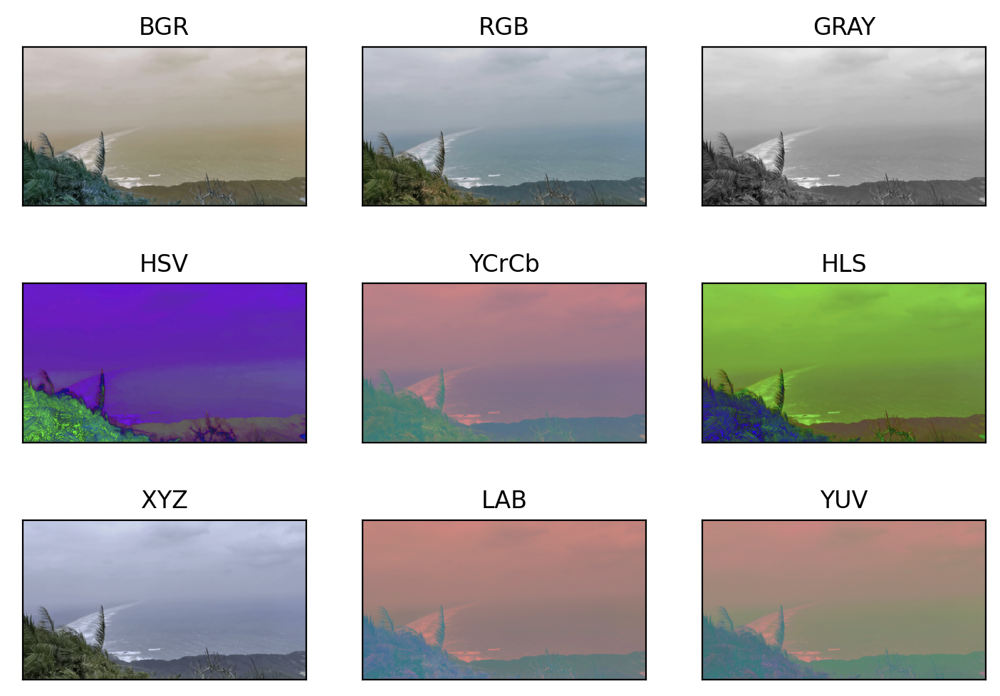

# OpenCV

OpenCV是一个图像和视频处理库，包含 C ++，C，Python 和 Java 的绑定，可用于各种图像和视频分析，如面部识别和检测，车牌阅读，照片编辑，高级机器人视觉，光学字符识别等等。


# 一 图像处理基础

计算机图片：

<div align="center"></div>

当点击图中的一个小格子，发现计算机会将其分为 R / G / B 三种通道，其中每个通道分别由一堆0~256之间的数字组成，那OpenCV如何读取，处理图片呢？

​    

## 1.1 基础操作

### 1.1.1 图像加载&显示&保存

OpenCV操作：

```python
import cv2
 
# 生成图片
img = cv2.imread("sea.jpg")
# 生成灰色图片
imgGrey = cv2.imread("sea.jpg", 0)

#  展示原图, 注意图像的显示，也可以创建多个窗口
cv2.imshow("img", img)
#  展示灰色图片
cv2.imshow("imgGrey", imgGrey)

#  等待图片的关闭
cv2.waitKey()

# 保存灰色图片
cv2.imwrite("Copy.jpg", imgGrey)
```

函数说明

| 函数方法                        | 说明                                                         |
| ------------------------------- | ------------------------------------------------------------ |
| 图像加载函数<br />cv2.imread()  | 定义：imread(filename, flags=None)<br />介绍：使用函数cv2.imread() 读入图像，其中**filename**表示要读取的图像的文件路径和文件名，需要给函数提供完整路径，**flags** 表示图像读取的标识，用于读取图像的行为和格式，是要告诉函数应该如何读取这幅图片<br /><br />常见标识如下：<br />a. cv2.IMREAD_COLOR（或 +1）：读入一副彩色图像，且图像的透明度会被忽略，这是默认参数<br />b. cv2.IMREAD_GRAYSCALE（或 0）：以灰度模式读入图像<br />c. cv2.IMREAD_UNCHANGED（或 -1）：保留读取图片原有的颜色通道<br />... ...<br />除了这些常用的标志之外，还可以用其他的标志进行更高级的图像处理和读取，完整的标志列表可以在OpenCV的文档找到。<br />**注意**：调用opencv，就算图像的路径是错的，OpenCV 也不会提醒你的，但是当你使用命令 print(img) 时得到的结果是None。因为 `cv::imread`  函数返回一个  `cv::Mat`  对象，即图像的数据矩阵。如果无法读取图像或文件不存在，则返回一个空的  `cv::Mat`  对象。所以这是要注意的。 |
| 图像显示函数<br />cv2.imshow()  | 定义：imshow(winname, mat)<br />介绍：函数作用是在窗口中显示图像，窗口自动适合于图像大小，也可以通过imutils模块调整显示图像的窗口大小，其中 **winname** 表示窗口名称(字符串) ，**mat** 表示图像对象，类型是numpy中的ndarray类型，注可以通过imutils模块改变图像显示大小。 |
| 图像保存函数<br />cv2.imwrite() | 定义：cv2.imwrite(image_filename, image)<br />介绍：函数检查图像保存到本地，其中 **image_filename** 表示保存的图像名称(字符串) ，**image**表示图像对象，类型是numpy中的ndarray类型。 |

​     

### 1.1.2 显示窗口创建&销毁

当程序使用imshow函数展示图像时，最后需要在程序中对图像展示窗口进行销毁，否则程序将无法正常终止，常用的销毁窗口的函数有下面两个：

```python
# 销毁单个特定窗口, windows_name表示 销毁的窗口的名字
cv2.destroyWindow(windows_name)

# 销毁全部窗口，无参数
cv2.destroyAllWindows() 
```

**那何时销毁窗口**？

当然不能图片窗口一出现我们就将窗口销毁，这样便没法观看窗口，试想有两种方式： 

- 1）让窗口停留一段时间然后自动销毁； 
- 2）接收指定的命令，如接收指定的键盘敲击，然后结束想要结束的窗口 ；

以上两种情况都将使用cv2.waitKey函数， 首先产看函数定义：

```python
cv2.waitKey(delay)

# 参数delay是整数，可正可负也可是零，含义和操作也不同，分别对应上面说的两种情况
## 1) time_of_milliseconds > 0: time_of_milliseconds表示时间，单位是毫秒，表示等待 time_of_milliseconds毫秒后图像将自动销毁
## 表示等待10秒后，将销毁所有图像
if cv2.waitKey(10000):
    cv2.destroyAllWindows()
 
## 表示等待10秒，将销毁窗口名称为'origin image'的图像窗口
if cv2.waitKey(10000):
    cv2.destroyWindow('origin image')

## 2) time_of_milliseconds <= 0: 此时图像窗口将等待一个键盘敲击，接收到指定的键盘敲击便会进行窗口销毁
## 当指定waitKey(0) == 27时, 表示当敲击键盘 Esc 时便销毁所有窗口
if cv2.waitKey(0) == 27:
    cv2.destroyAllWindows()
 
## 当接收到键盘敲击A时，便销毁名称为'origin image'的图像窗口
if cv2.waitKey(-1) == ord('A'):
    cv2.destroyWindow('origin image')
```

​     

waitKey()函数功能：不断地刷新图像，频率时间为delay，单位为ms，返回值为当前键盘按键值

```python
cv2.waitKey([delay]) → retval

# 函数作用
# 1) waitKey()函数是在一个给定的时间内（单位ms）等待用户按键触发，如果用户没有按下键，则继续等待（循环）；
# 2) 如果设置waitKey(0)，则表示程序会无限制的等待用户的按键事件；
# 3) 用OpenCV来显示图像或者视频时，如果后面不加cv2.WaitKey这个函数，基本上是显示不出来的；
```

​     

### 1.1.3 视频读取 & 处理 & 保存

视频读取流程：可以达到30fps，即一秒30帧，不过基本都是25~30左右

| 函数方法                                                     | 说明                                                         |
| ------------------------------------------------------------ | ------------------------------------------------------------ |
| cap = cv2.VideoCapture()                                     | 如果是视频文件，直接指定好路径即可，同时可以捕获摄像头，用数字来控制不同的设备，例如0 / 1，其中设备索引只是指定哪台摄像机的号码，0代表第一台摄像机，1代表第二台摄像机，之后就可以逐帧捕获视频，但最后不要忘记释放捕获。 |
| cap.read()                                                   | 返回一个布尔值（True / False），其中如果帧被正确读取，则返回true，否则返回false，因此可以通过检查这个返回值来判断视频是否结束。 |
| cap.isOpened()                                               | 检查cap是否被初始化，若没有初始化，则使用cap.open() 打开它，且当cap没有初始化时，上面的代码会报错。 |
| cap.get(propId)                                              | 即访问视频的某些功能，其中propId是一个从0到18的数字，每个数字表示视频的属性（Property Identifier），且一些值可以使用 cap.set(propId，value) 进行修改，value是修改后的值。<br /><br />**举例**：通过cap.get(3)和cap.get(4) 来检查帧的宽度和高度，默认的值是640x480，但想修改为320x240，可以使用ret =cap.set(3, 320) 和ret = cap.set(4, 240) |
| retval,image= cv2.VideoCapture.read([,image])                | 解码并返回下一个视频帧，其中返回值为true表明抓取成功，其次该函数是组合了grab()和retrieve()，这是最方便的方法，且如果没有帧，该函数返回false，并输出空图像。 |
| retval, image = cv2.VideoCapture.retrieve([, image[, flag]]) | 解码并返回抓取的视频帧                                       |
| retval = cv2.VideoCapture.grab()                             | 从视频文件或相机中抓取下一帧，若返回true为抓取成功，且该函数主要用于多摄像头时。 |
| cv2.VideoCapture.release()                                   | 关闭视频文件或相机设备                                       |

propId 常见取值：

| propId值                   | 说明                                       |
| -------------------------- | ------------------------------------------ |
| cv2.CAP_PROP_POS_MSEC      | 视频文件的当前位置（ms）                   |
| cv2.CAP_PROP_POS_FRAMES    | 从0开始索引帧，帧位置                      |
| cv2.CAP_PROP_POS_AVI_RATIO | 视频文件的相对位置（0表示开始，1表示结束） |
| cv2.CAP_PROP_FRAME_WIDTH   | 视频流的帧宽度                             |
| cv2.CAP_PROP_FRAME_HEIGHT  | 视频流的帧高度                             |
| cv2.CAP_PROP_FPS           | 帧率                                       |
| cv2.CAP_PROP_FOURCC        | 编解码器四字符代码                         |
| cv2.CAP_PROP_FRAME_COUNT   | 视频文件的帧数                             |
| cv2.CAP_PROP_FORMAT        | retrieve()返回的Mat对象的格式              |
| cv2.CAP_PROP_MODE          | 后端专用的值，指示当前捕获模式             |
| cv2.CAP_PROP_BRIGHTNESS    | 图像的亮度，仅适用于支持的相机             |
| cv2.CAP_PROP_CONTRAST      | 图像对比度，仅适用于相机                   |
| cv2.CAP_PROP_SATURATION    | 图像饱和度，仅适用于相机                   |
| cv2.CAP_PROP_EXPOSURE      | 曝光，仅适用于支持的相机                   |
| cv2.CAP_PROP_CONVERT_RGB   | 布尔标志，指示是否应将图像转换为RGB        |

视频读取与处理代码：

```python
# 参数为视频文件目录
videoc = cv2.VideoCapture('test.mp4')
# VideoCapture对象，参数可以是设备索引或视频文件名称，设备索引只是指定哪台摄像机的号码, 其中0代表第一台摄像机，1代表第二台摄像机，之后可以逐帧捕获视频，但是最后需要释放捕获
# 调用内置摄像头
# cap = cv2.VideoCapture(0)
# 调用USB摄像头
# cap = cv2.VideoCapture(1)
 
 
# 检查是否打开正确
if videoc.isOpened():
    open, frame = videoc.read()
else:
    open = False
 
# 逐帧显示实现视频播放
while open:
    ret, frame = videoc.read()  # 读取
    if frame is None:
        break
    
    if ret:
        gray = cv2.cvtColor(frame, cv2.COLOR_BGR2GRAY)
        cv2.imshow('result', gray)
        if cv2.waitKey(10) & 0xFF == 27:  # 读取完自动退出
        # if cv2.waitKey(1) & 0xFF == ord('q'):  # 读完按 q 退出
            break
 
# 释放摄像头对象和窗口
videoc.release()
cv2.destroyAllWindows()
```

​      

**保存视频**：创建一个 VideoWriter对象，指定输出文件名（例如：output.avi），之后指定 FourCC代码（FourCC是用于指定视频编码解码器的四字节代码，可用的代码列标：http://www.fourcc.org/codecs.php），其次传递每秒帧数（FPS）和帧大小，最后一个是 isColor标注，如果他为TRUE，编码器编码成彩色帧，否则编码成灰度框帧。

```python
<VideoWriter object> = cv.VideoWriter( filename, fourcc, fps, frameSize[, isColor] )

# filename：给要保存的视频起个名字
# fourcc：指定视频编解码器的4字节代码
#  【（‘P’，‘I’，‘M’，‘1’）是MPEG-1编解码器】
#  【（‘M’，‘J’，‘P’，'G '）是一个运动jpeg编解码器】
# fps：帧率
# frameSize：帧大小
# isColor：如果为true，则视频为彩色，否则为灰度视频，默认为true

# 将4字符串接为fourcc代码
retval = cv2.VideoWriter_fourcc( c1, c2, c3, c4 ) 
# 将帧图像保存为视频文件
cv.VideoWriter.write(image) 
```

视频保存代码：

```python
cap = cv2.VideoCapture(0)
 
# Define the codec and create VideoWriter object
fourcc = cv2.VideoWriter_fourcc(*'XVID')
out = cv2.VideoWriter('output.avi',fourcc, 20.0, (640,480))
 
while(cap.isOpened()):
    ret, frame = cap.read()
    if ret:
        frame = cv2.flip(frame,0)
        # write the flipped frame
        out.write(frame)
        cv2.imshow('frame',frame)
        if cv2.waitKey(1) & 0xFF == ord('q'):
            break
    else:
        break
 
# Release everything if job is finished
cap.release()
out.release()
cv2.destroyAllWindows()
```

​      

### 1.1.4 图像ROI

**ROI**（Region of Interest）表示感兴趣区域，是指从图像中选择一个图像区域，这个区域就是图像分析所关注的焦点。当程序圈定这个区域，那么程序要处理的图像就是从一个大图像变为小图像区域了，这样以便进行进一步处理，可以大大减少处理时间。

ROI 也是使用Numpy 索引来获得的，其本质上是**多维数组（矩阵）的切片**，如下图所示：

<div align="center"></div>

其实，原理很简单，就是利用数组切片和索引操作来选择指定区域的内容，通过**像素矩阵可以直接获取ROI区域**，如 img[200:400,  200: 400]，其中Rect 四个形参分别是 x坐标，y坐标，长，高，注意（x,  y）指的是**矩形的左上角点**。

​     

### 1.1.5 图像宽/高/通道数/像素数/数据类型

**img.shape** 返回图像高（图像矩阵的行数），宽（图像矩阵的列数）和通道数3个属性组成的元组，若图像是非彩色图（即灰度图，二值图等），则只返回高和宽组成的元组

<div align="center"></div>

而图像矩阵img 的 **size** 和 dtype 属性分别对应图像的像素总数目和图像数据类型，一般情况下，图像的数据类型是 uint8

* size：获取图像的像素数目，其中**灰度图像**返回 `行数 * 列数`**，**彩色图像返回 `行数 * 列数 * 通道数`
* dtype：获取图像的数据类型，通常返回 uint8

```python
img = cv2.imread("1.jpg")
imgGrey = cv2.imread("1.jpg", 0)
 
sp1 = img.shape      # 彩色图 (1200, 1920, 3)
sp2 = imgGrey.shape  # 灰度图 (1200, 1920)

imsize = img.size    # 获取像素数目, 603315=615*327*3
imgtype = img.dtype  # 获取图像类型, np.uint8
```

**注意1**：如果图像是灰度图，返回值仅有行数和列数，所以通过检查这个返回值就可以知道加载的是灰度图还是彩色图，其次img.size可以返回图像的像素数目；

**注意2**：在debug时， img.dtype 非常重要，因为在OpenCV Python代码中经常出现**数据类型的不一致**；

​    

### 1.1.6 空图像生成

生成指定大小的空图形，方便后续填充，空图形是黑色的图（因为指定的是0）

```python
import cv2
import numpy as np

img = cv2.imread("sea.jpg")
imgZero = np.zeros(img.shape, np.uint8)
imgFix = np.zeros((300, 500, 3), np.uint8)
# imgFix = np.zeros((300,500),np.uint8)
 
cv2.imshow("img", img)
cv2.imshow("imgZero", imgZero)
cv2.imshow("imgFix", imgFix)
cv2.waitKey()
```

​    

### 1.1.7 图像像素处理

OpenCV中图像矩阵的顺序是 B,G,R。可以直接通过坐标位置访问和操作图像像素

```python
img = cv2.imread("sea.jpg")

img[50,100] = (0,0,255)
  
# 分开访问图像某一通道像素值
img[0:100, 100:200, 0] = 255
img[100:200, 200:300, 1] = 255
img[200:300, 300:400, 2] = 255

# 更改图像某一矩形区域的像素值
img[0:50,1:100] = (0,0,255)

# 优化: 读入一幅图像，然后根据像素的行和列的坐标获取它的像素值。对BGR图像而言，返回值为B，G，R的值，对灰度图像而言，会返回它的灰度值（亮度？ intensity）
img = cv2.imread('sea.jpg')
px = img[100,100]
blue = img[100,100,0]
 
# 可以使用类似的方式修改像素值
img[100,100] = [255,255,255]   # [255 255 255]
```

**注意1**：Numpy 是经过优化了的进行快速矩阵运算的软件包，所以不推荐逐个获取像素值并修改，这样会很慢，能有矩阵运算就不要循环。

**注意2**：上面提到的方法被用来选取矩阵的一个区域，比如前 5行的后3列。对于获取每一个像素值，也许使用Numpy 的 **array.item()**  和 **array.itemset() ** 会更好，但是返回是标量。如果你想获得所有 B，G，R的值，你需要使用 array.item() 分割。

```python
img=cv2.imread('test.jpg')
print(img.item(10,10,2))  # 59

img.itemset((10,10,2),100)
print(img.item(10,10,2))  # 100
```

​         

### 1.1.8 图像颜色通道分离&合并

分离图像通道可以使用 cv2中 split函数，合并则可以使用 merge函数

```python
img = cv2.imread("01.jpg")
  
b , g , r = cv2.split(img)
# b = cv2.split(img)[0]
# g = cv2.split(img)[1]
# r = cv2.split(img)[2]
  
merged = cv2.merge([b,g,r])
```

有时候，需要对 BGR 三个通道分别进行操作，这时就需要把BGR拆分成单个通道，有时需要把独立通道的图片合成一个BGR图像。下面学习一下拆分及其合并图像通道的cv函数　

```python
def split_image(img_path):
    img = cv2.imread(img_path)
    print(img.shape)  # (800, 800, 3)
    # b, g, r = cv2.split(img)
    b, g, r = img[:, :, 0], img[:, :, 1], img[:, :, 2]
    cv2.imshow('b', b)
    # cv2.imshow('g', g)
    # cv2.imshow('r', r)
    cv2.waitKey(0)
    cv2.destroyAllWindows()
 
def merge_image(img_path):
    img = cv2.imread(img_path)
    b, g, r = cv2.split(img)
    img = cv2.merge([b, g, r])
    cv2.imshow('merge', img)
    
    # 可以直接使用Numpy索引将所有像素的红色通道值都为0，不必先拆分再赋值，这样会更快
    img[:, :, 1] = 0
    cv2.imshow('assign', img)
    
    cv2.waitKey(0)
    cv2.destroyAllWindows()
```

**注意**：这里拆分写了两个方法，为什么呢？就是因为 cv2.split()是一个比较耗时的操作，只有真正需要时才用它，能用Numpy索引就尽量使用索引。

​     

### 1.1.9 图像添加文字水印

putText函数在图片上输出文字，函数原型：

```python
putText(img, text, org, fontFace, fontScale, color, thickness=None, lineType=None, bottomLeftOrigin=None)

# img： 图像
# text：要输出的文本
# org： 文字的起点坐标
# fontFace： 字体
# fontScale： 字体大小
# color： 字体颜色
# thickness： 字图加粗

img = cv2.imread("sea.jpg")
cv2.putText(img, "durant is my favorite super star", (100, 100), cv2.FONT_HERSHEY_SIMPLEX, 1, (0, 0, 255))
```

​     

### 1.1.10 cv2.cvtColor()函数

在日常生活中，看到的大多数彩色图像都是RGB类型，但是在图像处理过程中，常常需要用到灰度图像、二值图像、HSV、HSI等颜色，OpenCV提供了cvtColor()函数实现这些功能。

其函数原型如下所示：

```python
cvtColor(src, code, dst=None, dstCn=None)

# src表示输入图像，需要进行颜色空间变换的原图像
# dst表示输出图像，其大小和深度与src一致
# code表示转换的代码或标识
# dstCn表示目标图像通道数，其值为0时，则有src和code决定
```

该函数的作用是**将一个图像从一个颜色空间转换到另一个颜色空间**，其中

* RGB是指Red、Green和Blue，一副图像由这三个通道（channel）构成；
* Gray表示只有灰度值一个通道；
* HSV包含Hue（色调）、Saturation（饱和度）和Value（亮度）三个通道。

在OpenCV中，常见的颜色空间转换标识包括 CV_BGR2BGRA、CV_RGB2GRAY、CV_GRAY2RGB、CV_BGR2HSV、CV_BGR2XYZ、CV_BGR2HLS等。

下面代码对比了九种常见的颜色空间，包括BGR、RGB、GRAY、HSV、YCrCb、HLS、XYZ、LAB和YUV，并循环显示处理后的图像。

```python
#读取原始图像
img_BGR = cv2.imread('durant.jpg')
 
# BGR转换为RGB
img_RGB = cv2.cvtColor(img_BGR, cv2.COLOR_BGR2RGB)
# 灰度化处理
img_GRAY = cv2.cvtColor(img_BGR, cv2.COLOR_BGR2GRAY)
# BGR转HSV
img_HSV = cv2.cvtColor(img_BGR, cv2.COLOR_BGR2HSV)
# BGR转YCrCb
img_YCrCb = cv2.cvtColor(img_BGR, cv2.COLOR_BGR2YCrCb)
# BGR转HLS
img_HLS = cv2.cvtColor(img_BGR, cv2.COLOR_BGR2HLS)
# BGR转XYZ
img_XYZ = cv2.cvtColor(img_BGR, cv2.COLOR_BGR2XYZ)
# BGR转LAB
img_LAB = cv2.cvtColor(img_BGR, cv2.COLOR_BGR2LAB)
# BGR转YUV
img_YUV = cv2.cvtColor(img_BGR, cv2.COLOR_BGR2YUV)
 
#调用matplotlib显示处理结果
titles = ['BGR', 'RGB', 'GRAY', 'HSV', 'YCrCb', 'HLS', 'XYZ', 'LAB', 'YUV'] 
images = [img_BGR, img_RGB, img_GRAY, img_HSV, img_YCrCb,
          img_HLS, img_XYZ, img_LAB, img_YUV] 
for i in xrange(9): 
   plt.subplot(3, 3, i+1), plt.imshow(images[i], 'gray') 
   plt.title(titles[i]) 
   plt.xticks([]), plt.yticks([]) 
plt.show()

## 如果想查看参数的全部类型，请执行以下程序便可查阅，总共有274种空间转换类型
flags = [i for i in dir(cv2) if i.startswith('COLOR_')]
print(flags)
```

效果图：

<div align="center"></div>

​      

OpenCV BGR 图转 YUV图：

```python
def bgr2yuv(img):
    yuv_img = cv2.cvtColor(img, cv2.COLOR_BGR2YUV)
    y, u, v = cv2.split(yuv_img)
 
    return y, u, v
 
def yuv2bgr(y, u, v):
    yuv_img = cv2.merge([y, u, v])
    bgr_img = cv2.cvtColor(yuv_img, cv2.COLOR_YUV2BGR)
 
    return bgr_img
 
def main(filepath):
    orig_img = cv2.imread(filepath)
    gray = cv2.cvtColor(orig_img, cv2.COLOR_BGR2GRAY)
    
    y, u, v = bgr2yuv(orig_img)
    bgr_img = yuv2bgr(y, u, v)
 
    titles = ['orig_img', 'gray', 'Y channel','U channel','V channel','bgr_img']
    images = [orig_img, gray, y, u, v, bgr_img]
    for i in range(len(titles)):
        plt.subplot(2, 3, i+1)
        plt.imshow(images[i])
        plt.title(titles[i])
        plt.xticks([]), plt.yticks([])
    plt.show()
```

效果图：

<div align="center"></div>

**注意**：下面区分一下YUV和YCbCr，YUV色彩模型来源于RGB模型，该模型的特点是将亮度和色度分离开，从而适合于图像处理领域（YCbCr模型来源于YUV模型，YCbCr是 YUV 颜色空间的偏移版本）

```python
应用：模拟领域
Y'= 0.299*R' + 0.587*G' + 0.114*B'
U'= -0.147*R' - 0.289*G' + 0.436*B' = 0.492*(B'- Y')
V'= 0.615*R' - 0.515*G' - 0.100*B' = 0.877*(R'- Y')
R' = Y' + 1.140*V'
G' = Y' - 0.394*U' - 0.581*V'
B' = Y' + 2.032*U'

应用：数字视频，ITU-R BT.601建议
Y’ = 0.257*R' + 0.504*G' + 0.098*B' + 16
Cb' = -0.148*R' - 0.291*G' + 0.439*B' + 128
Cr' = 0.439*R' - 0.368*G' - 0.071*B' + 128
R' = 1.164*(Y’-16) + 1.596*(Cr'-128)
G' = 1.164*(Y’-16) - 0.813*(Cr'-128) - 0.392*(Cb'-128)
B' = 1.164*(Y’-16) + 2.017*(Cb'-128)
```

​     

## 1.2 图像运算

在OpenCV中我们经常会遇到一个名字：**Mask（掩膜）**，很多函数都使用到它，那么这个Mask到底是什么呢，下面从图像基本运算开始，一步一步学习掩膜。


# 二 OpenCV实战


# 附录

1. [OpenCV](https://docs.opencv.org/4.x/index.html)
1. [ComputerVisionPratiace](https://github.com/LeBron-Jian/ComputerVisionPractice)
2. [Learning-OpenCV-3_examples](https://github.com/oreillymedia/Learning-OpenCV-3_examples)
2. [opencv: python sample](https://github.com/opencv/opencv/tree/master/samples/python)
3. [Learning-OpenCV-4-Computer-Vision-with-Python-Third-Edition](https://github.com/PacktPublishing/Learning-OpenCV-4-Computer-Vision-with-Python-Third-Edition)
4. [OpenCVTutorials: 中文](https://github.com/fendouai/OpenCVTutorials)
5. [图像和视频分析-OpenCV](https://wizardforcel.gitbooks.io/py-ds-intro-tut/content/opencv.html)
5. [numpy示例列表](https://scipy.github.io/old-wiki/pages/Numpy_Example_List.html)


​	

