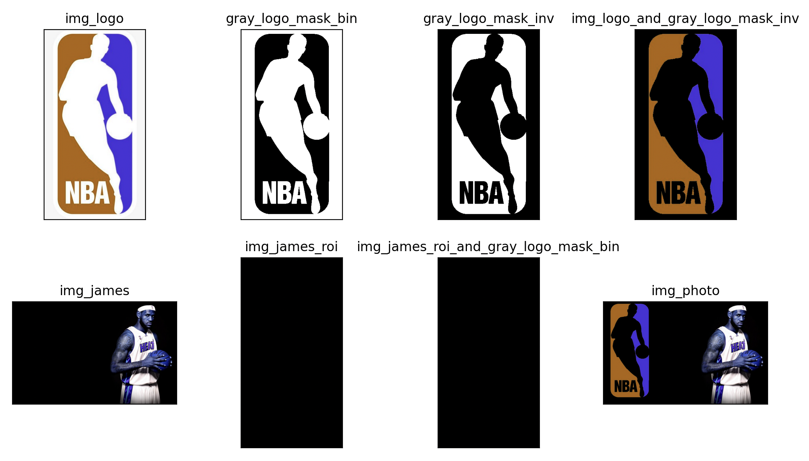

# 图像处理(加载/显示/运算/阈值化/灰度化)

计算机图片：

<div align="center"></div>

当点击图中的一个小格子，发现计算机会将其分为 R / G / B 三种通道，其中每个通道分别由一堆0~256之间的数字组成，那OpenCV如何读取，处理图片呢？

matplotlib：https://matplotlib.org/2.0.2/examples/color/colormaps_reference.html

​    

# 一 图像加载&显示&保存

OpenCV操作：

```python
import cv2
 
# 生成图片
img = cv2.imread("sea.jpg")
# 生成灰色图片
imgGrey = cv2.imread("sea.jpg", 0)

#  展示原图, 注意图像的显示，也可以创建多个窗口
cv2.imshow("img", img)
#  展示灰色图片
cv2.imshow("imgGrey", imgGrey)

#  等待图片的关闭
cv2.waitKey()

# 保存灰色图片
cv2.imwrite("Copy.jpg", imgGrey)
```

函数说明

| 函数方法                        | 说明                                                         |
| ------------------------------- | ------------------------------------------------------------ |
| 图像加载函数<br />cv2.imread()  | 定义：imread(filename, flags=None)<br />介绍：使用函数cv2.imread() 读入图像，其中**filename**表示要读取的图像的文件路径和文件名，需要给函数提供完整路径，**flags** 表示图像读取的标识，用于读取图像的行为和格式，是要告诉函数应该如何读取这幅图片<br /><br />常见标识如下：<br />a. cv2.IMREAD_COLOR（或 +1）：读入一副彩色图像，且图像的透明度会被忽略，这是默认参数<br />b. cv2.IMREAD_GRAYSCALE（或 0）：以灰度模式读入图像<br />c. cv2.IMREAD_UNCHANGED（或 -1）：保留读取图片原有的颜色通道<br />... ...<br />除了这些常用的标志之外，还可以用其他的标志进行更高级的图像处理和读取，完整的标志列表可以在OpenCV的文档找到。<br />**注意**：调用opencv，就算图像的路径是错的，OpenCV 也不会提醒你的，但是当你使用命令 print(img) 时得到的结果是None。因为 `cv::imread`  函数返回一个  `cv::Mat`  对象，即图像的数据矩阵。如果无法读取图像或文件不存在，则返回一个空的  `cv::Mat`  对象。所以这是要注意的。 |
| 图像显示函数<br />cv2.imshow()  | 定义：imshow(winname, mat)<br />介绍：函数作用是在窗口中显示图像，窗口自动适合于图像大小，也可以通过imutils模块调整显示图像的窗口大小，其中 **winname** 表示窗口名称(字符串) ，**mat** 表示图像对象，类型是numpy中的ndarray类型，注可以通过imutils模块改变图像显示大小。 |
| 图像保存函数<br />cv2.imwrite() | 定义：cv2.imwrite(image_filename, image)<br />介绍：函数检查图像保存到本地，其中 **image_filename** 表示保存的图像名称(字符串) ，**image**表示图像对象，类型是numpy中的ndarray类型。 |

​     

## 1.1 显示窗口创建&销毁

当程序使用imshow函数展示图像时，最后需要在程序中对图像展示窗口进行销毁，否则程序将无法正常终止，常用的销毁窗口的函数有下面两个：

```python
# 销毁单个特定窗口, windows_name表示 销毁的窗口的名字
cv2.destroyWindow(windows_name)

# 销毁全部窗口，无参数
cv2.destroyAllWindows() 
```

**那何时销毁窗口**？

当然不能图片窗口一出现我们就将窗口销毁，这样便没法观看窗口，试想有两种方式： 

- 1）让窗口停留一段时间然后自动销毁； 
- 2）接收指定的命令，如接收指定的键盘敲击，然后结束想要结束的窗口 ；

以上两种情况都将使用cv2.waitKey函数， 首先产看函数定义：

```python
cv2.waitKey(delay)

# 参数delay是整数，可正可负也可是零，含义和操作也不同，分别对应上面说的两种情况
## 1) time_of_milliseconds > 0: time_of_milliseconds表示时间，单位是毫秒，表示等待 time_of_milliseconds毫秒后图像将自动销毁
## 表示等待10秒后，将销毁所有图像
if cv2.waitKey(10000):
    cv2.destroyAllWindows()
 
## 表示等待10秒，将销毁窗口名称为'origin image'的图像窗口
if cv2.waitKey(10000):
    cv2.destroyWindow('origin image')

## 2) time_of_milliseconds <= 0: 此时图像窗口将等待一个键盘敲击，接收到指定的键盘敲击便会进行窗口销毁
## 当指定waitKey(0) == 27时, 表示当敲击键盘 Esc 时便销毁所有窗口
if cv2.waitKey(0) == 27:
    cv2.destroyAllWindows()
 
## 当接收到键盘敲击A时，便销毁名称为'origin image'的图像窗口
if cv2.waitKey(-1) == ord('A'):
    cv2.destroyWindow('origin image')
```

​     

waitKey()函数功能：不断地刷新图像，频率时间为delay，单位为ms，返回值为当前键盘按键值

```python
cv2.waitKey([delay]) → retval

# 函数作用
# 1) waitKey()函数是在一个给定的时间内（单位ms）等待用户按键触发，如果用户没有按下键，则继续等待（循环）；
# 2) 如果设置waitKey(0)，则表示程序会无限制的等待用户的按键事件；
# 3) 用OpenCV来显示图像或者视频时，如果后面不加cv2.WaitKey这个函数，基本上是显示不出来的；
```

​     

## 1.2 视频读取 & 处理 & 保存

视频读取流程：可以达到30fps，即一秒30帧，不过基本都是25~30左右

| 函数方法                                                     | 说明                                                         |
| ------------------------------------------------------------ | ------------------------------------------------------------ |
| cap = cv2.VideoCapture()                                     | 如果是视频文件，直接指定好路径即可，同时可以捕获摄像头，用数字来控制不同的设备，例如0 / 1，其中设备索引只是指定哪台摄像机的号码，0代表第一台摄像机，1代表第二台摄像机，之后就可以逐帧捕获视频，但最后不要忘记释放捕获。 |
| cap.read()                                                   | 返回一个布尔值（True / False），其中如果帧被正确读取，则返回true，否则返回false，因此可以通过检查这个返回值来判断视频是否结束。 |
| cap.isOpened()                                               | 检查cap是否被初始化，若没有初始化，则使用cap.open() 打开它，且当cap没有初始化时，上面的代码会报错。 |
| cap.get(propId)                                              | 即访问视频的某些功能，其中propId是一个从0到18的数字，每个数字表示视频的属性（Property Identifier），且一些值可以使用 cap.set(propId，value) 进行修改，value是修改后的值。<br /><br />**举例**：通过cap.get(3)和cap.get(4) 来检查帧的宽度和高度，默认的值是640x480，但想修改为320x240，可以使用ret =cap.set(3, 320) 和ret = cap.set(4, 240) |
| retval,image= cv2.VideoCapture.read([,image])                | 解码并返回下一个视频帧，其中返回值为true表明抓取成功，其次该函数是组合了grab()和retrieve()，这是最方便的方法，且如果没有帧，该函数返回false，并输出空图像。 |
| retval, image = cv2.VideoCapture.retrieve([, image[, flag]]) | 解码并返回抓取的视频帧                                       |
| retval = cv2.VideoCapture.grab()                             | 从视频文件或相机中抓取下一帧，若返回true为抓取成功，且该函数主要用于多摄像头时。 |
| cv2.VideoCapture.release()                                   | 关闭视频文件或相机设备                                       |

propId 常见取值：

| propId值                   | 说明                                       |
| -------------------------- | ------------------------------------------ |
| cv2.CAP_PROP_POS_MSEC      | 视频文件的当前位置（ms）                   |
| cv2.CAP_PROP_POS_FRAMES    | 从0开始索引帧，帧位置                      |
| cv2.CAP_PROP_POS_AVI_RATIO | 视频文件的相对位置（0表示开始，1表示结束） |
| cv2.CAP_PROP_FRAME_WIDTH   | 视频流的帧宽度                             |
| cv2.CAP_PROP_FRAME_HEIGHT  | 视频流的帧高度                             |
| cv2.CAP_PROP_FPS           | 帧率                                       |
| cv2.CAP_PROP_FOURCC        | 编解码器四字符代码                         |
| cv2.CAP_PROP_FRAME_COUNT   | 视频文件的帧数                             |
| cv2.CAP_PROP_FORMAT        | retrieve()返回的Mat对象的格式              |
| cv2.CAP_PROP_MODE          | 后端专用的值，指示当前捕获模式             |
| cv2.CAP_PROP_BRIGHTNESS    | 图像的亮度，仅适用于支持的相机             |
| cv2.CAP_PROP_CONTRAST      | 图像对比度，仅适用于相机                   |
| cv2.CAP_PROP_SATURATION    | 图像饱和度，仅适用于相机                   |
| cv2.CAP_PROP_EXPOSURE      | 曝光，仅适用于支持的相机                   |
| cv2.CAP_PROP_CONVERT_RGB   | 布尔标志，指示是否应将图像转换为RGB        |

视频读取与处理代码：

```python
# 参数为视频文件目录
videoc = cv2.VideoCapture('test.mp4')
# VideoCapture对象，参数可以是设备索引或视频文件名称，设备索引只是指定哪台摄像机的号码, 其中0代表第一台摄像机，1代表第二台摄像机，之后可以逐帧捕获视频，但是最后需要释放捕获
# 调用内置摄像头
# cap = cv2.VideoCapture(0)
# 调用USB摄像头
# cap = cv2.VideoCapture(1)
 
 
# 检查是否打开正确
if videoc.isOpened():
    open, frame = videoc.read()
else:
    open = False
 
# 逐帧显示实现视频播放
while open:
    ret, frame = videoc.read()  # 读取
    if frame is None:
        break
    
    if ret:
        gray = cv2.cvtColor(frame, cv2.COLOR_BGR2GRAY)
        cv2.imshow('result', gray)
        if cv2.waitKey(10) & 0xFF == 27:  # 读取完自动退出
        # if cv2.waitKey(1) & 0xFF == ord('q'):  # 读完按 q 退出
            break
 
# 释放摄像头对象和窗口
videoc.release()
cv2.destroyAllWindows()
```

​      

**保存视频**：创建一个 VideoWriter对象，指定输出文件名（例如：output.avi），之后指定 FourCC代码（FourCC是用于指定视频编码解码器的四字节代码，可用的代码列标：http://www.fourcc.org/codecs.php），其次传递每秒帧数（FPS）和帧大小，最后一个是 isColor标注，如果他为TRUE，编码器编码成彩色帧，否则编码成灰度框帧。

```python
<VideoWriter object> = cv.VideoWriter( filename, fourcc, fps, frameSize[, isColor] )

# filename：给要保存的视频起个名字
# fourcc：指定视频编解码器的4字节代码
#  【（‘P’，‘I’，‘M’，‘1’）是MPEG-1编解码器】
#  【（‘M’，‘J’，‘P’，'G '）是一个运动jpeg编解码器】
# fps：帧率
# frameSize：帧大小
# isColor：如果为true，则视频为彩色，否则为灰度视频，默认为true

# 将4字符串接为fourcc代码
retval = cv2.VideoWriter_fourcc( c1, c2, c3, c4 ) 
# 将帧图像保存为视频文件
cv.VideoWriter.write(image) 
```

视频保存代码：

```python
cap = cv2.VideoCapture(0)
 
# Define the codec and create VideoWriter object
fourcc = cv2.VideoWriter_fourcc(*'XVID')
out = cv2.VideoWriter('output.avi',fourcc, 20.0, (640,480))
 
while(cap.isOpened()):
    ret, frame = cap.read()
    if ret:
        frame = cv2.flip(frame,0)
        # write the flipped frame
        out.write(frame)
        cv2.imshow('frame',frame)
        if cv2.waitKey(1) & 0xFF == ord('q'):
            break
    else:
        break
 
# Release everything if job is finished
cap.release()
out.release()
cv2.destroyAllWindows()
```

​      

## 1.3 图像ROI

**ROI**（Region of Interest）表示感兴趣区域，是指从图像中选择一个图像区域，这个区域就是图像分析所关注的焦点。当程序圈定这个区域，那么程序要处理的图像就是从一个大图像变为小图像区域了，这样以便进行进一步处理，可以大大减少处理时间。

ROI 也是使用Numpy 索引来获得的，其本质上是**多维数组（矩阵）的切片**，如下图所示：

<div align="center"></div>

其实，原理很简单，就是利用数组切片和索引操作来选择指定区域的内容，通过**像素矩阵可以直接获取ROI区域**，如 img[200:400,  200: 400]，其中Rect 四个形参分别是 x坐标，y坐标，长，高，注意（x,  y）指的是**矩形的左上角点**。

​     

## 1.4 图像宽/高/通道数/像素数/数据类型

**img.shape** 返回图像高（图像矩阵的行数），宽（图像矩阵的列数）和通道数3个属性组成的元组，若图像是非彩色图（即灰度图，二值图等），则只返回高和宽组成的元组

<div align="center"></div>

而图像矩阵img 的 **size** 和 dtype 属性分别对应图像的像素总数目和图像数据类型，一般情况下，图像的数据类型是 uint8

* size：获取图像的像素数目，其中**灰度图像**返回 `行数 * 列数`**，**彩色图像返回 `行数 * 列数 * 通道数`
* dtype：获取图像的数据类型，通常返回 uint8

```python
img = cv2.imread("1.jpg")
imgGrey = cv2.imread("1.jpg", 0)
 
sp1 = img.shape      # 彩色图 (1200, 1920, 3)
sp2 = imgGrey.shape  # 灰度图 (1200, 1920)

imsize = img.size    # 获取像素数目, 603315=615*327*3
imgtype = img.dtype  # 获取图像类型, np.uint8
```

**注意1**：如果图像是灰度图，返回值仅有行数和列数，所以通过检查这个返回值就可以知道加载的是灰度图还是彩色图，其次img.size可以返回图像的像素数目；

**注意2**：在debug时， img.dtype 非常重要，因为在OpenCV Python代码中经常出现**数据类型的不一致**；

​    

## 1.5 空图像生成

生成指定大小的空图形，方便后续填充，空图形是黑色的图（因为指定的是0）

```python
import cv2
import numpy as np

img = cv2.imread("sea.jpg")
imgZero = np.zeros(img.shape, np.uint8)
imgFix = np.zeros((300, 500, 3), np.uint8)
# imgFix = np.zeros((300,500),np.uint8)
 
cv2.imshow("img", img)
cv2.imshow("imgZero", imgZero)
cv2.imshow("imgFix", imgFix)
cv2.waitKey()
```

​    

## 1.6 图像像素处理

OpenCV中图像矩阵的顺序是 B,G,R。可以直接通过坐标位置访问和操作图像像素

```python
img = cv2.imread("sea.jpg")

img[50,100] = (0,0,255)
  
# 分开访问图像某一通道像素值
img[0:100, 100:200, 0] = 255
img[100:200, 200:300, 1] = 255
img[200:300, 300:400, 2] = 255

# 更改图像某一矩形区域的像素值
img[0:50,1:100] = (0,0,255)

# 优化: 读入一幅图像，然后根据像素的行和列的坐标获取它的像素值。对BGR图像而言，返回值为B，G，R的值，对灰度图像而言，会返回它的灰度值（亮度？ intensity）
img = cv2.imread('sea.jpg')
px = img[100,100]
blue = img[100,100,0]
 
# 可以使用类似的方式修改像素值
img[100,100] = [255,255,255]   # [255 255 255]
```

**注意1**：Numpy 是经过优化了的进行快速矩阵运算的软件包，所以不推荐逐个获取像素值并修改，这样会很慢，能有矩阵运算就不要循环。

**注意2**：上面提到的方法被用来选取矩阵的一个区域，比如前 5行的后3列。对于获取每一个像素值，也许使用Numpy 的 **array.item()**  和 **array.itemset() ** 会更好，但是返回是标量。如果你想获得所有 B，G，R的值，你需要使用 array.item() 分割。

```python
img=cv2.imread('test.jpg')
print(img.item(10,10,2))  # 59

img.itemset((10,10,2),100)
print(img.item(10,10,2))  # 100
```

​         

## 1.7 图像颜色通道分离&合并

分离图像通道可以使用 cv2中 split函数，合并则可以使用 merge函数

```python
img = cv2.imread("01.jpg")
  
b , g , r = cv2.split(img)
# b = cv2.split(img)[0]
# g = cv2.split(img)[1]
# r = cv2.split(img)[2]
  
merged = cv2.merge([b,g,r])
```

有时候，需要对 BGR 三个通道分别进行操作，这时就需要把BGR拆分成单个通道，有时需要把独立通道的图片合成一个BGR图像。下面学习一下拆分及其合并图像通道的cv函数　

```python
def split_image(img_path):
    img = cv2.imread(img_path)
    print(img.shape)  # (800, 800, 3)
    # b, g, r = cv2.split(img)
    b, g, r = img[:, :, 0], img[:, :, 1], img[:, :, 2]
    cv2.imshow('b', b)
    # cv2.imshow('g', g)
    # cv2.imshow('r', r)
    cv2.waitKey(0)
    cv2.destroyAllWindows()
 
def merge_image(img_path):
    img = cv2.imread(img_path)
    b, g, r = cv2.split(img)
    img = cv2.merge([b, g, r])
    cv2.imshow('merge', img)
    
    # 可以直接使用Numpy索引将所有像素的红色通道值都为0，不必先拆分再赋值，这样会更快
    img[:, :, 1] = 0
    cv2.imshow('assign', img)
    
    cv2.waitKey(0)
    cv2.destroyAllWindows()
```

**注意**：这里拆分写了两个方法，为什么呢？就是因为 cv2.split()是一个比较耗时的操作，只有真正需要时才用它，能用Numpy索引就尽量使用索引。

​     

## 1.8 图像添加文字水印

putText函数在图片上输出文字，函数原型：

```python
putText(img, text, org, fontFace, fontScale, color, thickness=None, lineType=None, bottomLeftOrigin=None)

# img： 图像
# text：要输出的文本
# org： 文字的起点坐标
# fontFace： 字体
# fontScale： 字体大小
# color： 字体颜色
# thickness： 字图加粗

img = cv2.imread("sea.jpg")
cv2.putText(img, "durant is my favorite super star", (100, 100), cv2.FONT_HERSHEY_SIMPLEX, 1, (0, 0, 255))
```

​     

## 1.9 cv2.cvtColor()函数

在日常生活中，看到的大多数彩色图像都是RGB类型，但是在图像处理过程中，常常需要用到灰度图像、二值图像、HSV、HSI等颜色，OpenCV提供了cvtColor()函数实现这些功能。

其函数原型如下所示：

```python
cvtColor(src, code, dst=None, dstCn=None)

# src表示输入图像，需要进行颜色空间变换的原图像
# dst表示输出图像，其大小和深度与src一致
# code表示转换的代码或标识
# dstCn表示目标图像通道数，其值为0时，则有src和code决定
```

该函数的作用是**将一个图像从一个颜色空间转换到另一个颜色空间**，其中

* RGB是指Red、Green和Blue，一副图像由这三个通道（channel）构成；
* Gray表示只有灰度值一个通道；
* HSV包含Hue（色调）、Saturation（饱和度）和Value（亮度）三个通道。

在OpenCV中，常见的颜色空间转换标识包括 CV_BGR2BGRA、CV_RGB2GRAY、CV_GRAY2RGB、CV_BGR2HSV、CV_BGR2XYZ、CV_BGR2HLS等。

下面代码对比了九种常见的颜色空间，包括BGR、RGB、GRAY、HSV、YCrCb、HLS、XYZ、LAB和YUV，并循环显示处理后的图像。

```python
#读取原始图像
img_BGR = cv2.imread('durant.jpg')
 
# BGR转换为RGB
img_RGB = cv2.cvtColor(img_BGR, cv2.COLOR_BGR2RGB)
# 灰度化处理
img_GRAY = cv2.cvtColor(img_BGR, cv2.COLOR_BGR2GRAY)
# BGR转HSV
img_HSV = cv2.cvtColor(img_BGR, cv2.COLOR_BGR2HSV)
# BGR转YCrCb
img_YCrCb = cv2.cvtColor(img_BGR, cv2.COLOR_BGR2YCrCb)
# BGR转HLS
img_HLS = cv2.cvtColor(img_BGR, cv2.COLOR_BGR2HLS)
# BGR转XYZ
img_XYZ = cv2.cvtColor(img_BGR, cv2.COLOR_BGR2XYZ)
# BGR转LAB
img_LAB = cv2.cvtColor(img_BGR, cv2.COLOR_BGR2LAB)
# BGR转YUV
img_YUV = cv2.cvtColor(img_BGR, cv2.COLOR_BGR2YUV)
 
#调用matplotlib显示处理结果
titles = ['BGR', 'RGB', 'GRAY', 'HSV', 'YCrCb', 'HLS', 'XYZ', 'LAB', 'YUV'] 
images = [img_BGR, img_RGB, img_GRAY, img_HSV, img_YCrCb,
          img_HLS, img_XYZ, img_LAB, img_YUV] 
for i in xrange(9): 
   plt.subplot(3, 3, i+1), plt.imshow(images[i], 'gray') 
   plt.title(titles[i]) 
   plt.xticks([]), plt.yticks([]) 
plt.show()

## 如果想查看参数的全部类型，请执行以下程序便可查阅，总共有274种空间转换类型
flags = [i for i in dir(cv2) if i.startswith('COLOR_')]
print(flags)
```

效果图：

<div align="center"></div>

​      

OpenCV BGR 图转 YUV图：

```python
def bgr2yuv(img):
    yuv_img = cv2.cvtColor(img, cv2.COLOR_BGR2YUV)
    y, u, v = cv2.split(yuv_img)
 
    return y, u, v
 
def yuv2bgr(y, u, v):
    yuv_img = cv2.merge([y, u, v])
    bgr_img = cv2.cvtColor(yuv_img, cv2.COLOR_YUV2BGR)
 
    return bgr_img
 
def main(filepath):
    orig_img = cv2.imread(filepath)
    gray = cv2.cvtColor(orig_img, cv2.COLOR_BGR2GRAY)
    
    y, u, v = bgr2yuv(orig_img)
    bgr_img = yuv2bgr(y, u, v)
 
    titles = ['orig_img', 'gray', 'Y channel','U channel','V channel','bgr_img']
    images = [orig_img, gray, y, u, v, bgr_img]
    for i in range(len(titles)):
        plt.subplot(2, 3, i+1)
        plt.imshow(images[i])
        plt.title(titles[i])
        plt.xticks([]), plt.yticks([])
    plt.show()
```

效果图：

<div align="center"></div>

**注意**：下面区分一下YUV和YCbCr，YUV色彩模型来源于RGB模型，该模型的特点是将亮度和色度分离开，从而适合于图像处理领域（YCbCr模型来源于YUV模型，YCbCr是 YUV 颜色空间的偏移版本）

```python
应用：模拟领域
Y'= 0.299*R' + 0.587*G' + 0.114*B'
U'= -0.147*R' - 0.289*G' + 0.436*B' = 0.492*(B'- Y')
V'= 0.615*R' - 0.515*G' - 0.100*B' = 0.877*(R'- Y')
R' = Y' + 1.140*V'
G' = Y' - 0.394*U' - 0.581*V'
B' = Y' + 2.032*U'

应用：数字视频，ITU-R BT.601建议
Y’ = 0.257*R' + 0.504*G' + 0.098*B' + 16
Cb' = -0.148*R' - 0.291*G' + 0.439*B' + 128
Cr' = 0.439*R' - 0.368*G' - 0.071*B' + 128
R' = 1.164*(Y’-16) + 1.596*(Cr'-128)
G' = 1.164*(Y’-16) - 0.813*(Cr'-128) - 0.392*(Cb'-128)
B' = 1.164*(Y’-16) + 2.017*(Cb'-128)
```

​     

# 二 图像运算

在OpenCV中我们经常会遇到一个名字：**Mask（掩膜）**，很多函数都使用到它，那么这个Mask到底是什么呢，下面从图像基本运算开始，一步一步学习掩膜。

## 2.1 图像算术运算

图像的算术运算有很多种，比如两幅图像可以 **相加**，**相减**，**相乘**，**相除**，**位运算**，**平方根**，**对数**，**绝对值**等；图像也可以放大，缩小，旋转，还可以截取其中的一部分作为ROI（感兴趣区域）进行操作，各个颜色通道还可以分别提取对各个颜色通道进行各种运算操作，总之对图像可以进行的算术运算非常的多。

### 2.1.1 图片加法（图像叠加）

cv2.add() 函数：叠加两张图片，但注意相加两幅图片的形状（高度/宽度/通道数）必须相同， 其次numpy中可以用  res = img1 + img2 相加，但这两者的结果并不相同。

> **注意**：OpenCV中的加法与Numpy的加法是有所不同的，OpenCV的加法是一种**饱和操作**，而Numpy的加法是一种**模操作**。
>
> a. **Numpy库的加法**
>
> 其运算方法是：目标图像 = 图像1 + 图像2，运算结果进行取模运算
>
> - 当像素值 小于等于  255 时，结果为：“图像1 + 图像2”，例如：120+48=168
> - 当像素值 大于255 时，结果为：对255取模的结果，例如：（255 + 64） % 255 = 64
>
> b. **OpenCV的加法**
>
> 其运算方法是：目标图像 = cv2.add（图像1， 图像2）
>
> - 当像素值 小于等于  255 时，结果为：“图像1 + 图像2”，例如：120+48=168
> - 当像素值 大于255 时，结果为：255，例如：255 + 64 = 255

代码示例：

```python
# 读取图片
img = cv2.imread('logo1.jpg')
new_img = img
 
# 方法一：Numpy加法运算
result1 = img + new_img
# 方法二：OpenCV加法运算
result2 = cv2.add(img, new_img)
all_pic = np.column_stack((img, result1, result2))
 
# 显示图像
cv2.imshow('img result1 result2', all_pic)
```

效果图：

<div align="center"></div>

​     

### 2.1.2 图像混合

图像融合通常是指将2张或者两张以上的图像信息融合到1张图像上，融合的图像含有更多的信息，能够更方便人们观察或计算机处理。

图像融合是在图像加法的基础上增加了**系数**和**亮度调节量**：

```python
# 目标图像 = 图像1 * 系数1 + 图像2 * 系数2 + 亮度调节量

# 图像混合 cv2.addWeighted() 也是一种图片相加的操作，只不过两幅图片的权重不一样， y 相当于一个修正值
# dst = α*img1 + β*img2 + γ
# PS：当  alpha 和 beta 都等于1，则相当于图片相加

img1 = cv2.imread('lena_small.jpg')         # (187, 186, 3)
img2 = cv2.imread('opencv_logo_white.jpg')  # (184, 193, 3)

# 注意: 两张图片的尺寸必须一致, 因此需调整img2的尺寸与img1一致
img2 = cv2.resize(img2, (186, 187))

res = cv2.addWeighted(img1, 0.6, img2, 0.4, 0)
```

​     

### 2.1.3 图像矩阵减法

图像矩阵减法与加法其实类似，不多做说明

```python
函数原型：cv2.subtract(src1, src2, dst=None, mask=None, dtype=None)
参数:
	src1：图像矩阵1
	src1：图像矩阵2
	dst：默认选项
	mask：默认选项
	dtype：默认选项
```

​    

### 2.1.4 按位运算 -- 合成图

按位操作：

```python
AND ：
cv2.bitwise_or(src1, src2, dst=None, mask=None)
参数:
	src1：图像矩阵1
	src1：图像矩阵2
	dst：默认选项
	mask：默认选项

# OR / NOT / XOR 基本一致
OR：cv2.bitwise_or()
NOT：cv2.bitwise_not()
XOR ：cv2.bitwise_xor()
```

掩膜就是用来**对图片进行全局或局部的遮挡**，当提取图像的一部分，选择非矩阵ROI时这些操作会很有用，常用于**Logo投射**。

一幅图像包括目标物体，背景还有噪声，要想从多值的数字图像中直接提取出目标物体，常用的方法就是设定一个阈值T，用 T 将图像的数据分为两部分：大于 T 的像素群和小于 T 的像素群。这是研究灰度变换的最特殊的方法，称为**图像二值化**（Binarization）。

> 图像二值化定义：将图像上的像素点的灰度值设置为0或255，也就是将整个图像呈现出明显的黑和白的视觉效果，一般来说 通过 threshold 函数可将图片固定阈值二值化。

​    

Logo投射示例：即如下两张照片，一张原图，一张logo图，目的是投射logo到原图上

| 原图                                           | logo图                                        |
| ---------------------------------------------- | --------------------------------------------- |
|  |  |
|                                                |                                               |

处理思路：目的是把 logo 放在原图左边，所以只关心这一块区域，下面我们的目的是创建掩码（这是在Logo图上），并且保留除了logo以外的背景（这是在原图），然后进行融合（这是在原图），最后融合放在原图。

```python
img_photo = cv2.imread('james.jpg')   # img_logo.shape: (615, 327, 3)
img_logo = cv2.imread('logo.jpg')     # img_photo.shape:(640, 1024, 3)

# Step1: 获取原图 roi 区域
rows, cols, channels = img_logo.shape
# numpy.copy(): 矩阵深度复制
photo_roi = img_photo[0:rows, 0:cols].copy()
img_photo_bck = img_photo.copy()

# Step2: 获取logo的黑白掩膜和反色黑白掩膜
gray_logo = cv2.cvtColor(img_logo, cv2.COLOR_BGR2GRAY)
## 中值滤波
midian_logo = cv2.medianBlur(gray_logo, 5)
## 图像二值化threshold: mask_bin 是黑白掩膜
ret, mask_bin = cv2.threshold(gray_logo, 127, 255, cv2.THRESH_BINARY)
## NOT位运算bitwise_not: mask_inv 是反色黑白掩膜
mask_inv = cv2.bitwise_not(mask_bin)

# Step3: 掩码分别提取logo和原图ROi区域图
## 黑白掩膜 和 大图切割区域 去取和
img_photo_bg_mask = cv2.bitwise_and(photo_roi, photo_roi, mask=mask_bin)
## 反色黑白掩膜 和 logo 取和
img2_photo_fg_mask = cv2.bitwise_and(img_logo, img_logo, mask=mask_inv)

# Step4: 图像叠加
dst = cv2.add(img_photo_bg_mask, img2_photo_fg_mask)

# Step5: 叠加图像融合到原图
img_photo[0:rows, 0:cols] = dst

# Step6: 画图
titles = ['img_logo', 'gray_logo_mask_bin', 'gray_logo_mask_inv', 'img_logo_and_gray_logo_mask_inv', 'img_james', 'img_james_roi', 'img_james_roi_and_gray_logo_mask_bin', 'img_photo']
images = [img_logo, mask_bin, mask_inv, img2_photo_fg_mask, img_photo_bck, photo_roi, img_photo_bg_mask, img_photo]
for i in range(len(titles)):
  plt.subplot(2, 3, i + 1)
  plt.imshow(images[i], cmap='gray')
  plt.title(titles[i])
  plt.xticks([]), plt.yticks([])
plt.show()
```

效果：

<div align="center"></div>

​       

## 2.2 掩膜（mask）- 抠图

在有些图像处理的函数中有的参数里面会有 mask 参数，即此函数支持掩膜操作。所以首先要理解什么是掩膜？其次掩膜有什么作用呢？

### 2.2.1 概念

**掩膜是用一副二值化图片对另外一幅图片进行局部的遮挡**

> PS：数字图像处理中的掩膜的概念是借鉴于 PCB 制版的过程，在半导体制作中，许多芯片工艺步骤采用光刻技术，用于这些步骤的图形”底片”称为掩膜（也称为“掩模”），其作用是在硅片上选定的区域中对一个不透明的图形模板遮盖，继而下面的腐蚀或扩散将只影响选定的区域意外的区域。

图形掩膜（Image mask）与其类似，用选定的图形或物体，对处理的图像（全部或局部）进行遮挡，来控制图像处理的区域或处理过程，其中用于覆盖的特点图像或物体称为**掩膜或模板**，其次光学图像处理中，掩膜可以足胶片，滤光片等，而图形**掩膜是由0和1组成的一个二进制图像**，即当在某一功能中应用掩膜时，1值区域被处理，被屏蔽的0值区域不被包括在计算中。此外，还可通过制定的数据值 / 数据范围 / 有限或无限值 / 感兴趣区和注释文件来定义图像掩膜，也可以应用上述选项的任意组合作为输入来建立掩膜。

​      

### 2.2.2 作用（图像对比图改变）

数字图像处理中，掩膜为二维矩阵数组，有时也用多值图像，图像掩膜主要用于：

* a. **提取感兴趣区**：用预先制作的感兴趣区掩膜与待处理图像相乘，得到感兴趣区图像，感兴趣区内图像值保持不变，而区外图像值都为零；
* b. **屏蔽作用**：用掩膜对图像上某些区域做屏蔽，使其不参加处理或不参加处理参数的计算，或仅对屏蔽区做处理或统计；
* c . **结构特征提取**：用相似性变量或图像匹配方法检测和提取图像中与掩膜相似的结构特征；
* d. **特殊性质图像的制作**；

​     

掩膜是一种**图像滤镜的模板**，使用掩膜经常处理的是遥感图像。当提取道路或者河流，或者房屋时，通过一个 N * N 的矩阵来对图像进行像素过滤，然后将我们需要的地物或者标志突出显示出来，这个矩阵就是一种掩膜。在OpenCV中，掩膜操作时相对简单的，其大致的意思是，**通过一个掩膜矩阵，重新计算图像中的每一个像素值。掩膜矩阵控制了旧图像当前位置，以及周围位置像素对新图像当前位置像素值的影响力度**。

在所有图像基本运算的操作函数中，凡是带有掩膜（mask）的处理函数，其掩膜都参与运算（**输入图像运算完之后，再与掩膜图像或矩阵运算**）。

矩阵的掩膜操作非常简单，根据掩膜来重新计算每个像素的像素值，掩膜（mask）也被称为内核。

> **什么是图和掩膜的与运算呢？**
>
> 其实就是原图中的每个像素和掩膜中的每个对应像素进行与运算，比如1 & 1 = 1；1 & 0 = 0；
>
> 比如一个 3 * 3 的图像与 3 * 3 的掩膜进行运算，得到的结果图像就是：
>
> <div align="center"></div>
>
> 简单讲，mask就是位图，来选择哪个像素允许拷贝，哪个像素不允许拷贝，如果mask像素的值时非0的，我们就拷贝它，否则不拷贝。

​     

总结：掩膜就是**两幅图像之间进行的各种位运算操作**

```python
image = cv2.imread(filepath)
new_image = cv2.cvtColor(image, cv2.COLOR_BGR2RGB) # 注意: 默认BGR

# 输入图像是RGB图像，故构造一个三维数组，四个二维数组是mask四个点的坐标，
site = numpy.array([[[360, 150], [240, 150], [240, 0], [360, 0]]], dtype=numpy.int32)
im = numpy.zeros(image.shape[:2], dtype="uint8")  # 生成image大小的全黑图

cv2.polylines(im, site, 1, 255)  # 在im上画site大小的线，1表示线段闭合，255表示线段颜色
cv2.fillPoly(im, site, 255)  # 在im的site区域，填充颜色为255

mask = im
# cv2.namedWindow('Mask', cv2.WINDOW_NORMAL)  # 可调整窗口大小，不加这句不可调整
# cv2.imshow("Mask", mask)

masked = cv2.bitwise_and(new_image, new_image, mask=mask)  # 在模板mask上，将image和image做“与”操作
# cv2.namedWindow('Mask to Image', cv2.WINDOW_NORMAL)  # 同上
# cv2.imshow("Mask to Image", masked)
# cv2.waitKey(0)  # 图像一直显示，键盘按任意键即可关闭窗口
# cv2.destroyAllWindows()

# Step6: 画图
titles = ['ori_image', 'mask', 'masked']
images = [new_image, mask, masked]
for i in range(len(titles)):
  plt.subplot(1, 3, i + 1)
  plt.imshow(images[i], cmap='gray')
  plt.title(titles[i])
  plt.xticks([]), plt.yticks([])
  plt.show()
```

效果图：

<div align="center"></div>

注意：

1）当图像尺寸太大，可用 cv2.namedWindow() 函数可以**指定窗口是否可以调整大小**。在默认情况下，标志为  cv2.WINDOW_AUTOSIZE。但是如果指定标志为 cv2.WINDOW_Normal，则可以调整窗口的大小。

2）对坐标轴的理解，上面代码中的四个坐标从第一个到最后一个分别对应下图中的  【x4  x3 x1 x2】

<div align="center"></div>

​       

## 2.3 边界填充 copyMakeBorder

**边缘填充是什么呢**？

由于对于图像的卷积操作，最边缘的像素一般无法处理，所以卷积核中心到不了最边缘像素，而这就需要**先将图像的边界填充**，再根据不同的填充算法进行**卷积**操作，得到的新图像就是填充后的图像。

如果想在图像周围创建一个边，就像**相框**一样，你可以使用 **cv2.copyMakeBorder()** 函数，这经常在卷积运算或 0 填充时被用到，这个函数如下：	

```python
def copyMakeBorder(src, top, bottom, left, right, borderType, dst=None, value=None)

参数：
	src：输入图像
	top，buttom，left，right 对应边界的像素数目（分别为图像上面，下面，左面，右面 填充边界的长度）
	borderType 要添加哪种类型的边界，类型如下：
		- cv2.BORDER_CONSTANT 添加有颜色的常数值边界，还需要下一个参数（value）
		- cv2.BORDER_REFLECT 边界元素的镜像，反射法，即以最边缘的像素为对称轴。比如: fedcba|abcdefgh|hgfedcb
		- cv2.BORDER_REFLECT_101 or cv2.BORDER_DEFAULT跟BORDER_REFLECT类似，但是有区别。例如: gfedcb|abcdefgh|gfedcba
		- cv2.BORDER_REPLICATE 复制法，重复最后一个元素。例如: aaaaaa|abcdefgh|hhhhhhh
		- cv2.BORDER_WRAP 例如: bcdefgh|abcdefgh|abcdefg
	value 边界颜色，通常用于常量法填充中，即边界的类型是 cv2.BORDER_CONSTANT，
```

为了更好的理解这几种类型，如下面代码演示：

```python
# 读取图片
img = cv2.imread('irving.jpeg')  # (221, 405, 3)
 
# 各个边界需要填充的值, 为了展示效果，这里填充的大一些
top_size, bottom_size, left_size, right_size = (50, 50, 50, 50)
 
# 复制法 重复边界，填充, 即复制最边缘像素
replicate = cv2.copyMakeBorder(img, top_size, bottom_size,
                               left_size, right_size,
                               borderType=cv2.BORDER_REPLICATE)
 
# 反射法    反射边界，填充 即对感兴趣的图像中的像素在两边进行复制，
#           例如 fedcba|abcdefgh|hgfedcb
reflect = cv2.copyMakeBorder(img, top_size, bottom_size,
                               left_size, right_size,
                               borderType=cv2.BORDER_REFLECT)

# 反射101边界法  反射101边界，填充 这个是以最边缘为轴，对称 ，
#           例如 gfedcb|abcdefg|gfedcba
reflect101 = cv2.copyMakeBorder(img, top_size, bottom_size,
                               left_size, right_size,
                               borderType=cv2.BORDER_REFLECT_101)
 
# 外包装法  填充 
#           例如  cdefgh|abcdefgh|abcdegf
wrap = cv2.copyMakeBorder(img, top_size, bottom_size,
                               left_size, right_size,
                               borderType=cv2.BORDER_WRAP)
 
# 常量法，常数值填充 ，常量值可以自己设定  value=0
constant = cv2.copyMakeBorder(img, top_size, bottom_size,
                               left_size, right_size,
                               borderType=cv2.BORDER_CONSTANT,
                              value=(0, 255, 0))
```

效果图：

<div align="center"></div>

**补充**：为了能快速对比出各个方法得出的图像的区别，可以使用 **np.vstack()** 或者 **np.hstack()** 对比，将图像放在同一个窗口，但使用np.vstack()或者np.hstack()函数时，图像的**大小必须一致**，不然会报错。其次，使用np.vstack()或者np.hstack()函数时，可能会出现图像显示不完全情况

```python
n = numpy.hstack([replicate, reflect, reflect101, wrap, constant])
cv2.imshow("hstack", n)
cv2.waitKey(0)  # 图像一直显示，键盘按任意键即可关闭窗口
cv2.destroyAllWindows()
```

<div align="center"></div>

​      

## 2.4 图像阈值（二值化）

### 2.4.1 图像二值化原理 - threshold

二值化核心思想，设阈值，大于阈值的为0（黑色）或 255（白色），使图像称为**黑白图**。

阈值可固定，也可以自适应阈值，其中自适应阈值一般为一点像素与这点为中序的区域像素平均值或者高斯分布加权和的比较，其中可以设置一个差值也可以不设置。

**图像的阈值化旨在提取图像中的目标物体，将背景以及噪声区分开来**，且通常会设定一个阈值T，通过T将图像的像素分为两类，即大于T的像素群和小于T的像素群。

图像的二值化：就是将图像上的像素点的灰度值设置为0或255，也就是将整个图像呈现出明显的只有黑和白的视觉效果。

常用二值化算法：

<div align="center"></div>

即当灰度Gray小于阈值T的时候，其像素设置为0，表示黑色，而当灰度Gray大于或等于阈值T时，其Y值为255，表示白色。

二值化处理广泛应用于各行各业，比如生物学中的细胞图分割，交通领域的车牌设计等，在文化应用领域中，通过二值化处理将所需民族文物图像转换为黑白两色图，从而为后面的图像识别提供更好的支撑作用。

​      

### 2.4.2 简单阈值处理（全局阈值）

**全局阈值**：就是一幅图像包括目标物体、背景还有噪声，要想从多值的数字图像中直接提取出目标物体，常用的方法就是设定一个阈值T，用T将图像的数据分成两部分，即大于T的像素群和小于T的像素群。这是研究灰度变换的最特殊的方法，称为图像的二值化（Binarization）。

Python-OpenCV中提供了阈值（threshold）函数：

```python
threshold(src, thresh, maxval, type, dst=None)

参数：
	src  指原图像，原图像应该是灰度图，只能输入单通道图像
	thresh  指用来对像素值进行分类的阈值
	maxval 指当像素值高于（有时是小于，根据 type 来决定）阈值时应该被赋予的新的像素值，在二元阈值THRESH_BINARY和逆二元阈值THRESH_BINARY_INV中使用的最大值 
	dst 指不同的不同的阈值方法，这些方法包括以下五种类型：
　　　　cv2.THRESH_BINARY            超过阈值部分取 maxval（最大值），否则取 0
　　　　cv2.THRESH_BINARY_INV        THRESH_BINARY 的反转
　　　　cv2.THRESH_TRUNC　　　　      大于阈值部分设为阈值，否则不变
　　　　cv2.THRESH_TOZERO            大于阈值部分不改变，否则设为零
　　　　cv2.THRESH_TOZERO_INV        THRESH_TOZERO 的反转
```

相关参数解释：

| 类型     | 详情                                                         |
| -------- | ------------------------------------------------------------ |
| 使用示例 |  |
| 函数表示 |   |
| CV图例   | 第一张为原图，后面依次为：二进制阈值化，反二进制阈值化，截断阈值化，反阈值化为0，阈值化为0.<br /> |

代码演示：

```python
image = cv2.imread(filepath)  # 读取原始照片
img = cv2.cvtColor(image, cv2.COLOR_BGR2RGB)
gray = cv2.cvtColor(img, cv2.COLOR_BGR2GRAY)

ret, thresh1 = cv2.threshold(img, 127, 255, cv2.THRESH_BINARY)
ret, thresh2 = cv2.threshold(img, 127, 255, cv2.THRESH_BINARY_INV)
ret, thresh3 = cv2.threshold(img, 127, 255, cv2.THRESH_TRUNC)
ret, thresh4 = cv2.threshold(img, 127, 255, cv2.THRESH_TOZERO)
ret, thresh5 = cv2.threshold(img, 127, 255, cv2.THRESH_TOZERO_INV)

titles = ['Origin Image', 'gray', 'BINARY', 'BINARY_INV', 'TRUNC', 'TOZERO', 'TOZERO_INV']  # 标题
images = [img, gray, thresh1, thresh2, thresh3, thresh4, thresh5]  # 对应的图

for i in range(7):  # 画7次图
  plt.subplot(2, 4, i + 1), plt.imshow(images[i], 'gray')
  plt.title(titles[i])
  plt.xticks([]), plt.yticks([])

  plt.show()
```

效果图：   

<div align="center"></div>

​      

### 2.4.3 自适应阈值处理（局部阈值）

**局部阈值** ：就是当同一幅图像上的不同部分的具有不同亮度时，这种情况下我们需要采用自适应阈值。此时的阈值是**根据图像上的每一个小区域计算与其对应的阈值**，因此在同一幅图像上的不同区域采用的是不同的阈值，从而使我们能在亮度不同的情况下得到更好的结果。

Python-OpenCV中提供了阈值（threshold）函数：

```python
cv2.adaptiveThreshold(src, maxValue, adaptiveMethod, thresholdType, blockSize, param, dst=None)

参数：
	src 指原图像，原图像应该是灰度图
	x 指当像素值高于（有时是小于）阈值时应该被赋予的新的像素值
	adaptive_method 参数为：
　　　　CV_ADAPTIVE_THRESH_MEAN_C
　　　　CV_ADAPTIVE_THRESH_GAUSSIAN_C
	threshold_type 指取阈值类型：必须是下者之一
　　　　CV_THRESH_BINARY
　　　　CV_THRESH_BINARY_INV
	block_size 指用来计算阈值的象素邻域大小: 3, 5, 7, …
	param 指与方法有关的参数。
　　　　对方法CV_ADAPTIVE_THRESH_MEAN_C 和 CV_ADAPTIVE_THRESH_GAUSSIAN_C， 它是一个从均值或加权均值提取的常数, 尽管它可以是负数。
　　　　对方法CV_ADAPTIVE_THRESH_MEAN_C，先求出块中的均值，再减掉param。
　　　　对方法 CV_ADAPTIVE_THRESH_GAUSSIAN_C ，先求出块中的加权和(gaussian)， 再减掉param。
```

<div align="center"></div>

```python
img = cv2.imread(filepath, 0)
img = cv2.medianBlur(img, 5)

ret, th1 = cv2.threshold(img, 127, 255, cv2.THRESH_BINARY)
# 自适应阈值化能够根据图像不同区域亮度分布，改变阈值
th2 = cv2.adaptiveThreshold(img, 255, cv2.ADAPTIVE_THRESH_MEAN_C,
                            cv2.THRESH_BINARY, 11, 2)
th3 = cv2.adaptiveThreshold(img, 255, cv2.ADAPTIVE_THRESH_GAUSSIAN_C,
                            cv2.THRESH_BINARY, 11, 2)

titles = ['Original Image', 'Global Thresholding (v = 127)',
          'Adaptive Mean Thresholding', 'Adaptive Gaussian Thresholding']
images = [img, th1, th2, th3]

for i in range(4):
  plt.subplot(2, 2, i + 1), plt.imshow(images[i], 'gray')
  plt.title(titles[i])
  plt.xticks([]), plt.yticks([])
  plt.show()
```

效果图：

<div align="center"></div>

​       

# 三 图像灰度化

下面主要学习图像灰度化的知识，结合OpenCV调用 cv2.cvtColor() 函数实现图像灰度化，使用像素处理方法对图像进行灰度化处理。

## 3.1 图像灰度化

| 类别 | 详情                                                         |
| ---- | ------------------------------------------------------------ |
| 目的 | **图像的灰度化：将彩色图像转化为灰度图像的过程**<br /><br />彩色图像中的每个像素的颜色由 R/G/B 三个分量决定，而每个分量中可以取值 0~255，这样一个像素点可以有 1600多万（255 * 255 * 255 = 16581375）的颜色的变化范围。而灰度图像是 R/G/B 三个分量相同的一种特殊的彩色图像，其中一个像素点的变换范围为 256 种，所以在数字图像处理中一般将各种格式的图像转换为灰度图像以使后续的图像计算量少一些，但灰度图像的描述与彩色图像一样仍然反映了整幅图像的整体和局部的色度和高亮等级的分布和特征。 |
| 原理 | **图像灰度化核心思想是 R = G = B ，这个值也叫灰度值**<br /><br />假设某点的颜色由RGB(R,G,B)组成，常见灰度处理算法如下表所示<br /><br />上表中Gray表示灰度处理之后的颜色，然后将原始RGB(R,G,B)颜色均匀地替换成新颜色RGB(Gray,Gray,Gray)，从而将彩色图片转化为灰度图像。<br /><br />其中，**一种常见的方法是加权平均灰度处理，这种效果是最好的**，就是将RGB三个分量求和再取平均值，但更为准确的方法是设置不同的权重，将RGB分量按不同的比例进行灰度划分，比如人类的眼睛感官蓝色的敏感度最低，敏感最高的是绿色，因此将RGB按照0.299、0.587、0.114比例加权平均能得到较合理的灰度图像，如公式所示：<br />**Gray = R * 0.299 + G * 0.587 + B * 0.114 ** |

​       

图像灰度化的三种方法：

```python
# 1. OpenCV直接灰度化: 即在读取图片的时候，直接将图片转化为灰度化
img = cv2.imread(photo_file, cv2.IMREAD_GRAYSCALE) # img是一个函数
# img = cv2.imread(photo_file, 0)

# 2. OpenCV先读取再灰度化: 先读取图片，然后再转化为灰度图
img = cv2.imread(photo_file)
grey_img = cv2.cvtColor(img, cv2.COLOR_BGR2GRAY)  # Y = 0.299R + 0.587G + 0.114B

# 3. 使用PIL库中的Image模块: 首先读取图片，然后灰度化，最后转化为数组
form PIL import Image
img2 = Image.open(photo_file)
grey_img2 = img2.convert('L')  # L = 0.299R + 0.587G + 0.114B
grey_img22 = np.array(grey_img2)
print(type(grey_img22))
```

**补充**：使用python中的图像处理库PIL来实现不同图像格式的转化，对于彩色图像，不管其图像格式是PNG，还是BMP，还是JPG，在PIL中，**使用Image模块的open()函数打开后**，返回的图像对象的模式都是“RGB”。而对于灰度图像，不管其图像格式是PNG，还是BMP，或者JPG，打开后，其模式为“L”。

​       

## 3.2 基于像素操作的图像灰度化处理

基于像素操作的图像灰度化处理方法，主要是**最大值灰度处理**、**平均灰度处理**和**加权平均灰度处理**方法

1）**最大值灰度**：方法的灰度值等于彩色图像R、G、B三个分量中的最大值，这种方法**灰度化处理后的灰度图亮度很高（即灰度偏亮）**

```shell
gray(i, j) = max{R(i, j), G(i, j), B(i, j)}
```

2）**平均灰度**：方法的灰度值等于彩色图像 R，G，B 是哪个分量灰度值的求和平均值，这种方法产生的**灰度图像比较柔和**

```shell
gray(i, j) = avg{R(i, j), G(i, j), B(i, j)}
```

3）**加权平均灰度**：方法根据色彩重要性，将三个分量以不同的权值进行加权平均，且由于人眼对绿色的敏感最高，对蓝色敏感最低，因此按下式对RGB三分量进行加权平均能得到较合理的灰度图像，且这种方法得到的**灰度图像效果最好**

```shell
gray(i, j) = 0.3 * R(i, j) + 0.59 * G(i, j) + 0.11 * B(i, j)}
```

​       

3种方法实现代码：

```python
image = cv2.imread(filepath)
img = cv2.cvtColor(image, cv2.COLOR_BGR2RGB)

# 获取图像高度和宽度
height, width, _ = img.shape

# 创建一幅图像
gray_max_img = np.zeros((height, width, 3), np.uint8)
gray_avg_img = np.zeros((height, width, 3), np.uint8)
gray_weight_img = np.zeros((height, width, 3), np.uint8)

# 图像最大值灰度处理
for i in range(height):
  for j in range(width):
    # 获取图像R G B最大值
    gray_max = max(img[i, j][0], img[i, j][1], img[i, j][2])
    gray_max_img[i, j] = np.uint8(gray_max)

    # 获取图像R G B平均值
    gray_avg = int(np.mean([img[i, j][0], img[i, j][1], img[i, j][2]]))
    gray_avg_img[i, j] = np.uint8(gray_avg)

    # 获取图像R G B加权平均值
    gray_weight = 0.3 * img[i, j][0] + 0.59 * img[i, j][1] + 0.11 * img[i, j][2]
    gray_weight_img[i, j] = np.uint8(gray_weight)

# 调用matplotlib显示处理结果
titles = ['origin_image', 'max_gray_image', 'avg_gray_image', 'weight_gray_image']
images = [img, gray_max_img, gray_avg_img, gray_weight_img]
for i in range(len(images)):
  plt.subplot(1, 4, i + 1), plt.imshow(images[i], 'gray')
  plt.title(titles[i])
  plt.xticks([]), plt.yticks([])
plt.show()
```

效果图：

<div align="center"></div>

​       

## 3.3 图像灰度线性变换原理

图像的灰度线性变换是通过**建立灰度映射来调整原始图像的灰度**，从而改善图像的质量，**凸显图像的细节**，**提高图像的对比度**，其中灰度线性变换的计算公式如下所示：

```shell
D(B) = f{D(A)} = αD(A) + b
```

该公式中D(B)表示灰度线性变换后的灰度值，D(A)表示变换前输入图像的灰度值，α和b为线性变换方程f(D)的参数，分别表示斜率和截距

- 当α=1，b=0时，保持原始图像
- 当α=1，b!=0时，图像所有的灰度值上移或下移
- 当α=-1，b=255时，原始图像的灰度值**反转**
- 当α>1时，输出图像的**对比度增强**
- 当0<α<1时，输出图像的**对比度减小**
- 当α<0时，原始图像**暗区域变亮，亮区域变暗，图像求补**

​    

代码：

```python
image = cv2.imread(filepath)
origin_img = cv2.cvtColor(image, cv2.COLOR_BGR2RGB)
img = cv2.cvtColor(image, cv2.COLOR_RGB2GRAY)

# 获取图像高度和宽度
height, width = img.shape

# 创建一幅图像
gray_up_img = np.zeros((height, width, 3), np.uint8)
gray_lighter_img = np.zeros((height, width, 3), np.uint8)
gray_weaker_img = np.zeros((height, width, 3), np.uint8)
gray_inv_img = np.zeros((height, width, 3), np.uint8)

# 图像最大值灰度处理
for i in range(height):
  for j in range(width):
    # 图像灰度上移变换  DB = DA + 50
    gray_up = 255 if int(img[i, j] + 50) > 255 else int(img[i, j] + 50)
    gray_up_img[i, j] = np.uint8(gray_up)

    # 图像对比度增强变换  DB = DA * 1.5
    gray_lighter = 255 if int(img[i, j] * 1.5) > 255 else int(img[i, j] * 1.5)
    gray_lighter_img[i, j] = np.uint8(gray_lighter)

    # 图像对比度减弱变换  DB = DA * 0.8
    gray_weaker = 255 if int(img[i, j] * 0.8) > 255 else int(img[i, j] * 0.8)
    gray_weaker_img[i, j] = np.uint8(gray_weaker)

    # 图像灰度反色变换  DB = 255 - DA
    gray_inv = 255 - img[i, j]
    gray_inv_img[i, j] = np.uint8(gray_inv)

# 调用matplotlib显示处理结果
titles = ['origin_image', 'origin_gray_image', 'gray_up_img', 'gray_lighter_img', 'gray_weaker_img', 'gray_inv_img']
images = [origin_img, img, gray_up_img, gray_lighter_img, gray_weaker_img, gray_inv_img]
for i in range(len(images)):
  plt.subplot(2, 3, i + 1), plt.imshow(images[i], 'gray')
  plt.title(titles[i])
  plt.xticks([]), plt.yticks([])
plt.show()
```

效果图：

<div align="center"></div>

## 3.4 图像灰度非线性变换 

图像的灰度非线性变换主要包括**对数变换**，**幂次变换**，**指数变换**，**分段函数变换**，通过非线性关系对图像进行灰度处理：

1）**对数变换**

图像灰度的对数变换一般表示如公式所示

```shell
D(B) = c * log(1 + D(A))
```

其中 c 为尺度比较常数，D(A)为原始图像灰度值，D(B)为变换后的目标灰度值。如下图所示，它表示对数曲线下的灰度值变换情况

<div align="center"></div>

由于对数曲线在像素值较低的区域斜率大，在像素值高的区域斜率较小，所以图像经过对数变换后，较暗区域的对比度将有所提升，因此这种变换可用于**增强图像的暗部细节**，从而用来扩展被压缩的高值图像中的较暗像素。

对数变换实现了扩展低灰度值而压缩高灰度值的效果，被广泛的应用于频谱图像的显示中。一个典型的应用是傅里叶频谱，其动态范围可能宽达 0 ~ 106 直接显示频谱时，图像显示设备的动态范围往往不能满足要求，从而丢失大量的暗部细节；而在使用对数变换之后，图像的动态范围被合理的非线性压缩，从而可以清晰地显示。

2）**伽马变换**

gamma矫正通常用于电汇和监视器系统中重现摄像机拍摄的画面，在图像处理中也可用于调节图像的对比度，**减少图像的光照不均和局部阴影**。gamma变换又称为**指数变换**或**幂次变换**，是另外一种常用的灰度非线性变换。图像灰度的伽马变换一般表示如下：

```shell
D(B) = c * D(A)^r
```

gamma矫正示意图：

<div align="center"></div>

结合上图看gamma矫正的作用：

- 1. 当 gamma<1时，如虚线所示，在低灰度值区域内，动态范围变大，进而图像对比度增强（当 x € [0， 0.2] 时，y的范围从 [0, 0.218] 扩大到 [0, 0.5]）；在高灰度值区域内，动态范围变小，图像对比度降低（当 x € [ 0.8, 1]时，y的范围从 [0.8, 1] 缩小到 [0.9, 1]，同时，图像整体的灰度值变大），即**会拉伸图像中灰度级较低的区域，压缩灰度级较高的部分**。
- 2. 当 gamma >1时，如实线所示，低灰度值区域的动态范围变小，高灰度值区域在动态范围内变大，降低了低灰度值区域图像对比度。提高了高灰度值区域图像对比度。同时，图像整体的灰度值变小，即**会拉伸体现中灰度级较高的区域，压缩灰度级较低的部分**。
- 3. 当 gamma=1时，该灰度变换是线性的，此时通过线性方式改变原图像。

​    

​	当一张图片的像素在颜色空间的值都比较大（曝光过度）或者比较小（曝光不足）的情况下，选用合理的R值能减少或者增加其颜色亮度，并使颜色分布更为均匀和丰富，图片效果得到明显的改善。**但是这种方法并非对所有在曝光上有缺陷的图片都适用**，这是在使用这个方法的时候必须要注意的。

> 当一张曝光过度的图片中存在颜色较暗的区域（比如背光面，阴影，颜色较深的物体），由 gamma函数图像可以看出，当选取较小的R值，过度曝光得不到充分的改善；而当选取较大的R值，该区域将会变成黑乎乎的一片；同样，当一张曝光不足的图片存在颜色较亮的区域（比如天空，白色背景，反光物等），如果选取R值较大，则曝光不足得不到改善；而选取较小的R值，这个区域变得更亮，从图片上看就觉得很“扎眼”。
>
> 因此，虽然这种方法对图片的曝光率具有较好的调整效果，但是**如果素材敏感差异较大，在调整较暗或较亮区域时，要注意减少对较暗或较亮区域的影响**。事实上可以根据相同的原理，利用插值的方法构造相对应的处理函数，以得到更加精致的处理效果。

   

代码：

```python
image = cv2.imread(filepath)
origin_img = cv2.cvtColor(image, cv2.COLOR_BGR2RGB)
img = cv2.cvtColor(image, cv2.COLOR_RGB2GRAY)

# 获取图像高度和宽度
height, width = img.shape

# 创建一幅图像
gray_unlinear_img = np.zeros((height, width, 3), np.uint8)
gray_log_img = np.zeros((height, width, 3), np.uint8)
gray_gamma_img = np.zeros((height, width, 3), np.uint8)

# 图像最大值灰度处理
for i in range(height):
  for j in range(width):
    # DB = DA * DA / 255
    gray_unlinear = int(img[i, j]) * int(img[i, j]) / 255
    gray_unlinear_img[i, j] = np.uint8(gray_unlinear)

    # 图像灰度对数变换  DB = c * log(1 + DA) = 42 * log(1 + DA)
    gray_log = 42 * np.log(1.0 + img[i, j])
    gray_log_img[i, j] = np.uint8(gray_log + 0.5)

    # 伽玛变换: D(B) = c * D(A)^r = 1 * D(A)^0.4
    # # 映射表必须为0~255(改成其他会报错）
    gray_gamma = 1 * np.power(img[i, j] / float(np.max(img)), 0.4) * 255.0
    gray_gamma_img[i, j] = np.uint8(gray_gamma)

# 调用matplotlib显示处理结果
titles = ['origin_image', 'origin_gray_image', 'gray_unlinear_img', 'gray_log_img', 'gray_gamma_img']
images = [origin_img, img, gray_unlinear_img, gray_log_img, gray_gamma_img]
for i in range(len(images)):
  plt.subplot(1, 5, i + 1), plt.imshow(images[i], 'gray')
  plt.title(titles[i])
  plt.xticks([]), plt.yticks([])
plt.show()
```

效果：

<div align="center"></div>

​        


​	

