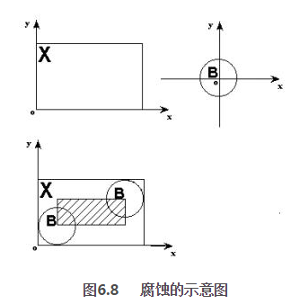
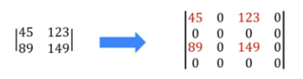

# 图像处理(平滑/形态学/轮廓/量化/采样)

下面主要介绍图像几种处理方式

* 平滑处理（均值滤波，高斯滤波，中值滤波，双边滤波）
* 形态学处理（腐蚀膨胀，开闭运算，礼帽黑帽，边缘检测）
* 图像轮廓处理（轮廓绘制，轮廓检索，轮廓填充，轮廓近似）
* 图像量化处理&图像采样处理（K-Means聚类量化，局部马赛克处理）

​     

# 一 图像平滑处理

**平滑处理**（smoothing），也称 **模糊处理**（bluring），是一项简单且使用频率很高的图像处理方法，目前平滑处理的用途有很多，最常见的是用来**减少图像上的噪点或者失真**，其中在涉及到**降低图像分辨率**时，平滑处理是非常好用的方法。

**图像滤波**，就是**在尽量保留图像细节特征的条件下对目标图像的噪声进行抑制**，是图像预处理中不可或缺的操作，其处理效果的好坏将直接影响到后续图像处理和分析的有效性和可靠性。

> 滤波，一种形象的比喻法是：可以把滤波器想象成一个包含加权系数的窗口，当使用这个滤波器平滑处理图像时，就把这个窗口放到图像之上，透过这个窗口来看我们得到的图像，而对滤波处理的要求有两个：
>
> * 一是不能损坏图像的轮廓及边缘等重要信息；
> * 二是使图像清晰视觉效果好；
>
> 总的来说，**滤波是掩膜（mask）和图像的卷积**，而滤波过程分为 **计算掩膜** 和 **卷积**，即掩膜上每一个位置的值和图像上对应位置的像素值的乘加运算。

​      

滤波函数笔记（侵删）：

<div align="center"></div>

图像**模糊和滤波**的关系：

<div align="center"></div>

​      

## 1.1 均值滤波blur & 方形滤波BoxFilter

均值滤波（低通滤波）是典型的线性滤波算法，它是指在图像上对目标像素给一个模板，该模板包括了其周围的临近像素（以目标像素为中序的周围八个像素，构成一个滤波模板，即去掉目标像素本身），再用模板中的全体像素的平均值来代替原来像素值。

简单来说，图片中一个方块区域 N*M 内，中心点的像素为全部点像素值的平均值，即均值滤波就是对整张图片进行以上操作，如下图矩阵：

<div align="center"></div>

进而可看下图，红色点的像素值为蓝色背景区域像素值之和除25：

<div align="center"></div>

其中红色区域的像素值均值滤波处理过程为： ((197+25+106+156+159)+ (149+40+107+5+71)+ (163+198+226+223+156)+ (222+37+68+193+157)+ (42+72+250+41+75)) / 25 = 125.52

其中5*5的矩阵称为**核**，针对**原始图像内的像素点，采用核进行处理**，得到结果图像

<div align="center"></div>

提取1/25 可以将核转换为如下形式：

<div align="center"></div>

​       

Python调用OpenCV实现均值滤波和方框滤波（盒子滤波）的核心函数如下：

```python
# 均值滤波
blur(src, ksize, dst=None, anchor=None, borderType=None)

参数说明：
	src 表示待处理的输入图像
	ksize 表示模糊内核大小，比如(1,15)表示生成的模糊内核是一个1*15的矩阵
	dst 表示输出与src相同大小和类型的图像
	anchor、borderType参数可忽略

# 方框滤波（盒子滤波）
BoxFilter(src, ddepth, ksize, normalize, ...)
# 方框滤波比均值滤波多一个参数, 此参数为normalize
# 	normalize=True时，与均值滤波结果相同
# 	normalize=False，表示对加和后的结果不进行平均操作，大于255的使用255表示
```

其中，核大小是以（宽度，高度）表示的元组形式，常见的形式包括：和大小（3， 3）和（5， 5）

<div align="center"></div>

2种滤波特点：

> 1）均值滤波优缺点
>
> **优点**：效率高，思路简单
>
> **缺点**：均值滤波本身存在着固有的缺陷，即它**不能很好地保护图像细节**，在图像去噪的同时也破坏了图像的细节，从而使图像变得模糊，不能很好地去除噪声点，特别是椒盐噪声。
>
> 注：高斯滤波器是一种现性滤波器，能够有效地抑制噪声，平滑图像。其作用原理和均值滤波器类似，都是取滤波器窗口内像素的均值作为输出，但其窗口模板的稀疏和均值滤波器不同，**均值滤波器的模板稀疏都是相同的为1，而高斯滤波器的模板稀疏随着距离模板中心的增大而系数减少**。所以，高斯滤波器相比于均值滤波器对图像的模型程度较小。
>
> 2）方框滤波（盒子滤波）用途：
>
> * 非归一化（normalized = False）的方框滤波用于计算每个像素领域内的积分特性，比如密集光流算法（dense optical flow algorithms）中用到的图像倒数的协方差矩阵（convariance matrices of image derivatives）
> * 归一化后，方框滤波与均值滤波结果相同，不选择容易越界，越界的话，超过255则用255表示

​     

代码：

```python
image = cv2.imread(filepath)
img = cv2.cvtColor(image, cv2.COLOR_BGR2RGB)

# 核大小
ksize = (3, 3)

# 均值滤波: 简单的平均卷积操作
img_blur = cv2.blur(image, ksize=ksize)

# 方框滤波: 基本和均值滤波一样，可以选择归一化，如果选择归一化，则和均值滤波一样
# 如果不选择归一化，则方框滤波容易越界，越界的话，超过255则用255表示
img_box_normal = cv2.boxFilter(image, -1, ksize=ksize, normalize=True)
img_box_unnormal = cv2.boxFilter(image, -1, ksize=ksize, normalize=False)
```

效果图：

<div align="center"></div>

​         

## 1.2 高斯滤波/高斯模糊 GaussianBlur

常，图像处理软件会提供“模糊”（blur）滤镜，使图片产生模糊的效果。“高斯模糊”（Gaussian Blur）将正态分布（“高斯分布”）用于图像处理中，本质上高斯滤波是一种数据平滑的技术（data smoothing），适用于多个场景，图像处理恰好提供了一个直观的应用实例。

> **高斯滤波的原理**
>
> 高斯分布其实学名叫正态分布（Normal distribution），正态曲线呈钟型，两头低，中间高，左右对称因其曲线呈钟形，因此称之为钟形曲线。高斯分布公式如下：
>
> <div align="center"></div>
>
> 其中，μ是x的均值，σ是x的方差。因为计算平均值的时候，中心点就是原点，所以μ等于0
>
> <div align="center"></div>
>
> 根据一维高斯函数，可以推导出二维高斯函数：
>
> <div align="center"></div>
>
> 形状如下：
>
> <div align="center"></div>
>
> 上图为一维高斯分布示意图， μ 觉得了分布对称中心， σ 决定了分布的形状， σ 越小形状越瘦小， σ  越大越矮胖。所以就是越接近中心，取值越大，越远离中心，取值越小。计算平均值的时候，只需要将“中心点”作为原点，其他店按照其在正态曲线上的位置，分配权重，就可以得到一个加权平均值。
>
> 那高斯分布公式的作用到底是什么呢？—— **计算高斯滤波用的掩膜**（mask）
>
> 掩膜是什么呢？下面我们首先来一个3*3的均值滤波的掩膜：
>
> <div align="center"></div>
>
> 可以看到，均值掩膜内所有稀疏均相等为1/9，且和为1，同理可得5*5均值滤波的掩膜。在“中间点” 取“周围点” 的平均值，就变为周围的平均值了，在数值上，这是一种“平滑化”，在图形上，就相当于产生“模糊”效果，“中间点” 失去细节。显然，计算平均值时，取值范围越大，“模糊效果”越强烈。
>
> 下面计算权重矩阵，对于图像中任意一点（x,  y），它周围的坐标为：
>
> <div align="center"></div>
>
> 例如：要产生一个高斯滤波模板，以模板的中心位置为坐标原点进行取样。模板在各个位置的坐标，如下图所示（x轴水平向右，y轴竖直向下），用数值代替上面（x,  y），假定中心点的坐标为（0,  0），那么距离它周围的八个点的坐标如下：
>
> <div align="center"></div>
>
> 更远的点，依次类推，为了计算权重矩阵，需要设定 σ 的值，假定 σ = 1.5 ，则模糊半径为1的权重矩阵如下：
>
> <div align="center"></div>
>
> 这九个点的权重综合等于 0.4787147，如果只计算这 9 个点的加权平均，还必须让他们的权重之和等于1，因此上面的九个值还要分别除以  0.4787147，得到最终的权重矩阵：
>
> <div align="center"></div>
>
> 有了权重矩阵，就可以计算高斯模糊的值了。假设现有九个像素点，灰度值（0-255）如下：
>
> <div align="center"></div>
>
> 每个点乘以自己的权重值：
>
> <div align="center"></div>
>
> 得到：
>
> <div align="center"></div>
>
> 将这九个值加起来，就是中心点的高斯模糊的值，对所有的点重复这个过程，就得到了高斯模糊后的图像。如果原图是彩色的图像，可以对RBG三个通道分别做高斯模糊。
>
> 利用高斯掩膜和图像进行卷积求解高斯模糊过程：
>
> <div align="center"></div>
>
> 所有像素都用图上的那一套模板进行卷积运算，最终得到滤波的结果。

​      

**高斯滤波函数GaussianBlur**

```python
GaussianBlur(src, ksize, sigmaX, dst=None, sigmaY=None, borderType=None)

参数说明：
	src 表示待处理的输入图像。
	ksize 表示高斯滤波器模板大小，ksize.width和ksize.height可以不同，但都必须是正数和奇数，或者可以是零，即（0, 0），然后从σ计算出来
  sigmaX 表示X方向上的高斯内核标准差
  sigmaY 表示Y方向上的高斯内核标准差，如果sigmaY为零，则设置为等于sigmaX，如果两个sigma均为零，则分别从ksize.width和ksize.height计算得到

补：若ksize不为(0, 0)，则按照ksize计算，后面的sigmaX没有意义。若ksize为(0, 0)，则根据后面的sigmaX计算ksize，如：
blurred = cv2.GaussianBlur(gray, (9, 9), 0)
```

高斯模糊本质上是**低通滤波器**，输出图像的每个像素点是原图像上对应像素点与周围像素点的加权和。高斯矩阵的尺寸和标准差：（9，9）表示高斯矩阵的长和宽，**标准差取0时，OpenCV会根据高斯矩阵的尺寸自己计算，高斯矩阵的尺寸越大，标准差越大，处理过的图像模糊程度越大**。此外，高斯平滑与简单平滑不同，它在对领域内像素进行平均时，给与不同位置的像素不同的权值，下面所示的是 3 * 3 和 5 * 5 领域的高斯模板。

<div align="center"></div>

代码：

```python
img = cv2.imread(filepath)
rgbimg = cv2.cvtColor(img, cv2.COLOR_BGR2RGB)

# 高斯滤波：高斯模糊的卷积核的数值是满足高斯分布的，相当于更重视中间的
# 标准差取0时，OpenCV会根据高斯矩阵的尺度自己计算
gaussian_blur_0 = cv2.GaussianBlur(rgbimg, (9, 9), 0)
gaussian_blur_1 = cv2.GaussianBlur(rgbimg, (9, 9), 1)
```

效果：

<div align="center"></div>

​        

## 1.3 双边滤波 bilateralFilter

双边滤波其实很简单，它只是比高斯滤波多了一种掩膜而已，且两种掩膜都是套用高斯分布公式得到的，但双边滤波不光考虑了**像素在空间中位置远近程度的影响**，还考虑了**像素亮度相近程度的影响**。

双边滤波（Bilateral filter）是一种非线性的滤波方法，是结合**图像的空间邻近度**和**像素值相似度**的一种折中处理，同时考虑空域信息和灰度相似性，达到保边去噪的目的。双边滤波器顾名思义比高斯滤波多了一个**高斯方差sigma－d**，它是基于空间分布的高斯滤波函数，所以在边缘附近，离的较远的像素不会太多影响到边缘上的像素值，这样就保证了边缘附近像素值的保存。但是**由于保存了过多的高频信息，对于彩色图像里的高频噪声，双边滤波器不能够干净的滤掉，只能够对于低频信息进行较好的滤波**。

双边滤波在滤波的同时能保证一定的边缘信息，提供比高斯滤波更好的边缘保留特性，opencv提供的双线性滤波器的加权计算包含2个部分，一部分叫做 space-related bilateral filter coefficients空域参数，一个是 color-related bilateral filter coefficients 颜色域参数，**空域参数采用高斯核来计算，颜色域参数是基于像素与中心像素的亮度差的差值的加权，相似的像素赋给较大的权值，不相似的赋给较小的权值**，处理完的图像更像一个水彩画，可用于图像分割，但是运行较慢。

如下图频域曲线：

<div align="center"></div>

​     

双边滤波函数（BilateralFilter ）：

```shell
bilateralFilter(src, d, sigmaColor, sigmaSpace, dst=None, borderType=None)

参数说明:
	src 表示待处理的输入图像
	d 表示在过滤期间使用的每个像素邻域的直径，如果输入d非0，则sigmaSpace由d计算得出，如果sigmaColor没输入，则sigmaColor由sigmaSpace计算得出
	sigmaColor 表示色彩空间的标准方差，一般尽可能大。较大的参数值意味着像素邻域内较远的颜色会混合在一起，从而产生更大面积的半相等颜色
	sigmaSpace表示坐标空间的标准方差(像素单位)，一般尽可能小，其中参数值越大意味着只要它们的颜色足够接近，越远的像素都会相互影响。当d > 0时，它指定邻域大小而不考虑sigmaSpace。 否则d与sigmaSpace成正比。
```

代码实现：

```python
img = cv2.imread(filepath)
rgbimg = cv2.cvtColor(img, cv2.COLOR_BGR2RGB)

# 双边滤波：它能保持边界清晰的情况下有效的去除噪声，但是这种操作比较慢
# 双边滤波拥有美颜的效果
bilateral_filter = cv2.bilateralFilter(rgbimg, d=0, sigmaColor=100, sigmaSpace=15)
```

效果：

<div align="center"></div>

​       

## 1.4 中值滤波 medianBlur

中值滤波是一种非线性数字滤波器技术，经常用于**去除图像或者其他信号中的噪声，是处理椒盐噪声的常用降噪算法**，且中值滤波将每一像素点的灰度值设置为该点某领域窗口内的所有像素点灰度值的中值。

在使用邻域平均法去噪的同时也使得边界变得模糊，而中值滤波是非线性的图像处理方法，在去噪的同时可以兼顾到边界信息的保留。选一个含有奇数点的窗口W，将这个窗口在图像上扫描，把窗口中所含的像素点按灰度级的升或降序排列，取位于中间的灰度值来代替该点的灰度值。 例如选择滤波的窗口如下图，是一个一维的窗口，待处理像素的灰度取这个模板中灰度的中值，滤波过程如下：

<div align="center"></div>

图像平滑里中值滤波的效果最好：

<div align="center"></div>

​      

中值滤波函数（MedianBlur ）：

> **medianBlur(src, ksize, dst=None)**
>
> 参数说明:
>
> * src 表示待处理的输入图像
> * ksize 表示滤波窗口尺寸，必须是奇数并且大于1。比如这里是5，中值滤波器就会使用5×5的范围来计算，即对像素的中心值及其5×5邻域组成了一个数值集，对其进行处理计算，当前像素被其中值替换
> * dst 表示输出与src相同大小和类型的图像
>
> 
>
> **窗口问题**：
>
> 中值滤波降噪的原理为**使用噪点的某一个邻域内的中值代替该噪点，邻域范围越大则边缘保留效果越差**，从视觉上来看，即更加模糊，但降噪效果明显。此外，邻域亦即窗口的形状也会影响降噪的效果，通常有3 * 3  5 * 5 ，十字形，圆形等。
>
> 常用的窗口还有方形、十字形、圆形和环形，且不同形状的窗口产生不同的滤波效果，方形和圆形窗口适合外轮廓线较长的物体图像，而十字形窗口对有尖顶角状的图像效果好。中值滤波对于消除孤立点和线段的干扰十分有用，尤其是对于二进噪声，但对消除高斯噪声的影响效果不佳。对于一些细节较多的复杂图像，可以多次使用不同的中值滤波。
>
> <div align="center"></div>

代码实现：

```python
# 中值滤波: 相当于用中值代替
median = cv2.medianBlur(img, 5)
```

效果：

<div align="center"></div>

​       

## 1.5 滤波类型比较

代码：

```python
image = cv2.imread(filepath)
img = cv2.cvtColor(image, cv2.COLOR_BGR2RGB)

# 均值滤波
img_mean = cv2.blur(img, (5, 5))

# 方框滤波
img_box_unnormal = cv2.boxFilter(image, -1, (2, 2), normalize=False)

# 高斯滤波
img_Guassian = cv2.GaussianBlur(img, (5, 5), 0)

# 中值滤波
img_median = cv2.medianBlur(img, 5)

# 双边滤波
img_bilater = cv2.bilateralFilter(img, 9, 75, 75)
```

效果：

<div align="center"></div>

​      

# 二 图像形态学处理

形态学操作简单来说，就是改变物体的形状

## 2.1 定义结构元素

**形态学操作原理**：在特殊领域运算形式——**结构元素**（Structure Element），**在每个像素位置上与二值图像对应的区域进行特定的逻辑运算**，其次运算结构是输出图像的相应像素，且运算效果取决于**结构元素大小内容**以及**逻辑运算性质**。

> **结构元素**：
>
> **膨胀**和**腐蚀**操作的最基本组成部分，用于测试输出图像，通常要比待处理的图像小很多，二维平面结构元素由一个数值为0或1的矩阵组成。
>
> 结构元素的原点指定了图像中需要处理的像素范围，结构元素中数值为1的点决定结构元素的领域像素进行膨胀或腐蚀操作时是否需要参与计算。

形态学处理的核心就是定义结构元素，在OpenCV-Python中，可以使用其自带的 **getStructuringElement** 函数，也可以直接使用 Numpy 的 ndarray 来定义一个结构元素，形象图如下：

<div align="center"></div>

### 2.1.1 基本符号和关系

相关概念&说明

> **元素**：设有一幅图像X，若点 a 在 X 的区域以内，则称 a 为 X 的元素，记做 a 属于 X，如图 6.1所示
>
> **B包含于X**：设有两幅图像 B， X。对于 B中所有的元素 ai， 都有 ai 属于 X，则称B包含于 （included in）X ，记做 B 属于 X，如图6.2所示
>
> **B击中 X**：设有两幅图像B， X。若存在这一一个点，它即是B的元素，又是 X 的元素，则称 B 击中（hit）X，记做 B ↑ X，如图6.3所示
>
> **B不击中 X**：设有两幅图像B， X。若不存在任何一个点，它既是B的元素，又是 X的元素，即 B和 X的交集是空，则称 B 不击中（miss）X，记做 B ∩ X = Φ；其中 ∩ 是集合运算相交的符号，Φ 表示空集，如图6.4所示
>
> <div align="center"></div>
>
> **补集**：设有一幅图像 X，所有 X 区域以外的点构成的集合称为 X 的补集，记做 Xc，如下图所示。显然，如果B ∩ X = Φ，则 B 在 X的补集内，即 B 属于 Xc
>
> <div align="center"></div>
>
> **结构元素**：设有两幅图像B，X。若X是被处理的对象，而B是用来处理X的，则称B为结构元素（structure element），又被形象的称作**刷子**，结构元素通常都是一些比较小的图像
>
> **对称集**：设有一幅图像B，将B中所有元素的坐标取反，即令（x, y）变为（-x, -y），所有这些点构成的新的集合称为B的对称集，记做 Bv，如下图6.6所示
>
> **平移**：设有一幅图像B，有一个点a(x0, y0)，将B平移a后的结果是，把B中所有元素的横坐标加 x0，纵坐标加 y0，即令（x, y）变成（x + x0, y+y0），所有这些点构成新的集合称为B的平移，记做 Ba，如图6.7所示
>
> <div align="center"></div>

​      

### 2.1.2 getStructuringElement 方法

getStructuringElement  是OpenCV提供的一个函数，getStructuringElement 的内部并没有什么优化实现，只是封装了一些功能，其原理同样是声明了一个矩阵，然后求形状，指定矩阵的值，只需要直接调用即可。

> getStructuringElement(shape, ksize, anchor=None)
>
> 参数说明:
>
> * shape 表示内核的形状，有三种形状可以选择：
>   * 十字形：cv2.getStructuringElement(cv2.MORPH_CROSS, (5,5))
>   * 椭圆：cv2.getStructuringElement(cv2.MORPH_ELLIPSE, (5,5))
>   * 矩形：cv2.getStructuringElement(cv2.MORPH_RECT, (5,5))
> * ksize 表示内核的尺寸（n,  n）
> * anchor 锚点的位置

​      

## 2.2 腐蚀和膨胀 morphologyEx

图像的膨胀（Dilation）和 腐蚀（Erosion）是两种基本的形态学运算，主要用来寻找图像中的极大区域和极小区域

* 膨胀：类似于“领域扩张”，将图像中的高亮区域或白色部分进行扩张，其运行结果图比原图的高亮区域更大；
* 腐蚀：类似于“领域被蚕食”，将图像中的高亮区域或白色部分进行缩减细化，其运行结果图比原图的高亮区域更小；

形态学各种功能实现，都归结为腐蚀 erode 和 膨胀 dilate 的组合，形象理解一下就是**腐蚀等于变瘦，膨胀等于变胖**。

**注意**：腐蚀和膨胀主要针对**二值化图像的白色部分**

### 2.2.1 腐蚀（Erosion）

腐蚀就是把结构元素B平移a后得到Ba，若Ba包含于X，我们记下这个a点，所有满足上述条件的 a点组成的集合称为X被B腐蚀（Erosion）的结果。

<div align="center"></div>

上图 X 是被处理的对象，B是结构元素，不难知道，对于任意一个在阴影部分的点 a，Ba包含于X，所以 **X被B腐蚀的结果就是那个阴影部分**，阴影部分在 X的范围之内，且比 X小，就像 X 被剥掉了一层似的，就是为什么叫腐蚀的原因。

腐蚀的运算符为 “ - ”，其定义如下：

<div align="center"></div>

该公式表示**图像A用卷积模板B来进行腐蚀处理，通过模板B与图像A进行卷积计算，得到B覆盖区域的像素点最小值，并用这个最小值来替代参考点的像素值**。如图所示，将左边的原始图像A腐蚀处理为右边的效果图A-B。

<div align="center"></div>

**腐蚀**：腐蚀会把物体的边界腐蚀掉，卷积核沿着图像滑动，如果卷积核对应的原图的所有像素值为1，那么中心元素就保持原来的值，否则变为零。主要应用在**去除白噪声，也可以断开连在一起的物体**。

<div align="center"></div>

在原图的每一个区域中取**最小值**，由于是二值化图像，只要有一个点为0，则为0，来达到瘦身的目的。

**腐蚀的作用：**

- 1，对象大小减少1个像素（3*3）
- 2，平滑对象边缘
- 3，弱化或者分割图像之间的半岛型连接

​     

### 2.2.2 膨胀（Dilation）

膨胀可以看做是腐蚀的对偶运算，其定义是：**把结构元素B平移 a 后得到 Ba，若Ba击中X，记下这个 a 点**，所有满足上述条件的 a点组成的集合称为 X被B膨胀的结果。

<div align="center"></div>

膨胀的方法是：**拿B的中心点和X上的点及X周围的点一个一个的对，如果B上有一个点落在X的范围内，则该点为黑，可以看出X的范围就像X膨胀一圈似的**。

图像膨胀的运算符是“⊕”，其定义如下：

<div align="center"></div>

这个公式表示用B来对图像A进行膨胀处理，其中B是一个卷积模板或卷积核，其形状可以为正方形或圆形，通过模板B与图像A进行卷及计算，扫描图像中的每一个像素点，用模板元素与二值图像元素做“与”运算，如果都为0，那么目标像素点为0，否则为1。从而**计算B覆盖区域的像素点最大值，并用该值替换参考点的像素值实现膨胀**。下图是将左边的原始图像A膨胀处理为右边的效果图 A⊕B。

<div align="center"></div>

**膨胀**：卷积核所对应的原图像的像素值只要有一个是1，中心像素值就是1，一般在**除噪声，先腐蚀再膨胀，因为腐蚀在去除白噪声的时候也会使图像缩小，所以我们之后要进行膨胀。当然也可以用来将两者物体分开**。

<div align="center"></div>

**膨胀的作用：**

- 1，对象大小增加一个像素 （3*3）
- 2，平滑对象边缘
- 3，减少或者填充对象之间的距离

​        

### 2.2.3 代码&效果

腐蚀和膨胀：

* 可以看做膨胀是将**白色区域扩大**，腐蚀是将**黑色区域扩大**
* 可以不进行灰度处理，对彩色图像进行处理

```python
# 腐蚀
cv2.erode(src,                     # 输入图像
      kernel,                  # 卷积核
      dst=None,
      anchor=None,
      iterations=None,         # 迭代次数，默认1
      borderType=None,
      borderValue=None)
 
# 膨胀
cv2.dilate(src,                    # 输入图像
           kernel,                 # 卷积核
           dst=None,
           anchor=None,
           iterations=None,        # 迭代次数，默认1
           borderType=None,
           borderValue=None)
```

代码示例：

```python
origin_img = cv2.imread(img_path)
gray_img = cv2.cvtColor(origin_img, cv2.COLOR_BGR2GRAY)

# OpenCV定义的结构元素
kernel = cv2.getStructuringElement(cv2.MORPH_RECT, (5, 5))

# 腐蚀图像
eroded = cv2.erode(gray_img, kernel)
# 膨胀图像
dilated = cv2.dilate(gray_img, kernel)
```

腐蚀和膨胀的处理很简单，只需设置好结构元素，然后分别调用 cv2.erode() 和 cv2.dilate()函数，其中第一个参数为需要处理的图像，第二个是结构元素，返回处理好的图像。

下图从左到右依次是 原图，腐蚀，膨胀（可以看出腐蚀是将线条变瘦，膨胀是变胖）:

<div align="center"></div>

​       

## 2.3 开运算和闭运算 morphologyEx

开运算和闭运算就是**将腐蚀和膨胀按照一定的次序进行处理**，但是这两者并不是可逆的，即**先开后闭并不能得到原来的图像**。

为了获取图像中的主要对象：对一幅二值图连续使用闭运算和开运算，或者消除图像中的噪声，也可以对图像先用开运算后用闭运算，不过这样也会消除一些破碎的对象。

> **开运算**：先腐蚀后膨胀，用于**移除由图像噪声形成的斑点**
>
> **闭运算**：先膨胀后腐蚀，用来**连接被误分为许多小块的对象**

### 2.3.1 开运算

**开运算 = 先腐蚀运算，再膨胀运算**（看上去把细微连在一起的两块目标分开了）

开运算的效果图如下图所示：

<div align="center"></div>

开运算总结：

- 1）开运算能够**除去孤立的小点，毛刺和小桥**，而总的位置和形状不变。
- 2）开运算是一个基于几何运算的滤波器
- 3）结构元素大小的不同将导致滤波效果的不同
- 4）不同的结构元素的选择导致了不同的分割，即提取出不同的特征

​     

### 2.3.2 闭运算

**闭运算 = 先膨胀运算，再腐蚀运算**（看上去将两个细微连接的图封闭在一起）

闭运算的效果如下图所示：

<div align="center"></div>

闭运算总结：

- 1）闭运算能够**填平小湖（即小孔），弥合小裂缝**，而总的位置和形状不变
- 2）闭运算是通过填充图像的凹角来滤波图像的
- 3）结构元素大小的不同将导致滤波效果的不同
- 4）不同结构元素的选择导致了不同的分割

​    

### 2.3.3 代码&效果

函数原型：

```python
# 开运算: 图像开运算主要使用的函数morphologyEx，它是形态学扩展的一组函数，其参数cv2.MORPH_OPEN对应开运算
# 其原型：
dst = cv2.morphologyEx(src, cv2.MORPH_OPEN, kernel)
 
参数
	dst 处理的结果
  src 原图像
  cv2.MORPH_OPEN 开运算
  kernel表示卷积核
 
 
# 闭运算: 图像闭运算主要使用的函数morphologyEx
# 其原型：
dst = cv2.morphologyEx(src, cv2.MORPH_CLOSE, kernel)
 
参数
	dst 处理的结果
  src 原图像
  cv2.MORPH_CLOSE 闭运算
  kernel 卷积核
```

**闭运算用来连接被误分为许多小块的对象，而开运算用于移除由图像噪声形成的斑点**。如：

* 某些情况下可以连续运用这两种运算，如对一幅二值图连续使用闭运算和开运算，将获得图像中的主要读写
* 如果想消除图像中噪声（即图像中的“小点”），也可以对图像先用开运算后用闭运算，不过这样也会消除一些破碎的对象。

​      

代码：

```python
image = cv2.imread(filepath)
img_gray = cv2.cvtColor(image, cv2.COLOR_BGR2GRAY)

# OpenCV定义的结构元素
kernel = cv2.getStructuringElement(cv2.MORPH_ELLIPSE, (5, 5))

# 开运算
img_open = cv2.morphologyEx(img_gray, cv2.MORPH_OPEN, kernel)
# 闭运算
img_closed = cv2.morphologyEx(img_gray, cv2.MORPH_CLOSE, kernel)
```

效果：

<div align="center"></div>

​      

## 2.4 顶帽/黑帽算法

**礼帽** ：原始图像与其进行开运算后的图像进行一个差

**黑帽**：原始图像与其闭运算后的图像进行一个差

**礼帽运算**  =  原始图像  -  开运算

**黑帽运算**  =  闭运算  -  原始图像

​    

该算法可以用于图像识别的预处理，用于**图像二值化后取出孤立点**：

```python
image = cv2.imread(filepath)
img_gray = cv2.cvtColor(image, cv2.COLOR_BGR2GRAY)

# OpenCV定义的结构元素(核大小为3效果好)
kernel = cv2.getStructuringElement(cv2.MORPH_RECT, (3, 3))

# 顶帽运算
TOPHAT_img = cv2.morphologyEx(img_gray, cv2.MORPH_TOPHAT, kernel)
# 黒帽运算
BLACKHAT_img = cv2.morphologyEx(img_gray, cv2.MORPH_BLACKHAT, kernel)
# 异或
bitwiseXor_gray = cv2.bitwise_xor(img_gray, TOPHAT_img)
```

效果：

<div align="center"></div>

​     

## 2.5 梯度运算

**梯度 = 膨胀 - 腐蚀**

```python
image = cv2.imread(filepath)
img = cv2.cvtColor(image, cv2.COLOR_BGR2RGB)
img_gray = cv2.cvtColor(image, cv2.COLOR_BGR2GRAY)

# OpenCV定义的结构元素(核大小为3效果好)
kernel = np.ones((7, 7), np.uint8)
erosion = cv2.erode(img_gray, kernel, iterations=5)
dilation = cv2.dilate(img_gray, kernel, iterations=3)
gradient = cv2.morphologyEx(img_gray, cv2.MORPH_GRADIENT, kernel)
```

效果：

<div align="center"></div>

​        

## 2.6 形态学运算检测边和角点

通过一个较复杂的例子学习如何用形态学算子检测图像中的边缘和拐角（仅做形态学处理例子）

### 2.6.1 边缘检测

形态学检测边缘的原理很简单，**在膨胀时，图像中的物体会向周围“扩张”，而腐蚀时，图像的额物体会“收缩”**。比较两幅图像，由于其变化的区域只发生在边缘，所以这时将这两幅图像相减，得到的就是图像中的边缘。： 

```python
image = cv2.imread(filepath)
img = cv2.cvtColor(image, cv2.COLOR_BGR2RGB)
img_gray = cv2.cvtColor(image, cv2.COLOR_BGR2GRAY)

# 构造一个3×3的结构元素
element = cv2.getStructuringElement(cv2.MORPH_RECT, (3, 3))
dilate = cv2.dilate(img_gray, element)
erode = cv2.erode(img_gray, element)

# 将两幅图像相减获得边，第一个参数是膨胀后的图像，第二个参数是腐蚀后的图像
# cv2.absdiff参数：(膨胀后的图像，腐蚀后的图像)
result = cv2.absdiff(dilate, erode)

# 上面得到的结果是灰度图，将其二值化以便更清楚的观察结果
retval, result = cv2.threshold(result, 40, 255, cv2.THRESH_BINARY)

# 反色，即对二值图每个像素取反
result = cv2.bitwise_not(result)
```

效果：

<div align="center"></div>

​        

### 2.6.2 检测角点（拐角）

与边缘检测不同，拐角的检测过程稍稍有些复杂。但是原理相同，所不同的是先用**十字形的结构元素膨胀像素**，这种情况下只会在边缘处“扩张”，角点不发生变化，接着用**菱形的结构元素腐蚀原图像**，导致只有在拐角处才会“收缩”，而直线边缘都未发生变化。

第二步是用X行膨胀原图像，焦点膨胀的比边要多。这样第二次用方块腐蚀时，角点恢复原状，而边要腐蚀的更多。所以当两幅图像相减时，只保留了拐角处

<div align="center"></div>

代码处理：

```python
def detection_inflexion(img_path):
    image = cv2.imread(img_path, 0)
    origin = cv2.imread(img_path)
    
    # 构造5×5的结构元素，分别为十字形、菱形、方形和X型
    cross = cv2.getStructuringElement(cv2.MORPH_CROSS, (5, 5))
    # 菱形结构元素的定义稍麻烦一些
    diamond = cv2.getStructuringElement(cv2.MORPH_RECT, (5, 5))
    diamond[0, 0] = 0
    diamond[0, 1] = 0
    diamond[1, 0] = 0
    diamond[4, 4] = 0
    diamond[4, 3] = 0
    diamond[3, 4] = 0
    diamond[4, 0] = 0
    diamond[4, 1] = 0
    diamond[3, 0] = 0
    diamond[0, 3] = 0
    diamond[0, 4] = 0
    diamond[1, 4] = 0
    square = cv2.getStructuringElement(cv2.MORPH_RECT, (5, 5))
    x = cv2.getStructuringElement(cv2.MORPH_CROSS, (5, 5))
    
    # 使用cross膨胀图像
    dilate_cross_img = cv2.dilate(image, cross)
    # 使用菱形腐蚀图像
    erode_diamond_img = cv2.erode(dilate_cross_img, diamond)
 
    # 使用X膨胀原图像
    dilate_x_img = cv2.dilate(image, x)
    # 使用方形腐蚀图像
    erode_square_img = cv2.erode(dilate_x_img, square)
 
    # result = result1.copy()
    # 将两幅闭运算的图像相减获得角
    result = cv2.absdiff(erode_square_img, erode_diamond_img)
    # 使用阈值获得二值图
    retval, result = cv2.threshold(result, 40, 255, cv2.THRESH_BINARY)
 
    # 在原图上用半径为5的圆圈将点标出
    for j in range(result.size):
        y = int(j / result.shape[0])
        x = int(j % result.shape[0])
 
        if result[x, y] == 255:
            cv2.circle(image, (y, x), 5, (255, 0, 0))
 
    cv2.imshow("Result", image)
    cv2.waitKey(0)
    cv2.destroyAllWindows()
```

​       

# 三 图像轮廓处理

## 3.1 简单几何图像绘制

简单几何图像一般包括点，直线，矩阵，圆，椭圆，多边形等等，下面学习一下 opencv对像素点的定义，即图像的一个像素点有1或3个值，对灰度图像有一个灰度值，对彩色图像有3个值组成一个像素值，表现出不同的颜色。其实有了点才能组成各种多边形，才能对多边形进行轮廓检测，所以下面先练习一下简单的几何图像绘制。

### 3.1.1 绘制直线 line

OpenCV绘制直线使用的函数为 line() ，其函数原型如下：

```python
# real signature unknown; restored from __doc__
def line(img, pt1, pt2, color, thickness=None, lineType=None, shift=None): 
    """
    line(img, pt1, pt2, color[, thickness[, lineType[, shift]]]) -> img
    .   @brief Draws a line segment connecting two points.
    .  
    .   The function line draws the line segment between pt1 and pt2 points in the image. The line is
    .   clipped by the image boundaries. For non-antialiased lines with integer coordinates, the 8-connected
    .   or 4-connected Bresenham algorithm is used. Thick lines are drawn with rounding endings. Antialiased
    .   lines are drawn using Gaussian filtering.
    .  
    .   @param img Image. 
    .   @param pt1 First point of the line segment.
    .   @param pt2 Second point of the line segment.
    .   @param color Line color.
    .   @param thickness Line thickness.
    .   @param lineType Type of the line. See #LineTypes.
    .   @param shift Number of fractional bits in the point coordinates.
    """
    pass
```

可知函数主要接受参数为两个点的坐标，线的颜色（其中灰色图为一个数字，彩色图为1*3的数组）

```python
# 生成一个空灰度图像
img1 = np.zeros((400, 400), np.uint8)
img1 = cv2.line(img1, (0, 0), (400, 400), 255, 5)
 
# 生成一个空彩色图像
img3 = np.zeros((400, 400, 3), np.uint8)
img3 = cv2.line(img3, (0, 0), (400, 400), (0, 255, 0), 5)
```

**注意**：

* 1）在这里再强调一下，由于cv和matplotlib的读取图像通道不同，导致灰度图和彩色图的颜色不一样，如果想分开看，可以直接使用cv2.imshow()；
* 2）绘制图像是在原图上绘制，这里我们写的是专门在原图上绘制，后面draw轮廓的话，可能需要 img.copy()了。不然我们的原图会存在画的轮廓。

​      

### 3.1.2 绘制矩阵 rectangel

OpenCV绘制直线使用的函数为 rectangel() ，其函数原型如下：

```python
def rectangle(img, pt1, pt2, color, thickness=None, lineType=None, shift=None): # real signature unknown; restored from __doc__
    """
    rectangle(img, pt1, pt2, color[, thickness[, lineType[, shift]]]) -> img
    .   @brief Draws a simple, thick, or filled up-right rectangle.
    .  
    .   The function cv::rectangle draws a rectangle outline or a filled rectangle whose two opposite corners
    .   are pt1 and pt2.
    .  
    .   @param img Image. 原图
    .   @param pt1 Vertex of the rectangle. （x，y）是矩阵的左上点坐标
    .   @param pt2 Vertex of the rectangle opposite to pt1 . （x+w，y+h）是矩阵的右下点坐标
    .   @param color Rectangle color or brightness (grayscale image). （0,255,0）是画线对应的rgb颜色
    .   @param thickness Thickness of lines that make up the rectangle. Negative values, like #FILLED, 所画的线的宽度
    .   mean that the function has to draw a filled rectangle.
    .   @param lineType Type of the line. See #LineTypes
    .   @param shift Number of fractional bits in the point coordinates.
     
     
    rectangle(img, rec, color[, thickness[, lineType[, shift]]]) -> img
    .   @overload
    .  
    .   use `rec` parameter as alternative specification of the drawn rectangle: `r.tl() and
    .   r.br()-Point(1,1)` are opposite corners
    """
    pass
```

使用示例：

```python
# 生成一个空灰度图像
img1 = np.zeros((400, 400), np.uint8)
img1 = cv2.rectangle(img1, (40, 40), (350, 350), 255, 5)
 
# 生成一个空彩色图像
img3 = np.zeros((400, 400, 3), np.uint8)
img3 = cv2.rectangle(img3, (40, 40), (350, 350), (0, 255, 0), 5)
```

​      

### 3.1.3 绘制圆形 circle

OpenCV绘制直线使用的函数为 circle() ，其函数原型如下：

```python
def circle(img, center, radius, color, thickness=None, lineType=None, shift=None): # real signature unknown; restored from __doc__
    """
    circle(img, center, radius, color[, thickness[, lineType[, shift]]]) -> img
    .   @brief Draws a circle.
    .  
    .   The function cv::circle draws a simple or filled circle with a given center and radius.
    .   @param img Image where the circle is drawn.
    .   @param center Center of the circle.
    .   @param radius Radius of the circle.
    .   @param color Circle color.
    .   @param thickness Thickness of the circle outline, if positive. Negative values, like #FILLED,
    .   mean that a filled circle is to be drawn.
    .   @param lineType Type of the circle boundary. See #LineTypes
    .   @param shift Number of fractional bits in the coordinates of the center and in the radius value.
    """
    pass
```

绘制圆形也简单，只需要确定圆心与半径即可，实践代码：

```python
# 生成一个空灰度图像
img1 = np.zeros((400, 400), np.uint8)
img1 = cv2.circle(img1, (150, 150), 100, 255, 5)
 
# 生成一个空彩色图像
img3 = np.zeros((400, 400, 3), np.uint8)
img3 = cv2.circle(img3, (150, 150), 100, (0, 255, 0), 5)
```

​     

### 3.1.4 绘制椭圆 ellipse

OpenCV绘制直线使用的函数为 ellipse() ，其函数原型如下：

```python
def ellipse(img, center, axes, angle, startAngle, endAngle, color, thickness=None, lineType=None, shift=None):
    """
    .   @param img Image. 图像
    .   @param center Center of the ellipse. 椭圆圆心坐标
    .   @param axes Half of the size of the ellipse main axes. 轴的长度
    .   @param angle Ellipse rotation angle in degrees. 偏转的角度
    .   @param startAngle Starting angle of the elliptic arc in degrees. 圆弧起始角的角度
    .   @param endAngle Ending angle of the elliptic arc in degrees. 圆弧终结角的角度
    .   @param color Ellipse color. 线条的颜色
    .   @param thickness Thickness of the ellipse arc outline, if positive. Otherwise, this indicates that 
    .   a filled ellipse sector is to be drawn.  线条的粗细程度
    .   @param lineType Type of the ellipse boundary. See #LineTypes 线条的类型
    .   @param shift Number of fractional bits in the coordinates of the center and values of axes.  圆心坐标点的数轴的精度
    """
    pass
```

图像化如下：

<div align="center"></div>

实践代码：

```python
# 生成一个空灰度图像
img_origin1 = np.zeros((400, 400), np.uint8)
img_origin11 = img_origin1.copy()
# 参数依次是：图像，椭圆圆心坐标，轴的长度，偏转的角度, 圆弧起始角的角度，圆弧终结角的角度，线条的颜色，线条的粗细程度，线条的类型
img1 = cv2.ellipse(img_origin1, (150, 150), (150, 100), 30, 10, 190, 250)
img11 = cv2.ellipse(img_origin11, (150, 150), (150, 100), 30, 10, 190, 250, -1)
 
# 生成一个空彩色图像
img_origin3 = np.zeros((400, 400, 3), np.uint8)
img_origin33 = img_origin3.copy()
# 注意最后一个参数 -1，表示对图像进行填充，默认是不填充的，如果去掉，只有椭圆轮廓了
img3 = cv2.ellipse(img_origin3, (150, 150), (150, 100), 30, 0, 180, 250)
img33 = cv2.ellipse(img_origin33, (150, 150), (150, 100), 30, 0, 180, 250, -1)	
```

​    

## 3.2 图像轮廓

图像轮廓可以简单认为成将连续的点（连着边界）连在一起的曲线，具有相同的颜色或者灰度，**轮廓在形状分析和物体的检测和识别中很有用**。

- 为了更加准确，要使用**二值化图像**。在寻找轮廓之前，要进行**阈值化处理**，或者**Canny边界检测**
- 查找轮廓的函数会修改原始图像，如果你在找到轮廓之后还想使用原始图像的话，你应该将原始图像存储到其他变量中
- **在OpenCV中，查找轮廓就像在黑色背景中超白色物体，应该记住要找的物体应该是白色，而背景应该是黑色**

​      

### 3.2.1 寻找轮廓 cv2.findContours()函数

函数cv2.findContours()函数的原型为：

```python
cv2.findContours(image, mode, method[, contours[, hierarchy[, offset ]]])  

"""
参数说明:
	image 寻找轮廓的图像，即输入图像
  mode 表示轮廓的检索模式，有四种（本文介绍的都是新的cv2接口）：
  	cv2.RETR_EXTERNAL： 表示只检测外轮廓
    cv2.RETR_LIST： 表示检测所有轮廓，检测的轮廓不建立等级关系，并将其保存到一条链表当中
    cv2.RETR_CCOMP ：表示检测所有的轮廓，并将他们组织为两层：顶层是各部分的外部边界，第二次是空洞的边界
    cv2.RETR_TREE： 表示检测所有轮廓，并重构嵌套轮廓的整个层次，建立一个等级树结构的轮廓
　method 轮廓的近似办法
		cv2.CHAIN_APPROX_NONE：以Freeman链码的方式输出轮廓，所有其他方法输出多边形（顶点的序列）。存储所有的轮廓点，相邻的两个点的像素位置差不超过1，即max（abs（x1-x2），abs（y2-y1））==1
		cv2.CHAIN_APPROX_SIMPLE：压缩水平方向，垂直方向，对角线方向的元素，只保留该方向的终点坐标，例如一个矩形轮廓只需4个点来保存轮廓信息
		cv2.CHAIN_APPROX_TC89_L1，CV_CHAIN_APPROX_TC89_KCOS使用teh-Chinl chain 近似算法
"""
```

**注意：**opencv2返回两个值：contours和hierarchy。而opencv3会返回三个值，分别是

* img：图像
* countours：轮廓，是一个列表，里面存贮着**图像中所有的轮廓**，每一个轮廓都是一个numpy数组，包含对象边界点（x, y）的坐标
* hierarchy：轮廓的层析结构，这是一个ndarray，其中的元素个数和轮廓个数相同，每个轮廓contours[i]对应4个hierarchy元素hierarchy[i]\[0] ~hierarchy[i]\[3]，分别表示后一个轮廓、前一个轮廓、父轮廓、内嵌轮廓的索引编号，如果没有对应项，则该值为负数。

​       

### 3.2.2 绘制轮廓 cv2.drawContours()       

OpenCV cv2.drawContours在图像上绘制轮廓：

```python
cv2.drawContours(image, contours, contourIdx, color[, thickness[, lineType[, hierarchy[, maxLevel[, offset ]]]]])

"""
参数说明：
	image 指明在哪幅图像上绘制轮廓
	contours 轮廓本身，在Python中是一个list
	contourIdx 指定绘制轮廓list中的哪条轮廓，如果是-1，则绘制其中的所有轮廓
	thickness 表明轮廓线的宽度，如果是-1（cv2.FILLED），则为填充模式
"""
```

实例在一幅图像上绘制所有的轮廓：

```python
img = cv2.imread(img_path)
img1 = img.copy()
img2 = img.copy()
img3 = img.copy()

imgray = cv2.cvtColor(img, cv2.COLOR_BGR2GRAY)
_, thresh = cv2.threshold(imgray, 127, 255, cv2.THRESH_BINARY)
# 寻找轮廓
contours, hierarchy= cv2.findContours(thresh, cv2.RETR_TREE, cv2.CHAIN_APPROX_SIMPLE)
 
# 绘制独立轮廓，如第四个轮廓
img1 = cv2.drawContours(img1, contours, -1, (0, 255, 0), 3)
# 如果指定绘制几个轮廓（确保数量在轮廓总数里面），就会只绘制指定数量的轮廓
img2 = cv2.drawContours(img2, contours, 1, (0, 255, 0), 3)
img3 = cv2.drawContours(img3, contours, 0, (0, 255, 0), 3)
```

**注意**：

* 1）cv2.findContours()函数接受的参数是二值图，即**黑白的（不是灰度图）**，所以读取的图像**先要转化成灰度图，再转化成二值图**，后面两行代码分别是检测轮廓，绘制轮廓
* 2）findcontours函数会“原地”修改输入的图像，所以需要copy图像，不然原图会变。。。。

​     

### 3.2.3 矩形边框圈图 cv2.boundingrect()

矩形边框（Bounding Rectangle），是说**用一个最小的矩形，把找到的形状包起来**，还有一个带旋转的矩形，面积会更小。

```python
x, y, w, h = cv2.boudingrect(img) # 获得外接矩形
 
"""
参数说明：
	img 二值图（黑白，非灰度图）
	x，y, w, h 分别表示外接矩形的x轴和y轴的坐标，以及矩形的宽和高， cnt表示输入的轮廓值
"""
```

得到矩阵的坐标后，然后利用 **cv2.rectangle(img, (x,y), (x+w,y+h), (0,255,0), 2)** 画出矩形，下面举个例子来看看如何找出不规则图像的外接矩阵，并画出其矩阵：

```python
img_path = 'contour2.png'
img = cv2.imread(img_path)
img1 = img.copy()
img2 = img.copy()

imgray = cv2.cvtColor(img, cv2.COLOR_BGR2GRAY)
_, thresh = cv2.threshold(imgray, 127, 255, cv2.THRESH_BINARY)

# 轮廓的总数为 len(contours)=2
contours, hierarchy= cv2.findContours(thresh, cv2.RETR_TREE, cv2.CHAIN_APPROX_NONE)
 
cnt = contours[0]
x, y, w, h = cv2.boundingRect(cnt)
img1 = cv2.rectangle(img1, (x,y), (x+w,y+h), (0, 255, 0), 2)
```

效果：

<div align="center"></div>

​       

### 3.2.4 计算轮廓的面积 cv2.contourArea()

opencv使用cv2.contourArea(）来计算轮廓的面积：

```python
def contourArea(contour, oriented=None):
  
"""
参数说明:
	contour：表示某输入单个轮廓，为array
	oriented：表示某个方向上轮廓的面积值，这里指顺时针或者逆时针
		若为True，该函数返回一个带符号的面积值，正负值取决于轮廓的方向（顺时针还是逆时针）
		若为False，表示以绝对值返回
"""
```

**注意**：面积的值与输入点的顺序有关，因为求的是按照点的顺序连接构成的图形的面积

```python
img_path = 'contour2.png'
img = cv2.imread(img_path)
imgray = cv2.cvtColor(img, cv2.COLOR_BGR2GRAY)
_, thresh = cv2.threshold(imgray, 127, 255, cv2.THRESH_BINARY)
contours, hierarchy= cv2.findContours(thresh, cv2.RETR_TREE, cv2.CHAIN_APPROX_NONE)
  
cnt = contours[0]
# 求轮廓的面积
area = cv2.contourArea(cnt)
print(img.shape)  # (306, 453, 3)
print(area)  # 57436.5

# 也可以看轮廓面积与边界矩形比
x, y, w, h = cv2.boundingRect(cnt)
rect_area = w*h
extent = float(area) / rect_area
print('轮廓面积与边界矩形比为', extent) # 轮廓面积与边界矩形比为 0.7800798598378357
```

​     

### 3.2.5 计算轮廓的周长 cv2.arcLength()

opencv中使用cv2.arcLength(）来计算轮廓的周长：

```python
"""
arcLength(curve, closed)
参数说明:
	curve：输入的二维点集（轮廓顶点），可以是 vector或者Mat类型
	closed：用于指示曲线是否封闭
"""

img_path = 'contour2.png'
img = cv2.imread(img_path)
imgray = cv2.cvtColor(img, cv2.COLOR_BGR2GRAY)
_, thresh = cv2.threshold(imgray, 127, 255, cv2.THRESH_BINARY)
contours, hierarchy= cv2.findContours(thresh, cv2.RETR_TREE, cv2.CHAIN_APPROX_NONE)
 
cnt = contours[0]
# 求轮廓的周长
arcLength = cv2.arcLength(cnt, True)
print(img.shape)  # (306, 453, 3)
print(arcLength)  # 1265.9625457525253
```

​     

### 3.2.6 轮廓近似函数 cv2.approxPolyDP()

cv2.approxPolyDP()函数是轮廓近似函数，是opencv中**对指定的点集进行多边形逼近的函数**，其逼近的精度可通过参数设置。

```python
def approxPolyDP(curve, epsilon, closed, approxCurve=None)

"""
参数含义：
	curve：表示输入的点集
	epslion：指定的精度，也即原始曲线与近似曲线之间的最大距离，不过这个值一般按照周长的大小进行比较
	close：若为True，则说明近似曲线为闭合的；反之，若为False，则断开
"""
```

该函数采用的是道格拉斯—普克算法（Douglas-Peucker）来实现。该算法也以Douglas-Peucker 算法和迭代终点拟合算法为名，是将曲线近似表示为一系列点，并减少点的数量的一种算法。该算法的原始类型分别由乌尔斯-拉默（Urs Ramer）于 1972年以及大卫-道格拉斯（David Douglas）和托马斯普克（Thomas Peucker）于 1973年提出，并在之后的数十年中由其他学者完善。

> 经典的Douglas-Peucker 算法描述如下：
>
> - 1，在曲线首位两点A, B之间连接一条直线AB，该直线为曲线的弦
> - 2，得到曲线上离该直线段距离最大的点C，计算其与AB之间的距离d
> - 3，比较该距离与预先给定的阈值 threshold 的大小，如果小于 threshold，则该直线段作为曲线的近似，该段曲线处理完毕
> - 4，如果距离大于阈值，则用C将曲线分为两段AC和BC，并分别对两段取新进行1~3处理
> - 5，当所有曲线都处理完毕后，依次连接各个分割点形成的折线，即可以作为曲线的近似

示意图如下：

<div align="center"></div>

代码实践：

```python
img_path = 'contour2.png'
img = cv2.imread(img_path)
img1 = img.copy()
img2 = img.copy()
imgray = cv2.cvtColor(img, cv2.COLOR_BGR2GRAY)
_, thresh = cv2.threshold(imgray, 127, 255, cv2.THRESH_BINARY)
contours, hierarchy= cv2.findContours(thresh, cv2.RETR_TREE, cv2.CHAIN_APPROX_SIMPLE)
 
cnt = contours[0]
# 绘制独立轮廓，如第四个轮廓
img1 = cv2.drawContours(img1, [cnt], -1, (0, 255, 0), 3)
 
epsilon = 0.1*cv2.arcLength(cnt, True)
approx = cv2.approxPolyDP(cnt, epsilon, True)
img2 = cv2.drawContours(img2, [approx], -1, (0, 255, 0), 3)

res = np.hstack((img, img1, img2))
cv2.imshow('img', res)
cv2.waitKey(0)
cv2.destroyAllWindows()
```

效果：

<div align="center"></div>

​    

### 3.2.7 轮廓外接圆 cv2.minEnclosingCircle()

opencv中也可以**实现轮廓的外接圆**，它是函数cv2.minEnclosingCircle()

```python
def minEnclosingCircle(points):
    """
    minEnclosingCircle(points) -> center, radius
    .   @brief Finds a circle of the minimum area enclosing a 2D point set.
    .  
    .   The function finds the minimal enclosing circle of a 2D point set using an iterative algorithm.
    .  
    .   @param points Input vector of 2D points, stored in std::vector\<\> or Mat
    .   @param center Output center of the circle.
    .   @param radius Output radius of the circle.
    """
    pass
```

代码实践：

```python
img_path = 'contour2.png'
img = cv2.imread(img_path)
img1 = img.copy()
imgray = cv2.cvtColor(img, cv2.COLOR_BGR2GRAY)
_, thresh = cv2.threshold(imgray, 127, 255, cv2.THRESH_BINARY)
contours, hierarchy= cv2.findContours(thresh, cv2.RETR_TREE, cv2.CHAIN_APPROX_NONE)
  
cnt = contours[0]
# 求轮廓的外接圆
(x, y), radius = cv2.minEnclosingCircle(cnt)
center = (int(x), int(y))
radius = int(radius)
img1 = cv2.circle(img1, center, radius, (0, 255, 0), 2)
```

​     

### 3.2.7 填充多边形 cv2.fillConvexPoly() & cv2.fillPoly()

opencv中没有旋转矩形，也没有填充矩阵，但是它可以使用填充多边形函数 **fillPoly()** 来填充，两个函数区别：

* fillConvexPoly() 画了一个凸多边形，这个函数要快得多，不过需要指定凸多边形的坐标，
* fillPoly()则不仅可以填充凸多边形，任何单调多边形都可以填充。

```python
# fillConvexPoly(img, points, color, lineType=None, shift=None)
# fillConvexPoly() 函数可以用来填充凸多边形, 只需要提供凸多边形的顶点即可
img = np.zeros((500, 500, 3), np.uint8)
triangle = np.array([[50, 50], [50, 400], [400, 450]])
cv2.fillConvexPoly(img, triangle, (0, 255, 0))

# fillPoly(img, pts, color, lineType=None, shift=None, offset=None)
# fillPoly()函数可以用来填充任意形状的图型.可以用来绘制多边形，工作中也经常使用非常多个边来近似的画一条曲线.cv2.fillPoly()函数可以一次填充多个图型
img = np.zeros((500, 500, 3), np.uint8)
area1 = np.array([[50, 50], [50, 400], [100, 450]])
area2 = np.array([[300, 300],[450, 300], [450, 450], [300, 450]])

cv2.fillPoly(img, [area1, area2], (255, 0, 0))
```

​     

# 四 图像量化和采样处理

**图像转数组，数组转图像**

```python
# 图像二维像素转换为一维
img = cv2.imread(filename=img_path)
data = img.reshape((-1, 3))
data = np.float32(data)
print(img.shape, data.shape) # (67, 142, 3) (9514, 3)

# 图像转换回uint8二维类型
centers2 = np.uint8(centers2)
res = centers2[labels2.flatten()]
dst2 = res.reshape((img.shape))
 
# 图像转换为RGB显示
img = cv2.cvtColor(img, cv2.COLOR_BGR2RGB)
```

​       

## 4.1 图像量化处理（K-means聚类）

图像通常是自然界景物的客观反映，并以照片形式或视频记录的介质连续保存，获取图像的目标是从感知的数据中产生数字图像，因此需要把连续的图像数据离散化，转换为数字化图像，其工作主要包括两方面——量化和采样，即**数字化幅度值**称为量化，**数字化坐标值**称为采样。

### 4.1.1 图像量化

所谓量化（Quantization），就是**将图像像素点对应亮度的连续变换区间转换为单个特定值的过程**，即将原始灰度图像的空间坐标幅度值离散化。量化等级越多，图像层次越丰富，灰度分辨率越高，图像的质量也越好；量化等级越少，图像层次欠丰富，灰度分辨率越低，会出现图像轮廓分层的现象，降低了图像的质量，下图是将图像的连续灰度值转换为0到255的灰度级的过程。

<div align="center"></div>

量化后，图像就被表示成一个整数矩阵，每个像素具有两个属性：**位置和灰度**，其中位置由行/列表示，灰度表示该像素位置上**亮暗程度**的整数。此数字矩阵M*N就作为计算机处理的对象了，灰度级一般为0~255（8bit量化），如果量化等级为2，则将使用两种灰度级表示原始图像的像素（0~255），灰度值小于128的取0，大于等于128的取128；如果量化等级为4，则将使用四种灰度级表示原始图像的像素，新图像将分层为四种颜色，0~64区间取0，64~128区间取64，128~192区间的取128，192~255区间取192，依次类推。

**图像彩色量化（减色处理）**

RGB 的像素值在 0~255之间，如果想要用**更少的内存空间表征一张图像**时怎么办呢？首先是**减色处理**，将图像用 32， 96， 160， 224 这 4 个像素值表示。即将图像由256³压缩至4³，RGB的值只取{32,96,160,224}，这被称作**色彩量化**。

<div align="center"></div>

​     

**图像量化处理核心流程**：建立一张临时图片，接着循环遍历原始图像中所有像素点，判断每个像素点应该属于的量化等级，最后将临时图像展示，下面代码学习将灰度图像转换为两种量化等级，如下量化等级为2 / 4 / 8 的量化处理过程&效果：

```python
# 读取图片
img = cv2.imread('kd2.jpg')
# 获取图像的高度和宽度
height, width = img.shape[0], img.shape[1]
 
# 创建一幅图像，内容使用零填充
new_img1 = np.zeros((height, width, 3), np.uint8)
new_img2 = np.zeros((height, width, 3), np.uint8)
new_img3 = np.zeros((height, width, 3), np.uint8)
 
# 图像量化操作，量化等级为2
for i in range(height):
    for j in range(width):
        for k in range(3):  # 对应BGR三通道
            if img[i, j][k] < 128:
                gray = 0
            else:
                gray = 129
            new_img1[i, j][k] = np.uint8(gray)

# 图像量化操作，量化等级为4
for i in range(height):
    for j in range(width):
        for k in range(3):  # 对应BGR三通道
            if img[i, j][k] < 64:
                gray = 0
            elif img[i, j][k] < 128:
                gray = 64
            elif img[i, j][k] < 192:
                gray = 128
            else:
                gray = 192
            new_img2[i, j][k] = np.uint8(gray)

# 图像量化操作，量化等级为8
for i in range(height):
    for j in range(width):
        for k in range(3):  # 对应BGR三通道
            if img[i, j][k] < 32:
                gray = 0
            elif img[i, j][k] < 64:
                gray = 32
            elif img[i, j][k] < 96:
                gray = 64
            elif img[i, j][k] < 128:
                gray = 96
            elif img[i, j][k] < 160:
                gray = 128
            elif img[i, j][k] < 192:
                gray = 160
            elif img[i, j][k] < 224:
                gray = 192
            else:
                gray = 224
            new_img3[i, j][k] = np.uint8(gray)
```

效果：

<div align="center"></div>

​      

### 4.1.2 图像分割与聚类（K-Means）

**图像分割**：

> 图像分割是图像识别和计算机视觉至关重要的预处理方法，即就是**把图像分成若干个特定的，具有独特性质的区域并提出感兴趣目标的技术和过程**，它是由图像处理到图像分析的关键步骤。现有的图像分割方法主要分为以下几类：**基于阈值的分割方法**，**基于区域的分割方法**，**基于边缘的分割方法**以及**基于特定理论的分割方法**等。
>
> 从数学角度来看，图像分割是**将数字图像划分成互不相交的区域的过程**，同时图像分割的过程也是一个标记过程，即**把属于同一区域的像素赋予相同的编号**。

**图像聚类**：

> 一个聚类就是**一组数据对象的集合，集合内各对象彼此相似，各集合间的对象彼此相差较大**。**将一组物理或抽象对象中类似的对象组织成若干组的过程**就称为聚类过程，然而在聚类的过程中，我们涉及到的对象的数据类型除了常用的间隔数值属性，二值属性，符号，顺序，比例数值属性，混合类型属性等外，还可能遇到图像，音频，视频等多媒体数据对象。
>
> 对于传统的数据类型已经有了很多成熟的计算距离方法，这些方法包括：**欧式**，**Manhattan**，**Minkowski距离公式**，**二值变量距离比较公式**等等，然而对于多媒体数据对象，由于其特殊性，一致没有一个很好地算法对其进行分类。
>
> 图像聚类是一个将数据集划分为若干簇或类的过程，并使得同一簇内的数据对象具有较高的相似度，而不同组中的数据对象则是不相似的，其中相似或不相似的度量是基于数据对象描述属性的取值来确定的，而通常是利用（各对象间）距离来进行描述。

​     

下面学习基于理论的图像图像分割方法，并通过 K-Means聚类算法实现图像分割或颜色分层处理。

> **K-Means 聚类量化处理原理**
>
> K-Means 聚类是最常用的聚类算法，最初起源于信号处理，其目的是**将数据点划分为 K 个类簇，找到每个簇的中心并使其度量最小化**。该算法的最大优点是简单，便于理解，运算速度较快，缺点是只能应用于连续性数据，并且要在聚类前指定聚类的类簇数。
>
> K-Means 聚类算法的分析流程，步骤如下：
>
> - 第一步，确定K值，即将数据集聚集成K个类簇或小组；
> - 第二步，从数据集中随机选择K个数据点作为**质心**（Centroid）或**数据中心**；
> - 第三步，分别**计算每个点到每个质心之间的距离，并将每个点划分到离最近质心的小组**，跟定了那个质心；
> - 第四步，当每个质心都聚集了一些点后，**重新定义算法选出新的质心**；
> - 第五步，比较新的质心和老的质心，如果**新质心和老质心之间的距离小于某一个阈值，则表示重新计算的质心位置变化不大，收敛稳定**，则认为聚类已经达到了期望的结果，算法终止；
> - 第六步，如果**新的质心和老的质心变化很大**，即距离大于阈值，则**继续迭代执行第三步到第五步**，直到算法终止；
>
> 下图是对身高和体重进行聚类的算法，将数据集的人群聚类成三类
>
> <div align="center"></div>

​     

opencv中，KMeans() 函数原型：

```python
retval, bestLabels, centers = kmeans(data, K, bestLabels, criteria, attempts,``flags[, centers])

"""
参数说明:
	data 表示聚类数据，最好是np.flloat32类型的N维点集，之所以是 np.float32 原因是这种数据类型运算速度快，同样的数据下如果是 uint型数据将会特别慢
	K 表示聚类类簇数，opencv的kmeans分类是需要已知分类数的。
	bestLabels 表示预设的分类标签，即输出的整数数组，用于存储每个样本的聚类标签索引，没有的话为None
	criteria 表示算法终止条件，即最大迭代次数或所需精度。在某些迭代中，一旦每个簇中心的移动小于criteria.epsilon，算法就会停止，迭代停止的选择是一个含有三个元素的元组型数，格式为（type,  max_iter, epsilon），其中 type 有两种选择：
		-- cv2.TERM_CRITERIA_EPS：精确度（误差）满足 epsilon停止
		-- cv2.TERM_CRITERIA_MAX_ITER：迭代次数超过 max_iter 停止
		-- cv2.TERM_CRITERIA_EPS + cv2.TERM_CRITERIA_MAX_ITER，两者合体，任意一个满足结束
	attempts 表示重复试验kmeans算法的次数，算法返回产生最佳紧凑性的标签
	flags 表示初始中心的选择，两种方法是 cv2.KMEANS_PP_CENTERS 和 cv2.KMEANS_RANDOM_CENTERS
	centers 表示集群中心的输出矩阵，每个集群中心为一行数据
"""
```

​     

#### a K-Means 聚类分割灰度图像

在图像处理中，通过 K-Means聚类算法可以实现**图像分割**，**图像聚类**，**图像识别**等操作，下面主要用来进行**图像颜色分割**：假设存在一张 100*100像素的灰度图像，它由 10000 个RGB灰度级组成，通过 K-Menas 可以将这些像素点聚类成 K 个簇，然后使用每个簇内的置心点来替换簇内所有的像素点，这样就能实现在不改变分辨率的情况下量化压缩图像颜色，实现图像颜色层级分割。

下面使用该方法对灰度图像颜色进行分割处理，需要注意，在进行 K-Means 聚类操作之前，**需要将 RGB像素点转换成一维的数组，再讲各形式的颜色聚集在一起，形成最终的颜色分割**。

```python
image = cv2.imread(filename)
orgin_image = cv2.cvtColor(image, cv2.COLOR_BGR2RGB)
img = cv2.cvtColor(image, cv2.COLOR_BGR2GRAY)

# 获取图像高度、宽度
rows, cols = img.shape[:]

# 图像二维像素转换为一维
data = img.reshape((rows * cols, 1))
data = np.float32(data)

# 定义中心 (type,max_iter,epsilon)
criteria = (cv2.TERM_CRITERIA_EPS +
            cv2.TERM_CRITERIA_MAX_ITER, 10, 1.0)

# 设置标签
flags = cv2.KMEANS_RANDOM_CENTERS

# K-Means聚类 聚集成4类
compactness, labels, centers = cv2.kmeans(data, 4, None, criteria, 10, flags)

# 生成最终图像
dst = labels.reshape((img.shape[0], img.shape[1]))
```

<div align="center"></div>

​       

#### b K-Means 聚类分割彩色图像

对彩色图像进行颜色分割处理，它将彩色图像聚类成2类，4类和64类

```python
# 读取原始图像
img = cv2.imread(filename)

# 图像二维像素转换为一维
data = img.reshape((-1, 3))
data = np.float32(data)

# 定义中心 (type,max_iter,epsilon)
criteria = (cv2.TERM_CRITERIA_EPS +
            cv2.TERM_CRITERIA_MAX_ITER, 10, 1.0)

# 设置标签
flags = cv2.KMEANS_RANDOM_CENTERS

nums = [2, 4, 8, 16, 64]
dsts = [cv2.cvtColor(img, cv2.COLOR_BGR2RGB)]
for i, k in enumerate(nums, 1):
  # K-Means聚类 聚集成k类
  compactness, labels2, centers2 = cv2.kmeans(data, k, None, criteria, 10, flags)

  # 图像转换回uint8二维类型
  centers2 = np.uint8(centers2)
  # labels2是个数组，labels2.flatten()就是把labels2降到一维，默认是按行的方向降
  res = centers2[labels2.flatten()]
  dst = res.reshape((img.shape))

  # 图像转换为RGB显示
  dsts.append(cv2.cvtColor(dst, cv2.COLOR_BGR2RGB))
```

效果：

<div align="center"></div>

​        

## 4.2 图像采样处理（局部马赛克）

**图像采样**（Image Sampling）是将一幅连续图像在空间上分割成 M * N 个网格，每个网格用一个亮度值或灰度值来表示，其示意图如下所示：

<div align="center"></div>

图像采样的间隔越大，所得图像像素数越少，空间分辨率越低，图像质量越差，甚至出现**马赛克效益**；相反，图像采样的间隔越小，所得图像像素数越多，空间分辨率越高，图像质量越好，但数据量会相应的增大。

> **马赛克原理**：将图像中**选中区域的像素值用这个选中区域中的某一像素值或者随机值替换**，如下图中将指定区域的像素点值，全部改为左上角第一个点的像素点值：
>
> <div align="center"></div>

​      

### 4.2.1 图像采样示例（全局马赛克）

**图像采样处理核心流程**：建立一张临时图片，设置需要采用的区域大小（如 16 * 16），接着循环遍历原始图像中所有像素点，采样区域内的像素点赋值相同（如左上角像素点的灰度值），最终实现图像采样处理。

```python
# 获取图像的高度和宽度
height, width = img.shape[0], img.shape[1]
# print(img.shape)  # (352, 642, 3)
# 采样转换成 8*8 区域
numHeight, numWidth = height / 8, width / 8
 
# 创建一幅图像，内容使用零填充
new_img1 = np.zeros((height, width, 3), np.uint8)
 
# 图像循环采样 8*8 区域
for i in range(8):
    # 获取Y坐标
    y = int(i * numHeight)
    for j in range(8):
        # 获取 X 坐标
        x = int(j * numWidth)
        # 获取填充颜色，左上角像素点
        b = img[y, x][0]
        g = img[y, x][1]
        r = img[y, x][2]
 
        # 循环设置小区域采样
        for n in range(int(numHeight)):
            for m in range(int(numWidth)):
                new_img1[y+n, x+m][0] = np.uint8(b)
                new_img1[y+n, x+m][1] = np.uint8(g)
                new_img1[y+n, x+m][2] = np.uint8(r)
```

**注意**：当图片的长度和宽度不能被采样区域整除时，输出图像的最右边和最下边的区域没有被采样处理，这里推荐做一个求余运算，将不能整除部分的区域也进行采样处理。

<div align="center"></div>

​      

### 4.2.2 局部马赛克（鼠标移动）

如何对图像的局部区域进行马赛克处理呢？

> 实现用按下鼠标左键拖动时，在鼠标经过的路径上打上马赛克，而马赛克的原理是**将图像中选中区域的像素用这个选中区域中的某一像素覆盖**，为了不让鼠标重复经过图像中同一个的时候，选取不一样的像素，该程序将在输入图片的时候，就实现了全图的马赛克效果，而当鼠标划过的时候，程序只是将实现马赛克的图像的指定位置复制到显示的图像中。

​       

下面代码实现了该功能，当鼠标按下时，它能够给鼠标拖动的区域打上马赛克，并按下 “s”键保存图像到本地

```python
# _*_coding:utf-8_*_
import cv2
import numpy as np
import matplotlib.pyplot as plt
 
def test_area_sampleing(filename):
    # 读取原始图像
    img = cv2.imread(filename)
    # 设置鼠标右键开启
    en = False

    # 图像局部采用操作
    def drawMask(x, y, size=40):
        # size*size 采样处理
        m = int(x / size * size)
        n = int(y / size * size)
        # 10*10 区域设置为同一像素值
        for i in range(int(size)):
            for j in range(int(size)):
                img[m + i][n + j] = img[m][n]

    # 鼠标事件
    def draw(event, x, y, flags, parma):
        global en
        # 鼠标左键按下开启 en 键
        if event == cv2.EVENT_LBUTTONDOWN:
            en = True
        # 鼠标左键按下并且移动
        elif event == cv2.EVENT_MOUSEMOVE and flags == cv2.EVENT_LBUTTONDOWN:
            # 调用函数打马赛克
            if en:
                drawMask(y, x)
            # 鼠标左键弹起结束操作
            elif event == cv2.EVENT_LBUTTONUP:
                en = False

    # 打开对话框
    cv2.namedWindow('image')
    # 调用draw 函数设置鼠标操作
    cv2.setMouseCallback('image', draw)
    
    # 循环处理
    while (1):
        cv2.imshow('image', img)
        # 按 ESC键退出
        if cv2.waitKey(10) & 0xFF == 27:
            break
        # 按 s 键保存图片
        elif cv2.waitKey(10) & 0xFF == 115:
            cv2.imwrite('save.jpg', img)

    # 退出窗口
    cv2.destroyAllWindows()
```

​    

# 五 图像金字塔 - 图像分割&压缩

图像金字塔包括 **高斯金字塔**，**高斯差分金字塔**和**拉普拉斯金字塔**，是图像中多尺度表达的一种，最主要用于图像的分割，是一种**以多分辨率来解释图像的有效但概念简单的结构**，简单来说**图像金字塔就是用来进行图像缩放的**。

## 5.1 图像金字塔

图像金字塔是**指一组图像且不同分辨率的子图集合**，它是图像多尺度表达的一种，以多分辨率来解释图像的结构，主要用于图像的分割或压缩。一幅图像的金字塔是一系列以金字塔性质排列的分辨率逐步降低，且来源于同一张原始图的图像集合，如下图所示，它包括了五层图像，将这一层一层的图像比喻成金字塔。**图像金字塔可以通过梯次向下采样获得，直到达到某个终止条件才停止采样，在向下采样中，层次越高，分辨率越低**。

<div align="center"></div>

生成图像金字塔主要包括两种方式——向下取样，向上取样，在上图中：

- **向下取样**（图片缩小）：将level0级别的图像转换为 level1，level2，level3，level4，图像分辨率不断降低的过程
- **向上取样**（图片放大）：将level4级别的图像转换为 level3，level2，level1，leve0，图像分辨率不断增大的过程

获得图像金子塔一般包括两个步骤：

1. 利用低通滤波器平滑图像
2. 对平滑图像进行抽样（采样）

​    

### 5.1.1 高斯金字塔

**高斯金字塔用于下采样**，是最基本的图像塔，是在sift算子中提出来的概念，首先高斯金字塔并不是一个金字塔，而是由很多组（Octave）金字塔构成，并且每组金字塔都包含若干层（Interval）。

> **原理**：首先将原图像作为最底层图像 level0（高斯金字塔的第0层），利用**高斯核**（5*5）对其进行卷积，然后**对卷积后的图像进行下采样**（去除偶数行和列）得到上一层图像G1，将此图像作为输入，重复卷积和下采样操作得到更上一层的图像，反复迭代多次，形成一个金字塔形的图像数据结构，即高斯金字塔。

高斯金字塔是通过**高斯平滑**和**亚采样**获取一些列下采样图像，也就是说第K层高斯金字塔通过平滑，亚采样就可以获得K+1 层高斯图像，高斯金字塔包含了一系列低通滤波器，其截止频率从上一层到下一层是以因子 2 逐渐增加，所以高斯金字塔可以跨越很大的频率范围。

​      

**高斯金字塔构建过程**

> 1）先将原图像扩大一倍之后作为高斯金字塔的第1组第1层，将第1组第1层图像经高斯卷积（高斯平滑或称高斯滤波）之后作为第1组金字塔的第2层，**高斯卷积函数**为：
>
> <div align="center"></div>
>
> 对于参数 σ，在SIFT算子中取的是固定值 1.6
>
> 2）将 σ 乘以一个**比例系数k**，等到一个新的平滑因子 σ = k*σ，用它来平滑第1组第2层图像，结果图像作为第3层；
>
> 3）如此重复，最后得到L层图像，在同一组中，每一层图像的**尺寸都是一样**的，只是**平滑系数不一样**。它们对应的平滑系数分别为：0，σ，kσ，k^2σ，k^3σ，……，k^(L-2)σ；
>
> 4）**将第1组倒数第三层图像作为比例因子为2的降采样**（二分之一采样），得到的图像作为第2组的第1层，然后对第2组的第1层图像作平滑因子为 σ 的高斯平滑，得到第2组的第2层，就像步骤2中一样，如此得到第2组的L层图像，同组内它们的尺寸是一样的，对应的平滑系数分别为：0，σ，kσ，k^2σ，k^3σ，……，k^(L-2)σ。但是在尺寸方面第2组是第1组图像的一半；
>
> 这样反复执行，就可以得到一共O组，每组L层，共计O*L个图像，这些图像一起就构成了高斯金字塔，结构如下：
>
> <div align="center"></div>
>
> 金字塔特点：
>
> * 在同一组内，不同层图像的尺寸是一样的，后一层图像的高斯平滑因子σ是前一层图像平滑因子的k倍；
> * 在不同组内，后一组第一个图像是**前一组倒数第三个图像的二分之一采样**，图像大小是前一组的一半；

​       

### 5.1.2 尺度空间

在一定的范围内，无论物体是大是小，人眼都可以分辨出来，然而计算机要有相同的能力却很难，所以要让机器能够对物体在不同尺度下有一个统一的认知，就需要考虑图像在不同尺度下都存在的特点。

所以在很多时候，会**将图像构建为一系列不同尺度的图像集，在不同尺度中取检测我们感兴趣的特征**，比如：在Harris特征检测人脸的时候，因为并不知道图像中人脸的尺寸，所以需要生成一个不同大小的图像组成的金字塔，扫描其中每一幅图来寻找可能出现的特征。

尺度空间的获取通常使用高斯模糊来实现：

<div align="center"></div>

其中G是高斯函数，如下：

<div align="center"></div>

即给定一个图像的不同点分配不同的权重，当不同Sigma的高斯函数决定了对图像的平滑程度，越大的Sigma值对应的图像越模糊，下面以lena为例：

<div align="center"></div>

**图像尺度空间解决的问题是如何对图像在所有尺度下描述的问题**，而在高斯金字塔中一共生成O组L层不同尺度的图像，这两个量合起来（O，L）就构成了高斯金字塔的尺度空间，也就是说以高斯金字塔的组O作为二维坐标系的一个坐标，不同层L作为另一个坐标，则给定的一组坐标（O,L）就可以唯一确定高斯金字塔中的一幅图像。

尺度空间的形象表述：

<div align="center"></div>

上图中尺度空间中k前的系数n表示的是**第一组图像尺寸是当前组图像尺寸的n倍**，将上面两个图结合起来，如下：

<div align="center"></div>

​         

### 5.1.3 DOG金字塔（差分）

差分金字塔，DOG（Difference of Gaussian）金字塔是在高斯金字塔的基础上构建起来的，其实生成高斯金字塔的目的就是为了构建DOG金字塔，其中**DOG金字塔的第1组第1层是由高斯金字塔的第1组第2层减第1组第1层得到的**，以此类推，逐组逐层生成每一个**差分图像**，所有差分图像构成差分金字塔。简而言之，概括为DOG金字塔的第 o 组第 l 层图像是有高斯金字塔的第 o 组第 l+1 层减第 o 组第 l 层得到的。

DOG金字塔的构建可以用下图描述：

<div align="center"></div>

每一组在层数上，DOG金字塔比高斯金字塔少一层，后续Sift特征点的提取都是在DOG金字塔上进行的，其中DOG定义公式：

<div align="center"></div>

​      

### 5.1.4 拉普拉斯金字塔

拉普拉斯金字塔用于**重建图形**，也就是预测残差，**对图像进行最大程度的还原**，比如一幅小图像重建为一幅大图。

> **原理**：用高斯金字塔的每一层图像减去其上一层图像上采样，并高斯卷积之后的预测图像，得到一系列的差值图像，即为Laplacian分解图像

拉普拉斯图像的形成过程大致为**对原图像进行低通滤波和降采样得到一个粗尺度的近似图像**，即分解得到的低通近似图像，把这个近似图像经过插值，滤波，再计算它和原图像的插值，就得到分解的带通分量。其中，下一级分解是在得到的低通近似图像上进行，迭代完成多尺度分解。

可以看出拉普拉斯金字塔的分解过程包括四个步骤：

- 1，低通滤波
- 2，降采样（缩小尺寸）
- 3，内插（放大尺寸）
- 4，带通滤波（图像相减）

拉普拉斯图像突出图像中的高频分量，注意的是拉普拉斯的最后一层是低通滤波图像，不是带通滤波图像。一般，**对图像进行缩放可以用图像金字塔，也可以使用resize函数进行缩放，后者效果更好（我们后面补充resize图像缩放）**。

​       

## 5.2 高斯金字塔: 图像采样

下面分别学习图像向下取样和向上取样（下采样就是图片缩小，上采样就是图片放大）

### 5.2.1 向下采样（缩小）

在图像向下取样中，使用最多的是高斯金字塔，**它将堆图像Gi进行高斯核卷积，并删除原图中所有的偶数行和列，最终缩小图像**。其中，高斯核卷积运算就是对整幅图像进行加权平均的过程，每一个像素点的值，都由其本身和邻域内的其他像素值（券种不同）经过加权平均后得到。常见的 3 * 3 和 5 * 5 高斯核如下：

<div align="center"></div>

高斯核卷积让临近中心的像素点具有更高的重要度，对周围像素计算加权平均值，如下图所示，其中心位置权重最高为 0.4。

<div align="center"></div>

显而易见，原始图像 Gi 具有 M * N 个像素，进行向下采样之后，所得到的图像 Gi+1 具有 M/2 * N/2 个像素，只有原图的四分之一，通过对输入的原始图像不停迭代以上步骤就会得到整个金字塔。

> 注意：由于每次向下取样会删除偶数行和列，所以它会不停地丢失图像的信息

​      

OpenCV向下取样使用的函数为 **pyrDown()** 函数原型如下：

```python
dst = pyrDown(src[, dst[, dstsize[, borderType]]])

"""
cv2.pyrDown 使用Gaussian金字塔分解对输入图像向下采样, 首先它对输入图像用指定滤波器进行卷积，然后通过拒绝偶数的行和列来下采样图像

参数：
	src 输入图像
	dst 输出图像，和输入图像具有一样的尺寸和类型
	dstsize表示输出图像的大小，默认值为Size(5*5)
	borderType 像素外推方法，详见cv::bordertypes
"""
```

实践示例：

```python
# 读取原始图片
img = cv2.imread('james.jpg')
 
# 图像向下取样
r1 = cv2.pyrDown(img)
r2 = cv2.pyrDown(r1)
r3 = cv2.pyrDown(r2)
```

效果：将图像展示的一样大小，可以很清楚的看到图像向下采样越多，图像越模糊

<div align="center"></div>

​       

### 5.2.2 向上采样（放大）

在图像向上取样是由小图像不断放图像的过程，**它将图像在每个方向上扩大为原图像的2倍，新增的行和列均使用0来填充，并使用于“向下取样”相同的卷积核乘以4，再与放大后的图像进行卷积运算，以获得“新增像素”的新值**，如下所示，它在原始像素45， 123， 89， 149之间各新增了一行和一列值为0的像素。

<div align="center"></div>

OpenCV中，向上取样使用的函数为 pyrUp() 原型：

```python
dst = pyrUp(src[, dst[, dstsize[, borderType]]])

"""
cv2.PyrUp() 是使用Gaussian金字塔分解对输入图像向上采样。首先通过在图像中插入 0 偶数行和偶数列，然后对得到的图像用指定的滤波器进行高斯卷积, 其中滤波器乘以4做插值, 所以输出图像是输入图像的2倍大小。

参数:
	src 输入图像
	dst 输出图像，和输入图像具有一样的尺寸和类型
	dstsize 输出图像的大小，默认值为Size()
	borderType 像素外推方法，详见cv::bordertypes
"""
```

实践示例：

```python
# 读取原始图片
img = cv2.imread('kd2.jpg')
 
# 图像向上取样
r1 = cv2.pyrUp(img)
r2 = cv2.pyrUp(r1)
r3 = cv2.pyrUp(r2)
```

效果：每次向上取样均为上次图像的四倍，但图像的清晰度会降低

<div align="center"></div>

​        

## 5.3 拉普拉斯金字塔: 图像压缩

图像的拉普拉斯金字塔可以由图像的高斯金字塔得到，没有单独的函数。拉普拉斯金字塔图像是**边缘图片，大部分元素是零，它被用在图像压缩上**，拉普拉斯金字塔的一级是由那一级的高斯金字塔和它的更高一级高斯金字塔的图像差别来生成的。

转换的公式为：

<div align="center"></div>

代码实践：

```python
img = cv2.imread('james.jpg')
down = cv2.pyrDown(img)
down_up = cv2.pyrUp(down)
 
# 拉普拉斯金字塔图像
l_1 = img - down_up
```

效果：拉普拉斯金字塔的图像看起来就像是边界图，经常被用在图像压缩中

<div align="center"></div>

​      

## 5.4 总结：上下采样

### 5.4.1 为什么用高斯核？

图像的金字塔化能高效的（计算效率也较高）对图像进行多尺度的表达，但它缺乏坚实的理论基础，不能分析图像中物体的各种尺度（虽然原图像的金字塔图像，但是我们还是不知道原图像内人物的大小）

信号的尺度空间刚提出是通过一系列单参数，宽度递增的高斯滤波器将原始信号滤波得到组低频信号，那么一个很明显的疑问是：除了高斯滤波之外，其他带有参数 t 的低通滤波器是否也可以用来生成一个尺度空间。

后来Koenerink、Lindeberg、Florack等人用精确的数学形式通过不同的途径都证明了**高斯核是实现尺度变换的唯一变换核**。虽然很多研究者从可分性，旋转不变性，因果性等特征推出**高斯滤波器是建立线性尺度空间的最优滤波器**，然而在数字图像处理中，需要对核函数进行采样，离散的高斯函数并不满足连续高斯函数的一些优良的性质，所以后来就出现了一些非线性的滤波器组来建立尺度空间，如B样条核函数。

​     

使用高斯核进行尺度空间金字塔的构建，则具有如下性质

> 1 **加权平均和有限孔径效应**
>
> * 信号在尺度 t 上的表达可以看成是 **原信号在空间上一系列加权平均，权重就是具有不同尺度参数的高斯核**；
> * 信号在尺度 t 上的表达也对应于一个无方向性的孔径函数（特征长度为 σ = √ t）来观测信号的结果，这时候信号中特征长度小于 σ 的波动会被平滑掉。
>
> 2 **层叠平滑**
>
> 也叫**高斯核族的半群**（Semi-Group），即两个高斯核的卷积等同于另外一个不同核参数的高斯核卷积
>
> <div align="center"></div>
>
> 这个性质的意思就是说**不同的高斯核对图像的平滑是连续的**
>
> 3 **局部极值递性**
>
> 这个特征可以从人眼的视觉原理去理解，**人在看一件物体时，离的越远，物体的细节看到的越少，细节特征是在减少的**，高斯核对图像进行滤波具有压制细节的性质。
>
> 4 **尺度伸缩不变性**
>
> 这里只是一个公式推导的问题，对原来的信号加一个变换函数，对变换后的信号再进行高斯核的尺度空间生成，新的信号的极值点等特征是不变的。

​      

### 5.4.2 总结

**上采样**：就是图片放大，使用PryUp函数，其步骤：**先将图像在每个方向放大为原来的两倍，新增的行和列用0填充，再使用先前同样的内核与放大后的图像卷积**，获得新增像素的近似值；

**下采样**：就是图片缩小，使用PyrDown函数，其步骤：**先将图片进行高斯内核卷积，再将所有偶数列去除**；

注意：PryUP() 和 PyrDown() 不是互逆的，即上采样和下采样的不是互为逆操作。总之，上/下采样都存在一个严重的问题，那就是图像变模糊了，因为**缩放的过程中发生了信息丢失的问题**，要解决这个问题，就得用拉普拉斯金字塔。

​      

## 5.5 图像缩放: resize()函数

cv2.resize()函数是opencv中专门来调整图片的大小，改变图片尺寸（resize函数的效果更好）

```python
def resize(src, dsize, dst=None, fx=None, fy=None, interpolation=None)

"""
参数说明:
	src：输入，原图像，即待改变大小的图像；
	dsize：输出图像的大小。如果这个参数不为0，那么就代表将原图像缩放到这个Size(width，height)指定的大小；如果这个参数为0，那么原图像缩放之后的大小就要通过下面的公式来计算：
		-- dsize = Size(round(fx*src.cols), round(fy*src.rows))
		其中，fx和fy就是下面要说的两个参数，是图像width方向和height方向的缩放比例。
	fx：width方向的缩放比例，如果它是0，那么它就会按照(double)dsize.width/src.cols来计算；
	fy：height方向的缩放比例，如果它是0，那么它就会按照(double)dsize.height/src.rows来计算
	interpolation：这个是指定插值的方式，图像缩放之后，肯定像素要进行重新计算的，就靠这个参数来指定重新计算像素的方式，有以下几种：
		-- INTER_NEAREST 最邻近插值
		-- INTER_LINEAR 双线性插值，如果最后一个参数你不指定，默认使用这种方法
		-- INTER_AREA 区域插值（使用像素区域关系进行重采样）
		-- INTER_CUBIC 三次样条插值 （超过4x4像素邻域内的双立方插值）
		-- INTER_LANCZOS4 Lanczos插值（超过8x8像素邻域内的Lanczos插值）
"""
```

对于插值方法，正常情况下使用默认的**双线性插值法**就够了，不过这里还是有建议的：

* 若要缩小图像，一般情形下最好用 INTER_AREA 来插值
* 若要放大图像，一般情况下最好用 INTER_CUBIC （效率不高，慢，不推荐使用）或 INTER_LINEAR （效率较高，速度较快，推荐使用）

常用方法的效率为：**最邻近插值>双线性插值>双立方插值>Lanczos插值**，但是效率和效果是反比的，所以根据自己的情况酌情使用。

注意：输出的尺寸格式为（宽，高）

```python
img = cv2.imread("cat.jpg")

# resize的插值方法：正常情况下使用默认的双线性插值法
res_img = cv2.resize(img, (200, 100))
res_fx = cv2.resize(img, (0, 0), fx=0.5, fy=1)
res_fy = cv2.resize(img, (0, 0), fx=1, fy=0.5)

print('origin image shape is ',img.shape)
print('resize 200*100 image shape is ',res_img.shape)
print('resize  0.5:1 shape is ',res_fx.shape)
print('resize  1:0.5  image shape is ',res_fy.shape)
'''
origin image shape is  (414, 500, 3)
resize 200*100 image shape is  (100, 200, 3)
resize  0.5:1 shape is  (414, 250, 3)
resize  1:0.5  image shape is  (207, 500, 3)
'''
```

效果：

<div align="center"></div>


