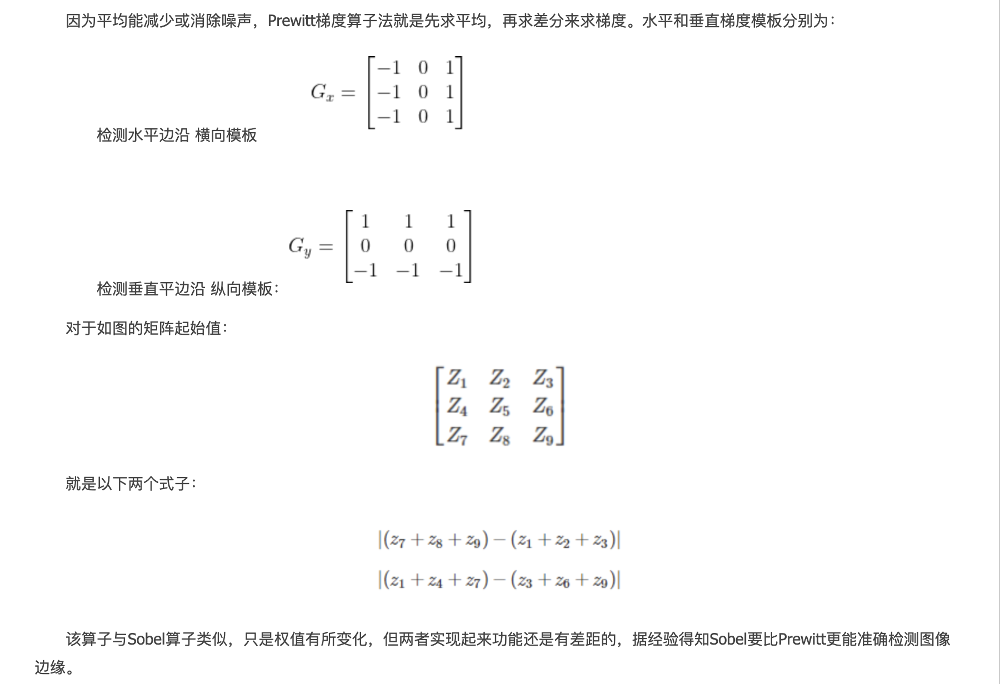

# 图像处理(梯度计算/边缘检测/图像变换)

下面主要介绍

* 图像梯度计算&边缘检测：Sobel算子，scharr算法，Laplacian算子，Canny算子
* 图像直方图 & 直方图均衡化
* 图像变换：傅里叶变换，高通滤波，低通滤波
* 图像几何变换：图像缩放，图像旋转，图像翻转，图像平移，仿射变换，镜像变换，透视变换

​       

# 一 图像梯度计算&边缘检测

内容：

* 一阶微分算子：Roberts交叉梯度算子 / Prewitt算子 / Sobel算子 / Isotropic Sobel算子 / Scharr算子
* 二阶微分算子：Laplacian算子 / LOG算子
* 非微分边缘检测算子：Canny算子

​    

## 1 边缘检测的定义和类型

边缘检测是图像处理和计算机视觉的基本问题，边缘检测的目的是**标识数字图像中亮度变化明显的点，图像属性中的显著变化通常反映了属性的重要事件和变化**，即包括 **深度上的不连续**，**表面方向的不连续**，**物质属性变化**和**场景照明变化**。边缘检测是图像处理和计算机视觉中，尤其是特征提取中的一个研究领域，其次**图像边缘检测大幅度的减少了数据量，并且剔除了可以认为不相关的信息，保留了图像重要的结构属性**。

在实际的图像分割中，往往只用到一阶和二阶导数，虽然原理上可以用更高阶的导数，但是因为噪声的影响，在纯粹二阶的导数操作中就会出现对噪声的敏感现象，三阶以上的导数信息往往失去了应用价值。二阶导数还可以说明灰度突变的类型，且在某些情况下，如灰度变化均匀的图像，只利用一阶导数可能找不到边界，此时二阶导数就能提供很有用的信息。**二阶导数对噪声也比较敏感**，解决的方法是**先对图像进行平滑滤波，消除部分噪声，再进行边缘检测**。不过，利用二阶导数信息的算法是基于过零检测的，因此得到的边缘点数比较少，有利于后继的处理和识别工作。

边缘类型，简单分为**阶跃型**，**屋脊型**，**斜坡型**，**脉冲型**四种类型，其中阶跃型和斜坡型是类似的，只是变化的快慢不同。

<div align="center"></div>

人类视觉系统认识目标的过程分为两步：

* 首先，把图像边缘与背景分离出来；
* 然后，才能知觉到图像的细节，辨认出图像的轮廓；

计算机视觉正是模仿人类视觉的这个过程，因此在检测物体边缘时，先对其轮廓点进行粗略检测，然后通过链接规则把原来检测到的轮廓点连接起来，同时也检测和连接遗漏的边界点及去除虚假的边界点。**图像的边缘是图像的重要特征**，是计算机视觉、模式识别等的基础，因此边缘检测是图象处理中一个重要的环节。然而，边缘检测又是图象处理中的一个难题，由于**实际景物图像的边缘往往是各种类型的边缘及它们模糊化后结果的组合**，且**实际图像信号存在着噪声**，其次噪声和边缘都属于高频信号，很难用频带做取舍。

这就需要边缘检测来进行解决的问题了，其中边缘检测的基本方法有很多，如一阶的有Roberts Cross算子，Prewitt算子，Sobel算子，Krisch算子，罗盘算子；而二阶的还有Marr-Hildreth算子（又称为LOG算子），在梯度方向的二阶导数过零点，而Canny算子属于非微分边缘检测算子。各种算子的存在就是对这种导数分割原理进行的实例化计算，是为了在计算过程中直接使用的一种计算单位。在对图像的操作，**采用模板对原图像进行卷积运算**，从而达到想要的效果。而获取一幅图像的梯度就转化为：**模板（Roberts、Prewitt、Sobel、Lapacian算子）对原图像进行卷积**。

如下图来对这些算子进行比较：

<div align="center"></div>

​       

## 2. 一阶微分算子

Python中，filter2D函数主要是**利用内核实现对图像的卷积运算**，convertScaleAbs() 函数计算绝对值：

```python
dst = filter2D(src, ddepth, kernel[, dst[, anchor[, delta[, borderType]]]])
"""
参数解释：
    src 输入图像
    dst 输出的边缘图，其大小和通道数与输入图像相同
    ddepth 目标图像所需的深度
    kernel 卷积核，一个单通道浮点型矩阵
    anchor 内核的基准点，其默认值为（-1，-1），位于中心位置
    delta 在储存目标图像前可选的添加到像素的值，默认值为0
    borderType 边框模式
"""

dst = convertScaleAbs(src[, dst[, alpha[, beta]]])
"""
参数解释：
    src 原数组
    dst 输出数组，深度为8位
    alpha 比例因子（伸缩系数）
    beta 原数组元素按比例缩放后添加的值, 即是加到结果上的一个值
"""

dst = cv2.addWeighted(src1, alpha, src2, beta, gamma[, dst[, dtype]])
"""
参数解释：
	alpha 第一幅图片中元素的权重
	beta 第二个的权重
	gamma 加到最后结果上的一个值
"""
```

​     

### 2.1 Roberts交叉梯度算子

Roberts 算子又称为交叉微分算子，它是基于交叉差分的梯度算法，通过局部差分计算检测边缘线条，常用来**处理具有陡峭的低噪声图像，当图像边缘接近于正 45 度或负 45 度时，该算法处理效果更理想**。其缺点是**对边缘的定位不太准确，提取的边缘线条较粗**。

1）**算子原理**

<div align="center"></div>

<div align="center"></div>

2）**Roberts算子模版**

Python中，Roberts算子主要通过 **Numpy 定义模板**，再调用 OpenCV的 **filter2D() 函数实现边缘提取**，，最终通过  convertScaleAbs() 和 addWeighted() 函数实现边缘提出。

filter2D函数主要是**利用内核实现对图像的卷积运算**，其函数原型如下所示：

```python
# 使用示例
# Step1: 灰度化处理图像
grayImage = cv2.cvtColor(img, cv2.COLOR_BGR2GRAY)

# Step2: Roberts算子
kernelx = np.array([[-1, 0], [0, 1]], dtype=int)
kernely = np.array([[0, -1], [1, 0]], dtype=int)
x = cv2.filter2D(grayImage, cv2.CV_16S, kernelx)
y = cv2.filter2D(grayImage, cv2.CV_16S, kernely)

# Step3: 转uint8
absX = cv2.convertScaleAbs(x)
absY = cv2.convertScaleAbs(y)
Roberts = cv2.addWeighted(absX, 0.5, absY, 0.5, 0)
```

数学计算代码实现：

```python
saber  = cv2.imread("construction.jpg")
# 首先将原图像进行边界扩展，并将其转换为灰度图。
gray_saber = cv2.cvtColor(saber,cv2.COLOR_RGB2GRAY)
gray_saber = cv2.resize(gray_saber,(200,200))
 
# Roberts模板计算
def RobertsOperator(roi):
    operator_first = np.array([[-1,0],[0,1]])
    operator_second = np.array([[0,-1],[1,0]])
    return np.abs(np.sum(roi[1:,1:]*operator_first))+np.abs(np.sum(roi[1:,1:]*operator_second))
 
def RobertsAlogrithm(image):
    image = cv2.copyMakeBorder(image,1,1,1,1,cv2.BORDER_DEFAULT)
    for i in range(1,image.shape[0]):
        for j in range(1,image.shape[1]):
            image[i,j] = RobertsOperator(image[i-1:i+2, j-1:j+2])
    return image[1:image.shape[0],1:image.shape[1]]
 
Robert_saber = RobertsAlogrithm(gray_saber)
plt.imshow(Robert_saber,cmap="binary")
plt.axis("off")
plt.show()
```

​        

### 2.2 Prewitt算子

Prewitt 是一种图像边缘检测的微分算子，其原理是**利用特定区域内像素灰度值产生的差分实现边缘检测**，由于 Prewitt 算子采用 3 * 3 模板对区域内的像素值进行计算，而Robert算子的模板是 2 * 2，故 Prewitt 算子的边缘检测结果在水平方向和垂直方向均比 Robert 算子更加明显，Prewitt算子适合用来识别噪声较多，灰度渐变的图像。

1）**算子原理**

<div align="center"></div>

<div align="center"></div>

2）**Prewitt算子模版**

Python中，Prewitt 算子的实现过程与 Roberts 算子比较相似，即通过 Numpy定义模板，再调用OpenCV的 filter2D() 函数对图像的卷积运算，最终通过  convertScaleAbs() 和 addWeighted() 函数实现边缘提出。

```python
# 使用示例
# Step1: 灰度化处理图像
grayImage = cv2.cvtColor(img, cv2.COLOR_BGR2GRAY)
  
# Step2: Prewitt算子
kernelx = np.array([[1,1,1],[0,0,0],[-1,-1,-1]],dtype=int)
kernely = np.array([[-1,0,1],[-1,0,1],[-1,0,1]],dtype=int)
x = cv2.filter2D(grayImage, cv2.CV_16S, kernelx)
y = cv2.filter2D(grayImage, cv2.CV_16S, kernely)

# Step3: 转uint8
absX = cv2.convertScaleAbs(x)      
absY = cv2.convertScaleAbs(y)   
Prewitt = cv2.addWeighted(absX,0.5,absY,0.5,0)
```

数学计算代码实现：

```python
saber  = cv2.imread("construction.jpg")
# 首先将原图像进行边界扩展，并将其转换为灰度图。
gray_saber = cv2.cvtColor(saber,cv2.COLOR_RGB2GRAY)
gray_saber = cv2.resize(gray_saber, (200,200))
 
def PreWittOperator(roi, operator_type):
    if operator_type == "horizontal":
        prewitt_operator = np.array([[-1, -1, -1], [0, 0, 0], [1, 1, 1]])
    elif operator_type == "vertical":
        prewitt_operator = np.array([[-1, 0, 1], [-1, 0, 1], [-1, 0, 1]])
    else:
        raise ("type Error")
    result = np.abs(np.sum(roi * prewitt_operator))
    return result
 
def PreWittAlogrithm(image, operator_type):
    new_image = np.zeros(image.shape)
    image = cv2.copyMakeBorder(image, 1, 1, 1, 1, cv2.BORDER_DEFAULT)
    for i in range(1, image.shape[0] - 1):
        for j in range(1, image.shape[1] - 1):
            new_image[i - 1, j - 1] = PreWittOperator(image[i - 1:i + 2, j - 1:j + 2], operator_type)
    new_image = new_image * (255 / np.max(image))
    return new_image.astype(np.uint8)
  
plt.title("vertical")
# plt.imshow(PreWittAlogrithm(gray_saber,"horizontal"),cmap="binary")
plt.imshow(PreWittAlogrithm(gray_saber,"vertical"),cmap="binary")
plt.axis("off")
plt.show()
```

Prewitt对噪声的敏感性：

```python
# 不同噪声
def noisy(noise_typ, image):
    if noise_typ == "gauss":
        row,col,ch= image.shape
        mean = 0
        var = 0.1
        sigma = var**0.5
        gauss = np.random.normal(mean,sigma,(row,col,ch))
        gauss = gauss.reshape(row,col,ch)
        noisy = image + gauss
        return noisy
    elif noise_typ == "s&p":
        row,col,ch = image.shape
        s_vs_p = 0.5
        amount = 0.004
        out = np.copy(image)
        num_salt = np.ceil(amount * image.size * s_vs_p)
        coords = [np.random.randint(0, i - 1, int(num_salt))
              for i in image.shape]
        out[coords] = 1
        num_pepper = np.ceil(amount* image.size * (1. - s_vs_p))
        coords = [np.random.randint(0, i - 1, int(num_pepper)) for i in image.shape]
        out[coords] = 0
        return out
    elif noise_typ == "poisson":
        vals = len(np.unique(image))
        vals = 2 ** np.ceil(np.log2(vals))
        noisy = np.random.poisson(image * vals) / float(vals)
        return noisy
    elif noise_typ =="speckle":
        row,col,ch = image.shape
        gauss = np.random.randn(row,col,ch)
        gauss = gauss.reshape(row,col,ch)
        noisy = image + image * gauss
        return noisy
```

**注**：水平梯度或垂直梯度对于边缘的影响有一定的差异

​     

### 2.3 Sobel算子

Sobel算子是一种用于边缘检测的离散微分算子，它结合了高斯平滑和微分求导，主要用于**计算图像明暗程度近似值**，即可**根据图像边缘旁边明暗程度把该区域内超过某个数的特定点记为边缘**。Sobel 算子在Prewitt算子的基础上增加了权重的概念，认为相邻点的距离远近对当前像素点的影响是不同的，距离越近的像素点对应当前像素的影响越大，从而实现图像锐化并突出边缘轮廓。

Sobel算子的边缘定位更准确，常用于噪声较多，灰度渐变的图像。

1）**算子原理**

<div align="center"></div>

<div align="center"></div>

2）**Sobel算子模版**

Sobel算子依然是一种过滤器，只是其是带有方向的，在OpenCV-Python中，使用Sobel的算子的函数原型如下：

```python
dst = cv2.Sobel(src, ddepth, dx, dy[, dst[, ksize[, scale[, delta[, borderType]]]]])

"""
参数解释：前四个是必须的参数, 其后是可选的参数
	dst 输出的边缘图，其大小和通道数与输入图像相同
	src 需要处理的图像
	ddepth 图像的深度，-1表示采用的是与原图像相同的深度。目标图像的深度必须大于等于原图像的深度；
	dx和dy 表示的是求导的阶数，dx表示x方向上的差分阶数，取值为1或者0，dy表示y方向上的差分阶数，取值为1或0，0表示这个方向上没有求导，一般为0、1
	
	ksize Sobel算子的大小，其值必须是正数和奇数，通常为1、3、5、7
	scale 缩放导数的比例常数，默认情况下没有伸缩系数
	delta是一个可选的增量，将会加到最终的dst中，同样，默认情况下没有额外的值加到dst中；
	borderType 判断图像边界的模式, 这个参数默认值为cv2.BORDER_DEFAULT。
"""
```

**注意**：在进行Sobel算子处理之后，还需要调用convertScaleAbs() 函数计算绝对值，并将图像转换为8位图像进行显示。原因是sobel算子求导的话，白到黑是正数，但是黑到白就是负数了，所有的负数都会被截断为0，所以要取绝对值。

```python
img = cv2.imread("D:/lena.jpg", 0)
  
x = cv2.Sobel(img,cv2.CV_16S,1,0)
y = cv2.Sobel(img,cv2.CV_16S,0,1)
  
absX = cv2.convertScaleAbs(x)   # 转回uint8
absY = cv2.convertScaleAbs(y)
  
dst = cv2.addWeighted(absX,0.5,absY,0.5,0)
```

**解释**：在Sobel函数的第二个参数这里使用了cv2.CV_16S，因为OpenCV文档中对Sobel算子的介绍中有这么一句“in the case of 8-bit input images it will result in truncated derivatives”，即Sobel函数求完导数后会有负值，还有会大于255的值，而原图像是uint8，即8位无符号数，所以Sobel建立的图像位数不够，会有截断，因此要使用16位有符号的数据类型，即cv2.CV_16S。

其次，在经过处理后，别忘了用convertScaleAbs()函数将其转回原来的uint8形式，否则将无法显示图像，而只是一副灰色的窗口。

**分别计算图像的x和y方向的sobel算子，再求和**与**直接计算x和y方向的sobel算子**的区别：

```python
img = cv2.imread('circle.jpg', cv2.IMREAD_GRAYSCALE)
 
# 白到黑是正数，黑到白就是负数，所有的负数都会被截断成0，所以要取绝对值
sobelx = cv2.Sobel(img, cv2.CV_64F, 1, 0, ksize=3)
sobelxAbs = cv2.convertScaleAbs(sobelx)
 
sobely = cv2.Sobel(img, cv2.CV_64F, 0, 1, ksize=3)
sobelyAbs = cv2.convertScaleAbs(sobely)
 
# 分别计算x和y，再求和
slbelxy = cv2.addWeighted(sobelx, 0.5, sobely, 0.5, 0)
 
 
# 不建议直接计算，这里尝试直接计算，看看效果
sobelxy1 = cv2.Sobel(img, cv2.CV_64F, 1, 1, ksize=3)
sobelxy1 = cv2.convertScaleAbs(sobelxy1)

result = [img, sobelxAbs, sobelyAbs, slbelxy, sobelxy1]
titles = ['origin img', 'sobel x img', 'sobel y img', 'sobel x-y img', 'sobel xy img']
```

效果：可看出分开计算效果会比直接计算效果好

<div align="center"></div>

数学计算代码实现：

```python
saber  = cv2.imread("construction.jpg")
gray_saber = cv2.cvtColor(saber,cv2.COLOR_RGB2GRAY)
gray_saber = cv2.resize(gray_saber,(200,200))
 
def SobelOperator(roi, operator_type):
    if operator_type == "horizontal":
        sobel_operator = np.array([[-1, -2, -1], [0, 0, 0], [1, 2, 1]])
    elif operator_type == "vertical":
        sobel_operator = np.array([[-1, 0, 1], [-2, 0, 2], [-1, 0, 1]])
    else:
        raise ("type Error")
    result = np.abs(np.sum(roi * sobel_operator))
    return result
 
 
def SobelAlogrithm(image, operator_type):
    new_image = np.zeros(image.shape)
    image = cv2.copyMakeBorder(image, 1, 1, 1, 1, cv2.BORDER_DEFAULT)
    for i in range(1, image.shape[0] - 1):
        for j in range(1, image.shape[1] - 1):
            new_image[i - 1, j - 1] = SobelOperator(image[i - 1:i + 2, j - 1:j + 2], operator_type)
    new_image = new_image * (255 / np.max(image))
    return new_image.astype(np.uint8)

plt.title("vertical")
# plt.imshow(SobelAlogrithm(gray_saber,"horizontal"),cmap="binary")
plt.imshow(SobelAlogrithm(gray_saber,"vertical"),cmap="binary")
plt.axis("off")
plt.show()
```

或者

```python
#_*_coding:utf-8_*_
from PIL import Image
from PIL import ImageEnhance
from numpy import *
from pylab import *
from scipy.ndimage import filters
 
image1 = Image.open('construction.jpg').convert('L')
im = array(image1)
# soble 导数滤波器  使用 Sobel 滤波器来计算 x 和 y 的方向导数，
imx = zeros(im.shape)
# print(imx)
filters.sobel(im,1,imx)
 
imy = zeros(im.shape)
filters.sobel(im,0,imy)
 
magnitude = sqrt(imx**2 + imy**2)
# print(magnitude)
def deal_with(a):
    for i in range(len(a)):
        if a[i] <50:
            a[i] =0
        elif a[i] >200:
            a[i] =255
        # else:
        #     a[i] = 155
    return a

a = np.apply_along_axis(deal_with,1,magnitude)
result =  contour(magnitude, origin='image')
axis('equal')
axis('off')
figure()
hist(magnitude.flatten(),128)
show()
```

​         

### 2.4 Isotropic Sobel算子

Sobel算子另一种形式是（Isotropic Sobel）算子，加权平均算子，权值反比零点与中心店的距离，当沿不同方向检测边缘时梯度幅度一致，就是通常所说的各向同性Sobel（Isotropic Sobel）算子。模板也有两个，一个是检测水平边沿的 ，另一个是检测垂直平边沿的 。各向同性Sobel算子和普通Sobel算子相比，它的位置加权系数更为准确，在检测不同方向的边沿时梯度的幅度一致。

​     

### 2.5 Scharr算子

Scharr算子与Sobel算子的不同点是在平滑部分，这里所用的平滑算子是 1/16 * [3, 10, 3]，相比于 1/4 * [1, 2, 1]，中心元素占的权重更重，这可能是相对于图像这种随机性较强的信号，领域相关性不大，所以邻域平滑应该使用相对较小的标准差的高斯函数，也就是更瘦高的模板。

由于Sobel算子在计算相对较小的核的时候，其近似计算导数的精度比较低，比如一个3 * 3的Sobel算子，当梯度角度接近水平或垂直方向时，其不精确性就越发明显。Scharr算子同Sobel算子的速度一样快，但是准确率更高，尤其是计算较小核的情景，所以利用3 * 3滤波器实现图像边缘提取更推荐使用Scharr算子。

Scharr算子又称为**Scharr滤波器**，也是计算x或y方向上的图像差分，在OpenCV中主要配合Sobel算子的运算而存在的，下面对比一下Sobel算子和scharr算子的核函数对比：

<div align="center"></div>

​      

Scharr算子和Sobel算子类似，在OpenCV-Python中，使用Scharrl的算子的函数原型如下：

```python
dst = cv2.Scharr(src, ddepth, dx, dy[, dst[, ksize[, scale[, delta[, borderType]]]]])

"""
参数说明: 前四个是必须的参数, 其后是可选的参数
	dst 输出的边缘图，其大小和通道数与输入图像相同
	src 需要处理的图像
	ddepth 图像的深度，-1表示采用的是与原图像相同的深度。目标图像的深度必须大于等于原图像的深度
	dx和dy表示的是求导的阶数，dx 表示x方向上的差分阶数，取值为1或者0，dy表示y方向上的差分阶数，取值为1或0，0表示这个方向上没有求导，一般为0、1。
	
	ksize Sobel算子的大小，其值必须是正数和奇数，通常为1、3、5、7。
	scale 缩放导数的比例常数，默认情况下没有伸缩系数；
	delta 一个可选的增量，将会加到最终的dst中，同样，默认情况下没有额外的值加到dst中；
	borderType 判断图像边界的模式。这个参数默认值为cv2.BORDER_DEFAULT。
"""
```

注意：在进行Scharr算子处理之后，也需要调用convertScaleAbs() 函数计算绝对值，并将图像转换为8位图像进行显示。原因是sobel算子求导的话，白到黑是正数，但是黑到白就是负数了，所有的负数都会被截断为0，所以要取绝对值。

```python
img = cv2.imread("durant.jpg", 0)
img = cv2.resize(img, (0, 0), fx=0.5, fy=0.5)
 
sobel_x = cv2.Sobel(img, cv2.CV_16S, 1, 0)
sobel_y = cv2.Sobel(img, cv2.CV_16S, 0, 1)
scharr_x = cv2.Scharr(img, cv2.CV_16S, 1, 0)
scharr_y = cv2.Scharr(img, cv2.CV_16S, 0, 1)
 
sobel_absX = cv2.convertScaleAbs(sobel_x)  # 转回uint8
sobel_absY = cv2.convertScaleAbs(sobel_y)
scharr_absX = cv2.convertScaleAbs(scharr_x)  # 转回uint8
scharr_absY = cv2.convertScaleAbs(scharr_y)
 
Sobel_dst = cv2.addWeighted(sobel_absX, 0.5, sobel_absY, 0.5, 0)
Scharr_dst = cv2.addWeighted(scharr_absX, 0.5, scharr_absY, 0.5, 0)
 
sobel_image = np.hstack((sobel_absX, sobel_absY, Sobel_dst))
scharr_image = np.hstack((scharr_absX, scharr_absY, Scharr_dst))
all_image = np.vstack((sobel_image, scharr_image))
cv2.imshow("Result", all_image)
 
cv2.waitKey(0)
cv2.destroyAllWindows()
```

效果：可以很明显的看出求x轴和y轴方向梯度的差异

| 效果1                                                   | 效果2                                                    |
| ------------------------------------------------------- | -------------------------------------------------------- |
|  |  |

​      

### 2.6 Sobel & Robert & Prewitt算子比较

算子差异：

* **Sobel算子**：滤波算子的形式来提取边缘，X，Y方向各用一个模板，两个模板组合起来构成一个梯度算子。X方向模板对垂直边缘影响最大，Y方向模板对水平边缘影响最大
* **Robert算子**：一种梯度算子，它用交叉的差分表示梯度，是一种利用局部差分算子寻找边缘的算子，对具有陡峭的低噪声的图像效果最好
* **Prewitt算子**：加权平均算子，对噪声有抑制作用，但是像素平均相当于对图像进行的同滤波，所以prewitt算子对边缘的定位不如robert算子

​     

## 3 二阶微分算子

### 3.1 Laplacian算子

拉普拉斯（Laplacian）算子是 n 维欧几里得空间中的一个二阶微分算子，常用于图像增强领域和边缘提取，它通过灰度差分计算领域内的像素。

1）**算子原理**

Laplacian算子基本流程是：**判断图像中心像素灰度值与它周围其他像素的灰度值，如果中心像素的灰度更高，则提升中心像素的灰度；反之降低中心像素的灰度，从而实现图像锐化操作**。

在算法实现过程中，Laplacian算子通过对邻域中心像素的四方向或八方向求梯度，再将梯度相加起来判断中心像素灰度与邻域内其他像素灰度的关系，最后通过梯度运算的结果对像素灰度进行调整。

<div align="center"></div>

<div align="center"></div>

<div align="center"></div>

2）**Laplacian算子模版**

Python和OpenCV 将Laplacian算子封装在Laplacian()函数中，其函数原型如下所示：

```python
dst = Laplacian(src, ddepth[, dst[, ksize[, scale[, delta[, borderType]]]]])

"""
参数说明:
    src 输入图像
    dst 输出的边缘图，其大小和通道数与输入图像相同
    ddepth 目标图像所需的深度
    ksize 用于计算二阶导数的滤波器的孔径大小，其值必须是正数和奇数，且默认值为1，更多详细信息查阅getDerivKernels
    scale 计算拉普拉斯算子值的可选比例因子。默认值为1，更多详细信息查阅getDerivKernels
    delta 将结果存入目标图像之前，添加到结果中的可选增量值，默认值为0
    borderType 边框模式，更多详细信息查阅BorderTypes
"""

# 使用示例
# Step1: 读取图像
img = cv2.imread('lena.jpg')
lenna_img = cv2.cvtColor(img,cv2.COLOR_BGR2RGB)
 
# Step2: 灰度化处理图像
grayImage = cv2.cvtColor(img, cv2.COLOR_BGR2GRAY)
  
# Step3: 拉普拉斯算法
dst = cv2.Laplacian(grayImage, cv2.CV_16S, ksize = 3)
Laplacian = cv2.convertScaleAbs(dst)
```

**注意**：Laplacian算子其实主要是利用Sobel算子的运算，通过加上Sobel算子运算出的图像x方向和y方向上的导数，得到输入图像的图像锐化结果。同时，在进行Laplacian算子处理之后，还需要调用convertScaleAbs()函数计算绝对值，并将图像转换为8位图进行显示。

数学计算代码实现：

```python
saber  = cv2.imread("construction.jpg")
# 首先将原图像进行边界扩展，并将其转换为灰度图。
gray_saber = cv2.cvtColor(saber,cv2.COLOR_RGB2GRAY)
gray_saber = cv2.resize(gray_saber,(200,200))
 
 
def LaplaceOperator(roi, operator_type):
    if operator_type == "fourfields":
        laplace_operator = np.array([[0, 1, 0], [1, -4, 1], [0, 1, 0]])
    elif operator_type == "eightfields":
        laplace_operator = np.array([[1, 1, 1], [1, -8, 1], [1, 1, 1]])
    else:
        raise ("type Error")
    result = np.abs(np.sum(roi * laplace_operator))
    return result
 
def LaplaceAlogrithm(image, operator_type):
    new_image = np.zeros(image.shape)
    image = cv2.copyMakeBorder(image, 1, 1, 1, 1, cv2.BORDER_DEFAULT)
    for i in range(1, image.shape[0] - 1):
        for j in range(1, image.shape[1] - 1):
            new_image[i - 1, j - 1] = LaplaceOperator(image[i - 1:i + 2, j - 1:j + 2], operator_type)
    new_image = new_image * (255 / np.max(image))
    return new_image.astype(np.uint8)
```

PIL库实现的代码：

```python
import numpy as np
from PIL import Image
import matplotlib.pyplot as plt
import matplotlib.cm as cm
import scipy.signal as signal     # 导入sicpy的signal模块
 
# Laplace算子
suanzi1 = np.array([[0, 1, 0],
                    [1,-4, 1],
                    [0, 1, 0]])
 
# Laplace扩展算子
suanzi2 = np.array([[1, 1, 1],
                    [1,-8, 1],
                    [1, 1, 1]])
 
# 打开图像并转化成灰度图像
image = Image.open("construction.jpg").convert("L")
image_array = np.array(image)
 
# 利用signal的convolve计算卷积
image_suanzi1 = signal.convolve2d(image_array,suanzi1,mode="same")
image_suanzi2 = signal.convolve2d(image_array,suanzi2,mode="same")
 
# 将卷积结果转化成0~255
image_suanzi1 = (image_suanzi1/float(image_suanzi1.max()))*255
image_suanzi2 = (image_suanzi2/float(image_suanzi2.max()))*255
 
# 为了使看清边缘检测结果，将大于灰度平均值的灰度变成255(白色)
image_suanzi1[image_suanzi1>image_suanzi1.mean()] = 255
image_suanzi2[image_suanzi2>image_suanzi2.mean()] = 255
```

​      

### 3.2 LOG算子

LOG（Laplacian of Gaussian）边缘检测算子是David Courtnay Marr和 Ellen Hildreth在 1980年共同提出，也称为 Marr & Hildreth算子，它根据图像的信噪比来求检测边缘的最优滤波器。

1）**算子原理**

<div align="center"></div>

实现

```python
img = cv2.imread("durant.jpg")
rgb_img = cv2.cvtColor(img, cv2.COLOR_BGR2RGB)
img = cv2.cvtColor(img, cv2.COLOR_BGR2GRAY)
 
# 先通过高斯滤波降噪
gaussian = cv2.GaussianBlur(img, (3, 3), 0)
 
# 再通过拉普拉斯算子做边缘检测
dst = cv2.Laplacian(gaussian, cv2.CV_16S, ksize=3)
LOG = cv2.convertScaleAbs(dst)
```

​     

## 4 非微分边缘检测算子：Canny算子

### 4.1 Canny算子边缘检测基本原理

Canny边缘检测是一种比较新的边缘检测算子，具有很好地边缘检测性能，该算子功能比前面几种都要好，但是它实现起来较为麻烦，Canny算子是一个**具有滤波，增强，检测的多阶段的优化算子**，在进行处理前，Canny算子先利用高斯平滑滤波器来平滑图像以除去噪声，Canny分割算法采用一阶偏导的有限差分来计算梯度幅值和方向，在处理过程中，Canny算子还将经过一个非极大值抑制的过程，最后Canny算子还采用两个阈值来连接边缘（高低阈值输出二值图像）。

边缘检测通常是在保留原有图像属性的情况下，对图像数据规模进行缩减，提取图像边缘轮廓的处理方式：

* 1）图象边缘检测必须满足两个条件：一能有效地抑制噪声；二必须尽量精确确定边缘的位置
* 2）根据对信噪比与定位乘积进行测度，得到最优化逼近算子。这就是Canny边缘检测算子
* 3）类似与Marr（LoG）边缘检测方法，也属于先平滑后求导数的方法

​     

### 4.2 Canny算子的算法步骤

Canny算法是一种被广泛应用于边缘检测的标准算法，其目标是**找到一个最优的边缘检测解或找寻一幅图像中灰度强度变换最强的位置**，其中最优边缘检测主要通过低错误率，高定位性和最小响应三个标准进行评价。

Canny算子的实现步骤如下：

* step1: 用高斯滤波器平滑图象；
* step2: 计算图像中每个像素点的梯度强度和方向（用一阶偏导的有限差分来计算梯度的幅值和方向）；
* step3: 对梯度幅值进行非极大值抑制（Non-Maximum Suppression），以消除边缘检测带来的杂散响应；
* step4: 用双阈值算法(Double-Threshold)检测来确定真实和潜在的边缘，通过抑制孤立的弱边缘最终完成边缘检测；


