# NLP - GPT模型

**GPT**（Generative Pre-trained Transformer）是OpenAI开发的一系列基于Transformer架构大型自然语言处理模型，这一系列的模型可以在非常复杂的NLP任务中取得非常惊艳的效果，例如文章生成，代码生成，机器翻译，Q&A等，且完成这些任务并不需要有监督学习进行模型微调。其次，对于一个新的任务，GPT仅仅需要非常少的数据便可以理解这个任务的需求并达到接近或者超过state-of-the-art的方法。

当然，如此强大的功能并不是一个简单的模型能搞定的，GPT模型的训练需要超大的训练语料，超多的模型参数以及超强的计算资源。GPT系列的模型结构秉承了 **不断堆叠transformer模型的思想，通过不断的提升训练语料的规模和质量，提升网络的参数数量来完成GPT系列的迭代更新的**。GPT也证明了，通过不断的提升模型容量和语料规模，模型的能力是可以不断提升的。

| 模型                | 发布时间      | 参数量    | 预训练数据量 |
| ------------------- | ------------- | --------- | ------------ |
| GPT                 | 2018 年 6 月  | 1.17 亿   | 约 5GB       |
| GPT-2               | 2019 年 2 月  | 15 亿     | 40GB         |
| GPT-3               | 2020 年 5 月  | 1,750 亿  | 45TB         |
| GPT3.5 ChatGPT | 2020 年 11 月 | 1,750 亿  | --           |
| GPT-4               | 2023 年 3 月  | 1-1.7万亿 | --           |
| ... ...             |               |           |              |

​     

# 一 GPT：无监督学习

在GPT-1之前，传统的NLP模型往往**使用大量的数据对有监督的模型进行任务相关的模型训练**，但是这种有监督学习的任务存在两个缺点：

> 1）**大量的标注数据**，但高质量的标注数据往往很难获得，因为在很多任务中，图像的标签并不是唯一的或者实例标签并不存在明确的边界；
>
> 2）根据一个任务训练的模型**很难泛化**到其它任务中，这个模型只能叫做“领域专家”，而不是真正的理解了NLP；

​      

而GPT思想则是先通过**在无标签的数据上学习一个生成式的语言模型，然后再根据特定热任务进行微调**，处理的有监督任务包括：

> 1）**自然语言推理**（Natural Language Inference 或者 Textual Entailment）：判断两个句子是包含关系（entailment）/ 矛盾关系（contradiction）/ 中立关系（neutral）；
>
> 2）**问答和常识推理**（Question answering and commonsense reasoning）：类似于多选题，输入一个文章，一个问题以及若干个候选答案，输出为每个答案的预测概率；
>
> 3）**语义相似度**（Semantic Similarity）：判断两个句子是否语义上市是相关的；
>
> 4）**分类**（Classification）：判断输入文本是指定的哪个类别；

因此，这种将无监督学习左右有监督模型的预训练目标的方法，称为 生成式预训练（Generative Pre-training，GPT）。

​     

## 1 GPT-1架构

GPT-1语言模型是基于 “半监督” 方法创建的，其训练过程包括两个阶段：

* **无监督预训练**：在大型文本语料库上学习高容量语言模型，使用语言模型来设置初始参数；
* **有监督模型微调**：调整模型参数以适应当前任务

​    

### 1.1 无监督预训练（Unsupervised Pre-Training）

GPT-1的无监督预训练是基于语言模型进行训练的，即给定一个无监督的语料tokens序列 ***U*** = {*u*(1), *u*(2), ..., *u*(n)}，模型的优化目标是**最大化下面的似然值**：

其中，k是滑动窗口的大小， ***P*** 是条件概率， Θ 是模型的参数，这些参数使用随机梯度下降方法（stochastic gradient descent, SGD）进行优化。

预训练模型使用多层（12层） Transformer 作为解码器，且每层Transformer使用多头掩码自注意力机制处理输入的上下文token词（PS：掩码的使用使模型看不见下文信息，使模型泛化能力更强），然后通过全连接位置前馈层得到输出目标词token的概率分布。

其中，***U*** = {*u*(−k), . . . , *u*(−1)} 是当前时间片的上下文token， n 是transformer层数， ***W***(*e*)是词token嵌入矩阵，  ***W***(*p*)是位置嵌入矩阵。

​      

### 1.2 有监督模型微调（ Supervised fine-tuning）

当得到无监督的预训练模型之后，将输出值直接应用到有监督任务中。若假设对于一个有标签的数据集 ***C***，每个实例有 m 个输入token词  {*x(1)*, *x(2)*, ..., *x(m)*} ，标记为 *y* 标签，后将这些token输入到训练好的预训练模型中，得到最终的特征向量 *h*，最后经过一个参数为 ***W***(*y*) 线性全连接层得到预测结果  ***y*** ：

因此，有监督的目标则是最大化上式的值

然后研究发现将语言建模作为微调的辅助目标将有助于学习，即不仅可提升监督模型的泛化能力，也可加速模型收敛。因此，作者并没有直接使用 ***L***2作为目标函数，而是向其中加入了 ***L***1 ，且使用 λ 当作任务权重值（ λ 的值一般为 0.5 ）：

因此，当进行有监督微调时，只需要训练输出层的 ***W***y 和分隔符（delimiter）的嵌入值即可。

​      

## 2 任务相关的输入变换

已知GPT-1可以处理的4类不同的任务，但这些任务有的只有一个输入，有的则有多组形式的输入。为此，对于不同的任务输入，GPT-1有不同的处理方式，即：

> 1）**分类任务**：将起始和终止token加入到原始序列两端，输入transformer中得到特征向量，最后经过一个全连接得到预测的概率分布；
>
> 2）**自然语言推理**：将前提（premise）和假设（hypothesis）通过分隔符（Delimiter）隔开，两端加上起始和终止token。再依次通过transformer和全连接得到预测结果；
>
> 3）**语义相似度**：输入的两个句子，正向和反向各拼接一次，然后分别输入给transformer，得到的特征向量拼接后再送给全连接得到预测结果；
>
> 4）**问答和常识推理**：将 n 个选项的问题抽象化为 n 个二分类问题，即每个选项分别和内容进行拼接，然后各送入transformer和全连接层中，最后选择置信度最高的作为预测结果;

​       

## 3 GPT-1的性能&数据集

在有监督学习的12个任务中，GPT-1在9个任务上的表现超过了state-of-the-art的模型，而且在没有见过数据的zero-shot任务中，GPT-1的模型要比基于LSTM的模型稳定，且随着训练次数的增加，GPT-1的性能也逐渐提升，即表明GPT-1有非常强的泛化能力，能够用到和有监督任务无关的其它NLP任务中。

其次，GPT-1证明了transformer对学习词向量的强大能力，在GPT-1得到的词向量基础上进行下游任务的学习，能够让下游任务取得更好的泛化能力，且对于下游任务的训练，GPT-1往往只需要简单的微调便能取得非常好的效果。

> ***GPT-1的数据集***
>
> BooksCorpus数据集，包含 7,000 本没有发布的书籍
>
> 选择该数据集原因：
>
> 1. 数据集拥有**更长的上下文依赖关系**，使得模型能学得更长期的依赖关系；
> 2. 这些书籍因为没有发布，所以很难在下游数据集上见到，更**能验证模型的泛化能力**；

​      

# 二 GPT-2：多任务学习

GPT-2于2019年发布，目标旨在**训练一个泛化能力更强的词向量模型**，但它并没有对GPT-1的网络进行过多的结构的创新与设计，只是使用了更多的网络参数和更大的数据集（15亿个参数）。其次，GPT-2在自然语言理解和生成方面也取得了显著的进步，实现了多种任务，如机器翻译、摘要生成和问答等，然而GPT-2也引发了关于生成虚假信息和恶意内容的潜在风险的讨论，因此OpenAI最初并未公开发布完整的GPT-2模型。

​     

## 1 GPT-2 & 语言模型

### 1.1 什么是语言模型?

在之前的整理的 [NLP - 预处理模型](9）NLP - 预训练模型.md) 和 [NLP - WordEmbedding](3）NLP - WordEmbedding.md) 均有大致介绍什么是语言模型，其其实就是一个能根据一部分句子内容预测下一个单词的机器学习模型，而最常见的的语言模型大概就是手机输入法，它能根据你当前输入的内容提示下一个字或者词。

从这个角度说，可以称GPT-2是一个类似于输入法的预测下一个单词的模型，但是它比输入法更大更智能。而且GPT-2是在一个叫WebText（Reddit上高赞的文章）的40GB的巨大数据集（约800万篇文章）上训练的，这个数据集是OpenAI的工作者从网上收集的，同时为了避免和测试集的冲突，WebText移除了涉及Wikipedia的文章。

其次，从存储空间来看，手机输入法只需要几十MB的空间，但是GPT-2最小的模型就需要500MB来存储它的参数，而最大的GPT-2模型是它的13倍，需要6.5GB的存储空间来存储其参数。

​         

### 1.2 Transformer 语言模型

从之前整理的 [NLP - Transformer模型](6）NLP - Transformer模型.md) 中已经知晓，Transformer架构是一个由 Encoder-Decoder构架组成的，且编码器Encoder和解码器Decoder都是由多个Transformer组件堆叠成的。其次，现有机器翻译工作正是将一个文本序列翻译为另一种语言的文本序列，因此Transformer的seq2seq结构很适合用于机器翻译任务。

但在随后的大量研究工作中，研究者发现一些语言模型任务，其实并不需要完整的Encoder-Decoder结构也可以很好完成任务。因此，在某些模型内仅使用Transformer架构中的 Encoder或Decoder结构，并将尽可能多的组件堆叠起来，然后使用大量的文本语料和计算资源进行预训练（一些语言模型需要小几十万美元，AlphaStar可能需要数百万美元）。

***那么可以将Transformer组件堆得多高呢？***

> 我们来看下GPT2不同模型大小所堆叠的组件层数差异
>
> 

其次，从下图可知，虽然BERT和GPT-2都使用Transformer架构，但两者差异点在于 GPT-2仅使用了 Encoder结构进行训练（自编码语言模型, AE），而GPT-2是仅用了Decoder结构进行训练（自回归语言模型, AR）。其次，还有关键差异点是，GPT-2和传统的语言模型一样，一次只输出一个token。

例如：让一个训练好的GPT-2输出机器人第一定律

> *A robot may not injure a human being or, through inaction, allow a human being to come to harm.*

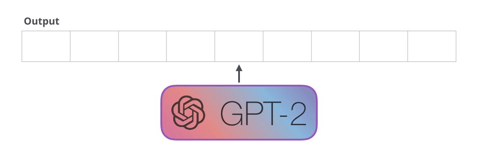

而且，模型**在生成每个token之后，这个token会被添加到输入序列中组成新序列，且新序列会被作为模型下一步的输入**，因而这种训练方式的模型也被称为 “**自动回归**”（auto-regression）语言模型，同时这也正是RNNs模型中的一个异常有效的方法机制。

目前，GPT2 / TransformerXL和XLNet等后续相关模型本质上都是自回归模型，但BERT模型不是，它是一种自编码类语言模型，而这也是一种权衡，即去掉自回归后，BERT 能够整合左右两边的上下文，从而获得更好的结果。之后 XLNet 重新使用了自回归，但也同时也找到一种能够结合两边的上下文方法（详情可参考 [NLP - XLNet模型.md](8）NLP - XLNet模型.md)）。

​      

### 1.3 Transformer 模型演变

[Transformer模型](https://arxiv.org/abs/1706.03762)论文介绍了两种类型的transformer组件：Encoder 和 Decoder

#### 1.3.1 Encoder组件

原Transformer论文中的Encoder组件仅接受特定长度的输入（如 512 个 token），且如果一个输入序列比这个限制短，则可以使用 \<pad> 填充序列的其余部分。如下图

​     

#### 1.3.2 Decoder组件

与 Encoder 组件相比，在结构上有一个很小的差异，即Decoder组件多了一个Encoder-Decoder self-attention层，使编码器可以注意到编码器编码的特定的信息。

其次，与Encoder组件自注意层（Self-Attention）不同的是，Decoder组件的掩码-自注意层（Masked Self-Attention）会屏蔽当前token之后内容，具体来说，不像 BERT 那样直接将当前token置换为 `[mask]`，而是在自注意力层的计算过程中**通过一些方法阻止自注意力计算当前token位置右侧的内容**（即未来的单词信息）。

例如：如果现在计算第四个单词，模型的注意力只能关注到前四个词

所以不同于BERT模型的自注意逻辑，BERT在关注计算某位置的时候是允许模型关注其右边的信息，而GPT-2模型的掩码-自注意逻辑则是不允许其关注当前token到右侧信息。

​         

#### 1.3.3 Transformer-Decoder结构

在Transformer论文之后，[Generating Wikipedia by Summarizing Long Sequences](https://arxiv.org/pdf/1801.10198.pdf) 提出了另一种能够进行语言模型训练的 Transformer 模块的布局，即该模型丢弃了 Transformer 的 Encoder组件，称之为 “Transformer-Decoder” 结构，且这个早期的基于transformer的语言模型由六个 decoder组件组成，如下图：

> OpenAI的GPT-2就是这种仅使用解码器组件的Transformer模型
>
> 虽然原Transformer模型输入长度限制512个tokens，但现在该模型其实可接受的输入序列长度为4000个tokens

需要注意的是，虽然该结构中的Decoder组件和原始Transformer结构的Decoder组件非常相似，但其实Transformer-解码器结构中是去掉了原第二个自注意力层（Encoder-Decoder self-attention）。 其次，[Character-Level Language Modeling with Deeper Self-Attention](https://arxiv.org/pdf/1808.04444.pdf) 这篇文章也研究了一个类似结构，但创建该模型每次仅能预测一个字或词。

​    

### 1.4 GPT-2架构

接下来内容介绍过程中，有几个点需要注意一下：

> 1. 下文没有明确区分 “words” 和 “tokens” 的概念，但是实际上GPT-2 使用 **Byte Pair Encoding** 创建单词表的tokens，而这意味着GPT-2中token是word的一部分；
> 2. 下文用的示例都是GPT的推理、评估模式，这就是为什么一次只处理一个单词，而在实际训练的时候**GPT-2是可以对长文本序列进行并行处理的**，所以同样在训练时候，不同于评估时候batch为1，GPT-2可以处理的batch大小为512；
> 3. 为了更好安排文章图像的空间，原文对一些向量表示进行了转置和简化，但在模型执行的时候必须更精确，注意区分；
> 4. Transformers 使用大量的**层归一化**（layer normalization），但本节内容主要讲解的是Self-Attention的应用，因此归一化过程不再过多阐述；

​       

#### 1.4.1 概述

现在来简单看一下训练好的GPT-2是如何工作的：

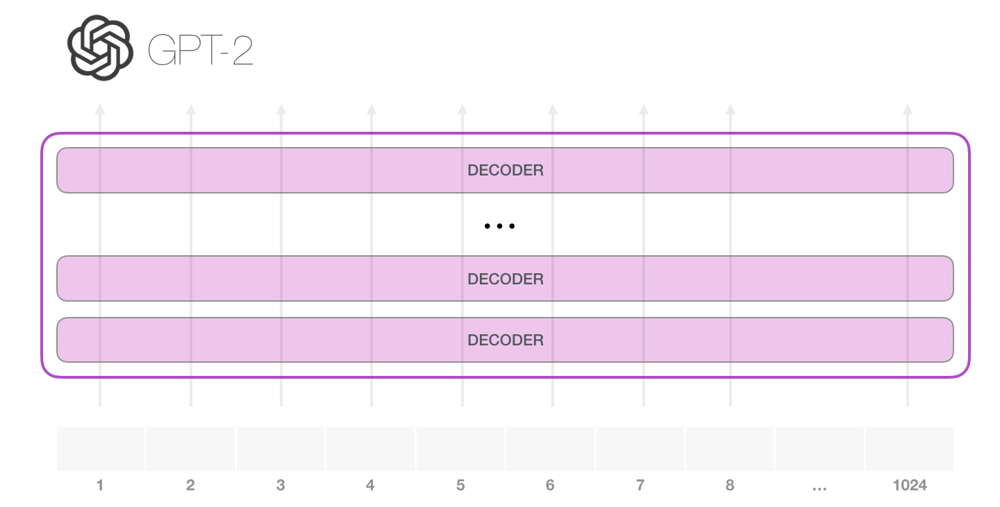

一般情况下，GPT-2 能够处理 1024 个 token，且每个token会沿着模型计算路径经过所有Decoder组件。其次，如果想要运行一个已经训练好的的GPT-2模型，最简单的方法是让它自己运行生成文本（称之为 “**生成式无条件样本**”），或也可以给模型输入一个提示（prompt），让它围绕一个特定的主题topic生成文本（称之为 “**生成式交互式条件样本**”）。甚至在无限制的情况下，只需要给模型输入一个初始 token，让模型开始自动生成文本，通常训练好的模型使用 `<|endoftext|>` 作为开始token，但本文暂时用 `<s>` 来代替。

如上图，由于模型只有一个输入token，因此只有一条活跃路径，而后这个token在所有Decoder层中依次被处理，然后沿着该路径生成一个向量，而后根据这个向量和模型词汇表给所有可能的词计算出一个分数（PS：模型知道所有的单词，且在 GPT-2 中是 50000 个词），例如在这个例子中，模型选择输出量概率最高的单词 `the`。

> **需要注意的是**：这里有一个小问题，即如果在输入法里不断点击提示单词，它有时会陷入重复，就是会一直都显示同样的文字，而唯一的解决办法就是切换点击第二个或第三个建议的单词，而这种情况同样也会发生在GPT-2模型允许过程中。
>
> 

>
> 而为了能够解决这个问题，GPT-2模型提供了一个 **top-k** 参数，即可通过设置此参数（top-k != 1）让模型采样除最高概率单词以外的其它单词，即如果 top-k =1时，得到的结果就是上述所说的问题。
>
> PS：**Top-k就是进行束搜索，如果设置束搜索的宽度是k，则当k=1的时候会退化成贪心算法，每次采样概率最高的单词**

其次，当获取到第一个步输出结果后，模型会把第一步的输出添加到模型的输入序列，然后让模型重复上一步计算操作开始下一个词的预测：

但这里需要注意的是，此时第二条路径仍是模型计算中唯一活动的路径，且GPT-2 的每一层都保留了它对当前token的所有编码信息（后续自注意部分详细介绍），并且会在处理下一个 token 时直接使用它，但GPT-2 不会根据第下一个 token 重新计算当前 token内容。

至此，模型不断重复上述步骤，即可生成更多的单词文本。

​      

#### 1.4.2 输入编码 Input Encoding

与其他 NLP 模型一样，GPT-2模型的输入也是从模型词汇表的embedding矩阵中查找输入词token的embedding向量，即如下图每一行代表着每个词token的 embedding向量以及捕获的一些含义，其次在不同的 GPT-2 模型中向量大小是不一致的，比如最小模型的 embedding 大小是 768，最大达到1600。

> 注：模型词汇表的Embedding矩阵是预训练模型输出结果的一部分内容

因此在开始执行任务时，模型会在embedding矩阵查找第一个 token **\<s>** 的 embedding向量，并在把这个向量 传给模型的第一个模块之前，加上对应的位置编码信息，其作用主要是给Transformer组件指示该单词在输入序列中的位置。

> PS：位置编码矩阵也是GPT-2模型的一部分，它包含输入中1024个位置的每个位置编码向量；
>
> 其次，GPT-2可接受的最大输入长度是1024，而Transformer可接受的最大输入长度是512

至此可知，GPT-2模型在将输入词交给第一个Transformer组件之前，会先利用已训练好的模型输出的2个权重矩阵，即词汇表Embedddings矩阵和位置编码矩阵，计算得到**输入词的表示向量**（词embeddding向量 + 位置编码）。

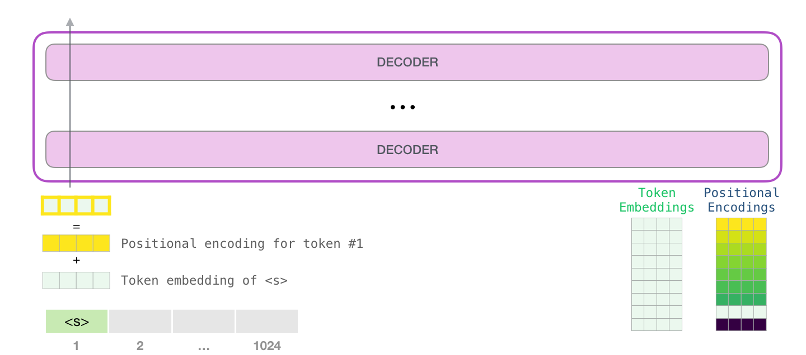

​        

#### 1.4.3 Decoder组件处理：Masked Self-Attention

上一小节了解了模型输入是如何编码的，那接下来我们看一下模型的多层Transformer-Decoder组件是如何处理经过编码后的输入序列的。

> **大致流程：**
>
> 如下图，当第一个词token的输入编码信息经过Self-Attention层处理后，再经过前馈神经网络层（FFN）处理，最后再将FFN计算得到的结果向量作为下一层decoder组件的输入，经过12层Decoder组件不断处理即可得到最终的输出结果。
>
> 

>
> PS：虽然模型中每个组件的处理流程都是一样的，但每个组件的自注意力层和神经网络层**权重占比**可能不一致

了解大致Decoder组件处理流程后，接下来看一下其中 Self-Attention 的具体处理过程。

​       

##### self-attention机制回顾

再介绍GPT-2模型的Self-Attention处理过程之前，先来回顾一下self-attention机制	

例子：

> **机器人第2定律**
>
> A robot must obey the orders given **it** by human beings except where **such orders** would conflict with the **First Law** .

如上述例句中包含了多个代词，如果不结合上下文，模型基本无法理解或者处理这些词，所以当模型处理这个句子时，它必须能够知道：

> **it** 指的是机器人
>
> **such orders** 指的是这个定律的前面部分，也就是 人给予 它 的命令
>
> **First Law**  指的是机器人第一定律

因此，模型中self-attention所做的事情就是通过**对句子片段中每个词的相关性打分**，并将这些**词的表示向量根据相关性加权求和**，从而让模型能够将词和其他相关词向量的信息融合起来。

比如：如下图，当处理 “it” 的时候，self-attention 机制会关注到词语 “a robot”，而后经过self-attention计算，得到表示这3个**单词对应向量与各自attention分数加权和的 it 向量**，最后传递给下一步的后续神经网络进一步处理。

​     

​	  

##### self-attention处理过程

Self-Attention 处理过程实际是沿着输入序列中每个 token 进行处理的，涉及以下 3 个向量：

* **Query**：是指当前token的向量表示形式，用于对所有其他token（key）进行评分，且模型只需要关注当前正在处理的token的query；
* **Key**：可以看做是输入序列中所有token的标签，是在模型找到相关单词时的对照物；
* **Value**：单词的实际表示，即一旦模型对输入序列中每个单词的相关度打分之后，通过计算与序列中其他词value向量的加权和，即可得到用来表示当前正在处理的单词的value向量；

> ***向量理解***
>
> 一个简单的比喻是（如下图），就像在文件柜里找文件一样
>
> * query就像一张你拿着一张**便签**，上面写着要找的主题
> * key就像是柜子里**文件夹的标签**，当你找到与便利贴上相关的标签的时候，取出该文件夹，
> * 而value向量则表示的是**文件夹中的内容**
>
> 当然模型要找的不是一个文件，而是一组相关文件
>
> 

​      

将Query向量乘以Key向量即可得到文件夹的 **相关度分数Score**（实现上就是两个向量点积之后softmax）

最后，再将每个 Value 向量乘以对应的分数，然后将所有分数求和，就可得到 Self Attention 的输出结果

如上图的例子中，**Value向量加权和** 计算得到了一个结果向量，该向量表示的是它 **将50%注意力放在 “robot” 这个词上，将30%注意力放在 “a” 这个词上，将19%的注意力放在“it”这个词上**。

而所谓的Masked self attention指的的是：**将mask位置对应的的attention score变成一个非常小的数字或者0，让其他单词再self attention的时候（加权求和时）不考虑这些单词**。

​             

#### 1.4.4 模型输出 Output

当模型顶部的Decoder层产出输出向量时（经过 Self Attention 层和神经网络层处理后得到），模型会将这个向量乘以词汇表的embedding矩阵（模型预训练输出结果）计算出当前词向量和所有单词embedding向量的相关得分。

然后，我们知道embedding矩阵中的每一行对应词汇表中的一个单词，因此乘法结果可以认为是**当前单词结果对整个词汇表的打分**。

> PS：类比attention打分结果，query和key点乘结果是**注意力分散**，而这里 输出结果和embedding矩阵相乘可以认为是输出对embedding矩阵进行打分。

至此，模型当然可以直接从中选出分数最高的那个词（top_k=1）作为输出结果，但是考虑到其他词汇可能会取得更好的结果，因此通常一个更好的策略是把分数作为被选中词token的**概率**，并从整个列表中通过**加权随机采样**的方法抽取出一个单词作为输出结果。其次，一种折衷策略是把参数 top_k 设置为 40，让模型仅考虑得分最高的 40 个词token。

> Q：**为什么更好的策略是对分数进行加权随机采样** ？
>
> 采用加权采样的方法，得分高的token被选中的概率更高，但还是有一定的随机性，因此可以认为是从top-k中抽取一个词，即可保证性能的同时减小模型的计算开销。
>
> 其次，试想一下，如果模型使用贪心策略不一定能得到最好的结果，使用束搜索设置top-k=40又要消耗一定的空间和计算资源，因此随机加权采样确实可以看作是相对更好的方法。

这样，模型就完成了一次迭代，最终输出了一个单词，而后模型继续迭代，直到生成整个上下文（**GPT-2序列上限1024个token**）或直到生成序列结束的token `<e>`。

​        

### 1.5 GPT-2 核心思想

GPT-2的学习目标是**使用无监督的预训练模型做有监督的任务**。因为文本数据的时序性，一个输出序列可以表示为一系列条件概率的乘积：

当然上式也可以表示为p(s[n−k], ..., s[n]|s[1], ..., s[n−k−1])，它的实际意义是根据已知的上文 *input* = {s[1], s[2], ..., s[n−k−1]} 预测未知的下文  *output* = {s[n−k], ..., s[n]} ，因此语言模型可以表示为 *p(output|input)*。因此，对于一个有监督的任务，它可以建模为 *p(output|input, task)*，其次在decaNLP中提出的MQAN模型可以将机器翻译，自然语言推理，语义分析，关系提取等10类任务统一建模为一个分类任务，而无需再为每一个子任务单独设计一个模型。

基于上面的思想，研究认为当一个语言模型的容量足够大时，它就足以覆盖所有的有监督任务，也就是说**所有的有监督学习都是无监督语言模型的一个子集**。例如：当模型训练完 “Micheal Jordan is the best basketball player in the history” 语料的语言模型之后，便也学会了（question：“who is the best basketball player in the history ?”，answer: “Micheal Jordan”）的Q&A任务。

综上，GPT-2的核心思想概括为：**任何有监督任务都是语言模型的一个子集，当模型的容量非常大且数据量足够丰富时，仅仅靠训练语言模型的学习便可以完成其它有监督学习的任务**。

​     

## 2 图解Self-Attention

上文简单了解了Self Attention如何处理输入序列中单词 `it`：

接下来我们详细介绍一下这一过程是如何实现的。

> **注意**：接下来的图解过程会用到很多 **“向量”** 来图解算法机制，而实际代码实现是使用 **矩阵** 进行计算的，这个分析过程是想让读者了解在处理过程中每个单词发生了什么，因此本文的重点是对单词级（word-level）处理逻辑进行解析。

​     

### 2.1 Self-Attention

让我们先来看看一个简单的Transformer，假设它一次只能处理 4 个 token，那么模型中Self-Attention 主要通过 3 个步骤来实现：

1. 为每个路径创建 Query、Key、Value 矩阵；
2. 对于每个输入的 token，使用它的 Query 向量为所有其他的 Key 向量进行打分；
3. 将 Value 向量乘以它们对应的分数后求和

​       

#### 2.1.1 生成Q / K / V 向量

Self-Attention计算的第一步就是要计算出每个路径的Query、Key、Value三个向量。

> **现在我们只关注第一个路径**，而且暂时先不管什么是Multi-Head Self-Attention，只考虑Self-Attention，也就是只有一个head的情况，如下图：
>
> 1）模型一次处理四个tokens，每个token都有它单独的路径，其中第一路径指的是 **X1** 这个token；
>
> 2）对于每个token来说，对应的Query、Key、Value是三个向量，而在实际代码计算中是使用整个输入序列的矩阵；
>
> 3）获得Query、Key、Value三个向量的方法是 **每个单词的表示向量和对应的权重矩阵{ *W(Q)*, *W(K)*, *W(V)*} 做矩阵乘法得到**；
>
> 

​    

#### 2.1.2 计算Attention Score

现在模型已经有了Query、Key、Value三个向量，在第二步只需要用到Query和Key向量。

**由于现在关注的是第一个token**，所以将第一个token的Query和其他token的key向量做**点乘**，这样计算会得到与每一个token的注意力分数。

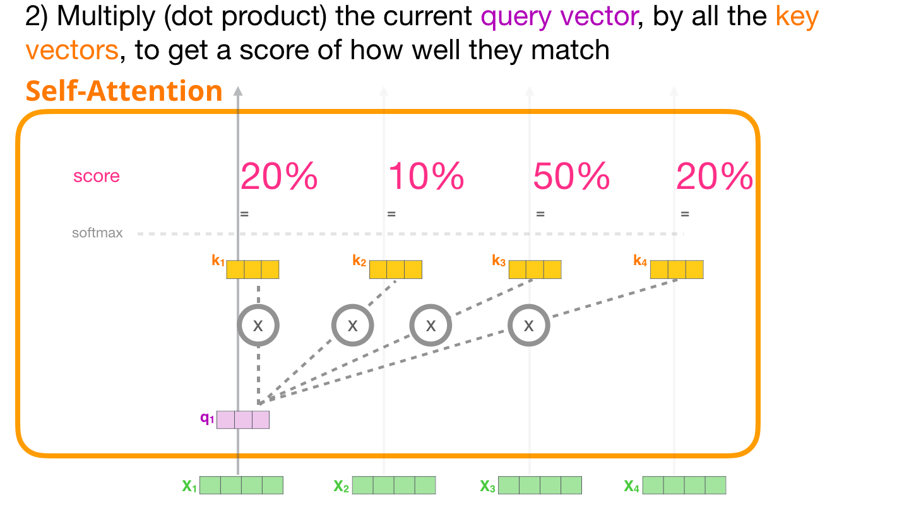

​      

#### 2.1.3 加权求和Sum

而后将上一步得到的每个token注意力分数乘以其对应的Value向量，并将相乘之后的结果加起来得到第一个token的Attention结果向量。

现在对于每个token，将上一步得到的注意力分数乘以Value向量。将相乘之后的结果加起来，那些注意力分数大的占比会更大。

> Attention结果向量：**一个具有高分数的 Value 向量会占据结果向量的很大一部分**
>
> 如下图，注意力分数乘以每个Value向量，原作者用不同深浅的蓝色的框框表示计算之后的结果，可以看到V3比较显眼，而V2几乎看不到了，而后将计算结果（V1 ~ V4）加起来得到Z1，其中Z1就是X1的**新表示向量**，注意新向量**除了单词本身，还涵盖了上下文其他token的信息**。
>
> 这一过程可以认为**注意力分数就是表示不同单词重要性的权重，而整个自注意力计算就是求所有token的加权和，这一过程可以引入其他token的表示，让当前token获得上下文信息**。
>
> 

之后，模型对每个token都进行相同的操作，最终会得到每个token新的表示向量，新向量中包含该token的上下文信息，最后将这些数据传给Transformer组件的下一个子层（前馈神经网络）：

​      

### 2.2 Masked Self-Attention

现在我们已经了解了Transformer中普通的Self-Attention机制，让我们接下来看看Masked Self-Attention机制是如何处理的，而实际上除了第二步计算注意力分数的时有点差异，这2个机制的处理过程基本一致。

现在假设模型有2个 token 作为输入，然后模型正在观察（处理）第二个 token，在这种情况下，最后 2 个 token 是被屏蔽（masked）的，所以模型就可以通过这种方式实现对**评分的干预**，即让下文（未输入）的token的注意力得分为0，这样下文token就不会影响当前token的计算，而且当前token的注意力只会关注到在它之前输入的tokens。

> PS：通常这种屏蔽以矩阵的形式实现，称为**注意力屏蔽**（Attention Mask）

依旧以4个单词的输入序列为例（例如：**robot must obay orders**）。现在假设**每个单词都是一个token**，则在语言建模场景中，每个单词需要一个步骤处理，因此这个序列的处理包含四个处理步骤。其次，由于模型通常是以批量batch size 的形式进行处理的，假设现在模型的批量大小为4（batch_size = 4），那么模型将会把整个序列作为一个batch进行处理。

> **注意**：单词word 不一定等于 token，这是由分词方式决定的。

但由于token无法直接计算注意力分数，因此此时我们需要通过将 **Query向量乘以Key矩阵 **的方式来计算对应的注意力分数。

乘法运算后，为了能够屏蔽掉当前还未输入的词，模型将计算得到的注意力分数加一个上三角形矩阵（attention mask矩阵），即一般是将我们想要屏蔽的位置设置为 −∞ 或一个非常大的负数（GPT-2中的为负一亿）。

最后，对屏蔽后的分数矩阵中每一行进行softmax归一化，从而可以得到模型需要的注意力分数：

> 如下图，归一化后的分数表的含义：
>
> * Step1：只输入一个词 “robot”。当模型处理数据集中的第 1 个数据（score矩阵第 1 行），由于其中只包含一个单词 “robot”，所以模型的注意力100%集中在这个单词上；
> * Step2：如果输入序列 “robot must ”。当模型处理第二个单词 “must” 时（score矩阵第2行），模型 48%的注意力会放在 “robot” 上，而52%的注意力会放在 “must“ 上；
> * 以此类推，模型继续处理后面的单词……
>
> 

​      

### 2.3 GPT-2：Masked Self-Attention

接下来让我们更详细地了解一下GPT-2中的Masked Self-Attention。

现在还是假设**模型做预测任务，每次处理一个 token**，而这就导致我们用模型进行预测的时候，模型在每次迭代后只添加一个新词，那么对于已经处理过的token来说，沿着之前的路径重新计算 Self Attention 是低效的。

> 因为一个训练好的模型，每个组件的权重矩阵是固定的，所以每次增加一个token都要重新计算整个输入序列的QKV的话会造成巨大的计算开销。
>
> 比如： “a robot must obey the rule”，如果第一次迭代时候只有 “a”，仅需要计算它的QKV，第二次迭代时候是 “a robot”，就需要计算二者的QKV。但是这样就重复计算了 “a” 的QKV。

​     

**那么GPT-2是如何实现高效处理的呢**？

假设现在处理输入序列的第一个token “a"（暂时忽略 "\<s>"）

之后，GPT-2会保留token “a” 的 Key 和 Value 向量，以便之后使用。

> **注意**：每个组件的自注意力层都有各自的Key和Value向量，不同的组件中Key和Value向量不共享

在下一次迭代中，当模型处理单词 “robot” 时，它不需要为 “a” 重新生成Query、Key、Value，而是直接用第一次迭代中保存的那些：

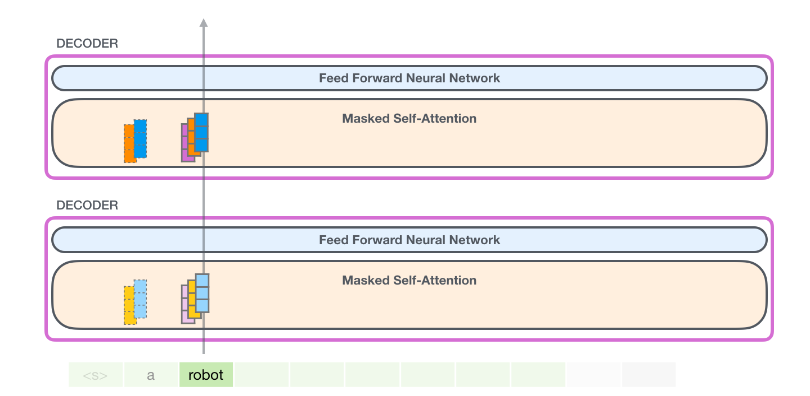

​      

#### 2.3.1 生成Q / K / V 矩阵

假设这个模型正在处理单词 "it"，则进入Decoder之前，这个 token 对应的输入就是 "it" 的 embedding + 第 9 个位置的位置编码：

首先，Slef-Attention 将 **输入编码向量乘以权重矩阵** （然后添加一个偏差bias向量，未画出）生成一个向量，而这个向量正是单词token  "it" 的Query、Key、Value 向量。

> PS：Transformer中的每个组件都有自己的权重矩阵，且多层组件间**权重矩阵**不共享

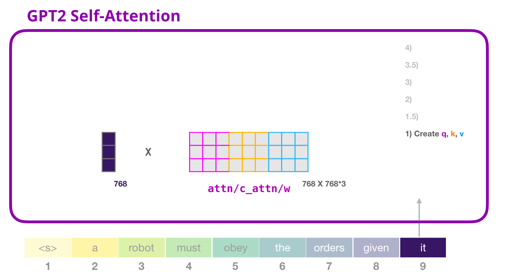

​     

其次，在之前的例子中，我们只专注于自注意力，忽略了 “多头”（muti-head）的部分，现在对这个概念做一些讲解对后面内容的理解是非常有帮助的。而实际上，muti-head 本质上就是将一个大向量拆分为多个小矩阵，即**将原来一个长的Query、Key、Value向量按照不同位置截取并拆分组成较小的矩阵**。

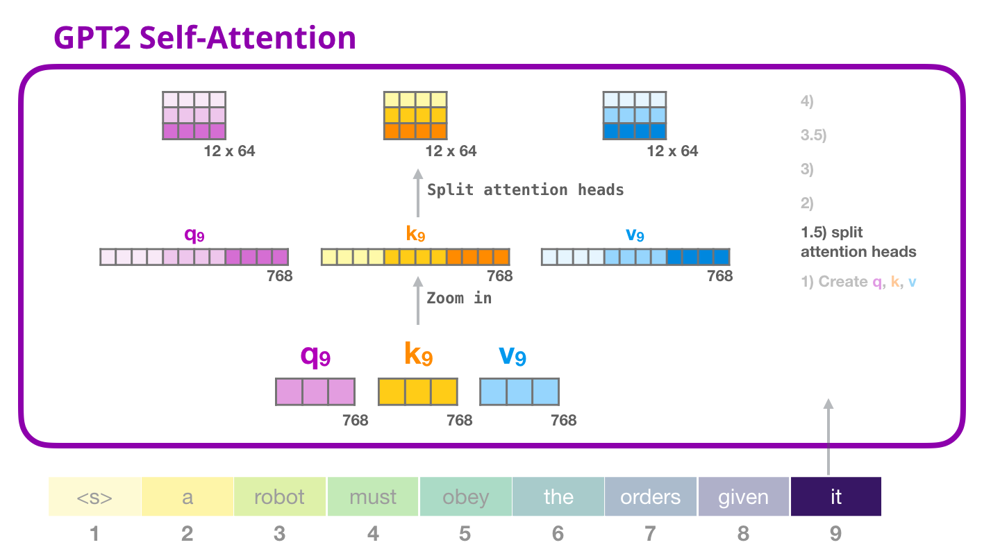

为了之后更好的理解multi head的注意力分数的计算过程，将Q/K/V简化成下图样式：

​    

#### 2.3.2 计算Attention Score

假设我们只关注一个 attention head（其他的 attention head 也是在进行类似的操作）：

而后，这个 token 可以根据其他所有 token 的 Key 向量进行评分（这些 Key 向量是**在前面一个迭代中的第一个 attention head #1 计算得到的**）：

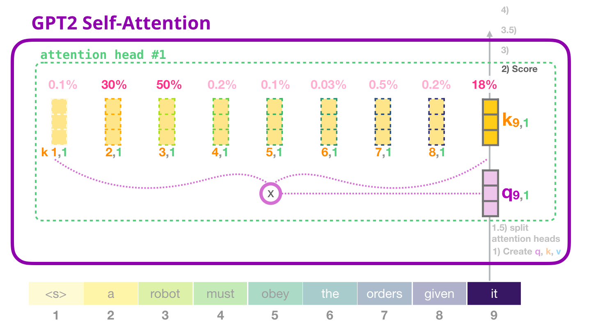

​        

#### 2.3.3 加权求和Sum

如之前介绍的一样，现在将每个Value与它的注意力分数相乘，然后将它们相加，从而可以得到 head #1的Self-Attention结果Z：

​         

#### 2.3.4 合并注意力头

不同的注意力头会得到不同的Z，而模型处理不同注意力头的方法是把不同的attention结果向量连接在一起

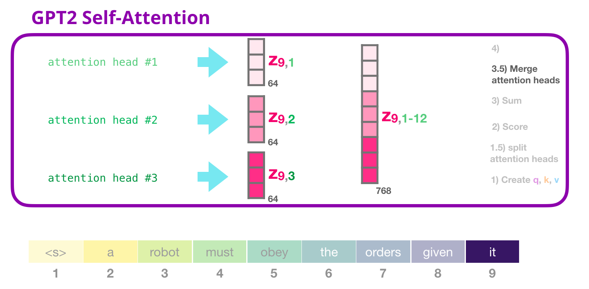

但是这个拼接结果向量不能直接透传给下一个子层，而是需要把这个**拼接向量再做一次映射projection，得到另一个同类表示**，即将得到的向量经过一个线性映射得到想要的维度，随后输入全连接网络。

​      

#### 2.3.5 映射projection

由于需要让模型学习到 **如何将自注意力的拼接结果更好地映射成前馈神经网络可以处理的向量** ，因此在将结果输入全连接网络前这里要做一步映射。

> 注意：
>
> 1）映射过程用到了模型的 **第二大权重矩阵**，主要是将自注意力的拼接结果映射为自注意力子层的输出向量。然后，既然这有一个权重，那模型训练过程中肯定要学啊，学这个权重矩阵的目的就是为了让模型能把**自注意力计算之后拼接的那个矩阵** 映射到 **前馈神经网更好处理的矩阵**。
>
> 2）其次，下图 "Zoom out" 意思是维度没有变，只是用更少的格子来表示这个向量。

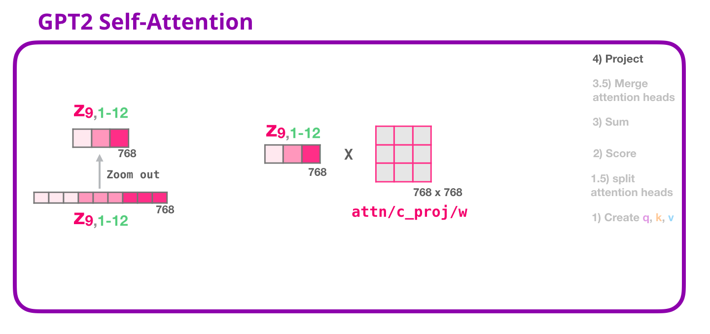

通过以上步骤产生了一个向量，从而可以把这个向量传给下一层：

​       

#### 2.3.6 全连接神经网络

**全连接神经网络的输入是Self-Attention层的输出，用于处理Self-Attention子层得到的token的新的表示，这个新的表示包含了原始token及其上下文的信息**。

\# **第一层网络**

全连接神经网络由两层组成，第一层是把向量转化到模型大小的4倍（因为GPT-2 small是隐状态大小是768，所以GPT-2中的全连接神经网络第一层会将其投影到768*4 = 3072个单位的向量中)。

> **为什么是四倍**？
>
> 原始Transformer的也是四倍（即Transformer模型的维度是 512，其全连接神经网络中第一个层的维度是 512 * 4 =2048），GPT-2模型也就没改，这似乎给了 Transformer 足够的表达能力，来处理目前的任务。
>
> PS：下图也未画出bias向量

​      

\# **第二层网络**

第二层**将第一层的结果再投射回模型的维度**（GPT-2 small为768），至此这个计算结果就是一个完整的Transformer组件（decoder）对token的处理结果。

​         

### 2.4 小结

上述处理过程遇到的权重矩阵（**注意每个Transformer组件都有自己的权重，组件之间权重不共享**）：

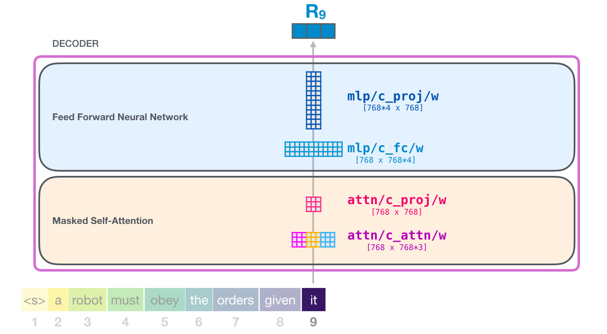

其次，模型只有 **一个 token embedding 矩阵 **和 **一个位置编码矩阵**。

​        

## 3 Transformer-Decoder模型应用

只有 Decoder 的 Transformer 在语言模型之外一直展现出不错的效果，且在许多应用场景中都取得了很好的效果。

### 3.1 机器翻译Machine Translation

进行机器翻译时，Encoder 不是必须的，可以用只有 Decoder 的 Transformer 来解决同样的任务

​        

### 3.2 摘要 Summarization

这是只有编码器的transformer训练的第一个任务，训练它阅读维基百科的文章（不包括目录前边的开头部分），前边的开头部分作为训练数据的标签。

> PS：维基百科构成是 “摘要（紫色区域）- 目录 - 正文（绿色区域）”，这里正文做训练文本，用摘要做标签

论文里针对维基百科的文章对模型进行了训练，因此这个模型能够总结文章，生成摘要：

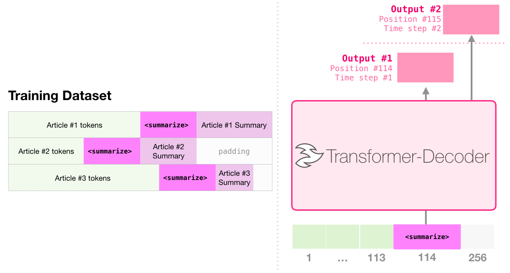

​       

### 3.3 迁移学习 Transfer Learning

在[《Sample Efficient Text Summarization Using a Single Pre-Trained Transformer》](https://arxiv.org/pdf/1905.08836.pdf)，只有解码器的transformer结构首先在语言模型上进行预训练，然后微调做摘要任务，结果证明在有限的数据设置中，它比预先训练的编码器-解码器变压器取得更好的结果，其次GPT-2的论文原文也展示了在语言建模上对模型进行预训练后做摘要任务的结果。

​     

## 4 GPT-2 性能

模型性能

> 1. GPT-2模型在8个语言模型任务中，仅仅通过zero-shot学习，就有7个超过了state-of-the-art的方法；
> 2. 在“Children's Book Test” 数据集上的命名实体识别任务中，超过了state-of-the-art的方法约7%；
> 3. “LAMBADA” 是测试模型捕捉长期依赖的能力的数据集，GPT-2将困惑度从99.8降到了8.6；
> 4. 在阅读理解数据中，GPT-2超过了4个baseline模型中的三个；
> 5. 在法译英任务中，GPT-2在zero-shot学习的基础上，超过了大多数的无监督方法，但是比有监督的state-of-the-art模型要差；
> 6. GPT-2在文本总结的表现不理想，但是它的效果也和有监督的模型非常接近。

​       

GPT-2的最大贡献是验证了**通过海量数据和大量参数训练出来的词向量模型，迁移到其它类别任务中而不需要额外的训练**。其次，很多实验也表明，GPT-2的无监督学习的能力还有很大的提升空间，甚至在有些任务上的表现不比随机的好。尽管在有些zero-shot的任务上的表现不错，但是仍不清楚GPT-2的这种策略究竟能做成什么样子，而且GPT-2表明随着模型容量和数据量的增大，其潜能还有进一步开发的空间，基于这个思想，诞生了GPT-3模型。

​                  

# 三 GPT-3：海量参数

GPT-3在2020年发布，是GPT模型的第三代。它的规模更大，拥有1750亿个参数，且GPT-3在各种任务上表现出色，例如摘要生成、翻译、问答、编程、诗歌创作等，同时模型还引入了强化学习，使其在学习过程中能够根据反馈优化自身表现。

​       

## 1 基础

在模型训练期间，模型会去学习大量文本内容，而后模型输出则是根据其在训练阶段“学习”过的这些内容生成的，且也可以选择给模型输入文本prompt，去影响模型的输出。

比如：给训练好的GPT-3模型输入一个 **prompt**（提示语），模型会给我们对应的输出

**训练**是将模型暴露于大量文本的过程，当然现阶段GPT-3模型已经训练好了，即目前网络上看到的所有基于GPT-3的实验都是用的已经训练好的GPT-3模型，而且据估计GPT-3训练使用的算力为355 GPU/年，成本460万美元，使用**无监督训练**，训练数据集高达3000亿个文本tokens。

举个例子，下图是使用顶上的文本TEXT生成的三个训练样本，从中可以看到模型如何在所有文本上滑动一个窗口，并生成很多例子：

我们给模型输入一个样本，而后将特征传递给模型，并要求它预测下一个单词，如果模型的输出是错的，会重新计算其预测的错误并更新模型，以求下次获得更好的预测，并这一过程会重复数百万次。

> **结合下图：**
>
> 可以看到灰色的GPT-3在这里代表一个没训练好的模型，每次给它输入样本的features，让其进行预测获得prediction，预测错误之后，模型会计算其预测的错误值和正确的标签（labels）之间的误差并更新模型，而后不断重复该步骤，直至最后获得一个训练好的GPT-3模型。
>
> 

​       

## 2 GPT-3 训练过程

已知上述提到的未训练的GPT-3模型在预训练过程，会不断根据预测结果和标签的误差重复更新模型，接下来详细地介绍一下这个需要重复的步骤。

GPT-3模型**实际上每次只生成一个token**，现在假设一个token就是一个单词，则其输出结果过程如下：

**注意**：下面介绍内容主要是对GPT-3模型工作原理的描述，重点不是讨论其创新点（巨大的模型结构），其模型实际的体系结构是基于这篇文章 [Generating Wikipedia by Summarizing Long Sequences](https://arxiv.org/pdf/1801.10198.pdf) 的Transformer的decoder模型。

GPT-3模型极其巨大，使用**1750亿个参数**对从训练中学到的内容进行编码，并将这些参数用于计算每次运行时生成的 token。其次，**未经训练的GPT-3模型参数是随机初始化的，其训练过程就是寻找参数值使其产生更好的输出的过程**。

实际上，这些参数是模型中数百个矩阵的一部分，所以模型的预测过程就是是大量的矩阵乘法运算。为了更新阐明这些参数是如何分布和使用的，接下来我们需要看一下模型的内部结构。

GPT3 输入的最大限制宽度是2048个 token，这同时也是它的 "**上下文窗口**"，这意味着它有2048个路径，每个token都要沿着这些路径进行处理。

其次，让我们看着下图紫色箭头的轨迹，简单看一下系统如何处理 "robot" 一词并输出预测单词 "A"的：

大致步骤：

> 1）将单词转换为表示单词的向量；
>
> 2）计算预测值；
>
> 3）将预测结果向量再转换回单词输出；

而GPT-3模型的计算其实是发生在**96个Transformer的decoder层**中（而GPT-2最大的规模应该是48层decoder），这大概就是“深度学习”中的“深度”吧，而且**每个decoder层都有单独的18亿参数**，也就是让GPT-3如此强大到玄幻的地方，计算流程如下：

虽然GPT-3 和 GPT-2模型中 Transformer Decoder结构基本一致，但不同的是GPT-3模型是交替使用 **稠密自注意力层** 和 **稀疏的自注意力层**。

下图是给定GPT-3输入并获得输出（“Okey human”）的流程，可以看到每个token是如何流经整个模型层的。其次，**模型并不关心第一个单词的输出是什么**，而后当输入的句子都经过模型层之后，模型开始输出其预测的第一个单词，这时候模型才会关心输出的token是什么，并将这个输出放回到模型输入中。

如下是代码生成的例子，即将用例和描述作为输入，并用特定的 token 将例子和结果分开，然后输入到模型中，然后模型会输出像这些粉色的token一样逐个生成出来。

GPT-3已经很令人惊艳了，而GPT-3微调模型性能可能会更加惊艳，即微调会更新模型的权重，使模型更适配于某一领域。

​      

## 3 总结

GPT-3引入了一种新的训练方法，称为“零次微调”（Zero-shot Learning），这意味着模型无需经过针对特定任务的微调，就可以直接处理多种任务。GPT-3通过在大量无标签文本数据上进行预训练，学习到了丰富的语言模式和知识。

**GPT3模型初衷：**

预训练时代 NLP 的典型方法是在不同下游任务上进行微调（fine-tuning），但是人类只需要几个示例或简单的说明就可以执行新的任务，而这潜在意思就是，大语言模型内部其实已经学到了所有这些能力，我们要做的是「合理」地去挖掘这些能力，而不是给一大批数据让它重新学习（fine-tuning）。

> 主要原因和意义：
>
> 1）每个新任务需要一批标注数据，这就限制了语言模型应用范围；
>
> 2）预训练-微调机制本身的问题：预训练模型时在大范围内获取信息，微调时则在非常窄的任务上，而且这种**虚假相关性随着模型表现力和训练分布的狭窄而增长**，换句话说，**模型能力很强，但被卡在特别窄的任务上，这种强其实是一种被放大的强，其泛化性可能很差**；
>
> 3）人类不需要一大批监督数据学习大多数的语言任务，我们往往会将多个任务和技能无缝混合或自由切换；

但这里有两个概念要先澄清一下：

1）**Meta-Learning**：训练时开发了一系列广泛的技能和模式识别能力，推理时使用这些能力快速适应或识别所需的任务；

2）**In-Context Learning**：使用预训练语言模型的文本输入作为任务范式的一种形式，以自然语言指令（instruction）或任务的一些样例为条件，期望通过预测接下来会发生什么来完成任务的下一个实例；

> In-Context Learning 的验证，使用了三种不同的 condition：
>
> * Few-Shot Learning：10-100 个样例（N=2048）作为上下文
> * One-Shot Learning：一个样例
> * Zero-Shot Learning：没有样例，只有一个自然语言指令（instruction）

​        

# ChatGPT / GPT-3.5

GPT-3.5作为GPT-3的升级版本，在模型性能和安全性方面进行了优化。GPT-3.5在模拟律师考试中的得分相较于GPT-3有了显著提升，排名在考生的倒数10%左右。这一进步表明GPT-3.5在特定任务上的表现有了显著改善。与此同时，OpenAI也在GPT-3.5中加强了对生成内容的安全性和可控性，减少了生成恶意信息和虚假内容的风险。

# GPT-4

GPT-4于2023年3月14日发布，是OpenAI努力扩展深度学习的最新里程碑。GPT-4是一个大型多模态模型（接受图像和文本输入，发出文本输出），虽然在许多现实世界场景中的能力不如人类，但在各种专业和学术基准上表现出人类水平的表现。例如，GPT-4通过模拟律师考试，分数在应试者的前10%左右；相比之下，GPT-3.5的得分在倒数10%左右。

OpenAI花了6个月的时间，使用对抗性测试程序和ChatGPT的经验教训迭代调整GPT-4，从而在真实性、可操纵性和拒绝超出护栏方面取得了有史以来最好的结果（尽管远非完美）。

# 强化学习在GPT模型中的应用

强化学习是一种机器学习方法，使智能体在与环境互动的过程中学习最优策略。从GPT-3开始，强化学习被用于优化模型的生成策略。通过使用强化学习，GPT模型可以根据给定的反馈（如奖励或惩罚）动态地调整其生成策略，以生成更高质量的文本内容。

例如，在对话生成任务中，如果生成的回答与预期答案相符，模型可以获得正向奖励；相反，如果回答不相关或不准确，模型会受到负向惩罚。通过强化学习，GPT模型可以在与环境的交互中不断改进，提高生成内容的质量和准确性。

​      

​          

# 附录

1. [GPT: Improving Language Understanding by Generative Pre-Training](https://s3-us-west-2.amazonaws.com/openai-assets/research-covers/language-unsupervised/language_understanding_paper.pdf)
2. [GPT2: Language models are unsupervised multitask learners](https://d4mucfpksywv.cloudfront.net/better-language-models/language_models_are_unsupervised_multitask_learners.pdf)
3. [Jay Alammar：The Illustrated GPT-2](https://jalammar.github.io/illustrated-gpt2/)
4. [图解GPT2](https://lolitasian.blog.csdn.net/article/details/125529598)
5. [GPT3: Language Models are Few-Shot Learners](https://arxiv.org/pdf/2005.14165.pdf)
6. [Generating Wikipedia by Summarizing Long Sequences](https://arxiv.org/pdf/1801.10198.pdf) 
7. [Jay Alammar：How GPT3 Works - Visualizations and Animations](https://jalammar.github.io/how-gpt3-works-visualizations-animations/)
8. [ChatGPT发展历程、原理、技术架构详解和产业未来 （收录于GPT-4/ChatGPT技术与产业分析）](https://zhuanlan.zhihu.com/p/590655677)
9. [预训练语言模型之GPT-1，GPT-2和GPT-3](https://zhuanlan.zhihu.com/p/350017443)
10. [GPT-4要来了！一文看尽大型语言模型的过去、现在、未来](https://wallstreetcn.com/articles/3683983)
11. [ChatGPT：发展历程、原理、技术架构和产业未来！](http://www.uml.org.cn/ai/202302164.asp)
12. [Illustrating Reinforcement Learning from Human Feedback (RLHF)](https://huggingface.co/blog/rlhf)
13. [关于Transformer模型中的各种细节详解](https://www.cnblogs.com/zjuhaohaoxuexi/p/15991787.html)

