# NLP - seq2seq模型

在⾃然语⾔处理的很多应⽤中，输⼊和输出都可以是不定⻓序列。以机器翻译为例，输⼊可以是⼀段不定⻓的英语⽂本序列，输出可以是⼀段不定⻓的法语⽂本序列，例如：

> 英语输⼊：“They”、“are”、“watching”、“.”
>
> 法语输出：“Ils”、“regardent”、“.”

当输⼊和输出都是不定⻓序列时，可以使⽤编码器—解码器（encoder-decoder）或者seq2seq模型（序列到序列模型），这两个模型本质上都⽤到了两个循环神经⽹络，分别叫做编码器和解码器，其中**编码器Encoder**⽤来分析输⼊序列，即将一个可变长度的信号序列变为固定长度的向量表达，**解码器Decoder**则是⽤来⽣成输出序列，即将这个固定长度的向量变成可变长度的目标的信号序列，且两 个循环神经网络是共同训练的。

很多自然语言处理任务，比如 `聊天机器人`，`机器翻译`，`自动文摘`，`智能问答`等，传统的解决方案都是检索式（从候选集中选出答案），这对素材的完善程度要求很高。seq2seq模型突破了传统的固定大小输入问题框架，采用序列到序列的模型，在NLP中是**文本到文本的映射**，其在各主流语言之间的相互翻译以及语音助手中人机短问快答的应用中有着非常好的表现。

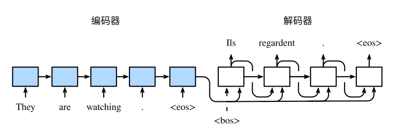

例如：一个典型的机器翻译任务中，输入的文本序列（源语言表述）到输出的文本序列（目标语言表述）之间的变换

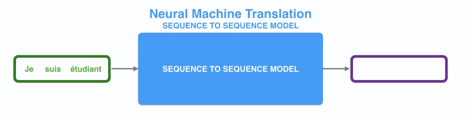

​      

# 一 编码解码器结构

编码器处理输入序列中的每个元素（在这里可能是1个词），将捕获的信息编译成向量（称为上下文内容向量）。在处理整个输入序列之后，编码器将上下文发送到解码器，解码器逐项开始产生输出序列。如机器翻译任务

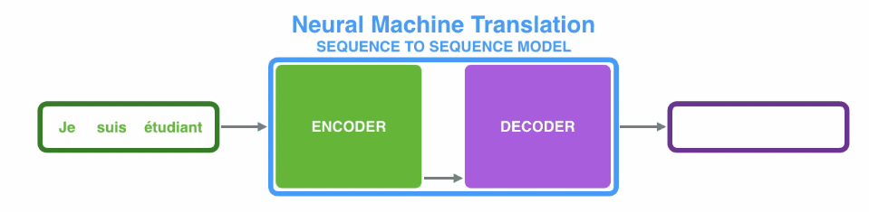

**上下文向量**

> 1）输入的数据(文本序列)中的每个元素(词)通常会被编码成一个稠密的向量，这个过程叫做word embedding；
>
> 2）经过循环神经网络（RNN），将最后一层的隐层输出作为上下文向量；
>
> 3）encoder和decoder都会借助于循环神经网络(RNN)这类特殊的神经网络完成，循环神经网络会接受每个位置(时间点)上的输入，同时经过处理进行信息融合，并可能会在某些位置(时间点)上输出
>
> 如下图：
>
> 
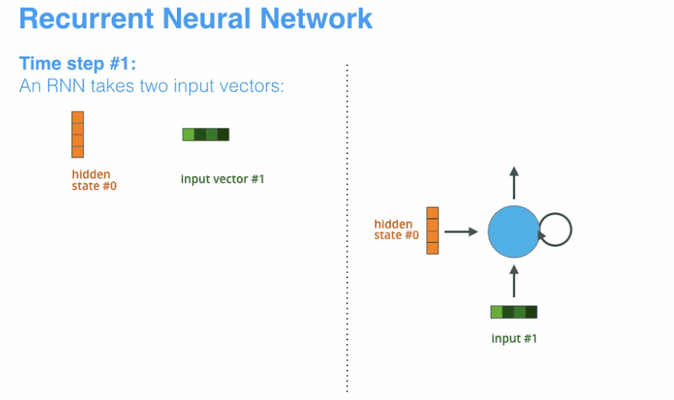

>
> 动态地展示整个编码器和解码器，分拆的步骤过程：
>
> 
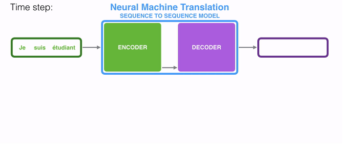

>
> 更详细地展开，其实是这样的：
>
> 
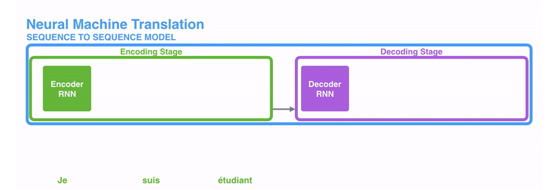

​      

# 二 attention Seq2Seq

Attention机制是机器学习中的一种技术，它通过**赋予模型对输入序列中不同部分的不同权重**，来实现对输入的有针对性的关注和处理。这种技术最早应用于机器翻译任务中，如今已经广泛应用于各种自然语言处理和图像处理任务中。

在Seq2seq模型中，为了将输入序列中的信息和当前要生成的输出联系起来，通常需要对输入序列中的每个时间步都进行编码，但是对于较长的输入序列，往往会出现**信息丢失**和**处理困难**的问题，而Attention机制则可以通过自动地学习对输入序列的不同部分进行不同的注意力，从而使得模型可以更加准确地识别和使用与当前输出相关的信息。

具体来说，Attention机制根据当前的上下文信息和历史信息来计算每个输入向量的权重，然后将这些向量加权求和，以产生一个加权向量，该加权向量可以作为上下文并用于生成当前输出。在实际应用中，Attention机制通常与LSTM或GRU等循环神经网络结合使用，以实现更加准确和有效的序列到序列的映射。

总之，Attention机制为序列建模提供了一种有效的工具，它可以让模型更加智能地关注和利用输入序列中的信息，从而提高模型的性能和鲁棒性。

​            

## 1 什么是Attention机制

解码器在各个时间步依赖相同的背景变量来获取输⼊序列信息，当编码器为循环神经⽹络时，背景变量来⾃它最终时间步的隐藏状态。

现在再次思考翻译例⼦：输⼊为英语序列“They” / “are” / “watching” / “.”，输出为法语序列“Ils” / “regardent” / “.”。不难想到，解码器在⽣成输出序列中的每⼀个词时可能只需利⽤输⼊序列某⼀部分的信息。例如在输出序列的时间步1，解码器可以主要依赖“They”/“are”的信息来⽣成“Ils”，在时间步2则主要使⽤来⾃“watching”的编码信息⽣成“regardent”，最后在时间步3则直接映射句号“.”。**这看上去就像是在解码器的每⼀时间步对输⼊序列中不同时间步的表征或编码信息分配不同的注意⼒⼀样，这也是注意⼒机制的由来。**

仍然以循环神经⽹络为例，注意⼒机制通过对编码器所有时间步的隐藏状态做加权平均来得到背景变量，解码器在每⼀时间步调整这些权重，即注意⼒权重，从而能够在不同时间步分别关注输⼊序列中的不同部分并编码进相应时间步的背景变量。

​       

**Self-Attention模型**

> Self Attention也经常被称为intra Attention（内部Attention），最近一年也获得了比较广泛的使用，比如Google最新的机器翻译模型内部大量采用了Self Attention模型。
>
> 在一般任务的Encoder-Decoder框架中，输入Source和输出Target内容是不一样的，比如，对于英-中机器翻译来说，Source是英文句子，Target是对应的翻译出的中文句子，Attention机制发生在Target的元素Query和Source中的所有元素之间。**而Self Attention顾名思义，指的不是Target和Source之间的Attention机制，而是Source内部元素之间或者Target内部元素之间发生的Attention机制，也可以理解为Target = Source 这种特殊情况下的注意力计算机制。**其具体计算过程是一样的，只是计算对象发生了变化而已。
>
> 很明显，引入Self Attention后会更容易捕获句子中长距离的相互依赖的特征，因为如果是RNN或者LSTM，需要依次序序列计算，对于远距离的相互依赖的特征，要经过若干时间步步骤的信息累积才能将两者联系起来，而距离越远，有效捕获的可能性越小。
>
> 但是Self Attention在计算过程中会直接将句子中任意两个单词的联系通过一个计算步骤直接联系起来，所以远距离依赖特征之间的距离被极大缩短，有利于有效地利用这些特征。除此外，Self Attention对于增加计算的并行性也有直接帮助作用。这是为何Self Attention逐渐被广泛使用的主要原因。

​     

## 2 为什么加入attention注意力机制

加入attention主要是为了提升效果，不会寄希望于把所有的内容都放到一个上下文向量(context vector)中，而是会采用一个叫做注意力模型的模型来动态处理和解码，动态的图如下所示

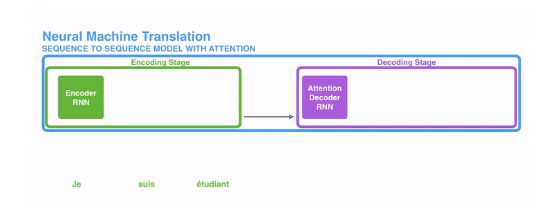

**注意力机制**，可以粗略地理解为是一种对于输入的信息，**根据重要程度进行不同权重的加权处理**（通常加权的权重来源于softmax后的结果）的机制，如下图所示，是一个在解码阶段，简单地对编码器中的hidden states进行不同权重的加权处理的过程。

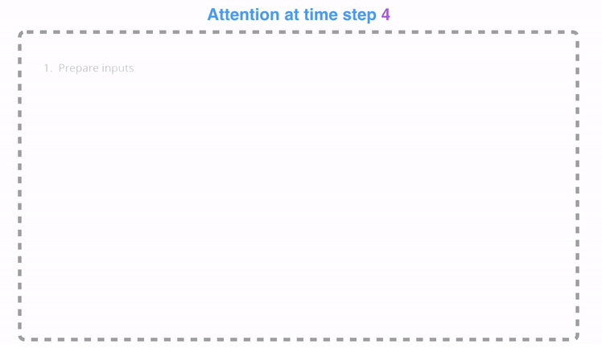

​     

## 3 原理

基于attention机制的seq2seq模型原理

> 1）带注意力的解码器RNN接收的嵌入(embedding)和一个初始的解码器隐藏状态(hidden state)；
>
> 2）RNN处理输入，产生输出和新的隐藏状态向量（h4），输出被摒弃不用；
>
> 3）attention的步骤：
>
> * 使用编码器隐藏状态(hidden state)和h4向量来计算该时间步长的上下文向量（C4）
> * 把h4和C4拼接成一个向量
> * 把拼接后的向量连接全连接层和softmax完成解码
>
> 4）每个时间点上重复这个操作

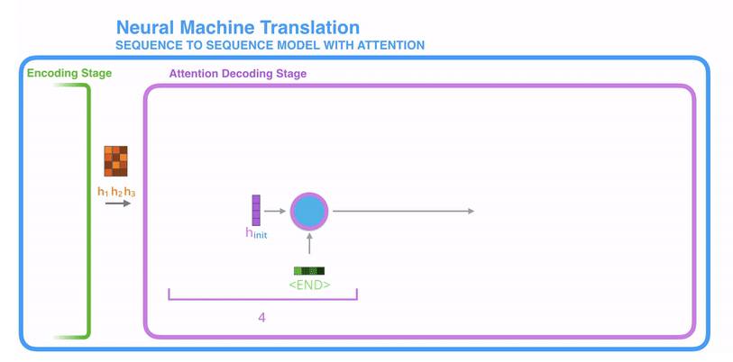

也可以把这个动态解码的过程展示成下述图所示的过程：

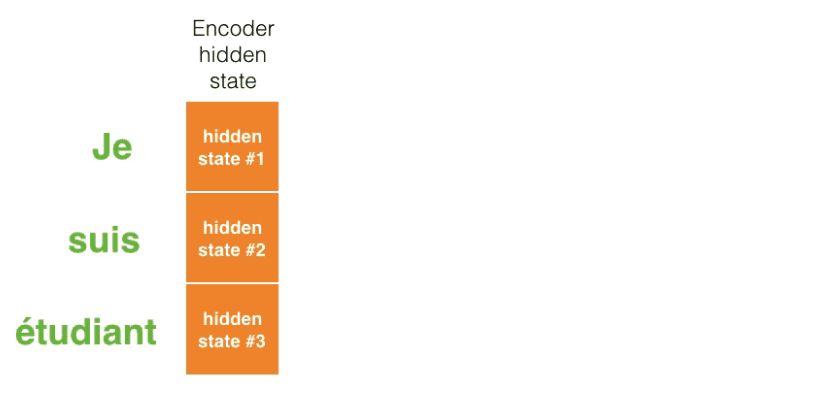

​       

## 4 图解Attention Seq2Seq

1）Encoder方面接受的是每一个单词word embedding，和上一个时间点的hidden state。输出的是这个时间点的hidden state

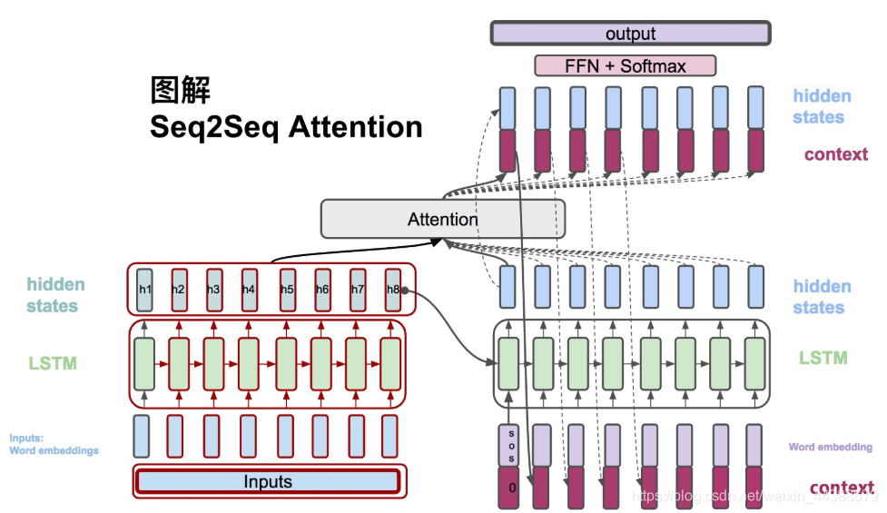

2）Decoder方面接受的是目标句子里单词的word embedding，和上一个时间点的hidden state

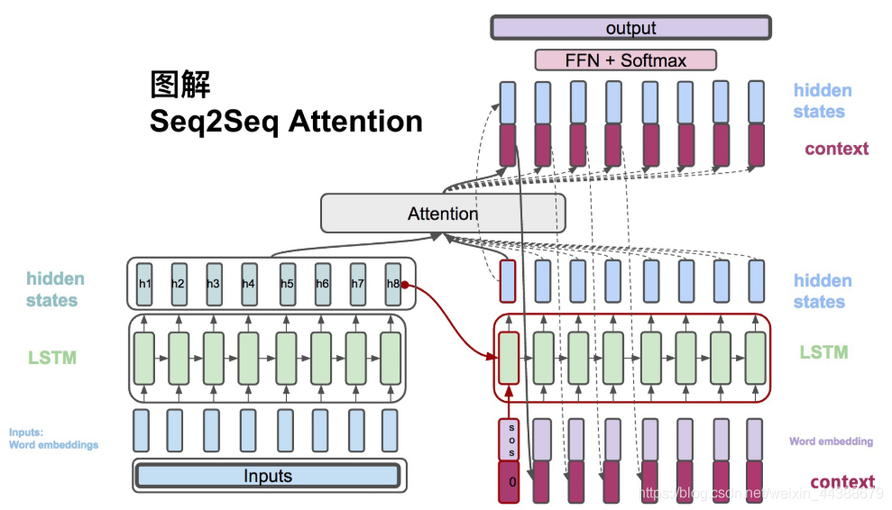

3）context vector是一个对于encoder输出的hidden states的一个加权平均

4）每一个encoder的hidden states对应的权重

5）通过decoder的hidden states加上encoder的hidden states来计算一个分数，用于计算权重(4)

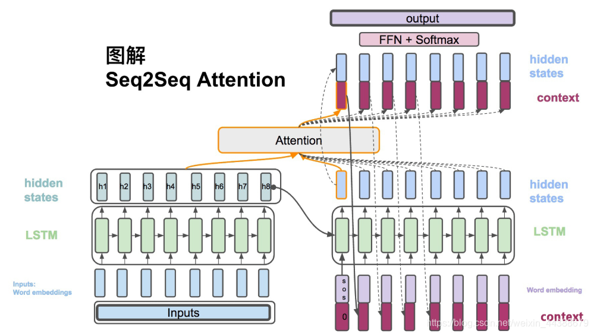

下个时间点

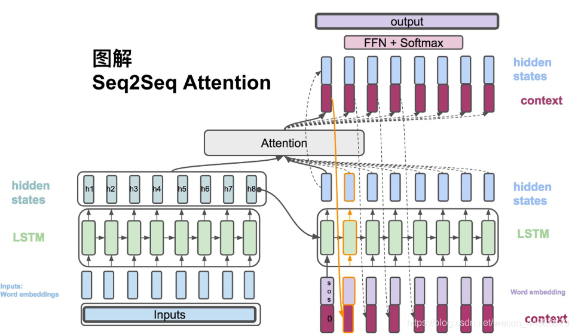

6）将context vector 和 decoder的hidden states 串起来

7）计算最后的输出概率

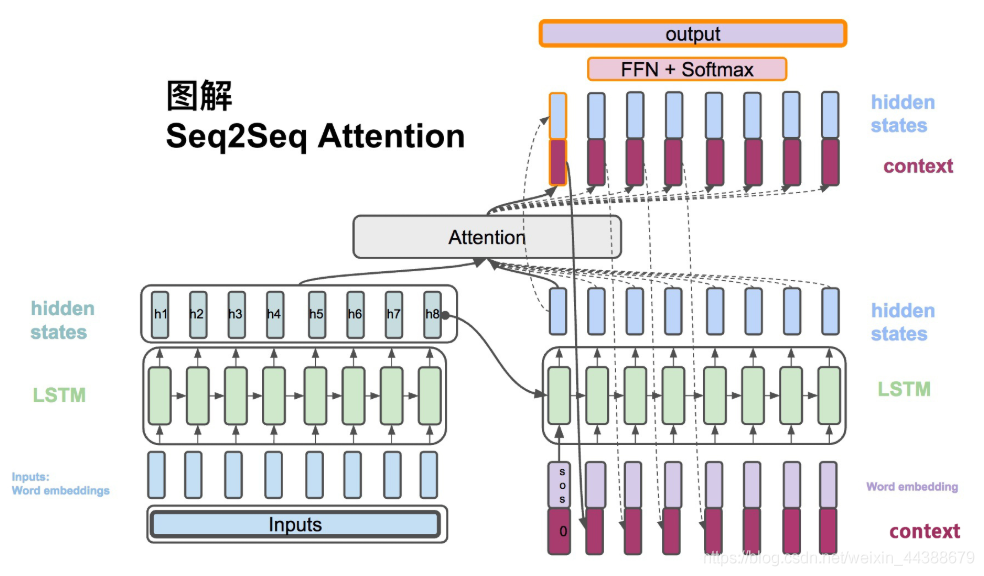

​        

# 附录

1. https://github.com/NLP-LOVE/ML-NLP
2. [Seq2Seq原理详解](https://www.cnblogs.com/liuxiaochong/p/14399416.html)

