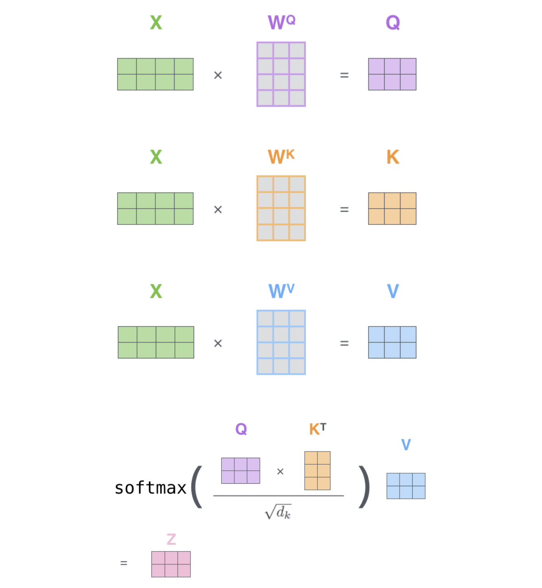
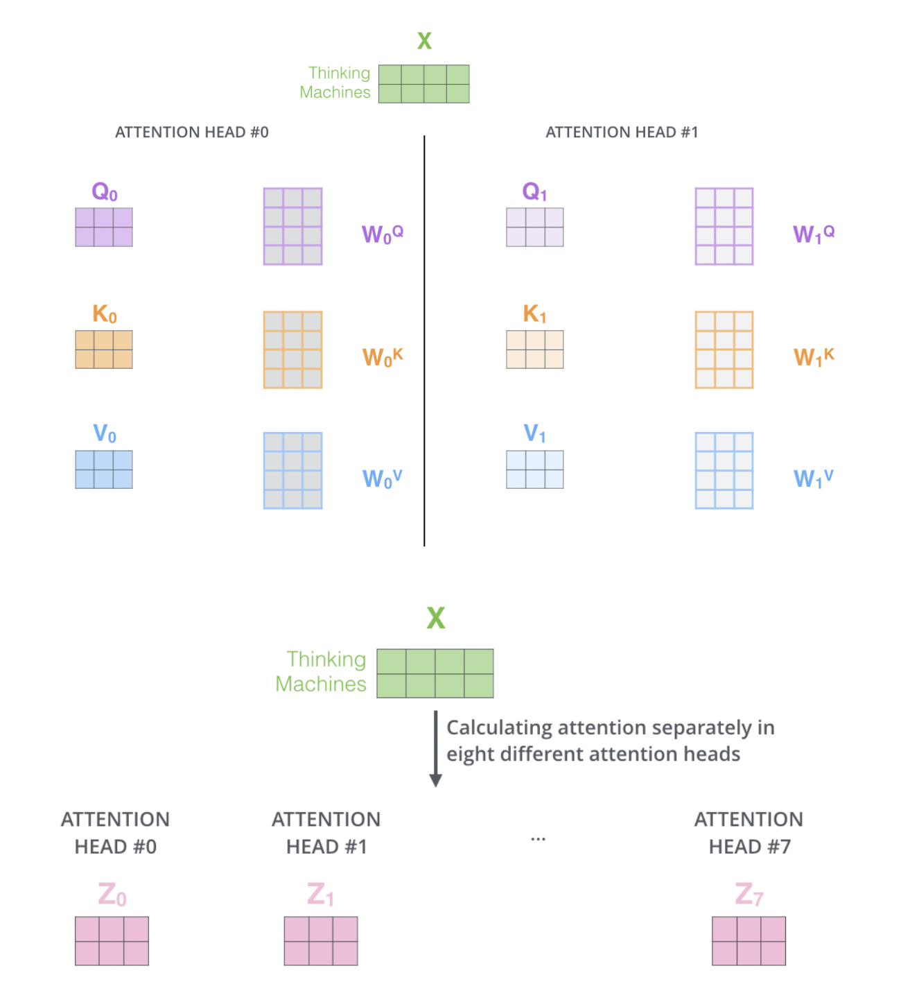
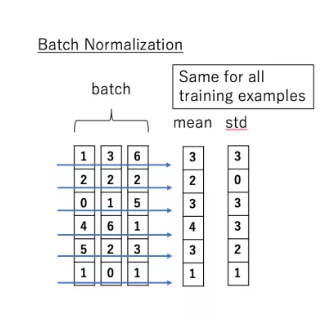
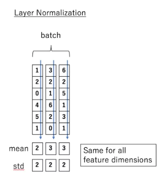

# NLP - Transformer模型

**[《Attention Is All You Need》](https://arxiv.org/pdf/1706.03762.pdf)是一篇Google提出的将Attention思想发挥到极致的论文。这篇论文中提出一个全新的模型，叫 Transformer，抛弃了以往深度学习任务里面使用到的 CNN 和 RNN**。目前大热的Bert就是基于Transformer构建的，这个模型广泛应用于NLP领域，例如 `机器翻译`，`问答系统`，`文本摘要` 和 `语音识别` 等等方向。

​       

# 一 Transformer结构

## 1 总体架构

Transformer的结构和Attention模型一样，Transformer模型中也采用了 encoer-decoder 架构，但其结构相比于Attention更加复杂，论文中encoder层由6个encoder堆叠在一起，decoder层也一样。

每一个encoder和decoder的内部结构如下图：

> 1）encoder：包含两层，一个 **self-attention层** 和一个 **前馈神经网络**，self-attention能帮助当前节点不仅仅只关注当前的词，从而能获取到上下文的语义；
>
> 2）decoder：也包含encoder提到的两层网络，但是在这两层中间还有一层attention层，帮助当前节点获取到当前需要关注的重点内容；

​     

## 2 Encoder层结构

首先，模型需要对输入的数据进行一个embedding操作，也可以理解为类似word2vec的操作，enmbedding结束之后，输入到encoder层，self-attention处理完数据后把数据送给前馈神经网络，前馈神经网络的计算可以并行，得到的输出会输入到下一个encoder。

​        

### 2.1 Positional Encoding

transformer模型中缺少一种**解释输入序列中单词顺序的方法**，它跟序列模型还不不一样。为了处理这个问题，transformer给encoder层和decoder层的输入添加了一个额外的向量Positional Encoding（位置编码向量，让模型了解单词的顺序），维度和embedding的维度一样，这个向量遵循模型学习的特定模式，这有助于它**确定每个单词的位置，或序列中不同单词之间的距离**。

这个位置向量的具体计算方法有很多种，论文中的计算方法如下：

其中pos是指当前词在句子中的位置，i是指向量中每个值的index，可以看出，在**偶数位置，使用正弦编码，在奇数位置，使用余弦编码**。最后把这个Positional Encoding与embedding的值相加，作为输入送到下一层。

假设embedding维度为 4，那么实际的位置编码将如下所示：

​      

### 2.2 Self-Attention

self-attention，其思想和attention类似，但是self-attention是Transformer用来 **将其他相关单词的 “理解” 转换成正在处理的单词的一种思路**，可以看个例子：

> The animal didn't cross the street because it was too tired

这里的 it 到底代表的是 animal 还是 street 呢，对于我们来说能很简单的判断出来，但是对于机器来说，是很难判断的，而当模型处理“it”这个词时，self-attention就能够让机器把 it 和 animal 联系起来

当模型处理每个单词（输入序列中的每个位置）时，self-attention允许它查看输入序列中的其他位置以寻找有助于更好地编码该单词的线索。如果熟悉 RNN，就知道RNN如何通过隐藏状态**将其对先前已处理的单词/向量的表示与当前正在处理的单词/向量的表示相结合**。而self-attention正是 Transformer 用来将其他相关词的 “理解” 融入模型当前正在处理的词的方法。

> 当模型在编码器 #5（堆栈中的顶部编码器）中对单词“it”进行编码时，注意力机制的一部分集中在“The Animal”上，并将其表示的一部分关联到“it”的编码中。
>
> 

​    

再比如如果要翻译一个词组 "Thinking Machines"，其中Thinking的输入的embedding vector用 x1 表示，Machines的embedding vector用 x2 表示，那模型处理过程如下：

> 1）首先，self-attention会计算出三个新的向量，在论文中，向量的维度是512维，可以把这三个向量分别称为Query、Key、Value，这三个向量是用**embedding向量与一个矩阵相乘得到的结果**，这个矩阵是随机初始化的，维度为（64，512）。
>
> 注意：第二个维度需要和embedding的维度一样，其值在BP的过程中会一直进行更新，得到的这三个向量的维度是64。（那么Query、Key、Value这三个向量又是什么呢？当理解了下文后，将会明白这三个向量扮演者什么的角色）
>
> 

>
> 2）**self-attention分数值**计算，该分数值决定了当在某个位置encode一个词时，对输入句子的其他部分的关注程度。
>
> 比如当开始处理Thinking这个词时，需要计算句子中所有词与它的Attention Score，这就像将当前词作为搜索的query，去和句子中所有词（包含该词本身）的key去匹配，看看相关度有多高。
>
> 假设用 q1 代表Thinking对应的query vector， k1 及 k2 分别代表Thinking以及Machines对应的key vector，则计算Thinking的attention score的时候，通过计算 q1 与 k1, k2 的点乘即可得到，同理在计算Machines的attention score的时候需要计算 q2 与 k1, k2 的点乘，如下图所示：
>
> 

>
> 3）然后对 attention score进行 **尺度缩放** 与 **softmax归一化**
>
> * **尺度缩放**：即将分数值除以一个常数8，这个值一般是采用上文提到的矩阵的第一个维度的开方即64的开方8，当然也可以选择其他的值；
> * **softmax归一化**：即将缩放值做一个softmax的计算（Softmax分数均为正且加起来和为 1），得到的结果即是**每个词对于当前位置的词的相关性大小**，显然当前单词与其自身的attention score一般最大，其他单词根据与当前单词重要程度也有相应的score，
>
> 

>
> 4）然后再用这些attention score与Value向量相乘并相加，得到加权向量求和结果即是self-attetion在当前节点的值
>
> * 相乘：**保留关注词的值不变，并淹没不相关词**（例如通过将它们乘以像 0.001 这样的小数字）；
> * 求和：即把计算得到的 加权向量 v1 和 v2进行求和；
>
> 

>
> 但在实际的应用场景，为了提高计算速度，采用的是矩阵的方式，直接计算出Query, Key, Value的矩阵，然后把embedding的值与三个矩阵直接相乘，把得到的新矩阵 Q 与 K 相乘，乘以一个常数，做softmax操作，最后乘上 V 矩阵。
>
> 其中，WQ, WK, WV是模型训练过程学习到的合适参数权重矩阵
>
> 

>
> 这种通过 query 和 key 的相似性程度来确定 value 的权重分布的方法被称为 **scaled dot-product attention**。

​        

### 2.3 Multi-Headed Attention

论文内是在self-attention中加入了另外一个机制，被称为 “multi-headed” attention，该机制理解起来很简单，**就是说不仅仅只初始化一组Q、K、V的矩阵，而是初始化多组，tranformer是使用了8组**，所以最后得到的结果是8个矩阵。

但前馈神经网络没法输入8个矩阵呀，所以需要将得到把8个矩阵降为1个，即首先把8个矩阵连在一起，这样会得到一个大的矩阵，再随机初始化一个矩阵和合并后的矩阵相乘，最后得到一个最终的矩阵。

因此，multi-headed attention的整体流程如下：

现在，通过multi-headed attention机制，让我们再重新审视之前的例子，看看在示例句子中对单词“it”进行编码时，不同的注意力头集中在什么地方：

> 当模型对“it”这个词进行编码时，一个headed attention 关注 “the animal”，而另一个headed attention则关注 “tired”。从某种意义上说，模型对“it”这个词的表示会关联到其它表示中 “animal” 和 “tired” 上。
>
> 

​        

### 2.4 Layer normalization

在transformer中，每一个子层（self-attetion，Feed Forward Neural Network）之后都会接一个残缺模块，并且有一个Layer normalization。

Normalization有很多种，但是它们都有一个共同的目的，那就是把输入转化成均值为0 / 方差为1的数据，再把数据送入激活函数之前进行normalization（归一化），因为不希望输入数据落在激活函数的饱和区。

1）**Batch Normalization**

> 主要思想：在每一层的每一批数据上进行归一化。即模型可能会对输入数据进行归一化，但是经过该网络层的作用后，数据已经不再是归一化的了。随着这种情况的发展，数据的偏差越来越大，其次模型反向传播需要考虑到这些大的偏差，这就迫使模型只能使用较小的学习率来防止梯度消失或者梯度爆炸。
>
> **BN的具体做法：对每一小批数据，在批这个方向上做归一化**
>
> 

>
> 可以看到，右半边求均值是沿着数据 batch_size的方向进行的，其计算公式如下：
>
> 

2）**Layer normalization**

> 也是归一化数据的一种方式，不过**LN 是在每一个样本上计算均值和方差**，而不是BN那种在批方向计算均值和方差！
>
> 

>
> LN的计算公式；
>
> 

​    

到这里为止就是全部encoders的内容了，如果把两个encoders叠加在一起就是这样的结构

​        

## 3 Decoder 层架构

根据上面的总体结构图可以看出，decoder部分其实和encoder部分大同小异，刚开始也是先添加一个位置向量Positional Encoding，接下来接的是masked mutil-head attetion，这里的mask也是transformer一个很关键的技术。

其余的层结构与Encoder一样，请参考Encoder层结构。

​     

### 3.1 masked mutil-head attetion

**mask 表示掩码，它对某些值进行掩盖，使其在参数更新时不产生效果**。Transformer 模型里面涉及两种 mask，分别是 padding mask 和 sequence mask。其中，padding mask 在所有的 scaled dot-product attention 里面都需要用到，而 sequence mask 只有在 decoder 的 self-attention 里面用到。

1）**padding mask**

> ***什么是 padding mask 呢？***
>
> 因为每个批次输入序列长度是不一样的，也就是说要对输入序列进行对齐。具体来说，就是给在较短的序列后面填充 0，但是如果输入的序列太长，则是截取左边的内容，把多余的直接舍弃。因为这些填充的位置，其实是没什么意义的，所以模型的attention机制不应该把注意力放在这些位置上，所以需要对数据进行一些处理。
>
> 具体做法：把这些位置的值加上一个非常大的负数（负无穷），这样的话，经过 softmax，这些位置的概率就会接近0！
>
> 而 padding mask 实际上是一个**张量**，每个值都是一个Boolean，值为 false 的地方就是要进行处理的地方。

2）**Sequence mask**

> sequence mask 是为了使得 decoder 不能看见未来的信息。也就是对于一个序列，在 time_step 为 t 的时刻，解码输出应该只能依赖于 t 时刻之前的输出，而不能依赖 t 之后的输出。因此需要想一个办法，把 t 之后的信息给隐藏起来。
>
> 那么具体怎么做呢？也很简单：**产生一个上三角矩阵，上三角的值全为0。把这个矩阵作用在每一个序列上，就可以达到目的**。
>
> * 对于 decoder 的 self-attention，里面使用到的 scaled dot-product attention，同时需要padding mask 和 sequence mask 作为 attn_mask，具体实现就是两个mask相加作为attn_mask；
> * 其他情况，attn_mask 一律等于 padding mask；

​             

### 3.2 case示例

至此，已经了解了编码器方面的大部分概念，基本上也知道解码器的组件是如何工作的，现在来看看它们是如何协同工作的。

编码器首先处理输入序列。顶端编码器的输出之后会变转化为一个包含向量K（键向量）和V（值向量）的attention 向量集 ，**这是并行化操作**。这些向量将被每个解码器用于自身的“编码-解码 attention层”，而这些层可以帮助解码器关注输入序列哪些位置合适：

> 完成编码阶段后，进入解码阶段，解码阶段的每一步都从输出序列中输出一个输出序列的元素
>
> 

接下来重复此过程，直到到达一个特殊的终止符号，即表示transformer解码器已经完成输出。每个步骤的输出在下一个时间点被提供给底端解码器，并且就像编码器之前做的那样，这些解码器会输出它们的解码结果 。

​      

## 4 Output层

当decoder层全部执行完毕后，怎么把得到的向量映射为需要的词呢？即只需要在结尾再添加一个 **全连接层**（Linear） 和**softmax层**（归一化），假如输入词典是1w个词，那最终softmax会输入1w个词的概率，概率值最大的对应的词就是最终的结果。

​       

# 二 Transformer 特点

**Transformer相比于RNN/LSTM，有什么优势？**

> 1）RNN系列的模型，并行计算能力很差。RNN并行计算时， T 时刻的计算依赖 T-1 时刻的隐层计算结果，而 T-1 时刻的计算依赖 T-2 时刻的隐层计算结果，如此下去就形成了所谓的**序列依赖关系**；
>
> 2）Transformer的特征抽取能力比RNN系列的模型要好。但值得注意的是，并不是说Transformer就能够完全替代RNN系列的模型了，任何模型都有其适用范围，同样的RNN系列模型在很多任务上还是首选，熟悉各种模型的内部原理，知其然且知其所以然，才能遇到新任务时，快速分析这时候该用什么样的模型，该怎么做好。

**为什么说Transformer可以替换seq2seq？**

> **seq2seq缺点**：seq2seq最大的问题在于**将Encoder端的所有信息压缩到一个固定长度的向量中**，并将其作为Decoder端首个隐藏状态的输入，来预测Decoder端第一个单词（token）的隐藏状态。在输入序列比较长的时候，这样做显然会损失Encoder端的很多信息，而且这样一股脑的把该固定向量送入Decoder端，Decoder端不能够关注到其想要关注的信息。
>
> **Transformer优点**：transformer不但对seq2seq模型这两点缺点有了实质性的改进（多头交互式attention模块），而且还引入了self-attention模块，让源序列和目标序列首先“自关联”起来。因此源序列和目标序列自身的embedding表示所蕴含的信息更加丰富，而且后续的FFN层也增强了模型的表达能力，并且Transformer并行计算的能力是远远超过seq2seq系列的模型，因此可认为这是transformer优于seq2seq模型的地方。

​     

​      

# 附录

1. [ML-NLP Transformer模型](https://github.com/NLP-LOVE/ML-NLP/tree/master/NLP/16.7%20Transformer)
2. [Transformer模型详解](https://terrifyzhao.github.io/2019/01/11/Transformer%E6%A8%A1%E5%9E%8B%E8%AF%A6%E8%A7%A3.html)
3. [The Illustrated Transformer](https://jalammar.github.io/illustrated-transformer/)
4. [The Annotated Transformer](http://nlp.seas.harvard.edu/2018/04/03/attention.html)
5. [关于Transformer模型中的各种细节详解](https://www.cnblogs.com/zjuhaohaoxuexi/p/15991787.html)
6. [Github: learn-nlp-with-transformers](https://github.com/datawhalechina/learn-nlp-with-transformers/tree/main/docs)