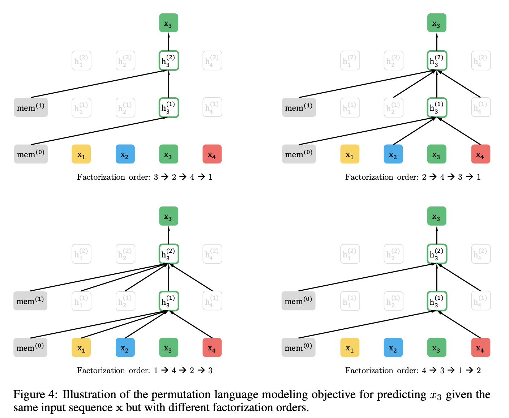
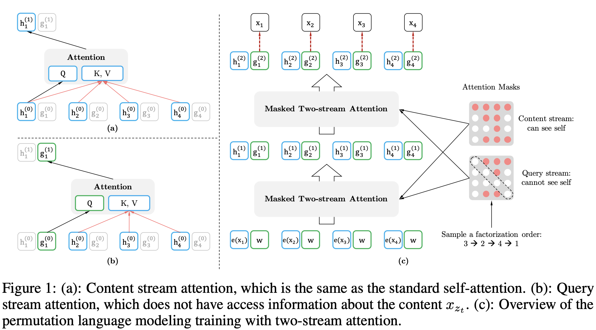
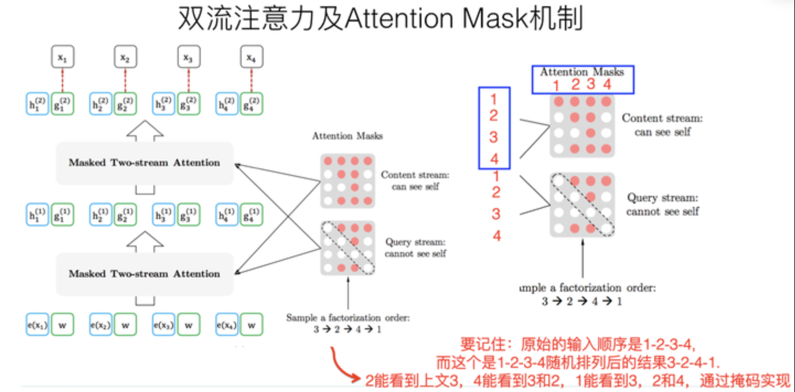
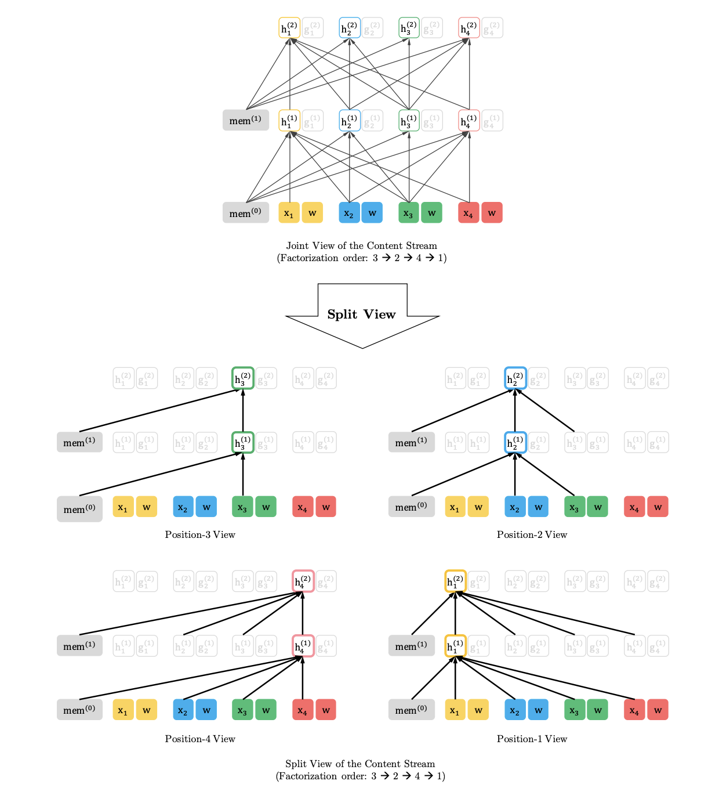
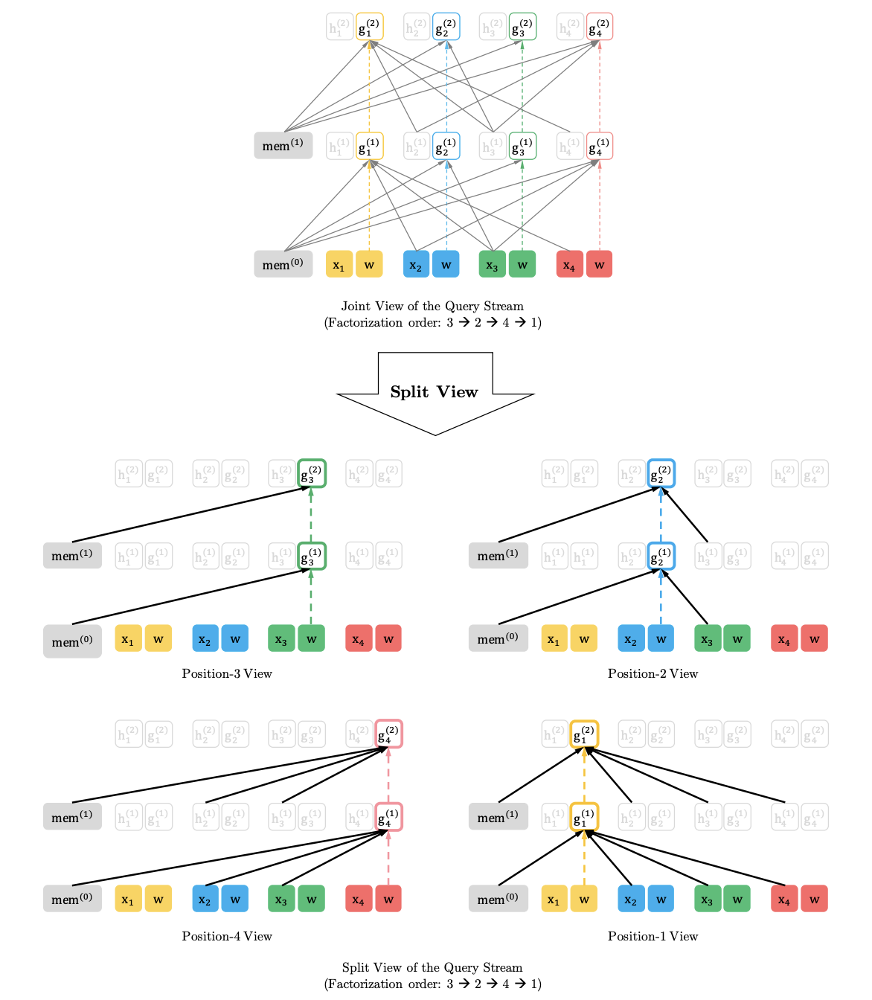
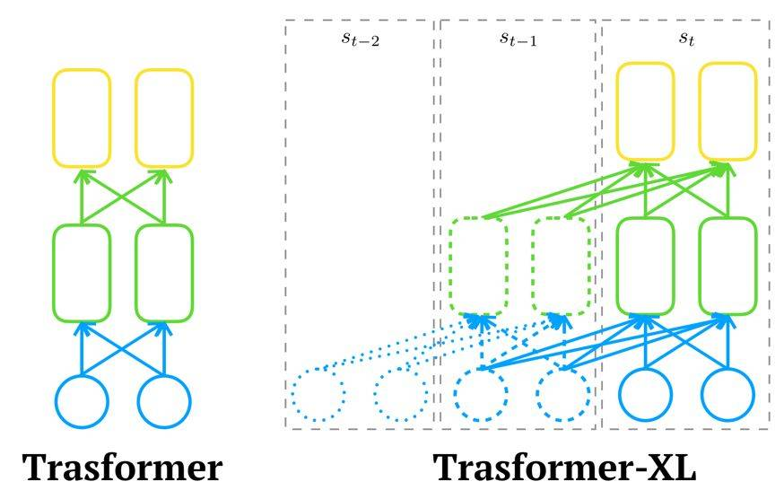
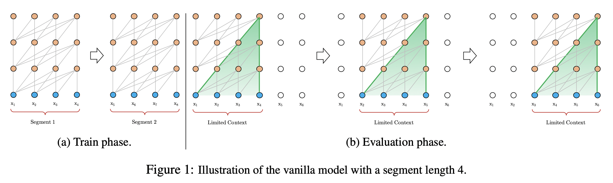
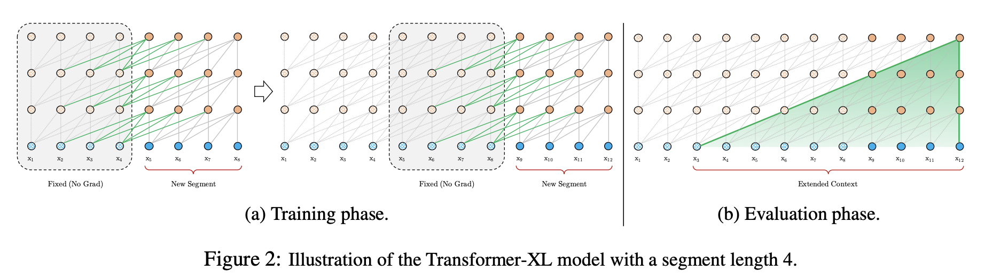

# NLP - XLNet模型

XLNet 是一个类似 BERT 的模型，是一种**通用的自回归预训练方法**，在2019年6月由CMU和Google Brain团队发布的模型，且其在 20 个任务上超过了 BERT 的表现，并在 18 个任务上取得了当前最佳效果（state-of-the-art），包括`机器问答`、`自然语言推断`、`情感分析` 和 `文档排序`。

XLNet作者表示，BERT 这样基于去噪自编码器的预训练模型可以很好地建模双向语境信息，性能优于基于自回归语言模型的预训练方法。然而由于需要 mask 一部分输入，BERT **忽略了被 mask 位置之间的依赖关系**，因此出现预训练和微调效果的差异（pretrain-finetune discrepancy）。

基于这些优缺点，研究提出了一种泛化的自回归预训练模型 XLNet，XLNet 可以：

1. 通过最大化所有可能的因式分解顺序的对数似然，学习双向语境信息；
2. 用自回归本身的特点克服 BERT 的缺点；
3. XLNet 还融合了当前最优自回归模型 Transformer-XL 的思路；

​          

XLNet是典型的PLM预训练模型，提出了一个框架来连接标准语言模型建模方法和预训练方法，出发点就是 “**能否融合自回归LM和DAE LM两者的优点**” ？

1. 如果站在自回归LM的角度，如何引入和双向语言模型等价的效果；
2. 如果站在DAE LM的角度看，它本身是融入双向语言模型的，如何抛掉表面的那个[Mask]标记，让预训练和Fine-tuning保持一致；
3. 此外，XLNet还讲到了一个Bert被Mask单词之间相互独立的问题；

PS：NLP 预训练模型相关参考 [PTMs](./10）NLP - 预训练模型.md)

​         

# 一 模型介绍

## 1 XLNet做了什么？

### 1.1 双流自注意力 & Mask机制

Bert的自编码语言模型也有对应的缺点，就是XLNet在文中指出的：

* 1）预训练阶段因为采取引入[Mask]标记来Mask掉部分单词的训练模式，而Fine-tuning阶段是看不到这种被强行加入的Mask标记的，所以两个阶段存在使用模式不一致的情形，这可能会带来一定的性能损失；
* 2）Bert在第一个预训练阶段，假设句子中多个单词被Mask掉，这些被Mask掉的单词之间没有任何关系，是条件独立的，而有时候这些单词之间是有关系的；

上面两点是XLNet在第一个预训练阶段，相对Bert来说要解决的两个问题。

> **Q**：其实从另外一个角度也许更好理解XLNet的初衷和做法，是啥呢？
>
> **A**：自回归语言模型有个缺点，要么从左到右，要么从右到左，尽管可以类似ELMO两个都做，然后再拼接的方式，但是跟Bert比，效果明显不足够好（PS：有RNN弱于Transformer的因素，也有双向语言模型怎么做的因素）。
>
> 那么，能不能类似Bert那样，比较充分地在自回归语言模型中，引入双向语言模型呢？
>
> 因为Bert已经证明了这是非常关键的一点，想法虽然很简单，但貌似不太好做，因为在从左向右的语言模型中，如果当前根据上文要预测某个单词Ti，模型是没法看到词下文的内容。
>
> 那具体怎么做才能让这个模型达到这个效果？即看上去仍然是从左向右的输入和预测模式，但其内部已经引入了当前单词的下文信息呢？
>
> 而XLNet在模型方面的主要贡献其实是在这里

​       

***那么XLNet模型是怎么做到这一点的呢*** ？

> 其解决思路也比较简洁，即XLNet仍然遵循以下两阶段的过程：
>
> * 第一个阶段是**语言模型预训练阶段**
> * 第二阶段是**任务数据Fine-tuning阶段**
>
> 但它主要希望改动第一个阶段，就是说不像Bert那种带Mask符号的DAE（噪声自编码）模式，而是采用自回归LM的模式。换句话说，虽然看上去输入句子X仍然是自左向右的输入，看到Ti单词的上文，来预测Ti这个单词，但是模型又希望在上文里，不仅仅看到上文单词，也能看到Ti单词后的下文单词。这样的话，Bert里面预训练阶段引入的Mask符号就不需要了，于是在预训练阶段，看上去是个标准的从左向右过程，当然Fine-tuning也是这个过程，最后将两个阶段统一起来就好。

​       

***那么怎么能够在单词Ti的上文中揉入下文的内容呢*** ？

> **基本思想：XLNet是在预训练阶段，引入排列语言模型PLM的训练目标**
>
> **Q**：这个要怎么理解呢？
>
> 举个例子，假设包含单词Ti的当前输入的句子X，由4个单词（x1,x2,x3,x4）顺序构成，那么现在要预测的单词Ti是x3，位置在Position 3，如果要想让它能够在上文中，也就是Position 1或者Position 2的位置看到Position 4的单词x4。
>
> **Q**：那要怎么做呢？
>
> 假设单词x3位置不变（仍在Position 3），之后随机排列组合句子中的4个单词，在随机排列组合后的各种可能里，再选择一部分作为模型预训练的输入X。比如随机排列组合后，抽取出x4,x2,x3,x1这一个排列组合作为模型的输入X，于是x3就能同时看到上文x2，以及下文x4的内容了。
>
> 

>
> 而这就是XLNet的基本思想，即看上去仍然是个自回归的从左到右的语言模型，但是其实通过对句子中单词排列组合，把一部分Ti下文的单词排到Ti的上文位置中，于是模型就看到了上文和下文，但是形式上看上去仍然是从左到右在预测后一个单词。

​       

当然，上面讲的仍然是基本思想，然而难点其实在于具体怎么做才能实现上述思想。

首先，需要强调一点，尽管上面讲的是**把句子X的单词排列组合后，再随机抽取例子作为输入**，但是实际上不能这么做的，因为Fine-tuning阶段不可能也去排列组合原始输入，所以就必须让**预训练阶段的输入部分**，看上去仍然是x1,x2,x3,x4这个输入顺序，但是可以在Transformer部分做些工作，来达成希望目标。

具体而言，XLNet采取了 **Attention掩码的机制**，可以理解为当前输入句子是X，要预测的单词Ti是第i个单词，并在输入部分确保第1到i-1个单词没发生变化。而在Transformer内部，通过Attention掩码，从X的输入单词里面，也就是Ti的上文和下文单词中，随机选择i-1个，放到Ti的上文位置中，把其它单词的输入通过Attention掩码隐藏掉，于是就能够达成期望的目标。

> **PS**：这个所谓放到Ti的上文位置，只是一种形象的说法，其实在内部是通过Attention Mask把其它没有被选到的单词Mask掉，不让它们在预测单词Ti的时候发生作用，如此而已，从效果上看着就类似于把这些被选中的单词放到了上文Context_before的位置了。

为实现上述过程，XLNet模型采用 “**双流自注意力模型**” 实现的，其基本思想如上所述，值得注意的是双流自注意力机制只是实现这个思想的具体方式，理论上可以想出其它具体实现方式来实现这个基本思想，也能达成让Ti看到下文单词的目标。

> ***双流自注意力机制***
>
> 1）一是 **内容流自注意力**，其实就是标准的Transformer的计算过程；
>
> 2）二是引入了 **Query流自注意力**，即用来代替Bert模型的[Mask]标记逻辑
>
> 因为XLNet希望抛掉[Mask]标记符号，但是比如如果知道了上文单词x1,x2，要预测单词x3，此时就需要在x3对应位置的Transformer层上预测这个单词，但输入侧是不能看到要预测的单词x3。而为了解决这个问题，Bert模型直接引入**[Mask]标记来覆盖掉单词x3的内容的**，等于说[Mask]是个通用的占位符号。
>
> 而XLNet因为要抛掉[Mask]标记，但是又不能看到x3的输入，于是通过Query流机制直接忽略x3输入，只保留单词的位置信息，即用参数w来代表位置的embedding编码。所以，XLNet实际上只是扔了表面的[Mask]占位符号，内部还是引入Query流来忽略掉被Mask的这个单词，和Bert比只是实现方式不同而已。
>
> 

>
> ***Attention Mask机制如何理解*** ？
>
> 其核心就是说，尽管当前输入看上去仍然是x1->x2->x3->x4，但是任务内部已经改成随机排列组合的另外一个顺序x3->x2->x4->x1了，如果用这个例子用来从左到右训练LM，意味着当预测x2的时候，它只能看到上文x3（即对于x2来说，就看到了下文x3），而当预测x4的时候，只能看到上文x3和x2（即对于x4，看到了下文x3和x2），以此类推......
>
> 这种在输入侧维持表面的X句子单词顺序，但是其实在Transformer内部，看到的已经是被重新排列组合后的顺序，而这正是通过Attention掩码来实现的。如上图所示，输入看上去仍然是x1,x2,x3,x4，但可以通过不同的 **掩码矩阵**，让当前单词Xi只能看到被排列组合后的顺序x3->x2->x4->x1中自己前面的单词，而这也正是**在内部改成了被预测单词同时看到上下文单词，但是输入侧看上去仍然维持原先的单词顺序的基本原理**。
>
> 而要达到这个效果，掩码矩阵的作用就比较关键，如上图右侧的矩阵，**矩阵大小其实对应的输入句子的单词数**，其横/纵坐标的位置其实对应着单词坐标是1-2-3-4，就是表面那个X的单词顺序。因此通过掩码矩阵，就能改成想要的排列组合，并让当前单词看到它该看到的所谓上文，其实是掺杂了上文和下文的内容，而这也正是attention mask来实现排列组合的思想。

​         

当然，XLNet不仅引入Permutation Language Model的创新理论，开启了自回归语言模型如何引入下文的一个思路，还引入了其它的理论，也算是一个当前有效技术的集成体，即**XLNet可视为Bert、GPT 2.0和Transformer XL的综合体变身**：

> 1）它通过PLM（Permutation Language Model）预训练目标，吸收了Bert的双向语言模型；
>
> 2）GPT2.0的核心其实是更多更高质量的预训练数据，这个明显也被XLNet吸收进来了；
>
> 3）Transformer XL的主要思想也被吸收进来，它的主要目标是解决Transformer对于长文档NLP应用不够友好的问题；

​        

### 2 图例：注意力机制

在本节中，主要通过图例简单介绍内存复用机制（或递归机制）、如何使用注意力掩码得到词组合 以及 两个注意力流的差异。从下图可以看出

> 1）通过注意掩码矩阵，query流和内容流所起的效果是不同的
>
> 2）不同流差异：即query 流不能做self-attention，也不能访问该位置的token，而内容流可进行正常的

​       

1）**内容流自注意力** （Content Stream Self-Attention）

如果忽略query流表示，图中的计算仍是标准的自注意力计算逻辑，即使模型内部了使用了特定注意力掩码

2）**Query流自注意力** （Query Stream Self-Attention）

下图虚线箭头表示query流不能访问同一位置的token（内容），只能获取其位置信息

​        

## 2 Transformer XL

现阶段在NLP领域中，处理语言建模问题有两种最先进的架构：RNN和Transformer

> RNN：按照序列顺序逐个学习输入的单词或字符之间的关系
>
> Transformer：接收一整段序列，然后使用self-attention机制来学习它们之间的依赖关系

这两种架构目前来看都取得了令人瞩目的成就，但它们都局限在**捕捉长期依赖性**上，而为了解决这一问题，CMU联合Google Brain在19年1月推出的一篇新论文《Transformer-XL：Attentive Language Models beyond a Fixed-Length Context》，同时结合了RNN序列建模和Transformer自注意力机制的优点，**在输入数据的每个段上使用Transformer的注意力模块，并使用循环机制来学习连续段之间的依赖关系**。

​          

### 2.1 vanilla Transformer

**为何要提这个模型**？

因为Transformer-XL是基于这个模型进行的改进，即vanilla模型是 Al-Rfou等人基于Transformer提出了一种训练语言模型的方法，来**根据之前的字符预测片段中的下一个字符**。

> 例如，它使用 [x(1), x(2), ..., x(n-1)] 来预测字符x(n)，而字符 x(n) 之后的序列则被mask掉。原论文中使用64层模型，并仅限于处理 512个字符这种相对较短的输入，因此它将**输入分成段**，并分别从每个段中进行学习（如下图），并且在测试阶段如需处理较长的输入，该模型会在每一步中将输入向右移动一个字符，以此实现对单个字符的预测。
>
> 

​    

虽然vanilla模型在常用的数据集如enwik8和text8上的表现比RNN模型要好，但它仍有以下缺点：

> 1）**上下文长度受限**：字符之间的**最大依赖距离受输入长度的限制**，模型看不到出现在几个句子之前的单词；
>
> 2）**上下文碎片**：对于长度超过512个字符的文本，都是从头开始单独训练的，且段与段之间没有上下文依赖性，会让训练效率低下，也会影响模型的性能；
>
> 3）**推理速度慢**：在测试阶段，每次预测下一个单词，都需要重新构建一遍上下文，并从头开始计算，这样的计算速度非常慢；

​        

### 2.2 Transformer XL

Transformer-XL架构在vanilla Transformer模型基础上引入了以下两点创新，并克服了vanilla Transformer的缺点：

> 循环机制（Recurrence Mechanism）
>
> 相对位置编码（Relative Positional Encoding）

而且与vanilla Transformer相比，Transformer-XL的另一个优势是它可以被**用于单词级和字符级的语言建模**。

​      

#### 2.2.1 循环机制

与vanilla Transformer的基本思路一样，Transformer-XL仍然是使用**分段的方式进行建模**，但其与vanilla Transformer的本质不同是在于**引入了段与段之间的循环机制，使得当前段在建模的时候能够利用之前段的信息来实现长期依赖性**，如下图：

即在训练阶段，处理后面分段时，每个隐藏层都会接收两个输入：

> 1）同一分段内前面隐藏层的输出，与vanilla Transformer相同（上图的灰色线）
>
> 2）上一分段的隐藏层的输出（上图的绿色线），可以使模型创建长期依赖关系

而且这两个输入会进行拼接，用于计算当前段的Key和Value矩阵（具体公式可见原论文），且原则上只要GPU内存允许，这个方法可以利用前面更多段的信息，测试阶段也可以获得更长的依赖。

其次，与vanilla Transformer相比，在测试阶段模型的速度也会更快，而且在vanilla Transformer中，一次只能前进一个step，并且需要重新构建段，并全部从头开始计算，但在Transformer-XL中，每次可以前进一整个段，并利用之前段的数据来预测当前段的输出。

​      

#### 2.2.2 相对位置编码

在Transformer中，一个重要的地方在于其**考虑了序列的位置信息**

> 即在分段的情况下，如果对于每个段仍直接使用Transformer中的位置编码，即每个不同段在同一个位置上的表示使用相同的位置编码，就会出现问题，比如第i−2段 和 第i−1段的第一个位置将具有相同的位置编码，但它们对于第i段的**建模重要性**显然并不相同，即比如相比第i−1段，第i−2段中的第一个位置重要性可能要低一些，因此需要对这种位置进行区分。

而论文对于这个问题，提出了一种新的位置编码的方式，即会**根据词之间的相对距离而非像Transformer中的绝对位置进行编码**，从另一个角度来解读公式的话，可以将attention的计算分为如下四个部分：

- 基于内容的“寻址”，即没有添加原始位置编码的原始分数
- 基于内容的位置偏置，即相对于当前内容的位置偏差
- 全局的内容偏置，用于衡量key的重要性
- 全局的位置偏置，根据query和key之间的距离调整重要性

详细公式见：[Transformer-XL解读（论文 + PyTorch源码）](https://blog.csdn.net/magical_bubble/article/details/89060213)

​       

# 二 XLNet与BERT

尽管看上去，XLNet在预训练机制引入的PLM这种新的预训练目标，和Bert采用Mask标记这种方式，有很大不同，但其实你深入思考一下，会发现，两者本质是类似的。

**区别主要在于**：

> Bert是直接在输入端显示地通过引入Mask标记，在输入侧隐藏掉一部分单词，让这些单词在预测的时候不发挥作用，要求利用上下文中其它单词去预测某个被Mask掉的单词；
>
> 而XLNet则抛弃掉输入侧的Mask标记，通过Attention Mask机制，在Transformer内部随机Mask掉一部分单词（这个被Mask掉的单词比例跟当前单词在句子中的位置有关系，位置越靠前，被Mask掉的比例越高，位置越靠后，被Mask掉的比例越低），让这些被Mask掉的单词在预测某个单词的时候不发生作用。

所以，本质上两者并没什么太大的不同，只是Mask的位置，Bert更表面化一些，XLNet则把这个过程隐藏在了Transformer内部而已，即这样就可以抛掉表面的[Mask]标记，解决它所说的预训练里带有[Mask]标记导致的和Fine-tuning过程不一致的问题。

至于XLNet提到的，Bert里面**被Mask掉单词的相互独立问题**，也就是说在预测某个被Mask单词的时候，其它被Mask单词不起作用，这个问题其实是不重要的，因为**XLNet在内部Attention Mask的时候，也会Mask掉一定比例的上下文单词，只要有一部分被Mask掉的单词，其实就面临这个问题**。而如果训练数据足够大，其实不靠当前这个例子，靠其它例子，也能弥补被Mask单词直接的相互关系问题，因为总有其它例子能够学会这些单词的相互依赖关系。

当然，XLNet的改造维持了表面看上去的自回归语言模型的从左向右的模式，这个Bert做不到，这个有明显的好处，就是对于生成类的任务，能够在维持表面从左向右的生成过程前提下，模型里隐含了上下文的信息。所以看上去，XLNet貌似应该对于生成类型的NLP任务，会比Bert有明显优势。另外，因为XLNet还引入了Transformer XL的机制，所以对于长文档输入类型的NLP任务，也会比Bert有明显优势。

​     

​      

# 附录

1. [Transformer-XL：Attentive Language Models beyond a Fixed-Length Context](https://arxiv.org/pdf/1901.02860.pdf)
2. [XLNet: Generalized Autoregressive Pretraining for Language Understanding](https://arxiv.org/pdf/1906.08237.pdf)
3. [ML-NLP: XLNet模型](https://github.com/NLP-LOVE/ML-NLP/tree/master/NLP/16.9%20XLNet)
4. [youtube: XLNet论文解析](https://www.youtube.com/watch?v=H5vpBCLo74U)
5. [Transformer-XL解读（论文 + PyTorch源码）](https://blog.csdn.net/magical_bubble/article/details/89060213)
6. [XLNet:运行机制及和Bert的异同比较](https://zhuanlan.zhihu.com/p/70257427)

