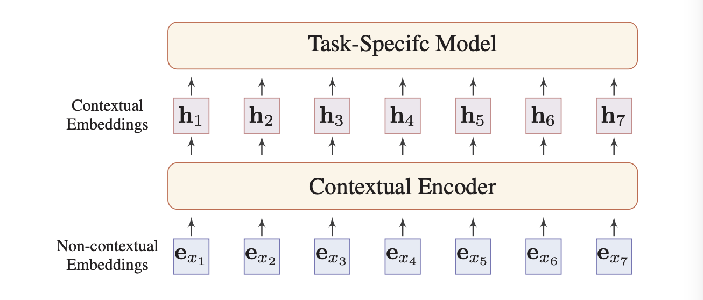
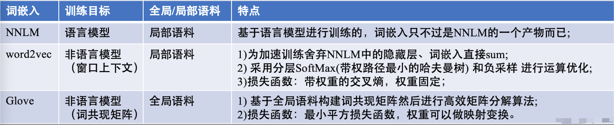
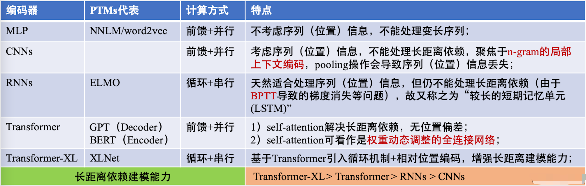
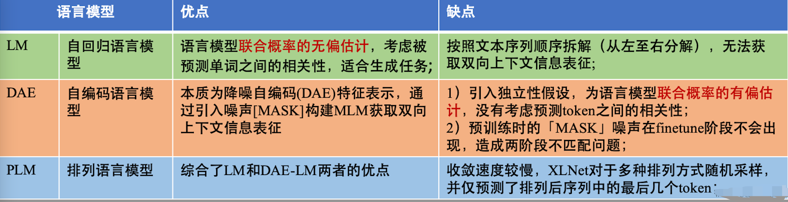
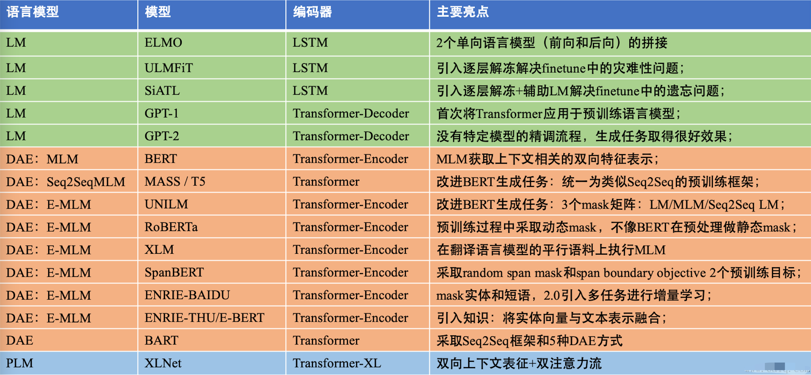
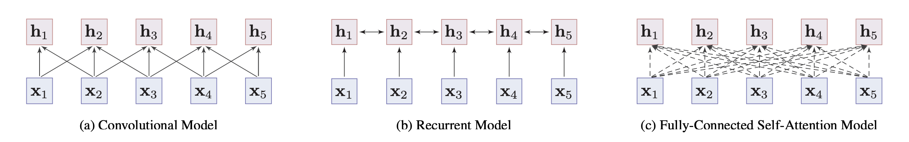
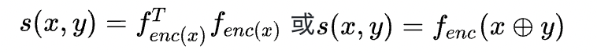
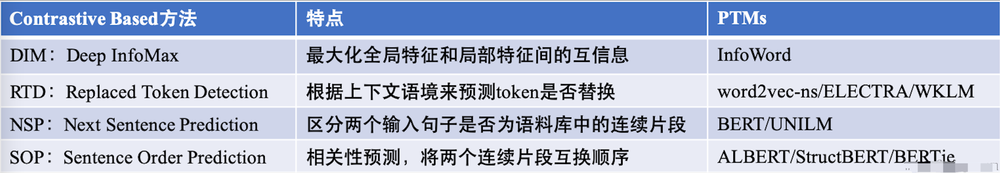
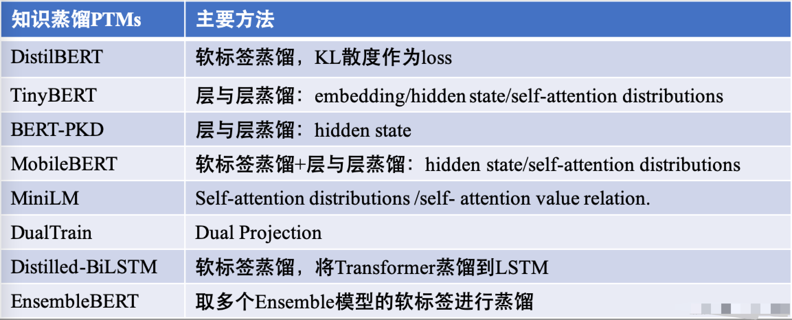

# NLP - 预训练模型

**预训练模型（Pre-trained Models,PTMs）**的出现将NLP带入了一个全新时代，下文系统地对PTMs进行了归纳分类整合。

通用的NLP神经网络架构：

​       

# 一 预训练原因？

深度学习时代，为了充分训练深层模型参数并**防止过拟合**，通常需要更多标注数据喂养，而在NLP领域，标注数据更是一个昂贵资源。PTMs从大量无标注数据中进行预训练，使许多NLP任务获得显著的性能提升。

预训练模型PTMs的优势：

> 1. 在庞大的无标注数据上进行预训练可以获取更**通用的语言表示**，并有利于下游任务；
> 2. 为模型提供了一个更好的初始化参数，在目标任务上具备**更好的泛化性能**，并**加速收敛**；
> 3. 是一种有效的正则化手段，避免在小数据集上过拟合（一个随机初始化的深层模型容易对小数据集过拟合）；

​     

# 二 PTMs与分布式表示

**什么是词嵌入和分布式表示**？

* **词嵌入**（Word Embedding）：是自然语言处理（NLP）中语言模型与表征学习技术的统称，从概念上，是指把一个维数为所有词的数量的高维空间嵌入到一个维数低得多的连续向量空间中，每个单词或词组被映射为实数域上的向量，这也是分布式表示。其次，向量的每一维度都没有实际意义，而整体代表一个具体概念。
* **分布式表示**：相较于传统的独热编码（one-hot）表示具备更强的表示能力，而且独热编码存在维度灾难和语义鸿沟（不能进行相似度计算）等问题。传统的分布式表示方法，如矩阵分解（SVD/LSA）、LDA等均是根据全局语料进行训练，是机器学习时代的产物。

PTMs也属于分布式表示的范畴，本文的PTMs主要介绍深度学习时代、自NNLM以来的 “modern” 词嵌入。

​       

# 三 PTMs范式分类

PTMs的发展经历从**浅层的词嵌入**到 **深层编码** 两个阶段，按照这两个主要的发展阶段，可归纳出PTMs两大范式：「浅层词嵌入」和「预训练编码器」

​      

## 1 浅层词嵌入（Non-Contextual Embeddings, static）

浅层词嵌入，这一类PTMs范式也就是通常所说的 “词向量”，其主要特点是**学习到的是上下文独立的静态词嵌入**，主要代表有 NNLM、word2vec（CBOW、Skip-Gram）、Glove等。其次，这一类词嵌入通常采取浅层网络进行训练，且应用于下游任务时，整个模型的其余部分仍需要从头开始学习。因此，对于这一范式的PTMs没有必要采取深层神经网络进行训练，采取浅层网络加速训练也可以产生好的词嵌入。

浅层词嵌入的主要缺陷：

- 1）词嵌入与上下文无关（静态的），每个单词的嵌入向量始终是相同，因此不能解决**一词多义**的问题；
- 2）通常会出现词汇量不足（out-of-vocabulary, OOV）问题，为了解决这个问题，相关文献提出了字符级表示（character-level）或子词（sub-word）表示，如CharCNN、FastText 和 Byte-Pair Encoding；

**PS**：Glove可以被看作是更换了目标函数和权重函数的全局word2vec，此外相关文献也提出了句子和文档级别的嵌入方式，如 Skip-thought、Context2Vec等。

​        

## 2 预训练编码器（Contextual Embeddings）

第二类PTMs范式为**预训练编码器**，主要目的是通过一个预训练的编码器能够**输出上下文相关的词向量，解决一词多义的问题**，这一类预训练编码器输出的向量称之为「上下文相关的词嵌入」。

PTMs 中预训练编码器通常采用 LSTM 和 Transformer（Transformer-XL），其中 Transformer 又依据其 attention-mask 方式分为 Transformer-Encoder 和 Transformer-Decoder 两部分，此外Transformer 也可看作是一种图神经网络 GNN。

这一类「预训练编码器」范式的 PTMs 主要代表有 **ELMO**、**GPT-1**、**BERT**、**XLNet** 等。

​        

# 四 PTMs 任务类型分类

PTMs 按照任务类型可分为 2 大类：监督学习 和 无监督学习/自监督学习

* **监督学习**（Supervised learning, SL）：即根据由输入输出对组成的训练数据来学习将输入映射到输出的函数，在 NLP-PTMs 中的主要代表就是 **CoVe**，CoVe 作为机器翻译的 encoder 部分可以应用于多种 NLP 下游任务，且除了 CoVe 外，NLP 中的绝大多数 PTMs 属于自监督学习；
* **无监督学习**（Unsupervised learning, UL）/ **自监督学习**（Self-Supervised learning, SSL）：无监督学习是是从未标记的数据中寻找一些内在知识的方法，例如聚类、密度等，而自监督学习可以视作是无监督学习的一种方法，主要是**利用辅助任务从大规模的无监督数据中挖掘自身的监督信息，通过这种构造的监督信息对网络进行训练，从而可以学习到对下游任务有价值的表征**。因此，从“构造监督信息”这个角度来看，自监督也可看作是监督学习和无监督学习的一种融合，其次从是否由人工标注来看，自监督学习严格来说是属于无监督学习的范畴。

而后，综合各种自监督学习的分类方式，NLP-PTMs 在自监督学习中可分为两种类型：

* 基于上下文（Context Based）
* 基于对比（Contrastive Based）

​     

## 1 基于上下文（Context Based）

基于上下文的**预训练模型**（Pre-trained Models，PTMs），主要基于数据本身的上下文信息构造辅助任务，在NLP中通常引入语言模型作为训练目标。而PTMs中的语言模型可分为以下三大类：

三类模型 PTMs 总结：

​      

### 1.1 自回归语言模型（Autoregressive LM）

在ELMO／BERT出来之前，语言模型一般指的是**根据上文内容预测下一个可能跟随的单词**，或者根据下文预测前面的单词的LM任务，此类LM统称为 **自回归语言模型**。其中，GPT 就是典型的自回归语言模型，而ELMO尽管看上去利用了上文，也利用了下文，但是本质上仍然是自回归LM，这个跟模型具体怎么实现有关系。

> PS：ELMO虽然做了两个方向（从左到右 和 从右到左两个方向的语言模型），但是是分别有两个方向的自回归LM，然后把LSTM的两个方向的隐节点状态拼接到一起，来体现双向语言模型这个事情的，所以这其实是两个自回归语言模型的拼接，本质上仍然是自回归语言模型。

代表模型：ELMO、GPT-1、GPT-2、ULMFiT、SiATL

模型优缺点：

> **缺点**：联合概率按照文本序列**顺序拆解**（从左至右分解），**无法获取双向上下文信息表征**，只能利用上文或者下文的信息。当然，貌似ELMO这种双向都做，而且拼接看上去能够解决这个问题，但由于融合模式过于简单，所以效果其实并不是太好；
>
> **优点**：语言模型**联合概率的无偏估计**，即为传统的语言模型，考虑被预测单词之间的相关性，天然适合处理自然生成的NLP任务，比如 `生成类任务` / `文本摘要` / `机器翻译` 等，这些任务在实际生成内容的时候，就是从左向右的。而Bert在生成类NLP任务中就面临**训练**过程和**应用**过程不一致的问题，导致生成类的NLP任务到目前为止都做不太好；
>
> 

​      

### 1.2 自编码语言模型（Autoencoder LM）

相比而言自回归模型，Bert通过在输入X中随机Mask掉一部分单词，然后预训练过程的主要任务之一是根据上下文单词来预测这些被Mask掉的单词，而那些被Mask掉的单词就是在输入侧加入的所谓噪音，这种类似Bert这种预训练模式，被称为DAE LM。

> DAE：Denoising Autoencoder，降噪自编码，通过引入噪声[MASK]构建MLM获取双向上下文信息表征

代表模型：BERT、MASS、T5、RoBERTa、UniLM、XLM、SpanBERT、ERNIE-Baidu、E-BERT、ERNIE-THU、BART

模型优缺点：

> **优点**：本质为**降噪自编码（DAE）**特征表示，通过引入噪声[MASK]构建**MLM**（Masked language model），获取双向上下文信息表征，其中在此 DAE统一表示为自编码语言模型，旨在采用部分损坏的输入，恢复原始的未失真输入。即如果当前token被预测，则 m(t)=1，否则m(t)=0，其中x^~ 为原始文本被替换后的输入。
>
> 

>
> **缺点**：
>
> - 引入独立性假设，为**语言模型联合概率的有偏估计**，没有考虑预测token之间的相关性；
> - 预训练时，[MASK] 噪声在Fine-tuneing阶段不会出现（该阶段无法看到[Mask]标记），造成两阶段不匹配问题，而为解决这一问题，在15%被预测的token中，80%被替换为「MASK」，10%被随机替换，10%被替换为原词；

其中，**BERT**是自编码语言模型的一个典型代表，但其采用的MLM策略和Transformer-Encoder结构，导致其不适合直接处理生成任务。为了解决这一问题，也可采用基于**Seq2Seq MLM**方法，即encoder部分采取masked策略，而decoder部分以自回归的方式预测encoder部分被mask的token。

此外，还有很多基于自编码语言模型的PTMs提出了不同的MLM增强策略，称之为 Enhanced Masked Language Modeling (**E-MLM**)。

​       

### 1.3 排列语言模型（PLM）

**排列语言模型**（Permuted Language Model，PLM）综合了LM和DAE-LM两者的优点，严格来讲，**PLM** 和 **LM** 是标准的自回归语言模型（注：PLM是一种广义的自回归方法），而 **MLM** 不是一个标准的语言模型，其引入独立性假设，**隐式地学习**预测token（mask部分本身的强相关性）之间的关系。

如果衡量序列中被建模的依赖关系的数量，标准的自回归语言模型可以达到上界，不依赖于任何独立假设，因此LM和PLM能够通过自回归方式来**显式地学习**预测token之间的关系。然而，LM无法对双向上下文进行表征，借鉴 NADE的思想，PLM将这种传统的自回归语言模型（LM）进行推广，将顺序拆解变为**随机拆解**（从左至右分解），产生上下文相关的双向特征表示。

PLM典型代表是 **XLNet**，其提出一个框架来连接标准语言模型建模方法和预训练方法，这是对标准语言模型的一个复兴。

一个关键问题：**为什么PLM可以实现双向上下文的建模** ？

> **PLM本质就是语言模型联合概率的多种分解机制的体现**，其将LM的顺序拆解推广到**随机拆解**，但PLM没有改变原始文本序列的自然位置，只是**定义了token预测的顺序**，而且只是针对语言模型建模不同排列下的因式分解排列，并不是词的位置信息的重新排列。

​      

### 1.4 编码器网络结构类型

大多数神经网络编码器架构（Neural Contextual Encoders, NCE）可以分为两类：序列模型和非序列模型

> **序列模型**：通常是按顺序捕获单词的局部上下文内容
>
> * 卷积模型（Convolutional Models ）：即在输入句子中利用单词的embeddings，通过卷积运算从相邻单词中聚合信息来捕获单词的含义；
> * 循环模型（Recurrent Models）：即通过短期记忆来捕获单词的上下文表示，例如 LSTM 和 GRU，且在实践中，双向 LSTM 或 GRU 模型常用于从单词的上下文获取信息，但其性能往往受到**序列依赖关系问题**的影响；
>
> **非序列模型**：使用预定义的词间的树或图结构来学习单词的上下文表示，例如句法结构或语义关系，典型的非序列模型包括 RNN、TreeLSTM 和 GCN模型。而且，尽管语言感知图结构可以提供有用的归纳偏差，但如何构建良好的图结构也是一个具有挑战性的问题，
>
> * 全连接自注意力模型（Fully-Connected Self-Attention Model ）：具体实践中，更直接的方法是使用全连接图对每两个词的关系进行建模，让模型自己学习结构，而且通常**可隐含表示单词间联系**的权重是由自注意力机制动态计算的。目前，Transformer模型的使用是全连接自注意力模型的一个成功案例，但仍依赖其他补充模块，例如位置嵌入（positional embeddings）、层归一化（layer normalization）、残差连接（residual connections）和位置前馈网络 (FFN) 层（position-wise feed-forward network）。

​                   

## 2 基于对比（Contrastive Based）

基于对比（Contrastive Based），不同于 **Context Based** 主要基于数据本身的上下文信息构造辅助任利用，Contrastive Based 主要**利用样本间的约束信息构造辅助任务**，这类方法也是 对比学习（Contrastive learning, CTL）。CTL 假设**观察到的文本对（正样本）在语义上比随机采样的文本（负样本）更相似**，且其背后的原理是「在对比中学习」，其次相较于语言建模，CTL 的计算复杂度更低，因而在预训练中是理想的替代训练标准。

CTL 通过构建正样本（positive）和负样本（negative），然后**度量正负样本的距离**来实现自监督学习，即可以使用点积的方式构造距离函数，然后构造一个 softmax 分类器，以正确分类正样本和负样本，并且**鼓励相似性度量函数将较大的值分配给正例，将较小的值分配给负例**：

相似性度量函数通常可采取两种方式：

各类PTMs总结：

​     

### 2.1 Deep InfoMax (DIM)

DIM 方法来源于CV领域，对于**全局特征**（编码器最终的输出）和**局部特征**（编码器中间层的特征），DIM需要判断全局特征和局部特征是否来自同一图像。

**InfoWord** 将DIM引入到NLP中，用Mutual Information的一个下界InfoNCE来重新解释BERT和XLNET的objective，并提出一个新的DIM objective以最大化一个句子的global representation和其中一个ngram的local representation之间的Mutual Information。

​     

### 2.2 Replaced Token Detection (RTD)

**噪声对比估计**（Noise-Contrastive Estimation，NCE）通过训练一个二元分类器来区分真实样本和假样本，可以很好的训练词嵌入，而RTD与NCE 相同，**根据上下文语境来预测token是否替换** 。

- **word2vec** 中的negative sampling可看作是RTD，负样本从词表中进行带权采样；
- **ELECTRA** 提出了一种新的预训练任务框架，构建**生成器-判别器**
  - 生成器通过MLM任务对被mask的token进行预测，迭代器**判断原始句子中的每个token是否被replace过**。
  - 生成器相当于对输入进行了筛选，使判别器的任务更难，从而学习到更好的表示。
  - 生成器-判别器共享embedding，生成器部分采用small-bert，判别器部分对每一个token采用sigmoid计算loss，其次fine-tune阶段只采用判别器部分，且其中RTD也被看作解决MLM中「MASK」在预训练和finetune间差异的一种手段。
- **WKLM** 在实体level进行替换，替换为具有相同实体类型的实体名称；

​       

### 2.3 Next Sentence Prediction (NSP)

NSP 区分两个输入句子是否为训练语料库中的连续片段，第二个句子50%为第一句子实际的连续片段，50%从其他语料随机选择，其次NSP可以**引导模型理解两个输入句子之间的关系**，从而使对此信息敏感的下游任务受益，如QA任务。

> PS：RoBERTa表明，NSP在对单个文档中的文本块进行训练时，去除NSP任务或在下游任务上可以稍微提高性能

​      

### 2.4 Sentence Order Prediction (SOP)

SOP 使用同一文档中的两个连续片段作为正样本，而**相同的两个连续片段互换顺序作为负样本**，采取SOP任务的PTMs有ALBERT、StructBERT、BERTje。

> 注：与 SOP不同的是，NSP融合了主题预测和相关性预测，主题预测更容易，这使得模型进行预测时仅依赖于主题学习

​       

# 五 PTMs扩展

## 1 引入领域知识 Knowledge-Enriched

PTMs 通常**从通用大型文本语料库中学习通用语言表示，但是缺少特定领域的知识**，但PTMs 中设计一些辅助的预训练任务，将外部知识库中的领域知识整合到 PTMs 中被证明是有效的：

- **ERNIE-THU** 将在知识图谱中预先训练的实体嵌入与文本中相应的实体提及相结合，以增强文本表示。由于语言表征的预训练过程和知识表征过程有很大的不同，会产生两个独立的向量空间，且为解决上述问题，在有实体输入的位置，将实体向量和文本表示通过非线性变换进行融合，以融合词汇、句法和知识信息；
- **LIBERT**（语言知识的 BERT）通过附加的语言约束任务整合了语言知识；
- **SentiLR** 集成了每个单词的情感极性，以将 MLM 扩展到标签感知 MLM（LA-MLM），ABSA 任务上都达到 SOTA；
- **SenseBERT** 不仅能够预测被 mask 的 token，还能预测它们在给定语境下的实际含义，且使用英语词汇数据库 WordNet 作为标注参照系统，预测单词在语境中的实际含义，显著提升词汇消歧能力；
- **KnowBERT** 与实体链接模型以端到端的方式合并实体表示；
- **KG-BERT** 显示输入三元组形式，采取两种方式进行预测，即构建三元组识别和关系分类，共同优化知识嵌入和语言建模目标，且这些工作通过实体嵌入可注入知识图的结构信息；
- **K-BERT** 将从 KG 提取的相关三元组显式地注入句子中，以获得 BERT 的扩展树形输入；
- **K-Adapter** 通过针对不同的预训练任务独立地训练不同的适配器来注入多种知识，从而可以不断地注入知识，以解决注入多种知识时可能会出现灾难性遗忘问题；
- 此外，这类 PTMs 还有 WKLM、KEPLER 等

​      

## 2 模型压缩 Model Compression

由于预训练的语言模型通常包含**至少数亿个参数**，因此很难将它们部署在现实应用程序中的在线服务和资源受限的设备上，而模型压缩是**减小模型尺寸并提高计算效率的有效方法**。

5种PTMs的压缩方法：

> **pruning（剪枝）**：将模型中影响较小的部分舍弃
>
> * 如 Compressing BERT，还有结构化剪枝 LayerDrop* ，其在训练时进行 Dropout，预测时再剪掉 Layer，不像知识蒸馏需要提前固定 student 模型的尺寸大小；
>
> **quantization（量化）**：将高精度模型用低精度来表示
>
> * 如 Q-BERT 和 Q8BERT* ，量化通常需要兼容的硬件
>
> **parameter sharing （参数共享）**：相似模型单元间的参数共享
>
> * ALBERT* 主要是通过矩阵分解和跨层参数共享来做到对参数量的减少
>
> **module replacing（模块替换）**
>
> * BERT-of-Theseus* 根据伯努利分布进行采样，决定使用原始的大模型模块还是小模型，只使用 task loss
>
> **knowledge distillation （知识蒸馏）**：通过一些优化目标从大型、知识丰富、fixed 的 teacher 模型学习一个小型的 student 模型，目前蒸馏机制主要分为 3 种类型：
>
> * 从软标签蒸馏：DistilBERT、EnsembleBERT
> * 从其他知识蒸馏：TinyBERT、BERT-PKD、MobileBERT、 MiniLM、DualTrain
> * 蒸馏到其他结构：Distilled-BiLSTM
>
> 

​      

## 3 多模态 Multi-Modal

随着 PTMs 在 NLP 领域的成功，许多研究者开始关注多模态领域的 PTMs，主要为通用的视觉和语言特征编码表示而设计。多模态的 PTMs 在一些庞大的跨模式数据语料库（带有文字的语音、视频、图像）上进行了预训练，如带有文字的语音、视频、图像等，主要有 VideoBERT、CBT 、UniViLM、 ViL-BERT 、 LXMERT、 VisualBERT 、 B2T2 、Unicoder-VL 、UNITER 、 VL-BERT 、 SpeechBERT。

​      

## 4 领域预训练 Domain-Specific

大多数 PTM 都在诸如 Wikipedia 的通用语料中训练，而在领域化的特定场景会收到限制，比如基于生物医学文本的 BioBERT，基于科学文本的 SciBERT，基于临床文本的 Clinical-BERT，其次一些工作还尝试将 PTMs 适应目标领域的应用，如医疗实体标准化、专利分类 PatentBERT、情感分析 SentiLR 关键词提取。

​     

## 5 多语言和特定语言 Language-Specific

学习跨语言共享的多语言文本表示形式对于许多跨语言的 NLP 任务起着重要的作用：

> **Multilingual-BERT** 在 104 种 Wikipedia 文本上进行 MLM 训练（共享词表），每个训练样本都是单语言文档，没有专门设计的跨语言目标，也没有任何跨语言数据，M-BERT 也可以很好的执行跨语言任务；
>
> **XLM** 通过融合跨语言任务（翻译语言模型）改进了 M-BERT，该任务通过拼接平行语料句子对进行 MLM 训练；
>
> **Unicoder** 提出了 3 种跨语言预训练任务：
>
> * 1）cross-lingual word recovery
> * 2）cross-lingual paraphrase classification
> * 3）cross-lingual masked language model

虽然多语言的 PTMs 在跨语言上任务表现良好，但用单一语言训练的 PTMs 明显好于多语言的 PTMs，此外一些单语言的 PTMs 被提出：BERT-wwm， ZEN, NEZHA , ERNIE-Baidu, BERTje, CamemBERT, FlauBERT, RobBERT。

​       

# 六 PTMs迁移学习

PTMs 从大型语料库中获取通用语言知识，如何有效地将其知识适应下游任务是一个关键问题，目前迁移学习的方式主要有 **归纳迁移**（顺序迁移学习、多任务学习）、**领域自适应**（转导迁移）、**跨语言学习**等，现阶段NLP 中 PTMs 的迁移方式是顺序迁移学习。

   

## 1 如何迁移

迁移学习过程：

> 1）合适的**预训练任务**：语言模型中 PTM 是最为流行的预训练任务，不同的预训练任务有其自身的偏置，并且对不同的任务会产生不同的效果，例如NSP 任务可以使诸如问答（QA）和自然语言推论（NLI）之类的下游任务受益；
>
> 2）合适的**模型架构**：例如 BERT 采用的 MLM 策略和 Transformer-Encoder 结构，导致其不适合直接处理生成任务；
>
> 3）合适的**数据**：下游任务的数据应该近似于 PTMs 的预训练任务，现在已有有很多现成的 PTMs 可以方便地用于各种特定领域或特定语言的下游任务；
>
> 4）合适的 **layers** 进行 transfer：主要包括 Embedding 迁移、top layer 迁移和 all layer 迁移，比如 word2vec 和 Glove 可采用 Embedding 迁移，BERT 可采用 top layer 迁移，Elmo 可采用 all layer 迁移；
>
> 5）**特征集成** 还是 **fine-tune**？
>
> * 特征集成：预训练参数是 freeze 的，需要特定任务的体系结构
> * fine-tune：预训练参数 是 unfreeze 的，其任务结构通常比特征提取方法更为通用和方便

​     

## 2 fine-tune 策略

通过更好的微调策略进一步激发 PTMs 性能

> **两阶段 fine-tune 策略**：如第一阶段对中间任务或语料进行 fine-tune，第二阶段再对目标任务 fine-tune，且第一阶段通常可根据特定任务的数据继续进行 fine-tune 预训练；
>
> **多任务 fine-tune**：MTDNN 在多任务学习框架下对 BERT 进行了 fine-tune，这表明多任务学习和预训练是互补的技术；
>
> **采取额外的适配器**：fine-tune 的主要缺点是其**参数效率低，每个下游任务都有自己的 fine-tune 参数**，因此更好的解决方案是**在固定原始参数的同时，将一些可 fine-tune 的适配器注入 PTMs**；
>
> **逐层阶段**：逐渐冻结而不是同时对所有层进行 fine-tune，也是一种有效的 fine-tune 策略；

​        

# 七 PTMs 问题

虽然 PTMs已经在很多 NLP 任务中显示出了他们强大的能力，然而由于语言的复杂性，仍存在诸多挑战：

## 1 PTMs的上限

目前，PTMs并没有达到其上限，大多数的PTMs可通过使用**更长训练步长和更大数据集**来提升其性能，虽然目前NLP中的SOTA也可通过加深模型层数来更进一步提升，但这将导致更加高昂的训练成本。因此，一个更加务实的方向是在现有的软硬件基础上，设计出更高效的模型结构、自监督预训练任务、优化器和训练技巧等，例如 ELECTRA 就是此方向上很好的一个解决方案。

​      

## 2 面向任务的预训练和模型压缩

实践过程不同的目标任务需要 PTMs拥有不同功能，而 PTMs与下游目标任务间的差异通常在于两方面：**模型架构**与**数据分布**

尽管较大的PTMs通常情况下会带来更好的性能表现，但在低计算资源下如何使用是一个实际问题，例如对于 NLP 的 PTM 来说，对于模型压缩的研究只是个开始，Transformer 的全连接架构也使得模型压缩具有挑战性。

​    

## 3 PTMs的架构设计

对于PTMs，Transformer 已经被证实是一个高效的架构，然而 Transformer 最大的局限在于其**计算复杂度（输入序列长度的平方倍）**，而且受限于 GPU 显存大小，目前大多数 PTM 无法处理超过 512 个 token 的序列长度，所以如果要打破这一限制，则需要改进 Transformer 的结构设计，例如 Transformer-XL。

​        

## 4 finetune中的知识迁移

fine-tune是目前**将 PTM 的知识转移至下游任务的主要方法**，但效率却很低，每个下游任务都需要有特定的finetune参数，而一个可以改进的解决方案是固定PTMs的原始参数，并为特定任务添加小型的finetune适配器，这样就可以使用共享的PTMs 服务于多个下游任务。

​       

## 5 PTMs 的解释性与可靠性

PTMs 的可解释性与可靠性仍然需要从各个方面去探索，它能够帮助我们理解 PTM 的工作机制，为更好的使用及性能改进提供指引。

​        

​       

# 注意事项

文章总结与综述论文的一些不同之处：

> 1. 文章定义了PTMs两大范式：**浅层词嵌入和预训练编码器**，不同于原文，XLNet在原综述论文中被归为Transformer-Encoder，本文认为将其归为Transformer-XL更合适；
> 2. 文章PTMs按照自监督学习的分类不同于原文，本文按照 基于上下文（Context Based）和基于对比（Contrastive Based）两种方式归类，并将原文的 LM、MLM、DAE、PLM 归为Context Based；
> 3. 文章将原文 **MLM和DAE** 统一为DAE；

​        

​      

# 附录

1. [Pre-trained Models for Natural Language Processing: A Survey](https://arxiv.org/pdf/2003.08271.pdf)
2. [PTMs：史上最全面总结 NLP 预训练模型](https://zhuanlan.zhihu.com/p/115014536)
3. [nlp中的预训练语言模型总结](https://zhuanlan.zhihu.com/p/76912493)

