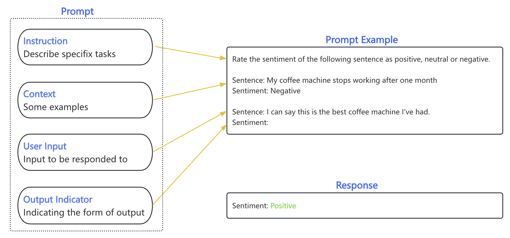
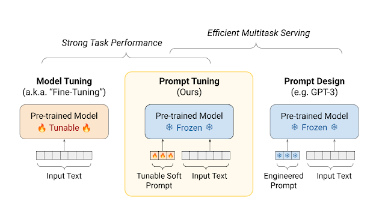
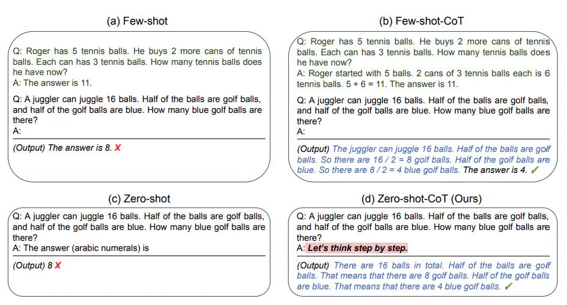
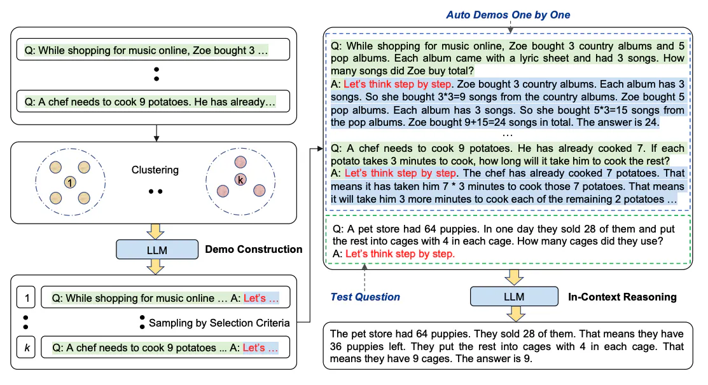
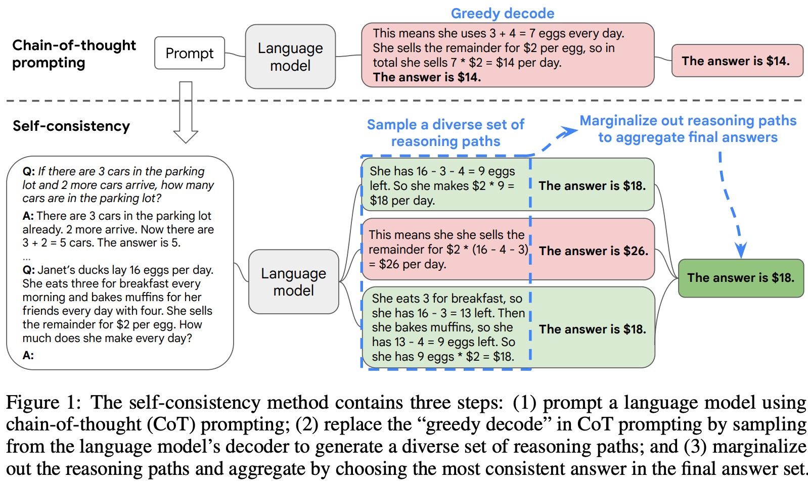
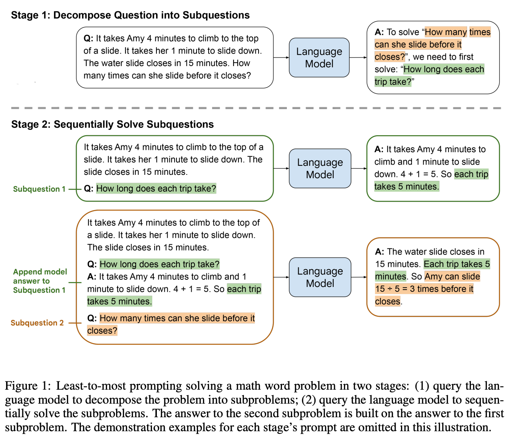
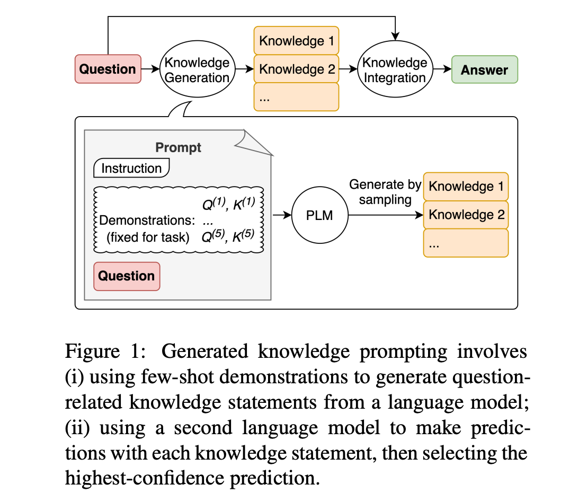
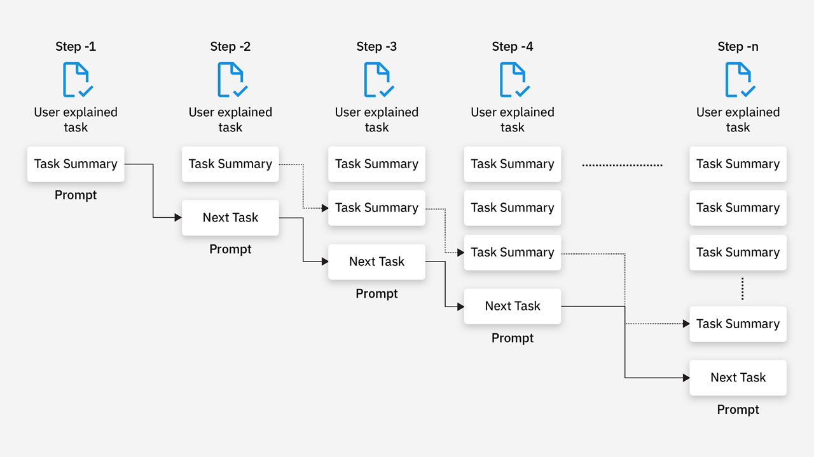
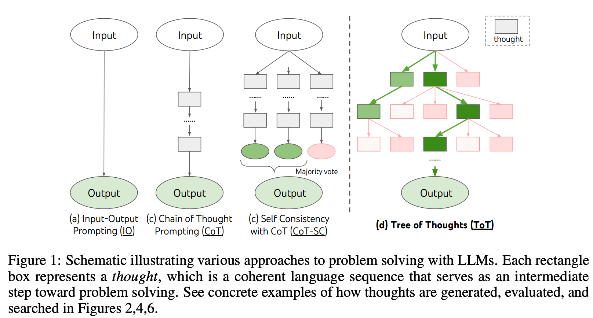

# Prompt理解

  

# 概念

## Prompt

Prompt指在给定一些部分文本的情况下，让计算机生成自然语言文本的任务或方式，通常是一句话或一段话，作为计算机生成自然语言文本的输入，一般由以下元素组成

- **指令 Instruction**：希望模型执行的具体任务或指令
- **上下文 Context**：包含外部信息或额外的上下文信息，引导语言模型更好地响应
- **输入 Input Data**：输入的内容或问题
- **输出格式 Output Indicator**：指定输出的类型或格式

## Prompt Engineering

Prompt Engineering指对**Prompt进行设计、优化和调整的过程**，可以根据特定的目标和语境设计出一系列问题或任务，使得LLM在给定Prompt的情况下可以生成更加准确、连贯和有意义的自然语言文本，通常包含以下部分：

- **确定任务类型和输入输出格式**：首先需要确定具体任务类型和输入输出格式，例如：对于文本生成任务，输入可能是一些描述性的句子，输出可能是一个标题或摘要，这将有助于缩小搜索范围并找到合适的Prompt；
- **筛选候选Prompt**：即从训练好的Prompt集合中筛选出与任务类型和输入输出格式相匹配的候选Prompt，可以根据Prompt的长度、内容、格式等特征进行筛选；
- **优化和调整**：如果没有找到合适的Prompt，可以根据评估结果进行优化和调整，例如：可以尝试增加或减少Prompt的长度、调整Prompt中的关键词和短语等；
- **多样性和控制**：即对于一些需要多样性和控制的任务，例如：生成多样化的回复或者满足不同偏好的文本，可以使用多个Prompt组合，或者通过参数控制生成的文本多样性和质量；
- **将Prompt与输入文本合并**：即将选择的Prompt与输入文本按照一定的规则进行拼接，形成模型的输入，以便让模型能够理解提示和条件信息，并生成符合要求的文本；

   

# 应用

## 基础任务

针对简单任务，可以通过基通用的提示技术优化任务结果

### 明确指令/分隔符/上下文

即将指令放在Prompt的开头，并使用 **###**、**///**、**"""** 等分隔符和上下文

|       | 效果较差❌                                                    | 更好✅                                                        |
| ----- | ------------------------------------------------------------ | ------------------------------------------------------------ |
| Input | 概括以下文本  情况通报： 2023年10月16日8时许，崇州市羊马街道恒大西辰绿洲小区内发生一起女童被狗咬伤事件。 事件发生后，崇州市迅速组织公安、卫健、羊马街道等部门成立联合调查工作组开展调查，已初步查明违法事实，现将相关情况通报如下。 经查明，10月16日7时20分，两只涉事犬只窜入事发小区，8时许发生伤人事件。8时20分，涉事白色拉布拉多犬于现场捕获，21时许犬只主人贾某到案。22时许，伤人黑色罗威纳犬被捕获；10月17日3时许，黑色罗威纳犬主人唐某到案。目前，警方已对该事件立案侦查，并对黑色罗威纳犬主人唐某依法采取刑事强制措施。案件正在进一步侦办中。 为了得到更好治疗，受伤女童已于10月16日23时许转至华西医院，由医疗专家组进一步治疗，目前生命体征平稳。我们将持续做好女童医治和关心关爱等工作。  崇州市联合调查工作组 2023年10月17日 | 概括**///**中的文本，下面是执行指令的要求： 输出的概括文本小于200字，要求精炼简洁，不错过文中的重点核心内容，有时间、地点、人物、起因、经过、结果六要素。   输入： **///**  情况通报： 2023年10月16日8时许，崇州市羊马街道恒大西辰绿洲小区内发生一起女童被狗咬伤事件。 事件发生后，崇州市迅速组织公安、卫健、羊马街道等部门成立联合调查工作组开展调查，已初步查明违法事实，现将相关情况通报如下。  经查明，10月16日7时20分，两只涉事犬只窜入事发小区，8时许发生伤人事件。8时20分，涉事白色拉布拉多犬于现场捕获，21时许犬只主人贾某到案。22时许，伤人黑色罗威纳犬被捕获；10月17日3时许，黑色罗威纳犬主人唐某到案。目前，警方已对该事件立案侦查，并对黑色罗威纳犬主人唐某依法采取刑事强制措施。案件正在进一步侦办中。 为了得到更好治疗，受伤女童已于10月16日23时许转至华西医院，由医疗专家组进一步治疗，目前生命体征平稳。我们将持续做好女童医治和关心关爱等工作。  崇州市联合调查工作组 2023年10月17日 **///** |

  

### 具象化输入

即具体说明上下文、结果、长度、格式、风格等，限定结果范围，减少不精确的描述

|       | 效果较差❌      | 更好✅                                                        |
| ----- | -------------- | ------------------------------------------------------------ |
| Input | 制作烤鸡的步骤 | 制定标准化制作烤鸡的流程，重点列出烹饪阶段的技巧和时间，不要超过3个阶段，每个阶段使用3-5句话 |

### 阐明输出格式

即可以通过要求模型按照指定的方案、格式输出的结果，模型给到的回复能更加的准确，具体，没有多余的废话

|       | 效果较差❌                                                    | 更好✅                                                        |
| ----- | ------------------------------------------------------------ | ------------------------------------------------------------ |
| Input | 提取下面的待办事项 2020年，研发团队希望把微信/QQ上产生的大量非结构化的音频和视频转化成文字，方便用户检索和获取信息。与此同时，产品团队也发现用户通过会议保留了音频和视频，但很少利用，希望对这些数据做结构化处理。双方需求对上之后，研发团队和算法团队五六个人就开始动手开发demo版本。 | 指令： 提取///中的待办事项，下面是执行指令的步骤建议： 1. 判断文本是否有待办事项，没有则输出： 2. 没有发现待办事项将提取到的待办事项输出为任务清单，一个任务清单的格式为：- 任务，任务清单描述精炼简洁  输入： **///** 2020年，研发团队希望把微信/QQ上产生的大量非结构化的音频和视频转化成文字，方便用户检索和获取信息。与此同时，产品团队也发现用户通过会议保留了音频和视频，但很少利用，希望对这些数据做结构化处理。双方需求对上之后，研发团队和算法团队五六个人就开始动手开发demo版本。  **///** |

### 零样本 -> 少样本

即现有的LLM模型往往已经经过了大量数据的训练，让我们可以不提供示例的前提下，模型也能根据已学习的信息回答问题，但增加上下文和少量提示样本，可以帮助大模型更好地拆解问题，提升解决复杂任务的表现。

|       | 效果较差❌                                                    | 更好✅                                                        |
| ----- | ------------------------------------------------------------ | ------------------------------------------------------------ |
| Input | 从下面的文本中提取关键字。 文本：OpenAI 训练了非常擅长理解和生成文本的尖端语言模型。我们的 API 提供对这些模型的访问，并且可用于解决几乎任何涉及处理语言的任务。 关键字： | 你是一个计算机领域的专家，从下面相应的文本中提取计算机领域的关键词。 文本 ：Stripe 提供 API，Web 开发人员可以使用这些 API 将支付处理集成到他们的网站和移动应用程序中。  关键词 ：API、Web 开发、集成、网站、移动应用程序 文本 ：OpenAI 训练了非常擅长理解和生成文本的尖端语言模型。我们的 API 提供对这些模型的访问，并且可用于解决几乎任何涉及处理语言的任务。  关键词： |

## 进阶任务

针对较为复杂任务，可以通过更高级的提示工程技术，提升模型的处理能力

### 链式思考（CoT, Chain-of-Thought）

> https://arxiv.org/pdf/2201.11903.pdf

链式思考即结合**上下文学习**、**少样本提示**和引入**中间推理**过程，提升大模型在数学计算、推理方面处理问题的效果，经实验验证CoT在大模型上效果明显，甚至超过了有监督训练的性能

#### Zero-Cot

即在零样本的基础上，将“让我们逐步思考”(Let's think step by step) 添加到原始提示中

#### Auto-CoT

Auto-CoT 主要由两个阶段组成：

- 阶段1：**问题聚类**，将给定问题划分为几个聚类
- 阶段2：**演示抽样**，从每组数组中选择一个具有代表性的问题，并使用带有简单启发式的 Zero-Shot-CoT 生成其推理链

简单的启发式方法可以是问题的长度（例如：60 个 tokens）和理由的步骤数（例如：5 个推理步骤）。该过程如下图所示：

### 自我一致性（SELF-CONSISTENCY）

> https://arxiv.org/pdf/2203.11171

自我一致性旨在 “替换链式思维提示中使用的天真贪婪解码方法”，其想法是通过**少样本CoT** 采样多个不同的推理路径，并使用生成结果选择最一致的答案，这有助于提高CoT提示在涉及算术和常识推理的任务中的性能。

### 拆解问题（LEAST-TO-MOST）

> https://arxiv.org/pdf/2205.10625.pdf

CoT在容易问题上效果很好，但在复杂的问题上效果不显著，Least-to-Most Prompting 思路也很简单，就是**先把问题分解成更简单的多个子问题，然后再逐个回答子问题，最终获得原始问题的答案**。

|             | Input                                                        |
| ----------- | ------------------------------------------------------------ |
| CoT         | 当我6岁时，我的妹妹是我的一半年龄。现在我70岁了，我的妹妹多大？ |
| 拆解问题CoT | Q1： 将下面的问题分解成几个子问题：当我6岁时，我的妹妹是我的一半年龄。现在我70岁了，我的妹妹多大？  Q2：**按顺序解决上面的子问题** |

### 生成知识提示（Generated Knowledge Prompting）

> https://arxiv.org/pdf/2110.08387.pdf

在常识推理过程中需要常识知识，而大模型中隐含了大量的知识，可利用Prompt从大模型生成知识语句，运用上下文学习，提升大模型在数学、科学等通用常识上的性能，即

1. 让模型在回答问题前**生成问题对应的知识**；
2. 再将生成知识作为prompt的一部分，帮助模型来推理回答问题；

|              | Input                                                        |
| ------------ | ------------------------------------------------------------ |
| 常识问题     | 问题：高尔夫球的一部分是试图获得比其他人更高的得分。回答是或否 回答： |
| 生成知识提示 | Q1： 输入：一块石头和一颗卵石大小相同。  知识：卵石是一种根据Udden-Wentworth沉积学尺度的颗粒大小为4到64毫米的岩屑。卵石通常被认为比颗粒（直径2到4毫米）大，比卵石（直径64到256毫米）小。  输入：高尔夫球的一部分是试图获得比其他人更高的得分。  知识：   Q2：问题：高尔夫球的一部分是试图获得比其他人更高的得分。回答是或否 知识：高尔夫球是一项运动，玩家使用各种高尔夫球杆将球打入尽可能少的击球数下的洞中。在高尔夫比赛中，球员会竞争击球数，目标是尽量获得较低的得分。因此，可以说高尔夫球的一部分是试图获得比其他人更高的得分，而不是更高的得分。 回答： |

### 链式提示（Prompt Chaining）

>  https://docs.anthropic.com/en/docs/build-with-claude/prompt-engineering/chain-prompts

即将任务分解为许多子任务。，确定子任务后，将子任务的提示词提供给语言模型，得到的结果作为新的提示词的一部分。

提示链可以用于不同的场景，这些场景可能涉及多个操作或转换，例如LLM 的一个常见用途是**根据大型文本文档回答问题**，想要更好阅读大文本文档，可以设计两个不同的提示

* 第一个提示：负责提取相关引文以回答问题；
* 第二个提示：以引文和原始文档为输入来回答给定的问题；

换句话说，可以创建两个不同的提示来执行根据文档回答问题的任务。

### 思维树（ToT, Tree of Thoughts）

> https://arxiv.org/pdf/2305.10601.pdf

无论是**少样本提示**还是**CoT**，推理过程仍然受限于token-level、left-to-right的决策过程，对于探索类、提前规划类的任务表现不佳，ToT在**基于CoT的基础上增加更细节的中间步骤，并使用多种推理路径、自我评估、回溯等方式，引入各类搜索算法如** **BFS**、**DFS**等，模拟人类有意思、考虑多种情况的思维模式，允许 LLM 评估多种推理路径并做出更明智的决定。其主要步骤为：

1. 引导模型进行“思维发散”，生成多个可选结果；
2. 引导模型进行选择（评估），如何评估也是通过prompt来告诉模型，即选择一个or多个结果，聚合每一个步骤选择的所有结果；
3. 交替进行发散、选择+聚合，直到得出结果；

ToT 完成算 24 的游戏任务要执行广度优先搜索（BFS），每步思维的候选项都要求 LM 给出能否得到 24 的评估：“sure/maybe/impossible”（一定能/可能/不可能） 。

作者讲到：“目的是得到经过少量向前尝试就可以验证正确（sure）的局部解，基于‘太大/太小’的常识消除那些不可能（impossible）的局部解，其余的局部解作为‘maybe’保留。”每步思维都要抽样得到 3 个评估结果。整个过程如下图所示：

## 示例

| Prompt                              | Input                                                        |
| ----------------------------------- | ------------------------------------------------------------ |
| 分类 Classification                 | **Sentiment Classification** Classify the text into neutral, negative, or positive Text: I think the food was okay. Sentiment:  **Few-Shot Sentiment Classification** This is awesome! // Negative This is bad! // Positive Wow that movie was rad! // Positive What a horrible show! // |
| 编码 Code Generation                | **生成代码片段 Generate Code Snippets** 即通过使用 /\*<指令>\*/ 注释提示LLM生成相应的代码片段，并给出有关程序的详细信息 /\* generate a dynamic programing Algorithm examples with python /\*  **生成SQL查询语句 Produce MySQL Queries** 即通过提供有关数据库模式的信息来生成有效的MySQL查询 """ Table departments, columns = [DepartmentId, DepartmentName] Table students, columns = [DepartmentId, StudentId, StudentName] Create a MySQL query for all students in the Computer Science Department """ |
| 创造 Creativity                     | **押韵 Rhymes** Can you write a proof that there are infinitely many primes, with every line that rhymes?  **跨学科 Interdisciplinary** Write a supporting letter to Kasturba Gandhi for Electron, a subatomic particle as a US presidential candidate by Mahatma Gandhi.  **发明新词 Inventing New Words** A "whatpu" is a small, furry animal native to Tanzania. An example of a sentence that uses the word whatpu is: We were traveling in Africa and we saw these very cute whatpus.   To do a "farduddle" means to jump up and down really fast. An example of a sentence that uses the word farduddle is: |
| 评价 Evaluation                     | **Evaluate Plato's Dialogue**  1. 背景 Background Plato’s Gorgias is a critique of rhetoric and sophistic oratory, where he makes the point that not only is it not a proper form of art, but the use of rhetoric and oratory can often be harmful and malicious. Can you write a dialogue by Plato where instead he criticizes the use of autoregressive language models?  2. 评价 Evaluate: those outputs are evaluated using the evaluation prompt below Can you compare the two outputs below as if you were a teacher? Output from ChatGPT: {output 1} Output from GPT-4: {output 2} |
| 信息提取 Information Extraction     | **从论文中提取模型名称 Extract Model Names from Papers**  Your task is to extract model names from machine learning paper abstracts. Your response is an array of the model names in the format [\"model_name\"]. If you don't find model names in the abstract or you are not sure, return [\"NA\"]  Abstract: {input} |
| 图片生成 Image Generation           | **Draw a Person Using Alphabet Letters** 处理视觉概念的能力，尽管仅在文本上进行训练，但这对LLM来说是一项具有挑战性的任务，因此需要多次迭代  ***Prompt Iteration 1*** Produce TikZ code that draws a person composed from letters in the alphabet. The arms and torso can be the letter Y, the face can be the letter O (add some facial features) and the legs can be the legs of the letter H. Feel free to add other features.  ***Prompt Iteration 2*** The torso is a bit too long, the arms are too short and it looks like the right arm is carrying the face instead of the face being right above the torso. Could you correct this please?  ***Prompt Iteration 3*** Please add a shirt and pants. |
| 数学理解 Mathematical Understanding | **评估复合函数 Evaluating Composite Functions**  **case1** Suppose  g(x) = f^{-1}(x), g(0) = 5, g(4) = 7, g(3) = 2, g(7) = 9, g(9) = 6 what is f(f(f(6)))?  **case2** The odd numbers in this group add up to an even number: 15, 32, 5, 13, 82, 7, 1. Solve by breaking the problem into steps. First, identify the odd numbers, add them, and indicate whether the result is odd or even. |
| 问答 Question Answering             | **封闭/开放域问答 Closed/Open Domain Question Answering**  In this conversation between a human and the AI, the AI is helpful and friendly, and when it does not know the answer it says "I don’t know". AI: Hi, how can I help you? Human: Can I get McDonalds at the SeaTac airport? |
| 推理 Reasoning                      | **Indirect/Physical Reasoning**  Here we have a book, 9 eggs, a laptop, a bottle and a nail. Please tell me how to stack them onto each other in a stable manner. |
| 文本摘要 Text Summarization         | **解释概念 Explain Concepts**  Antibiotics are a type of medication used to treat bacterial infections. They work by either killing the bacteria or preventing them from reproducing, allowing the body’s immune system to fight off the infection. Antibiotics are usually taken orally in the form of pills, capsules, or liquid solutions, or sometimes administered intravenously. They are not effective against viral infections, and using them inappropriately can lead to antibiotic resistance.  Explain the above in one sentence: |

# AI Prompt工具

**FlowGPT**：ChatGPT Prompts 社区，https://flowgpt.com/

**OpenArt**：针对 Stable Diffusion 指令的手册，https://openart.ai/promptbook

**PromptHero**：发现 Stable Diffusion，Midjourney，ChatGPT和DALL-E 的 Prompts，https://prompthero.com/

**PublicPrompts**：公共免费的高质量 Prompts 合集，https://publicprompts.art/

**TinaMind**：TinaMind是一款用于无限制查询的浏览器扩展，采用GPT-4/4o技术来帮助您进行聊天、互联网搜索、翻译、写作、总结等，https://tinamind.com/

**Awesome ChatGPT Prompts**：一组用于 ChatGPT 模型的 Prompt 示例集合，https://github.com/f/awesome-chatgpt-prompts

**Promptbase**：DALL·E, GPT, Midjourney, Stable Diffusion, ChatGPT 等 AI 工具 Prompt 集合市场，https://promptbase.com/prompt/images-made-of-sound-waves

**Learning Prompt**：一份教你如何更好使好地使用 ChatGPT 和 Midjourney 的免费教程，https://learningprompt.wiki/

# 附录

1. [Prompt Engineering Guide](https://www.promptingguide.ai/zh)

2. [ChatGPT Prompt Engineering for Developers](https://learn.deeplearning.ai/courses/chatgpt-prompt-eng/lesson/1/introduction)

