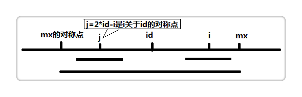

# 最长的回文子串

题目：https://leetcode.com/problems/longest-palindromic-substring/

   

Given a string `s`, return *the longest palindromic substring* in `s`.

A string is called a palindrome string if the reverse of that string is the same as the original string.

​          

# 1. 穷举法BF: T(*n*^3) & S(*n*^2)

**思路**：循环遍历，依次确认子字符串是否是回文字符串，并使用hashmap作为辅助空间，用于剔除已遍历确认的字符串，避免重复验证

```go
func longestPalindrome(s string) string {
    n := len(s)
    if n <= 1 {
        return s
    }
    
    res := string(s[0])
    m := make(map[string]bool)
    for l:=n; l>1; l-- {
        if len(res) >= l {
            break
        }
        
        for i:=0; i<=n-l; i++ {
            if _, ok := m[s[i:i+l]]; ok {
                continue
            }
            
            tmps := maxPalindrome(s, i, i+l-1, m)
            if len(tmps) > len(res) {
                res = tmps
            }
          	
          	fmt.Printf("l=%v, i=%v, res=%v \n", l, i, res)  
          
            if len(res) == l {
                break
            }
        }   
    }
    
    return res
}

// 选择字符串中最长的字符串子串
func maxPalindrome(s string, l int, r int, m map[string]bool) string {
    var res1 string
    left, right := (l + r) / 2, (l + r + 1) / 2
    
    for left >= l && right <=r {
        tmps := s[left:right+1]
        if s[left] != s[right] {
            m[tmps] = false
            break
        } else {
            m[tmps] = true
            
            if len(tmps) > len(res1) {
                res1 = tmps
            }
        }
        
        left--
        right++
    }
    
    return res1
}
```

​    

# 2. 动态规划DP: T(*n*^2) & S(*n*^2)

Consider the case "ababa". If we already knew that "bab" is a palindrome, it is obvious that "ababa" must be a palindrome since the two left and right end letters are the same.

<div ailgn="center">

<div align="center"></div>

```go
func longestPalindrome(s string) string {
    n := len(s)
    if n <= 1 {
        return s
    }
  	
  	// 二维数组初始化
    dp := make([][]bool, n)
    for k := range dp {
        dp[k] = make([]bool, n)
    }
    
  	// DP算法
  	var res string
    for i:=0; i<len(s); i++ {
        for j:=0; j<=i; j++ {
            if j==i {
                dp[j][i] = true
            } else if i==j+1 {
              	dp[j][i] = (s[j] == s[i])
              	
                if s[j] != s[i] {
                    dp[j][i] = false
                } else {
                    dp[j][i] = true
                }
            } else { // j + 1 < i
                dp[j][i] = dp[j+1][i-1] && s[j]==s[i]
            }
            
          	// 判断回文字符串最大长度
            if dp[j][i] && len(s[j:i+1]) > len(res) {
                res = s[j:i+1]
            }
        }
    }
    
    return res
}
```

​      

# 3. 中心扩展(Expand Around Center): T(*n*^2) & S(1)

**思路**：每次循环选择一个中心，进行左右扩展，判断左右字符是否相等即可。由于存在奇数的字符串和偶数的字符串，所以需要从一个字符开始扩展，或者从两个字符之间开始扩展，所以总共有 n + n - 1 个中心。

<div align="center"></div>

```go
func longestPalindrome(s string) string {
    n := len(s)
    if n <= 1 {
        return s
    }
    
    var start, end int
    for i:=0; i<len(s); i++ {
        // 奇树扩展
        l1 := expandAroundCenter(s, i, i)
        // 偶数扩展
        l2 := expandAroundCenter(s, i, i + 1)
        
        // max lenght
        maxLen := Max(l1, l2)
        
      // compare lenght: 替换起止下标
        if maxLen > end - start {
            start = i - (maxLen - 1) / 2
            end = i + maxLen / 2
        }
    }
    
    return s[start:end+1]
}

// 基于中心两边扩展验证
func expandAroundCenter(s string, left int, right int) int {
    l, r := left, right
    for l>=0 && r<len(s) {
        if s[l] != s[r] {
            break
        }
        
        l--
        r++
    }
    
    return r - l - 1
}

// 计算最大值
func Max(a, b int) int {
    if a > b {
        return a
    }
    
    return b
}
```

​    

# 4. 马拉车算法Manancher: T(n)

由于回文分为偶回文（比如 bccb）和奇回文（比如 bcacb），而在处理奇偶问题上会比较繁琐，所以这里我们使用一个技巧，具体做法是：

> 1 在字符串首尾及每个字符间都插入一个 "#"，这样可以使得原先的奇偶回文都变为奇回文；
>
> 2 接着再在首尾两端各插入 "$" 和 "^"，这样中心扩展寻找回文的时候会自动退出循环，不需每次判断是否越界，可参见下面代码。
>
> 3 上述新插入的三个字符，即 "#"、 "$" 和 "^"，必须各异，且不可以与原字符串中的字符相同。

举个例子：`s="abbahopxpo"`，转换为 `s_new="$#a#b#b#a#h#o#p#x#p#o#^"`。如此，s 里起初有一个偶回文 `abba` 和一个奇回文 `opxpo`，被转换为 `#a#b#b#a#` 和 `#o#p#x#p#o#`，长度都转换成了奇数。

定义一个辅助数组 `int p[]`，其中 `p[i]` 表示以 **i 为中心的最长回文的半径** ，例如：

|    i     |  0   |  1   |  2   |  3   |  4   |  5   |  6   |  7   |  8   |  9   |  10  |  11  |  12  |  13  |  14  |  15  |  16  |  17  |  18  |  19  |  20  |  21  |  22  |
| :------: | :--: | :--: | :--: | :--: | :--: | :--: | :--: | :--: | :--: | :--: | :--: | :--: | :--: | :--: | :--: | :--: | :--: | :--: | :--: | :--: | :--: | :--: | :--: |
| s_new[i] |  $   |  #   |  a   |  #   |  b   |  #   |  b   |  #   |  a   |  #   |  h   |  #   |  o   |  #   |  p   |  #   |  x   |  #   |  p   |  #   |  o   |  #   |  ^   |
|   p[i]   |  1   |  1   |  2   |  1   |  2   |  5   |  2   |  1   |  2   |  1   |  2   |  1   |  2   |  1   |  2   |  1   |  6   |  1   |  2   |  1   |  2   |  1   |  1   |

从而可以看出，`p[i] - 1` 正好是**原字符串中最长回文串的长度**

接下来的重点就是 **求解 p 数组**，如下图：

<div align="center"></div>

设置两个变量 mx 和 id ，其中 mx 代表以 id 为中心的 **最长回文的右边界**，也就是 `mx = id + p[id]`。假设我们现在求 `p[i]`，也就是以 i 为中心的最长回文半径，如果 `i < mx`，如上图，那么：

```go
if (i < mx)  
    p[i] = min(p[2 * id - i], mx - i);
```

`2 * id - i` 为 i 关于 id 的对称点，即上图的 j 点，而 **`p[j]`表示以 j 为中心的最长回文半径**，因此我们可以利用 `p[j]` 来加快查找。

根据回文的性质，`p[i]` 的值基于以下三种情况得出：

1）**j 的回文串有一部分在 id 的之外**，如下图：

<div align="center"></div>

上图中，黑线为 id 的回文，i 与 j 关于 id 对称，红线为 j 的回文。那么根据代码此时 `p[i] = mx - i`，即紫线。那么 `p[i]` 还可以更大么？答案是不可能！见下图：

<div align="center"></div>

假设右侧新增的紫色部分是 `p[i]` 可以增加的部分，那么根据回文的性质，a 等于 d ，也就是说 id 的回文不仅仅是黑线，而是黑线+两条紫线，矛盾，所以假设不成立，故 `p[i] = mx - i`，不可以再增加一分。

2）**j 回文串全部在 id 的内部**，如下图：

<div align="center"></div>

根据代码，此时 `p[i] = p[j]`，那么 `p[i]` 还可以更大么？答案亦是不可能！见下图：

<div align="center"></div>

假设右侧新增的红色部分是 `p[i]` 可以增加的部分，那么根据回文的性质，a 等于 b ，也就是说 j 的回文应该再加上 a 和 b ，矛盾，所以假设不成立，故 `p[i] = p[j]`，也不可以再增加一分。

3）**j 回文串左端正好与 id 的回文串左端重合**

<div align="center"></div>

根据代码，此时 `p[i] = p[j]` 或 `p[i] = mx - i`，并且 `p[i]` 还可以继续增加，所以需要

```go
for (s_new[i - p[i]] == s_new[i + p[i]]) {
    p[i]++;
}
```

根据1）2）3），很容易推出 Manacher 算法的最坏情况，即为字符串内全是相同字符的时候。在这里我们重点研究 Manacher() 中的 for 语句，推算发现 for 语句内平均访问每个字符 5 次，即时间复杂度为：$T_{worst}(n)=O(n)$。_

同理，我们也很容易知道最佳情况下的时间复杂度，即字符串内字符各不相同的时候。推算得平均访问每个字符 4 次，即时间复杂度为：$T_{best}(n)=O(n)$。

综上，**Manacher 算法的时间复杂度为 $O(n)$**。

```go
func longestPalindrome(s string) string {
	n := len(s)
	if n <= 1 {
		return s
	}

	// 预处理
	news := preInit(s)
	// p[i] 表示以 i 为中心的最长回文的半径
	p := make([]int, len(news))
	// mx 代表以 id 为中心的最长回文的右边界
	maxLen, id, mx := -1, 0, 0

	res := string(news[0])
	for i := 1; i < len(news)-1; i++ {
		// mx 和 2*id-i 的含义
		if i < mx {
			p[i] = Min(p[2*id-i], mx-i)
		} else {
			p[i] = 1
		}

		// 不需边界判断，因为左有 $，右有 ^
		for news[i-p[i]] == news[i+p[i]] {
			p[i]++
		}

		// 每走一步 i，都要和 mx 比较，我们希望 mx 尽可能的远，
		// 这样才能更有机会执行 if (i < mx)这句代码，从而提高效率
		if mx < i+p[i] {
			id = i
			mx = i + p[i]
		}

		// maxLen = Max(maxLen, p[i]-1)
		if maxLen < p[i]-1 {
			maxLen = p[i] - 1
			res = strings.Replace(news[i-maxLen:i+maxLen+1], "#", "", -1)
		}

	}

	return res
}

// 预处理: 填充字符
func preInit(s string) string {
	n := 2*len(s) + 1 + 2

	news := make([]rune, n)
	news[0], news[n-1] = '^', '$'

	start := 1
	for _, v := range s {
		news[start] = '#'
		news[start+1] = v

		start += 2
	}
	news[start] = '#'

	return string(news)
}

func Min(a, b int) int {
	if a > b {
		return b
	}

	return a
}
```

​       

# 附录

1. [知乎: Longest Palindromic Substring](https://zhuanlan.zhihu.com/p/55666886)
2. [Manacher 马拉车算法](https://blog.crimx.com/2017/07/06/manachers-algorithm/)
3. [segmentfault: Manacher 马拉车算法](https://segmentfault.com/a/1190000008484167)

