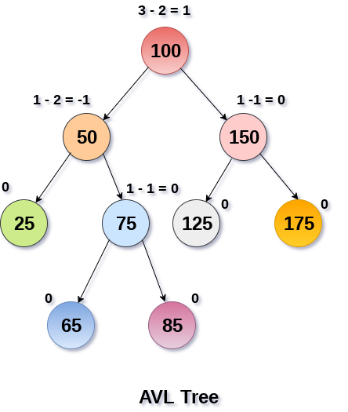

# 树结构

树是一种数据结构，它是n(n>=0)个节点的有限集。n=0时称为空树。n>0时，有限集的元素构成一个具有层次感的数据结构，区别于线性表一对一的元素关系，树中的节点是一对多的关系。

树具有以下特点:

- n>0时，根节点是唯一的，不可能存在多个根节点
- 每个节点有零个至多个子节点；除了根节点外，每个节点有且仅有一个父节点。根节点没有父节点

<div align="center"></div>

​    

# 一 二叉树 / 完全二叉树 / 满二叉树

**二叉树**: 最多有两棵子树的树被称为二叉树

<div align="center"></div>

**斜树**：所有节点都只有左子树的二叉树叫做左斜树，所有节点都只有右子树的二叉树叫做右斜树（本质就是链表）

<div align="center"></div>

**满二叉树**：二叉树中所有非叶子结点的度都是2，且叶子结点都在同一层次上

<div align="center"></div>

**完全二叉树**： 如果一个二叉树与满二叉树前n个节点的结构相同，这样的二叉树被称为完全二叉树

<div align="center"></div>

​     

# 二 二叉查找树 BST

二叉查找树（Binary Search Tree）是指一棵空树或者具有下列性质的二叉树：

> 若任意节点的左子树不空，则左子树上所有节点的值均小于它的根节点的值；
>
> 若任意节点的右子树不空，则右子树上所有节点的值均大于它的根节点的值；
>
> 任意节点的左、右子树也分别为二叉查找树；
>
> 没有键值相等的节点；

相比于其他数据结构，二叉查找树的优势在于查找、插入的时间复杂度较低为 O ( log ⁡ n )，常用于构建更为抽象的数据结构，如集合、多重集、关联数组等。

<div align="center"></div>

​      

# 三 前缀树/字典树 Tire

Trie，又称字典树、单词查找树或键树，是一种树形结构（`N 叉树` 的一种特殊形式），是一种哈希树的变种。典型应用是用于统计，排序和保存大量的字符串（但不仅限于字符串），所以经常被搜索引擎系统用于文本词频统计。它的优点是利用字符串的公共前缀来减少查询时间，最大限度地减少无谓的字符串比较，查询效率比哈希树高。

<div align="center"></div>

Trie树的基本性质：

> 1）根节点不包含字符，除根节点外的每一个子节点都包含一个字符（便于插入和查找）；
>
> 2）从根节点到某一个节点，路径上经过的字符连接起来，为该节点对应的字符串；
>
> 3）每个节点的所有子节点包含的字符互不相同，也就是找到对应单词、字符是唯一的；

​     

***怎么设计这个字典树呢？***

对于一个字典树Trie类，肯定是要有一个根节点root的，而这个节点类型TrieNode也有很多设计方式，为了简单放一个26个大小的TrieNode类型数组，分别对应'a'-'z'的字符，同时用一个boolean类型变量isEnd表示是否为字符串末尾结束。

```go
struct TrieNode {
  	son []TrieNode
    isEnd boolean //结束标志
}
```

用数组的话如果字符比较多的话可能会消耗一些内存空间，但是这里26个连续字符还好的，如果向一个字典树中添加 `big`, `bit`, `bz` 那么它其实是这样的：

<div align="center"></div>

​        

# 四 二叉索引树/树状数组（Binary Indexed Tree）

树状数组或二叉索引树（Binary Indexed Tree），又以其发明者命名为 Fenwick 树，其初衷是解决数据压缩里的累积频率（Cumulative Frequency）的计算问题，现多用于高效计算数列的`前缀和` / `区间和`。针对区间问题，除了常见的线段树解法，还可以考虑树状数组。可以以 O(log n) 的时间得到任意前缀和，并同时支持在 O(log n) 时间内支持动态单点值的修改(增加或者减少)，空间复杂度 O(n)。

<div align="center"></div>

树状数组名字虽然又有树，又有数组，但是它实际上物理形式还是数组，不过每个节点的含义是树的关系，如上图。树状数组中 **父子节点下标** 关系是 **parent = son + 2^k**，其中 **k 是子节点下标对应二进制末尾 0 的个数**。

例如上图中 A 和 C 都是数组，而数组A正常存储数据，数组C是树状数组，其中 C4 / C6 / C7 是 C8 的子节点，4 的二进制是 100，4 + 2^2 = 8，所以 8 是 4 的父节点。同理，7 的二进制 111，7 + 2^0 = 8，8 也是 7 的父节点。

​        

## 1 节点

在树状数组中，节点概念：

* **奇数下标节点**：树的 `叶子节点`，表示单点，它存的值是原数组相同下标存的值，例如上图中 C1，C3，C5，C7 分别存的值是 A1，A3，A5，A7；

* **偶数下标节点**：树的某一节点的父节点，父节点内存储的是**数组区间和**，其中区间的左边界是该父节点最左边叶子节点对应的下标，右边界就是自己的下标，例如 C4 内存的区间和是 C1 + C2 + C3 + A4 = A1 + A2 + A3 + A4，其中C4 表示的区间左边界是 C1，右边界是 C4；

```shell
C1 = A1
C2 = C1 + A2 = A1 + A2
C3 = A3
C4 = C2 + C3 + A4 = A1 + A2 + A3 + A4
C5 = A5
C6 = C5 + A6 = A5 + A6
C7 = A7
C8 = C4 + C6 + C7 + A8 = A1 + A2 + A3 + A4 + A5 + A6 + A7 + A8
```

由数学归纳法可以得出，左边界的下标一定是 **i−2^k+1**，其中 i 为父节点的下标，k 为 i 的二进制中末尾 0 的个数，因此偶数节点的区间和：**Ci = sum(A[i-2^k+1] + .., + A[i])**。

```go
type BinaryIndexedTree struct {
	tree     []int
	capacity int
}

// Init 树状数组初始化
func (bit *BinaryIndexedTree) Init(nums []int) {
	bit.tree, bit.capacity = make([]int, len(nums)+1), len(nums)+1

	for i := 1; i <= len(nums); i++ {
		bit.tree[i] += nums[i-1]
		for j := i - 2; j >= i-lowbit(i); j-- {
			bit.tree[i] += nums[j]
		}
	}

}
```

其中，**lowbit(i)** 函数返回 i 转换成二进制以后，末尾最后一个 1 代表的数值，即 2^k，k 为 i 末尾 0 的个数

```go
func lowbit(i int) int {
	return i & (-i)
}
```

> **lowbit原理**
>
> 在计算机系统中，数值一律用补码来表示和存储，原因在于，补码可以将符号位和数值域统一处理，同时加法和减法也可以统一处理，利用补码，可以 O(1) 算出 lowbit(i)。
>
> 将 `x` 的二进制所有位全部取反，再加 1，就可以得到 `-x` 的二进制编码。例如，6的二进制编码是 `110`，全部取反后得到 `001`，加 `1` 得到 `010`。
>
> 设原先 `x` 的二进制编码是 `(...)10...00`，全部取反后得到 `[...]01...11`，加 `1` 后得到 `[...]10...00`，也就是 `-x` 的二进制编码了，其中这里 `x` 二进制表示中第一个 `1` 是 `x` 最低位的 `1`。
>
> `(...)` 和 `[...]` 中省略号的每一位分别相反，所以 `x & -x = (...)10...00 & [...]10...00 = 10...00`，得到的结果就是 `lowbit`。例如：34 的二进制是 (00100010)，它的补码是 (11011110)，而 (00100010)&(11011110)=(00000010)，所以lowbit(34) 结果是 2^k=2^1=2。

​         

## 2 单点更新 Update

**单点更新**：从子结点到父结点

树状数组上的父子的下标满足 **parent = son + 2^k** 关系，所以可以通过这个公式从叶子结点不断往上递归，直到访问到最大节点值为止，祖先结点最多为 logn 个。

```go
func (bit *BinaryIndexedTree) Update(index, val int) {
	// 从下到上更新，注意树状数组比原始数组的len大1，故树状数组索引的最大值为len
	for index <= bit.capacity {
		bit.tree[index] += val
		index += lowbit(index)
	}
}
```

​      

## 3 查询 Query

树状数组中查询 **[1, i] 区间内的和**，按照节点的含义，可以得出下面的关系（修改：Bi -> Ci）：

<div align="center"></div>

Bi是树状数组存的值，Query 操作实际是一个递归的过程。lowbit(i) 表示 2^k，其中 k 是 i 的二进制表示中末尾 0 的个数。**i - lowbit(i)** 将 i 的二进制中末尾的 1 去掉，最多有 log(i)个 1，所以查询操作最坏的时间复杂度是 O(log n)。

```go
// Query 区间区间查询, 查询[1, i]区间内的和
func (bit *BinaryIndexedTree) Query(index int) int {
	sum := 0
	for index >= 1 {
		sum += bit.tree[index]
		index -= lowbit(index)
	}
  
	return sum
}
```

​        

## 4 不同场景功能

根据节点维护的数据含义不同，树状数组可以提供不同的功能来满足各种各样的区间场景。

​      

### 1）单点增减 + 区间求和

**单点增减**：分别调用 update(i, v) 和 update(i, -v)

**区间求和**：利用前缀和的思想，求 [m,n] 区间和，即 query(n) - query(m-1)，其中query(n) 代表 [1,n] 区间内的和，query(m-1) 代表 [1,m-1] 区间内的和，两者相减，即 [m,n] 区间内的和

<div align="center"></div>

​     

### 2）区间增减 + 单点查询

这种情况需要做一下转化，定义差分数组 C(i) 代表 **C(i) =A(i)−A(i-1)**，那么：

>C(0) =A(0)
>
>C(1) =A(1) − A(0)
>
>C(2) =A(2) − A(1)
>
>... ...
>
>C(n) =A(n) − A(n-1)
>
>因此，**sum[C(0)+C(1)+...+C(n)] = A(n)**

​        

**区间增减**：在 [m,n] 区间内每一个数都增加 v，只影响 2 个单点的值（如下推导），可以观察看， C(m+1), C(m+2), ..., C(n), 值都不变，变化的是 C(m), C(n+1)，所以在这种情况下，区间增加只需要执行 update(m, v) 和 update(n+1, -v) 即可。

> **C(m) =[A(m) + v] − A(1)**
>
> C(m+1) =[A(m+1) + v] − [A(m) + v] 
>
> C(m+2) =[A(m+2) + v] − [A(m+1) + v] 
>
> ... ...
>
> C(n) =[A(n) + v] − [A(n-1) + v] 
>
> **C(n+1) =A(n+1) − [A(n) + v] **

**单点查询**：即求前缀和，A(n) = sum[C(0)+C(1)+...+C(n)]，即 query(n)

​       

### 3）区间增减 + 区间求和

这种情况是上面一种情况的增强版。区间增减的做法和上面做法一致，构造差分数组，这里主要说明区间查询怎么做。

先来看 [1,n] 区间和如何求：

<div align="center"></div>

以此类推，推到更一般的情况：

<div align="center"></div>

​       

### 4）单点增减 + 区间最值

线段树最基础的运用是区间求和，但是将 sum 操作换成 max 操作以后，也可以求区间最值，并且时间复杂度完全没有变。那树状数组呢？也可以实现相同的功能么？答案是可以的，不过时间复杂度会下降一点。

**线段树求区间和**：把每个小区间的和计算好，然后依次 pushUp，往上更新。把 sum 换成 max 操作，含义完全相同，取出小区间的最大值，然后依次 pushUp 得到整个区间的最大值。

**树状数组求区间和**：将单点增减的增量影响更新到固定区间 [i−2^k+1, i]，但是把 sum 换成 max 操作，含义就变了。此时单点的增量和区间 max 值并无直接联系，通过暴力的方式是将该点与区间内所有值比较大小，取出最大值，时间复杂度 O(n * log n)。但仔细观察树状数组的结构，可以发现不必枚举所有区间。

例如更新 A(i) 的值，那么受到影响的树状数组下标为 **i−2^0, i−2^1, i−2^2, i−2^3, .., i−2^k**，其中 **2^k < lowbit(i) ⩽ 2^k+1**，因此需要更新至多 k 个下标，外层循环由 O(n) 降为了 O(log n)。区间内部每次都需要重新比较，需要 O(log n) 的复杂度，总的时间复杂度为 (O(logn))^2。

```go
func (bit *BinaryIndexedTree) Update(index int, val int) {
	for index <= bit.capacity {
		bit.tree[index] = val
    
		for i := 1; i < lowbit(index); i = i << 1 {
			bit.tree[index] = max(bit.tree[index], bit.tree[index-i])
		}
    
		index += lowbit(index)
	}
}
```

上面解决了单点更新的问题，再来看区间最值。线段树划分区间是均分，对半分，而树状数组不是均分。在树状数组中 B(i) 表示的区间是 [i−2k+1, i]，据此划分“不规则区间”。对于树状数组求 [m,n] 区间内最值

> 如果 m < n - 2^k，那么query(m, n) = max(query(m, n-2^k), C(n))
>
> 如果 m >= n - 2^k，那么query(m, n) = max(query(m, n-1), A(n))

```go
func (bit *BinaryIndexedTree) Query(m, n int) int {
	res := 0
  
	for n >= m {
		res = max(nums[n], res)
		n--
		for ; n-lowbit(n) >= m; n -= lowbit(n) {
			res = max(bit.tree[n], res)
		}
	}
  
	return res
}
```

​      

### 5）区间叠加 + 单点最值

这一类题不就是第二类 “区间增减 + 单点查询” 类似么？可以考虑用第二类题的思路解决这一类题。不过麻烦点在于，区间叠加以后，每个单点的更新不是直接告诉增减变化，而是需要单独维护一个最值。例如在 [5,7] 区间当前值是 7，接下来区间 [1,9] 区间内增加了一个 2 的值，正确的做法是把 [1,4] 区间内增加 2，[8,9] 区间增加 2，[5,7] 区间维持不变，因为 7 > 2。这仅仅是 2 个区间叠加的情况，如果区间叠加的越多，需要拆分的区间也越多了。

[Leetcode天际线](https://leetcode.com/problems/the-skyline-problem/) 的题就属于区间叠加 + 单点最值的题，就此题介绍此类题的常用解法

> A = [[2,9,10],[3,7,15],[5,12,12],[15,20,10],[19,24,8]]
>
> B = [[2,10],[3,15],[7,12],[12,0],[15,10],[20,8],[24,0]]

<div align="center"></div>

要求天际线，即找到**楼与楼重叠区间外边缘的线**，说白了是维护各个区间内的最值，这有 2 个需要解决的问题：

1）**如何维护最值？**当一个高楼的右边界消失，剩下的各个小楼间还需要选出最大值作为天际线，其中剩下重重叠叠的小楼很多，树状数组如何维护区间最值是解决此类题的关键；

> 树状数组只有 2 个操作：一个是更新 Update()，一个是查询 Query()，但从上面关于这 2 个操作的讲解中可以知道这 2 个操作都不能满足需求，其中 Update() 操作可以改成维护区间内 max() 的操作，但是 max() 容易获得却很难 `“去除”`。
>
> 如上图 [3,7] 这个区间内的最大值是 15，根据树状数组的定义，[3,12] 这个区间内最值还是 15，但观察上图可以看到 [5,12] 区间内最值其实是 12。
>
> 树状数组如何维护这种最值呢？最大值既然难以“去除”，那么需要考虑如何让最大值“来的晚一点”，解决办法是将 Query() 操作含义从前缀含义改成后缀含义，即Query(i) 查询区间是 [1,i]，现在查询区间变成 [i,+∞)。例如：[i,j] 区间内最值是 max(i...j)，Query(j+1) 的结果不会包含 max(i...j)，因为它查询的区间是 [j+1,+∞)。这样更改以后，可以**有效避免前驱高楼对后面楼的累积 max() 最值的影响**。
>
> 具体做法，将 x 轴上的各个区间排序，按照 x 值大小**从小到大排序，从左往右依次遍历各个区间**。Update() 操作含义是加入每个 ***区间右边界代表后缀区间的最值***，这样不需要考虑“移除”最值的问题了。
>
> 那能否从右往左遍历区间，Query() 的含义继续延续前缀区间？这样做是可行的，解决第一个问题（维护最值）是可以的，但是这种处理办法解决第二个问题（维护转折点）会遇到麻烦。

2）**如何维护天际线的转折点？** 有些楼与楼并非完全重叠，重叠一半的情况导致天际线出现转折点，如上图中标记的红色转折点；

> 如果用前缀含义的 Query()，在单点 i 上除了考虑以这个点为结束点的区间，还需要考虑以这个单点 i 为起点的区间。如果是后缀含义的 Query() 就没有这个问题了， [i+1,+∞) 这个区间内不用考虑以单点 i 为结束点的区间。

​     

逻辑实现

```go
const LEFTSIDE = 1
const RIGHTSIDE = 2

type Point struct {
	xAxis int
	side  int
	index int
}

// getSkyline 获取天际线
func getSkyline(buildings [][]int) [][]int {
	res := [][]int{}
	if len(buildings) == 0 {
		return res
	}
  
	allPoints, bit := make([]Point, 0), BinaryIndexedTree{}
  
	// [x-axis (value), [1 (left) | 2 (right)], index (building number)]
	for i, b := range buildings {
		allPoints = append(allPoints, Point{xAxis: b[0], side: LEFTSIDE, index: i})
		allPoints = append(allPoints, Point{xAxis: b[1], side: RIGHTSIDE, index: i})
	}
  
  // 排序
	sort.Slice(allPoints, func(i, j int) bool {
		if allPoints[i].xAxis == allPoints[j].xAxis {
			return allPoints[i].side < allPoints[j].side
		}
    
		return allPoints[i].xAxis < allPoints[j].xAxis
	})
  
	bit.Init(len(allPoints))
	kth := make(map[Point]int)
	for i := 0; i < len(allPoints); i++ {
		kth[allPoints[i]] = i
	}
  
	for i := 0; i < len(allPoints); i++ {
		pt := allPoints[i]
		if pt.side == LEFTSIDE {
			bit.Update(kth[Point{xAxis: buildings[pt.index][1], side: RIGHTSIDE, index: pt.index}], buildings[pt.index][2])
		}
    
		currHeight := bit.Query(kth[pt] + 1)
		if len(res) == 0 || res[len(res)-1][1] != currHeight {
			if len(res) > 0 && res[len(res)-1][0] == pt.xAxis {
				res[len(res)-1][1] = currHeight
			} else {
				res = append(res, []int{pt.xAxis, currHeight})
			}
		}
	}
  
	return res
}

type BinaryIndexedTree struct {
	tree     []int
	capacity int
}

// Init define
func (bit *BinaryIndexedTree) Init(capacity int) {
	bit.tree, bit.capacity = make([]int, capacity+1), capacity
}

// Update 更新区间[1, index]最大值
func (bit *BinaryIndexedTree) Update(index int, val int) {
	for ; index > 0; index -= index & -index {
		bit.tree[index] = max(bit.tree[index], val)
	}
}

// Query 查询区间[1, index]最大值
func (bit *BinaryIndexedTree) Query(index int) int {
	sum := 0
	for ; index <= bit.capacity; index += index & -index {
		sum = max(sum, bit.tree[index])
	}
	return sum
}
```

​           

## 5 二维数组

树状数组可以扩展到二维、三维或者更高维，其中二维树状数组可以解决离散平面上的统计问题

```go
type BinaryIndexedTree2D struct {
	tree [][]int
	row  int
	col  int
}

// Update 
func (bit2 *BinaryIndexedTree2D) Update(i, j int, val int) {
	for i <= bit2.row {
		k := j
		for k <= bit2.col {
			bit2.tree[i][k] += val
			k += lowbit(k)
		}
		i += lowbit(i)
	}
}

// Query define
func (bit2 *BinaryIndexedTree2D) Query(i, j int) int {
	sum := 0
	for i >= 1 {
		k := j
		for k >= 1 {
			sum += bit2.tree[i][k]
			k -= lowbit(k)
		}
		i -= lowbit(i)
	}
	return sum
}
```

​    

如果把一维树状数组维护的是数轴上的统计问题

<div align="center"></div>

那么二维数组维护的是二维坐标系下的统计问题，且X 和 Y 分别都满足一维树状数组的性质

<div align="center"></div>

​     

# 五 线段数（Segment Tree）

线段树是一种二叉树形数据结构，用以存储区间或线段，并且允许快速查询结构内包含某一点的所有区间。与树状数组（binary indexed tree）相似，线段树也用来处理 **数组相应的区间查询（range query）**和 **元素更新（update）**操作，但与树状数组不同的是，线段树不止可以适用于`区间求和的查询`，也可以进行`区间最大值`，`区间最小值`（Range Minimum/Maximum Query problem）或者 `区间异或值` 的查询。

一个包含 n 个区间的线段树，空间复杂度为 `O(n)` ，线段树进行更新的操作为 `O(logn)`，查询的时间复杂度则为 `O(logn+k)`，其中 k是符合条件的区间数量，且线段树的数据结构也可推广到高维度。

​          

## 1 实现原理

从数据结构的角度来说，线段树是用一个完全二叉树来存储对应于其每一个区间的数据，该二叉树的每一个结点中保存着相对应于这一个区间的信息，同时线段树所使用的这个二叉树是用一个数组保存的，与堆（Heap）的实现方式相同。

例如，给定一个长度为N的数组arr，其所对应的线段树T各个结点的含义如下：

> 1）T的根结点代表整个数组所在的区间对应的信息，及arr[0:N]（不含N) 所对应的信息；
>
> 2）T的每一个**叶结点**存储对应于输入数组的每一个单个元素构成的区间 `arr[i]` 所对应的信息，此处0≤i<N；
>
> 3）T的每一个**中间结点**存储对应于输入数组某一区间 `arr[i:j]` 对应的信息，此处0≤i<j<N；

以根结点为例，根结点代表arr[0:N]区间所对应的信息，接着根结点被分为两个子树，分别存储 `arr[0:(N-1)/2]` 及 `arr[(N-1)/2+1:N]` 两个子区间对应的信息。也就是说，对于每一个结点，其左右子结点分别存储母结点区间拆分为两半之后各自区间的信息，也就是说对于长度为N的输入数组，线段树的高度为logN。

对于一个线段树来说，其应该支持的两种操作为：
> **Update**：更新输入数组中的某一个元素并对线段树做相应的改变；
>
> **Query**：用来查询某一区间对应的信息（如最大值，最小值，区间和等）；

<div align="center"></div>

​      

## 2 树初始化 Init

线段树的初始化是 **自底向上** 进行的

> 1）从每一个叶子结点开始（也就是原数组中的每一个元素），沿从叶子结点到根结点的路径向上按层构建；
>
> 2）在构建的每一步中，对应两个子结点的数据将被用来构建应当存储于它们父结点中的值，每一个中间结点代表它的左右两个子结点对应区间融合过后的大区间所对应的值；
>
> 3）这个融合信息的过程可能依所需要处理的问题不同而不同，但从叶子节点（长度为1的区间）到根结点（代表输入的整个区间）更新的这一过程是统一的；
>
> 例如：对于保存**区间最小值**的线段树来说，merge的过程应为min()函数，用以取得两个子区间中的最小区间最小值作为当前融合过后的区间的区间最小值

```go
type SegmentTree struct {
	start, end, sum int
	left, right     *SegmentTree
}

func newSegmentTree(start, end int) *SegmentTree {
	return &SegmentTree{
		start: start,
		end:   end,
	}
}

// buildTree 构造线段树
func buildTree(nums []int, start, end int) *SegmentTree {
	if start > end {
		return nil
	}

	root := newSegmentTree(start, end)
	if start == end {
		root.sum = nums[start]
	} else {
		mid := start + (end-start)/2
		root.left = buildTree(nums, start, mid)  // 左区间 [start, mid]
		root.right = buildTree(nums, mid+1, end) // 右区间 [mid+1, end]
    
    // 父节点值=左右子节点值之和
		root.sum = root.left.sum + root.right.sum
	}
	
	return root
}
```

以 arr[] = [18, 17, 13, 19, 15, 11, 20, 12, 33, 25 ] 为例构造线段树：

<div align="center"></div>

​      

## 3 线段树查询 Query

当查询范围与当前节点表示的范围完全匹配时，该方法返回结果。否则，它会更深入地遍历线段树树，以找到与节点的一部分完全匹配的节点。区间查询大体上可以分为3种情况讨论：

> 1）当前结点所代表的区间完全位于给定需要被查询的区间之外，则不应考虑当前结点；
>
> 2）当前结点所代表的区间完全位于给定需要被查询的区间之内，则可以直接查看当前结点的母结点；
>
> 3）当前结点所代表的区间部分位于需要被查询的区间之内，部分位于其外，则可先考虑位于区间外的部分，后考虑区间内的（注意总有可能找到完全位于区间内的结点，因为叶子结点的区间长度为1，因此总能组合出合适的区间）

以查询的区间范围为[2，8] 的元素之和为例，查询示意图如下：

<div align="center"></div>

```go
// sumRange 查询分段区间值之和
func sumRange(root *SegmentTree, start, end int) int {
	if root.end == end && root.start == start {
		return root.sum
	}

	mid := root.start + (root.end-root.start)/2
	if end <= mid {
		return sumRange(root.left, start, end)
	} else if start >= mid+1 {
		return sumRange(root.right, start, end)
  } else {
    return sumRange(root.right, mid+1, end) + sumRange(root.left, start, mid)
  }
}
```

​       

## 4 线段树更新 Update

更新一个线段树的过程与构造线段树的过程相同，当输入数组中位于`i`位置的元素被更新时，只需从这一元素对应的叶子结点开始，沿二叉树的路径向上更新至更结点即可，显然这一过程是一个`O(logn)`的操作。

原始数据下标为1、3 和 6 处的元素分别增加了 +3，-1 和 +2，数据更新如下图：

<div align="center"></div>

```go
// update 数据节点更新
func update(root *SegmentTree, pos, val int) {
	if root.start == root.end { // 更新叶子结点
		root.sum = val
	} else {  // 遍历迭代
		mid := root.start + (root.end-root.start)/2
		if pos <= mid {
			update(root.left, pos, val)
		} else {
			update(root.right, pos, val)
		}
    
    // 更新父节点
		root.sum = root.left.sum + root.right.sum
	}
}
```

​        

# 六 平衡二叉树 AVL

含有相同节点的二叉查找树可以有不同的形态，而二叉查找树的平均查找长度与树的深度有关，所以需要找出一个查找平均长度最小的一棵，那就是平衡二叉树，具有以下性质:

> 要么是棵空树，要么其根节点左右子树的深度之差的绝对值不超过1；
>
> 节点左右子树也都是平衡二叉树；
>
> 二叉树节点的平衡因子定义为该节点的左子树的深度减去右子树的深度。则平衡二叉树的所有节点的平衡因子只可能是-1,0,1；

平衡二叉树的常用实现方法有 `红黑树`、`AVL`、`替罪羊树`、`Treap`、`伸展树` 等，其中最小二叉平衡树的节点的公式如下 **F(n) = F(n-1) + F(n-2) + 1** 这个类似于一个递归的数列，可以参考Fibonacci数列，1是根节点，F(n-1)是左子树的节点数量，F(n-2)是右子树的节点数量。

<div align="center"></div>

​       

如果在AVL树中进行插入或删除节点后，可能导致AVL树失去平衡。这种失去平衡的可以概括为4种姿态：LL(左左)，LR(左右)，RR(右右)和RL(右左)

<div align="center"></div>

上图中的4棵树都是"失去平衡的AVL树"，从左往右的情况依次是: LL、LR、RL、RR，当然除了上面的情况之外，还有其它的失去平衡的AVL树，如下图：

<div align="center"></div>

如果在AVL树中进行插入或删除节点后，可能导致AVL树失去平衡。AVL失去平衡之后，可以通过旋转使其恢复平衡，下面分别介绍 "LL(左左)，LR(左右)，RR(右右)和RL(右左)" 这4种情况对应的旋转方法

​       

## 1 LL 旋转

**LL**：LeftLeft，也称为"左左"。插入或删除一个节点后，根节点的左子树的左子树还有非空子节点，导致"根的左子树的高度"比"根的右子树的高度"大2，导致AVL树失去了平衡。

例如，在上面LL情况中，由于"根节点(8)的左子树(4)的左子树(2)还有非空子节点"，而"根节点(8)的右子树(12)没有子节点"；导致"根节点(8)的左子树(4)高度"比"根节点(8)的右子树(12)"高2。

LL失去平衡的情况，可以通过一次旋转让AVL树恢复平衡，如下图：（**根节点k2右旋**）

<div align="center"></div>

对于LL旋转，可以这样理解为：LL旋转是围绕 "**失去平衡的AVL根节点**" 进行的，也就是节点k2；而且由于是LL情况，即左左情况，就用手抓着"左孩子，即k1"使劲摇。将k1变成根节点，k2变成k1的右子树，"k1的右子树"变成"k2的左子树"。

```go
/*
 * LL: 左左对应的情况(左单旋转)
 *
 * 返回值: 旋转后的根节点
 */
func leftLeftRotation(k2 AVLTreeNode) AVLTreeNode {
    var k1 AVLTreeNode

    k1 = k2.left
    k2.left = k1.right
    k1.right = k2

    k2.height = max( height(k2.left), height(k2.right)) + 1
    k1.height = max( height(k1.left), k2.height) + 1

    return k1
}
```

​         

## 2 LR 旋转

**LR**： LeftRight，也称为"左右"。插入或删除一个节点后，根节点的左子树的右子树还有非空子节点，导致"根的左子树的高度"比"根的右子树的高度"大2，导致AVL树失去了平衡。

例如，在上面LR情况中，由于"根节点(8)的左子树(4)的左子树(6)还有非空子节点"，而"根节点(8)的右子树(12)没有子节点"；导致"根节点(8)的左子树(4)高度"比"根节点(8)的右子树(12)"高2；

LR失去平衡的情况，需要经过两次旋转才能让AVL树恢复平衡。如下图：（**先左旋后右旋**）

<div align="center"></div>

第一次旋转是围绕"k1"进行的"**RR旋转**"，第二次是围绕"k3"进行的"**LL旋转**"

```go
/*
 * LR: 左右对应的情况(左双旋转)
 *
 * 返回值: 旋转后的根节点
 */
func leftRightRotation(k3 AVLTreeNode) AVLTreeNode {
    k3.left = rightRightRotation(k3.left)

    return leftLeftRotation(k3)
}
```

​      

## 3 RR旋转

**RR**： RightRight，称为"右右"。插入或删除一个节点后，根节点的右子树的右子树还有非空子节点，导致"根的右子树的高度"比"根的左子树的高度"大2，导致AVL树失去了平衡。

例如，在上面RR情况中，由于"根节点(8)的右子树(12)的右子树(14)还有非空子节点"，而"根节点(8)的左子树(4)没有子节点"；导致"根节点(8)的右子树(12)高度"比"根节点(8)的左子树(4)"高2。

RR是与LL对称的情况！RR恢复平衡的旋转方法如下：（**根节点k1的左旋**）

<div align="center"></div>

```go
/*
 * RR: 右右对应的情况(右单旋转)
 *
 * 返回值: 旋转后的根节点
 */
func rightRightRotation(k1 AVLTreeNode) AVLTreeNode {
    var k2 AVLTreeNode

    k2 = k1.right
    k1.right = k2.left
    k2.left = k1

    k1.height = max( height(k1.left), height(k1.right)) + 1
    k2.height = max( height(k2.right), k1.height) + 1

    return k2
}
```

​      

## 4 RL旋转

**RL**： RightLeft，称为"右左"。插入或删除一个节点后，根节点的右子树的左子树还有非空子节点，导致"根的右子树的高度"比"根的左子树的高度"大2，导致AVL树失去了平衡。

例如，在上面RL情况中，由于"根节点(8)的右子树(12)的左子树(10)还有非空子节点"，而"根节点(8)的左子树(4)没有子节点"；导致"根节点(8)的右子树(12)高度"比"根节点(8)的左子树(4)"高2；

RL是与LR的对称情况！RL恢复平衡的旋转方法如下：（**先右旋后左旋**）

<div align="center"></div>

第一次旋转是围绕"k3"进行的"LL旋转"，第二次是围绕"k1"进行的"RR旋转"。

```go
/*
 * RL: 右左对应的情况(右双旋转)
 *
 * 返回值: 旋转后的根节点
 */
func rightLeftRotation(k1 AVLTreeNode) AVLTreeNode {
    k1.right = leftLeftRotation(k1.right)

    return rightRightRotation(k1)
}
```

​      

# 七 红黑树 R-B

红黑树也是一种自平衡的二叉查找树

> 每个结点要么是红的，要么是黑的（红或黑）；
>
> 根结点是黑的（***根黑***）；
>
> 每个叶结点都是黑的，注意叶结点是指树尾端NIL指针或NULL结点 (***叶黑***)；
>
> 如果一个结点是红的，那么它的两个儿子都是黑的 （***红子黑***）；
>
> 对于任意结点而言，其到叶结点树尾端NIL指针的 <u>*每条路径都包含相同数目的黑结点*</u>（***路径下黑相同***）

`红黑树的性质`：红黑树是一棵二叉搜索树，它在每个节点增加了一个存储位记录节点的颜色，可以是RED,也可以是BLACK；通过任意一条从根到叶子简单路径上颜色的约束，红黑树保证最长路径不超过最短路径的二倍，因而近似平衡。

<div align="center"></div>

用法最广:

- Java ConcurrentHashMap & TreeMap
- C++ STL: map & set
- linux进程调度Completely Fair Scheduler,用红黑树管理进程控制块
- epoll在内核中的实现，用红黑树管理事件块
- nginx中，用红黑树管理timer等

​       

# 八 哈夫曼树 Huffman

Huffman Tree，中文名是哈夫曼树或霍夫曼树，它是最优二叉树，其定义：给定 n 个权值作为 n 个叶子结点，构造一棵二叉树，若树的带权路径长度达到最小，则这棵树被称为哈夫曼树。

<div align="center"></div>

名词解释

> `路径与路径长度`: 从树中一个节点到另一个节点之间的分支构成了两个节点之间的路径，路径上的分支数目称作路径长度。若规定根节点位于第一层，则根节点到第H层的节点的路径长度为H-1。如到40 的路径长度为1；30的路径长度为2；20的路径长度为3；
>
> `节点的权`: 将树中的节点赋予一个某种含义的数值作为该节点的权值，该值称为节点的权；
>
> `带权路径长度`: 从根节点到某个节点之间的路径长度与该节点的权的乘积。例如上图节点10的路径长度为3,它的带权路径长度为10 * 3 = 30；
>
> `树的带权路径长度`: 树的带权路径长度为所有叶子节点的带权路径长度之和，称为WPL。上图的WPL = 1x40+2x30+3x10+3x20 = 190，而哈夫曼树就是树的带权路径最小的二叉树

​         

假设有n个权值，则构造出的哈夫曼树有n个叶子结点。 n个权值分别设为 w1、w2、…、wn，哈夫曼树的构造规则为:

> 1）将所有左，右子树都为空的作为根节点；
>
> 2）在森林中选出两棵根节点的权值最小的树作为一棵新树的左，右子树，且置新树的附加根节点的权值为其左，右子树上根节点的权值之和（注意：左子树的权值应小于右子树的权值）；
>
> 3）从森林中删除这两棵树，同时把新树加入到森林中；
>
> 4）重复2，3步骤，直到森林中只有一棵树为止，此树便是哈夫曼树；

<div align="center"></div>

​      

# 九 B树

B树（B-tree）是一种自平衡的树，能够保持数据有序。这种数据结构能够让`查找数据、顺序访问、插入数据及删除的动作`，都在对数时间内完成。B树，概括来说是一种自平衡的m阶树，与自平衡二叉查找树不同，B树适用于读写相对大的数据块的存储系统，例如磁盘。

> 根结点至少有两个子女；
>
> 每个中间节点都包含k-1个元素和k个孩子，其中 m/2 <= k <= m；
>
> 每一个叶子节点都包含k-1个元素，其中 m/2 <= k <= m；
>
> 所有的叶子结点都位于同一层；
>
> 每个节点中的元素从小到大排列，节点当中k-1个元素正好是k个孩子包含的元素的值域分划；

B-Tree中的每个节点根据实际情况可以包含大量的关键字信息和分支，如下图所示为一个3阶的B-Tree：

<div align="center"></div>

​       

# 十 B+树

B+ 树是一种树数据结构，通常用于关系型数据库（如Mysql）和操作系统的文件系统中。B+ 树的特点是能够保持数据稳定有序，其插入与修改拥有较稳定的对数时间复杂度。B+ 树元素自底向上插入，这与二叉树恰好相反。

在B树基础上，为叶子结点增加链表指针(B树+叶子有序链表)，所有关键字都在叶子结点 中出现，非叶子结点作为叶子结点的索引；B+树总是到叶子结点才命中。

b+树的非叶子节点不保存数据，只保存子树的临界值(最大或者最小)，所以同样大小的节点，b+树相对于b树能够有更多的分支，使得这棵树更加矮胖，查询时做的IO操作次数也更少。

将上一节中的B-Tree优化，由于B+Tree的非叶子节点只存储键值信息，假设每个磁盘块能存储4个键值及指针信息，则变成B+Tree后其结构如下图所示：

<div align="center"></div>

​      

# 十一 R树

R树是用来做空间数据存储的树状数据结构。例如给地理位置，矩形和多边形这类多维数据建立索引。

**核心思想** 是聚合距离相近的节点并在树结构的上一层将其表示为这些节点的最小外接矩形(MBR)，这个最小外接矩形就成为上一层的一个节点。因为所有节点都在它们的最小外接矩形中，所以跟某个矩形不相交的查询就一定跟这个矩形中的所有节点都不相交。叶子节点上的每个矩形都代表一个对象，节点都是对象的聚合，并且越往上层聚合的对象就越多。也可以把每一层看做是对数据集的近似，叶子节点层是最细粒度的近似，与数据集相似度100%，越往上层越粗糙。

<div align="center"></div>


# 附录

1. [30张图带你彻底理解红黑树](https://www.cnblogs.com/kumufengchun/p/11169138.html)
2. [一文搞懂字典树](https://segmentfault.com/a/1190000040801084)
3. [平衡二叉树（AVL树）](https://www.cnblogs.com/yichunguo/p/12040456.html)
4. [AVL树](https://www.cnblogs.com/skywang12345/p/3577479.html)
5. [Huffman树](https://pdai.tech/md/algorithm/alg-basic-tree-hafman.html)
6. [BST树](https://www.cnblogs.com/skywang12345/p/3576452.html)
7. [【经典数据结构】B树与B+树](https://www.cnblogs.com/vincently/p/4526560.html)
8. [从B树、B+树、B*树谈到R 树](https://blog.csdn.net/v_JULY_v/article/details/6530142/)
8. [线段树 Segment Tree 实战](https://halfrost.com/segment_tree/)
8. [聊聊树状数组 Binary Indexed Tree](https://halfrost.com/binary_indexed_tree/)
8. [树状数组学习笔记](https://www.acwing.com/blog/content/80/)

