# 图结构

​       

图(Graph)是由顶点集合和一些顶点间的连线组成的数据结构，通常可以用 G(V, E)来表示。其中顶点集合**（Vertext Set）**和边的集合**（Edge Set）**分别用 V(G)和 E(G)表示。V(G)中的元素称为顶点（vertex），用 u、v 等符号表示。E(G)中的元素称为边（edge），用 e 等符号表示。

<div align="center"></div>

图 1(a) 所示的图可以表示为 G1(V, E)，其中顶点集合 V={1,2,3,4,5,6}，边集合 E={(1,2), (1,3), (2,3), (2,4), (2,5), (2,6), (3,4), (3,5), (4,5)}，这样的图叫 **无向图**，边(u,v)和(v,u)是同一条 边。而图 1(b) 所示的图是 **有向图**，有向边<u,v>中 u 为起点，v 为终点。

如果无向图中任何一对顶点之间都有一条边，这样的图称为 **完全图**。在完全图中，顶点 数 m 和边数 n 的关系为:**m=n**×**(n-1)/2**。边的数目相对较少的图称为 **稀疏图**，边的数目相对较多的图称为 **稠密图**。

<div align="center">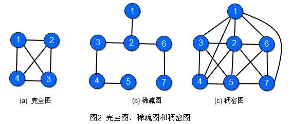</div>

在无向图中，如果(u,v)是图中的一条无向边，则称顶点 u 和顶点 v 互为邻接顶点，或称 (u,v)与顶点 u 和 v 相关联。

**顶点度数**：

* 无向图：一个顶点 u 的度数是与它相关联的边的数目，记为 **deg(u)**
* 有向图：顶点的度数等于该顶点的出度与入度之和，其中顶点 u 的出度是以 u 为起始顶点的有向边 （即从顶点 u 出发的有向边）的数目，记为 **od(u)**；而顶点 u 的入度是以 u 为终点的有向边（即 进入到顶点 u 的有向边）的数目，记为 **id(u)**，所以顶点 u 的度数：**deg(u) = od(u) + id(u)**

> 定理：**在无向图和有向图中，所有顶点度数总和，等于边数的两倍**

​       

# 一 基础

## 1. 图的连通性

在无向图中，如果从顶点 *u* 到 *v* 有路径，则称为顶点 u 和 v 是连通的。如果无向图中任意一对顶点都是连通的，则称此图为 **连通图**。相反，如果一个无向图不是连通图，则称为**非连通图**。

<div align="center">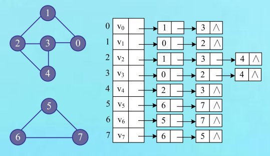</div>

如果一个无向图不是连通的，则其极大连通子图称为 **连通分量**，这里的极大是指子图中包含的顶点个数极大，例如图中所示的无向图就是非连通图。其中，顶点 0,1,2,3 和 4 构成一个连通分量，顶点 5,6,7 构成另一个连通分量。

在有向图中，若对每一对顶点 u 和 v，即存在从 u 到 v 的路径，也存在从 v 到 u 的路径，则称此图为 **强连通图**。对于非强连通图，其极大强连通子图称为其 **强连通分量**。

某些图的边具有与它相关的数，称为权值。这些权值可以表示一个顶点到另一个顶点的 距离、花费的代价、所需的时间等等。如果一个图，其所有边都具有权值，则称为 **加权图**， 或者称为 **网络(net)**。

​      

## 2. 存储结构

 图的存储结构主要有四种:

* 邻接矩阵（使用二维数组存储，不推荐使用）
* 邻接表
* 前向星
* 链式前向星（静态建表） 

在编写程序中，后三种是我们经常采用的图的存储结构

​    

### 1）邻接矩阵

图的邻接矩阵（Adjacency Matrix）存储方式是用两个数组来表示图，一个一维数组存储图中顶点信息，一个二维数组（称为邻接矩阵）存储图中的边或弧的信息。

**无向图**

顶点数组为vertex[4]={v0,v1,v2,v3}，边数组arc[4]\[4]为下图右边这样的一个矩阵。对于矩阵的主对角线的值，即arc[0]\[0]、arc[1]\[1]、arc[2]\[2]、arc[3]\[3]，全为0是因为不存在顶点的边。

<div align="center"></div>

**有向图**

如下图所示的左边，顶点数组为vertex[4]={v0,v1,v2,v3}，弧数组arc[4]\[4]为下图右边这样的一个矩阵，主对角线上数值依然为0。但因为是有向图，所以此矩阵并不对称，比如由v1到v0有弧，得到arc[1]\[0]=1，而v到v没有弧，因此arc[0]\[1]=0。

<div align="center">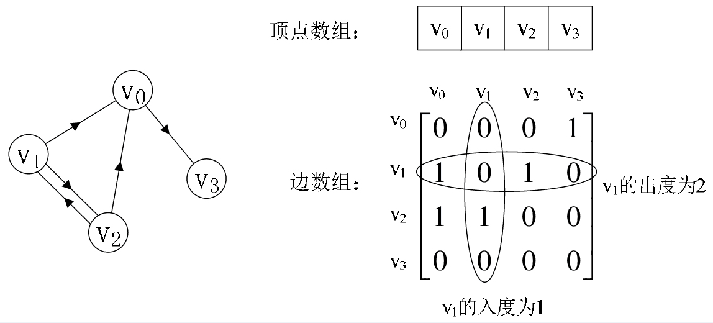</div>

**注意**：如果图中存在**自身环**（连接某个顶点自身的边）和**重边**，多条边的起点一样，终点也一样，也称为平行边的情况，则无法使用邻接矩阵存储。

**优缺点**：

* 可直接查询点i和点j之间是否有边；
* 遍历效率低，不能存储重编；
* 初始化效率低；
* 大图开销大，适合存储点少的稠密图

​      

### 2）邻接表

邻接表是一种链式的存储结构，对于图 G 中的每个顶点 Vi，所有邻接于 *Vi* 顶点 *Vj* 链成一个单链表，这个单链表称为顶点 *Vi* 的邻接表。 

邻接表中每个表节点有三个属性

> A. 邻接点序号 to，用以存放与顶点 Vi 相邻接的顶点 vj 的序号 j；
>
> B. 边上的权值；
>
> C. 指针 next，用来将邻接表的所有节点链在一 起；

另外，每个顶点 **Vi** 的邻接表设置一个具有两个属性的表头节点，一个是顶点序号 from， 另一个是指向其邻接表的指针 **first**，它是指向 Vi 的邻接表的第一个节点的指针。建立一个 Vnode 的数组就可以访问每个顶点的邻接表了。

**无向图**

<div align="center"></div>

上面的图 G1 包含了 "A,B,C,D,E,F,G" 共 7 个顶点，而且包含了 "(A,C), (A,D), (A,F), (B,C), (C,D), (E,G), (F,G)"共 7 条边。右边的矩阵是 G1 在内存中的邻接表示意图，其中每一个顶点都包含一条链表，该链表记录了**"**该顶点的邻接点的序号**"**。

例如，第 2 个顶点（顶点 C）包含的链表所包含的节点的数据分别是"0,1,3"，而这"0,1,3"分别对应"A,B,D"的序号，"A,B,D"都是 C 的邻接点，就是通过这种方式记录图的信息的。

**有向图**

<div align="center"></div>

上面的图 G2 包含了 "A,B,C,D,E,F,G" 共 7 个顶点，而且包含了 "<A,B>, <B,C>, <B,E>, <B,F>, <C,E>, <D,C>, <E,B>, <E,D>, <F,G>"共 9 条边。上图右边的矩阵是 G2 在内存中的邻接表示意图，每一个顶点都包含一条链表，该链表 记录了*"*该顶点所对应的出边的另一个顶点的序号*"*。

例如，第 1 个顶点（顶点 B）包含的链表 所包含的节点的数据分别是"2,4,5"，而这"2,4,5"分别对应"C,E,F"的序号，"C,E,F"都属于B的 出边的另一个顶点。

​      

## 3. 遍历

2种遍历方式：DFS 和 BFS

   

### 1）深度优先遍历 DFS

**主要思想**：从图中某个顶点V0出发，访问此顶点，然后从V0 **邻接**且**未被访问** 的顶点W为初始顶点，再从W出发进行深度优先搜索，直至图中所有和V0有路径相通的顶点都被访问到；若此时图中尚有顶点未被访问到，则另选图中一个未增访问的顶点作为起始点，重复上述过程，直至图中所有顶点都被访问为止。

<div align="center"></div>

​    

**连通图**

> DFS搜索过程：从访问图中任意选某一个起始顶点v后，由v出发，访问它的任一邻接顶点w1；再w1出发，访问与w1邻接但还没访问过的顶点w2；然后从w2出发，进行类型访问，... ...如此进去下去，直至到达所有邻接顶点都被访问过的顶点u为止。
>
> 接着，退回一步，退到前一次刚访问过的顶点，看是否还有其它没有被访问的邻接顶点
>
> * 如果有，则访问此顶点，之后再从此顶点出发，进行与前述类似的访问；
> * 如果没有，就再退回一步进行搜索；
>
> 重复上述过程，直到连通图中所有顶点都被访问过为止

<div align="center">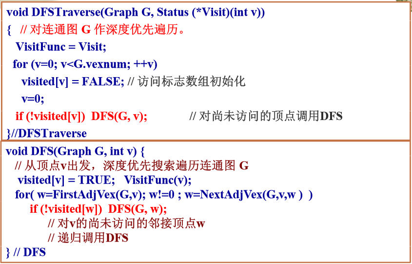</div>

**非连通图**

> DFS搜索过程：在每个连通分量或每个强连通分量中任选一个顶点，进行深度优先搜索遍历，最后将每个连通分量或强连通分量的遍历结果合起来，则得到整个非连通图的遍历结果。
>
> 遍历算法实现与连通图的只有一点不同，即对所有顶点进行循环，反复调用连通图的深度优先搜索遍历算法即可。

<div align="center"></div>

​        

### 2）广度优先遍历 BFS

广度优先搜索算法（Breadth First Search），又称为"宽度优先搜索"或"横向优先搜索"，简称BFS。

**主要思想**：从图中某顶点v出发，在访问了v之后依次访问v的各个未曾访问过的邻接点，然后分别从这些邻接点出发依次访问它们的邻接点，并使得**先被访问的顶点的邻接点先于后被访问的顶点的邻接点被访问**，直至图中所有已被访问的顶点的邻接点都被访问到。如果此时图中尚有顶点未被访问，则需要另选一个未曾被访问过的顶点作为新的起始点，重复上述过程，直至图中所有顶点都被访问到为止。换句话说，广度优先搜索遍历图的过程是以v为起点，由近至远，依次访问和v有路径相通且路径长度为1,2...的顶点。

广度优先搜索是一种 **分层的搜索过程**，每向前走一步可能访问一批顶点，不像深度优先 搜索那样有回退的情况。因此，广度优先搜索不是一个递归的过程，其算法也不是递归的，其过程类似于树的层次遍历。

<div align="center"></div>

​        

**连通图**

<div align="center"></div>

**非连通图**

<div align="center">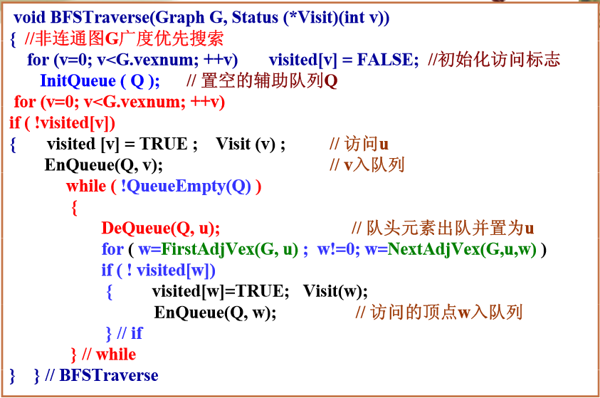</div>

​       

# 二 最小生成树

​      

## 1. 生成树

一个连通图的生成树是它的极小连通子图，在 n 个顶点的情况下，有 n-1 条边。也就是 说，生成树是对连通图而言的，是连通图的极小连通子图，包含图中的所有顶点，有且仅有 *n-1* 条边。

**连通生成树**

> a. 采用深度优先搜索遍历算法及广度优先搜索遍历算法在遍历图过程中历经边的集合和顶点集合一起构成连通图的一个 **极小联通子图**，这个连通图就是一颗生成树；
>
> b. 由深度优先搜索遍历得到的生成树，称为 **深度优先生成树**；由广度优先搜索遍历得到的生成树，称为 **广度优先生成树**；

<div align="center">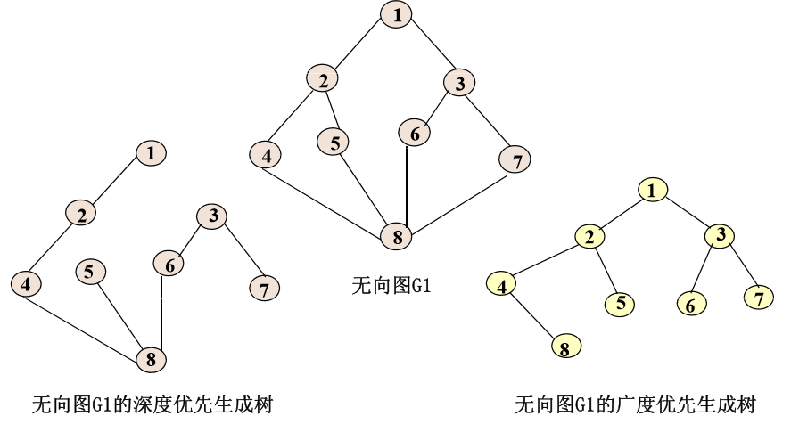</div>

**非连通生成树**

当无向图为非连通图时，从图中某一顶点除法，利用深度优先搜索算法或广度优先搜索算法不可能遍历到图中的所有顶点，只能访问到该顶点所在的极大连通子图的所有顶点，该**极大连通子图**称为无向图的一个连通分量。

<div align="center">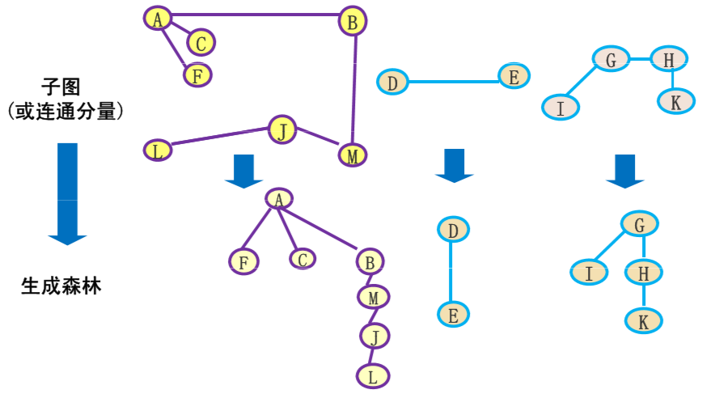</div>

使用不同的遍历图的方法，可以得到不同的生成树；从不同的顶点出发，也可能得到不 同的生成树

<div align="center">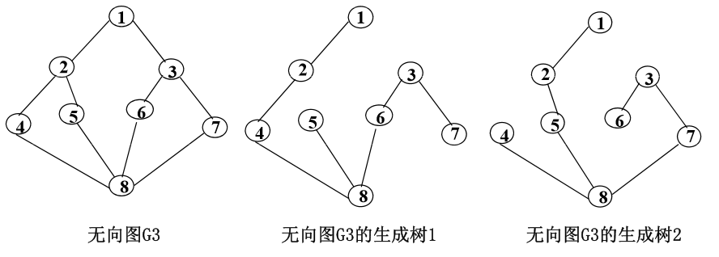</div>


在图论中，我们常常将树定义为一个无回路连通图。对于一个带权的无回路连通图，将含有 n 个顶点的连通图中选择 n-1 条边，构成一棵极小连通子图，并使该连通子图中 n-1 条边上权值之和达到最小，则称其为连通网的最小生成树。

<div align="center">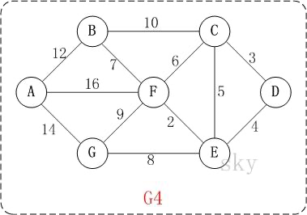</div>

例如，对于如上图 G4 所示的连通网可以有多棵权值总和不相同的生成树

<div align="center">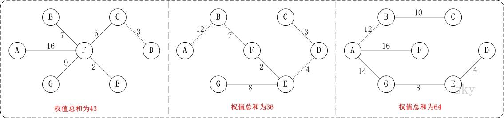</div>

常见的求最小生成树的方法有两种：

* 普里姆(**Prim**) 算法：从 ***顶点的角度*** 为出发点，时间复杂度为`O(n2)`，更适合于解决边的绸密度更高的连通网；
* 克鲁斯卡尔**(Kruskal)** 算法：从 ***边的角度*** 求网的最小生成树，时间复杂度为`O(eloge)`，和普里姆算法恰恰相反，更适合于求边稀疏的网的最小生成树；

> Q：那我们如何选择这 **n** 个顶点，使得这 **n** 个顶点组成的 **n-1** 条边的总长度最短呢?
>
> A：我们从顶点 1 开始，把顶点 1 加入生成树集合(顶点集合)，在一端以顶点 1 为端点的边 中，选择一条最短的，把另一个端点加入生成树;然后选择一条到生成树最短的边，把此时 这条边一个端点肯定在生成树中，把另一个端点也加入生成树。依次选择到生成树最短的 边......直到选择了 n-1 条边为止。

​       

## 2. Prim算法

**原理**：简单来说，不断添加最小权值边（与生成树中现有顶点相连的边），直到 **n-1** 条边为 止。即先从顶点 1 开始，每次选择到生成树最小的边，然后把这条边另一个端点加入生成树；再选择到生成树最短的边，把另一个端点加入生成树；...... 直到选择了 n-1 条边为止。

“加点法”，即每次迭代选择代价最小的边对应的点，加入到最小生成树中。算法从某一个顶点s开始，逐渐长大覆盖整个连通网的所有顶点

> 1. 图的所有顶点集合为V ，设置两个新的集合 U 和 T，其中 **U** 用于存放 **G** 的最小生成树中的顶点，**T** 存放 **G** 的最小生成树中的边。 
> 2. 从所有 uЄU，vЄ(V- U) （V-U 表示出去 U 的所有顶点）的边中选取权值最小的边**(u, v)**，将顶点 v 加入集合 U 中， 将边(u, v)加入集合 T 中；
> 3. 如此不断重复，直到 U=V 为止，最小生成树构造完毕，这时集合 T 中包含了最小生成树中的所有边；

​         

由于不断向集合u中加点，所以最小代价边必须同步更新；需要建立一个辅助数组closedge，用来维护集合v中每个顶点与集合u中最小代价边信息：

<div align="center"></div>

​       

Prim 算法伪代码：

```java
// a[i][j]: i到j的边长(须事先读入)
// dis[i]: 结点i到生成树中结点的最短距离
// vis[i]: true 在生成树中，false 不在生成树中
for i=1; i<=n; i++){
		dis[i] = a[1][i] // 初始把顶点1到各个顶点的边记为到生成树的最短距离 
    vis[i] = false; // 表示初始时全部顶点都不在生成树中
}

vis[1] = true;//把顶点1放在生成树中
ans = 0; // 最短距离
for (i=2; i<=n; i++)	{ 
  min = maxlongint;
	for (j=1; j<=n; j++)	{
    // 如果顶点j不在生成树内，并且边权值最小，则更新
    if (vis[j]== false && dis[j] < min)	{
      min = dis[j]; 
      k = j; 
    }
	}

  ans += dis[k]; 
  vis[k] = true;
  // 将得到 k 加入到生成树中，同时判断 a[k][i] 是不是比 dis[i]更小，如果是的话就更新 dis[i]的值
	for (j=1; j<=n; j++) {
    if (vis[j] == false && a[k][j] < dis[j])
      dis[j] = a[k][j];  //修改dis
  }
}

// 注：如果要输出最小生成树的各条边，可以定义一个二维数组 tree 来记录边
```

   

**常见问题**：有 n 个村庄，从 1 到 n 进行编号，你应该修建一些道路，使得任意两个村庄都是相连的。我们说村庄 A 和村庄 B 是相连的，要么 A 和 B 之间有一条路，要么存在一个村庄C，A和C之间有一条路，并且C和B是相连的。一些村庄之间已经有一些路，现在你的工作就是再修一些路，使得所有的村庄都相连起来，且被修建的所有道路长度最小。

​      

## 3. Kruskal算法

**Kruskal** 算法以边为主导地位，始终选择当前可用的最短边。那如何依次选择这 n- 1 条边，使得这 n-1 条边的总长度最短呢？

> 要选择最短的边，首先想到给这些边从小到大排序，然后从小到大依次选择可用的 边......直到选择了 n-1 条可用边为止。

​    

**基本思想**：按照权值从小到大的顺序选择 *n-1* 条边，并保证这 *n-1* 条边 **不构成回路**，即先对所有的边按权值从小到大进行排序，然后从最小的可用边开始选， 依次选择每一条边，直到选择了 n-1 条可用边为止。

> 1. 把图中的所有边按权值从小到大排序；
> 2. 把图中的n个顶点看成独立的n棵树组成的森林；
> 3. 按权值从小到大选择边，所选的边连接的两个顶点ui,viui,vi,应属于两颗不同的树，则成为最小生成树的一条边，并将这两颗树合并作为一颗树；
> 4. 重复(3), 直到所有顶点都在一颗树内或者有n-1条边为止。

```javascript
T 置空; 
while(T中所含边数 < n−1){
	从E中选取当前权值最小的边 (u, v) ;
	从E中删除边(u,v);
	if (边(u,v)的两个顶点落在两个不同的连通分量上) 将边(u,v)并入T中
}
```

​     

应用 Kruskal 算法构造最小生成树的过程如下：

<div align="center"></div>

从上面可以看出，***Kruskal* 算法的关键在于如何判断一条边的两个顶点是否属于同一个连通分量**？一般来说可以使用 **并查集** 进行判断，如果一条边的两个顶点有共同的祖先，那么它们就属于同一个连通分量。

> **判断是否会产生回路的方法？**
>
> 记录顶点在 *"*最小生成树*"* 中的终点，**顶点终点** 是 *"*在最小生成树中与它连通的最大顶点*"*。然后每次需要将一条边添加到最小生成树时，判断该边的两个顶点的终点是否重合，重合的话则会构成回路（回路的终点判断）
>
> <div align="center">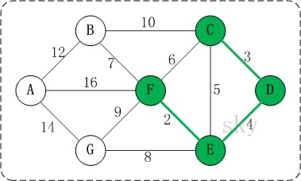</div>
>
> 在将<E,F> <C,D> <D,E>加入到最小生成树 R 中之后，则这几条边的顶点 C/D/E/F 的终点是 F。
>
> **终点**，就是将所有顶点按照从小到大的顺序排列好之后，某个顶点的终点就是**"**与它连通的最大顶点**"**。 因此，接下来，虽然<C,E>是权值最小的边。但是 C 和 E 的重点都是 F，即它们的终点相同，因此，将<C,E>加入最小生成树的话，会形成回路。

如果是，则舍弃这条边，因为这样会产生回路。如果不是，则选用。例如下图(d) 中，边(4,5)的权值为 4，是剩下的边中最小的，选择该边，但是因为该边的两个顶点在同一 个连通分量中，如果选用这条边，这个连通分量中就出现了回路(环)。而我们知道，最小 生成树中是一棵树，是不能有环的。

<div align="center">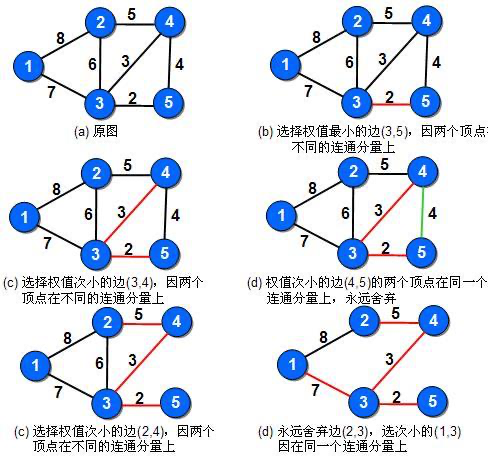</div>

​     

**Kruskal** 算法伪代码：

```java
qsort (1, m);  // 将边e[i]按权值e[i].w从小到大排序 

for(i=1; i<=m; ++i)	{
  // 若这条边的两个顶点在同一个连通分量中，舍弃
	if (getf(e[i].a) == getf(e[i].b))
		continue;
  
	merge(e[i].a, e[i].b); // 并查集中将顶点b并入顶点a
	ans + = e[i].w; // ans为最小生成树总权值和 
}
```

​        

# 三 最短路径

最短路径问题是图论研究中的一个经典算法问题，旨在寻找图（由结点和路径组成的）中**两结点之间的最短路径**。最短路径不一定是经过边最少的路径，但在这些最短路径中，长度最短的那一条路径上只有一条边，且它的权值在从源点出发的所有边的权值最小。

从图中某一顶点（称为源点）到达另一顶点（称为终点）的路径可能不止一条，如何找到一条路径使得沿此路径上各边上的权值总和达到最小，例公交查询系统。

<div align="center">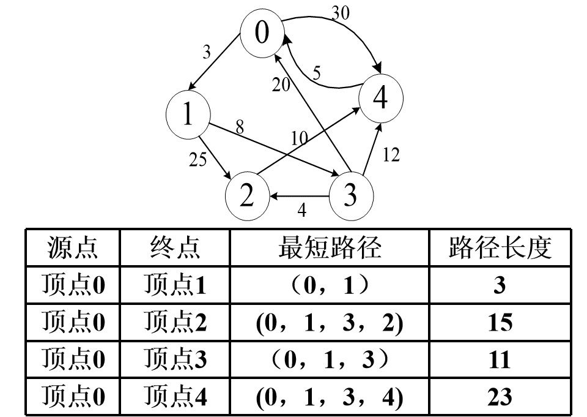</div>

​      

最短路径场景问题解法：

- 多源最短路径问题：
  - [Floyd算法](https://www.cnblogs.com/bigsai/p/15213511.html)：每一对顶点之间的最短路径， **解决任意两点间的最短路径的一种算法，可以正确处理有向图或负权的最短路径问题，同时也被用于计算有向图的传递闭包**。Floyd-Warshall算法的时间复杂度为O(N3)，空间复杂度为O(N2)；
- 单源最短路径问题：
  - [Dijkstra算法](https://www.cs.usfca.edu/~galles/visualization/Dijkstra.html)：求从某个源点到其余各点的最短路径，解决的是带权重的有向图上单源最短路径问题，该算法要求所有边的权重都为非负值；
  - [Bellman-Ford算法](https://wat1r.github.io/2020/09/22/bellman-ford-algorithm-master/)：其原理是对图进行V-1次松弛操作，得到所有可能的最短路径，优于Dijkstra算法的方面是边的权值可以为负数、实现简单，缺点是时间复杂度过高，高达O(VE)；
  - [SPFA算法](https://wat1r.github.io/2020/09/21/spfa-algorithm-master/)： Bellman-Ford算法的改进（动态逼近法），即**给定一个加权连通图，选取一个顶点，称为起点，求取起点到其它所有顶点之间的最短距离，其显著特点是可以求含负权图的单源最短路径，且效率较高。（**spfa是求单源最短路径的一种算法，它还有一个重要的功能是判负环（在差分约束系统中会得以体现），在Bellman-ford算法的基础上加上一个队列优化，减少了冗余的松弛操作，是一种高效的最短路算法）

​     

## 1. Dijkstra算法

Dijkstra(迪杰斯特拉)算法是典型的**单源最短路径算法**，用于计算一个节点到其他所有节点的最短路径，其主要特点是以起始点为中心向外层层扩展，直到扩展到终点为止。Dijkstra算法是很有代表性的最短路径算法，在很多专业课程中都作为基本内容有详细的介绍，如数据结构，图论，运筹学等等，常用于路由算法或者作为其他图算法的一个子模块。

**问题描述：**在无向图 G=(V,E) 中，假设**每条边** **E[i]** **的长度为** **w[i]**，找到由顶点 V0 到其余各点的最短路径（单源最短路径）

**算法思想：**设G=(V,E)是一个带权有向图，把图中**顶点集合V分成两组**，第一组为已求出最短路径的顶点集合（用S表示，初始时S中只有一个源点，以后每求得一条**最短路径**, 就将加入到集合S中，直到全部顶点都加入到S中，算法就结束了）；第二组为其余未确定最短路径的顶点集合（用U表示），按**最短路径长度的递增次序**依次把第二组的顶点加入S中。在加入的过程中，总保持从源点*v*到*S*中各顶点的最短路径长度不大于从源点 *v* 到 *U* 中任何顶点的最短路径长度。此外，每个顶点对应一个距离，S中的顶点的距离就是从v到此顶点的最短路径长度，U中的顶点的距离，是从v到此顶点只包括S中的顶点为中间顶点的当前最短路径长度。

> (1) 初始时，S只包含起点s；U包含除s外的其他顶点，且U中顶点的距离为"起点s到该顶点的距离"[例如，U中顶点v的距离为(s,v)的长度，然后s和v不相邻，则v的距离为∞]。
>
> (2) 从U中选出"距离最短的顶点k"，并将顶点k加入到S中；同时，从U中移除顶点k。
>
> (3) 更新U中各个顶点到起点s的距离。之所以更新U中顶点的距离，是由于上一步中确定了k是**求出最短路径的顶点**，从而可以利用k来更新其它顶点的距离；例如，(s,v)的距离可能大于(s,k)+(k,v)的距离。
>
> (4) 重复步骤(2)和(3)，直到遍历完所有顶点
>
> <div align="center"></div>

​          

单纯的看上面的理论可能比较难以理解，下面通过实例来对该算法进行说明

<div align="center">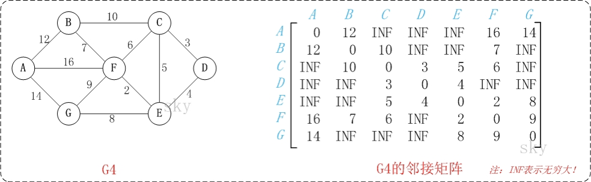</div>

以上图G4为例，来对Dijkstra算法演示（以第4个顶点D为起点，修改：**BC边权重改为20**）

> **初始状态：**S是已计算出最短路径的顶点集合，U是未计算除最短路径的顶点的集合！ 
>
> **第1步：**将顶点D加入到S中。此时，S={D(0)}, U={A(∞),B(∞),C(3),E(4),F(∞),G(∞)}；
>
> 注：C(3)表示C到起点D的距离是3
>
> **第2步：**将顶点C加入到S中。上一步操作之后，U中顶点C到起点D的距离最短，因此将C加入到S中，同时更新U中顶点的距离。以顶点F为例，之前F到D的距离为∞，但是将C加入到S之后，F到D的距离为 9=(F,C)+(C,D)。 此时，S={D(0),C(3)}, U={A(∞),B(23),E(4),F(9),G(∞)}；
>
> **第3步：**将顶点E加入到S中。上一步操作之后，U中顶点E到起点D的距离最短；因此，将E加入到S中，同时更新U中顶点的距离。还是以**顶点F为例**，之前F到D的距离为9；但是将E加入到S之后，F到D的距离为6=(F,E)+(E,D)。 此时，S={D(0),C(3),E(4)}, U={A(∞),B(23),F(6),G(12)}；
>
> **第4步：**将顶点F加入到S中。此时，S={D(0),C(3),E(4),F(6)}, U={A(22),B(13),G(12)}；
>
> **第5步：**将顶点G加入到S中。此时，S={D(0),C(3),E(4),F(6),G(12)}, U={A(22),B(13)}；
>
> **第6步：**将顶点B加入到S中。此时，S={D(0),C(3),E(4),F(6),G(12),B(13)}, U={A(22)}；
>
> **第7步：**将顶点A加入到S中。此时，S={D(0),C(3),E(4),F(6),G(12),B(13),A(22)}；
>
> 此时，起点D到各个顶点的最短距离就计算出来了：A(22) B(13) C(3) D(0) E(4) F(6) G(12)

<div align="center">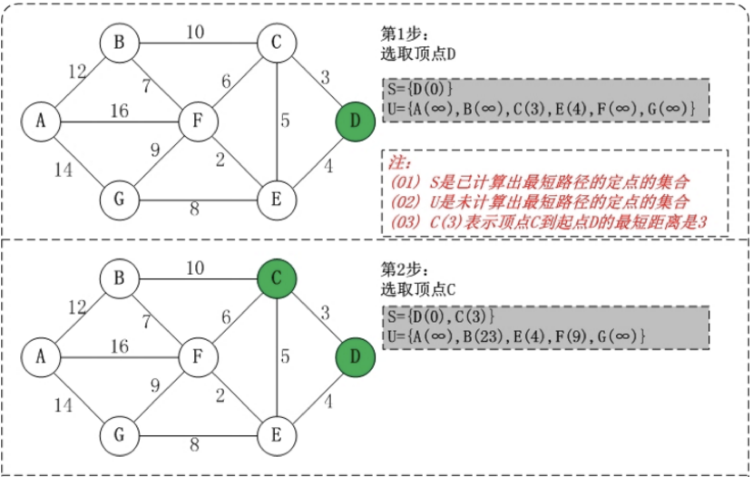</div>

<div align="center">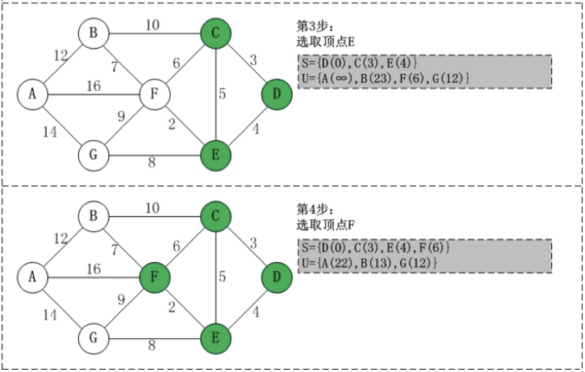</div>

<div align="center">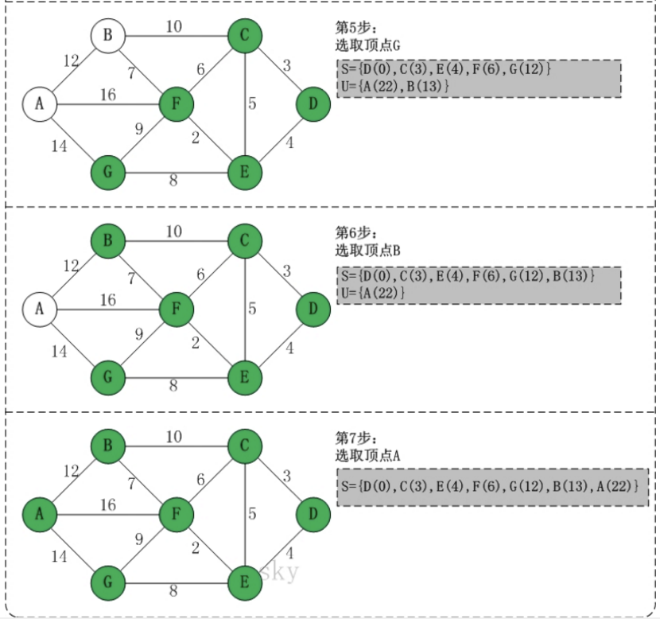</div>

​        

## 2. Floyd算法

**算法思想：**Floyd算法是一个经典的动态规划算法，用通俗的语言来描述的话，首先我们的目标是寻找 **从点i到点j的最短路径**，而从动态规划的角度看问题，我们需要为这个目标重新做一个诠释（这个诠释正是动态规划最富创造力的精华所在）。

从任意节点i到任意节点j的最短路径不外乎2种可能，***1*是直接从 *i* 到 *j* ，*2* 是从 *i* 经过若干个节点 *k* 到 *j***。所以可假设 **Dis(i,j) 为节点u到节点v的最短路径的距离**，对于每一个节点k，我们检查 **Dis(i,k) + Dis(k,j) < Dis(i,j)** 是否成立？如果成立，证明从i到k再到j的路径比i直接到j的路径短，我们便设置 **Dis(i,j) = Dis(i,k) + Dis(k,j)** ，这样一来，当我们遍历完所有节点k，Dis(i,j) 中记录的便是i到j的最短路径的距离。

> 算法描述：
>
> a. 从任意一条单边路径开始。**所有两点之间的距离是边的权**，如果两点之间没有边相连，则权为无穷大；
>
> b. 对于**每一对顶点** **u** **和** **v**，看看是否存在一个顶点 w 使得从 u 到 w 再到 v 比己知的路径更短，如果是更新它；
>
> <div align="center"></div>

​          

下面通过实例介绍Dijkstra算法计算过程：

> 通过Floyd计算图G=(V,E)中各个顶点的最短路径时，需要引入一个矩阵S，矩阵S中的元素a[i]\[j]表示顶点i（第i个顶点）到顶点j（第j个顶点）的距离。
>
> 假设图G中顶点个数为N，则需要对矩阵S进行N次更新。初始时，矩阵S中顶点a[i]\[j]的距离为顶点i到顶点j的权值；如果i和j不相邻，则a[i]\[j]=∞。 接下来开始，对矩阵S进行N次更新。
>
> 第1次更新时，如果"a[i]\[j]的距离" > "a[i]\[0]+a[0]\[j]"(a[i]\[0]+a[0]\[j]表示"i与j之间经过第1个顶点的距离")，则更新a[i]\[j]为"a[i]\[0] + a[0]\[j]"。 
>
> 同理，第k次更新时，如果"a[i]\[j]的距离" > "a[i]\[k] + a[k]\[j]"，则更新a[i]\[j]为"a[i]\[k] + a[k]\[j]"
>
> 更新N次之后，操作完成！

单纯的看上面的理论可能比较难以理解，下面通过实例来对该算法进行说明

<div align="center"></div>

以上图G4为例，来对弗洛伊德进行算法演示**（十字交叉法分析）**

> **初始状态：**S是记录各个顶点间最短路径的矩阵;
>
> **第1步：**初始化S。矩阵S中顶点a[i]\[j]的距离为顶点i到顶点j的权值；如果i和j不相邻，则a[i]\[j]=∞。实际上，就是将图的原始矩阵复制到S中；
>
> 注：a[i]\[j]表示矩阵S中顶点i（第i个顶点）到顶点j（第j个顶点）的距离
>
> **第2步：**以 **顶点A（第1个顶点）** 为中介点，若a[i]\[j] > a[i]\[0]+a[0]\[j]，则设置 a[i]\[j]=a[i]\[0]+a[0]\[j]。 以顶点a[1]\[6]，上一步操作之后，a[1]\[6]=∞；而将**A作为中介点**时，(B,A)=12，(A,G)=14，因此B和G之间的距离可以更新为26；
>
> 同理，依次将顶点B,C,D,E,F,G作为中介点，并更新a[i]\[j]的大小；

<div align="center">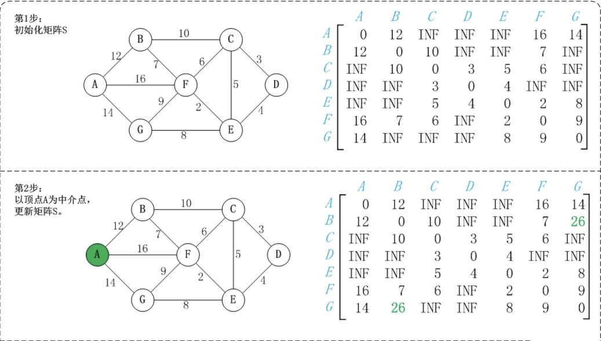</div>

<div align="center">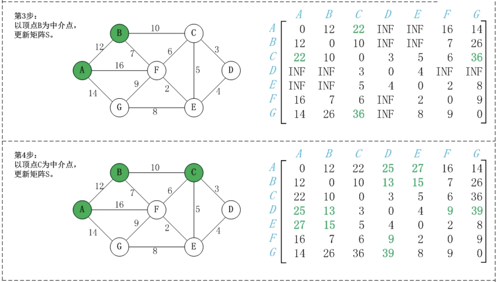</div>

<div align="center">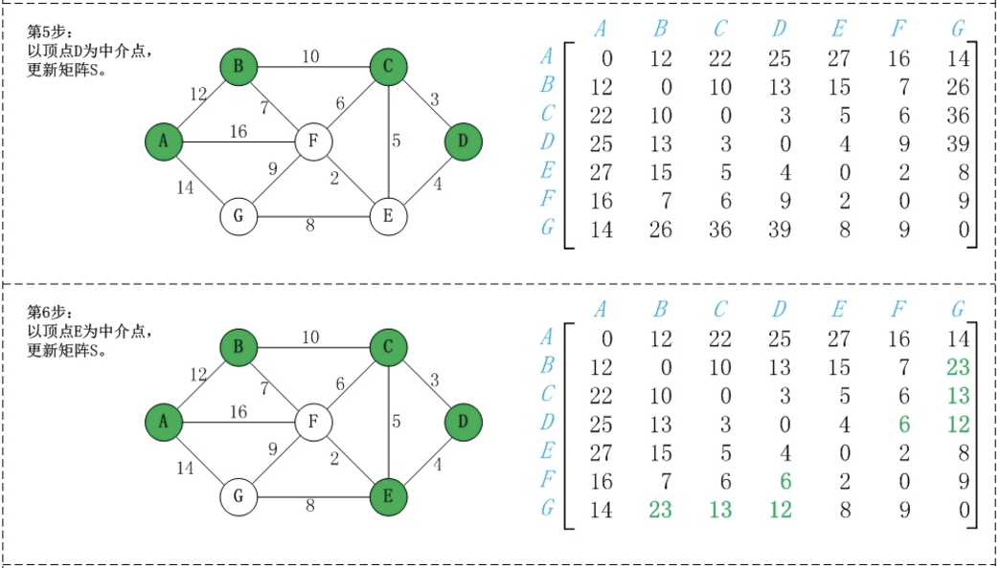</div>

<div align="center">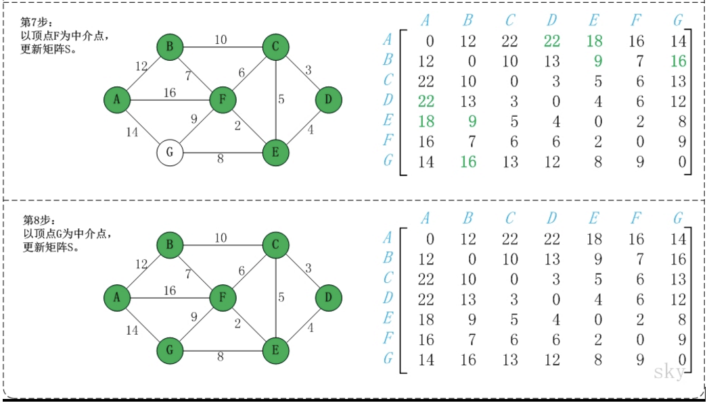</div>

另外需要注意的是，**Floyd** 算法不能解决带有“负权回路” (或者叫“负权环”) 的图，因为带有“负权回路”的图没有最短路径。例如下面的图就不存在1号顶点到3号顶点的最短路径，因为1->2->3->1->2->3->……1->2->3这样路径中，每绕一次1->2->3这样的环，最短路径就会减少1，永远找不到最短路径。其实如果一个图中带有“负权回路”，那么这个图则没有最短路径。

<div align="center">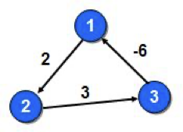</div>

​     

代码示例：

```go
/*
floyd最短路径算法，即统计图中各个顶点间的最短路径
参数:

	path: 路径，即path[i][j]=k，表示顶点i到顶点j的最短路径会经过顶点k
	dist: 长度数组，即dist[i][j]=sum，表示顶点i到顶点j的最短路径长度是sum
	mVexs: 图顶点集合
	mMatrix: 图各顶点间的边权值
*/
func floyd(path [][]int, dist [][]int, mVexs []int, mMatrix [][]int) {
	// 初始化
	for i := 0; i < len(mVexs); i++ {
		for j := 0; j < len(mVexs); j++ {
			// 顶点i到顶点j 的路径长度为 "i到j的权值"
			dist[i][j] = mMatrix[i][j]
			// 顶点i到顶点j的最短路径会经过顶点j
			path[i][j] = j
		}
	}

	// 计算最短路径
	for k := 0; k < len(mVexs); k++ { // 路径经过顶点k
		for i := 0; i < len(mVexs); i++ {
			for j := 0; j < len(mVexs); j++ {
				tmpNum := math.MaxInt
				// 如果经过下标为k顶点路径比原来两点间路径更短，则更新 dist[i][j] 和 path[i][j]
				if dist[i][k] != math.MaxInt && dist[k][j] != math.MaxInt {
					tmpNum = dist[i][k] + dist[k][j]
				}

				// 更新i到j的最短路径权值 & 路径经过的顶点
				if dist[i][j] > tmpNum {
					dist[i][j] = tmpNum
					path[i][j] = path[i][k]
				}
			}
		}
	}
}
```

​          

## 3. Bellman-ford算法

**贝尔曼-福特算法**（Bellman-Ford）是由理查德·贝尔曼（Richard Bellman） 和 莱斯特·福特 创立的，求解单源最短路径问题的一种算法。

相关名词：

* **松弛**：每次松弛操作实际上是 ***对相邻节点的访问，第n次松弛操作保证了所有深度为n的路径最短***。由于图的最短路径最长不会经过超过**|V| - 1** 条边，所以可知贝尔曼-福特算法所得为最短路径

* **负边权操作**：与Dijkstra算法不同的是，Dijkstra算法的基本操作“拓展”是在深度上寻路，而“松弛”操作则是在广度上寻路，这就确定了贝尔曼-福特算法可以对负边进行操作而不会影响结果

* **负权环判定**：因为负权环可以无限制的降低总花费，所以如果发现第n次操作仍可降低花销，就一定存在负权环

​      

给定图G(V, E)（其中V、E分别为图G的**顶点集与边集**），源点s，数组 *d[i]* 记录从源点*s*到顶点*i*的路径长度，初始化数组 d[n] 为, d[s]为0，则Bellman-ford算法流程：

> * **初始化：**将除源点外的所有顶点的**最短距离估计值** d[v] ← +∞, d[s] ←0，即每一个点保存一个值，表示从原点到达这个点的距离，将原点的值设为0，其它的点的值设为**无穷大（表示不可达）**；
>
> * **迭代求解：**反复对边集 *E* 中的每条边进行**松弛操作**，使得顶点集V中的**每个顶点v的最短距离估计值逐步逼近其最短距离**，即对于图中的每条边，如果起点 u 的距离 d 加上边的权值 w 小于终点 v 的距离 d，则更新终点 v 的距离值 d；（运行|v|-1次）
>
> * **检验负权回路：**判断边集 *E* 中的每一条边的两个端点是否收敛，即 **d(v)>d(u) + w(u,v)** 是否存在。如果存在未收敛的顶点，则算法返回false，表明问题无解，表示**途中存在从源点可达的权为负的回路**；否则算法返回true，并且从源点可达的顶点v的最短距离保存在 d[v]中；

之所以需要第三部分的原因，是因为如果存在从源点可达的权为负的回路，则应为无法收敛而导致不能求出最短路径。可知，Bellman-Ford算法寻找单源最短路径的时间复杂度为O(VE)。

考虑如下的图：

<div align="center">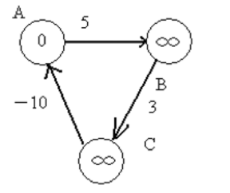</div>

经过第一次遍历后，**点B的值变为5，点C的值变为8**，这时注意权重为－10的边，这条边的存在，导致点A的值变为－2（8＋ －10＝－2）。

<div align="center">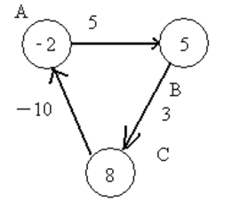</div>

第二次遍历后，点B的值变为3，点C变为6，点A变为－4。正是因为有一条负边在回路中，导致**每次遍历后，各个点的值不断变小**。

在回过来看一下**bellman－ford**算法的第三部分，遍历所有边，检查是否存在**d(v) > d (u) + w(u,v)**。因为第二部分循环的次数是**定长的**，所以如果存在无法收敛的情况，则肯定能够在第三部分中检查出来。比如

<div align="center"></div>

此时，点A的值为－2，点B的值为5，边AB的权重为5，5 > -2 + 5. 检查出来这条边**没有收敛**。所以，*Bellman*－*Ford* 算法可以解决图中有权为负数的边的单源最短路径问。

<div align="center">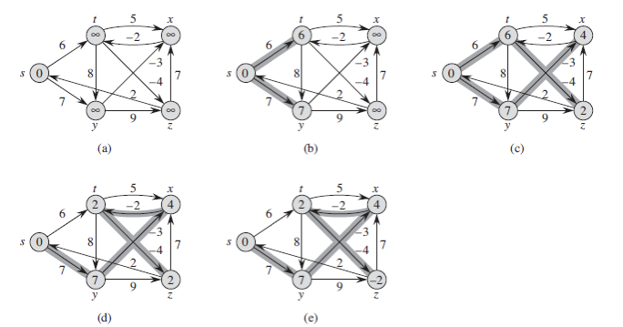</div>

​        

算法程序实现：

```go
// Edge 表示一条边
type Edge struct {
	Src, Dest, Weight int
}

// Graph 表示图结构
type Graph struct {
	// V, E 分别表示顶点和边的数量
	V, E int
	// 边集合表示图
	Edges []Edge
}

// BellmanFord 获得单源最短路径，同时检测负权回路
func BellmanFord(graph *Graph, src int) {
	V := graph.V
	E := graph.E
	dist := make([]int, V)

  // step1: 初始化
	for i := 0; i < V; i++ {
		dist[i] = math.MaxInt
	}

	// step2: 松弛操作
	dist[src] = 0
	for i := 1; i < V; i++ {
		for j := 0; j < E; j++ {
			u := graph.Edges[j].Src
			v := graph.Edges[j].Dest
			w := graph.Edges[j].Weight
			
			if dist[v] > dist[u]+w {
				dist[v] = dist[u] + w
			}
		}
	}

	// step3: 检测负权回路，上面的操作保证没有负权回路的存在；如果找到更短的路径，则说明存在负权回路
	for i := 0; i < E; i++ {
		u := graph.Edges[i].Src
		v := graph.Edges[i].Dest
		w := graph.Edges[i].Weight

		if dist[v] > dist[u]+w {
			fmt.Println("Graph contains negative weight cycle!")
		}
	}
}
```

​        

## 4. SPFA算法

**算法思想：**spfa就是BellmanFord的一种实现方式，其具体不同在于，对于处理松弛操作时，采用了队列（先进先出方式）操作，从而大大降低了时间复杂度。

算法大致流程是用一个队列来进行维护，即初始时将源加入队列，每次从队列中取出一个元素，并对所有与他相邻的点进行松弛，若某个相邻的点松弛成功，且如果该点没有在队列中，则将其入队，直到队列为空时算法结束。

> 设 Dist 代表 ***S 到 I 点的当前最短距离***，Fa 代表 ***S 到 I 的当前最短路径中 I 点之前的一个点的编号***。开始时Dist全部为 +∞，只有Dist[S] = 0，Fa全部为0。同时维护一个队列，里面存放所有需要进行迭代的点，且初始时队列中只有一个点S，并用一个布尔数组记录每个点是否处在队列中。
>
> 每次迭代，取出队头的点v，依次 **枚举** 从v出发的边 v->u，设边的长度为len，判断 **Dist[v] + len < Dist[u]**？若小于则改进Dist[u]，将Fa[u]记为v，并且由于S到u的最短距离变小了， 有可能 **u** 可以改进其它的点，所以若 u不在队列中，就将它放入队尾。这样一直迭代下去直到队列变空，也就是S到所有的最短距离都确定下来，结束算法。
>
> 判断有无负环：如果某个点进入队列的次数超过V次，则存在负环（SPFA无法处理带负环的图）

SPFA 在形式上和**宽度优先搜索**非常类似，不同的是宽度优先搜索中一个点出了队列就不可能重新进入队列，但是SPFA中一个点可能在出队列之后再次被放入队列，也就是一个点改进过其它的点之后，过了一段时间可能本身被改进，于是再次用来改进其它的点，这样反复迭代下去。设一个点用来作为迭代点对其它点进行改进的平均次数为k，有办法证明对于通常的情况，k在2左右。

<div align="center">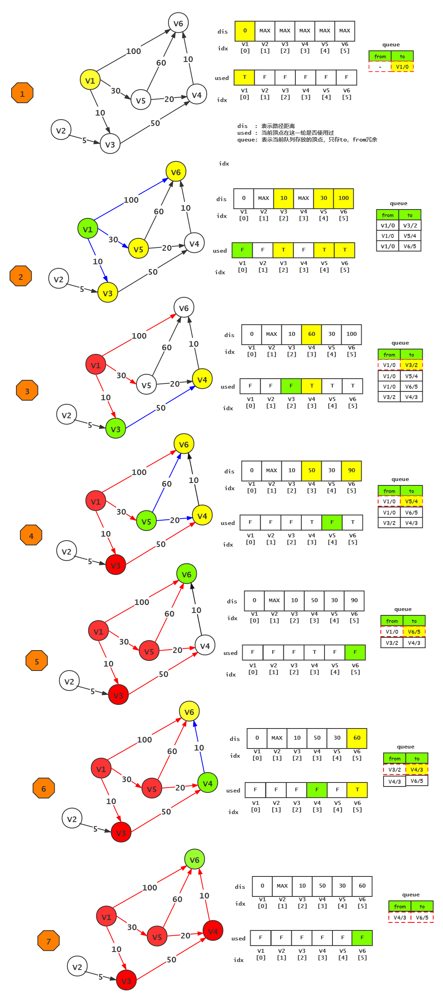</div>

​      

# 四 有向无环图DAG

在一个有向图中，若用顶点表示活动，有向边表示活动间的先后关系，称该有向图叫做 **顶点表示活动的网络**，简称 **AOV 网**。

<div align="center">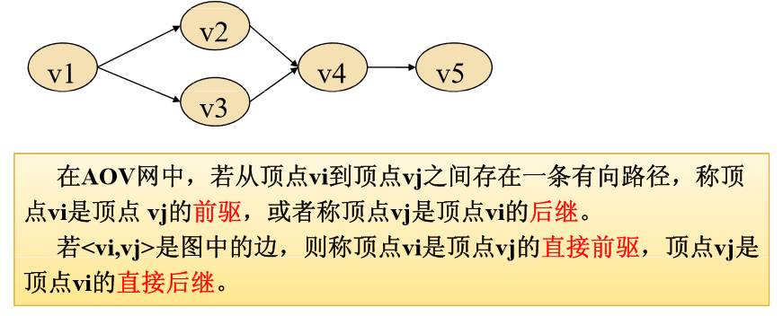</div>


## 1. 拓扑排序

拓扑排序（Topological Order），是指将一个有向无环图（Directed Acyclic Graph, 简称 **DAG**）进行排序进而得到一个有序的线性序列（**一个有向无环图可以有一个或多个拓扑排序序列**）。该序列必须满足下面两个条件：

> 1）每个顶点出现且只出现一次；
>
> 2）若存在一条从顶点 A 到顶点 B 的路径，那么在序列中顶点 A 出现在顶点 B 的前面；
>
> **注：**有向无环图（DAG）才有拓扑排序，非DAG图没有拓扑排序一说

​       

例如：一个项目包括A、B、C、D四个子部分来完成，并且A依赖于B和D，C依赖于D，如果现在要制定一个计划，写出A、B、C、D的执行顺序。这时，就可以利用到拓扑排序，它就是用来**确定事物发生的顺序的**。在拓扑排序中，如果存在一条从顶点A到顶点B的路径，那么在排序结果中B出现在A的后面。

<div align="center">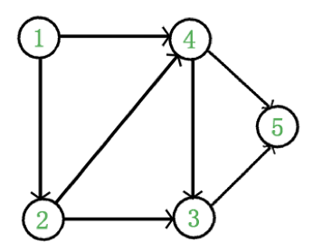</div>

**上图是一个 DAG图，那么如何写出它的拓扑排序呢？**

> 1）从 DAG 图中选择一个 没有前驱（即入度为0，没有前驱）的顶点并输出；
>
> 2）从图中 ***删除该顶点和所有以它为起点的有向边***；
>
> 3）重复 1 和 2 直到当前的 *DAG* 图为空，或当前图中不存在无前驱的顶点为止，后一种情况说明有向图中必然存在环；
>
> <div align="center">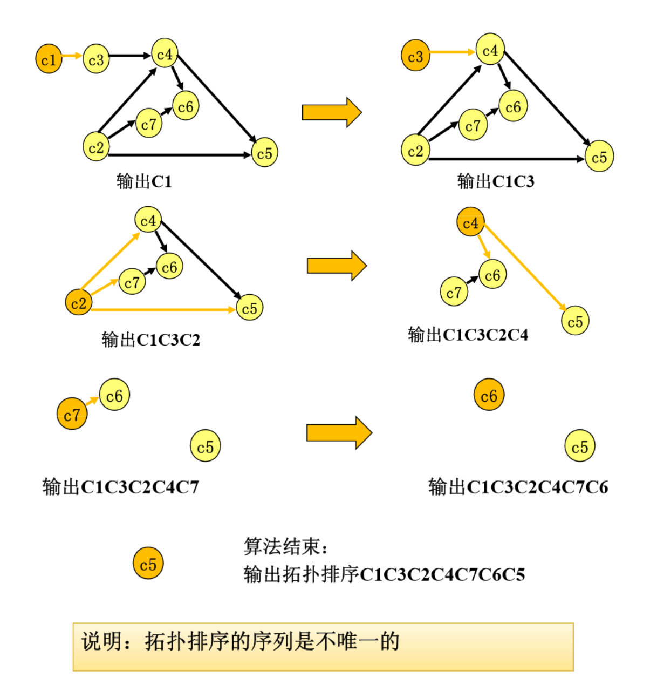</div>
>
> 于是，得到拓扑排序后的结果是 { 1, 2, 4, 3, 5 }

​      

**拓扑排序的作用？**

> 我们说**快速排序是不稳定的**，这是因为最后的快排结果中相同元素的出现顺序和排序前不一致了。如果用偏序的概念可以这样解释这一现象，**相同值的元素之间的关系是无法确定的**。因此它们在最终的结果中的出现顺序可以是任意的。而对于诸如插入排序这种稳定性排序，它们对于值相同的元素，还有一个潜在的比较方式，即比较它们的出现顺序，出现靠前的元素大于出现后出现的元素。因此通过这一潜在的比较，将偏序关系转换为了全序关系，从而保证了结果的唯一性，而**拓扑排序就是一种将偏序转换为全序的一种算法**。
>
> * **偏序：**有向图中两个顶点之间不存在环路，至于连通与否，是无所谓的，所以有向无环图必然是满足偏序关系的；
>
> * **全序：**就是在偏序的基础之上，有向无环图中的任意一对顶点还需要有明确的关系（反映在图中，就是单向连通的关系，注意不能双向连通，那就成环了），可见全序就是偏序的一种特殊情况；
>
> 意思就是讲，**一个不确定的偏序关系经全序后就有一种确定的先后顺序了**。既然有先后，那么在实际生活中的选课问题，比如大一时一定要修完这门课，大二才学第二门课，这种排课问题就是拓扑排序问题。

​       

拓扑排序算法：以广度优先遍历为例，这一改进后的算法与普通的广度优先遍历唯一的区别，在于我们应当**保存每一个结点对应的入度**，并在遍历的每一层选取入度为0的结点开始遍历，而普通的广度优先遍历则无此限制，可以从任意一个结点开始遍历。

> 1）初始化一个int[] inDegree保存每一个结点的入度；
>
> 2）对于图中的每一个结点的子结点，将其子结点的入度加1；
>
> 3）选取入度为0的结点开始遍历，并将该节点加入输出；
>
> 4）对于遍历过的每个结点，更新其子结点的入度，将子结点的入度减1；
>
> 5）重复步骤3，直到遍历完所有的结点。注意如果无法遍历完所有的结点，则意味着当前的图不是有向无环图，不存在拓扑排序；

​        

## 2. 关键路径

在一个有向图中，若用顶点表示事件，弧表示活动，权表示活动持续时间，称该有向图叫做 **边表示活动的网络**，简称为 **AOE 网**。

<div align="center">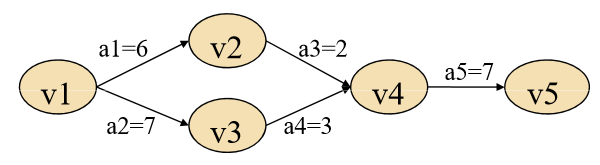</div>

关键概念解释：

> **事件最早发生时间**：etv（earliest time of vertex），即顶点Vk的最早发生时间；
>
> **事件最晚发生时间**：ltv（lastest time of vertex），即顶点Vk的最晚发生时间，也就是每个顶点对应的事件最晚需要开始的事件，超出此事件将会延误整个工期；
>
> **活动的最早开工时间**：ete（earliest time of edge），即弧ak的最早发生时间；
>
> **活动的最晚开工时间**：lte（lastest time if edge），即弧的最晚发生时间，也就是不推迟工期的最晚开工时间；
>
> 注：可以由事件的最早发生时间和事件的最晚发生时间求出活动的最早和最晚开工时间， 由1,2可以求得3,4，然后在 **根据ete[k] == lte[k]？判断ak是否是关键活动**

​       

以上述AOE网介绍活动的 **关键路径**：

<div align="center">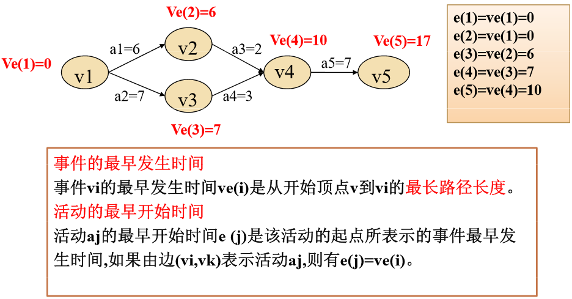</div>

<div align="center">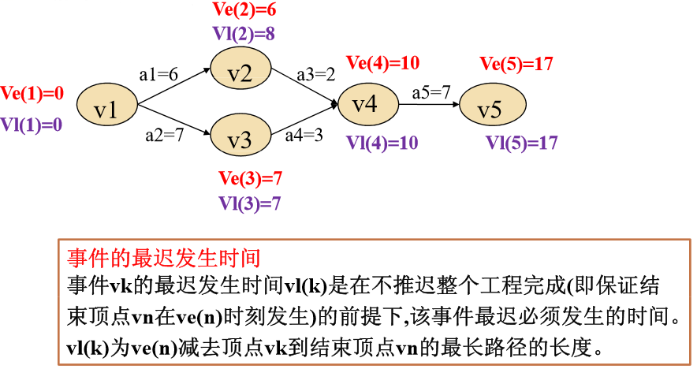</div>

<div align="center">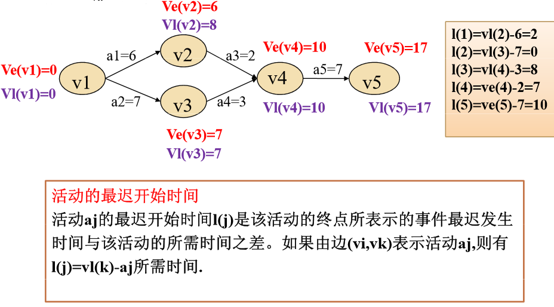</div>

<div align="center">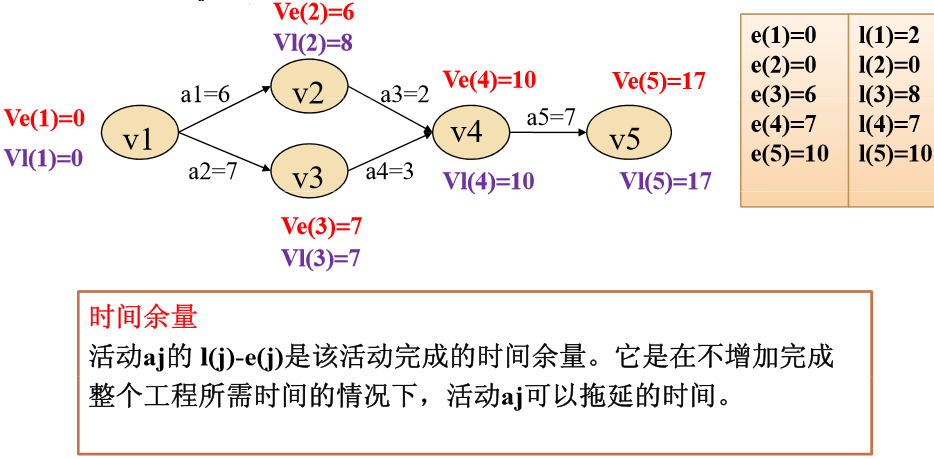</div>

<div align="center">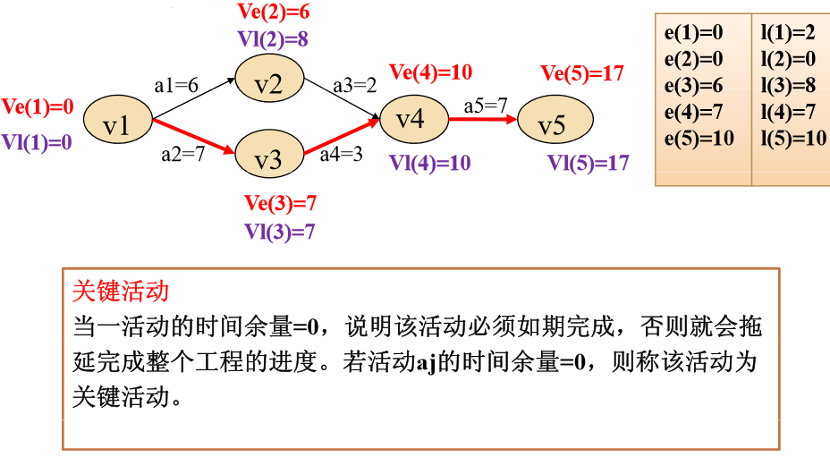</div>


