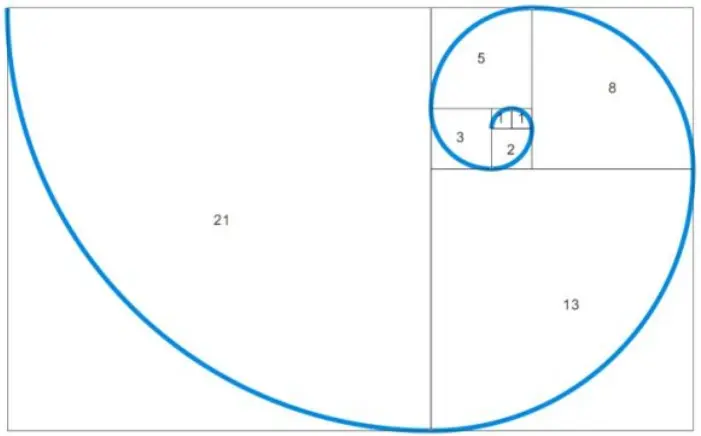
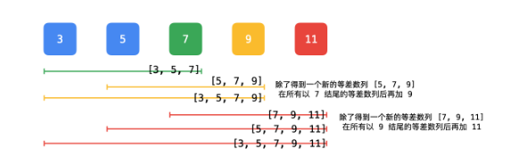
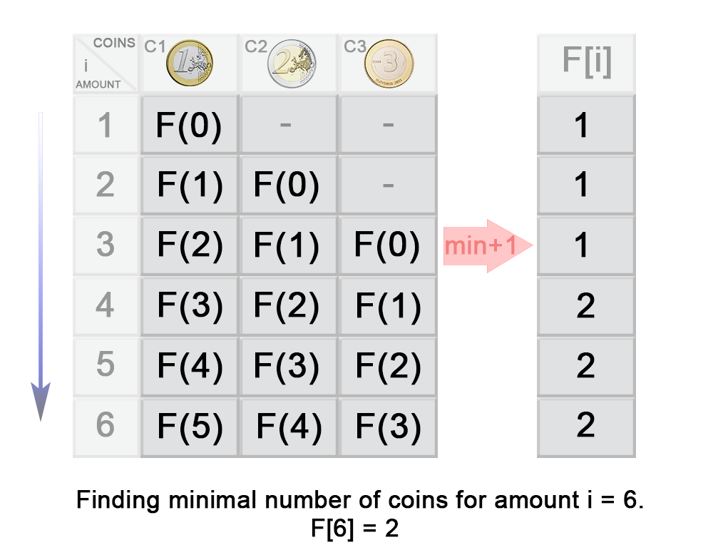

# 动态规划算法（Dynamic Programing）

**动态规划过程**：即每次决策依赖于当前状态，又随即引起状态的转移，且一个决策序列就是在变化的状态中产生出来的，所以这种 `多阶段最优化决策解决问题的过程` 就称为动态规划。

​         

# 一 基本思想

与分治法类似，也是**将待求解的问题分解为若干个子问题**（阶段），按顺序求解子阶段，前一子问题的解，为后一子问题的求解提供了有用的信息。在求解任一子问题时，列出各种可能的局部解，通过决策保留那些有可能达到最优的局部解，丢弃其他局部解，所以依次解决各子问题，最后一个子问题就是初始问题的解；

由于动态规划解决的问题多数有重叠子问题这个特点，为减少重复计算，对每一个子问题只解一次，将其不同阶段的不同状态保存在一个二维数组中；

与分治法最大的差别是：适合于用动态规划法求解的问题，经分解后得到的子问题往往不是互相独立的，即 ***下一个子阶段的求解是建立在上一个子阶段的解的基础上，进行进一步的求解***；

​        

# 二 算法特征

可用于判断动态规划方法是否适用于给定的问题：

1）**最优子结构**：在自下而上的递推过程中，所求得的每个子问题一定是全局最优解，既然它分解的子问题是全局最优解，那么依赖于它们解的原问题自然也是 `全局最优解`；

2）**无后效性**：是一个非常“宽松”的要求，只要满足前面提到的动态规划问题模型，其实基本上都会满足无后效性；

> 第一层含义：在推导后面阶段的状态的时候，只关心前面阶段的状态值，不关心这个状态是怎么一步一步推导出来的；
>
> 第二层含义：某阶段状态一旦确定，就不受之后阶段的决策影响；

3）**重叠子问题**：在求解原问题的时候，往往需要依赖其子问题，子问题依赖其子子问题，甚至可能同时依赖多个子问题，因此子问题之间是有重叠关系的；

<div align="center"></div>

​      

动态规划所处理的问题是一个多阶段决策问题，一般由初始状态开始，通过对中间阶段决策的选择，达到结束状态。这些决策形成了一个决策序列，同时确定了完成整个过程的一条活动路线（通常是求最优的活动路线），一般来说动态规划的设计都有着一定的模式，一般要经历以下几个步骤，如图所示：

> 初始状态 -> 决策 1 -> 决策 2 -> ... -> 决策 n -> 结束状态

实际应用中可以按以下几个简化的步骤进行设计题目：

> 1）分析最优解的性质，并刻画其结构特征
>
> 2）递归的定义最优解
>
> 3）以自底向上或自顶向下的记忆方式（备忘录法）计算出最优解
>
> 4）根据计算最优值时得到的消息，构造问题的最优解

​           

# 三 例题分析

DP问题解题套路：

> 明确状态 --> 明确选择 --> 明确 dp 函数/数组的定义 --> 明确 base case

​    

## 3.1 斐波那契数列

斐波那契数列（Fibonacci sequence），又称[黄金分割](https://links.jianshu.com/go?to=https%3A%2F%2Fbaike.baidu.com%2Fitem%2F%E9%BB%84%E9%87%91%E5%88%86%E5%89%B2%2F115896)数列，因数学家莱昂纳多·斐波那契（Leonardoda Fibonacci）以兔子繁殖为例子而引入，故又称为“[兔子数列](https://links.jianshu.com/go?to=https%3A%2F%2Fbaike.baidu.com%2Fitem%2F%E5%85%94%E5%AD%90%E6%95%B0%E5%88%97%2F6849441)”，指的是这样一个数列：0、1、1、2、3、5、8、13、21、34、……这个数列从第三项开始，每一项都等于前两项之和，其次裴波那契数列最具有和谐之美的地方是，越往后，相邻两项的比值会无限趋向于黄金比1:0.618。

<div align="center"></div>

在数学上，斐波那契数列以如下被以递推的方法定义：

> **f(1) = f(2) = 1**
>
> **f(n) = f(n - 1) + f(n - 2) （n>=3）**

​        

### 3.1.1 [爬楼梯](https://leetcode.com/problems/climbing-stairs/description/)

**问题**：有 N 阶楼梯，每次可以上一阶或者两阶，求有多少种上楼梯的方法

**解题思路**

Step1：明确 dp 数组的定义，即 dp[i] 表示走到第 i 个楼梯的方法数目

Step2：根据 **选择** 写出状态转移逻辑

> 第 i 个楼梯可以从第 i-1 和 i-2 个楼梯再走一步到达，走到第 i 个楼梯的方法数为走到第 i-1 和第 i-2 个楼梯的方法数之和
>
> **dp[i] = dp[i-1] + dp[i-2]**
>
> 考虑到 dp[i] 只与 dp[i - 1] 和 dp[i - 2] 有关，因此可以只用两个变量来存储 dp[i - 1] 和 dp[i - 2]，使得原来的 O(N) 空间复杂度优化为 O(1) 复杂度

```go
func ClimbStairs(N int) int {
	if N <= 2 {
		return N
	}

	one, two := 1, 2
	for i := 2; i < N; i++ {
		cur := one + two

		one, two = two, cur
	}

	return two
}
```

​      

### 3.1.2 街区抢劫（[链形](https://leetcode.com/problems/house-robber/description/) & [环形](https://leetcode.com/problems/house-robber-ii/description/)）

**问题**：抢劫一排住户，但是不能抢邻近的住户（若抢劫相邻住户，则会触发报警），求可抢劫最大价值量

**解题思路**

Step1：明确 dp 数组的定义，即 dp[i] 表示抢到第 i 个住户时的最大抢劫量

Step2：根据 **选择** 写出状态转移逻辑

> 由于不能抢劫邻近住户，如果抢劫了第 i -1 个住户，那么就不能再抢劫第 i 个住户，所以强盗抢劫的最大量为
>
> **dp[i] = max(dp[i-2] + vaules[i], dp[i-1])**

```go
func RobInline(nums []int) int {
	n := len(nums)
	if n == 0 {
		return 0
	} else if n == 1 {
		return nums[0]
	}

	dp := make([]int, 2)
	dp[0], dp[1] = nums[0], getMaxInt(nums[0], nums[1])
	for i := 2; i < n; i++ {
		ind := i & 1  // i&1 == i%2, ind^1: 0->1, 1->0
		dp[ind] = getMaxInt(dp[ind]+nums[i], dp[ind^1])
	}

	return getMaxInt(dp[0], dp[1])
}
```

​      

**进阶**：若住户房屋呈 **环形**，则强盗可抢到的最大抢劫量是多少？

> 由于住户房屋呈 **环形**（首尾相接），则存在以下2种情况：
>
> * a）若抢了第1个住户，则不能抢最后一个住户（范围：1 ～ n-1）；
> * b）若没有抢第1个住户，则可抢最后一个住户（范围：2 ～ n）；
>
> 因此，基于原始强盗抢劫问题，可将问题分解成2个子问题，后对2个子问题结果进行比较返回最大值
>
> <div align="center"></div>

```go
func RobInCircle(nums []int) int {
   n := len(nums)
   if n == 0 {
      return 0
   } else if n == 1 {
      return nums[0]
   }

   return getMaxInt(RobInline(nums[:n-1]), RobInline(nums[1:]))
}
```

​      

### 3.1.3 [信件错排](https://leetcode.com/problems/find-the-derangement-of-an-array/)

**问题**：有 N 个 信 和 信封，顺序被打乱，求错误装信方式的数量

**解题思路**

Step1：明确 dp 数组存储错误方式的数量，即 dp[i] 表示前 i 个信和信封的错误方式数量

Step2：根据 **选择** 写出状态转移逻辑

>  对于第N封信而言，假设其装在了第 K 个信箱中，则对于第 K 封信，有两种情况：
>
> 1）**信件 K 装在信箱 N 中**：已经完成K和N两个信封，即若交换 K 和 N 的信后，它们的信和信封在正确的位置，其余 i-2 封信有 dp[i-2] 种错误装信的方式。由于 K 有 N-1 种取值，因此共有 **(N-1)*dp[N-2]** 种错误装信方式；
>
> <div align="center"></div>
>
> 2）**信件 K 未被装在信箱 N 中**：假设每个信封都有自己的专属信箱，N的专属信箱为K，那么可以认为K的专属信箱为N。但此场景下，信件 K 不能放入自己的专属信箱 N ，所以可以理解成求 N-1 封信件和 N-1 个信箱（除去信件 N）之间的错排数量问题，即求 dp[N-1]。由于 K 有 N-1 种取值，因此共有 (N-1)*dp[N-1] 种错误装信方式
>
> <div align="center"></div>

```go
func MailMissAlignment(n int) int {
	if n <= 1 {
		return 0
	}
	
	dp := make([]int, n)
	dp[0], dp[1] = 0, 1 // base case
	for i := 2; i < n; i++ {
		dp[i] = (i - 1) * (dp[i-2] + dp[i-1])
	}

	return dp[n-1]
}
```

​       

## 3.2 矩阵路径

### 3.2.1 [矩阵最小路径和](https://leetcode.com/problems/minimum-path-sum/description/)

**问题**：求从矩阵的左上角到右下角的最小路径和，每次只能向右和向下移动

<div align="center"></div>

**解题思路**

定义dp二维数组记录累加值，状态转移方程为：

`dp[i][j] = Math.min(dp[i - 1][j], dp[i][j - 1]) + grid[i][j]`

```go
func MinPathSum(grid [][]int) int {
    row, col := len(grid), len(grid[0])
    if row == 0 || col == 0 {
        return 0
    }

    dp := make([][]int, row)
    for i:=0; i<row; i++ {
        dp[i] = make([]int, col)
    }

    dp[0][0] = grid[0][0]
    for i:=0; i<row; i++ {
        for j:=0; j<col; j++ {
            if i == 0 && j == 0 {
                continue
            }

            if i == 0 {
                dp[0][j] = dp[0][j-1] + grid[0][j]
            } else if j == 0 {
                dp[i][0] = dp[i-1][0] + grid[i][0]
            } else {
                dp[i][j] = getMinInt(dp[i][j-1], dp[i-1][j]) + grid[i][j]
            }
        }
    }

    return dp[row-1][col-1]
}
```

**进阶**：空间复杂度O(n)

**滚动数组**：因为i行依赖 i行和i - 1行，所以计算完i行覆盖i - 1行的值，不会影响最终结果

```go
func MinPathSum(grid [][]int) int {
    row, col := len(grid), len(grid[0])
    if row == 0 || col == 0 {
        return 0
    }

    dp := make([]int, col)

    dp[0] = grid[0][0]
    for i:=0; i<row; i++ {
        for j:=0; j<col; j++ {
            if i == 0 && j == 0 {
                continue
            }

            if i == 0 {          // 只能从上边界来
                dp[j] = dp[j-1] + grid[0][j]
            } else if j == 0 {   // 只能从左边界来
                dp[j] = dp[j] + grid[i][0]
            } else {
                dp[j] = getMinInt(dp[j-1], dp[j]) + grid[i][j]
            }
        }
    }

    return dp[col-1]
}
```

​          

### 3.2.2 矩阵总路径数（[无障碍](https://leetcode.com/problems/unique-paths/) & [有障碍](https://leetcode.com/problems/unique-paths-ii/)）

**问题**：统计从矩阵左上角到右下角的路径总数，每次只能向右或者向下移动

<div align="center"></div>

**解题思路**

dp[i]\[j] 表示从左上角(0, 0)到坐标为(i, j)的点的路径数，则状态转移方程为：

`dp[i][j] = dp[i - 1][j], dp[i][j - 1]`

```go
// 空间复杂度O(m*n)
func UniquePaths(m int, n int) int {
    dp := make([][]int, m)
    for i:=0; i<m; i++ {
        dp[i] = make([]int, n)
        dp[i][0] = 1
    }

    for j:=0; j<n; j++ {
        dp[0][j] = 1
    }

    for i:=1; i<m; i++ {
        for j:=1; j<n; j++ {
            dp[i][j] = dp[i-1][j] + dp[i][j-1]
        }
    }

    return dp[m-1][n-1]
}

// 空间复杂度O(n)
func UniquePathsForOpt(m int, n int) int {
    dp := make([]int, n)
    for j:=0; j<n; j++ {
        dp[j] = 1
    }

    for i:=1; i<m; i++ {
        for j:=1; j<n; j++ {
            dp[j] += dp[j-1] 
        }
    }

    return dp[n-1]
}
```

**数学公式**：问题实际是一个组合问题，即从左上角(0, 0) 移动到右下角(m-1, n-1)，总共移动的次数 **S = m + n - 2**，向下移动的次数 **D = n - 1**

<div align="center"></div>

那么问题可以看成从 S 中取出 D 个位置的组合数量，这个问题的解为 C(S, D)

<div align="center"></div>

```go
func uniquePaths(m int, n int) int {
    s := m + n - 2  // 总共的移动次数
    d := n - 1      // 向下的移动次数
    res := 1
    for i:=1; i<=d; i++ {
        res = res * (s - d + i) / i
    }

    return res
}
```

​      

**进阶2**：矩阵中存在障碍物，若有障碍物，则无法通过，统计机器人从矩阵左上角到右下角的路径总数

<div align="center"></div>

```go
// 空间复杂度O(m*n)
func uniquePathsWithObstacles(obstacleGrid [][]int) int {
    m, n := len(obstacleGrid), len(obstacleGrid[0])
    if m < 1 || n < 1 || obstacleGrid[0][0] == 1 {
        return 0
    }

    dp := make([][]int, m)
    for i:=0; i<m; i++ {
        dp[i] = make([]int, n)
    }

    dp[0][0] = 1
    for i:=0; i<m; i++ {
        for j:=0; j<n; j++ {
            if (i == 0 && j == 0) || obstacleGrid[i][j] != 0 {
                continue
            }

            if i == 0 {         // first row
                dp[0][j] = dp[0][j-1]
            } else if j == 0 {  // first col
                dp[i][0] = dp[i-1][0]
            } else {
                dp[i][j] = dp[i-1][j] + dp[i][j-1]
            }
        }
    }

    return dp[m-1][n-1]
}

// 空间复杂度O(n)
func UniquePathsWithObstaclesForOpt(obstacleGrid [][]int) int {
    m, n := len(obstacleGrid), len(obstacleGrid[0])
    if m < 1 || n < 1 || obstacleGrid[0][0] == 1 {
        return 0
    }

    dp := make([]int, n)    
    for i:=0; i<m; i++ {
        for j:=0; j<n; j++ {
            if obstacleGrid[i][j] == 1 {
                // has obstacle, no way passthrough
                dp[j] = 0
            } else if j > 0 {
                // dp[j] = dp[j] + dp[j - 1] ==> current cell = top cell + left cell
                dp[j] += dp[j-1]
            }
        }
    }

    return dp[n-1]
}
```

​      

## 3.3 数组区间

### 3.3.1 数组区间和

#### a. 数组Immutable（[一维](https://leetcode.com/problems/range-sum-query-immutable/description/) & [二维](https://leetcode.com/problems/range-sum-query-2d-immutable/)）

**问题**：已知一维数组nums，求区间 i ~ j 的和

**解题思路**

问题可以转换为 **sum[j] - sum[i-1]**，其中 sum[i] 为 0 ~ i 的和

```go
type NumArray struct {
    Sums []int
}

func Constructor(nums []int) NumArray {
    preSum := make([]int, len(nums)+1)

    preSum[0] = 0
    for i := 1; i< len(preSum) ; i++ {
        preSum[i] = preSum[i-1] + nums[i-1]
    }
    
    return NumArray{
        Sums : preSum,
    }
}


func (this *NumArray) SumRange(left int, right int) int {
    return this.Sums[right+1] - this.Sums[left]
}
```

​       

**问题进阶**：已知二维数组nums，求从左上角 (row1, col1) 到右下角  (row2, col2) **区域内数值之和**？

<div align="center"></div>

**解题思路**：

> 1）思路1：基于一维数组的思路，以 "行" 为粒度计算每一行在列区间 i ~ j 的和，即 **sum[r]\[j] - sum[r]\[i-1]**，最后统计 row1 ~ row2 行之和；
>
> ```go
> func Constructor(matrix [][]int) NumMatrix {
> 	m, n := len(matrix), len(matrix[0])
> 	if m < 1 || n < 0 {
> 		return NumMatrix2DImmutable{}
> 	}
> 
> 	// init
> 	preSums := make([][]int, m)
> 	for i := 0; i < m; i++ {
> 		preSums[i] = make([]int, n+1)
> 	}
> 	
> 	// calculate
> 	for i := 0; i < m; i++ {
> 		for j := 1; j <= n; j++ {
> 			preSums[i][j] = preSums[i][j-1] + matrix[i][j-1]
> 		}
> 	}
> 
> 	return NumMatrix2DImmutable{
> 		Sums: preSums,
> 	}
> }
> 
> func (this *NumMatrix) SumRegion(row1 int, col1 int, row2 int, col2 int) int {
> 	sum := 0
> 	for i := row1; i <= row2; i++ {
> 		sum += this.Sums[i][col2+1] - this.Sums[i][col1]
> 	}
> 	
> 	return sum
> }
> ```
>
> 2）思路2：定义 sum[i]\[j]表示从(0, 0) 到 (i, j) 区域内所有元素和
>
> <div align="center"></div>
>
> ```go
> type NumMatrix struct {
>     Sums [][]int
> }
> 
> // Constructor dp[i][j] = dp[i][j-1] + dp[i-1][j] - dp[i-1][j-1] + matrix[i-1][j-1]
> func Constructor(matrix [][]int) NumMatrix {
>     m, n := len(matrix), len(matrix[0])
>     if m < 1 || n < 1 {
>         return NumMatrix{}
>     }
> 
>     // init
>     preSums := make([][]int, m + 1)
>     for i:=0; i<=m; i++ {
>         preSums[i] = make([]int, n + 1)
>     }
> 
>     // calculate 
>     for i:=1; i<=m; i++ {
>         for j:=1; j<=n; j++ {
>             preSums[i][j] = preSums[i][j-1] + preSums[i-1][j] - preSums[i-1][j-1] + matrix[i-1][j-1]
>         }
>     }
> 
>     return NumMatrix {
>         Sums: preSums,s
>     }
> }  
> 
> // SumRegion 区域和: sum[r2+1][c2+1] - sum[r2+1][c1] - sum[r1][c2+1] + sum[r1][c1]
> func (this *NumMatrix) SumRegion(row1 int, col1 int, row2 int, col2 int) int {
>     sum := this.Sums[row2+1][col2+1] - this.Sums[row2+1][col1] - this.Sums[row1][col2+1] + this.Sums[row1][col1]
> 
>     return sum
> }
> ```

​       

#### b. 数组Mutable（[一维](https://leetcode.com/problems/range-sum-query-mutable/) & [二维](https://leetcode.com/problems/range-sum-query-2d-mutable/)）

**问题**：给定一维数组nums，求区间 i ~ j 内元素的和，同时数组内元素可以被改变

> `Constructor(int[] nums)`：根据一维数组初始化类对象
>
> `update(int index, int val)` ：更新数组 nums[index] = val
>
> `sumRange(int left, int right)` ：返回数组在区间 [left, right] 的数值和，比如： `nums[left] + nums[left + 1] + ... + nums[right]`

​     

**解题思路**

> 1）动态规划思想，Constructor / sumRange 实现思路同 不可变数组，Sums[i] 存储数组区间 [0, i] 内值之和 
>
> ```go
> func (this *NumArray) Update(index int, val int)  {
>     oriNum, n := 0, len(this.Sums)
>     tmp := 0
>     for i:=index+1; i<n; i++ {
>         if i == index + 1 {
>           tmp = this.Sums[i-1] + val
>         } else {
>           tmp = this.Sums[i-1] + (this.Sums[i] - oriNum)
>         }
> 
>         oriNum = this.Sums[i]
>       	this.Sums[i] = tmp
>     }
> }
> ```
>
> 2）[二叉索引树BIT](https://www.geeksforgeeks.org/binary-indexed-tree-or-fenwick-tree-2/?ref=lbp)
>
> <div align="center"></div>
>
> ```go
> type NumArray struct {
>     Tree, Nums []int
> } 
> 
> func lowbits(x int) int {
>     return x & (-x)
> }
> 
> // Constructor 初始化BIT
> func Constructor(nums []int) NumArray {
>     n := len(nums)
>     capacity, tree, newNums := n+1, make([]int, n+1), make([]int, n+1)
> 
>     // init binary index tree
>     for i:=1; i<=n; i++ {
>         // tree[i] = sum(A[i-2^k+1] + .., + A[i])
>         tree[i] += nums[i-1]
>         newNums[i] = nums[i-1]
>         for j:=i-2; j>=i-lowbits(i); j-- {
>             tree[i] += nums[j]
>         }
>     }
> 
>     return NumArray {
>         Tree: tree,
>         Nums: newNums,
>         Capacity: capacity,
>     }
> }
> 
> // Update 更新Origin数组某一下标值
> func (this *NumArray) Update(index int, val int)  {
>     index += 1
> 
>     diff := val - this.Nums[index]
>     this.Nums[index] = val
> 
>     for index < this.Capacity {
>         // update leaf node value
>         this.Tree[index] += diff
>         // update the parent node of current node
>         index += lowbits(index)
>     }
> }
> 
> // Query 查询区间[1, index]内元素之和
> func  (this *NumArray) Query(index int) int {
>     sum := 0
> 
>     // [1, index]
>     index += 1
>     for index > 0 {
>         sum += this.Tree[index]
>         index -= lowbits(index)
>     }
> 
>     return sum
> }
> 
> // SumRange 查询任意区间[left, right]内元素之和
> func (this *NumArray) SumRange(left int, right int) int {
>     return this.Query(right) - this.Query(left-1)
> }
> ```
>
> 3）[线段树](https://www.geeksforgeeks.org/segment-tree-range-minimum-query/?ref=lbp)
>
> <div align="center"></div>
>
> ```go
> type NumArray struct {
>     root *SegmentTreeNode
> }
> 
> type SegmentTreeNode struct {
>     start, end int
>     sum int
>     left, right *SegmentTreeNode
> }
> 
> func Constructor(nums []int) NumArray {
>     return NumArray {
>         root: BuildTree(nums, 0, len(nums)-1),
>     }
> }
> 
> func newSegmentTreeNode(start, end int) *SegmentTreeNode {
>     return &SegmentTreeNode {
>         start: start,
>         end: end,
>     }
> }
> 
> func BuildTree(nums[] int, start, end int) *SegmentTreeNode {
>     if start > end {
>         return nil
>     }
> 
>     root := newSegmentTreeNode(start, end)
>     if start == end {
>         root.sum = nums[start]
>     } else {
>         mid := start + (end - start) / 2
>         root.left = BuildTree(nums, start, mid)    // 左区间 [start, mid]
>         root.right = BuildTree(nums, mid + 1, end) // 左区间 [mid+1, end]
> 
>         // 父节点值 = 左右子节点值之和
> 		root.sum = root.left.sum + root.right.sum
>     }
> 
>     return root
> }
> 
> func (this *NumArray) Update(index int, val int)  {
>     UpdateTree(this.root, index, val)
> }
> 
> func UpdateTree(root *SegmentTreeNode, index int, val int)  {
>     // update leaf node
>     if root.start == root.end {
>         root.sum = val
>     } else {  // 遍历迭代
>       mid := root.start + (root.end-root.start)/2
>       if index <= mid {
>         UpdateTree(root.left, index, val)
>       } else {
>         UpdateTree(root.right, index, val)
>       }
> 		
>       // 更新父节点
>       root.sum = root.left.sum + root.right.sum
> 	}
> }
> 
> func (this *NumArray) SumRange(left int, right int) int {
>     return SumRangeTree(this.root, left, right)
> }
> 
> // 二叉树查找
> func SumRangeTree(root *SegmentTreeNode, start, end int) int {
>     if root.start == start && root.end == end {
>         return root.sum
>     }
> 
>     // binary search
>     mid := root.start + (root.end - root.start) / 2
>     if end <= mid { // 左子树
>         return SumRangeTree(root.left, start, end)
>     } else if start >= mid + 1 { // 右子树
>         return SumRangeTree(root.right, start, end)
>     } else {
>         return SumRangeTree(root.left, start, mid) + SumRangeTree(root.right, mid+1, end)
>     }
> }
> ```

​        

**进阶**：给定一个二维数组(矩阵)，需要查询它的某个子矩阵的元素的和，同时矩阵内的元素可以被改变

**解题思路**：基于[二维数组的BIT思路](https://www.geeksforgeeks.org/two-dimensional-binary-indexed-tree-or-fenwick-tree/?ref=lbp)

​       

### 3.3.2 子数组Subarray

#### a. [子数组最大和](https://leetcode.com/problems/maximum-subarray/description/)

**题目**：输入一个整形数组，数组里有正数也有负数。数组中连续的一个或多个整数组成一个子数组，每个子数组都有一个和。 求所有子数组的和的最大值，要求时间复杂度为O(n)。

> 例如输入的数组为`1, -2, 3, 10, -4, 7, 2, -5`，和最大的子数组为`3, 10, -4, 7, 2`， 因此输出为该子数组的和18。

**解析**：此题计算的是「最大子数组和」，可使用一个「子数组」类题目的常见技巧，即在定义子问题的时候加上 **位于数组尾部** 的限制条件，即定义子问题 表示`nums[0..k)` 中，**以最后一个元素结尾的**最大子数组和」，那么原问题可以表示为：

<div align="center"></div>

在子问题中限制结果位于数组尾部，是为了**将当前的最优结果跟后面新加入的元素能够拼接起来**，如下图所示：

<div align="center"></div>

假设currSum为当前最大子数组的和，maxSum为最后要返回的最大子数组的和，则当往后扫描时

> a. 对第j+1个元素有两种选择：要么放入前面找到的子数组，要么做为新子数组的第一个元素，即如果currSum 加上当前元素a[j]后不小于a[j]，则令currSum 加上 a[j]，否则currSum重新赋值，置为下一个元素，即currSum = a[j]（即：**currSum = max(a[j], currSum + a[j])**）
>
> b. 同时，当currSum > maxSum，则更新maxSum = currSum，否则保持原值，不更新（即：**maxSum = max(maxSum, currSum)**）

```go
// Time Complexity : O(N), Space Complexity : O(N)
func maxSubArray(nums []int) int {
    dp := make([]int, len(nums))
    dp[0] = nums[0]
    
    maxNum := dp[0]
    for i:=1; i<len(nums); i++ {
        // dp[i-1] > 0
        if dp[i-1] + nums[i] > nums[i] {
            dp[i] = dp[i-1] + nums[i]
        } else {
            dp[i] = nums[i]
        }

        if maxNum < dp[i] {
            maxNum = dp[i]
        }
    }

    return maxNum
}

// Time Complexity : O(N), Space Complexity : O(1)
func maxSubArray(nums []int) int {
    currNum, maxNum := 0, nums[0]

    for i:=0; i<len(nums); i++ {
        // currSum = max(nums[j], currSum + nums[j])
        if currNum + nums[i] > nums[i] {
            currNum += nums[i]
        } else {
            currNum = nums[i]
        }
      
				// maxSum = max(maxSum, currSum)
        if maxNum < currNum {
            maxNum = currNum
        }
    }

    return maxNum
}
```

​     

#### b. [子数组最大乘积](https://leetcode.com/problems/maximum-product-subarray/description/)

**题目**：给你一个整数数组 nums ，请你找出数组中乘积最大的连续子数组（该子数组中至少包含一个数字），并返回该子数组所对应的乘积

**解析**：假设以第i个数结尾的连续子数组的最大乘积为 f_max(i)，对于以第i个数结尾的子数组来说，因为nums[i]有可能是正数，也有可能是负数，需要分两种情况来讨论：

> a. 如果nums[i]为整数，那么f_max(i) 要么等于 nums[i]，要么等于 `f_max(i-1) * nums[i]`，即 `f_max(i) = max(nums[i], f_max(i-1)*nums[i])`
>
> b. 如果如果nums[i]为负数，那么 f_max(i) 要么等于nums[i]，要么等于以它前一个位置结尾的最小值和nums[i]的乘积，因为一个负数乘以一个最小值，它的结果反而大。这里可假设以第i个数结尾的连续子数组的最小乘积为 f_min(i)，因此可以得出 `f_max(i) = max(nums[i],  f_min(i-1)*nums[i])`

<div align="center"></div>

综上所述，对于以第i个数结尾的连续子数组来说，需要维护两个状态，即最大乘积 f_max(i) 和 最小乘积f_min(i)，且状态转移方程为： 

> f_max(i) = max {f_max(i-1) * nums[i] , nums[i] , f_min(i-1) * nums[i]}
>
> f_min(i) = min {f_min(i-1) * nums[i], nums[i] , f_max(i-1) * nums[i]}

```go
func maxProduct(nums []int) int {
    n := len(nums)
    dp_max, dp_min := make([]int, n), make([]int, n)
    dp_max[0], dp_min[0] = nums[0], nums[0]

    maxP := nums[0]
    for i:=1; i<n; i++ {
        dp_max[i] = getMax(nums[i], getMax(dp_max[i-1]*nums[i], dp_min[i-1]*nums[i]))
        dp_min[i] = getMin(nums[i], getMin(dp_max[i-1]*nums[i], dp_min[i-1]*nums[i]))

        if maxP < dp_max[i] {
            maxP = dp_max[i]
        }
    }

    return maxP
}

/***
# python3
def maxProduct(self,nums):
  n=len(nums)
  dp_max=nums[:]
  dp_min=nums[:]
  for i in range(1,n):
    dp_max[i] = max(nums[i], dp_min[i-1] * nums[i], dp_max[i-1] * nums[i])
    dp_min[i] = min(nums[i], dp_min[i-1] * nums[i], dp_max[i-1] * nums[i])
		
  return max(dp_max)
***/
```

**优化**：

> 1. 令imax为当前最大值，则当前最大值为 imax = max(imax * nums[i], nums[i])
> 2. 由于存在负数，那么会导致最大的变最小的，最小的变最大的，因此还需要维护当前最小值imin，imin = min(imin * nums[i], nums[i])
> 3. 当负数出现时，则imax与imin进行交换再进行下一步计算

```go
func maxProduct(nums []int) int {
    // 阶段最大值, 阶段最小值, 结果最大值
    iMax, iMin, maxPro := 1, 1, math.MinInt
    for i:=0; i<len(nums); i++ {
        // 当遇到负数的时候进行交换，因为 阶段最小*负数 就变阶段最大了，反之同理
        if nums[i] < 0 {
            iMax, iMin = iMin, iMax
        }
        // 若最小值是本身则说明这个元素值比前面连续子数组的最小值还小。相当于重置了阶段最小值的起始位置
        iMax = getMax(iMax * nums[i], nums[i])
        iMin = getMin(iMin * nums[i], nums[i])
        // 对比阶段最大值和结果最大值
        maxPro = getMax(iMax, maxPro)
    }

    return maxPro
}
```

​       

#### c. [等差数列划分](https://leetcode.com/problems/arithmetic-slices/description/)

**题目**：如果一个数列 至少有三个元素 ，并且任意两个相邻元素之差相同，则称该数列为等差数列。例如 [1,3,5,7,9]、[7,7,7,7] 和 [3,-1,-5,-9] 都是等差数列。计算一个整数数组 nums ，返回数组 nums 中所有为等差数组的 子数组 个数，其中 子数组是数组中的一个连续序列。

<div align="center"></div>

**思路一**：因为是求等差数列，可以想到满足 `num[i]-num[i-1]=num[i-1]-num[i-2]`

状态定义：dp[i]表示以nums[i]结尾的，而且长度大于等于3的连续子数组（且是等差数列）的个数，而等差子数组可以在任意一个位置终结，因此此题在最后需要对 dp 数组求和：

> 如果 num[i] - num[i-1] = num[i-1]-num[i-2]，说明 num[i]能和前面构成等差数列，那么 dp[i] = dp[i-1] + 1;
>
> 如果 num[i] - num[i-1] != num[i-1]-num[i-2]，说明 num[i]不能和前面构成等差数列，所以 dp[i] = 0

**PS**：为什么是以nums[i]结尾呢？任何一个等差数列都会以某一个数结尾，连续子数组和子序列一般都定义成「以什么什么结尾」，不同规模的子问题的结果的联系比较容易找到

<div align="center"></div>

```go
func numberOfArithmeticSlices(nums []int) int {
    n := len(nums)
    if n < 3 {
        return 0
    }

    res := 0
    // dp[i]表示以nums[i]结尾的，而且长度大于等于3的连续子数组（且是等差数列）的个数
    dp := make([]int, n)
    for i:=2; i<n; i++ {
        // 等差数列判断条件
        if nums[i] - nums[i-1] == nums[i-1] - nums[i-2] {
            dp[i] = dp[i-1] + 1
            res += dp[i]
        }
    }
		
    return res
}
```

​     

**思路二**：上述题目也可使用 “**双指针（滑动窗口）**”进行求解

即根据当前最长的连续等差数列的长度，可以计算出长度大于等于3的连续等差数列的长度，因此可以使用滑动窗口找到当前输入数组上的最长的连续等差数列的长度L，计算L对结果的贡献。

> 以数组[2, 4, 6, 8, 12, 16, 20]为例
>
> 已知 [2, 4, 6, 8] 是首项为 2 公差为 2 的等差数列时，加入 12 ，发现 [2, 4, 6, 8, 12] 不是等差数列，因此左端点是 2，右端点更靠右的所有连续子数组都不会是（以 2 开头）的等差数列，并且以 4、6 为起点连续子区间也不用看了，从 8 开始继续找（8 有可能是下一段等差数列的开头）
>
> 长度为 L 的等差数列对结果的贡献，可以举几个例子找规律，例如长度为 6 的等差数列对结果的贡献：
>
> * 长度为 3 的连续的等差数列，有 4 个，如下图绿色线段；
> * 长度为 4 的连续的等差数列，有 3 个，如下图黄色线段；
> * 长度为 5 的连续的等差数列，有 2 个，如下图红色线段；
> * 长度为 6 的连续的等差数列，有 1 个，如下图蓝色线段；
>
> <div align="center"></div>
>
> 因此，长度为 L 的等差数列对结果的贡献为：
>
> **(L - 2) + (L - 1) + ... ... + 2 + 1 = (L - 2 + 1) \* (L - 2) / 2 = (L - 1) \* (L - 2) / 2**
>
> **PS**：长度为 L的连续子序列中，长度为 3 的连续等差数列（下图中绿色线段）的个数为 L - 2 
>
> <div align="center"></div>
>
> 

```go
func numberOfArithmeticSlices(nums []int) int {
    n := len(nums)
    if n < 3 {
        return 0
    }
		
    res, L := 0, 0
    for i:=2; i<n; i++ {
        // 等差数列判断条件
        if nums[i] - nums[i-1] == nums[i-1] - nums[i-2] {
            L++
        } else {
            res += (L + 1) * L / 2
            L = 0
        }
    }

    res += (L + 1) * L / 2

    return res
}
```

​         

#### d. [等差数列划分II -- 允许删除元素](https://leetcode.com/problems/arithmetic-slices-ii-subsequence/description/)

**题目**：给定一个整数数组 nums ，返回 nums 中所有 等差子序列的数目。即如果一个序列中 至少有三个元素 ，并且任意两个相邻元素之差相同，则称该序列为等差序列。

> 例如 [1, 3, 5, 7, 9]、[7, 7, 7, 7] 和 [3, -1, -5, -9] 都是等差序列，其次如果数组中的子序列可能是从数组中**删除一些元素**后得到的，例如 [2,5,10] 是 [1,2,1,2,4,1,5,10] 的一个子序列。

**思路**：

题目要求求解等差子序列，若以 [1,2,3,4,5] 为例，[1,3,5]也是一个合格的答案，所以可以转换成 **求出每一个以nums[i]结尾的公差d的元素个数** ，再按照上述求等差子数组的思路很容易求出以nums[i]结尾等着为d的等差子数组的数量，把所有这些等差d加一起就是以nums[i]结尾的等差子序列的数量，列举所有的i即可求得结果，因此定义如下：

> **状态定义**：`dp[i][d]` 表示以nums[i]结尾，公差为d的等差子数组的数量
>
> **状态转移**：`dp[i][d] = dp[j][d] + 1` ，其中 j 表示以nums[i]结尾等着为d的前面那个数nums[j]的下标

这样定义看似没有问题，实际运行的过程其实是有问题的：

> **问题一**：以[1,2,3,4,5]为例，遍历到2（下标为1）的时候，它与下标0的元素1的差值为1，按照公式应该得到：`dp[1][1]=dp[0][1]+1=1`，但是这个结果并不符合题目的要求，题目要求长度至少为3，那么怎么才能知道下标j前面还有没有元素呢？如果只有 [nums[j], nums[i]] 是无法满足长度3的要求的；
>
> **问题二**：以 [7,7,7,7,7] 为例，遍历到第4个7（下标为3）的时候，它的等差子序列有4个，分别为`[7(0),7(1),7(3)]`、`[7(0),7(2),7(3)]`、`[7(1),7(2),7(3)]`、`[7(0),7(1),7(2),7(3)]`，按照`dp[i][d]=dp[j][d]+1` 的规则去计算也是不对的

再仔细想一下，既然三个长度的子序列是由两个长度的子序列升级来的，那么能不能在统计结果的时候从两个长度的子序列开始计算呢，这样三个长度的子序列就不用计算了，比如以[1,2,3,4,5]为例：

> 1）遍历到2时，以2结尾的子序列只有一个，即[1,2]，记为`dp[2][1]=1`；
>
> 2）遍历到3时，以3结尾的子序列有三个，分别为[1,2,3]、[1,3]、[2,3]，我们分别记为 `dp[3][1]=dp[2][1]+1=2` 和`dp[3][2]=dp[1][2]+1=1`  ，可以看到只有`dp[2][1]` 升级上来的那个子序列才可以作为结果，所以在这里 `ans += dp[2][1]`
>
> 3）遍历到4时，以4结尾的子序列有多少个呢？它与前面元素的公差分别有1、2、3，我们按照公式可得`dp[4][1]=dp[3][1]+1=3`、`dp[4][2]=dp[2][2]+1=1`、`dp[4][3]=dp[1][3]+1=1`，一共五个，分别是`[1,4]`、`[2,4]`、`[3,4]`、`[2,3,4]`、`[1,2,3,4]` ，可以看到只有`dp[3][1]`升级上来的那两个子序列才满足条件，所以 `ans += dp[3][1]`
>
> 4）再来看看[7,7,7,7,7]这种特殊用例，遍历到第4个7的时候，它与前面任意元素的差值都是0，按照前面的公式`dp[i][0]=dp[j][0]+1 `就不行了，这时候可以换成累加就可以轻松解决了，`dp[i][0]+=dp[j][0]+1`

最后，题目限定nums[i]的范围为`-2^31 <= nums[i] <= 2^31 - 1`，有可能溢出，而且也不知道等差d有多少个，所以使用**HashMap来存储key为公差的等差子数组数量**。

**DP 表**：hashMap

| 1    | 2               | 3                                | 4                                               | 5                                                            |
| ---- | --------------- | -------------------------------- | ----------------------------------------------- | ------------------------------------------------------------ |
|      | 1->1<br />{1,2} | 2->1<br />{1,3}                  | 3->1<br />{1,4}                                 | 4->1<br />{1,5}                                              |
|      |                 | **1->2**<br />{1,2,3}<br />{2,3} | 2->1<br />{2,4}                                 | 3->1<br />{2,5}                                              |
|      |                 |                                  | **1->3**<br />{1,2,3,4}<br />{2,3,4}<br />{3,4} | **2->2**<br />{1,3,5}<br />{3,5}                             |
|      |                 |                                  |                                                 | **1->4**<br />{1,2,3,4,5}<br />{2,3,4,5}<br />{3,4,5}<br />{4,5} |

实际可转换成

| hashMap映射表 | 子序列（等差数列）                      |
| :------------ | --------------------------------------- |
| **1->2**      | {1,2,3}                                 |
| **1->3**      | {1,2,3,4}<br />{2,3,4}                  |
| **2->2**      | {1,3,5}                                 |
| **1->4**      | {1,2,3,4,5}<br />{2,3,4,5}<br />{3,4,5} |

```go
func numberOfArithmeticSlices(nums []int) int {
    n := len(nums)
    if n < 3 {
        return 0
    }

    res := 0
    // 数组下标i与nums下标i一致，key表示每个等差d
    // 可以看成是等于dp[n][d]
    dp := make([]map[int]int, n)
    for i := range dp {
		  dp[i] = map[int]int{}
	  }

    for i:=0; i<n; i++ {
        for j:=0; j<i; j++ {
            // 求差值d, 注意可能溢出
            d := nums[j] - nums[i]
            // 结果为前面所有的长度大于等于2的子序列之和
            res += dp[j][d]
            // 计算dp[i][d]，可以看成dp[i][d]+=dp[j][d]+1
            dp[i][d] += dp[j][d] + 1
        }
    }

    return res
}
```

​        

## 3.4 分割整数

### 3.4.1 [分割整数最大乘积](https://leetcode.com/problems/integer-break/description/)

**题目**：给定一个正整数 *n*，将其拆分为**至少**两个正整数的和，并使这些整数的乘积最大化，最后返回你可以获得的最大乘积。

>  比如：给出 n = 2，返回 1（2 = 1 + 1）；给出 n = 10，返回 36（10 = 3 + 3 + 4）

**思路**：dp[i]表示将正整数i拆分成至少两个正整数的和之后，这些正整数的最大乘积

从n = 2开始递推，递推到n = 4的时候，4可以拆分成1和3或2和2，那么3要不要继续拆分呢？2要不要继续拆分呢？**不需要**，因为之前已经把拆分2或3能得到的最大值分别计算好存在 dp[2] 和 dp[3] 了，所以只需要比较2和dp[2]、3和dp[3]谁更大就知道要不要继续拆分。

所以对每个n，只需要考虑拆分成两个数a、b的情况，然后看比较 **a和dp[a]** 、**b和dp[b]** 谁大就用谁相乘，如果dp[a]>a，表示dp[a]继续拆分能得到比不拆分更大的值，那么就拆分a，对于dp[b]和b也一样。

```go
func integerBreak(n int) int {
    dp := make([]int, n+1)

    dp[1] = 1
    for i:=2; i<=n; i++ {
        dp[i] = 1
        for j:=1; j<=i/2; j++ {
            dp[i] = getMax(dp[i], getMax(j, dp[j]) * getMax(dp[i-j], i-j))
        }
    }

    return dp[n]
}
```

​      

**数学方法**：

对于一个数 `num = x + y` 拆成两个整数的话，`x` 和 `y` 的差值越小 `x` 与 `y` 的乘积才会越大。假设`num=(x+1)+(y-1)`，那么 `(x+1)*(y-1)=xy-(x-y)-1<xy`，所以如果要把一个数拆成两个整数，那么这两个数的差值越小，其乘积越大，最好是`x==y`。

那么把一个数拆成n个整数的是一样的，最好的情况是这n个数相等

<div align="center"></div>

那么最完美的情况就是每个拆分后的数为(n/x)，最后的乘积为`(n/x)^n`，其次对该函数求导，当`x=n/e`时乘积最大。那么每段的长度为e时，乘积最大，而离e最近的整数为3，所以需要把数n拆成尽可能多的3，但是上述规则只适用于n>=4，**当n<=4时，拆分后的最大乘积为(n-1)**。

```go
func integerBreak(n int) int {
    // n == 2/3
    if n < 4 {
        return n - 1
    }
    // 将数n拆成尽可能多的3
    res := 1
    for n > 4 {
        res *= 3
        n -= 3
    }

    return res * n
}
```

​       

### 3.4.2 [按平方数来分割整数](https://leetcode.com/problems/perfect-squares/description/)

**题目**：给出一个正整数n，求这个正整数最小可以由几个完全平方数（比如： `1, 4, 9, 16, ...`）相加而成

状态转移方程：

> **dp[x + y * y] = min(dp[x + y * y], dp[x] + 1)**

其中，dp [i] 表示凑成i所需的平方和数字的最小个数，并且 x + y * y <= n

即如果一个数x可以表示为一个任意数a加上一个平方数bｘb，也就是x=a+bｘb，那么能组成这个数x最少的平方数个数，就是能组成a最少的平方数个数加上1（因为b*b已经是平方数了）。

```java
func numSquares(n int) int {
    if n <= 0 {
        return 0
    }

    // dp [i] 表示和为i所需的平方和数字的最小个数
    dp := make([]int, n + 1)
    
    // 依次求出 1, 2... 直到 n 的解
    for i:=1; i<=n; i++ {
        // 默认i个1之和
        dp[i] = i
        // 依次减去一个平方数
        for j:=1; j*j<=i; j++ {
            dp[i] = getMin(dp[i], dp[i-j*j] + 1)
        }
    }

    return dp[n]
}
```

​      

**数学方法**：

**四平方和定理**（Lagrange's Four-Square Theorem）：**所有自然数至多只要用四个数的平方和就可以表示**，意思是任何正整数都能表示成四个平方数的和，而少于四个平方数的，像 `12` 这种，可以补一个 `0` 也可以看成四个平方数，`12 = 4 + 4 + 4 + 0`。了解了这个定理，对于题目要找的解，其实只可能是 `1, 2, 3, 4` 其中某个数。

> 定理内容：
>
> 如果正整数 `n` 被表示为三个平方数的和，那么 `n` 不等于 **4^a * (8b + 7)**，`a` 和 `b` 都是非负整数
>
> 换言之，如果 **n == 4^a * (8b + 7)**，那么它一定不能表示为三个平方数的和，同时也说明不能表示为一个、两个平方数的和，因为如果能表示为两个平方数的和，那么补个 `0`，就能凑成三个平方数的和了。
>
> 一个、两个、三个都排除了，所以如果 **n == 4^a * (8b + 7)**，那么 `n` 只能表示成四个平方数的和了。

所以代码的话，我们采取排除的方法：

> 1）首先考虑答案是不是 1，也就是判断当前数是不是一个平方数；
>
> 2）然后考虑答案是不是 4，也就是判断 n 是不是等于 **4^a * (8b + 7)**；
>
> 3）然后考虑答案是不是 2，当前数依次减去一个平方数，判断得到的差是不是平方数；
>
> 4）以上情况都排除的话，答案就是 3；

```go
func numSquares(n int) int {
    if isSquare(n) {
        return 1
    }

    for n%4 == 0 {
        n /= 4
    }
    
    // n = 4^a * (8b + 7)
    if n%8 == 7 {
        return 4
    }

    //判断是否是 2
    for i:=1; i*i<n; i++ {
        if isSquare(n - i * i) {
            return 2;
        }
    }

    return 3
}

func isSquare(n int) bool {
    sqrt := int(math.Sqrt(float64(n)))
    return sqrt * sqrt == n;
}
```

​        

### 3.4.3 [分割整数构成字母字符串](https://leetcode.com/problems/decode-ways/description/)

**题目**：给定一个包含字母 A-Z 的消息，通过以下映射进行了 编码 ：

> 'A' -> "1"
>
> 'B' -> "2"
>
> ...
>
> 'Z' -> "26"

要解码已编码的消息，所有数字必须基于上述映射的方法，反向映射回字母（可能有多种方法）。例如 "11106" 可以映射为 "AAJF" ，将消息分组为 (1 1 10 6) "KJF" ，将消息分组为 (11 10 6)注意，消息不能分组为  (1 11 06) ，因为 "06" 不能映射为 "F" ，这是由于 "6" 和 "06" 在映射中并不等价。现已知一只含数字的 非空 字符串 s ，请计算并返回 解码 方法的 总数 。

**思路**：

假设 dp[i] 代表解析 s[:i] 字符串所有可能的方式数目，则 

> 1）首先分析特殊的编码0：已知0不可以单独表示一个字母，如果s的第一个编码是0，则不可以被解码。其次，0只能和前面的1或者2组合起来表示一个字母，只有一种可能性，所以如果 `s[i] == 0` 且 `s[i-1] in (1,2)`，那么 **dp[i] = dp[i-2]**；
>
> 2）当`s[i]` 不为 0时（假设编码为y），它有可能可以和前面的编码`x`组合，此时可能有两种解码方式，与`x`组合成`xy`，或者不组合，而是单独表示为`x,y`
>
> * 当组合有可能发生时，比如x=1，y=3，此时 **dp[i] = dp[i-2] + dp[i-1]**
>   * 组合成xy，则 dp[i] = dp[i-2] 
>   * 若单独表示为y，则 dp[i] = dp[i-1]
>
> * 当组合不可能发生时（s[i-2:i] < '9' 或者 s[i-2:i] >= '27'），比如x=2，y=9，y只能单独表示一个字母，此时 **dp[i] = dp[i-1]**

总的来说：**dp[i] = （dp[i-1] if s[i] != '0'） + （dp[i-2] if '9' < s[i-2:i] < '27'）**

> 比如："226"，假设 dp 数组为[0,0,0,0]，初始化为[1,0,0,0]；
>
> * 第1个位置，输入为"2"，不为"0"，所以 dp 数组为[1,1,0,0]；
> * 第 2 个位置，输入为"2"，不为"0"，所以 dp 数组为[1,1,1,0]；此时前两位数字是"22"，满足区间，所以变为[1,1,2,0]；
> * 第 3 个位置，输入为"6"，不为"0"，所以 dp 数组为[1,1,2,2]；此时前两位数字是"26"，满足区间，所以变为[1,1,2,3];

```go
// O(n) space and O(n) time
func numDecodings(s string) int {
    if len(s) < 1 || s[0] == '0' {
        return 0
    }

    n := len(s)
    dp := make([]int, n)

    dp[0] = 1
    for i:=1; i < n; i++ {
        if s[i] == '0' {
            // 只有 10 和 20 有效
            if s[i-1] == '1' || s[i-1] == '2' {
                if i >= 2 {
                    dp[i] = dp[i-2]
                } else {
                    dp[i] = 1
                }
            } else {
                return 0;
            }
        } else if s[i-1] == '1' || (s[i] <= '6' && s[i-1] == '2') {
            // 如果 11= < xy <= 26, 则有2种解码方式: x,y or xy
            if i >= 2 {
                dp[i] = dp[i-2] + dp[i-1]
            } else {
                dp[i] = 2
            }
        } else {
            // 如果 xy < 10 或 xy > 26, 则只有1种解码方式:  x,y
            dp[i] = dp[i-1];
        }
    }

    return dp[n-1]
}

// O(1) space and O(n) time
func numDecodings(s string) int {
    if len(s) < 1 || s[0] == '0' {
        return 0
    }

    // r1 和 r2 分别存储上一个和上上一个子串的解码数目
    int r1 = 1, r2 = 1;

    for (int i = 1; i < s.size(); i++) {
        // 当前字符'0', 那么上一个字符的解码数为0
        if s[i] == '0' {
          r1 = 0
        }
        
        // possible two-digit letter, so new r1 is sum of both while new r2 is the old r1
        if (s[i - 1] == '1' || s[i - 1] == '2' && s[i] <= '6') {
            r1 = r2 + r1;
            r2 = r1 - r2;
        } else {  // one-digit letter, no new way added
            r2 = r1;
        }
    }

    return r1;
}

```

​        

## 3.5 最长递增子序列

### 3.5.1 [最长递增子序列长度](https://leetcode.com/problems/longest-increasing-subsequence/description/)

**题目**：给定一个数组，计算出数组内最长递增子序列长度

> Input: nums = [10,9,2,5,3,7,101,18]
>
> Output: 4
>
> Explanation: The longest increasing subsequence is [2,3,7,101], therefore the length is 4.

**思路**：

已知一个序列 {S1, S2,...,Sn}，取出若干数组成新的序列 {Si1, Si2,..., Sim}，其中 i1、i2 ... im 保持递增，即新序列中各个数仍然保持原数列中的先后顺序，称新序列为原序列的一个 **子序列** 。如果在子序列中，当下标 ix > iy 时，Six > Siy，称子序列为原序列的一个 **递增子序列** 。

定义一个数组 dp 存储最长递增子序列的长度，dp[n] 表示**以 Sn 结尾的序列的最长递增子序列长度**。对于一个递增子序列 {Si1, Si2,...,Sim}，如果 im < n 并且 Sim < Sn，此时 {Si1, Si2,..., Sim, Sn} 为一个递增子序列，递增子序列的长度增加 1。满足上述条件的递增子序列中，长度最长的那个递增子序列就是要找的，在长度最长的递增子序列上加上 Sn 就构成了以 Sn 为结尾的最长递增子序列，因此 **dp[n] = max{ dp[i]+1 | Si < Sn && i < n}** 。

因为在求 dp[n] 时可能无法找到一个满足条件的递增子序列，此时 {Sn} 就构成了递增子序列，需要对前面的求解方程做修改，令 dp[n] 最小为 1，即：

> **dp[n] = max{1, dp[i]+1 | Si < Sn && i < n}**

对于一个长度为 N 的序列，最长递增子序列并不一定会以 SN 为结尾，因此 dp[N] 不是序列的最长递增子序列的长度，需要遍历 dp 数组找出最大值才是所要的结果，max{ dp[i] | 1 <= i <= N} 即为所求。

```go
func lengthOfLIS(nums []int) int {
  n, res := len(nums), 1
  dp := make([]int, n)
  
  for i:=0; i<n; i++ {
    dp[i] = 1
    for j:=0; j<i; j++ {
      if nums[j] < nums[i] && dp[i] < dp[j] + 1 {
        dp[i] = dp[j] + 1
      }
    }
    
    if res < dp[i] {
      res = dp[i]
    }
  }
  
  return res
}
```

**优化**：上述解法的时间复杂度为 O(N2)，可以使用二分查找将时间复杂度降低为 O(NlogN)

定义辅助数组 sub，其中 **sub[i] 存储长度为 i + 1 的最长递增子序列的最后一个元素**。则具体思路：

> 1）首先把首元素放进去，然后比较之后的元素，如果遍历到的新元素比 lis 数组中的首元素小的话，替换首元素为此新元素，如果遍历到的新元素比 lis 数组中的末尾元素还大的话，将此新元素添加到 lis 数组末尾（注意不覆盖原末尾元素）；
>
> 2）如果遍历到的新元素比 sub 数组首元素大，比尾元素小时，此时用二分查找法找到第一个不小于此新元素的位置，覆盖掉位置的原来的数字，以此类推直至遍历完整个 nums 数组。
>
> **PS**：此时 sub 数组的长度就是要求的 LIS 的长度，特别注意的是 sub 数组的值可能不是一个真实的 LIS，比如若输入数组 nums 为 {4,2,4,5,3,7}，那么算完后的 ends 数组为 {2,3,5,7}，可以发现它不是一个原数组的 LIS，只是长度相等而已。

​     

比如：数组nums = {2, 6, 8, 3, 4, 5, 1}

> 1. 第一个元素 sub = [**2**]
> 2. nums[1] > sub[-1]，更新 sub = [2, **6**]
> 3. nums[2] > sub[-1]，更新 sub = [2, 6, **8**]
> 4. nums[3] < sub[-1]，所以不能追加值数组sub尾部，通过二分法寻找sub中第一个比nums[3]=3大的数，并覆盖更新sub = [2, **3**, 8]
> 5. nums[4] < sub[-1]，同理使用二分法寻找sub中第一个比nums[4]=4大的数，并覆盖更新sub = [2, 3, **4**]
> 6. nums[5] > sub[-1]，更新 sub = [2, 3, 4, **5**]
> 7. nums[6] < sub[-1]，同理使用二分法寻找sub中第一个比nums[6]=1大的数，并覆盖更新sub = [**1**, 3, 4, 5]
> 8. 最后计算得到最长的自增子序列长度为 len(sub) = 4

<div align="center"></div>

```go
func lengthOfLIS(nums []int) int {
  subs := []int{}
  
  for i:=0; i<len(nums); i++ {
      if i == 0 || nums[i] > subs[len(subs)-1] {
          subs = append(subs, nums[i])
      } else {
          // 二分法: 寻找subs中第一个 >=nums[i] 的元素坐标idx
          low, high := 0, len(subs) - 1
          for low < high {
              mid := (low + high)/2
              if subs[mid] >= nums[i] {
                  high = mid
              } else {
                  low = mid + 1
              }
          }
          
          // 替换subs中idx值为nums[i]
          subs[low] = nums[i]
      }
  }
  
  return len(subs)
}
```

注：此题也可使用 “**值域-线段树**” 进行求解

​          

### 3.5.2 [最长数对链](https://leetcode.com/problems/maximum-length-of-pair-chain/description/)

**题目**：对于 (a, b) 和 (c, d) ，如果 **b < c**，则它们可以构成一条链，返回整数对-数组中最长的链路长度

```
Input: pairs = [[1,2],[2,3],[3,4]]
Output: 2
Explanation: The longest chain is [1,2] -> [3,4].

Input: pairs = [[1,2],[7,8],[4,5]]
Output: 3
Explanation: The longest chain is [1,2] -> [4,5] -> [7,8].
```

**思路**：

按第一个坐标对对排序，定义 dp[i] 为以 pairs[i] 结尾的最长链的长度

则当 **i < j** && **pairs[i]\[1] < pairs[j]\[0]** 时，**dp[j] = max(dp[j], dp[i] + 1)**

```go
// Dynamic Programming: T(N^2) && S(N)
func findLongestChain(pairs [][]int) int {
    // 用pair中第1个元素排序，数值相等的元素保持原始顺序
    sort.SliceStable(pairs, func(i, j int) bool {
        return pairs[i][0] < pairs[j][0]
    })

    n := len(pairs)
    dp := make([]int, n)
    dp[0] = 1

    res := dp[0]
    for i:=1; i<n; i++ {
        dp[i] = 1
        for j:=0; j<i; j++ {
            if pairs[j][1] < pairs[i][0] && dp[i] < dp[j] + 1 {
                dp[i] = dp[j] + 1

                if res < dp[i] {
                    res = dp[i]
                }
            }
        }
    }

    return res
}
```

**优化**：将题目进行转译，即加上现在只有一个 meeting room 和一些 meeting 的时间，请问你最多可以将多少个 meeting 安排进这唯一的一个会议室？

思路：首先是对 input 按照**结束时间**排序，接着开始遍历 input，拿到当前的结束时间**curEnd**。如果下一个 meeting 的开始时间 pairs[i]\[0] <= curEnd 说明两个 meeting 有 overlap，不能放在同一个会议室，这样的 meeting 就需要被跳过。最终记录到底有多少 meeting 可以被放入同一个 meeting room。

```go
// Greedy: T(NlogN) && S(N)
func findLongestChain(pairs [][]int) int {
    // 用pair中第2个元素排序，数值相等的元素保持原始顺序
    sort.SliceStable(pairs, func(i, j int) bool {
        return pairs[i][1] < pairs[j][1]
    })

    res, cur := 0, math.MinInt
    for _, pair := range(pairs) {
        if cur < pair[0] {
            cur = pair[1]
            res++
        }
    }

    return res
}
```

​      

### 3.5.3 [最长摆动子序列](https://leetcode.com/problems/wiggle-subsequence/description/)

**题目**：摆动序列是指连续数字之间的差异在正负之间严格交替的序列，其中具有一个元素的序列和具有两个不相等元素的序列也是一种摆动子序列。

PS：子序列是通过从原始序列中删除一些元素（可能为零）而获得的，其余元素保持其原始顺序

```go
Input: nums = [1,7,4,9,2,5]
Output: 6
Explanation: The entire sequence is a wiggle sequence with differences (6, -3, 5, -7, 3).

Input: nums = [1,17,5,10,13,15,10,5,16,8]
Output: 7
Explanation: There are several subsequences that achieve this length.
One is [1, 17, 10, 13, 10, 16, 8] with differences (16, -7, 3, -3, 6, -8).

Input: nums = [1,2,3,4,5,6,7,8,9]
Output: 2
```

**思路**：

定义维护两个dp数组up和down，其中 up[i] 表示以第i个元素结尾且首差值为正的摆动子序列的最大长度，down[i]表示以第i个元素结尾且首差值为负的摆动子序列的最大长度。

```go
// Dynamic Programming: T(n^2) && S(n)
func wiggleMaxLength(nums []int) int {
  n := len(nums)
  if n < 2 {	
    return n
  }

  up, down := make([]int, n), make([]int, n)
  for i:=1; i<n; i++ {
    for j:=0; j<i; j++ {
      if nums[i] > nums[j] { // 更新数组up
        up[i] = max(up[i], down[j] + 1)
      } else if nums[i] < nums[j] { // 更新数组down
        down[i] = max(down[i], up[j] + 1)
      }
    }
  }

  return 1 + max(up[n-1], down[n-1])
}
```

**线性DP算法（Linear Dynamic Programming）**

其次，数组中的任何元素只能对应三种可能状态中的一种：

> 上升：nums[i] > nums[i-1]
>
> 下降：nums[i] < nums[i-1]
>
> 相等：nums[i] == nums[i-1]

则nums数组遍历过程，dp数组更新如下：

> 1. 如果 nums[i] > nums[i-1]，表示当前以nums[i]结尾的子序列成上升摆动趋势，那么nums[i]之前的元素的摆动方向必须是向下的，所以 up[i] = down[i-1] + 1，且 down[i] 保持，即 down[i] = down[i - 1]；
> 2. 如果 nums[i] < nums[i-1]，表示当前以nums[i]结尾的子序列成下降摆动趋势，那么nums[i]之前的元素的摆动方向必须是向上的，所以 down[i] = up[i-1] + 1，且 up[i] 保持，即 up[i] = up[i - 1]；
> 3. 如果 nums[i] == nums[i-1]，表示摆动趋势无变化，所以 up[i] 和 down[i] 保持与上一个位置相等；

最后，返回 up[length-1] 和 down[length-1]中的最大值，即为数组中最长的摆动子序列。

<div align="center"></div>

```go
// Linear Dynamic Programming: T(n) && S(n)
func wiggleMaxLength(nums []int) int {
  n := len(nums)
  if n < 2 {
    return n
  }

  up, down := make([]int, n), make([]int, n)
  up[0], down[0] = 1, 1
  for i:=1; i<n; i++ {
    if nums[i] > nums[i-1] {
      up[i], down[i] = down[i-1] + 1, down[i-1]
    } else if nums[i] < nums[i-1] {
      up[i], down[i] = up[i-1], up[i-1] + 1
    } else {
      up[i], down[i] = up[i-1], down[i-1]
    }
  }

  return max(up[n-1], down[n-1])
}

// Space-Optimized Dynamic Programming: T(n) && S(1)
func wiggleMaxLength(nums []int) int {
  n := len(nums)
  if n < 2 {
    return n
  }
  // 从Linear Dynamic Programming解法上可知, 更新up[i]和down[i]时, 只需要获取up[i-1]和down[i-1]值, 因此只需定义2个变量up和down即可, 无需定义2个dp数组
  up, down := 1, 1
  for i:=1; i<n; i++ {
    if nums[i] > nums[i-1] {
      up = down + 1
    } else if nums[i] < nums[i-1] {
      down = up + 1
    }
  }

  return max(up, down)
}
```

​       

**贪心算法Greedy**

这个问题等同于寻找数组序列中交替**最大值（波峰）** 和 **最小值（波谷）**，即如果选择任何其他中间数作为当前摆动子序列的一部分，则该摆动子序列的最大长度将始终小于或等于通过仅选择连续的最大或最小元素获得的长度。

为了解决这个问题，定义一个变量prevdiff，表示当前数字子序列是处于上升还是下降摆动趋势。即如果prevdiff > 0，则表明已经找到了越来越大的摆动，现在正在寻找越来越小的摆动，因此当 diff (nums[i]−nums[i−1]) 变为负数时，则更新找到的子序列的长度。类似的，如果prevdiff < 0, 当 diff (nums[i]−nums[i−1]) 变为正数时，则更新找到的子序列的长度。

例如：nums = [1, 2, 3, 4, 5, 6, 7, 8, 9 ]

<div align="center"></div>

nums = [1, 17, 5, 10, 13, 15, 10, 5, 16, 8 ]

<div align="center"></div>

```go
// Greedy: T(n) && S(1)
func wiggleMaxLength(nums []int) int {
  n := len(nums)
  if n < 2 {
    return n
  }

  prevdiff := nums[1] - nums[0]

  count := 1
  if prevdiff != 0 {
    count = 2
  }

  for i:=2; i<n; i++ {
    diff := nums[i] - nums[i-1]
    // 转折点: 波峰&波谷数量
    if (diff > 0 && prevdiff <= 0) || (diff < 0 && prevdiff >= 0) {
      count++
      prevdiff = diff
    }
  }

  return count
}
```

​         

## 3.6 [最长公共子序列](https://leetcode.com/problems/longest-common-subsequence/)

> *The longest common subsequence (LCS) problem is the problem of finding the longest subsequence common to all sequences in a set of sequences (often just two sequences).*
>
> 也就是说寻找多个序列（通常是两个）之间的最长的公共子序列，输入是多个序列，输出是一个子序列。还有一个和这个很相似的问题：**最长公共子串**（Longest Common Substring），和 LCS 的区别就在于子序列不要求连续，而子串是要求连续的，即 subsequence 和 substring 的区别，例如 `ABCBDAB` 和 `BDCABA`，最长公共子序列是 `BCBA`，就是不连续的。

**题目**：对于两个子序列 S1 和 S2，找出它们最长的公共子序列，其中字符串的子序列是从原始字符串中删除一些字符（可以没有），而不改变剩余字符的相对顺序而生成的新字符串

```
Input: text1 = "abc", text2 = "abc"
Output: 3
Explanation: The longest common subsequence is "abc" and its length is 3.

Input: text1 = "abcde", text2 = "ace" 
Output: 3  
Explanation: The longest common subsequence is "ace" and its length is 3.
```

**思路**：

定义一个二维数组 dp 用来存储最长公共子序列的长度，其中 **dp[i]\[j] 表示 S1 的前 i 个字符与 S2 的前 j 个字符最长公共子序列的长度**。

考虑 S1[i] 与 S2[j] 值是否相等，分为两种情况：

- 当 **S1[i]==S2[j]** 时，那么就能在 S1 的前 i-1 个字符与 S2 的前 j-1 个字符最长公共子序列的基础上再加上 S1i 这个值，最长公共子序列长度加 1，即 **dp[i]\[j] = dp[i-1]\[j-1] + 1**；
- 当 **S1[i] != S2[j]** 时，此时最长公共子序列为 S1 的前 i-1 个字符和 S2 的前 j 个字符最长公共子序列，或者 S1 的前 i 个字符和 S2 的前 j-1 个字符最长公共子序列，取它们的最大者，即 **dp[i]\[j] = max{ dp[i-1]\[j], dp[i]\[j-1] }**；

综上，最长公共子序列的状态转移方程为：

<div align="center"></div>

因此，对于长度为 N 的序列 S1 和长度为 M 的序列 S2，dp[N]\[M] 就是序列 S1 和序列 S2 的最长公共子序列长度。

<div align="center"></div>

与最长递增子序列相比，最长公共子序列有以下不同点：

- 针对的是两个序列，求它们的最长公共子序列；
- 在最长递增子序列中，dp[i] 表示以 Si 为结尾的最长递增子序列长度，子序列必须包含 Si ；在最长公共子序列中，dp[i]\[j] 表示 S1 中前 i 个字符与 S2 中前 j 个字符的最长公共子序列长度，不一定包含 S1[i] 和 S2[j]；
- 在求最终解时，最长公共子序列中 dp[N]\[M] 就是最终解，而最长递增子序列中 dp[N] 不是最终解，因为以 SN 为结尾的最长递增子序列不一定是整个序列最长递增子序列，需要遍历一遍 dp 数组找到最大者；

```go
// T(nm) && S(nm)
func longestCommonSubsequence(text1 string, text2 string) int {
    n, m := len(text1), len(text2)
    dp := make([][]int, n+1)
    for i:=0; i<=n; i++ {
        dp[i] = make([]int, m+1)
    }

    for i:=1; i<=n; i++ {
      for j:=1; j<=m; j++ {
        if text1[i-1] == text2[j-1] {
          dp[i][j] = dp[i-1][j-1] + 1
        } else {
          if dp[i][j-1] > dp[i-1][j] {
            dp[i][j] = dp[i][j-1]
          } else {
            dp[i][j] = dp[i-1][j]
          }
        }
      }
    }

    return dp[n][m]
}
```

​       

## 3.7 背包问题

### 3.7.1 0-1背包

**问题**：对于一组不同重量、不可分割的物品，需要选择一些装入背包，在满足背包 ***最大重量限制***  的前提下，背包中 ***物品总重量的最大价值*** 是多少呢？即有一个容量为 N 的背包，要用这个背包装下物品的价值最大（物品属性：体积 w 和价值 v）

**思路**

定义一个二维数组 dp 存储最大价值，其中 **dp[i]\[j] 表示前 i 件物品体积不超过 j 的情况下能达到的最大价值**，假设第 i 件物品体积为 w，价值为 v，根据第 i 件物品是否添加到背包中，可以分两种情况讨论：

- 第 i 件物品没添加到背包，总体积不超过 j 的前 i 件物品的最大价值，就是总体积不超过 j 的前 i-1 件物品的最大价值，**dp[i]\[j] = dp[i-1]\[j]**；
- 第 i 件物品添加到背包中，**dp[i]\[j] = dp[i-1]\[j-w] + v**；

第 i 件物品可添加也可以不添加，取决于哪种情况下最大价值更大，因此0-1 背包的状态转移方程为：

<div align="center"></div>

编码实现：

```go
// T(NW) && S(NW)
func Knapsack(weights []int, values []int, W int) int {
	N := len(weights)  // 物品数量

	// init: dp[N + 1][W + 1]
	dp := make([][]int, N+1)
	for k := 0; k < N; k++ {
		dp[k] = make([]int, W+1)
	}

	for i := 1; i <= N; i++ {
		w, v := weights[i-1], values[i-1]
		for j := 1; j <= W; j++ {
			// dp[i][j] = max(把物品 i 装进背包, 不把物品 i 装进背包)
			if j >= w {
				dp[i][j] = max(dp[i-1][j], dp[i-1][j-w] + v)
			} else {
				dp[i][j] = dp[i-1][j]
			}
		}
	}

	return dp[N][W]
}
```

**空间优化**

在程序实现时可以对 0-1 背包做优化，即观察状态转移方程可以知道，前 i 件物品的状态仅与前 i-1 件物品的状态有关，因此可以将 dp 定义为一维数组，其中 dp[j] 既可以表示 dp[i-1]\[j] 也可以表示 dp[i]\[j]。此时，

<div align="center"></div>

因为 dp[j-w] 表示 dp[i-1]\[j-w]，因此不能先求 dp[i]\[j-w]，防止将 dp[i-1]\[j-w] 覆盖，也就是说要先计算 dp[i]\[j] 再计算 dp[i]\[j-w]，在程序实现时需要按倒序来循环求解：

```go
// T(NW) && S(W)
func Knapsack(weights []int, values []int, W int) int {
	N := len(weights)  // 物品数量

	// init: dp[W + 1]
	dp := make([]int, W+1)

	for i := 1; i <= N; i++ {
		w, v := weights[i-1], values[i-1]
    // 逆序
		for j := W; j >= 1; j-- {
			// dp[j] = max(把物品 i 装进背包, 不把物品 i 装进背包)
			if j >= w {
				dp[j] = max(dp[j], dp[j-w] + v)
			}
		}
	}

	return dp[W]
}
```

**为什么不能使用贪心算法求解**？

> 0-1 背包问题无法使用贪心算法来求解，也就是说**不能按照先添加性价比最高的物品来达到最优**，这是因为这种方式可能造成背包空间的浪费，从而无法达到最优。
>
> 考虑下面的物品和一个容量为 5 的背包，如果先添加物品 0 再添加物品 1，那么只能存放的价值为 16，浪费了大小为 2 的空间。最优的方式是存放物品 1 和物品 2，价值为 22
>
> | id   | w    | v    | v/w  |
> | ---- | ---- | ---- | ---- |
> | 0    | 1    | 6    | 6    |
> | 1    | 2    | 10   | 5    |
> | 2    | 3    | 12   | 4    |

**背包问题变形**

- 完全背包：物品数量为无限个
- 多重背包：物品数量有限制
- 多维费用背包：物品不仅有重量，还有体积，同时考虑这两种限制
- 其它：物品之间相互约束或者依赖

​           

### 3.7.2 [划分相等子数组和](https://leetcode.com/problems/partition-equal-subset-sum/description/)

**问题**：给定一个整数数组 nums，如果可以将数组划分为两个子集，使得两个子集中的元素之和相等，则返回 true，否则返回 false。

```
Input: nums = [1,5,11,5]
Output: true
Explanation: The array can be partitioned as [1, 5, 5] and [11].

Input: nums = [1,2,3,5]
Output: false
Explanation: The array cannot be partitioned into equal sum subsets.
```

**思路**：

这个问题本质上是让我们**找出一个集合中是否有几个数字能够求和到一个特定的值**（在这个问题中，该值是 sum/2），可以看成一个**背包大小为 sum/2 的 0-1 背包问题**。

即对于每个数字，我们可以选择或不选择，假设 dp[i]\[j] 表示是否可以从前 i 个数中得到特定的和 j，如果我们能从0-i中挑出这样一串数字，其和为j，则dp[i]\[j]为真，否则为假（注：dp[0]\[0] =true，即零数由总和 0 组成为 true ）。

> 如果不选择，dp[i]\[j] = dp[i-1]\[j]，这意味着如果前 i-1 个元素已经到达 j，dp[i]\[j] 也会到达 j（可以忽略 nums[i]）；
>
> 如果选择 nums[i]，dp[i]\[j] = dp[i-1]\[j-nums[i]]，表示j由当前值nums[i]组成，其余由之前的其他数组成；
>
> 因此，状态转移方程：**dp[i]\[j] = dp[i-1]\[j] || dp[i-1]\[j-nums[i]]**
>
> <div align="center"></div>

```go
// Origin: T(N) && S(N*W/2)
func canPartition(nums []int) bool {    
    sum := 0
    for _, num := range nums {
        sum += num
    }

    if sum & 1 == 1 {
        return false
    }

    N := len(nums)
    W := sum/2
    dp := make([][]bool, N + 1)
    for i:=0; i<=N; i++ {
        dp[i] = make([]bool, W+1)
    }

    dp[0][0] = true;
    for i:=1; i<=N; i++ {
        dp[i][0] = true
        for j:=1; j<=W; j++ {
            dp[i][j] = dp[i-1][j];
            if j >= nums[i-1] {
                dp[i][j] = dp[i][j] || dp[i-1][j-nums[i-1]]
            }
        }
    }

    return dp[N][W]    
}

// 优化: T(N) && S(sum(nums))
func canPartition(nums []int) bool {    
    sum := 0
    for _, num := range nums {
        sum += num
    }

    if sum & 1 == 1 {
        return false
    }

    W := sum/2
    dp := make([]bool, W + 1)
    dp[0] = true;

    // 0-1 背包一个物品只能用一次
    for _, num := range nums {
        // 从后往前，先计算 dp[i] 再计算 dp[i-num]
        for i:=W; i >= num; i-- {
            dp[i] = dp[i] || dp[i - num];
        }
    }

    return dp[W]    
}
```

​         

### 3.7.3 [Target Sum: 改变数值正负使和等于指定数](https://leetcode.com/problems/target-sum/description/)

**问题**：给定一个整数数组 nums 和一个整数目标值target，通过对 nums 中的每个整数前添加符号 “+” 和 “-” 之一来构建 nums 表达式，然后连接所有整数，并返回可构建的不同表达式的数量，且这些表达式的计算结果为目标值target。

```
Input: nums = [1,1,1,1,1], target = 3
Output: 5
Explanation: There are 5 ways to assign symbols to make the sum of nums be target 3.
-1 + 1 + 1 + 1 + 1 = 3
+1 - 1 + 1 + 1 + 1 = 3
+1 + 1 - 1 + 1 + 1 = 3
+1 + 1 + 1 - 1 + 1 = 3
+1 + 1 + 1 + 1 - 1 = 3
```

**思路**：

这是一个经典的背包问题，在一般背包问题中，决定是否选择这个元素，而在本问题中，则是决定是添加还是减去这个元素。

若定义 dp[i]\[j] 表示到第 i 个元素之和等于 j 的方法数，则 **dp[i]\[j] = dp[i-1]\[j+nums[i]] + dp[i-1]\[j-nums[i]**

但需要注意的是，返回值等于 **dp[sum+target]**，这是因为dp的数值范围是 **-sum --> 0 --> +sum**，所以需要将偏移量sum添加到总和索引中

<div align="center"></div>

```go
// T(t⋅n) && S(t⋅n)
func findTargetSumWays(nums []int, target int) int {
    sum := 0
    for _, num := range nums {
        sum += num
    }
    
    // Check 
    if target > sum || target < -sum {
        return 0
    }

    N := len(nums)
    dp := make([][]int, N + 1)
    for i:=0; i<=N; i++ {
        dp[i] = make([]int, 2*sum + 1)
    }

    // 0 + sum means 0, 0 means -sum
    dp[0][0 + sum] = 1
    for i:=1; i<=N; i++ {
        for j:=0; j<=2*sum; j++ {
            // dp[i][j] += dp[i-1][j+nums[i]]
            if j + nums[i - 1] < 2*sum + 1 {
                dp[i][j] += dp[i - 1][j + nums[i - 1]]
            }
            // dp[i][j] += dp[i-1][j-nums[i]]
            if j - nums[i - 1] >= 0 {
                dp[i][j] += dp[i - 1][j - nums[i - 1]]
            }
        }
    }

    return dp[N][sum + target]
}
```

然后，其实该问题可以转换为 **Subset Sum** 问题，即可以将这组数看成两部分数字之和 P 和 N，其中 P 使用正号，N 使用负号，有以下推导：

```
sum(P) - sum(N) = target
sum(P) + sum(N) + sum(P) - sum(N) = target + sum(P) + sum(N)
2 * sum(P) = target + sum(nums)
```

因此，只要找到一个子集，令它们都取正号，并且和等于 **sum(P)=(target + sum(nums))/2**，就证明存在解

```go
// Dynamic Programming
func findTargetSumWays(nums []int, target int) int {
    sum := 0
    for _, num := range nums {
        sum += num
    }
    
    // 条件判断
    if sum < target || (target + sum)%2 == 1  {
        return 0
    }

    W := (target + sum)/2  // 目标值
    dp := make([]int, W + 1)
    dp[0] = 1

    for _, num := range nums {
        for i:=W; i >= num; i-- {
            dp[i] += dp[i-num]
        }
    }

    return dp[W]    
}
```

补充：递归算法

```java
public class Solution {
    public int findTargetSumWays(int[] nums, int S) {
        if(nums.length == 0)
            return 0;
        
        return calculate(nums, S, 0);
    }
    
    private int calculate(int[] nums, int S, int i){
        if(i == nums.length){
            return S == 0? 1:0;
        }
        
        return calculate(nums, S - nums[i], i + 1) + calculate(nums, S + nums[i], i + 1);
    }
}
```

​       

### 3.7.4 [01 字符构成最多的字符串](https://leetcode.com/problems/ones-and-zeroes/description/)

**问题**：给定一个二进制字符串数组 strs 和两个整数 m 和 n，返回 strs 中最大子集的大小，并使得子集中最多有 m 个 0 和 n 个 1（注：如果 x 的所有元素也是 y 的元素，则集合 x 是集合 y 的子集）。

```
Input: strs = ["10","0001","111001","1","0"], m = 5, n = 3
Output: 4
Explanation: The largest subset with at most 5 0's and 3 1's is {"10", "0001", "1", "0"}, so the answer is 4.
Other valid but smaller subsets include {"0001", "1"} and {"10", "1", "0"}.
{"111001"} is an invalid subset because it contains 4 1's, greater than the maximum of 3.
```

**思路**：

该问题是一个**多维费用的 0-1 背包问题**，有两个背包大小，**0 的数量** 和 **1 的数量**

假设 **dp[i]\[j][k]** 表示前i个字符串中能用j个0和k和1组成的最多的字符串个数

则状态转移方程： dp[i]\[j][k] = max(dp[i]\[j][k], dp[i - 1]\[j - zeros][k - ones])，其中 zeros 和 ones 分别表示第 i 个字符串（strs[i]) 中 0 的个数 和 1 的个数

根据 j，k 与 zeros和 ones 比较，取与不取当前的字符串，最终状态转移方程：

* j >= zeros && k >= ones，dp[i]\[j][k] = max(dp[i - 1]\[j][k], dp[i - 1]\[j - zeros][k - ones] + 1)
* 不满条件，不取当前字符串 dp[i]\[j][k] = dp[i - 1]\[j][k]

最后，dp[l]\[m][n] 即可得到最大值

```java
class OnesAndZeros3DDP {
  public int findMaxForm(String[] strs, int m, int n) {
      int l = strs.length;
    
      int [][][] d = new int[l + 1][m + 1][n + 1];
      for (int i = 0; i <= l; i ++){
        int [] nums = new int[]{0,0};
        if (i > 0){
          nums = countZeroOnes(strs[i - 1]);
        }
        
        for (int j = 0; j <= m; j ++){
          for (int k = 0; k <= n; k ++){
            if (i == 0) {
              d[i][j][k] = 0;
            } else if (j >= nums[0] && k >= nums[1]){
              d[i][j][k] = Math.max(d[i - 1][j][k], d[i - 1][j - nums[0]][k - nums[1]] + 1);
            } else {
              d[i][j][k] = d[i - 1][j][k];
            }
          }
        }
      }
      return d[l][m][n];
  }
}
```

由上分析可知，对于每次计算，并不需要所有状态的值，只需要前一行的状态值即（i-1）所有可以优化空间从l -> 2 ，即dp[2]\[m][n]。再进一步分析可以发现，其实并不需要前一行中所有状态，这里只需要记录两个位置的状态， 即dp[i - 1]\[j][k] 和 dp[i - 1]\[j - zeros][k - ones]，那么就可以降维到二维DP。

状态转移方程：**dp[i]\[j] = max(dp[i]\[j], dp[i - zeros]\[j - ones] + 1)**

<div align="center"></div>

```go
// 优化: T(L*m*n) && S(m*n)
func findMaxForm(strs []string, m int, n int) int {
    if strs == nil || len(strs) < 1 {
        return 0
    }
    // dp[i][j] 表示有i个0和j个1时能组成的最多字符串的个数
    dp := make([][]int, m+1)
    for i:=0; i<=m; i++ {
        dp[i] = make([]int, n+1)
    }
    // 每个字符串依次遍历, 且仅遍历一次
    for _, str := range strs {
        zeros, ones := 0, 0
        for _, c := range str {
            if c == '0' {
                zeros++
            } else {
                ones++
            }
        }
         
        for i:=m; i>=zeros; i-- {
            for j:=n; j>=ones; j-- {
                dp[i][j] = max(dp[i][j], dp[i-zeros][j-ones]+1)
            }
        }
    }

    return dp[m][n]
}
```

​      

### 3.7.5 [找零钱的最少硬币数](https://leetcode.com/problems/coin-change/description/)

**问题**：给一些面额的硬币，要求用这些硬币来组成给定面额的钱数，并且使得硬币数量最少，其次硬币可以重复使用，如果没有结果则返回 -1。

```
Input: coins = [1,2,5], amount = 11
Output: 3
Explanation: 11 = 5 + 5 + 1

Input: coins = [2], amount = 3
Output: -1
```

**思路**：

因为硬币可以重复使用，因此这是一个**完全背包问题**，而完全背包只需要将 0-1 背包的逆序遍历 dp 数组改为正序遍历即可。

> **完全背包**：有一个背包，体积为V，有物品（vi--体积 ， wi--价值），问该如何拿，才能得到最高的价值。其中，如果每个物品最多只能拿一次，则称之为01背包。反之，如果每个物品可以无限制拿，则为完全背包
>
> 假设dp[i]\[j]，即当考虑放入第i个物品时，占用空间j所能得到的最大的价值，则其状态转移方程为：
>
> **dp[i]\[j]=Max(dp[i-1]\[j], dp[i]\[j-vi]+wi)**
>
> 即当考虑新放第i个物品时，此时的选择有两种
>
> * 不放，那么就是dp[i-1]\[j] 
> * 放，那么就需要把背包从当前容量为j的状态给它掏出去vi的容量，这样才能将物品i放进去，即dp[i]\[j-vi],那么 dp[i]\[j]=Max(dp[i-1]\[j],dp[i]\[j-vi]+wi)
>
> 
>
> 分析本题，可以很明确的看出来，这就是一个完全背包的问题，即总金额就是背包容量，硬币就是物品
>
> 假设dp[i]\[j]，表示当考虑放入第i枚硬币时，所凑成金额j时的最小硬币数，即可得到状态转移方程为：
>
> **dp[i]\[j]=Min(dp[i-1]\[j],dp[i]\[j-conins[i]]+1)**
>
> 现在需要思考初始条件了，求的是最小值，那么我们在最开始时，需要将值设为最大（amount+1），同时dp[0]\[0]=0
>
> <div align="center"></div>
>
> 背包问题是可以优化空间的，从上面可以知道，dp[i]\[j]只和dp[i-1]\[j] 和 dp[i]\[j-vi]有关，和其有关的是它的上一个，以及前j-vi那个，那完全可以用一维数组表示即 **dp[j]=Min(dp[j], dp[j-vi] + 1)**
>
> 解释：外面的dp[j]表示当前行要更新的dp[j]，而里边的dp[j]是指上一行的值,即dp[j]=dp[i-1]\[j]，因为dp在更新时，是**从前向后**开始的，所以dp[j-vi]肯定是当前行已经更新过的。也即dp[j-vi]=dp[i]\[j-vi]。
>
> <div align="center"></div>

```go
func coinChange(coins []int, amount int) int {
    if amount == 0 {
        return 0
    }

    dp := make([]int, amount+1)

    for _, coin := range coins {
        if amount < coin {
            continue
        }
        // 将逆序遍历改为正序遍历
        for w:=coin; w<=amount; w++ {
            if w == coin {
                dp[w] = 1
            } else if dp[w - coin] != 0 {
              if dp[w] == 0 {
                dp[w] = math.MaxInt
              }

              dp[w] = min(dp[w], dp[w - coin] + 1)
            }
        }
    }

    if dp[amount] == 0 {
        return -1
    }

    return dp[amount]
}
```

**Dynamic programming - Bottom up**

定义 *F(i)* 表示找零（金额i）所需的最少硬币数量，则在计算  *F(i)* 之前，必须计算金额为 i 的所需的最小硬币数

<div align="center"></div>

由上可知

<div align="center"></div>

代码示例

```go
func coinChange(coins []int, amount int) int {
    if amount == 0 {
        return 0
    }

    maxAmount := amount+1
    dp := make([]int, amount+1)
    for i:=0; i<=amount; i++ {
        dp[i] = maxAmount
    }
    
    dp[0] = 0
    for w:=1; w<=amount; w++ {
        for i:=0; i<len(coins); i++ {
            if w >= coins[i] {
                dp[w] = min(dp[w], dp[w-coins[i]]+1)
            }
        }
    }

    if dp[amount] > amount {
        return -1
    }

    return dp[amount]
}
```

​          

### 3.7.6 [找零钱的硬币数组合](https://leetcode.com/problems/coin-change-ii/description/)

**问题**：给一些面额的硬币和指定金额，返回构成该金额的硬币组合数（硬币可以重复使用），如果该金额不能由任何硬币组合组成，则返回 0。

```
Input: amount = 5, coins = [1,2,5]
Output: 4
Explanation: there are four ways to make up the amount:
5=5
5=2+2+1
5=2+1+1+1
5=1+1+1+1+1

Input: amount = 3, coins = [2]
Output: 0
Explanation: the amount of 3 cannot be made up just with coins of 2.
```

**思路**：

完全背包问题，使用 dp 记录可达成目标的组合数目

定义 dp[i]\[j] 表示 使用前 i 种硬币组成数量 j 的组合数，则根据是否使用第i枚硬币，可分为以下2种情况：

> 1）不使用：则 dp[i]\[j] = dp[i-1]\[j]
>
> 2）使用：由于可以使用无限相同的硬币，所以需要知道有多少种方法可使用第 i 个硬币（包括第 i 个）来组成数量 j - coins[i-1]，即 dp[i]\[j-coins[i- 1]]，因此 **dp[i]\[j] = dp[i-1]\[j] + dp[i]\[j-coins[i- 1]]**

```go
func change(amount int, coins []int) int {
    n := len(coins)
    if len(coins) < 1 {
        return 0
    }

    dp := make([][]int, n+1)
    for i:=0; i<=n; i++ {
        dp[i] = make([]int, amount+1)
    }

    dp[0][0] = 1
    for i:=1; i<=n; i++ {
        dp[i][0] = 1  // have 1 way to change 0 amount
        for j:=1; j<=amount; j++ {
            dp[i][j] = dp[i-1][j]  // skip ith coin
            
            if j >= coins[i-1] {
                dp[i][j] += dp[i][j-coins[i-1]]  // use ith coin
            }
        }
    }

    return dp[n][amount]
}
```

由上可知，dp[i]\[j]只依赖 **dp[i-1]\[j]** 和 **dp[i]\[j-coins[i]]**，那么可以只用一维来优化算法空间

```go
func change(amount int, coins []int) int {
    if len(coins) < 1 {
        return 0
    }

    dp := make([]int, amount+1)

    dp[0] = 1
    for _, coin := range coins {
        for i:=coin; i<=amount; i++ {
            dp[i] += dp[i-coin]
        }
    }

    return dp[amount]
}
```

​     


​              


# 附录

1. [OI Wiki](https://oi-wiki.org/dp/)
2. [geeksforgeeks - dp](https://www.geeksforgeeks.org/dynamic-programming/?ref=shm)
3. [Data Structure and Algorithms Guidebook](https://tsejx.github.io/data-structure-and-algorithms-guidebook//)
4. [Leetcode算法](http://www.leetcodecn.com/)
5. [Java 全栈知识体系](https://pdai.tech/)

