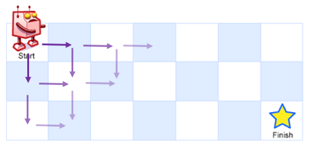
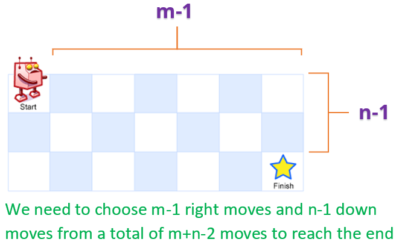

# 算法思想

简单介绍编程算法题背后涉及到的常见算法思想

​       

# 一 分治算法（Divide and Conquer）

分治算法，即分而治之，是指将一个规模为N的问题分解为K个规模较小的子问题，这些子问题互相独立且与原问题形式相同，递归地解这些子问题，然后将各子问题的解合并得到原问题的解，比较经典的应用就是 **归并排序（Merge Sort）** 以及 **快速排序（Quick Sort）** 等。

​     

## 1 算法思想

1）`分解 Divide`：将要求解的较大规模的问题分割成 `k` 个更小规模的子问题；

2）`求解 Conquer`：对这 `k` 个子问题分别求解，若如果子问题的规模仍然不够小，则再划分为 `k` 个子问题，如此递归的进行下去，直到问题规模足够小，很容易求出其解为止；

3）`合并 Merge`：将求出的小规模的问题的解合并为一个更大规模的问题的解，自底向上逐步求出原来问题的解；

​    

实际上就是类似于数学归纳法，找到解决本问题的求解方程公式，然后根据方程公式设计递归程序

> a）一定是先找到最小问题规模时的求解方法
>
> b）然后考虑随着问题规模增大时的求解方法
>
> c）找到求解的递归函数式后（各种规模或因子），设计递归程序即可

​     

## 2 算法特征

分治所能解决的问题一般具有以下几个特征：

1）该问题的规模缩小到一定的程度 **可以直接求解**，一般情况绝大多数问题都可以满足的，因为问题的计算复杂性一般是随着问题规模的增加而增加；

2）该问题可以分解为若干个规模较小的相同问题，即该问题具有 **最优子结构性质**，是应用分治算法的前提，也是大多数问题可以满足的，此特征反映了 **递归思想** 的引用；

3）利用该问题分解出的子问题的解 **可以合并** 为该问题的解，即算法关键，**能否利用分治法完全取决于问题是否具有第三条特征，如果满足特征1和2，但特征3不满足，则可以考虑用贪心算法或动态规划法**；

4）问题所分解出的各个子问题是相互独立的，即 **子问题之间不包含公共的子问题**，这涉及到 **分治的效率**，如果各子问题是不独立的，则分治要做许多不必要的工作，重复地解公共的子问题，此时虽然也可用分治，但 **一般用动态规划较好**；

​           

# 二 动态规划算法（Dynamic Programing）

**动态规划过程**：即每次决策依赖于当前状态，又随即引起状态的转移，且一个决策序列就是在变化的状态中产生出来的，所以这种 `多阶段最优化决策解决问题的过程` 就称为动态规划。

​         

## 1 基本思想

与分治法类似，也是将待求解的问题分解为若干个子问题（阶段），按顺序求解子阶段，前一子问题的解，为后一子问题的求解提供了有用的信息。在求解任一子问题时，列出各种可能的局部解，通过决策保留那些有可能达到最优的局部解，丢弃其他局部解，所以依次解决各子问题，最后一个子问题就是初始问题的解；

由于动态规划解决的问题多数有重叠子问题这个特点，为减少重复计算，对每一个子问题只解一次，将其不同阶段的不同状态保存在一个二维数组中；

与分治法最大的差别是：适合于用动态规划法求解的问题，经分解后得到的子问题往往不是互相独立的，即 ***下一个子阶段的求解是建立在上一个子阶段的解的基础上，进行进一步的求解***；

​        

## 2 算法特征

可用于判断动态规划方法是否适用于给定的问题：

1）**最优子结构**：在自下而上的递推过程中，所求得的每个子问题一定是全局最优解，既然它分解的子问题是全局最优解，那么依赖于它们解的原问题自然也是 `全局最优解`；

2）**无后效性**：是一个非常“宽松”的要求，只要满足前面提到的动态规划问题模型，其实基本上都会满足无后效性；

> 第一层含义：在推导后面阶段的状态的时候，只关心前面阶段的状态值，不关心这个状态是怎么一步一步推导出来的；
>
> 第二层含义：某阶段状态一旦确定，就不受之后阶段的决策影响；

3）**重叠子问题**：在求解原问题的时候，往往需要依赖其子问题，子问题依赖其子子问题，甚至可能同时依赖多个子问题，因此子问题之间是有重叠关系的；

<div align="center"></div>

​      

动态规划所处理的问题是一个多阶段决策问题，一般由初始状态开始，通过对中间阶段决策的选择，达到结束状态。这些决策形成了一个决策序列，同时确定了完成整个过程的一条活动路线（通常是求最优的活动路线），一般来说动态规划的设计都有着一定的模式，一般要经历以下几个步骤，如图所示：

> 初始状态 -> 决策 1 -> 决策 2 -> ... -> 决策 n -> 结束状态

实际应用中可以按以下几个简化的步骤进行设计题目：

> 1）分析最优解的性质，并刻画其结构特征
>
> 2）递归的定义最优解
>
> 3）以自底向上或自顶向下的记忆方式（备忘录法）计算出最优解
>
> 4）根据计算最优值时得到的消息，构造问题的最优解

​           

## 3 例题分析

DP问题解题套路：

> 明确状态 --> 明确选择 --> 明确 dp 函数/数组的定义 --> 明确 base case

​    

### 3.1 斐波那契数列

斐波那契数列（Fibonacci sequence），又称[黄金分割](https://links.jianshu.com/go?to=https%3A%2F%2Fbaike.baidu.com%2Fitem%2F%E9%BB%84%E9%87%91%E5%88%86%E5%89%B2%2F115896)数列，因数学家莱昂纳多·斐波那契（Leonardoda Fibonacci）以兔子繁殖为例子而引入，故又称为“[兔子数列](https://links.jianshu.com/go?to=https%3A%2F%2Fbaike.baidu.com%2Fitem%2F%E5%85%94%E5%AD%90%E6%95%B0%E5%88%97%2F6849441)”，指的是这样一个数列：0、1、1、2、3、5、8、13、21、34、……这个数列从第三项开始，每一项都等于前两项之和，其次裴波那契数列最具有和谐之美的地方是，越往后，相邻两项的比值会无限趋向于黄金比1:0.618。

<div align="center"></div>

在数学上，斐波那契数列以如下被以递推的方法定义：

> **f(1) = f(2) = 1**
>
> **f(n) = f(n - 1) + f(n - 2) （n>=3）**

​        

#### 3.1.1 [爬楼梯](https://leetcode.com/problems/climbing-stairs/description/)

**问题**：有 N 阶楼梯，每次可以上一阶或者两阶，求有多少种上楼梯的方法

**解题思路**

Step1：明确 dp 数组的定义，即 dp[i] 表示走到第 i 个楼梯的方法数目

Step2：根据 **选择** 写出状态转移逻辑

> 第 i 个楼梯可以从第 i-1 和 i-2 个楼梯再走一步到达，走到第 i 个楼梯的方法数为走到第 i-1 和第 i-2 个楼梯的方法数之和
>
> **dp[i] = dp[i-1] + dp[i-2]**
>
> 考虑到 dp[i] 只与 dp[i - 1] 和 dp[i - 2] 有关，因此可以只用两个变量来存储 dp[i - 1] 和 dp[i - 2]，使得原来的 O(N) 空间复杂度优化为 O(1) 复杂度

```go
func ClimbStairs(N int) int {
	if N <= 2 {
		return N
	}

	one, two := 1, 2
	for i := 2; i < N; i++ {
		cur := one + two

		one, two = two, cur
	}

	return two
}
```

​      

#### 3.1.2 街区抢劫（[链形](https://leetcode.com/problems/house-robber/description/) & [环形](https://leetcode.com/problems/house-robber-ii/description/)）

**问题**：抢劫一排住户，但是不能抢邻近的住户（若抢劫相邻住户，则会触发报警），求可抢劫最大价值量

**解题思路**

Step1：明确 dp 数组的定义，即 dp[i] 表示抢到第 i 个住户时的最大抢劫量

Step2：根据 **选择** 写出状态转移逻辑

> 由于不能抢劫邻近住户，如果抢劫了第 i -1 个住户，那么就不能再抢劫第 i 个住户，所以强盗抢劫的最大量为
>
> **dp[i] = max(dp[i-2] + vaules[i], dp[i-1])**

```go
func RobInline(nums []int) int {
	n := len(nums)
	if n == 0 {
		return 0
	} else if n == 1 {
		return nums[0]
	}

	dp := make([]int, 2)
	dp[0], dp[1] = nums[0], getMaxInt(nums[0], nums[1])
	for i := 2; i < n; i++ {
		ind := i & 1  // i&1 == i%2, ind^1: 0->1, 1->0
		dp[ind] = getMaxInt(dp[ind]+nums[i], dp[ind^1])
	}

	return getMaxInt(dp[0], dp[1])
}
```

​      

**进阶**：若住户房屋呈 **环形**，则强盗可抢到的最大抢劫量是多少？

> 由于住户房屋呈 **环形**（首尾相接），则存在以下2种情况：
>
> * a）若抢了第1个住户，则不能抢最后一个住户（范围：1 ～ n-1）；
> * b）若没有抢第1个住户，则可抢最后一个住户（范围：2 ～ n）；
>
> 因此，基于原始强盗抢劫问题，可将问题分解成2个子问题，后对2个子问题结果进行比较返回最大值
>
> <div align="center"></div>

```go
func RobInCircle(nums []int) int {
   n := len(nums)
   if n == 0 {
      return 0
   } else if n == 1 {
      return nums[0]
   }

   return getMaxInt(RobInline(nums[:n-1]), RobInline(nums[1:]))
}
```

​      

#### 3.1.3 [信件错排](https://leetcode.com/problems/find-the-derangement-of-an-array/)

**问题**：有 N 个 信 和 信封，顺序被打乱，求错误装信方式的数量

**解题思路**

Step1：明确 dp 数组存储错误方式的数量，即 dp[i] 表示前 i 个信和信封的错误方式数量

Step2：根据 **选择** 写出状态转移逻辑

>  对于第N封信而言，假设其装在了第 K 个信箱中，则对于第 K 封信，有两种情况：
>
> 1）**信件 K 装在信箱 N 中**：已经完成K和N两个信封，即若交换 K 和 N 的信后，它们的信和信封在正确的位置，其余 i-2 封信有 dp[i-2] 种错误装信的方式。由于 K 有 N-1 种取值，因此共有 **(N-1)*dp[N-2]** 种错误装信方式；
>
> <div align="center"></div>
>
> 2）**信件 K 未被装在信箱 N 中**：假设每个信封都有自己的专属信箱，N的专属信箱为K，那么可以认为K的专属信箱为N。但此场景下，信件 K 不能放入自己的专属信箱 N ，所以可以理解成求 N-1 封信件和 N-1 个信箱（除去信件 N）之间的错排数量问题，即求 dp[N-1]。由于 K 有 N-1 种取值，因此共有 (N-1)*dp[N-1] 种错误装信方式
>
> <div align="center"></div>

```go
func MailMissAlignment(n int) int {
	if n <= 1 {
		return 0
	}
	
	dp := make([]int, n)
	dp[0], dp[1] = 0, 1 // base case
	for i := 2; i < n; i++ {
		dp[i] = (i - 1) * (dp[i-2] + dp[i-1])
	}

	return dp[n-1]
}
```

​       

### 3.2 矩阵路径

#### 3.2.1 [矩阵最小路径和](https://leetcode.com/problems/minimum-path-sum/description/)

**问题**：求从矩阵的左上角到右下角的最小路径和，每次只能向右和向下移动

<div align="center"></div>

**解题思路**

定义dp二维数组记录累加值，状态转移方程为：

`dp[i][j] = Math.min(dp[i - 1][j], dp[i][j - 1]) + grid[i][j]`

```go
func MinPathSum(grid [][]int) int {
    row, col := len(grid), len(grid[0])
    if row == 0 || col == 0 {
        return 0
    }

    dp := make([][]int, row)
    for i:=0; i<row; i++ {
        dp[i] = make([]int, col)
    }

    dp[0][0] = grid[0][0]
    for i:=0; i<row; i++ {
        for j:=0; j<col; j++ {
            if i == 0 && j == 0 {
                continue
            }

            if i == 0 {
                dp[0][j] = dp[0][j-1] + grid[0][j]
            } else if j == 0 {
                dp[i][0] = dp[i-1][0] + grid[i][0]
            } else {
                dp[i][j] = getMinInt(dp[i][j-1], dp[i-1][j]) + grid[i][j]
            }
        }
    }

    return dp[row-1][col-1]
}
```

**进阶**：空间复杂度O(n)

**滚动数组**：因为i行依赖 i行和i - 1行，所以计算完i行覆盖i - 1行的值，不会影响最终结果

```go
func MinPathSum(grid [][]int) int {
    row, col := len(grid), len(grid[0])
    if row == 0 || col == 0 {
        return 0
    }

    dp := make([]int, col)

    dp[0] = grid[0][0]
    for i:=0; i<row; i++ {
        for j:=0; j<col; j++ {
            if i == 0 && j == 0 {
                continue
            }

            if i == 0 {          // 只能从上边界来
                dp[j] = dp[j-1] + grid[0][j]
            } else if j == 0 {   // 只能从左边界来
                dp[j] = dp[j] + grid[i][0]
            } else {
                dp[j] = getMinInt(dp[j-1], dp[j]) + grid[i][j]
            }
        }
    }

    return dp[col-1]
}
```

​          

#### 3.2.2 矩阵总路径数（[无障碍](https://leetcode.com/problems/unique-paths/) & [有障碍](https://leetcode.com/problems/unique-paths-ii/)）

**问题**：统计从矩阵左上角到右下角的路径总数，每次只能向右或者向下移动

<div align="center"></div>

**解题思路**

dp[i]\[j] 表示从左上角(0, 0)到坐标为(i, j)的点的路径数，则状态转移方程为：

`dp[i][j] = dp[i - 1][j], dp[i][j - 1]`

```go
// 空间复杂度O(m*n)
func UniquePaths(m int, n int) int {
    dp := make([][]int, m)
    for i:=0; i<m; i++ {
        dp[i] = make([]int, n)
        dp[i][0] = 1
    }

    for j:=0; j<n; j++ {
        dp[0][j] = 1
    }

    for i:=1; i<m; i++ {
        for j:=1; j<n; j++ {
            dp[i][j] = dp[i-1][j] + dp[i][j-1]
        }
    }

    return dp[m-1][n-1]
}

// 空间复杂度O(n)
func UniquePathsForOpt(m int, n int) int {
    dp := make([]int, n)
    for j:=0; j<n; j++ {
        dp[j] = 1
    }

    for i:=1; i<m; i++ {
        for j:=1; j<n; j++ {
            dp[j] += dp[j-1] 
        }
    }

    return dp[n-1]
}
```

**数学公式**：问题实际是一个组合问题，即从左上角(0, 0) 移动到右下角(m-1, n-1)，总共移动的次数 **S = m + n - 2**，向下移动的次数 **D = n - 1**

<div align="center"></div>

那么问题可以看成从 S 中取出 D 个位置的组合数量，这个问题的解为 C(S, D)

<div align="center"></div>

```go
func uniquePaths(m int, n int) int {
    s := m + n - 2  // 总共的移动次数
    d := n - 1      // 向下的移动次数
    res := 1
    for i:=1; i<=d; i++ {
        res = res * (s - d + i) / i
    }

    return res
}
```

​      

**进阶2**：矩阵中存在障碍物，若有障碍物，则无法通过，统计机器人从矩阵左上角到右下角的路径总数

<div align="center"></div>

```go
// 空间复杂度O(m*n)
func uniquePathsWithObstacles(obstacleGrid [][]int) int {
    m, n := len(obstacleGrid), len(obstacleGrid[0])
    if m < 1 || n < 1 || obstacleGrid[0][0] == 1 {
        return 0
    }

    dp := make([][]int, m)
    for i:=0; i<m; i++ {
        dp[i] = make([]int, n)
    }

    dp[0][0] = 1
    for i:=0; i<m; i++ {
        for j:=0; j<n; j++ {
            if (i == 0 && j == 0) || obstacleGrid[i][j] != 0 {
                continue
            }

            if i == 0 {         // first row
                dp[0][j] = dp[0][j-1]
            } else if j == 0 {  // first col
                dp[i][0] = dp[i-1][0]
            } else {
                dp[i][j] = dp[i-1][j] + dp[i][j-1]
            }
        }
    }

    return dp[m-1][n-1]
}

// 空间复杂度O(n)
func UniquePathsWithObstaclesForOpt(obstacleGrid [][]int) int {
    m, n := len(obstacleGrid), len(obstacleGrid[0])
    if m < 1 || n < 1 || obstacleGrid[0][0] == 1 {
        return 0
    }

    dp := make([]int, n)    
    for i:=0; i<m; i++ {
        for j:=0; j<n; j++ {
            if obstacleGrid[i][j] == 1 {
                // has obstacle, no way passthrough
                dp[j] = 0
            } else if j > 0 {
                // dp[j] = dp[j] + dp[j - 1] ==> current cell = top cell + left cell
                dp[j] += dp[j-1]
            }
        }
    }

    return dp[n-1]
}
```

​      

### 3.3 数组区间

#### 3.3.1 数组区间和

##### a. 数组Immutable（[一维](https://leetcode.com/problems/range-sum-query-immutable/description/) & [二维](https://leetcode.com/problems/range-sum-query-2d-immutable/)）

**问题**：已知一维数组nums，求区间 i ~ j 的和

**解题思路**

问题可以转换为 **sum[j] - sum[i-1]**，其中 sum[i] 为 0 ~ i 的和

```go
type NumArray struct {
    Sums []int
}

func Constructor(nums []int) NumArray {
    preSum := make([]int, len(nums)+1)

    preSum[0] = 0
    for i := 1; i< len(preSum) ; i++ {
        preSum[i] = preSum[i-1] + nums[i-1]
    }
    
    return NumArray{
        Sums : preSum,
    }
}


func (this *NumArray) SumRange(left int, right int) int {
    return this.Sums[right+1] - this.Sums[left]
}
```

​       

**问题**：已知二维数组nums，求从左上角 (row1, col1) 到右下角  (row2, col2) **区域内数值之和**？

<div align="center"></div>

**解题思路**：

> 1）思路1：基于一维数组的思路，以 "行" 为粒度计算每一行在列区间 i ~ j 的和，即 **sum[r]\[j] - sum[r]\[i-1]**，最后统计 row1 ~ row2 行之和；
>
> ```go
> func Constructor(matrix [][]int) NumMatrix {
> 	m, n := len(matrix), len(matrix[0])
> 	if m < 1 || n < 0 {
> 		return NumMatrix2DImmutable{}
> 	}
> 
> 	// init
> 	preSums := make([][]int, m)
> 	for i := 0; i < m; i++ {
> 		preSums[i] = make([]int, n+1)
> 	}
> 	
> 	// calculate
> 	for i := 0; i < m; i++ {
> 		for j := 1; j <= n; j++ {
> 			preSums[i][j] = preSums[i][j-1] + matrix[i][j-1]
> 		}
> 	}
> 
> 	return NumMatrix2DImmutable{
> 		Sums: preSums,
> 	}
> }
> 
> func (this *NumMatrix) SumRegion(row1 int, col1 int, row2 int, col2 int) int {
> 	sum := 0
> 	for i := row1; i <= row2; i++ {
> 		sum += this.Sums[i][col2+1] - this.Sums[i][col1]
> 	}
> 	
> 	return sum
> }
> ```
>
> 2）思路2：定义 sum[i]\[j]表示从(0, 0) 到 (i, j) 区域内所有元素和
>
> <div align="center"></div>
>
> ```go
> type NumMatrix struct {
>     Sums [][]int
> }
> 
> // Constructor dp[i][j] = dp[i][j-1] + dp[i-1][j] - dp[i-1][j-1] + matrix[i-1][j-1]
> func Constructor(matrix [][]int) NumMatrix {
>     m, n := len(matrix), len(matrix[0])
>     if m < 1 || n < 1 {
>         return NumMatrix{}
>     }
> 
>     // init
>     preSums := make([][]int, m + 1)
>     for i:=0; i<=m; i++ {
>         preSums[i] = make([]int, n + 1)
>     }
> 
>     // calculate 
>     for i:=1; i<=m; i++ {
>         for j:=1; j<=n; j++ {
>             preSums[i][j] = preSums[i][j-1] + preSums[i-1][j] - preSums[i-1][j-1] + matrix[i-1][j-1]
>         }
>     }
> 
>     return NumMatrix {
>         Sums: preSums,s
>     }
> }  
> 
> // SumRegion 区域和: sum[r2+1][c2+1] - sum[r2+1][c1] - sum[r1][c2+1] + sum[r1][c1]
> func (this *NumMatrix) SumRegion(row1 int, col1 int, row2 int, col2 int) int {
>     sum := this.Sums[row2+1][col2+1] - this.Sums[row2+1][col1] - this.Sums[row1][col2+1] + this.Sums[row1][col1]
> 
>     return sum
> }
> ```

​       

##### b. 数组Mutable（[一维](https://leetcode.com/problems/range-sum-query-mutable/) & [二维](https://leetcode.com/problems/range-sum-query-2d-mutable/)）

**问题**：给定一维数组nums，求区间 i ~ j 内元素的和，同时数组内元素可以被改变


**进阶**：给定一个二维数组(矩阵)，需要查询它的某个子矩阵的元素的和，同时矩阵内的元素可以被改变

> `NumMatrix2DMutable(matrix)` ：类的构造方法
>
> `sumRegion2DMutable(row1, col1, row2, col2)` ：返回处于 (row1, col1) 为左上角, (row2, col2) 为右下角的子矩阵内的元素的和
>
> `update2DMutable(row, col, val)` ：把 (row, col) 位置的元素更新为 `val`


### 3.4 0-1背包问题

**问题**：对于一组不同重量、不可分割的物品，需要选择一些装入背包，在满足背包 ***最大重量限制***  的前提下，背包中 ***物品总重量的最大价值*** 是多少呢？

**解题思路**

Step1：明确 **状态** 和 **选择**

> `状态`：背包的空余容量剩多少 / 可选择的物品还有哪些
>
> `选择`：把这个物品装进背包 / 不把这个物品装进背包

Step2：明确 dp 数组的定义

> `dp[i][j]` 含义：表示前 i 件物品容量不超过 j 的情况下能达到的最大价值，比如`dp[3][5] = 6` ，表示对于给定的一系列物品中，若只对前 3 个物品进行选择，当背包容量为 5 时，最多可以装下的价值为 6；
>
> 根据此定义，还可得出 base case 为 **dp[0]\[..] = dp[..]\[0] = 0**，而最终计算得到结果为 **dp[N]\[w]**

Step3：根据 **选择** 写出状态转移逻辑

> 设第 i 件物品体积为 w，价值为 v，根据第 i 件物品是否添加到背包中，可以分两种情况讨论
>
> * a）第 i 件物品没添加到背包，总体积不超过 j 的前 i 件物品的最大价值，就是总体积不超过 j 的前 i-1 件物品的最大价值，dp[i]\[j] = dp[i-1]\[j]；
> * b）第 i 件物品添加到背包中，dp[i]\[j] = dp[i-1]\[j-w] + v
>
> 第 i 件物品可添加也可以不添加，取决于哪种情况下最大价值更大，因此0-1 背包的状态转移方程为：
>
> **dp[i]\[j] = max(dp[i-1]\[j], dp[i-1]\[j-w] + v)**

```go
func Knapsack(weights []int, values []int, W int) int {
	N := len(weights)

	// init: dp[N + 1][W + 1]
	dp := make([][]int, N+1)
	for k := 0; k < N; k++ {
		dp[k] = make([]int, W+1)
	}

	for i := 1; i <= N; i++ {
		w, v := weights[i-1], values[i-1]
		for j := 1; j <= W; j++ {
			// dp[i][j] = max(把物品 i 装进背包, 不把物品 i 装进背包)
			if j >= w {
				dp[i][j] = getMaxInt(dp[i-1][j], dp[i-1][j-w]+v)
			} else {
				dp[i][j] = dp[i-1][j]
			}
		}
	}

	return dp[N][W]
}
```

​              

# 三 贪心算法

贪心算法：又称贪婪算法，在对问题求解时，总是做出在当前看来时最好的选择，**本质是选择每一阶段的局部最优，从而达到全局最优**。

​     

## 1 算法思想

贪心算法没有固定的算法框架，算法设计的关键是贪心策略的选择。必须注意的是，贪心算法不是对所有问题都能得到整体最优解，选择的贪心策略必须具备无后效性，即某个状态以后的过程不会影响以前的状态，只与当前状态有关，**所以对所采用的贪心策略一定要仔细分析其是否满足无后效性。**

贪心算法和动态规划的对比：

> a. 贪心算法与动态规划的不同在于贪心算法对每个子问题的解决方案都做出选择，不能回退；
>
> b. 动态规划则会保存以前的运算结果，并根据以前的结果对当前进行选择，有回退功能。

​        

## 2 算法特征

**贪心属性**：即每次迭代时都采用局部最优解，而无需考虑对全局的影响。相信通过不断求解局部最优解终会得到全局最优解，但是正如之前所说，这个结论不一定成立。为了证明在每次迭代终都求得了最优解，需要使用归纳法（显然不是简单的证明）；

**最优子结构**：求解的问题必须能划分为子问题，每个子问题都有最优解；


# 四 回溯算法（Backtracking）

回溯法是一种选优搜索法，按选优条件向前搜索，以达到目标，但当探索到某一步时，发现原先选择并不优或达不到目标，就退回一步重新选择，这种走不通就退回再走的技术为回溯法。

回溯算法特征总结：

> 回溯算法就是一种暴力穷举算法
>
> 穷举的过程就是遍历一棵多叉树的过程
>
> 回溯算法的代码框架和多叉树遍历的代码框架类似

​          

回溯法解决的问题都可以抽象为树形结构，即所有回溯法的问题都可以抽象为树形结构，因为回溯法解决的都是**在集合中递归查找子集**，集合的大小就构成了树的宽度，递归的深度，都构成的树的深度。递归就要有终止条件，所以必然是一颗高度有限的树（**N 叉树**）：

> **组合问题**：N 个数里面按一定规则找出 k 个数的集合；
>
> **切割问题**：一个字符串按一定规则有几种切割方式；
>
> **子集问题**：一个 N 个数的集合里有多少符合条件的子集；
>
> **排列问题（强调顺序）**：N 个数按一定规则全排列，有几种排列方式；
>
> **棋盘问题**：N 皇后、解数独等等；

​        

## 1 算法思想

在包含问题的所有解的解空间树中，按照**深度优先搜索DFS**的策略，从根结点出发深度探索解空间树。当探索到某一结点时，要先判断该结点是否包含问题的解，如果包含，就从该结点出发继续探索下去，如果该结点不包含问题的解，则逐层向其祖先结点回溯（其实回溯法就是对隐式图的深度优先搜索算法）。

若用回溯法求问题的所有解时，要回溯到根，且根结点的所有可行的子树都要已被搜索遍才结束，而若使用回溯法求任一个解时，只要搜索到问题的一个解就可以结束。

回溯的处理思想，实际上一个类似 **枚举搜索**尝试过程，即枚举所有的解，找到满足期望的解。为了有规律地枚举所有可能的解，避免遗漏和重复，可以把问题求解的过程分为 **多个阶段**。每个阶段都会面对一个岔路口，因此可以先随意选一条路走，当发现这条路走不通的时候（不符合期望的解），就回退到上一个岔路口，另选一种走法继续走。

​     

## 2 算法特征

1）**深度优先遍历（DFS）**：回溯算法一般采用 DFS 求解，因此满足递归的一般特征；

2）**子集**：回溯题目一般都要求求解所有的最优解，因此DFS 的终止条件就是判断是否得到了一个最优解，然后直接返回；

3）**遍历空间集**：在每一轮 DFS 中都需要遍历空间集，根据题目性质，有的需要从 0 开始，有的需要从当前位置开始；

4）**剪枝**：在遍历空间集的时候，需要优先将不符合条件的去除掉，不然会做很多无用的递归调用，导致超时；

5）**加入元素**：遍历空间集的时候，加入每一个元素，然后再 DFS；

6）**移除元素**：当一轮 DFS 达到终止条件结束的时候，说明当前选择已经完成，需要返回到上一轮做其他选择，因此需要将上一轮选择时加入的元素删除掉；

​      

**剪枝策略**：

> 就是在搜索过程中利用 **过滤条件** 来剪去完全不用考虑（已经判断这条路走下去得不到最优解）的搜索路径，从而 **避免了一些不必要的搜索**，大大优化了算法求解速度，还保证了结果的正确性。
>
> 应用到回溯算法中，就可以 **提前判断当前路径是否能产生结果集**，如果否，就可以提前回溯，而这也叫做 **可行性剪枝**。
>
> 另外还有一种叫做 **最优性剪枝**，每次记录当前得到的 **最优值**，如果当前结点已经无法产生比当前最优解更优的解时，可以提前回溯，eg：分支限界算法。

​       

## 3 例题分析

因为 Backtracking 不是立即就返回，而要继续求解，因此在程序实现时，需要注意 **元素标记问题**

> 1）在访问一个新元素进入新的递归调用时，需要将新元素标记为已经访问，这样才能在继续递归调用时不用重复访问该元素；
>
> 2）但是在递归返回时，需要将元素标记为未访问，因为只需要保证在一个递归链中不同时访问一个元素，可以访问已经访问过但是不在当前递归链中的元素。

​      

### 3.1 N- Queens


