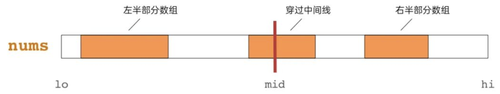
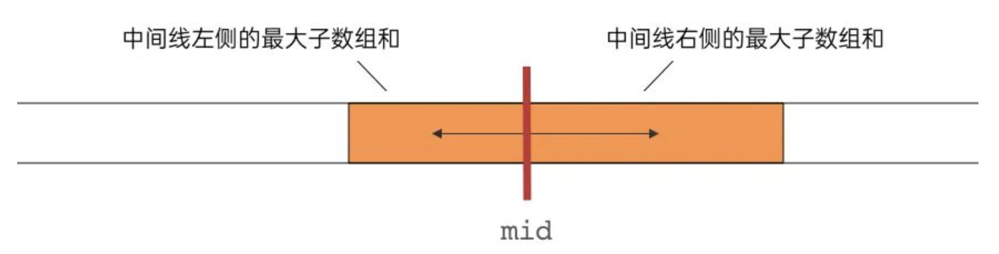

# 分治算法（Divide and Conquer）

分治算法，即分而治之，是指将一个规模为N的问题分解为K个规模较小的子问题，这些子问题互相独立且与原问题形式相同，递归地解这些子问题，然后将各子问题的解合并得到原问题的解，比较经典的应用就是 **归并排序（Merge Sort）** 以及 **快速排序（Quick Sort）** 等。

​      

# 一 算法思想

1）`分解 Divide`：将要求解的较大规模的问题分割成 `k` 个更小规模的子问题；

2）`求解 Conquer`：对这 `k` 个子问题分别求解，若如果子问题的规模仍然不够小，则再划分为 `k` 个子问题，如此递归的进行下去，直到问题规模足够小，很容易求出其解为止；

3）`合并 Merge`：将求出的小规模的问题的解合并为一个更大规模的问题的解，自底向上逐步求出原来问题的解；

​    

实际上就是类似于数学归纳法，找到解决本问题的求解方程公式，然后根据方程公式设计递归程序

> a）一定是先找到最小问题规模时的求解方法
>
> b）然后考虑随着问题规模增大时的求解方法
>
> c）找到求解的递归函数式后（各种规模或因子），设计递归程序即可

​     

# 二 算法特征

分治所能解决的问题一般具有以下几个特征：

1）该问题的规模缩小到一定的程度 **可以直接求解**，一般情况绝大多数问题都可以满足的，因为问题的计算复杂性一般是随着问题规模的增加而增加；

2）该问题可以分解为若干个规模较小的相同问题，即该问题具有 **最优子结构性质**，是应用分治算法的前提，也是大多数问题可以满足的，此特征反映了 **递归思想** 的引用；

3）利用该问题分解出的子问题的解 **可以合并** 为该问题的解，即算法关键，**能否利用分治法完全取决于问题是否具有第三条特征，如果满足特征1和2，但特征3不满足，则可以考虑用贪心算法或动态规划法**；

4）问题所分解出的各个子问题是相互独立的，即 **子问题之间不包含公共的子问题**，这涉及到 **分治的效率**，如果各子问题是不独立的，则分治要做许多不必要的工作，重复地解公共的子问题，此时虽然也可用分治，但 **一般用动态规划较好**；

​      

# 三 实例


## 1 [子数组最大和](https://leetcode.com/problems/maximum-subarray/description/)

**题目**：输入一个整形数组，数组里有正数也有负数。数组中连续的一个或多个整数组成一个子数组，每个子数组都有一个和。 求所有子数组的和的最大值，要求时间复杂度为O(n)。

> 例如输入的数组为`1, -2, 3, 10, -4, 7, 2, -5`，和最大的子数组为`3, 10, -4, 7, 2`， 因此输出为该子数组的和18。

**解析**：分治法，即首先要考虑的就是如何「分」，原题是要计算数组 `nums` 的最大子数组和，那可从数组中间将数组一分为二，则子数组可能位于：

> 左半部分数组 / 中间（穿过中间线） / 右半部分数组

<div align="center"></div>

其中，位于左半部分数组和位于右半部分数组的子数组，可以通过递归调用继续求解，而对于穿过中间线的子数组，可以分别计算「中间线左侧的最大子数组和」以及「中间线右侧的最大子数组和」，相加即可得到「穿过中间线的最大子数组和」

<div align="center"></div>

```go
import "math"

func maxSubArray(nums []int) int {
    return subArray(nums, 0, len(nums) - 1)
}

// Time Complexity : O(NlogN), Space Complexity : O(logN)
func subArray(nums []int, left, right int) int {
    if left > right {
        return math.MinInt
    }

    mid, leftSum, rightSum, curSum := (left + right)/2, 0, 0, 0
    // leftSum = max subarray sum in [L, mid-1] and starting from mid-1
    for i:=mid-1; i>=left; i-- {
        curSum += nums[i]
        leftSum = getMax(leftSum, curSum)
    }

    curSum = 0
    // rightSum = max subarray sum in [mid+1, R] and starting from mid+1
    for i:=mid+1; i<=right; i++ {
        curSum += nums[i]
        rightSum = getMax(rightSum, curSum)
    }

    return getMax(getMax(subArray(nums, left, mid-1), subArray(nums, mid+1, right)), leftSum + nums[mid] + rightSum)
}

func getMax(a, b int) int {
    if a < b {
        return b
    }
    return a
}
```

**优化**：以空间换时间，使用辅助数组 pre 和 suf 分别存储 [..., i] 和 [i, ...] 区间内最大的子数组和

```python
# Time Complexity : O(N), Space Complexity : O(N)
class Solution:
    def maxSubArray(self, nums: List[int]) -> int:
        pre, suf = [*nums], [*nums]
        # pre[i]: 表示[..., i]区间内最大的子数组和
        for i in range(1, len(nums)):
            pre[i] += max(0, pre[i-1])
        
        # suf[i]: 表示[i, ...]区间内最大的子数组和
        for i in range(len(nums)-2,-1,-1):
            suf[i] += max(0, suf[i+1])
        
        def maxSubArray(A, L, R):
            if L == R:
                return A[L]
            
            mid = (L + R) // 2
            
            return max(maxSubArray(A, L, mid), maxSubArray(A, mid+1, R), pre[mid] + suf[mid+1])
        
        return maxSubArray(nums, 0, len(nums)-1)
```


