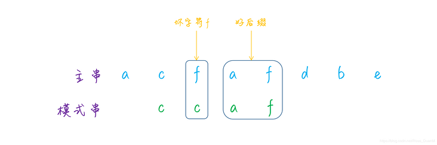

# 字符串匹配（String Matchiing）

字符串匹配（String Matchiing），也称字符串搜索（String Searching）是字符串算法中重要的一种，是指从一个大字符串或文本中找到模式串出现的位置。

例如：从字符串 T="bacbababaabcbab" 中查找字符串 P= “ababaca” 的位置，其中T称为 “主串”，P称为 “模式串”。

如果 0≤s≤n-m，并且 T[s+1..s+m] = P[1..m]，即对 1≤j≤m，有 T[s+j] = P[j]，则说模式 P 在文本 T 中出现且位移为 s，且称 s 是一个**有效位移**（Valid Shift）。

<div align="center"></div>

比如上图中，目标是找出所有在文本 T = abcabaabcabac 中模式 P = abaa 的位置，可见P在此文本T中仅出现一次，即在位移 s = 3 处，位移 s = 3 是有效位移。

通常，字符串匹配算法通常分为两个步骤：**预处理**（Preprocessing）和**匹配**（Matching），所以算法的总运行时间为预处理和匹配的时间的总和。

<div align="center"></div>

常用算法包括：

* BF算法（Brute Force）
* KMP算法（Knuth-Morris-Pratt）
* BM算法（Boyer-Moore）
* Trie 树（字典树）算法
* ... ...

​        

# 一 BF算法（Naive, 朴素算法）

**BF（Brute Force）算法**是模式匹配中最简单、最直观的算法，算法思想是从主串的第 start 个字符起和模式P（要检索的子串）的第1个字符比较

* 相等，则逐个比较后续字符；
* 不相等，则**回溯**到主串的第 start+1 个字符位置，重新和模式P的字符进行比较；

直到子串所有的字符都匹配，返回所在主串中的下标，若不匹配，则返回-1。

<div align="center"></div>

```go
// 算法平均时间复杂度: O((n-m)m)，n为主串长度，m为目标串长度
func StringMatchBF(text, pattern string) int {
	n1, n2 := len(text), len(pattern)
	// 模式串为空，匹配任意字符串
	if n2 == 0 {
		return 0
	}

	// 暴力求解: 对T中所有可能位置逐一与P匹配
	for i := 0; i <= n1-n2; i++ {
		for j := 0; j < n2; j++ {
			if text[i+j] != pattern[j] {
				break
			}

			if j == n2-1 {  // 匹配后退出
				return i
			}
		}
	}

	return -1
}
```

​       

# 二 KMP算法（Knuth-Morris-Pratt）

**KMP 算法的主要特点**：

- 需要对模式字符串做预处理；
- 预处理阶段需要额外的 O(m) 空间和复杂度；
- 匹配阶段与字符集的大小无关；
- 匹配阶段至多执行 2n - 1 次字符比较；
- 对模式中字符的比较顺序时从左到右；

​     

## 1 简介

如下图(a)朴素的字符串匹配算法的操作过程，在模式 P = ababaca 和文本 T =bacbababaabcbab 的匹配过程中，模板的一个特定位移 s，q = 5 个字符已经匹配成功，但模式 P 的第 6 个字符不能与相应的文本字符匹配。

<div align="center"></div>

此时，q 个字符已经匹配成功的信息确定了相应的文本字符，而知道这 q 个文本字符，就能够立即确定某些位移是非法的。例如上图(a)中，可以判断位移 s+1 是非法的，因为模式 P 的第一个字符 a 将与模式的第二个字符 b 匹配的文本字符进行匹配，显然是不匹配的。而图(b)中则显示了位移 s’ = s+2 处，使模式 P 的前三个字符和相应的三个文本字符对齐后必定会匹配。

KMP 算法的基本思路就是设法**利用这些已知信息，不要把 "搜索位置" 移回已经比较过的位置，而是继续把它向后面移，这样就提高了匹配效率**。

已知模式 **P[1..q]** 与文本 **T[s+1..s+q]** 匹配，那么满足 **P[1..k] = T[s’+1..s’+k]** 其中 s’+k = s+q 的最小位移 s’ > s 是多少？这样的位移 s’ 是大于 s 的，但未必非法的第一个位移，因为已知 T[s+1..s+q] 。在最好的情况下有 s’ = s+q，因此立刻能排除掉位移 s+1, s+2 .. s+q-1。在任何情况下，对于新的位移 s’，无需把 P 的前 k 个字符与 T 中相应的字符进行比较，因为它们肯定匹配。

可以用模式 P 与其自身进行比较，以预先计算出这些必要的信息。例如上图（c）中所示，由于 T[s’+1..s’+k] 是文本中已经知道的部分，所以它是字符串 Pq 的一个后缀。

此处引入**模式的前缀函数 π**（Pai），π 包含有模式与其自身的位移进行匹配的信息，而这些信息可用于避免在朴素的字符串匹配算法中，对无用位移进行测试。

```java
π[q] = max {k : k < q and Pk ⊐ Pq}
```

其中，π[q] 代表当前字符之前的字符串中，**最长的共同前缀后缀的长度**。下图给出了关于模式 P = ababababca 的完整前缀函数 π，可称为**部分匹配表**（Partial Match Table）。

<div align="center"></div>

计算过程：

> π[1] = 0：a 仅一个字符，前缀和后缀为空集，共有元素最大长度为 0；
>
> π[2] = 0：ab 的前缀 {a}，后缀 {b}，不匹配，共有元素最大长度为 0；
>
> π[3] = 1：aba，前缀 {**a**, ab}，后缀{ba, **a**} ，共有元素最大长度为 1；
>
> π[4] = 2：abab，前缀 {a, **ab**, aba}，后缀 {bab, **ab**, b}，共有元素最大长度为 2；
>
> π[5] = 3：ababa，前缀 {a, ab, **aba**, abab}，后缀 {baba, **aba**, ba, a}，共有元素最大长度为 3；
>
> π[6] = 4：ababab，前缀 {a, ab, aba, **abab**, ababa}，后缀 {babab, **abab**, bab, ab, b}，共有元素最大长度为 4；
>
> π[7] = 5：abababa，前缀 {a, ab, aba, abab, **ababa**, ababab}，后缀 {bababa, **ababa**, baba, aba, ba, a}，共有元素最大长度为 5；
>
> π[8] = 6：abababab，前缀 {.., **ababab**, ..}，后缀 {.., **ababab**, ..}，共有元素最大长度为 6；
>
> π[9] = 0：ababababc，前缀和后缀不匹配，共有元素最大长度为 0；
>
> π[10] = 1：ababababca，前缀 {.., **a**, ..}，后缀 {.., **a**, ..}，共有元素最大长度为 1；

KMP 算法 KMP-MATCHER 中通过调用 COMPUTE-PREFIX-FUNCTION 函数来计算部分匹配表

```python
# KMP匹配算法
KMP-MATCHER(T, P)
n ← length[T]
m ← length[P]
π ← COMPUTE-PREFIX-FUNCTION(P)
q ← 0                          //Number of characters matched.
for i ← 1 to n                 //Scan the text from left to right.
    do while q > 0 and P[q + 1] ≠ T[i]
            do q ← π[q]        //Next character does not match.
        if P[q + 1] = T[i]
            then q ← q + 1     //Next character matches.
        if q = m               //Is all of P matched?
            then print "Pattern occurs with shift" i - m
            q ← π[q]           //Look for the next match.

# 模式串部分匹配表 (DP思想)
COMPUTE-PREFIX-FUNCTION(P)
m ← length[P]
π[1] ← 0
k ← 0
for q ← 2 to m
     do while k > 0 and P[k + 1] ≠ P[q]
            do k ← π[k]
        if P[k + 1] = P[q]
           then k ← k + 1
        π[q] ← k
return π
```

预处理过程 COMPUTE-PREFIX-FUNCTION 的运行时间为 Θ(m)，KMP-MATCHER 的匹配时间为 Θ(n)。且相比较于 NAIVE-STRING-MATCHER，KMP-MATCHER 的主要优化点就是**在当确定字符不匹配时对于 pattern 的位移**。

> NAIVE-STRING-MATCHER 的位移效果是：文本向后移一位，模式从头开始
>
> ```java
> s = s - j + 1;
> j = 0;
> ```
>
> KMP-MATCHER 首先对模式做了获取共同前缀后缀最大长度的预处理操作，位移过程是先将模式向后移 **partial_match_length - table[partial_match_length - 1]**，然后再判断是否匹配。这样通过对已匹配字符串的已知信息的利用，可以有效节省比较数量。
>
> ```java
> if (j != 0)
>    j = lps[j - 1];
> else
>    s++;
> ```

下面描述了当发现字符 j 与 c 不匹配时的位移效果：

```java
// partial_match_length - table[partial_match_length - 1]
rrababababjjjjjiiooorababababcauuu
  ||||||||-
  ababababca

// 8-6=2
rrababababjjjjjiiooorababababcauuu
  xx||||||-
    ababababca

// 6-4=2
rrababababjjjjjiiooorababababcauuu
    xx||||-
      ababababca

// 4-2=2
rrababababjjjjjiiooorababababcauuu
      xx||-
        ababababca

// 2-0=2
rrababababjjjjjiiooorababababcauuu
        xx-
          ababababca
```

​              

## 2 图解

假设 P="ABCDABD"，T="BBC ABCDAB ABCDABCDABDE"，则KMP算法过程

1）首先，字符串"BBC ABCDAB ABCDABCDABDE"的第一个字符与搜索词"ABCDABD"的第一个字符，进行比较。因为B与A不匹配，所以搜索词后移一位。

<div align="center"></div>

2）因为B与A不匹配，搜索词再往后移

<div align="center"></div>

3）就这样，直到字符串有一个字符，与搜索词的第一个字符相同为止

<div align="center"></div>

4）接着比较字符串和搜索词的下一个字符，还是相同

<div align="center"></div>

5）直到字符串有一个字符，与搜索词对应的字符不相同为止

<div align="center"></div>

6）这时，最自然的反应是，将搜索词整个后移一位，再从头逐个比较。这样做虽然可行，但是效率很差，因为要把"搜索位置"移到已经比较过的位置，重比一遍。

<div align="center"></div>

7）一个基本事实是，当空格与D不匹配时，其实知道前面六个字符是"ABCDAB"。KMP算法的想法是，设法利用这个已知信息，不要把"搜索位置"移回已经比较过的位置，继续把它向后移，这样就提高了效率。

<div align="center"></div>

8）怎么做到这一点呢？可以针对搜索词，算出一张《部分匹配表》（Partial Match Table），这张表是如何产生的，后面再介绍，这里只要会用就可以了。

<div align="center"></div>

9）已知空格与D不匹配时，前面六个字符"ABCDAB"是匹配的，且查表可知，最后一个匹配字符B对应的"部分匹配值"为2，因此按照下面的公式算出向后移动的位数：

> **移动位数 = 已匹配的字符数 - 对应的部分匹配值**

因为 6 - 2 等于4，所以将搜索词向后移动4位。

<div align="center"></div>

10）因为空格与Ｃ不匹配，搜索词还要继续往后移。这时，已匹配的字符数为2（"AB"），对应的"部分匹配值"为0。所以，移动位数 = 2 - 0，结果为 2，于是将搜索词向后移2位。

<div align="center"></div>

11）因为空格与A不匹配，继续后移一位

<div align="center"></div>

12）逐位比较，直到发现C与D不匹配。于是，移动位数 = 6 - 2，继续将搜索词向后移动4位。

<div align="center"></div>

13）逐位比较，直到搜索词的最后一位，发现完全匹配，于是搜索完成。如果还要继续搜索（即找出全部匹配），移动位数 = 7 - 0，再将搜索词向后移动7位，这里就不再重复了。

<div align="center"></div>

14）下面介绍《部分匹配表》是如何产生的，要要了解两个概念："前缀"和"后缀"

* "前缀"：指除了最后一个字符以外，一个字符串的全部头部组合；
* "后缀"：指除了第一个字符以外，一个字符串的全部尾部组合。

<div align="center"></div>

15）"**部分匹配值**" 就是"前缀"和"后缀"的最长的共有元素的长度，以"ABCDABD"为例

<div align="center"></div>

```python
－　"A"的前缀和后缀都为空集，共有元素的长度为0；
－　"AB"的前缀为[A]，后缀为[B]，共有元素的长度为0；
－　"ABC"的前缀为[A, AB]，后缀为[BC, C]，共有元素的长度0；
－　"ABCD"的前缀为[A, AB, ABC]，后缀为[BCD, CD, D]，共有元素的长度为0；
－　"ABCDA"的前缀为[A, AB, ABC, ABCD]，后缀为[BCDA, CDA, DA, A]，共有元素为"A"，长度为1；
－　"ABCDAB"的前缀为[A, AB, ABC, ABCD, ABCDA]，后缀为[BCDAB, CDAB, DAB, AB, B]，共有元素为"AB"，长度为2；
－　"ABCDABD"的前缀为[A, AB, ABC, ABCD, ABCDA, ABCDAB]，后缀为[BCDABD, CDABD, DABD, ABD, BD, D]，共有元素的长度为0。
```

16）"部分匹配"的实质是，有时候字符串头部和尾部会有重复，比如 "ABCDAB"之中有两个"AB"，那么它的"部分匹配值"就是2（"AB"的长度）。搜索词移动的时候，第一个"AB"向后移动4位（字符串长度-部分匹配值），就可以来到第二个"AB"的位置。

<div align="center"></div>

```go
// preKMPForLen 前缀后缀最大匹配长度
func preKMPForLen(pattern string) []int {
	n := len(pattern)
	if n < 1 {
		return nil
	}
	// P[0..i] 前缀后缀最大匹配长度
	overload := make([]int, n)

	overload[0] = 0
	k := 0
	for i := 1; i < n; i++ {
    // 回溯确定更短的前后缀匹配长度
		for k > 0 && pattern[k] != pattern[i] {
			k = overload[k-1]
		}
		// P[0..k] = P[i−k..i]
		if pattern[k] == pattern[i] {
			k++
		}

		overload[i] = k
	}

	return overload
}

// StringMatchKMPForLen KMP算法
func StringMatchKMPForLen(text, pattern string) int {
	nt, np := len(text), len(pattern)
	if np == 0 { // 模式串为空，匹配任意字符串
		return 0
	}

	if np > nt { // 模式串比主串还大，肯定不匹配
		return -1
	}

	mpNext := preKMPForLen(pattern)
	fmt.Println(mpNext)

	j := 0
	for i := 0; i < nt; i++ {
		for j > 0 && text[i] != pattern[j] {
			j = mpNext[j-1]
		}

		if text[i] == pattern[j] {
			j++
		}

		if j == np {
			return i - np + 1
		}
	}

	return -1
}
```

​      

下面定义 overload[i] 表示P[0..i] 的后缀中最长可匹配前缀子串的下标

```go
func preKMP(pattern string) []int {
	n := len(pattern)
	if n < 1 {
		return nil
	}
	// P[0..i] 的后缀中最长可匹配前缀子串的下标
	overload := make([]int, n)

	overload[0] = -1
  // k 后缀中最长可匹配前缀子串的下标
	k := -1
  // i 表示后缀子串最后一个元素下标
	for i := 1; i < n; i++ {
		for k != -1 && pattern[k+1] != pattern[i] {
			k = overload[k]	
		}
    // P[0..k+1] = P[i−k..i+1]
		if pattern[k+1] == pattern[i] {
			k++
		}

		overload[i] = k
	}

	return overload
}

// StringMatchKMP KMP算法
func StringMatchKMP(text, pattern string) int {
	nt, np := len(text), len(pattern)
	if np == 0 { // 模式串为空，匹配任意字符串
		return 0
	}

	if np > nt { // 模式串比主串还大，肯定不匹配
		return -1
	}

	mpNext := preKMP(pattern)
	j := 0
	for i := 0; i < nt; i++ {
		for j > 0 && text[i] != pattern[j] {
			j = mpNext[j-1] + 1
		}

		if text[i] == pattern[j] {
			j++
		}

		if j == np {
			return i - np + 1
		}
	}

	return -1
}
```

​       

# 三 BM算法（Boyer-Moore）

Boyer-Moore 算法的主要特点有：

- 对模式字符的比较顺序时从右向左；
- 预处理需要 O(m + σ) 的时间和空间复杂度；
- 匹配阶段需要 O(m × n) 的时间复杂度；
- 匹配阶段在最坏情况下需要 3n 次字符比较；
- 最优复杂度 O(n/m)；

​     

## 1 简介

在 Naive 算法中，对文本 T 和模式 P 字符串均未做预处理，而在 KMP 算法中则对模式 P 字符串进行了预处理操作，以预先计算模式串中各位置的最长相同前后缀长度的数组，同样Boyer–Moore 算法也是对模式 P 字符串进行预处理。

> Naive 算法，如果发现模式 P 中的字符与文本 T 中的字符不匹配时，需要将文本 T 的比较位置向后滑动一位，模式 P 的比较位置归 0 并从头开始比较
>
> KMP 算法，则是根据预处理的结果进行判断以使模式 P 的比较位置可以向后滑动多个位置

Boyer–Moore 算法的预处理过程也是为了达到相同效果，即在对模式 P 字符串进行预处理时，将采用两种不同的启发式方法进行预处理：

> **坏字符（Bad Character Heuristic）**：
>
> 暴力求解中，模式串与主串按照下标顺序从小到大匹配，BM 算法反而从大到小匹配。从模式串末尾向前倒着匹配，当发现某个字符无法匹配的时候，主串的这个字符就称为 "坏字符"
>
> **好后缀（Good Suffix Heuristic）**：当文本 T 中的某个字符跟模式 P 的某个字符不匹配时，称文本 T 中的已经匹配的字符串为好后缀；

Boyer–Moore 算法在预处理时，将为两种不同的启发法结果创建不同的数组，分别称为 **Bad-Character-Shift（or The Occurrence Shift）** 和 **Good-Suffix-Shift（or Matching Shift）**。当进行字符匹配时，如果发现模式 P 中的字符与文本 T 中的字符不匹配时，将比较两种不同启发法所建议的移动位移长度，选择最大的一个值来对模式 P 的比较位置进行滑动。

此外，Naive 算法和 KMP 算法对模式 P 的比较方向是从前向后比较，而 Boyer–Moore 算法的设计则是从后向前比较，即从尾部向头部方向进行比较。

​        

## 2 规则讲解

### 2.1 坏字符规则

前面说到的字符串匹配，匹配的顺序都是从前到后，按位依次匹配的，而利用坏字符规则的时候，主串和模式串的匹配顺序是从后往前，倒着匹配的，像下图这样：

<div align="center"></div>

匹配的时候，如果主串中的字符和模式串的字符不匹配，那么就将主串中这个字符叫做**坏字符**，例如上图中的字符 `e` ，因为它和模式串中的 `d` 不匹配：

<div align="center"></div>

如果遇到了坏字符，可以看到坏字符 `e` 在模式串中是不存在的，那么可以判定，主串中字符 `e` 之前的部分肯定不会匹配，因此可以直接将模式串移动至坏字符 `e`后面继续匹配，相较于暴力匹配每次移动一位，这样显然更加高效：

<div align="center"></div>

但需要注意的是，如果坏字符在模式串中是存在的，那么就不能直接移动模式串至坏字符的后面了，而是将模式串移动至和坏字符相同的字符处，然后继续比较，参考下图：

<div align="center"></div>

可以看到，**坏字符可能在模式串中存在多个，那么移动模式串的时候，应该移动至更靠前的那个，还是更靠后的那个呢** ？为了避免错过正确匹配的情况，应该移动更少的位数，因此必须移动至更靠后的那个坏字符处。就像上图中的那样，坏字符 `f`在模式串中存在两个，移动时需要将模式串移动至更靠后的那个坏字符处。

总结一下规律，当匹配的时候，如果遇到了坏字符，有两种情况：

* 一是坏字符不在模式串中，那么直接移动模式串至坏字符后一位；
* 如果坏字符在模式串中，那么移动模式串至与坏字符匹配的最靠后的那个字符处，然后继续比较；

现在很关键的一个问题来了，怎么知道一个字符在模式串中是否存在呢？最常规的思路是遍历整个模式串，查找是否存在，但是这样的时间复杂度是 O(n)，对算法效率的影响很大，有没有更加高效的方法呢？此时很容易想到哈希表，哈希表的特性是通过哈希映射实现了高效的查找，用到现在这个场合是非常合适的。

先假设一种比较基础的情况，匹配的字符只包含常规的英文字符，总共 256 个，那么可以构建一个数组，模式串中字符的 ACSII 码为数组的下标，下标对应的值为模式串每个字符的位置，参考下图：

<div align="center"></div>

这样，当匹配的时候，如果遇到了坏字符，就可以从数组中对应的下标查询，如果值大于等于 0，说明坏字符在模式串中，并且数组中的值是字符在模式串中的位置，可以利用这个值来判断模式串移动的位数，大致的代码实现如下：

```go
func genBadCharRule(pattern string) []int {
	n, maxNum := len(pattern), 256

	dp := make([]int, maxNum)
	for i := 0; i < maxNum; i++ { // init
		dp[i] = -1
	}

	// 赋值
	for i := 0; i < n; i++ {
		dp[int(pattern[i])] = i
	}

	return dp
}
```

坏字符规则虽然利用起来比较高效，但是在某些情况下，它还是有点问题的，例如主串是 `a a a a a a a a` ，模式串是 `b a a a`的这种情况，如果利用坏字符规则，那么计算出来的移动位数有可能是负数，因此 BM 算法还需要使用好后缀规则来避免这种情况。

​     

### 2.2 好后缀规则

好后缀规则要稍微复杂一点了，当匹配的时候，如果遇到了坏字符，并且如果前面已经有匹配的字符的话，那么就把这段字符叫做好后缀，参考下图：

<div align="center"></div>

和坏字符规则的处理思路类似，如果出现了好后缀，那么可以查看**好后缀在模式串中是否存在**。

第一种情况，如果不存在的话，则直接移动模式串至好后缀的后一位，然后继续匹配。例如下图中的好后缀 `a f` 在模式串中是不存在的，因此移动模式串至`a f` 后面：

<div align="center"></div>

但是这样移动会存在一个问题，例如下面的这个例子，主串是`c a c d e f a d e f c a`，模式串是`e f a d e f`，好后缀 `d e f` 虽然在模式串中是不存在的，如果直接移动模式串至好后缀的后面，那么就会错过正确匹配的情况，所以下图这样的移动方式就是错误的：

<div align="center"></div>

所以这种情况下应该怎么移动呢？可以看到，虽然好后缀 `d e f` 不在模式串中，但是好后缀的后缀子串 `e f` 和模式串的前缀子串 `e f` 是相同的，因此我们需要移动模式串至和好后缀的后缀子串重合的地方。

这段话稍微有点不好理解，再来解释一下，一个字符串的后缀子串，就是除了第一个字符的其余子串，例如字符串 `d e f`，它的后缀子串就有两个，分别是 `f`、`e f`；而一个字符串的前缀子串，就是除了最后一个字符的其余子串，例如 `a d e f`，它的前缀子串就有 `a`、`a d`、`a d e` 这三个。

具体到上面的那个例子，好后缀是 `d e f` ，它的一个后缀子串 `e f` 和模式串的前缀子串 `e f` 是匹配的，因此需要移动至两部分重合的地方：

<div align="center"></div>

然后再看第二种情况，就很简单了，如果好后缀在模式串中是存在的，那么移动模式串至和好后缀匹配的地方：

<div align="center"></div>

总结一下规律，好后缀情况下，模式串的移动总体分为了三种情况

* 一是好后缀在模式串中，那么移动模式串至好后缀匹配的地方；
* 二是好后缀不在模式串中，并且好后缀的后缀子串和模式串的前缀子串无重合部分，那么直接移动模式串至好后缀的后一位；
* 三是好后缀不在模式串中，但是好后缀的后缀子串和模式串的前缀子串有重合部分，那么需要移动模式串至和好后缀的后缀子串重合的地方

如下图：

<div align="center"></div>

再来看看这部分的代码实现，因此**好后缀本身也是在模式串中的，所以整个好后缀的匹配都可以通过预处理模式串来解决**。

这里引入一个 int 类型的数组 suffix，长度为模式串的长度，数组的下标为模式串后缀子串的长度，值为后缀子串在模式串中可匹配的子串的起始下标；然后再引入一个 boolean 类型的 prefix 数组，它表示的是模式串的后缀子串是否有可匹配的前缀子串，如果有，则值为 true。

<div align="center"></div>

```java
/**
 * 生成好后缀数组
 */
private static void goodSuffixRule(String str, int[] suffix, boolean[] prefix){
    if (str == null){
        return;
    }

    Arrays.fill(suffix, -1);
    Arrays.fill(prefix, false);

    int n = str.length();
    for (int i = 0; i < n - 1; i++){
        int j = i;
        int k = 0;

        while (j >= 0 && str.charAt(j) == str.charAt(n - k - 1)){
            --j;
            ++k;
            suffix[k] = j + 1;
        }
        if (j == -1){
            prefix[k] = true;
        }
    }
}
```

​       

## 3 图解

假定字符串 Text = "HERE IS A SIMPLE EXAMPLE"，搜索词Pattern="EXAMPLE"

<div align="center"></div>


1）首先，"字符串"与"搜索词"头部对齐，从尾部开始比较。这是一个很聪明的想法，因为如果尾部字符不匹配，那么只要一次比较，就可以知道前7个字符（整体上）肯定不是要找的结果。

如下"S"与"E"不匹配，这时"S"就被称为"坏字符"（bad character），即不匹配的字符，同时 "S"不包含在搜索词"EXAMPLE"之中，这意味着可以把搜索词直接移到"S"的后一位。

<div align="center"></div>

2）依然从尾部开始比较，发现"P"与"E"不匹配，所以"P"是"坏字符"，但"P"包含在搜索词"EXAMPLE"之中，所以，将搜索词后移两位，两个"P"对齐。

<div align="center"></div>

3）即如果"坏字符"不包含在搜索词之中，则上一次出现位置为 -1。以"P"为例，它作为"坏字符"，出现在搜索词的第6位（从0开始编号），在搜索词中的上一次出现位置为4，所以后移 6 - 4 = 2位。再以前面第1步的"S"为例，它出现在第6位，上一次出现位置是 -1（即未出现），则整个搜索词后移 6 - (-1) = 7位。

> "坏字符规则"
>
> **后移位数 = 坏字符的位置 - 搜索词中的上一次出现位置**

<div align="center"></div>

4）依然从尾部开始比较，"E"与"E"匹配

<div align="center"></div>

5）经过不断从后往前比较，发现"MPLE"与"MPLE"匹配，把这种情况称为"好后缀"（good suffix），即所有尾部匹配的字符串（注意："MPLE"、"PLE"、"LE"、"E"都是好后缀）。

<div align="center"></div>

6）比较前一位，发现"I"与"A"不匹配，所以"I"是"坏字符"

<div align="center"></div>

7）根据"坏字符规则"，此时搜索词应该后移 2 - （-1）= 3 位，然而问题是，此时有没有更好的移法？

<div align="center"></div>

8）由上可知此时存在"好后缀"，所以可以采用"好后缀规则"：

> **后移位数 = 好后缀的位置 - 搜索词中的上一次出现位置**

<div align="center"></div>

举例来说，如果字符串"ABCDAB"的后一个"AB"是"好后缀"。那么它的位置是5（从0开始计算，取最后的"B"的值），在"搜索词中的上一次出现位置"是1（第一个"B"的位置），所以后移 5 - 1 = 4位，前一个"AB"移到后一个"AB"的位置。

再举一个例子，如果字符串"ABCDEF"的"EF"是好后缀，则"EF"的位置是5 ，上一次出现的位置是 -1（即未出现），所以后移 5 - (-1) = 6位，即整个字符串移到"F"的后一位。

**这个规则有三个注意点**：

- "好后缀"的位置以最后一个字符为准。假定"ABCDEF"的"EF"是好后缀，则它的位置以"F"为准，即5（从0开始计算）；
- 如果"好后缀"在搜索词中只出现一次，则它的上一次出现位置为 -1，比如"EF"在"ABCDEF"之中只出现一次，则它的上一次出现位置为-1（即未出现）；
- 如果"好后缀"有多个，则除了最长的那个"好后缀"，其他"好后缀"的上一次出现位置必须在头部，比如假定"BABCDAB" 的 "好后缀" 是"DAB"、"AB"、"B"，请问这时"好后缀"的上一次出现位置是什么？回答是，此时采用的好后缀是"B"，它的上一次出现位置是头部，即第0位。这个规则也可以这样表达：**如果最长的那个"好后缀"只出现一次，则可以把搜索词改写成如下形式进行位置计算"(DA)BABCDAB"，即虚拟加入最前面的"DA"**；

回到上文的这个例子。此时，所有的"好后缀"（MPLE、PLE、LE、E）之中，只有"E"在"EXAMPLE"还出现在头部，所以后移 6 - 0 = 6位。

9）可以看到，"坏字符规则"只能移3位，"好后缀规则"可以移6位，所以Boyer-Moore算法的基本思想是，每次后移这两个规则之中的较大值。

> 更巧妙的是，这两个规则的移动位数，只与搜索词有关，与原字符串无关，因此可以预先计算生成《坏字符规则表》和《好后缀规则表》，使用时只要查表比较一下就可以了。

<div align="center"></div>

10）继续从尾部开始比较，"P"与"E"不匹配，因此"P"是"坏字符"。根据"坏字符规则"，后移 6 - 4 = 2位

<div align="center"></div>

11）从尾部开始逐位比较，发现全部匹配，于是搜索结束。如果还要继续查找（即找出全部匹配），则根据"好后缀规则"，后移 6 - 0 = 6位，即头部的"E"移到尾部的"E"的位置。

<div align="center"></div>

```java
public class BoyerMoore {
    
    private static final int[] badChar = new int[256];

    public static int bm(String main, String ptn){
        if (main == null || ptn == null){
            return -1;
        }

        int m = main.length();
        int n = ptn.length();
        badCharRule(ptn, badChar);

        int[] suffix = new int[n];
        boolean[] prefix = new boolean[n];
        goodSuffixRule(ptn, suffix, prefix);

        int i = n - 1;
        while (i <= m - 1) {
            int j = n - 1;
            while (j >= 0 && main.charAt(i) == ptn.charAt(j)){
                --i;
                if (--j == -1){
                    return i + 1;
                }
            }

            //计算坏字符规则下移动的位数
            int moveWithBC = j - badChar[main.charAt(i)];

            //计算好后缀规则下移动的位数
            int moveWithGS = Integer.MIN_VALUE;
            if (j < n - 1){
                moveWithGS = moveWithGS(n, j, suffix, prefix);
            }
            i += Math.max(moveWithBC, moveWithGS);
        }

        return -1;
    }

    /**
     * 生成坏字符数组
     */
    private static void badCharRule(String str, int[] badChar){
        Arrays.fill(badChar, -1);
        for (int i = 0; i < str.length(); i++) {
            badChar[str.charAt(i)] = i;
        }
    }

    /**
     * 生成好后缀数组
     */
    private static void goodSuffixRule(String str, int[] suffix, boolean[] prefix){
        Arrays.fill(suffix, -1);
        Arrays.fill(prefix, false);

        int n = str.length();
        for (int i = 0; i < n - 1; i++){
            int j = i;
            int k = 0;

            while (j >= 0 && str.charAt(j) == str.charAt(n - k - 1)){
                --j;
                ++k;
                suffix[k] = j + 1;
            }
            if (j == -1){
                prefix[k] = true;
            }
        }
    }

    /**
     * 计算好后缀情况下的移动位数
     */
    private static int moveWithGS(int n, int j, int[] suffix, boolean[] prefix){
        int k = n - j - 1;
        if (suffix[k] != -1){
            return j - suffix[k] + 1;
        }

        for (int i = k - 1; i >= 0; i--) {
            if (prefix[i]){
                return n - i;
            }
        }

        return n;
    }
}
```

​      

# 四 Trie 树（字典树）

Trie 树，也叫「前缀树」或「字典树」，顾名思义，它是一个树形结构，专门用于处理字符串匹配，用来解决在一组字符串集合中快速查找某个字符串的问题。

Trie 树的本质，就是利用字符串之间的公共前缀，将重复的前缀合并在一起，比如有["hello", "her", "hi", "how", "seo", "so"] 这个字符串集合，可以将其构建成下面这棵 Trie 树：

<div align="center"></div>

每个节点表示一个字符串中的字符，从根节点到红色节点的一条路径表示一个字符串（红色节点表示是某个单词的结束字符，但不一定都是叶子节点）。

从而就可以通过遍历这棵树来检索是否存在待匹配的字符串了，比如要在这棵 Trie 树中查询 `her`，只需从 `h` 开始，依次往下匹配，在子节点中找到 `e`，然后继续匹配子节点，在 `e` 的子节点中找到 `r`，则表示匹配成功，否则匹配失败。通常也可以通过 Trie 树来构建敏感词或关键词匹配系统。

```go
type TrieNode struct {
   isEnd    bool
   children map[string]*TrieNode
}

func NewTrieNode() *TrieNode {
   return &TrieNode{
      isEnd:    false,
      children: make(map[string]*TrieNode),
   }
}

type Trie struct {
   root *TrieNode
}

func NewTrie() *Trie {
   return &Trie{
      root: NewTrieNode(),
   }
}

// Insert 插入单词，它遍历单词的每个字符，如果在当前节点的 children 中不存在该字符的节点，则创建一个新的节点。然后将节点移动到该字符的节点上，并标记最后一个节点为单词的结尾
func (t *Trie) Insert(word string) {
   node := t.root
   for _, c := range word {
      if node.children[string(c)] == nil {
         node.children[string(c)] = NewTrieNode()
      }
      node = node.children[string(c)]
   }
   node.isEnd = true
}

// Search 查找单词，它遍历单词的每个字符，如果在当前节点的 children 中不存在该字符的节点，则返回 false。否则，将节点移动到该字符的节点上，并返回最后一个节点是否是单词的结尾
func (t *Trie) Search(word string) bool {
   node := t.root
   for _, c := range word {
      if node.children[string(c)] == nil {
         return false
      }
      node = node.children[string(c)]
   }
   return node.isEnd
}

// Remove 删除单词，它遍历单词的每个字符，如果在当前节点的 children 中不存在该字符的节点，则返回 false。否则，将节点移动到该字符的节点上，并将最后一个节点的 isEnd 标记为 false，表示不再是单词的结尾。
func (t *Trie) Remove(word string) bool {
   node := t.root
   for _, c := range word {
      if node.children[string(c)] == nil {
         return false
      }
      node = node.children[string(c)]
   }
   if !node.isEnd {
      return false
   }
   node.isEnd = false
   return true
}
```

   


# 附录


1. [字符串匹配 - KMP 算法原理和实现](https://writings.sh/post/algorithm-string-searching-kmp)
2. [常见字符串匹配算法](https://www.yijiyong.com/algorithm/strmatch/01-intro.html)
3. [KMP 算法的简明解释](https://writings.sh/post/kmp-in-brief)
4. [字符串匹配之 BM 算法](https://segmentfault.com/a/1190000022490177)


