# 1 视频基础概念

什么是视频？

从感性的角度来看，视频就是一部影片，是一连贯的视觉冲击力表现丰富的画面和音频。 但从理性的角度来看，视频是一种有结构的数据，可以把视频剖析成如下结构：

* **内容元素 ( Content )**：图像 ( Image )、音频 ( Audio )、元信息 ( Metadata )
* **编码格式 ( Codec )**：
  * Video : H.264、H.265、 …MPEG
  * Audio : AAC、HE-AAC、 …
* **容器封装 (Container)**：MP4、MOV、FLV、RM、RMVB、AVI ..


## 1.1 视频

### 1.1.1 码率 / 比特率

在视频领域即每秒传送的bit数（ 指单位时间内传输或处理的比特的数量 ），通俗一点的理解就是取样率，**单位时间内取样率越大，精度就越高**，处理出来的文件就越接近原始文件，当前多媒体行业在指音频或视频在单位时间内的数据传输率时通常使用码率，单位是kbps。

一般来说，如果是1M的宽带，在网上只能看码流不超过125kbps的视频，超过125kbps的视频只能等视频缓冲才能顺利观看

> 1）只针对视频数据，单位时间内视频数据量大小，一般以秒为单位(KB/S) ， <font color="blue">码率 = 视频数据大小/视频时间长度</font>
>
> 2）对于直播之类的计算，<font color="blue">码流 = 视频传输数据量/传输时间</font>> ， 在直播中，两种方式计算的码流应该是近似相等的，否则就会出现类似延时，卡顿等情况。
>
> 3）码率一般分为**固定码率**和**可变码率**：
>
> - <font color="blue">固定码率（Constant Bitrate，CBR）</font>：编码器输出码率固定，CBR 不适合存储，CBR 对于复杂内容可能没有足够码率进行编码，从而导致质量下降，同时会在简单内容部分浪费一些码率，比如：为了保证码率恒定，某些图像丰富的内容就是失去某些图像细节而变得模糊。
> - <font color="blue">可变码率（Variable Bitrate，VBR）</font>：编码器的输出码率可以根据编码器输入源信号的复杂度自适应调整，目的是为了达到输出质量保持不变的同时节省存储空间。VBR 适用于存储，不太适用流式传输，可以更有效的地利用有限空间。


### 1.1.2 帧率 / 帧速率

FPS，全称Frames Per Second，指每秒刷新的图片帧数（ 帧率表示图形处理器处理场时每秒钟能够更新的次数 ），一般来说， 越高的帧速率可以得到更流畅、更逼真的动画，且成正比：<font color="blue">帧率越大，画面越流畅；帧率越小，画面越有跳动感</font>

一个较权威的说法：

> 当视频帧率不低于24fps时，人眼才会觉得视频时连贯的，称为“视觉暂留”现象。因此，才有说法：尽管『帧率』越高越流畅，但在很多实际应用场景中24fps就可以了。


### 1.1.3 分辨率 / 清晰度

<font color="blue">分辨率（Resolution）</font>：常被俗称为『图像的尺寸』或者『图像的大小』。指一帧图像包含的像素的多少，常见有1280x720（720P），1920X1080（1080P）等规格。『分辨率』影响图像大小，且与之成正比：『分辨率』越高，图像越大；反之，图像越小

<font color="blue">清晰度</font>： 所谓“清晰”，是指画面十分细腻，没有马赛克，并不是分辨率越高图像就越清晰。 即在码率一定的情况下，分辨率在一定范围内取值都将是清晰的；同样地，在分辨率一定的情况下，码率在一定范围内取值都将是清晰的 

> 1）在码率一定的情况下，分辨率与清晰度成反比关系：分辨率越高，图像越不清晰，分辨率越低，图像越清晰
>
> 2）在分辨率一定的情况下，码率与清晰度成正比关系，码率越高，图像越清晰；码率越低，图像越不清晰


## 1.2 色彩空间（YUV & RGB）

YUV主要用于<font color="blue">优化彩色视频信号的传输</font>，使其向后相容老式黑白电视，与RGB视频信号传输相比，它最大的优点在于只需占用极少的带宽

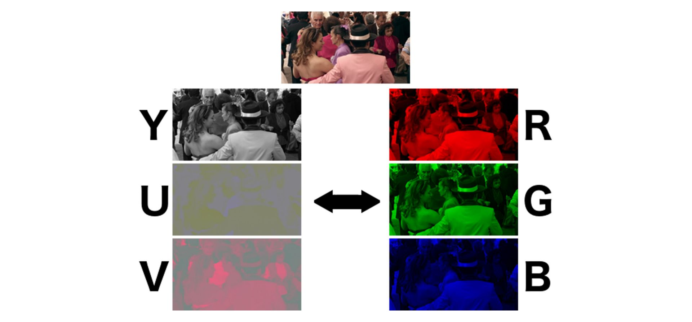


### 1.2.1 RGB格式

即**原色光模式**，又称 RGB 颜色模型或红绿蓝颜色模型，是一种加色模型，将红（Red）、绿（Green）、蓝（Blue）三原色的色光以不同的比例相加，以合成产生各种色彩光，目前的大多数显示器都采用 RGB 这种颜色标准。

RGB 颜色空间可以看作是三维直角颜色坐标系中的一个正立方体，如下图所示

> 红绿蓝三色在立方体的三个顶点上
>
> 洋红、青、黄色在立方体的立方体的另外三个顶点
>
> 黑色在坐标原点
>
> 而白色在离原点最远的定点上
>
> 在连接黑色与白色的对角线上，是亮度等量的三基色混合而成的灰色，该线称为灰色线

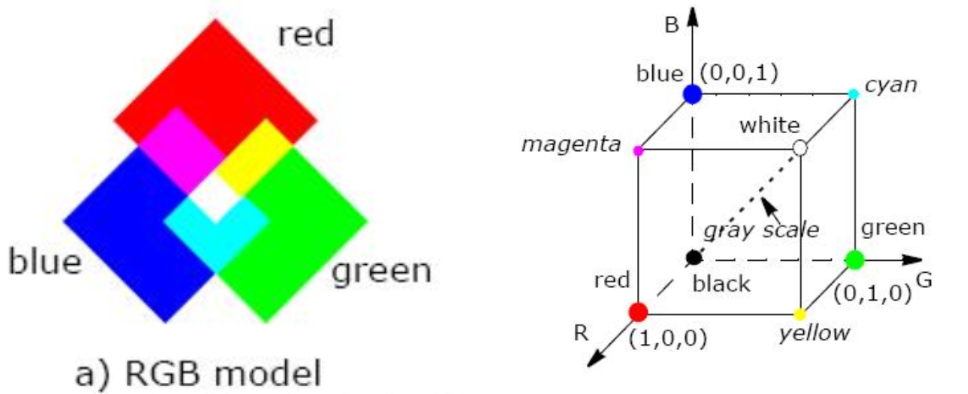


RGB在计算机中的表示主要分为两大类，一种是索引形式，一种是像素形式

> <font color="blue">索引格式</font>：bit存储的并非是实际的R，G，B值，而是对应点的像素在调色板中的索引
>
> <font color="blue">像素格式</font>：bit存储的是每一个像素点的R，G，B值


### 1.2.2 YUV格式

即一种颜色编码方法，一般使用在在影像处理组件中，YUV在对照片或视频编码时，考虑到人类的感知能力（<font color="blue">人眼对亮度敏感，对色度不敏感</font> ），允许降低色度的带宽，其中 <font color="blue">Y表示明亮度（灰度值，Luminance或Luma）、U和V则表示色度和饱和度（Chrominance或Chrom）</font>，作用是描述影像色彩及饱和度，用于指定像素的颜色。

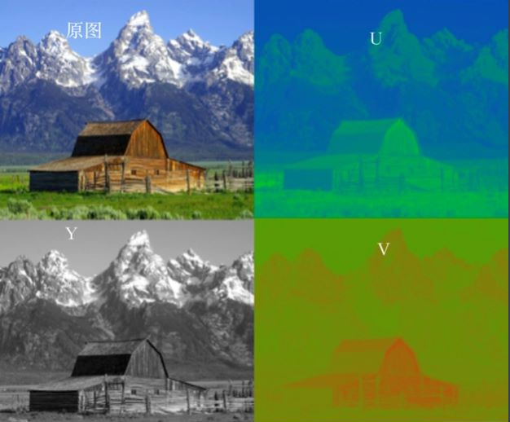

其中，YUV 颜色空间和 RGB 颜色空间可以根据公式相互转换，且经常提到的还有 YPbPr 和 YCbCr

1）YPbPr ：指模拟分量信号(或接口)，P(Parallel)表示并行，b 下标表示蓝，r 下标表示红

2）YCbCr： 指的是数字分量信号(或接口)，Y 是指亮度分量，Cb 指蓝色色度分量，而 Cr 指红色色度分量。其次，YCbCr 还可指色彩空间，YCbCr 色彩空间是 YUV 色彩空间的缩放和偏移版本

> PS： Y′UV、YUV、YCbCr、YPbPr 所指涉的范围，常有混淆或重叠的情况。从历史的演变来说，其中YUV和Y'UV通常用来编码电视的模拟信号，而YCbCr则是用来描述数字的影像信号，适合视频与图片压缩以及传输，例如MPEG、JPEG，现在YUV通常已经在电脑系统上广泛使用。


**RGB 和 YUV 的换算**

```Y = 0.299R ＋ 0.587G ＋ 0.114B
U = －0.147R － 0.289G ＋ 0.436B
V = 0.615R － 0.515G － 0.100B
R = Y ＋ 1.14V
G = Y － 0.39U － 0.58V
B = Y ＋ 2.03U  
```


#### 1.2.2.1 采样方式

一般情况下，考虑人眼的感知能力，色度通道（UV）的采样率可以低于亮度通道（Y），而不会显着降低感知质量。通常 “A:B:C” 的表示法用于描述相对于 Y 采样， U 和 V 的频率，下图显示了如何针对每个采样率下的像素点采样情况，Y亮度样本用十字表示，UV色度样本用圆圈表示

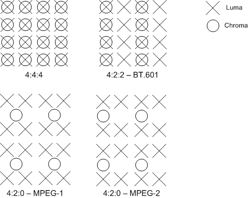


##### 1）4:4:4 采样

表示不降低色度（UV）通道的采样率，即每个像素的三分量采样率相同信息完整。<font color="blue">每个 Y 分量对应一组 UV 分量</font>，一个YUV占 8 + 8 + 8 = 24bits 3个字节

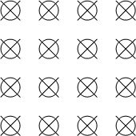

```
四个像素为： [Y0 U0 V0] [Y1 U1 V1] [Y2 U2 V2] [Y3 U3 V3]
采样的码流为： Y0 U0 V0 Y1 U1 V1 Y2 U2 V2 Y3 U3 V3
映射出的像素点为：[Y0 U0 V0] [Y1 U1 V1] [Y2 U2 V2] [Y3 U3 V3]
```


##### 2）4:2:2采样

表示 2:1 水平下采样，没有垂直下采样。UV 分量的采样率是 Y 分量的一半，即<font color="blue">每两个 Y 分量共享一组 UV 分量</font>，一个YUV占 8 + 4 + 4 = 16bits 2个字节

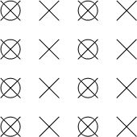

```
四个像素为： [Y0 U0 V0] [Y1 U1 V1] [Y2 U2 V2] [Y3 U3 V3]
采样的码流为： Y0 U0 Y1 V1 Y2 U2 Y3 U3
映射出的像素点为：[Y0 U0 V1]、[Y1 U0 V1]、[Y2 U2 V3]、[Y3 U2 V3]

其中，每采样一个像素点，都会采样其 Y 分量，而 U、V 分量都会间隔采集一个。因此映射为像素点时，第一个像素点和第二个像素点共用了 U0、V1 分量，以此类推。从而节省了图像空间。

比如一张 1920 * 1280 大小的图片，采用 YUV 4:2:2 采样时的大小为：
> (1920 * 1280 * 8 + 1920 * 1280 * 0.5 * 8 * 2 ) / 8 / 1024 / 1024 = 4.68M
可以看出，比 RGB 节省了三分之一的存储空间
```


##### 3）4:2:0采样

表示 2:1 水平下采样，同时 2:1 垂直下采样，但并不意味着不采样 V 分量。它指的是对每条扫描线来说，<font color="blue">只有一种色度分量以 2:1 的采样率存储，相邻的扫描行存储不同的色度分量</font>。也就是说，如果第一行是 4:2:0，下一行就是 4:0:2，在下一行就是 4:2:0，以此类推。其中，<font color="blue">每四个 Y 分量共享一组 UV 分量</font>，一个YUV占 8 + 2 + 2  = 12bits 1.5个字节

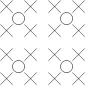

```
图像像素为：
[Y0 U0 V0]、[Y1 U1 V1]、 [Y2 U2 V2]、 [Y3 U3 V3]
[Y5 U5 V5]、[Y6 U6 V6]、 [Y7 U7 V7] 、[Y8 U8 V8]
​
采样的码流为：
Y0 U0 Y1 Y2 U2 Y3 
Y5 V5 Y6 Y7 V7 Y8
​
映射出的像素点为：
[Y0 U0 V5]、[Y1 U0 V5]、[Y2 U2 V7]、[Y3 U2 V7]
[Y5 U0 V5]、[Y6 U0 V5]、[Y7 U2 V7]、[Y8 U2 V7]

其中，每采样一个像素点，都会采样 Y 分量，而 U、V 分量都会隔行按照 2:1 进行采样

比如：一张 1920 * 1280 大小的图片，采用 YUV 4:2:0 采样时的大小为
> (1920 * 1280 * 8 + 1920 * 1280 * 0.25 * 8 * 2 ) / 8 / 1024 / 1024 = 3.51M
相比 RGB，节省了一半的存储空间
```


#### 1.2.2.2 储存方式

YUV存储方式可分为 <font color="blue">平面格式Planar 、半平面格式Semi-Planer 和 打包格式 Packed </font>，其中pakced 存储方式已经非常少用，大部分视频都是采用 planar 存储方式


##### 1）平面格式 **Planar**

平面格式有时也称为三面格式（`Triplanar`），即 <font color="blue">Y, U, V 三个分量各自使用单独的数组保存</font>，即先连续存储所有像素点的 Y，紧接着存储所有像素点的 U，随后是所有像素点的 V。这种三平面分离的格式比较方便视频编码。


###### a）YU12（I420）

> 特点：4:2:0采样，每像素12bit，3平面存储方式

`YU12` 即 `I420`，也叫 `IYUV`，属于 `YUV420P` 格式，是音视频开发中常用的一种格式。三个平面，分别存储 Y U V 分量，且每四个 Y 分量共享一组 UV 分量。U、V 平面的 strides, width 和 height 都是 Y 平面的一半，因此一个像素 12 bits，内存排列如下图所示：

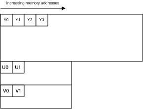

从上可知，U、V 平面的每行字节数（strides）、高（height）都是 Y 平面的一半。


###### b）YV12

> 特点：4:2:0采样，每像素12bit，3平面存储方式

`YV12` 与 `I420` 几乎一样，仅改变了 U, V 平面的顺序。内存排列如下图所示：


###### c）J420

> 特点：4:2:0采样，每像素12bit，3平面存储方式

`J420` 与 `I420` 完全相同，但具有完整范围（0-255，full range）的亮度（Y）分量，而不是有限范围（16-240，limited range，在 iOS 上也叫做 video range）。色度（UV）分量与 I420 中的完全相同。


###### d）IMC1

> 特点：4:2:0采样，每像素16bit，3平面存储方式

`IMC1` 与 `I420` 类似，U, V 平面的宽（width）、高（height）是 Y 平面的一半，但是每行字节数（strides）与 Y 平面一致，因此 U, V 平面在内存上会有留空（padding），因此一个像素 16 bits，如图所示：

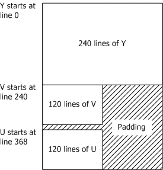


###### e）IMC3

> 特点：4:2:0采样，每像素16bit，3平面存储方式

`IMC3` 与 `IMC1` 几乎一样，仅改变了 U, V 平面的顺序。内存排列如下图所示：

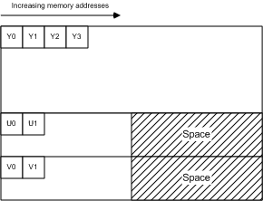


###### f）I422

> 特点：4:2:2采样，每像素16bit，3平面存储方式

`I422` 属于 `YUV422P` 格式。三个平面，分别存储 Y U V 分量。每两个 Y 分量共享一组 UV 分量。U、V 平面的 strides, width 是 Y 平面的一半，但 height 与 Y 平面一致，因此一个像素 16 bits，内存排列如下图所示：

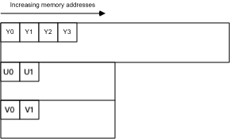

从图中可看出，U、V 平面的每行字节数（strides）是 Y 平面的一半，高（height）与 Y 平面一致


###### g）J422

> 特点：4:2:2采样，每像素16bit，3平面存储方式

`J422` 与 `I422` 完全相同，但具有完整范围（0-255，full range）的亮度（Y）分量，而不是有限范围（16-240，limited range，在 iOS 上也叫做 video range）。色度（UV）分量与 I420 中的完全相同。


##### 2）半平面格式 Semi-Planar

半平面格式具有两个平面而不是三个平面，一个平面存储亮度（Y）分量，另一个平面存储两个色度（UV）分量。有时也将它们称为双平面格式（`BiPlanar`）


###### a）NV12

> 特点：4:2:0采样，每像素12bit，2平面存储方式

`NV12` 属于 `YUV420SP` 格式，两个平面，分别存储 Y 分量 和 UV 分量。其中 UV 分量共用一个平面，并且以 U, V, U, V 的顺序交错排列。每四个 Y 分量共享一组 UV 分量。

UV 平面的 strides, width 与 Y 平面一样长，但 height 仅为 Y 平面的一半。因此一个像素 12 bits，内存排列如下图所示：

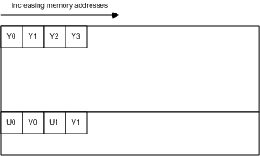

从图中可看出，UV 平面的每行字节数（strides）与 Y 平面一致，高（height）是 Y 平面的一半。

`NV12` 是 iOS 相机（`AVCaptureOutput`）可直接输出的两种视频帧格式之一，另外一种是 `BGRA32`(`kCVPixelFormatType_32BGRA`)。

在 iOS 上，`NV12` 还分为 Full Range (0-255, `kCVPixelFormatType_420YpCbCr8BiPlanarFullRange`) 和 Video Range (16-240, `kCVPixelFormatType_420YpCbCr8BiPlanarVideoRange`)，区别仅为亮度（Y）分量的取值范围，一般而言，Full Range 适用于静态图像（拍照），Video Range 适用于视频采集（摄像）。


###### b）NV21

> 特点：4:2:0采样，每像素12bit，2平面存储方式

`NV21` 属于 `YUV420SP`，与 `NV12` 几乎一致，区别是 UV 平面中 U 与 V 的排列顺序颠倒，以 V, U, V, U 的顺序交错排列，内存排列如图所示：


`NV21` 是 Android 相机（`Camera`）默认的输出格式


##### 3）Packed 打包格式

打包格式通常只有一个平面，所有亮度（Y）和色度（UV）数据都交织在一起，即每个像素点的 Y、U、V 是连续交错存储的。有点类似于 RGB 格式，只是使用了不同的色彩空间。

打包格式在 <font color="blue">网络摄像头</font>中较为常见，硬件设备使用多平面格式效率较低，因为每个像素需要多次内存访问。而打包格式由于仅一个平面，访问内存的开销较小。


###### a）AYUV

> 特点：4:4:4采样，每像素32bit

AYUV 是 Packed 打包格式，其中每个像素编码为四个连续字节，每个像素在内存中按照 V, U, Y, A 的顺序排列（A 指 alpha 通道），如下图所示：

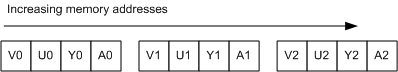


###### b）YUYV（V422/YUY2/YUNV）

> 特点：4:2:2采样，每像素16bit

YUY2 是 Packed 打包格式，其中两个像素共用一组 UV 分量，内存中按照 Y U Y V 的顺序排列，如下图所示：

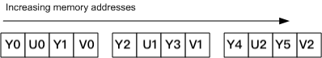


###### c）UYVY（Y422/UYNV）

> 特点：4:2:2采样，每像素16bit

`UYVY` 与 `YUYV` 类似，只是亮度（Y）分量与色度（UV）分量排列顺序颠倒，如下图所示：

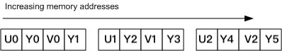


# 附录

## 基础概念

1. [视频解码GOP概念](https://zhuanlan.zhihu.com/p/112635240)

2. [关于GOP和帧率、码率的关系  ](https://zhuanlan.zhihu.com/p/259870429)

3. [I帧、P帧、B帧、GOP、IDR 和PTS, DTS之间的关系 ](https://www.cnblogs.com/yongdaimi/p/10676309.html) 

4. [数字音视频技术](https://www.cnblogs.com/yongdaimi/category/1435491.html)

5. [视频和视频帧：视频和帧基础知识整理 ](https://zhuanlan.zhihu.com/p/61747783)

6. [音视频同步原理&实现](https://blog.csdn.net/myvest/article/details/97416415)

7. [Github音视频基础概念](https://github.com/0voice/audio_video_streaming/blob/main/article/034-音视频编解码常用知识点.md)


## 视频播放器相关 

1. [视频播放流程概略](https://bbs.huaweicloud.com/blogs/194497) 

2. [视频播放流程](https://juejin.cn/post/7027838598713507877)

3. [音视频零基础入门](https://toutiao.io/posts/2qoywz/preview)、https://blog.51cto.com/ciellee/3413012


## 视频压缩编码相关

1. [视频压缩编码的基本原理](https://codeantenna.com/a/inN4AXBwhb)

2. [雷神 - 音视频压缩编码基本原理](https://bugnull.com/2019/11/26/跟雷神学音视频-3-音视频压缩编码基本原理/)

3. [【客户端技术】深入了解视频播放器工作原理与实现 ](https://cloud.tencent.com/developer/article/1691027)

4. [雷神音视频基础知识](https://bugnull.com/tags/FFmpeg/page/3/)


## 流媒体相关（PCDN）

1. [网络视频播放原理](https://www.jianshu.com/p/84c5494a486f)  

2. [一篇文章解读提速、降费黑科技：PCDN定义、功能、架构、场景和优势](https://developer.aliyun.com/article/130907) 

3. [PCDN介绍](https://cloud.tencent.com/developer/article/1906256) 

4. [CDN 原理和几种变形（DCDN/ECDN/PCDN/SCDN）](https://czj.so/759/cdn原理和几种变形.html)  

5. [使用阿里云PCDN降低内容分发成本](https://www.daimajiaoliu.com/daima/4ed692962100408)

6. [高清视频下如何节省带宽？](https://developer.aliyun.com/article/763669?spm=a2c6h.14164896.0.0.b0114d4bAw7RUf)  (Important)


## 其它

1. [快速探索，音视频技术不再神秘 ](https://segmentfault.com/a/1190000016965965)

2. [音视频色彩空间](https://juejin.cn/post/7021152032220250142)

3. [音视频编码格式汇总](https://www.cnblogs.com/candycaicai/archive/2011/02/17/1956737.html)

4. [音视频技术总览](https://hezhaojiang.github.io/post/2020/8a06ddbd/)

5. [一文看懂音视频流媒体协议及信令技术](https://developer.aliyun.com/article/787990)  
