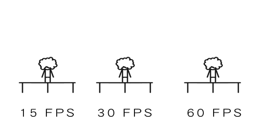
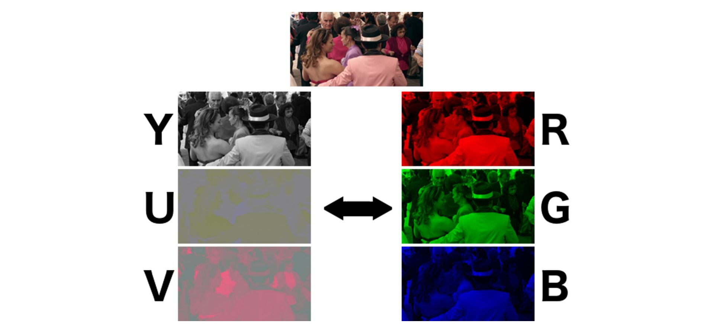
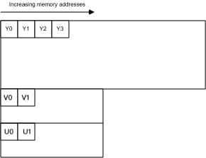
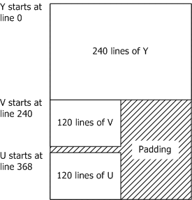
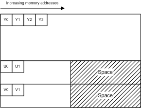
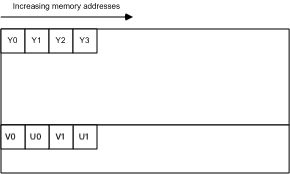
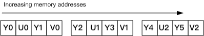
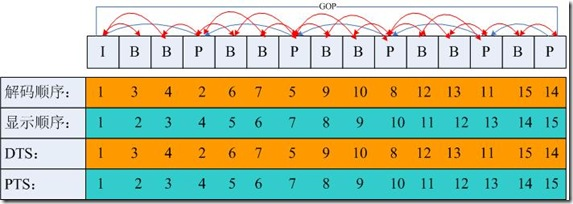

# 1 视频基础概念

什么是视频？

从感性的角度来看，视频就是一部影片，是一连贯的视觉冲击力表现丰富的画面和音频。 但从理性的角度来看，视频是一种有结构的数据，可以把视频剖析成如下结构：

* **内容元素 ( Content )**：图像 ( Image )、音频 ( Audio )、元信息 ( Metadata )
* **编码格式 ( Codec )**：
  * Video : H.264、H.265、 …MPEG
  * Audio : AAC、HE-AAC、 …
* **容器封装 (Container)**：MP4、MOV、FLV、RM、RMVB、AVI ..


## 1.1 视频

### 1.1.1 码率 / 比特率

在视频领域即每秒传送的bit数（ 指单位时间内传输或处理的比特的数量 ），通俗一点的理解就是取样率，**单位时间内取样率越大，精度就越高**，处理出来的文件就越接近原始文件，当前多媒体行业在指音频或视频在单位时间内的数据传输率时通常使用码率，单位是kbps。

一般来说，如果是1M的宽带，在网上只能看码流不超过125kbps的视频，超过125kbps的视频只能等视频缓冲才能顺利观看

> 1）只针对视频数据，单位时间内视频数据量大小，一般以秒为单位(KB/S) ， <font color="blue">码率 = 视频数据大小/视频时间长度</font>
>
> 2）对于直播之类的计算，<font color="blue">码流 = 视频传输数据量/传输时间</font>> ， 在直播中，两种方式计算的码流应该是近似相等的，否则就会出现类似延时，卡顿等情况。
>
> 3）码率一般分为**固定码率**和**可变码率**：
>
> - <font color="blue">固定码率（Constant Bitrate，CBR）</font>：编码器输出码率固定，CBR 不适合存储，CBR 对于复杂内容可能没有足够码率进行编码，从而导致质量下降，同时会在简单内容部分浪费一些码率，比如：为了保证码率恒定，某些图像丰富的内容就是失去某些图像细节而变得模糊。
> - <font color="blue">可变码率（Variable Bitrate，VBR）</font>：编码器的输出码率可以根据编码器输入源信号的复杂度自适应调整，目的是为了达到输出质量保持不变的同时节省存储空间。VBR 适用于存储，不太适用流式传输，可以更有效的地利用有限空间。


### 1.1.2 帧率 / 帧速率

FPS，全称Frames Per Second，指每秒刷新的图片帧数（ 帧率表示图形处理器处理场时每秒钟能够更新的次数 ），一般来说， 越高的帧速率可以得到更流畅、更逼真的动画，且成正比：<font color="blue">帧率越大，画面越流畅；帧率越小，画面越有跳动感</font>

<div align=center></div>

一个较权威的说法：

> 当视频帧率不低于24fps时，人眼才会觉得视频时连贯的，称为“视觉暂留”现象。因此，才有说法：尽管『帧率』越高越流畅，但在很多实际应用场景中24fps就可以了。


### 1.1.3 分辨率 / 清晰度

<font color="blue">分辨率（Resolution）</font>：常被俗称为『图像的尺寸』或者『图像的大小』。指一帧图像包含的像素的多少，常见有1280x720（720P），1920X1080（1080P）等规格。『分辨率』影响图像大小，且与之成正比：『分辨率』越高，图像越大；反之，图像越小

<font color="blue">清晰度</font>： 所谓“清晰”，是指画面十分细腻，没有马赛克，并不是分辨率越高图像就越清晰。 即在码率一定的情况下，分辨率在一定范围内取值都将是清晰的；同样地，在分辨率一定的情况下，码率在一定范围内取值都将是清晰的 

> 1）在码率一定的情况下，分辨率与清晰度成反比关系：分辨率越高，图像越不清晰，分辨率越低，图像越清晰
>
> 2）在分辨率一定的情况下，码率与清晰度成正比关系，码率越高，图像越清晰；码率越低，图像越不清晰


## 1.2 色彩空间（YUV & RGB）

YUV主要用于<font color="blue">优化彩色视频信号的传输</font>，使其向后相容老式黑白电视，与RGB视频信号传输相比，它最大的优点在于只需占用极少的带宽




### 1.2.1 RGB格式

即**原色光模式**，又称 RGB 颜色模型或红绿蓝颜色模型，是一种加色模型，将红（Red）、绿（Green）、蓝（Blue）三原色的色光以不同的比例相加，以合成产生各种色彩光，目前的大多数显示器都采用 RGB 这种颜色标准。

RGB 颜色空间可以看作是三维直角颜色坐标系中的一个正立方体，如下图所示

> 红绿蓝三色在立方体的三个顶点上
>
> 洋红、青、黄色在立方体的立方体的另外三个顶点
>
> 黑色在坐标原点
>
> 而白色在离原点最远的定点上
>
> 在连接黑色与白色的对角线上，是亮度等量的三基色混合而成的灰色，该线称为灰色线

<div align=center></div>


RGB在计算机中的表示主要分为两大类，一种是索引形式，一种是像素形式

> <font color="blue">索引格式</font>：bit存储的并非是实际的R，G，B值，而是对应点的像素在调色板中的索引
>
> <font color="blue">像素格式</font>：bit存储的是每一个像素点的R，G，B值


### 1.2.2 YUV格式

即一种颜色编码方法，一般使用在在影像处理组件中，YUV在对照片或视频编码时，考虑到人类的感知能力（<font color="blue">人眼对亮度敏感，对色度不敏感</font> ），允许降低色度的带宽，其中 <font color="blue">Y表示明亮度（灰度值，Luminance或Luma）、U和V则表示色度和饱和度（Chrominance或Chrom）</font>，作用是描述影像色彩及饱和度，用于指定像素的颜色。

<div align=center></div>

其中，YUV 颜色空间和 RGB 颜色空间可以根据公式相互转换，且经常提到的还有 YPbPr 和 YCbCr

1）YPbPr ：指模拟分量信号(或接口)，P(Parallel)表示并行，b 下标表示蓝，r 下标表示红

2）YCbCr： 指的是数字分量信号(或接口)，Y 是指亮度分量，Cb 指蓝色色度分量，而 Cr 指红色色度分量。其次，YCbCr 还可指色彩空间，YCbCr 色彩空间是 YUV 色彩空间的缩放和偏移版本

> PS： Y′UV、YUV、YCbCr、YPbPr 所指涉的范围，常有混淆或重叠的情况。从历史的演变来说，其中YUV和Y'UV通常用来编码电视的模拟信号，而YCbCr则是用来描述数字的影像信号，适合视频与图片压缩以及传输，例如MPEG、JPEG，现在YUV通常已经在电脑系统上广泛使用。


**RGB 和 YUV 的换算**

```Y = 0.299R ＋ 0.587G ＋ 0.114B
U = －0.147R － 0.289G ＋ 0.436B
V = 0.615R － 0.515G － 0.100B
R = Y ＋ 1.14V
G = Y － 0.39U － 0.58V
B = Y ＋ 2.03U  
```


#### 1.2.2.1 采样方式

一般情况下，考虑人眼的感知能力，色度通道（UV）的采样率可以低于亮度通道（Y），而不会显着降低感知质量。通常 “A:B:C” 的表示法用于描述相对于 Y 采样， U 和 V 的频率，下图显示了如何针对各个采样方式下的每个像素点采样情况，Y亮度样本用十字表示，UV色度样本用圆圈表示

<div align=center></div>


##### 1）4:4:4 采样

表示不降低色度（UV）通道的采样率，即每个像素的三分量采样率相同信息完整。<font color="blue">每个 Y 分量对应一组 UV 分量</font>，一个YUV占 8 + 8 + 8 = 24bits 3个字节

<div align=center></div>

```
四个像素为： [Y0 U0 V0] [Y1 U1 V1] [Y2 U2 V2] [Y3 U3 V3]
采样的码流为： Y0 U0 V0 Y1 U1 V1 Y2 U2 V2 Y3 U3 V3
映射出的像素点为：[Y0 U0 V0] [Y1 U1 V1] [Y2 U2 V2] [Y3 U3 V3]
```


##### 2）4:2:2采样

表示 2:1 水平下采样，没有垂直下采样。UV 分量的采样率是 Y 分量的一半，即<font color="blue">每两个 Y 分量共享一组 UV 分量</font>，一个YUV占 8 + 4 + 4 = 16bits 2个字节

<div align=center></div>

```
四个像素为： [Y0 U0 V0] [Y1 U1 V1] [Y2 U2 V2] [Y3 U3 V3]
采样的码流为： Y0 U0 Y1 V1 Y2 U2 Y3 U3
映射出的像素点为：[Y0 U0 V1]、[Y1 U0 V1]、[Y2 U2 V3]、[Y3 U2 V3]

其中，每采样一个像素点，都会采样其 Y 分量，而 U、V 分量都会间隔采集一个。因此映射为像素点时，第一个像素点和第二个像素点共用了 U0、V1 分量，以此类推。从而节省了图像空间。

比如一张 1920 * 1280 大小的图片，采用 YUV 4:2:2 采样时的大小为：
> (1920 * 1280 * 8 + 1920 * 1280 * 0.5 * 8 * 2 ) / 8 / 1024 / 1024 = 4.68M
可以看出，比 RGB 节省了三分之一的存储空间
```


##### 3）4:2:0采样

表示 2:1 水平下采样，同时 2:1 垂直下采样，但并不意味着不采样 V 分量。它指的是对每条扫描线来说，<font color="blue">只有一种色度分量以 2:1 的采样率存储，相邻的扫描行存储不同的色度分量</font>。也就是说，如果第一行是 4:2:0，下一行就是 4:0:2，在下一行就是 4:2:0，以此类推。其中，<font color="blue">每四个 Y 分量共享一组 UV 分量</font>，一个YUV占 8 + 2 + 2  = 12bits 1.5个字节

<div align=center></div>

```
图像像素为：
[Y0 U0 V0]、[Y1 U1 V1]、 [Y2 U2 V2]、 [Y3 U3 V3]
[Y5 U5 V5]、[Y6 U6 V6]、 [Y7 U7 V7] 、[Y8 U8 V8]
​
采样的码流为：
Y0 U0 Y1 Y2 U2 Y3 
Y5 V5 Y6 Y7 V7 Y8
​
映射出的像素点为：
[Y0 U0 V5]、[Y1 U0 V5]、[Y2 U2 V7]、[Y3 U2 V7]
[Y5 U0 V5]、[Y6 U0 V5]、[Y7 U2 V7]、[Y8 U2 V7]

其中，每采样一个像素点，都会采样 Y 分量，而 U、V 分量都会隔行按照 2:1 进行采样

比如：一张 1920 * 1280 大小的图片，采用 YUV 4:2:0 采样时的大小为
> (1920 * 1280 * 8 + 1920 * 1280 * 0.25 * 8 * 2 ) / 8 / 1024 / 1024 = 3.51M
相比 RGB，节省了一半的存储空间
```


#### 1.2.2.2 储存方式

YUV存储方式可分为 <font color="blue">平面格式Planar 、半平面格式Semi-Planer 和 打包格式 Packed </font>，其中pakced 存储方式已经非常少用，大部分视频都是采用 planar 存储方式


##### 1）平面格式 **Planar**

平面格式有时也称为三面格式（`Triplanar`），即 <font color="blue">Y, U, V 三个分量各自使用单独的数组保存</font>，即先连续存储所有像素点的 Y，紧接着存储所有像素点的 U，随后是所有像素点的 V。这种三平面分离的格式比较方便视频编码。


###### a）YU12（I420）

> 特点：4:2:0采样，每像素12bit，3平面存储方式

`YU12` 即 `I420`，也叫 `IYUV`，属于 `YUV420P` 格式，是音视频开发中常用的一种格式。三个平面，分别存储 Y U V 分量，且每四个 Y 分量共享一组 UV 分量。U、V 平面的 strides, width 和 height 都是 Y 平面的一半，因此一个像素 12 bits，内存排列如下图所示：

<div align=center></div>

从上可知，U、V 平面的每行字节数（strides）、高（height）都是 Y 平面的一半。


###### b）YV12

> 特点：4:2:0采样，每像素12bit，3平面存储方式

`YV12` 与 `I420` 几乎一样，仅改变了 U, V 平面的顺序。内存排列如下图所示：

<div align=center></div>


###### c）J420

> 特点：4:2:0采样，每像素12bit，3平面存储方式

`J420` 与 `I420` 完全相同，但具有完整范围（0-255，full range）的亮度（Y）分量，而不是有限范围（16-240，limited range，在 iOS 上也叫做 video range）。色度（UV）分量与 I420 中的完全相同。


###### d）IMC1

> 特点：4:2:0采样，每像素16bit，3平面存储方式

`IMC1` 与 `I420` 类似，U, V 平面的宽（width）、高（height）是 Y 平面的一半，但是每行字节数（strides）与 Y 平面一致，因此 U, V 平面在内存上会有留空（padding），因此一个像素 16 bits，如图所示：

<div align=center></div>


###### e）IMC3

> 特点：4:2:0采样，每像素16bit，3平面存储方式

`IMC3` 与 `IMC1` 几乎一样，仅改变了 U, V 平面的顺序。内存排列如下图所示：

<div align=center></div>


###### f）I422

> 特点：4:2:2采样，每像素16bit，3平面存储方式

`I422` 属于 `YUV422P` 格式。三个平面，分别存储 Y U V 分量。每两个 Y 分量共享一组 UV 分量。U、V 平面的 strides, width 是 Y 平面的一半，但 height 与 Y 平面一致，因此一个像素 16 bits，内存排列如下图所示：

<div align=center></div>

从图中可看出，U、V 平面的每行字节数（strides）是 Y 平面的一半，高（height）与 Y 平面一致


###### g）J422

> 特点：4:2:2采样，每像素16bit，3平面存储方式

`J422` 与 `I422` 完全相同，但具有完整范围（0-255，full range）的亮度（Y）分量，而不是有限范围（16-240，limited range，在 iOS 上也叫做 video range）。色度（UV）分量与 I420 中的完全相同。


##### 2）半平面格式 Semi-Planar

半平面格式具有两个平面而不是三个平面，一个平面存储亮度（Y）分量，另一个平面存储两个色度（UV）分量。有时也将它们称为双平面格式（`BiPlanar`）


###### a）NV12

> 特点：4:2:0采样，每像素12bit，2平面存储方式

`NV12` 属于 `YUV420SP` 格式，两个平面，分别存储 Y 分量 和 UV 分量。其中 UV 分量共用一个平面，并且以 U, V, U, V 的顺序交错排列。每四个 Y 分量共享一组 UV 分量。

UV 平面的 strides, width 与 Y 平面一样长，但 height 仅为 Y 平面的一半。因此一个像素 12 bits，内存排列如下图所示：

<div align=center></div>

从图中可看出，UV 平面的每行字节数（strides）与 Y 平面一致，高（height）是 Y 平面的一半。

`NV12` 是 iOS 相机（`AVCaptureOutput`）可直接输出的两种视频帧格式之一，另外一种是 `BGRA32`(`kCVPixelFormatType_32BGRA`)。

在 iOS 上，`NV12` 还分为 Full Range (0-255, `kCVPixelFormatType_420YpCbCr8BiPlanarFullRange`) 和 Video Range (16-240, `kCVPixelFormatType_420YpCbCr8BiPlanarVideoRange`)，区别仅为亮度（Y）分量的取值范围，一般而言，Full Range 适用于静态图像（拍照），Video Range 适用于视频采集（摄像）。


###### b）NV21

> 特点：4:2:0采样，每像素12bit，2平面存储方式

`NV21` 属于 `YUV420SP`，与 `NV12` 几乎一致，区别是 UV 平面中 U 与 V 的排列顺序颠倒，以 V, U, V, U 的顺序交错排列，内存排列如图所示：

<div align=center></div>

`NV21` 是 Android 相机（`Camera`）默认的输出格式


##### 3）Packed 打包格式

打包格式通常只有一个平面，所有亮度（Y）和色度（UV）数据都交织在一起，即每个像素点的 Y、U、V 是连续交错存储的。有点类似于 RGB 格式，只是使用了不同的色彩空间。

打包格式在 <font color="blue">网络摄像头</font>中较为常见，硬件设备使用多平面格式效率较低，因为每个像素需要多次内存访问。而打包格式由于仅一个平面，访问内存的开销较小。


###### a）AYUV

> 特点：4:4:4采样，每像素32bit

AYUV 是 Packed 打包格式，其中每个像素编码为四个连续字节，每个像素在内存中按照 V, U, Y, A 的顺序排列（A 指 alpha 通道），如下图所示：

<div align=center></div>


###### b）YUYV（V422/YUY2/YUNV）

> 特点：4:2:2采样，每像素16bit

YUY2 是 Packed 打包格式，其中两个像素共用一组 UV 分量，内存中按照 Y U Y V 的顺序排列，如下图所示：

<div align=center></div>


###### c）UYVY（Y422/UYNV）

> 特点：4:2:2采样，每像素16bit

`UYVY` 与 `YUYV` 类似，只是亮度（Y）分量与色度（UV）分量排列顺序颠倒，如下图所示：

<div align=center></div>


# 2 音频基础概念


## 2.1 脉冲调制 PCM

PCM（Pulse Code Modulation）是**脉冲编码调制**，实际上就是<font color="blue">将模拟音频信号转换为数字音频信号</font>，音视频中的 PCM 是指未经压缩的音频采样数据流，它是由音频信号经采样、量化、编码生成的标准数字音频数据。


PCM数据关键量化指标如下：

```
Sample Size：采样大小，也是量化级数，表示一个采样用多少位bit存放，常用的是16位
Sample Rate：采样率，表示每次采样的次数，单位Hz，常见的采样率有8k、16k、32k、44.1k、48k等
Number of Channels：声道数，表示当前PCM数据中包含的声道数，如单声道、双声道、多声道等
Byte Ordering：字节序，表示PCM数据存储的字节序是大端存储（big-endian）还是小端存储（little-endian），为了数据处理效率的高效，通常为小端存储
Sign：表示当前PCM数据是否有符号位
Integer Of Floating Point：表示当前PCM数据使用整型还是浮点型来表示
```


常见PCM数据播放工具：

>ffplay：
>
>​	ffplay -f f32le -ac 1 -ar 48000 pcm_audio  # 播放格式为f32le，单声道，采样频率48000Hz的PCM数据
>
>[Audacity](https://links.jianshu.com/go?to=https%3A%2F%2Fwww.audacityteam.org%2F)：一款免费开源的跨平台音频处理软件
>
>Adobe Auditon：导入原始数据，打开的时候需要选择采样率、格式和字节序


PCM数据格式：

> 如果是单声道的音频文件，采样数据按时间的先后顺序依次存入（有的时候也会采用LRLRLR方式存储，只是另一个声道的数据为0），如果是双声道的话就按照LRLRLR的方式存储，存储的时候与字节序有关。big-endian模式如下图所示：

<div align=center></div>


## 2.2 采样率 Sample Rate

也称采样率, 是指将<font color="blue">模拟信号转换成数字信号时的采样频率，表示每秒从连续信号中提取并组成离散信号的采样个数</font>，用赫兹（Hz）来表示，采样频率越高能表现的频率范围就越大。 通常情况下，人耳能听到的声音一般在20Hz~20KHz之间，根据采样定理，采样频率大于信号中最高频率的2倍时，采样之后的数字信号便能完整的反应真实信号。


一些常用音频采样率如下: 

```8kHz - 电话所用采样率 
11.025kHz - AM调幅广播所用采样率
22.05kHz - 无线电广播所用采样率 
44.1kHz - 音频 CD, 也常用于 MPEG-1 音频(VCD, SVCD, MP3)所用采样率 
48kHz - miniDV、数字电视、DVD、DAT、电影和专业音频所用的数字声音所用采样率
```


CD音乐的标准采样频率为44.1KHz，这也是目前声卡与计算机作业间最常用的采样频率，目前比较盛行的蓝光的采样率就相当的高，达到了192kHz。而目前的声卡，绝大多数都可以支持44.1kHz、48kHz、96kHz，高端产品可支持192kHz甚至更高，总之，采样率越高，获得的声音文件质量越好，占用存储空间也就越大。


## 2.3 声道数 Channel

指<font color="blue">声音在录制或播放时在不同空间位置采集或回放的相互独立的音频信号</font>，所以声道数也就是声音录制时的音源数量或回放时相应的扬声器数量


常见声道有单声道、立体声道、4声道、5.1声道、7.1声道等 ，具体如下：

> <font color="blue">单声道</font>：设置一个扬声器
>
> <font color="blue">立体声道</font>：把单声道一个扬声器扩展为左右对称的两个扬声器，声音在录制过程中被分配到两个独立的声道，从而达到了很好的声音定位效果，这种技术在音乐欣赏中显得尤为有用，听众可以清晰地分辨出各种乐器来自何方，从而使音乐更富想象力，更加接近临场感受。立体声技术广泛应用于自Sound Blaster Pro以后的大量声卡，成为了 影响深远的音频标准。
>
> <font color="blue">4声道</font>：4声道环绕规定了4个发音点，分别是前左、前右、后左、后右，听众则被包围在中间，同时还建议增加一个低音音箱，以加强对低频信号的回放处理，这也就是如今4.1声道音箱系统广泛流行的原因，就整体效果而言，4声道系统可以为听众带来来自多个不 同方向的声音环绕，可以获得身 临各种不同环境的昕觉感受，给用户以全新的体验。
>
> <font color="blue">5.1声道</font>：其实5.1声道系统来源于4.1声道系统，将环绕声道一分为二，分为左环绕和右环绕，中央位置增加重低音效果。
>
> <font color="blue">7.1声道</font>：7.1声道系统在5.1声道系统的基础上又增加了中左和中右两个发音点，简单来说就是在听者的周围建立起一套前后相对平衡的声场，增加了后中声场声道。


## 2.4 量化精度 或 采样位数

声波在转换为数字信号的过程中不只有采样率影响原始声音的完整性，还有一个重要影响因素是**量化精度**，采样频率针对的是每秒钟所采样的数量，而量化精度则是对于声波的振幅进行切割，切割的数量是以最大振幅切成2的n次方计算，n就是bit数，而bit数就是音频分辨率。

采样位数(Bit Depth, Sample Format, Sample Size, Sample Width)，也称位深度，是指<font color="blue">采集卡在采集和播放声音文件时所使用数字声音信号的二进制位数，或者说是每个采样样本所包含的位数</font>，通常有 8 bit、16 bit。 另外，bit的数目还决定了声波振幅的范围（即动态范围，最大音量与最小音量的差距），如果这个位数越大，则能够表示的**数值越大，描述波形更精确**，每一个Bit的数据可以记录约等于6dB动态的信号。

> 一般来说，16Bit可以提供最大96dB的动态范围（加高频颤动后只有9dB），据此可以推断出20Bit可以达到120dB的动态范围，动态范围大了，会有什么好处呢？
>
> 动态范围是指系统的输出噪音功率和最大不失真音量功率的比值，这个值越大，则系统可以承受很高的动态。


## 2.5 码率

码率(Bit Rate), 也称位率, 指每秒传送的比特(bit)数, 单位为 bps(Bit Per Second), 比特率越高, 传送数据速度越快. 声音中的比特率是指将模拟声音信号转换成数字声音信号后, 单位时间内的二进制数据量。其计算公式为: 

> 码率 = 采样频率 * 采样位数 * 声道数


**例如**：采样率44.1KHz，采样大小为16bit，双声道的PCM编码的WAV文件，其码率为 44.1K * 16 * 2 = 1411.2Kb/s，假设传输上述音频，每秒将超过1M的数据量，再加上在数据传输过程中，上行速率往往远小于下行速率，这就需要压缩音频数据了


# 3 视频编解码概念


## 3.1 基础概念

视频是<font color="red">利用人眼视觉暂留的原理，通过播放一系列的图片，使人眼产生运动的感觉</font>。单纯传输视频画面，视频量非常大，对现有的网络和存储来说是不可接受的。为了能够使视频便于传输和存储，发现视频有大量重复的信息，如果将重复信息在发送端去掉，在接收端恢复出来，这样就大大减少了视频数据的文件，因此有了H.264视频压缩标准。

视频里边的**原始图像**数据会采用 <font color="blue">H.264编码格式</font> 进行压缩，**音频**采样数据会采用 <font color="blue">AAC 编码格式</font> 进行压缩。视频内容经过编码压缩后，确实有利于存储和传输。不过当要观看播放时，相应地也需要解码过程。因此编码和解码之间，显然需要约定一种编码器和解码器都可以理解的约定。


就视频图像编码和解码而言，这种约定很简单：

<div align=center></div>

> 编码器将<font color="blue">多张图像进行编码后生产成一段一段的 GOP ( Group of Pictures ) </font>， 而解码器在<font color="blue">播放时则是读取一段一段的 GOP 进行解码后读取画面再渲染显示</font>。
>
> GOP ( Group of Pictures) 是一组连续的画面，由一张 I 帧和数张 B / P 帧组成，是<font color="red">视频图像编码器和解码器存取的基本单位</font>，它的排列顺序将会一直重复到影像结束。
>
> I 帧是内部编码帧（也称为关键帧），P帧是前向预测帧（前向参考帧），B 帧是双向内插帧（双向参考帧）。简单地讲，I 帧是一个完整的画面，而 P 帧和 B 帧记录的是相对于 I 帧的变化。如果没有 I 帧，P 帧和 B 帧就无法解码。


在H.264压缩标准中I帧、P帧、B帧用于表示传输的视频画面

<div align=center></div>


## 3.2 名词介绍

H264相关句法名词：序列（sequence）、图像（frame/field-picture）、片（slice）、宏块（macroblock）、子块（sub-block）

<div align="center"></div>


### 3.2.1 宏块 Macroblock & 子宏块 Sub-Block

宏块就是，把视频的每一帧（相当于一张图片）划分成`16*16`的小块，一块一块的依次压缩，而不是对整张图片一起压缩。这样降低了计算的复杂度，比较节省时间。一个宏块又可以分成`16*16, 16*8, 8*16, 8*8, 8*4, 4*8, 4*4`等大小不等的块。具体怎么划分块大小，要看画面有多复杂。一般来说，运动多，细节多的部分，划分成小块来编码；大片的平坦的无变化的，划分成16*16的大块。

> H264中，以16x16的宏块为编码最小单元，一个宏块可以被分成多个4x4或8x8的块，同一个宏块内，像素的相似程度会比较高，若16x16的宏块中，像素相差较大，那么就需要继续细分
>
> H265的宏块是从8x8到64x64可变

<div align="center"></div>

当然，***像素块越小，编码的复杂度也会随之增加，编码效率自然就会降低***。但是这样是值得的，因为图像的压缩效率有了显著提高，也就是编码后得到的相同质量的图像，H.264的压缩比更大，占用的空间及带宽更小。


**举例**：如下图显示了一个**残差帧**（没有进行运动补偿），H.264 编码器为帧的每个部分选择了最佳分割尺寸，使传输信息量最小，并将选择的分割加到残差帧上。在帧变化小的区域（残差显示灰色），选择 16×16 分割；多运动区域（残差显示黑色或白色），选择更有效的小的尺寸

<div align="center"></div>


**宏块种类**：

> **I宏块**：利用从当前片中，已解码的像素作为参考进行帧内预测，注意是当前片内，不能取其他片中已解码的像素作为参考进行 **帧内预测**
>
> **P宏块**：利用前面已编码的图像作为参考图像，进行 **帧间预测**
>
> **B宏块**：则利用双向的参考图像（当前的和未来的已编码的图像帧）进行 **帧间预测**
>
> 注意：不合理的分块会出现块效应，即块与块之间色差明显


MPEG-2和较早期的编解码器定义宏块都是8×8像素，以**宏块**为基准选择特定的预测类型，而非整个图像都使用相同的预测类型，具体如下：

> I帧：只包含节点宏块
>
> P帧：可含有节点宏区块或预测宏区块
>
> B帧：可含有节点、预测和前后预测宏区块

而在H.264/MPEG-4 AVC标准中，预测类型的粒度降低到切片（**Slice**）级别，**切片是帧的空间上不同的区域**，该区域与同一帧中的任何其他区域分开进行编码，I切片、P切片和B切片取代了I、P和B帧。


### 3.2.2 片Slice

一帧视频图像可编码成一个或者多个片，每片包含整数个宏块，即每片至少一个宏块，最多时包含整个图像的宏块。通过分析H.264的宏块知道，要想具备哪种能力（**帧内预测或帧间预测**），只要包含对应类型的宏块即可。所以可猜测，假如一个slice包含了I宏块，那么它就具有了帧内预测的能力，如果包含了P或B宏块，它就具有了帧间预测的能力

> Slice的目的：为了**限制误码的扩散和传输**，使编码片相互间保持独立


**Slice种类：**

* **I（Intra）**：只包含 **I宏块** ，每一个块或宏块，可以在当前片中，通过已编码的像素作为参考进行帧内预测，可以看到和I宏块的能力一致
* **P（Predicted）**：包含 **P宏块和/或I宏块** ，对于P宏块的每一个宏块，用前面已编码的图像作为参考图像，进行帧间预测
* **B（Bi-predictive）**：包含 **B宏块和/或I宏块** ，对于B宏块的每一个宏块，用当前的和未来的已编码的图像帧作为参考图像，进行帧间预测
* **SP（Switching P）**：包含 **P宏块和/或I宏块** ，用于不同编码流之间进行切换
* **SI（Switching P）**：包含 **SI宏块** （一种特殊类型的帧内编码宏块），用于不同编码流之间进行切换

> **注意**：SP和SI slice，是H.264新增的，经过特殊编码的slice，它们用于**在不同编码流之间进行切换、随机访问、快进和快退**。在用户网络状况变化的情况下，可以使用SP帧从低数据量码流切换到高数据流码流，或者从高切向低。


**片句法结构**：

> 片头规定了片的类型、属于哪个图像、有关的参考图像等；
>
> 片的数据包含了一系列宏块和不编码数据
>
> **Slice组**：是一个编码图像中若干宏块的一个子集，包含一个或若干个片
>
> 注意：一般一个片组中，每片的宏块是按扫描次序进行编码的，除非使用任意片次序（Arbitrary Slice Order, ASO），即一个编码帧中的片之后可以跟随任一解码图像的片。

<div align="center"></div>


### 3.2.3 视频帧 Frame

视频播放是一帧一帧的画面按照时间顺序呈现出来的，为保证传输，会对视频进行压缩，所以，每一帧并不都完整。常见视频帧分为：**I帧、P帧、B帧**


#### 1）I帧

I帧（Intra-coded picture, 帧内编码帧，常称为 **关键帧**）包含一幅<font color="blue">完整的图像信息</font>，属于帧内编码图像，不含运动矢量，即只利用了单帧图像内的空间相关性，而没有利用时间相关性，在解码时不需要参考其他帧图像。因此，在I帧图像处可以切换频道，而不会导致图像丢失或无法解码。I帧图像用于**阻止误差的累积和扩散**。在闭合式GOP中，<font color="blue">每个GOP的第一个帧一定是I帧，且当前GOP的数据不会参考前后GOP的数据（不依赖前后帧）</font>。


**I帧特点：**

> 1）它是一个全帧压缩编码帧。它将全帧图像信息进行JPEG压缩编码及传输
>
> 2）解码时仅用I帧的数据就可重构完整图像
>
> 3）I帧描述了图像背景和运动主体的详情
>
> 4）I帧不需要参考其他画面而生成
>
> 5）I帧是P帧和B帧的参考帧，其质量直接影响到同组中以后各帧的质量，即在视频画面播放过程中，如果 I 帧丢失了，则后面的 P 帧也就随着解不出来，就会出现视频画面黑屏或卡顿的现象
>
> 6）I帧是帧组GOP的基础帧（ 第一帧），在一组中只有一个I帧
>
> 7）I帧不需要考虑运动矢量
>
> 8）I帧所占数据的信息量比较大，图像压缩倍数相对较低
>
> 9）I 帧图像是周期性出现在图像序列中的，出现频率可由编码器选择


**I帧编码流程**：

> 1）进行帧内预测，决定所采用的帧内预测模式
>
> 2）像素值减去预测值，得到残差
>
> 3）对残差进行变换和量化
>
> 4）变长编码和算术编码
>
> 5）重构图像并滤波，得到的图像作为其它帧的参考帧。  


**例如：**

> 1）在视频会议系统中，终端发送给MCU（或者MCU发送给终端）的图像，并不是每次都把完整的一幅幅图片发送到远端，而只是发送后一幅画面在前一幅画面基础上发生变化的部分。如果在网络状况不好的情况下，终端的接收远端或者发送给远程的画面就会有丢包而出现**图像花屏、图像卡顿**的现象，在这种情况下如果没有I帧机制来让远端重新发一幅新的完整的图像到本地（或者本地重新发一幅新的完整的图像给远端），终端的输出图像的花屏、卡顿现象会越来越严重，从而造成会议无法正常进行
>
> 2）在视频画面播放过程中，若I帧丢失了，则后面的P帧也就随着解不出来，就会出现**视频画面黑屏**的现象；若P帧丢失了，则视频画面会出现**花屏、马赛克**等现象
>
> 3）在视频会议系统中I帧只会在会议限定的带宽内发生，不会超越会议带宽而生效。I帧机制不仅存在于MCU中，电视墙服务器、录播服务器中也存在。就是为了解决在网络状况不好的情况下，出现的丢包而造成的如图像花屏、卡顿，而影响会议会正常进行


#### 2）P帧

前向帧间预测编码帧（ Predicte-coded picture），利用**前面的I帧或P帧**，采用运动预测的方式进行帧间编码，表示当前帧与前一个I帧或者P帧的差别，解码时需要用之前缓存的画面叠加上本帧定义的差别，生成最终画面。也就是差别帧，**P帧没有完整画面数据，只有与前一帧的画面差别的数据**

<div align="center"></div>


**P帧的预测与重构**：

> 发送端：P帧是以I帧为参考帧，在I帧中找出P帧“某点”的预测值和运动矢量，取预测差值和运动矢量一起传送
>
> 接收端：根据运动矢量从I帧中找出P帧“某点”的预测值并与差值相加以得到P帧“某点”样值，从而可得到完整的P帧


**P帧特点：**

> 1）P帧是I帧后面相隔 1~2帧 的编码帧
>
> 2）P帧采用 **运动补偿** 的方法传送它与前面的I或P帧的差值及运动矢量（预测误差）
>
> 3）解码时必须将I帧中的 **预测值与预测误差** 求和后才能重构完整的P帧图像
>
> 4）P帧属于前向预测的帧间编码，它只参考前面最靠近它的I帧或P帧
>
> 5）P帧可以是其后面P帧的参考帧，也可以是其前后的B帧的参考帧
>
> 6）由于P帧是参考帧，它可能造成 **解码错误的扩散**，即若 P 帧丢失了，则视频画面会出现花屏、马赛克等现象
>
> 7）由于是差值传送，P帧的压缩比较高


**P帧显示和解码示意图：**

<div align="center"></div>


#### 3）B帧

双向预测编B帧（Bi-directionally predicted picture, **双向预测编码图像帧**）是 双向差别帧，也就是B帧记录的是本帧与前后帧的差别。换言之，要解码B帧，不仅要取得之前的缓存画面，还要解码之后的画面，通过前后画面的与本帧数据的叠加取得最终的画面。

如果你的视频编解码器使用基于宏块的压缩（如H.264/AVC所做的一样），那么B帧中的每个宏块都可以：

> 后向预测（使用未来的帧）
>
> 前向预测（使用过去的帧）
>
> 无帧间预测，仅帧内预测
>
> 完全跳过（帧内或帧间预测）

由于B帧可以参考和插入在它之前和之后发生的两个（或更多）帧（在时间维度上），所以它可以显著降低帧的大小，同时保持视频质量。B帧能够利用空间冗余和时间冗余（未来的帧和过去的帧），这使得它在视频压缩中非常有用。

但B帧不可以作为参考帧，B帧具有**更高的压缩率**，但需要更多的**缓冲时间**以及更高的**CPU占用率**。因此，B帧适合 **本地存储** 以及 **视频点播**，而不适用对实时性要求较高的直播系统 （记录的是本帧与前后帧的差别，解码时不仅要取得之前的缓存画面，还要解码之后的画面，通过前后画面与本帧数据的叠加取得最终画面）

<div align="center"></div>

**B帧的预测与重构**：

> 发送端：B帧以前面的I或P帧和后面的P帧为**参考帧**，“找出”B帧“某点”的预测值和两个运动矢量，并取预测差值和运动矢量传送
>
> 接收端：根据运动矢量在两个参考帧中“找出(算出)”预测值并与差值求和，得到B帧“某点”样值,从而可得到完整的B帧。  


**B帧特点**

> 1）B帧是由前面的I或P帧和后面的P帧来进行预测的
>
> 2）B帧传送的是它与前面的I或P帧和后面的P帧之间的预测误差及运动矢量
>
> 3）B帧是双向预测编码帧
>
> 4）B帧压缩比最高，因为它只反映丙参考帧间运动主体的变化情况，预测比较准确
>
> 5）B帧不是参考帧，不会造成解码错误的扩散。


**为什么需要B帧？**

> **Q**：从上面的看，I和P帧的解码算法比较简单，资源占用也比较少，I只要自己完成就行了，P呢，也只需要解码器把前一个画面缓存一下，遇到P时就使用之前缓存的画面就好了，如果视频流只有I和P，解码器可以不管后面的数据，边读边解码，线性前进，大家很舒服。那么为什么还要引入B帧？
>
> **A**：网络上的电影很多都采用了B帧，因为B帧记录的是前后帧的差别，比P帧能节约更多的空间，但这样一来，文件小了，解码器就麻烦了，因为在解码时，不仅要用之前缓存的画面，还要知道下一个I或者P的画面（也就是说要预读预解码）。而且，B帧不能简单地丢掉，因为B帧其实也包含了画面信息，如果简单丢掉，并用之前的画面简单重复，就会造成画面卡（其实就是丢帧了），并且由于网络上的电影为了节约空间，往往使用相当多的B帧，B帧用的多，对不支持B帧的播放器就造成更大的困扰，画面也就越卡。


**B帧显示和解码顺序示例图：**

<div align="center"></div>

通常情况，B帧编码器和解码器需要在内存中维护两个“顺序”或“序列”：

> 一个将帧放置在正确的显示顺序中
>
> 一个用于将帧按照编码和解码所需顺序放置

由于重新排序的要求，**B帧会影响解码器缓冲区的大小，并增加延迟**。这就是为什么许多系统在压缩一个B帧时，对可用作参考的帧数做出严格的限制的原因。按照同样的思路，H.264/AVC的Baseline profile因为瞄准低端设备的，所以不允许使用B帧或Slice


### 3.2.4 序列Sequence

在H264中图像以**序列**为单位进行组织，**一个序列是一段图像编码后的数据流**，或者是**一段内容差异不太大的图像编码后生成的一串数据流**，以I帧开始，到下一个I帧结束。一个序列的第一个图像叫做 **IDR 图像（Instantaneous Decoder Refresh，即时解码刷新）**，IDR 图像都是 I 帧图像 ，但是I帧不一定是IDR帧 。

> H.264 引入 IDR 图像是为了 **解码的重同步**，当解码器解码到 IDR 图像时，<font color="blue">立即将参考帧队列清空，将已解码的数据全部输出或抛弃，重新查找参数集，开始一个新的序列</font>。这样，如果前一个序列出现重大错误，在这里可以获得重新同步的机会，同时 **IDR图像之后的图像永远不会使用IDR之前的图像的数据来解码**。

当运动变化比较少时，一个序列可以很长，因为运动变化少就代表图像画面的内容变动很小，所以就可以编一个I帧，然后一直P帧、B帧了。当运动变化多时，可能一个序列就比较短了，比如就包含一个I帧和3、4个P帧。且如果I帧与PB帧的比例不够合理，就会出现**呼吸效应**，即I帧图像最优，随着P帧的增加图像质量递减，到第二个I帧图像质量出现明显跳变。


### 3.2.5 图像组 GOP

 GOP，即Group of picture（图像组），指**在视频编码序列中两个I帧之间的距离**，Reference（参考周期）指两个P帧之间的距离（又称 **mini-GOP** 大小）。两个I帧之间形成一组图片，就是GOP（Group Of Picture）

<div align="center"></div>


**需要说明的是：**

> 1）通过提高GOP值来提高图像质量是有限度的，在遇到**场景切换**的情况时，H.264编码器会自动强制插入一个I帧，此时实际的GOP值被缩短了
>
> 2）另一方面，在一个GOP中，P、B帧是由I帧预测得到的，当I帧的图像质量比较差时，会影响到一个GOP中后续P、B帧的图像质量，直到下一个GOP开始才有可能得以恢复，所以GOP值也不宜设置过大。
>
> 3）由于P、B帧的复杂度大于I帧，所以过多的P、B帧会 **影响编码效率**，使编码效率降低
>
> 4）过长的GOP还会 **影响Seek操作的响应速度**，由于P、B帧是由前面的I或P帧预测得到的，所以 Seek操作需要直接定位，解码某一个P或B帧时，需要先解码得到本GOP内的I帧及之前的N个预测帧才可以，GOP值越长，需要解码的预测帧就越多，seek响应的时间也越长。


#### 1）闭合GOP

闭合GOP，指**不对外开放的GOP**，即一个属于闭合GOP的帧只能参考本GOP之内的帧

<div align="center"></div>

在上面的图片中，第一个GOP以P帧而不是B帧结束，这就意味着编码器不会将下一个GOP中的帧用作参考帧。多补充一点，如果GOP的最后一帧是B帧，你认为会发生什么？难道B帧不就是设计用来参考前、后帧的吗？

> 在这种情况下，编码器应该确保后一参考帧是空帧。后面那一帧如果是空帧，B帧这时就发挥了P帧的作用。然而，编码器总会确保最后一帧是P帧，这样一来，就简化了“关闭”GOP的过程。
>
> 闭合GOP在 **视频流化和压缩** 中非常有用，它是***视频中的独立片段，和其他GOP有清晰的隔断***，所有在闭合GOP出现的问题都不会影响到其他GOP。
>
> 闭合GOP以一个被称为 **IDR（Instantaneous Decoder Refresh，即时解码刷新）**的I帧开始。之所以称之为IDR，是因为当解码器遇到 IDR 帧时，由于在 IDR 之前出现的任何帧都不能用作在该 IDR 之后出现的图片的参考帧，它可以 **刷新其解码图片缓冲区（Decoded Picture Buffer 或 DPB）**，这就形成了图片序列的彻底中断。

<div align="center"></div>


**IDR和闭合GOP到底有什么用处？**

> **ABR视频流：**在ABR视频流中，播放器可以**根据带宽和解码器缓冲器的填充程度在不同配置文件（组合不同码率和分辨率的视频）之间切换**。如果播放器要从1080p切换到360p，那么它就需要这种利落的切换。此时IDR发挥作用，这样播放器就能刷新缓冲，让360p的视频流进入。参考：[理解ABR及其工作原理](http://mp.weixin.qq.com/s?__biz=MzU1NTEzOTM5Mw==&mid=2247518669&idx=2&sn=784b4bafa82aeac4f7526caecdeea721&chksm=fbda21e3ccada8f5948ece4c6ac5318a5ac7f13fa631de182f110a4412cf1c09de5cc9ce5861&scene=21#wechat_redirect)
>
> **错误恢复：**如果你在流化视频时使用 **HLS**，并且每个视频片段都以IDR开始，这意味着片段中的所有帧都不能参考前、后片段中的帧。所以如果因为某个错误而失去其中一个片段，播放器仍然能继续接收下一个视频片段。有趣的是，Apple 的 HLS 规范提到应该每两秒使用一次 IDR（注意：规范没有说视频片段持续时间应该是两秒，而是指 GOP 的大小是两秒）
>
> **快进快退（Trick Mode）：**之前提到过，IDR非常有助于实现快进快退，即播放器需找到距离最近的IDR，然后开始从这一[点播](https://cloud.tencent.com/product/vod?from=10680)放视频流


#### 2）开发GOP

开放GOP正好和闭合GOP相反，允许其内的帧参考其他GOP内的帧，如下图第二个I帧被来自前一个GOP的B帧被用作参考帧，这意味着这是一个开放GOP（由黄色箭头表示）

<div align="center"></div>

开放GOP在以下情况中非常有用：

> 1）不需要为了ABR而重新开始一段新的视频，但是需要关闭GOP
>
> 2）想要提高视频压缩效率（因为B帧可以多一个高质量的参考帧）
>
> 3）当需要插入I帧时（或是为了刷新视频质量，或者在非场景转换的情况下，是否跨I帧预测并不重要）


### 3.2.6 PTS 和 DTS


#### 1）概念

> **DTS（ Decoding Time Stamp）**：解码时间戳，用于告诉播放器该在什么时候解码这一帧的数据

> **PTS（ Presentation Time Stamp）**：显示时间戳，用于告诉播放器该在什么时候显示这一帧的数据


虽然 DTS、PTS 是用于指导播放端的行为，但它们是**在编码的时候由编码器生成的**。在视频采集的时候是录制一帧就编码一帧发送一帧的，在编码的时候会生成 PTS。需特别注意的是 frame（帧）的编码方式，在通常的场景中，编解码器编码一个 I 帧，然后向后跳过几个帧，用编码 I 帧作为基准帧对一个未来 P 帧进行编码，然后跳回到 I 帧之后的下一个帧，其中编码的 I 帧和 P 帧之间的帧被编码为 B 帧。之后，编码器会再次跳过几个帧，使用第一个 P 帧作为基准帧编码另外一个 P 帧，然后再次跳回，用 B 帧填充显示序列中的空隙。这个过程不断继续，每 12 到 15 个 P 帧和 B 帧内插入一个新的 I 帧。P 帧由前一个 I 帧或 P 帧图像来预测，而 B 帧由前后的两个 P 帧或一个 I 帧和一个 P 帧来预测，因而编解码和帧的显示顺序有所不同，如下所示：

<div align="center"></div>


**注：**

> 1）当视频流中无B帧时，通常DTS和PTS的顺序是一致的；音频中无B帧，所以音频的DTS和PTS顺序是一致的
>
> 2）音视频同步：通常需要选择一个参考时钟，参考时钟上的时间是线性递增的，编码音视频流时依据参考时钟上的时间给每一帧数据打上时间戳。播放时，读取数据帧上的时间戳，同时参考当前参考时钟上的时间来安排播放


#### 2）时间基

怎么理解 DTS 和 PTS 的 “什么时候” 呢？如果有某一帧，假设它是第10秒开始显示。那么它的pts是多少呢？是10？还是10s？还是两者都不是。

引入FFmpeg中时间基的概念，也就是 **time_base**，用来度量时间的：

> 比如：如果把1秒分为25等份，你可以理解就是一把尺，那么每一格表示的就是1/25秒。此时的time_base={1，25}。如果你是把1秒分成90000份，每一个刻度就是1/90000秒，此时的time_base={1，90000}。所谓时间基 **表示的就是每个刻度是多少秒**。


PTS 的值就是 **占多少个时间刻度（占多少个格子）**，但它的单位不是秒，而是时间刻度，所以只有PTS 加上time_base两者同时在一起，才能表达出时间是多少。

> 比如：某物体的长度占某一把尺上的20个刻度，但不告诉这把尺总共是多少厘米的，则无法计算每个刻度是多少厘米，从而也就无法知道物体的长度
>
> pts=20个刻度，time_base={1,10} 每一个刻度是1/10厘米
>
> 物体的长度 = pts * time_base = 20 * 1/10 厘米


在ffmpeg，av_q2d(time_base) = 每个刻度是多少秒，则**帧的显示时间戳**=  **pts * av_q2d(time_base)** 


#### 3）时间基转换

**为什么要有时间基转换？**

> 1）不同的封装格式的timebase是不一样的
>
> 2）整个转码过程中，不同数据状态对应的时间基也是不一致的，比如：MPEG-TS封装格式 25fps（主要是视频）
>
> * 非压缩时候的数据（即YUV数据或者其它格式数据），在FFmpeg中对应的结构体为 AVFrame，它的时间基为AVCodecContext 的time_base，AVRational{1,25}
>
> * 压缩后的数据（对应的结构体为AVPacket）对应的时间基为AVStream的time_base，AVRational{1,90000}

因为数据状态不同，时间基不一样，因此必须转换，比如：在1/25时间刻度下占10格，在1/90000下是占多少格，这就是pts的转换


根据pts来计算一桢在整个视频中的时间位置： **timestamp(秒) = pts * av_q2d(st->time_base)**，duration和pts单位一样，duration表示当前帧的持续时间占多少格，或者理解是两帧的间隔时间是占多少格。

> pts：格子数 
>
> av_q2d(st->time_base)：秒/格
>
> 视频长度： time(秒) = duration * av_q2d(time_base)


FFmpeg内部的时间与标准的时间转换方法如下：

> FFmpeg内部的时间戳 = AV_TIME_BASE * time(秒)，其中 AV_TIME_BASE_Q = 1 / AV_TIME_BASE
>
> av_rescale_q(int64_t a, AVRational bq, AVRational cq) 函数：这个函数的作用是计算 a * bq / cq 来把时间戳从一个时间基调整到另外一个时间基。在进行时间基转换的时候，应该首先这个函数，因为它可以避免溢出的情况发生。通俗讲 **"函数表示在bq下的占a个格子，在cq下是多少"**


#### 4）音频PTS计算

音频 sample_rate : samples per second，即采样率，表示每秒采集多少采样点，比如 44100HZ 就是一秒采集44100个sample，则每个sample的时间是1/44100秒

一个音频帧的AVFrame有nb_samples个sample，所以一个AVFrame耗时是nb_samples（1/44100）秒，即标准时间下 duration_s=nb_samples * (1/44100) 秒， 转换成AVStream时间基下 duration=duration_s / av_q2d(time_base)。

> a）基于time_base的num值一般等于采样率，所以duration = nb_samples，pts = n * duration=n * nb_samples
>
> b）next_pts - current_pts = current_duration，根据数学等差公式 an = a1 + (n-1) * d，可得 pts=n * d


## 3.3 视频编解码示例

示例：

<div align="center"></div>


|       帧序号       | 1    | 2    | 3    | 4    | 5    | 6 | 7 |...|
| :----------------: | ---- | ---- | ---- | ---- | ---- | ---- | ---- |---- |
|       帧类型       | I    | B    | B    | P    | B    | B | P |...|
|  显示顺序（PTS）   | 1 | 2 | 3 | 4 | 5 |6|7|...|
| 编码顺序（帧序号） | 1 | 4 | 2 | 3 | 7 |5|6|...|
| 接收端视频流（帧类型）| I    | P    |  B   |B     |P     |B|B|...|
| 解码时间戳（DTS）|1 | 2 | 3 | 4 | 5 |6|7|...|
| 对应的PTS| 1 | 4 | 2 | 3 | 7 |5|6|...|
| 调整后的DTS| 1 | 3 | 4 | 2 | 6 |7|5|...|


讲解：

1）**帧序号**：一开始，帧序号是按照顺序来的，这一点没有疑问。然后这些顺序帧也都是有类型的。如上所述第一帧是I帧，第二帧是B帧，依次类推得到对应**帧类型**了。因为要正常播放则就需要按照原始的需要播放，也就是按照1…7这种需要播放，所以PTS也是1…7这样顺序显示的。

2）**编码顺序**：编解码器编码一个I帧，然后向后跳过几个帧，用编码I帧作为基准帧对一个未来P帧进行编码，然后跳回到I帧之后的下一个帧，编码的I帧和P帧之间的帧被编码为B帧

<div align="center"></div>

3）根据第一到七步的顺序，得到编码顺序对应的**帧序号**

| 编码顺序（帧序号） | 1    | 4    | 2    | 3    | 7    | 5    | 6    | ...  |
| :----------------: | ---- | ---- | ---- | ---- | ---- | ---- | ---- | ---- |

4）序号对应的帧类型

| 接收端视频流（帧类型） | I    | P    | B    | B    | P    | B    | B    | ...  |
| :--------------------: | ---- | ---- | ---- | ---- | ---- | ---- | ---- | ---- |

5）那解码的时间戳为顺序的，即1234567

| 解码时间戳（DTS） | 1    | 2    | 3    | 4    | 5    | 6    | 7    | ...  |
| :---------------: | ---- | ---- | ---- | ---- | ---- | ---- | ---- | ---- |

6）到这里发现问题了没有？如果按照 `解码的时间戳` 来显示的话，那么显示的顺序就是 `IPBBPBB` 和原来的 `IBBPBBP` 顺序是不一样的。这样相当于修改了原视频，因此需要按照PTS去调整，那怎么调整呢？

首先，为确保接收端能够按照原始适配 `显示顺序（PTS）` 进行展示（即 1234567...），则需要对解码后的DTS进行调整

<div align="center"></div>
7）即最终接收端接收到的 `DTS`  和 `PTS` ：

|      原始视频帧流      | I    | B    | B    | P    | B    | B    | P    | ...  |
| :--------------------: | ---- | ---- | ---- | ---- | ---- | ---- | ---- | :--: |
|          DTS           | 1    | 3    | 4    | 2    | 6    | 7    | 5    | ...  |
|          PTS           | 1    | 2    | 3    | 4    | 5    | 6    | 7    | ...  |
| 接收端视频流（帧类型） | I    | P    | B    | B    | P    | B    | B    | ...  |


## 3.4 问题


### 3.3.1 GOP长度是否越长越好？

> 1）加大GOP长度有利于减小视频文件大小，但也不宜设置过大，太大则会导致GOP后部帧的画面失真，影响视频质量
>
> 2）P、B帧的复杂度大于I帧，GOP值过大，过多的P、B帧会影响编码效率，使编码效率降低
>
> 3）GOP长度也是影响视频seek响应速度的关键因素，seek时播放器需要定位到离指定位置最近的前一个I帧，如果GOP太大意味着距离指定位置可能越远（需要解码的参考帧就越多）、seek响应的时间（缓冲时间）也越长


### 3.3.2 为什么使用 I / P /B 帧？

在理解了I帧、P帧和B帧的工作原理之后，来解决一个重要问题：**为什么要使用它们？**


#### 1）为什么使用 I 帧？

I帧可以被独立地编码、解码，这使得它在视频压缩中得到广泛应用

**刷新视频质量**

> I帧的插入通常表示GOP（或视频片段）的结束，I帧压缩不依靠前一帧编码，从而可以刷新视频质量。正因为I帧在保持视频质量方面有如此重要的作用，所以通常情况下，编码器会在大小和质量方面偏向I帧。在编码高质量的I帧后，编码器便可以使用该I帧作为参考图像来压缩P帧和B帧


**恢复比特流错误**

> I帧可以被独立地编码和解码，这意味着I帧可用于恢复视频文件或视频流中的灾难性故障。比如：如果P帧和参考B帧遭到破坏，其他所有依赖于它们的帧就不能完整解码，这会直接导致视频故障，视频通常无法从此类问题中恢复。然而，当被破坏的视频流到达I帧，因为I帧被独立地编码解码，所以视频问题可以从I帧恢复。
>
> 这种I帧通常被称为 **IDR帧**（Instantaneous Decoder Refresh，即时解码刷新），并且这种不参考I帧之前图像的行为被称为 **闭合GOP（Closed GOP）**
>
> IDR帧通常在ABR流中表示视频的某个新片段，由IDR帧开始，平台可以确保新片段能够独立于其他片段被解码。即使由于传输问题导致一些片段损坏或丢失，这一特性也能保证视频可以继续播放。


**Trick Modes（快进快退）**

> 最后，关键帧对于Trick Modes来说至关重要！如果想在一个视频中快进快退，则在视频开始时需要一个I帧，对吧？
>
> 假设你搜索到的是P帧或者B帧，但解码器已经从内存中删除了参考帧，你该怎么重建它们呢？视频播放器很自然地会找到一个起始点（I帧）并成功解码，然后从这一点开始播放。
>
> 但如果你的关键帧在视频中相隔时间很长，假设它们之间间隔20秒，那么你的用户只能以20秒为增量进行快进快退，这样的体验非常糟糕！
>
> 如果**关键帧放置太多**，那么虽然快进快退体验会很棒，但这时候视频就太大了，可能导致网路缓冲等问题，所以设计出最佳的GOP和mini-GOP结构真的是一项平衡的艺术。


#### 2）在哪里使用 P帧 和 B帧？

如果已理解P帧和B帧的工作原理，那么应该清楚 P帧和B帧可以在减少视频大小的同时，保证视频质量。这就是它们的主要用途！**在合适的位置插入P帧和B帧可以减小视频文件尺寸或者比特率，并且仍能保持一定的视频质量水平**。

> 基于你所使用的GOP和mini-GOP结构，使用相关QP值压缩P帧和B帧（被参考或者不被参考），你就可以达到目标比特率或视频质量。


# 4 视频流概念

视频流，平时经常听到类似 `h264码流`、`yuv流`、`编码流`、`解码流`、`原始流`、`裸流`、`压缩后的流` 或者 `未压缩的流`  等等，归纳而言，提到『视频流』的时候，一定只有两种形式：

> **编码流**：即经过压缩算法压缩的流数据，又因为目前压缩/编码算法以H264为主，因此也常常称为『H264码流』
>
> **原始流**：即未经压缩的流数据，是解码后的流数据，可以想象视频是由一幅一幅在时间上连续的“图像”组成的，而因为视频内部的“图像”是『YUV』，因此也常常称为『YUV流』


总结出现的名称，`h264码流`、`编码流`、`压缩后的流` 是 **压缩/编码后的视频流**；而 `yuv流`、`解码流`、`未压缩的流` 则是 **未经压缩/编码的视频流**。“裸流”是一个具有歧义的词，是上下文内容，既可以是前者，也可以是后者。

因此，后续看到『视频流』都应该搞清楚，这究竟是编码/压缩的，还是没有。在生活中，接触到的视频文件绝大部分都是编码/压缩后的；在网络传输场景中，绝大部分也是编码/压缩后的。只有在视频播放时，观众观赏到的时一帧帧被『转码』为『RGB』的解码后视频流。 编码/压缩在流媒体领域是一项非常重要的技术：从『H264码流』到『YUV流』的过程称为解码，反之称为编码。

<div align="center"></div>


# 附录

## 基础概念

1. [视频解码GOP概念](https://zhuanlan.zhihu.com/p/112635240)
2. [关于GOP和帧率、码率的关系  ](https://zhuanlan.zhihu.com/p/259870429)
3. [I帧、P帧、B帧、GOP、IDR 和PTS, DTS之间的关系 ](https://www.cnblogs.com/yongdaimi/p/10676309.html) 
4. [数字音视频技术](https://www.cnblogs.com/yongdaimi/category/1435491.html)
5. [视频和视频帧：视频和帧基础知识整理 ](https://zhuanlan.zhihu.com/p/61747783)
6. [音视频同步原理&实现](https://blog.csdn.net/myvest/article/details/97416415)
7. [Github音视频基础概念](https://github.com/0voice/audio_video_streaming/blob/main/article/034-音视频编解码常用知识点.md)
7. [Easy Tech：什么是I帧、P帧和B帧？](https://segmentfault.com/a/1190000040693090)
7. [什么是闭合GOP和开放GOP?](https://cloud.tencent.com/developer/article/1919128)
7. [Understanding GOP – What is “Group Of Pictures” and Why is it Important](https://www.veneratech.com/understanding-gop-what-is-group-of-pictures-and-why-is-it-important/)
7. [[FFmpeg开发之pts、dts、time_base概念理解](https://www.cnblogs.com/renhui/articles/12234424.html)]


## 视频播放器相关 

1. [视频播放流程概略](https://bbs.huaweicloud.com/blogs/194497) 
2. [视频播放流程](https://juejin.cn/post/7027838598713507877)
3. [音视频零基础入门](https://toutiao.io/posts/2qoywz/preview)、https://blog.51cto.com/ciellee/3413012
3. [最通俗易懂的H264基本原理](https://cloud.tencent.com/developer/article/1608800)


## 视频压缩编码相关

1. [视频压缩编码的基本原理](https://codeantenna.com/a/inN4AXBwhb)

2. [雷神 - 音视频压缩编码基本原理](https://bugnull.com/2019/11/26/跟雷神学音视频-3-音视频压缩编码基本原理/)

3. [【客户端技术】深入了解视频播放器工作原理与实现 ](https://cloud.tencent.com/developer/article/1691027)

4. [雷神音视频基础知识](https://bugnull.com/tags/FFmpeg/page/3/)


## 其它

1. [快速探索，音视频技术不再神秘 ](https://segmentfault.com/a/1190000016965965)
2. [音视频色彩空间](https://juejin.cn/post/7021152032220250142)
3. [音视频编码格式汇总](https://www.cnblogs.com/candycaicai/archive/2011/02/17/1956737.html)
4. [音视频技术总览](https://hezhaojiang.github.io/post/2020/8a06ddbd/)
5. [一文看懂音视频流媒体协议及信令技术](https://developer.aliyun.com/article/787990)  
5. [音视频知识体系(基础篇3)----图像颜色空间](https://cloud.tencent.com/developer/article/1784747)
