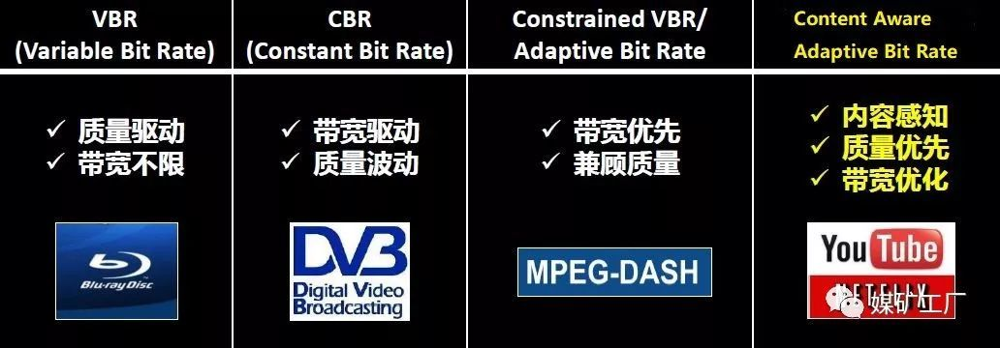
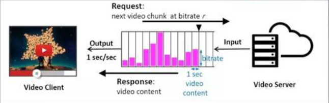
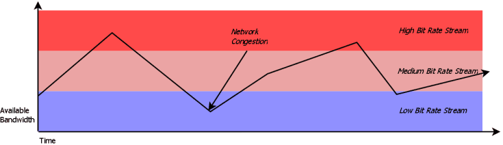
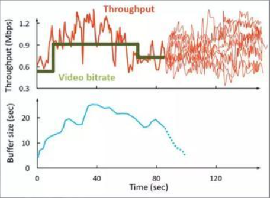
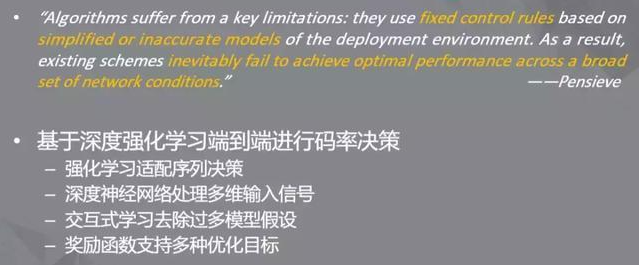
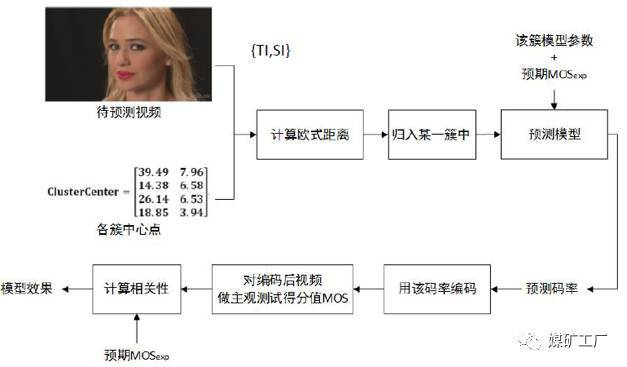
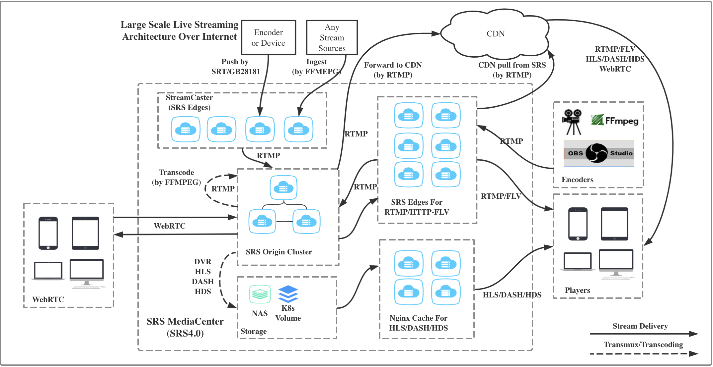

# 1 基本概念

   

## 1.1 流媒体

**流媒体**，又称流式媒体，是指采用流式传输的方式在 Internet/Intranet 播放的媒体格式，是将普通多媒体，如音频、视频、动画等，经过特殊编码，使其成为在网络中使用流式传输的连续时基媒体，以适应在网络上边下载边播放的方式。其具有 `连续性`、`实时性`、`时序性` 三个特点，在这个过程中，网络上传输的一系列相关的数据包称为流（Stream）。

通俗来讲，流媒体在播放前不会下载整个文件，只将开始部分存入内存，在用户访问时对数据包进行缓存，让媒体数据正确地输出，且流媒体数据流随时传送随时播放，只是在开始时有些延迟。

   

**特征：**

> 流媒体包括声音流、视频流、文本流、图像流、动画流等，在时间上连续的媒体数据。
>
> 1）流媒体具有较强的实时性和交互性，即传输数据时通常保持连贯性，保证数据连续性和实时性；
>
> 2）启动延迟大幅度降低：通过利用流媒体技术，用户侧的媒体启动时间大幅度缩短，用户不必像以往那样“等到所有媒体内容都下载完成后上才能浏览”，而是经过一段启动延时后，立即就能欣赏媒体内容。
>
> 3）与传统的媒体传输方式相比，流媒体技术对客户端（用户计算机）的缓存容量要求大大降低；
>
> **解释**：Internet 是以包传输为基础进行的异步传输，因此数据会被分解成许多包进行传输，由于每个数据包可能选择不同的路由（进行传输），所以这些数据包到达客户端（用户计算机）的时间延迟就会不同，因此在客户端就需要缓存系统来消减延迟和抖动的影响，以及保证接收到数据包的传输顺序的准确性。与传统的（完整）媒体传输方式相比，在流媒体文件的播放过程中，由于不再需要把所有的文件都放入缓存系统，因此对缓存容量的要求是很低的；
>
> 4）内容提供方可以将视频文件或是摄像头数据以**数据包**的方式，通过特定的协议传送到网络上供用户使用；
>
> 5）用户通过指定的协议对网络数据进行解释，还原成可显示的数据，显示给用户；
>
> 6）网络传输媒体文件时一般都会采用压缩算法对原始数据进行压缩，降低对网络带宽的依赖；
>
> 7）用户不必像非流式播放那样等到整个文件才可以播放，只需等到足够的启动数据，即可观看，其余数据将继续下载，直到播放完毕；

   

## 1.2 流式传输

> 背景：传统的网络传输音视频等多媒体信息的方式是完全下载后再播放，下载常常要花数分钟甚至数小时

   

而采用流媒体技术，就可实现流式传输，将声音、影像或动画由服务器向用户计算机进行连续、不间断传送，用户不必等到整个文件全部下载完毕，而只需经过几秒或十几秒的启动延时即可进行观看。当声音视频等在用户的机器上播放时，文件的剩余部分还会从服务器上继续下载。

> 如果将文件传输看作是一次接水的过程，过去的传输方式就像是对用户做了一个规定，必须等到一桶水接满才能使用它，这个等待的时间自然要受到水流量大小和桶的大小的影响。
>
> 而**流式传输**，就比如，打开水头龙，等待一小会儿，水就会源源不断地流出来，而且可以随接随用。因此，不管水流量的大小，也不管桶的大小，用户都可以随时用上水。从这个意义上看，流媒体这个词是非常形象的

<div align="center"></div>

   

流式传输定义很广泛，现在主要指通过网络传送媒体（如视频、音频）的技术总称，其特定含义为通过Internet 将影视节目传送到PC机。目前**实现流式传输有两种方法**：

> **实时流式传输（Realtime streaming）**：强调的是媒体传输的 “实时性”，比如：视频直播行业
>
> **顺序流式传输（progressive streaming）**：主要提现了流媒体技术的基本功能，“无需下载完整的媒体文件，即可欣赏媒体内容”

<div align="center"></div>

​     

### 1.2.1 顺序流式传输

> **涵义**：顺序下载，在下载文件的同时用户可观看在线媒体
>
> **特点**：
>
> * 在给定时刻，用户只能观看已下载的那部分，而不能跳到还未下载的前头部分，即用户只能观看已经下载完成的媒体内容，而不能直接观看未下载的部分。因此，用户会在一段延时后，才能看到服务器传送过来的媒体内容。
> * 与实时流式传输方式相比，顺序流式传输在传输期间 ***不根据用户连接的速度做调整***。由于标准的HTTP服务器（比如Nginx、Apache等）可发送这种形式的文件，也 ***不需要其他特殊协议***，它经常被称作 ***HTTP流式传输***

​    

由于顺序流式传输能够较好地保证节目的播放质量，因此比较适合在网站上发布的、可供用户点播的、高质量的视频，如片头、片尾和广告，由于该文件在播放前观看的部分是无损下载的，这种方法可保证电影播放的最终质量。这意味着用户在观看前，必须经历延迟，对较慢的连接尤其如此。

顺序流式文件是放在标准HTTP 或 FTP服务器上，易于管理，基本上与防火墙无关。但是顺序流式传输不适合长片段和有随机访问要求的视频，如：讲座、演说与演示，但**不支持现场广播**，严格说来，它是一种**点播技术。** 

   

### 1.2.2 实时流式传输

> **涵义**：指保证媒体信号带宽与网络连接匹配，使媒体可被用户实时观看到，可以解决顺序流式传输无法快进的问题
>
> **特点**：
>
> * 实时流与HTTP流式传输不同，需要专用的 `流媒体服务器` 与 `流媒体传输协议` 来传输视频
> * 实时流式传输总是实时传送，特别适合现场事件，同时也支持随机访问，用户可快进或后退以观看前面或后面的内容。但是在这种传输方式中，如果网络状况不理想，会导致收到的图像质量比较差。

​    

理论上，实时流一经播放就可不停止，但实际上可能发生周期暂停。实时流式传输必须配匹连接带宽，这意味着在以调制解调器速度连接时图象质量较差。而且，由于出错丢失的信息被忽略掉，网络拥挤或出现问题时，视频质量很差。如欲保证视频质量，顺序流式传输也许更好。

> 1）**特定服务器**：如 QuickTime Streaming Server、RealServer 与 Windows Media Server，这些服务器允许你对媒体发送进行更多级别的控制，因而系统设置、管理比标准HTTP服务器更复杂
>
> 2）**特殊网络协议**：如：RTSP (Realtime Streaming Protocol) 或 MMS (Microsoft Media Server)，这些协议在有防火墙时有时会出现问题，导致用户不能看到一些地点的实时内容

   

**传输过程：**

> 1）将原始的视频文件通过编码器转换为适合网络传输的流格式，编码后的视频直接输送给媒体服务器
>
> 2）媒体服务获取到编码好的视频文件，对外提供流媒体数据传输接口，接口协议包括 ：HTTP、RTSP、 RTMP等
>
> 3）播放器通过流媒体协议与媒体服务器通信，获取视频数据，播放视频

​    

## 1.3 CDN / 拉流 / 推流

> **CDN**：Content Delivery Network，第三⽅提供的⽹站资源加速下载或传输的⽹络，其原理是把同样的静态⽂件或者实时多媒体流同时发布到电信、移动、联通等运营商的⽹络内，⽅便⽤户就近下载实现更快、更稳定的传输速度
>
> **推流**：客户端采集的⾳视频数据，经过编码和⽹络传输，发送给流媒体服务器的过程，服务器可能是⾃⼰搭建的，也可能是CDN提供的
>
> **拉流**：客户端或者播放器从服务器下载（拉取）指定的媒体流并在本地播放的过程

   

# 2 流媒体组成

一个基本的**流媒体系统**必须包括 `编码器（Encoder）`、`流媒体服务器（Server）` 和 `客户端播放器（Player）` 三个组成部分，且各组成部分之间通过特定的协议互相通信，并按照特定格式互相交换文件数据

> 编码器：用于将原始的音/视频转换成合适的流格式文件
>
> 流媒体服务器：向客户端发送编码后的媒体流
>
> 客户端播放器：负责解码和播放接收到的媒体数据

​    

## 2.1 编码器Encoder

编码器的功能是对输入的原始音、视频信号进行压缩编码，且不同的流媒体业务，对编码器有不同的性能要求

常见音视频编码方案

> 视频编码方案：MPEG-4、H.264和 Microsoft公司的Windows Media Video采用的AC-1；
>
> 音频编码方案：MP3、MPEG-2、AAC、AMR和AMR-WB等

​    

注意：多媒体编码器所生成的码流只包含了解码该码流所必需的信息，**不包含媒体间的同步、随机访间等系统信息**，因此编码后的多媒体数据仍要被组织成为 `流媒体文件格式` 用于传输或存储。

   

## 2.2 流媒体服务器Server

流媒体服务器用来 **存储和控制流媒体数据**，并向客户端发送流媒体文件

流媒体服务器的主要功能有：

> 1）响应客户的请求，把媒体数据传送给客户。流媒体服务器在流媒体传送期间必须与客户的播放器保持双向通信（这种通信 是必需的，因为客户可能随时暂停或快放一个文件）
>
> 2）响应广播的同时能够及时处理新接收的实时广播数据，并将其编码
>
> 3）可提供其他额外功能，如数字权限管理（DRM）、插播广告、分割或镜像其他服务器的流，还有组播

​    

## 2.3 客户端播放器Player

音/视频数据包经网络传输到客户端后，先进入一个 **缓冲队列**等待，这个缓冲队列中的所有数据包按照包头的序列号排序，如果有迟到的包，则按序列号重新插入正确的位置上，这样就避免了乱序的问题。

客户端每次从队列头部读取一帧数据，从包头的时间标记中解出该帧的播放时间，然后进行音/视频同步处理。同步后的数据将送入解码器进行解码，解码后的数据被送人一个循环读取的缓冲中等待。一旦该帧的播放时间到达，就将解码数据从缓冲中取出，送入播放模块进行显示或播放。

​    

# 3 流媒体技术原理

流媒体的传输需要合适的传输协议，在Internet上进行的文件传输大部分都建立在TCP协议的基础上，也有一些是通过FTP进行传输，但采用这些传输协议都不能满足流媒体的实时传输要求。随着流媒体技术的深入研究，比较成熟的流媒体传输一般都是采用建立 **在UDP协议上的RTP/RTSP等实时传输协议**。

> Q：为何要在UDP而不在TCP上进行实时数据的传输呢？
>
> A：因为两者在数据传输的速度和可靠性方面有很大的区别
>
> * TCP协议中包含了专门的数据传送校验机制，当数据接收方收到数据后，会自动向发送方发出确认信息，发送方在接收到该确认信息后，才会继续传送数据，否则将一直处于等待状态；
>
> * 而UDP协议则不同，UDP协议本身并不做任何数据传输校验
>
> 由此可看出：**TCP协议注重传输质量，而UDP协议则注重传输速度**。因此，对于那些对传输质量要求不是很高，而对传输速度有很高要求的流媒体文件来说，采用UDP协议传输更为合适

​    

用户通过Web浏览器播放流媒体时，主要的交互过程如下：

```
1）用户选择流媒体服务后，Web浏览器与Web服务器之间使用 HTTP/TCP 交换控制信息，以便把需要传输的实时数据从原始信息中检索出来；
2）Web浏览器启动A/V Helper程序，使用 HTTP 从Web服务器检索相关参数，然后对Helper程序初始化。这些参数可能包括目录信息、A/V数据的编码类型，或与A/V检索相关的服务器地址；
3）A/V Helper程序及A/V服务器运行RTSP协议，以交换A/V传输所需的控制信息。与CD播放机或VCRs所提供的功能类似，RTSP提供了控制播放、快进、快倒、暂停及录制等命令的方法；
4）A/V服务器使用RTP/UDP协议，将A/V数据传输给A/V客户程序（一般可认为客户程序等同于A/V Helper程序）；
5）当A/V数据抵达客户端时，A/V客户程序即可播放A/V数据了
```

**注意**：在流媒体传输过程中，使用 RTP/UDP 和 RTSP/TCP 两种不同的通信协议与A/V服务器建立联系，是为了能够把服务器的输出重定向到一个不同于运行A/V Helper程序所在客户端的目的地址。实现流式传输一般都需要专用服务器和播放器。

​    

# 4 流媒体播放

从不同的角度来看，流媒体播放方式的含义不同：

​    

## 4.1 用户参与角度：点播和广播

> **点播**：指用户主动与服务器进行连接，发出选择节目内容的请求，服务器应用户请求将节目内容传输给用户。在播放过程中，用户可以对播放的流进行 `开始`、`停止`、`后退`、`快进` 或 `暂停` 流。点播连接提供了对流的最大控制，但这种方式由于每个客户端各自连接服务器，会迅速用完网络带宽。
>
> **广播** 或 **直播**：指的是媒体服务器主动发送流数据，用户被动接收流数据的方式。在广播过程中，**客户端只能接收流，但不能控制流**，例如用户不能进行暂停、快进或后退操作。这种方式类似于电台广播或电视直播，用户可选择频道接收所需的广播节目，但是在收听收看节目时，不能随意控制节目的播放流程，在有些流媒体产品中将此称为 **直播**

​    

## 4.2 服务器端传输数据方式：单播、广播和多播

目前IP协议支持 `单播`、`广播` 和 `多播（组播）` 3种地址类型，由于流媒体服务是在IP网络中实现的，因此流媒体在网上传输也有相应的三种方式

> **单播**：指在客户端与媒体服务器之间需要建立一个单独的数据通道，即从一台服务器发送的每个数据包只能传送给一个客户机。单播是一种典型的 **点对点传输方式** 。每个用户必须分别对媒体服务器发送单独的请求，而媒体服务器必须向每个用户发送所请求的数据包复制，每份数据复制都要经过网络传输，占用带宽和资源，如果请求的用户多起来，网络和服务器将不堪重负。
>
> **多播**：又称 `组播`，是一对多连接，多个客户端可以从服务器接收相同的流数据，即 **所有发出请求的客户端共享同一流数据** ，从而节省带宽资源。多播 **将一个数据流发送给多个客户端，而不是分别发送给每个客户端，客户端直接连接到多播流，而不是服务器**。采用这种方式，一台服务器甚至能够对数万台客户机同时发送连续的数据流，而无延时的现象发生。
>
> **广播**：在广播过程中，***数据包的单独一个复制将发送给网络上的所有用户***。不管用户是否需要，都进行广播传输，浪费了网络资源。为阻止广播风暴，一般将广播限制在一个子网中，流媒体传输中并不采用这种方式。这里的广播是指传输方式，而前面讲述的广播（直播）则指用户被动接收的播放方式。

在实际应用中，播放方式一般将上述方式结合起来，如 `点播单播`、`广播单播` 和 `广播多播`

​      

# 5 流媒体传输质量控制

**传输质量控制**是制约流媒体服务性能的最重要因素，主要包含以下几个：

> 1）**端到端的延迟**：包括 `传输时延`、`传播时延`、`排队时延`，它是影响流媒体质量最重要的因素之一，因此必须根据网络的负载情况，控制在一个合理的范围之内
>
> 2）**时延抖动**：是两个相邻分组的数据在网络传输过程中由于经过不同的网络延迟产生的。由于网络传输的不确定性，时延抖动是无法避免的，解决的方法通常是在接收端设置 **缓冲区**，在数据流到达后，并不立即播放，而是保存在缓冲区，等到规定播放时间到来才进行播放
>
> 3）**丢包率**：是指网络拥塞时，数据流没有及时到达接收端。这时丢失的数据包将直接影响到接收播放的质量，一般情况下，丢包率不得超过1%
>
> 4）**数据包的失序**：每个数据帧都有一个序列号，以标记在流中正确的序号。在网络传输过程中，由于数据包经过不同的线路或丢包等原因，致使数据的顺序发生变化。解决的方法也是在接收端设置 ***缓冲区***，将接收到的数据进行重新组合，恢复原来的顺序

​    

# 6 流媒体相关技术

流媒体是一种宽带业务，对于 `网络带宽`、`时延`、`延迟` 和 `丢包率` 都有较高要求，目前流媒体领域已经发展了几种较为成熟的带宽适应和质量控制技术。

​     

## 6.1 智能流技术

即自动检测网络状况，并将音/视频的属性调整到最佳，使用用户收到与其网络速度相符的媒体流，从而获取最佳的用户体验。智能流技术的实质，是通过c/s应用层的 ***速率反馈机制***  探测网络带宽变化，利用媒体流的多速率层次编码能力，在服务器端动态的调节媒体流的传输速率，以保证用户在网络带宽变化条件下仍能收到质量较好的媒体流。

> **注意**：智能流技术出现之前，`视频流瘦化` 方法以及 `带宽协调` 方法是解决流媒体传送速率的基本方法

   

目前现有视频码率技术：

<div align="center"></div>

​    

### 6.1.1 自适应码率技术 ABR

自适应码率一般来讲采用基于HTTP的DASH协议，基本运作流程是首先在CDN中存储已经按照不同码率编码好的视频块，客户端会不断向服务器请求某个码率下的视频块，每个视频块含有几秒钟的内容，服务器把视频传输给客户端，客户端会把视频块存在本地的缓冲区Buffer里。即ABR广泛地描述了这样一个过程：**视频和音频的质量和码率会根据当前网络状况的波动而发生自适应变化，以确保网络传输流畅**。

如下图中紫色的块可以认为是 **视频块**，持续时间是一秒，高度就是它的码率。在视频播放中，Buffer就会被实时消耗，如果此时你的下载速率与码率不匹配就会出现排空Buffer或者累计Buffer，当带宽远低于码率时会出现卡顿，于是各个播放器厂商都会考虑采用自适应码率来根据当前网络状况和Buffer长度来选择合适的码率去优化用户的体验质量（Quality of Experience），也就是QoE，即包括的指标一般有 `视频质量(启播时间/启播分辨率)`、`卡顿(时间点/时长/次数)` 和 `码率抖动` 等

<div align="center"></div>

**常规过程**：

> a）客户端根据当前的网络情况、播放缓冲区大小等因素决定下一个片段的码率档位；
>
> b）客户端执行码率决策向CDN服务器请求对应质量的视频片段；
>
> c）下载，下载的过程中视频缓冲区也同时在播放消耗；
>
> d）客户端进入另一种状态（播放缓冲区大小变化、是否卡顿等），且可以据此评价上一个动作的好坏，然后再重新进行新的决策；如此循环往复，直到结束。

​     

带宽的变化以及播放器请求的视频片段码率是如何适应带宽变化的示意图：

<div align="center"></div>

​    

#### 1）为什么需要ABR？

**举例：**

> 假设互联网带宽是10mbps，电视使用一个Cat 5网线直接连接到路由器上，当有三个手机、两个平板都连接在同一网络上，考虑一下所有设备都在同一时间连到同一互联网上，那它们需要消耗多少带宽？
>
> 假设看电视可能消耗了3mbps的带宽来播放节目，则当使用iPad打开YouTube观看节目，电视的可用带宽突然下降（也许下降到2mbps），即33%的下降（从3 mbps --> 2 mbps）！
>
> 现在最重要的问题来了：你的电视正在下载什么，以什么码率，质量呈现如何？如果你有一个单一的视频版本（Rendition, 指内容相同，但编码、分辨率、码率等不同的视频），会做什么样的选择？
>
> 让我们来反问内容提供商，为了满足不同家庭的不同带宽需求，他们应该以何种码率编码？
>
> 这基本是个不可能的任务：`提供单一版本的视频或者视频编码来满足所有用户的不同带宽需求和限制`

​    

根据ABR的工作原理，输入视频有多种版本（在不同码率、分辨率和帧率下），可以使用不同编解码器来满足大量带宽条件、屏幕尺寸和各种设备。因此，当拿到一个源视频，第一件事就是在不同版本或者配置文件下将其编码，从而形成码率阶梯。

比如，你可能要将视频在以下配置文件中进行编码（码率阶梯编码）：

> 1080p 5.0 mbps / 720p 4.0 mbps / 640p 3.2 mbps / 480p 2.0 mbps / 270p 1 mbps

​    

在这些配置文件中选择码率阶梯和编码后，将这些视频打包，然后通过使用视频流协议（如DASH、HLS、HDS和MSS等）的清单或者播放列表将视频提供给播放器，而后播放器（终端用户）使用这个清单来理解视频是如何下载并呈现给用户的

> 视频打包：是指将一个视频分割成多个小的片段（视频块），以便每个片段都能单独被交付或者传输给播放器，而不是一次下载整部电影

​    

假设视频按照上文中的码率阶梯编码，当播放器开始播放视频时，它感知到的可用带宽为20mbps（假设），这远大于最高码率5mbps，所以播放器可以安全地下载第一个最高码率为5mbps的视频片段（也许时长6秒钟）。然后播放器再次感知带宽，如果依然很高，那么它将再请求最高码率的视频片段。

但如果带宽突然下降到5mbps，播放器将向服务器请求码率为4mbps的视频片段，因为请求5mbps的片段会有风险，然后播放器会接收并播放4mbps的视频片段。这个过程会一直持续，直到将所有视频播放完。

​    

#### 2）ABR难点

假设现在有一个播放器已经播放了一段时间，视频的Throughput如下图所示，这时需要选择一个码率使得用户的QoE较高。有一种方式是 **对Throughput进行预测**，然后根据Throughput的变化选择一个与它接近或者比它低一点的码率，但在移动设备或者无线场景下，网络变化难以预测，这给ABR决策带来了挑战。

<div align="center"></div>

​    

**算法存在难点**：

a）QoE指标冲突（`高视频质量` & `低卡顿` & `视频质量平滑切换`）：视频质量越高视频块越大，所需的带宽越大，因此造成卡顿的概率越高，如果比较保守的选择低质量的视频块，虽然可以减少卡顿概率，但也会牺牲视频质量从而无法提高QoE

<div align="center"></div>

b）码率自适应调整（码率决策）具有 **累积效应**（级联效应）：前面的码率决策会影响到未来的码率的决策，换言之就是需要提前为某些Throughput的抖动变化预留一些Buffer，比如在某一时刻对Throughput的预测不是很好，选择了比较高的码率，如果网络发生抖动，在未来全部选择低码率也无法阻止这一次卡顿，所以这就需要ABR算法具有一定的前瞻性和预测性，即：

* 尽快响应网络变化；
* 做最优决策时能兼顾各个指标，包括 视频质量、卡顿时间、码率抖动

c）ABR算法跟随Throughput变化的速度会影响视频切换的频率，如果想让码率变化尽可能的平滑就需要用提前准备好的Buffer去处理未来可能会遇见的Throughput的低谷

d）模型简单：网速带宽变化&难以预测，导致网速预测误差大

​     

#### 3）ABR算法

下面主要简单介绍ABR相关算法

​    

##### a）传统ABR算法

> **Rate-based**：基于预测的吞吐量throughput去决策下一片段的码率档位，例如FESTIVE。这类方法的主要思想是 **通过历史视频分片下载期间的网络状况来预测未来的网络带宽**，进而驱动视频码率决策，例如预测带宽高时选择高码率视频，预测带宽低时选择低码率视频
>
> **Buffer-based**：基于客户端的播放缓冲区buffer情况决策下一片段的码率档位，例如BBA、BOLA
>
> * BBA（buffer-based approach）算法：基于buffer来进行码率决策，之所以选择buffer是因为 Throughput抖动非常大，很难对其进行预测。BBA的基本策略是 **在Buffer比较小的时候认为卡顿概率比较高，选择相对低的码率，Buffer比较大的时候卡顿概率比较低，可以选择相对高的码率，处于二者之间时会以某种线性函数或者其他对应关系将buffer长度映射到中间的码率**，来实现一种不依赖Throughput的解决方案。这个方案会出现Buffer比较小时相对保守，切换比较频繁的现象。
>
> **Hybrid**：混合模式（Rate + Buffer），同时考虑预测吞吐量和buffer信息决策下一片段的码率档位
>
> * 模型预测控制（Model Predictive Control, MPC）：基本逻辑是先**对客户端的播放逻辑进行简单建模**，建模的目标是可以利用throughput和buffer来判断选择不同码率下未来可以得到的QoE，从而可以利用这个模型对未来进行规划。虽然MPC结合了两者信息的算法可以获得相对较好的效果，但其非常**依赖于带宽预测信息**，在带宽变化剧烈的场景中，准确预测带宽是非常困难的。

​      

##### b）基于机器学习ABR算法

> **CS2P**：Cross-Session Stateful Prediction，基本逻辑是利用更好的Throughput预测来达到更好的码率选择，基本操作就是把Throughput预测拼到MPC方案，从而可解决MPC在Throughput预测不准的情况下会出现明显性能下降的问题，尤其是在Throughput进行快速抖动的情况下。CS2P利用隐马尔可夫模型进行带宽预测，可以认为是利用机器学习算法进行间接ABR决策的工作。
>
> 算法存在2个问题：
>
> * 1）算法的吞吐量具有 **某种状态转移特性**，关键特征相似的会话吞吐量特性相似，因此可对这些数据集中某一个时间段到另一个时间段的吞吐量转移进行了分析，发现其中确实具有明显的状态转移特性，这种特性可以考虑用隐马尔可夫模型去建模Throughput的变化；
>
> * 2）如果把所有session的Throughput信息都拿去训练同一个模型，就会导致这个模型变得很差，表征能力不强或者学到相对平均的结果以至于不能反映每一个子类的特性。为了解决这个问题，可以考虑利用关键特征对会话进行聚类，之后再针对每个类别训练单独的隐马尔可夫模型。
>
> Pensieve：即AI带来的更流畅的高质量观看体验，算法基于深度强化学习进行端到端码率决策的ABR算法
>
> <div align="center"></div>

​     

### 6.1.2 感知内容ABR优化技术

感知内容的ABR编码优化技术（Content Aware ABR），其研究更加关注 `视频用户体验` 以及 `计算`、`存储`、`带宽`等资源之间的平衡，突出了不同视频内容的差异性，针对不同视频类型量身打造了符合其内容特性的编码模式，兼顾了编码质量和带宽等资源的消耗。

目前，基于内容特性的ABR编码优化主要有以下思路：

> 1）基于一种符合人眼视觉特性的视频质量评价指标失真评价的测度（比如SSIM），以此作为编码优化的方向，使得编码后的视频在主观体验上更优，该方法主要用在RDO模式判决计算中；
>
> 2）多pass编码，通过预分析收集符合该视频内容特性的编码参数，缺点是复杂度过高；
>
> 3）根据预测模型分析源视频的内容特性，得到关键编码参数，该方法需要大量的训练数据集

​     

例如，下图展示了一种根据预测模型分析视频内容特性的自适应编码框架：

<div align="center"></div>

​    

## 6.2 分流技术Splitting

一般只在 **网络直播** 中使用，发送服务器通过 `UDP单播`、`UDP组播` 等方式将媒体流发送到分布在各地的多个接收服务器，客户端可以就近访问服务器获得较高质量的媒体流，同时减少带宽使用，其中发送服务器与接收服务器之间由高速链路连接。

   

分流技术分推（Push）和拉（Pull）两种模式：

> **推流** 为将直播内容推送至服务器的过程；
>
> **拉流** 为服务器已有直播内容，用指定地址进行拉取的过程。

   

## 6.3 缓存技术Caching

由于互联网是以断续的异步包传输为基础，一个实时媒体流或媒体文件在传输中将被分成多个包传输。由于网络的延时、抖动等因素，包到达客户端的顺序和延迟可能不一样，可能出现先发的包后到的情况，因此需要缓存系统来弥补网络延迟和抖动的影响，以保证数据包的顺序正确，以及不会因为网络暂时拥塞而出现播放停顿的现象。

缓存技术一般采用  `环形链表` 结构存储数据，丢弃已发送或已播放内容，防止缓存溢出，并利用空出的空间存储将要发送或将要播放的内容，所以一般缓存不会很大。

目前主要用到的缓存技术有 `正向缓存`、`反向缓存` 和 `透明代理` 缓存技术，微软Media Services 和RealSystem都提供服务器端和播放器端的缓存设定。

​    

## 6.4 内容分发网络技术CDN

CDN作为基础IP网络之上的一个内容叠加网，通过引入主动内容管理、全局负载均衡和内容缓存等技术，将用户请求的流媒体内容发布到距离用户最近的网络边缘，从而提高用户访间的响应速度，并有效解决网络拥塞，最大限度地减轻骨干网络流量。CDN为在WAN或MAN范围开展流媒体业务提供了有效的QoS保证。

[详情>>](./3.CDN和PCDN.md)

   

## 6.5 流媒体传输协议

常用的流媒体协议主要有 `HTTP渐进下载` 和 `基于RTSP/RTP的实时流媒体协议` 两类，在流式传输的实现方案中，一般采用HTTP/TCP来传输控制信息，而用RTP/UDP来传输实时多媒体数据。


篇幅关系，[协议可参考>>]("./4.流媒体传输协议.md")

​    


# 7 流媒体技术应用

internet的不断发展决定了流媒体应用广阔的市场前景，目前流媒体技术及其相关产品将广泛用于 `远程教育`、`网络电台`、`视频点播`、`收费播放` 等。其次，流媒体技术在企业一级的可能应用包括电子商务、远程培训、视频会议、客户支持等。

​    

## 7.1 视频播出(streaming video)

娱乐是流媒体的重要应用场合

用摄像机或其它装置获得视频信号后，就可以通过站点进行基于internet的现场直播，或者保存为流媒体格式的文件，以供按需播放。需要在一台较高配置的pc机或服务器上安装上普通视频采集卡和声卡，然后通过视频采集卡输入视频和通过声卡输入声音信号就可以用实时编码工具来进行直播或录制成流媒体文件。在这种应用中可加入一定的计费手段，从而能够提供有偿多媒体内容服务。

​    

## 7.2 远程教学(remote seminar)

远程教学将为更多的人提供接受教育的机会

教学者事先在internet/intranet上发出通知，听众在讲座开始前访问某个url地址，当讲座开始时，听众可以看到演讲者的演讲画面并听到他的声音。整个讲座也可以媒体文件的形式记录下来，用于以后按需播放。教学者事先把媒体文件传给远程教学服务器,当听众需要听讲座时，同样访问相应的url地址，请求获取服务器中的媒体内容。媒体数据通过流式传输下载到用户的浏览器高速缓存中，由媒体播放器实时回放。

   

## 7.3 视频会议(video conference)

视频会议和远程教学有很多类似之处，但它对实时性的要求更高

在一个视频会议中，各个会议点用音/视频采集设备得到多媒体内容信息，经过数字化后用某种压缩方法进行压缩。压缩数据可以通过网络直接在各个会议点之间组播，或传到多点处理器(mp)经过合成或转换后再向各与会点组播。但不管采用哪种方式，都需要保证以尽量小的时延在各个点进行回放，这正是流媒体技术发挥作用的地方。

​    

## 7.4 直播RTMP 

下面简单介绍直播中的流媒体技术实现

<div align="center"></div>

​    

### 7.4.1 流媒体直播协议

> **RTMP**：Real Time Messaging Protocol（实时消息传输协议），该协议基于TCP，是一个协议族，包括 `RTMP基本协议`、`RTMPT`、`RTMPS`、`RTMPE` 等多种变种。
>
> * RTMP是一种设计用来进行实时数据通信的网络协议，主要用来在Flash/AIR平台和支持RTMP协议的流媒体/交互服务器之间进行音视频和数据通信
> * RTMP 基于 flash 无法在 iOS 的浏览器里播放，但是实时性比 HLS 要好
>
> **HLS**：HTTP Live Streaming（HTTP直播流技术），Apple的动态码率自适应技术，主要用于PC和Apple终端的音视频服务。包括一个m3u(8)的索引文件，TS媒体分片文件和key加密串文件。

​    

### 7.4.2 直播模块

> **视频录制端**：一般是电脑上的音视频输入设备或者手机端的摄像头或者麦克风，目前以移动端的手机视频为主
>
> * 技术：webRTC
> * 用途：H5视频录制
>
> **视频播放端**：可以是电脑上的播放器，手机端的 Native 播放器，还有就是 H5 的 video 标签等，目前还是已手机端的 Native 播放器为主
>
> * 技术：HLS协议或RTMP协议（用途：视频播放）、ffmpeg
>
>   用途：使用RTMP协议时进行移动端视频解码
>
> **视频服务器端**：一般是一台 nginx 服务器，用来接受视频录制端提供的视频源，同时提供给视频播放端流服务
>
> * 技术：RTMP协议（用途：上传视频流）、nginx rtmp-module或SRS(simple-rtmp-server)
> * 用途：流服务器

​    

## 7.5 直播技术方案

直播中常使用的协议有这几种：

> RTMP 、WebRTC、HLS、HTTP-FLV、Dash(or MPEG-Dash)、SRT(该协议较新)

列举出这几种协议，并非意味着在一个直播技术架构中 WebRTC（或 RTMP ...） 就是唯一使用的协议 。 在一个直播技术架构图中，使用多种协议，例如推流端用一个协议，拉流端用另一个协议是很正常的。 甚至在主播连麦场景下，主播和对面主播、主播和观众的流媒体传输协议也可能是不同的

如下图是 SRS（Simple RTMP Server）的一个技术全景图，就可以很好地说明上面的论述 ：

<div align="center"></div>

​     

# 附录


## 基础

1. [流媒体技术概述](https://blog.csdn.net/weixin_43166958/article/details/89947841)
2. [流媒体传输的网络协议有哪些](https://www.gaojipro.com/a/23920)
3. [流媒体协议介绍（rtp/rtcp/rtsp/rtmp/mms/hls）](https://github.com/0voice/audio_video_streaming/blob/main/article/008-%E6%B5%81%E5%AA%92%E4%BD%93%E5%8D%8F%E8%AE%AE%E4%BB%8B%E7%BB%8D.md)


## ABR

1. [机器学习在ABR算法中的应用纵览](https://zhuanlan.zhihu.com/p/81305669)
2. [理解ABR及其工作原理](https://posts.careerengine.us/p/619c30743f08662ba0132392)
3. [【视频编码】 Content Aware ABR技术](https://cloud.tencent.com/developer/article/1051262)


