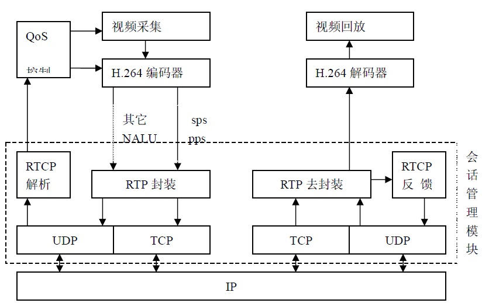

# 1 基本概念


## 1.1 流媒体

**流媒体**，又称流式媒体，是指采用流式传输的方式在 Internet/Intranet 播放的媒体格式，是将普通多媒体，如音频、视频、动画等，经过特殊编码，使其成为在网络中使用流式传输的连续时基媒体，以适应在网络上边下载边播放的方式。其具有 `连续性`、`实时性`、`时序性` 三个特点，在这个过程中，网络上传输的一系列相关的数据包称为流（Stream）。

通俗来讲，流媒体在播放前不会下载整个文件，只将开始部分存入内存，在用户访问时对数据包进行缓存，让媒体数据正确地输出，且流媒体数据流随时传送随时播放，只是在开始时有些延迟。


**特征：**

> 流媒体包括声音流、视频流、文本流、图像流、动画流等，在时间上连续的媒体数据。
>
> 1）流媒体具有较强的实时性和交互性；
>
> 2）启动延迟大幅度降低：通过利用流媒体技术，用户侧的媒体启动时间大幅度缩短，用户不必像以往那样“等到所有媒体内容都下载完成后上才能浏览”，而是经过一段启动延时后，立即就能欣赏媒体内容。
>
> 3）与传统的媒体传输方式相比，流媒体技术对客户端（用户计算机）的缓存容量要求大大降低；
>
> **解释**：Internet 是以包传输为基础进行的异步传输，因此数据会被分解成许多包进行传输，由于每个数据包可能选择不同的路由（进行传输），所以这些数据包到达客户端（用户计算机）的时间延迟就会不同，因此在客户端就需要缓存系统来消减延迟和抖动的影响，以及保证接收到数据包的传输顺序的准确性。与传统的（完整）媒体传输方式相比，在流媒体文件的播放过程中，由于不再需要把所有的文件都放入缓存系统，因此对缓存容量的要求是很低的。


## 1.2 流式传输

> 背景：传统的网络传输音视频等多媒体信息的方式是完全下载后再播放，下载常常要花数分钟甚至数小时


而采用流媒体技术，就可实现流式传输，将声音、影像或动画由服务器向用户计算机进行连续、不间断传送，用户不必等到整个文件全部下载完毕，而只需经过几秒或十几秒的启动延时即可进行观看。当声音视频等在用户的机器上播放时，文件的剩余部分还会从服务器上继续下载。

> 如果将文件传输看作是一次接水的过程，过去的传输方式就像是对用户做了一个规定，必须等到一桶水接满才能使用它，这个等待的时间自然要受到水流量大小和桶的大小的影响。
>
> 而**流式传输**，就比如，打开水头龙，等待一小会儿，水就会源源不断地流出来，而且可以随接随用。因此，不管水流量的大小，也不管桶的大小，用户都可以随时用上水。从这个意义上看，流媒体这个词是非常形象的

<div align="center"></div>


流式传输定义很广泛，现在主要指通过网络传送媒体（如视频、音频）的技术总称，其特定含义为通过Internet 将影视节目传送到PC机。目前**实现流式传输有两种方法**：

> 实时流式传输（Realtime streaming）：强调的是媒体传输的 “实时性”，比如：视频直播行业
>
> 顺序流式传输（progressive streaming）：主要提现了流媒体技术的基本功能，“无需下载完整的媒体文件，即可欣赏媒体内容”

<div align="center"></div>


### 1.2.1 顺序流式传输

> **涵义**：顺序下载，在下载文件的同时用户可观看在线媒体
>
> **特点**：
>
> * 在给定时刻，用户只能观看已下载的那部分，而不能跳到还未下载的前头部分，即用户只能观看已经下载完成的媒体内容，而不能直接观看未下载的部分。因此，用户会在一段延时后，才能看到服务器传送过来的媒体内容。
> * 与实时流式传输方式相比，顺序流式传输在传输期间 ***不根据用户连接的速度做调整***。由于标准的HTTP服务器（比如Nginx、Apache等）可发送这种形式的文件，也 ***不需要其他特殊协议***，它经常被称作 ***HTTP流式传输***


由于顺序流式传输能够较好地保证节目的播放质量，因此比较适合在网站上发布的、可供用户点播的、高质量的视频，如片头、片尾和广告，由于该文件在播放前观看的部分是无损下载的，这种方法可保证电影播放的最终质量。这意味着用户在观看前，必须经历延迟，对较慢的连接尤其如此。

顺序流式文件是放在标准HTTP 或 FTP服务器上，易于管理，基本上与防火墙无关。但是顺序流式传输不适合长片段和有随机访问要求的视频，如：讲座、演说与演示，但**不支持现场广播，严格说来，它是一种点播技术。** 


### 1.2.2 实时流式传输

> **涵义**：指保证媒体信号带宽与网络连接匹配，使媒体可被用户实时观看到，可以解决顺序流式传输无法快进的问题
>
> **特点**：
>
> * 实时流与HTTP流式传输不同，需要专用的 `流媒体服务器` 与 `流媒体传输协议` 来传输视频
> * 实时流式传输总是实时传送，特别适合现场事件，同时也支持随机访问，用户可快进或后退以观看前面或后面的内容。但是在这种传输方式中，如果网络状况不理想，会导致收到的图像质量比较差。


理论上，实时流一经播放就可不停止，但实际上可能发生周期暂停。实时流式传输必须配匹连接带宽，这意味着在以调制解调器速度连接时图象质量较差。而且，由于出错丢失的信息被忽略掉，网络拥挤或出现问题时，视频质量很差。如欲保证视频质量，顺序流式传输也许更好。

> 1）**特定服务器**：如 QuickTime Streaming Server、RealServer 与 Windows Media Server，这些服务器允许你对媒体发送进行更多级别的控制，因而系统设置、管理比标准HTTP服务器更复杂
>
> 2）**特殊网络协议**：如：RTSP (Realtime Streaming Protocol) 或 MMS (Microsoft Media Server)，这些协议在有防火墙时有时会出现问题，导致用户不能看到一些地点的实时内容


**传输过程：**

> 1）将原始的视频文件通过编码器转换为适合网络传输的流格式，编码后的视频直接输送给媒体服务器
>
> 2）媒体服务获取到编码好的视频文件，对外提供流媒体数据传输接口，接口协议包括 ：HTTP、RTSP、 RTMP等
>
> 3）播放器通过流媒体协议与媒体服务器通信，获取视频数据，播放视频


### 1.2.3 CND / 拉流 / 推流

> **CDN**：Content Delivery Network，第三⽅提供的⽹站资源加速下载或传输的⽹络，其原理是把同样的静态⽂件或者实时多媒体流同时发布到电信、移动、联通等运营商的⽹络内，⽅便⽤户就近下载实现更快、更稳定的传输速度
>
> **推流**：客户端采集的⾳视频数据，经过编码和⽹络传输，发送给流媒体服务器的过程，服务器可能是⾃⼰搭建的，也可能是CDN提供的
>
> **拉流**：客户端或者播放器从服务器下载（拉取）指定的媒体流并在本地播放的过程


# 2 流媒体组成

一个基本的流媒体系统必须包括 `编码器（Encoder）`、`流媒体服务器（Server）` 和 `客户端播放器（Player）` 三个组成部分，且各组成部分之间通过特定的协议互相通信，并按照特定格式互相交换文件数据

> 编码器：用于将原始的音/视频转换成合适的流格式文件
>
> 流媒体服务器：向客户端发送编码后的媒体流
>
> 客户端播放器：负责解码和播放接收到的媒体数据


## 2.1 编码器Encoder

编码器的功能是对输入的原始音、视频信号进行压缩编码，且不同的流媒体业务，对编码器有不同的性能要求

常见音视频编码方案

> 视频编码方案：MPEG-4、H.264和 Microsoft公司的Windows Media Video采用的AC-1；
>
> 音频编码方案：MP3、MPEG-2、AAC、AMR和AMR-WB等


注意：多媒体编码器所生成的码流只包含了解码该码流所必需的信息，**不包含媒体间的同步、随机访间等系统信息**，因此编码后的多媒体数据仍要被组织成为 `流媒体文件格式` 用于传输或存储。


## 2.2 流媒体服务器Server

流媒体服务器用来 **存储和控制流媒体数据**，并向客户端发送流媒体文件

流媒体服务器的主要功能有：

> 1）响应客户的请求，把媒体数据传送给客户。流媒体服务器在流媒体传送期间必须与客户的播放器保持双向通信（这种通信 是必需的，因为客户可能随时暂停或快放一个文件）
>
> 2）响应广播的同时能够及时处理新接收的实时广播数据，并将其编码
>
> 3）可提供其他额外功能，如数字权限管理（DRM）、插播广告、分割或镜像其他服务器的流，还有组播


## 2.3 客户端播放器Player

音/视频数据包经网络传输到客户端后，先进入一个 **缓冲队列**等待，这个缓冲队列中的所有数据包按照包头的序列号排序，如果有迟到的包，则按序列号重新插入正确的位置上，这样就避免了乱序的问题。

客户端每次从队列头部读取一帧数据，从包头的时间标记中解出该帧的播放时间，然后进行音/视频同步处理。同步后的数据将送入解码器进行解码，解码后的数据被送人一个循环读取的缓冲中等待。一旦该帧的播放时间到达，就将解码数据从缓冲中取出，送入播放模块进行显示或播放。


# 3 流媒体技术原理

流媒体的传输需要合适的传输协议，在Internet上进行的文件传输大部分都建立在TCP协议的基础上，也有一些是通过FTP进行传输，但采用这些传输协议都不能满足流媒体的实时传输要求。随着流媒体技术的深入研究，比较成熟的流媒体传输一般都是采用建立 **在UDP协议上的RTP/RTSP等实时传输协议**。

> Q：为何要在UDP而不在TCP上进行实时数据的传输呢？
>
> A：因为两者在数据传输的速度和可靠性方面有很大的区别
>
> * TCP协议中包含了专门的数据传送校验机制，当数据接收方收到数据后，会自动向发送方发出确认信息，发送方在接收到该确认信息后，才会继续传送数据，否则将一直处于等待状态；
>
> * 而UDP协议则不同，UDP协议本身并不做任何数据传输校验
>
> 由此可看出：TCP协议注重传输质量，而UDP协议则注重传输速度。因此，对于那些对传输质量要求不是很高，而对传输速度有很高要求的流媒体文件来说，采用UDP协议传输更为合适


用户通过Web浏览器播放流媒体时，主要的交互过程如下：

```
1）用户选择流媒体服务后，Web浏览器与Web服务器之间使用 HTTP/TCP 交换控制信息，以便把需要传输的实时数据从原始信息中检索出来；
2）Web浏览器启动A/V Helper程序，使用 HTTP 从Web服务器检索相关参数，然后对Helper程序初始化。这些参数可能包括目录信息、A/V数据的编码类型，或与A/V检索相关的服务器地址；
3）A/V Helper程序及A/V服务器运行RTSP协议，以交换A/V传输所需的控制信息。与CD播放机或VCRs所提供的功能类似，RTSP提供了控制播放、快进、快倒、暂停及录制等命令的方法；
4）A/V服务器使用RTP/UDP协议，将A/V数据传输给A/V客户程序（一般可认为客户程序等同于A/V Helper程序）；
5）当A/V数据抵达客户端时，A/V客户程序即可播放A/V数据了
```

**注意**：在流媒体传输过程中，使用 RTP/UDP 和 RTSP/TCP 两种不同的通信协议与A/V服务器建立联系，是为了能够把服务器的输出重定向到一个不同于运行A/V Helper程序所在客户端的目的地址。实现流式传输一般都需要专用服务器和播放器。


# 4 流媒体播放

从不同的角度来看，流媒体播放方式的含义不同：


## 4.1 用户参与角度：点播和广播

> **点播**：指用户主动与服务器进行连接，发出选择节目内容的请求，服务器应用户请求将节目内容传输给用户。在播放过程中，用户可以对播放的流进行 `开始`、`停止`、`后退`、`快进` 或 `暂停` 流。点播连接提供了对流的最大控制，但这种方式由于每个客户端各自连接服务器，会迅速用完网络带宽。
>
> **广播**：指的是媒体服务器主动发送流数据，用户被动接收流数据的方式。在广播过程中，**客户端只能接收流，但不能控制流**，例如用户不能进行暂停、快进或后退操作。这种方式类似于电台广播或电视直播，用户可选择频道接收所需的广播节目，但是在收听收看节目时，不能随意控制节目的播放流程，在有些流媒体产品中将此称为 **直播**


## 4.2 服务器端传输数据方式：单播、广播和多播

目前IP协议支持 `单播`、`广播` 和 `多播（组播）` 3种地址类型，由于流媒体服务是在IP网络中实现的，因此流媒体在网上传输也有相应的三种方式

> **单播**：指在客户端与媒体服务器之间需要建立一个单独的数据通道，即从一台服务器发送的每个数据包只能传送给一个客户机。单播是一种典型的 **点对点传输方式** 。每个用户必须分别对媒体服务器发送单独的请求，而媒体服务器必须向每个用户发送所请求的数据包复制，每份数据复制都要经过网络传输，占用带宽和资源，如果请求的用户多起来，网络和服务器将不堪重负。
>
> **多播**：又称 `组播`，是一对多连接，多个客户端可以从服务器接收相同的流数据，即 **所有发出请求的客户端共享同一流数据** ，从而节省带宽资源。多播 **将一个数据流发送给多个客户端，而不是分别发送给每个客户端，客户端直接连接到多播流，而不是服务器**。采用这种方式，一台服务器甚至能够对数万台客户机同时发送连续的数据流，而无延时的现象发生。
>
> **广播**：在广播过程中，***数据包的单独一个复制将发送给网络上的所有用户***。不管用户是否需要，都进行广播传输，浪费了网络资源。为阻止广播风暴，一般将广播限制在一个子网中，流媒体传输中并不采用这种方式。这里的广播是指传输方式，而前面讲述的广播（直播）则指用户被动接收的播放方式。

在实际应用中，播放方式一般将上述方式结合起来，如 `点播单播`、`广播单播` 和 `广播多播`


# 5 流媒体传输质量控制

**传输质量控制**是制约流媒体服务性能的最重要因素，主要包含以下几个：

> 1）**端到端的延迟**：包括 `传输时延`、`传播时延`、`排队时延`，它是影响流媒体质量最重要的因素之一，因此必须根据网络的负载情况，控制在一个合理的范围之内
>
> 2）**时延抖动**：是两个相邻分组的数据在网络传输过程中由于经过不同的网络延迟产生的。由于网络传输的不确定性，时延抖动是无法避免的，解决的方法通常是在接收端设置 **缓冲区**，在数据流到达后，并不立即播放，而是保存在缓冲区，等到规定播放时间到来才进行播放
>
> 3）**丢包率**：是指网络拥塞时，数据流没有及时到达接收端。这时丢失的数据包将直接影响到接收播放的质量，一般情况下，丢包率不得超过1%
>
> 4）**数据包的失序**：每个数据帧都有一个序列号，以标记在流中正确的序号。在网络传输过程中，由于数据包经过不同的线路或丢包等原因，致使数据的顺序发生变化。解决的方法也是在接收端设置 ***缓冲区***，将接收到的数据进行重新组合，恢复原来的顺序


# 6 流媒体相关技术

流媒体是一种宽带业务，对于 `网络带宽`、`时延`、`延迟` 和 `丢包率` 都有较高要求，目前流媒体领域已经发展了几种较为成熟的带宽适应和质量控制技术。


## 6.1 智能流技术

即自动检测网络状况，并将音/视频的属性调整到最佳，使用用户收到与其网络速度相符的媒体流，从而获取最佳的用户体验。智能流技术的实质，是通过c/s应用层的 ***速率反馈机制***  探测网络带宽变化，利用媒体流的多速率层次编码能力，在服务器端动态的调节媒体流的传输速率，以保证用户在网络带宽变化条件下仍能收到质量较好的媒体流。

> **注意**：智能流技术出现之前，`视频流瘦化` 方法以及 `带宽协调` 方法是解决流媒体传送速率的基本方法


## 6.2 分流技术Splitting

一般只在 **网络直播** 中使用，发送服务器通过 `UDP单播`、`UDP组播` 等方式将媒体流发送到分布在各地的多个接收服务器，客户端可以就近访问服务器获得较高质量的媒体流，同时减少带宽使用，其中发送服务器与接收服务器之间由高速链路连接。


分流技术分推（Push）和拉（Pull）两种模式：

> **推流** 为将直播内容推送至服务器的过程；
>
> **拉流** 为服务器已有直播内容，用指定地址进行拉取的过程。


## 6.3 缓存技术Caching

由于互联网是以断续的异步包传输为基础，一个实时媒体流或媒体文件在传输中将被分成多个包传输。由于网络的延时、抖动等因素，包到达客户端的顺序和延迟可能不一样，可能出现先发的包后到的情况，因此需要缓存系统来弥补网络延迟和抖动的影响，以保证数据包的顺序正确，以及不会因为网络暂时拥塞而出现播放停顿的现象。

缓存技术一般采用  `环形链表` 结构存储数据，丢弃已发送或已播放内容，防止缓存溢出，并利用空出的空间存储将要发送或将要播放的内容，所以一般缓存不会很大。

目前主要用到的缓存技术有 `正向缓存`、`反向缓存` 和 `透明代理` 缓存技术，微软Media Services 和RealSystem都提供服务器端和播放器端的缓存设定。


## 6.4 内容分发网络技术CDN

CDN作为基础IP网络之上的一个内容叠加网，通过引入主动内容管理、全局负载均衡和内容缓存等技术，将用户请求的流媒体内容发布到距离用户最近的网络边缘，从而提高用户访间的响应速度，并有效解决网络拥塞，最大限度地减轻骨干网络流量。CDN为在WAN或MAN范围开展流媒体业务提供了有效的QoS保证。

[详情>>](./3.CDN和PCDN.md)


## 6.5 流媒体传输协议

常用的流媒体协议主要有 `HTTP渐进下载` 和 `基于RTSP/RTP的实时流媒体协议` 两类，在流式传输的实现方案中，一般采用HTTP/TCP来传输控制信息，而用RTP/UDP来传输实时多媒体数据。


### 6.5.1 实时传输协议RTP

**RTP（Real-time Transport Protocol）**协议是用于Internet上针对多媒体数据流的一种传输层协议，详细说明了在互联网上传递音频和视频的标准数据包格式。RTP协议常用于流媒体系统（配合RTCP协议）、视频会议和一键通（Push to Talk）系统（配合H.323或SIP），使它成为IP电话产业的技术基础。***RTP协议和RTP控制协议RTCP一起使用，而且它是建立在UDP协议上的***，以利用UDP的复用和求和校验功能。RTP是在两个主机之间提供基于连接的、稳定的数据流，而UDP是在网络上提供一种非连接数据报服务。

RTP是一种基于包的传输协议，它用来传输实时数据。在网络上传输数据包的延迟和误差是不可避免的，对此RTP包头包含 `时间戳`、`丢失保护`、`载荷标识`、`源标识` 和 `安全性` 信息，这些信息用于在应用层实现数据包丢失恢复、拥塞控制等。


**协议特征**：

> RTP 本身并没有提供按时发送机制或其它服务质量（QoS）保证，它依赖于低层服务去实现这一过程；
>
> RTP 并不保证传送或防止无序传送，也不确定底层网络的可靠性。；
>
> RTP 实行有序传送， RTP 中的序列号允许接收方重组发送方的包序列，同时序列号也能用于决定适当的包位置，例如：在视频解码中，就不需要顺序解码
>
> RTP 由两个紧密链接部分组成： 
>
> * RTP ― 传送具有实时属性的数据；
> * RTP 控制协议（RTCP） ― 监控服务质量并传送正在进行的会话参与者的相关信息


### 6.5.2 实时传输控制协议RTCP

**实时传输控制协议**（Real-time Transport Control Protocol 或 RTP Control Protocol 或 RTCP）是实时传输协议（RTP）的一个姐妹协议

> RTCP为RTP媒体流提供信道外（out-of-band）控制
>
> RTCP本身并不传输数据，但和RTP一起协作将多媒体数据打包和发送
>
> RTCP定期在流多媒体会话参加者之间传输控制数据
>
> RTCP的主要功能是为RTP所提供的服务质量（Quality of Service）提供反馈


RTCP收集相关媒体连接的统计信息，例如：`传输字节数`、`传输分组数`、`丢失分组数`、`jitter`、`单向和双向网络延迟`等等。网络应用程序可以利用RTCP所提供的信息试图提高服务质量，比如 限制信息流量或改用压缩比较小的编解码器，但RTCP本身不提供数据加密或身份认证，而SRTCP可以用于此类用途。


### 6.5.3 安全实时传输协议 SRTP & SRTCP

**安全实时传输协议**（Secure Real-time Transport Protocol或SRTP）是在实时传输协议（Real-time Transport Protocol或RTP）基础上所定义的一个协议，旨在为 ***单播和多播应用程序中的实时传输协议的数据提供加密、消息认证、完整性保证和重放保护*** 。它是由David Oran（思科）和Rolf Blom（爱立信）开发的，并最早由IETF于2004年3月作为RFC3711发布。

由于实时传输协议和可以被用来控制实时传输协议的会话的实时传输控制协议（RTP Control Protocol或RTCP）有着紧密的联系，安全实时传输协议同样也有一个伴生协议，它被称为 **安全实时传输控制协议（Secure RTCP或SRTCP**）；安全实时传输控制协议为实时传输控制协议提供类似的与安全有关的特性，就像安全实时传输协议为实时传输协议提供的那些一样。

在使用实时传输协议或实时传输控制协议时，使不使用安全实时传输协议或安全实时传输控制协议是可选的；但即使使用了安全实时传输协议或安全实时传输控制协议，所有它们提供的特性（如加密和认证）也都是可选的，这些特性可以被独立地使用或禁用。唯一的例外是在使用安全实时传输控制协议时，必须要用到其**消息认证**特性。


### 6.5.4 实时流协议RTSP

RTSP协议定义了一对多应用程序如何有效地通过IP网络传送多媒体数据，且RTSP提供了一个可扩展框架，使实时数据，如**音频与视频的受控、点播**成为可能。数据源包括现场数据与存储在剪辑中的数据。该协议目的***在于控制多个数据发送连接，为选择发送通道，如UDP、多播UDP与TCP提供途径***，并为选择基于RTP上发送机制提供方法。RTSP在体系结构上位于RTP和RTCP之上，它使用TCP或RTP完成数据传输。

RTSP（Real Time Streaming Protocol）是用来控制声音或影像的多媒体串流协议，并允许同时多个串流需求控制，传输时所用的网络通讯协定并不在其定义的范围内，服务器端可以自行选择使用TCP或UDP来传送串流内容，它的语法和运作跟HTTP 1.1类似，但并不特别强调时间同步，所以比较能容忍网络延迟。而前面提到的允许同时多个串流需求控制（Multicast），除了可以降低服务器端的网络用量，更进而支持多方视讯会议（Video Conference）。 因为与HTTP1.1的运作方式相似，所以代理服务器《Proxy》的快取功能《Cache》也同样适用于RTSP，并因RTSP具有重新导向功能，可视实际负载情况来转换提供服务的服务器，以避免过大的负载集中于同一服务器而造成延迟。

<div align="center"></div>


#### 1）RTSP与RTP关系

RTP不像http和ftp可完整的下载整个影视文件，它是**以固定的数据率在网络上发送数据，客户端也是按照这种速度观看影视文件**，当影视画面播放过后，就不可以再重复播放，除非重新向服务器端要求数据。

RTSP与RTP最大的区别在于：

> RTSP是一种双向实时数据传输协议，它允许客户端向服务器端发送请求，如回放、快进、倒退等操作
>
> 当然RTSP可基于RTP来传送数据，还可以选择 `TCP`、`UDP`、`组播UDP` 等通道来发送数据，具有很好的扩展性。它是一种类似于HTTP协议的网络应用协议。


应用实现：服务器端实时采集、编码并发送两路视频，客户端接收并显示两路视频。由于客户端不必对视频数据做任何回放、倒退等操作，可直接采用UDP+RTP+组播实现。


#### 2）RTSP和HTTP比较

RTSP和HTTP所提供的的服务相同，RTSP是以 **音视频流** 的形式，HTTP以**文本和图形**的形式

> HTTP传送HTML，而RTP传送的是多媒体数据
>
> RTSP兼容的视频服务器必须维持会话状态，以将RTSP请求和流关联起来
>
> HTTP请求是一个不对称协议（由客户机发出，服务器做出响应）；RTSP可以是双向的，即客户机和服务器都可以发出请求

<div align="center"></div>


### 6.5.5 资源预定协议RSVP

RSVP即资源预订协议，使用RSVP预留一部分网络资源（即带宽），能在一定程度上为流媒体的传输提供QoS。**RSVP、RTSP与RTP协议工作在不同的层次**，如下图所示：

<div align="center"></div>


### 6.5.6 会话描述协议SDP

**会话描述协议**（Session Description Protocol, SDP）为会话通知、会话邀请和其它形式的多媒体会话初始化等目的提供了多媒体会话描述。 会话目录用于协助多媒体会议的通告，并为会话参与者传送相关设置信息。

> SDP 即用于将这种信息传输到接收端
>
> SDP 完全是一种会话描述格式，它不属于传输协议 ，只使用不同的适当的传输协议，包括 `会话通知协议（SAP）`、`会话初始协议（SIP）`、`实时流协议（RTSP）`、`MIME 扩展协议的电子邮件` 以及 `超文本传输协议（HTTP）`

SDP 的设计宗旨是通用性，它可以应用于大范围的网络环境和应用程序，而不仅仅局限于组播会话目录，但 SDP 不支持会话内容或媒体编码的协商。在因特网组播骨干网（Mbone）中，会话目录工具被用于通告多媒体会议，并为参与者传送会议地址和参与者所需的会议特定工具信息，这由 SDP 完成。SDP 连接好会话后，传送足够的信息给会话参与者。SDP 信息发送利用了会话通知协议（SAP），它周期性地组播通知数据包到已知组播地址和端口处。这些信息是 UDP 数据包，其中包含 SAP 协议头和文本有效载荷（text payload）。这里文本有效载荷指的是 SDP 会话描述。此外信息也可以通过电子邮件或 WWW （World Wide Web） 进行发送。


### 6.5.7 实时消息传输协议RTMP / RTMPS

**RTMP**（Real Time Messaging Protocol）是Adobe Systems公司为Flash播放器和服务器之间音频、视频和数据传输开发的开放协议。它有三种变种：

> 1）工作在TCP之上的明文协议，使用端口1935；
>
> 2）RTMPT封装在HTTP请求之中，可穿越防火墙；
>
> 3）RTMPS类似RTMPT，但使用的是HTTPS连接。


RTMP协议（Real Time Messaging Protocol）是被Flash用于对象、视频、音频的传输，这个协议建立在TCP协议或者轮询HTTP协议之上。**RTMP协议就像一个用来装数据包的容器**，这些数据既可以是 **AMF格式** 的数据，也可以是 **FLV中的视/音频数据** ，一个单一的连接可以通过不同的通道传输多路网络流，这些通道中的包都是按照固定大小的包传输的。


**RTMP视频播放的特点：**

> 1）RTMP协议是采用 **实时的流式传输**，所以不会缓存文件到客户端，这种特性说明用户想下载RTMP协议下的视频是比较难的
>
> 2）**视频流可以随便拖动**，既可以从任意时间点向服务器发送请求进行播放，并**不需要视频有关键帧**。相比而言，HTTP协议下视频需要有关键帧才可以随意拖动
>
> 3）RTMP协议支持 **点播/回放**（通俗点将就是支持把flv、f4v、mp4文件放在**RTMP服务器**，客户端可以直接播放）、直播（边录制视频边播放）


### 6.5.8 微软媒体服务器协议MMS

**微软媒体服务器协议**（Microsoft Media Server Protocol, MMS ），用来访问并流式接收 Windows Media 服务器中 .asf 文件的一种协议

> MMS 协议用于访问 Windows Media 发布点上的单播内容
>
> MMS 是连接 Windows Media 单播服务的默认方法
>
> 若观众在 Windows Media Player 中键入一个 URL 以连接内容，而不是通过超级链接访问内容，则必须使用MMS 协议引用该流
>
> MMS的预设埠（端口）是1755


当使用 MMS 协议连接到发布点时，使用协议翻转以获得最佳连接。“协议翻转”始于试图通过 MMSU 连接客户端。 MMSU 是 MMS 协议结合 UDP 数据传送。如果 MMSU 连接不成功，则服务器试图使用 MMST。MMST 是 MMS 协议结合 TCP 数据传送。

如果连接到编入索引的 .asf 文件，想要快进、后退、暂停、开始和停止流，则必须使用 MMS，不能用 UNC 路径快进或后退。若您从独立的 Windows Media Player 连接到发布点，则必须指定单播内容的 URL。若内容在主发布点点播发布，则 URL 由服务器名和 .asf 文件名组成。例如：mms://windows_media_server/sample.asf。其中 windows_media_server 是 Windows Media 服务器名，sample.asf 是您想要使之转化为流的 .asf 文件名。

若您有实时内容要通过广播单播发布，则该 URL 由服务器名和发布点别名组成。例如：mms://windows_media_server/LiveEvents。这里 windows_media_server 是 Windows Media 服务器名，而 LiveEvents 是发布点名


### 6.5.9 HTTP直播流协议HLS

**HTTP Live Streaming（HLS）**是苹果公司(Apple Inc.) 实现的**基于HTTP的流媒体传输协议**，可实现 ***流媒体的直播和点播***，主要应用在iOS系统，为iOS设备（如iPhone、iPad）提供音视频直播和点播方案。HLS点播，基本上就是常见的 **分段HTTP点播**，不同在于，它的分段非常小。

相对于常见的流媒体直播协议，例如：RTMP协议、RTSP协议、MMS协议等，HLS直播最大的不同在于，**直播客户端获取到的，并不是一个完整的数据流**。HLS协议在服务器端将直播数据流存储为 **连续的、很短时长的媒体文件**（MPEG-TS格式），而客户端则不断的下载并播放这些小文件，因为服务器端总是会将最新的直播数据生成新的小文件，这样客户端只要不停的按顺序播放从服务器获取到的文件，就实现了直播。由此可见，基本上可以认为，**HLS是以点播的技术方式来实现直播**。由于数据通过HTTP协议传输，所以完全不用考虑防火墙或者代理的问题，而且分段文件的时长很短，客户端可以很快的选择和切换码率，以适应不同带宽条件下的播放。不过HLS的这种技术特点，决定了它的 ***延迟一般总是会高于普通的流媒体直播协议***。


根据以上的了解要实现HTTP Live Streaming直播，需要研究并实现以下技术关键点：

> 1）采集视频源和音频源的数据
>
> 2）对原始数据进行H264编码和AAC编码
>
> 3）视频和音频数据封装为 **MPEG-TS包**
>
> 4）HLS分段生成策略及m3u8索引文件
>
> 5）HTTP传输协议


### 6.5.10 http-flv（HDL）

直播之前使用**rtmp** 和 **hls**，那为什么现在使用 **http-flv**，它有什么优缺点？怎么让流媒体服务器支持flv直播？

市场上使用http-flv协议的直播的产品：`斗鱼`、`熊猫tv`、`虎牙`、`优酷` 等pc网页


#### 1）http-flv、rtmp和hls直播的优缺点

| 特性               | 差异                                                         |
| ------------------ | ------------------------------------------------------------ |
| 延迟性             | http-flv：低延迟，内容延迟可以做到2-5秒<br/>Rtmp：低延迟，内容延迟可以做到2-5秒<br/>Hls:：延迟较高 |
| 易用性             | rtmp和http-flv：播放端安装率高，只要浏览器支持FlashPlayer就能非常简易的播放<br/>hls：最大的优点：HTML5可以直接打开播放；这个意味着可以把一个直播链接通过微信等转发分享，不需要安装任何独立的APP，有浏览器即可 |
| rtmp和http-flv比较 | 1）**穿墙**：很多防火墙会墙掉RTMP，但是不会墙HTTP，因此HTTP FLV出现奇怪问题的概率很小<br/>2）**调度**：RTMP也有个302，可惜是播放器as中支持的，HTTP FLV流就支持302方便CDN纠正DNS的错误<br/>3）**容错**：SRS的HTTP FLV回源时可以回多个，和RTMP一样，可以支持多级热备<br/>4）**简单**：FLV是最简单的流媒体封装，HTTP是最广泛的协议，这两个组合在一起维护性更高，比RTMP简单多了 |


#### 2）http-flv技术实现

HTTP协议中有个约定：content-length字段，即http的body部分的长度

> 1）服务器回复http请求的时候如果有这个字段，客户端就接收这个长度的数据然后就认为数据传输完成了；
>
> 2）如果服务器回复http请求中没有这个字段，客户端就一直接收数据，直到服务器跟客户端的socket连接断开。


http-flv直播就是利用第二个原理，服务器回复客户端请求的时候不加content-length字段，在回复了http

内容之后，紧接着发送flv数据，客户端就一直接收数据了。


### 6.5.11 HTTP动态自适应流传输协议 MPEG-DASH

HTTP上的动态自适应流传输协议（Dynamic Adaptive Streaming over HTTP，MPEG-DASH），是由MPEG和ISO批准的独立于供应商的国际标准，是一种 **基于HTTP的使用TCP传输协议的流媒体传输技术**。MPEG-DASH是一种自适应比特率流技术，可根据实时网络状况实现动态自适应下载。

> MPEG-DASH 已经成为包括 3GPP、EBU、HBBTV 等多个国际标准的推荐流传输协议，与已有的采用 RTP 的方法相比，HTTP 不需要考虑防火墙的问题，并且可以充分利用已有的系统架构，如缓存、CDN 等。
>
> DASH本身也可以通过 WebSocket 和上层 push 等技术来支持低延迟的流推送, 而且不同于 HLS、HDS 和 Smooth Streaming，DASH **不关心编解码器**，因此它可以接受任何编码格式编码的内容，如 HEVC、H.264、VP9 等。由于其多方面的优势，目前全景视频也主要采用 DASH 协议进行传输，而且DASH协议针对全景视频的的特性加入了一些特定功能以适应去全景视频的传输。


类似苹果公司的 HTTP Live Streaming（HLS）方案，MPEG-DASH 会 ***将媒体内容封装成一系列小型的基于 HTTP 的文件片段，每个片段包含的时间可以设置，一般包含时间较短，但是每个片段有多种码率的版本，这样可以更精确地实现网络自适应下载***。

根据当前网络条件，客户端自适应地选择下载和播放当前网络能够承载的最高比特率版本，这样既可以保证当前媒体的质量，又能避免由于码率过高导致的播放卡顿或重新缓冲事件。因此，MPEG-DASH可以实现动态无缝适应实时的网络条件并提供高质量的播放内容，拥有更少的卡顿，极大地提升了用户体验。

MPEG-DASH传输系统架构由 **HTTP服务器** 和 **DASH客户端** 两部分组成，其中HTTP服务器存储着DASH文件，主要包含两部分：

> 媒体描述文件MPD
>
> DASH媒体文件，主要由分段媒体文件和头信息文件两部分组成


#### 1）工作原理

下图为客户端根据实时网络情况进行下载的演示图：

> 1）首先HTTP 服务器端将媒体文件切分成一个个时间长度相等的小分片，每个分片被编码为不同大小的码率；
>
> 2）这些分片可以通过GET请求下载，客户端通过评估自身的性能和带宽情况，下载相应码率的切片
>
> 3）**码率切换**以媒体分段为单位，当网络带宽较好时，客户端可以请求对应时间较高码率的媒体分段；而当带宽变差时，客户端则下载对应码率较低的下一个媒体分段。由于不同质量的媒体分段在时间上都是相互对齐的，因此不同质量的媒体分段之间切换时，画面是自然流畅的。

<div align="center"></div>

<div align="center"></div>


**工作原理：**

<div align="center"></div>

> 1）一组电影的编码（或码率-分辨率组合, 即rendition）由MPEG-DASH打包服务或软件去打包，打包的过程是将每个rendition分割成指定时间的小片或小块（例如，2秒或4秒长）
>
> 2）打包器还将其如何分割视频以及视频的交付顺序记录在一个称为MPD或清单（manifest）的文本文件中
>
> 3）打包过的视频和清单被存储在源站服务器，并等待被分发给播放器（通常使用CDN）
>
> 4）在另一端，有一个兼容了MPEG-DASH的播放器，其中内置了ABR引擎
>
> 5）当用户按下播放键，应用程序或者视频播放器请求视频的MPD文件，在收到MPD后，播放器对其进行解析然后理解如何播放视频
>
> 6）播放器开始按照预定义顺序请求视频切片，解码它们并将视频显示给用户
>
> 7）播放器持续监测带宽条件。根据可用带宽，播放器选择MPEG-DASH MPD中描述的码率之一，并请求CDN从该变体（Variant）中发送下一个视频块
>
> 整个过程会一直持续，直到视频播放结束（电影结束或者用户停止观看）


再来回顾一下MPEG-DASH的工作原理：

```
1）MPD文件描述了电影视频的切割、排序方式以及传输信息
2）打包过的视频被存储在服务器上并通过CDN发送
3）视频播放器首先下载MPD，然后需要理解视频传输机制，感知可用带宽，再开始播放
4）根据缓冲大小和可用带宽，视频播放器请求该电影某个码率组合的视频切片
5）通过不断感知带宽条件和缓冲水平，播放器自适应地传输内容，以提供良好的用户体验
```


#### 2）结构内容

为了精确描述DASH的结构内容，MPEG-DASH引入了Media Presentation Description （MPD）的概念。MPD是一个XML文件，它完整描述了DASH内容的所有信息，包括 `各类音视频参数`、`内容分段时长`、`不同媒体分段的码率和分辨率` 以及 `对应的访问地址URL` 等等，客户端通过首先下载并解析MPD文件，可获取到与自身性能和带宽最匹配的媒体分段。

下图比较清晰地说明了MPD文件的分层结构关系：

<div align="center"></div>


##### a）周期 Period

一个DASH文件可以包含一个或多个Periods，每个**Period代表一段连续的视频片段**，假设一段码流有60s被划分为3个Periods，Period1为 0-15s，Period2为16-40s，Period3为41-60s。

在同一个Period内，可用的媒体内容的类型及其各个可用码率（Representation）都不会发生变更。直播情况下，**MPD文件会发生实时变化**，需要周期性地去服务器请求新的MPD文件，服务器可能会移除已过时的Period，添加新的Period，而新的Period中可能会出现新的可用码率，或者移除上一个Period中存在的某些码率。


##### b）自适应集 AdaptationSet

一个Period由一个或多个AdaptationSets组成。例如：一个自适应集包含同一视频内容的多个不同比特率的视频分段，另一个自适应集包含同一音频内容的多个不同比特率的视频分段。

每个AdaptationSet包含了 **逻辑一致的可供切换的不同码率的码流（Representation)**。例如：这些Representation 具有相同的codec、language、resolution 以及 音频通道数(5.1，stereo等)。这些Representation中可能包含一个(ISO profile)或多个(TS profile)media content components，因为ISO profile的mp4或fmp4 segment中通常只含有一个视频或者音频内容，而TS profile中的TS segment同时含有视频和音频内容，当同时含有多个media component content时，每个被复用的media content component将被单独描述。


##### c）码流 Representation

一个AdaptationSet由一组媒体内容配置可切换的Representations构成，而每个Representation表示**同一媒体内容但编码参数互不相同的音视频数据**，包含了相同媒体内容的不同配置，即不同的分辨率、码率等，以供客户端根据自身的网络条件和性能限制来选择合适的版本下载播放。


##### d）片段 Segment

每个Representation中的内容按时间或者其他规则被切分成一段段Segments，使得客户端在播放时能够灵活地在不同的Representations之间进行切换。每个Segment都有一个唯一的与之对应的URL地址，也可能由相同的URL与不同的byte range指定。DASH客户端可以通过HTTP协议来获取URL对应的分片数据。

MPD中描述Segment URL的形式包括Segment list，Segment template，Single segment


#### 3）示例

如图所示，DASH客户端根据MPD-URL向服务器发送请求获取MPD，客户端首先解析MPD内容，得到服务器端DASH文件的内容信息，包括 `视频分辨率`、`视频内容种类`、`分段情况`、`帧率`、`码率` 以及 `各个媒体内容的URL地址`等媒体配置信息。DASH客户端通过分析上述DASH文件内容信息，根据当前网络状态以及客户端缓冲区的大小等选择合适的媒体版本。然后通过向服务器发送请求，根据媒体URL下载对应的媒体文件进行流式传输。客户端收到对应的媒体文件之后，进行解封装得到裸码流，最后送入解码器进行解码播放。

<div align="center"></div>


# 7 流媒体技术应用

internet的不断发展决定了流媒体应用广阔的市场前景，目前流媒体技术及其相关产品将广泛用于 `远程教育`、`网络电台`、`视频点播`、`收费播放` 等。其次，流媒体技术在企业一级的可能应用包括电子商务、远程培训、视频会议、客户支持等。


## 7.1 视频播出(streaming video)

娱乐是流媒体的重要应用场合

用摄像机或其它装置获得视频信号后，就可以通过站点进行基于internet的现场直播，或者保存为流媒体格式的文件，以供按需播放。需要在一台较高配置的pc机或服务器上安装上普通视频采集卡和声卡，然后通过视频采集卡输入视频和通过声卡输入声音信号就可以用实时编码工具来进行直播或录制成流媒体文件。在这种应用中可加入一定的计费手段，从而能够提供有偿多媒体内容服务。

 

## 7.2 远程教学(remote seminar)

远程教学将为更多的人提供接受教育的机会

教学者事先在internet/intranet上发出通知，听众在讲座开始前访问某个url地址，当讲座开始时，听众可以看到演讲者的演讲画面并听到他的声音。整个讲座也可以媒体文件的形式记录下来，用于以后按需播放。教学者事先把媒体文件传给远程教学服务器,当听众需要听讲座时，同样访问相应的url地址，请求获取服务器中的媒体内容。媒体数据通过流式传输下载到用户的浏览器高速缓存中，由媒体播放器实时回放。


## 7.3 视频会议(video conference)

视频会议和远程教学有很多类似之处，但它对实时性的要求更高

在一个视频会议中，各个会议点用音/视频采集设备得到多媒体内容信息，经过数字化后用某种压缩方法进行压缩。压缩数据可以通过网络直接在各个会议点之间组播，或传到多点处理器(mp)经过合成或转换后再向各与会点组播。但不管采用哪种方式，都需要保证以尽量小的时延在各个点进行回放，这正是流媒体技术发挥作用的地方。


## 7.4 直播RTMP

下面简单介绍直播中的流媒体技术实现

<div align="center"></div>


### 7.4.1 流媒体直播协议

> **RTMP**：Real Time Messaging Protocol（实时消息传输协议），该协议基于TCP，是一个协议族，包括 `RTMP基本协议`、`RTMPT`、`RTMPS`、`RTMPE` 等多种变种。
>
> * RTMP是一种设计用来进行实时数据通信的网络协议，主要用来在Flash/AIR平台和支持RTMP协议的流媒体/交互服务器之间进行音视频和数据通信
> * RTMP 基于 flash 无法在 iOS 的浏览器里播放，但是实时性比 HLS 要好
>
> **HLS**：HTTP Live Streaming（HTTP直播流技术），Apple的动态码率自适应技术，主要用于PC和Apple终端的音视频服务。包括一个m3u(8)的索引文件，TS媒体分片文件和key加密串文件。


### 7.4.2 直播模块

> **视频录制端**：一般是电脑上的音视频输入设备或者手机端的摄像头或者麦克风，目前以移动端的手机视频为主
>
> * 技术：webRTC
> * 用途：H5视频录制
>
> **视频播放端**：可以是电脑上的播放器，手机端的 Native 播放器，还有就是 H5 的 video 标签等，目前还是已手机端的 Native 播放器为主
>
> * 技术：HLS协议或RTMP协议（用途：视频播放）、ffmpeg
>
>   用途：使用RTMP协议时进行移动端视频解码
>
> **视频服务器端**：一般是一台 nginx 服务器，用来接受视频录制端提供的视频源，同时提供给视频播放端流服务
>
> * 技术：RTMP协议（用途：上传视频流）、nginx rtmp-module或SRS(simple-rtmp-server)
> * 用途：流服务器


# 附录

1. [流媒体技术概述](https://blog.csdn.net/weixin_43166958/article/details/89947841)
2. [流媒体传输的网络协议有哪些](https://www.gaojipro.com/a/23920)
3. [流媒体协议介绍（rtp/rtcp/rtsp/rtmp/mms/hls）](https://github.com/0voice/audio_video_streaming/blob/main/article/008-%E6%B5%81%E5%AA%92%E4%BD%93%E5%8D%8F%E8%AE%AE%E4%BB%8B%E7%BB%8D.md)
4. [MPEG-DASH简介](https://www.daimajiaoliu.com/daima/4797d7c98100403)
5. [MPEG-DASH (Dynamic Adaptive Streaming over HTTP)](https://bitmovin.com/dynamic-adaptive-streaming-http-mpeg-dash/)
6. [Easy Tech：什么是MPEG-DASH协议](https://segmentfault.com/a/1190000041445951)
7. [技术解码 | DASH协议直播应用](https://cloud.tencent.com/developer/article/1895146)


