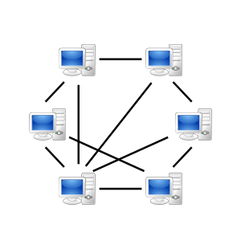
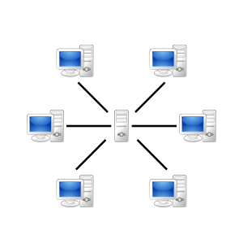
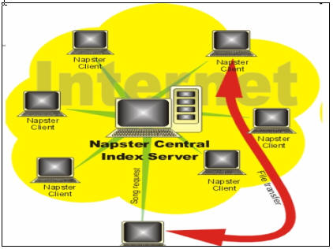
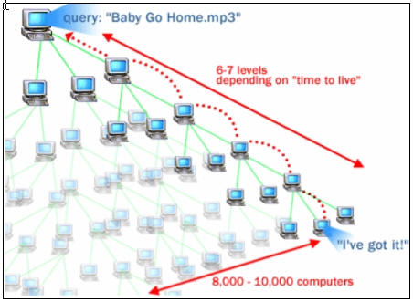
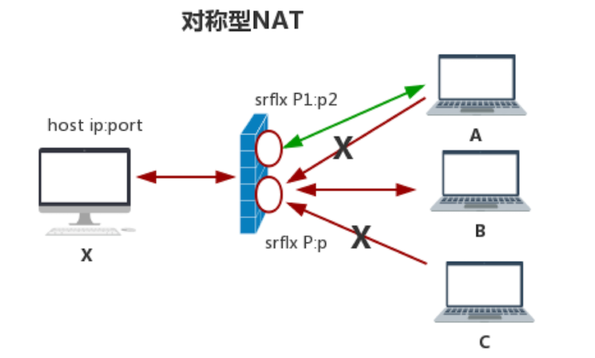
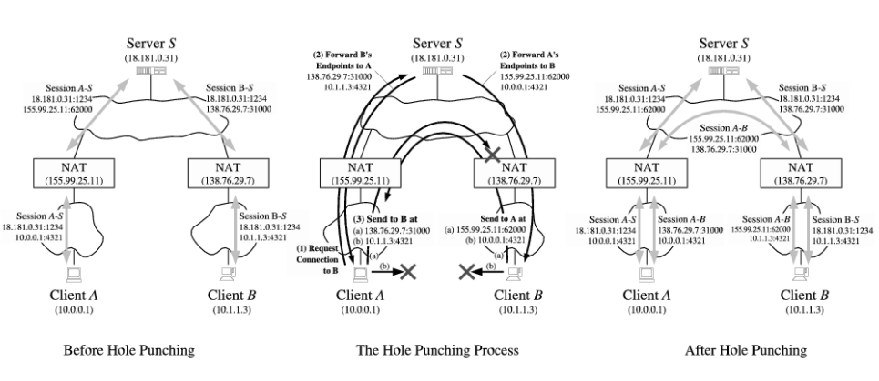
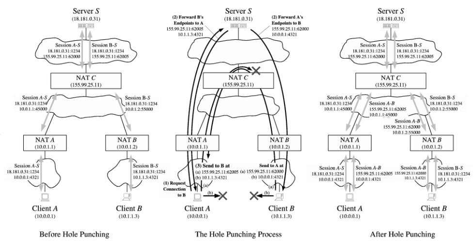
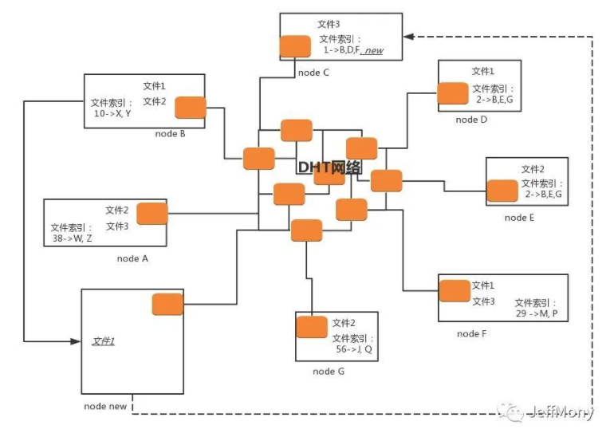
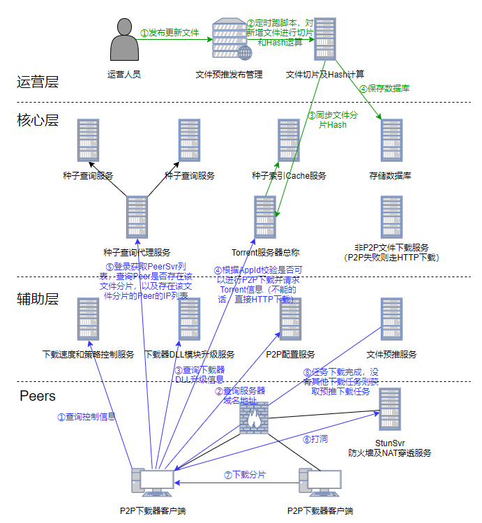

# 1 P2P

P2P是peer-to-peer的简称，又称为点对点技术，是没有中心服务器、依靠用户群节点进行信息交换的对等式网络，即指数据的传输不再通过服务器，而是网络用户之间直接传递数据。区别于传统的C/S中央服务器结构，P2P网络中每一个用户节点即是客户端又是服务端，能同时作为服务器给其他节点提供服务。

> 1）无中心服务器的对等式网络
>
> <div align="center"></div>
>
> 2）有中心服务器的中央网络系统
>
> <div align="center"></div>

目前包括 `比特币`、`以太坊` 等在内的去中心化的区块链平台，其底层网络都是采用的P2P技术实现，每个节点都是对等的。


## 1.1 概述


### 1.1.1 产生背景

P2P理念最初是在互联网上兴起的，这得从IPv4说起

**互联网是什么？**

> 就是各种硬件设备互联，比如电脑、手机、各种联网设备等，用于信息和服务共享。
>
> 互联网采用TCP/IP架构模型，而本质上是一种C/S模型，通过 **五元组信息**（`源IP` + `源端口` + `目标IP` + `目标端口` + `协议类型`）来标记通信双方（Client和Server），按照标准协议，向对方发送数据包，对方根据标准协议解析数据包，来实现信息资源共享。如果按照原来这个理想的互联模型，不考虑其他任何东西，是根本不需要P2P的，因为本来任何对象都可以作为Server或者Client来提供服务，彼此之间是可以互联。
>
> **IP是用来标记设备的**，目前广泛使用IPv4版本，而 **端口是用来标记设备上运行的软件服务**，但IP和端口是有限的，最初设计者也是没想到发展如此迅速，整个IPv4的地址范围，完全不够互联网设备来分配，那为了解决地址不够用的问题，就引入了 `NAT`。也是自从有了NAT，Client和Server的界限，就变得非常明显，导致了P2P的出现（当然后面IPv6的出现，将这个地址容量扩大到非常大的一个数目，不过终究不是无限的，而且NAT还有其他额外好处）。


**NAT（Net Address Translate，网络地址转换）**

> NAT是一种 **IP复用** 的一种技术，**将有限的IP扩展成无限，让IPv4起死回生**
>
> 1）互联网网络划分：
>
> *  `公有网络`：互联网上的任意可以访问的地址组成的网络，一般放置服务端（先简化不考虑反向代理反向链接等概念）；
> *  `私有网络`：互联网上不可访问的地址组成的网络，一般放置客户端；
>
> 2）NAT作为公有网络和私有网络之间的一个桥梁，所起的作用就是 **打通公有网络和私有网络的通信**。具体而言，就是对于NAT设备自身，作为公有网络的一部分，其他人可以访问，而NAT设备又直接与私有网络之间形成硬件互联；
>
> 3）NAT数据通信流程：
>
> > 一般而言，请求是由客户端发起的，而客户端是可以触达服务端的（因为服务端是在公有网络上，地址可以访问），但由于客户端是在私有网络，因此服务端是不能直接触达客户端的；
> >
> > 所以当客户端发起请求，请求经过NAT设备出去，我们知道请求是通过五元组信息进行定位，NAT设备此时就负责将请求源（也就是客户端）的IP修改为NAT设备的公有IP，目的是让服务端收到请求后，可以往一个有效地址回复数据，同时记录一下这一次请求的 **客户端IP到公有IP的转换到一个映射表**；
> >
> > 当服务端收到数据包，就会往NAT的公有IP回复数据包，数据到达NAT后会再次通过前面记录的映射表，查询到是哪个客户端请求的数据包，进而将数据包中转给对应的客户端；
> >
> > 这样的话，私有网络的IP，对公网而言，就没有太大意义，可以任意定制。通常，各个组织内部会组成这样一个私有网络，而各个组织的这些私有网络IP，都是可重复的，所以 `NAT本质` 上就是 **将NAT公有IP复用给了私有网络各个客户端**


通过**NAT技术的公私网络隔离，可以实现IP复用**，解决了IPv4不够用的问题，但是也同时带来了新问题，直接导致**TCP/IP通信困难**（由于NAT导致IP成为虚拟IP，外网无法针对内网某台主机进行直连通信，因为没有真实地址可用）。由于所有服务都不得不采用C/S架构，对于提供Server的企业，带宽成本相当高，为了节省带宽成本，将NAT设备内外通信打通，利用Client端作为资源服务提供方来减少直接对Server的访问，因此产生了P2P技术。


### 1.1.2 P2P发展历史

P2P技术的发展可以分为如下三个阶段：

1）**第一阶段：集中式对等网络**

> 这种网络采用的是中心化的拓扑结构，由于文件的索引信息都是存储在中央服务器上，每个子节点都需要连接中央服务器才可以找到资源。它最大的优点是 `维护简单`、`索引速度快`，但是由于整个网络严重依赖于中央服务器，容易造成性能瓶颈和单点故障的问题，比如：napster
>
> <div align="center"></div>


2）**第二阶段：非结构化的分布式网络**

> 这种网络采用 `Flooding` 搜索算法，**每次搜索都把要查询的消息广播给网络上的所有节点**。当一个节点要下载某个文件的时候，这个节点会以文件名或者关键字生成一个查询，并把查询发送给所有跟他相连的节点。如果这些节点存在文件，则跟这个节点建立连接，如果不存在，则继续向相邻的节点转发这个查询，直到找到文件位置，过程如下图所示（比如：Gnutella早期版本）。
>
> <div align="center"></div>
>
> 可以发现，当网络规模变大以后，这种搜索方式会引发 ”`广播风暴`”，**严重消耗网络带宽和节点的系统资源**。虽然避免了集中式对等网络的“单点故障”问题，但是效率却很低下。


3）**第三阶段：结构化的分布式网络**

> 目前采用最广泛的就是结构化的分布式网络，也就是基于 **DHT（分布式哈希表）** 的网络。DHT为了达到Napster的效率和正确性，以及Gnutella的分散性，使用了较为 **结构化的基于键值对的路由方法**，如下图所示：
>
> <div align="center"></div>
>
> 目前实现了DHT协议的有 `Kademlia` 和 `Chord` 算法，其中Kad算法由于简单易用而被广泛使用，其中比特币和以太坊网络中的P2P网络采用的就是Kad算法


### 1.1.3 P2P特点

在传统的C/S模式网络系统中，客户端之间的交互需要依赖中心化的服务器进行。当网络规模变得庞大时，这些中心服务器的负担就会越来越重，很容易成为网络瓶颈，而且一旦服务器崩溃，就会造成整个网络瘫痪（单点故障的风险）。

而 **P2P网络** 由于没有中心服务器，不存在单点性能上的瓶颈，每个节点在充当客户端的同时，也可以作为服务端给其他相邻节点提供服务，极大地提高了资源的利用率。

P2P网络的特点：

> 1）`可扩展性`：在P2P网络中，用户可以随时加入、离开网络。而且随着用户节点的加入，系统整体的服务能力也在相应的提高。例如p2p下载中，加入的用户越多，则P2P网络中提供的资源就越多，下载速度就越来越快；
>
> 2）`健壮性`：由于P2P不存在中心化服务器，天生就具备 `耐攻击` 和 `高容错` 的特点。因为P2P网络中每个节点都可以充当服务端的角色，因此即使网络中某个节点被攻击或下线，也不影响整个系统的正常运行；
>
> 3）`高性价比`：采用P2P结构的网络，可以有效地利用**互联网中大量分散的普通用户节点**。充分利用这些普通节点中闲散的 `CPU`、`带宽`、`存储资源`，从而达到高性能计算和海量存储的目的。例如：迅雷旗下的星域CDN产品，就是充分利用每一个普通用户机器的闲散网络资源，从而提供一个高性价比的服务，类似的还有360共享云、国外的sia网盘等；
>
> 4）`隐私保护`：在P2P网络中，由于信息的传输分散在各个节点之间，而无需经过中心服务器，这样就 **减少用户隐私信息被窃听和泄露的风险**；
>
> 5）`负载均衡`：由于P2P网络中，资源分散存储在多个节点上，而每个节点又都可以充当服务器的角色。当某个节点需要获取资源时，只需要向相邻节点发送请求即可，很好地实现了整个网络的负载均衡。


### 1.1.4 P2P功能

P2P网络主要功能：

> 1）`数据发布和传输`：
>
> * 一对一：如即时通讯
> * 一对多：如群组通信和消息广播
> * 多对多：如内容分发应用：BT、PPS等
>
> 2）`数据存储和检索`：分为基于结构化的P2P网络方法和基于非结构化的P2P网络方法。
>
> * 结构化的P2P网络：也就是基于分布式哈希表（DHT）的P2P网络，这个也是目前应用最广泛的，它的网络拓扑结构是确定的；
> * 非结构化的P2P网络：其资源存储通常与网络拓扑结构无关，例如Gnutella
>
> 3）`分布式数据处理`：目前，大多数分布式数据处理技术采用的是master/slave的架构，而基于P2P网络，也能够进行分布式的数据处理。


### 1.1.5 P2P优劣势

**P2P的优势：**

> 1）较佳的并行处理能力（相比于C/S架构，随着C越来越多，速度越来越慢，但是p2p网络不会有很明显的变化，所有客户端都能提供资源，包括带宽、存储空间、计算能力）
>
> 2）无中心服务器、依靠用户群（peers）交换信息，减低网路传输节点
>
> 3）不用投资大量金钱在服务器的软、硬设备


**P2P的劣势：**

> 1）架构较为复杂，节点之间通常存在 **NAT隔离**，无法直接通信，导致需要额外的通路建设过程，以及各个节点的资源协调管理
>
> 2）P2P节点遍布整个互联网，给开发者、组织、政府带来监控难题
>
> 3）用在大规模网路，资源分享紊乱，管理较难
>
> 4）安全性较低
>
> * `中毒攻击`：提供内容与描述不同的文件
> * `拒绝服务攻击`：使网络运行非常慢甚至完全崩溃
> * `背叛攻击（吸血）`：用户或软件使用网路却没有贡献出自己的资源
> * `数据中插入病毒`：下载或传递的文件可能被感染病毒木马
> * `P2P软件本身的木马`：软件可能含有间谍软件
> * `过滤`：网络运营商可能会试图阻止传递来自P2P网络上的数据
> * `身份攻击`：跟踪网络上用户并且进行不断骚扰式或者合法性攻击
> * `垃圾信息`：在网路上发送未请求的信息

当然，针对P2P的安全性的一些问题，都有对应的解决方案


## 1.2 NAT技术详解

NAT是P2P中一个最为关键的技术之一，就是能穿透NAT设备，其本质为解决IPv4地址不够用而诞生的，通过IP复用达到地址几乎无限扩充。


### 1.2.1 NAT优劣势

**NAT的优势：**

> `负载均衡`：通过重定向讲一些服务器的连接转向其他选定的服务器（切换IP）
>
> `失效终结`：提供高可靠性服务，一旦路由器检测服务器宕机，自动转移到备份服务器
>
> `透明代理`：将连接到因特网的HTTP连接重定向到HTTP代理服务器以缓存数据和过滤请求，减少带宽使用而无需配置浏览器代理


**NAT的劣势：**

> 1）使IP会话的保持时效变短
>
> * 会话建立会在NAT网关上创建关联表，消耗IP端口号，而这些资源是有限的，需要能资源回收机制
> * 实时回收资源（tcp连接等，可以根据解析包，判断是会话结束时再回收资源）
> * 定时器回收（udp等无连接状态，只能根据定时，来决定数据包存活期），不同协议有效期举例：
>   DNS协议：10s / FTP-ctrl：300s / ICMP协议：10s / TCP协议（通常300s，fin、rst为10s，syn为10s） / UDP协议：240s
>
> 2）内部主机复用IP，使得依赖IP进行主机跟踪的机制都失效
>
> * 基于网络流量分析的应用无法跟踪到终端用户与流量的具体行为关系
> * 基于IP的用户行为日志分析变得困难，难以定位恶意攻击的主机
> * 基于IP的用户授权不再可靠
> * 服务器的连接限制，使得用户之间的服务抢占排队（本来是防止DOS攻击，防止一个用户的大量连接请求，但是这里就造成了误杀）
>
> 3）对IP端到端模型的破坏
>
> * NAT无法保证多个会话的关联性，当NAT网关拥有多个公有IP地址时，一组关联会话会被分配到不同的公网地址（那就需要不同的域名，很麻烦）
> * 当公网侧需要主动向私网侧发数据，因为NAT网关未建立连接，通常数据包无法到达
>
> 4）修改IP包头信息，会妨碍一些安全协议的工作
>
> * 认证协议无法正常工作（NAT篡改了IP地址、传输层端口、校验和导致的，因为认证的目的是要保证这些信息在传输中不变）
> * **隧道协议存在问题**（隧道协议通常用外层地址标识隧道实体，穿越NAT隧道会有IP复用关系，另一端需要小心处理，例如添加特殊标记标识自己身份）
> * **ICMP协议解复用失败**（因为IP对应关系被重新映射，ICMP需要复用和解复用。当ICMP的报文载荷无法提供足够的信息时，解复用会失败）
> * **IP分片**，通常IP分片的传输层信息（包含IP和端口号，特别是端口号）只包含在第一个分片，NAT通常依赖端口号做映射，若无传输层信息，NAT难以识别后续分片与关联表的对应关系，这就需要单独针对每个分片增加额外的端口号信息


### 1.2.2 NAT穿透方式

#### 1）完全锥形NAT

主机host 通过NAT 访问外网B，在NAT上就会打个”洞“，所有知道这个”洞“的外网主机都可以通过这个与host 上的侦听程序通讯。这个”洞“对应NAT 映射，即 **” 内网IP:内网Port <–> 外网IP:外网Port“**

那么机器A或C 就可以通过这个 外网IP:外网Port 和host 上的进程通讯

<div align="center"></div>


#### 2）IP限制锥形NAT

IP 限制锥型要比完全锥型 NAT 严格得多，它主要的特点是，host 主机在 NAT 上“打洞”后，NAT 会对穿越洞口的 IP 地址做限制。只有登记的 IP 地址才可以通过，也就是说，只有**host 主机访问过的外网主机才能穿越 NAT**，也就是NAT 映射表为：**内网IP:内网Port <–> 外网IP:外网Port <–> 被访问的主机IP**

那么这里只有B可以和X 通信，而A，C 由于IP 未被访问，故无法与其通信

<div align="center"></div>


#### 3）端口限制锥形NAT

端口限制锥型要比IP限制形还要严格，它主要的特点是，host 主机在 NAT 上“打洞”后，NAT 会对穿越洞口的 IP 地址和端口做限制。也就是说，只有**host 主机访问过的外网主机及提供服务的程序的端口才能穿越 NAT**，也就是NAT 映射表为：**内网IP:内网Port <–> 外网IP:外网Port <–> 被访问的主机IP：被访问主机Port**

那么这里只有B上的P1端口的进程才能和其通信

<div align="center"></div>


#### 4）对称型NAT

这是NAT 中最严格的一种类型，也就是说host 主机访问A 时会打一个”洞“，访问B是会再打一个”洞“，也即六元组中 “内网IP:内网Port<–>外网IP:***外网Port***<–>被访问的主机IP：被访问主机Port”

那么这里只有B上的P1端口的进程才能和其通信

<div align="center"></div>


### 1.2.3 NAT穿透常见解决方案

`应用层网关（ALG）`：根据传输层端口号识别协议，然后查询协议对应的IP地址和端口，转换为NAT转换表中的IP和端口，并将转换前的记录起来，形成 **查询关联表**。这样发送给私网侧的所有IP和端口，都是经过转换的NAT网关的IP和端口，然后私网侧发送数据包到公网侧，就会通过查询前一次记录的转换前的表，找到对应的，还原回去

* 必须跟踪所有应用协议的升级，以及新协议
* 有些协议加密了无法解析，也就无法转换

`探针技术STUN`：需要各个服务增加代码支持，同时部署STUN服务，利用NAT临时映射表的时效性进行打洞穿越

`中间件技术（UPnP）`：客户端参与网关公网映射信息的维护，通过UPnP向网关请求映射表，保存在客户端上，在需要发送数据的时候，直接先改写协议中涉及到的IP端口，改写为NAT网关的公网IP端口发送数据出去，NAT网关在收到外网数据时则通过UPnP建立的映射表只转换IP和端口信息（传输层）发数据到内网

* UPnP，通用即插即用，是一个网络终端与网关的通信协议
* 需要NAT网关、内部主机、应用程序同时支持UPnP，且组网时需要允许NAT网关和内网主机交换UPnP信令

`中继代理技术（TURN）`：一个公网的应用代理服务器做中转

`特定协议的自穿越技术（IKE、IPSec技术）`：用UDP在报文外面加一层封装，内部的报文就不再受到影响，因为协议本身考虑安全新，有报文防修改的鉴别能力，其他方法都无效


### 1.2.4 探针打洞原理

以基于UDP协议打洞技术来叙述，最后和TCP打洞进行对比


#### 1）基本原理

通过中间服务器的协助，在各自的NAT网关上建立映射表，使得P2P连接双方的报文能够直接穿透对方的NAT网关，然后客户端分别与中间服务器连接，中间服务器会记录下客户端的内网IP端口和外网IP端口。


P2P的Session建立原理：

> 1）客户端A和客户端B分别向集中服务器登录，集中服务器记录下他们各自的内外网IP端口（这里集中服务器需要保活和刷新各自IP端口信息）
>
> 2）客户端A最初不知道如何向客户端B发起连接，于是A向集中服务器发送消息，请求集中服务器帮助建立与客户端B的UDP连接
>
> 3）集中服务器将含有B的内外网IP端口发送给A，同时也将A的内外网IP端口发送给B
>
> 4）A开始向B的内外网地址二元组发送UDP数据包，并且A会自动锁定第一个给出响应的B的地址二元组（为何需要同时发两组数据包？因为并不清楚B是与A在同一个NAT网关下，还是不同NAT网关下）
>
> 5）B开始向A的内外网地址二元组发送UDP数据包，并且B会自动锁定第一个给出相应的A的地址二元组


#### 2）同一NAT网关内

同一局域网内，UDP打洞过程：

<div align="center"></div>


**打洞前**

```javascript
1、A（10.0.0.1:4321）经过NAT网关（155.99.25.11）向S（18.181.0.31:1234）注册登录
  1）数据包经过NAT后，会给A的这次连接分配一个随机端口号62005
  2）S所看到的就是（155.99.25.11:62005向它发送信息），记录到S的映射表

2、B（10.1.1.3:4321）经过NAT网关（155.99.25.11）向S（18.181.0.31:1234）注册登录
  1)数据包经过NAT后，会给B的这次连接分配一个随机端口号62000
  2）S所看到的就是（155.99.25.11:62000向它发送信息），记录到S的映射表
```


**打洞中**

```
1、A（10.0.0.1:4321）经过NAT网关（155.99.25.11）向S（18.181.0.31:1234）请求B的地址二元组信息，数据包包含A的内网地址（10.0.0.1:4321）
2、A（10.0.0.1:4321）的这次请求，经过NAT网关变成了已经建立的NAT映射表上的A’（155.99.25.11:62005）请求，向S发送
3、S（18.181.0.31:1234）向它所看到的A’（155.99.25.11:62005）发送数据包，包含了B的内外网地址信息（10.1.1.3:4321、155.99.25.11:62000），A保存了B的地址信息
4、S（18.181.0.31:1234）随后又向它所看到的B’（155.99.25.11:62000）发送数据包，包含了A的内外网地址信息（10.0.0.1:4321、155.99.25.11:62005）,B保存了A的地址信息
5、随后相互通信，A向B发送数据，B向A发送数据，均是先尝试内网地址通信，若数据包相互收到，则记住对方的第一个回包地址信息，识别出对方身份，确认是内网可通信
```


**打洞后**

```1、A和B直接利用内网地址通信```


**注意：**

> A和B发往对方公网地址二元组信息的UDP数据包，不一定会被对方接收到，取决于当前NAT设备是否支持不同端口之间的UDP数据包送达（Hairpin回环转换特性）
>
> 不过如果NAT设备支持Hairpin特性，也尽量优先以内网进行尝试


#### 3）不同NAT网关内

不同局域网内，UDP打洞过程：

<div align="center"></div>

**打洞前**

```javascript
1、A（10.0.0.1:4321）经过NAT网关（155.99.25.11）向S（18.181.0.31:1234）注册登录
  1）数据包经过NAT后，会给A的这次连接分配一个随机端口号62000
  2）S所看到的就是（155.99.25.11:62000向它发送信息），记录到S的映射表
2、B（10.1.1.3:4321）经过NAT网关（138.76.29.7）向S（18.181.0.31:1234）注册登录
  1）数据包经过NAT后，会给B的这次连接分配一个随机端口号31000
  2）S所看到的就是（138.76.29.7:31000向它发送信息），记录到S的映射表
```


**打洞中**

```
1、A（10.0.0.1:4321）经过NAT网关（155.99.25.11）向S（18.181.0.31:1234）请求B的地址二元组信息，数据包包含A的内网地址（10.0.0.1:4321）
2、A（10.0.0.1:4321）的这次请求，经过NAT网关变成了已经建立的NAT映射表上的A’（155.99.25.11:62000）请求，向S发送
3、S（18.181.0.31:1234）向它所看到的A’（155.99.25.11:62000）发送数据包，包含了B的内外网地址信息（10.1.1.3:4321、138.76.29.7:31000），A保存了B的地址信息
4、S（18.181.0.31:1234）随后又向它所看到的B’（138.76.29.7:31000）发送数据包，包含了A的内外网地址信息（10.0.0.1:4321、155.99.25.11:62000）,B保存了A的地址信息
5、随后相互通信，A向B发送数据，B向A发送数据，均是先尝试内网相互通信，若数据包相互收到，则记住对方的第一个回包地址信息，识别出对方身份，确认是内网不可通信，后续的所有包都走B的外网地址通信
```


**打洞后**

```1、A和B直接利用内网地址通信```


**注意**：

> 如果A发给B的包，在B发给A的包之前到达B的NAT设备之前到达，就会丢弃该包，因为默认不允许外网往内发包


#### 4）多层不通NAT网关内

互联网ISP部署到个人客户端的一般模型，UDP打洞过程：

<div align="center"></div>


**打洞前**

```javascript
1、A（10.0.0.1:4321）经过NAT-A网关（10.0.1.1）发数据，后又经过NAT-C网关（155.99.25.11）将数据包送达S（18.181.0.31:1234），进行注册登录
  1）数据包经过NAT-A后，会给A的这次连接分配一个随机端口号45000
  2）数据包经过NAT-C后，会给这次连接分配一个随机端口号62000
  3）S所看到的就是（155.99.25.11:62000向它发送信息），记录到S的映射表

2、B（10.1.1.3:4321）经过NAT-B网关（10.0.1.2）发数据，后又经过NAT-C网关（155.99.25.11）将数据包送达S（18.181.0.31:1234），进行注册登录
  1）数据包经过NAT-B后，会给B的这次连接分配一个随机端口号55000
  2）数据包经过NAT-C后，会给这次连接分配一个随机端口号62005
  3）S所看到的就是（155.99.25.11:62005向它发送信息），记录到S的映射表
```


**打洞中**

```
1、A（10.0.0.1:4321）经过NAT-A网关（10.0.1.1）和NAT-C网关（155.99.25.11）向S（18.181.0.31:1234）请求B的地址二元组信息，数据包包含A的内网地址（10.0.0.1:4321）
2、S（18.181.0.31:1234）向它所看到的A’（155.99.25.11:62000）发送数据包，包含了B的内外网地址信息（10.1.1.3:4321、155.99.25.11:62005），A保存了B的地址信息
3、S（18.181.0.31:1234）随后又向它所看到的B’（155.99.25.11:62005）发送数据包，包含了A的内外网地址信息（10.0.0.1:4321、155.99.25.11:62000）,B保存了A的地址信息
4、随后相互通信，A向B发送数据，B向A发送数据，均是先尝试内网相互通信，若数据包相互收到，则记住对方的第一个回包地址信息，识别出对方身份，确认是内网不可通信，后续的所有包都走B的外网地址通信
```


**打洞后**

```1、A和B直接利用内网地址通信```


#### 5）TCP打洞

**与UDP打洞的区别：**

> 一般NAT设备对UDP支持更友好一些，TCP更复杂
>
> * 因为NAT上的TCP协议的映射表有效期，可以根据TCP连接情况主动失效，而UDP只能定时失效；
> * NAT映射表会依据TCP发送端的端口号，也就是必须与前面注册登录时保持一致，否则发送给另一端的端口地址不一样，大概率会失败
>
> UDP只需要处理一个套接字的收发通信，而TCP需要用多个套接字绑定同一个端口（端口复用）
>
> TCP打洞成功率远远没有UDP高（NAT防火墙策略对TCP协议不是很友好）


**TCP打洞Session建立原理：**

> 1）客户端A使用其与服务器的连接，向服务器发送请求，要求服务器协助其连接客户端B
>
> 2）服务器将客户端B的内外网的TCP地址二元组信息返回给A，同时，服务器将A的内外网TCP地址二元组发送给B
>
> 3）客户端A和B各自使用连接服务器的端口异步发起向对方的内外网地址二元组的TCP连接，同时监听各自本地TCP端口是否有外部的连接接入
>
> 4）A和B开始等待向外的连接是否成功，检查是否有新连接接入。如果向外的连接，由于某种网络错误而失败，客户端可以延迟重试
>
> 5）TCP连接建立起来以后，客户端之间应该开始鉴权操作，确保目前连入的连接就是所希望的连接（比对双方IP端口）。如果鉴权失败，客户端将关闭连接，等待新的连接接入。客户端只接受第一个通过鉴权的客户端，然后将进入P2P通信过程不再继续等待是否有新的连接接入


### 1.2.5 常用打洞协议框架

`STUN`：P2P解决方案，支持TCP穿透和UDP穿透

`TURN`：中继技术

`ICE`：整合了STUN、TURN


## 1.3 P2P下载技术原理

下载的本质，就是向资源服务器请求资源数据，通常是有限的Server作为资源服务器。P2P下载，则认为所有参与下载的人，也都是资源服务器，提供内容供其他人下载，所以下载方需要知道找谁下载，就是靠种子文件来提供资源服务器索引的。

P2P对比C/S下载：

> 原始的C/S模式：下载的人越多，个人分得的带宽越少
>
> P2P下载模式：下载的人越多，提供的带宽越大


### 1.3.1 P2P下载技术方案

下面简单介绍场景的P2P下载技术方案特点

#### 1）BitTorrent技术方案

BitTorrent协议，是一种基于P2P文件传输通信协议，协议要求资源发布者根据文件生成提供一个 **.torrent文件**，就是种子文件。


**种子组成：**

> `Tracker信息`：BT下载中需要用到的Tracker服务器地址和针对Tracker服务器的设置
>
> `文件信息`：将目标文件虚拟分成大小相等的块，块大小是2K的整数次方，这里的文件信息就包含了每个块的索引信息和Hash信息


**P2P种子运行基本原理：**

> 1）下载用户，先需要取得种子信息，拿到Tracker服务器地址及相关设置
>
> 2）当用户下载了某个资源，本地资源分片落地时，就会告知Tracker服务器，Tracker服务器会记录已下载的用户信息，存储到服务器缓存（Tracker服务器所起的作用类似服务发现）
>
> 3）当有其他人需要下载时，会先连接Tracker服务器，从其中获取下载资源的Peer列表，也会包括前面已经下载过的用户
>
> 4）当Peer与Peer下载准备开始前，会通过BT软件进行 **打洞**（比如通过NAT设备端口有效期机制等），让彼此能够进行通信，然后进行文件分片下载。BT软件有可能同时对多个分片向多个人请求资源下载，如果下载后校验Hash失败，则会尝试其他Peer


**BT方案的缺陷：**

> 1）如果Tracker服务器异常了，则可能拿不到Peer列表（单点故障）
>
> 2）如果各个Peer失效，则可能下载超时


#### 2）Kademlia技术方案

Kademlia准确点讲，是一种P2P协议，用于 `DHT`（Distributed Hash Table）去中心化的P2P解决方案，解决BT方案中的 **单点故障问题**，区块链就是应用的这种解决方案。

<div align="center"></div>


**基本约定：**

> 1）每个结点都有一个ID（很长），这个ID是DHT网络中某个文件某种计算方式的HASH
>
> 2）每个结点需要负责 `存储文件索引`、`文件分片`等，但是每一个结点没有一个完整的知识，只有一个片段，也不知道所有的文件片段保存在哪里
>
> 3）每个文件计算出来HASH，那么结点ID与此HASH相同或者相似，这个结点就需要知道该文件存储在哪里


**Session建立原理：**

> 1）node new上线，需要下载文件1
>
> 2）首先，node new需要获取文件1的种子文件，这个种子文件中，会包含一部分结点的地址以及文件1的Hash
>
> 3）node new根据文件1Hash，在种子文件中这些已知的结点中问询，查找与Hash相同或相似的结点信息
> 各个结点，收到node new的请求，会首先看自身是否满足要求，如果不满足要求，就会进一步广播此请求（有种类似社交网络中找人）
>
> 4）一旦找到了结点（我们这里是node C，包含了文件1的索引），就会回复告诉node new，需要分别去B、D、F查询
>
> 5）node new先与B进行Peer连接，开始下载，自己本地也有文件1了，就会告诉node C和ID相似的结点，自己也存在文件1了，可以加入那个文件的拥有者列表
>
> 6）node C和其他文件1索引拥有者会将node new也加入到文件1的索引列表


### 1.3.2 基于BT的P2P下载实例

**P2P技术所遇到的问题**：

> 最大的问题是P2P率并不高，常常都直接向Server寻求资源，导致无法降低很多Server带宽成本。可以设想一下，最常见的比如在推送某些更新文件时，通常是统一时刻，大家更新的时间段若比较重合，就很容易引发Peer节点不足。


**解决方案：**

> 通过预推文件，让下载资源提前触达到用户，主动增加Peer节点数。为此，也需要不能影响用户自身的体验，一般需要达成以下目标：
>
> * 在用户带宽允许的前提下，提升下载速度
>
> * 还需要严格控制用户的上行带宽，不要影响用户上网
>
> * 保证下载质量，同时做到对大文件下载的差错控制


**整体架构：**

<div align="center"></div>


## 1.4 P2P 应用

1）**文件内容共享和下载**

> 利用P2P技术可以使计算机之间不通过服务器直接进行内容共享和数据分发，使得互联网上任意两台机器间共享数据成为可能。例如：Napster、Gnutella、eDonkey、eMule、Maze、BT，以及现在PPS、腾讯视频客户端等采用的P2P流媒体技术，使得播放速度更加流畅。

2）**计算能力和存储共享**

> 基于P2P网络的分布式结构构造出分布式的存储系统实现  **存储共享**，提供 `高效率`、`高性价比`、`负载均衡`的文件存取功能，例如国外的Sia、Storj等分布式云存储平台，不依赖第三方的大型集中存储空间，避免了数据泄露、保证了安全性。同时由于任何人的主机都可以提供存储服务，降低了门槛，大幅降低了存储的成本。比如：采用分布式存储的Storj价格是每个月$0.015，而亚马逊提供的AWS价格是$0.023。
>
> 同时也可以共享CPU处理能力，例如：360的共享云计划和星域CDN等，充分利用每个人机器的闲散计算资源来提供计算服务。

3）**基于P2P的即时通讯**

> 例如：目前的Skype通话软件就是从连接建立和数据传输都采用P2P实现，保证了良好的通话质量。

4）**基于P2P方式的协同处理与服务共享平台**

> 常见的协同处理有 `视频会议`、`共享白板`、`协同协作` 等，而基于P2P技术的同样也可以实现上述功能，不同的是，这种实现方式不需要中心服务器，参与协同工作的计算机之间可以直接建立点对点的连接。例如：被微软收购的Groove协同软件平台。 


# 2 CDN


# 3 PCDN


# 附录


## P2P

1. [P2P技术是什么](https://segmentfault.com/a/1190000023408554)
2. [【网络技术】P2P技术原理浅析](https://keenjin.github.io/2021/04/p2p/#21-%E6%A0%B9%E6%8D%AE%E4%B8%AD%E5%A4%AE%E5%8C%96%E7%A8%8B%E5%BA%A6)
3. [P2P技术详解](http://www.52im.net/thread-50-1-1.html)
4. [P2P 技术科普](https://cloud.tencent.com/developer/article/1777485)
5. [P2P技术原理及应用[通俗易懂]](https://cloud.tencent.com/developer/article/2032259)
6. [P2P通信原理](https://cloud.tencent.com/developer/article/1624731)


## PCDN

1. [网络视频播放原理](https://www.jianshu.com/p/84c5494a486f)  
2. [一篇文章解读提速、降费黑科技：PCDN定义、功能、架构、场景和优势](https://developer.aliyun.com/article/130907) 
3. [PCDN介绍](https://cloud.tencent.com/developer/article/1906256) 
4. [CDN 原理和几种变形（DCDN/ECDN/PCDN/SCDN）](https://czj.so/759/cdn原理和几种变形.html)  
5. [使用阿里云PCDN降低内容分发成本](https://www.daimajiaoliu.com/daima/4ed692962100408)
6. [高清视频下如何节省带宽？](https://developer.aliyun.com/article/763669?spm=a2c6h.14164896.0.0.b0114d4bAw7RUf) 

