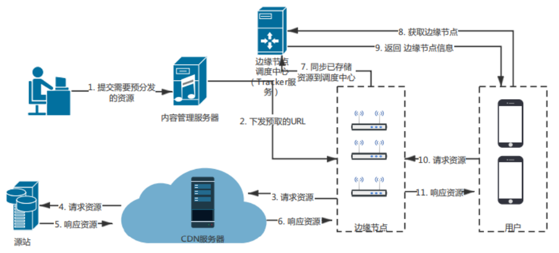

# 1 P2P

P2P是peer-to-peer的简称，又称为点对点技术，是没有中心服务器、依靠用户群节点进行信息交换的对等式网络，即指**数据的传输不再通过服务器，而是网络用户之间直接传递数据**。区别于传统的C/S中央服务器结构，P2P网络中每一个用户节点即是客户端又是服务端，能同时作为服务器给其他节点提供服务。

> 1）无中心服务器的对等式网络
>
> <div align="center"></div>
>
> 2）有中心服务器的中央网络系统
>
> <div align="center"></div>

目前包括 `比特币`、`以太坊` 等在内的去中心化的区块链平台，其底层网络都是采用的P2P技术实现，每个节点都是对等的。

   

## 1.1 概述

   

### 1.1.1 产生背景

P2P理念最初是在互联网上兴起的，这得从IPv4说起

**互联网是什么？**

> 就是各种硬件设备互联，比如电脑、手机、各种联网设备等，用于信息和服务共享。
>
> 互联网采用TCP/IP架构模型，而本质上是一种C/S模型，通过 **五元组信息**（`源IP` + `源端口` + `目标IP` + `目标端口` + `协议类型`）来标记通信双方（Client和Server），按照标准协议，向对方发送数据包，对方根据标准协议解析数据包，来实现信息资源共享。如果按照原来这个理想的互联模型，不考虑其他任何东西，是根本不需要P2P的，因为本来任何对象都可以作为Server或者Client来提供服务，彼此之间是可以互联。
>
> **IP是用来标记设备的**，目前广泛使用IPv4版本，而 **端口是用来标记设备上运行的软件服务**，但IP和端口是有限的，最初设计者也是没想到发展如此迅速，整个IPv4的地址范围，完全不够互联网设备来分配，那为了解决地址不够用的问题，就引入了 `NAT`。也是自从有了NAT，Client和Server的界限，就变得非常明显，导致了P2P的出现（当然后面IPv6的出现，将这个地址容量扩大到非常大的一个数目，不过终究不是无限的，而且NAT还有其他额外好处）。

   

**NAT（Net Address Translate，网络地址转换）**

> NAT是一种 **IP复用** 的一种技术，**将有限的IP扩展成无限，让IPv4起死回生**
>
> 1）互联网网络划分：
>
> *  `公有网络`：互联网上的任意可以访问的地址组成的网络，一般放置服务端（先简化不考虑反向代理反向链接等概念）；
> *  `私有网络`：互联网上不可访问的地址组成的网络，一般放置客户端；
>
> 2）NAT作为公有网络和私有网络之间的一个桥梁，所起的作用就是 **打通公有网络和私有网络的通信**。具体而言，就是对于NAT设备自身，作为公有网络的一部分，其他人可以访问，而NAT设备又直接与私有网络之间形成硬件互联；
>
> 3）NAT数据通信流程：
>
> > 一般而言，请求是由客户端发起的，而客户端是可以触达服务端的（因为服务端是在公有网络上，地址可以访问），但由于客户端是在私有网络，因此服务端是不能直接触达客户端的；
> >
> > 所以当客户端发起请求，请求经过NAT设备出去，我们知道请求是通过五元组信息进行定位，NAT设备此时就负责将请求源（也就是客户端）的IP修改为NAT设备的公有IP，目的是让服务端收到请求后，可以往一个有效地址回复数据，同时记录一下这一次请求的 **客户端IP到公有IP的转换到一个映射表**；
> >
> > 当服务端收到数据包，就会往NAT的公有IP回复数据包，数据到达NAT后会再次通过前面记录的映射表，查询到是哪个客户端请求的数据包，进而将数据包中转给对应的客户端；
> >
> > 这样的话，私有网络的IP，对公网而言，就没有太大意义，可以任意定制。通常，各个组织内部会组成这样一个私有网络，而各个组织的这些私有网络IP，都是可重复的，所以 `NAT本质` 上就是 **将NAT公有IP复用给了私有网络各个客户端**

   

通过**NAT技术的公私网络隔离，可以实现IP复用**，解决了IPv4不够用的问题，但是也同时带来了新问题，直接导致**TCP/IP通信困难**（由于NAT导致IP成为虚拟IP，外网无法针对内网某台主机进行直连通信，因为没有真实地址可用）。由于所有服务都不得不采用C/S架构，对于提供Server的企业，带宽成本相当高，为了节省带宽成本，**将NAT设备内外通信打通，利用Client端作为资源服务提供方来减少直接对Server的访问**，因此产生了P2P技术。

   

### 1.1.2 P2P发展（网络拓扑结构）

拓扑结构是指分布式系统中各个计算单元之间的物理或逻辑的互联关系，结点之间的拓扑结构一直是确定系统类型的重要依据。目前互联网络中广泛使用 `集中式`、`层次式` 等拓扑结构，Interne本身是世界上最大的非集中式的互联网络，但是九十年代所建立的一些网络应用系统却是完全的集中式的系统、很多Web应用都是运行在集中式的服务器系统上，但集中式拓扑结构系统目前面临着 `过量存储负载`、`Dos攻击` 等一些难以解决的问题。

P2P系统一般要构造一个非集中式的拓扑结构，在构造过程中需要解决系统中所包含的大量结点如何命名、组织以及确定结点的加入/离开方式、出错恢复等问题。

​    

根据网络拓扑结构关系，P2P技术的发展可以分为以下几个阶段：

1）**第一阶段：集中式对等网络**（中心化拓扑）

> 这种网络采用的是中心化的拓扑结构，由于文件的索引信息都是存储在中央服务器上，每个子节点都需要连接中央服务器才可以找到资源。它最大的优点是 `维护简单`、`索引速度快`，但是由于整个网络严重依赖于中央服务器，容易造成性能瓶颈和单点故障的问题，比如：napster
>
> <div align="center"></div>
>
> 在Napster 模型中，一群高性能的中央服务器保存着网络中所有活动对等 **计算机共享资源的目录信息**。当需要查询某个文件时，对等机会向一台中央服务器发出文件查询请求。中央服务器进行相应的检索和查询后，会返回符合查询要求的对等机地址信息列表，且当查询发起对等机接收到应答后，会根据网络流量和延迟等信息进行选择，和合适的对等机建立连接，并开始文件传输。
>
> 这种对等网络模型存在很多问题，主要表现为：
>
> * 中央服务器的瘫痪容易导致整个网络的崩馈，可靠性和安全性较低;
> * 随着网络规模的扩大，对中央索引服务器进行维护和更新的费用将急剧增加，所需成本过高;
> * 中央服务器的存在引起 **共享资源在版权问题** 上的纠纷，并因此被攻击为非纯粹意义上的P2P网络模型。对小型网络而言，集中目录式模型在管理和控制方面占一定优势。但鉴于其存在的种种缺陷，该模型并不适合大型网络应用。

​    

2）**第二阶段：非结构化的分布式网络**

> 这种网络采用 `Flooding` 搜索算法，**每次搜索都把要查询的消息广播给网络上的所有节点**。当一个节点要下载某个文件的时候，这个节点会以文件名或者关键字生成一个查询，并把查询发送给所有跟他相连的节点。如果这些节点存在文件，则跟这个节点建立连接，如果不存在，则继续向相邻的节点转发这个查询，直到找到文件位置。由于这样的方式如果不加节制，会造成消息泛滥，因此一般会设置一个适当的生存时间TTL，在查询的过程中递减，当TTL值为0时，将不再继续发送。过程如下图所示（比如：Gnutella早期版本）：
>
> <div align="center"></div>
>
> 由于非结构化网络将重叠网络认为是一个完全随机图，结点之间的链路没有遵循某些预先定义的拓扑来构建。这些系统一般不提供性能保证，但容错性好，支持复杂的查询，并受结点频繁加入和退出系统的影响小。但是查询的结果可能不完全，查询速度较慢，采用广播查询的系统对网络带宽的消耗非常大，并由此带来可扩展性差等问题。
>
> 其次，这种无结构的方式，组织方式比较松散，节点的加入与离开比较自由，当查询热门内容时，很容易就能找到，但如果需求的内容比较冷门，较小的TTL不容易找到，而较大的TTL值又容易引起较大的查询流量，尤其当网络范围扩展到一定规模时，即使限制的TTL值较小，仍然会引起流量的剧增（ ”`广播风暴`”），**严重消耗网络带宽和节点的系统资源**。因此，虽然无结构网络避免了集中式对等网络的“ `单点故障` ”问题，但是效率却很低下，但当网络中存在一些拥有丰富资源的所谓的类服务器节点时，是可显著提高查询的效率。

​     

3）**第三阶段：半结构化的分布式网络**

> 半分布式结构（有的文献称作 Hybrid Structure）吸取了中心化结构和全分布式非结构化拓扑的优点，选择性能较高（处理、存储、带宽等方面性能）的结点作为超级点（SuperNodes, Hubs)，在各个超级点上存储了系统中其他部分结点的信息，发现算法仅在超级点之间转发，超级点再将查询请求转发给适当的叶子结点。**半分布式结构也是一个层次式结构，超级点之间构成一个高速转发层，超级点和所负责的普通结点构成若干层次**。最典型的案例就是KaZaa。
>
> KaZaa是现在全世界流行的几款p2p软件之一。根据CA公司统计，全球KaZaa的下载量超过2.5亿次。使用KaZaa软件进行文件传输消耗了互联网40%的带宽。之所以它如此的成功，是因为它结合了Napster和Gnutella共同的优点。从结构 上来说，它使用了Gnutella的全分布式的结构，这样可以是系统更好的扩展，因为它无需中央索引服务器存储文件名，它是自动的把性能好的机器成为SuperNode，它存储着离它最近的叶子节点的文件信息，这些SuperNode,再连通起来形成一个 **Overlay Network**， 由于SuperNode的索引功能，使搜索效率大大提高。
>
> <div align="center"></div>

​    

4）**第四阶段：结构化的分布式网络**

> 目前采用最广泛的就是结构化的分布式网络，也就是基于 **分布式哈希表（Distributed Hash Table, DHT）** 的网络。DHT为了达到Napster的效率和正确性，以及Gnutella的分散性，使用了较为 **结构化的基于键值对的路由方法**，**基本思想** 是 ***将网络中所有的资源整理成一张巨大的表，表内包含资源的关键字和所存放结点的地址，然后将这张表分割后分别存储到网络中的每一结点中去***。当用户在网络中搜索相应的资源时，它将能发现存储与关键词对应的哈希表内容所存放的结点，在该结点中存储了包含所需资源的结点地址，然后发起搜索的结点根据这些地址信息，与对应结点连接并传输资源。这是一种技术上比较先进的对等网络，它具有 `高度结构化`，`高可扩展性`，结点的加入与离开比较自由，这种方式适合比较大型的网络，比如：第三代P2P Pastry、Tapestry、Chord、CAN
>
> 如下图所示：
>
> <div align="center"></div>
>
> DHT类结构最大的问题是DHT的维护机制较为复杂，尤其是结点频繁加入退出造成的网络波动（Churn）会极大增加DHT的维护代价。其次，DHT所面临的另外一个问题是DHT仅支持精确关键词匹配查询，无法支持内容/语义等复杂查询。
>
> 目前实现了DHT协议的有 `Kademlia` 和 `Chord` 算法，其中Kad算法由于简单易用而被广泛使用，其中比特币和以太坊网络中的P2P网络采用的就是Kad算法

​    

### 1.1.3 P2P特点

在传统的C/S模式网络系统中，客户端之间的交互需要依赖中心化的服务器进行。当网络规模变得庞大时，这些中心服务器的负担就会越来越重，很容易成为网络瓶颈，而且一旦服务器崩溃，就会造成整个网络瘫痪（单点故障的风险）。

而 **P2P网络** 由于没有中心服务器，不存在单点性能上的瓶颈，每个节点在充当客户端的同时，也可以作为服务端给其他相邻节点提供服务，极大地提高了资源的利用率。

P2P网络的特点：

> 1）`非中心化`：网络中的资源和服务分散在所有结点上，信息的传输和服务的实现都直接在结点之间进行，可以无需中间环节和服务器的介入，避免了可能的瓶颈。P2P的非中心化基本特点，带来了其在可扩展性、健壮性等方面的优势；
>
> 2）`可扩展性`：在P2P网络中，用户可以随时加入、离开网络。而且随着用户节点的加入，系统整体的服务能力也在相应的提高。例如p2p下载中，加入的用户越多，则P2P网络中提供的资源就越多，下载速度就越来越快；
>
> 3）`健壮性`：由于P2P不存在中心化服务器，天生就具备 `耐攻击` 和 `高容错` 的特点。
>
> * 由于服务是分散在各个结点之间进行的，部分结点或网络遭到破坏对其它部分的影响很小；
> * P2P网络在部分结点失效时能够自动调整整体拓扑，保持其它结点的连通性；
> * P2P网络通常都是以自组织的方式建立起来的，并允许结点自由地加入和离开；
> * 根据网络带宽、结点数、负载等变化不断地做自适应式的调整；
>
> 4）`高性价比`：性能优势是P2P被广泛关注的一个重要原因，随着硬件技术的发展，个人计算机的计算和存储能力以及网络带宽等性能依照摩尔定理高速增长。采用P2P架构可以有效地利用互联网中散布的大量普通用户结点，将计算任务或存储资料分布到所有结点上，并利用其中闲置的 `计算能力`或 `存储空间`，达到高性能计算和海量存储的目的。因此，通过利用网络中的大量空闲资源，可以用更低的成本提供更高的计算和存储能力
>
> * 例如：迅雷旗下的星域CDN产品，就是充分利用每一个普通用户机器的闲散网络资源，从而提供一个高性价比的服务，类似的还有360共享云、国外的sia网盘等；
>
> 5）`隐私保护`：在P2P网络中，由于信息的传输分散在各节点之间进行而无需经过某个集中环节，**用户的隐私信息被窃听和泄漏的可能性大大缩小**。此外，目前解决 Internet隐私问题主要采用 `中继转发` 的技术方法，从而将通信的参与者隐藏在众多的网络实体之中，而在传统的一些匿名通信系统中，实现这一机制依赖于某些中继服务器节点。但在P2P中，所有参与者都可以提供中继转发的功能，因而大大提高了匿名通讯的灵活性和可靠性，能够为用户提供更好的隐私保护；
>
> 6）`负载均衡`：P2P 网络环境下由于每个节点既是服务器又是客户机（当某个节点需要获取资源时，只需要向相邻节点发送请求即可），减少了对传统C/S结构服务器计算能力、存储能力的要求，同时因为资源分布在多个节点，更好的实现了整个网络的负载均衡。

​    

### 1.1.4 P2P功能

P2P网络主要功能：

> 1）`数据发布和传输`：
>
> * 一对一：如即时通讯
> * 一对多：如群组通信和消息广播
> * 多对多：如内容分发应用：BT、PPS等
>
> 2）`数据存储和检索`：分为基于结构化的P2P网络方法和基于非结构化的P2P网络方法。
>
> * 结构化的P2P网络：也就是基于分布式哈希表（DHT）的P2P网络，这个也是目前应用最广泛的，它的网络拓扑结构是确定的；
> * 非结构化的P2P网络：其资源存储通常与网络拓扑结构无关，例如Gnutella
>
> 3）`分布式数据处理`：目前，大多数分布式数据处理技术采用的是master/slave的架构，而基于P2P网络，也能够进行分布式的数据处理。

​    

### 1.1.5 P2P优劣势

**P2P的优势：**

> 1）较佳的并行处理能力（相比于C/S架构，随着C越来越多，速度越来越慢，但是p2p网络不会有很明显的变化，所有客户端都能提供资源，包括 `带宽`、`存储空间`、`计算能力`）
>
> 2）无中心服务器、依靠用户群（peers）交换信息，减低网路传输节点
>
> 3）不用投资大量金钱在服务器的软、硬设备

​    

**P2P的劣势：**

> 1）架构较为复杂，节点之间通常存在 **NAT隔离**，无法直接通信，导致需要额外的通路建设过程，以及各个节点的资源协调管理
>
> 2）P2P节点遍布整个互联网，给开发者、组织、政府带来监控难题
>
> 3）用在大规模网路，资源分享紊乱，管理较难
>
> 4）安全性较低
>
> * `中毒攻击`：提供内容与描述不同的文件
> * `拒绝服务攻击`：使网络运行非常慢甚至完全崩溃
> * `背叛攻击（吸血）`：用户或软件使用网路却没有贡献出自己的资源
> * `数据中插入病毒`：下载或传递的文件可能被感染病毒木马
> * `P2P软件本身的木马`：软件可能含有间谍软件
> * `过滤`：网络运营商可能会试图阻止传递来自P2P网络上的数据
> * `身份攻击`：跟踪网络上用户并且进行不断骚扰式或者合法性攻击
> * `垃圾信息`：在网路上发送未请求的信息

当然，针对P2P的安全性的一些问题，都有对应的解决方案

​    

## 1.2 NAT技术详解

NAT是P2P中一个最为关键的技术之一，就是能穿透NAT设备，其本质为解决IPv4地址不够用而诞生的，通过 **IP复用** 达到地址几乎无限扩充。

NAT处理报文的几个关键特点：

> 1）网络被分为私网和公网两个部分，NAT网关设置在私网到公网的路由出口位置，双向流量必须都要经过NAT网关；
>
> 2）网络访问只能先由私网侧发起，公网无法主动访问私网主机；
>
> 3）NAT网关在两个访问方向上完成两次地址的转换或翻译，出方向做源信息替换，入方向做目的信息替换；
>
> 4）NAT网关的存在对通信双方是保持透明的；
>
> 5）NAT网关为了实现双向翻译的功能，需要维护一张关联表，把会话的信息保存下来。

**注意**：这些特点是鲜明的，但又不是绝对的。其中第二个特点打破了IP协议架构中所有节点在通讯中的对等地位，这是NAT最大的弊端，为对等通讯带来了诸多问题，当然相应的克服手段也应运而生。事实上，第四点是NAT致力于达到的目标，但在很多情况下，NAT并没有做到，因为除了IP首部，上层通信协议经常在内部携带IP地址信息。

​    

### 1.2.1 NAT优劣势

**NAT的优势：**

> `负载均衡`：通过重定向讲一些服务器的连接转向其他选定的服务器（切换IP）
>
> `失效终结`：提供高可靠性服务，一旦路由器检测服务器宕机，自动转移到备份服务器
>
> `透明代理`：将连接到因特网的HTTP连接重定向到HTTP代理服务器以缓存数据和过滤请求，减少带宽使用而无需配置浏览器代理

​    

**NAT的劣势：**

> 1）使IP会话的保持时效变短
>
> * 会话建立会在NAT网关上创建**关联表**，消耗IP端口号，而这些资源是有限的，需要能资源回收机制
> * 实时回收资源（tcp连接等，可以根据解析包，判断是会话结束时再回收资源）
> * 定时器回收（udp等无连接状态，只能根据定时，来决定数据包存活期），不同协议有效期举例：
>   DNS协议：10s / FTP-ctrl：300s / ICMP协议：10s / TCP协议（通常300s，fin、rst为10s，syn为10s） / UDP协议：240s
>
> 2）内部主机复用IP，使得依赖IP进行主机跟踪的机制都失效
>
> * 基于网络流量分析的应用无法跟踪到终端用户与流量的具体行为关系
> * 基于IP的用户行为日志分析变得困难，难以定位恶意攻击的主机
> * 基于IP的用户授权不再可靠
> * 服务器的连接限制，使得用户之间的服务抢占排队（本来是防止DOS攻击，防止一个用户的大量连接请求，但是这里就造成了误杀）
>
> 3）对IP端到端模型的破坏
>
> * NAT无法保证多个会话的关联性，当NAT网关拥有多个公有IP地址时，一组关联会话会被分配到不同的公网地址（那就需要不同的域名，很麻烦）
> * 当公网侧需要主动向私网侧发数据，因为NAT网关未建立连接，通常数据包无法到达
>
> 4）修改IP包头信息，会妨碍一些安全协议的工作
>
> * 认证协议无法正常工作（NAT篡改了IP地址、传输层端口、校验和导致的，因为认证的目的是要保证这些信息在传输中不变）
> * **隧道协议存在问题**（隧道协议通常用外层地址标识隧道实体，穿越NAT隧道会有IP复用关系，另一端需要小心处理，例如添加特殊标记标识自己身份）
> * **ICMP协议解复用失败**（因为IP对应关系被重新映射，ICMP需要复用和解复用。当ICMP的报文载荷无法提供足够的信息时，解复用会失败）
> * **IP分片**，通常IP分片的传输层信息（包含IP和端口号，特别是端口号）只包含在第一个分片，NAT通常依赖端口号做映射，若无传输层信息，NAT难以识别后续分片与关联表的对应关系，这就需要单独针对每个分片增加额外的端口号信息

​     

### 1.2.2 NAT穿透方式

#### 1）完全锥形NAT

主机host 通过NAT 访问外网B，在NAT上就会打个”洞“，所有知道这个”洞“的外网主机都可以通过这个与host 上的侦听程序通讯。这个”洞“对应NAT 映射，即 **” 内网IP:内网Port <–> 外网IP:外网Port“**

那么机器A或C 就可以通过这个 外网IP:外网Port 和host 上的进程通讯

<div align="center"></div>

​    

#### 2）IP限制锥形NAT

IP 限制锥型要比完全锥型 NAT 严格得多，它主要的特点是，host 主机在 NAT 上“打洞”后，NAT 会对穿越洞口的 IP 地址做限制。只有登记的 IP 地址才可以通过，也就是说，只有**host 主机访问过的外网主机才能穿越 NAT**，也就是NAT 映射表为：**内网IP:内网Port <–> 外网IP:外网Port <–> 被访问的主机IP**

那么这里只有B可以和X 通信，而A，C 由于IP 未被访问，故无法与其通信

<div align="center"></div>

​    

#### 3）端口限制锥形NAT

端口限制锥型要比IP限制形还要严格，它主要的特点是，host 主机在 NAT 上“打洞”后，NAT 会对穿越洞口的 IP 地址和端口做限制。也就是说，只有**host 主机访问过的外网主机及提供服务的程序的端口才能穿越 NAT**，也就是NAT 映射表为：**内网IP:内网Port <–> 外网IP:外网Port <–> 被访问的主机IP：被访问主机Port**

那么这里只有B上的P1端口的进程才能和其通信

<div align="center"></div>

​     

#### 4）对称型NAT

这是NAT 中最严格的一种类型，也就是说host 主机访问A 时会打一个”洞“，访问B是会再打一个”洞“，也即六元组中 “内网IP:内网Port<–>外网IP:***外网Port***<–>被访问的主机IP：被访问主机Port”

那么这里只有B上的P1端口的进程才能和其通信

<div align="center"></div>

​     

事实上，这些术语的引入是很多混淆的起源。现实中的很多NAT设备是将这些转换方式混合在一起工作的，而不单单使用一种，所以这些术语只适合**描述一种工作方式，而不是一个设备**。比如，很多NAT设备对内部发出的连接使用 `对称型NAT` 方式，而同时支持静态的端口映射，后者可以被看作是 `全锥型NAT` 方式。而有些情况下，NAT设备的一个公网地址和端口可以同时映射到内部几个服务器上以实现负载分担，比如：一个对外提供WEB服务器的站点可能是有成百上千个服务器在提供HTTP服务，但是对外却表现为一个或少数几个IP地址。

   

### 1.2.3 NAT穿透常见解决方案

​    

#### 1）应用层网关（ALG）

ALG是解决 **NAT对应用层协议无感知**的一个最常用方法，已经被NAT设备厂商广泛采用，成为NAT设备的一个必需功能。因为NAT不感知应用协议，所以有必要额外为每个应用协议定制协议分析功能，这样NAT网关就能理解并支持特定的协议。

ALG与NAT形成互动关系，在一个NAT网关检测到新的连接请求时，需要判断是否为已知的应用类型，这通常是基于连接的传输层端口信息来识别的。因此，在识别为已知应用时，再调用相应功能对报文的深层内容进行检查，当发现任何形式表达的IP地址和端口时，将会把这些信息同步转换，并且为这个新连接创建一个附加的转换表项。这样，当报文到达公网侧的目的主机时，应用层协议中携带的信息就是NAT网关提供的地址和端口。一旦公网侧主机开始发送数据或建立连接到此端口，NAT网关就可以根据关联表信息进行转换，再把数据转发到私网侧的主机。

很多应用层协议实现不限于一个初始连接(通常为信令或控制通道)加一个数据连接，可能是一个初始连接对应很多后续的新连接。比较特别的协议，在一次协商中会产生一组相关连接，比如RTP/RTCP协议规定，一个RTP通道建立后占用连续的两个端口，一个服务于数据，另一个服务于控制消息。此时，就需要ALG分配连续的端口为应用服务。

ALG能成功解决大部分协议的NAT穿越需求，但是这个方法也有很大的限制。因为应用协议的数量非常多而且在不断发展变化之中，添加到设备中的ALG功能都是为特定协议的特定规范版本而开发的，协议的创新和演进要求NAT设备制造商必须跟踪这些协议的最近标准，同时兼容旧标准。尽管有如Linux这种开放平台允许动态加载新的ALG特性，但是管理成本仍然很高，网络维护人员也不能随时了解用户都需要什么应用。因此为每个应用协议开发ALG代码并跟踪最新标准是不可行的，ALG只能解决用户最常用的需求。

此外，出于安全性需要，有些应用类型报文从源端发出就已经加密，这种报文在网络中间无法进行分析，所以ALG无能为力。

​    

#### 2）探针技术STUN和TURN

> 探针技术，是指 **通过在所有参与通信的实体上安装探测插件，以检测网络中是否存在NAT网关，并对不同NAT模型实施不同穿越方法的一种技术**。

`STUN服务器` 被部署在公网上，用于接收来自通信实体的探测请求，服务器会记录收到请求的报文地址和端口，并填写到回送的响应报文中。客户端根据接收到的响应消息中记录的地址和端口与本地选择的地址和端口进行比较，就能识别出是否存在NAT网关。如果存在NAT网关，客户端会使用之前的地址和端口向服务器的另外一个IP发起请求，重复前面的探测。然后再比较两次响应返回的结果判断出NAT工作的模式。

其次，除对称型NAT以外的模型，**NAT网关对内部主机地址端口的映射都是相对固定的，所以比较容易实现NAT穿越**。而  `对称型NAT`为每个连接提供一个映射，使得转换后的公网地址和端口对不可预测。此时，TURN可以与STUN绑定提供穿越NAT的服务，即在公网服务器上提供一个 **“地址端口对”**，所有此“地址端口对”接收到的数据会经由探测建立的连接转发到内网主机上。TURN分配的这个映射“地址端口对”会通过STUN响应发给内部主机，后者将此信息放入建立连接的信令中通知通信的对端。

这种探针技术是一种通用方法，不用在NAT设备上为每种应用协议开发功能，相对于ALG方式有一定普遍性，但是TURN中继服务会成为通信瓶颈，而且在客户端中增加探针功能要求每个应用都要增加代码才能支持。

   

#### 3）中间件技术（UPnP）

与ALG的不同在于，客户端会参与网关公网映射信息的维护，此时NAT网关只要理解客户端的请求并按照要求去分配转换表，不需要自己去分析客户端的应用层数据。其中UPnP就是这样一种方法。

> UPnP，即通用即插即用，是一个通用的网络终端与网关的通信协议，具备信息发布和管理控制的能力。

​     

其中，网关映射请求可以为客户动态添加映射表项，此时 **NAT不再需要理解应用层携带的信息，只转换IP地址和端口信息**。而客户端通过控制消息或信令发到公网侧的信息中，直接携带公网映射的IP地址和端口，接收端可以按照此信息建立数据连接。NAT网关在收到数据或连接请求时，按照UPnP建立的表项只转换地址和端口信息，不关心内容，再将数据转发到内网。这种方案需要网关、内部主机和应用程序都支持UPnP技术，且组网允许内部主机和NAT网关之间可以直接交换UPnP信令才能实施。

​      

#### 4）中继代理技术

准确说它不是NAT穿越技术，而是NAT旁路技术，简单说就是在NAT网关所在的位置旁边放置一个应用服务器，这个服务器在内部网络和外部公网分别有自己的网络连接。

> **基本原理**：客户端特定应用产生网络请求时，将定向发送到应用代理服务器，而后应用代理服务器根据代理协议解析客户端的请求，再从服务器的公网侧发起一个新的请求，把客户端请求的内容中继到外部网络上，返回的相应反方向中继。

这项技术和ALG有很大的相似性，它要求为每个应用类型部署中继代理业务，中间服务器要理解这些请求。

​    

#### 5）特定协议的自穿越技术（IKE、IPSec技术）

用UDP在报文外面加一层封装，内部的报文就不再受到影响，因为协议本身考虑安全新，有报文防修改的鉴别能力，其他方法都无效

​    

### 1.2.4 探针打洞原理

以基于UDP协议打洞技术来叙述，最后和TCP打洞进行对比

   

#### 1）基本原理

通过中间服务器的协助，在各自的NAT网关上建立映射表，使得P2P连接双方的报文能够直接穿透对方的NAT网关，然后客户端分别与中间服务器连接，中间服务器会记录下客户端的内网IP端口和外网IP端口。

​    

**P2P的Session建立原理：**

> 1）客户端A和客户端B分别向集中服务器登录，集中服务器记录下它们各自的内外网IP端口（这里集中服务器需要保活和刷新各自IP端口信息）
>
> 2）客户端A最初不知道如何向客户端B发起连接，于是A向集中服务器发送消息，请求集中服务器帮助建立与客户端B的UDP连接
>
> 3）集中服务器将含有B的内外网IP端口发送给A，同时也将A的内外网IP端口发送给B
>
> 4）A开始向B的内外网地址二元组发送UDP数据包，并且A会自动锁定第一个给出响应的B的地址二元组（为何需要同时发两组数据包？因为并不清楚B是与A在同一个NAT网关下，还是不同NAT网关下）
>
> 5）B开始向A的内外网地址二元组发送UDP数据包，并且B会自动锁定第一个给出相应的A的地址二元组

​    

#### 2）同一NAT网关内

同一局域网内，UDP打洞过程：

<div align="center"></div>

   

**打洞前**

```javascript
1、A（10.0.0.1:4321）经过NAT网关（155.99.25.11）向S（18.181.0.31:1234）注册登录
  1）数据包经过NAT后，会给A的这次连接分配一个随机端口号62005
  2）S所看到的就是（155.99.25.11:62005向它发送信息），记录到S的映射表

2、B（10.1.1.3:4321）经过NAT网关（155.99.25.11）向S（18.181.0.31:1234）注册登录
  1)数据包经过NAT后，会给B的这次连接分配一个随机端口号62000
  2）S所看到的就是（155.99.25.11:62000向它发送信息），记录到S的映射表
```

   

**打洞中**

```
1、A（10.0.0.1:4321）经过NAT网关（155.99.25.11）向S（18.181.0.31:1234）请求B的地址二元组信息，数据包包含A的内网地址（10.0.0.1:4321）
2、A（10.0.0.1:4321）的这次请求，经过NAT网关变成了已经建立的NAT映射表上的A’（155.99.25.11:62005）请求，向S发送
3、S（18.181.0.31:1234）向它所看到的A’（155.99.25.11:62005）发送数据包，包含了B的内外网地址信息（10.1.1.3:4321、155.99.25.11:62000），A保存了B的地址信息
4、S（18.181.0.31:1234）随后又向它所看到的B’（155.99.25.11:62000）发送数据包，包含了A的内外网地址信息（10.0.0.1:4321、155.99.25.11:62005）,B保存了A的地址信息
5、随后相互通信，A向B发送数据，B向A发送数据，均是先尝试内网地址通信，若数据包相互收到，则记住对方的第一个回包地址信息，识别出对方身份，确认是内网可通信
```

​    

**打洞后**

```1、A和B直接利用内网地址通信```

   

**注意：**

> A和B发往对方公网地址二元组信息的UDP数据包，不一定会被对方接收到，取决于当前NAT设备是否支持不同端口之间的UDP数据包送达（Hairpin回环转换特性）
>
> 不过如果NAT设备支持Hairpin特性，也尽量优先以内网进行尝试

​    

#### 3）不同NAT网关内

不同局域网内，UDP打洞过程：

<div align="center"></div>

**打洞前**

```javascript
1、A（10.0.0.1:4321）经过NAT网关（155.99.25.11）向S（18.181.0.31:1234）注册登录
  1）数据包经过NAT后，会给A的这次连接分配一个随机端口号62000
  2）S所看到的就是（155.99.25.11:62000向它发送信息），记录到S的映射表
2、B（10.1.1.3:4321）经过NAT网关（138.76.29.7）向S（18.181.0.31:1234）注册登录
  1）数据包经过NAT后，会给B的这次连接分配一个随机端口号31000
  2）S所看到的就是（138.76.29.7:31000向它发送信息），记录到S的映射表
```

​    

**打洞中**

```
1、A（10.0.0.1:4321）经过NAT网关（155.99.25.11）向S（18.181.0.31:1234）请求B的地址二元组信息，数据包包含A的内网地址（10.0.0.1:4321）
2、A（10.0.0.1:4321）的这次请求，经过NAT网关变成了已经建立的NAT映射表上的A’（155.99.25.11:62000）请求，向S发送
3、S（18.181.0.31:1234）向它所看到的A’（155.99.25.11:62000）发送数据包，包含了B的内外网地址信息（10.1.1.3:4321、138.76.29.7:31000），A保存了B的地址信息
4、S（18.181.0.31:1234）随后又向它所看到的B’（138.76.29.7:31000）发送数据包，包含了A的内外网地址信息（10.0.0.1:4321、155.99.25.11:62000）,B保存了A的地址信息
5、随后相互通信，A向B发送数据，B向A发送数据，均是先尝试内网相互通信，若数据包相互收到，则记住对方的第一个回包地址信息，识别出对方身份，确认是内网不可通信，后续的所有包都走B的外网地址通信
```

​    

**打洞后**

```1、A和B直接利用内网地址通信```

   

**注意**：

> 如果A发给B的包，在B发给A的包之前到达B的NAT设备之前到达，就会丢弃该包，因为默认不允许外网往内发包

​    

#### 4）多层不通NAT网关内

互联网ISP部署到个人客户端的一般模型，UDP打洞过程：

<div align="center"></div>


**打洞前**

```javascript
1、A（10.0.0.1:4321）经过NAT-A网关（10.0.1.1）发数据，后又经过NAT-C网关（155.99.25.11）将数据包送达S（18.181.0.31:1234），进行注册登录
  1）数据包经过NAT-A后，会给A的这次连接分配一个随机端口号45000
  2）数据包经过NAT-C后，会给这次连接分配一个随机端口号62000
  3）S所看到的就是（155.99.25.11:62000向它发送信息），记录到S的映射表

2、B（10.1.1.3:4321）经过NAT-B网关（10.0.1.2）发数据，后又经过NAT-C网关（155.99.25.11）将数据包送达S（18.181.0.31:1234），进行注册登录
  1）数据包经过NAT-B后，会给B的这次连接分配一个随机端口号55000
  2）数据包经过NAT-C后，会给这次连接分配一个随机端口号62005
  3）S所看到的就是（155.99.25.11:62005向它发送信息），记录到S的映射表
```

   

**打洞中**

```
1、A（10.0.0.1:4321）经过NAT-A网关（10.0.1.1）和NAT-C网关（155.99.25.11）向S（18.181.0.31:1234）请求B的地址二元组信息，数据包包含A的内网地址（10.0.0.1:4321）
2、S（18.181.0.31:1234）向它所看到的A’（155.99.25.11:62000）发送数据包，包含了B的内外网地址信息（10.1.1.3:4321、155.99.25.11:62005），A保存了B的地址信息
3、S（18.181.0.31:1234）随后又向它所看到的B’（155.99.25.11:62005）发送数据包，包含了A的内外网地址信息（10.0.0.1:4321、155.99.25.11:62000）,B保存了A的地址信息
4、随后相互通信，A向B发送数据，B向A发送数据，均是先尝试内网相互通信，若数据包相互收到，则记住对方的第一个回包地址信息，识别出对方身份，确认是内网不可通信，后续的所有包都走B的外网地址通信
```

​    

**打洞后**

```1、A和B直接利用内网地址通信```

​    

#### 5）TCP打洞

**与UDP打洞的区别：**

> 一般NAT设备对UDP支持更友好一些，TCP更复杂
>
> * 因为NAT上的TCP协议的映射表有效期，可以根据TCP连接情况主动失效，而UDP只能定时失效；
> * NAT映射表会依据TCP发送端的端口号，也就是必须与前面注册登录时保持一致，否则发送给另一端的端口地址不一样，大概率会失败
>
> UDP只需要处理一个套接字的收发通信，而TCP需要用多个套接字绑定同一个端口（端口复用）
>
> TCP打洞成功率远远没有UDP高（NAT防火墙策略对TCP协议不是很友好）

​     

**TCP打洞Session建立原理：**

> 1）客户端A使用其与服务器的连接，向服务器发送请求，要求服务器协助其连接客户端B
>
> 2）服务器将客户端B的内外网的TCP地址二元组信息返回给A，同时，服务器将A的内外网TCP地址二元组发送给B
>
> 3）客户端A和B各自使用连接服务器的端口异步发起向对方的内外网地址二元组的TCP连接，同时监听各自本地TCP端口是否有外部的连接接入
>
> 4）A和B开始等待向外的连接是否成功，检查是否有新连接接入。如果向外的连接，由于某种网络错误而失败，客户端可以延迟重试
>
> 5）TCP连接建立起来以后，客户端之间应该开始鉴权操作，确保目前连入的连接就是所希望的连接（比对双方IP端口）。如果鉴权失败，客户端将关闭连接，等待新的连接接入。客户端只接受第一个通过鉴权的客户端，然后将进入P2P通信过程不再继续等待是否有新的连接接入

   

### 1.2.5 常用打洞协议框架

`STUN`：P2P解决方案，支持TCP穿透和UDP穿透

`TURN`：中继技术

`ICE`：整合了STUN、TURN

​     

## 1.3 P2P下载技术原理

下载的本质，就是向资源服务器请求资源数据，通常是有限的Server作为资源服务器。P2P下载，则认为所有参与下载的人，也都是资源服务器，提供内容供其他人下载，所以下载方需要知道找谁下载，就是靠种子文件来提供资源服务器索引的。

P2P对比C/S下载：

> 原始的C/S模式：下载的人越多，个人分得的带宽越少
>
> P2P下载模式：下载的人越多，提供的带宽越大

   

### 1.3.1 P2P下载技术方案

下面简单介绍场景的P2P下载技术方案特点

#### 1）BitTorrent技术方案

BitTorrent协议，是一种基于P2P文件传输通信协议，协议要求资源发布者根据文件生成提供一个 **.torrent文件**，就是种子文件。

   

**种子组成：**

> `Tracker信息`：BT下载中需要用到的Tracker服务器地址和针对Tracker服务器的设置
>
> `文件信息`：将目标文件虚拟分成大小相等的块，块大小是2K的整数次方，这里的文件信息就包含了每个块的索引信息和Hash信息

   

**P2P种子运行基本原理：**

> 1）下载用户，先需要取得种子信息，拿到Tracker服务器地址及相关设置
>
> 2）当用户下载了某个资源，本地资源分片落地时，就会告知Tracker服务器，Tracker服务器会记录已下载的用户信息，存储到服务器缓存（Tracker服务器所起的作用类似服务发现）
>
> 3）当有其他人需要下载时，会先连接Tracker服务器，从其中获取下载资源的Peer列表，也会包括前面已经下载过的用户
>
> 4）当Peer与Peer下载准备开始前，会通过BT软件进行 **打洞**（比如通过NAT设备端口有效期机制等），让彼此能够进行通信，然后进行文件分片下载。BT软件有可能同时对多个分片向多个人请求资源下载，如果下载后校验Hash失败，则会尝试其他Peer

   

**BT方案的缺陷：**

> 1）如果Tracker服务器异常了，则可能拿不到Peer列表（单点故障）
>
> 2）如果各个Peer失效，则可能下载超时

   

#### 2）Kademlia技术方案

Kademlia准确点讲，是一种P2P协议，用于 `DHT`（Distributed Hash Table）去中心化的P2P解决方案，解决BT方案中的 **单点故障问题**，区块链就是应用的这种解决方案。

<div align="center"></div>

   

**基本约定：**

> 1）每个结点都有一个ID（很长），这个ID是DHT网络中某个文件某种计算方式的HASH
>
> 2）每个结点需要负责 `存储文件索引`、`文件分片`等，但是每一个结点没有一个完整的知识，只有一个片段，也不知道所有的文件片段保存在哪里
>
> 3）每个文件计算出来HASH，那么结点ID与此HASH相同或者相似，这个结点就需要知道该文件存储在哪里

   

**Session建立原理：**

> 1）node new上线，需要下载文件1
>
> 2）首先，node new需要获取文件1的种子文件，这个种子文件中，会包含一部分结点的地址以及文件1的Hash
>
> 3）node new根据文件1Hash，在种子文件中这些已知的结点中问询，查找与Hash相同或相似的结点信息
> 各个结点，收到node new的请求，会首先看自身是否满足要求，如果不满足要求，就会进一步广播此请求（有种类似社交网络中找人）
>
> 4）一旦找到了结点（我们这里是node C，包含了文件1的索引），就会回复告诉node new，需要分别去B、D、F查询
>
> 5）node new先与B进行Peer连接，开始下载，自己本地也有文件1了，就会告诉node C和ID相似的结点，自己也存在文件1了，可以加入那个文件的拥有者列表
>
> 6）node C和其他文件1索引拥有者会将node new也加入到文件1的索引列表

​    

### 1.3.2 基于BT的P2P下载实例

**P2P技术所遇到的问题**：

> 最大的问题是P2P率并不高，常常都直接向Server寻求资源，导致无法降低很多Server带宽成本。可以设想一下，最常见的比如在推送某些更新文件时，通常是统一时刻，大家更新的时间段若比较重合，就很容易引发Peer节点不足。

   

**解决方案：**

> 通过预推文件，让下载资源提前触达到用户，主动增加Peer节点数。为此，也需要不能影响用户自身的体验，一般需要达成以下目标：
>
> * 在用户带宽允许的前提下，提升下载速度
>
> * 还需要严格控制用户的上行带宽，不要影响用户上网
>
> * 保证下载质量，同时做到对大文件下载的差错控制

   

**整体架构：**

<div align="center"></div>

​    

## 1.4 P2P 应用

1）**文件内容共享和下载**

> 利用P2P技术可以使计算机之间不通过服务器直接进行内容共享和数据分发，使得互联网上任意两台机器间共享数据成为可能。例如：Napster、Gnutella、eDonkey、eMule、Maze、BT，以及现在PPS、腾讯视频客户端等采用的P2P流媒体技术，使得播放速度更加流畅。

2）**计算能力和存储共享**

> 基于P2P网络的分布式结构构造出分布式的存储系统实现  **存储共享**，提供 `高效率`、`高性价比`、`负载均衡`的文件存取功能，例如国外的Sia、Storj等分布式云存储平台，不依赖第三方的大型集中存储空间，避免了数据泄露、保证了安全性。同时由于任何人的主机都可以提供存储服务，降低了门槛，大幅降低了存储的成本。比如：采用分布式存储的Storj价格是每个月$0.015，而亚马逊提供的AWS价格是$0.023。
>
> 同时也可以共享CPU处理能力，例如：360的共享云计划和星域CDN等，充分利用每个人机器的闲散计算资源来提供计算服务。

3）**基于P2P的即时通讯** 和 **安全的P2P通信与信息共享**

> 例如：目前的Skype通话软件就是从连接建立和数据传输都采用P2P实现，保证了良好的通话质量。

4）**基于P2P方式的协同处理与服务共享平台**

> 常见的协同处理有 `视频会议`、`共享白板`、`协同协作` 等，而基于P2P技术的同样也可以实现上述功能，不同的是，这种实现方式不需要中心服务器，参与协同工作的计算机之间可以直接建立点对点的连接。例如：被微软收购的Groove协同软件平台。 

   

# 2 CDN

​    

## 2.1 概述

### 2.1.1 产生背景

Internet的高速发展，给人们的工作和生活带来了极大的便利，对Internet的服务品质和访问速度要求越来越高，虽然带宽不断增加，用户数量也在不断增加，受Web服务器的负荷和传输距离等因数的影响，响应速度慢还是经常抱怨和困扰。解决方案就是在网络传输上利用 **缓存技术** 使得Web服务数据流能就近访问，是优化网络数据传输非常有效的技术，从而获得高速的体验和品质保证。

> 1）**网络缓存技术**，其目的就是减少网络中冗余数据的重复传输，使之最小化，并将广域传输转为本地或就近访问。互联网上传递的内容，大部分为重复的Web/FTP数据，Cache服务器及应用Caching技术的网络设备，可大大优化数据链路性能，消除数据峰值访问造成的结点设备阻塞。
>
> * Cache服务器具有缓存功能，所以大部分网页对象（Web page object），如：`html/htm/php等页面文件`、`gif/tif/png/bmp等图片文件` 以及 `其他格式的文件`，在有效期（TTL）内，对于重复的访问，不必从原始网站重新传送文件实体，只需通过简单的认证（Freshness Validation）-- 传送几十字节的Header，即可将本地的副本直接传送给访问者。由于缓存服务器通常部署在靠近用户端，所以能获得近似局域网的响应速度，并有效减少广域带宽的消耗。据统计，**Internet上超过80%的用户重复访问20%的信息资源**，给缓存技术的应用提供了先决的条件。缓存服务器的体系结构与Web服务器不同，缓存服务器能比Web服务器获得更高的性能，缓存服务器不仅能提高响应速度，节约带宽，对于加速Web服务器，有效减轻源服务器的负荷是非常有效的。
>
> 2）**高速缓存服务器**（Cache Server）是软硬件高度集成的专业功能服务器，主要做**高速缓存加速服务**，一般部署在网络边缘。根据加速对象不同，分为 `客户端加速` 和 `服务器加速`
>
> * 客户端加速，Cache部署在网络出口处，把常访问的内容缓存在本地，提高响应速度和节约带宽；
> * 服务器加速，Cache部署在服务器前端，作为Web服务器的前置机，提高Web服务器的性能，加速访问速度。
>
> 如果多台Cache加速服务器且分布在不同地域，需要通过有效地机制管理Cache网络，引导用户就近访问，全局负载均衡流量，这就是 **CDN内容传输网络的基本思想**。

​    

### 2.1.2 什么是CDN？

**内容分发网络**（Content Delivery Network，CDN），其目的是通过在现有的Internet中增加一层新的网络架构，通过部署 `负载均衡`、`内容分发`、`调度`等功能，将网站的内容发布到最接近用户的网络 **"边缘"**，使用户可以就近取得所需的内容，解决Internet网络拥塞状况，提高用户访问网站的响应速度。从技术上全面解决由于 `网络带宽小`、`用户访问量大`、`网点分布不均` 等原因，解决用户访问网站的响应速度慢的根本原因。

> 狭义地讲，内容分发布网络(CDN)是一种新型的网络构建方式，它是为能在传统的IP网发布宽带丰富媒体而特别优化的网络覆盖层；
>
> 而从广义的角度，CDN代表了一种 **基于质量与秩序的网络服务模式**，简单地说CDN就是一个经策略性部署的整体系统，包括 `分布式存储`、`负载均衡`、`网络请求的重定向` 和 `内容管理` ４个要件，而 `内容管理` 和 `全局的网络流量管理`（Traffic Management）是CDN的核心所在。通过 **用户就近性** 和 **服务器负载** 的判断，CDN确保内容以一种极为高效的方式为用户的请求提供服务。

总的来说，**内容服务基于缓存服务器**，也称作 `代理缓存（Surrogate）`，它位于**网络的边缘**，距用户仅有"一跳"（Single Hop）之遥，同时代理缓存是内容提供商源服务器（通常位于CDN服务提供商的数据中心）的一个透明镜像。这样的架构使得CDN服务提供商能够代表他们客户，即内容供应商，向最终用户提供尽可能好的体验，而这些用户是不能容忍请求响应时间有任何延迟的。据统计，采用CDN技术，能处理整个网站页面的70%～95％的内容访问量，减轻服务器的压力，提升了网站的性能和可扩展性。

   

与目前现有的内容发布模式相比较，CDN强调了网络在内容发布中的重要性，且通过引入主动的内容管理层和全局负载均衡，因此CDN从根本上区别于传统的内容发布模式。

> 1）在传统的内容发布模式中，内容的发布由ICP的应用服务器完成，而网络只表现为一个透明的数据传输通道，这种透明性表现在网络的质量保证仅仅停留在数据包的层面，而不能根据内容对象的不同区分服务质量。此外，**由于IP网的"尽力而为"的特性使得其质量保证是依靠在用户和应用服务器之间端到端地提供充分的、远大于实际所需的带宽通量来实现的**。在这样的内容发布模式下，不仅大量宝贵的骨干带宽被占用，同时ICP的应用服务器的负载也变得非常重，而且不可预计。当发生一些热点事件和出现浪涌流量时，会产生局部热点效应，从而使应用服务器过载退出服务。这种基于中心的应用服务器的内容发布模式的另外一个缺陷在于个性化服务的缺失和对宽带服务价值链的扭曲，内容提供商承担了他们不该干也干不好的内容发布服务；
>
> 2）首先，纵观整个宽带服务的价值链，内容提供商和用户位于整个价值链的两端，中间依靠网络服务提供商将其串接起来。随着互联网工业的成熟和商业模式的变革，在这条价值链上的角色越来越多也越来越细分，比如 `内容／应用的运营商`、`托管服务提供商`、`骨干网络服务提供商`、`接入服务提供商`等等。在这一条价值链上的每一个角色都要分工合作、各司其职才能为客户提供良好的服务，从而带来多赢的局面。从内容与网络的结合模式上看，内容的发布已经走过了 **ICP的内容（应用）服务器** 和 **IDC** 这两个阶段，且IDC的热潮也催生了托管服务提供商这一角色，但是IDC并不能解决内容的有效发布问题；
>
> 3）其次，内容位于网络的中心并不能解决骨干带宽的占用和建立IP网络上的流量秩序，因此将内容推到网络的边缘，为用户提供就近性的边缘服务，从而保证服务的质量和整个网络上的访问秩序就成了一种显而易见的选择，而这就是内容发布网(CDN)服务模式。同时，CDN的建立解决了困扰内容运营商的内容"集中与分散"的两难选择，这无疑对于构建良好的互联网价值链是有价值的，也是不可或缺的；

​    

### 2.1.3 CDN作用

CDN主要解决这么些问题：

> 物理距离远，多次网络转发，延时高不稳定;
>
> 所在运营商不同，需运营商之间转发绕行;
>
> 网络带宽处理能力有限，海量请求时，响应速度与可用性降低

​    

通常情况下，CDN网络作用有：

> `为了加速网站的访问`
>
> `为了实现跨运营商、跨地域的全网覆盖`：互联不互通、区域ISP地域局限、出口带宽受限制等种种因素都造成了网站的区域性无法访问。CDN加速可以覆盖全球的线路，通过和运营商合作，部署IDC资源，在全国骨干节点商，合理部署CDN边缘分发存储节点，充分利用带宽资源，平衡源站流量
>
> `为了保障你的网站安全`：CDN的**负载均衡**和**分布式存储技术**，可以加强网站的可靠性，相当无无形中给你的网站添加了一把保护伞，应对绝大部分的互联网攻击事件。防攻击系统也能避免网站遭到恶意攻击
>
> `为了异地备援`：当某个服务器发生意外故障时，系统将会调用其他临近的健康服务器节点进行服务，进而提供接近100%的可靠性，这就让你的网站可以做到永不宕机
>
> `为了节约成本投入`：使用CDN加速可以实现网站的全国铺设，因此不需要考虑购买服务器与后续的托管运维，服务器之间镜像同步，也不用为了管理维护技术人员而烦恼，节省了人力、精力和财力
>
> `为了让你更专注业务本身`：CDN加速厂商一般都会提供一站式服务，业务不仅限于CDN，还有配套的云存储、大数据服务、视频云服务等，而且一般会提供7x24运维监控支持，保证网络随时畅通，你可以放心使用。并且将更多的精力投入到发展自身的核心业务之上

​    

## 2.2 基础概念

> **源站**：指运行业务的网站服务器，是加速分发数据的来源。源站可用来处理和响应用户请求，当边缘节点没有缓存用户请求的内容时，节点会返回源站获取资源数据并返回给用户。一般来说，源站可以是对象存储OSS、函数计算、自有源站（IP、源站域名）；
>
> **CDN骨干点**：中心和区域节点一般称为骨干点，主要作为内容分发和边缘未命中时的服务点
>
> **边缘节点**：POP（point of presence）是相对于网络的复杂结构而提出的一个概念，指CDN用于缓存源站资源，以便快速响应不同地域用户请求的网络节点，因此其主要作用是将访问量较大的网页内容和对象保存在服务器前端的专用cache设备上，以此来提高网站访问的速度和质量。通常情况下，`边缘节点`、`CDN节点`、`Cache节点`、`缓存节点`、`加速节点` 等都可以理解成CDN的边缘节点；
>
> **加速域名**：值接入CDN用于加速、终端用户实际访问的域名，例如，将域名 xxxyundoc.com 接入某CDN网络，xxxyundoc.com 即为加速域名。通常情况下，CDN通过加速域名，将源站资源缓存到CDN加速节点，实现资源访问加速。
>
> ```
> 域名（Domain Name）又称网域，是由一串用点分隔的名字组成的Internet上某一台计算机或计算机组的名称，用于在数据传输时标识计算机的电子方位（有时也指地理位置）
> ```
>
> **CNAME记录/CNAME域名**：
>
> * `CNAME（Canonical Name）记录`：指域名解析中的别名记录，用来把一个域名解析到另一个域名（CNAME域名），再由CNAME域名来解析到需要访问的服务器IP地址；
> * `CNAME域名`：是CDN生成的，比如：当在阿里云CDN控制台添加加速域名后，系统会为加速域名分配一个*.*kunlun*.com形式的CNAME域名；
>
> ```
> 注意：一般情况下，不同区域或者不同运营商的用户访问到的CDN节点IP地址可能是不同的，因此加速域名就可能无法通过DNS的A记录解析的方式唯一解析到某个IP地址，这个时候就引入了CNAME域名。
> ```
>
> 添加加速域名后，需要在您的DNS解析服务商处，添加一条CNAME记录，将加速域名唯一解析到CNAME域名，记录生效后域名解析就正式转向CDN服务，该域名所有的请求都将转向CDN的边缘节点，达到加速效果。其次，CNAME域名将会解析到具体哪个CDN节点IP地址，将由CDN的调度系统来综合区域、运营商、节点资源水位等多个条件来决定
>
> **DNS/域名解析**：DNS（Domain Name System）即域名解析服务，主要功能是**将域名解析为网络可以识别的IP地址**，即域名解析。人们习惯记忆域名，但机器间互相只识别IP地址。域名解析需要由专门的DNS服务器来完成，整个过程自动进行，例如：上网时输入域名 xxxyundoc.com 会自动转换成10.10.10.10（举例说明，具体IP以实际为准）；
>
> **cache**：cache高速缓冲存储器是一种特殊的存储器子系统，其中复制了频繁使用的数据以利于快速访问。存储器的高速缓冲存储器存储了频繁访问的RAM位置的内容及这些数据项的存储地址，因此当处理器引用存储器中的某地址时，高速缓冲存储器便检查是否存有该地址。如果存有该地址，则将数据返回处理器；如果没有保存该地址，则进行常规的存储器访问。因为高速缓冲存储器总是比主RAM存储器速度快，所以当RAM的访问速度低于微处理器的速度时，常使用高速缓冲存储器。
>
> **SSL/TLS**：SSL（Secure Sockets Layer）即安全套接字协议，SSL协议位于TCP/IP协议与各种应用层协议之间，可以有效协助Internet上的应用软件提升通讯时的资料完整性及安全性。
>
> IETF将SSL标准化后名称被改为TLS（Transport Layer Security），即传输层安全协议，因此通常将两者并称为SSL/TLS；
>
> **回源**：当用户通过浏览器发送请求时，如果CDN节点未缓存请求的资源或缓存资源已到期，此时会回源站获取资源并返回给用户，该过程被称为 `回源`；
>
> **回源HOST**：即CDN节点回源时实际请求的域名，当源站服务器上提供多个域名服务时，可根据业务需求指定CDN节点回源时在访问的具体域名；
>
> > 例如，若期望CDN回源时实际请求的地址为 xxxyundoc.com，与加速域名 www.xxxyundoc.com不同，那么需要配置回源HOST为 xxxyundoc.com；
>
> **回源协议**：指CDN节点回源时使用的协议，有可能与客户端访问资源时使用的协议相同，也有可能不相同
>
> > 例如，当客户端使用HTTPS方式请求未缓存在CDN节点上的资源时，可以配置CDN节点使用HTTPS协议回源站获取资源，也可以配置使用HTTP协议回源（源站不支持HTTPS协议的情况下）
>
> **回源SNI**：SNI（Server Name Indication）是对SSL/TLS协议的扩展，可用来解决一个HTTPS服务器（同一个IP地址）拥有多个域名，但是无法确定客户端到底请求的是哪一个域名的服务的问题
>
> > 例如：当源站IP绑定了多个域名，且CDN回源协议为HTTPS时，可通过配置回源SNI，来指明客户端从哪个域名获取资源，服务器会根据配置的SNI信息返回正确的证书给客户端
>
> **Range回源**：指CDN节点在回源的HTTP请求里面携带了Range信息，源站在收到CDN节点的回源请求时，根据HTTP请求头中的Range信息返回指定范围的内容数据给CDN节点，例如：只返回某个文件的0-100Byte范围内的数据。
>
> > 1）在视频点播、软件下载等大文件内容分发场景下，Range回源可有效提高文件分发效率，可以提高缓存命中率，减少回源流量消耗和源站压力，并且提升资源响应速度；
> >
> > 2）Range是HTTP请求头之一，可用来指定需获取的内容的范围
>
> **带宽封顶**：指通过设置带宽上限，来控制带宽用量，减少因突发流量导致的损失。当指定加速域名在统计周期（1分钟）内产生的平均带宽超出预设上限，CDN将停止为该域名提供加速服务，且该域名会自动下线，并被解析到无效地址offline.***.com，无法被继续访问；
>
> **缓存过期时间**：指资源在CDN节点上缓存的时长，当资源过期后会自动从CDN节点删除，用户向CDN节点发起的访问请求会被判定为未命中缓存，CDN节点会自动回源站获取最新资源返回给用户，并缓存到CDN节点；
>
> **跨域资源共享（CORS）**：是一种基于HTTP头的访问控制机制，允许Web服务器声明哪些源站（指定的域名、协议、端口）有权限通过浏览器访问指定资源
>
> **HTTP状态码**：HTTP状态码（英文：HTTP Status Code），是用来表示HTTP响应状态的数字代码，可用来判断和分析服务器的运行状态。当客户端（例如浏览器）向服务器发出请求时，服务器会返回一个包含HTTP状态码的信息头来响应客户端的请求，通过状态码告诉客户端当前请求响应的状态。
>
> HTTP常见状态码分类：
>
> * 1xx：消息
> * 2xx：成功
> * 3xx：重定向
> * 4xx：客户端错误
> * 5xx：服务器错误

​    

## 2.3 CDN工作原理

CDN的工作原理就是在用户和源站服务器之间增加 **镜像缓存层**，将用户的访问请求引导至镜像缓存节点，而不是直接访问源站。换句话说，CDN是将源站的资源缓存到位于全国各地的CDN节点上，用户请求资源时，就近返回节点上缓存的资源，而不需要每个用户的请求都回您的源站获取，避免网络拥塞、分担源站压力，保证用户访问资源的速度和体验。

<div align="center"></div>

​    

传统网络和CDN网络差异：

<div align="center"></div>

**CDN与传统网站访问的区别**：CDN主要功能是在不同的地点缓存内容，通过负载均衡技术，将用户的请求定向到最合适的缓存服务器上去获取内容，比如说：北京的用户，可让他访问北京的节点；深圳的用户，可让他访问深圳的节点。通过就近访问，加速用户对网站的访问，从而解决Internet网络拥堵状况，提高用户访问网络的响应速度。

​    

### 2.3.1 传统访问过程

传统的未加缓存服务的访问过程：

<div align="center"></div>

>1）用户输入访问的域名，操作系统向 LocalDns 查询域名的ip地址；
>
>2）LocalDns向 ROOT DNS 查询域名的授权服务器（假设LocalDns缓存过期）；
>
>3）ROOT DNS将域名授权dns记录回应给 LocalDns；
>
>4）LocalDns得到域名的授权dns记录后，继续向域名授权dns查询域名的ip地址；
>
>5）域名授权dns 查询域名记录后，回应给 LocalDns；
>
>6）LocalDns 将得到的域名ip地址，回应给 用户端；
>
>7）用户得到域名ip地址后，访问站点服务器；
>
>8）站点服务器应答请求，将内容返回给客户端.

​    

### 2.3.2 CDN访问过程

CDN网络是在用户和服务器之间增加Cache层，主要是通过接管DNS实现,将用户的请求引导到Cache上获得源服务器的数据，下面来看看访问使用CDN缓存后的网站的过程。

<div align="center"></div>

​    

**示例1：**常见CDN访问过程

<div align="center"></div>

> 1）用户输入访问的域名，操作系统向 LocalDns 查询域名的ip地址；
>
> 2）LocalDns向 ROOT DNS 查询域名的授权服务器（假设LocalDns缓存过期）
>
> 3）ROOT DNS将域名授权dns记录回应给 LocalDns
>
> 4）LocalDns得到域名的授权dns记录后，继续向域名授权dns查询域名的ip地址
>
> 5）域名授权dns 查询域名记录后（一般是CNAME），回应给 LocalDns；
>
> 6）LocalDns 得到域名记录后，向智能调度DNS查询域名的ip地址；
>
> 7）智能调度DNS 根据一定的算法和策略（比如：静态拓扑，容量等），将最适合的CDN节点ip地址回应给 LocalDns；
>
> 8）LocalDns 将得到的域名ip地址，回应给 用户端；
>
> 9）用户得到域名ip地址后，访问站点服务器；
>
> 10）CDN节点服务器应答请求，将内容返回给客户端
>
> * 缓存服务器一方面在本地进行保存，以备以后使用
> * 一方面把获取的数据返回给客户端，完成数据服务过程

​    

**示例2**：阿里云CDN访问过程，即假设加速域名为`www.aliyundoc.com`，接入CDN开始加速服务后，当终端用户在北京发起HTTP请求时，处理流程如下图所示

<div align="center"></div>

> 1）当终端用户向www.aliyundoc.com下的指定资源发起请求时，首先向Local DNS（本地DNS）发起请求域名www.aliyundoc.com对应的IP；
>
> 2）Local DNS检查缓存中是否有www.aliyundoc.com的IP地址记录，如果有，则直接返回给终端用户；如果没有，则向网站授权DNS请求域名www.aliyundoc.com的解析记录；
>
> 3）当网站授权DNS解析www.aliyundoc.com后，返回域名的CNAME www.aliyundoc.com.example.com；
>
> 4）Local DNS向阿里云CDN的DNS调度系统请求域名www.aliyundoc.com.example.com的解析记录，阿里云CDN的DNS调度系统将为其分配最佳节点IP地址；
>
> 5）Local DNS获取阿里云CDN的DNS调度系统返回的最佳节点IP地址；
>
> 6）Local DNS将最佳节点IP地址返回给用户，用户获取到最佳节点IP地址；
>
> 7）用户向最佳节点IP地址发起对该资源的访问请求
>
> * 如果该最佳节点已缓存该资源，则会将请求的资源直接返回给用户（步骤8），此时请求结束；
> * 如果该最佳节点未缓存该资源或者缓存的资源已经失效，则节点将会向源站发起对该资源的请求。获取源站资源后结合用户自定义配置的缓存策略，将资源缓存到CDN节点并返回给用户（步骤8），此时请求结束。配置缓存策略的操作方法；

​     

**示例3**：

<div align="center"></div>

> 1）当终端用户（北京）向 www.a.com 下的某资源发起请求时，首先向 LDNS （本地 DNS）发起域名解析请求；
>
> 2）LDNS 检查缓存中是否有 www.a.com 的 IP 地址记录。如果有，则直接返 回给终端用户；如果没有，则向授权 DNS 查询；
>
> 3）当授权 DNS 解析 www.a.com 时，返回域名 CNAME www.a.tbcdn.com 对应 IP 地址；
>
> 4）域名解析请求发送至阿里云 DNS 调度系统，并为请求分配最佳节点 IP 地址； 
>
> 5）LDNS 获取 DNS 返回的解析 IP 地址；
>
> 6）用户获取解析 IP 地址；
>
> 7）用户向获取的 IP 地址发起对该资源的访问请求：
>
> * 如果该 IP 地址对应的节点已缓存该资源，则会将数据直接返回给用户，例如， 图中步骤 7 和 8，请求结束；
> * 如果该 IP 地址对应的节点未缓存该资源，则节点向源站发起对该资源的请求，获取资源后，结合用户自定义配置的缓存策略，将资源缓存至节点，例如图 中的北京节点，并返回给用户，请求结束。

​     

**示例4**：

<div align="center"></div>


通过上述例子，可以了解到：

> 1）CDN的加速资源是跟域名绑定的；
>
> 2）通过域名访问资源，首先是通过DNS分查找离用户最近的CDN节点（边缘服务器）的IP；
>
> 3）通过IP访问实际资源时，如果CDN上并没有缓存资源，则会到源站请求资源，并缓存到CDN节点上，这样，用户下一次访问时，该CDN节点就会有对应资源的缓存了。

简单讲，CDN就是通过将站点内容发布至遍布全球的海量加速节点，使其用户可就近获取所需内容。**注意**：CDN 调度系统分配节点的时候，是根据客户端的 **LocalDNS** 来分配节点的， 而不是根据客户端 IP 来分配节点的。因此，如果客户端 LocalDNS 设置不正 确的话会导致无法分配调度到最优的节点。

   

## 2.3 CDN关键技术

CND关键技术有：内容路由技术（节点调度、负载均衡）、内容分发技术、内容存储技术、内容管理技术等

   

### 2.3.1 内容路由技术

CDN负载均衡系统实现CDN的内容路由功能，它的作用是 **将用户的请求导向整个CDN网络中的最佳节点**，其中最佳节点的选定可以根据多种策略，例如 `距离最近`、`节点负载最轻` 等。因此，负载均衡系统是整个CDN的核心，负载均衡的准确性和效率直接决定了整个CDN的效率和性能。

通常负载均衡可以分为两个层次：`全局负载均衡(GSLB)` 和 `本地负载均衡(SLB)`

> **全局负载均衡(GSLB)**：主要的目的是在整个网络范围内将用户 的请求定向到最近的节点（或者区域），因此**就近性判断** 是全局负载均衡的主要功能
>
> **本地负载均衡(SLB)**：一般局限于一定的区域范围内，其目标是在特定的区域范围内 寻找一台最适合的节点提供服务，因此CDN节点的 `健康性`、`负载情况`、`支持的媒体格式` 等运行状态是本地负载均衡进行决策的主要依据

​    

负载均衡可以通过多种方法实现，主要的方法包括 `DNS`、`应用层重定向`、`传输层重定向` 等等

> 1）全局负载均衡：为了执行就近性判断，通常可以采用两种方式
>
> * 静态的配置：例如根据静态的IP地址配置表进行IP地址到CDN节点的映射；
> * 动态的检测：例如实时地让CDN节点探测到目标IP的距离（可以采用RRT，Hops作为度量单位），然后比较探测结果进行负载均衡，当 然静态和动态的方式也可以综合起来使用
>
> 2）本地负载均衡：为了执行有效的决策，需要**实时地获取Cache设备的运行状态**，获取的方法一般有两种，一种是主动探测，一种是协议交互
>
> * 主动探测：针对SLB设备和Cache设备没有协议交互接口的情况，通过ping等命令主动发起探测，根据返回结果分析状态
> * 协议交互：即SLB和Cache根据事先定义好的协议实时交换运行状态信息，以便进行负载均衡
>
> 比较而言，协议交互比探测方式要准确可靠，但是目前尚没有标准的协议，各厂家的 实现一般仅是私有协议，互通比较困难。

   

### 2.3.2 内容分发技术

内容分发包含**从内容源到CDN边缘的Cache的过程**，从实现上看有两种主流的内容分发技术，即 `PUSH` 和`PULL`：

> **PUSH**：是一种主动分发的技术，通常PUSH由内容管理系统发起，将内容从源或者中心媒体资源库分发到各边缘的Cache节点
>
> * 分发的协议可以采 用HTTP/FTP等
> * 通过PUSH分发的内容一般是比较 **热点的内容**，这些内容通过PUSH方式预分发(Preload)到边缘Cache，可以实现有针对的内容提供
> * 对于PUSH分发需要考虑的主要问题是 **分发策略**，即在什么时候分发什么内容。一般来说，内容分发可以由CP(内容提供商)或者CDN内容管理员人工确定，也可以通过智能的方式决定，即所谓的 **智能分发**（根据用户访问的统计信息，以及预定义的内容分发的规则，确定内容分发的过程）
>
> **PULL**：是一种被动的分发技术，PULL分发通常由用户请求驱动。当用户请求的内容在本地的边缘Cache上不存在（未命中）时，Cache启动PULL方法从内容源或者其他CDN节点实时获取内容，其次在PULL方式下，内容的分发是按需的

在实际的CDN系统中，一般两种分发方式都支持，但是根据内容的类型和业务模式的不同，在选择主要的内容分发方式时会有所不同

> PUSH的方式适合内容访问比较集中的情况，如热点的影视流媒体内容
>
> PULL方式比较适合内容访问分散的情况

在内容分发的过程中，对于Cache设备而言，关键的是需要建立 `内容源URL`、`内容发布的URL`、`用户访问的URL`，以及 `内容在Cache中存储的位置` 之间的映射关系。

​    

### 2.3.3 内容存储技术

对于CDN系统而言，需要考虑两个方面的内容存储问题：

> 1）**内容源的存储**：由于内容的规模比较大(通常可以达到几个甚至几十个TB)，而且内容的吞吐量较大，因此，通常采用海量存储架构。如NAS和SON；
>
> 2）**在Cache节点中的存储**：是指Cache设计的一个关键问题，需要考虑的因素包括功能和性能两个方面：在功能上包括对各种内容格式的支持、对部分缓存的支持，在性能上包括支持的容量、多文件吞吐率、可靠性、稳定性
>
> * **多种内容格式的支持**：要求存储系统根据不同文件格式的读写特点进行优化，以提高文件内容读写的效率，特别是对流媒体文件的读写
> * **部分缓存能力**：指流媒体内容可以以不完整的方式存储和读取，其中部分缓存的需求来自用户访问行为的随机性，因为许多用户并不会完整地收看整个流媒体节目， 事实上许多用户访问单个流媒体节目的时间不超过10分钟。因此，部分缓存能力能够大大提高存储空间的利用率，并有效地提高用户请求的响应时间，但是部分缓存可能导致内容出现碎片问题，需要进行良好的设计和控制
>
> Cache存储的另一个重要因素是存储的可靠性，目前，多数存储系统都采用了RAID技术进行可靠存储。但是不同设备使用的RAID方式各有不同

​    

## 2.4 Q & A

下面简单介绍CDN网络的一些Q&A

----

**Q**：CDN加速是对网站所在服务器加速，还是对其域名加速？

**A**：CDN是只对网站的**某一个具体的域名加速**，即如果同一个网站有多个域名，则访客访问加入CDN的域名获得加速效果，访问未加入CDN的域名，或者直接访问IP地址，则无法获得CDN效果；

----

**Q**：CDN和镜像站点比较有何优势？

**A**：CDN优势

* 1）CDN对网站的访客完全透明，不需要访客手动选择要访问的镜像站点，保证了网站对访客的友好
* 2）CDN对每个节点都有**可用性检查**，不合格的节点会第一时间剔出，从而保证了极高的可用率，而镜像站点无法实现这一点；
* 3）CDN部署简单，对原站基本不做任何改动即可生效；

----

**Q**：CDN和双线机房相比有何优势？

**A**：常见的双线机房只能解决网通和电信互相访问慢的问题，其它ISP（譬如教育网，移动网，铁通）互通的问题还是没得到解决；

而CDN是访问者就近取数据，而CDN的节点遍布各ISP，从而保证了网站到任意ISP的访问速度，另外CDN因为其流量分流到各节点的原理，天然获得抵抗网络攻击的能力；

-----

**Q**：CDN使用后，原来的网站是否需要做修改，做什么修改？

**A**：一般而言，网站无需任何修改即可使用CDN获得加速效果，只是对需要判断访客IP程序，才需要做少量修改

----

**Q**：为什么我的网站更新后，通过CDN后看到网页还是旧网页，如何解决？　　

**A**：由于CDN采用各**节点缓存的机制**，网站的静态网页和图片修改后，如果CDN缓存没有做相应更新，则看到的还是旧的网页。

其次，为了解决这个问题，CDN管理面板中提供了 **URL推送服务**，来通知CDN各节点刷新自己的缓存，在URL推送地址栏中，输入具体的网址或者图片地址，则各节点中的缓存内容即被统一删除，并且当即生效。

当然，如果需要推送的网址和图片太多，可以选择目录推送，即可以对网站下news目录下所有网页和图片进行了刷新

-----

**Q**：能不能让CDN不缓存某些即时性要求很高的网页和图片？

**A**：只需要使用动态页面，`asp`、`php`、`jsp` 等动态技术做成的页面不被CDN缓存，无需每次都要刷新，或者采用一个网站两个域名，一个启用CDN，另外一个域名不用CDN，**对即时性要求高的页面和图片放在不用CDN的域名下**

-----

**Q**：网站新增了不少网页和图片，这些需要使用URL推送吗？　　

**A**：后来增加的网页和图片，不需要使用URL推送，因为它们本来就不存在缓存中

-----

**Q**：网站用CDN后，有些地区反映无法访问了，怎么办？

**A**：CDN启用后，访客不能访问网站有很多种可能，

* CDN的问题，
* 源站点出现故障或者源站点被关闭
* 访客自己所在的网络出现问题
* 甚至我们实际故障排除中，还出现过客户自己计算机中毒，导致无法访问网站

-----

​    

## 2.5 应用场景

**网页站点加速**：网站流量激增时，用户请求量、下行流量带宽增高，服务器压力大，站点响应慢。CDN通过全球2800+节点及智能调度系统，让用户可以就近访问海量静态资源。

<div align="center"></div>

**资源下载加速**：支持各类文件的下载、分发及在线点播加速业务（如MP4、FLV 视频或者平均单个文件大小在20M以上文件），主要用于视音频点播、大文件下载时

<div align="center"></div>

**视频点播**：提供集音视频上传、自动化转码、媒体资源管理、分发加速于一体的一站式音视频点播解决方案。帮助快速搭建安全、弹性、高可定制的点播平台和应用。

<div align="center"></div>

​    

# 3 PCDN

   

## 3.1 什么是PCDN？

PCDN，即基于P2P的内容分发网络，以P2P技术为基础，通过挖掘利用边缘网络海量碎片化闲置资源，构建的低成本高品质内容分发网络服务系统。一般情况下，通过集成PCDN SDK（以下简称SDK）接入该服务后能获得等同（或略高于）CDN的分发质量，同时显著降低分发成本。

PCDN 是一个三级网络加速体系：

> 一级是云，也就是 **CDN网络**；
>
> 二级是 **边缘网络**，包括 `边缘节点`、`路由设备`、`商业 WiFi ` 等，但这些节点不会直接参与消费，主要是作为供源节点，为其它节点提供上行；
>
> 三级是 **终端设备**，这些设备是流量的主要消费者，其中一小部分能力强的节点，也可以为其它设备供源；

<div align="center"></div>

<div align="center"></div>

从 PCDN 网络加速体系可以看出，云边端内容分发网络分为三级网络，涵盖十多类节点，每类节点的上行能力，带宽成本，存储能力都各不相同。下面从 `带宽成本`、`上行能力`、`存储大小`、`节点规模`、`资源定位` 这五方面，对比一二三级各类节点的能力和特征，最后给每类节点做出定位：

<div align="center"></div>

> 一级节点：上传能力强、服务稳定，但带宽成本很高，所以用它来下载必要的，紧急的数据；
>
> 二级节点：上传能力比一级稍差，但 24 小时在线，能提供较稳定的服务，在某些条件下，可用来代替一级使用；
>
> 三级节点：上传能力弱，存储又小，也不能保证稳定在线，其优势就是规模大，成本低，且可以通过 `多点下载`、`就近下载`，将成本大幅的降低。

所以，根据三种节点特征，扬长避短并最大化的利用每一类节点的优势，比如：三级节点存储小，要最大化利用它的上行带宽，缓存头部非常热的资源，而二级节点存储大，能够稳定供源，可以存储中热和长尾的视频。

​    

CDN网络存在问题：

> 传统的CDN技术虽然可以在一定程度上加速流媒体，实现 `下载`、`直播`和`点播`，但其核心仍然是 **基于 集中服务器的结构，跟地域化管制紧密相连，很难降低其扩展的成本**。另外，传统CDN技术在高峰时期对突发流量的适应性，容错性等方面仍然存在一定缺陷，即随着用户规模的迅速增加，对CDN应用发展提出了较大挑战。因部署或租用机房带来的多方面高昂成本和管理压力，学界和业界也研究了将P2P技术融入CDN部署和管理的技术，以降低运营成本和通信时延。

   

## 3.2 PCDN工作原理

<div align="center"></div>

从上图可看出，PCDN访问链路主要为以下步骤（忽略图中一些不太重要的步骤）：

> 1）用户发起请求到PCDN调度系统；
>
> 2）PCDN调度系统返回路由信息，包括路由器及最终从哪里下载的节点地址；
>
> 3）用户向2返回的路由器地址请求，路由器查询2返回的节点地址信息返回给用户；
>
> 4）用户向3返回的地址下载资源；

​    

和CDN访问有几点差别：

> 1）所有使用方既是客户端也是服务端，一方面它可以向PCDN发起请求，另一方面它还可能供其它客户端下载，这就是P2P技术的应用；
>
> 2）多了个CDN调度系统，用来做全局路由，即将用户的请求分发到相应的路由器上；
>
> 3）路由器缓存节点信息，即哪些PCDN客户端下载过哪些内容，然后记录路由信息，下次其它节点要下载同样的资源就可以从这里下载了；

   

## 3.3 应用场景

PCDN主要应用的业务领域包括 `视频点播`、`视频直播`、`大文件下载`，应用场景涵盖互动娱乐、教育、演出和赛事，目前支持的平台系统包括 Web Flash、IOS、Android、PC Client、OTT，支持的格式协议包括 MP4、FLV、RTMP、HLS 。

​    

### 3.3.1 视频点播&大文件下载

<div align="align"></div>

​    

技术架构简介：

> 1）在视频生产环节，客户通过版权采购、用户上传分享等方式产生媒资库，存储在阿里云的OSS上，形成源站；
>
> 2）在视频传输和视频消费环节，定义了一、二、三级加速概念：
>
> * 一级加速：从源站将内容推送到CDN，这是最传统的CDN加速；
> * 二级加速：
>   * P2P的节点又细分为 `路由器`、`运营商区核`和`商业WiFi`，称之为PCDN网络的二级节点，PCDN网络中的调度会定期主动把CDN网络中热点资源推送到PCDN网络的二级节点上；
>   * 在视频播放端，由于集成了PCDN的SDK，在请求播放时会优先命中附近的路由器、运营商区核、商业Wifi是否存在所请求资源，如果存在，则直接从这些节点中获取资源；否则从CDN获取资源，通过这种机制实现了二级加速，减少了CDN的使用量；
>
> * 三级加速：在播放端，尤其是SDK中，它不仅可以到二级节点中命中所请求的资源，还可以通过彼此之间的上传和下载命中所需资源，这种消费端彼此命中资源的模式称之为三级加速，进一步降低了二级节点的使用量。
>
> 通过将PCDN网络和CDN网络结合起来，通过 一、二、 三级加速达到了较好的用户体验，同时降低了成本

   

### 3.3.2 视频直播

<div align="center"></div>

如上图所示，视频直播PCDN整体流程与点播基本一致，它们的区别在于直播通常分为两类：

> 1）**HLS切片**：即可以利用点播的思想来实现直播，它的原理和刚才的点播实际上是一样的，HLS切片直接被CDN分发，热点内容再分发到二级节点上，如果SDK能够在二级节点命中请求，则从二级节点中获取内容，进行播放，如果不命中或超时则回源CDN；
>
> 2）**直播流 RTMP/FLV**：它是流的形式，并不是小切片或者文件的形式，因此在CDN网络分发以及被PCDN网络识别和打包前，必须要**将视频流推送到切片服务**，经处理后分发到CDN中，也就是通过切片服务将RTMP/FLV 直播流转换成类似HLS小视频切片，后续处理和HLS相同；

   

## 3.4 PCDN常见落地示例

**示例1**：视频点播

<div align="center"></div>

<div align="center"></div>

   

**示例2**：大文件下载

<div align="center"></div>

​    

**示例3**：视频直播

<div align="center"></div>

​    

# 附录


## P2P

1. [P2P技术是什么](https://segmentfault.com/a/1190000023408554)
2. [【网络技术】P2P技术原理浅析](https://keenjin.github.io/2021/04/p2p/#21-%E6%A0%B9%E6%8D%AE%E4%B8%AD%E5%A4%AE%E5%8C%96%E7%A8%8B%E5%BA%A6)
3. [P2P技术详解](http://www.52im.net/thread-50-1-1.html)
4. [P2P 技术科普](https://cloud.tencent.com/developer/article/1777485)
5. [P2P技术原理及应用[通俗易懂]](https://cloud.tencent.com/developer/article/2032259)
6. [P2P通信原理](https://cloud.tencent.com/developer/article/1624731)
6. [再谈P2P技术：网络拓扑结构、核心技术分析](https://blog.51cto.com/zhoulujun/2502116)


## CDN

1. [也许是史上最全的一次CDN详解](https://zhuanlan.zhihu.com/p/28940451)
2. [一文搞懂CDN的技术架构和原理](https://cloud.tencent.com/developer/article/1644270)
3. [CDN（内容分发网络）技术原理](https://developer.aliyun.com/article/248309)
4. [CDN详解](https://liyao0312.github.io/studynotes/network/cdn.html)
5. [CDN原理简单介绍](https://zhuanlan.zhihu.com/p/113037678)
6. [阿里云CDN](https://help.aliyun.com/document_detail/27101.html)
6. [什么是CDN？它解决了什么难题？5分钟让你明明白白！](https://community.cisco.com/t5/%E7%BD%91%E7%BB%9C%E5%8D%9A%E5%AE%A2/%E4%BB%80%E4%B9%88%E6%98%AFcdn-%E5%AE%83%E8%A7%A3%E5%86%B3%E4%BA%86%E4%BB%80%E4%B9%88%E9%9A%BE%E9%A2%98-5%E5%88%86%E9%92%9F%E8%AE%A9%E4%BD%A0%E6%98%8E%E6%98%8E%E7%99%BD%E7%99%BD/ba-p/4383432)
6. [CDN的关键技术有哪些？](https://www.huaweicloud.com/zhishi/edit-cdn150.html)
6. [CDN排坑指南](https://developer.aliyun.com/ask/315119?spm=a2c6h.14164896.0.0.36cd6d110cmR6U)
6. [CDN：云栖社区](https://yq.aliyun.com/topic/113)


## PCDN

1. [网络视频播放原理](https://www.jianshu.com/p/84c5494a486f)  
2. [一篇文章解读提速、降费黑科技：PCDN定义、功能、架构、场景和优势](https://developer.aliyun.com/article/130907) 
3. [PCDN介绍](https://cloud.tencent.com/developer/article/1906256) 
4. [CDN 原理和几种变形（DCDN/ECDN/PCDN/SCDN）](https://czj.so/759/cdn原理和几种变形.html)  
5. [使用阿里云PCDN降低内容分发成本](https://www.daimajiaoliu.com/daima/4ed692962100408)
6. [高清视频下如何节省带宽？](https://developer.aliyun.com/article/763669?spm=a2c6h.14164896.0.0.b0114d4bAw7RUf) 
6. [Github：Android学习笔记](https://github.com/CharonChui/AndroidNote)

