# 流媒体协议 RTMP & HTTP-FLV & HLS & MPEG-DASH

下面主要分别学习当前**基于TCP的主流流媒体协议**基础知识，如 RTMP & HTTP-FLV & HLS & MPEG-DASH 等，细节可查阅官方协议规范

​    

# 一 协议差异

## 1 HTTP- FLV & HLS & MPEG- DASH

| 协议          | 简介                                                         |
| ------------- | ------------------------------------------------------------ |
| **HTTP-FLV**  | FLV - Flash Video<br />FLV 是 Adobe 公司推出的⼀种视频格式，是⼀种在⽹络上传输的流媒体数据存储容器格式，原理是将⾳视频数据封装成 FLV，然后通过 HTTP 协议传输给客户端。<br /> |
| **HLS**       | **HTTP Live Streaming**<br />HLS 是⼀个由苹果公司提出的**基于HTTP 的流媒体⽹络传输协议**，原理是将整个流分成⼀个个⼩的基于 HTTP 的⽂件来下载，每次只下载⼀些。<br /><br /><br />**特点**：原⽣⽀持⼴泛 / ⽀持⽆缝切换 / ⽀持码率⾃适应（ABR) |
| **MPEG-DASH** | MPEG - Moving Picture Experts Group<br />DASH - Dynamic Adaptive Streaming over HTTP<br />MPEG-DASH ⼀种⾃适应⽐特率流技术，使⾼质量流媒体可以通过传统的 HTTP ⽹络服务器以互联⽹传递。其次，MPEG-DASH 播放器可以无缝适应不断变化的用户网络或者缓冲区大小并提供高质量的播放体验，减少卡顿率。<br /><br /><br />**特点**：国际标准 / 编解码⽆关 / ⾳视频分离 / ⽀持⽆缝切换 / ⽀持码率⾃适应（ABR) |

**协议比较**：

<div align="center"></div>

**技术时延**：

<div align="center"></div>

​    

## 2 dash vs flv

MPEG-DASH可视作MPEG为了摆脱Apple对HLS的控制而推出的改进版，基本原理：

* 把视频内容切分为**Segments**，每个segment可存储为独立的文件，一般包含单个或多个**GOP**（可seek到并独立播放），但并不严格要求
* 客户端需先访问和解析Manifest文件(Dash是MPD,HLS是m3u8)，其中记录了由哪些Segments组成一个视频流，再访问相应的Segment文件
* Manifest中可指定多分辨率，允许客户端做动态切换

​    

**什么是自适应比特率流式传输？**

> 即就是一种在网络条件变化时在流中间调整视频质量的能力，包括 MPEG-DASH、HLS 和 HDS 在内的多种流式传输协议允许自适应比特率流式传输。
>
> 自适应比特率流式传输之所以可行，是因为源站服务器以多种不同的质量级别对视频片段进行编码，而后视频播放器在视频播放过程中从一种质量级别切换到另一种，而不会中断播放，这可以防止在网络带宽突然减少时视频完全停止播放。

   

**流式方案**是在固定**在一个stream上传输单个视频内容**，以FLV，RTMP为典型，基本原理：

* 视频内容无需切分，也没有Manifest文件
* 客户端通过二进制协议（RTMP）或HTTP协议（FLV）访问服务端，一般会建立一个tcp连接，并持续地在这个连接上一个个GOP地获得视频内容
* 协议层面不考虑多分辨率切换，应用者自行处理（C/S端都可以做）

​    

**DASH类方案和流式方案**：

1) 均能**高度兼容文件CDN**，前者的segment都是一个文件，而后者整个视频都是一个文件

2) **DASH类方案的客户端自由度高**，一些功能的对比：

   a)  **拖拉进度条（seek）**：DASH类方案由**客户端从时间点计算出要访问哪个Segment来完成**，而流式方案需要C向S发送请求，**要求S端seek到对应位置（RTMP）**，或拉回另一条流后在C端切换（FLV）；

   b)  **自适应分辨率**：客户端根据缓存状态确定是否要切换，这点基本类似，即DASH类方案直接去取对应的Segment，流式方案要求C向S发送请求，要求S端切换分辨率（RTMP），或拉回另一条流后在C端切换（FLV）；

   c) **多线程拉取**：DASH类方案自然支持，流式方案一般实现不了，因为和one video one stream冲突。不过这个功能一般用处不大，因为由于流量成本，缓冲一般都是精打细算，够用就好；

3) **DASH类方案的首帧时间更长**，因为DASH类方案**至少要两个RTT才能获得首帧**（1 for MPD, 1 for segment），像**HLS还要求缓冲3个Segment后才起播**，慢地更离谱（传统HLS冷流起播要黑屏30秒），而流式方案一般可以做到1个RTT起播；

4) 延时可以做到差不多

   a)  **端到端延时**：指的是网络传输、处理、解码造成的耗时，这个通过复用连接、良好的网络框架、线程模型等等都可以做到差不多；

   b)  **互动直播中从推流到播放的延时**：一般是 "[0, GOP size] + 端到端延时" 区间上的均匀分布，GOP size取决于推流端编码方式和服务端二压方式，和分发格式关系不大；

5) DASH类方案在点播和电视/大型活动直播中比较多，流式方案在互动直播中比较多；

​     

**FLV分片方案（目前点播用的）**：

1) 每个视频被切分为很多FLV分片，每片若干MB。切分信息存储在表中

2) 客户端向PlayURL发送播放请求，PlayURL查表告知客户端所有相关FLV分片的URL，每片覆盖的时间段

3) 客户端按时间点找到对应的FLV分片后依次访问和播放。

4) 对第三方CDN而言就是存了一堆

这个方案要支持自适应分辨率的话，切换最多要等待一个FLV分片的长度，时间比较长。

   

**自适应FLV分片方案**：

1) PlayURL返回的结果中细化到单个**GOP**，方法是在**原有URL的基础上加上Range限制（单位是字节）**，也就是一个FLV分片可以包含多个起点，或是把一个FLV分片分为多个逻辑分片，这样分辨率切换最多等待一个GOP的长度；

2) 为了避免对每个逻辑分片发请求，客户端可能只设Range起点而不设上限，在不换分辨率时服务端会持续地发送后续分片的内容，但相应地，换分辨率需要换新连接；

3) 所有视频需要二压，让所有的起播点可以按序对应，即**不同分辨率的第i个起播点（逻辑分片）内容完全一致，相互间可自由切换**。理论上不对应也可以切换，但会让整体方案变复杂很多，在此略过；

4) 客户端可以始终只占用一份带宽，即当客户端判定可以切换时，会从某个起播点开始下载新分辨率的逻辑分片，新老分片没有交集，不消耗额外的带宽。且另一方面，客户端逻辑整体是简单的，下载、缓冲的逻辑都可以统一。

​    

**DASH和自适应FLV分片优缺点**：

| 特点 | 说明                                                         |
| ---- | ------------------------------------------------------------ |
| 优点 | 1)  国际标准<br />2)  Codec-independent，能更好地兼容未来的编码格式，FLV也可以，但需要业界达成一致，比如标示H.265的字段不同CDN就有差异<br />3)  生态/开源工具支持更好 <br />4)  音视频分离：不需要重复存储音频流 / 音频后台播放 <br />5)  支持DRM |
| 缺点 | 1)  首帧变3次RTT：先访问MPD，再访问Segments，中间需要穿插一次对PlayURL的访问，可能发生在MPD前（批量调度），也可能发生在每个Segment前（每次都调度），若PlayURL直接返回MPD（批量调度），减少一次RTT。<br />2)  请求数增多，即存在CDN服务器的压力问题 （QPS变高），需要测试<br />3)  不兼容ios h5，需支持mpeg输出<br />4)  ffmpeg不支持DASH，需开发<br />5)  过渡过程两份存储<br />6)  Dash http推流<br />7)  第三方支持度 |

​    

# 二 RTMP

RTMP（Real Time Messaging Protocol，实时消息传输协议）是Adobe公司提出得一种媒体流传输协议，其提供了一个**双向得通道消息服务**，意图**在通信端之间传递带有时间信息的视频、音频和数据消息流**，后通过**对不同类型的消息分配不同优先级**，进而在网传能力限制下确定各种消息得传输次序。

RTMP最早是Adobe公司基于flash player播放器提出得一种音视频封装传输格式，在前期flash盛行时，得到了极其广泛得应用，当前flash基本被废弃，但是RTMP这种协议作为流媒体封装传输得方式，并没有预想中被冷落得情况，相反在当下直播盛行得阶段，RTMP被经常用来向云端推流得流媒体协议。

RTMP是**TCP/IP协议模型中的应用层协议**，其工作在TCP之上，默认端口为1935，RTMP协议是**基于TCP协议进行传输**，因此其需要TCP特性来保证消息传输的可靠性，TCP通过三次握手成功建立连接后，RTMP协议还需要客户端和服务端通过RTMP握手协议来建立RTMP Connection，RTMP握手协议主要目的是协商RTMP版本及时间对齐作用。RTMP Connection上会传输RTMP控制信息，比如 SetChunkSize、SetACKWindowSize、CreateStream等，其中 CreateStream命令会创建一个Stream链接，用于传输具体的音视频数据和控制这些信息传输的命令信息。

RTMP协议以RTMP Message格式传输，同时为了更好地实现多路复用、分包和信息的公平性，发送端把Message划分为带有MessageID的Chunk，每个Chunk可能是一个单独的Message，也可能是Message的一部分，在接受端会根据chunk中包含的data的长度，messageid和message的长度把chunk还原成完整的Message，从而实现信息的收发。

​    

## 1、RTMP握手（Handshake）

RTMP在建立好**传输层TCP连接后（TCP握手），通过RTMP握手协议来完成RTMP的连接**，RTMP握手协议由**三个固定长度的块**组成，有简单握手和复杂握手两种方式，两种握手方式信息流转的过程是相同的，只是消息中携带的信息不同。

> **注**：握手实质上起到的是验证的作用，其中一项是会校验服务器，客户端的rtmp版本，如果版本兼容则可以收发数据，如果版本不兼容则说明不能收发数据，则握手会失败。

握手过程，客户端和服务端各发送相同的三个块，客户端按序发送C0、C1、C2 3个chunk，服务端按序发送S0、S1、S2 3个chunk，然后才能进行有效信息的传输，此外RTMP规范中没有详细规定这6个chunk具体传输顺序，只需要满足如下条件即可（简单和复杂握手均符合要求）：

* 握手以客户端发送 C0 和 C1 块开始
* 客户端必须等待接收到 S1 才能发送 C2
* 客户端必须等待接收到 S2 才能发送任何其他数据（控制信息和真实音视频等数据）
* 服务器必须等待接收到 C0 才能发送S0和S1，也可能是接收到 C1 后发送
* 服务器必须等待接收到 C1 才能发送S2
* 服务器必须等待接收到 C2 才能发送其他数据（控制信息和真实音视频等数据）

其握手示意图如下图所示：

<div align="center"></div>

由上图可知

* 1）客户端发送C0、C1之前，客户端和服务器都处于未初始化状态；
* 2）在初始化状态之后客户端和服务端都进入版本已发送状态，即客户端等待接收 S1 包，服务端等待接收 C1 包，收到所等待的包后，客户端发送 C2 包，服务端发送 S2 包；
* 3）之后状态进入发送确认状态；客户端和服务端等待接收S2和C2包，收到后进入握手完成状态，客户端和服务端开始交换消息；


从规范上看只要满足以上条件，如何发送6个块的顺序都是可以的，但实际实现中为了在保证握手的身份验证功能的基础上尽量减少通信的次数，一般的发送顺序如下：

<div align="center"></div>

* 客户端向服务端同时发送C0+C1
* 服务端确认版本号后，向客户端同时发送S0+S1+S2
* 客户端接收到S2后发送C2到服务端

**注**：简单握手中S2是C1的复制，C2是S1的复制

​    

### 1）简单握手

| 信息   | 说明                                                         |
| ------ | ------------------------------------------------------------ |
| C0和S0 | C0 和 S0 包都是一个单一的8位字节，表示**版本号version**<br /><br />C0包中表示客户端请求的RTMP版本，S0中表示服务器选择的RTMP版本，且规范最新定义版本号为3，**如果服务器和客户端版本号不一致，则可能会终止交互或者降级**。其次，若无法识别客户端所请求版本号的服务器应该以版本 3 响应， (收到响应的) 客户端可以选择降低到版本 3，或者放弃握手 |
| C1和S1 | C1/S1长度为1536字节<br />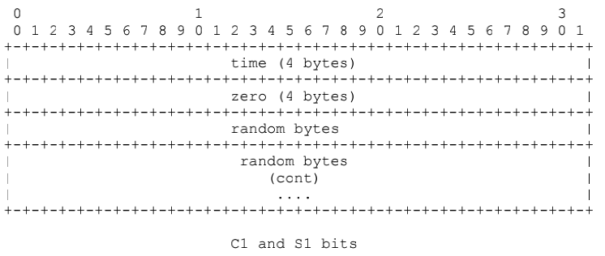<br /><br />1）**时间戳**（Time 4bytes）：用于C/S发送所有后续块的时间起点，可以从0开始，或者其他值，主要用于多路流传输的时间同步。<br />2）**零值**（Zero 4bytes）：规范中说必须为0，实际传输协议中并未对此进行校验，没啥意义，如果不是0，代表要使用复杂握手，仍可正常传输。<br />3）**随机数据**（Random data 1528bytes)：为随机数序列，用户区分出其响应C2/S2来自此RTMP连接发起的握手，还是其他方发起的握手，此外这个不需要对随机数进行加密保护，也不需要动态值。 |
| C2和S2 | C2 和 S2 数据包长度都是 1536 个节，基本就是 S1 和 C1 的副本，其中S2是C1的复制，C2是S1的复制。<br /><br /><br />1）**时间戳**（Time 4bytes）：必须是对方C1/S1发来的时间戳（对C2来说是S1的时间戳，对S2来说是C1的时间戳）<br />2）**时间戳2**（Time2 4bytes）：必须是前面自己发送的C/S包里的时间戳<br />3）**随机数据回显**（Random echo 1528bytes）：必须是对方发来的C1/S1包里携带的随机数据（对C2来说是S1，对S2来说是C1) |

**注**：在构建RTMP代码时一般**只针对版本号进行校验，时间戳对其机随机数对其等校验不严格**，因为当前很多RTMP流媒体协议并没那么规范，如果严格校验，兼容性会差。

<div align="center"></div>

​      

### 2）复杂握手

相对于简单握手，**复杂握手主要是增加了更严格的验证**，即主要是将简单握手中1528 Bytes随机数的部分平均分成两部分， 一部分764Bytes存储public key（公共密钥，32字节），另一部分 764Bytes存储digest（密文，32字节）。

另外， 复杂握手还有一个明显的特征就是：**C1、S1的version部分不为0， 服务端可根据这个来判断是否简单握手或复杂握手**。

| 信息   | 说明                                                         |
| ------ | ------------------------------------------------------------ |
| C0和S0 | C0 和 S0 包都是一个单一的8位字节，以一个单独的8位整型域进行处理<br />-- **version**： 说明是明文还是密文，如果使用的是明文（0X03），同时代表当前使用的rtmp协议的版本号，如果是密文，该位为0x06 |
| C1和S1 | 区别于简单握手数据部分：<br />1）key：<br />-- random-data：长度由这个字段的最后4个byte决定，即761 - 764<br />-- key-data：128个字节。Key字段对应C1和S1有不同的算法。发送端（C1）中的Key应该是随机的，接收端（S1）的key需要按照发送端的key去计算然后返回给发送端。<br />-- random-data：（764 - offset - 128 - 4）个字节<br />-- key_offset：4字节, 最后4字节定义了key的offset（相对于KeyBlock开头而言，相当于第一个random_data的长度）<br /><br />2）digest <br />-- offset：4字节, 开头4字节定义了digest的offset<br />-- random-data：长度由这个字段起始的4个byte决定<br />-- digest-data：32个字节<br />-- random-data：（764 - 4 - offset - 32）个字节 |
| C2和S2 | C2、S2就是把digest放到最后那32字节上，主要是用来对C1、S1的验证 |

​    

## 2、RTMP数据格式

### 1）Message

消息（Message）是**RTMP协议中基本的数据单元**，由Message Header和Message Payload（即message body）组成。**对于音视频数据而言，每一个message就是一帧数据**，且对于flv的tag而言，就是对应rtmp每个message，一个tag就是一个message，是一一对应的关系，相当于每一个tag都封装成一个message。message payload的数据格式和tag data的数据格式是相同的，message header和tag header的格式不同。

Message Format如下：

|                 | Field                        | Comment                                                      |
| --------------- | ---------------------------- | ------------------------------------------------------------ |
| Message Header  | Length（3 bytes）            | Message Payload（消息负载）的长度，不包含Message Header      |
|                 | Timestamp（4 bytes）         | 时间戳（既是pts也是dts，因为直播场景中没有B帧，所以pts=dts） |
|                 | Message Type Id（1 bytes）   | 消息类型，主要包括协议控制消息、音视频消息、命令消息等       |
|                 | Message Stream Id（3 bytes） | 消息流ID可以是任意值，即不同的message可以有相同的值，且复用到同一块流上的不同消息流基于它们的消息流ID解复用。 |
| Message Payload | --（n bytes）                | 消息中包含的实际数据，消息类型不同payload大小也不同，例如它可以是一些音频样本或压缩视频数据或Metadata等 |

**注**：多路复用，即**RTMP可以将来自不同视频流的切片（chunk）在单个连接上传输**，这种方法被称为“多路复用”，不同的流就用不同的Message Stream Id区分。

<div align="center"></div>

   

### 2）Chunk

RTMP 传输的数据称为Message，其中**包含音视频数据和信令**，但实际传输时不是以Message为单位的，而是**把Message拆分成Chunk发送**（chunk是RTMP最小的传输单元），主要目的是**防止一个大的数据包传输时间过长，阻塞其它数据包的传输**。

而且Chunk在传输时，**同一个Message产生的多个Chunk只会串行发送**，即必须在一个Chunk发送完成之后才能开始发送下一个Chunk，其中每个Chunk中带有msg stream id代表属于哪个Message，接受端也会按照这个id来将chunk组装成Message，此外**不同Message产生的Chunk可以并行发送，且并行发送的Chunk复用了一条TCP链接**。

每个Chunk的默认大小是 128 字节，可以通过Set Chunk Size的控制信息设置Chunk数据量的最大值，在发送端和接受端会各自维护一个Chunk Size，可以分别设置这个值来改变自己这一方发送的Chunk的最大值，其配置大小多少合适，需要根据性能要求来调试合适的大小。

Chunk格式包含基本头、消息头、扩展时间戳和负载，如下图所示：

<div align="center"></div>

|              | Field                                 | Comment                                                      |
| ------------ | ------------------------------------- | ------------------------------------------------------------ |
| Chunk Header | Basic Header（1~3 bytes）             | 包含fmt（chunk type）和chunk stream id（csid），其中fmt决定了chunk的类型及message header的长度，占2 bit，而Basic header的长度取决于csid的数值大小，最少占1 byte。 |
|              | Message Header（0，3，7 or 11 bytes） | 要发送的实际信息（可能是完整的，也可能是一部分）的描述信息，其长度取决于Basic Header中的chunk type，有Type 0，1，2，3类型的header |
|              | Extended Timestamp（0 or 4 bytes）    | 扩展时间戳（0 bytes时表示此字段不存在）                      |
| Chunk Data   | --（n bytes）                         | 是消息中包含的实际数据，消息类型不同data大小也不同           |

**注**：多种chunk type的目的是减少重复数据发送，提高chunk data的占比

​    

#### a Basic Header（基本头信息）

| Field                    | Comment                                                      |
| ------------------------ | ------------------------------------------------------------ |
| fmt（2bits）             | 表示**chunk的类型**，取值[0, 3]，即chunk共有4种类型          |
| csid（6，14 or 22 bits） | **流通道Id**（chunk stream id），用来**唯一标识一个特定的流通道**，同一个Chunk Stream ID必然属于同一个信道，**chunk type决定了后面Message Header的格式**。<br />上文提到Basic Header大小为1-3 bytes，其中fmt域占2bits，CSID的长度时可变的（6 bits、14 bits或22 bits），其决定了基本头的长度，在足够表征流通道的前提下，最好用尽量少的字节来表示CSID，从而减少由于引入Header增加的数据量。<br />RTMP最多可支持65597个流，CSID范围在3-65599 内，其中0~2为协议保留用作特殊信息，通常控制流csid为2，命令流为3，开发中发现音视频流csid可自定义，如音频流4，视频流6。 |

示例：

1）Basic Header为1bytes时：csid为6bits，取值在[3~63]

<div align="center"></div>

2）Basic Header为2bytes时：第一个字节除了fmt外，其余6位表示数字0，csid范围是[64~319]，即最大为(2^8 - 1) + 64 = 319

<div align="center"></div>


3）Basic Header为3bytes时：第一个字节除了fmt外，其余6位表示数字1，csid范围是[64~65599]，最大值为 (2^16 - 1) + 64 = 65599

<div align="center"></div>

​    

#### b Message Header（消息头消息）

包含了要**发送的实际信息的描述信息**（可能是完整的，也可能是一部分）

Message Header的格式和长度取决于Basic Header的chunk type（fmt）取值[0~3]，所以共有4种不同的chunk格式，目的是减少重复数据发送，提高 chunk data的占比，同时也有4种不同的Message Header。

| 类型  | 说明                                                         |
| ----- | ------------------------------------------------------------ |
| fmt=0 | <br />Message Header共11字节，此**类型必须在块流开始时使用**，当流时间戳向后（例如，回退播放）时也要使用此格式。<br /><br /><br />1）**timestamp**（3bytes）：最多能表示到16777215=0xFFFFF，如果时间戳大于或等于16777215（0xFFFFFF），该字段值必须为16777215，并且必须设置扩展时间戳Extended Timestamp来一起表示32位的时间戳，否则该字段就是完整的时间戳。接受端在判断timestamp值为0xFFFFFF时就会去Extended timestamp中解析实际的时间戳。<br />2）**message length**（消息数据的长度）：占用3个字节，表示**实际发送的消息的数据**，如音频帧、视频帧等数据的长度，**注意这里是Message的长度，也就是chunk属于的Message的总数据长度，而不是chunk本身Data的数据的长度**。<br />3）**message type id**（消息的类型id）：占用1个字节，表示**实际发送的数据的类型**，如8代表音频数据、9代表视频数据。msg stream id（msid)：占用4个字节，表示该chunk所在的流的ID，它采用小端存储的方式。 |
| fmt=1 | <br />Message Header共7字节，和前一个chunk共用message stream id（msid），因此省去了message stream id的4字节，**表示此Chunk和上一次发的Chunk所在的流相同**（不是相同的message），如果在发送端和对端有一个流连接的时候尽量采用这种格式。<br /><br /><br />1) **timestamp delta**：占用3个字节，这里和type＝0时不同，**表示上一个chunk的时间差**，当它的值超过3个字节所能表示的最大值时，设置为0xFFFFFF，实际的时间戳差值就会转存到Extended Timestamp字段中，接受端在判断timestamp delta字段24个位都为1时就会去Extended timestamp中解析时机的与上次时间戳的差值。<br />2) 其它字段同fmt=0 |
| fmt=2 | 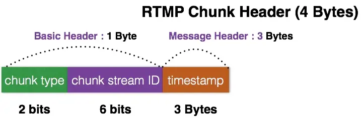<br />Message Header共3字节，相对于 fmt=1 格式又省去了message length的3个字节和message type id的1个字节，表示**此 chunk和上一次发送的 chunk 的message length、message type id都相同**，余下的这三个字节表示 timestamp delta，使用同type=1。<br />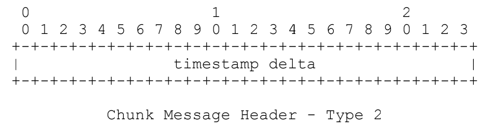 |
| fmt=3 | <br />表示**这个chunk的Message Header和上一个是完全相同的，不存在消息头**<br />1) 当它跟在Type＝0的chunk后面时，表示和前一个chunk的时间戳都是相同的，就是一个Message拆分成了多个chunk，这个chunk和上一个chunk同属于一个Message；<br />2) 当它跟在Type＝1或者Type＝2的chunk后面时，表示和前一个chunk的时间戳的差是相同的，比如第一个chunk的Type＝0，timestamp＝3600，第二个chunk的Type＝2，timestamp delta＝3600，表示时间戳为3600+3600，第三个chunk的Type＝3，表示timestamp delta＝3600，时间戳为3600+3600+3600 |

   

#### c Extended Timestamp（扩展时间戳）

扩展时间戳用来辅助编码超过16777215（0xFFFFFF）的时间戳或时间戳增量

当类型0，1或2的块，无法用24位字段来表示时间戳或时间戳增量时就可以启用扩展时间戳，同时类型0块的时间戳字段或类型1，2的时间戳增量字段值应该设为16777215（0xFFFFFF）。当类型3块最近的属于相同块流ID的类型0块、类型1块或类型2块有此字段时，该类型3块也应该有此字段。

​    

#### d Chunk Data（块数据）

用户层面上真正想要发送的与协议无关的数据，长度在[0,chunkSize]之间

​     

## 3、RTMP消息类型（RTMP Message Type）

rtmp协议中有多种消息，用于**数据传输**和**命令控制**等操作，**所有的消息都是封装成message，然后通过chunk来传输**。

| 类型                                       | 说明                                                         |
| ------------------------------------------ | ------------------------------------------------------------ |
| 协议控制消息（Protocol Control Messages）  | 在RTMP的chunk流会用一些特殊的值来代表协议的控制消息，属于RTMP chunk流协议层的消息，它们的Message Stream ID必须为0（代表控制流信息），CSID必须为2，Message Type ID可以为1，2，3，5，6，具体代表的消息会在下面依次说明。控制消息的接受端会忽略掉chunk中的时间戳，收到后立即生效。 |
| 命令消息（Command Message）                | 命令消息（Command Messages）是**用于 C-S 进行直接交互应答的一类消息**，一般情况下，**命令消息的发送对端是需要对端进行应答信号反馈的，且需要AMF编码**，AMF0编码时Message Type ID = 20，使用AMF3编码时Message Type ID = 17，CSID通常为3。<br />**命令类型的消息包含命令名称、事务ID和相关参数**，如client端发送connect命令时需要包含要连接的应用名称作为参数，然后server端回复消息时带上收到的transaction ID表示对此条消息的回应，此外回复命令有_result，_error，或者其他如verifyClient，contactExternalServer的方法名。<br /><br />发送命令消息的对象有两种分别是NetConnection和NetStream：<br />1）NetConnection：表示双端的上层连接，服务器和客户端之间进行网络连接的一种高级表示形式。<br />2）NetStream：表示流信息的传输通道如音频流、视频流，以及控制流信息的状态，如Play播放流，Pause暂停。 |
| 数据消息（Data Message）                   | 传递一些元数据（MetaData，比如视频名，分辨率等等）或者用户自定义的一些消息，且当信息使用AMF0编码时，Message Type ID＝18，AMF3编码时Message Type ID＝15。 |
| 共享消息（Shared Object Message）          | 共享对象是在多个客户端、实例等之间同步的Flash对象，Flash对象是由键值对组成的集合，且每条消息可以包含多个事件，此外当信息使用AMF0编码时，Message Type ID＝19，AMF3编码时Message Type ID＝16。 |
| 音/视频信息（Audio/Video Message）         | 每一个message就是一帧数据。对于flv的tag而言，就是对应rtmp每个message，一个tag就是一个message，是一一对应的关系；相当于每一个tag都封装成一个message。<br />RTMP 块流使用Message Type ID=8 作为音频数据，flv的tag header->tag type也用8来表示音频，而通常音频流的csid是4（也可以自定义），音频流的每一个chunk的csid都是相同的。 |
| 聚合消息（Aggregate Message）              | 聚合消息是包含一系列RTMP子消息的单个消息，Message Type ID＝22。<br />聚合消息的消息流ID覆盖聚合内部的子消息的消息流程ID，此外聚合消息和第一个子消息的时间戳之间的差异，是用于将子消息的时间戳记重新规范化为流时间尺度的偏移量。 |
| 用户控制消息（User Control Message Event） | RTMP 流中的用户控制消息在接收时立即生效，消息中的时间戳被忽略，此外该信息在 chunk 流中发送时，它们的Message Stream ID必须为0（代表控制流信息），CSID必须为2，Message Type ID必须为4。与前面提到的协议控制信息（Protocol Control Message）不同，这是**在RTMP协议层的，而不是在RTMP chunk流协议层的**，这个很容易弄混。 |

​    

## 4 数据传输

### 1）发送/接收过程

Chunk在传输：**同一个Message产生的多个Chunk只会串行发送**，先发送的Chunk一定先到达，且不同Message产生的Chunk可以并行发送，不同的Message可以是不同的流，并行发送的Chunk复用了一条TCP链接，这就是所说的多路复用（Multiplexing）。

<div align="center">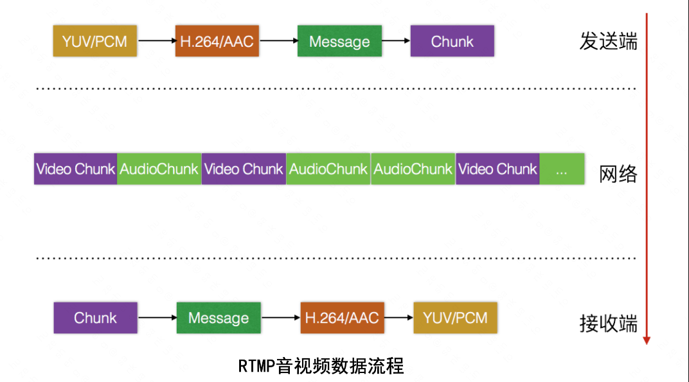</div>

​    

#### a 发送端

Step1：数据封装成消息（Message），包括协议控制消息、用户控制消息、音视频数据消息等。

Step2：把消息分割成消息块（Chunk，网络中实际传输的内容）

Step3：将分割后的消息块（Chunk）通过TCP协议发送出去

<div align="center">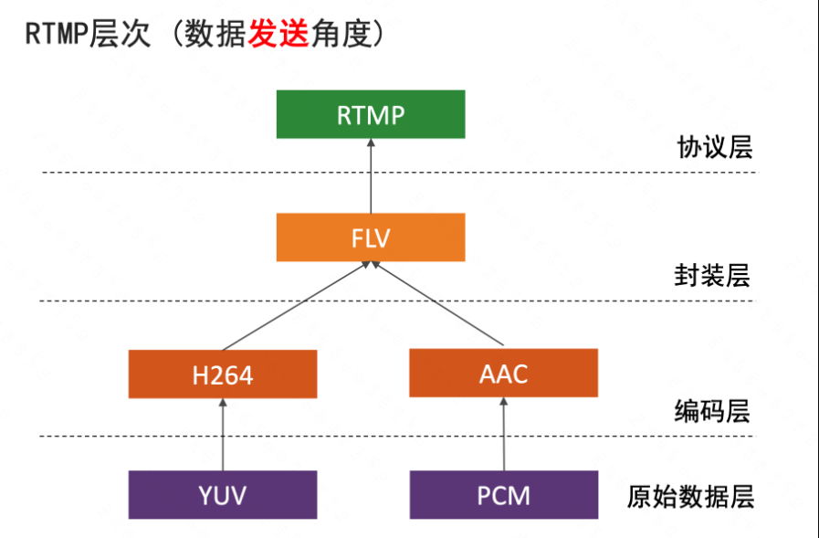</div>

​     

#### b 接收端

在通过TCP协议收到数据后，现将消息块重新组合成消息(Message)，而后通过对消息进行解封装处理就可以恢复出数据。

<div align="center">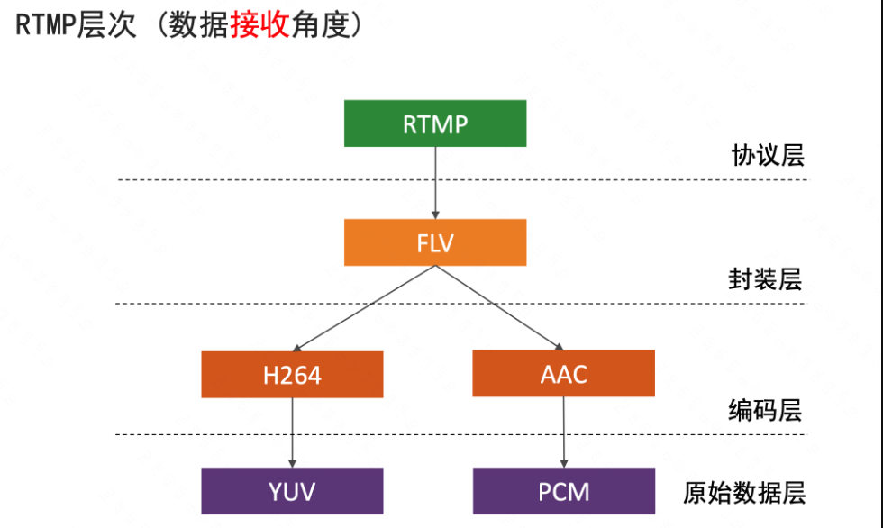</div>


​     

#### c RTMP消息优先级

在RTMP中，消息(Message)主要分为两大类：**控制消息（协议控制消息、用户控制消息）**和**数据消息（音视频消息）**，但是通路只有一条(RTMP是单通路)，到底谁先走呢，谁后走呢？在实际传输过程中是对消息分优先级，**优先级高的先行，且优先级低的不能阻塞优先级高的，即协议先行，数据次之**

* 协议控制消息（Protocol Control Messages）和用户控制消息（User Control Messages）：应该包含消息它们的Message Stream ID必须为0（代表控制流信息），CSID必须为2
* 数据消息（音频信息、音频消息）比控制信息的优先级低， 另外，一般情况下音频消息比视频数据优先级高

<div align="center">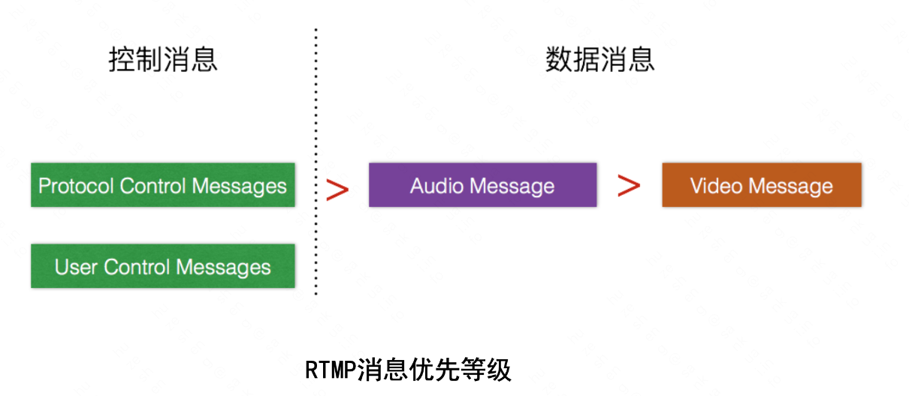</div>

​     

### 2）Chunk传输过程

RTMP官方文档示例

#### a Audio Example

一个audio的消息流：Message Type ID = 8 表示音频，每个message有相同的message stream ID，message type ID，message length，以及增量相同的timestamp。

<div align="center"></div>

**audio message比较小，基本不会对message进行拆分，一个message对应一个chunk**，实际发送的情况为：

1) 第1个Message的chunk的chunk type为0，因为前面没有可参考的chunk，此时chunk的长度为Basic Header（1 byte）+ Message Header（11 bytes）+ Payload（32 bytes）= 44 bytes。

2) 第2个Message的chunk可与前一个共用length、type id和msid，但是不可省略timestamp delta字段，所以chunk type为2，同理可得chunk长度为36 bytes。

3) 第3个Message的chunk可以共用前一个的timestamp delta字段，所以chunk type为3，chunk长度为33 bytes。

4) 第4个Message的chunk可以共用前一个的timestamp delta字段，所以chunk type为3，chunk长度为33 bytes

<div align="center"></div>

​     

#### b Video Example

一个video的消息流：Message Type ID = 9 表示视频

<div align="center"></div>

Payload length为307 > 128字节（chunk data默认是128字节），所以需要将Message拆分成多个chunks，首个chunk使用Type 0，之后的chunk由于是同一个Message拆分而来，以上字段都可共享，所以直接使用Type 3，但需要注意的是，**第一个chunk的length需要传入整个message的负载长度即307**。

<div align="center">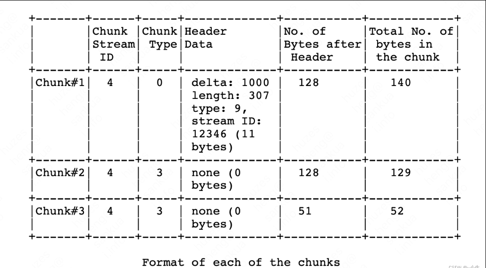</div>

​     

### 3）推拉流过程

RTMP流媒体需要支持视频源端（视频发布端）通过rtmp推送采集的视频流，同时也要支持播放客户端通过RTMP地址拉流播放。

#### a 推流

RTMP推流流程：

1）客户端发送握手请求，和服务器完成握手（handshaking done）

2）客户端发送命令消息中的 “连接connect” 到服务器，请求与一个服务应用实例建立连接（Command Message：connect）

3）服务器接收到连接命令消息后，发送确认窗口大小到客户端，同时连接到连接命令中提到的应用程序（Window Acknowledgement Size）

4）服务器发送设置带宽协议消息到客户端（Set Peer Bandwidth）

5）客户端处理设置带宽协议控制消息后，发送确认窗口大小到服务器端（Window Acknowledgement Size）

6）服务器发送用户控制消息中的 “流开始StreamBegin” 消息到客户端，通知客户端流成功创建，可用于通信（User Control：StreamBegin）

7）服务端发送connect的“应答消息_result“，通知客户端连接的状态（Command Message：_result）

8）客户端发送网络连接命令的 “创建流createStream” 消息到服务端，以创建消息通信的逻辑通道，即音频、视频和元数据的发布通过使用createStream命令创建的流通道执行，而后服务端发送createStream的“应答消息”(_result)。

9）客户端发送网络流命令的 “发布publish” 到服务端，将命名流发布到服务器，其它客户端可以使用此流名来播放流，接收发布的音频，视频，以及其他数据消息。

10）客户端发送命令消息或音视频数据至服务端。

<div align="center">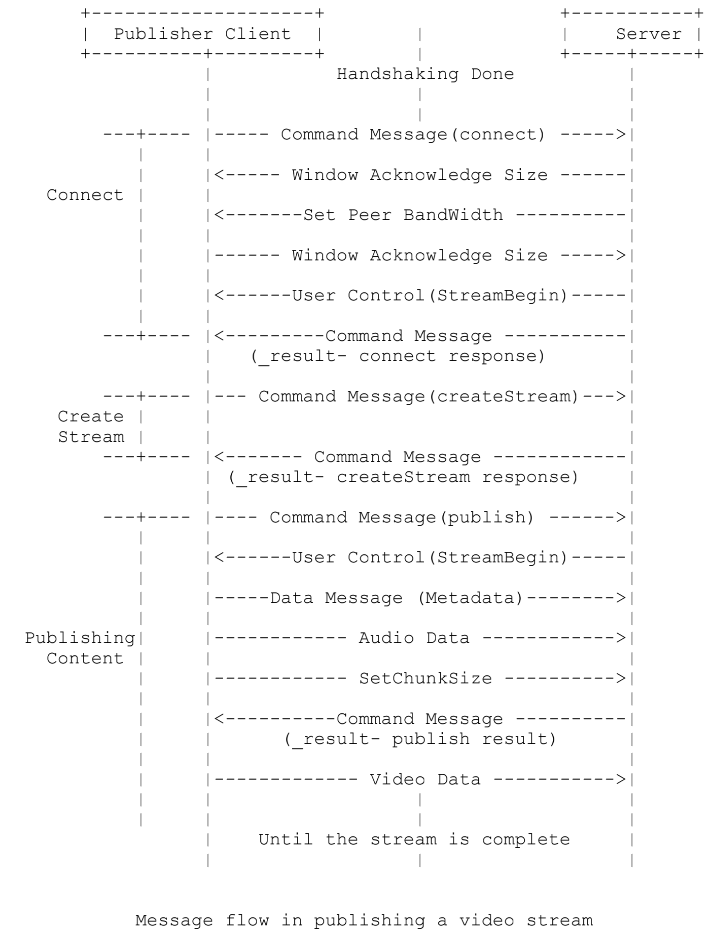</div>

**注**：其上为官方规范文档中描述的流程，实际过程可能稍有不同，**发送端和接收端主要对创建流、发布、和数据传输的消息比较关注**，解析时一般按照规范顺序和格式解析，其他消息发送顺序并无特殊规定，消息较小时，可一次发送多个RTMP消息。

​      

#### b 拉流

拉流过程简述：

1) 首先和推流一样，由客户端发起握手协议，发送创建流命令

2) 服务器端接收创建流命令后，发送响应命令

3) 客户端发送命令消息（play）

4) 服务器端接收到播放命令play后，配置chunk大小，发送用户控制协议（StreamIsRecorded、StreamBegin）通知是否录制流，流已开启标志，之后发送播放命令响应消息（刷新当前状态、通知播放开始），这里如果play命令成功，服务端回复onStatus 命令消息 NetStream.Play.Start和NetStream.Play.Reset，其中NetStream.Play.Reset只有当客户端发送的play命令里设置了reset时才会发送，如果要播放的流没有找到，服务端会发送onStatus消息NetStream.Play.StreamNotFound。

5) 服务器端发送音视频消息到客户端，客户端开始播放

<div align="center">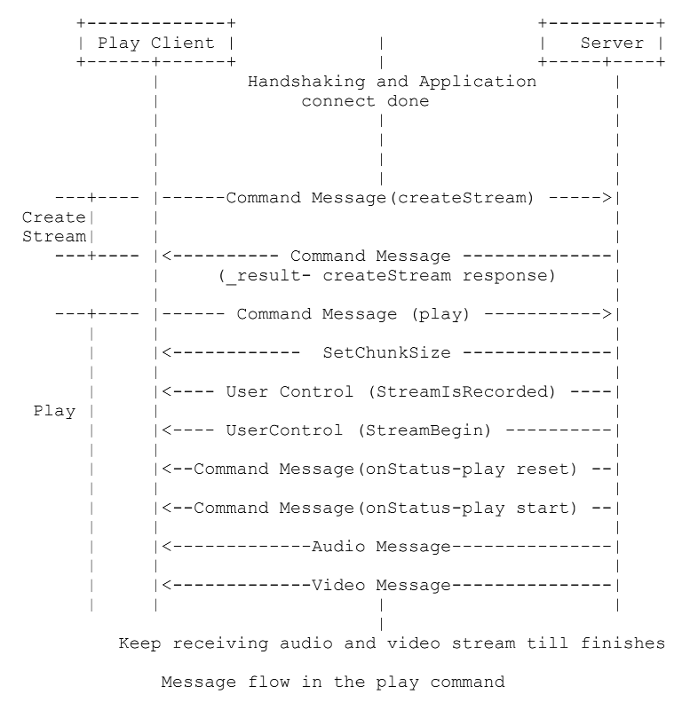</div>

​     

## **5 使用场景&优缺点**

| 类型 | 说明                                                         |
| ---- | ------------------------------------------------------------ |
| 场景 | 用于流式传输到 Flash 播放器，广泛应用于直播                  |
| 优点 | 低延迟：RTMP使用独占的 1935 端口，无需缓冲，可以实现低延迟<br />适应性强：所有 RTMP 服务器都可以录制直播媒体流，同时还允许观众跳过部分广播并在直播开始后加入直播流<br />灵活性：RTMP 支持整合文本、视频和音频，支持 MP3 和 AAC 音频流，也支持MP4、FLV 和 F4V 视频 |
| 缺点 | HTML5 不支持：标准HTML5 播放器不支持 RTMP 流<br />容易受到带宽问题的影响：RTMP 流经常会出现低带宽问题，造成视频中断<br />HTTP 不兼容：无法通过 HTTP 流式传输 RTMP，必须需要实现一个特殊的服务器，并使用第三方内容交付网络或使用流媒体视频平台。 |

​    

## 6 其它QA

**Q：rtmp为什么会低延时？**

A：一个message就是帧，相当于一帧数据产生后立刻发送过来，所以延时较低。相比于HLS，一个切片生成后才会发送，延时就会很大。

​    

**Q：rtmp和flv的关系？**

1）rtmp是数据传输协议，flv是音视频的封装格式

2）rtmp和flv在音视频数据的封装上是相同的，即message payload的数据形式和flv tag data的数据形式是相同的，也就是说flv tag和rtmp message，除了header部分，body部分格式是完全一样的。

音频

<div align="center">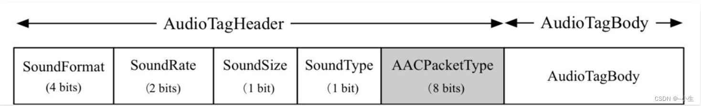</div>

视频

<div align="center">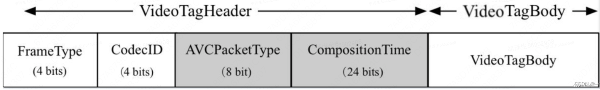</div>

​       

# 三  HTTP-FLV(HDL)

HTTP-FLV 是将音视频数据以 FLV 文件格式进行封装，再将 FLV 格式数据封装在 HTTP 协议中进行传输的一种流媒体传输方式。

<div align="center"></div>

## **1 FLV格式**

FLV 是FLASH VIDEO的简称，FLV流媒体格式是随着Flash MX的推出发展而来的视频格式，由于它形成的文件极小、加载速度极快，使得网络观看视频文件成为可能，它的出现有效地解决了视频文件导入Flash后，使导出的SWF文件体积庞大，不能在网络上很好的使用等问题。

其中，FLV 由 FLV header 和 FLV file body 两部分组成，而 FLV file body 又由多个 FLV tag组成，FLV tag由 tag header + tag body组成。

```xml
FLV = FLV header + FLV body
FLV body = PreviousTagSize0 + Tag1 + PreviousTagSize1 + Tag2 + … 
+ PreviousTagSizeN-1 + TagN
Tag1 = Tag1 header + Tag1 body
```

格式详情见 “音视频封装格式基础” - FLV部分内容...

​    

## 2 HTTP-FLV直播

**简介**：

1) 基于HTTP 1.1 **分块传输机制（Chunked transfer encoding）**实现直播
2) 客户端每次请求HTTP-FLV直播流，服务器先发送 FLV header、script tag以及audio config tag和video config tag，再发送当前时间点FLV音视频数据（一header三tag）
3) HTTP-FLV优缺点：

| 选项 | 详情                                                         |
| ---- | ------------------------------------------------------------ |
| 优点 | **HTTP优点**： <br />1）**服务器兼容性好**：基于HTTP协议，且当前一些防火墙会墙掉 RTMP 或者其他的一些协议，但是防火墙对 HTTP 非常友好，不会墙掉 HTTP，因此基于 HTTP 传输的成功率更高 <br />2）**相对低延时**：基于HTTP长连接直接传输FLV流，传输颗粒度小（发一次请求，客户端分多次提供数据）<br /><br />**FLV 优点**：<br />1）MP4、MKV 等封装格式**将音视频数据和音视频元数据、索引、时间戳等分开存放，必须拿到完整的音视频文件才能播放**，因为里面的单个音视频数据块不带有时间戳信息，播放器不能将这些没有时间戳信息的数据块连续起来，因此不能实时的解码播放（当然 MP4 后来扩展了 FMP4 用于流媒体）。<br /> 2）FLV 格式的 **FLV Tag Header 中携带时间戳**，FLV 将每一帧音视频数据（Tag Body）封装成包含时间戳等音视频元数据（Tag Header）的数据包（Tag），因此当播放器拿到 Tag 后，可根据时间戳等音视频元数据进行解码和播放。 |
| 缺点 | 1）播放端兼容性不好：需要flash支持，主流浏览器抛弃flash<br />2）**不适合多音轨**：flv只能有一条音轨和一条视频轨 |

**HTTP-FLV 实现原理**：HTTP-FLV 利用 HTTP/1.1 分块传输机制发送 FLV 数据

虽然直播服务器无法知道直播流的长度，但是 HTTP/1.1 分块传输机制可以不填写 conten-length 字段，而是携带 Transfer-Encoding: chunked 字段，这样客户端就会一直接受数据。

<div align="center"></div>

​    

### 1）HTTP/1.1 CHUNK分块传输编码

**分块传输编码（Chunked transfer encoding）**是超文本传输协议（HTTP）中的一种数据传输机制，允许HTTP由应用服务器发送给客户端应用的数据可以分成多个部分，即**允许客户端发送一次请求，而服务器将数据分多次发送给客户端（响应头只有一个）**。

**特点**：

1）区别于Range请求，带range请求只是规定了传输范围，属于短连接

* 短连接：即一次请求对应一次TCP连接的建立和销毁过程
* 长连接：即多个请求共用同一个连接这样可以节省大量连接建立时间提高通信效率

2）分块传输编码只在HTTP协议1.1版本（HTTP/1.1）中提供，HTTP 1.0不支持该特性

​    

**基本原理**：

通常一次HTTP应答消息中发送的数据是整个发送的，“Content-Length” 消息头字段表示传输的数据大小，该字段可以让客户端应用判断数据传输何时结束，以及后续应答消息的何时开始。

而**分块传输编码是将数据切割成一段段的数据块**，每个分块包含十六进制的长度值和数据，长度值独占一行，长度不包括该行结尾的 **CRLF（\r\n）**，也不包括分块数据结尾的CRLF，但是包括数据里面的CRLF。最后一个分块长度值必须为 0，对应的分块数据没有内容，但是必须跟两个CRLF，表示实体结束，也就是说最后一个分块为 “0\r\n\r\n”，这样的话，服务器不需要在发送数据前预先知道发送内容的总大小。

分块格式如下：

<div align="center"></div>

**优势**：

1) HTTP分块传输编码**允许服务器为动态生成的内容维持HTTP持久连接**（长连接）

   相当于说“Content-Length”无限大，数据的传输不会停止，那TCP连接自然一直存在，而直播场景就是属于典型的“内容动态生成”的实例，这是HTTP-FLV直播实现的基础【**动态内容，content-length无法预知**】

2) 分块传输编码**允许服务器在最后发送消息头字段**

   对于那些头字段值在内容被生成之前无法知道的情形非常重要，例如消息的内容要使用散列进行签名，散列的结果通过HTTP消息头字段进行传输。没有分块传输编码时，服务器必须缓冲内容直到完成后计算头字段的值并在发送内容前发送这些头字段的值【**散列签名，需缓冲完成才能计算**】

3) HTTP服务器有时使用**压缩 （gzip或deflate）以缩短传输花费的时间**

   分块传输编码可以用来分隔压缩对象的多个部分，在这种情况下，块不是分别压缩的，而是整个负载进行压缩，压缩的输出使用本文描述的方案进行分块传输。在压缩的情形中，分块编码有利于一边进行压缩一边发送数据，而不是先完成压缩过程以得知压缩后数据的大小【**gzip压缩，压缩与传输同时进行**】

​    

**HTTP-FLV 请求-响应的报文示例**：

<div align="center"></div>

​     

### 2）iOS播放HTTP-FLV直播流

AVPlayer作为iOS系统中原生的播放组件，具有良好的性能，灵活，轻便等的特点，同时它的**不支持HTTP-FLV格式**一直被人诟病，考虑到AVPlayer对HLS直播流有着很好的支持，因此一个解决思路是**在客户端将HTTP-FLV格式内容实时的转换成HLS直播流，提供给AVPlayer播放**。

**注：**由于AVPlayer的高度封装特性，不能够满足正常的视频业务发展需求，不过作为一个轻量的直播播放器，也是一个不错的选择。

基于以上思路，将整个流程划分为三个步骤：**http-flv拉流&hls转换** -> **本地代理http服务** -> **创建AVPlayer播放**

  

#### a http-flv拉流 & HLS转换

http-flv拉流如上述提到 http chunk分块传输方式

**FLV转HLS服务**：

1）FLV（Flash Video）是一种多媒体封装格式，由FLV header 和 FLV file body 组成，FLV header 主要是FLV标识，版本，以及是否有音视频流的信息，而FLV file body则由一个个Tags组成，这里主要有三种类型：

* Script Tag：用来描述onMetaData信息，包含**视频码率，帧率，长宽，编码类型，以及音频的采样率，声道数，编码类型**等信息
* Video Tag：视频信息，可以通过里面的 AVCPacketType 区分是 Video Header 还是 Video Data
* Audio Tage：音频信息，可以通过里面的 AACPacketType 区分是 Audio Header 还是 Audio Data

2）HLS，全称 HTTP Live Streaming，是苹果公司实现的基于 HTTP 的流媒体传输协议，由三部分组成：HTTP、M3U8、TS/FMP4，这三部分中，HTTP 是传输协议，M3U8 是索引文件，TS/FMP4 是音视频的媒体信息。它的工作原理简单说是**将直播的流式数据通过切割成一个个小文件，将这些小文件名记录成到一个索引文件中，播放器先请求索引文件，然后再取到对应的切片的文件，通过请求一个个小文件实现连续的播放**。

若以fmp4做为HLS的媒体文件，FLV转HLS的过程实际为：

* 1、FLV格式解封装
* 2、封装成指定时长（如:1s）的fmp4分片
* 3、根据fmp4分片，生成m3u8文件

​    

流程如下图所示：

<div align="center"></div>

​    

#### b 本地HTTP代理服务

**Q**：基于上述操作，将HTTP-FLV直播流实时的转换为HLS直播流，那么**AVPlayer如何播放转换的数据**？ 

由于通过AVAssetResourceLoaderDelegate可以向AVPlayer提供mp4格式数据，但是**不支持HLS的fmp4数据**，因此需要构建了一个本地服务器，**由AVPlayer请求本地服务器的HLS数据，进行播放**。

关于本地代理服务器，最终选择的是GCDWebServer，选择这套服务器架构的主要原因：

1. 它是一个轻量级的基于 HTTP 1.1的服务服务器，不依赖任何第三方的源码
2. 完全使用基于事件驱动的Grand Central Dispatch以求最佳性能和并发能力 
3. 包体积小

当然他还有其它好处，详情 github 的官网：[GitHub - swisspol/GCDWebServer: The #1 HTTP server for iOS, macOS & tvOS (also includes web based uploader & WebDAV server)](https://github.com/swisspol/GCDWebServer) 

​    

#### c 创建AVPlayer播放

即根据本地服务器地址，HTTP-FLV中唯一的标识作为流名组装成本地HLS播放地址，创建AVPlayerItem, AVPlayer播放器起播。

​    

#### **d 整体流程**

整体的流程：

1）**业务层-本地代理服务交互**：

* 应用层传入 FLV 地址给本地服务，本地服务会根据FLV中的流名返回对应的本地 HLS 地
* 应用层根据返回的 **HLS 地址** ，创建AVPlayer，向本地服务请求对应的fmp4以及m3u8文件

2）**本地代理服务和转封装交互**

* 通过NSURLSession发送网络请求，下载 FLV数据
* 将FLV数据提供给转封装服务，生成对应的fmp4以及m3u8文件
* 本地代理服务问转封装服务获取对应的fmp4以及m3u8文件

<div align="center"></div>

​    

#### e HTTP-FLV直播实践优化

| 优化点         | 详情                                                         |
| -------------- | ------------------------------------------------------------ |
| 起播优化       | **HLS中fmp4作为媒体文件，AVPlayer获取到fmp4的速度是起播快慢的关键**。<br />AVPlayer播放HLS流程：AVPlayer请求m3u8文件，解析获取到fmp4的地址，发送fmp4文件请求，然后起播。<br />那么影响AVPlayer获取fmp4主要为以下几方面：<br />1）**fmp4分片时长**：分片时间越长，意味着下载FLV，生成fmp4的耗时就会增加，同时直播的延迟也会增加。实践得出AVPlayer支持的最小起播fmp4分片时长为250ms，考虑到分片时间越短，AVPlayer请求m3u8/fmp4的频率也会增加，所以将前2个分片时长设置为250ms，其余分片时长为500ms。<br />2）由于HLS规范要求，**m3u8内包含的总的分片时长必须大于3个 EXT-X-TARGETDURATION， AVPlayer才会去请求分片，进行起播**。EXT-X-TARGETDURATION 为正整数，单位为秒，所以最小时长为1s，那么播放器起播的最少时长为 3s，但实际测试下来，需要至少3.03s的时长。<br />问题：**FLV转HLS，是先生成fmp4，再生成m3u8**，假设一个分片500ms，意味着需要下载3.5s的FLV数据，转换成HLS，AVPlayer才会请求分片，起播。<br />针对这个问题，起播时**预先生成一个m3u8文件**，包含4个分片，每个分片时长标识为1s，如此总时长为4s，**大于起播时分片总时长的判断要求**，AVPlayer顺利请求fmp4文件起播，而实际的分片时长仍为前2个250ms, 其余500ms。<br /> |
| 播放稳定性支持 | 1）**动态分辨率支持**：推流的过程中存在切换视频分辨率的场景，如：直播过程中**主播连麦**、**画面横竖屏切换**等的推流视频分辨率会发生变化。FLV转HLS过程中检测到新的Video Tag，则向m3u8文件中插入 `#EXT-X-DISCONTINUITY` 标签分割前后两种直播流，从而可以避免重新加载AVPlayer，保障播放的流畅性。<br />2）**网络稳定性兼容**：播放的过程中可能会出现用户网络短暂中断后恢复，以及Wife和4G的网络切换等的场景，导致HTTP-FLV拉流中断后，从新拉流。<br />我们同样可以向m3u8文件中 `#EXT-X-DISCONTINUITY` 标签，避免AVPlayer播放出现中断，除非网络异常，短时间内无法恢复。 |

​     

# 四 HLS / LL-HLS

<div align="center">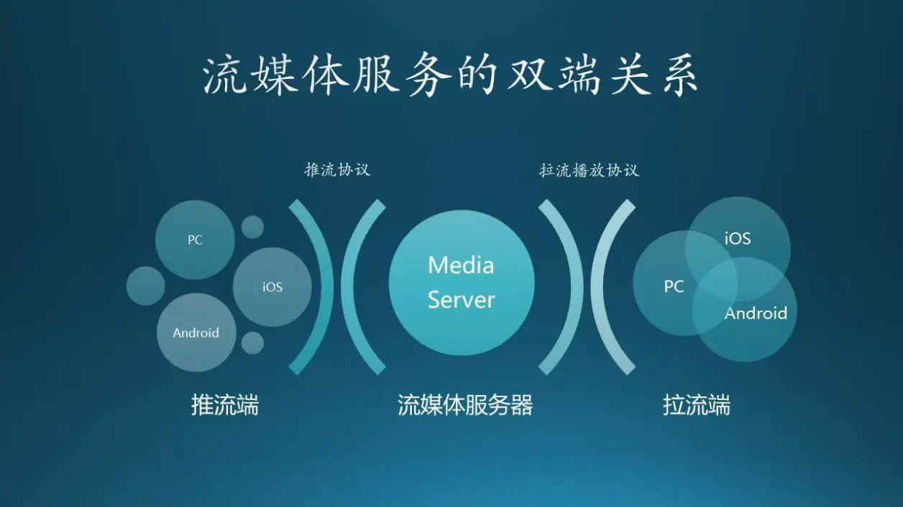</div>

## 1 现状&问题

传统直播技术使用的传输协议主要是 **RTMP**/**HTTP-FLV**，其中 RTMP是有Adobe公司开发的，虽然不是国际标准，但在当年Flash流行的年代影响下，成为了业界事实标准。

基于RTMP/FLV协议的直播，是国内比较成熟的直播架构体系, 在行业中已经投入使用近10年。一个典型的直播架构图如下：

<div align="center"></div>

基于RTMP/FLV协议从技术上也比较成熟，整个生态支持度非常完善。但从长远考虑，RTMP也存在各种无法解决的问题，这让我们对未来兼容性有很大的担忧。

1）首先，**RTMP/FLV标准已经超过10年没有更新**，在兼容性层面已经面临着很大挑战，比如对**h265的支持**，当前业界是通过hack的方式进行追加，但如ffmpeg都需要打补丁之后才能支持，各种系统工具支持性较差。甚至也会出现各家hack的方式不同，导致系统无法对接。如果涉及到出海的业务，由于无法对齐国际标准，难以与海外公司展开技术合作。

2）其次，**主流的浏览器原生不支持FLV**，需要在web端进行一次额外的转封装操作，会有额外开销，在用户设备负载较高时，可能会影响观看体验。

3）最后，**在直播场景中，非常适合p2p的应用，可以极大降低带宽成本**，但在流式协议上构建P2P成本较高，通常也会牺牲标准的兼容性。 

​    

相比较上述RTMP协议的一些缺点，HLS（fmp4）出现完美解决上述这些问题

* **fmp4标准**一直处于MPEG标准的维护中，对各种编码器和新技术， 如AV1，VVC支持度非常完善，同时主流浏览器也支持fmp4格式，省去了中间转封装的开销，可以减少网页端处理压力。
* 其次，**CDN部署更容易**，因为**HLS是基于文件传输**，传统的静态文件CDN只需要少量配置更改就可以支持相关业务，对传输内容不敏感。
* 另外，**fmp4在DRM支持性上非常好，可以对版权内容做更好的保护**。
* 最后，利用切片文件实现P2P较为方便，文件P2P方案在业界成熟， 也可以做到比较好的分享率，在直播场景中P2P可以有效节省带宽成本

​    

## 2 HLS协议简介

### 1）基础概念

HLS全称为 **HTTP Live Streaming**，是由苹果公司提出基于HTTP的流媒体网络传输协议，是苹果公司QuickTime X和iPhone软件系统的一部分，其基本原理是**将直播的流式数据通过切割成一个个小文件，并将这些小文件名记录成到一个索引文件中（包含元数据的extended M3U playlist文件，用于寻找可用的媒体流），播放器先请求索引文件，然后再取到对应的切片的文件，通过请求一个个小文件实现连续的播放**。

其次，随着直播流的进行，播放列表中的切片文件会进行不停更新，播放器不停的请求索引文件和切片文件下载到媒体数据，进行解码播放，这样就实现了画面直播。 

HLS协议规定：

* 视频的封装格式是TS
* 视频的编码格式为H264, 音频编码格式为MP3、AAC或者AC-3
* 除了TS视频文件本身，还定义了用来控制播放的m3u8索引文件

   

HLS只请求基本的HTTP报文，与实时传输协议（RTP）不同，**HLS可以穿过任何允许HTTP数据通过的防火墙或者代理服务器**，同时也很**容易使用内容分发网络来传输媒体流**。其次，HLS协议本身实现了码率自适应，不同带宽的设备可以自动切换到最适合自己码率的视频播放。

<div align="center"></div>

但HLS也有一些无法跨越的坑，比如**采用HLS协议直播的视频延迟时间无法下到10秒以下**，而RTMP协议的延迟最低可以到3、4秒左右，所以说对**直播延迟比较敏感的服务请慎用HLS**。

<div align="center"></div>

**整体流程说明**：

1) **Inputs**：视频源是什么格式都无所谓，与server之间的通信协议也可以任意（比如RTMP），总之只要把视频数据传输到服务器上即可

2) **Server**：即**将用户上传的视频转换成HLS格式的视频（既TS和m3u8文件）文件**

   a)     **Media encoder**：转码模块，将视频源中的视频数据转码到目标编码格式（如 H264）的视频数据，视频源的编码格式可以是任何的视频编码格式，比如 MPEG-TS 或者 MPEG 基本流（如 MPEG-ES，仅支持纯音频），并在编码完成之后，把封装之后的格式通过本地网络或者其他机制传递给**分片工具**（segmenter）。

   b)     **Stream segmenter**：即模块转码成H264视频数据之后，在stream segmenter模块将视频切片，切片的结果就是index file（m3u8）和 ts文件。按照输入源的不同，通常分为**流分片器**、**文件分片器**，二者主要区别在于输入的文件格式上，其中流分片器输出的是从本地网络滴入的 MPEG-TS 流，而文件分片器处理的是封装好的 TS文件。

   **工作原理**：既将 MPEG-TS 切分成一系列等时长的媒体文件，但保证这些小的分片是可以无缝重建的，播放时音视频是连续的，其次同时创建包含指向单独媒体文件的索引信的索引文件（M3U8）。同时，每当分片器完成一个新的媒体文件，它将更新索引文件，用于记录媒体文件的位置及可访问性。在此过程中，分片工具还可以加密每个分片，并为其创建密钥文件。

3) **Distribution（分发端）**：分发端较为简单，只要使用标准的网络服务器即可，负责接受客户端请求，并将处理好的多媒体文件和资源发送给客户端，且如果并发量较大，可能需要边缘网络或其他内容分发网络。

   PS：分发系统是一个 web 服务器或者 web 缓存系统，它们能够通过 HTTP 向客户端发送媒体文件及索引文件，而且多数情况下，分发内容之前无需额外配置服务器、模块，仅需很少的配置就在 web 服务器上正常工作。

4) **Client**：客户端，负责选择合适的请求资源，下载器资源，然后解码显示（整成播放器的功能）。

一般情况下，客户端会从下载的索引文件中获取可用媒体文件、解密密钥和其他可选流的位置，在选定分辨率流之后，就开始顺序下载每个可用的媒体文件（包含特定流的连续分片），直至客户端下载到足够的数据，后开始解码数据并显示。

​    

### 2）索引文件（index.m3u8）

<div align="center"></div>

如上所示，客户端播放HLS视频流的逻辑其实非常简单，先下载**一级文件 master playlist**，它里面记录了二级索引文件（Alternate-A、Alternate-B、Alternate-C）的地址，然后客户端再去下载**二级文件 media playlist**，二级索引文件中又记录了TS文件的下载地址，这样客户端就可以按顺序下载TS视频文件并连续播放。

**m3u8文件结构**

```python
#EXTM3U                         //m3u文件头，必须放在第一行
#EXT-X-VERSION:3                  
#EXT-X-MEDIA-SEQUENCE:2         //第一个TS分片的序列号  
#EXT-X-TARGETDURATION:5         //每个分片TS的最大的时长  
#EXT-X-ALLOW-CACHE:             //是否允许cache  
#EXT-X-ENDLIST                  //m3u8文件结束符 表示视频已经结束 有这个标志同时也说明当前流是一个非直播流
#EXT-X-PLAYLIST-TYPE:VOD/Live   //VOD表示当前视频流不是一个直播流，而是点播流(也就是视频的全部ts文件已经生成)
#EXTINF:                        //extra info，分片TS的信息，如时长，带宽等
```

​       

#### a）一级文件（master playlist）

**master playlist 文件内记录着多个 media playlist 文件的地址**，这些 media playlist 文件指向到的媒体文件的码率、格式各不相同，同时还能够提供不同语言的音频文件，以及不同码率/分辨率的视频文件等等。因此，客户端能够根据用户不同的网络环境，或者是不同的语言、兴趣爱好的因素选择合适的媒体资源。

```python
#EXTM3U
#EXT-X-INDEPENDENT-SEGMENTS

#EXT-X-MEDIA:TYPE=AUDIO,GROUP-ID="a128kbps_ts.m3u8",NAME="a128kbps_ts.m3u8",LANGUAGE="en",URI="a128kbps_ts.m3u8"

#EXT-X-STREAM-INF:BANDWIDTH=2799933,AVERAGE-BANDWIDTH=1943332,CODECS="hvc1.1.c.L93.90,mp4a.40.2",RESOLUTION=1280x720,AUDIO="a128kbps_ts.m3u8"
v720p_ts.m3u8
#EXT-X-STREAM-INF:BANDWIDTH=5963597,AVERAGE-BANDWIDTH=4447419,CODECS="hvc1.1.c.L120.90,mp4a.40.2",RESOLUTION=1920x1080,AUDIO="a128kbps_ts.m3u8"
v1080p_2_ts.m3u8
#EXT-X-STREAM-INF:BANDWIDTH=1230885,AVERAGE-BANDWIDTH=866443,CODECS="hvc1.1.c.L63.90,mp4a.40.2",RESOLUTION=640x360,AUDIO="a128kbps_ts.m3u8"
v360p_ts.m3u8
```

其中，**bandwidth** 和 **AVERAGE-BANDWIDTH** 分别表示指定视频流的比特率和平均码率，**PROGRAM-ID** 无用无需关注，**CODECS** 和 **RESOLUTION** 分别表示视频编码信息和分辨率（均非必须），每一个**#EXT-X-STREAM-INF** 的下一行是二级index文件的路径，可以用相对路径也可以用绝对路径，如上是相对路径。

由上可知，**index文件**中记录了不同比特率视频流的二级index文件路径，客户端可以自己判断自己的现行网络带宽，来决定播放哪一个视频流，同时也可以在网络带宽变化的时候平滑切换到和带宽匹配的视频流。

​    

#### b）二级文件（media playlist ）

media playlist 内部存放着**一系列媒体片段资源**，客户端只要顺序播放这些媒体片段资源，就能够完整地播放服务端提供地媒体资源，即二级文件实际负责给出ts文件的下载地址，如下同样使用了相对路径：

```python
#EXTM3U
#EXT-X-PLAYLIST-TYPE:VOD
#EXT-X-TARGETDURATION:10
#EXTINF:10,
2000kbps-00001.ts
#EXTINF:10,
2000kbps-00002.ts
#EXTINF:10,
... ...
#EXTINF:10,
2000kbps-00098.ts
#EXTINF:10,
2000kbps-00099.ts
#EXTINF:10,
2000kbps-00100.ts
#ZEN-TOTAL-DURATION:999.66667
#ZEN-AVERAGE-BANDWIDTH:2190954
#ZEN-MAXIMUM-BANDWIDTH:3536205
#EXT-X-ENDLIST
```

其中，**#EXTINF** 表示每个ts切片视频文件的时长，**#EXT-X-TARGETDURATION** 指定当前视频流中的切片文件的最大时长，也就是说这些ts切片的时长不能大于 **#EXT-X-TARGETDURATION**  的值，**#EXT-X-PLAYLIST-TYPE:VOD** 的意思是当前的视频流并不是一个直播流，而是点播流，换句话说就是该视频的全部的ts文件已经被生成好了，**#EXT-X-ENDLIST** 这个表示视频结束，有这个标志同时也说明当前的流是一个非直播流。

​     

**补充**：一个典型的直播流索引文件（非完整）

```python
#EXTM3U
#EXT-X-VERSION:7
#EXT-X-START:TIME-OFFSET=0
#EXT-X-MEDIA-SEQUENCE:51189369
#EXT-X-TARGETDURATION:1
#EXT-X-MAP:URI="h1691232222.m4s"
#EXTINF:1.00,58683|d6673591
51189369.m4s
#EXTINF:1.00,2ae01|a88d8544
51189370.m4s
... ...
#EXTINF:1.00,1cc3a|6a31495e
51189378.m4s
```


### 3）播放模式（VOD和Live）

HLS协议支持以下2种播放模式：

1) **点播VOD**：特点就是当前时间点可以获取到所有index文件和ts文件，二级index文件中记录了所有ts文件的地址，其次这种模式允许客户端访问全部内容，如上例子中就是一个点播模式下的m3u8的结构。

2) **直播Live** ：就是实时生成M3u8和ts文件，即它的**索引文件一直处于动态变化的**，播放的时候需要不断下载二级index文件，以获得最新生成的ts文件播放视频。一般情况下，如果一个二级index文件的末尾没有 #EXT-X-ENDLIST 标志，说明它是一个Live视频流。

客户端在播放VOD模式的视频时其实**只需要下载一次一级index文件和二级index文件**就可以得到所有ts文件的下载地址，**除非客户端进行比特率切换**，否则无需再下载任何index文件，只需顺序下载ts文件并播放就可以了。

<div align="center"></div>

但是Live模式下略有不同，因为播放的同时，新ts文件也在被生成中，所以客户端实际上是下载一次二级index文件，然后下载ts文件，再下载二级index文件（这个时候这个二级index文件已经被重写，记录了新生成的ts文件的下载地址），再下载新ts文件，如此反复进行播放。

一个简单概括的流媒体播放实现时序图：

<div align="center"></div>

​    

### 4）协议封装格式（MPEG-TS & fMP4）

HLS支持**AVC（H.264）**已经比较成熟，就是将码流进行MPEG-TS切片，然后通过HLS协议分发出去，客户端通过解析m3u8里面的TS片段对应的URL，然后不断循环拉TS片段进行播放即可。目前在Web端，移动端支持的都非常好，系统无论是IOS还是Android 基本都可以原生支持播放。

同时，HLS也支持 **HEVC（H.265）**，采用的技术和H.264基本一样，其中变化点主要是H.265的切片文件封装格式是Fragmented Mp4简称**FMP4**，其次m3u8里面的版本采用V7（索引文件标明 #EXT-X-VERSION:7），服务端只要做好适配即可。

协议链接（fMP4 / MPEG-TS / MPEG-DASH）：

* [HEVC HLS with fMP4](http://bitmovin-a.akamaihd.net/content/dataset/multi-codec/hevc/stream_fmp4.m3u8)
* [HEVC HLS with TS (not supported by Apple)](http://bitmovin-a.akamaihd.net/content/dataset/multi-codec/hevc/stream_ts.m3u8)
* [HEVC MPEG-DASH](http://bitmovin-a.akamaihd.net/content/dataset/multi-codec/hevc/stream.mpd)

FMP4封装格式是HTML5的Media Source Extensions支持的封装格式，也是DASH协议的媒体文件封装格式，但fMP4不是一种新的封装格式，而是在传统MP4格式基础上增加若干新特性。**传统的MP4因为文件结构所限，所有的索引和数据都是放在一起的，在播放时两者缺一不可，无法实现流式直播**。fMP4主要是将大MP4文件切割成更细的粒度，播放器可以加载一小部分数据之后就可以进行播放，这样就可以实现直播。 

<div align="center"></div>

MP4与fMP4的内部结构的区别：

<div align="center"></div>

​    

### 5）HLS 数字版权方案DRM

DRM，全称是数字版权管理，**通过技术来控制和管理对受版权保护材料的访问**，且相比较防盗链的方式，视频加密对视频样本进行加密更难以破解，可以有效防止盗版商或者个人窃取版权视频文件，同时保护视频知识产权。

目前DRM主要分为3个部分：**数字加密、密钥管理和访问控制**，如下图所示，加密视频后到达播放器，播放器通过访问控制授权之后获取许可证才能播放：

<div align="center"></div>

**DRM等级（从高到低，分别为L1、L2、L3）**：

1) **L1级别**，需要在设备里安装芯片，视频解密和密钥获取都在可信任的芯片环境中，目前商业DRM可以做到（widevine、fairplay、playready）；

2) **L3级别**，软件级别，密钥获取和视频解密，都是在软件环境中（widevine、FairPlay、playready）；

<div align="center"></div>

**通用DRM系统架构**：

DRM系统架构如下图，主要分为3个部分：**素材加密集群、许可证集群和DRM播放器**

* **素材加密集群,**：用户投稿之后，经过加密集群后，视频被加密，不用担心被传播风险，同时，一份素材可以同时适用多种DRM类型；
* **许可证服务集群**：包含 ksm server（许可证服务） 和 key server（秘钥管理服务），key server 服务提供密钥管理相关，ksm server 提供许可证相关；播放器与ksm server交互，获取 license 才能正确解密视频；
* **DRM播放器**：对于商业DRM，需要系统预安装商业DRM的环境（目前市面上大部分系统都安装了对应的商业DRM环境），如FairPlay、Widevine、Marlin、Verimatrix等

<div align="center"></div>

国际视频加密通用算法，根据ISO_IEC_23001-7 Common Encryption文档，分以下四种：

| **加密种类** | **cenc**                                        | **cbc1**                                                     | **cbcs**                                                     | **cens**                                                     |
| ------------ | ----------------------------------------------- | ------------------------------------------------------------ | ------------------------------------------------------------ | ------------------------------------------------------------ |
| 特点         | AES-CTR加密协议强制执行，版本较老               | AES-CBC加密                                                  | AES-CBC加密                                                  | AES-CTR加密                                                  |
|              | NAL视频采用子样本加密，其他轨道采用完整样本加密 | NAL 视频使用子样本加而且不使用模式加密，其他轨道使用完全样本加密 | NAL视频采用子样本加密切使用模式加密，其他轨道采用全块全样本加密 | NAL视频采用子样本加密切使用模式加密，其他轨道采用全块全样本加密 |

CBCS算法覆盖新最高，同时多家DRM厂商主推CBCS算法：

<div align="center"></div>

引用：https://websites.fraunhofer.de/video-dev/is-this-the-end-of-cenc-an-overview-of-drm-codec-support-in-2021/

   

**CBCS算法优点**：算法不破坏视频结构并且加密计算少，图中可见，对于NAL，跳过媒体头，Nal type header，片头之后，对裸数据进行1:9的轮询加密，图中黑色1就是加密处理，相比较与cenc全加密算法，cpu消耗下降60%，这就是系统中音视频加密选择cbcs的原因

<div align="center">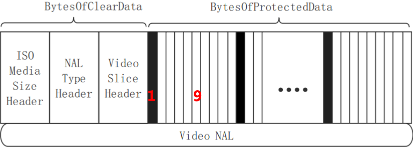</div>

​    

**HLS TS&FMP4 加解密比较**

* FMP4：目前官方标准就是针对fmp4格式提出的加密策略，适用于多家DRM厂商；cenc加密是加密标准中强制方案，cbcs目前已经在多个终端上适配，建议使用
* TS：对整个TS文件采用AES-CBC进行加密，获取密钥后容易破解

**HLS TS加密方案**

1) 用户推流到切片服务器，服务器根据配置决定是否需要加密切片；

2) 播放器请求到m3u8文件，获取**EXT-X-KEY**字段，得知该视频是加密视频

3) 播放器根据m3u8中KEY URL地址去密钥服务器获取密钥

4) 播放器获取密钥，解密ts视频，正确播放

<div align="center"></div>

**进一步保护措施**

1) 通过权限和身份验证保护密钥URI和索引文件URI，防止盗链以及增加用户获得密钥文件的难度

2) 将索引文件和密钥文件二次加密，修改客户端播放器，使其先解密索引文件和密钥文件，再播放加密视频。

​    

## 3 低延迟直播方案（LHLS & LL-HLS）

下面介绍两种 HLS 直播方案，**LHLS 社区方案**和 **LLHLS 官方方案**，它们都可以提供不错的低延迟直播。要推荐的话当然是官方的 LLHLS 方案，因为它的功能比较多，而且苹果的设备都会去支持它，官方也会不断维护扩展这个方案。另外在设置直播延迟时也要考虑到具体的使用场景，越低的延迟当然越好，但是它也会导致越低的缓存，容易造成直播卡顿。

### 1）LHLS（社区规范）

LL-HLS（Low Latency HLS），是一种以降低HLS协议时延为目标的方案，但它还没有被写入标准协议中。

​    

#### a 直播时延产生原因

在HLS标准当中, **每一个单独的切片segment文件都是一个GOP, 但直播场景中用户推流的GOP大小都不固定**, 如果完全按照标准去实现的话，就可能会导致切片长度过大, 客户端下载时间过长, 从而导致启播时间比较久。 

HLS直播延迟主要原因：

| 延迟点                                           | 说明                                                         |
| ------------------------------------------------ | ------------------------------------------------------------ |
| 1）**媒体服务器更新 M3U8 文件的间隔**            | HLS 协议应用于直播视频传输时，需要将媒体文件切割成了对应于媒体分段的 TS 文件，而只有生成了新的 TS 文件（一个视频片段只有完全生成才能被客户端下载），服务器才会更新m3u8索引文件（即服务端编码器和流分割器生成 TS 文件的时长）。<br />理论上HLS服务器需要**大于等于一个EXT-X-TARGETDURATION的时长去更新 M3U8文件**。  <br />-- TARGETDURATION：表示所有媒体片段最大的时长（单位秒）<br /> |
| 2）**客户端播放器安全缓冲时长（3个分片buffer）** | HLS协议标准规范中，**不建议客户端选择开始时间到最后一个分片结束时间间隔小于最后一个分片时长加两倍的 EXT-X-TARGETDURATION 时长的分片作为首个分片进行播放**。也就是说，一般而言，**客户端应该从 M3U8 文件中倒数第三个或倒数第四个分片开始播放**（苹果官方建议是请求到3个片之后才开始播放，即索引文件至少包含3个分片）。<br />如下图，客户端应该选择标号为3的segment作为起始的segment播放。由此可见，HLS直播系统至少会产生3个segment时长之和的时延，若假设每个segment时长6s，再加上客户端会有缓存（假设为1s）和传输时延，总体的时延可能会达到20s。<br /> |
| 3）**CDN缓存机制**                               | 若当前源站 M3U8 已经更新到了第四个片段，但是CDN边缘节点还缓存着上一个版本的 M3U8文件（只包含3个片段）。此时就需要等文件的TTL过期，边缘节点才会去获取最新版本的 M3U8 文件，且这个缓存TTL也不能取消，所以如果每个端上的请求到达CDN边缘节点时都去找源站要最新版本，源站就可能会被流量冲垮。 |
| 4）**客户端下载分片与解码时长**                  | 分片资源下载时间，以及资源文件解码时长                       |
| 5）**网络延迟**                                  | 网络连接耗时情况                                             |

   

#### b LHLS 降低时延原理

LHLS 是怎么实现低延迟直播的呢？如下图，其中一个视频片段是 8s

<div align="center"></div>

现在一共生成了 3 个视频片段，第 4 个视频片段已生成 3 秒，由于**一个视频片段只有完全生成才能被下载**，所以有下面这几种不同的方式来播放这个播放列表：

* 1）最简单的方法当然是从第 1 个分片开始播放，这样延迟是 27 秒（3 * 8 + 3）
* 2）第二种方案是从最后一个分片（即第3个分片）开始播放，这样延迟是 11 秒
* 3）或者等待 5 秒，让第 4 个分片生成再播放，这样延迟是 8 秒

可以发现上面这 3 个方案延迟都挺高，第三个方案延迟稍微低一点但是起播延迟却太高了。

LHLS 方案是服务器**将一个视频片段细分成一个个很小的 Chunk**，且在服务器端，采集到一个segment的第一帧数据（IDR帧），并把它封装到segment中之后，把这个segment的url写进m3u8文件（TS格式是支持数据一帧一帧的封装的）。然后**无需等待一整个视频片段生成**，这时候客户端就可以发起请求下载这个segment（实际上这个segment还没有封装完成），即每生成一个 Chunk 它就会被下载到播放器缓存起来，如上图中最后一种方法就是**将一个分片分成一个个 1 秒小 Chunk**，这样就得到了 **3 秒延迟的直播**。

<div align="center"></div>

具体到实际实现中 LHLS 是使用 HTTP/1.1 的 Chunked transfer encoding 功能，播放器会保持与服务器的连接，每当服务器生成一个 Chunk 就会直接传递给播放器，直到一个视频片段全部传输完毕才会断开连接，另外 HTTP 的这个功能大部分 CDN 都支持。

社区方案的一个主要问题是它**不好做 ABR 自适应码率切换**，因为与服务器的连接是长连接，客户端不好估算出当前用户的网络带宽，为了解决这个问题一般会用一个测试文件去测试当前网速。

​    

#### c 规范详情

社区规范中一共引入两个自定义标签 EXT-X-PREFETCH 和 EXT-X-PREFETCH-DISCONTINUITY，且该规范完全兼容 HLS 标准规范，对于支持这一规范的播放器可以选择使用它们来低延迟直播，对于不支持播放器会忽略这些标签，变成高延迟直播。

如下 LHLS M3U8 文件例子：

```python
#EXTM3U
#EXT-X-VERSION:3
#EXT-X-TARGETDURATION:2
#EXT-X-PROGRAM-DATE-TIME:2018-09-05T20:59:08.531Z
#EXTINF:2.000
https://foo.com/bar/1.ts
#EXT-X-PROGRAM-DATE-TIME:2018-09-05T21:59:10.531Z
#EXTINF:2.000
https://foo.com/bar/5.ts

#EXT-X-PREFETCH:https://foo.com/bar/6.ts
#EXT-X-PREFETCH:https://foo.com/bar/7.ts
```

由上可知，除了最后两行，与普通 M3U8 文件没有任何区别，此外**一个 LHLS M3U8 最少包含一个并且不超过两个 EXT-X-PREFETCH 标签**，且标签后面跟随着一个 URL，它是还没有生成的分片。其次，支持 LHLS 的播放器会直接发送两个 HTTP 请求，去请求 6.ts 和 7.ts，服务器会维持这两个请求，并不断发送 Chunk。

可能有同学要问，如果 6.ts 连接还没断开，但是 7.ts 连接收到数据了怎么办？这时候播放器就要内部保持这些数据，直到前一个请求完成。

   

### 2）LL-HLS（苹果规范）

**LL-HLS** 表示是苹果官方版的低延迟方案，它也被称为 ALHLS，在 2019 年 WWDC 上苹果介绍了他们官方的 HLS 低延迟解决方案，苹果发布的低延迟方案并没有借鉴社区低延迟方案的成果，而是重新设计了一套低延迟方案，且苹果的目标是 **1 到 2 秒低延迟，支持大规模用户的直播，并且可以完全向下兼容**。

LLHLS 方案相比 LHLS 复杂度大大的提高，LLHLS 中一共加入了 5 大修改，分别是 **Partial Segment**、**请求长连接**、**增量更新**、**预加载**和**快速码率切换**。

<div align="center"></div>

​    

#### a Partial Segment

**LLHLS 将一个视频片段再细分称为小分段，一个视频片段由多个小分段组成**。

由于原先需要等待一个视频片段完全被生成才能下载，比如一个片段是 6 秒种，客户端就需要等待 6 秒这个分片被生成才能下载它。现在服务端将一个片段分成多个小分段，比如一个小分段是 200 毫秒，那么一个视频片段包含 30 个小分段，客户端只需等待 200 毫秒就可以一个个下载这些小分段。

<div align="center"></div>

可以发现这种方式和社区方案非常相似，社区方案是将一个视频分段分成一个个小 Chunk，通过 HTTP/1.1 的 Chunked transfer encoding 功能下载到客户端，而 **LLHLS 是将一个视频片段分成一个个小分段，通过普通 HTTP 请求去下载这些小分段**。

与小分段相关的标签有 EXT-X-PART-INF 和 EXT-X-PART 两个标签

* EXT-X-PART-INF 提供了播放列表中小分段的信息，如果播放列表中存在 EXT-X-PART 标签，那么必须提供这个标签
* EXT-X-PART 标签与 EXTINF 相似，它是用来声明一个小分段，它一共有 5 个属性

   

#### b 请求长连接

在 HLS 直播中，需要频繁的去请求播放列表文件去查看是否有新的视频片段被添加，这样非常的浪费时间和资源，而在 **LLHLS 中服务器可以保持这个连接不断开，直到客户端需要的片段被生成才完成请求**。

<div align="center"></div>

服务器支持这一功能，需要 EXT-X-SERVER-CONTROL 标签中的 CAN-BLOCK-RELOAD 属性为 YES。

```python
#EXT-X-SERVER-CONTROL:CAN-BLOCK-RELOAD=YES
```

要告诉服务器何时才完成请求，需要用到 `_HLS_msn` 和 `_HLS_part` 两个查询条件，如果只需要服务器在生成下一个视频片段时才完成请求，可以发送下面这个请求。

```ini
https://llhls.com/playlist.m3u8?_HLS_msn={下一个片段的 Media Sequence Number}
```

`_HLS_msn` 用来**控制服务器播放列表包含了指定片段或指定片段之后的片段才返回请求**，`_HLS_part` 控制**服务器播放列表包含了指定片段的哪个小分段才返回请求**，小分段的下标是从 0 开始，比如一个视频片段是 6 秒，一个小分段是 1 秒，那么这个视频片段一共由下标 0 到 5 的小分段组成。

```ini
https://llhls.com/playlist.m3u8?_HLS_msn={下一个片段的 Media Sequence Number}&_HLS_part={小分段下标}
```

**注意**： _HLS_msn 可以单独使用， _HLS_part 必须和 _HLS_msn 一起使用，否则服务器将会返回 400 错误，且当 _HLS_msn 超过最新生成片段太多，服务器也会返回 400 错误。

此外，如果播放列表包含 EXT-X-ENDLIST，服务器将会忽略 _HLS_part 和 _HLS_msn 两个参数。

​    

#### c 播放列表增量更新

在 **HLS 直播中，每次刷新播放列表都会包含一些已经知道的老片段信息**，比如第一次请求返回 0、1 和 2 这三个片段信息，第二次刷新返回 1、2 和 3 这新的片段信息，可以发现 1 和 2 我们是知道的，其实无需再包含在播放列表中。

LLHLS 提供了**播放列表增量更新功能**，即可以**告诉服务器可以跳过哪些片段，不用将它包含在播放列表中，从而减少传输损耗**。

要支持增量更新功能，需要 EXT-X-SERVER-CONTROL 标签中包含 CAN-SKIP-UNTIL 属性，且还可以包含必须与 CAN-SKIP-UNTIL 一起使用的 CAN-SKIP-DATERANGES 属性，它**表示是否可以跳过老的 EXT-X-DATERANGE 标签**。

```ini
#EXT-X-SERVER-CONTROL:CAN-SKIP-UNTIL=12.0,CAN-SKIP-DATERANGES=YES
```

CAN-SKIP-UNTIL 属性的值是十进制浮点数，单位是秒，这个值至少是目标时长的 6 倍。它表示**跳过分段的边界**，此外如果要发起一个播放列表增量更新请求，需要包含 _HLS_skip 查询参数。

```ini
https://llhls.com/playlist.m3u8?_HLS_skip={YES或v2}
```

_HLS_skip 的值是 YES 或 v2，其中YES 表示跳过老的片段，v2 表示跳过老的片段和老的 EXT-X-DATERANGE 标签（需要服务器返回 CAN-SKIP-DATERANGES=YES）。

**注意**：当客户端没有一个完整的播放列表，或当前播放列表太久没更新，且超过一半的可跳过边界时，应该使用全量查询而不是增量查询。

当一个播放列表是增量更新时，播放列表中会包含一个 EXT-X-SKIP 标签，这个标签只有两个属性

* SKIPPED-SEGMENTS 表示跳过视频片段数量
* RECENTLY-REMOVED-DATERANGES 表示跳过了哪些 DATERANGE id。

```shell
#EXTM3U
#EXT-X-TARGETDURATION:4
#EXT-X-VERSION:9
#EXT-X-SERVER-CONTROL:CAN-BLOCK-RELOAD=YES,PART-HOLD-BACK=1.0,CAN-SKIP-UNTIL=12.0
#EXT-X-PART-INF:PART-TARGET=0.33334
#EXT-X-MEDIA-SEQUENCE:266
#EXT-X-SKIP:SKIPPED-SEGMENTS=3
#EXTINF:4.00008,
fileSequence269.mp4
#EXTINF:4.00008,
fileSequence270.mp4
#EXTINF:4.00008,
fileSequence271.mp4
#EXTINF:4.00008,
fileSequence272.mp4
#EXT-X-PART:DURATION=0.33334,URI="filePart273.0.mp4",INDEPENDENT=YES
#EXT-X-PART:DURATION=0.33334,URI="filePart273.1.mp4"
#EXT-X-PART:DURATION=0.33334,URI="filePart273.2.mp4"
#EXT-X-PART:DURATION=0.33334,URI="filePart273.3.mp4"
#EXT-X-PRELOAD-HINT:TYPE=PART,URI="filePart273.4.mp4"

#EXT-X-RENDITION-REPORT:URI="../1M/waitForMSN.php",LAST-MSN=273,LAST-PART=3
#EXT-X-RENDITION-REPORT:URI="../4M/waitForMSN.php",LAST-MSN=273,LAST-PART=3
```

可以发现上面这个例子中跳过了 3 个视频片段，跳过的视频片段的 msn 分别是 266、267 和 268。

​    

#### **d 片段预加载**

LLHLS 中还有**视频片段预加载功能**，它**表示一个视频片段还没被创建，但是客户端去请求它**，与社区方案的 EXT-X-PREFETCH 非常相似，这与该功能相关的标签是 EXT-X-PRELOAD-HINT，它后面跟一个属性列表，一共有 4 个属性

* TYPE 属性有两个值，PART 表示是小分段，MAP 表示是媒体初始部分（与 EXT-X-MAP 相似）
* URI 资源的 url
* BYTERANGE-START 如果是一个资源的一部分，这个属性用来指定开始部分
* BYTERANGE-LENGTH 这个表示资源的字节长度，与 BYTERANGE-START 配合使用。

当客户端碰到这个标签时，可以选择是否直接请求这个资源，服务器会和上面请求长连接中一样维持这个请求，直到整个资源数据可用时才返回资源，当然也有可能直接返回 404。

​    

#### e 快速码率切换

使用 HLS 的一个优势是可以**自适应码率切换，根据当前网速、屏幕大小等信息选择最适合用户的当前环境码率的流**，目前在 LLHLS 中苹果提供了一种可以快速切换码率的功能。

服务器通过 EXT-X-RENDITION-REPORT 标签，将主播放列表中与当前流相关的其他码率的流条件到当前 Media 类型的播放列表中，这个标签一共有 3 个属性。

* URI 与当前流相关的其他码率流的链接
* LAST-MSN 这个流中最后一个视频片段的视频编号
* LAST-PART 这个流中最后一个小分段的下标

每个视频流的 LAST-MSN 和 LAST-PART 可能不一样，EXT-X-RENDITION-REPORT 标签提供了这些信息，我们就不用去请求那些比较落后的流，这样可以减少很多不必要的请求。

   

#### f 直播从哪儿开始播放

客户端面对一个播放列表，应该从哪儿开始播放呢？**离主播位置越远延迟就越高，离主播当前位置越近 Buffer 有太少，容易引起播放卡顿**。

上面介绍的 EXT-X-SERVER-CONTROL 标签可以解决这个问题，这个标签还有两个属性 HOLD-BACK 和 PART-HOLD-BACK，这两个属性是**服务器推荐的直播开始位置**。

* HOLD-BACK 的值是一个浮点数秒数，**代表服务器推荐的离播放列表末尾最小距离**，它应该最小是 3 个视频片段目标时长。
* PART-HOLD-BACK 的值是一个浮点数秒数，**代表服务器推荐的离播放列表末尾最小距离**，它最小是 2 倍的 Part 小分段的目标时长。推荐是 Part 目标时长的 3 倍。

当存在 PART-HOLD-BACK 属性时，客户端应该忽略 HOLD-BACK 属性。如果播放列表包含 EXT-X-PART-INF 标签，则必须要有 PART-HOLD-BACK 属性。

​    

#### g 推荐时长配置

苹果推荐的一个视频片段的时长是 6 秒钟，一个 Part 小分段时长推荐设置为 1 秒钟，GOP 推荐设置为 1 到 2 秒，且推荐最少在有 3 个 Part 目标时长位置开始播放。

  

## 4 应用实践

### 1）直播架构设计（B站分享）

#### a 生产架构

<div align="center"></div>

在直播生产架构设计上, 首先要保证稳定性和可靠性，即:

1. 在生产端使用了集群化进行切片的生产, 切片会在 **内存（redis，少量切片，实时直播回源）**和 **文件对象存储（boss，持久化，直播回放）**进行双写

2. **热备能力**, 随时可以调整内部回源链路, 防止链路故障

3. 从内存到持久化对象存储, **分级回源策略**

4. 可分布式部署, 利用**HTTP 302进行分布式调度**

同时，由于HLS协议问题, 对磁盘IO要求非常高, 通过使用Linux系统提供的内存映射盘去写文件, 无论是写文件还是文件回源的读取速度都非常理想。

但由于**内存只能存有很少的切片,所以能保存的切片比较少, 只用作实时直播回源**, 同时切片也会**异步写入文件对象存储, 用来做直播回放**，在回源链路发生故障时, 会自动进行降级, 使文件对象存储直接对外提供回源服务。

​    

#### b 回源架构

<div align="center"></div>

在回源架构方面，设计了一套**动态回源方案**（如上），其中 **CDN在回源时需要根据部署的回源服务进行回源地址的查询**，相比较固定的回源配置，可以实时上下线某些节点，也可以减少回源链路上面的延迟，在调度上比较灵活，同时容灾能力也极大提升。

除了提供动态回源查询服务之外，也充分利用了**http302特性，允许使用http302进行回源跳转**，在故障发生时可以做到自适应降级。

​    

#### c HLS启播优化

在HLS标准当中, **每一个单独的切片文件都是一个GOP**, 但直播场景中用户推流的GOP大小都不固定, 如果完全按照标准去实现的话，就可能会导致切片长度过大, 客户端下载时间过长, 从而导致启播时间比较久。 

在实践中, 首先采用了**1s长度的切片**，可以尽可能缩短因为产生切片所造成延迟, 这样会出现一个问题, 就是**每一个切片可能不是一个GOP**， 如果按照**默认的客户端拉播放列表中最后三个切片进行播放**, 一旦倒数第三个的第一帧不是关键帧，则就会导致启播很慢或无法启播。 

在HLS标准中 **#EXT-X-START:TIME-OFFSET=0** 标签会告知客户端, 从列表的第一个切片开始播放，所以此时只需要**保证列表的第一个切片的第一帧为关键帧**, 客户端就可以快速加载到关键帧。

<div align="center"></div>

此外, 利用了**CMAF**的封装特性, 在一个切片文件中可以进行了**更小粒度的封装（chunk）**, 使得客户端在下载几帧数据后就可以开始进行解码播放。 如上图, **对于第一个切片文件, 客户端只需要下载第一个chunk拿到第一帧, 就可以完成启播，这样就完成了不在破坏标准兼容性的基础上实现了启播的优化**。 

由于采用了1s一个切片的方式，相比较 RTMP/FLV 来讲，整体延迟只增加了1s，是一个可以接受的范围，其次相比较传统的HLS来讲，首帧提速2-3倍，配合**客户端的追逐策略**也可以使延迟得到很好的控制。

​     

#### d 直播回放实现

由于HLS协议，是将流媒体进行切片，因此只需要将切片的保存时间延长，就可以让用户访问到之前的内容。

**具体实现方案**：在直播生成索引文件的过程中，只需要**同时生成对应的时间戳的索引文件**,  例如直播时索引文件叫 **index.m3u8**, 此时同时生成一份 **utc.m3u8**。所以，在用户选择回放时服务端会返回对应时间点的索引文件，这样就完成了直播回放的功能。 总体上，除了需要文件保存更长的时间外，其他无需改动, 实现比较容易。

除了用作直播回放之外，更可以用做录像进行长久保存，对审核相关业务也可以很好的支持，同时省却了专门维护录像业务的麻烦。

<div align="center"></div>

​    

#### e 回源预热优化

HLS与RTMP/HTTP-FLV在回源上最大的不同在于, **HLS是短链接, RTMP/HTTP-FLV是长链接**。两种各有优缺,

1) 长链接：只建立一次链接，开销较低，但在**抗网络抖动性比较差**, 遇到抖动时间短, 且抖动强的状况, 链接可能就直接断开,就会造成用户观看黑屏；

2) 短链接：由于可以快速重试，时间短而剧烈抖动, 可以比较快速进行恢复, 某些情况下甚至用户端可能不会有感知到卡顿，但短链接需要频繁请求响应，对服务器CPU消耗较高；

HLS在回源链路上, 全链路都支持了HTTP1.1, 保证底层共享长链接，避免频繁TCP建联的开销。

另一方面, 利用了**CMAF** 和 **HTTP Chunk** 传输特性, 在**服务端允许文件的边写边发**，在切片还未完全落盘之前就可以**允许CDN提前回源**, 存几帧数据就发几帧, 直到指定切割点后, 数据发送完成之后，断开请求，CDN已经保存了这份文件的缓存, 这时切片服务再去更新M3U8播放列表。

因此，当客户端播到最新一个分片时，CDN由于提前进行过回源, 已经缓存了对应文件。这种资源预热策略, 尤其是针对频繁请求小分片的文件, 可以有效提升回源质量。

<div align="center"></div>

​    

### 2）HLS点播交互

HLS 播放器-客户端-网关-视频云 交互流程：

<div align="center"></div>

​       

# 五 MPEG-DASH

DASH，又叫MPEG DASH（Dynamic Adaptive Streaming over HTTP, 基于HTTP的动态自适应流） ，是一种在互联网上**传送动态码率的Video Streaming技术**，且由于其基于 HTTP，任何源服务器（源站）都可以配置为提供 MPEG-DASH 流式传输。

其次，类似于苹果的HLS，DASH会通过 media presentation description（MPD）**将视频内容切片成一个很短的文件片段，每个切片都有多个不同的码率版本**。根据当前网络条件，客户端（DASH Client）自适应地选择下载和播放当前网络能够承载的最高比特率版本，这样既可以保证当前媒体的质量，又能避免由于码率过高导致的播放卡顿或重新缓冲事件。因此，MPEG-DASH可以实现动态无缝适应实时的网络条件并提供高质量的播放内容，拥有更少的卡顿，极大地提升了用户体验。

<div align="center">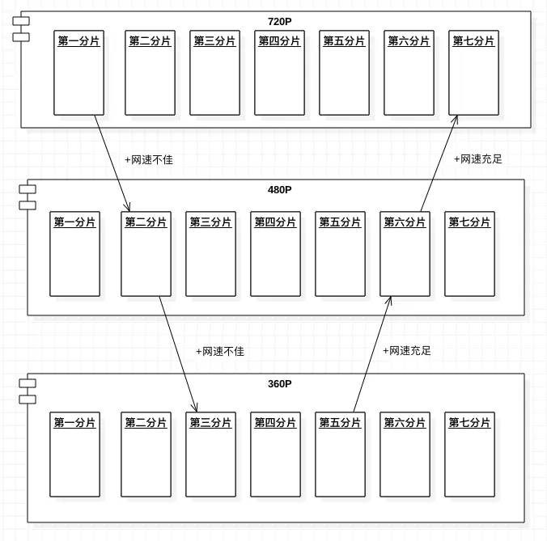</div>

此外，不同于 HLS、HDS 和 Smooth Streaming，**DASH 不关心编解码器，因此它可以接受任何编码格式编码的内容**，如 H.265、H.264、VP9 等。

​    

## 1 工作原理

MPEG-DASH传输系统架构由 **HTTP服务器** 和 **DASH客户端** 两部分组成，其中HTTP服务器存储着DASH文件，主要包含两部分：

* 媒体描述文件MPD
* DASH媒体文件，主要由分段媒体文件和头信息文件两部分组成

<div align="center"></div>

**MPEG-DASH工作原理**：

1) 一组电影的编码（或码率-分辨率组合, 即rendition）由MPEG-DASH打包服务或软件去打包，打包的过程是将每个rendition分割成指定时间的小片或小块（例如，2秒或4秒长）；

2) 打包器还将其如何分割视频以及视频的交付顺序记录在**MPD**（或清单manifest）文件，其内描述了稿件的切割、排序方式以及传输信息；

3) 打包过的视频被存储在**源站服务器**，并通过CDN发送分发给客户端播放器（MPEG-DASH，内置ABR引擎）；

4) 用户播放视频时，视频播放器首先请求下载视频MPD文件，后通过解析MPD文件理解如何播放视频；

5) 根据缓冲大小和可用带宽，视频播放器按照预定义顺序请求视频某个码率组合的视频切片，解码并将视频显示给用户；

6) 播放器通过不断感知带宽条件和缓冲水平，自适应选择MPEG-DASH MPD中描述的码率之一，并请求CDN获取到对应的视频切片；

7) 整个过程会一直持续，直到视频播放结束（电影结束或者用户停止观看）；

<div align="center"></div>

​     

DASH Client根据实时网络情况下载演示图：

<div align="center"></div>

简而言之，**HTTP 服务器端将媒体文件切分成一个个时间长度相等的小分片，每个分片被编码为不同大小的码率。而后，客户端通过评估自身的性能和带宽情况，通过GET请求下载相应码率的切片从而实现码率的无缝切换（以媒体分段为单位）**。即当网络带宽较好时，客户端可以请求对应时间较高码率的媒体分段，而当带宽变差时，客户端则下载对应码率较低的下一个媒体分段。由于不同质量的媒体分段在时间上都是相互对齐的，因此不同质量的媒体分段之间切换时，画面是自然流畅的；

​    

## 2 多媒体描述文件MPD

MPD（Media Presentation Description）是一个**XML文件**，作用**类似HLS的m3u8文件**，完整描述了DASH结构内容的所有信息，包括 **各类音视频参数、内容分段时长、不同媒体分段的码率和分辨率 以及 对应的访问地址URL **等等，客户端通过首先下载并解析MPD文件，可获取到与自身性能和带宽最匹配的媒体分段。

MPD文件的分层结构关系：

<div align="center"></div>

<div align="center">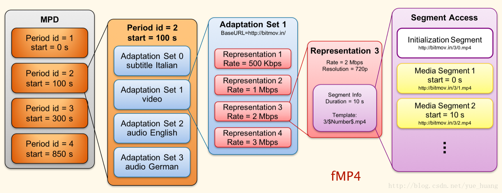</div>

fMP4是DASH采用的媒体文件格式，文件扩展名通常为 .m4s 或 .mp4，如下为fMP4与DASH分片概念对照

* 普通MP4由索引文件头文件 moov box 和 媒体数据 mdat box 组成，其中视频关键帧列表在头部 moov box 中，如果视频时间比较长, 头部会非常大（> 1MB）, 解析完头部再播放就会增大首帧时间
* fMP4由分片组成，**关键帧列表相关的头部 box** (stts,stsc,stco) 都被设成空, 其中的关键帧列表信息被分散在各个数据分块的开头, 用 moof box 表示, 这样播放视频只需读取第一个数据分块的关键帧列表信息, 减少首帧时间。同时，fMP4可以按整个文件存储，也可以按分片存储：
  * 如果按单个文件存储，每个输出是一个m4s文件，完整fMP4视频可以描述为如下形式：moov + (moof + mdat) * N，其中moof box是分片（fragment）的标识，mdat box存放的是当前分片的媒体数据
  * 如果按照分片存储，每个分片是一个m4s文件，输出则对应了多个m4s

其次，fMP4中的第一个分片moov box，对应了DASH协议中Initialize Segment，其后的分片对应着 Media Segment。

<div align="center"></div>

​    

### 1）Period

一个DASH文件可以包含一个或多个Periods，**每个Period代表一段连续的视频片段**，由一个或多个AdaptationSet组成，例如一段码流有60s被划分为3个Periods，Period1为 0-15s，Period2为16-40s，Period3为41-60s。

* 点播情况下，在同一个Period内，可用的**媒体内容的类型**及其**各个可用码率**（Representation）都不会发生变更；
* 直播情况下，MPD文件会发生实时变化，需要周期性地去服务器请求新的MPD文件，服务器可能会移除已过时的Period，添加新的Period，而新的Period中可能会出现新的可用码率，或者移除上一个Period中存在的某些码率；

​    

### 2）AdaptationSet

包含**不同媒体类型（video / audio）的不同编码版本（Representation）**，比如一个AdaptationSet包含视频video的多个码率版本，另一个AdaptationSet包含音频 audio（如：中文 / English / German）的多个码率版本。

尽管一个 Representation 足以提供可播放的流，但**多个 Representation 客户端可以根据其目前的网络条件和带宽要求自适应码率，从而保证视频流畅播放**。除此之外，还有其他特性。比如使用的编解码器，解码复杂性以及必要的CPU资源或渲染技术方面，Representation 可能不同。

​    

### 3）Representation

表示**同一媒体内容的不同编码（分辨率Resolution、码率Rate、信道数量等）版本**，由一个或多个Segments组成，即每个Representation中的内容按时间或者其他规则被切分成一段段Segments，以供客户端根据自身的网络条件和性能限制在播放时能够灵活地在不同的Representations之间进行切换播放。

   

### 4）Segment

代表**媒体块**，**每个Segment都有一个唯一的与之对应的URI地址**，DASH客户端可以使用HTTP GET（or with byte ranges）下载URI对应的分片数据。

**PS**：每个 Representation 都包含 1 个 Init Segment 和 若干 Media Segment

​    

**Segment 分类**

* Initialize Segment：初始化用的 MP4 分块, 包含 ftyp, moov等, 不能包含 moof
* Media Segment：编码数据的 MP4 分块, 包含 moof, mdat等
* Index Segment：Segment 索引的 MP4 分块, 仅包含 sidx
* Subsegment Index Segment：Subsegment 索引的 MP4 分块 仅包含 ssix
* Bitstream Segment：仅用于 MPEG2-TS 流切换码率, 就不介绍了

**Segment 三种表示方式**

* SegmentList：列举所有分块的 URL 和时长
* SegmentTemplate：使用一个模版产生每个分块的 URL 和时长
* SegmentBase：仅使用一个 Media Segment 时使用, 使用 IndexRange 获取分块信息在 Segment 的位置

Representation可能会包含以下几类选项中一项（仅限）：

1) 一个或多个SegmentList 元素

2) 一个SegmentTemplate元素

3) 一个或多个BaseURL元素，最多一个SegmentBase元素，不包含SegmentList和SegmentTemplate元素

​    

#### **a SegmentList**

SegmentList包含了一个SegmentURL列表，客户端按照segment列表元素在MPD文件中出现的顺序来请求和播放相应的segment，其中 SegmentURL即为每个segment的地址（绝对地址 、 相对地址、字节范围 byte range）

<div align="center"></div>

如上，SegmentList duration 表示每个Segment目标长度为10s，Initialization sourceURL中包含了该Representation的初始化信息。

​    

#### b SegmentTemplate

SegmentTemplate提供了一种通过给定模板构造出一个Segment List的机制，这意味着一些特定的标识符将被动态值取缔。在SegmentList机制中为每个Segment构造一个URL，而当Representation中分段较多时，会使得MPD文件变得很大，而SegmentTemplate模式则可以通过少数几行描述来构造出一系列的Segments。

**SegmentTemplate 用法**：

* initialization 属性表示 Initalize Segment 的路径模版
* media 属性表示 Media Segment 的路径模版，模版变量：
  * 使用 $RepresentationID$ 表示 Representation 的 id
  * 使用 $Number%d$ 表示格式化的分块序号, 起始数字由 startNumber 指定

* 当所有分块时长都一样时, 使用 duration 属性表示时长
* 当分块时长不一样时, 使用 SegmentTimeline 子节点表示每个分块
  * 使用 S 节点表示每个分块
  * 使用 S 节点的 d 属性(duration 缩写) 表示时长
  * 使用 S 节点的 r 属性(repeat 缩写) 表示重复的个数
  * 使用 S 节点的 t 属性(time 缩写) 表示开始时间

​     

**两类SegmentTemplate**

1）**基于数字的SegmentTemplate**：即通过SegmentTemplate元素中的地址和startNumber就可构造出不同的SegmentList，比较适合**用于含有多个Representation的长视频**，能够有效压缩MPD文件的大小，提示客户端的下载和启动速度。

<div align="center"></div>

2）**基于时间的SegmentTemplate**：即SegmentTimeline字段中描述了当前Representation中第一个Segment的起始时间、duration 以及 分段的repeat次数（指的是具有相同duration的Segment个数，这样读取完一个Segment后，就可根据该数值直接去读取下一个Segment，而不是重新读取一遍MPD）

<div align="center"></div>

​    

#### c SegmentBase

MPEG-DASH中，SegmanetBase是当Representation中只有一个media segment是使用

**SegmanetBase 用法**：

* BaseURL 表示实际的 Mp4 文件, 该文件包含 Initialize Segment, Index Segment 和 Media Segment
* Index Segment 的位置使用 indexRange 表示, 单位为字节
* 使用 Index Segment 产生分片索引
* MP4 brand 必须包含 dash, dsms 和 msix

<div align="center"></div>

如上，SegmentBase indexRange="0-834" 表示SAP和其它初始化信息包含在开头的834个字节中。

​    

## 3 ijkplayer播放DASH流程（旧）

播放框架图

<div align="center"></div>

步骤详情:

| 步骤             | 详情                                                         |
| ---------------- | ------------------------------------------------------------ |
| **解析MPD**      | DASH 首先请求需要的 MPD 文件, **解析不同清晰度/码率对应的 URL**<br />目前FFmpeg 支持的 XML 节点和对应属性：<br />-- SegmentTemplate：presentationTimeOffset, duration, startNumber, timescale, initialization, media<br />-- SegmentList：duration, timescale<br />-- AdaptationSet：不支持任何属性 <br />-- Representation：mimeType, id, bandwidth, frameRate, 不支持codecs, width, height, sar, startWithSAP<br />-- Period：duration, start<br />-- BaseURL等 |
| **解析视频头部** | FFmpeg 根据 MPD 获取解析出的 URL 去请求 fmp4，此时会尝试解码获取需要的编解码器信息，从而**获得每一路准确的 SPS/PPS/SAR/码率/帧率 等关键信息**，如果 MPD 有多路 fmp4 , 只解析需要的部分<br />注意：官方FFmpeg 并不会识别 SegmentBase , 但不影响正常播放 |
| **解封装**       | **DASH 解封装时会有一个DASH的参考时间戳**，每一个视音频流也有个时间戳，根据每一路时间戳和参考时间戳的关系去轮流对每一路fmp4 进行解封装操作，解出来的包再传给DASH层。<br />因为**视频头部不包含关键帧信息，只包含分片索引**，需要在播放过程中不断解析每一块分片的关键帧列表（都位于每一个分片的开头） |

​    

### 1）FFmpeg 播放Dash

播放过程：

1) 解析头部时读取视频或音频流的sidx box , 并把分片索引保存下来

2) 读流时每读取到一个分片的 moof box，提取对应的关键帧列表并根据分片索引一对一保存下来

3) 读取该分片对应的 mdat box

4) 同步视音频流

5) 解码播放

<div align="center"></div>

​     

### **2）FFmpeg seek DASH 文件**

seek过程：

1) 先对视频流进行 seek, 获取 seek 后的视频时间戳, 再使用该时间戳对音频流进行 seek

2) 如果已加载过seek分片的索引列表, 则读取对应分片的关键帧列表, 并根据关键帧列表进行Seek

3) 如果有多个分片索引, 则只能 Seek 到已加载索引的分片

4) 每一个流seek 后实际时间可能不同（尤其是视频流）, 需要在DASH封装层进行时间戳同步

<div align="center"></div>

​    

### 3）解码和无缝切换

无缝切换流程：

1) 重新开启一个io 线程，设定一个起始时间和超时时间, 从起始时间开始读新流并进行解封装操作

2) 在超时时间内, 如果新流读取到一个分片的起始 PTS 大于当前流解封装的 PTS, 则在该分片起始时间点用新流替换旧流喂给解码器

3) 如果超过设置的超时时间, 保持原数据流不变并反馈切换失败给上层

4) 如果视音频流分离, 则分别进行切换, 相互独立

PS：无缝切换时解码器信息保存在封装层的附加信息中, 当无缝切换时由解码线程读取该数据重新初始化解码器

<div align="center"></div>

​    

## 4 低延迟协议 LL-DASH

由上可知，DASH是 一种自适应流媒体传输协议，它工作原理与HLS类似：**都是基于不同质量水平的内容准备，将清单文件中索引的视频切分成小块，然后再对其使用ABR技术编码**。同时还支持通过CENC（Common Encryption standard，通用加密标准）加密的内容保护，这使它能够与所有常见DRM系统兼容。

LLDASH 和 LHLS 非常相似，都是**使用 HTTP/1.1 的 Chunked transfer encoding 功能来降低延迟提供 1 到 6 秒的低延迟直播**，而且可以复用现有的 CDN 网络支持大规模用户观看直播。两者主要区别是LL-DASH适用于各类编解码器。但遗憾的是，如果使用一些特殊的编码器，LL-DASH将无法与依赖iOS的Apple设备兼容（包括Apple TV）。

其次，LL-DASH对标准化协议进行了必要的修改，将延迟降低到了2秒，所依赖的正是**CMAF**（Common Media Application Format，通用媒体应用格式），其中CMAF使LL-DASH能够使用一些有用的HTTP特性，从而显著降低延迟，这两个特性分别是 **分块编码（Chunked Encoding）**和 **分块传输编码（Chunked Transfer Encoding）**，它们都是HTTP1.1的一部分（而在HTTP/2中禁止使用）。

**分块编码先将视频切片分割成几毫秒的视频块**，这些视频块一旦被编码，就会被发送到分发层，而后由分块传输编码将这些视频块快速分发。然而，要完成这样的传输过程，整个分发栈从源站开始一直到**CDN都必须支持分块传输编码**这一特性。

<div align="center">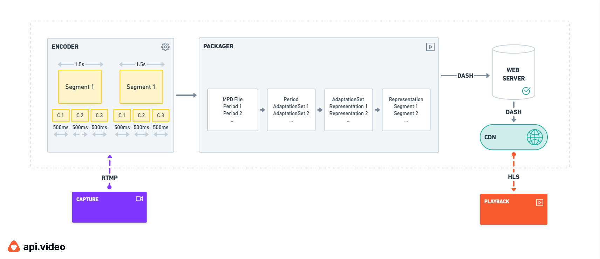</div>

LLDASH目前一共有 **DVB** 和 **DASH IF** 两套 LLDASH 规范，这两套低延迟方案非常相似只有一点不同，由于 DASH IF 较晚发布所以在 DASH IF 规范中也说明了与 DVB 不同的部分，而且这两个规范是完全向下兼容普通 DASH 直播的。

​    

### 1）LL-DASH原理

虽然 MPEG-DASH 规范并没有限制内容格式，但是两种 LLDASH 规范中都是使用 **CMAF 格式**，这容易让人产生 CMAF 和低延迟划等号的误解，**CMAF 本身并不会降低延迟**，例如 HLS 支持 MPEG-TS 和 CMAF 两种格式，如果将**普通 HLS 直播 MPEG-TS 分片换成 CMAF 分片**，这并不会降低直播延迟。CMAF 最大的作用是统一播放格式，从而节省存储空间。不过 CMAF 提供了一些工具使低延迟 DASH 成为可能。

LLDASH 与 LHLS / LL-HLS 非常相似，都是将一个分片变成一个个小 Chunk，这些**小 Chunk 可以在分片完全生成之前被播放器使用 HTTP/1.1 的 Chunked transfer encoding 功能下载并缓存，从而降低直播延迟**（如下图可见chunk降低延迟示意）。

<div align="center"></div>

<div align="center"></div>

如下图所示，普通 DASH 直播中一个 MP4 分段只有完全编码后才能输出被请求，而**LLDASH 中将视频片段分割为一个个小 Chunk，编码器可以每生成一个 Chunk 就输出，传递给播放器缓存播放**。

<div align="center"></div>

CMAF 中 ftyp 和 moov 盒子组成初始化分段，每一个 Chunk 由 moof 和 mdat 盒子组成。播放器会先请求初始化分段，然后请求最新的媒体分段，服务器会将分段的一个个 Chunk 返回给播放器播放。

<div align="center"></div>

播放器请求拉流时，可能如上图所示，一个视频片段被分为 4 个 Chunk，当前播放器发送请求给服务器时，视频片段还没被完全生成，服务器会保持连接不断开，每当生成一个 Chunk 就立马推送给播放器。

​     

### 2）低延迟ABR算法

ABR（自适应码率）是 DASH 播放器的一个关键功能，它可以让视频在复杂的网络条件下动态切换码率和播放速率，而不是中断播放降低用户体验。

在低延迟下，一些基于带宽估算的 ABR 算法都不太好用，这是因为使用 Chunked transfer encoding 时，一个视频分段并没有被完全生成，对于一个 5 秒的视频分段，一个 http 请求可能需要花费 5 秒，这个时间并不是准确的下载时间。在 2020 年 Twitch 和 ACM 合作举办了低延迟下的 ABR 算法大挑战 Adaptation Algorithms for Near-Second Latency。比赛的第一名是 Unified Streaming 的 L2A-LL（Learn2Adapt-LowLatency） 算法 ，第二名是新加坡国立大学的 LoL（Low-on-Latency）算法。由于 Twitch 播放器不是开源的，比赛是基于 dash.js 播放器，目前 dash.js 也集成了这两种 ABR 算法。

   

​       

# **附录**

## **MPEG-DASH**

[1] [MPEG-DASH - 面向未来的流媒体解决方案](https://qcon.infoq.cn/2019/beijing/schedule)（需登录下载）

[2] [玩转前端 Video 播放器](https://www.jianshu.com/p/61f06ddb1bb8)

[3] [DASH简介及使用方法(FFmpeg, MP4Box)](https://blog.csdn.net/yue_huang/article/details/78466537)

[4] [[转载\] 视频处理 -- 流媒体技术](https://www.jianshu.com/p/b1b9e0949312)

[5] [网络流媒体协议之 -- MPEG-DASH协议简述](https://blog.csdn.net/DeliaPu/article/details/79013812)

[6] [Low Latency DASH (LL-DASH)](https://www.theoplayer.com/blog/low-latency-dash)

[7] [（超）低延迟视频流传输的未来 - 知乎](https://zhuanlan.zhihu.com/p/531112722)

[8] [LL-DASH CMAF 低延迟直播 - 掘金](https://juejin.cn/post/7096404766091116551?searchId=202308311822098A5066A4361B7C21CFE0)

[9] https://dvb.org/wp-content/uploads/2020/03/Latest-on-DASH-low-latency.pdf


## **HLS**

[1] [HLS直播协议在B站的实践](https://www.bilibili.com/read/cv18179472/)

[2] [HLS协议介绍](https://www.jianshu.com/p/426425cad08a)

[3] [HTTP Live Streaming](https://developer.apple.com/documentation/http-live-streaming)

[4] [HTTP Live Streaming (HLS) - 概念](https://www.jianshu.com/p/2ce402a485ca)

[5] [Github: HLS-Demo](https://github.com/yangchao0033/HLS-Demo)

[6] [What Is HLS (HTTP Live Streaming)?](https://www.wowza.com/blog/hls-streaming-protocol)

[7] [HLS 协议详解](https://segmentfault.com/a/1190000008810572)

[8] [LHLS（低延时 HLS)原理和实现](https://blog.csdn.net/weixin_39970103/article/details/90047813)

[9] [3 秒左右的低延迟直播方案 - LHLS 和 LL-HLS](https://juejin.cn/post/7012155300916658189)

[10] [HLS 协议入门指南以及延迟优化策略 - 简书](https://www.jianshu.com/p/6fbfaa264de3)

[11] [视频传输延迟分析及解决方案：CMAF、LHLS](https://cloud.tencent.com/developer/article/1346159?from=15425) （流媒体延迟分析）


## **FLV**

[1] [FLV视频文件格式图示](https://cloud.tencent.com/developer/article/1197337)

[2] [基于http-flv的抖音直播端到端延迟优化实践 - 知乎](https://zhuanlan.zhihu.com/p/538423439)


## RTMP

[1] [流媒体协议之RTMP详解](https://blog.csdn.net/water1209/article/details/128634658)

[2] [RTMP协议详解](https://blog.csdn.net/weixin_39399492/article/details/128069969)

[3] [RTMP - 简书](https://www.jianshu.com/p/68d461089169)


## **其它**

[1] [音视频开发成长之路与知识总结](https://developer.volcengine.com/articles/7065630160480911396)

[2] [知识图谱 · 语雀](https://www.yuque.com/webmedia/handbook/knowledge-map)

[3] [一文读懂 QUIC 协议：更快、更稳、更高效的网络通信](https://mp.weixin.qq.com/s/ytBC81x9cJeZPl5-SJWDUg)


