# 流媒体协议 SRT & WebRTC

下面主要分别学习当前**基于UDP的主流流媒体协议**基础知识，如 SRT & WebRTC 等，细节可查阅官方协议规范

​    

# 基础

## 1 TCP or UDP？

通常所说的流媒体传输协议属于应用层协议，而TCP、UDP则是属于传输层协议，也就是说流媒体传输协议其实是依赖于传输层协议才能工作的，因此所有的流媒体协议其底层都通过使用TCP或者UDP来实现网络传输。

当前主流的流媒体协议选择TCP和UDP协议的都有，例如RTMP协议底层选择的是TCP，而QUIC、SRT、webRTC协议选择的是UDP，但从趋势来看，新的流媒体协议大都选择UDP作为底层传输协议，其主要原因和流媒体业务本身的特性及TCP特性有关。

从流媒体最常见的业务直播来看，用户需要直播出流快，延时低，不卡顿，在遇到弱网的情况下，能接受损失一部分画面，但是希望能快速恢复，但是这种要求对于TCP协议而言，则很难做到这些。

* 1）首先，TCP协议需要经过3次握手才能建立链接，如要通过TLS加密则还需要4次的握手，要是上层还有流媒体协议，则需要更多的交互流程，因此在建立链接方面，TCP协议交互流程太多，不适合快速出流。
* 2）其次，由于TCP协议是一个高可靠且有序的协议，因此如果出现序号较低的数据包丢了，即使序号高的已经收到了，也要等序号低的重传接收后才能使用，导致当前窗口阻塞在原地（TCP队头阻塞），要是重传的数据包也丢失，触发再次重传需要等待的时间会加倍（重传策略温和），而这个机制会影响数据的传输效率，对于实时性要求较高的流媒体业务，是不可接受的。
* 3）最后，在遭遇弱网情况下，TCP协议的慢启动和拥塞避免算法都会大幅度的降低自身的带宽占用，从而保护整个通信链路的稳定（TCP是一个无私的协议），所以在这种策略下一旦遭遇弱网，表现出来就是直播画面卡顿，基本没有弱网对抗能力。

​     

## 2 直播传输协议 - SRT/WebRTC

直播进入了 **低延迟、高码率** 的时代，用户对体验要求越来越高（高画质和音质），直播传输技术也面临着越来越高的要求和挑战。

传统TCP传输流媒体存在以下几个问题：

* 1）在带宽受限/丢包率高的链路，传输效率不佳
* 2）拥塞发生时传输速率可能会急剧下降，并带来累积延迟
* 3）缺乏适配直播流媒体传输的特性(如允许部分丢包/可控制的延迟等)

下面简单介绍传输技术SRT和WebRTC如何针对性解决上述问题...

### 1）可靠传输，防止丢帧花屏

**问题**：在电商直播过程中如果出现音视频帧丢失，会造成各端卡顿甚至花屏，给观众造成很不好的观看和购物体验，因此针对于链路丢包问题，当前主流的解决方案仍然是 ARQ（Auto Repeat Request）。

| 技术   | 详情                                                         |
| ------ | ------------------------------------------------------------ |
| SRT    | SRT采用**ACK + NACK的解决方案**<br />即每隔10ms（周期性），SRT接收方会发送一个 "正常" ACK包，将当前接收buffer中连续的最大包序号告诉发送方，发送方收到 "正常" ACK包后，会确认数据，将发送窗口前移，同时发送ACKACK，接收方依据 T(ackack) - T(ack) 来计算链路RTT。<br />而对于高码率的链路，发送方每10ms确认一次可能会响应不及时，为此SRT每收到64个包，便会额外回复一个LITEACK，用来快速确认数据，尽可能快的让发送窗口移动。<br />每次收包时，SRT会计算当前的"乱序度"，如下例子所示：<br /><br />可知当前时刻的 "乱序度" 为2，所以接收方当发现丢包需要重传时，SRT会延迟2个包发送NACK，用来减少一部分因为UDP乱序导致的无效重传。 |
| WebRTC | WebRTC只采用了**NACK**，其内部会**维护一个重传队列（NackModule）**，最大长度1000个包，或者覆盖10000长度的包序号范围，每个包最多重传10次。<br/>其中，**每当发现某个包丢失时，首次重传会立即进行，剩余的重传会在距离上次重传时间超过当前rtt时马上进行**。如果重传一直无效，导致重传队列包数到达了最大值，WebRTC会尝试清除过久的重传包，**直到最近的一个关键帧重传请求**。但如果清理后队列还是超出了限制，会清除整个重传队列，直接请求发送方发一个关键帧，避免了过多的重传流量。 |

可知，ARQ仍然是当前面对丢包的主要手段，即对于流媒体传输而言，既要做到及时快速的重传，又要做到避免过多的，过久的重传。

​    

### 2）快直播，流畅无抖动

**问题**：为保证电商直播活动的播放流畅度，除了可靠传输外，**传输协议需要具备很好的抗抖动性，来保持低延迟且稳定**

<div align="center"></div>

可知，编码器输出稳定的25fps的视频帧，每帧发送间隔40ms，但是经过了网络传输后，到达接收方时，已经**产生了不小的抖动和乱序**。

| 技术   | 详情                                                         |
| ------ | ------------------------------------------------------------ |
| SRT    | **SRT Latency + Tsbpd**<br />即SRT通过设置一个**固定的latency**，并在包头写入每个包的发送时间，在读取时，按照发送时间延迟latency周期性读取（按指定时间戳Tsbpd），完美的复制了编码器的输出。<br /> |
| WebRTC | **WebRTC jitter buffer**<br />WebRTC使用了Jitter Buffer来对抗网络抖动，其实现原理跟上述SRT的方法类似，有两个不同点：<br />1）延迟会根据当前网络抖动的程度来调整，网络越稳定，延迟越小<br />2）从jitter buffer出来的帧，会尽量**保证以均匀的速率输出**，但不一定跟发送方编码器输出严格一致<br /> |

由上可知，**SRT的Tsbpd机制可以很精准的控制Latency，结合重传机制，相对于其它协议有更低的延迟**，但不足的一点是不能动态调整，而**WebRTC将传输抖动和编码渲染结合相互反馈调整**，实现上更为复杂，因此业务需要根据自身需求，选择不同的方案。

​    

### 3）拥塞控制，满足更大的吞吐

**问题**：传输协议一大重点是要如何识别网络拥塞，并通过调整单链路的策略和算法来尽量满足全局的公平性和吞吐量，目前较流行的传输拥塞控制主要分为**基于延迟的拥塞控制**、**基于丢包的拥塞控制**和**基于BDP**（带宽延迟积）的拥塞控制算法。

| 技术   | 详情                                                         |
| ------ | ------------------------------------------------------------ |
| SRT    | 在SRT 的LIVE模式下，不进行拥塞控制，**只根据当前的码率，调整发包间隔**，由此可见在带宽受限的链路下，SRT的表现需要做进一步优化。 |
| WebRTC | WebRTC采用了**GCC的拥塞控制策略**，以**rtt的抖动来评估链路的情况**，结合一系列滤波算法，减少了噪声影响后，判断当前网络的利用率(轻载/正常/过载)，以此来调整发送方码率。<br />当前WebRTC带宽评估有两种实现方式（两者无论是原理还是效果都是类似的）：<br />1）接收方评估，基于REMB的实现<br />2）发送方评估，基于TWCC的实现 |

总的来说，**SRT拥塞控制策略在带宽足够的链路下有强劲的抗抖动性，WebRTC策略的则能够适配大多数的链路，并配合视频编码动态调整码率**，以达到最佳效果。

​    

### 4）平滑发送，直播更稳定

**问题**：已知TCP一个窗口内的数据包通常会一次性无间隔的发送，容易造成流量突发，而**Pacing机制通过平滑发送间隔，来防止该问题**。

| 技术   | 详情                                                         |
| ------ | ------------------------------------------------------------ |
| SRT    | SRT是根据带宽评估来调整发送间隔的，即通过从输入的速率采样，或者由用户设置最大带宽（maxBW），并留出一部分重传带宽（overheadBW），两者之和作为最大的传输速率。<br /><br /><br />即若maxBW为800Kbps，overheadBW为200Kbps，链路最大带宽限制为1Mbps，按每个包大小1Kb计算，SRT会按照1ms的间隔平滑发送。 |
| WebRTC | 总的原理跟上述SRT类似，细节更复杂（详情不赘述），如下展示一下pacing发送的效果，即相同的直播流，同样的观看时间，相同的网络链路，burst发送请求重传数8000多，pacing发送请求重传数120左右，视频接收帧率pacing的也更为平滑，效果明显。<br />1）**pacing发送**<br /><br /><br />2）**burst发送（no pacing)**<br /> |

​    

# 一 WebRTC

**WebRTC（Web Real-Time Communication）**是谷歌一个免费的开源项目，集成了**音视频采集，编解码，数据传输，音视频渲染**等一些列功能，即通过 API 为 Web 浏览器和移动应用提供**实时通信（ RTC ）**，允许音频和视频通过直连的点对点（peer-to-peer）传输通信，不需要额外安装插件或本地应用，且2021 年 1 月 26 日由 W3C 和 IETF 共同发布了 WebRTC 1.0 标准。

<div align="center">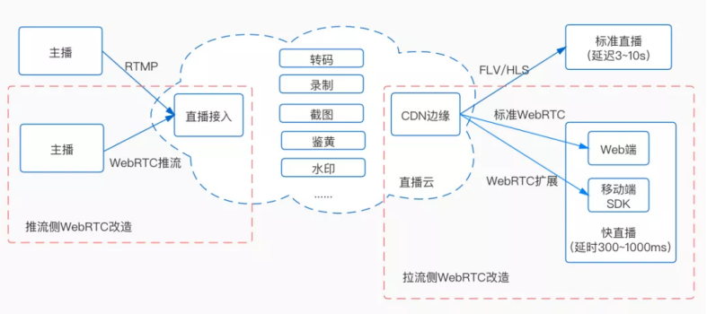</div>

​     

## 1 简介

WebRTC 项目目的是 “**为浏览器、移动平台和物联网设备开发丰富、高质量的 RTC 应用程序，并允许它们通过一组通用的协议通信**”，其次在 Web 上可以通过浏览器内置的 WebRTC API 直接使用，并且现代主流浏览器基本都支持。

<div align="center"></div>

对于原生客户端（例如 Android 和 iOS 应用），可以使用具备相同功能的库，当前WebRTC 项目属于[开源项目](https://webrtc.googlesource.com/src/)，受 Apple、Google、Microsoft 和 Mozilla 等公司支持。

WebRTC 应用场景：音视频会议、音视频聊天、远程访问、P2P CDN、…

WebRTC 优势&劣势：

| 特点 | 详情                                                         |
| ---- | ------------------------------------------------------------ |
| 优势 | 之所以市场上涌现这么多 WebRTC 或基于 WebRTC 的应用，主要是因为 WebRTC 有着以下这些优势：                <br />-- 全平台支持<br />-- 端到端安全加密<br />-- 强大的打洞支持<br />-- 标准化<br />-- 免费、开源<br />... |
| 劣势 | 同时也有着不可避免的弊端：<br />-- 缺乏服务器方案设计和部署<br />-- 对 Native 适配支持不够，编译难度较大<br />-- 传输质量难以保障… |

​    

## 2 技术架构

WebRTC 内部简化架构：

1）**Web API** 和 **libwebrtc**

* **Web API**：一组 JavaScript 接口，由 W3C 维护，开发人员可以使用这些 API 在浏览器中创建实时通信应用程序。

* **libwebrtc**：适用于移动端及桌面开发，即使用 WebRTC C++ 源码在 Windows、Android、iOS 等平台编译后的开发包，开发人员可以使用这个开发包打造原生的 WebRTC 应用程序。

2）**WebRTC C ++ API**：是 Web API 和 libwebrtc 的底层实现，该层包含了连接管理、连接设置、会话状态和数据传输的 API，而正是基于这些 API，浏览器厂商可以方便地加入对 WebRTC 的支持。

3）**会话管理和信令**：WebRTC 规范里没有包含信令协议，这部分需要研发人员依据业务特点自行实现

4）**音视频引擎**

* 音频引擎： 支持的音频编码格式有 OPUS 和 G.711，负责音频采集和传输，具有降噪、回声消除等功能

* 视频引擎：支持的视频编码格式主要有 VP8 和 H264（还有部分浏览器支持 VP9 及 H265 格式），负责视频的采集和传输，具有图像增强、音视频同步、 Jitter Buffer网络抖动优化等功能

5）**媒体传输层**：WebRTC 在 UDP 之上增加了 3 个协议：

* 数据包传输层安全性协议（DTLS）：用于加密媒体数据和应用程序数据；

* 安全实时传输协议（SRTP）：用于传输音频和视频流；

* 流控制传输协议（SCTP）：用于传输应用程序数据；

6）**网络层（网络I/O）**：WebRTC 借助 ICE 技术在端与端之间建立 P2P 连接，它提供了一系列 API，用于管理连接

7）**音频和视频采集模块**：WebRTC 提供了摄像头、话筒、桌面等媒体采集 API，使用这些 API 可以定制媒体流。

<div align="center"></div>

WebRTC 在线 Demo 地址: https://codepen.io/tuzkiss/pen/rNvwzZO 

   

## 3 协议栈

协议栈结构：

| **协议层**     | **http**                                                     | **webRTC**                                                   |
| -------------- | ------------------------------------------------------------ | ------------------------------------------------------------ |
| **API层**      | XHR、SSE、WebSocket                                          | RTCPeerConnection 和 DataChannel                             |
| **应用层**     | 提供了http1.x/2.0https协议                                   | PeerConnection：使用了SRTP协议<br />DataChannel：使用了SCTP协议（流控传输协议） |
| **会话层**     | 使用了TLS协议（可选），对于https需要这个协议，对于http并不需要 | 使用了DTLS协议（仿照TLS），对于SRTP可选，对于SCTP为必须      |
| **链路检测层** | --                                                           | ICE/STUN/TURN检测端到端之间的通路，进行连通性检测            |
| **传输层**     | 底层使用TCP传输，流传输                                      | 底层使用UDP传输，报文传输                                    |
| **网络层**     | IP协议                                                       | IP协议                                                       |

<div align="center"></div>

其中，WebRTC 核心协议栈主要通过**右侧 UDP 基础上构建**而出，其中右侧基于 UDP 的相关协议中各相关模块特点

| 模块              | 详情                                                         |
| ----------------- | ------------------------------------------------------------ |
| ICE、STUN、TRUN   | 主要用于端与端之间建联，包括直接 P2P ( peer-to-peer) 链接或通过服务端转发，详见： [Introduction to WebRTC protocols - Web APIs \| MDN](https://developer.mozilla.org/en-US/docs/Web/API/WebRTC_API/Protocols)<br /><br />**ICE** ( Interactive Connectivity Establishment )： 交互式连接建立<br />**STUN**（ Session Traversal Utilities for NAT ）：NAT 会话传输应用程序，一种网络协议，它**允许位于 NAT（或多重 NAT）后的客户端找出自己的公网地址，查出自己位于哪种类型的 NAT 之后，以及NAT为某一个本地端口所绑定的 Internet 端端口**，这些信息被用来在两个同时处于 NAT 路由器之后的主机之间建立 UDP 通信<br />**TURN**（Traversal Using Relays around NAT）：基于转发的 NAT 穿透 |
| DTLS              | **DTLS** ( Datagram Transport Layer Security) ：数据报传输层安全协议，用于对传输内容进行加密，即基于 UDP 的 TLS，**用于加密媒体数据和应用程序数据** |
| SRTP              | **SRTP** （ Secure Real-time Transport Protocol ）：安全实时传输协议，是对媒体数据的封装与传输控制协议，**对 RTP 数据进行加密**，消息认证和完整性以及重播攻击保护，**用于传输音频和视频流** |
| SCTP              | **SCTP** （ Stream Control Transmission Protocol ）：流控制传输协议，提供类似 TCP 的特性，SCTP 可以基于 UDP 上构建，在 WebRTC 里是在 DTLS 协议之上，**用于传输应用程序数据**。<br />**RTP（实时传输协议）和 SCTP（流控制传输协议）**，即通过使用 RTP 来交换用 SRTP 加密过的媒体数据，使用 SCTP 发送和接收那些用 DTLS 加密过的 DataChannel 消息。 |
| RTCPeerConnection | 主要**用于建立和维护端到端连接，并提供高效的音视频流传输**   |
| RTCDataChannel    | 主要用于**端与端之间任意数据传输**                           |

​    

### 1）STUN & TURN & ICE

| 名词 | 说明                                                         |
| ---- | ------------------------------------------------------------ |
| NAT  | **NAT** （Network Address Translation，网络地址转换）是一种**解决专用网络内设备连接公网的技术**，作为一种解决IPv4地址（长度限制32位）短缺以避免保留IP地址困难的方案（大多数终端都没有一个可以在互联网上可见的唯一IPV4地址），在IP数据包通过路由器或防火墙时重写来源IP地址或目的IP地址。 |
| STUN | **STUN**（Session Traversal Utilities for NAT，**NAT会话穿越应用程序**）是一种网络协议，它允许位于NAT（或多重NAT）后的客户端找出自己的公网地址（IP和端口），查出自己位于哪种类型的NAT之后以及NAT为某一个本地端口所绑定的Internet端端口，俗称 "打洞" / "NAT 打洞" / "NAT 穿越"。<br />这些信息被用来在两个同时处于NAT路由器之后的主机之间**创建UDP通信**。 |
| TURN | **TURN**（Traversal Using Relays around NAT，**中继型NAT遍历服务**），是一种数据传输协议（data-transfer protocol），**用于转发数据包给对端浏览器**，其目的就是解决STUN服务无法穿越对称 NAT 的问题，不同于其它中继协议在于它**允许客户机使用一个中继地址与多个对端同时进行通讯**，其完美弥补了 STUN 无法穿越对称型 NAT 的问题。<br />此外，与STUN服务器不同的是，允许TCP或UDP的链接在线跨越NAT或防火墙，且TURN 服务器会作为中转，转发多媒体数据会消耗大量的带宽。 |

通信架构：

<div align="center">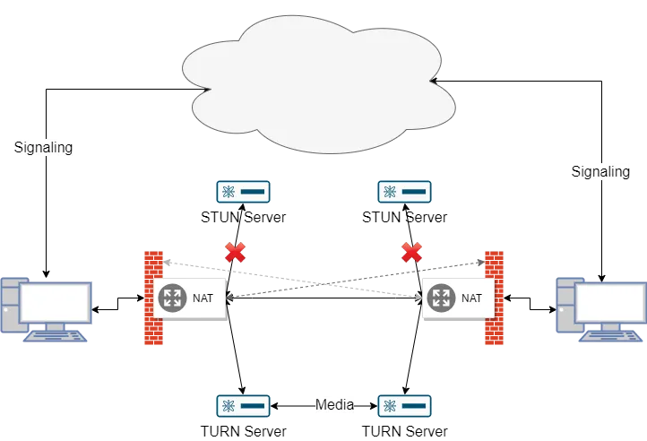</div>

**ICE**（Interactive Connectivity Establishment）表示交互式连接建立，即**客户端与服务端之间发现 P2P（Peer to Peer）传输路径的机制**，是一组**基于 offer/answer 模式解决 NAT 穿越问题的协议族**（框架），综合利用现有的 STUN、TURN 等协定，以更有效的形式来建设会话。

由于该技术是建立在多种NAT穿透协议的基础之上，并且提供了一个统一的框架，所以ICE具备了所有这些技术的优点，同时还避免了任何单个协议可能存在的缺陷。因此，ICE可以实现在未知网络拓扑结构中实现的设备互连，而且不需要进行对手配置，另外由于该技术不需要为VoIP流量手动打开防火墙，所以也不会产生潜在的安全隐患。

通常，**ICE 两端并不知道所处的网络的位置和 NAT 类型，通过 ICE 能够动态的发现最优的传输路径**。如下图 L 和 R 是 ICE 代理，下面简称 L 和 R，其中L 和 R 有各自的传输地址，包括**主机的网卡地址、NAT 上的外网地址、 TURN 服务地址**。ICE 就是要从这些地址中，找到 **L 和 R 的候选地址对**，实现两端高效连通。此外，ICE 两端可以通过信令服务器交换 SDP 信息，且使用 STUN 和 TURN 等协议来建立会话。

<div align="center">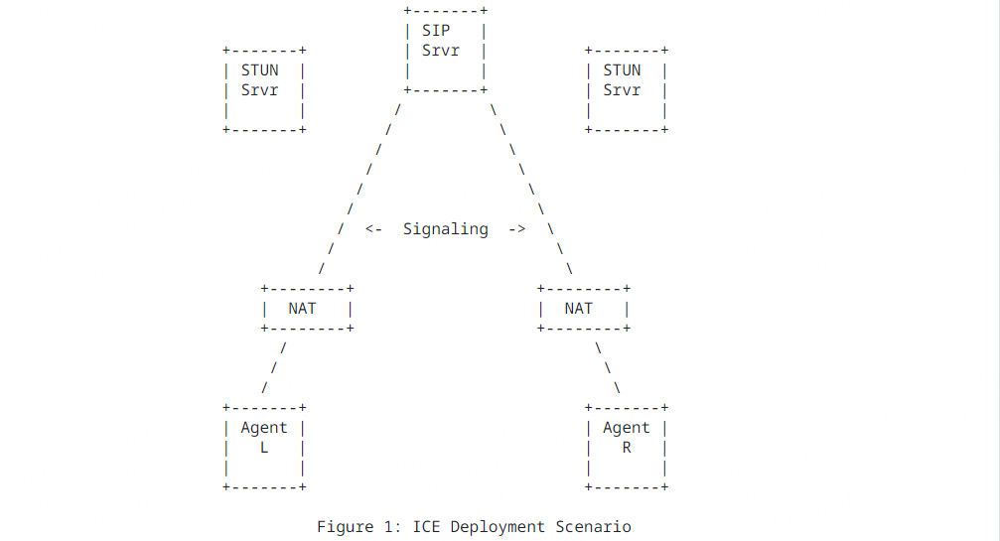</div>

ICE 模式分为 Full ICE 和 Lite ICE 两种类型。

* Full ICE：是单方都要进行连通性查看，实现的走一遍流程
* Lite ICE：在 Full ICE 和 Lite ICE 互通时，只须要 FULL ICE 一方进行连通性查看， Lite 一方只需回应 response 音讯。这种模式常用于部署在公网设施上的场景。

ICE详情扩展：[Interactive Connectivity Establishment (ICE): A Protocol for Network Address Translator (NAT) Traversal for Offer/Answer Protocols](https://datatracker.ietf.org/doc/html/rfc5245)

​    

### 2）DTLS

**DTLS**（Datagram Transport Layer Security，数据包传输层安全 ），是一种通信协议，提供数据包协议在传输层的发送安全，依靠于传输层安全协议（TLS），能够提供与TLS同等级的安全保护。

在 WebRTC 中，为了保证媒体传输的安全性，引入了 DTLS 来对通信过程进行加密，其中DTLS 的作用、原理与 SSL（Secure Socket Layer）/ TLS（Transport Layer Security） 类似，都是为了使得原本不安全的通信过程变得安全，它们的区别点是 **DTLS 适用于加密 UDP 通信过程，SSL/TLS 适用于加密 TCP 通信过程**，正是由于使用的传输层协议不同，造成了它们实现上面的一些差异。

   

#### a SSL/TLS协议（TCP）

SSL（Secure Socket Layer） 和 TLS（Transport Layer Security） 简单理解就是同一件东西的两个演进阶段，同样都是**在应用层和传输层之间加入的安全层**，最早的时候这个安全层叫做 SSL，由 Netscape 公司推出，后来被 IETF 组织标准化并称之为 TLS。

SSL/TLS 的作用是为了解决互联网通信中存在的三种风险：

* **窃听风险**：第三方可以获知通信内容；
* **篡改风险**：第三方可以修改通信内容；
* **冒充风险**：第三方可以冒充他人身份参与通信；

SSL/TLS 协议能够做到以下这几点，从而解决上述的三种风险：

* 所有信息通过加密传播，第三方无法窃听；
* 具有数据签名及校验机制，一旦被篡改，通信双方立刻可以发现；
* 具有身份证书，防止其他人冒充；

​    

**SSL/TLS 建立在 TCP 传输层上**，最常使用 SSL/TLS 的场景是在 HTTPS 中，通过在 HTTP 和 TCP 中加了一层 SSL/TLS，使得不安全的 HTTP 成为了安全的 HTTPS，其协议栈如下所示：

<div align="center"></div>


**TLS 1.2 握手过程**：

<div align="center"></div>

​     

#### b DTLS协议（UDP）

DTLS 从名字上就可以看出它和 TLS 的区别就在于多了一个“Datagram”，因为我们把使用 UDP 传输的报文叫做 “Datagram”，也就是 **DTLS 是适用于 UDP 传输过程的加密协议**。 DTLS 在设计上尽可能复用 TLS 现有的代码，并做一些小的修改来适配 UDP 传输，其次**DTLS 与 TLS 具备了同样的安全机制和防护等级，同样能够防止消息窃听、篡改，以及身份冒充等问题**。在版本上，DTLS 和 TLS 也有一定的对应关系，如下：

* DTLS 1.0 对应 TLS 1.1
* DTLS 1.2 对应 TLS 1.2
* DTLS 1.3 对应 TLS 1.3

​     

在 WebRTC 中，**通过引入 DTLS 对 RTP 进行加密，使得媒体通信变得安全**，且通过 DTLS 协商出加密密钥之后，RTP 也需要升级为 SRTP，通过密钥加密后进行通信，协议栈如下所示：

<div align="center"></div>

以 DTLS 1.2 举例（TLS 1.3 和 DTLS 1.3 流程已经很接近了），相比 TLS 1.2，DTLS 1.2 大部分步骤都是一样的，只是在服务端多了一步 HelloVerifyRequest，客户端因此也多了第二次的 ClientHello，如下图所示：

<div align="center"></div>

即服务端在首次收到客户端发送的 Client Hello 之后，只会生成一个 Cookie，不进行任何其他的操作，并给客户端发送 HelloVerifyRequest 消息，带上这个 Cookie。只有当客户端重新发送一次 Client Hello，并带上服务端发送的这个 Cookie 后，服务端才会继续握手过程。

​    

### 3）SRTP & SCTP

#### a RTP

RTP（Realtime Transport Protocol）：实时传输协议， 是**一种网络音视频流媒体的数据封包格式**，RTP 用来为 Internet 上的语音、图像、传真等多种需要实时传输的多媒体数据提供端到端的实时传输服务。**RTP 为 Internet 上端到端的实时传输提供时间信息和流同步，但并不保证服务质量**，服务质量由 RTCP 来提供。

<div align="center"></div>

​    

#### b RTCP

RTCP（RTP Trasport Control Protocol）：RTP传输控制协议，跟RTP在同一份RFC中定义，**负责流媒体的传输质量保证，提供流量控制等服务**，比如监控传输的质量。在 RTP 传输期间，参与者周期性的发送 RTCP 报文，报文里面包含各种统计信息，据此可以动态的调整音视频的质量，比如传输的速率、视频的码率等。

<div align="center"></div>

   

#### c SRTP

安全实时传输协议（Secure Real-time Transport Protocol，缩写SRTP），是**在RTP基础上所定义的一个协议**，旨在为单播和多播应用程序中的实时传输协议的数据提供加密、消息认证、完整性保证和重放保护安全实时传输协议。

webRTC中，**基于DTLS获取了对称加密所需要的密钥和对应的加密算法，使用在SRTP中，以此来对RTP数据进行加密保证安全和完整性**。

头部与普通RTP头一样，头部不进行加密，只有数据进行加密（黄色部分），尾部：

* SRTP MKI：主键标识符（可选），webrtc不使用，为0
* Authentication Tag：完整性验证，RTP头与加密数据进行做一次hash函数运算，得到摘要。对端通过同样方式进行验证，用来保证完整性

<div align="center"></div>

​    

#### d SCTP

流控制传输协议（SCTP，Stream Control Transmission Protocol）的设计目的是提供一种可靠的、面向消息的数据传输服务，以便于支持多点通信以及满足传输的可靠性需求，目前广泛应用于VoIP、移动通信和云计算等领域。

<div align="center"></div>

SCTP特性：

| 特性                                                | 详情                                                         |
| --------------------------------------------------- | ------------------------------------------------------------ |
| 多宿主（Multi-Homing）                              | SCTP里面引入了联合（Association）的概念：<br />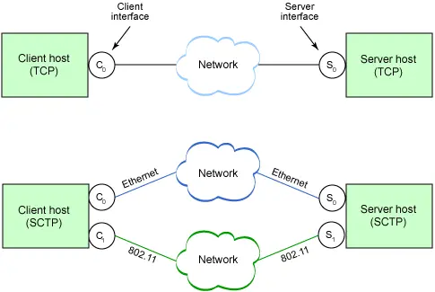<br /><br />1) TCP连接是在两个主机的单个接口之间建立的<br />2) SCTP可以把多条路径合并到一个联合中，数据可以在任意一个连接路径上进行传输 |
| 多流（Multi-streaming）                             | SCTP可以在一个联合中支持多流机制，每个流（stream）都是独立的<br />1）每个流都有各自的编号，编码在SCTP报文中<br />2）阻塞的流不会影响同一联合中的其他流，可以并行进行传输<br />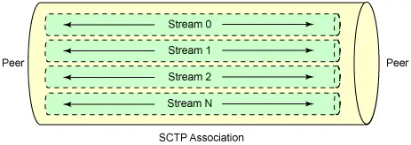 |
| 初始化保护（Initiation protection）                 | TCP中的三次握手机制会被利用来进行DoS（Denial of Service）攻击，通过发送大量的SYN报文最终耗尽服务器的资源<br />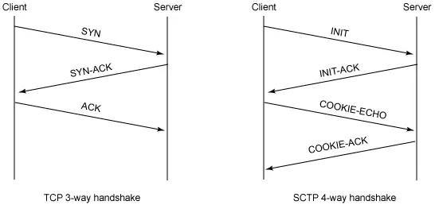<br /><br />**SCTP通过引入4次握手机制来避免这种场景**：<br />1) 服务器的INIT-ACK中会包含cookie（标识这个连接的唯一上下文)<br />2) 客户端使用这个cookie来进行响应，服务器收到这个响应后，才为这个连接分配资源；             <br />3) 为了解决4次握手机制带来的时延，SCTP协议还允许在COOKIE-ECHO和COOKIE-ACK报文中传输数据包 |
| 消息分帧（Message framing）                         | TCP协议是**按照字节流的方式进行数据传输的**，并不存在消息边界，比如说音频视频都可以通过流的方式进行传递；<br />UDP使用的是**消息分帧，发端多大的数据包，收端收到的数据包也是这么大**；<br />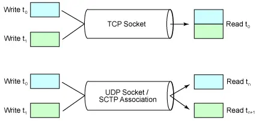<br /><br />SCTP也提供了这种分帧的机制 |
| 可配置的无序发送（Configurable unordered delivery） | TCP能确保数据按照次序发送，UDP无法保证消息有序，SCTP中也可以配置成接受无序的消息。<br />这样的通信方式对于面向消息的传输非常有用，因为**每个消息都是各自独立的，次序并不重要**。 |
| 平滑关闭（Graceful shutdown）                       | TCP和SCTP都是基于连接的协议，完成传输后都需要有一个拆除连接的过程。<br />其中，TCP中连接的删除是半关闭的，服务的某一端可以关闭自己这端的socket，但是可以继续接受数据。但SCTP协议设计的时候考虑这种半关闭的状态实际上很少使用，所以简化了关闭的过程，一旦某一端发起了连接拆除，对等的两端都关闭。<br />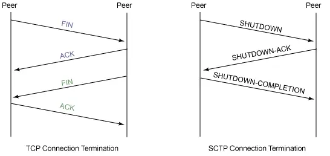 |

​     

RTP/RTCP主要用来传输音视频，是为了流媒体设计的，而对于**自定义应用数据的传输，WebRTC中使用了SCTP协议**。同样的，SCTP依赖DTLS建立的加密信道，对于自定义应用数据的发送，流程如下：

1) 通信双方：通过DTLS握手，协商生成一对密钥；

2) 数据发送方：将自定义应用数据，通过密钥进行加密，生成SCTP包；

3) 数据发送方：通过UDP传输SCTP包；

​    

## 4 WebRTC通信核心步骤

WebRTC 核心步骤：

<div align="center"></div>

**注**：这些**步骤依次发生，且前置步骤为必要条件**

其过程示意图：

<div align="center">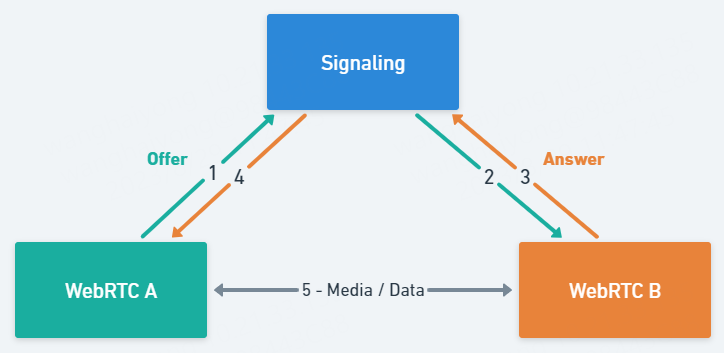</div>

​          

### 1）媒体协商Signaling（信令交换SDP）

**目的**：是**如何在 WebRTC 中找到对应的 Peer**，即让双方找到共同支持的媒体能力，从而能实现彼此之间的音视频通信。

WebRTC 中媒体协商使用的是 SDP 协议进行交换，目前Signaling 过程主要交换以下信息：**用于p2p的网络信息，以及 浏览器支持的媒体编码格式以及通信协议**。

   

#### a 会话描述协议SDP

SDP（ Session Description Protocol，会话描述协议）一种基于文本的会话描述格式，**在流媒体中只用来描述传输流程中媒体信息**，其本身并不属于传输协议，需要依赖其它的传输协议（如 配合RTP/RTSP等协议进行通信，即交换媒体信息）。

SDP 主要用来描述多媒体会话，用途包括会话声明、会话邀请、会话初始化等，通俗来讲，它可以表示**各端的能力**，记录有关于**音频编解码类型**、**编解码器相关的参数**、**传输协议**等信息。

此外，交换 SDP 时，通信的双方会将接受到的 SDP 和自己的 SDP 进行比较，取出他们之间的交集，这个交集就是协商的结果，也就是最终双方音视频通信时使用的音视频参数及传输协议。

SDP 描述由若干文本行组成，文本行的格式为 **<类型>=<值>**， <类型> 是一个字母，<值> 是结构化的文本串，其格式依 <类型> 而定，其典型结构如下：

<div align="center">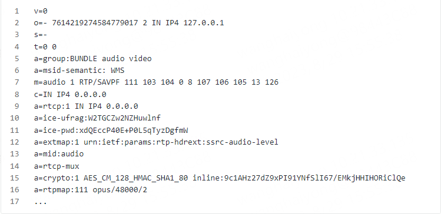</div>

详情：[WebRTC进阶-SDP协议详解 - 知乎](https://zhuanlan.zhihu.com/p/609950122?utm_id=0)

​     

**MiniSDP** 是一种基于二进制编码的压缩协议，提供对标准 SDP 协议进行压缩处理

| 类型     | 详情                                                         |
| -------- | ------------------------------------------------------------ |
| 特性     | 标准 SDP 比较冗长（5-10KB 左右），不利于快速高效传输，所以在直播场景下会尤其影响首帧时间。 <br />**MiniSDP 对标准 SDP 文本协议进行高效能压缩**，将原生 SDP 转换成**更小的二进制格式**，使其能够通过一个 UDP 包来传输。 |
| 优势     | 降低信令交互时间，提高网络传输效能，降低直播拉流首帧渲染时间，提高拉流秒开率/成功率等 QoS 统计指标。 |
| 结构概述 | <br /><br />**mini_sdp header**：mini_sdp 的头部，主要定义 mini_sdp 传输所需要的一些辅助信息及 sdp 的类型<br />**session header**：主要定义 session 维度的一些信息，如是否加密，candidate，session 所包含的 media 数，及 session 扩展等**media**：描述了 sdp 流媒体信息，如媒体类型，codec、tracks、rtp 扩展等 |

​    

#### b 媒体协商过程（Offer/Answer 模型）

媒体协商一般使用一个 **Offer/Answer 模型** 进行交换，其大致过程：

1）发起端 Amy 创建 Offer 并将 Offer 信息，并调用 `setLocalDescription` 将其保存起来，通过信令服务器传送给接收端 Bob

2）接收端 Bob 收到对等端 Amy 的 Offer 信息后调用 `setRemoteDescription` 方法将其保存起来，并创建 Answer 信息，同理也将 Answer 消息通过 `setLocalDescription` 保存，并通过信令服务器传送给呼叫端 Amy

3）呼叫端 Amy 收到对等端 Blob 的 Answer 信息后调用 `setRemoteDescription` 方法将其 Answer 保存起来

<div align="center"></div>

总的来说，**媒体协商就是在交换 SDP的过程**，即会话发起者通过创建一个offer，经过信令服务器发送到接收方，接收方创建answer并返回给发送方，完成交换。

由上可知，在双方要建立点对点通信时，Offer是发起端发送的 SDP 消息，而Answer则是接收端发送的 SDP 消息，所以 Offer 和 Answer 本质就是存有 SDP 信息的对象，所以也会叫做 SDP Offer 和 SDP Answer。

<div align="center">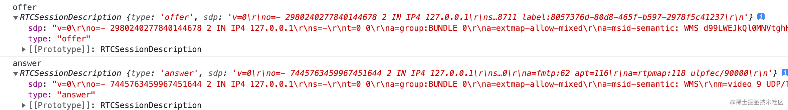</div>

   

#### c 信令和信令服务器

**信令**：通常指的是**为了网络中各种设备协调运作，在设备之间传递的控制信息**

对于 WebRTC 通信来说，发起端发送 Offer SDP 和接收端接受 Answer SDP，要怎么发给对方呢？这个过程还需要**一种机制来协调通信并发送控制消息**，这个过程就称为信令。

而**信令对应的服务器就叫信令服务器**，作为中间人帮助建立连接，主要负责：

* **信令的处理**，如媒体协商SDP消息的传递
* **管理房间信息，加入房间/退出房间**，比如用户连接时告诉信令服务器自身的房间号，由信令服务器找到也在该房间号的对等端并开始尝试通信，也通知用户谁加入了房间和离开了房间，通知房间人数是否已满等等，所以也叫信令服务器也叫房间服务器。

WebRTC 并没有规定信令必须使用何种实现，目前业界使用较多的是 WebSocket + JSON/SDP 的方案，其中 **WebSocket 用来提供信令传输通道，JSON/SDP 用来封装信令的具体内容**。

**扩展**：[信令传输--视频直播](https://www.volcengine.com/docs/6469/103016)

​    

### 2）连接Connecting（ICE）

**目的**：是**让两个 WebRTC Peer 在获取到对方SDP信息（媒体协商）之后，尝试建立网络连接**

WebRTC 不使用 Server/Client 模型，而是 **Peer-to-Peer （ P2P ）连接**，但因为**不确定实际的传输地址**（ IP、Port 等），所以还需要依赖于 **ICE 协议**。

**ICE**（Interactive Connectivity Establishment，互动式连接建立），由IETF的MMUSIC工作组开发出来的，它所提供的是一种框架，使各种NAT穿透技术可以实现统一，且ICE跟STUN和TURN不一样，**ICE不是一种协议，而是一个框架（Framework），它整合了STUN和TURN，可用于寻找两个 WebRTC Peer 间通信的最佳方式**。

​    

ICE 是在各端调用 setLocalDescription() 后就开始了，其操作过程如下：**收集 Candidate** -> **交换 Candidate** -> **按优先级尝试连接**

**Candidate**：是 WebRTC 用来**描述它可以连接的远端的基本信息**，因此 Candidate 是至少包括 **IP 地址**、**端口号**、**协议**的一个信息集，本质上是一个传输地址，WebRTC Peer 认为这个传输地址可能可以被对端访问到，但因为实际场景中有着各种网络限制，因此需要通过ICE建立连接。

比如：通常如果想用 socket 连接某台服务器，一定要知道这台服务器的一些基本信息，如服务器的 IP 地址、端口号以及使用的传输协议，只有知道了这些信息，才能与这台服务器建立连接。

<div align="center"></div>

   

#### a 收集 Candidate

在 WebRTC 中有三种类型的 ICE 候选者（Candidate）：

* **主机候选者（local）**：表示网卡自己的 IP 地址及端口，即可通过**设备网卡获取，优先级最高**，当前在 WebRTC 底层首先会尝试本地局域网内建立连接。
* **反射候选者（STUN）**：表示**经过 NAT 之后的外网 IP 地址和端口，由 ICE（STUN）服务器获取**，根据服务器的返回情况，来综合判断并知道自身在公网中的地址，且其优先级低于主机候选者，当 WebRTC 尝试本地连接不通时，会尝试通过反射候选者获得的 IP 地址和端口进行连接。
* **中继候选者（TURN）**：表示的是**中继(TURN)服务器的转发 IP 地址与端口**，由 ICE 中继服务器提供，优先级最低，前两个都不行则会按该种方式。

**注：**在新建RTCPeerConnection时可在构造函数指定 ICE 服务器地址，没有指定的话则意味着这个连接只能在内网进行。

每次 WebRTC 找到/收集一个可用的 Candidate，都会触发一次icecandidate事件，为了将收集到的 Candidate 交换给对端，需要给onicecandidate方法设置一个回调函数，函数里面调用addIceCandidate方法来将候选者添加到通信中。

​    

#### b 交换 Candidate

WebRTC 收集好 Candidate 后，会**通过信令系统将它们发送给对端**，对端接收到这些 Candidate 后，会与本地的 Candidate 形成 **CandidatePair**（即连接候选者对，一个本地 Candidate，一个远端 Candidate），之后WebRTC 就可以开始尝试建立连接了。

**注**：Candidate 的交换不是等所有 Candidate 收集好后才进行的，而是**边收集边交换**。且一旦 WebRTC 发现其中有一个可以连通的 CandidatePair 时，它就不再进行后面的连接尝试了，但**发现新的 Candidate 时仍然可以继续进行交换**。

   

### 3）安全加密Securing（DTLS）

**目的**：保障在通信过程中的数据安全，即 ICE 成功连接后，WebRTC 会继续建立加密传输

WebRTC 会通过**在 ICE 建立的连接上进行 DTLS 握手来进行连接**，且与 HTTPS 不同，WebRTC 不使用中央授权来颁发证书，相反**WebRTC 只是判断通过 DTLS 交换的证书是否与通过信令共享的签名相符**，因此此 DTLS 连接可以被用于传输 DataChannel 消息。

如果是使用 RTP 协议进行音频 / 视频的传输，则需要**使用 SRTP 来保护 RTP 数据包**，且与 DTLS 不同，它**没有握手机制，因此协议的所有配置和密钥都是在 DTLS 握手期间生成的**。

建立安全的双向通信连接之后，则可以真正的传输信息了，但实际的情况并不是那么理想，丢包、抖动、带宽等问题都可能影响稳定的连接和使用。

**DTLS时序**：

<div align="center">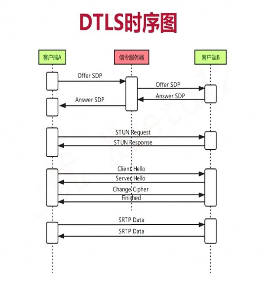</div>

​    

### 4）通信Communicating（SRTP）

**目的**：是尽可能**建立稳定连接和通信**

<div align="center"></div>

WebRTC 在音视频通信上，使用的是 RTP 和 RTCP 协议，：

1) **RTP**（实时传输协议，Real-time Transport Protocol）是**承载媒体的协议，为视频的实时传输而设计**。它没有规定有关延迟或可靠性的任何规则，但是提供了实现这些规则的工具。其次，RTP 提供了流的设计，因此可以通过一个连接发布多个媒体源，同时还提供了完善媒体传递途径所需的计时和排序信息。

2) **RTCP**（RTP 控制协议，RTP Control Protocol）是**用于传达有关呼叫的元数据的协议**，其格式非常灵活，并允许可以添加所需的任何元数据，因此被用来传达有关呼叫的统计信息，同时也是处理分组丢失和实现拥塞控制的必备特性，此外它也提供了响应变化的网络状况所必需的双向通信能力。

**注**：RTP 和 RTCP 需要协同解决网络引起的所有问题

WebRTC 在数据通信上使用的是 **SCTP 协议**，其中**SCTP 是一种传输层协议，旨在替代 TCP 或 UDP**，当前对于 WebRTC， SCTP 将用作在 DTLS 连接上运行的应用层协议。

SCTP 是 WebRTC 数据通道背后的真正动力，提供了数据通道的以下所有功能，包括**多路复用、使用类似 TCP 的重传机制进行可靠传递、部分可靠性选项、避免拥塞、流量控制**等。

​    

## 5 webRTC网络拓扑

WebRTC 规范主要介绍了使用 **ICE 技术建立 P2P 的网络连接**，即 **Mesh 网络结构**，因而在 WebRTC 技术的实际应用中，衍生出了媒体服务器的用法，使用媒体服务器的场景，通常是因为 P2P 连接不可控，而使用媒体服务器可以对媒体流进行修改、分析、记录等 P2P 无法完成的操作。

实际上，如果把**媒体服务器**看作 WebRTC 连接的另外一端，就很容易理解媒体服务器的工作原理了。**媒体服务器是 WebRTC 在服务器端的实现，起到了桥梁的作用，用于连接多个 WebRTC 客户端**，并增加了额外的媒体处理功能，通常根据提供的功能，将媒体服务器区分成 **MCU** 和 **SFU**。

<div align="center"></div>

​    

### 1）Mesh网络结构

Mesh 是 WebRTC 多方会话最简单的网络结构。在这种结构中，**每个参与者都向其他所有参与者发送媒体流，同时接收其他所有参与者发送的媒体流**。说这是最简单的网络结构，是因为它是 Web-RTC 原生支持的，无须媒体服务器的参与。

<div align="center"></div>

在 Mesh 网络结构中，每个参与者都**以 P2P 的方式相互连接，数据交换基本不经过中央服务器**（部分无法使用 P2P 的场景，会经过 TURN 服务器）。由于每个参与者都要为其他参与者提供独立的媒体流，因此需要 N-1 个上行链路和 N-1 个下行链路。众多上行和下行链路限制了参与人数，参与人过多会导致明显卡顿，通常只能支持 6 人以下的实时互动场景。

由于没有媒体服务器的参与，**Mesh 网络结构难以对视频做额外的处理，不支持视频录制、视频转码、视频合流等操作**。

​    

### 2）MCU网络结构

**MCU**（Multipoint Control Unit）是一种传统的中心化网络结构，参与者仅与中心的 MCU 媒体服务器连接。**MCU 媒体服务器合并所有参与者的视频流，生成一个包含所有参与者画面的视频流，参与者只需要拉取合流画面**，结构如下。

<div align="center"></div>

这种场景下，每个参与者只需要 1 个上行链路和 1 个下行链路。与 Mesh 网络结构相比，参与者所在的终端压力要小很多，**可以支持更多人同时在线进行音视频通信，比较适合多人实时互动场景。但是 MCU 服务器负责所有视频编码、转码、解码、合流等复杂操作**，服务器端压力较大，需要较高的配置，此外同时由于合流画面固定，界面布局也不够灵活。

   

### 3）SFU网络结构

在 SFU（Selective Forwarding Unit）网络结构中，仍然有中心节点媒体服务器，但是**中心节点只负责转发，不做合流、转码等资源开销较大的媒体处理工作**，所以服务器的压力会小很多，服务器配置也不像 MCU 的要求那么高，此外每个参与者需要 1 个上行链路和 N-1 个下行链路，带宽消耗低于 Mesh，但是高于 MCU。

我们可以**将 SFU 服务器视为一个 WebRTC 参与方**，它与其他所有参与方进行 1 对 1 的建立连接，并在其中起到**桥梁的作用**，同时**转发各个参与者的媒体数据**，而正是由于SFU 服务器具备**复制媒体数据的能力**，能够**将一个参与者的数据转发给多个参与者**。

SFU 服务器与 TURN 服务器不同，TURN 服务器仅仅是为 WebRTC 客户端提供的一种辅助数据转发通道，在无法使用 P2P 的情况下进行透明的数据转发，TURN 服务器不具备复制、转发媒体数据的能力。

SFU 对参与实时互动的人数也有一定的限制，适用于**在线教学、大型会议**等场景，其网络结构如下所示。

<div align="center">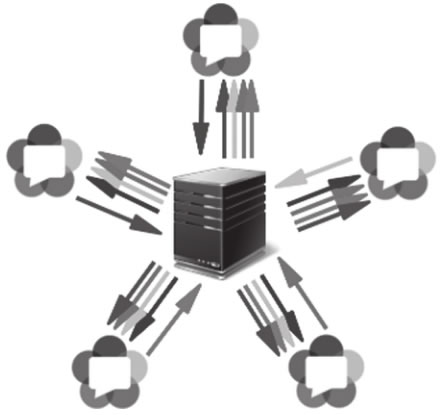</div>

​    

#### a Simulcast联播

**在进行 WebRTC 多方视频会话时，参与人数较多，硬件设施、网络环境均有差异，这种情况下如何确保会话质量呢**？使用 MCU 时，这个问题相对简单一些。

MCU 可以根据参与者的网络质量和设备能力，提供不同的清晰度和码率，但是随之而来的问题是服务器资源压力较大，难以支撑大规模并发，同时也显著增加了使用成本。

**多人会话场景**选择 SFU 网络结构是目前通用的做法，早期的 SFU 只是将媒体流从发送端转发给接收端，无法独立为不同参与者调整视频码率，其结果是发送者需要自行调整码率，以适应接收条件最差的参与者。而那些网络环境较好的参与者只能接收相同质量的媒体流，别无选择。

**Simulcast** 技术对 SFU 进行了优化，**发送端可以同时发送多个不同质量的媒体流给接收端**，而后**SFU 能够依据参与者的网络质量，决定转发给参与者哪种质量的媒体流**。因为发送者需要发送多个不同质量的媒体流，所以会显著增加发送设备的载荷，同时占用发送者上行带宽资源。

   

#### b 可伸缩视频编码SVC

**可伸缩视频编码**（Scalable Video Coding，SVC）是 Simulcast 的改进技术，它**使用分层编码技术，发送端只需要发送一个独立的视频流给 SFU，SFU 根据不同的层，解码出不同质量的视频流**，并发送给不同接收条件的参与者。

SVC 中多个层次的媒体流相互依赖，较高质量的媒体数据需要较低质量的媒体数据解码，因此SFU 接收到 SVC 编码的内容后，根据客户端的接收条件选择不同的编码层次，从而获得不同质量的媒体流。

* 如果媒体流包括多个不同分辨率的层，则称该编码具有空间可伸缩性
* 如果媒体流包含多个不同帧率的层，则称该编码具有时间可伸缩性
* 如果媒体流包含多个不同码率的层，则称该编码具有质量可伸缩性。

在编码空间、时间、质量均可伸缩的情况下，SFU 可以生成不同的视频流，以适应不同客户端的接收条件。

   

## 6 应用实践

### 1）超低时延直播

传统和超低延迟直播播放模型

| 传统模型 |  |
| -------- | ------------------------------------- |
| 超低时延 | 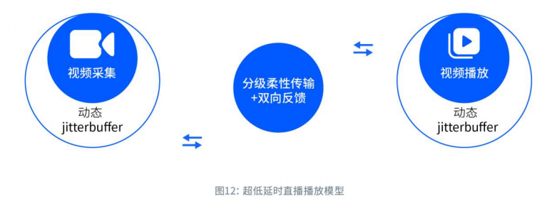 |

原生WebRTC 低延迟P2P通信**在直播场景面临的挑战**：

<div align="center"></div>

**针对优化**：

| 手段       | 详情                               |
| ---------- | ---------------------------------- |
| 信令改造   | 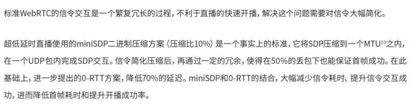   |
| 音视频改造 | 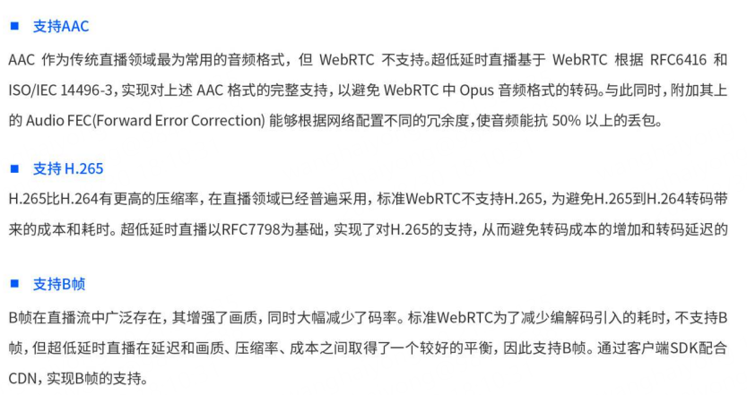 |
| 传输改造   |    |
| 其它改造   | 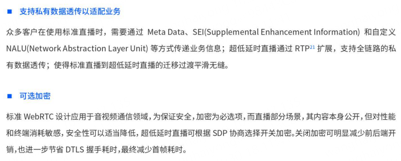   |

<div align="center"></div>

详情：http://blog.kurokoz.com/wp-content/uploads/2022/05/1651928462-553-white-paper-on-ultra-low-latency-live-streaming.pdf

​     

### 2）直播连麦（合流）

随着2011年google开源webrtc，各种**低延迟音视频实时互动的应用场景**开始出现，对于直播平台来说，比较常见的就是主播之间连麦互动。

连麦流程：

1) 首先是业务方发起一个连麦业务，到业务服务器

2) 业务服务器会和信令服务器交互，拿到一个信令服务器生成的频道号等关键信息

3) 业务服务器会把这些关键信息返回给业务方

4) 业务方再拿这些关键信息来访问信令服务器的接口，获取一个访问授权的token，业务方再拿这个token来调连麦SDK

5) 连麦SDK给业务方提供一系列建立连接，加入频道，发布音视频，订阅等接口，也给业务方提供了各个具体功能的回调等。

<div align="center"></div>

**连麦SDK功能**：

| 功能点             | 说明                                                         |
| ------------------ | ------------------------------------------------------------ |
| 1）peer connection | peer connection是webrtc中建立音视频通信流程中的一个核心对象，集成了webrtc里面大部分的控制接口，包括**连接，媒体协商，音视频采集编码流程，音视频渲染播放流程，数据传输等等**，可以通过peer connection对象就能建立整套的音视频通信。 |
| 2）媒体协商        | **媒体协商**是webrtc建立音视频通信的协商过程，通俗一点讲就是，**不同平台，不同设备能支持的音视频编解码能力不一样，要双方能建立音视频通信，必须要在双方都支持的音视频编解码里面选一个，才能完成协商**。<br /><br />webrtc的媒体协商是靠 offer/answer 的方式来完成的，在建连成功后，**连麦SDK给媒体服务器发起一个本地支持音视频编解码能力的offer**，服务器会返回它支持的音视频编解码能力的answer，最终选择双方都支持的音视频编解码能力完成协商。<br /><br /><br />1) **建连**<br />2) **加入频道**<br />3) **发布音视频**<br />4) **订阅音视频**<br />5) **离开频道** |

**合流方案优化**

| 方案       | 详情                                                         |
| ---------- | ------------------------------------------------------------ |
| 服务器合流 | <br />服务器合流的最主要缺点是**每次连麦会断流重推2次**<br /><br /><br />用户直播的时候，连麦前是用户本地直播工具把自己音视频流推到CDN的<br />用户连麦后，媒体服务器把收到两边用户的画面进行合流，然后把合并后的画面各自推到双方各自的直播间。但在这之前，**用户本地的直播工具必须把自己断掉，媒体服务器才能推流成功**，这个时候会导致一次断流。连麦结束后，媒体服务器会停止推流，然后用户本地直播工具重新开始推流，又导致了一次断流重推。 |
| 客户端合流 | 每次断流重推都会导致观看的用户看到黑屏或者转菊花，用户体验非常不好，相反合流这件事放到直播工具，可以不需要断流，还能节省服务器成本，如图<br /><br /><br />用户连麦开始后，不会断开和直播CDN的流，会**额外发送一路音视频流到媒体服务器，从媒体服务器收到对面的流后，在直播工具直接把对方的视频画面渲染在本地直播场景里面**，把对方音频进行本地混音，直播间观众看到的画面就是连麦后的画面，不需要媒体服务器做额外的工作，更不需要断流。 |

​     

# 二 SRT

SRT（Secure Reliable Transport，安全可靠传输协议）是一种开源的传输协议，专为实时视频流传输而设计，它成功解决了复杂的传输时序，丢包重传等问题，同时还拥有低延时传输的特点，逐渐成为直播行业的主流推流技术。

<div align="center"></div>

特点：

1）SRT协议以UDP协议为基础，传统UDP协议不可靠，但实际它的效率很高，具备稳定、可重复并具有连续吞吐量的数据包投递机制；
2）SRT采用非常高效的握手机制建立连接，只需使用两个往返就可以完成握手、信息交互、参数交互

3）SRT使用了改进后的ARQ自动重发请求技术，并支持FEC前向纠错；

4）封装协议中带有精准的时间戳；

5）SRT通过设定延时量，统一规定了发送端和接收端缓冲区的大小，实际上延时量也决定了缓冲区可以使用的大小；


## 1 SRT协议传输原理分析

SRT协议能够在不可预测的互联网环境下提供安全、可靠的数据传输，目前广泛应用在流媒体传输领域。理论上SRT可以传输任意类型的数据，但由于其特别针对实时音视频传输做了优化，目前的主要应用场景是**跨越公共互联网点对点传输实时音视频数据**。

   

### 1）SRT和UDP协议

SRT协议由UDT（UDP-based Data Transfer）协议改进而来，保留了UDT协议大多数的核心概念和机制，并同时优化和增强一些功能，其中包括针对**实时音视频的流量控制**、**增强的拥塞控制**、**控制数据的修改**、**丢包重传**、**加密机制**等，这使得SRT协议在传输音视频方面，既具有UDP低延时、效率高的特点，还具有高效的数据重传机制。此外，SRT协议还可以传输高吞吐量和高流量的数据，所以它非常适合音视频的网络传输。

> UDT协议：在UDP协议的基础上添加了可靠性控制和拥塞控制机制来保证可靠性，可以有效地利用高速广域网络的高带宽，实现文件的高效、可靠传输，目前**UDT协议主要适用于高吞吐的文件传输**。

​    

UDP&SRT有损网络传输码流效果：

| 协议    | 有损网络音视频流协议传输示例                                 |
| ------- | ------------------------------------------------------------ |
| 裸露UDP | <br />一个编码后的TS流信号（VBR)，固定帧间隔40毫秒，使用UDP协议经过有损网络传输后，解码端收到数据码流特性和固定的帧间隔也因网络抖动而发生了明显改变，而这实际上解码器很难从这样的码流中恢复出正常的音视频信号。 |
| SRT     | <br />由图可知，SRT在解码端重新恢复了原有的码率特性和帧间隔，其次SRT有一个**发送端缓冲区**（Sender Buffer)、**接收端缓冲区**（Receiver Buffer)，在发送信号的同时会有一些控制信息或者说反馈信息来实现ARQ纠错，并且SRT包头中有精确的时间戳。<br />此外，在发送端接收端之间有一个**强制的固定延时量**，而这个延时实际上是在接收端缓冲区产生的，**所有数据放到接收端缓冲区，必须要等待一个延时量才会被送给解码器**，这是SRT的一个重要的特点。 |

注：上述差异这是因为SRT协议经过**有效的差错控制、精确的时间戳、反馈信号、根据延时量定义缓冲区**等一系列机制，实现了在有损网络下的流媒体传输，使得解码端很好还原了输入码流，而UDP由于不具备任何的数据恢复机制，所以很可能会出现一系列的丢包或者乱序问题。

   

### 2）协议重传机制：ARQ & FEC

SRT重传机制（差错控制）包括以下2类：

* FEC前向纠错机制（Forward Error Correction）
* ARQ自动重传请求机制（Automatic Repeat reQuest）

   

**ARQ基本思想**：Server端成功收到数据包后通过反馈信道向Client端传送一个应答ACK信号（Acknowledgement），若Server端超时未收到，则通过反馈信道向Client端传送一个否定应答NAK信号（Negative acknowledgement），当发Client收到此NAK信号后就重新传送相应的未被接收的数据包。因此，这种机制除了要求发送端需要一个重传缓冲区之外，接收端也需要一个能依次存放数据包的缓冲区。 

**注**：有的传输协议虽然也是使用ARQ机制，但是它可能只使用ACK或者NAK，而SRT既是用ACK也使用NAK。

<div align="center"></div>

与ARQ机制不同，FEC是一种前向纠错机制，相当于在音视频数据送到传输通道之前，会按照预先设计的算法进行编码处理，加入一些冗余信息的数据，相应地Server端会根据相应的冗余算法对其进行解码，并在解码的过程中找到相对应的错误码进行纠错，让其数据量恢复正常。

<div align="center"></div>

如上示例，Client端向Server端分别发送4个数据包（Data1、Data2、Data3、Data4），且在每个数据包之前都添加**FEC冗余数据**。假设在传输过程中，Data4数据包在传输过程中出现了丢包情况，Server端会根据设计好的编码算法接收把丢失的数据包给纠错恢复出来，即可知FEC是不需要做任何重传机制，就可以把数据恢复出来。

整的来说，FEC和ARQ机制比对差异如下所示：

<div align="center"></div>

​    

ARQ和FEC的使用场景：

> Q：那么什么情况下用ARQ重传，什么情况情况下用FEC前向纠错？
>
> 一般情况下，需要根据**使用场景的特点和需求**来选择ARQ或FEC。
>
> 1）以**卫星通信**为例，通信链路的单次往返时延即RTT约为540ms，并且噪声都为高斯白噪声，若此时使用ARQ进行重传，效率就很低，也会造成非常大的延时，因此在此场景下，FEC就成为了最合适的选择，即通过为每个数据包提前添加冗余信息，Server就可以根据特定的编码技术把错误的信息给纠正。
>
> 2）再比如在一个**网络实时传输音视频流**的场景下，由于互联网环境中的丢包和抖动大多是突发的，这种环境就比较适合ARQ技术进行丢包重传，因为在网络实时直播的场景下，**RTT都是很小的**，且**网络带宽有限**，所以如果采用FEC前向纠错的话，它占用一定的额外带宽。
>
> 因此，SRT最初选择了ARQ作为纠错方式。随着SRT应用领域的发展和扩大，最新版的SRT也加入了对FEC的支持，从而更好地适应各类场景下的应用。

​    

### 3）SRT交互过程

<div align="center"></div>

SRT协议的交互流程步骤：

* 握手（Handshake）：Caller与Listener之间的进行的Handshake Request是一个简化版的握手，用以提高效率，比如交换MD5 cookie，用于防止DDOS攻击
* 参数交换（Capability Announce/Response）：即握手之后Caller与Listener间进行重要信息Capability的交换，如 版本、Live/File模式、加密、**缓冲区大小（Buffer Size）**、流ID、**双向延迟量（Latency）**
* 媒体数据传输（Media）：Caller与Listener之间开始传输音视频媒体数据（payload），同时也传输了为恢复帧间隔而封装的精准时间戳（us）
* 控制信息（Control）：Listener向Caller同步控制信息，用以对抗公网中的抖动、丢包等一系列突发状况，如ACK/NAK、ACKACK、Keepalive等
* 关闭（Shutdown）：待至媒体数据传输完毕之后关闭传输

可知，与RTMP握手不同（3RTT的握手时间），SRT的建连过程仅需两个RTT，也就是 **Handshake Request** 与 **Capability Announce**。

   

## 2 SRT报文基础

SRT协议中包含两类数据包：**信息数据包**（Data Packet）和**控制数据包**（Control Packet），通过SRT首部的最高位（标志位）来区分，0代表信息数据包，1代表控制数据包。

   

### 1）信息数据包（Data Packet）

如下SRT信息数据包的结构（不同版本略有差异），其承载了需要传输的有效数据。SRT首部长度为16字节，最高位为标志位，SRT信息数据包首部包含四个区域：数据包序列号、报文序号、时间戳、目的地端套接字ID

* 数据包序列号（packet sequence number）：SRT使用基于序列号的数据包发送机制，发送端每发送一个数据包，数据包序列号加1
* 标志位：
  * FF：表示报文的序列（数据包在消息中的位置），其中 10b 分片的第一个报文（1st），00b 是分片的中间报文（middle），01b 是分片的最后一个报文（last），11b 表示单个报文并没有分片（single）
  * O：是否按顺序发送报文，其中live模式中必须为1
  * KK：表示是否加密，其中 00b 不加密，01b 偶数密钥加密，10b 奇数密钥加密
  * R：表示是否属于重传报文
* 报文序号（Message number）：报文序号独立计数
* 时间戳（timestamp）：以连接建立时间点（StartTime）为基准的相对时间戳，单位为微秒
* 目的套接字ID（destination socket ID）：SRT自定义的一个socket id，在多路复用时用来区分不同的SRT流

<div align="center"></div>

​    

### 2）控制数据包（Control Packet）

控制数据包基础结构如下图（UDP header部分忽略），其中不同的控制数据包类型的传输数据字段有一定差异，包括 握手（Handshake）、肯定应答（ACK）、否定应答（NAK）、对肯定应答的应答（ACKACK），保持连接（Keepalive）、关闭连接（Shutdown） 等。

<div align="center"></div>

​    

#### a Handshake Packets

握手数据包分为HSv4版本（SRT版本<1.3）和HSv5版本（SRT版本>=1.3），右侧为HSv5版本握手数据包的结构，其中HSv5握手数据包主要包含五个区域：

* SRT首部：所有SRT控制数据包的首部是基本相同的，均包含四个区域：控制类型和保留区域、附加信息、时间戳、目的地端套接字，其中控制类型字段为 0代表握手数据包

* 握手控制信息（cif.hsv5）：

  * ISN：随机生成的数据包初始序列号，之后所有的信息数据包以此为基准计数

  * mss（maximun packet size）：最大的数据包大小（MTU，包括UDP和IP首部）

  * FC（maximun flow window size）：最大的滑动窗口大小

  * 握手类型（connect type）：该字段第一个作用是表示该握手数据包所处的握手阶段（以“Caller- LIstener”模式为例，其握手分为**诱导阶段Induction**和**结尾阶段Conclusion**），第二个作用对于用户来说更为重要，在握手失败后 “握手类型” 字段会显示相应的错误码，错误码所对应的错误类型如下表

    <div align="center"></div>

  * 套接字ID（socket ID）：该字段需要和SRT首部中的目的地端套接字ID加以区分，该字段只作用于握手阶段，而目的地端套接字ID作用于数据传输全过程

  * 同步cookie（SYN cookie）：在“Caller- LIstener”模式下，出于防止DoS攻击的目的，只由监听方生成同步cookie，该cookie由监听方的主机、端口和当前时间生成，精确度为1分钟

* 握手请求/响应扩展模块（HS_EXT_HSREQ，hsreg/hsrsp）

  * SRT版本（SRT version）：只要有任何一方的SRT版本低于1.3，双方就会以HSv4版本握手方式来建立连接，**HSv4方式握手会有三次或四次往返，而最新的HSv5握手只需要两次往返**，且出于兼容性的考虑，即使双方的SRT版本都高于1.3，第一个握手请求信息也是HSv4格式。

  * SRT标志位（SRT flags）：共有8位标志位，来实现SRT的不同模式和功能

  * 发送方向延时（TsbPdDelay）和接收方向延时（TsbPd Resv）：SRT协议1.3版本实现了双向传输功能，双向传输可以分别设定不同方向的固定延时。

    对于常规的单向传输，假设A向B发送数据，**该方向的延时量Latency应该是A的发送方向延时（PeerLatency）和B的接收方向延时（RecLatency）的最大值**，该延时量在握手阶段就已由双方协商确定。其次，在单向传输时，有一些编解码器将它的PeerLatency和RecLatency设置成统一的值，这种简易设置方法并不会影响单向传输的工作。

* 加密扩展模块（HS_EXT_KMREQ，kmreg/kmrsp）：主要负责SRT的AES128/AES192/AES256加密功能的实现

* 配置扩展模块（config）：包含了四种SRT_CMD_SID、SRT_CMD_CONGESTION、SRT_CMD_FILTER、SRT_CMD_GROUP，其中SRT_CMD_SID扩展模块就是负责SRT上行推流中不可或缺的StreamID功能

<div align="center"></div>

​    

#### b ACK Packets

ACK数据包是由SRT接收端反馈给发送端的肯定应答，发送端收到ACK后便会认为相应数据包已经成功送达，其中ACK数据包中还包含了接收端估算的链路数据，可以作为发送端拥塞控制的参考。

* 控制类型（type）：该字段等于2 便表示ACK数据包
* 附加信息（additional info）：其中包含了独立计数的ACK序列号，该序列号主要用于ACK包和ACKACK包进行一一对应，便于计算链路的RTT
* **最近一个已接收数据包的序列号+1**（last acknowledge packet sequence number）：表示当前收到第几个包，该字段的值等于最近一个已收到的信息数据包的序列号加1，例如ACK包中该字段为6，便表示前5个数据包均已收到，发送端可以将它们从缓冲区中踢出。需要注意**本字段是和数据包序列号有关，与ACK序列号无关**
* 往返时延RTT估值（RTT）：通过ACK数据包和ACKACK数据包估算出的链路往返时延，便于发送端评估网络的质量
* 往返时延RTT估值的变化量（RTT variance）：该变化量能够衡量RTT的波动程度（表示网络变化情况），数值越大表示链路RTT越不稳定
* 接收端可用缓冲数据（available buffet size）：表示目前**接收端缓冲区有多少缓冲数据可供解码**，该数值越大越好，其最大值由延时量参数（Latency）决定
* 接收端接收码率（packets receiving rate）：表示每秒钟的收包率，这里统计的是包的个数
* 链路带宽估值（estimated link capacity）：对本次链路带宽的估算值
* 接收速率估值（receiving rate）：表示接收包的比特率

<div align="center"></div>

​     

#### c Keep-alive Packets

连接保持（Keepalive）数据包：

<div align="center">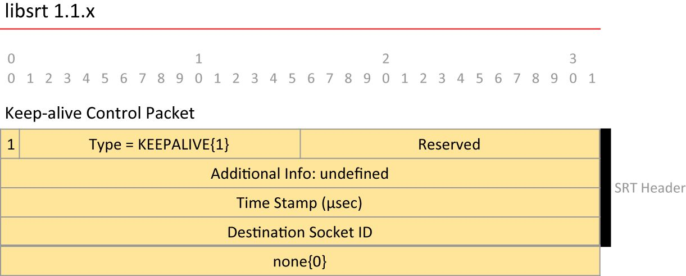</div>

​    

#### d NAK Control Packets

当SRT接收端发现收到的**数据包序列号不连续时，便会判断有数据包丢失**，并立刻向发送方回复否定应答（NAK）数据包。此外，SRT接收端还会以**一定间隔发送周期NAK报告**，其中包括了间隔期的所有丢失包序列号，这种重复发送NAK的机制主要为了防止NAK数据包在反向传输中丢失。

<div align="center"></div>

**注**：出于压缩NAK丢失列表的目的，当检测到连续丢失数据包时，将行起始状态位设置为1，表示该行是连续丢失数据包的起始序列号，写一行是截止序列号，而单个丢失数据包起始状态位设置为0.

​    

#### e SHUTDOWN Control Packets

连接关闭（Shutdown）数据包：

<div align="center"></div>

   

#### f ACKACK Control Packets

ACKACK的主要作用是**用来计算链路的往返时延（RTT）**，而RTT作为重要的链路信息会包含在ACK数据包中，ACKACK数据包结构如下。

<div align="center">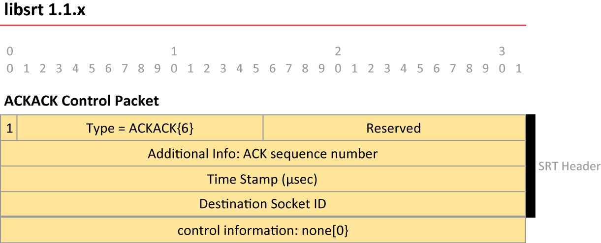</div>

首先ACK数据包和ACKACK数据包都包含有精准的时间戳和ACK序列号，当发送端传输给接收端ACK数据包时，接受端会立刻返回一个ACKACK数据包，之后**发送端会根据 “ACK序列号” 将ACK包和ACKACK包一一对应起来，并通过将它们的时间戳相减从而得到链路的往返时延（RTT）**。

​     

## 3 SRT丢包重传

### 1）发送/接受缓冲（Send/Receive Buffer）

SRT在接收和发送端都有receive buffer与send buffer，send Buffer严格按照时间戳间隔来发送，定时器默认10毫秒。

<div align="center"></div>

其中，发送缓冲区的作用是来保存有可能需要重传的数据包，即那些还没有收到肯定应答(ACK)的数据包，如果发送端收到了关于某个数据包的肯定应答，该数据包将被从发送端缓冲区踢出。如果一直没接收到回复的ACK信号，该数据也不能永远保存在发送端缓冲区中，SRT协议规定了保存的最长时间为延时量。

   

### 2）ACK

丢包重传最常见的便是ACK机制，如下图假设发送端缓冲区发送五个数据包：1、2、3、4、5给接收端缓冲区，接收端缓冲区成功接收到这些数据包之后会向发送端缓冲区发送肯定应答ACK信号，已表示数据包被成功接收，发送端接收到ACK信号之后回收空间，删除1、2、3、4、5这五个数据包并准备发送数据包6。

<div align="center"></div>

send buffer完全按照时间戳间隔处理数据，且在确定的间隔（与ACKs,ACKACKs 和 Round Trip Time相关），接收方周期性将ACK发送给发送方，使得发送方把收到ack的packet从sender buffer中移除，其在buffer中的空间点将被回收。接收端的receive buffer中存在Latency Window（延迟窗口），其作用为按照时间戳一点点上送数据，并严格按照时间戳检测，检测周期默认为10毫秒。

**注**：ACK包含了网络RTT信息、接收端缓存信息、接收端比特率等关键数据，直接反映出发送端到接收端之间的网络环境状态。

​    

### 3）ACKs & ACKACK & RTT

接收端在收到数据包后会向发送端反馈表示成功接收的ACK，例如下图左侧，接收端在收到第十一个数据包后向发送端反馈ACK(11)，而发送端在收到来自接收端的ACK(11)之后会向对端再发送一个ACKACK用以表示收到ACK(11)。

<div align="center"></div>

这一过程最大的意义在于可让接收端计算出RTT，ACK发送的时间与对应ACKACK收到的时间之差**RTT（Round Trip Time）**，其中RTT是时间的度量，**表示报文一个来回的耗时**，且由于**SRT不能测量单方向的耗时，所以只能用RTT/2来表示单方向耗时**。

**注**：一个ACK（从接收方）会触发ACKACK（从发送方）的发送，几乎不带其他延时，因此RTT可用来评估当前网络质量，若RTT高表示整个网络的延迟很大，RTT低则说明网络延迟较低。其次，**RTT由接收端计算而出，计算得出的RTT会通过ACK发送至发送端，发送端就可获知当前网络的质量如何**。此外，由于带宽情况是不断变化的，因此RTT也是一个随网络环境不断变化的实时动态值。

​      

### 4）NAK

若如果数据包4到达接收端的缓冲区，但数据包3未到达，则接收端会向发送端发送 NAK信号，通常这个 NAK 会被添加到**定期发送的压缩列表**（定期 NAK 报告）中，周期性（默认10s）发送给发送端，以避免NAK 报文本身在传输中丢失或延迟到达。

<div align="center"></div>

而如果数据包2到达，但数据包3未到达，则当数据包4 到达时，立即发送 NAK以解决重新排序问题。

<div align="center"></div>

通常情况下，QUIC或TCP仅提供ACK方式，也就是接收端向发送端反馈哪些包成功接收，而WebRTC的RTP或RTCP常用选择NACK，也就是接收端向发送端反馈哪些包没有成功接收，其中NACK回传的是接收端没收到的数据包的列表。

SRT同时支持ACK与NACK，这样设计的原因**更加激进的抢占带宽**，例如接收端向发送端发送ACK表示该数据包已经成功接收，但不排除该ACK报文本身丢失，导致发送端以为数据报文丢失而要超时重发，实际接收端对该数据包已经成功接收了。

还有一种情况是：**NACK的周期性发送可能会造成发送端多发报文**，例如发送端成功发送5号与6号数据包，却一直未收到来自接收端的ACK消息，当**达到重发的时间**时发送端再次发送5号与6号数据包，在此之后发送端收到了来自接收端的NACK消息，表示接收端未成功接收5号数据包与6号数据包，于是发送端第三次发送5号数据包与6号数据包。因此，一个周期下来，发送端发了两次数据包，但从协议原理角度分析，可发现 SRT在丢包过程中对带宽的消耗比QUIC与其他协议要高。因此一旦出现丢包，SRT的重传要多于其他协议，SRT以此来抢占带宽从而达到音视频的同步效果。

​       

### 5）Latency + TSBPD/TLPD

基于时间戳的数据包传送（Timestamp Based Packet Delivery，TSBPD）

<div align="center"></div>

过迟丢弃（Too Late Packet Drop，TLPD），指在发送端超过固定时间会主动丢弃一些数据包

<div align="center"></div>

​      

### 6）自适应码率调整（Packet Pacing）

<div align="center"></div>

SRT中包含三个配置选项：INPUTBW表示编码器输入带宽，MAXBW表示最大带宽，以及OVERHEAD(%)表示过载率，配置原则如下（注：smpinpbw表示实际测试出的编码bitrate）：

* 如果不配置INPUTBW与OVERHEAD(%)，仅配置MAXBW，则当前编码器输出的比特率是<mbw>，也就是MAXBW；
* 如果不配置MAXBW与INPUTBW，仅配置OVERHEAD(%)，则当前编码器输出的比特率是<smpinpbw> * (1080+<oh>)/100，默认为25%；
* 第三种情况是不配置MAXBW，而配置OVERHEAD(%)与INPUTBW，最大输出比特率便为<ibw> * (100+<oh>)/100；

| MAXBW | INPUTBW | OVERHEAD (%) | Output Rate                 |
| ----- | ------- | ------------ | --------------------------- |
| mbw   | n/a     | n/a          | <mbw>                       |
| 0     | 0       | oh           | <smpinpbw> * (100+<oh>)/100 |
| 0     | ibw     | oh           | <ibw> * (100+<oh>)/100      |

**SRT最大的特点便是可配置**，即在有配置的情况下按照配置来做，在无配置的情况下按实际测量的比特率来做。常规情况下不选择进行配置，尤其是针对互联网而言，因为单一配置无法保证能够在不同时段应对不同境况的网络。通常选择使用实际测量出的编码比特率计算，即 <smpinpbw> * (1080+<oh>)/100。

​      

### 7）SRT拥塞控制

已知在丢包重传机制下，如果报文在网络传输中丢失，则发送端会重新发送，例如在某网络环境下发送端与接收端之间的带宽仅有1M，现在由于背景流量与噪声等影响，原来1M的带宽减少100k变成了900k，此时就会出现10%的丢包。

而发送端未收到来自接收端的ACK或者收到NACK认为出现丢包，于是尝试重传这10%的数据，但实际上发送端与接收端之间的带宽就剩下900k了，而加上**丢包重传的发送量是1.1M，带宽变窄发送的流量不降反增，就会导致网络情况越来越糟糕，最后造成网络拥塞卡顿频繁，最后网络崩溃**。

目前，SRT单纯地丢包重传不能解决网络拥塞的问题，出现网络拥塞的最好解决方案是限流，降低带宽流量压力。

````c
// congctrl.cpp 实现
M_iFlowWindowSize = 接收方的缓存大小
m_dCWndSize = 1秒内发送的bytes数据 / (RTT + 10)
sendbufer = 发送方未发送buffer大小

while(true) {
  if(MIN(M_iFlowWindowSize, m_dCWndSize) >= sendbufer)
  {
    // 从未发送buffer中取出数据发送
  } else {
    // 等待下一次检测发送时间
  }
  
}
````

SRT的拥塞控制相关简单，总的来说，就是**通过判断m_iFlowWindowSize大小判断接收方缓存是否耗尽**（只针对接收方缓存是否有能力接收），同时**监测发送方每RTT发送数据size是否大于发送buffer大小**（只针对编码bitrate是否发生过快）。

​    

## 4 SRT Q&A

### 1）SRT如何解决握手耗时长问题？

SRT握手通过2次握手和参数交换即可快速建立起一个SRT链接（总耗时：2RTT），相比基于TCP的流媒体协议RTMP 3RTT的握手时间，总耗时减少1个RTT。

​    

### 2）SRT如何实现可靠传输？

SRT握手结束之后，就可以发媒体数据和控制指令（ACK），即SRT通过数据包序列号和报文序号，能明确那些数据包已经被发送出去，并通过接收端发送过来的ACK控制指令就知道发送出去的哪些数据已经被成功接收了。如果出现丢包等情况，接收端通过NAK控制指令通知发送端重传数据。正是通过以上方式，SRT实现了可靠传输。

​     

### 3）SRT如何实现解决队头阻塞问题？

上文描述了SRT如何实现可靠传输，从实现来看，**发送端必须有一个发送缓存区，接收端也需要一个接收缓冲区才能实现在丢包后数据重传的机制**（这和TCP的实现原理相似），此外SRT协议还可通过**设置固定延时量**来统一规定发送缓冲区和接收缓冲区的大小。

发送缓冲区用来保存有可能需要重发的数据包，一旦数据包收到了肯定应答(ACK)，则该数据包会被清理出发送缓冲区（这点和TCP也类似），一旦发送缓冲区某个数据包一直收不到肯定应答，则该**数据包在超过固定延时时间后也会被清理出发送缓冲区**，SRT通过这种方式解决了TCP队头阻塞的问题。

**注意**：SRT虽然是可靠的传输协议，但是这个可靠是有条件的，只有在固定延时量下，数据的发送时可靠的，一旦超出固定延时时间，数据还是会被丢弃，其实这也符合媒体业务的特点（**在异常情况下，允许丢失一部分数据，但是要能快速恢复**）。

​    

### 4）SRT如何实现实现自适应问题？

ACK中带有许多网络参数，例如RTT时间等，且通过RTT时间和链路带宽等参数，SRT就可以估计整个网络状态，从而实现自适应的调整。但需要说明的是**SRT的发送策略较为激进**，不像TCP协议一样是一个无私的协议，即**SRT在网络较差的情况下依然会保持较大的发送速率**，也正是因为这个特点，在网络状况不好的时候，SRT能够占用更大的网络带宽实现媒体数据的发送，保证流畅度。

但是如果网络中都是类似于SRT这种发送策略激进的协议，到后面会出现谁的数据也发不出去的情况，因此在业务的选择上可以综合考虑SRT和TCP协议的特点，优先保证重要业务占用网络带宽。

   

### 5）SRT优缺点？

除了以上对于SRT的介绍之外，SRT还能实现媒体数据的多路复用，其原理是利用SRT数据包中的目的地端口套接字字段，**多个SRT端口套接字绑定在同一个UDP端口上即可实现SRT的多路复用**。

SRT协议在**有损网络情况**下表现也较其他流媒体协议更有优势，除了上面阐述的机制之外，SRT协议中使用**精准时间戳**保证接收端收到的数据能准确的还原发送端的**码率特性**和**固定帧间隔**。

虽然SRT协议有很多优势，但是有一些缺点也不容忽视：

* 1）SRT协议**带宽占用高**
* 2）SRT协议**传输策略激进，会影响同网络下的其他用户**
* 3）由于SRT底层是走的UDP，而**防火墙对于UDP并不友好，会导致握手失败**

​     

### 6）SRT推流如何有效解决直播丢帧和卡顿问题？

Q：**SRT推流如何解决直播丢帧问题**？

> 1）**低延迟传输**： SRT基于UDP协议，相较于基于TCP协议的传输方式，具有更低的延迟。在直播过程中，低延迟传输有助于减少丢帧现象，提高观众的观看体验。
>
> 2）**强大的纠错能力**：SRT协议具有强大的纠错能力，可以在数据包丢失时自动进行重传。通过这种方式，SRT可以确保视频流的完整性，减少丢帧现象。
>
> 3）**自适应码率调整**：SRT协议支持自适应码率调整，可以根据网络状况实时调整视频流的码率。当网络状况不佳时，SRT会降低视频流的码率，以减少丢帧现象，而当网络状况恢复正常时，SRT会自动提高视频流的码率，保证画质。

​    

Q：**SRT推流如何解决直播卡顿问题**？

> 1）**抗丢包和抗抖动**：SRT协议具有抗丢包和抗抖动的特性，可以在网络状况不佳的情况下保持视频流的稳定传输。这有助于减少直播过程中的卡顿现象。
>
> 2）**网络拥塞控制**：SRT协议支持网络拥塞控制，可以根据网络状况动态调整传输速度。当网络拥塞时，SRT会降低传输速度，以减少卡顿现象。当网络状况恢复正常时，SRT会自动提高传输速度，保证流畅的观看体验。
>
> 3）**安全加密传输**：SRT协议支持AES加密，可以保证视频流在传输过程中的安全性，即加密传输可以防止恶意攻击，降低直播过程中的卡顿风险。

   

总的来说，SRT推流技术通过低延迟传输、强大的纠错能力、自适应码率调整等特点，有效解决了直播过程中的丢帧和卡顿问题。随着SRT协议的不断发展和优化，未来直播行业将迎来更加流畅、高质量的观看体验。

​    

​      

# 附录

## WebRTC

[1] [超低延时直播技术的前世今生](https://juejin.cn/post/7264767608330403894) / [超低延时直播技术演进之路-进化篇](https://developer.volcengine.com/articles/7267373988379099190#heading8)

[2] [腾讯: 超低时延直播webRTC协议白皮书](http://blog.kurokoz.com/wp-content/uploads/2022/05/1651928462-553-white-paper-on-ultra-low-latency-live-streaming.pdf) / [前言--视频直播-火山引擎](https://www.volcengine.com/docs/6469/102065)

[3] [Github: webRTC入门](https://github.com/Eished/notes/blob/master/WebRTC入门.md)

[4] [WebRTC简介 | John520](http://blog.jtlook.tk/2022/04/04/WebRTC简介/)

[5] [一文详解 WebRTC 基础](https://www.wenjiangs.com/doc/swya2erb)

[6] [一文读懂 DTLS 协议](https://blog.51cto.com/u_15087084/2598254)

[7] [WebRTC技术介绍（非常详细）](http://c.biancheng.net/view/6nop6z.html)

[8] [SCTP通信协议简介 - 简书](https://www.jianshu.com/p/08cba3d3eb9f) / [WebRTC：数据传输相关协议简介 - 知乎](https://zhuanlan.zhihu.com/p/564814659)

[9] https://medium.com/dvt-engineering/introduction-to-webrtc-cad0c6900b8e

[10] https://www.diva-portal.org/smash/get/diva2:1480111/FULLTEXT01.pdf

[11] [Video Tech Deep-Dive: Live Low Latency Streaming Part 1 - Bitmovin](https://bitmovin.com/live-low-latency-streaming-p1/)

[12] WebRTC 官网 ：https://webrtc.org/ 

[13] WebRTC API on MDN: [WebRTC - MDN Web Docs Glossary: Definitions of Web-related terms | MDN](https://developer.mozilla.org/en-US/docs/Glossary/WebRTC) 

[14] [（超）低延迟视频流传输的未来 - 知乎](https://zhuanlan.zhihu.com/p/531112722)


## SRT

[1] https://github.com/Haivision/srt

[2] [公网传输技术之SRT协议解析上](https://blog.51cto.com/u_13530535/6465982)  / [公网传输技术之SRT协议解析下](https://blog.51cto.com/u_13530535/6466017)

[3] https://www.haivision.com/blog/all/srt-everything-you-need-to-know-about-the-secure-reliable-transport-protocol/

[4] https://datatracker.ietf.org/meeting/interim-2020-mops-01/materials/slides-interim-2020-mops-01-sessa-srt-protocol-overview-00

[5] [SRT协议在电视直播中的应用](https://cloud.tencent.com/developer/article/1680891?from=15425)

[6] [技术解码 | 直播传输技术之SRT/WebRTC](https://cloud.tencent.com/developer/article/1750364?from=15425)