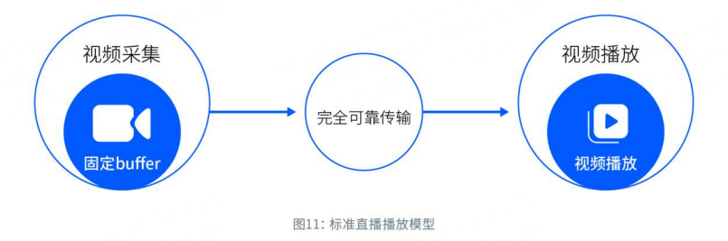

# 流媒体协议 RTMP & SRT & WebRTC

下面主要分别学习当前主流流媒体协议基础知识，如 RTMP & SRT & WebRTC 等，细节可查阅官方协议规范

​    

# 一 RTMP

RTMP（Real Time Messaging Protocol，实时消息传输协议）是Adobe公司提出得一种媒体流传输协议，其提供了一个**双向得通道消息服务**，意图**在通信端之间传递带有时间信息的视频、音频和数据消息流**，后通过**对不同类型的消息分配不同优先级**，进而在网传能力限制下确定各种消息得传输次序。

RTMP最早是Adobe公司基于flash player播放器提出得一种音视频封装传输格式，在前期flash盛行时，得到了极其广泛得应用，当前flash基本被废弃，但是RTMP这种协议作为流媒体封装传输得方式，并没有预想中被冷落得情况，相反在当下直播盛行得阶段，RTMP被经常用来向云端推流得流媒体协议。

RTMP是**TCP/IP协议模型中的应用层协议**，其工作在TCP之上，默认端口为1935，RTMP协议是**基于TCP协议进行传输**，因此其需要TCP特性来保证消息传输的可靠性，TCP通过三次握手成功建立连接后，RTMP协议还需要客户端和服务端通过RTMP握手协议来建立RTMP Connection，RTMP握手协议主要目的是协商RTMP版本及时间对齐作用。RTMP Connection上会传输RTMP控制信息，比如 SetChunkSize、SetACKWindowSize、CreateStream等，其中 CreateStream命令会创建一个Stream链接，用于传输具体的音视频数据和控制这些信息传输的命令信息。

RTMP协议以RTMP Message格式传输，同时为了更好地实现多路复用、分包和信息的公平性，发送端把Message划分为带有MessageID的Chunk，每个Chunk可能是一个单独的Message，也可能是Message的一部分，在接受端会根据chunk中包含的data的长度，messageid和message的长度把chunk还原成完整的Message，从而实现信息的收发。

​    

## 1、RTMP握手（Handshake）

RTMP在建立好**传输层TCP连接后（TCP握手），通过RTMP握手协议来完成RTMP的连接**，RTMP握手协议由**三个固定长度的块**组成，有简单握手和复杂握手两种方式，两种握手方式信息流转的过程是相同的，只是消息中携带的信息不同。

> **注**：握手实质上起到的是验证的作用，其中一项是会校验服务器，客户端的rtmp版本，如果版本兼容则可以收发数据，如果版本不兼容则说明不能收发数据，则握手会失败。

握手过程，客户端和服务端各发送相同的三个块，客户端按序发送C0、C1、C2 3个chunk，服务端按序发送S0、S1、S2 3个chunk，然后才能进行有效信息的传输，此外RTMP规范中没有详细规定这6个chunk具体传输顺序，只需要满足如下条件即可（简单和复杂握手均符合要求）：

* 握手以客户端发送 C0 和 C1 块开始
* 客户端必须等待接收到 S1 才能发送 C2
* 客户端必须等待接收到 S2 才能发送任何其他数据（控制信息和真实音视频等数据）
* 服务器必须等待接收到 C0 才能发送S0和S1，也可能是接收到 C1 后发送
* 服务器必须等待接收到 C1 才能发送S2
* 服务器必须等待接收到 C2 才能发送其他数据（控制信息和真实音视频等数据）

其握手示意图如下图所示：

由上图可知

* 1）客户端发送C0、C1之前，客户端和服务器都处于未初始化状态；
* 2）在初始化状态之后客户端和服务端都进入版本已发送状态，即客户端等待接收 S1 包，服务端等待接收 C1 包，收到所等待的包后，客户端发送 C2 包，服务端发送 S2 包；
* 3）之后状态进入发送确认状态；客户端和服务端等待接收S2和C2包，收到后进入握手完成状态，客户端和服务端开始交换消息；

从规范上看只要满足以上条件，如何发送6个块的顺序都是可以的，但实际实现中为了在保证握手的身份验证功能的基础上尽量减少通信的次数，一般的发送顺序如下：

* 客户端向服务端同时发送C0+C1
* 服务端确认版本号后，向客户端同时发送S0+S1+S2
* 客户端接收到S2后发送C2到服务端

**注**：简单握手中S2是C1的复制，C2是S1的复制

​    

### 1）简单握手

| 信息   | 说明                                                         |
| ------ | ------------------------------------------------------------ |
| C0和S0 | C0 和 S0 包都是一个单一的8位字节，表示**版本号version**  C0包中表示客户端请求的RTMP版本，S0中表示服务器选择的RTMP版本，且规范最新定义版本号为3，**如果服务器和客户端版本号不一致，则可能会终止交互或者降级**。其次，若无法识别客户端所请求版本号的服务器应该以版本 3 响应， (收到响应的) 客户端可以选择降低到版本 3，或者放弃握手 |
| C1和S1 | C1/S1长度为1536字节   1）**时间戳**（Time 4bytes）：用于C/S发送所有后续块的时间起点，可以从0开始，或者其他值，主要用于多路流传输的时间同步。 2）**零值**（Zero 4bytes）：规范中说必须为0，实际传输协议中并未对此进行校验，没啥意义，如果不是0，代表要使用复杂握手，仍可正常传输。 3）**随机数据**（Random data 1528bytes)：为随机数序列，用户区分出其响应C2/S2来自此RTMP连接发起的握手，还是其他方发起的握手，此外这个不需要对随机数进行加密保护，也不需要动态值。 |
| C2和S2 | C2 和 S2 数据包长度都是 1536 个节，基本就是 S1 和 C1 的副本，其中S2是C1的复制，C2是S1的复制。   1）**时间戳**（Time 4bytes）：必须是对方C1/S1发来的时间戳（对C2来说是S1的时间戳，对S2来说是C1的时间戳） 2）**时间戳2**（Time2 4bytes）：必须是前面自己发送的C/S包里的时间戳 3）**随机数据回显**（Random echo 1528bytes）：必须是对方发来的C1/S1包里携带的随机数据（对C2来说是S1，对S2来说是C1) |

**注**：在构建RTMP代码时一般**只针对版本号进行校验，时间戳对其机随机数对其等校验不严格**，因为当前很多RTMP流媒体协议并没那么规范，如果严格校验，兼容性会差。

​      

### 2）复杂握手

相对于简单握手，**复杂握手主要是增加了更严格的验证**，即主要是将简单握手中1528 Bytes随机数的部分平均分成两部分， 一部分764Bytes存储public key（公共密钥，32字节），另一部分 764Bytes存储digest（密文，32字节）。

另外， 复杂握手还有一个明显的特征就是：**C1、S1的version部分不为0， 服务端可根据这个来判断是否简单握手或复杂握手**。

| 信息   | 说明                                                         |
| ------ | ------------------------------------------------------------ |
| C0和S0 | C0 和 S0 包都是一个单一的8位字节，以一个单独的8位整型域进行处理 -- **version**： 说明是明文还是密文，如果使用的是明文（0X03），同时代表当前使用的rtmp协议的版本号，如果是密文，该位为0x06 |
| C1和S1 | 区别于简单握手数据部分： 1）key： -- random-data：长度由这个字段的最后4个byte决定，即761 - 764 -- key-data：128个字节。Key字段对应C1和S1有不同的算法。发送端（C1）中的Key应该是随机的，接收端（S1）的key需要按照发送端的key去计算然后返回给发送端。 -- random-data：（764 - offset - 128 - 4）个字节 -- key_offset：4字节, 最后4字节定义了key的offset（相对于KeyBlock开头而言，相当于第一个random_data的长度）  2）digest  -- offset：4字节, 开头4字节定义了digest的offset -- random-data：长度由这个字段起始的4个byte决定 -- digest-data：32个字节 -- random-data：（764 - 4 - offset - 32）个字节 |
| C2和S2 | C2、S2就是把digest放到最后那32字节上，主要是用来对C1、S1的验证 |

​    

## 2、RTMP数据格式

### 1）Message

消息（Message）是**RTMP协议中基本的数据单元**，由Message Header和Message Payload（即message body）组成。**对于音视频数据而言，每一个message就是一帧数据**，且对于flv的tag而言，就是对应rtmp每个message，一个tag就是一个message，是一一对应的关系，相当于每一个tag都封装成一个message。message payload的数据格式和tag data的数据格式是相同的，message header和tag header的格式不同。

Message Format如下：

|                 | Field                        | Comment                                                      |
| --------------- | ---------------------------- | ------------------------------------------------------------ |
| Message Header  | Length（3 bytes）            | Message Payload（消息负载）的长度，不包含Message Header      |
|                 | Timestamp（4 bytes）         | 时间戳（既是pts也是dts，因为直播场景中没有B帧，所以pts=dts） |
|                 | Message Type Id（1 bytes）   | 消息类型，主要包括协议控制消息、音视频消息、命令消息等       |
|                 | Message Stream Id（3 bytes） | 消息流ID可以是任意值，即不同的message可以有相同的值，且复用到同一块流上的不同消息流基于它们的消息流ID解复用。 |
| Message Payload | --（n bytes）                | 消息中包含的实际数据，消息类型不同payload大小也不同，例如它可以是一些音频样本或压缩视频数据或Metadata等 |

**注**：多路复用，即**RTMP可以将来自不同视频流的切片（chunk）在单个连接上传输**，这种方法被称为“多路复用”，不同的流就用不同的Message Stream Id区分。

   

### 2）Chunk

RTMP 传输的数据称为Message，其中**包含音视频数据和信令**，但实际传输时不是以Message为单位的，而是**把Message拆分成Chunk发送**（chunk是RTMP最小的传输单元），主要目的是**防止一个大的数据包传输时间过长，阻塞其它数据包的传输**。

而且Chunk在传输时，**同一个Message产生的多个Chunk只会串行发送**，即必须在一个Chunk发送完成之后才能开始发送下一个Chunk，其中每个Chunk中带有msg stream id代表属于哪个Message，接受端也会按照这个id来将chunk组装成Message，此外**不同Message产生的Chunk可以并行发送，且并行发送的Chunk复用了一条TCP链接**。

每个Chunk的默认大小是 128 字节，可以通过Set Chunk Size的控制信息设置Chunk数据量的最大值，在发送端和接受端会各自维护一个Chunk Size，可以分别设置这个值来改变自己这一方发送的Chunk的最大值，其配置大小多少合适，需要根据性能要求来调试合适的大小。

Chunk格式包含基本头、消息头、扩展时间戳和负载，如下图所示：

|              | Field                                 | Comment                                                      |
| ------------ | ------------------------------------- | ------------------------------------------------------------ |
| Chunk Header | Basic Header（1~3 bytes）             | 包含fmt（chunk type）和chunk stream id（csid），其中fmt决定了chunk的类型及message header的长度，占2 bit，而Basic header的长度取决于csid的数值大小，最少占1 byte。 |
|              | Message Header（0，3，7 or 11 bytes） | 要发送的实际信息（可能是完整的，也可能是一部分）的描述信息，其长度取决于Basic Header中的chunk type，有Type 0，1，2，3类型的header |
|              | Extended Timestamp（0 or 4 bytes）    | 扩展时间戳（0 bytes时表示此字段不存在）                      |
| Chunk Data   | --（n bytes）                         | 是消息中包含的实际数据，消息类型不同data大小也不同           |

**注**：多种chunk type的目的是减少重复数据发送，提高chunk data的占比

​    

#### a Basic Header（基本头信息）

| Field                    | Comment                                                      |
| ------------------------ | ------------------------------------------------------------ |
| fmt（2bits）             | 表示**chunk的类型**，取值[0, 3]，即chunk共有4种类型          |
| csid（6，14 or 22 bits） | **流通道Id**（chunk stream id），用来**唯一标识一个特定的流通道**，同一个Chunk Stream ID必然属于同一个信道，**chunk type决定了后面Message Header的格式**。 上文提到Basic Header大小为1-3 bytes，其中fmt域占2bits，CSID的长度时可变的（6 bits、14 bits或22 bits），其决定了基本头的长度，在足够表征流通道的前提下，最好用尽量少的字节来表示CSID，从而减少由于引入Header增加的数据量。 RTMP最多可支持65597个流，CSID范围在3-65599 内，其中0~2为协议保留用作特殊信息，通常控制流csid为2，命令流为3，开发中发现音视频流csid可自定义，如音频流4，视频流6。 |

示例：

1）Basic Header为1bytes时：csid为6bits，取值在[3~63]

2）Basic Header为2bytes时：第一个字节除了fmt外，其余6位表示数字0，csid范围是[64~319]，即最大为(2^8 - 1) + 64 = 319

3）Basic Header为3bytes时：第一个字节除了fmt外，其余6位表示数字1，csid范围是[64~65599]，最大值为 (2^16 - 1) + 64 = 65599

​    

#### b Message Header（消息头消息）

包含了要**发送的实际信息的描述信息**（可能是完整的，也可能是一部分）

Message Header的格式和长度取决于Basic Header的chunk type（fmt）取值[0~3]，所以共有4种不同的chunk格式，目的是减少重复数据发送，提高 chunk data的占比，同时也有4种不同的Message Header。

| 类型  | 说明                                                         |
| ----- | ------------------------------------------------------------ |
| fmt=0 |  Message Header共11字节，此**类型必须在块流开始时使用**，当流时间戳向后（例如，回退播放）时也要使用此格式。   1）**timestamp**（3bytes）：最多能表示到16777215=0xFFFFF，如果时间戳大于或等于16777215（0xFFFFFF），该字段值必须为16777215，并且必须设置扩展时间戳Extended Timestamp来一起表示32位的时间戳，否则该字段就是完整的时间戳。接受端在判断timestamp值为0xFFFFFF时就会去Extended timestamp中解析实际的时间戳。 2）**message length**（消息数据的长度）：占用3个字节，表示**实际发送的消息的数据**，如音频帧、视频帧等数据的长度，**注意这里是Message的长度，也就是chunk属于的Message的总数据长度，而不是chunk本身Data的数据的长度**。 3）**message type id**（消息的类型id）：占用1个字节，表示**实际发送的数据的类型**，如8代表音频数据、9代表视频数据。msg stream id（msid)：占用4个字节，表示该chunk所在的流的ID，它采用小端存储的方式。 |
| fmt=1 |  Message Header共7字节，和前一个chunk共用message stream id（msid），因此省去了message stream id的4字节，**表示此Chunk和上一次发的Chunk所在的流相同**（不是相同的message），如果在发送端和对端有一个流连接的时候尽量采用这种格式。   1) **timestamp delta**：占用3个字节，这里和type＝0时不同，**表示上一个chunk的时间差**，当它的值超过3个字节所能表示的最大值时，设置为0xFFFFFF，实际的时间戳差值就会转存到Extended Timestamp字段中，接受端在判断timestamp delta字段24个位都为1时就会去Extended timestamp中解析时机的与上次时间戳的差值。 2) 其它字段同fmt=0 |
| fmt=2 |  Message Header共3字节，相对于 fmt=1 格式又省去了message length的3个字节和message type id的1个字节，表示**此 chunk和上一次发送的 chunk 的message length、message type id都相同**，余下的这三个字节表示 timestamp delta，使用同type=1。  |
| fmt=3 |  表示**这个chunk的Message Header和上一个是完全相同的，不存在消息头** 1) 当它跟在Type＝0的chunk后面时，表示和前一个chunk的时间戳都是相同的，就是一个Message拆分成了多个chunk，这个chunk和上一个chunk同属于一个Message； 2) 当它跟在Type＝1或者Type＝2的chunk后面时，表示和前一个chunk的时间戳的差是相同的，比如第一个chunk的Type＝0，timestamp＝3600，第二个chunk的Type＝2，timestamp delta＝3600，表示时间戳为3600+3600，第三个chunk的Type＝3，表示timestamp delta＝3600，时间戳为3600+3600+3600 |

   

#### c Extended Timestamp（扩展时间戳）

扩展时间戳用来辅助编码超过16777215（0xFFFFFF）的时间戳或时间戳增量

当类型0，1或2的块，无法用24位字段来表示时间戳或时间戳增量时就可以启用扩展时间戳，同时类型0块的时间戳字段或类型1，2的时间戳增量字段值应该设为16777215（0xFFFFFF）。当类型3块最近的属于相同块流ID的类型0块、类型1块或类型2块有此字段时，该类型3块也应该有此字段。

​    

#### d Chunk Data（块数据）

用户层面上真正想要发送的与协议无关的数据，长度在[0,chunkSize]之间

​     

## 3、RTMP消息类型（RTMP Message Type）

rtmp协议中有多种消息，用于**数据传输**和**命令控制**等操作，**所有的消息都是封装成message，然后通过chunk来传输**。

| 类型                                       | 说明                                                         |
| ------------------------------------------ | ------------------------------------------------------------ |
| 协议控制消息（Protocol Control Messages）  | 在RTMP的chunk流会用一些特殊的值来代表协议的控制消息，属于RTMP chunk流协议层的消息，它们的Message Stream ID必须为0（代表控制流信息），CSID必须为2，Message Type ID可以为1，2，3，5，6，具体代表的消息会在下面依次说明。控制消息的接受端会忽略掉chunk中的时间戳，收到后立即生效。 |
| 命令消息（Command Message）                | 命令消息（Command Messages）是**用于 C-S 进行直接交互应答的一类消息**，一般情况下，**命令消息的发送对端是需要对端进行应答信号反馈的，且需要AMF编码**，AMF0编码时Message Type ID = 20，使用AMF3编码时Message Type ID = 17，CSID通常为3。 **命令类型的消息包含命令名称、事务ID和相关参数**，如client端发送connect命令时需要包含要连接的应用名称作为参数，然后server端回复消息时带上收到的transaction ID表示对此条消息的回应，此外回复命令有_result，_error，或者其他如verifyClient，contactExternalServer的方法名。  发送命令消息的对象有两种分别是NetConnection和NetStream： 1）NetConnection：表示双端的上层连接，服务器和客户端之间进行网络连接的一种高级表示形式。 2）NetStream：表示流信息的传输通道如音频流、视频流，以及控制流信息的状态，如Play播放流，Pause暂停。 |
| 数据消息（Data Message）                   | 传递一些元数据（MetaData，比如视频名，分辨率等等）或者用户自定义的一些消息，且当信息使用AMF0编码时，Message Type ID＝18，AMF3编码时Message Type ID＝15。 |
| 共享消息（Shared Object Message）          | 共享对象是在多个客户端、实例等之间同步的Flash对象，Flash对象是由键值对组成的集合，且每条消息可以包含多个事件，此外当信息使用AMF0编码时，Message Type ID＝19，AMF3编码时Message Type ID＝16。 |
| 音/视频信息（Audio/Video Message）         | 每一个message就是一帧数据。对于flv的tag而言，就是对应rtmp每个message，一个tag就是一个message，是一一对应的关系；相当于每一个tag都封装成一个message。 RTMP 块流使用Message Type ID=8 作为音频数据，flv的tag header->tag type也用8来表示音频，而通常音频流的csid是4（也可以自定义），音频流的每一个chunk的csid都是相同的。 |
| 聚合消息（Aggregate Message）              | 聚合消息是包含一系列RTMP子消息的单个消息，Message Type ID＝22。 聚合消息的消息流ID覆盖聚合内部的子消息的消息流程ID，此外聚合消息和第一个子消息的时间戳之间的差异，是用于将子消息的时间戳记重新规范化为流时间尺度的偏移量。 |
| 用户控制消息（User Control Message Event） | RTMP 流中的用户控制消息在接收时立即生效，消息中的时间戳被忽略，此外该信息在 chunk 流中发送时，它们的Message Stream ID必须为0（代表控制流信息），CSID必须为2，Message Type ID必须为4。与前面提到的协议控制信息（Protocol Control Message）不同，这是**在RTMP协议层的，而不是在RTMP chunk流协议层的**，这个很容易弄混。 |

​    

## 4 数据传输

### 1）发送/接收过程

Chunk在传输：**同一个Message产生的多个Chunk只会串行发送**，先发送的Chunk一定先到达，且不同Message产生的Chunk可以并行发送，不同的Message可以是不同的流，并行发送的Chunk复用了一条TCP链接，这就是所说的多路复用（Multiplexing）。

​    

#### a 发送端

Step1：数据封装成消息（Message），包括协议控制消息、用户控制消息、音视频数据消息等。

Step2：把消息分割成消息块（Chunk，网络中实际传输的内容）

Step3：将分割后的消息块（Chunk）通过TCP协议发送出去

​     

#### b 接收端

在通过TCP协议收到数据后，现将消息块重新组合成消息(Message)，而后通过对消息进行解封装处理就可以恢复出数据。

​     

#### c RTMP消息优先级

在RTMP中，消息(Message)主要分为两大类：**控制消息（协议控制消息、用户控制消息）**和**数据消息（音视频消息）**，但是通路只有一条(RTMP是单通路)，到底谁先走呢，谁后走呢？在实际传输过程中是对消息分优先级，**优先级高的先行，且优先级低的不能阻塞优先级高的，即协议先行，数据次之**

* 协议控制消息（Protocol Control Messages）和用户控制消息（User Control Messages）：应该包含消息它们的Message Stream ID必须为0（代表控制流信息），CSID必须为2
* 数据消息（音频信息、音频消息）比控制信息的优先级低， 另外，一般情况下音频消息比视频数据优先级高

​     

### 2）Chunk传输过程

RTMP官方文档示例

#### a Audio Example

一个audio的消息流：Message Type ID = 8 表示音频，每个message有相同的message stream ID，message type ID，message length，以及增量相同的timestamp。

**audio message比较小，基本不会对message进行拆分，一个message对应一个chunk**，实际发送的情况为：

1) 第1个Message的chunk的chunk type为0，因为前面没有可参考的chunk，此时chunk的长度为Basic Header（1 byte）+ Message Header（11 bytes）+ Payload（32 bytes）= 44 bytes。

2) 第2个Message的chunk可与前一个共用length、type id和msid，但是不可省略timestamp delta字段，所以chunk type为2，同理可得chunk长度为36 bytes。

3) 第3个Message的chunk可以共用前一个的timestamp delta字段，所以chunk type为3，chunk长度为33 bytes。

4) 第4个Message的chunk可以共用前一个的timestamp delta字段，所以chunk type为3，chunk长度为33 bytes

​     

#### b Video Example

一个video的消息流：Message Type ID = 9 表示视频

Payload length为307 > 128字节（chunk data默认是128字节），所以需要将Message拆分成多个chunks，首个chunk使用Type 0，之后的chunk由于是同一个Message拆分而来，以上字段都可共享，所以直接使用Type 3，但需要注意的是，**第一个chunk的length需要传入整个message的负载长度即307**。

​     

### 3）推拉流过程

RTMP流媒体需要支持视频源端（视频发布端）通过rtmp推送采集的视频流，同时也要支持播放客户端通过RTMP地址拉流播放。

#### a 推流

RTMP推流流程：

1）客户端发送握手请求，和服务器完成握手（handshaking done）

2）客户端发送命令消息中的 “连接connect” 到服务器，请求与一个服务应用实例建立连接（Command Message：connect）

3）服务器接收到连接命令消息后，发送确认窗口大小到客户端，同时连接到连接命令中提到的应用程序（Window Acknowledgement Size）

4）服务器发送设置带宽协议消息到客户端（Set Peer Bandwidth）

5）客户端处理设置带宽协议控制消息后，发送确认窗口大小到服务器端（Window Acknowledgement Size）

6）服务器发送用户控制消息中的 “流开始StreamBegin” 消息到客户端，通知客户端流成功创建，可用于通信（User Control：StreamBegin）

7）服务端发送connect的“应答消息_result“，通知客户端连接的状态（Command Message：_result）

8）客户端发送网络连接命令的 “创建流createStream” 消息到服务端，以创建消息通信的逻辑通道，即音频、视频和元数据的发布通过使用createStream命令创建的流通道执行，而后服务端发送createStream的“应答消息”(_result)。

9）客户端发送网络流命令的 “发布publish” 到服务端，将命名流发布到服务器，其它客户端可以使用此流名来播放流，接收发布的音频，视频，以及其他数据消息。

10）客户端发送命令消息或音视频数据至服务端。

**注**：其上为官方规范文档中描述的流程，实际过程可能稍有不同，**发送端和接收端主要对创建流、发布、和数据传输的消息比较关注**，解析时一般按照规范顺序和格式解析，其他消息发送顺序并无特殊规定，消息较小时，可一次发送多个RTMP消息。

​      

#### b 拉流

拉流过程简述：

1) 首先和推流一样，由客户端发起握手协议，发送创建流命令

2) 服务器端接收创建流命令后，发送响应命令

3) 客户端发送命令消息（play）

4) 服务器端接收到播放命令play后，配置chunk大小，发送用户控制协议（StreamIsRecorded、StreamBegin）通知是否录制流，流已开启标志，之后发送播放命令响应消息（刷新当前状态、通知播放开始），这里如果play命令成功，服务端回复onStatus 命令消息 NetStream.Play.Start和NetStream.Play.Reset，其中NetStream.Play.Reset只有当客户端发送的play命令里设置了reset时才会发送，如果要播放的流没有找到，服务端会发送onStatus消息NetStream.Play.StreamNotFound。

5) 服务器端发送音视频消息到客户端，客户端开始播放

​     

## **5 使用场景&优缺点**

| 类型 | 说明                                                         |
| ---- | ------------------------------------------------------------ |
| 场景 | 用于流式传输到 Flash 播放器，广泛应用于直播                  |
| 优点 | 低延迟：RTMP使用独占的 1935 端口，无需缓冲，可以实现低延迟 适应性强：所有 RTMP 服务器都可以录制直播媒体流，同时还允许观众跳过部分广播并在直播开始后加入直播流 灵活性：RTMP 支持整合文本、视频和音频，支持 MP3 和 AAC 音频流，也支持MP4、FLV 和 F4V 视频 |
| 缺点 | HTML5 不支持：标准HTML5 播放器不支持 RTMP 流 容易受到带宽问题的影响：RTMP 流经常会出现低带宽问题，造成视频中断 HTTP 不兼容：无法通过 HTTP 流式传输 RTMP，必须需要实现一个特殊的服务器，并使用第三方内容交付网络或使用流媒体视频平台。 |

​    

## 6 其它QA

**Q：rtmp为什么会低延时？**

A：一个message就是帧，相当于一帧数据产生后立刻发送过来，所以延时较低。相比于HLS，一个切片生成后才会发送，延时就会很大。

​    

**Q：rtmp和flv的关系？**

1）rtmp是数据传输协议，flv是音视频的封装格式

2）rtmp和flv在音视频数据的封装上是相同的，即message payload的数据形式和flv tag data的数据形式是相同的，也就是说flv tag和rtmp message，除了header部分，body部分格式是完全一样的。

音频

视频

​       

# 二 WebRTC

**WebRTC（Web Real-Time Communication）**是谷歌一个免费的开源项目，集成了**音视频采集，编解码，数据传输，音视频渲染**等一些列功能，即通过 API 为 Web 浏览器和移动应用提供**实时通信（ RTC ）**，允许音频和视频通过直连的点对点（peer-to-peer）传输通信，不需要额外安装插件或本地应用，且2021 年 1 月 26 日由 W3C 和 IETF 共同发布了 WebRTC 1.0 标准。

​     

## 1 简介

WebRTC 项目目的是 “**为浏览器、移动平台和物联网设备开发丰富、高质量的 RTC 应用程序，并允许它们通过一组通用的协议通信**”，其次在 Web 上可以通过浏览器内置的 WebRTC API 直接使用，并且现代主流浏览器基本都支持。

对于原生客户端（例如 Android 和 iOS 应用），可以使用具备相同功能的库，当前WebRTC 项目属于[开源项目](https://webrtc.googlesource.com/src/)，受 Apple、Google、Microsoft 和 Mozilla 等公司支持。

WebRTC 应用场景：音视频会议、音视频聊天、远程访问、P2P CDN、…

WebRTC 优势&劣势：

| 特点 | 详情                                                         |
| ---- | ------------------------------------------------------------ |
| 优势 | 之所以市场上涌现这么多 WebRTC 或基于 WebRTC 的应用，主要是因为 WebRTC 有着以下这些优势：                 -- 全平台支持 -- 端到端安全加密 -- 强大的打洞支持 -- 标准化 -- 免费、开源 ... |
| 劣势 | 同时也有着不可避免的弊端： -- 缺乏服务器方案设计和部署 -- 对 Native 适配支持不够，编译难度较大 -- 传输质量难以保障… |

​    

## 2 技术架构

WebRTC 内部简化架构：

1）**Web API** 和 **libwebrtc**

* **Web API**：一组 JavaScript 接口，由 W3C 维护，开发人员可以使用这些 API 在浏览器中创建实时通信应用程序。

* **libwebrtc**：适用于移动端及桌面开发，即使用 WebRTC C++ 源码在 Windows、Android、iOS 等平台编译后的开发包，开发人员可以使用这个开发包打造原生的 WebRTC 应用程序。

2）**WebRTC C ++ API**：是 Web API 和 libwebrtc 的底层实现，该层包含了连接管理、连接设置、会话状态和数据传输的 API，而正是基于这些 API，浏览器厂商可以方便地加入对 WebRTC 的支持。

3）**会话管理和信令**：WebRTC 规范里没有包含信令协议，这部分需要研发人员依据业务特点自行实现

4）**音视频引擎**

* 音频引擎： 支持的音频编码格式有 OPUS 和 G.711，负责音频采集和传输，具有降噪、回声消除等功能

* 视频引擎：支持的视频编码格式主要有 VP8 和 H264（还有部分浏览器支持 VP9 及 H265 格式），负责视频的采集和传输，具有图像增强、音视频同步、 Jitter Buffer网络抖动优化等功能

5）**媒体传输层**：WebRTC 在 UDP 之上增加了 3 个协议：

* 数据包传输层安全性协议（DTLS）：用于加密媒体数据和应用程序数据；

* 安全实时传输协议（SRTP）：用于传输音频和视频流；

* 流控制传输协议（SCTP）：用于传输应用程序数据；

6）**网络层（网络I/O）**：WebRTC 借助 ICE 技术在端与端之间建立 P2P 连接，它提供了一系列 API，用于管理连接

7）**音频和视频采集模块**：WebRTC 提供了摄像头、话筒、桌面等媒体采集 API，使用这些 API 可以定制媒体流。

WebRTC 在线 Demo 地址: https://codepen.io/tuzkiss/pen/rNvwzZO 

   

## 3 协议栈

协议栈结构：

| **协议层**     | **http**                                                     | **webRTC**                                                   |
| -------------- | ------------------------------------------------------------ | ------------------------------------------------------------ |
| **API层**      | XHR、SSE、WebSocket                                          | RTCPeerConnection 和 DataChannel                             |
| **应用层**     | 提供了http1.x/2.0https协议                                   | PeerConnection：使用了SRTP协议 DataChannel：使用了SCTP协议（流控传输协议） |
| **会话层**     | 使用了TLS协议（可选），对于https需要这个协议，对于http并不需要 | 使用了DTLS协议（仿照TLS），对于SRTP可选，对于SCTP为必须      |
| **链路检测层** | --                                                           | ICE/STUN/TURN检测端到端之间的通路，进行连通性检测            |
| **传输层**     | 底层使用TCP传输，流传输                                      | 底层使用UDP传输，报文传输                                    |
| **网络层**     | IP协议                                                       | IP协议                                                       |

其中，WebRTC 核心协议栈主要通过**右侧 UDP 基础上构建**而出，其中右侧基于 UDP 的相关协议中各相关模块特点

| 模块              | 详情                                                         |
| ----------------- | ------------------------------------------------------------ |
| ICE、STUN、TRUN   | 主要用于端与端之间建联，包括直接 P2P ( peer-to-peer) 链接或通过服务端转发，详见： [Introduction to WebRTC protocols - Web APIs \| MDN](https://developer.mozilla.org/en-US/docs/Web/API/WebRTC_API/Protocols)  **ICE** ( Interactive Connectivity Establishment )： 交互式连接建立 **STUN**（ Session Traversal Utilities for NAT ）：NAT 会话传输应用程序，一种网络协议，它**允许位于 NAT（或多重 NAT）后的客户端找出自己的公网地址，查出自己位于哪种类型的 NAT 之后，以及NAT为某一个本地端口所绑定的 Internet 端端口**，这些信息被用来在两个同时处于 NAT 路由器之后的主机之间建立 UDP 通信 **TURN**（Traversal Using Relays around NAT）：基于转发的 NAT 穿透 |
| DTLS              | **DTLS** ( Datagram Transport Layer Security) ：数据报传输层安全协议，用于对传输内容进行加密，即基于 UDP 的 TLS，**用于加密媒体数据和应用程序数据** |
| SRTP              | **SRTP** （ Secure Real-time Transport Protocol ）：安全实时传输协议，是对媒体数据的封装与传输控制协议，**对 RTP 数据进行加密**，消息认证和完整性以及重播攻击保护，**用于传输音频和视频流** |
| SCTP              | **SCTP** （ Stream Control Transmission Protocol ）：流控制传输协议，提供类似 TCP 的特性，SCTP 可以基于 UDP 上构建，在 WebRTC 里是在 DTLS 协议之上，**用于传输应用程序数据**。 **RTP（实时传输协议）和 SCTP（流控制传输协议）**，即通过使用 RTP 来交换用 SRTP 加密过的媒体数据，使用 SCTP 发送和接收那些用 DTLS 加密过的 DataChannel 消息。 |
| RTCPeerConnection | 主要**用于建立和维护端到端连接，并提供高效的音视频流传输**   |
| RTCDataChannel    | 主要用于**端与端之间任意数据传输**                           |

​    

### 1）STUN & TURN & ICE

| 名词 | 说明                                                         |
| ---- | ------------------------------------------------------------ |
| NAT  | **NAT** （Network Address Translation，网络地址转换）是一种**解决专用网络内设备连接公网的技术**，作为一种解决IPv4地址（长度限制32位）短缺以避免保留IP地址困难的方案（大多数终端都没有一个可以在互联网上可见的唯一IPV4地址），在IP数据包通过路由器或防火墙时重写来源IP地址或目的IP地址。 |
| STUN | **STUN**（Session Traversal Utilities for NAT，**NAT会话穿越应用程序**）是一种网络协议，它允许位于NAT（或多重NAT）后的客户端找出自己的公网地址（IP和端口），查出自己位于哪种类型的NAT之后以及NAT为某一个本地端口所绑定的Internet端端口，俗称 "打洞" / "NAT 打洞" / "NAT 穿越"。 这些信息被用来在两个同时处于NAT路由器之后的主机之间**创建UDP通信**。 |
| TURN | **TURN**（Traversal Using Relays around NAT，**中继型NAT遍历服务**），是一种数据传输协议（data-transfer protocol），**用于转发数据包给对端浏览器**，其目的就是解决STUN服务无法穿越对称 NAT 的问题，不同于其它中继协议在于它**允许客户机使用一个中继地址与多个对端同时进行通讯**，其完美弥补了 STUN 无法穿越对称型 NAT 的问题。 此外，与STUN服务器不同的是，允许TCP或UDP的链接在线跨越NAT或防火墙，且TURN 服务器会作为中转，转发多媒体数据会消耗大量的带宽。 |

通信架构：

**ICE**（Interactive Connectivity Establishment）表示交互式连接建立，即**客户端与服务端之间发现 P2P（Peer to Peer）传输路径的机制**，是一组**基于 offer/answer 模式解决 NAT 穿越问题的协议族**（框架），综合利用现有的 STUN、TURN 等协定，以更有效的形式来建设会话。

由于该技术是建立在多种NAT穿透协议的基础之上，并且提供了一个统一的框架，所以ICE具备了所有这些技术的优点，同时还避免了任何单个协议可能存在的缺陷。因此，ICE可以实现在未知网络拓扑结构中实现的设备互连，而且不需要进行对手配置，另外由于该技术不需要为VoIP流量手动打开防火墙，所以也不会产生潜在的安全隐患。

通常，**ICE 两端并不知道所处的网络的位置和 NAT 类型，通过 ICE 能够动态的发现最优的传输路径**。如下图 L 和 R 是 ICE 代理，下面简称 L 和 R，其中L 和 R 有各自的传输地址，包括**主机的网卡地址、NAT 上的外网地址、 TURN 服务地址**。ICE 就是要从这些地址中，找到 **L 和 R 的候选地址对**，实现两端高效连通。此外，ICE 两端可以通过信令服务器交换 SDP 信息，且使用 STUN 和 TURN 等协议来建立会话。

ICE 模式分为 Full ICE 和 Lite ICE 两种类型。

* Full ICE：是单方都要进行连通性查看，实现的走一遍流程
* Lite ICE：在 Full ICE 和 Lite ICE 互通时，只须要 FULL ICE 一方进行连通性查看， Lite 一方只需回应 response 音讯。这种模式常用于部署在公网设施上的场景。

ICE详情扩展：[Interactive Connectivity Establishment (ICE): A Protocol for Network Address Translator (NAT) Traversal for Offer/Answer Protocols](https://datatracker.ietf.org/doc/html/rfc5245)

​    

### 2）DTLS

**DTLS**（Datagram Transport Layer Security，数据包传输层安全 ），是一种通信协议，提供数据包协议在传输层的发送安全，依靠于传输层安全协议（TLS），能够提供与TLS同等级的安全保护。

在 WebRTC 中，为了保证媒体传输的安全性，引入了 DTLS 来对通信过程进行加密，其中DTLS 的作用、原理与 SSL（Secure Socket Layer）/ TLS（Transport Layer Security） 类似，都是为了使得原本不安全的通信过程变得安全，它们的区别点是 **DTLS 适用于加密 UDP 通信过程，SSL/TLS 适用于加密 TCP 通信过程**，正是由于使用的传输层协议不同，造成了它们实现上面的一些差异。

   

#### a SSL/TLS协议（TCP）

SSL（Secure Socket Layer） 和 TLS（Transport Layer Security） 简单理解就是同一件东西的两个演进阶段，同样都是**在应用层和传输层之间加入的安全层**，最早的时候这个安全层叫做 SSL，由 Netscape 公司推出，后来被 IETF 组织标准化并称之为 TLS。

SSL/TLS 的作用是为了解决互联网通信中存在的三种风险：

* **窃听风险**：第三方可以获知通信内容；
* **篡改风险**：第三方可以修改通信内容；
* **冒充风险**：第三方可以冒充他人身份参与通信；

SSL/TLS 协议能够做到以下这几点，从而解决上述的三种风险：

* 所有信息通过加密传播，第三方无法窃听；
* 具有数据签名及校验机制，一旦被篡改，通信双方立刻可以发现；
* 具有身份证书，防止其他人冒充；

​    

**SSL/TLS 建立在 TCP 传输层上**，最常使用 SSL/TLS 的场景是在 HTTPS 中，通过在 HTTP 和 TCP 中加了一层 SSL/TLS，使得不安全的 HTTP 成为了安全的 HTTPS，其协议栈如下所示：

**TLS 1.2 握手过程**：

​     

#### b DTLS协议（UDP）

DTLS 从名字上就可以看出它和 TLS 的区别就在于多了一个“Datagram”，因为我们把使用 UDP 传输的报文叫做 “Datagram”，也就是 **DTLS 是适用于 UDP 传输过程的加密协议**。 DTLS 在设计上尽可能复用 TLS 现有的代码，并做一些小的修改来适配 UDP 传输，其次**DTLS 与 TLS 具备了同样的安全机制和防护等级，同样能够防止消息窃听、篡改，以及身份冒充等问题**。在版本上，DTLS 和 TLS 也有一定的对应关系，如下：

* DTLS 1.0 对应 TLS 1.1
* DTLS 1.2 对应 TLS 1.2
* DTLS 1.3 对应 TLS 1.3

​     

在 WebRTC 中，**通过引入 DTLS 对 RTP 进行加密，使得媒体通信变得安全**，且通过 DTLS 协商出加密密钥之后，RTP 也需要升级为 SRTP，通过密钥加密后进行通信，协议栈如下所示：

以 DTLS 1.2 举例（TLS 1.3 和 DTLS 1.3 流程已经很接近了），相比 TLS 1.2，DTLS 1.2 大部分步骤都是一样的，只是在服务端多了一步 HelloVerifyRequest，客户端因此也多了第二次的 ClientHello，如下图所示：

即服务端在首次收到客户端发送的 Client Hello 之后，只会生成一个 Cookie，不进行任何其他的操作，并给客户端发送 HelloVerifyRequest 消息，带上这个 Cookie。只有当客户端重新发送一次 Client Hello，并带上服务端发送的这个 Cookie 后，服务端才会继续握手过程。

​    

### 3）SRTP & SCTP

#### a RTP

RTP（Realtime Transport Protocol）：实时传输协议， 是**一种网络音视频流媒体的数据封包格式**，RTP 用来为 Internet 上的语音、图像、传真等多种需要实时传输的多媒体数据提供端到端的实时传输服务。**RTP 为 Internet 上端到端的实时传输提供时间信息和流同步，但并不保证服务质量**，服务质量由 RTCP 来提供。

​    

#### b RTCP

RTCP（RTP Trasport Control Protocol）：RTP传输控制协议，跟RTP在同一份RFC中定义，**负责流媒体的传输质量保证，提供流量控制等服务**，比如监控传输的质量。在 RTP 传输期间，参与者周期性的发送 RTCP 报文，报文里面包含各种统计信息，据此可以动态的调整音视频的质量，比如传输的速率、视频的码率等。

   

#### c SRTP

安全实时传输协议（Secure Real-time Transport Protocol，缩写SRTP），是**在RTP基础上所定义的一个协议**，旨在为单播和多播应用程序中的实时传输协议的数据提供加密、消息认证、完整性保证和重放保护安全实时传输协议。

webRTC中，**基于DTLS获取了对称加密所需要的密钥和对应的加密算法，使用在SRTP中，以此来对RTP数据进行加密保证安全和完整性**。

头部与普通RTP头一样，头部不进行加密，只有数据进行加密（黄色部分），尾部：

* SRTP MKI：主键标识符（可选），webrtc不使用，为0
* Authentication Tag：完整性验证，RTP头与加密数据进行做一次hash函数运算，得到摘要。对端通过同样方式进行验证，用来保证完整性

​    

#### d SCTP

流控制传输协议（SCTP，Stream Control Transmission Protocol）的设计目的是提供一种可靠的、面向消息的数据传输服务，以便于支持多点通信以及满足传输的可靠性需求，目前广泛应用于VoIP、移动通信和云计算等领域。

SCTP特性：

| 特性                                                | 详情                                                         |
| --------------------------------------------------- | ------------------------------------------------------------ |
| 多宿主（Multi-Homing）                              | SCTP里面引入了联合（Association）的概念：   1) TCP连接是在两个主机的单个接口之间建立的 2) SCTP可以把多条路径合并到一个联合中，数据可以在任意一个连接路径上进行传输 |
| 多流（Multi-streaming）                             | SCTP可以在一个联合中支持多流机制，每个流（stream）都是独立的 1）每个流都有各自的编号，编码在SCTP报文中 2）阻塞的流不会影响同一联合中的其他流，可以并行进行传输  |
| 初始化保护（Initiation protection）                 | TCP中的三次握手机制会被利用来进行DoS（Denial of Service）攻击，通过发送大量的SYN报文最终耗尽服务器的资源   **SCTP通过引入4次握手机制来避免这种场景**： 1) 服务器的INIT-ACK中会包含cookie（标识这个连接的唯一上下文) 2) 客户端使用这个cookie来进行响应，服务器收到这个响应后，才为这个连接分配资源；              3) 为了解决4次握手机制带来的时延，SCTP协议还允许在COOKIE-ECHO和COOKIE-ACK报文中传输数据包 |
| 消息分帧（Message framing）                         | TCP协议是**按照字节流的方式进行数据传输的**，并不存在消息边界，比如说音频视频都可以通过流的方式进行传递； UDP使用的是**消息分帧，发端多大的数据包，收端收到的数据包也是这么大**；   SCTP也提供了这种分帧的机制 |
| 可配置的无序发送（Configurable unordered delivery） | TCP能确保数据按照次序发送，UDP无法保证消息有序，SCTP中也可以配置成接受无序的消息。 这样的通信方式对于面向消息的传输非常有用，因为**每个消息都是各自独立的，次序并不重要**。 |
| 平滑关闭（Graceful shutdown）                       | TCP和SCTP都是基于连接的协议，完成传输后都需要有一个拆除连接的过程。 其中，TCP中连接的删除是半关闭的，服务的某一端可以关闭自己这端的socket，但是可以继续接受数据。但SCTP协议设计的时候考虑这种半关闭的状态实际上很少使用，所以简化了关闭的过程，一旦某一端发起了连接拆除，对等的两端都关闭。  |

​     

RTP/RTCP主要用来传输音视频，是为了流媒体设计的，而对于**自定义应用数据的传输，WebRTC中使用了SCTP协议**。同样的，SCTP依赖DTLS建立的加密信道，对于自定义应用数据的发送，流程如下：

1) 通信双方：通过DTLS握手，协商生成一对密钥；

2) 数据发送方：将自定义应用数据，通过密钥进行加密，生成SCTP包；

3) 数据发送方：通过UDP传输SCTP包；

​    

## 4 WebRTC通信核心步骤

WebRTC 核心步骤：

**注**：这些**步骤依次发生，且前置步骤为必要条件**

其过程示意图：

​          

### 1）媒体协商Signaling（信令交换SDP）

**目的**：是**如何在 WebRTC 中找到对应的 Peer**，即让双方找到共同支持的媒体能力，从而能实现彼此之间的音视频通信。

WebRTC 中媒体协商使用的是 SDP 协议进行交换，目前Signaling 过程主要交换以下信息：**用于p2p的网络信息，以及 浏览器支持的媒体编码格式以及通信协议**。

   

#### a 会话描述协议SDP

SDP（ Session Description Protocol，会话描述协议）一种基于文本的会话描述格式，**在流媒体中只用来描述传输流程中媒体信息**，其本身并不属于传输协议，需要依赖其它的传输协议（如 配合RTP/RTSP等协议进行通信，即交换媒体信息）。

SDP 主要用来描述多媒体会话，用途包括会话声明、会话邀请、会话初始化等，通俗来讲，它可以表示**各端的能力**，记录有关于**音频编解码类型**、**编解码器相关的参数**、**传输协议**等信息。

此外，交换 SDP 时，通信的双方会将接受到的 SDP 和自己的 SDP 进行比较，取出他们之间的交集，这个交集就是协商的结果，也就是最终双方音视频通信时使用的音视频参数及传输协议。

SDP 描述由若干文本行组成，文本行的格式为 **<类型>=<值>**， <类型> 是一个字母，<值> 是结构化的文本串，其格式依 <类型> 而定，其典型结构如下：

详情：[WebRTC进阶-SDP协议详解 - 知乎](https://zhuanlan.zhihu.com/p/609950122?utm_id=0)

​     

**MiniSDP** 是一种基于二进制编码的压缩协议，提供对标准 SDP 协议进行压缩处理

| 类型     | 详情                                                         |
| -------- | ------------------------------------------------------------ |
| 特性     | 标准 SDP 比较冗长（5-10KB 左右），不利于快速高效传输，所以在直播场景下会尤其影响首帧时间。  **MiniSDP 对标准 SDP 文本协议进行高效能压缩**，将原生 SDP 转换成**更小的二进制格式**，使其能够通过一个 UDP 包来传输。 |
| 优势     | 降低信令交互时间，提高网络传输效能，降低直播拉流首帧渲染时间，提高拉流秒开率/成功率等 QoS 统计指标。 |
| 结构概述 |   **mini_sdp header**：mini_sdp 的头部，主要定义 mini_sdp 传输所需要的一些辅助信息及 sdp 的类型 **session header**：主要定义 session 维度的一些信息，如是否加密，candidate，session 所包含的 media 数，及 session 扩展等**media**：描述了 sdp 流媒体信息，如媒体类型，codec、tracks、rtp 扩展等 |

​    

#### b 媒体协商过程（Offer/Answer 模型）

媒体协商一般使用一个 **Offer/Answer 模型** 进行交换，其大致过程：

1）发起端 Amy 创建 Offer 并将 Offer 信息，并调用 `setLocalDescription` 将其保存起来，通过信令服务器传送给接收端 Bob

2）接收端 Bob 收到对等端 Amy 的 Offer 信息后调用 `setRemoteDescription` 方法将其保存起来，并创建 Answer 信息，同理也将 Answer 消息通过 `setLocalDescription` 保存，并通过信令服务器传送给呼叫端 Amy

3）呼叫端 Amy 收到对等端 Blob 的 Answer 信息后调用 `setRemoteDescription` 方法将其 Answer 保存起来

总的来说，**媒体协商就是在交换 SDP的过程**，即会话发起者通过创建一个offer，经过信令服务器发送到接收方，接收方创建answer并返回给发送方，完成交换。

由上可知，在双方要建立点对点通信时，Offer是发起端发送的 SDP 消息，而Answer则是接收端发送的 SDP 消息，所以 Offer 和 Answer 本质就是存有 SDP 信息的对象，所以也会叫做 SDP Offer 和 SDP Answer。

   

#### c 信令和信令服务器

**信令**：通常指的是**为了网络中各种设备协调运作，在设备之间传递的控制信息**

对于 WebRTC 通信来说，发起端发送 Offer SDP 和接收端接受 Answer SDP，要怎么发给对方呢？这个过程还需要**一种机制来协调通信并发送控制消息**，这个过程就称为信令。

而**信令对应的服务器就叫信令服务器**，作为中间人帮助建立连接，主要负责：

* **信令的处理**，如媒体协商SDP消息的传递
* **管理房间信息，加入房间/退出房间**，比如用户连接时告诉信令服务器自身的房间号，由信令服务器找到也在该房间号的对等端并开始尝试通信，也通知用户谁加入了房间和离开了房间，通知房间人数是否已满等等，所以也叫信令服务器也叫房间服务器。

WebRTC 并没有规定信令必须使用何种实现，目前业界使用较多的是 WebSocket + JSON/SDP 的方案，其中 **WebSocket 用来提供信令传输通道，JSON/SDP 用来封装信令的具体内容**。

**扩展**：[信令传输--视频直播](https://www.volcengine.com/docs/6469/103016)

​    

### 2）连接Connecting（ICE）

**目的**：是**让两个 WebRTC Peer 在获取到对方SDP信息（媒体协商）之后，尝试建立网络连接**

WebRTC 不使用 Server/Client 模型，而是 **Peer-to-Peer （ P2P ）连接**，但因为**不确定实际的传输地址**（ IP、Port 等），所以还需要依赖于 **ICE 协议**。

**ICE**（Interactive Connectivity Establishment，互动式连接建立），由IETF的MMUSIC工作组开发出来的，它所提供的是一种框架，使各种NAT穿透技术可以实现统一，且ICE跟STUN和TURN不一样，**ICE不是一种协议，而是一个框架（Framework），它整合了STUN和TURN，可用于寻找两个 WebRTC Peer 间通信的最佳方式**。

​    

ICE 是在各端调用 setLocalDescription() 后就开始了，其操作过程如下：**收集 Candidate** -> **交换 Candidate** -> **按优先级尝试连接**

**Candidate**：是 WebRTC 用来**描述它可以连接的远端的基本信息**，因此 Candidate 是至少包括 **IP 地址**、**端口号**、**协议**的一个信息集，本质上是一个传输地址，WebRTC Peer 认为这个传输地址可能可以被对端访问到，但因为实际场景中有着各种网络限制，因此需要通过ICE建立连接。

比如：通常如果想用 socket 连接某台服务器，一定要知道这台服务器的一些基本信息，如服务器的 IP 地址、端口号以及使用的传输协议，只有知道了这些信息，才能与这台服务器建立连接。

   

#### a 收集 Candidate

在 WebRTC 中有三种类型的 ICE 候选者（Candidate）：

* **主机候选者（local）**：表示网卡自己的 IP 地址及端口，即可通过**设备网卡获取，优先级最高**，当前在 WebRTC 底层首先会尝试本地局域网内建立连接。
* **反射候选者（STUN）**：表示**经过 NAT 之后的外网 IP 地址和端口，由 ICE（STUN）服务器获取**，根据服务器的返回情况，来综合判断并知道自身在公网中的地址，且其优先级低于主机候选者，当 WebRTC 尝试本地连接不通时，会尝试通过反射候选者获得的 IP 地址和端口进行连接。
* **中继候选者（TURN）**：表示的是**中继(TURN)服务器的转发 IP 地址与端口**，由 ICE 中继服务器提供，优先级最低，前两个都不行则会按该种方式。

**注：**在新建RTCPeerConnection时可在构造函数指定 ICE 服务器地址，没有指定的话则意味着这个连接只能在内网进行。

每次 WebRTC 找到/收集一个可用的 Candidate，都会触发一次icecandidate事件，为了将收集到的 Candidate 交换给对端，需要给onicecandidate方法设置一个回调函数，函数里面调用addIceCandidate方法来将候选者添加到通信中。

​    

#### b 交换 Candidate

WebRTC 收集好 Candidate 后，会**通过信令系统将它们发送给对端**，对端接收到这些 Candidate 后，会与本地的 Candidate 形成 **CandidatePair**（即连接候选者对，一个本地 Candidate，一个远端 Candidate），之后WebRTC 就可以开始尝试建立连接了。

**注**：Candidate 的交换不是等所有 Candidate 收集好后才进行的，而是**边收集边交换**。且一旦 WebRTC 发现其中有一个可以连通的 CandidatePair 时，它就不再进行后面的连接尝试了，但**发现新的 Candidate 时仍然可以继续进行交换**。

   

### 3）安全加密Securing（DTLS）

**目的**：保障在通信过程中的数据安全，即 ICE 成功连接后，WebRTC 会继续建立加密传输

WebRTC 会通过**在 ICE 建立的连接上进行 DTLS 握手来进行连接**，且与 HTTPS 不同，WebRTC 不使用中央授权来颁发证书，相反**WebRTC 只是判断通过 DTLS 交换的证书是否与通过信令共享的签名相符**，因此此 DTLS 连接可以被用于传输 DataChannel 消息。

如果是使用 RTP 协议进行音频 / 视频的传输，则需要**使用 SRTP 来保护 RTP 数据包**，且与 DTLS 不同，它**没有握手机制，因此协议的所有配置和密钥都是在 DTLS 握手期间生成的**。

建立安全的双向通信连接之后，则可以真正的传输信息了，但实际的情况并不是那么理想，丢包、抖动、带宽等问题都可能影响稳定的连接和使用。

**DTLS时序**：

​    

### 4）通信Communicating（SRTP）

**目的**：是尽可能**建立稳定连接和通信**

WebRTC 在音视频通信上，使用的是 RTP 和 RTCP 协议，：

1) **RTP**（实时传输协议，Real-time Transport Protocol）是**承载媒体的协议，为视频的实时传输而设计**。它没有规定有关延迟或可靠性的任何规则，但是提供了实现这些规则的工具。其次，RTP 提供了流的设计，因此可以通过一个连接发布多个媒体源，同时还提供了完善媒体传递途径所需的计时和排序信息。

2) **RTCP**（RTP 控制协议，RTP Control Protocol）是**用于传达有关呼叫的元数据的协议**，其格式非常灵活，并允许可以添加所需的任何元数据，因此被用来传达有关呼叫的统计信息，同时也是处理分组丢失和实现拥塞控制的必备特性，此外它也提供了响应变化的网络状况所必需的双向通信能力。

**注**：RTP 和 RTCP 需要协同解决网络引起的所有问题

WebRTC 在数据通信上使用的是 **SCTP 协议**，其中**SCTP 是一种传输层协议，旨在替代 TCP 或 UDP**，当前对于 WebRTC， SCTP 将用作在 DTLS 连接上运行的应用层协议。

SCTP 是 WebRTC 数据通道背后的真正动力，提供了数据通道的以下所有功能，包括**多路复用、使用类似 TCP 的重传机制进行可靠传递、部分可靠性选项、避免拥塞、流量控制**等。

​    

## 5 webRTC网络拓扑

WebRTC 规范主要介绍了使用 **ICE 技术建立 P2P 的网络连接**，即 **Mesh 网络结构**，因而在 WebRTC 技术的实际应用中，衍生出了媒体服务器的用法，使用媒体服务器的场景，通常是因为 P2P 连接不可控，而使用媒体服务器可以对媒体流进行修改、分析、记录等 P2P 无法完成的操作。

实际上，如果把**媒体服务器**看作 WebRTC 连接的另外一端，就很容易理解媒体服务器的工作原理了。**媒体服务器是 WebRTC 在服务器端的实现，起到了桥梁的作用，用于连接多个 WebRTC 客户端**，并增加了额外的媒体处理功能，通常根据提供的功能，将媒体服务器区分成 **MCU** 和 **SFU**。

​    

### 1）Mesh网络结构

Mesh 是 WebRTC 多方会话最简单的网络结构。在这种结构中，**每个参与者都向其他所有参与者发送媒体流，同时接收其他所有参与者发送的媒体流**。说这是最简单的网络结构，是因为它是 Web-RTC 原生支持的，无须媒体服务器的参与。

在 Mesh 网络结构中，每个参与者都**以 P2P 的方式相互连接，数据交换基本不经过中央服务器**（部分无法使用 P2P 的场景，会经过 TURN 服务器）。由于每个参与者都要为其他参与者提供独立的媒体流，因此需要 N-1 个上行链路和 N-1 个下行链路。众多上行和下行链路限制了参与人数，参与人过多会导致明显卡顿，通常只能支持 6 人以下的实时互动场景。

由于没有媒体服务器的参与，**Mesh 网络结构难以对视频做额外的处理，不支持视频录制、视频转码、视频合流等操作**。

​    

### 2）MCU网络结构

**MCU**（Multipoint Control Unit）是一种传统的中心化网络结构，参与者仅与中心的 MCU 媒体服务器连接。**MCU 媒体服务器合并所有参与者的视频流，生成一个包含所有参与者画面的视频流，参与者只需要拉取合流画面**，结构如下。

这种场景下，每个参与者只需要 1 个上行链路和 1 个下行链路。与 Mesh 网络结构相比，参与者所在的终端压力要小很多，**可以支持更多人同时在线进行音视频通信，比较适合多人实时互动场景。但是 MCU 服务器负责所有视频编码、转码、解码、合流等复杂操作**，服务器端压力较大，需要较高的配置，此外同时由于合流画面固定，界面布局也不够灵活。

   

### 3）SFU网络结构

在 SFU（Selective Forwarding Unit）网络结构中，仍然有中心节点媒体服务器，但是**中心节点只负责转发，不做合流、转码等资源开销较大的媒体处理工作**，所以服务器的压力会小很多，服务器配置也不像 MCU 的要求那么高，此外每个参与者需要 1 个上行链路和 N-1 个下行链路，带宽消耗低于 Mesh，但是高于 MCU。

我们可以**将 SFU 服务器视为一个 WebRTC 参与方**，它与其他所有参与方进行 1 对 1 的建立连接，并在其中起到**桥梁的作用**，同时**转发各个参与者的媒体数据**，而正是由于SFU 服务器具备**复制媒体数据的能力**，能够**将一个参与者的数据转发给多个参与者**。

SFU 服务器与 TURN 服务器不同，TURN 服务器仅仅是为 WebRTC 客户端提供的一种辅助数据转发通道，在无法使用 P2P 的情况下进行透明的数据转发，TURN 服务器不具备复制、转发媒体数据的能力。

SFU 对参与实时互动的人数也有一定的限制，适用于**在线教学、大型会议**等场景，其网络结构如下所示。

​    

#### a Simulcast联播

**在进行 WebRTC 多方视频会话时，参与人数较多，硬件设施、网络环境均有差异，这种情况下如何确保会话质量呢**？使用 MCU 时，这个问题相对简单一些。

MCU 可以根据参与者的网络质量和设备能力，提供不同的清晰度和码率，但是随之而来的问题是服务器资源压力较大，难以支撑大规模并发，同时也显著增加了使用成本。

**多人会话场景**选择 SFU 网络结构是目前通用的做法，早期的 SFU 只是将媒体流从发送端转发给接收端，无法独立为不同参与者调整视频码率，其结果是发送者需要自行调整码率，以适应接收条件最差的参与者。而那些网络环境较好的参与者只能接收相同质量的媒体流，别无选择。

**Simulcast** 技术对 SFU 进行了优化，**发送端可以同时发送多个不同质量的媒体流给接收端**，而后**SFU 能够依据参与者的网络质量，决定转发给参与者哪种质量的媒体流**。因为发送者需要发送多个不同质量的媒体流，所以会显著增加发送设备的载荷，同时占用发送者上行带宽资源。

   

#### b 可伸缩视频编码SVC

**可伸缩视频编码**（Scalable Video Coding，SVC）是 Simulcast 的改进技术，它**使用分层编码技术，发送端只需要发送一个独立的视频流给 SFU，SFU 根据不同的层，解码出不同质量的视频流**，并发送给不同接收条件的参与者。

SVC 中多个层次的媒体流相互依赖，较高质量的媒体数据需要较低质量的媒体数据解码，因此SFU 接收到 SVC 编码的内容后，根据客户端的接收条件选择不同的编码层次，从而获得不同质量的媒体流。

* 如果媒体流包括多个不同分辨率的层，则称该编码具有空间可伸缩性
* 如果媒体流包含多个不同帧率的层，则称该编码具有时间可伸缩性
* 如果媒体流包含多个不同码率的层，则称该编码具有质量可伸缩性。

在编码空间、时间、质量均可伸缩的情况下，SFU 可以生成不同的视频流，以适应不同客户端的接收条件。

   

## 6 应用实践

### 1）超低时延直播

传统和超低延迟直播播放模型

| 传统模型 |  |
| -------- | ------------------------------------- |
| 超低时延 |  |

原生WebRTC 低延迟P2P通信**在直播场景面临的挑战**：

**针对优化**：

| 手段       | 详情                               |
| ---------- | ---------------------------------- |
| 信令改造   |    |
| 音视频改造 |  |
| 传输改造   |    |
| 其它改造   |    |

详情：http://blog.kurokoz.com/wp-content/uploads/2022/05/1651928462-553-white-paper-on-ultra-low-latency-live-streaming.pdf

​     

### 2）直播连麦（合流）

随着2011年google开源webrtc，各种**低延迟音视频实时互动的应用场景**开始出现，对于直播平台来说，比较常见的就是主播之间连麦互动。

连麦流程：

1) 首先是业务方发起一个连麦业务，到业务服务器

2) 业务服务器会和信令服务器交互，拿到一个信令服务器生成的频道号等关键信息

3) 业务服务器会把这些关键信息返回给业务方

4) 业务方再拿这些关键信息来访问信令服务器的接口，获取一个访问授权的token，业务方再拿这个token来调连麦SDK

5) 连麦SDK给业务方提供一系列建立连接，加入频道，发布音视频，订阅等接口，也给业务方提供了各个具体功能的回调等。

**连麦SDK功能**：

| 功能点             | 说明                                                         |
| ------------------ | ------------------------------------------------------------ |
| 1）peer connection | peer connection是webrtc中建立音视频通信流程中的一个核心对象，集成了webrtc里面大部分的控制接口，包括**连接，媒体协商，音视频采集编码流程，音视频渲染播放流程，数据传输等等**，可以通过peer connection对象就能建立整套的音视频通信。 |
| 2）媒体协商        | **媒体协商**是webrtc建立音视频通信的协商过程，通俗一点讲就是，**不同平台，不同设备能支持的音视频编解码能力不一样，要双方能建立音视频通信，必须要在双方都支持的音视频编解码里面选一个，才能完成协商**。  webrtc的媒体协商是靠 offer/answer 的方式来完成的，在建连成功后，**连麦SDK给媒体服务器发起一个本地支持音视频编解码能力的offer**，服务器会返回它支持的音视频编解码能力的answer，最终选择双方都支持的音视频编解码能力完成协商。   1) **建连** 2) **加入频道** 3) **发布音视频** 4) **订阅音视频** 5) **离开频道** |

**合流方案优化**

| 方案       | 详情                                                         |
| ---------- | ------------------------------------------------------------ |
| 服务器合流 |  服务器合流的最主要缺点是**每次连麦会断流重推2次**   用户直播的时候，连麦前是用户本地直播工具把自己音视频流推到CDN的 用户连麦后，媒体服务器把收到两边用户的画面进行合流，然后把合并后的画面各自推到双方各自的直播间。但在这之前，**用户本地的直播工具必须把自己断掉，媒体服务器才能推流成功**，这个时候会导致一次断流。连麦结束后，媒体服务器会停止推流，然后用户本地直播工具重新开始推流，又导致了一次断流重推。 |
| 客户端合流 | 每次断流重推都会导致观看的用户看到黑屏或者转菊花，用户体验非常不好，相反合流这件事放到直播工具，可以不需要断流，还能节省服务器成本，如图   用户连麦开始后，不会断开和直播CDN的流，会**额外发送一路音视频流到媒体服务器，从媒体服务器收到对面的流后，在直播工具直接把对方的视频画面渲染在本地直播场景里面**，把对方音频进行本地混音，直播间观众看到的画面就是连麦后的画面，不需要媒体服务器做额外的工作，更不需要断流。 |

​     

   

​     

# 附录

## RTMP

[1] [流媒体协议之RTMP详解](https://blog.csdn.net/water1209/article/details/128634658)

[2] [RTMP协议详解](https://blog.csdn.net/weixin_39399492/article/details/128069969)

[3] [RTMP - 简书](https://www.jianshu.com/p/68d461089169)

## WebRTC

[1] [超低延时直播技术的前世今生](https://juejin.cn/post/7264767608330403894) / [超低延时直播技术演进之路-进化篇](https://developer.volcengine.com/articles/7267373988379099190#heading8)

[2] [腾讯: 超低时延直播webRTC协议白皮书](http://blog.kurokoz.com/wp-content/uploads/2022/05/1651928462-553-white-paper-on-ultra-low-latency-live-streaming.pdf) / [前言--视频直播-火山引擎](https://www.volcengine.com/docs/6469/102065)

[3] [Github: webRTC入门](https://github.com/Eished/notes/blob/master/WebRTC入门.md)

[4] [WebRTC简介 | John520](http://blog.jtlook.tk/2022/04/04/WebRTC简介/)

[5] [一文详解 WebRTC 基础](https://www.wenjiangs.com/doc/swya2erb)

[6] [一文读懂 DTLS 协议](https://blog.51cto.com/u_15087084/2598254)

[7] [WebRTC技术介绍（非常详细）](http://c.biancheng.net/view/6nop6z.html)

[8] [SCTP通信协议简介 - 简书](https://www.jianshu.com/p/08cba3d3eb9f) / [WebRTC：数据传输相关协议简介 - 知乎](https://zhuanlan.zhihu.com/p/564814659)

[9] https://medium.com/dvt-engineering/introduction-to-webrtc-cad0c6900b8e

[10] https://www.diva-portal.org/smash/get/diva2:1480111/FULLTEXT01.pdf

[11] [Video Tech Deep-Dive: Live Low Latency Streaming Part 1 - Bitmovin](https://bitmovin.com/live-low-latency-streaming-p1/)

[12] WebRTC 官网 ：https://webrtc.org/ 

[13] WebRTC API on MDN: [WebRTC - MDN Web Docs Glossary: Definitions of Web-related terms | MDN](https://developer.mozilla.org/en-US/docs/Glossary/WebRTC) 

[14] [（超）低延迟视频流传输的未来 - 知乎](https://zhuanlan.zhihu.com/p/531112722)

