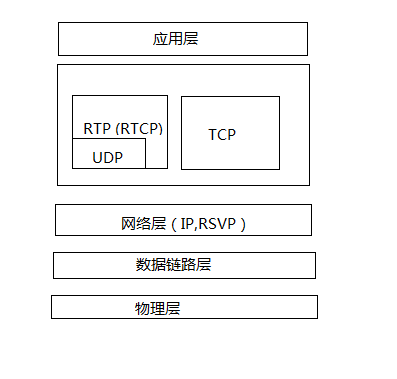
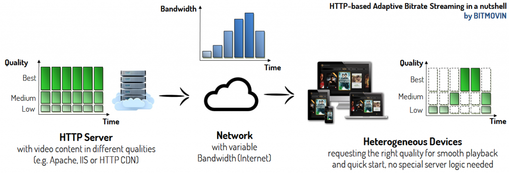
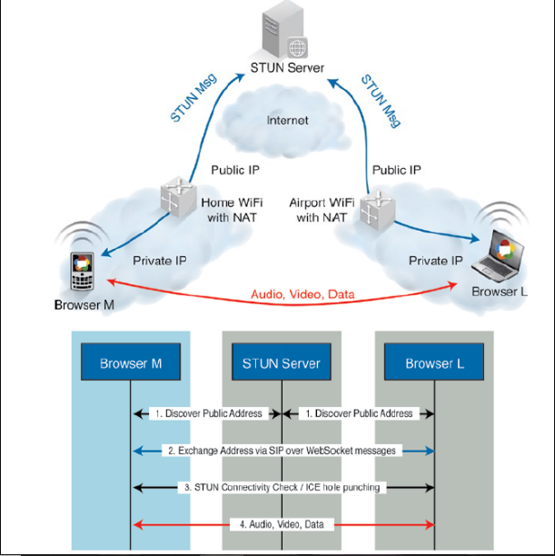

本文主要介绍现有多媒体传输协议

   

# 0 基础概念

下面简单介绍流媒体传输协议涉及的基础概念

  

## 1）网路地址转换NAT

网路地址转换(Network Address Translation)可为你的装置提供公用IP地址。路由器具备公用IP地址，而连上路由器的所有装置则具备私有IP地址。接着针对请求，从装置的私有IP对应到路由器的公用IP与专属的通讯端口。如此一来，各个装置不需占用专属的公用IP，亦可在网路上被清楚识别

   

### a）完全锥形NAT

主机host 通过NAT 访问外网B，在NAT上就会打个”洞“，所有知道这个”洞“的外网主机都可以通过这个与host 上的侦听程序通讯。这个”洞“对应NAT 映射，即 **” 内网IP:内网Port <–> 外网IP:外网Port“**

那么机器A或C 就可以通过这个 外网IP:外网Port 和host 上的进程通讯

<div align="center"></div>

​    

### b）IP限制锥形NAT

IP 限制锥型要比完全锥型 NAT 严格得多，它主要的特点是，host 主机在 NAT 上“打洞”后，NAT 会对穿越洞口的 IP 地址做限制。只有登记的 IP 地址才可以通过，也就是说，只有**host 主机访问过的外网主机才能穿越 NAT**，也就是NAT 映射表为：**内网IP:内网Port <–> 外网IP:外网Port <–> 被访问的主机IP**

那么这里只有B可以和X 通信，而A，C 由于IP 未被访问，故无法与其通信

<div align="center"></div>

​    

### c）端口限制锥形NAT

端口限制锥型要比IP限制形还要严格，它主要的特点是，host 主机在 NAT 上“打洞”后，NAT 会对穿越洞口的 IP 地址和端口做限制。也就是说，只有**host 主机访问过的外网主机及提供服务的程序的端口才能穿越 NAT**，也就是NAT 映射表为：**内网IP:内网Port <–> 外网IP:外网Port <–> 被访问的主机IP：被访问主机Port**

那么这里只有B上的P1端口的进程才能和其通信

<div align="center"></div>

​     

### d）对称型NAT

这是NAT 中最严格的一种类型，也就是说host 主机访问A 时会打一个”洞“，访问B是会再打一个”洞“，也即六元组中 “内网IP:内网Port<–>外网IP:***外网Port***<–>被访问的主机IP：被访问主机Port”

那么这里只有B上的P1端口的进程才能和其通信

<div align="center"></div>

   

## 2）NAT穿透技术

​    

### a）互动式连接建立 - ICE

ICE（Interactive Connectivity Establishment）提供的是一种框架，使各种NAT穿透技术（STUN，TURN...）可以实现统一，其中该技术可以让客户端成功地穿透远程用户与网络之间可能存在的各类防火墙

​    

### b）NAT 的UDP简单穿越 - STUN

NAT 的UDP简单穿越（Simple Traversal of UDP over NATs）是一种网络协议，它允许位于NAT（或多重NAT）后的客户端找出自己的公网地址，查出自己位于哪种类型的NAT之后以及NAT为某一个本地端口所绑定的Internet端端口。这些信息被用来在两个同时处于NAT路由器之后的主机之间建立UDP通信

<div align="center"></div>

> 即使通过 STUN 服务器取得了公用 IP 地址，也不一定能建立连线。因为不同的NAT类型处理传入的UDP分组的方式是不同的。四种主要类型中有三种是可以使用 **STUN穿透**：`完全圆锥型NAT`、`受限圆锥型NAT` 和 `端口受限圆锥型NAT`。但大型公司网络中经常采用的 `对称型 NAT`（又称为双向NAT）则不能使用，这类路由器会通过 NAT 布署所谓的「Symmetric NAT」限制。也就是说，路由器只会接受你之前连线过的节点所建立的连线。这类网络就需要TURN技术。

​     

### c）中继NAT穿透 - TURN

TURN（Traversal Using Relays around NAT）就是通过TURN服务器开启连线并转送所有数据，进而绕过Symmetric NAT的限制。你可通过TURN服务器建立连线，再告知所有端点传送封包至该服务器，最后让服务器转送封包给你。这个方法更耗时且更占频宽，因此在没有其他替代方案时才会使用这个方法。

<div align="center"></div>


​    

# 1 实时传输协议RTP

**RTP（Real-time Transport Protocol）**协议是用于Internet上针对多媒体数据流的一种传输层协议，详细说明了在互联网上传递音频和视频的标准数据包格式。RTP协议常用于流媒体系统（配合RTCP协议）、视频会议和一键通（Push to Talk）系统（配合H.323或SIP），使它成为IP电话产业的技术基础。***RTP协议和RTP控制协议RTCP一起使用，而且它是建立在UDP协议上的***，以利用UDP的复用和求和校验功能。RTP是在两个主机之间提供基于连接的、稳定的数据流，而UDP是在网络上提供一种非连接数据报服务。

RTP是一种基于包的传输协议，它用来传输实时数据。在网络上传输数据包的延迟和误差是不可避免的，对此RTP包头包含 `时间戳`、`丢失保护`、`载荷标识`、`源标识` 和 `安全性` 信息，这些信息用于在应用层实现数据包丢失恢复、拥塞控制等。

   

**协议特征**：

> RTP 本身并没有提供按时发送机制或其它服务质量（QoS）保证，它依赖于低层服务去实现这一过程；
>
> RTP 并不保证传送或防止无序传送，也不确定底层网络的可靠性。；
>
> RTP 实行有序传送， RTP 中的序列号允许接收方重组发送方的包序列，同时序列号也能用于决定适当的包位置，例如：在视频解码中，就不需要顺序解码
>
> RTP 由两个紧密链接部分组成： 
>
> * RTP ― 传送具有实时属性的数据；
> * RTP 控制协议（RTCP） ― 监控服务质量并传送正在进行的会话参与者的相关信息

​    

# 2 实时传输控制协议RTCP

**实时传输控制协议**（Real-time Transport Control Protocol 或 RTP Control Protocol 或 RTCP）是实时传输协议（RTP）的一个姐妹协议

> RTCP为RTP媒体流提供信道外（out-of-band）控制
>
> RTCP本身并不传输数据，但和RTP一起协作将多媒体数据打包和发送
>
> RTCP定期在流多媒体会话参加者之间传输控制数据
>
> RTCP的主要功能是为RTP所提供的服务质量（Quality of Service）提供反馈

   

RTCP收集相关媒体连接的统计信息，例如：`传输字节数`、`传输分组数`、`丢失分组数`、`jitter`、`单向和双向网络延迟`等等。网络应用程序可以利用RTCP所提供的信息试图提高服务质量，比如 限制信息流量或改用压缩比较小的编解码器，但RTCP本身不提供数据加密或身份认证，而SRTCP可以用于此类用途。

​    

# 3 安全实时传输协议 SRTP & SRTCP

**安全实时传输协议**（Secure Real-time Transport Protocol或SRTP）是在实时传输协议（Real-time Transport Protocol或RTP）基础上所定义的一个协议，旨在为 ***单播和多播应用程序中的实时传输协议的数据提供加密、消息认证、完整性保证和重放保护*** 。它是由David Oran（思科）和Rolf Blom（爱立信）开发的，并最早由IETF于2004年3月作为RFC3711发布。

由于实时传输协议和可以被用来控制实时传输协议的会话的实时传输控制协议（RTP Control Protocol或RTCP）有着紧密的联系，安全实时传输协议同样也有一个伴生协议，它被称为 **安全实时传输控制协议（Secure RTCP或SRTCP**）；安全实时传输控制协议为实时传输控制协议提供类似的与安全有关的特性，就像安全实时传输协议为实时传输协议提供的那些一样。

在使用实时传输协议或实时传输控制协议时，使不使用安全实时传输协议或安全实时传输控制协议是可选的；但即使使用了安全实时传输协议或安全实时传输控制协议，所有它们提供的特性（如 **加密和认证**）也都是可选的，这些特性可以被独立地使用或禁用。唯一的例外是在使用安全实时传输控制协议时，必须要用到其**消息认证**特性。

​    

# 4 实时流协议RTSP

RTSP协议（Real Time Streaming Protocol）定义了一对多应用程序如何有效地通过IP网络传送多媒体数据，且RTSP提供了一个可扩展框架，使实时数据，如 **音频与视频的受控、点播** 成为可能。数据源包括现场数据与存储在剪辑中的数据。该协议目的***在于控制多个数据发送连接，为选择发送通道，如UDP、多播UDP与TCP提供途径***，并为选择基于RTP上发送机制提供方法。RTSP在体系结构上位于RTP和RTCP之上，它使用TCP或RTP完成数据传输。

RTSP是用来控制**声音或影像**的多媒体串流协议，并允许同时多个串流需求控制，传输时所用的网络通讯协定并不在其定义的范围内，服务器端可以自行选择使用TCP或UDP来传送串流内容，它的语法和运作跟HTTP 1.1类似，但并不特别强调时间同步，所以比较能容忍网络延迟。而前面提到的允许同时多个串流需求控制（Multicast），除了可以降低服务器端的网络用量，更进而支持多方视讯会议（Video Conference）。 因为与HTTP1.1的运作方式相似，所以代理服务器《Proxy》的快取功能《Cache》也同样适用于RTSP，并因RTSP具有重新导向功能，可视实际负载情况来转换提供服务的服务器，以避免过大的负载集中于同一服务器而造成延迟。

<div align="center"></div>
​    


## 4.1 RTSP与RTP关系

RTP不像http和ftp可完整的下载整个影视文件，它是**以固定的数据率在网络上发送数据，客户端也是按照这种速度观看影视文件**，当影视画面播放过后，就不可以再重复播放，除非重新向服务器端要求数据。

RTSP与RTP最大的区别在于：

> RTSP是一种双向实时数据传输协议，它允许客户端向服务器端发送请求，如回放、快进、倒退等操作
>
> 当然RTSP可基于RTP来传送数据，还可以选择 `TCP`、`UDP`、`组播UDP` 等通道来发送数据，具有很好的扩展性。它是一种类似于HTTP协议的网络应用协议。

​    

应用实现：服务器端实时采集、编码并发送两路视频，客户端接收并显示两路视频。由于客户端不必对视频数据做任何回放、倒退等操作，可直接采用 **UDP + RTP + 组播** 实现

​     

## 4.2 RTSP和HTTP比较

RTSP和HTTP所提供的的服务相同，RTSP是以 **音视频流** 的形式，HTTP以**文本和图形**的形式

> HTTP传送HTML，而RTP传送的是多媒体数据
>
> RTSP兼容的视频服务器必须维持会话状态，以将RTSP请求和流关联起来
>
> HTTP请求是一个不对称协议（由客户机发出，服务器做出响应）；RTSP可以是双向的，即客户机和服务器都可以发出请求

<div align="center"></div>

​     

# 5 资源预定协议RSVP

RSVP（Resource ReSerVation Protocol），即资源预订协议，是一种用于互联网上质量整合服务的协议，并为请求的服务建立和维护状态。RSVP 请求通常会导致数据路径上每个节点的资源预留，即使用RSVP预留一部分网络资源（即带宽），能在一定程度上为流媒体的传输提供QoS。

RSVP 只在单方向上进行资源请求，因此尽管相同的应用程序，同时可能既担当发送者也担当接受者，但RSVP协议对发送者与接受者在逻辑上是有区别的。其次，RSVP运行在 IPV4 或 IPV6 上层，占据协议栈中传输协议的空间。

RSVP不传输应用数据，但支持因特网控制协议，如 ICMP、IGMP 或者路由选择协议。正如路由选择和管理类协议的实施一样，RSVP的运行也是在后台执行，而并非在数据转发路径上。

<div align="center"></div>

​     

**RSVP、RTSP与RTP协议工作在不同的层次**，如下图所示：

<div align="center"></div>

​    

# 6 会话描述协议SDP

**会话描述协议**（Session Description Protocol, SDP）用来描述各端支持的音视频编解码格式和连接相关的信息，为会话通知、会话邀请和其它形式的多媒体会话初始化等目的提供了多媒体会话描述。 会话目录用于协助多媒体会议的通告，并为会话参与者传送相关设置信息。

> SDP 即用于将这种信息传输到接收端
>
> SDP 完全是一种会话描述格式，它不属于传输协议 ，只使用不同的适当的传输协议，包括 `会话通知协议（SAP）`、`会话初始协议（SIP）`、`实时流协议（RTSP）`、`MIME 扩展协议的电子邮件` 以及 `超文本传输协议（HTTP）`

SDP 的设计宗旨是通用性，它可以应用于大范围的网络环境和应用程序，而不仅仅局限于组播会话目录，但 SDP 不支持会话内容或媒体编码的协商。在因特网组播骨干网（Mbone）中，会话目录工具被用于通告多媒体会议，并为参与者传送会议地址和参与者所需的会议特定工具信息，这由 SDP 完成。SDP 连接好会话后，传送足够的信息给会话参与者。SDP 信息发送利用了会话通知协议（SAP），它周期性地组播通知数据包到已知组播地址和端口处。这些信息是 UDP 数据包，其中包含 SAP 协议头和文本有效载荷（text payload）。这里文本有效载荷指的是 SDP 会话描述。此外信息也可以通过电子邮件或 WWW （World Wide Web） 进行发送。

​    

主要包括以下几个部分：

> Session Metadata，会话元数据
>
> Network Description，网络描述
>
> Stream Description，流描述
>
> Security Descriptions，安全描述
>
> Qos Grouping Descriptions， 服务质量描述

   

# 7 微软媒体服务器协议MMS

**微软媒体服务器协议**（Microsoft Media Server Protocol, MMS ），用来访问并流式接收 Windows Media 服务器中 **.asf** 文件的一种协议

> MMS 协议用于访问 Windows Media 发布点上的单播内容
>
> MMS 是连接 Windows Media 单播服务的默认方法
>
> 若观众在 Windows Media Player 中键入一个 URL 以连接内容，而不是通过超级链接访问内容，则必须使用MMS 协议引用该流
>
> MMS的预设埠（端口）是1755

​    

当使用 MMS 协议连接到发布点时，使用协议翻转以获得最佳连接。“协议翻转”始于试图通过 MMSU 连接客户端。 MMSU 是 MMS 协议结合 UDP 数据传送。如果 MMSU 连接不成功，则服务器试图使用 MMST。MMST 是 MMS 协议结合 TCP 数据传送。

如果连接到编入索引的 .asf 文件，想要快进、后退、暂停、开始和停止流，则必须使用 MMS，不能用 UNC 路径快进或后退。若您从独立的 Windows Media Player 连接到发布点，则必须指定单播内容的 URL。若内容在主发布点点播发布，则 URL 由服务器名和 .asf 文件名组成。例如：mms://windows_media_server/sample.asf。其中 windows_media_server 是 Windows Media 服务器名，sample.asf 是您想要使之转化为流的 .asf 文件名。

若您有实时内容要通过广播单播发布，则该 URL 由服务器名和发布点别名组成。例如：mms://windows_media_server/LiveEvents。这里 windows_media_server 是 Windows Media 服务器名，而 LiveEvents 是发布点名

​    

# 8 实时消息传输协议RTMP / RTMPS

**RTMP**（Real Time Messaging Protocol）是目前直播的主要协议，是Adobe公司为Flash播放器和服务器之间提供音视频数据传输服务而设计的应用层私有协议，且RTMP协议是目前各大云厂商直线直播业务所公用的基本直播推拉流协议。

其次，这个协议建立在TCP协议或者轮询HTTP协议之上，**RTMP协议就像一个用来装数据包的容器**，这些数据既可以是 **AMF格式** 的数据，也可以是 **FLV中的视/音频数据** ，一个单一的连接可以通过不同的通道传输多路网络流，这些通道中的包都是按照固定大小的包传输的。

​    

**RTMP视频播放的特点：**

> 1）RTMP协议是采用 **实时的流式传输**，所以不会缓存文件到客户端，这种特性说明用户想下载RTMP协议下的视频是比较难的
>
> 2）**视频流可以随便拖动**，既可以从任意时间点向服务器发送请求进行播放，并**不需要视频有关键帧**。相比而言，HTTP协议下视频需要有关键帧才可以随意拖动
>
> 3）RTMP协议支持 **点播/回放**（通俗点将就是支持把flv、f4v、mp4文件放在**RTMP服务器**，客户端可以直接播放）、**直播**（边录制视频边播放）

   

## 8.1 RTMP 三大特性

RTMP协议主要的特点有：`多路复用`，`分包` 和 `应用层协议`

​    

### 1）多路复用

多路复用（multiplex）指的是信号发送端通过一个信道同时传输多路信号，然后信号接收端将一个信道中传递过来的多个信号分别组合起来，分别形成独立完整的信号信息，以此来更加有效地使用通信线路。

<div align="center"></div>

简而言之，就是在一个 TCP 连接上，将需要传递的Message分成一个或者多个 Chunk，同一个Message 的多个Chunk 组成 `ChunkStream`；在接收端，再把 ChunkStream 中一个个 Chunk 组合起来就可以还原成一个完整的 Message，这就是多路复用的基本理念。

<div align="center"></div>

上图是一个简单例子，假设需要传递一个300字节长的Message，我们可以将其拆分成3个Chunk，每一个Chunk可以分成 Chunk Header 和 Chunk Data。在Chunk Header 里我们可以标记这个Chunk中的一些基本信息，如 Chunk Stream Id 和 Message Type；Chunk Data 就是原始信息，上图中将 Message 分成128+128+44 =300，这样就可以完整的传输这个Message了。

​    

### 2）分包

与RTSP协议相比，分包是RTMP的一个特点。与普通的业务应用层协议（如：RPC协议）不一样的是，在多媒体网络传输案例中，绝大多数的多媒体传输的音频和视频的数据包都相对比较偏大，在TCP这种可靠的传输协议之上进行大的数据包传递，很有可能阻塞连接，导致优先级更高的信息无法传递，分包传输就是为了解决这个问题而出现的。

   

### 3）应用层协议

RTMP协议默认基于传输层协议TCP而实现，但是在RTMP的官方文档中，只给定了标准的数据传输格式说明和一些具体的协议格式说明，并没有具体官方的完整实现，这就催生出了很多相关的其他业内实现，例如RTMP over UDP等等相关的私有改编的协议出现，给了大家更多的可扩展的空间，方便大家解决原生RTMP存在的直播时延等问题

​    

## 8.2 RTMP基础概念

下面简单介绍一下RTMP协议使用的基础概念

   

### 1）握手

RTMP基于TCP，已知TCP需要3次握手才可以建立连接，在TCP3次握手成功之后，应用层的RTMP也是需要握手的，就是认证过程。具体的认证过程如下：

<div align="center"></div>

客户端发送 C0、C1、 C2，服务器发送 S0、 S1、 S2

> 1）客户端发送 C0 表示自己的版本号，不必等对方的回复，然后发送 C1 表示自己的时间戳；
>
> 2）服务器只有在收到 C0 的时候，才能返回 S0，表明自己的版本号，如果版本不匹配，可以断开连接；
>
> 3）服务器发送完 S0 后，也不用等什么，就直接发送自己的时间戳 S1。客户端收到 S1 的时候，发一个知道了对方时间戳的 ACK C2。同理服务器收到 C1 的时候，发一个知道了对方时间戳的 ACK S2
>
> 4）握手建立完成

   

```
Q: 为什么RTMP还需要单独建立一个连接？
A: 为保证以后的传输能正常进行。主要就是两个事情，一个是版本号，如果客户端、服务器的版本号不一致，则不能工作。另一个就是时间戳，视频播放中，时间是很重要的，后面的数据流互通的时候，经常要带上时间戳的差值，因而一开始双方就要知道对方的时间戳
```

   

### 2）拉流

RTMP拉流的核心流程如下：

<div align="center"></div>

   

### 3）推流

推流与拉流类似，区别在Play ---> Publishing

<div align="center"></div>

   

## 8.3 展望

**时延较高** 就是RTMP一个最大的问题，在实际的生产过程中，即使在比较健康的网络环境中，RTMP的时延也会有3~8s，这与各大云厂商给出的1~3s理论时延值还是有较大出入的。那么时延会带来哪些问题呢？我们可以想象如下的一些场景：

> 在线教育，学生提问，老师都讲到下一个知识点了，才看到学生上一个提问
>
> 电商直播，询问宝贝信息，主播“视而不理”
>
> 打赏后迟迟听不到主播的口播感谢
>
> 在别人的呐喊声知道球进了，你看的还是直播吗？

​     

特别是现在直播已经形成产业链的大环境下，很多主播都是将其作为一个职业，很多主播使用在公司同一个网络下进行直播，在公司网络的出口带宽有限的情况下，**RTMP和FLV格式**  的延迟会更加严重，高时延的直播影响了用户和主播的实时互动，也阻碍了一些特殊直播场景的落地，例如带货直播，教育直播等。

使用RTMP协议常规解决方案：

<div align="center"></div>

根据实际的网络情况和推流的一些设置，例如关键帧间隔，推流码率等等，时延一般会在8秒左右，时延主要来自于2个大的方面：

> 1）**CDN链路延迟**： 
>
> * 一部分是网络传输延迟。CDN内部有四段网络传输，假设每段网络传输带来的延迟是20ms，那这四段延迟便是100ms；此外，使用RTMP帧为传输单位，意味着每个节点都要收满一帧之后才能启动向下游转发的流程；
> * CDN为了提升并发性能，会有一定的优化发包策略，会增加部分延迟。在网络抖动的场景下，延迟就更加无法控制了，可靠传输协议下，一旦有网络抖动，后续的发送流程都将阻塞，需要等待前序包的重传
>
> 2）**播放端buffer**：延迟的主要来源。公网环境千差万别，推流、CDN传输、播放接收这几个环节任何一个环节发生网络抖动，都会影响到播放端。因此，为了对抗前边链路的抖动，播放器的常规策略是保留6s 左右的媒体buffer

​    

通过上述说明，可以清楚的知道，直播最大的延迟就是在于 **拉流端（播放端buffer）的时延**，所以如何快速地去消除这个阶段的时延，就是各大云厂商亟待解决的问题，这就是后续各大云厂商推出消除RTMP协议时延的新的产品，例如腾讯云的"快"直播、阿里云的超低时延RTS直播等等，其实这些直播都引入了 **WebRTC技术**。

​    

# 9 HTTP直播流协议HLS

**HTTP Live Streaming（HLS）**是苹果公司(Apple Inc.) 实现的**基于HTTP的流媒体传输协议**，可实现 ***流媒体的直播和点播***，主要应用在iOS系统，为iOS设备（如iPhone、iPad）提供音视频直播和点播方案。HLS点播，基本上就是常见的 **分段HTTP点播**，不同在于，它的分段非常小。

相对于常见的流媒体直播协议，例如：RTMP协议、RTSP协议、MMS协议等，HLS直播最大的不同在于，**直播客户端获取到的，并不是一个完整的数据流**。HLS协议在服务器端将直播数据流存储为 **连续的、很短时长的媒体文件**（MPEG-TS格式），而客户端则不断的下载并播放这些小文件，因为服务器端总是会将最新的直播数据生成新的小文件，这样客户端只要不停的按顺序播放从服务器获取到的文件，就实现了直播。由此可见，基本上可以认为，**HLS是以点播的技术方式来实现直播**。由于数据通过HTTP协议传输，所以完全不用考虑防火墙或者代理的问题，而且分段文件的时长很短，客户端可以很快的选择和切换码率，以适应不同带宽条件下的播放。不过HLS的这种技术特点，决定了它的 ***延迟一般总是会高于普通的流媒体直播协议***。

​    

根据以上的了解要实现HTTP Live Streaming直播，需要研究并实现以下技术关键点：

> 1）采集视频源和音频源的数据
>
> 2）对原始数据进行H264编码和AAC编码
>
> 3）视频和音频数据封装为 **MPEG-TS包**
>
> 4）HLS分段生成策略及m3u8索引文件
>
> 5）HTTP传输协议

   

# 10 http-flv（HDL）

直播之前使用 **rtmp** 和 **hls**，那为什么现在使用 **http-flv**，它有什么优缺点？怎么让流媒体服务器支持flv直播？

市场上使用http-flv协议的直播的产品：`斗鱼`、`熊猫tv`、`虎牙`、`优酷` 等pc网页

   

## 10.1 http-flv、rtmp和hls直播的优缺点

| 特性               | 差异                                                         |
| ------------------ | ------------------------------------------------------------ |
| 延迟性             | http-flv：低延迟，内容延迟可以做到2-5秒<br/>Rtmp：低延迟，内容延迟可以做到2-5秒<br/>Hls:：延迟较高 |
| 易用性             | rtmp和http-flv：播放端安装率高，只要浏览器支持FlashPlayer就能非常简易的播放<br/>hls：最大的优点：HTML5可以直接打开播放；这个意味着可以把一个直播链接通过微信等转发分享，不需要安装任何独立的APP，有浏览器即可 |
| rtmp和http-flv比较 | 1）**穿墙**：很多防火墙会墙掉RTMP，但是不会墙HTTP，因此HTTP FLV出现奇怪问题的概率很小<br/>2）**调度**：RTMP也有个302，可惜是播放器as中支持的，HTTP FLV流就支持302方便CDN纠正DNS的错误<br/>3）**容错**：SRS的HTTP FLV回源时可以回多个，和RTMP一样，可以支持多级热备<br/>4）**简单**：FLV是最简单的流媒体封装，HTTP是最广泛的协议，这两个组合在一起维护性更高，比RTMP简单多了 |

​    

## 10.2 http-flv技术实现

HTTP协议中有个约定：content-length字段，即http的body部分的长度

> 1）服务器回复http请求的时候如果有这个字段，客户端就接收这个长度的数据然后就认为数据传输完成了；
>
> 2）如果服务器回复http请求中没有这个字段，客户端就一直接收数据，直到服务器跟客户端的socket连接断开。

​    

http-flv直播就是利用第二个原理，服务器回复客户端请求的时候不加content-length字段，在回复了http

内容之后，紧接着发送flv数据，客户端就一直接收数据了。

​      

# 11 HTTP动态自适应流传输协议 MPEG-DASH

HTTP上的动态自适应流传输协议（Dynamic Adaptive Streaming over HTTP，MPEG-DASH），是由MPEG和ISO批准的独立于供应商的国际标准，是一种 **基于HTTP的使用TCP传输协议的流媒体传输技术**。MPEG-DASH是一种自适应比特率流技术，可根据实时网络状况实现动态自适应下载。

> MPEG-DASH 已经成为包括 3GPP、EBU、HBBTV 等多个国际标准的推荐流传输协议，与已有的采用 RTP 的方法相比，HTTP 不需要考虑防火墙的问题，并且可以充分利用已有的系统架构，如缓存、CDN 等。
>
> DASH本身也可以通过 WebSocket 和上层 push 等技术来支持低延迟的流推送, 而且不同于 HLS、HDS 和 Smooth Streaming，DASH **不关心编解码器**，因此它可以接受任何编码格式编码的内容，如 HEVC、H.264、VP9 等。由于其多方面的优势，目前全景视频也主要采用 DASH 协议进行传输，而且DASH协议针对全景视频的的特性加入了一些特定功能以适应去全景视频的传输。

​    

类似苹果公司的 HTTP Live Streaming（HLS）方案，MPEG-DASH 会 ***将媒体内容封装成一系列小型的基于 HTTP 的文件片段，每个片段包含的时间可以设置，一般包含时间较短，但是每个片段有多种码率的版本，这样可以更精确地实现网络自适应下载***。

根据当前网络条件，客户端自适应地选择下载和播放当前网络能够承载的最高比特率版本，这样既可以保证当前媒体的质量，又能避免由于码率过高导致的播放卡顿或重新缓冲事件。因此，MPEG-DASH可以实现动态无缝适应实时的网络条件并提供高质量的播放内容，拥有更少的卡顿，极大地提升了用户体验。

MPEG-DASH传输系统架构由 **HTTP服务器** 和 **DASH客户端** 两部分组成，其中HTTP服务器存储着DASH文件，主要包含两部分：

> 媒体描述文件MPD
>
> DASH媒体文件，主要由分段媒体文件和头信息文件两部分组成

​    

## 11.1 工作原理

下图为客户端根据实时网络情况进行下载的演示图：

> 1）首先HTTP 服务器端将媒体文件切分成一个个时间长度相等的小分片，每个分片被编码为不同大小的码率；
>
> 2）这些分片可以通过GET请求下载，客户端通过评估自身的性能和带宽情况，下载相应码率的切片
>
> 3）**码率切换**以媒体分段为单位，当网络带宽较好时，客户端可以请求对应时间较高码率的媒体分段；而当带宽变差时，客户端则下载对应码率较低的下一个媒体分段。由于不同质量的媒体分段在时间上都是相互对齐的，因此不同质量的媒体分段之间切换时，画面是自然流畅的。

<div align="center"></div>

<div align="center"></div>


**工作原理：**

<div align="center"></div>

> 1）一组电影的编码（或**码率-分辨率**组合, 即rendition）由MPEG-DASH打包服务或软件去打包，打包的过程是将每个rendition分割成指定时间的小片或小块（例如，2秒或4秒长）
>
> 2）打包器还将其如何分割视频以及视频的交付顺序记录在一个称为MPD或清单（manifest）的文本文件中
>
> 3）打包过的视频和清单被存储在源站服务器，并等待被分发给播放器（通常使用CDN）
>
> 4）在另一端，有一个兼容了MPEG-DASH的播放器，其中内置了 **ABR引擎**
>
> 5）当用户按下播放键，应用程序或者视频播放器请求视频的MPD文件，在收到MPD后，播放器对其进行解析然后理解如何播放视频
>
> 6）播放器开始按照预定义顺序请求视频切片，解码它们并将视频显示给用户
>
> 7）播放器持续监测带宽条件。根据可用带宽，播放器选择MPEG-DASH MPD中描述的码率之一，并请求CDN从该变体（Variant）中发送下一个视频块
>
> 整个过程会一直持续，直到视频播放结束（电影结束或者用户停止观看）

   

再来回顾一下MPEG-DASH的工作原理：

```
1）MPD文件描述了电影视频的切割、排序方式以及传输信息
2）打包过的视频被存储在服务器上并通过CDN发送
3）视频播放器首先下载MPD，然后需要理解视频传输机制，感知可用带宽，再开始播放
4）根据缓冲大小和可用带宽，视频播放器请求该电影某个码率组合的视频切片
5）通过不断感知带宽条件和缓冲水平，播放器自适应地传输内容，以提供良好的用户体验
```

​    

## 11.2 结构内容

为了精确描述DASH的结构内容，MPEG-DASH引入了Media Presentation Description （MPD）的概念。MPD是一个XML文件，它完整描述了DASH内容的所有信息，包括 `各类音视频参数`、`内容分段时长`、`不同媒体分段的码率和分辨率` 以及 `对应的访问地址URL` 等等，客户端通过首先下载并解析MPD文件，可获取到与自身性能和带宽最匹配的媒体分段。

下图比较清晰地说明了MPD文件的分层结构关系：

<div align="center"></div>

​     

### 1）周期 Period

一个DASH文件可以包含一个或多个Periods，每个**Period代表一段连续的视频片段**，假设一段码流有60s被划分为3个Periods，Period1为 0-15s，Period2为16-40s，Period3为41-60s。

在同一个Period内，可用的媒体内容的类型及其各个可用码率（Representation）都不会发生变更。直播情况下，**MPD文件会发生实时变化**，需要周期性地去服务器请求新的MPD文件，服务器可能会移除已过时的Period，添加新的Period，而新的Period中可能会出现新的可用码率，或者移除上一个Period中存在的某些码率。

​    

### 2）自适应集 AdaptationSet

一个Period由一个或多个AdaptationSets组成。例如：一个自适应集包含同一视频内容的多个不同比特率的视频分段，另一个自适应集包含同一音频内容的多个不同比特率的视频分段。

每个AdaptationSet包含了 **逻辑一致的可供切换的不同码率的码流（Representation)**。例如：这些Representation 具有相同的codec、language、resolution 以及 音频通道数(5.1，stereo等)。这些Representation中可能包含一个(ISO profile)或多个(TS profile)media content components，因为ISO profile的mp4或fmp4 segment中通常只含有一个视频或者音频内容，而TS profile中的TS segment同时含有视频和音频内容，当同时含有多个media component content时，每个被复用的media content component将被单独描述。

​     

### 3）码流 Representation

一个AdaptationSet由一组媒体内容配置可切换的Representations构成，而每个Representation表示**同一媒体内容但编码参数互不相同的音视频数据**，包含了相同媒体内容的不同配置，即不同的分辨率、码率等，以供客户端根据自身的网络条件和性能限制来选择合适的版本下载播放。

   

### 4）片段 Segment

每个Representation中的内容按时间或者其他规则被切分成一段段Segments，使得客户端在播放时能够灵活地在不同的Representations之间进行切换。每个Segment都有一个唯一的与之对应的URL地址，也可能由相同的URL与不同的byte range指定。DASH客户端可以通过HTTP协议来获取URL对应的分片数据。

MPD中描述Segment URL的形式包括Segment list，Segment template，Single segment

​    

## 11.3 示例

如图所示，DASH客户端根据MPD-URL向服务器发送请求获取MPD，客户端首先解析MPD内容，得到服务器端DASH文件的内容信息，包括 `视频分辨率`、`视频内容种类`、`分段情况`、`帧率`、`码率` 以及 `各个媒体内容的URL地址`等媒体配置信息。DASH客户端通过分析上述DASH文件内容信息，根据当前网络状态以及客户端缓冲区的大小等选择合适的媒体版本。然后通过向服务器发送请求，根据媒体URL下载对应的媒体文件进行流式传输。客户端收到对应的媒体文件之后，进行解封装得到裸码流，最后送入解码器进行解码播放。

<div align="center"></div>
​    


# 12 web实时通信技术 webRTC

WebRTC （Web Real-Time Communications） 是一项实时通讯技术，它允许网络应用或者站点，在不借助中间媒介的情况下，建立浏览器之间点对点（Peer-to-Peer）的连接，实现 **视频流和（或）音频流或者其他任意数据的传输**。WebRTC包含的这些标准使用户在无需安装任何插件或者第三方的软件的情况下，创建点对点（Peer-to-Peer）的数据分享和电话会议成为可能。

它并不是单一的协议，包含了 `媒体`、`加密`、`传输层` 等在内的多个协议标准以及一套基于 JavaScript 的 API。通过简单易用的 JavaScript API ，在不安装任何插件的情况下，让浏览器拥有了 **P2P音视频和数据分享** 的能力。同时WebRTC 并不是一个孤立的协议，它拥有灵活的信令，可以便捷的对接现有的SIP 和电话网络的系统。其次，webRTC不仅支持Web之间的音视频通讯，还支持Android以及IOS端。

​     

## 12.1 WebRTC内部架构

<div align="center"></div>

架构图颜色标识说明：

> 紫色部分是Web开发者API层
>
> 蓝色实线部分是面向浏览器厂商的API层
>
> 蓝色虚线部分浏览器厂商可以自定义实现

​     

## 12.2 架构组件

> **User Web APP**：Web开发者开发的程序，Web开发者可以基于集成WebRTC的浏览器提供的web API开发基于视频、音频的实时通信应用
>
> **Web API*(：面向第三方开发者的WebRTC标准API（Javascript），使开发者能够容易地开发出类似于网络视频聊天的web应用，需要注意的是可能在不同浏览器中API接口名会不太一样，所以推荐使用这个[JS适配器](https://link.zhihu.com/?target=https%3A//github.com/webrtchacks/adapter)来协调各个浏览器的不同接口。 这些API可分成Media API、 RTCPeerConnection、Peer-to-peer Data API三类：
>
> * **Media API**：MediaStream用来表示一个媒体数据流，MediaStreamTrack 在浏览器中表示一个媒体源
> * **RTCPeerConnection**：一个RTCPeerConnection对象允许用户在两个浏览器之间直接通讯
>   * SDP：用来描述当前连接者想要传输的内容，支持的协议类型，支持的编解码类型等
>   * RTCIceCandidate：表示一个ICE协议的候选者，简单的说，就是目标节点的IP以及端口
>   * RTCIceServer：表示一个ICE Server，其主要用于当前主机的IP发现，通过和ICE Server通讯，我们会得到一组可供连接使用的IP:Port候选值，双方通过交换ICE候选值来建立起连接
> * **Peer-to-peer Data API**：数据通道( DataChannel ) 接口表示一个在两个节点之间的双向的数据通道，该通道可以设置成可靠传输或非可靠传输 
>
> **WebRTC Native C++ API**：Native C++ API层，使浏览器厂商容易实现WebRTC标准的Web API，抽象地对数字信号过程进行处理
>
> **Transport**：传输模块
>
> * SRTP（安全的实时传输协议，用以音视频流传输）
> * Multiplexing（多路复用）
> * P2P，STUN+TURN+ICE（用于NAT网络和防火墙穿越的）
> * 除此之外，安全传输可能还会用到DTLS（数据报安全传输），用于加密传输和密钥协商
> * 整个WebRTC通信是基于UDP的
>
> **Voice Engine**：音频引擎，包含一系列音频多媒体处理的框架，包括从视频采集卡到网络传输端等整个解决方案
>
> * Voice Engine包含iSAC/iLBC Codec（音频编解码器，前者是针对宽带和超宽带，后者是针对窄带）
> * NetEQ for voice（处理网络抖动和语音包丢失）
> * Echo Canceler（回声消除器）/ Noise Reduction（噪声抑制）
>
> **Video Engine**：视频引擎，包含一系列视频处理的整体框架，从摄像头采集视频到视频信息网络传输再到视频显示整个完整过程的解决方案
>
> * VP8 Codec（视频图像编解码器）
> * Video jitter buffer（视频抖动缓冲器，处理视频抖动和视频信息包丢失）
> * Image enhancements（图像质量增强）

​      

## 12.3 webRTC如何建立连接

WebRTC是支持**浏览器之间建立连接的连接**，但是浏览器所在主机之间的网络环境可能差异很大，有的主机在局域网内，有的在公网上，局域网和公网的主机通讯需要经过 `NAT`。

<div align="center"></div>

   

### 1）1v1音视频通信

WebRTC建连是比较复杂，它要考虑端到端之间的 **连通性和数据传输的高效性**，所以当有多条有效连接时，需要选择传输质量最好的线路，如能用内网连通就不用公网，如果公网也连通不了（比如双方都是处在对称型NAT下），那么就需要通过**服务端中继**的方式（WebRTC建连见下图红色框的部分）。

<div align="center"></div>

通过上图，可知使用WebRTC开发音视频的实时通信的整体结构包括：

> **WebRTC终端**：主要负责音视频的采集/展示，编/解码，NAT 穿越和数据传输等
>
> **Signal服务器**：主要负责信令处理（加入房间/退出房间，以及媒体协商SDP等），可以使用Websocket/Socket等实现
>
> **STUN/TURN 服务器**：主要负责获取WebRTC终端的公网IP地址或NAT穿越失败的数据中转（若NAT穿越成功，则采用P2P通信，反之，采用中转服务器中转）

​    

WebRTC端到端建立连接，并进行**音视频实时通信**的大体过程如下：

> 1）WebRTC两个客户端分别与Signal 服务器建立连接 ，Signal 服务端为WebRTC端分配房间/加入指定的房间，并返回WebRTC房间信息
>
> 2）WebRTC端会创建 `RTCPeerConnection` 媒体连接，这个连接需要知道双方的流媒体数据格式才能进行后续的数据传输，它们通过Signal 服务端进行 **SDP媒体** 协商
>
> * a）WebRTC-1先创建 `RTCPeerConnection` 媒体连接，并生成Offer请求（包含了它这个客户端支持的的媒体格式等内容），并将其设置到 `RTCPeerConnection` 的 `LocalDescription`，然后向Signal 服务器发送Offer 请求，由其转发给WebRTC-2端。
> * b）WebRTC-2端收到了Offer请求，也会创建 `RTCPeerConnection` 媒体连接，并将Offer请求中对端支持的SDP 设置到 `RTCPeerConnection` 的 `RemoteDescription`，同时生成Answer应答，并将其设置到`RTCPeerConnection` 的 `LocalDescription`，然后发送到Signal 服务器，由其转发给WebRTC-1
> * c）WebRTC-1 收到Answer，将SDP设置到 `RTCPeerConnection` 的 `RemoteDescription`，完成媒体协商
>
> 3）WebRTC两端都有了对端的连接信息和媒体协商信息，就可以进行连接，并通讯

**注意**：WebRTC-1和WebRTC-2建立连接的方式有 **P2P** 和 **经过中转服务器中转** 两种方式，其中 `SDP` 中就包括对端的连接信息，这个信息是在生成 `SDP` 时，会和 `STUN` / `TURN` 服务器进行通讯，收集该WebRTC 端的ICE（包含如何与其建连的信息）,然后WebRTC 客户端就可以通过对方的ICE 进行连接。

​    

### 2）框架通信

<div align="center"></div>

> 1）连接双方（Peer）通过第三方服务器来交换（Signalling）各自的SessionDescription（SD）数据；
>
> 2）连接双方（Peer）通过STUN协议从STUN Server那里获取到自己的NAT结构，子网IP和公网IP，端口，这里的IP和端口对我们称之为 `ICE Candidate`；
>
> 3）连接双方（Peer）通过第三方服务器来交换（Signalling）各自ICE Candidates，如果连接双方在同一个NAT下那他们仅通过内网Candidate就能建立起连接，反之如果他们处于非对称型NAT下，就需要STUN Server识别出的公网Candidate进行通讯；
>
> 4）如果仅通过STUN Server发现的公网Candidate仍然无法建立连接，换句话说就是连接双方（Peer）中至少有一方处于对称NAT下，这就需要处于对称NAT下的客户端（Peer）去寻求TURN Server提供的转发服务，然后将转发形式的Candidate共享（Signalling）给对方（Peer）；
>
> 5）连接双方（Peer）向目标IP端口发送报文，通过SessionDescription中涉及的密钥以及期望传输的内容，建立起加密长连接

​        

# 13 快速UDP连接协议 QUIC

QUIC（Quick UDP Internet Connection）是Google提出的一个基于UDP的传输协议，实现了 TCP + HTTPS + HTTP/2 的功能，目的是保证可靠性的同时降低网络延迟。因为 UDP 是一个简单传输协议，基于 UDP 可以摆脱 TCP 传输确认、重传慢启动等因素，建立安全连接只需要一的个往返时间，它还实现了 HTTP/2 多路复用、头部压缩等功能。因此，QUIC已经成为下一代互联网协议HTTP/3的底层传输协议，此外除了应用于Web领域，它的优势同样适用于一些通用的需要低延迟、高吞吐特性的传输场景。

<div align="center"></div>

​     

## 13.1 背景

简单回顾一下 HTTP 的发展过程

   

### 1）HTTP 1.0 和 1.1

1）`HTTP/1.0` ：首先，如果想要一种能够在网络上获取文档内容的协议，通过一种叫做 GET 请求的方式进行获取，后来这种 GET 请求被写入了官方文档，HTTP/1.0 应运而生。HTTP/1.0 的出现可以说是颠覆性的，它里面涵盖的一些标准我们目前还仍在使用，例如 HTTP header，协议号的概念，不过这个版本的 HTTP 还有一些明显的缺陷，比如它 **不支持持久性连接**，每次请求响应后，都需要断开连接，这样效率很差。

2）`HTTP/1.1`：这个标准是互联网上使用最频繁的一个标准，HTTP/1.1 解决了之前不支持持久性连接的缺陷，而且 HTTP/1.1 还增加了 **缓存和控制模块**。但是，即便 HTTP/1.1 解决了一部分连接性能问题，它的效率仍不是很高，而且 HTTP 还有一个 **队头阻塞问题**，即：

> 假如有五个请求被同时发出，如果第一个请求没有处理完成，就会导致后续的请求也无法得到处理，如果第一个请求没有被处理，那么 2 3 4 5 这四个请求会直接阻塞在客户端，等到请求 1 被处理完毕后，才能逐个发出。网络通畅的时候性能影响不大，不过一旦请求 1 因为某些原因没有抵达服务器，或者请求因为网络阻塞没有及时返回，影响的就是所有后续请求，导致后续请求无限阻塞下去，问题就变得比较严重了。
>
> 如下图所示：
>
> <div align="center"></div>

虽然 HTTP/1.1 使用了 `pipelining ` 的设计用于解决队头阻塞问题，但是在 pipelining 的设计中，每个请求还是按照FIFO（顺序先发先回）机制导致当前请求的执行依赖于上一个请求执行的完成，容易引起队头阻塞，并没有从根本上解决问题。

​      

### 2）HTTP 2.0

`HTTP/2.0`：解决队头阻塞的问题是采用了 stream 和分帧的方式

> **Stream**：HTTP/2.0 会将一个 TCP 连接切分成为多个 stream，每个 stream 都有自己的 stream id，这个 stream 可以是客户端发往服务端，也可以是服务端发往客户端
>
> **分帧**：HTTP/2.0 还能够将要传输的信息拆分为帧，并对它们进行二进制格式编码。也就是说，HTTP/2.0 会将 `Header 头` 和 `Data 数据` 分别进行拆分，而且拆分之后的二进制格式位于多个 stream 中
>
> <div align="center"></div>

可以看到，HTTP/2.0 通过这两种机制，将多个请求分到了不同的 stream 中，然后将请求进行分帧，进行二进制传输，每个 stream 可以不用保证顺序乱序发送，到达客户端后，客户端会根据每个 stream 进行重组，而且可以根据优先级来优先处理哪个 stream。

​      

### 3）总结

**HTTP 1.0 和 1.1 **

> `队头阻塞`： 下个请求必须在前一个请求返回后才能发出，导致带宽无法被充分利用，后续请求被阻塞（HTTP 1.1 尝试使用流水线（Pipelining）技术，但先天 FIFO（先进先出）机制导致当前请求的执行依赖于上一个请求执行的完成，容易引起队头阻塞，并没有从根本上解决问题）；
>
> `协议开销大`： header 里携带的内容过大，且不能压缩，增加了传输的成本；
>
> `单向请求`： 只能单向请求，客户端请求什么，服务器返回什么；
>
> `HTTP 1.0 和 HTTP 1.1 的区别`： 
>
> * HTTP 1.0：仅支持保持短暂的 TCP 连接（连接无法复用）；不支持断点续传；前一个请求响应到达之后下一个请求才能发送，存在队头阻塞 
> * HTTP 1.1：默认支持长连接（请求可复用 TCP 连接）；支持断点续传（通过在 Header 设置参数）；优化了缓存控制策略；管道化，可以一次发送多个请求，但是响应仍是顺序返回，仍然无法解决队头阻塞的问题；新增错误状态码通知；请求消息和响应消息都支持 Host 头域

​      

**HTTP 2.0**

> `二进制传输`： 二进制格式传输数据解析起来比文本更高效；
>
> `多路复用`： 重新定义底层 http 语义映射，允许同一个连接上使用请求和响应双向数据流。同一域名只需占用一个 TCP 连接，通过数据流（Stream）以帧为基本协议单位，避免了因频繁创建连接产生的延迟，减少了内存消耗，提升了使用性能，并行请求，且慢的请求或先发送的请求不会阻塞其他请求的返回；
>
> `Header 压缩`： 减少请求中的冗余数据，降低开销；
>
> `服务端可以主动推送`： 提前给客户端推送必要的资源，这样就可以相对减少一点延迟时间；
>
> `流优先级`： 数据传输优先级可控，使网站可以实现更灵活和强大的页面控制；
>
> `可重置`： 能在不中断 TCP 连接的情况下停止数据的发送
>
> `缺点`：HTTP 2中，多个请求在一个 TCP 管道中的，出现了丢包时，HTTP 2的表现反倒不如HTTP 1.1了。因为 TCP 为了保证可靠传输，有个特别的“丢包重传”机制，丢失的包必须要等待重新传输确认，HTTP 2出现丢包时，整个 TCP 都要开始等待重传，那么就会阻塞该 TCP 连接中的所有请求。而对于 HTTP 1.1 来说，可以开启多个 TCP 连接，出现这种情况反到只会影响其中一个连接，剩余的 TCP 连接还可以正常传输数据

​    

## 13.2 为什么使用QUIC协议？

虽然 HTTP/2.0 解决了队头阻塞问题，但是每个 HTTP 连接都是由 TCP 进行连接建立和传输的，**TCP 协议在处理包时有严格的顺序要求**。这也就是说，当某个包切分的 stream 由于某些原因丢失后，服务器不会处理其他 stream，而会优先等待客户端发送丢失的 stream 。

> 举个例子来说，假如有一个请求有三个 stream，其中 stream2 由于某些原因丢失了，那么 stream1 和 stream 2 的处理也会阻塞，只有收到重发的 stream2 之后，服务器才会再次进行处理。这就是 TCP 连接的症结所在。

​    

鉴于此，先来认识一波 QUIC 协议，是 Google 提出来的一个基于 UDP 的传输协议，又被叫做 `快速 UDP 互联网连接`。接下来简单了解下，QUIC 协议特点

​     

### 1）连接快

首先 QUIC 的第一个特征就是 **快**，为什么说它快，它到底快在哪呢？

> HTTP 协议在传输层是使用了 TCP 进行报文传输，而且 HTTPS 、HTTP/2.0 还采用了 TLS 协议进行加密，这样就会导致三次握手的连接延迟，即 `TCP 三次握手`（一次）和 `TLS 握手`（两次），如下图所示：
>
> <div align="center"></div>

​      

对于很多短连接场景（比如：直播等首帧秒开场景），这种握手延迟影响较大，而且无法消除。相比之下，QUIC 的握手连接更快：

> 1）使用了 `UDP` 作为传输层协议，这样能够减少三次握手的时间延迟
>
> 2）而且 QUIC 的加密协议采用了 TLS 协议的最新版本 `TLS 1.3`，相对之前的 TLS 1.1-1.2，TLS1.3 **允许客户端无需等待 TLS 握手完成就开始发送应用程序数据的操作**，可以支持1 RTT 和 0 RTT，从而达到快速建立连接的效果；
>
> <div align="center"></div>

​     

### 2）解决请求阻塞问题

HTTP/2.0 虽然解决了队头阻塞问题，但是其建立的连接还是基于 TCP，无法解决请求阻塞问题。而 UDP 本身没有建立连接这个概念，并且 **QUIC 使用的 stream 之间是相互隔离的，不会阻塞其他 stream 数据的处理，所以使用 UDP 并不会造成队头阻塞**。

在 TCP 中，TCP 为了保证数据的可靠性，使用了 `序号 + 确认号机制` 来实现，一旦带有 synchronize sequence number 的包发送到服务器，服务器都会在一定时间内进行响应，如果过了这段时间没有响应，客户端就会重传这个包，直到服务器收到数据包并作出响应为止。

那么 **TCP 是如何判断它的重传超时时间呢？**TCP 一般采用的是 `自适应重传算法`，这个超时时间会根据 往返时间 RTT 动态调整的，但每次客户端都会使用相同的 syn 来判断超时时间，导致这个 RTT 的结果计算的不太准确。

虽然 QUIC 没有使用 TCP 协议，但是它也保证了 **数据包传输可靠性**，QUIC 实现可靠性的机制是使用了 **Packet Number**，这个序列号可以认为是 synchronize sequence number 的替代者，这个序列号也是递增的。与 syn 所不同的是，不管服务器有没有接收到数据包，这个 Packet Number 都会 + 1，而 syn 是只有服务器发送 ack 响应之后，syn 才会 + 1。

<div align="center"></div>

比如：有一个 PN = 10 的数据包在发送的过程中由于某些原因迟迟没到服务器，那么客户端会重传一个 PN = 11 的数据包，经过一段时间后客户端收到 PN = 10 的响应后再回送响应报文，此时的 `RTT` 就是 **PN = 10 这个数据包在网络中的生存时间**，这样计算相对比较准确。

​      

虽然 **QUIC 保证了数据包的可靠性，但是数据的可靠性是如何保证的呢？**

> QUIC 引入了一个 `stream offset` 的概念，一个 stream 可以传输多个 stream offset，**每个 stream offset 其实就是一个 PN 标识的数据**，即使某个 PN 标识的数据丢失，PN + 1 后，它重传的仍旧是 PN 所标识的数据，等到所有 PN 标识的数据发送到服务器，就会进行重组，以此来保证数据可靠性。到达服务器的 stream offset 会按照顺序进行组装，这同时也保证了数据的顺序性。
>
> <div align="center"></div>

​    

### 3）可自定义的拥塞控制

众所周知，TCP 协议的具体实现是由操作系统内核来完成的，应用程序只能使用，不能对内核进行修改，随着移动端和越来越多的设备接入互联网，性能逐渐成为一个非常重要的衡量指标。虽然移动网络发展非常快，但是用户端的更新却非常缓慢，我仍然看见有很多地区很多计算机还仍旧使用 xp 系统，尽管它早已发展了很多年。服务端系统不依赖用户升级，但是由于操作系统升级涉及到底层软件和运行库的更新，所以也比较保守和缓慢。

Quic 使用可插拔的拥塞控制，相较于 TCP，它能提供更丰富的拥塞控制信息。比如对于每一个包，不管是原始包还是重传包，都带有一个新的序列号(seq)，这使得 Quic 能够区分 ACK 是重传包还是原始包，从而避免了 TCP 重传模糊的问题。Quic 同时还带有收到数据包与发出 ACK 之间的时延信息。这些信息能够帮助更精确的计算 rtt。此外，Quic 的 ACK Frame 支持 256 个 NACK 区间，相比于 TCP 的 SACK(Selective Acknowledgment)更弹性化，更丰富的信息会让 client 和 server 哪些包已经被对方收到。

QUIC 的传输控制不再依赖内核的拥塞控制算法，而是实现在应用层上，这意味着可根据不同的业务场景，实现和配置不同的拥塞控制算法以及参数。因此当遇到拥塞控制算法切换时，只需要在服务器重新加载一遍即可，不需要停机和重启。

​     

### 4）前向纠错FEC

QUIC支持前向纠错，弱网丢包环境下，动态的增加一些FEC数据包，可以减少重传次数，提升传输效率

​     

### 5）支持连接迁移

举个例子，当你用手机使用蜂窝网络参加远程会议，当你把网络切换到WLAN时，会议客户端会立马重连，视频同时出现一瞬间的卡顿。这是因为，TCP采用四元组（包括 `源IP`、`源端口`、`目标地址`、`目标端口` ）标识一个连接，在网络切换时，客户端的IP发生变化，TCP连接被瞬间切断然后重连。

**连接迁移** 就是当四元组中任一值发生变化时，连接依旧能保持，不中断业务。QUIC支持连接迁移，它用一个（一般是64位随机数）`ConnectionID` 标识连接，这样即使源的IP或端口发生变化，只要ConnectionID一致，连接都可以保持，不会发生切断重连。

<div align="center"></div>

​     

### 6）总结

总的来说，QUIC 相比于 HTTP/2.0 来说，具有下面这些优势：

> 1）使用 UDP 协议，不需要三次连接进行握手，而且也会缩短 TLS 建立连接的时间；
>
> 2）解决了队头阻塞问题；
>
> 3）实现动态可插拔，在应用层实现了拥塞控制算法，可以随时切换；
>
> 4）报文头和报文体分别进行认证和加密处理，保障安全性；
>
> 5）连接能够平滑迁移，就是手机或者移动设备在 4G 信号下和 WiFi 等网络情况下切换，不会断线重连，用户甚至无任何感知，能够直接实现平滑的信号切换

​     

## 13.3 QUIC握手过程

下面简单介绍 **QUIC协议的握手过程**：

1. 客户端判断本地是否已有服务器的全部配置参数（证书配置信息），如果有则直接跳转到(5)，否则继续；
2. 客户端向服务器发送 inchoate client hello(CHLO)消息，请求服务器传输配置参数；
3. 服务器收到 CHLO，回复 rejection(REJ)消息，其中包含服务器的部分配置参数；
4. 客户端收到 REJ，提取并存储服务器配置参数，跳回到(1) ；
5. 客户端向服务器发送 full client hello 消息，开始正式握手，消息中包括客户端选择的公开数。此时客户端根据获取的服务器配置参数和自己选择的公开数，可以计算出初始密钥 K1；
6. 服务器收到 full client hello，如果不同意连接就回复 REJ，同(3)；如果同意连接，根据客户端的公开数计算出初始密钥 K1，回复 server hello(SHLO)消息，SHLO 用初始密钥 K1 加密，并且其中包含服务器选择的一个临时公开数；
7. 客户端收到服务器的回复，如果是 REJ 则情况同(4)；如果是 SHLO，则尝试用初始密钥 K1 解密，提取出临时公开数；
8. 客户端和服务器根据临时公开数和初始密钥 K1，各自基于 SHA-256 算法推导出会话密钥 K2；
9. 双方更换为使用会话密钥 K2 通信，初始密钥 K1 此时已无用，QUIC 握手过程完毕。之后会话密钥 K2 更新的流程与以上过程类似，只是数据包中的某些字段略有不同。

<div align="center"></div>

​       

# 14 安全可靠传输协议 SRT

SRT（Secure Reliable Transport）是新一代低延迟视频传输协议，是一种开源、免费和应用灵活的规范，它的性能与专用的协议一样优秀，同时能够在不同制造商生产的产品之间工作。协议继承自 UDT协议，包括协议设计和代码库，而UDT是基于UDP的文件传输协议，最初是针对高带宽、高延迟场景（如远距离光纤传输）设计，用于弥补TCP的不足。

   

**SRT协议作用**：

> 1）可以减少网络抖动和带宽波动引起的数据包丢失，维持了数据流的完整性，从而确保在不可预测网络（公共互联网）中能够传输高质量、低延迟视频；
>
> 2）SRT支持端到端AES 128/192/256 bit加密，在内容生产、分发和接收阶段都可以有效地保护数据，SRT使用UDP做为底层协议，拥有自动重发请求 (ARQ, Automatic Repeat Request) 机制，并通过FEC保护传输数据；

​    

**SRT技术基础**：

> 1）在内容生产设备和终端设备之间进行数据传送时会出现丢包现象，SRT协议使用可选择的重传机制来保证数据的完整
>
> 2）在数据安全方面，SRT使用了AES加密技术
>
> 3）SRT采用握手模式进行接收双方的信息交流，有利于实现质量和延迟的权衡；
>
> 4）在重传过程中，数据包被分配到了较长的时间段里，从而避免了码率的突然增加

   

## 14.1 关键特性

### 1）**直接建立连接**

SRT允许直接**在信号源和目标之间建立连接**，这与许多现有的视频传输系统形成了鲜明对比，这些系统需要一台集中式服务器从远程位置收集信号，并将其重定向到一个或多个目的地。

> 基于中央服务器的体系结构有一个单点故障，在高通信量期间，这也可能成为瓶颈
>
> 通过集线器传输信号还增加了 **端到端信号传输时间**，并可能使带宽成本加倍，因为需要实现两个链接：一个从源到中心集线器，另一个从中心到目的地。通过使用直接从源到目的地的连接，SRT可以减少延迟，消除中心瓶颈，并降低网络成本。

​    

### 2）弱网抗性：ARQ和FEC

SRT支持ARQ和FEC两种抗弱网机制，如下图三种包投递机制比较：

> **顶部**：是一个未经纠正的数据流，每当包丢失时，输出信号就会产生错误；
>
> **中间**：按照前向纠错 (Forward Error Correction，FEC)机制，它向流中添加固定数量的额外数据，可用于重新创建丢失的包；
>
> **底部**：按照自动重传请求（Automatic Repeat-reQuest，ARQ）机制，发送方根据接收方的请求重新发送丢失的包，从而避免了FEC的恒定带宽消耗；

<div align="center"></div>

​    

**ARQ工作原理**：在视频源和目标之间建立双向连接。每个出站数据包被赋予一个**唯一的序列号**，而接收者使用这些序列号来确定是否以正确的顺序正确地接收了所有传入的数据包。如果数据包在网络中丢失，接收方可以创建丢失信息包的序列号列表，并自动向发送方发送请求，以便重新传输。对于错误率高的网络(特定时间或发生故障时的网络)，这个过程可以重复多次。换句话说，就是 **接收端成功收到数据包后通过反馈信道向发送端传送一个指示接收成功的信号(ACK)，若超时未收到，则通过反馈信道向发送端传送一个要求重传的信号(NAK)，发送端收到此NAK信号后就重新传送相应的未被接收的数据包**。因此这种机制除了要求发送端需要一个重传缓冲区之外，接收端也需要一个能依次存放数据包的缓冲区。

<div align="center"></div>

因此，ARQ要求在发送位置进行缓存（为了在需要重传的情况下临时存储数据包），在发送到视频解码器或其他接收器之前，在接收位置设置一个缓冲区，将数据包重新排列到正确的顺序。

   

SRT使用ARQ机制原因：

> 1）SRT可以处理互联网上最常见的错误类型，即损失主要是由 **随机的丢包** 造成的。这些错误可以很容易地通过发送方对没有到达接收方的任何数据包进行简单的重传来修复。如果包含位错误的信息包到达接收方，它们将被视为丢失的信息包，发送方将被要求重新传输它们；
>
> 2）SRT为每个包提供高分辨率的时间戳，以便在接收端输出时精确地再现媒体流的时序，这有助于确保下游设备能够正确解码视频和音频信号；

​    

### 3）UDP包格式

SRT会话期间发送的每个包都使用UDP(User Datagram Protocol)包格式，它提供了 `低开销`、`低延迟` 的包投递。大多数为专业应用程序而设计的实时媒体传输网络都使用UDP，因为它提供了稳定的、可重复的包投递系统，具有一致的吞吐量。

不使用TCP（Transmission Control Protocol）的原因：

> 1）在于TCP要求流的所有字节完全按照它们的原始顺序交付。虽然这听起来像是一种发送视频的好方法，但经验表明并非如此。有了视频，一些丢失的字节可以被纠正，或者在最坏的情况下被忽略；
>
> 2）使用TCP，不可能跳过坏字节；相反，只要它需要，协议将继续重试发送丢失的数据。这是许多 `冻结帧` 的来源，也是在拥挤的网络环境中出现“**rebuffering**”符号的原因，可能会对观众产生重大影响；
>
> 3）TCP的第三个影响是微妙的，但对视频传输很重要。**TCP在网络拥塞发生时自动降低包传输速率**，虽然这种行为有利于减少网络中的总体拥塞，但它不适用于视频信号，因为视频信号的速度不能低于其标称比特率；

​    

### 4）以握手和功能信息交换开始

SRT提供了三种不同的握手模式，让设备相互联系，并设置发送和接收数据包所需的必要数据，例如IP地址

> **调用模式**：其中SRT端点试图连接到一个已知地址和UDP端口号的远程设备；
>
> **侦听器模式**：在这种模式下，SRT设备将持续监视传入的通信流，以将其监视到定义的地址和端口号，以等待来自调用方设备的连接；
>
> **“汇聚”模式**：其中两个端点同时充当调用者和侦听器，以便通过特定类型的防火墙更容易地建立连接

​    

每次握手都需要在继续之前通过使用安全cookie对端点标识和密码进行 **双向确认**，其次握手过程完成后，调用者和侦听器交换它们的功能和配置

> 网络的两端都需要知道两个端点之间的总体延迟，以便能够建立正确的缓冲区大小来处理包重传延迟
>
> 连接带宽也可以估计和通信，以允许视频被压缩至适应网络的容量
>
> 可以选择在发送方和接收方之间交换加密密钥，以使用AES 128/192/256位加密对IP包内的视频和音频内容进行加密，使传输更安全

​    

### 5）固定延迟

SRT最突出的特性是 **端到端固定延迟**（Fixed end-to-end latency）。一般的传输协议，从一端send()到另一端receive()所占用的时间是波动的，SRT抹平了网络的抖动，可以保证从srt_sendmsg()到srt_recvmsg()的时间基本恒定。srt_sendmsg()给数据打一个时间戳，在接收端检查时间戳，决定什么时候可以把数据交给上层应用。

> 核心思想并不复杂：buffer抗抖动，根据时间戳保持固定延迟，但具体实现还考虑了time drift问题

   

SRT协议在有损网络下的传输性能如下图，协议可以很好地克服了有损网络环境中的丢包和抖动，在输出端很好地还原了输入的码流，它通过 `有效的差错控制`、`精确的时间戳`、`反馈信号`、`根据延时量定义缓冲区` 等一系列机制，**实现了在有损网络下的流媒体传输**，其中差错控制使用了自动重传请求机制(ARQ)

> Source：编码后的音视频码流
>
> Network Transmission：有损网络传输
>
> Destination：解码接收端

<div align="center"></div>

<div align="center"></div>

​     

目前 `传输层的固定延迟` 可以简化接收端消费者的缓冲设计：

> 以播放器为例，播放器一般有多级缓冲，IO模块内或IO到demux有缓冲，解码后到渲染也有缓冲队列，而核心的缓冲模块一般放在demux后解码前，原因是可以计算缓冲数据的时长。解码后到渲染前也可以计算时长，但解码后的数据量大，不适合缓冲较长时间数据，不能控制缓冲水位。
>
> IO模块做到固定延迟缓冲，播放器可以省去IO到demux、demux到解码的缓冲模块，只需要简单的数据管理。多级缓冲设计延迟大，IO模块的缓冲区是整个播放器缓冲的一小部分，丢包恢复能力弱。当把缓冲区交给传输模块管理后，丢包恢复能力增强。

<div align="center"></div>

​     

## 14.2 与常见传输格式比对

SRT与目前市场上的大多数其他视频流传输格式（如 `RTMP`、`HLS` 和 `MPEG-DASH` ）相比有几个特点，包括:

> `非专有`：SRT是一个开源解决方案，已经集成到多个平台和体系结构中，包括基于硬件的可移植解决方案和基于软件的云解决方案。因为所有的系统都依赖于相同的底层代码库，所以互操作性被简化了；
>
> `能处理长时间的网络延迟`：由于其灵活的、自适应的**缓冲区管理系统**，SRT可以在几毫秒到几秒的延时之间的连接上很好地工作，因此可以处理任何可能在私有网络或全球Internet上发现的东西；
>
> `支持多种流类型`：与其他一些只支持特定视频和音频格式的解决方案不同，SRT与负载无关。任何类型的视频或音频媒体，或者实际上任何可以使用UDP发送的其他数据元素，都与SRT兼容；
>
> `支持多个并发流`：多个不同的媒体流，例如多个摄像机角度或可选音频轨道，可以通过**在一个点对点链接上共享相同UDP端口和地址的并行SRT流发送**。这可以在保持每个信号的媒体格式和时序的同时实现，从而允许MP4视频信号与JPEG2000流共享链接，这简化了网络配置和防火墙遍历；
>
> `增强防火墙遍历`：任何现代组织，无论是基于媒体还是其他，都不允许企业系统无限制地访问公共互联网，因为防火墙保护私有网络设备（如pc和服务器）免受不必要的外部连接和攻击。SRT使用的握手过程支持出站连接，而不需要在防火墙中打开危险的永久外部端口，从而维护公司安全策略；
>
> `信号时间准确`：许多压缩视频信号格式对信号不同元素之间的时序变化所造成的中断非常敏感。使用SRT，**每个数据包都有一个由发送方分配的 `高分辨率时间戳`，接收方可以恢复该时间戳，以精确重建信号时序关系，而不考虑网络延迟变化**。此外，在握手过程中，SRT端点建立了稳定的端到端延迟概要，消除了下游设备需要有自己的缓冲区来应对不断变化的信号延迟；
>
> `无需中央服务器`：一些专有媒体传输系统需要在发送方和接收方之间使用集中式服务器，这会增加成本和延迟。SRT连接可以直接在设备之间进行，因此不需要中央服务器。此外，如果需要，可以使用集中式服务器和中继点部署SRT，以便应用程序，如基于云的内容收集系统和以集中式模型为首选的剪辑分发网络；
>
> `成本低`：SRT系统是使用免费的开放源代码库实现的，这有助于降低各方的成本。SRT部署不需要版税、长期合同或每月订阅费；
>
> `基于API`：SRT技术包基于API，允许供应商与平台和端点建立紧密的、可重复的集成；
>
> `拥有开源社区`：SRT已被业界领先的开源项目所采用，例如 
>
> * VideoLAN的VLC，免费的开源跨平台多媒体播放器和框架；
> * GStreamer是小型设备和移动设备的基础流引擎；
> * Wireshark，领先的网络流分析仪;
> * FFmpeg是世界上最流行的开源视频压缩工具包

​     

## 14.3 与RTMP比较

> `RTMP协议太老，不在更新`：RTMP最后一次更新是在2012年；同时HEVC/H.265/AV1等视频格式都没有官方定义，以至于需要国内CDN厂商自行定义；
>
> `rtmp over tcp 连接过程较长`：由于RTMP基于TCP（TCP存在三次握手），除此之外，其本身又存在c0/s0到c2/s2的三次握手，再加上connection，createstream，play/publish，总地来说RTMP完成一次建连需要进行9次会话，用于PC端勉强能够接受，对于移动端网络质量的要求则很高；
>
> `RTMP的拥塞控制完全依赖传输层`：即rtmp完全依赖于TCP传输层的拥塞控制算法来进行拥塞管理，几乎没有什么优化；
>
> `无法实现自适应带宽编码`：RTMP本身基于TCP传输，无法提供实时带宽数据来动态调整视频编码birate；

​     

## 14.4 与QUIC比较

两种协议比较：

> SRT和QUIC都旨在 **克服UDP的包丢失和测序问题，同时消除TCP（传输控制协议）常见的缓冲延迟**。两种协议都使用TLS 1.3提供安全传输，TLS 1.3是传输层安全协议的最新版本；
>
> QUIC使用了许多技术来最小化阻塞，例如：根据每个流所采取的路径估计持久带宽，根据带宽判断包生成的节奏，以及主动重传支持错误纠正或开始加密等事情的最重要的包；
>
> QUIC还通过减少建立连接所需的往返次数，以及避免在建立了主连接之后在Web页面上与次要源建立连接，从而降低了延迟。与握手、加密设置和初始数据请求相关联的多个步骤合并在初始设置中，而像HTTP/2所采用的压缩和多路复用过程用于避免访问页面上的子源的单独设置；
>
> SRT使用了许多这些技术的变体，包括 `快速会话设置`、`带宽估计` 和 `通过低延迟重传技术处理包丢失恢复`，它在拥塞高时通过丢包来缓和这种情况。但是，SRT不是依赖HTTP和ABR来改变比特率以适应带宽可用性的变化，而是**实时分析网络条件并过滤掉抖动、噪声和拥塞的影响**；
>
> 由于SRT与HTTP Live streaming (HLS)、MPEG-DASH和其他ABR模式下的流媒体标准大相径庭，因此在中段和终段应用程序中，它面临着一场艰苦的战斗；

​       

# 附录


## RTMP

1. [[玩转直播系列之RTMP协议和源码解析（2）](https://segmentfault.com/a/1190000040012870)]
2. [一篇文章搞清楚直播协议RTMP](https://juejin.cn/post/6956240080214327303)


## MPEG-DASH

1. [MPEG-DASH简介](https://www.daimajiaoliu.com/daima/4797d7c98100403)
2. [MPEG-DASH (Dynamic Adaptive Streaming over HTTP)](https://bitmovin.com/dynamic-adaptive-streaming-http-mpeg-dash/)
3. [Easy Tech：什么是MPEG-DASH协议](https://segmentfault.com/a/1190000041445951)
4. [技术解码 | DASH协议直播应用](https://cloud.tencent.com/developer/article/1895146)


## WebRTC

1. [webRTC协议栈](https://webrtc.httping.com/overview/vod_ls.html)
2. [webRTC介绍](https://john520.github.io/2022/04/04/WebRTC%E7%AE%80%E4%BB%8B/)
3. [WebRTC简介](https://zhuanlan.zhihu.com/p/86751078)


## QUIC

1. [科普：QUIC协议原理分析](https://zhuanlan.zhihu.com/p/32553477)
2. [十分钟讲完 QUIC 协议，你懂了吗？](https://www.51cto.com/article/704384.html)
3. [深入解析QUIC协议](https://segmentfault.com/a/1190000041234654)
4. [QUIC 协议原理浅解](https://www.toutiao.com/article/6940894080943620611/)
4. [深入 HTTP/3（一）｜从 QUIC 链接的建立与关闭看协议的演进](https://www.sofastack.tech/blog/deeper-into-http/3-evolution-of-the-protocol-from-the-creation-and-closing-of-quic-links/)


## SRT

1. [技术解码 | SRT和RIST协议综述](https://cloud.tencent.com/developer/article/1880089?from=15425)
2. [安全可靠的传输协议-SRT](https://cloud.tencent.com/developer/article/1582442?from=15425)
3. [SRT: 开源的视频传输协议](https://mp.weixin.qq.com/s?__biz=MzI2NjIzNTcyNA==&mid=2247485834&idx=1&sn=3e7af6e6deb096e197fb16720007ece5&chksm=ea9073a9dde7fabf1df48eeead1fc42b56b8ec890248c086ae1cf167bd5002f7324f072313ca&scene=21#wechat_redirect)
4. [公网传输技术之SRT协议解析（上）](https://juejin.cn/post/7073757792016252964)
5. [新一代直播传输协议SRT](https://cloud.tencent.com/developer/article/1594928)

