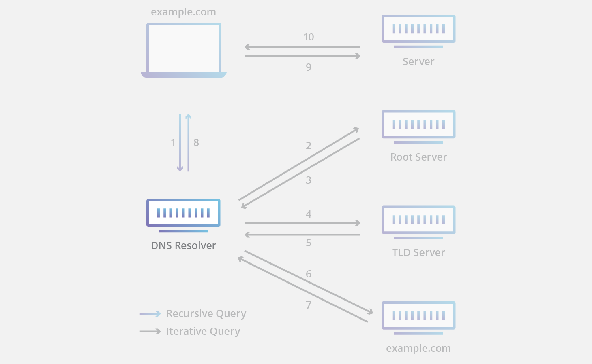

移动场景下DNS解析开销是整个网络请求中不可忽略的一部分，在弱网环境下，基于UDP的LocalDNS解析非常容易出现解析超时的问题，并且即使解析成功会消耗数百毫秒乃至更甚，对产品业务请求而言是非常不利的，它直接影响了客户的体验。


# 1、DNS

DNS（Domain Name System），即域名解析系统，DNS是互联网中的一项核心服务，是用于实现域名和IP地址相互映射的一个分布式数据库，它将简单明了的域名翻译成可由计算机识别的IP地址，使用户可以更快速便捷地访问互联。

互联网连通的是全球资源，单一的域名服务器不足以支撑全部的地址转换操作，因此全球有多套域名服务器相互配合使用。早在1983年互联网就开始采用层次树状结构的命名方法，并使用分布式的域名系统进行解析操作，这样既提升了域名解析的效率，同时也保障了域名解析的稳定性，如果系统中单个域名服务器出现故障，不会对整个DNS系统的正常运行造成太大影响。


## 1.1 DNS基础概念

DNS术语：

> **递归查询**：是指DNS服务器在收到用户发起的请求时，必须向用户返回一个准确的查询结果。如果DNS服务器本地没有存储与之对应的信息，则该服务器需要询问其他服务器，并将返回的查询结构提交给用户；
>
> **迭代查询**：是指DNS服务器在收到用户发起的请求时，并不直接回复查询结果，而是告诉另一台DNS服务器的地址，用户再向这台DNS服务器提交请求，这样依次反复，直到返回查询结果；
>
> **DNS缓存**：DNS缓存是将解析数据存储在靠近发起请求的客户端的位置，也可以说DNS数据是可以缓存在任意位置，最终目的是以此减少递归查询过程，可以更快的让用户获得请求结果；
>
> **TTL**：英文全称Time To Live ，这个值是告诉本地域名服务器，域名解析结果可缓存的最长时间，缓存时间到期后本地域名服务器则会删除该解析记录的数据，删除之后，如有用户请求域名，则会重新进行递归查询/迭代查询的过程；
>
> **DNS Query Flood Attack**：指域名查询攻击，攻击方法是通过操纵大量傀儡机器，发送海量的域名查询请求，当每秒域名查询请求次数超过DNS服务器可承载的能力时，则会造成解析域名超时从而直接影响业务的可用性。


### 1.1.1 域名分层结构

DNS是一种分层结构，在整个互联网中组成一个树状系统，当前任何一个连接在互联网上的主机或路由器，都有一个唯一的层次结构的名字，即域名。域名的结构由标号序列组成，各标号之间用点隔开，格式如下：

```
….三级域名.二级域名.顶级域名
```

各级域名由其上一级的域名管理机构管理，而最高级的顶级域名则由ICANN进行管理。其次，根域名通常使用"."来表示，其实际上也是由域名组成，目前全世界目前有13组域名根节点，由少数几个国家进行管理，而国内仅有几台根节点镜像

<div align="center"></div>

<div align="center"></div>


**示例：**

> <div align="center"></div>
>
> “.com”：是顶级域名；
>
> “aliyun.com”：是主域名（也可称托管一级域名），主要指企页名；
>
> “example.aliyun.com”：是子域名（也可称为托管二级域名）；
>
> “www.example.aliyun.com”：是子域名的子域（也可称为托管三级域名）；


### 1.1.2 域名服务器

互联网上的DNS域名服务器也是按照层次划分的，**每一个域名服务器都只对域名体系中的一部分进行管辖**，根据域名服务器所起的作用，可以把域名服务器划分为四种不同的类型：

> `根域名服务器`：即Root nameserver，根域名服务器是最高层次的域名服务器，也是最重要的域名服务器，根域名服务器知道所有顶级域名服务器的域名和 IP地址。如果 **本地域名服务器无法对域名进行解析，就首先求助于根域名服务器，并获取顶级域名服务器的IP地址**；
>
> `顶级域名服务器`：即TLD nameserver，顶级域名服务器负责管理在该服务器注册的所有二级域名，当收到 DNS 查询请求时，就给出相应的回答（可能是最后的结果，也可能是下一步需要查询的域名服务器的 IP 地址）。例如“www.example.com”，".com" 则是顶级域名服务器，在向它查询时，可以返回二级域名 “example.com” 所在的权威域名服务器地址；
>
> `权威域名服务器`：即Authoritative nameserver，在特定区域内具有唯一性，负责维护该区域内的域名与IP地址之间的对应关系。因此，当一个权限域名服务器还不能给出最后的查询回答时，就会告知发出查询请求的DNS客户，下一步应当找哪一个权威域名服务器，例如 云解析DNS；
>
> `本地域名服务器（递归解析器）`：即DNS resolver或Local DNS，本地域名服务器是响应来自客户端的递归请求，并最终跟踪直到获取到解析结果的DNS服务器，例如用户本机自动分配的DNS、运营商ISP分配的DNS、谷歌/114公共DNS等

<div align="center"></div>

各个域的分层上都设有各自的域名服务器，各层域名服务器都了解该层以下分层中所有域名服务器的IP地址。因此，它们从根域名服务器开始呈树状结构相互连接，由于所有域名服务器都了解根域名服务器的IP地址，所以若从根开始按照顺序追踪，可以访问世界上所有域名服务器的地址。


#### 1）递归解析器（LocalDNS）

<div align="center"></div>

递归解析器（也称为 DNS 解析器）是 DNS 查询中的第一站，作为**客户端与 DNS 域名服务器的中间人**。从 Web 客户端收到 DNS 查询后，递归解析器将使用缓存的数据进行响应，或者将向根域名服务器发送请求，接着向 TLD 域名服务器发送另一个请求，然后向权威性域名服务器发送最后一个请求。收到来自包含已请求 IP 地址的权威性域名服务器的响应后，递归解析器将向客户端发送响应。

在此过程中，递归解析器（localDNS）将缓存从权威性域名服务器收到的信息。当一个客户端请求的域名 IP 地址是另一个客户端最近请求的 IP 地址时，解析器可绕过与域名服务器进行通信的过程，并仅从第二个客户端的缓存中为第一个客户端提供所请求的记录。


#### 2）根域名服务器（Root Server）

<div align="center"></div>

每个递归解析器都知道 13 个 DNS 根域名服务器，它们是递归解析器搜寻 DNS 记录的第一站。根服务器接受包含域名的递归解析器的查询，根域名服务器根据该域的扩展名（.com、.net、.org 等），通过将递归解析器定向到 TLD 域名服务器进行响应，目前根域名服务器由一家名为 Internet 名称与数字地址分配机构（ICANN）的非营利组织进行监督。

注意：尽管有 13 个根域名服务器，但这并不意味着根域名服务器系统中只有 13 台计算机，即根域名服务器有 13 种类型，但在世界各地每个类型都有多个副本，它们使用 Anycast 路由来提供快速响应。


#### 3）TLD 域名服务器

<div align="center"></div>

TLD 域名服务器 **维护共享通用域扩展名的所有域名的信息**，例如： .com、.net 或 url 中最后一个点之后的任何内容；.com TLD 域名服务器包含以“.com”结尾的每个网站的信息。如果用户正在搜索 google.com，则在收到来自根域名服务器的响应后，递归解析器将向 .com TLD 域名服务器发送查询，后者将通过针对该域的 `权威性域名服务器` 进行响应。

TLD 域名服务器的管理由 Internet 编号分配机构（IANA）加以处理，其为 ICANN 的一个分支机构，而后IANA 将 TLD 服务器分为两个主要组：

> **通用顶级域**：这些是非特定国家/地区的域，一些最知名的通用 TLD 包括 .com、.org、.net、.edu 和 .gov；
>
> **国家/地区代码顶级域**：这些包括特定于某个国家/地区或州的任何域。例如，uk、.us、.ru 和 .jp 等；

对于基础设施域实际上存在第三个类别，但该类别几乎从不使用，此类别是为 .arpa 域创建的，该域是在创建新式 DNS 时使用的过渡域；


#### 4）权威性域名服务器

<div align="center"></div>

当递归解析器收到来自 TLD 域名服务器的响应时，该响应会将解析器定向到权威性域名服务器，而权威性域名服务器通常是解析器查找 IP 地址过程中的最后一步。

权威名称服务器包含特定于其所服务的域名的信息（例如 google.com），并且它可为递归解析器提供在 **[DNS A 记录](https://www.cloudflare.com/zh-cn/learning/dns/dns-records/dns-a-record/)** 中找到的服务器的 IP 地址，或者如果该域具有 **CNAME 记录**（别名），它将为递归解析器提供一个别名域，这时递归解析器将必须执行全新 DNS 查找，以便从权威性域名服务器获取记录（通常为包含 IP 地址的 A 记录）。


### 1.1.3 DNS域名解析记录方式

DNS是互联网中一项重要的基础服务，它将简单易记的域名转换成可由计算机识别的IP地址，以便客户端对服务器的正常访问，而由DNS构建起的域名与IP地址之间的对应关系，称之为 **“DNS记录”**（record）。通过设置不同的解析记录，可以实现对主机名不同的解析效果，从而满足不同场景下的域名解析需求。常见的域名解析记录，主要有以下几种类型：

> `A记录`：A代表Address，用来指定域名对应的ip，例如将 www.hello.com 指定到 113.112.3.xxx，A记录可以将多个域名解析到一个ip地址，但是不能将一个域名解析到多个ip地址；
>
> `MIX记录`：Mail Exchange，记录是邮件交换记录，主要用于邮箱解析，在邮件系统发送邮件时根据收信人的地址后缀进行邮件服务器的定位。MX记录允许设置一个优先级，当多个邮件服务器可用时，会根据该值决定投递邮件的服务器。
>
> MX记录的权重对 Mail 服务非常重要，当发送邮件时，Mail 服务器先对域名进行解析，查找 MX记录。先找权重数最小的服务器（比如说是 10），如果能连通，那么就将服务器发送过去；如果无法连通 MX 记录为 10 的服务器，才将邮件发送到权重更高的 mail 服务器上。
>
> `CNAME记录`：Canonical Name，即别名解析，是主机名到主机名的映射，当需要将域名指向另一个域名，再由另一个域名提供 IP 地址，就需要添加 CNAME 记录，最常用到 CNAME的场景包括做 CDN、企业邮箱、全局流量管理等。其次，别名解析就是可以为一个域名设置一个或者多个别名，如将aaa.com解析到bbb.net、将ccc.com也解析到bbb.net，其中bbb.net分别是aaa.com和ccc.com的别名；
>
> 与A记录不同的是，**CNAME别名记录设置的值不是一个固定的IP，而是主机的别名地址**。别名解析可以提供更大的灵活性，便于统一管理。比如：当主机因某种因素的影响需要更换IP时，如果域名做了CNAME记录，就可以同时更新别名的解析指向，不需要进行新的解析操作。
>
> `NS记录`：为某个域名**指定DNS解析服务器**，也就是这个域名由指定的IP地址的DNS服务器解析。NS记录中的IP即为该DNS服务器的IP地址，大多数域名注册商默认用自己的NS服务器来解析用户的DNS记录，且DNS服务器NS记录地址一般以以下的形式出现：ns1.domain.com、ns2.domain.com等；
>
> `AAAA记录`：AAAA记录是用来将**域名解析到IPv6地址的DNS记录**，即用户可以将一个域名解析到IPv6地址上，也可以将子域名解析到IPv6地址上。国内大多数IDC不支持AAAA记录的解析，因此如果想进行AAAA记录解析，则需对域名NS记录设置一些专业的域名解析服务商，由他们提供AAAA记录的设置。
>
> `TXT记录`：为某个主机名或域名设置说明，如可以为ucloud.cn是指TXT记录为“中立安全科信赖”这样的说明；
>
> `SRV记录`：即服务定位（SRV）资源记录，用于定义提供特定服务的服务器的位置，如主机（hostname），端口（port number）等；
>
> `RTP记录`：PTR是pointer 的简写，即 **“反向DNS”**，domain name pointer，可以粗略的理解为DNS反向，是一个指针记录，用于将一个IP地址映射到对应的主机名，也可以看成是A记录的反向，即通过IP访问域名；
>
> `URL转发`：是指通过服务器的特殊设置，将当前访问的域名指向另一个指定的网络地址。根据目标地址的隐藏与否，URL转发可以分为显性URL和隐性URL两种
>
> * 显性URL：将域名指向一个http（s)协议地址，访问域名时，自动跳转至目标地址，地址栏显示为目标网站地址；
> * 隐性URL：与显性URL类似，但隐性转发会隐藏真实的目标地址，地址栏中显示为仍为此前输入的地址


### 1.1.4 DNS缓存

一次完整的 DNS 查询过程需要访问多台 DNS 服务器才能得到最终的结果，这肯定会带来一定的时延，因此为了改善时延，**DNS 服务并不是每次请求都要去访问 DNS 服务器，而是访问过一次后将 DNS 记录缓存在本地**。具体来说，DNS 服务是一个多级的缓存：

> `浏览器缓存` -> `操作系统缓存` -> `路由器缓存` -> `local DNS 缓存` -> `DNS 查询`

缓存并不是永久有效的，前面提到过 DNS 应答报文中的 TTL（Time to Live）值，它决定了 DNS 记录在缓存中的有效时间。需要注意的是，TTL 只是一个参考值，实际使用的缓存有效时间不一定等于该值，甚至是固定值，而这也引发 DNS 缓存也存在一些“副作用”。


## 1.2 DNS解析过程


**示例1：**

<div align="center"></div>

其完整的DNS解析过程有以下几个步骤：

> 1）**查看浏览器缓存**：当用户通过浏览器访问某域名时，浏览器首先会在自己的缓存中查找是否有该域名对应的 IP 地址（若曾经访问过该域名且没有清空缓存便存在）；
>
> 2）**查看系统缓存**：当浏览器缓存中无域名对应 IP， 则会自动检查用户计算机系统 Hosts 文件 DNS 缓存是否有该域名对应 IP；
>
> 3）**查看路由器缓存**：当浏览器及系统缓存中均无域名对应 IP， 则进入路由器缓存中检查，以上三步均为 **客服端的 DNS 缓存**；
>
> 4）**查看ISP DNS 缓存**：当在用户客服端查找不到域名对应 IP 地址，则将进入 ISP DNS 缓存中进行查询。比如：如果用的是电信的网络，则会进入电信的 DNS 缓存服务器中进行查找；
>
> 5）**询问根域名服务器**：当以上均未完成，则进入根服务器进行查询。全球仅有 13 台根域名服务器，1 个主根域名服务器，其余 12 为辅根域名服务器。根域名收到请求后会查看区域文件记录，若无，则将其管辖范围内顶级域名（如.com、.cn等）服务器 IP 告诉本地 DNS 服务器；
>
> 6）**询问顶级域名服务器**：顶级域名服务器收到请求后查看区域文件记录，若无记录，则将其管辖范围内权威域名服务器的 IP 地址告诉本地 DNS 服务器；
>
> 7）**询问权威域名（主域名）服务器**：权威域名服务器接受到请求后查询自己的缓存，如果没有，则进入下一级域名服务器进行查找，并重复该步骤直至找到正确记录；
>
> 8）**保存结果至缓存**：本地域名服务器把返回的结果保存到缓存，以备下一次使用，同时将该结果反馈给客户端，客户端通过这个 IP 地址即可访问目标Web服务器。
>
> 至此，DNS递归查询的整个过程结束。


**示例2：**

<div align="center"></div>

DNS查询的结果通常会在本地域名服务器中进行缓存，如果本地域名服务器中有缓存的情况下，则会跳过如下DNS查询步骤，很快返回解析结果。下面的示例则概述了本地域名服务器没有缓存的情况下，DNS查询所需的8个步骤：

> 1）用户在Web浏览器中输入“example.com”， 则由本地域名服务器开始进行递归查询；
>
> 2）本地域名服务器采用迭代查询的方法，向根域名服务器进行查询；
>
> 3）根域名服务器告诉本地域名服务器，下一步应该查询的顶级域名服务器.com TLD的IP地址；
>
> 4）本地域名服务器向顶级域名服务器.com TLD进行查询；
>
> 5）.com TLD服务器告诉本地域名服务器，下一步查询example.com权威域名服务器的IP地址；
>
> 6）本地域名服务器向example.com权威域名服务器发送查询；
>
> 7）example.com权威域名服务器告诉本地域名服务器所查询的主机IP地址；
>
> 8）本地域名服务器最后把查询的IP地址响应给web浏览器，且一旦DNS查询的8个步骤返回了example.com的IP地址，浏览器就能够发出对网页的请求：
>
> 9）浏览器向IP地址发出HTTP请求；
>
> 10）该IP处的web服务器返回要在浏览器中呈现的网页


**示例3：**

<div align="center"></div>

> 1）浏览器中输入 www.linkedkeeper.com，发出解析请求；
>
> 2）本机的域名解析器 resolver 程序查询本地缓存和 host 文件中是否为域名的映射关系，如果有则调用这个 IP 地址映射，完成解析；
>
> 3）如果 hosts 与本地解析器缓存都没有相应的网址映射关系，则本地解析器会向 TCP/IP 参数中设置的首选 DNS 服务器（ Local DNS 服务器）发起一个递归的查询请求；
>
> 4）服务器收到查询时，如果要查询的域名由本机负责解析，则返回解析结果给客户机，完成域名解析，此解析具有权威性。如果要查询的域名，不由 Local DNS 服务器解析，但该服务器已缓存了此网址映射关系，则调用这个 IP 地址映射，完成域名解析，此解析不具有权威性；
>
> 5）如果 Local DNS 服务器本地区域文件与缓存解析都失效，则根据 Local DNS 服务器的设置（是否递归）进行查询，如果未用开启模式，Local DNS 就把请求发至13台 Root DNS。如果用的是递归模式，此 DNS 服务器就会把请求转发至上一级 DNS 服务器，由上一级服务器进行解析，上一级服务器如果不能解析，或找根 DNS 或把转请求转至上上级，以此循环；
>
> 6）Root DNS 服务器收到请求后会判断这个域名是谁来授权管理，并会返回一个负责该顶级域名服务器的一个 IP；
>
> 7）Local DNS 服务器收到 IP 信息后，将会联系负责 .com 域的这台服务器；
>
> 8）负责 .com 域的服务器收到请求后，如果自己无法解析，它就会找一个管理 .com 域的下一级 DNS 服务器地址给本地 DNS 服务器；
>
> 9）当 Local DNS 服务器收到这个地址后，就会找 linkedkeeper.com 域服务器，10、11重复上面的动作，进行查询；
>
> 10）最后 www.linkedkeeper.com 返回需要解析的域名的 IP 地址给 Local DNS 服务器；
>
> 11）Local DNS 服务器缓存这个解析结果（同时也会缓存，6、8、10返回的结果）；
>
> 12）Local DNS 服务器同时将结果返回给本机域名解析器；
>
> 13）本机缓存解析结果；
>
> 14）本机解析器将结果返回给浏览器；
>
> 15）浏览器通过返回的 IP 地址发起请求；

由此可见，客户端到 Local DNS 服务器，Local DNS 与上级 DNS 服务器之间属于递归查询；DNS 服务器与根 DNS 服务器之前属于迭代查询。

实际环境中，因为采用递归模式会导致 DNS 服务器流量很大，所以现在大多数的 DNS 都是迭代模式。


## 1.3 DNS存在的问题


### 1.3.1 运营商劫持（Local DNS劫持）

**DNS劫持** 就是通过劫持了 DNS 服务器，通过某些手段取得某域名的解析记录控制权，进而修改此域名的解析结果，导致对该域名的访问由原 IP 地址转入到修改后的指定 IP，其结果就是对特定的网址不能访问或访问的是假网址，从而实现窃取资料或者破坏原有正常服务的目的。

<div align="center"></div>


### 1.3.2 DNS域名缓存

在开发中有时候会遇到这样的情况：你是一个联通用户，你在手机浏览器中输入baidu.com，由一个LocalDNS服务器像百度权威服务器查应该访问哪一台服务器，权威把结果返回给LocalDNS服务器，localDNS服务器返回结果给用户。

如果当 LocalDNS 缓存的有 baidu.com 对应的结果，那么就不会像百度的权威服务器查询其对应的ip，而是直接返回缓存中的结果。如果此时权威服务器中的baidu.com对应的ip发生了变化，LocalDNS没有及时更新，这样会导致用户访问不到服务器。

<div align="center"></div>


### 1.3.3 转发解析

一般情况下，当你用手机访问baidu.com时，会到当前运营商的DNS服务器查，然后运营商的DNS服务再去百度权威服务器去查，最终把权威服务器中的正确ip返回。

上面是正常的情况，但是如果当前运营商（比如联通）的LocalDNS不访问百度权威DNS服务器，而是直接访问了其它运营商（比如电信）的LocalDNS服务器，有些小的运营商就是通过这样做来降低成本。如果电信的LocalDNS对非自家ip的访问限了速，那么很明显会影响你的DNS解析时间。

<div align="center"></div>


# 2、httpDNS

HTTPDNS 利用 HTTP 协议与 DNS 服务器交互，代替了传统的基于 UDP 协议的 DNS 交互，绕开了运营商的 Local DNS，能够有效避开 DNS 层面的拦截和故障，比如 `域名污染`、`域名递归服务器缓存不刷新`、`运营商域名劫持`等问题，提高域名解析效率。

另外，由于 DNS 服务器端获取的是真实客户端 IP 而非 Local DNS 的 IP，能够精确定位客户端地理位置、运营商信息，从而有效改进调度精确性，提高分发精准度，解决用户 DNS 设置错误造成的访问时延加大，响应过慢的问题。

<div align="center"></div>

<div align="center"></div>


httpDNS特性：

> **防止域名劫持**：由于 HttpDns 是通过 IP 直接请求 HTTP 获取服务器 A 记录地址，不存在向本地运营商询问 domain 解析过程，所以从根本避免了劫持问题；
>
> **精准调度**：HTTPDNS能够直接获取到用户的IP地址，从而实现精确定位与导流
>
> **用户连接失败率下降**：通过算法降低以往失败率过高的服务器排序，通过时间近期访问过的数据提高服务器排序，通过历史访问成功记录提高服务器排序。


## 2.1 httpDNS原理

常规域名解析是通过 DNS 协议进行解析的，其最终结果就是获取域名对应的真实服务器地址，无法绕开 DNS 拦截和故障问题。

而 HTTPDNS 则是以 HTTP 的方式代替传统 DNS 协议传递解析结果，能够有效避开 DNS 层面的拦截和故障。即客户端直接访问 HTTPDNS 接口（直接通过ip访问，而不是通过域名访问），根据客户端源IP地址，查询 CDN 内部调度策略，通过响应请求的方式，获取域名的最优节点 IP，缓存到本地（基于容灾考虑，建议保留使用运营商 LocalDNS 解析域名的方式作为备选）。

客户端获取到业务 IP 后，就向直接往此 IP 发送业务协议请求，以 HTTP 请求为例，通过在 header 中指定 host 字段，向 HTTPDNS 返回的 IP 发送标准的 HTTP 请求即可。


## 2.2 httpDNS解决的问题

**运营商域名劫持**

> 运营商为了减少跨网结算成本，会在本地运营商网内搭建内容缓存服务器。本地本网用户访问时，运营商把域名强行指向内容缓存服务器的 IP 地址，从而把本地本网流量完全留在了本地，减少了跨网访问。为了获取更多利益，部分运营商们还会将对应解析内容替换成第三方广告联盟的广告或是钓鱼网站等。


**转发解析请求**

> 运营商的 LocalDNS 会存在解析转发的情况，解析转发是指运营商自身不进行域名递归解析，而是把域名解析请求转发到其它运营商的递归 DNS 上。
>
> 客户使用 CDN 加速服务后，当解析被运营商转发， DNS服务端收到的域名解析请求的来源 IP 就成了其它运营商或其他地区的 IP （DNS 服务端会根据来源 IP 进行解析调度），那么用户流量就被导向了错误的节点，造成跨域、跨省、跨运营商访问后果：网站访问缓慢甚至无法访问


**DNS 多出口**

> DNS 多出口，是指运营商的 LocalDNS 按照标准 DNS 协议进行递归查询时，由于存在网络多出口且配置了目标路由 NAT 的情况，最终导致 LocalDNS进行递归解析的出口 IP 非本网 IP 地址。DNS 多出口的情况会造成调度系统收到的域名解析请求来源 IP 变成其它运营商的 IP ，最终引发域名解析错误、流量跨网。


**DNS 攻击**

> 当前网络攻击越来越激烈，从历史来看，每次攻击的影响范围都很大，主要攻击类型：
>
> ① 针对 **公网 dns 服务的攻击**，这个攻击影响的是所有解析用户，而且一旦受攻击，意味着所有用户的域名解析都会出问题，大家上网都会出现故障；
>
> ② 针对 **特定 dns 服务的攻击**，通常为 ddos 攻击，网宿平台可应对，其余类型攻击则影响网宿平台该 DNS 服务的所有用户；
>
> 由于 CDN 加速是通过 CNAME 的方式别名到网宿入口，无论是公网 DNS 受到攻击还是网宿 DNS 受到攻击，都将对客户的服务造成严重影响，甚者直接导致区域服务中断。


## 2.3 应用场景

**示例1**：解决域名劫持问题

<div align="center"></div>


**示例2：**解决视频直播推拉流慢、卡顿问题

<div align="center"></div>


**示例3：**移动 App 基于 SDK 快速开发，使用 HTTP/HTTPS 协议将域名解析请求发送到腾讯云的 HTTPDNS 服务器，以获得准确的解析结果，且支持多种加密方式，从而保证信息传输安全。在异常情况时，仍旧可以切换为 DNS 协议向运营商 Local DNS 发起解析请求。对于域名在 DNSPod 解析的域名，还可以实现数据联动，做到域名解析调整秒级生效。

<div align="center"></div>


**示例4：**百度移动域名解析服务HTTPDNS使用HTTP/HTTPS协议代将移动端域名解析请求直接发送到百度智能云的DNS服务器，替代了基于DNS协议向运营商Local DNS发起解析请求的传统方式，能够避免Local DNS造成的域名劫持和调度不精准问题。

<div align="center"></div>


# 附录


1. [DNS访问原理只需9个步骤](https://blog.51cto.com/u_14279308/2481205)
2. [一文读懂DNS原理及解析过程](https://www.sfn.cn/news/technology/detail/222.html?navId=22)
3. [全面理解DNS及HTTPDNS](https://juejin.cn/post/6844903987796246542#heading-17)
4. [HttpDNS与传统DNS的区别](https://blog.csdn.net/sanmi8276/article/details/110387143)
5. [阿里云DNS基本概念](https://help.aliyun.com/document_detail/102237.html)
6. [DNS服务器类型](https://www.cloudflare.com/zh-cn/learning/dns/dns-server-types/)
7. [HttpDNS原理是什么](http://www.linkedkeeper.com/171.html)
8. [dns域名解析分类（DNS域名解析）](https://www.kuaimingwang.com/wenzhang/88484.html)
9. [计算机网络 | 图解 DNS & HTTPDNS 原理](https://juejin.cn/post/6884183177926033416)
10. [HttpDNS服务详解](https://cloud.tencent.com/developer/article/1035562)

