本小节主要介绍视频合成以及播放器相关基础概念和流程，视音频技术主要包含以下几点：`封装技术`、`视频压缩编码技术` 和 `音频压缩编码技术`，如果考虑到网络传输的话，还包括 `流媒体协议技术`

​     

# 1、概览 - 视频生成&播放流程

​     

## 1.1 音视频数据加工流程 

如下图：

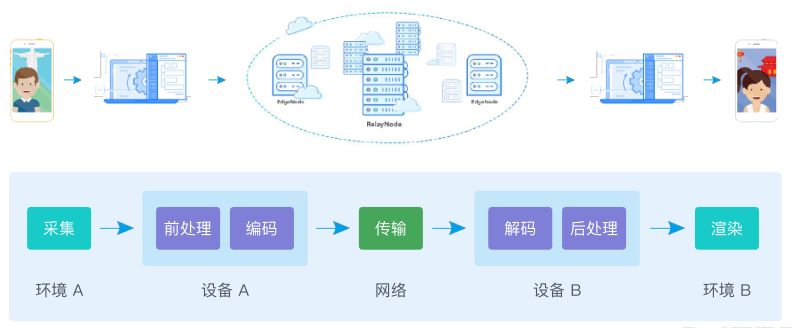

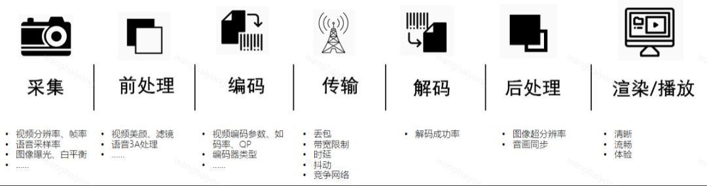

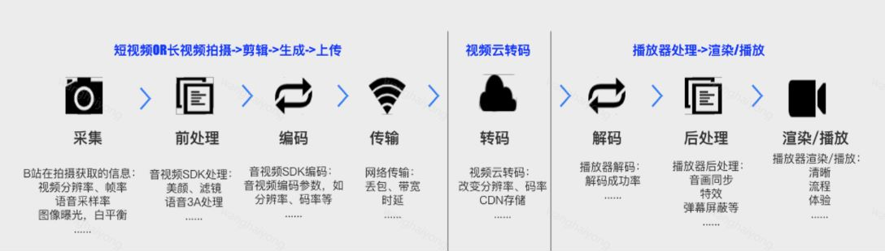

​     

## 1.2 音视频编码流程

1）`纹理（Texture）`： 指的是一张表示物体表面细节的位图

* 视频纹理：是一种介于**图像和视频之间的媒体**，它对一段长度有限的视频进行分析，通过不断的重复原始视频中的某些片断，得到无限连续的视频 

2）`PCM`： 脉冲编码调制 (Pulse Code Modulation)

* 在PCM 过程中，将输入的模拟信号进行采样、量化和编码，用二进制进行编码的数来代表模拟信号的幅度 ；
* 接收端再将这些编码还原为原来的模拟信号的过程

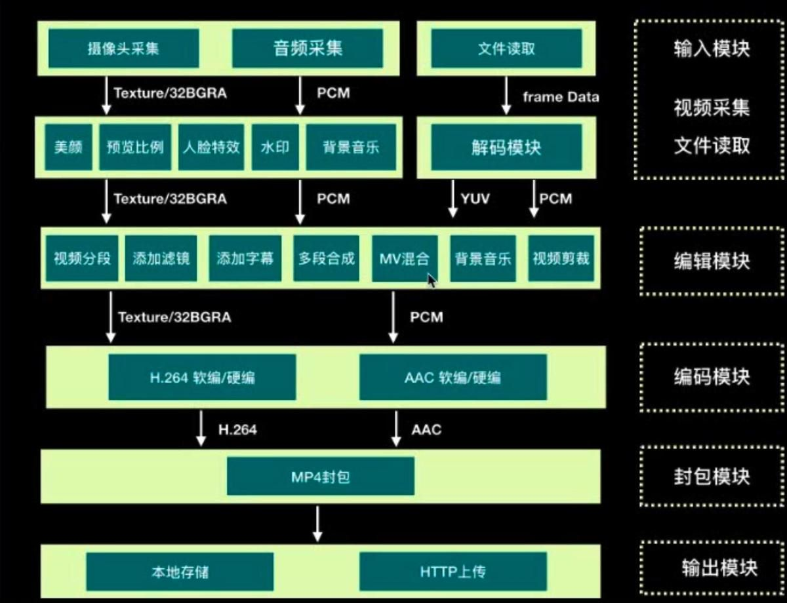

​         

## 1.3 音视频开发基础流程

`采集`：它解决的是，数据从哪里来的问题

`渲染`：它解决的是，数据怎么展现的问题

`处理`：它解决的是，数据怎么加工的问题

`传输`：它解决的是，数据怎么共享的问题 

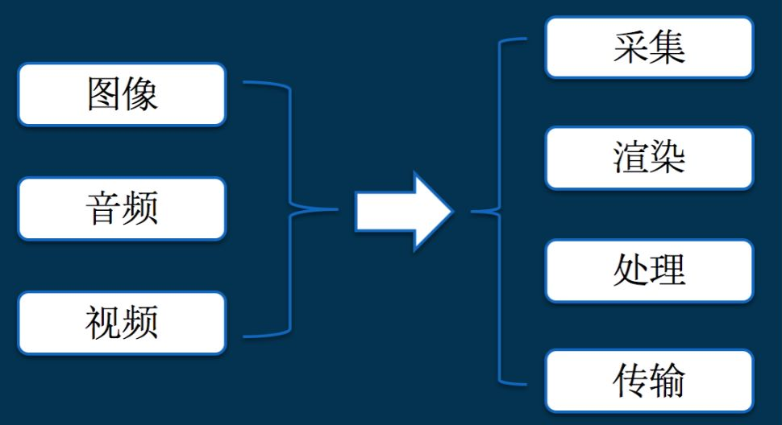

​       

# 2、采集 - 音视频采集

采集，它解决的是，数据从哪里来的问题，那么，数据究竟从哪里来的呢 ？ 

​        

## 2.1 音频采集

**音频采集**：模拟声音转换为计算机识别的数字信号的过程 

音频采集涉及到以下几点：

* 检测麦克风是否可以使用； 
* 需要检测手机对某个音频采样率的支持； 
* 在一些情况下需要对音频进行回声消除处理； 
* 音频采集时设置正确的缓冲区大小 

​     

在 Android 系统中，一般使用 **AudioRecord** 或者 **MediaRecord** 来采集音频

* **AudioRecord**： 是一个比较偏底层的 API,它可以获取到一帧帧 PCM 数据，之后可以对这些数据进行处理；
*  **MediaRecord**： 是基于 AudioRecorder 的 API ( 最终还是会创建AudioRecord 用来与 AudioFlinger 进行交互) ，它可以直接将采集到的音频数据转化为执行的编码格式，并保存。

   

## 2.2 视频采集

**视频采集**：将模拟摄像机、录像机、LD视盘机、电视机输出的视频信号，通过专用的模拟、数字转换设备，转换为二进制数字信息的过程

视频采集涉及到以下几点：

* 检测摄像头是否可以使用； 
* 摄像头采集到的图像是横向的，需要对采集到的图像进行一定的旋转后再进行显示； 
* 摄像头采集时有一系列的图像大小可以选择，当采集的图像大小和手机屏幕大小比例不一致时，需要进行特殊处理； 
* Android 手机摄像头有一系列的状态，需要在正确的状态下才能对摄像头进行相应的操作。 Android 手机摄像头的很多参数存在兼容性问题，需要较好地处理这些兼容性的问题；

  

在 Android 系统下有两套 API 可以进行视频采集，它们是 **Camera** 和 **Camera2** 

> Camera是以前老的 API ，从 Android 5.0(21) 之后就已经放弃了。和音频一样，也有高层和低层的 API，高层就是 Camera 和 MediaRecorder，可以快速实现编码，低层就是直接使用 Camera，然后将采集的数据进行滤镜、降噪等前处理，处理完成后由 MediaCodec 进行硬件编码，最后采用 MediaMuxer 生成最终的视频文件。

   

## 2.3 Q&A

音视频开发中 音视频采集场景的Q&A：

----

Q：系统的摄像头采集接口是什么，怎么用 ？

A：比如：Windows：DirectShow，Linux：V4L2，Android：Camera，iOS：AVCaptureSession 等

-----

Q：系统的摄像头采集的参数怎么配置，都是什么含义 ？

A：比如：分辨率、帧率、预览方向、对焦、闪光灯 等

----

Q：系统的摄像头输出的图像/视频数据，是什么格式，不同格式有什么区别 ？

A：比如：

* 图片：JPEG
* 视频数据：NV21，NV12，I420 

-----

Q：系统的麦克风采集接口是什么，怎么用 ？

A：比如：

* Windows：DirectShow
* Linux：ALSA & OSS
* Android：AudioRecord
* iOS：Audio Unit 

----

Q：系统的麦克风采集参数怎么配置，都是什么含义 ？

A：比如：采样率，通道号，位宽 等

---

Q：系统的麦克风输出的音频数据，是什么格式？
A：比如：PCM 

  

# 3、处理 - 音视频处理、编码&混合

处理，它解决的是，数据怎么加工的问题，那么数据究竟可以怎么加工呢 ？

首先，我们看看图像/音视频的数据可以做哪些加工 ？

> **音频处理**：可以对音频的原始流做处理，如降噪、回音、以及各种 filter 效果；
>
> **视频处理**：现在抖音、美图秀秀等，在拍摄、视频处理方面，都提供了很多视频滤镜，而且还有各种贴纸、场景、人脸识别、特效、添加水印等

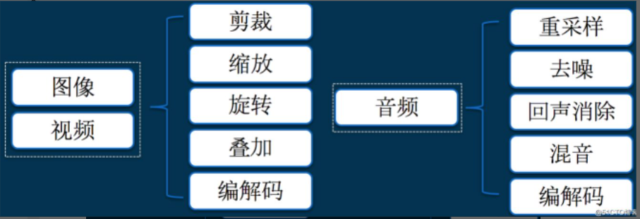

​         

其实无论在哪个平台，图像和音视频的加工，除了系统的 API，大多数都会依赖一些跨平台的第三方库的，通过掌握这些第三方库的原理和使用方法，基本上就可以满足日常音视频处理工作了，这些库包括但不限于：

> `图像处理`：OpenGL，OpenCV，libyuv，ffmpeg 等
>
> `视频编解码`：x264，OpenH264，ffmpeg 等
>
> `音频处理`：speexdsp，ffmpeg 等
>
> `音频编解码`：libfaac，opus，speex，ffmpeg 等

​    

## 3.1 视频编码

**视频编码** 的主要作用是 **将视频像素数据（RGB、YUV等）压缩成为视频码流，从而降低视频的数据量**。如果视频不经过压缩编码的话，体积通常是非常大的，一部电影可能就要上百G的空间。视频码流的数据量占了视音频总数据量的绝大部分，因此高效率的视频编码在同等的码率下，可以获得更高的视频质量。

视频中图像编码的主要依赖：

> `帧内的图像压缩编码`： 即对于图片中相同像素的压缩
>
> `帧间的数据压缩编码`：主要依赖连续帧之间具有极高的相似性的原理，比如一段视频有十几秒都是不动的或者有50%的画面都是不变的，那么这块存储就可以节省了  

​    

**视频压缩**的核心原理就是**将多张图像进行编码后生产成一段一段的 GOP ( Group of Pictures ) **， 解码器在播放时则是读取一段一段的GOP进行解码后读取画面再渲染显示。一组GOP中的帧分为三类（有些视频只有两类，没有B帧），分别是：

> **I帧**： 是自带全部信息的独立帧，是最完整的画面（占用的空间最大），无需参考其它图像便可独立进行解码。通常情况下，一个GOP视频序列中的第一个帧，始终都是I帧；
>
> **P帧**： “帧间预测编码帧”，需要参考前面的I帧和/或P帧的不同部分，才能进行编码，其次P帧对前面的P和I参考帧有依赖性，也就是视频中运动的部分。P帧压缩率比较高，占用的空间较小；
>
> 
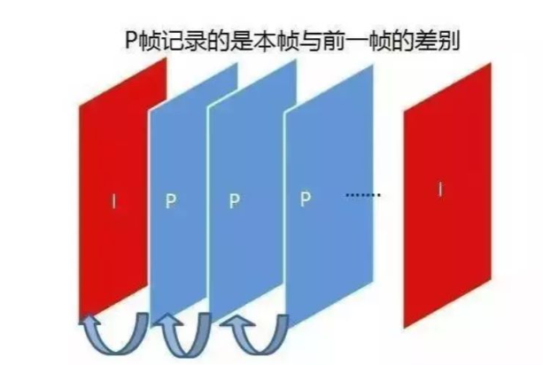

>
> **B帧**： “双向预测编码帧”，以前帧/后帧作为参考帧，即不仅参考前面，还参考后面的帧，所以它的压缩率最高，可以达到200:1。不过，因为依赖后面的帧，所以不适合实时传输（ 例如视频会议 ）
>
> 
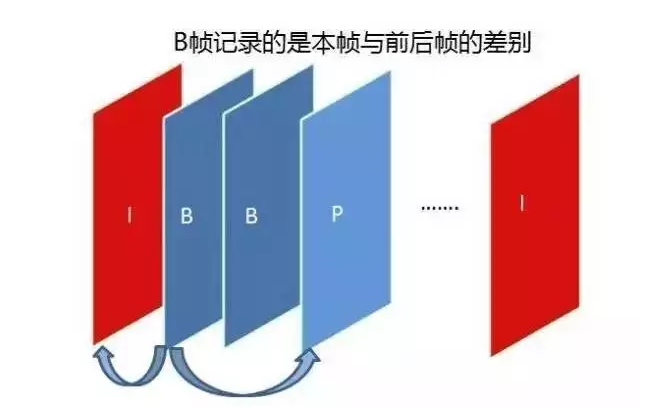

**注**：更多 [I/P/B帧概念参考>>](音视频学习/1.音视频基础.md)  

​     

视频编码目前主流的标准有国际电联的 `H.261`、`H.263`、`H.264`、`H.265`，运动静止图像专家组的 `M-JPEG` 和国际标准化组织运动图像专家组的 `MPEG系列` 标准。

视频传输中主要编解码标准如下：

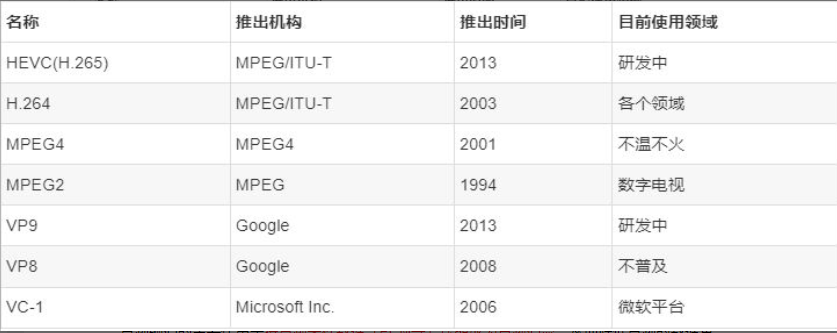

> **运动静止图像专家组的 M-JPEG**
>
> * M-JPEG是一种图像压缩编码标准，是Motion-JPEG的简称，JPEG标准主要是 **用来处理静止图像**，而M-JPEG **把运动的视频序列作为连续的静止图像来处理**，这种压缩方式单独完整地压缩每一帧，在编辑过程中可随机存储每一帧，可进行精确到帧的编辑，M-JPEG只对帧内的空间冗余进行压缩，不对帧间的时间冗余进行压缩，故压缩效率不高。
>
> **国际标准化组织（ISO）运动图像专家组的MPEG系列标准**
>
> * MPEG标准主要有5个：`MPEG-1`、`MPEG-2`、`MPEG-4`、`MPEG-7` 及 `MPEG-21` 等，MPEG标准的视频压缩编码技术主要 **利用了具有运动补偿的帧间压缩编码技术以减小时间冗余度，利用DCT技术以减小图像的空间冗余度，利用熵编码则在信息表示方面减小了统计冗余度**。这几种技术的综合运用，大大增强了压缩性能。
>
> **国际电联（ITU-T）的 H.26X系列标准**
>
> * `H.261`：第一个实用的数字视频解码标准，采用的压缩算法是运动补偿帧间预测与分块DCT相结合的混合编码，其运动补偿使用用全像素精度和环路滤波，支持CIF和QCIF两种分辨率；
> * `H.263`：H.263与H.261编码算法一样，但是做了一点改善，使得H.263标准在低码率下能够提供比H.261更好的图像效果，其运动补偿使用半像素精度，支持 CIF、QCIF 、SQCIF、4CIF和16CIF 五种分辨率；
> * `H.264/AVC`：是由两个组织ISO和ITU-T联合组建的联合视频组（JVT）共同制定的新数字视频编码标准，所以它既是ITU-T的H.264，又是ISO/IEC的MPEG-4高级视频编码（Advanced Video Coding，AVC）的第10部分。因此，不论是MPEG-4 AVC、MPEG-4 Part 10，还是ISO/IEC 14496-10，都是指H.264。H.264是基于传统框架的混合编码系统，做了局部优化，注重编码效率和可靠性；
> * `H.265/HEVC`：高效率视频编码，是新一代视频编码技术。它围绕现有视频编码标准H.264，保留原来的某些技术，使用新技术对某些方面进行改进优化，如码流、编码质量、延时等，提高压缩效率、增强鲁棒性和错误恢复能力、减少实时的时延、降低复杂度等。

​       

## 3.2 音频编码

音频编码的主要作用是 **将音频采样数据（PCM等）压缩成为音频码流**，从而降低音频的数据量，偏于存储和传输，常见的音频编码有 `WAV`、`MIDI`、`MP3`、`WMA`、`AAC`、`Ogg` 等。 相比于 PCM 格式而言，这些格式对声音数据进行了压缩处理，可以降低传输带宽。对音频进行编码也可以分为软编和硬编两种

> 软编：则下载相应的编码库，写好相应的 JNI，然后传入数据进行编码
>
> 硬编：则是使用 Android 自身提供的 MediaCodec

**注**：其中硬编码和软编码的区别是，软编码可以在运行时确定、修改，而硬编码是不能够改变的

​    

但是一般情况下音频的数据量要远小于视频的数据量，因而即使使用稍微落后的音频编码标准，而导致音频数据量有所增加，也不会对视音频的总数据量产生太大的影响。高效率的音频编码在同等的码率下，可以获得更高的音质。

常见的音频编解码标准：

> **MP3（MPEG-1 audio layer 3）**
>
> * 一种音频压缩技术，它被设计用来大幅度地降低音频数据量，利用MPEG Audio Layer 3的技术，将音乐以1:10甚至1:12的压缩率，压缩成容量较小的文件，而对于大多数用户来说重放的音质与最初的不压缩音频相比没有明显的下降，它是 **利用人耳对高频声音信号不敏感的特性，将时域波形信号转换成频域信号，并划分成多个频段，对不同的频段使用不同的压缩率，对高频加大压缩比（甚至忽略信号），对低频信号使用小压缩比，保证信号不失真**，这样就相当于抛弃人耳基本听不到的高频声音，只保留能听到的低频部分，从而对音频进行一定压缩，此外MP3属于有损压缩的文件格式。
>
> **AAC**
>
> * Advanced Audio Coding的缩写，最初是基于MPEG-2的音频编码技术，MPEG-4出现后，AAC重新集成了其特性，且加入了SBR技术和PS技术，为了区别于传统的 MPEG-2 AAC，又称为MPEG-4 AAC。AAC是一种专为声音数据设计的文件压缩格式，相较MP3，AAC格式的音质更佳，文件更小，但是AAC是一种有损压缩格式，随着大容量设备的出现，其优势将越来越小。AAC格式主要分为两种：ADIF、ADTS
>   * `ADIF`：Audio Data Interchange Format **音频数据交换格式**，这种格式的特征是可以确定的找到这个音频数据的开始，不需进行在音频数据流中间开始的解码，即它的解码必须在明确定义的开始处进行。故这种格式常用在磁盘文件中；
>   * `ADTS`：Audio Data Transport Stream **音频数据传输流**，这种格式的特征是它是一个有同步字的比特流，解码可以在这个流中任何位置开始。它的特征类似于mp3数据流格式，可以用于广播电视
>
> **WMA**
>
> * Windows Media Audio的缩写，是微软公司开发的一系列音频编解码器，也指相应的数字音频编码格式， 一些使用Windows Media Audio编码格式编码其所有内容的纯音频ASF文件也使用WMA作为扩展名，其特点是支持加密，非法拷贝到本地是无法播放的。WMA也属于有损压缩的文件格式，是以减少数据流量但保持音质的方法来达到更高的压缩率目的，其压缩率一般可以达到1:18，生成的文件大小只有相应MP3文件的一半。WMA包括四种不同的编解码器：
>   * `WMA`：原始的WMA编解码器，作为MP3和RealAudio编解码器的竞争者；
>   * `WMA Pro`：支持更多声道和更高质量的音频；
>   * `WMA Lossless`：无损编解码器；
>   * `WMA Voice`：用于储存语音，使用的是低码率压缩；
>   * `WAV`：为微软公司（Microsoft）开发的一种声音文件格式，它符合RIFF文件规范，用于保存Windows平台的音频信息资源，被Windows平台及其应用程序所广泛支持，该格式也支持MSADPCM，CCITTALAW等多种压缩运算法，支持多种音频数字，取样频率和声道，标准格式化的WAV文件和CD格式一样，也是44.1K的取样频率，16位量化数字，因此在声音文件质量和CD相差无几。WAV打开工具是WINDOWS的媒体播放器。WAV是最接近无损的音乐格式，相当于在PCM基础上添加了WAV头部，所以文件大小相对也比较大；

​        

## 3.3 视频混合 - 封装格式（容器）

**视频格式** 是 *视频播放软件为了能够播放视频文件而赋予视频文件的一种识别符号*，可以分为适合本地播放的`本地影像视频` 和 适合在网络中播放的 `网络流媒体影像视频` 两大类。尽管后者在播放的稳定性和播放画面质量可能没有前者优秀，但网络流媒体影像视频的广泛传播性使之正在被广泛用于 `视频点播`、`网络演示`、`远程教育`、`网络视频广告` 等互联网信息服务领域；

视频格式一般有两部分构成：**视频封装格式** 和 **视频编码格式**，其中视频封装格式简单点来理解的话就是一个 “容器”，这个 “容器” 里封装什么样的 “编码格式”，最后得到一个完整的视频。即音视频编码完毕后，还需要有一个容器把编码后的文件封装起来，这个容器就是把编码器生成的 **多媒体内容**（视频，音频，字幕，章节信息等）混合封装在一起的标准，就是视频的封装格式。其次，封装格式是文件元数据和数据结构的定义，不包括视频的实际编码方式（编解码器确定）。  

​         

主流封装格式：

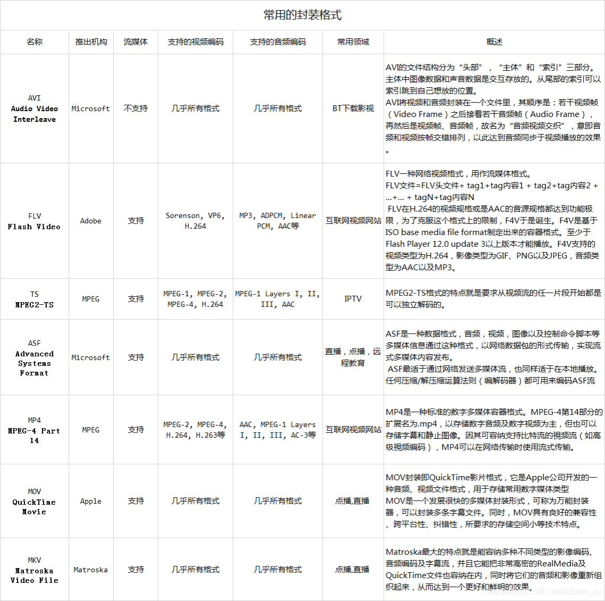

​       

视频封装格式 & 视频文件格式：

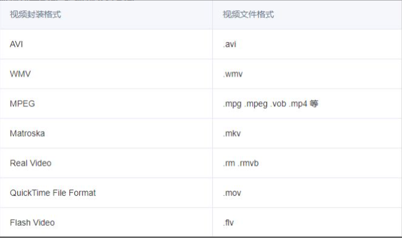

​         

以合成 MP4 视频为例（流程如下图）：

> 1）整体来看，合成的 MP4 文件，视频部分为 H.264 编码格式的数据，音频部分为 AAC 编码格式的数据；
>
> 2）通过 MediaMuxer 提供的接口-writeSampleData()，将 H.264 和 AAC 数据分别同时写入到 MP4 文件

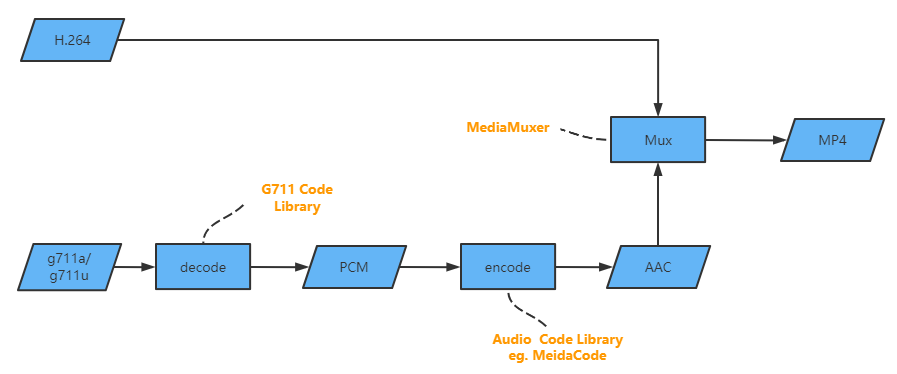

​        

# 4、传输 - 流媒体通信协议

传输，它解决的是，数据怎么共享的问题，那么，数据究竟怎么共享呢 ？共享，最重要的一点，就是协议 。而研究音视频传输，其实就是在研究协议，具体有哪些协议呢 ？

> 音视频在传输前，怎么打包的？如：FLV、ts、mpeg4 等
>
> 直播推流，有哪些常见的协议？如：RTMP、RTSP 等
>
> 直播拉流，有哪些常见的协议？如：RTMP、HLS、HDL、RTSP 等
>
> 基于 UDP 的协议有哪些？如：RTP/RTCP、QUIC 等  

​        

流媒体协议，即 **服务器与客户端之间通信遵循的规定，是用于Internet上针对多媒体数据流的一种传输协议**（属于应用层），是指将一连串数据压缩后，经过网络分段发送，即时传输以供观看音视频的一种技术。通过使用 streaming media 技术，用户无需将文件下载到本地即可播放。  

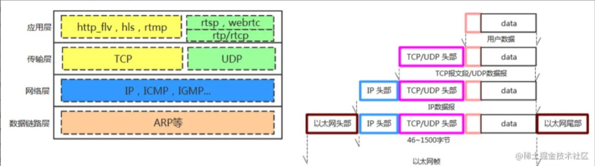

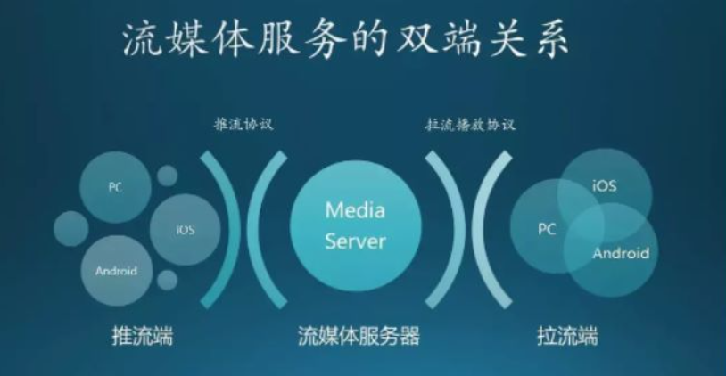

​       

## 4.1 基于http渐进下载协议

​           

### 4.1.1 HLS

HLS（http live streaming）是苹果公司实现的基于 HTTP 的流媒体传输协议，可支持流媒体的直播和点播。HLS 协议由三部分组成：

> `HTTP`：是传输协议
>
> `M3U8`：是索引文件（确保包殊勋）
>
> `TS`：是音视频的媒体信息；

​       

HLS 主要的两块内容是 **.m3u8文件** 和 **.ts 播放文件**，即 *接受服务器会将接受到的视频流进行缓存，然后缓存到一定程度后，会将这些视频流进行编码格式化*，同时会生成一份 .m3u8 文件和其它很多的 .ts 文件；

> **工作原理**：把整个流分成一个个小的基于HTTP的文件来下载，每次只下载一些。当媒体流正在播放时，客户端可以选择从许多不同的备用源中以不同的速率下载同样的资源，允许流媒体会话适应不同的数据速率；
>
> **特点**： HLS 的这种技术特点，决定了它的延迟一般总是会高于普通的流媒体直播协议；
>
> **缺点**：时延比较大，不断的http请求，协议建立过程也耗时，延迟基本在10s+；
>
> **优点**：采用HTTP传输，不用考虑防火墙和代理的问题；使用分片文件来播放， 且分段文件的时长很短，客户端可以平滑的切换码率，以适应不同宽带条件下的播放；iOS平台可以获得天然支持，采用AVPlayer就能直接播放；
>
> **应用场景**：主要应用在 iOS 系统，为 iOS 设备（如 iPhone、iPad）提供音视频直播和点播方案。 

​          

直播视频流程：

> 1）**Server**：服务器端将视频数据流编码、封装和切割为连续的、时长很短的MPEG-TS格式的文件，通常一个ts分片大概是10s；并提供一个配套的媒体列表文件（m3u8文件）
>
> * 视频封装格式：MPEG-TS
>
> * 编码：视频编码为H.264，音频编码为AAC, MP3, AC-3或者EC-3格式。
>
> 2）**Distribution**：由标准的网络服务器组成，接收客户端的请求和分发所有的资源包括m3u8列表文件和ts分片文件
>
> 3）**Client**：客户端先通过下载m3u8文件，再通过m3u8文件的索引地址顺序地拉取ts媒体文件播放。对于直播，它的索引文件一直处于动态变化的，你需要不断的更新索引文件 playlist 然后移除旧的索引文件

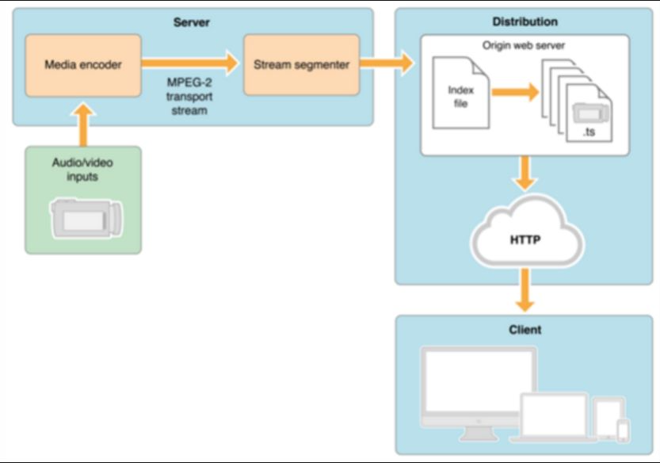

​          

### 4.1.2 RTMP

> **概述**：Adobe Systems 公司为 Flash 播放器和服务器之间音频、视频和数据传输开发的开放协议；
>
> **基本原理**： 将上传的流分成不同的分片，这些分片的大小，有时候变，有时候不会变。默认情况下就是，64B 的音频数据 + 128B 的视频数据 + 其它数据（比如 头，协议标签等）；
>
> **特点**：协议基于 TCP，是一个协议族，包括 RTMP 基本协议及 RTMPT/RTMPS/RTMPE 等多种变种，是一种设计用来进行**实时数据通信的网络协议**，主要用来在Flash/AIR 平台和支持 RTMP 协议的流媒体/交互服务器之间进行音视频和数据通信。其中，支持该协议的软件包括Adobe Media Server/Ultrant Media Server/red5等，现在推流协议各大云厂商基本都是直接支持 rtmp，但拉流用 rtmp 的话就不太现实了，现在对 flash 支持都不友好了；
>
> **应用场景**：一种设计用来进行实时数据通信的网络协议，主要用来在 Flash/AIR 平台和支持RTMP协议的流媒体/交互服务器之间进行音视频和数据通信

​       

### 4.1.3 http-flv

Http-Flv 就是 http + flv ，将音视频数据封装成FLV格式，然后通过 HTTP 协议传输给客户端。相较于 RTMP 协议，HTTP-FLV 能够好的穿透防火墙，它是基于 HTTP/80 传输，有效避免被防火墙拦截。

差异：

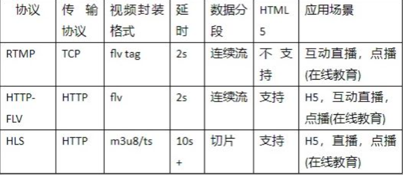

​     

### 4.1.4 DASH

> **概述**：是一种在互联网上传送动态码率的Video Streaming技术，类似于苹果的HLS
>
> **特点**：DASH会通过media presentation description (MPD)将视频内容切片成一个很短的文件片段，每个切片都有多个不同的码率，DASH Client可以根据网络的情况选择一个码率进行播放，支持在不同码率之间无缝切换

​      

更多流媒体传输协议，请移步 [流媒体传输协议](音视频学习/4.流媒体传输协议.md)

​      

## 4.2 基于RTSP/RTP实时流媒体协议

RTP ： 实时传输协议 Real-time Transport Protocol

> 概述：一种网络传输协议，RTP协议详细说明了在互联网上传递音频和视频的标准数据包格式
>
> 特点：基于UDP 协议实现
>
> 应用场景：RTP协议常用于流媒体系统（配合 RTSP 协议）

​       

RTCP ： 实时传输控制协议 Real-time Transport Control Protoco

> 概述： 实时传输协议（RTP）的一个姐妹协议
>
> 特点：RTCP为RTP媒体流提供信道外（out-of-band）控制。RTCP 本身并不传输数据，但和 RTP 一起协作将多媒体数据打包和发送。RTCP 定期在流多媒体会话参加者之间传输控制数据
>
> 应用场景：为 RTP 所提供的服务质量（Quality of Service）提供反

​         

RTSP：实时流协议 Real-Time Streaming Protocol

> 概述：定义了一对多应用程序如何有效地通过 IP 网络传送多媒体数据
>
> 特点：RTSP 在体系结构上位于 RTP 和 RTCP 之上，使用 TCP 或 UDP 完成数据传输
>
> 应用场景：使用 RTSP 时，客户机和服务器都可以发出请求，即 RTSP 可以是双向的。

​       

RTMFP：Real Time Media Flow0 Protoco

> 概述：Adobe 公司开发的一套新的通信协议，全称 Real Time Media Flow Protocol
>
> 特点：协议基于 UDP，支持 C/S 模式和 P2P 模式，即该协议可以让使用 Adobe Flash Player 的终端用户之间进行直接通信
>
> 应用场景：Adobe Flash Player 的终端用户之间进行直接通信

​        

# 5、渲染 - 音视频

渲染，它解决的是，数据怎么展现的问题，那么，数据究竟怎么展现呢 ？

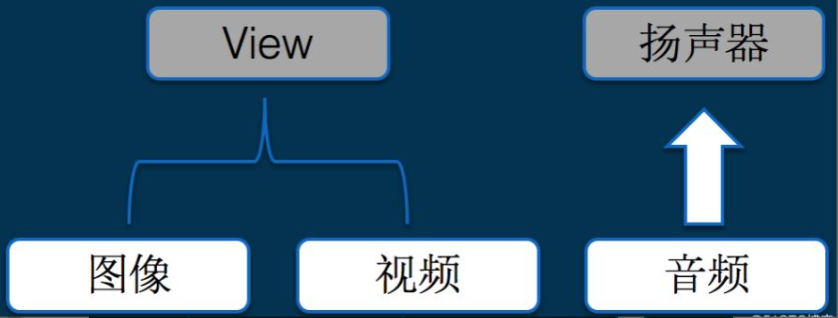

​        

无论在哪个平台，图像、视频最终都是要绘制到视图上面，而音频最终都是要输出到扬声器，因此，做音视频渲染，对应技术知识：

> 系统提供了哪些 API 可以绘制一张图片或者一帧 YUV 图像数据的 ？
>
> * Windows：DirectDraw、Direct3D、GDI、OpenGL 等
> * Linux： GDI、OpenGL 等
> * Android：ImageView、SurfaceView、TextureView、OpenGL 等
> * iOS： CoreGraphics、OpenGL 等
>
> ​        
>
> 系统提供了哪些 API 可以播放一个 mp3 或者 pcm 数据 ？
>
> * Windows：DirectSound 等
>
> * Linux：ALSA & OSS 等
>
> * Android：AudioTrack 等
>
> * iOS： AudioQueue 等

​     

## 5.1 流程 - 视频播放流程

音视频播放流程

> **播放互联网音视频文件**： 解协议 --> 解封装 --> 解码（音频和视频分别解码）--> 视音频同步 --> 渲染&播放（音响/显示器）
>
> **播放本地视频文件**： 不需要解协议，即 解封装 --> 解码视音频 --> 视音频同步 --> 渲染&播放

​        

视频播放器播放流程如下图：

​         

**播放流程**：

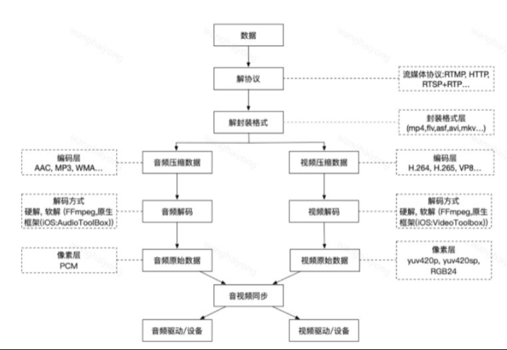

​            

## 5.2 解协议

解协议的作用，就是 **将流媒体协议的数据，解析为标准的相应的封装格式数据**。视音频在网络上传播的时候，常常采用各种流媒体协议，例如HTTP、RTMP、MMS等等，这些协议在传输视音频数据 的同时，也会传输一些信令数据，包括对 `播放的控制（播放，暂停，停止）`、对 `网络状态的描述` 等。解协议的过程中会去除掉 **信令数据**，而只保留视音频数据，例如采用RTMP协议传输的数据，经过解协议操作后，输出FLV格式的数据

> rtmp//[a.rtmp.youtube.com/live2](http://a.rtmp.youtube.com/live2) -> xxx.flv

​           

## 5.3 解封装 / 解复用

解封装的作用，就是 **将输入的封装格式的数据，分离成为 *音频流压缩编码数据*  和 *视频流压缩编码数据* **。视频封装格式种类很多，例如MP4、MKV、RMVB、TS、FLV、AVI等等，它的作用就是将已经压缩编码的视频数据和音频数据按照一定的格式放到一起，可以把这些封装理解成容器，容器里装了 `视频数据`、`音频数据`、`字幕数据` 等等，解封装就是根据封装算法，把容器里的各种数据分离开来。

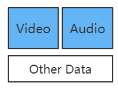

例如：

> FLV封装： H.264编码的视频码流 + AAC编码的音频码流
>
> mp4封装：H264视频编码 + AAC音频编码
>
> WebM封装：VP8视频编码 + Vorbis音频编码（谷歌的编码）
>
> OGG封装：Theora视频编码 + Vorbis音频编码（开源的）

​         

## 5.4 解码

解码的作用，就是 **将视频/音频压缩编码数据，解码成为非压缩的视频/音频原始数据**。音频的压缩编码标准包含 AAC、MP3、AC-3 等等，视频的压缩编码标准则包含 H.264、MPEG2、VC-1 等等，解码是整个系统中最重要也是最复杂的一个环节

例如：

> 视频数据解码：输出成为非压缩的颜色数据，例如YUV420P、RGB等等
>
> 音频数据解码：输出成为非压缩的音频抽样数据，例如 PCM 数据

​         

## 5.5 音视频同步

视音频同步的作用，就是 **根据解封装模块处理过程中获取到的参数信息，同步解码出来的视频和音频数据，并将视频音频数据送至系统的显卡和声卡播放出来**。

​        

### 5.5.1 为什么要音视频同步？

媒体数据经过解复用流程后，音频/视频解码便是独立的，也是独立播放的。而在音频流和视频流中，其播放速度都是有相关信息指定的：

> `视频`：帧率，表示视频一秒显示的帧数
>
> `音频`：采样率，表示音频一秒播放的样本的个数

​       

从帧率及采样率，即可知道视频/音频播放速度，声卡和显卡均是以一帧数据来作为播放单位，即如果单纯依赖帧率及采样率来进行播放，在理想条件下，应该是同步的，不会出现偏差。以一个44.1KHz的AAC音频流 和 24FPS的视频流为例：

> 一个AAC音频frame每个声道包含1024个采样点，则一个frame的播放时长(duration)为：(1024/44100) ×1000ms = 23.22ms；
>
> 一个视频frame播放时长(duration)为：1000ms/24 = 41.67ms。理想情况下，音视频完全同步，音视频播放过程如下图所示：
>
> 
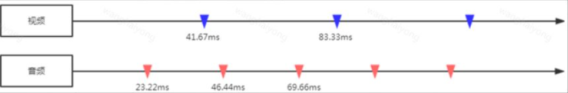

​             

但实际情况下，如果用上面那种简单的方式，慢慢的就会出现音视频不同步的情况，**要不是视频播放快了，要么是音频播放快了**。可能的原因如下：

> 1）一帧的播放时间，难以精准控制，因为音视频解码及渲染的耗时不同，可能造成每一帧输出有一点细微差距，长久累计，不同步便越来越明显（例如受限于性能，42ms才能输出一帧）；
>
> 2）音频输出是线性的，而视频输出可能是非线性，从而导致有偏差；
>
> 3）媒体流本身音视频有差距（特别是TS实时流，音视频能播放的第一个帧起点不同）；

​           

因为为了 **解决音视频同步问题**，引入了 **时间戳**：

> 1）首先选择一个参考时钟，要求参考时钟上的时间是线性递增的；
>
> 2）编码时依据参考时钟上的给每个音视频数据块都打上时间戳；
>
> 3）播放时，根据音视频时间戳及参考时钟，来调整播放。

所以，视频和音频的同步实际上是一个动态的过程，同步是暂时的，不同步则是常态。以参考时钟为标准，放快了就减慢播放速度，播放快了就加快播放的速度。

**注意**：虽然 `DTS`、`PTS`  是用于指导播放端的行为，但它们是在编码的时候由编码器生成的

​                

### 5.5.2 常见同步策略

实现音视频同步，**在播放时需要选定一个参考时钟，读取帧上的时间戳，同时根据的参考时钟来动态调节播放**。现在已经知道时间戳就是PTS，那么参考时钟的选择一般来说有以下三种：

> 1）**将视频同步到音频上**（音频为主时钟）：就是以音频的播放速度为基准来同步视频
>
> 2）**将音频同步到视频上 **（视频为主时钟）：就是以视频的播放速度为基准来同步音频
>
> 3）**将视频和音频同步外部的时钟上 **（系统时间为主时钟）：选择一个外部时钟为基准，视频和音频的播放速度都以该时钟为标准

​             

当播放源比参考时钟慢，则加快其播放速度，或者丢弃；快了，则延迟播放。这三种是最基本的策略，考虑到人对声音的敏感度要强于视频，频繁调节音频会带来较差的观感体验，且音频的播放时钟为线性增长，所以一般会 **以音频时钟为参考时钟，视频同步到音频上**。

​        

在实际使用基于这三种策略做一些优化调整，例如：

> 1）调整策略可以尽量采用渐进的方式，因为 **音视频同步是一个动态调节的过程**，一次调整让音视频PTS完全一致，没有必要，且可能导致播放异常较为明显；
>
> 2）调整策略仅仅对早到的或晚到的数据块进行延迟或加快处理，有时候是不够的。如果想要更加主动并且有效地调节播放性能，需要引入一个反馈机制，也就是要将当前数据流速度太快或太慢的状态反馈给“源”，让源去放慢或加快数据流的速度；
>
> 
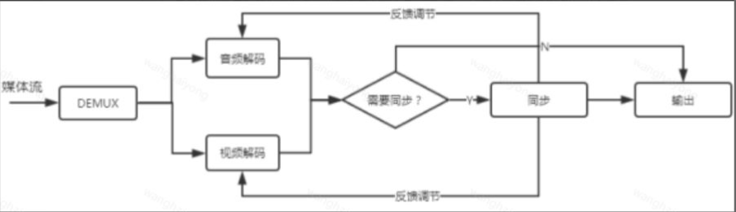

>
> 3）对于起播阶段，特别是TS实时流，由于视频解码需要依赖第一个I帧，而音频是可以实时输出，可能出现的情况是视频PTS超前音频PTS较多，这种情况下进行同步，势必造成较为明显的慢同步。处理这种情况的较好方法是将较为多余的音频数据丢弃，尽量减少起播阶段的音视频差距。

​         

## 5.6 渲染&播放

解压缩的视频数据与音频数据，一帧一帧的输送给显示器或者音响设备，例如可以直接用while循环来读取

​          

# 附录

## 基础概念

1. [视频解码GOP概念](https://zhuanlan.zhihu.com/p/112635240)
2. [关于GOP和帧率、码率的关系  ](https://zhuanlan.zhihu.com/p/259870429)
3. [I帧、P帧、B帧、GOP、IDR 和PTS, DTS之间的关系 ](https://www.cnblogs.com/yongdaimi/p/10676309.html) 
4. [数字音视频技术](https://www.cnblogs.com/yongdaimi/category/1435491.html)
5. [视频和视频帧：视频和帧基础知识整理 ](https://zhuanlan.zhihu.com/p/61747783)
6. [音视频同步原理&实现](https://blog.csdn.net/myvest/article/details/97416415)
7. [Github音视频基础概念](https://github.com/0voice/audio_video_streaming/blob/main/article/034-音视频编解码常用知识点.md)

## 视频播放器相关

1. [视频播放流程概略](https://bbs.huaweicloud.com/blogs/194497) 
2. [视频播放流程](https://juejin.cn/post/7027838598713507877)
3. [音视频零基础入门](https://toutiao.io/posts/2qoywz/preview)、https://blog.51cto.com/ciellee/3413012

## 视频压缩编码相关

1. [视频压缩编码的基本原理](https://codeantenna.com/a/inN4AXBwhb)
2. [雷神 - 音视频压缩编码基本原理](https://bugnull.com/2019/11/26/跟雷神学音视频-3-音视频压缩编码基本原理/)

3. [【客户端技术】深入了解视频播放器工作原理与实现 ](https://cloud.tencent.com/developer/article/1691027)

4. [雷神音视频基础知识](https://bugnull.com/tags/FFmpeg/page/3/)

## 其它

1. [快速探索，音视频技术不再神秘 ](https://segmentfault.com/a/1190000016965965)

2. [音视频色彩空间](https://juejin.cn/post/7021152032220250142)

3. [音视频编码格式汇总](https://www.cnblogs.com/candycaicai/archive/2011/02/17/1956737.html)

4. [音视频技术总览](https://hezhaojiang.github.io/post/2020/8a06ddbd/)

5. [一文看懂音视频流媒体协议及信令技术](https://developer.aliyun.com/article/787990)  

