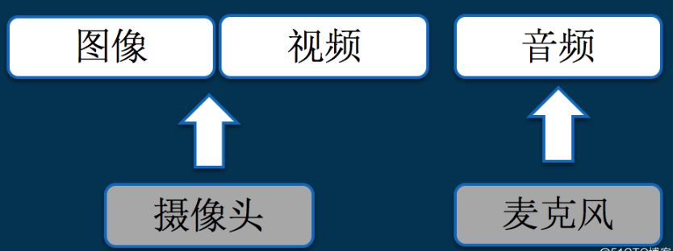

本小节主要介绍视频合成以及播放器相关基础概念和流程，视音频技术主要包含以下几点：`封装技术`、`视频压缩编码技术` 和 `音频压缩编码技术`，如果考虑到网络传输的话，还包括 `流媒体协议技术`

# 1、概览 - 视频生成&播放流程

## 1.1 音视频数据加工流程 

如下图：

## 1.2 音视频编码流程

1）`纹理（Texture）`： 指的是一张表示物体表面细节的位图

* 视频纹理：是一种介于图像和视频之间的媒体，它对一段长度有限的视频进行分析，通过不断的重复原始视频中的某些片断，得到无限连续的视频 

2）`PCM`： 脉冲编码调制 (Pulse Code Modulation)

* 在PCM 过程中，将输入的模拟信号进行采样、量化和编码，用二进制进行编码的数来代表模拟信号的幅度 ；
* 接收端再将这些编码还原为原来的模拟信号的过程

## 1.3 音视频开发基础流程

`采集`：它解决的是，数据从哪里来的问题

`渲染`：它解决的是，数据怎么展现的问题

`处理`：它解决的是，数据怎么加工的问题

`传输`：它解决的是，数据怎么共享的问题 

# 2、采集 - 音视频采集

采集，它解决的是，数据从哪里来的问题，那么，数据究竟从哪里来的呢 ？ 

## 2.1 音频采集

**音频采集**：模拟声音转换为计算机识别的数字信号的过程 

音频采集涉及到以下几点：

* 检测麦克风是否可以使用； 
* 需要检测手机对某个音频采样率的支持； 
* 在一些情况下需要对音频进行回声消除处理； 
* 音频采集时设置正确的缓冲区大小 

在 Android 系统中，一般使用 **AudioRecord** 或者 **MediaRecord** 来采集音频

* **AudioRecord**： 是一个比较偏底层的 API,它可以获取到一帧帧 PCM 数据，之后可以对这些数据进行处理；
*  **MediaRecord**： 是基于 AudioRecorder 的 API ( 最终还是会创建AudioRecord 用来与 AudioFlinger 进行交互) ，它可以直接将采集到的音频数据转化为执行的编码格式，并保存。

## 2.2 视频采集

**视频采集**：将模拟摄像机、录像机、LD视盘机、电视机输出的视频信号，通过专用的模拟、数字转换设备，转换为二进制数字信息的过程

视频采集涉及到以下几点：

* 检测摄像头是否可以使用； 
* 摄像头采集到的图像是横向的，需要对采集到的图像进行一定的旋转后再进行显示； 
* 摄像头采集时有一系列的图像大小可以选择，当采集的图像大小和手机屏幕大小比例不一致时，需要进行特殊处理； 
* Android 手机摄像头有一系列的状态，需要在正确的状态下才能对摄像头进行相应的操作。 Android 手机摄像头的很多参数存在兼容性问题，需要较好地处理这些兼容性的问题。

在 Android 系统下有两套 API 可以进行视频采集，它们是 **Camera** 和 **Camera2** 

> Camera是以前老的 API ，从 Android 5.0(21) 之后就已经放弃了。和音频一样，也有高层和低层的 API，高层就是 Camera 和 MediaRecorder，可以快速实现编码，低层就是直接使用 Camera，然后将采集的数据进行滤镜、降噪等前处理，处理完成后由 MediaCodec 进行硬件编码，最后采用 MediaMuxer 生成最终的视频文件。

## 2.3 Q&A

音视频开发中 音视频采集场景的Q&A：

----

Q：系统的摄像头采集接口是什么，怎么用 ？

A：比如：Windows：DirectShow，Linux：V4L2，Android：Camera，iOS：AVCaptureSession 等

-----

Q：系统的摄像头采集的参数怎么配置，都是什么含义 ？

A：比如：分辨率、帧率、预览方向、对焦、闪光灯 等

----

Q：系统的摄像头输出的图像/视频数据，是什么格式，不同格式有什么区别 ？

A：比如：

* 图片：JPEG
* 视频数据：NV21，NV12，I420 

-----

Q：系统的麦克风采集接口是什么，怎么用 ？

A：比如：

* Windows：DirectShow
* Linux：ALSA & OSS
* Android：AudioRecord
* iOS：Audio Unit 

----

Q：系统的麦克风采集参数怎么配置，都是什么含义 ？

A：比如：采样率，通道号，位宽 等

---

Q：系统的麦克风输出的音频数据，是什么格式？
A：比如：PCM 

# 3、处理 - 音视频处理、编码&混合

## 3.1 视频编码

## 3.2 音频编码

## 3.3 视频混合 - 封装格式（容器）

# 4、传输 - 流媒体通信协议

# 5、渲染 - 音视频

## 5.1 流程 - 视频播放流程

## 5.2 解协议

## 5.3 解封装

## 5.4 解码

## 5.5 音视频同步

### 5.5.1 为什么要音视频同步？

### 5.5.2 常见同步策略

## 5.6 渲染&播放

# 附录

## 基础概念

1. [视频解码GOP概念](https://zhuanlan.zhihu.com/p/112635240)
2. [关于GOP和帧率、码率的关系  ](https://zhuanlan.zhihu.com/p/259870429)
3. [I帧、P帧、B帧、GOP、IDR 和PTS, DTS之间的关系 ](https://www.cnblogs.com/yongdaimi/p/10676309.html) 
4. [数字音视频技术](https://www.cnblogs.com/yongdaimi/category/1435491.html)
5. [视频和视频帧：视频和帧基础知识整理 ](https://zhuanlan.zhihu.com/p/61747783)
6. [音视频同步原理&实现](https://blog.csdn.net/myvest/article/details/97416415)
7. [Github音视频基础概念](https://github.com/0voice/audio_video_streaming/blob/main/article/034-音视频编解码常用知识点.md)

## 视频播放器相关

1. [视频播放流程概略](https://bbs.huaweicloud.com/blogs/194497) 
2. [视频播放流程](https://juejin.cn/post/7027838598713507877)
3. [音视频零基础入门](https://toutiao.io/posts/2qoywz/preview)、https://blog.51cto.com/ciellee/3413012

## 视频压缩编码相关

1. [视频压缩编码的基本原理](https://codeantenna.com/a/inN4AXBwhb)
2. [雷神 - 音视频压缩编码基本原理](https://bugnull.com/2019/11/26/跟雷神学音视频-3-音视频压缩编码基本原理/)

3. [【客户端技术】深入了解视频播放器工作原理与实现 ](https://cloud.tencent.com/developer/article/1691027)

4. [雷神音视频基础知识](https://bugnull.com/tags/FFmpeg/page/3/)

## 其它

1. [快速探索，音视频技术不再神秘 ](https://segmentfault.com/a/1190000016965965)

2. [音视频色彩空间](https://juejin.cn/post/7021152032220250142)

3. [音视频编码格式汇总](https://www.cnblogs.com/candycaicai/archive/2011/02/17/1956737.html)

4. [音视频技术总览](https://hezhaojiang.github.io/post/2020/8a06ddbd/)

5. [一文看懂音视频流媒体协议及信令技术](https://developer.aliyun.com/article/787990)  

