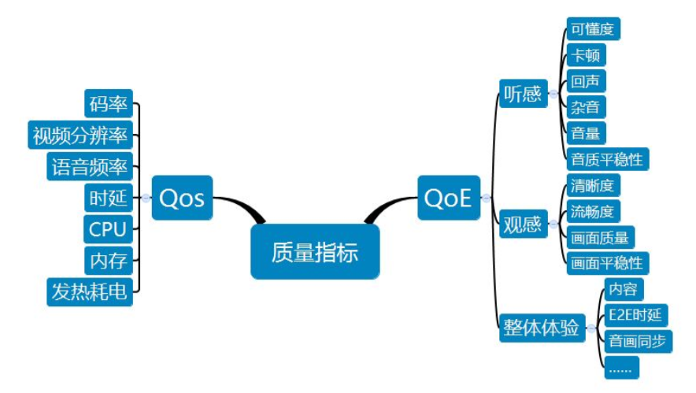

常见音视频质量问题：

​      

# 1、背景

音视频产品的评估涵盖多个维度，不同场景下的维度取舍存在较大的差别。目前市场上主流的音视频产品可以按应用场景分为如下几类（还有些小众产品，如会议类、投屏类没有列入在内）

特别说明，上述的划分也不是绝对的，有些会有交集，如直播里很多产品都有互动直播的能力，这一部分会与实时通话的场景相近。对于这几类场景，从质量角度，虽然很多指标是通用的，但侧重点会有所不同

* **实时场景**：关注E2E传输质量（如时延）和信息可懂性
* **直播场景**：更关注主播上行网络抗性能力和观众体验（卡顿、音画是否同步）
* **短视频**：更多关注画质与用户体验
* **长视频**：更关注转码质量及效率

这些的背后与产品的定位及所采用的技术密切相关。

​              

# 2、质量评估指标

音视频数据处理流程：

  

每个环节都有可能引入质量的损失，导致最终信息接收者观看到的内容变差，比如上面这种是流水线式处理，长短视频场景下数据生产和消费的环节是分开的，而且其中会有离线转码处理的环节，如多分辨率，HDR等。

但评估播放器播放视频是否好的标准不仅仅是视频可以正常播放出来、app不会crash等，用户对视频播放的主观感受往往对于视频播放而言更加重要，例如播放视频是否会卡顿、画质是否清晰、弱网情况下缓冲是否能够接受，光线色调对于用户而言是否舒服等等，所以除了 **视频播放服务质量 QoS**，**视频体验质量（QoE）**评估指标也是比较重要的。

> `长视频产品`：由于视频源一般为专业设备所拍摄，所以原始质量相对是非常高的，用户的槽点会集中在视频是否流畅，画质是否有瑕疵（花屏、马赛克），画质是否稳定（想像看视频时480p和1080p来回反复切换的状态）；
>
> `短视频产品`：与长视频相比，由于视频内容多为用户普通终端拍摄，原始视频质量就会参差不齐了，需要借助算法提升质量，所以除了长视频的关注点外，还需要关注清晰度等画质细节指标（特别说明一个常见的误区，清晰度不能等同于分辨率，高分辨率图像的清晰度未必比低分辨率高）；
>
> `互动直播和实时通话`：这种对时延敏感的产品，传输技术上一般是采用UDP或基于UDP(如Quic)的协议来进行，就容易产生音轨与视频轨不一致的问题，音画同步在这类场景下也一个很重要的质量指标
>
> `其它`：
>
> * 音频下的杂音、破音、丢字、回声也都会严重影响用户体验的，一般产品都会进行3A处理模块，那么处理效果怎么样，也需要进行验证评估。（注：音视频的QoE实际是一个相对复杂的范畴，只能从一些客观技术指标上进行评判，且不同人群对于内容的喜好也会对QoE产生较大影响，这就更偏重于心理学问题了）
> * 除了用户体验之外，由于音视频的流量消耗、存储消耗与高CPU消耗的特点也决定我们要对这些通用性能指标进行关注

# 附录

  

## 音视频质量评估 

1. [实时音视频质量评估方案](https://mp.weixin.qq.com/s?__biz=MzAwNjEzMDUyNw==&mid=2650202543&idx=1&sn=65f42e59f7afc3b53753e3cba5a2f29c&chksm=83105f9fb467d6894f25be51daed01886a749c6994338e733ef75815eebd15e121b78323c279&mpshare=1&scene=1&srcid=10224nDtVdwP494ejEmuty7k&sharer_sharetime=1603374598308&sharer_shareid=5693249149c76b6ac4af03e273e0edd2&version=3.0.31.2308&platform=mac&rd2werd=1#wechat_redirect)

2. [【译】VMAF 视频质量评估工具概述](https://www.jackpu.com/vmaf-the-journey-continues/)

3. [音频质量评估及音频处理常用功能](https://testerhome.com/topics/25054)

4. [音视频质量评估绿皮书](https://cloud.tencent.com/developer/article/1427161)

5. 各个视频互联网公司都在该方面有技术设计与落地：

   - Netflix：https://www.youtube.com/watch?v=otENYY1jIbY 

   - netflix: https://netflixtechblog.com/streaming-video-experimentation-at-netflix-visualizing-practical-and-statistical-significance-7117420f4e9a

   - 优酷: https://www.infoq.cn/article/f1QK0I_mRHbJS7BtmvOs

   - 快手: https://cloud.tencent.com/developer/news/301983 

