# FFmpeg 进阶

本文主要是进一步介绍FFmpeg工具的使用...

​    

# 一 基础

ffmpeg转码输出过程如下：

<div align="center">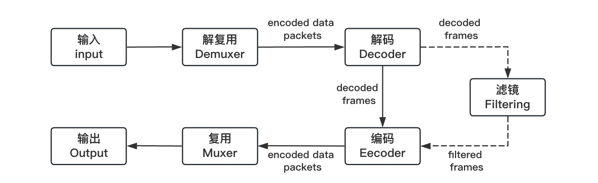</div>

详情如下：

1. ffmpeg 调用包含解复用器Demuxer的 libavformat 库，从输入文件中读取包含编码的数据包
2. 将编码的数据包传递给解码器Decoder（流复制忽略该步骤）
3. 解码器Decoder输出的未压缩的帧（即原始帧）可以进一步被滤镜Filtering处理
4. 被滤镜处理的原始数据被传递给编码器Encoder
5. 编码器Encoder对传递过来的数据进行编码并输出编码数据包
6. 编辑后的编码数据通过复用器Muxer写入输出文件

**注**：有损编解码器反复编解码操作会降低原视频质量，因此操作过程避免多条命令反复编解码操作

​       

## 1 视频参数（SAR/DAR/PAR）

FFmpeg中的视频参数 SAR/PAR/DAR， 从宏观上都是描述一个视频轮如何被播放器正确显示：

1）**PAR**（pixel aspect ratio）：单个像素的宽高比，大多数情况像素宽高比为1:1，也就是一个正方形像素，如果不是1:1， 则该像素可以理解为长方形像素，常见 PAR比率 (1:1，10:11, 40:33, 16:11, 12:11 )；

<div align="center">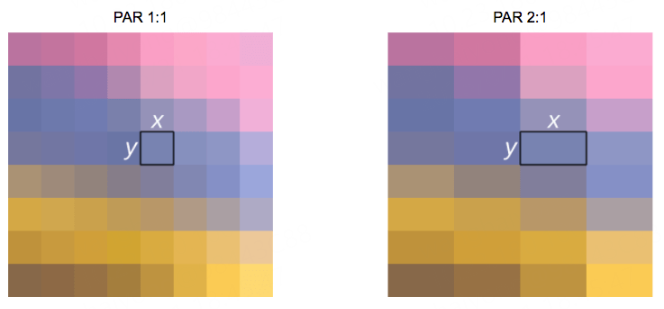</div>

2）**DAR**（display aspect ratio）：显示宽高比，即最终播放出来的画面的宽与高之比，比如常见16:9和4:3等，且缩放视频也要按这个比例来，否则会使图像看起来被压扁或者拉长了似的；

<div align="center">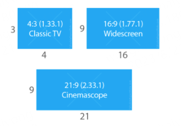</div>

3）**SAR**（Sample aspect ratio）：采样纵横比， 表示横向的像素点数和纵向的像素点数的比值，即为通常提到的分辨率宽高比，就是对图像采集时，横向采集与纵向采集构成的点阵中横向点数与纵向点数的比值，比如VGA图像640/480 = 4:3，D-1 PAL图像720/576 = 5:4，高清视频 等；

其中，**PAR x SAR = DAR** 或 **PAR = DAR/SAR**，已知任意两个可以推导出另一个。

如下图，如果这是一个由5x4一共20个像素点构成的一个长方形视频图像，其SAR=5:4，如果每个像素点都是方形像素，即PAR=1:1，则有 DAR= PAR x SAR = 5:4x1:1 = 5:4， 即该图像的显示宽高比是5:4。

<div align="center"></div>

同理，如果有一视频，告诉你视频宽高分别是160和120，即DAR= 160:120， 如果SAR仍然是5:4，则PAR = 160:120 / 5:4 = 16:15，也就是说，这个视频每个像素为长方形的像素。

<div align="center">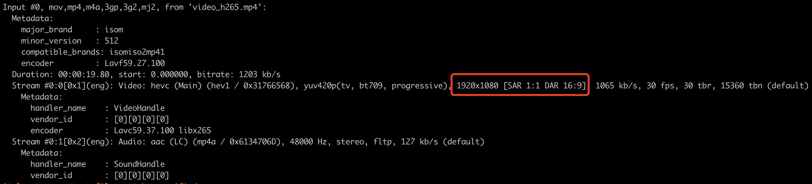</div>

**补充**：

1）**播放器标准播放流程**：应该是先找容器也就是 container 中的DAR，按这个比例来显示视频，进行播放，如果没有DAR的话，则使用SAR进行视频显示播放。
2）**视频制式**：按照设备可以分为**计算机制式**和**电视制式**，其中电视制式又可以分为PAL和NTSC。电视制式的PAR通常不为1:1，而计算机制式的PAR为1:1. 如果视频的PAR为4:3，可以得出该视频最初应该是来自电视制式拍摄而来。

​    

## 2 时间基（tbr/tbn/tbc）

PTS（Presentation TimeStamp）：渲染用的时间戳，即视频帧是按照 PTS 的时间戳来展示的

DTS（Decoding TimeStamp）：解码时间戳，是用于视频解码的

有了时间戳之后，**最终进行展示时还要需要将 PTS时间戳转成以秒为单位的时间**，且在执行 ffmpeg/ffplay命令时，可以通过控制台看到tbr, tbn, tbc 这几个参数。

**这几个值是什么含义呢**？其实就是不同的时间基：

```shell
tbr：帧率，time base of rate
tbn：视频流的时间基，time base of stream
tbc：视频解码的时间基，time base of codec
```

在ffmpeg中，不同的时间戳对应不同的时间基，而对于视频的渲染我们使用的是视频流的时间基，也就是 **tbn**。

其中，**时间基也就是时间刻度（间隔）**，以帧率为例，如果每秒钟的帧率是 25帧，那么它的时间基（时间刻度）就是 1/25，也就是说每隔1/25 秒后，显示一帧。所以如果当前的时间是 100， 时间基是 1/25，那么转成秒的时间是多少呢？

```shell
100 * 时间基(1/25) = 100 * 1/25 = 4秒
```

​     

此外，ffmpeg内部还有一个时间基，即 **AV_TIME_BASE**，其在ffmpeg内部定义和分数表式法（这里就是时间间隔的数据存放结构）如下：

```shell
#define AV_TIME_BASE 1000000
#define AV_TIME_BASE_Q (AVRational){1, AV_TIME_BASE}
```

在 ffmpeg中进行换算，将不同时间基的值转成按秒为单位的值计算如下：

```shell
timestamp(秒) = pts * av_q2d(time_base)  # n秒 = 时间戳 × 时间基
```

 av_q2d 函数定义（获取时间基）：

```c
typedef struct AVRational{
int num; //numerator
int den; //denominator
} AVRational;

static inline double av_q2d(AVRational a)｛
/**
* Convert rational to double.
* @param a rational to convert
**/
    return a.num / (double) a.den;
}
```

此外，由上可知ffmpeg有好几种不同的时间基，有时候需要在不同的时间基之间做换算，ffmpeg为此提供av_rescale_q()函数

```shell
# 把时间戳从一个时基调整到另外一个时基
av_rescale_q = a * b / c
```

其中，a 表示换算的值，b 是原来的时间基，c是要转换的时间基

​      

## 3 FFmpeg滤镜

**滤镜filter**指的是修改未编码的原始音视频数据帧的一种软件工具，主要是用来实现图像的各种特殊效果

ffmpeg支持2种滤镜：简单滤镜 和 复合滤镜

### 1）简单滤镜（Simple filtergraphs）

简单滤镜是指只有一个输入和输出且类型相同的过滤图，可以理解为在非压缩数据帧到再次编码前简单附加了一步：

<div align="center">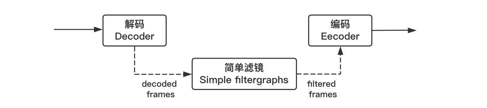</div>

可使用每个流的 `-filter` 选项进行配置，或分别为视频和音频使用 `-vf` 或 `-filter:v` 和 `-af` 或 `-filter:a` 选项进行配置。

> -filter的语法规则：-filter[:stream_specifier] filtergraph (output,per-stream)
>
> 其中，stream_specifier流的类型可用a表示音频，v表示视频，filtergraph表示具体的滤镜
>
> **注意**：某些过滤器会更改框架属性，但不会更改框架内容，例如上图 fps 过滤器仅更改帧数，但不影响帧内容，又比如 setpts 过滤器，只设置时间戳，但不改变帧传递。

   

一个简单视频过滤图和指令如下所示：

```shell
# 把原视频 r3.mp4 等比例缩放一倍
ffmpeg -i r3.mp4 -vf scale=272:480 -y filter.mp4
ffmpeg -i r3.mp4 -vf scale=iw/2:ih/2 -y filter.mp4
```

<div align="center"></div>

其中，**scale滤镜** 用于调整视频的大小，比如等比例缩放、等比例放大，不做等比例操作输出就变形了，变形结果一般不考虑。因为知道原视频 r3.mp4 的分辨率是 544x960，所以等比例缩放一倍，上面的命令直接指定了 272x480，scale滤镜自带很多参数。

> scale滤镜参数：
>
> * in_w in_h 或者 iw ih：表示输入视频的宽&高
> * out_w out_h 或者 ow oh：表示输出视频的宽&高

当然不一定是视频，输入输出也可以是图片，scale滤镜其它用法如下：

```shell
# Case1: 原视频的宽度调整为300且保持原分辨率
# 指定高度等于-1，自动做等比例处理
ffmpeg -i r1ori.mp4 -vf scale=300:-1 -y filter.mp4

# 由于一些编解码器要求很多视频的宽高必须是n的倍数(n=2), 若执行报错"height not divisible by 2"
# 则在处理视频或者图片宽高的时候，切记不要使用-1，正确的用法是使用-2
ffmpeg -i r1ori.mp4 -vf scale=300:-2 -y filter.mp4
```

​      

### 2）复合滤镜（Complex filtergraphs）

复合滤镜不能简单地理解为应用于一个流的线性处理链，一般当**滤镜有多个输入和/或输出**时，或者**当输出流类型与输入不同**时，则需要复合滤镜进行处理，且相对于简单滤镜，复杂滤镜是可以处理任意数量输入和输出效果的滤镜图。

ffmpeg命令行中使用 `-lavfi`、`-filter_complex`，基本原理图如下：

<div align="center">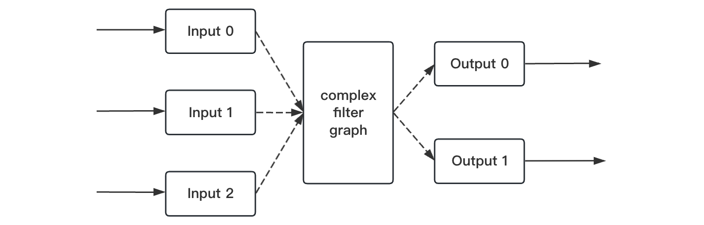</div>

例如：**overlay过滤器**有两个视频输入和一个视频输出，其中一个视频叠加overlaid在另一个视频之上，下面以几个例子介绍复合滤镜的使用与法。

​    

**Case1**：如之前输入视频 r3.mp4 等比例缩放一倍，若以手动选择流的方式为例，则有

```shell
ffmpeg -i r3.mp4 -filter_complex "[0]scale=272:480[out]" -map 0:a -map "[out]" -y filter.mp4 
```

简单分析如下：

1. 命令 "[0]scale=272:480[out]" 中的 [0] 表示第一个输入的视频，因为要对视频做处理，所以也可以用[0:v]表示，如果要对音频单独处理，就需要用 [0:a] 了；
2. [0] 结合scale滤镜，表示的就是**把第一个输入的视频作为scale滤镜的参数输入**；
3. [out] 中括号是必须要的，out是自定义的一个别名，结合scale滤镜，表示的是**把scale滤镜输出的结果命名为[out]**，但并非是最终输出的结果，只能作为中间过程输出的一个结果；
4. -map "[out]" 就是直接选择[out] 流作为输出

​          

**Case2**：现在要把原视频 ori.mp4 的中间部分裁剪出来，但仍保持原视频的分辨率544x960，如何做呢？

```shell
ffmpeg -i ori.mp4 -filter_complex "nullsrc=s=544x960[background]; \
crop=iw:(ih/2 - 110):0:250[middle]; \
[background][middle]overlay=shortest=1:x=(main_w-overlay_w)/2:y=(main_h-overlay_h)/2[out]" \
-map "[out]" 
-map 0:a 
-movflags +faststart 
-y fc.mp4
```

[nullsrc](https://ffmpeg.org/ffmpeg-filters.html#allrgb_002c-allyuv_002c-color_002c-haldclutsrc_002c-nullsrc_002c-pal75bars_002c-pal100bars_002c-rgbtestsrc_002c-smptebars_002c-smptehdbars_002c-testsrc_002c-testsrc2_002c-yuvtestsrc)、[crop](https://ffmpeg.org/ffmpeg-filters.html#crop)、[overlay](https://ffmpeg.org/ffmpeg-filters.html#overlay-1) 三种常见滤镜：

1）**nullsrc滤镜**：用于创建一个空的视频，简单的说就是一个空的画布或者说是绿布，因为默认创建的颜色是绿色的，其中参数 s用于指定画布的大小，默认是320x240，这里表示创建一个544x960的画布，并命名为background；

关于nullsrc还有很多种不同的操作，比如使用nullsrc和CIQRCodeGenerator创建一个whyTalent Github首页的二维码

```shell
ffmpeg -f lavfi -i nullsrc=s=200x200,coreimage=filter=CIQRCodeGenerator@inputMessage=http\\\\\://github.com/whyTalent/whyTalent@inputCorrectionLevel=H -frames:v 1 manks.png
```

2）**crop滤镜**：用于裁剪视频，也就是说视频的任意区域任意大小都可以裁剪出来，其中 crop=iw:(ih/2 - 110):0:250[middle] 表示裁剪原视频的中间部分并命名为middle；

3）**overlay滤镜**：表示两个视频相互叠加，其中第一个输入是主视频，第二个输入为覆盖视频，覆盖在主视频之上

* shortest官网是这么介绍的：“If set to 1, force the output to terminate when the shortest input terminates. Default value is 0.”，因为使用nullsrc创建了一个没有时间轴的画布，所以这里需要以middle的视频时间为最终时间，故设置为1。
* main_w和main_h表示**主视频的宽高**，overlay_w和overlay_h表示**叠加视频的宽高**。如果要把A视频叠加到B视频上，则main_w和main_h表示B视频的宽高，overlay_w和overlay_h表示A视频的宽高，合起来便是把middle叠加到background之上且置于background的中间（相当于有个叠加层的概念）；

4）**-movflags**：跟mp4的元数据有关，设为faststart表示会将moov移动到mdat的前面，在线播放的时候会稍微快一些。

​     

**Case3**：提取音频通道

```shell
ffmpeg -y -i input.mxf \
-filter_complex "[0:a]asplit=2[a1][a2];[a1]pan=mono|c0=c0[ch1];[a2]pan=mono|c0=c1[ch2]" \
-map [ch1] channel_1.wav \
-map [ch2] channel_2.wav
```

<div align="center">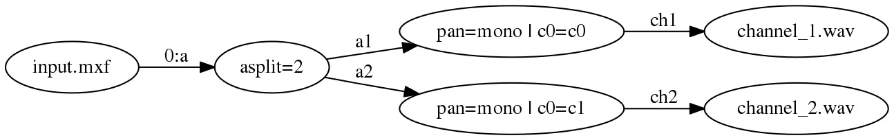</div>

​     

**Case4**：复用通用过滤器并并行生成&同时输出不同结果

```shell
ffmpeg -y -i input.mkv \
-filter_complex "[0:v]format=yuv420p,yadif,split=3[in1][in2][in3];[in1]scale=1920:1080[hd];[in2]scale=720:576,hflip[sd];[in3]fps=1/5,scale=320:180[thumbnails];[0:a]aresample=48000,asplit=2[a1][a2]" \
-map [hd] -map [a1] hd.mov \
-map [sd] -map [a2] sd-flipped.mp4 \
-map [thumbnails] thumbnail-%03d.jpg
```

<div align="center">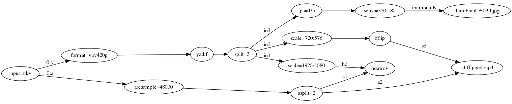</div>

​      

### 3）filter语法

由上简单和复合滤镜示例可知，一个滤镜链图（filtergraph）是**连接滤镜的有向图**，可以包含循环动作，也可以在多个滤镜间形成链路，**每个链接都有一个连接到滤镜的输入和一个连接到滤镜的输出**。其中，滤镜链图采用文本表示，由一些ffmpeg和ffplay通用的选项 -filter/-vf/-af 和 -filter_complex（ffmpeg）以及 -vf/-af（ffplay）外加定义与 libavfilter/avfilter.h 的avfilter_graph_parse_ptr() 等来描述。

* 1）一个滤镜链filterchain包含序列链接起来的滤镜，这个序列由 “,” 分隔各个滤镜描述；
* 2）一个滤镜链图filtergraph包含序列滤镜链，这个序列有 “;” 分隔各个滤镜链描述

<div align="center">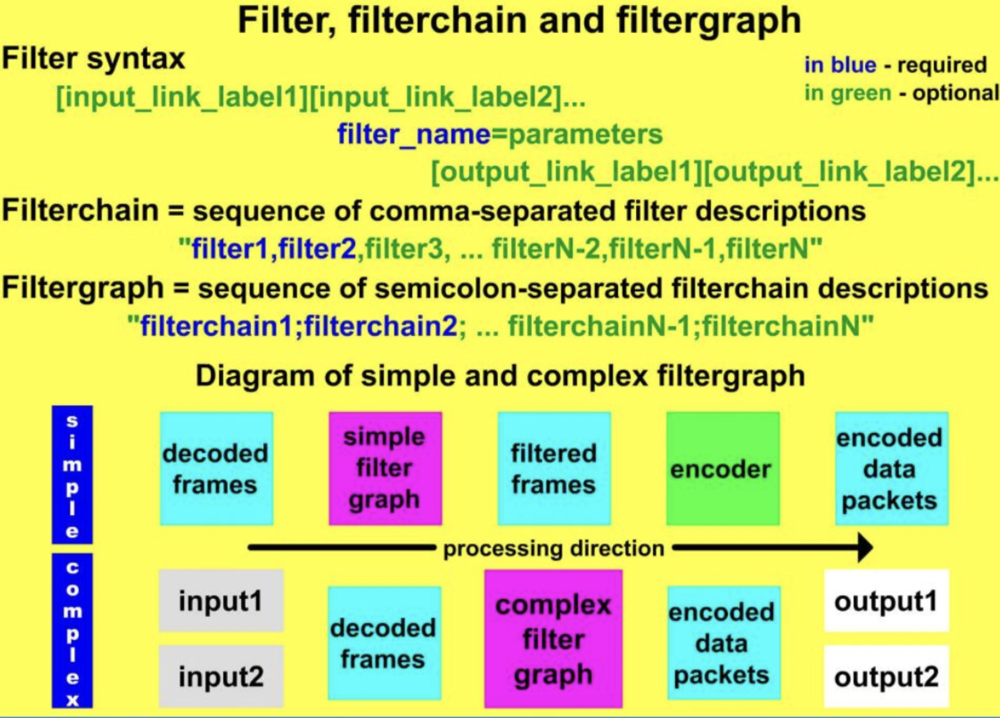</div>

一个滤镜由一个字符串表单表示：

```shell
[input_link_lable1][input_link_lable2]... filter_name=parameters [output_link_lable1][output_link_lable12]...
```

1. 输入输出都有连接标号（link lable），连接符号是可选项，在滤镜名和参数前和后有一个连接标签列表，其中一个连接标签允许命名1个名字的连接，其作为滤镜的输入或者输出端口，且如果一个输出端没有命名标签，它默认连接到滤镜链上后面滤镜中第一个没有命名标签的输入端。

2. **filter_name** 是滤镜类名字

3. **=arguments** 用于指定滤镜选项，参数表示法如下规则

   3.1  “:” 分隔的key=value列表，举个例子：ffplay -i good.mp4 -vf scale=iw/2:ih/2

   3.2  一个 “:” 分隔的列表value值，在这种情况下，键（key）假定为选项名声明顺序，举个例子：ffplay -i good_scale.mp4 -vf fade=in:0:30（淡入视频的前30帧），按顺序声明了3个选项 type、start_frame和nb_frames

   3.3  上面两个规则混用

   3.4  如果选项的值本身就是一个列表（例如format滤镜有一个像素格式列表选项），则这种列表通常用“|”分隔

​       

# 二 场景使用

主要结合使用场景学习FFmpeg工具的使用

## 1 数据可视化

### 1）直方图histogram

生成每帧的各颜色分量的直方图

```shell
## 在播放器中显示视频文件xxx.mp4的直方图，即通过使用histogram滤镜，可以可视化视频帧的亮度分布，然后将其与原视频进行叠加显示。
ffplay -vf "split=2[a][b],[a]histogram,format=yuva444p[hh],[b][hh]overlay" small_bunny_1080p_60fps.mp4

## 仅显示视频文件xxx.mp4的直方图
ffplay -i input -vf histogram

## 输出信视频
ffmpeg -i small_bunny_1080p_60fps.mp4 -vf "split=2[a][b],[b]histogram,format=yuv420p[hh],[a][hh]overlay" small_bunny_yuv_histogram.mp4
```

<div align="center"></div>

​      

### 2）波形showwaves && 频谱showspectrum

生成音视频文件中的音频波形或频谱图

```shell
## 在播放器中显示音频文件input.mp4的波形图，即通过使用showwaves滤镜，可以可视化音频波形，指定颜色、尺度等参数
ffplay -f lavfi "amovie=input.mp4, asplit[a][out1]; [a]showwaves=colors=red:scale=sqrt:mode=cline[out0]"

## ffplay将在播放器中显示音频文件input.mp4的频谱图，即通过使用showspectrum滤镜，可以可视化音频频谱，指定颜色、模式、尺度等参数。
ffplay -f lavfi "amovie=input.mp4, asplit[a][out1]; [a]showspectrum=mode=combined:color=intensity:scale=log [out0]"
```

| 波形showwaves                                                | 频谱showspectrum                                             |
| ------------------------------------------------------------ | ------------------------------------------------------------ |
| 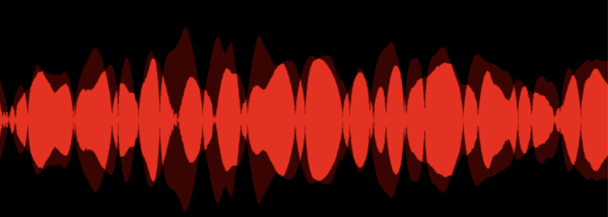 | 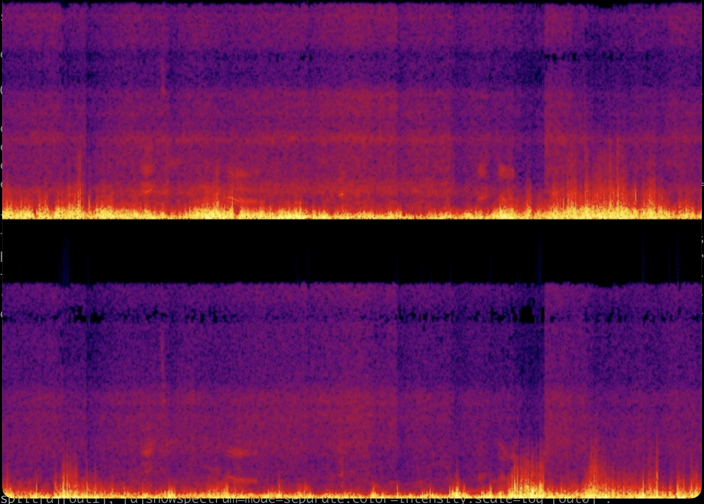 |

​    

### 3）2D视频示波器oscilloscope
用于测量空间脉冲 / 阶跃响应 / 色度延迟等

```shell
# FFmpeg's oscilloscope滤镜可视化给定视频行的Y亮度强度
## 测试输入源 testsrc2
ffplay -f lavfi -i 'testsrc2=size=1280x720:rate=30000/1001,format=yuv420p' -vf oscilloscope=x=0.5:y=200/720:s=1:c=1

## 指定视频输入源 input.mp4
ffplay -f lavfi -i 'movie=input.mp4' -vf oscilloscope=x=0.5:y=200/720:s=1:c=1
```

<div align="center"></div>

​     

### 4）调试宏块和运动向量codecview

可视化某些编解码器导出的信息

某些编解码器可以使用辅助数据或其他方式通过帧导出信息，例如某些基于 MPEG 的编解码器通过编解码器 flags2 选项中的 export_mvs 标志导出运动矢量。

参数选项：

* mv：设置运动矢量（motion vertors, MV）以进行可视化
  * pf / bf：分别表示P帧和B帧的前向预测运动矢量
  * bb：表示B帧的后向预测运动矢量
* mv_type：可视化指定运动矢量类型，若不指定frame_type，默认所有帧
  * fp / bp：分别表示前向和后向预测帧
* frame_type：可视化指定帧类型的运动矢量
  * if：帧内编码帧（intra-coded frames, I 帧）
  * pf：预测帧（predicted frames, P 帧）
  * bf：双向预测帧（bi-directionally predicted frames, B 帧）

```shell
# 一个带有视频上运动矢量的视频
ffplay -flags2 +export_mvs input.mp4 -vf codecview=mv=pf+bf+bb
ffmpeg -flags2 +export_mvs -i input.mp4 -vf codecview=mv=pf+bf+bb input_vis_mv.mp4

# ffplay 可视化所有帧的前向预测 MV
ffplay -flags2 +export_mvs input.mp4 -vf codecview=mv_type=fp
```

<div align="center"></div>

​    

## 2 h264编码参数 x264-params

编码示例：

```shell
# 无B帧 Generates a video with 0 B-frames
ffmpeg -i input.mp4 -c:v libx264 -x264-params keyint=30:min-keyint=30:no-scenecut=1:bframes=0 -c:a copy output_zero_b_frames.mp4

# 单个I帧 和 多个P帧编码视频
ffmpeg -iinput.mp4 -c:v libx264 -x264-params keyint=300:min-keyint=300:no-scenecut=1:bframes=0 -c:a copy output_single_I_rest_P.mp4

# 单个 I 帧编码视频, 每秒插入一个 I 帧
ffmpeg -i input.mp4 -c:v libx264 -x264-params keyint=30:min-keyint=30:no-scenecut=1 -c:a copy out_h264_keyframe_each_one_second.mp4

# 每 2 秒插入一个 I 帧
ffmpeg -i input.mp4 -c:v libx264 -x264-params keyint=60:min-keyint=60:no-scenecut=1 -c:a copy ouput_h264_keyframe_each_two_seconds.mp4

# 验证I/P/B帧数
mediainfo --Details output_xxx.mp4 | grep "slice_type I" | wc -l
ffprobe -show_frames output_xxx.mp4 | grep "pict_type=B" | wc -l
```

   

**CABAC vs CAVLC**

```shell
# h264 CAVLC 编码（faster, less cpu intensive, less compression）
ffmpeg -i input.mp4 -c:v libx264 -x264-params keyint=30:min-keyint=30:no-scenecut=1:no-cabac=1 -c:a copy h264_keyframe_each_second_CAVLC.mp4

# h264 CABAC 编码（"slower", more cpu intensive, more compression）
ffmpeg -i input.mp4 -c:v libx264 -x264-params keyint=30:min-keyint=30:no-scenecut=1:coder=1 -c:a copy h264_keyframe_each_second_CAVLC.mp4
```

   

### 1）编码速度和质量

| 参数    | 说明                                                         |
| ------- | ------------------------------------------------------------ |
| profile | 预设值（即默认值）：无<br />如果指定了profile，它会覆写所有其他的设定，且将会保证得到一个相容的数据流，此外将会无法使用**无失真（lossless）编码**（--qp 0或--crf 0）。如果播放设备仅支持某个profile，则应该设此选项，但大多数解码器都支持High profile，所以没有设定的必要。<br /><br />可用的值：baseline, main, high |
| preset  | 预设值：medium<br />变更选项，以权衡压缩效率和编码速度，如果指定了预设，变更的选项将会在套用所有其他的参数之前套用，但通常应该将此设为所能忍受的最慢一个选项。<br /><br />可用的值（编码速度从快到慢）：ultrafast, superfast, veryfast, faster, fast, medium, slow, slower, veryslow, placebo<br />**注**：指定编码速度，速度越慢，画质越好，cpu占用越高 |
| tune    | 预设值：无<br />调整选项，以进一步最佳化为视频的内容。如果指定了tune，变更的选项将会在--preset之后，但所有其他的参数之前套用。如果视频的内容符合其中一个可用的调整值，则可以使用此选项，否则不要使用。<br /><br />可用的值：<br />-- film：电影、真人类型 <br />-- animation：动画<br />-- grain：需要保留大量的grain时用<br />-- stillimage：静态图像编码时使用<br />-- psnr：为提高psnr做了优化的参数<br />-- ssim：为提高ssim做了优化的参数<br />-- fastdecode：可以快速解码的参数<br />-- zerolatency：零延迟，用在需要非常低的延迟的情况下，比如电视电话会议的编码 |

​    

### 2）帧类型选项

| 参数           | 说明                                                         |
| -------------- | ------------------------------------------------------------ |
| keyint         | 预设值：250<br />**设定x264输出的数据流之最大IDR帧（亦称为关键帧）间隔**，可以指定infinite让x264永远不要插入非场景变更的IDR帧。<br />IDR帧是数据流的“分隔符号”，所有帧都无法从IDR帧的另一边参照数据，因此IDR帧也是I帧，所以它们不从任何其他帧参照数据，这也意味着它们可以用作视频的搜寻点（seek points）。<br />**注意**：I帧通常明显大于P/B帧（在低动态场景通常为10倍大或更多），所以当它们与极低的VBV设定合并使用时会打乱比特率控制，在这些情况下，研究 --intra-refresh。预设值对于大多数视频没啥问题，在为蓝光、广播、即时数据流或某些其他特殊情况编码时，可能需要更小的GOP长度（通常等于帧率）。 |
| min-keyint     | 预设值：自动 ，即 **MIN(--keyint / 10, --fps)**<br />**设定IDR帧之间的最小长度**<br />过小的keyint范围会导致“不正确的”IDR帧位置（例如闪屏场景），因此此选项限制在每个IDR帧之后，要有多少帧才可以再有另一个IDR帧的最小长度，其中min-keyint的最大允许值是 --keyint/2+1。<br />建议：预设值，或者等于帧率 |
| no-scenecut    | 预设值：无<br />完全停用自适应I帧决策（adaptive I-frame decision）<br />参阅：相当于--scenecut 0 |
| scenecut       | 预设值：40<br />**设定I/IDR帧位置的阈值（场景变更侦测）**<br />x264为每一帧计算一个度量值，来估计与前一帧的不同程度，如果该值低于scenecut，则算侦测到一个“场景变更”。而如果此时与最近一个IDR帧的距离低于--min-keyint，则放置一个I帧，否则放置一个IDR帧。越大的scenecut值会增加侦测到场景变更的数目，场景变更是如何比较的详细信息可以参阅[ suggestion for new x264-parameter - Doom9's Forum](http://forum.doom9.org/showthread.php?t=121116) <br />建议：预设值<br />参阅：--keyint, --min-keyint, --no-scenecut |
| intra-refresh  | 预设值：无<br />**停用IDR帧**，作为替代x264会为每隔--keyint的帧的每个宏块（macroblock）使用内部编码（intra coding）。区块是以一个水平卷动的行刷新，称为刷新波（refresh wave）。这有利于低延迟的数据流，使它有可能比标准的IDR帧达到更加固定的帧大小。它也增强了视频数据流对封包遗失的恢复能力。此选项会降低压缩效率，因此必要时才使用。<br />**注意**：第一帧仍然是IDR帧，内部区块（Intra-blocks）仅处于P帧里，刷新波在一或多个B帧后的第一个P帧更广泛。压缩效率的损失主要来自于在刷新波上左侧（新）的宏块无法参照右侧（旧）的数据。 |
| bframes        | 预设值：3<br />**设定x264可以使用的最大并行B帧数**<br />没有B帧时，一个典型的x264数据流有着像这样的帧类型：IPPPPP…PI，当设了--bframes 2时，最多两个连续的P帧可以被B帧取代，就像：IBPBBPBPPPB…PI。B帧类似于P帧，除了B帧还能从它之后的帧做动态预测（motion prediction），就压缩比来说效率会大幅提高，且它们的平均品质是由--pbratio所控制。<br />**注意**：<br />1）x264还区分两种不同种类的B帧："B"是代表一个被其他帧作为参照帧的B帧（参阅--b-pyramid），而"b"则代表一个不被其他帧作为参照帧的B帧。如果看到一段混合的"B"和"b"，原因通常与上述有关，当差别并不重要时，通常就以"B"代表所有B帧。<br />2）x264是如何为每个候选帧选定为P帧或B帧的详细信息可以参阅http://article.gmane.org/gmane.comp.video.ffmpeg.devel/29064 在预设值情况下，帧类型看起来会像这样（假设--bframes 3）：IBBBPBBBPBPI。 |
| no-cabac       | 预设值：无<br />停用**自适应内容的二进位算数编码**（CABAC：Context Adaptive Binary Arithmetic Coder）数据流压缩，切换回效率较低的**自适应内容的可变长度编码**（CAVLC：Context Adaptive Variable Length Coder）系统，这可大幅降低压缩效率（通常10~20%）和解码的硬体需求。 |
| ref            | 预设值：3<br />**控制解码图片缓冲（DPB：Decoded Picture Buffer）的大小**，范围是从0到16，总之此值是每个P帧可以使用先前多少帧作为参照帧的数目（B帧可以使用的数目要少一或两个，取决于它们是否作为参照帧），可以被参照的最小ref数是1。<br />**注意**：H.264规格限制了每个level的DPB大小，如果遵守Level 4.1规格，720p和1080p视频的最大ref数分别是9和4参阅：--b-pyramid, --no-mixed-refs, --level |
| slices         | 预设值：无<br />**设定每帧的切片数**，而且强制为矩形切片（会被--slice-max-size或--slice-max-mbs覆写）。如果是在为蓝光编码，将值设为4，否则，不要使用此选项，除非你知道真的有必要。<br />参阅：--slice-max-size, --slice-max-mbs |
| slice-max-size | 预设值：无<br />设定最大的切片大小（单位是比特组），包括估计的NAL额外负荷（overhead），目前与--interlaced不相容<br />参阅：--slices |
| slice-max-mbs  | 预设值：无<br />设定最大的切片大小（单位是宏块），目前与--interlaced不相容<br />参阅：--slices |

​     

### 3）比特率控制

| 参数    | 说明                                                         |
| ------- | ------------------------------------------------------------ |
| qp      | 预设值：无<br />三种比特率控制方法之一，即**设定x264以固定量化值（Constant Quantizer）模式来编码视频**，但**qp值是指定P帧的量化值，而I帧和B帧的量化值则是从--ipratio和--pbratio中取得**。CQ模式把某个量化值作为目标，这意味着最终文件大小是未知的（虽然可以透过一些方法来准确地估计），且如果将值设为0会产生无失真输出。对于相同视觉品质，qp会比--crf产生更大的文件，此外qp模式也会停用自适应量化，因为按照定义“固定量化值”意味着没有自适应量化。<br />**注**：<br />1）此选项与 --bitrate和--crf互斥，各种比特率控制系统的详细信息可以参阅https://github.com/saintdev/x264-devel/blob/master/doc/ratecontrol.txt <br />2）虽然qp不需要lookahead来执行因此速度较快，但通常应该改用--crf参阅：--bitrate, --crf, --ipratio, --pbratio |
| bitrate | 预设值：无<br />三种比特率控制方法之二，**以目标比特率模式来编码视频**<br />目标比特率模式意味着最终文件大小是已知的，但最终品质则未知，即x264会尝试把给定的比特率作为整体平均值来编码视频，参数的单位是千比特/秒（8比特=1比特组），但注意1千比特（kilobit）是1000比特，而不是1024比特。<br />**注**：<br />1）此设定通常与--pass在两阶段（two-pass）编码一起使用 <br />2）此选项与--qp和--crf互斥。各种比特率控制系统的详细信息可以参阅https://github.com/saintdev/x264-devel/blob/master/doc/ratecontrol.txt <br />参阅：--qp, --crf, --ratetol, --pass, --stats |
| crf     | 预设值：23.0<br />最后一种比特率控制方法，即**固定比特率系数**（Constant Ratefactor），即**当qp是把某个量化值作为目标，而bitrate是把某个文件大小作为目标时，crf则是把某个“品质”作为目标**。构想是让crf n提供的视觉品质与qp n相同，只是文件更小一点，其中crf值的度量单位是“比特率系数（ratefactor）”。<br />CRF是借由降低“较不重要”的帧之品质来达到此目的，在此情况下，“较不重要”是指在复杂或高动态场景的帧，其品质不是很耗费比特数就是不易察觉，所以会提高它们的量化值，从这些帧里所节省下来的比特数被重新分配到可以更有效利用的帧。<br />CRF花费的时间会比两阶段编码少，因为两阶段编码中的“第一阶段”被略过了，且另一方面，要预测CRF编码的最终比特率是不可能的，根据情况哪种比特率控制模式更好是由你来决定。此选项与--qp和--bitrate互斥。各种比特率控制系统的详细信息可以参阅https://github.com/saintdev/x264-devel/blob/master/doc/ratecontrol.txt <br />参阅：--qp, --bitrate |
| ipratio | 预设值：1.40<br />**修改I帧量化值相比P帧量化值的目标平均增量**，越大的值会提高I帧的品质<br />参阅：--pbratio |
| pbratio | 预设值：1.30<br />**修改B帧量化值相比P帧量化值的目标平均减量**，越大的值会降低B帧的品质。当mbtree启用时（预设启用），此设定无作用，mbtree会自动计算最佳值。<br />参阅：--ipratio |
| pass    | 预设值：无<br />此为两阶段编码的一个重要设定，它控制x264如何处理--stats文件。有三种设定：<br />1）建立一个新的统计数据文件。在第一阶段使用此选项 <br />2）读取统计数据文件。在最终阶段使用此选项 <br />3）读取统计数据文件并更新<br /><br />统计数据文件包含每个输入帧的信息，可以输入到x264以改善输出，其构想是**执行第一阶段来产生统计数据文件，然后第二阶段将建立一个最佳化的视频编码**。改善的地方主要是从更好的比特率控制中获益。<br />参阅：--stats, --bitrate, --slow-firstpass, X264统计数据文件 |
| stats   | 预设值："x264_2pass.log"<br />设定x264读取和写入统计数据文件的位置<br />参阅：--pass, X264统计数据文件 |
| ... ... |                                                              |

​    

## 3 输入/输出

| 参数    | 说明                                                         |
| ------- | ------------------------------------------------------------ |
| output  | 预设值：无<br />**指定输出文件名，即指定的后缀名决定视频的输出格式**。如果后缀名无法辨识，则预设输出格式是原始格式（raw）视频数据流（通常储存为.264后缀名）。<br />特殊位置NUL（Windows）或/dev/null（Unix）指明输出应该被丢弃，这在使用 --pass 1 时特别有用，因为唯一在乎的输出是--stats。 |
| muxer   | 预设值：auto<br />指定要输出什么格式<br />可用的值：auto, raw, mkv, flv, mp4，其中auto选项会根据提供的输出文件名挑选一个复用器（muxer）建议：预设值<br />参阅：--output |
| demuxer | 预设值：auto<br />**设定x264使用什么解复用器（demuxer）和解码器来剖析输入视频**<br />可用的值：auto, raw, y4m, avs, lavf, ffms<br /><br />如果输入文件有raw、y4m或avs的后缀名，则x264会使用相关解复用器来读取文件。标准输入使用原始格式解复用器，否则x64会尝试以ffms来开启文件，然后再尝试以lavf来开启文件，最后开启失败。<br />"lavf" 和 "ffms" 选项需要x264以分别的程式库（libraries）编译。如果使用到两者之一，x264会从输入文件带入时间码（timecodes），条件是不能输出为原始格式。这有效地使x264感知VFR。其他选项可以指定 --fps为固定帧率，或者指定--tcfile-in为变动帧率。<br />建议：预设值<br />参阅：--input, --muxer |
| ... ... |                                                              |

​      


# 附录


## **FFmpeg升级**

[1] [Github: ffmpeg_develop_doc](https://github.com/0voice/ffmpeg_develop_doc/tree/main)

[2] [ffmpeg Documentation](https://ffmpeg.org/ffmpeg-all.html)

[3] [FFmpeg 滤镜详解](https://juejin.cn/post/7166165751345184782)

[4] [FFMPEG视音频编解码零基础学习方法（全）](https://blog.csdn.net/leixiaohua1020/article/details/15811977)

[5] [【FFmpeg】设置H264参数 - CodeAntenna](https://codeantenna.com/a/ByNoqNquMI)

[6] [FFmpeg X264编码参数 - 知乎](https://zhuanlan.zhihu.com/p/485519347)

[7] [Thor Video Codec](https://datatracker.ietf.org/doc/html/draft-fuldseth-netvc-thor)

   

## **工具**

[1] [Github：Mediainfo](https://github.com/MediaArea/MediaInfo)


