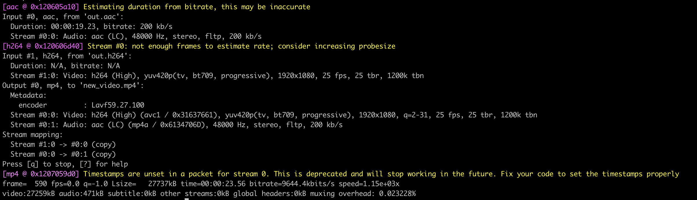

# FFmpeg 基础知识

FFmpeg是一套可以用来**记录**、**转换**数字音频、视频，并能将其转化为流的开源计算机程序，可以轻易地实现多种视频格式之间的相互转换，是非常强大的多媒体视频处理工具，能够解码（decode）、编码（encode）、转码（transcode）、复用（mux）、解复用（demux）、流（stream）、过滤（filter）和播放（play）等。

>容器（Container）：一种文件格式，比如flv，mkv等，包含下面5种流以及文件头信息
>
>流（stream）：一种视频数据信息的传输方式，包括音频，视频，字幕，附件，数据 等5种数据流
>
>编解码器（Codec）：对视频进行压缩或者解压缩，Codec = 编码（encode） + 解码（decode）
>
>复用（mux）：把不同的流按照某种容器的规则放入容器
>
>解复用（demux）：把不同的流从某种容器中解析出来

​    

FFmpeg包括如下几个部分：

* **libavformat**：用于各种音视频封装格式的生成和解析，包括获取解码所需信息以生成解码上下文结构和读取音视频帧等功能，包含demuxers和muxer库；
* **libavcodec**：用于各种类型声音/图像编解码；
* **libavutil**：包含一些公共的工具函数，如随机数生成器，数据结构，数学例程，核心多媒体实用程序等；
* **libswscale**：用于视频场景比例缩放、色彩映射转换，是一个执行高度优化的图像缩放和颜色空间/像素格式转换操作的库；
* **libpostproc**：用于后期效果处理；
* **ffmpeg**：是一个命令行工具，用来对视频文件转换格式，也支持对电视卡实时编码；
* **ffsever**：是一个HTTP多媒体实时广播流服务器，支持时光平移；
* **ffplay**：是一个简单的播放器，使用ffmpeg 库解析和解码，通过SDL显示；
* **ffprobe**：收集多媒体文件或流的信息，并以人和机器可读的方式输出；
* **libswresample**：是一个执行高度优化的音频重采样，重矩阵化和样本格式转换操作的库；

​    

接下来这里主要介绍FFmpeg程序的3个应用程序：ffmpeg、ffplay、 ffprobe的部分基础使用方法


# 一 ffmpeg

功能：常用于转换音频或视频格式的命令行工具

## 1.1 常用参数

| 参数类型                    | 参数选项                                                     |
| --------------------------- | ------------------------------------------------------------ |
| a. 打印帮助/信息/能力的参数 | **Print help / information / capabilities**<br />-h 帮助，是列出常用的一些参数，如果想知道更多的参数可以在 -h 之后加一个long或者full<br />-version，显示版本<br />-formats，显示可用的格式，编解码的，协议的...<br />-codecs，显示可用的编解码器 |
| b. 全局参数                 | **Global options是全局生效，而不是只针对某一个文件**<br />-loglevel loglevel，设置日志级别,loglevel总共有6个值，每个值输出的信息量不同，分别为 quiet、panic、fatal、error、warning、info、verbose、debug、trace，其中info、debug、error三个级别比较常用<br />**-v loglevel**，设置日志级别<br />-report，生成一个报告<br />**-i filename** 输入文件<br />-y 覆盖输出文件<br />-n 不要覆盖输出文件 |
| c. 单独生效参数             | **Per-file main options操作每个文件单独生效**<br />**-f fmt**，强迫采用格式fmt（即指定保存图片使用的格式）<br/>-c codec，codec名字<br/>-codec codec，codec 名字<br/>-t duration 设置纪录时间（代表持续时间，单位为秒），其中 hh:mm:ss[.xxx]格式的记录时间也支持 |
| d. 视频选项                 | **Video options视频参数**<br />**-vframes** number，指定抽取的帧数 <br />**-r rate**，指定抽取的帧率，即从视频中每秒钟抽取图片的数量  <br />-fpsmax rate，设置最大帧率  <br />-s size，设置帧大小<br />-aspect aspect，设置长宽比，一般是4:3, 16:9 或者 1.3333, 1.7777 <br />-vn，取消视频的输出<br />-vcodec codec，强制使用codec编解码方式，如果用copy表示原始编解码数据必须被拷贝 |
| e. 音频选项                 | **Audio options音频参数**<br />-aframes number，设置音频帧的数量输出<br/>-ar rate，设置音频采样率<br/>-ac channels，设置声道数，1单声道，2立体声 -an，取消音频的输出<br/>-an 取消音频的输出<br />-acodec codec，指定音频编码，同理如果用copy表示原始编解码数据必须被拷贝 |
| f. 字幕选项                 | Subtitle options字幕参数<br />                               |

​      

## 1.2 使用案例 - 指令

ffmpeg使用：

```shell
ffmpeg [options] [[infile options] -i infile]... {[outfile options] outfile}....
```

​      

### 1.2.1 查询音视频的信息

可以获取到视频的时长，分辨率，码率，帧率，视频压缩标准、音频采样率等

> **ffmpeg -i xxx.xxx**

<div align="center"></div>

​     

### 1.2.2 抽取音/视频流/只提取视频ES数据

把视频input.mp4的音频按照原有的编码方式取出来

> **ffmpeg -i input.mp4 -acodec copy -vn out.aac**

<div align="center"></div>

​        

可以把视频input.mp4的视频按照原有的编码方式取出来

> **ffmpeg -i input.mp4 -vcodec copy -an out.h264**

<div align="center"></div>

​      

只提取视频ES数据

> **ffmpeg –i input.mp4 –vcodec copy –an –f m4v output.h264**

​        

### 1.2.3 音视频合并

把音频和视频按照各自原有的编码方式合并

> **ffmpeg -i out.h264 -i out.aac -vcodec copy -acodec copy out.mp4**

<div align="center"></div>

​       

### 1.2.4 格式转换

转换封装格式

> **ffmpeg -i input.mp4 -vcodec copy -acodec copy out.flv**

转换编码格式（MPEG4转换成H264）

> **ffmpeg -i input.mp4 -vcodec h264 output.mp4**

​     

PS：但如果ffmpeg编译时，添加了外部的x265或者X264，那也可以用外部的编码器来编码（X265不包含在ffmpeg的源码里，是独立的一个开源代码，用于编码HEVC，ffmpeg编码时可以调用它。当然了ffmpeg 自己也有编码器）

> ffmpeg -i input.mp4 **-c:v libx265** output.mp4 
>
> ffmpeg -i input.mp4 **-c:v libx264** output.mp4

​        

### 1.2.5 视频分解成图片/图片合成视频

视频分解成图片

> **ffmpeg -i video.mp4 img/image%d.jpg**

<div align="center"></div>

​        

图片合成视频（无声音）

>    **ffmpeg -f image2 -i img/image%d.jpg video.mp4**

<div align="center"></div>

​     

### 1.2.6 图片/视频转GIF

图片转GIF

> **ffmpeg -i image%d.jpg -r 30 out.gif**

视频转GIF

> **ffmpeg -i test.mp4 -ss 00:00:00 -t 10 test.gif**

​       

### 1.2.7 视频裁剪

使用 **-ss** 和 **-t** 选项，从第0秒开始，向后截取30秒视频，并保存

> **ffmpeg -ss 00:00:00 -i video.mp4 -vcodec copy -acodec copy -t 00:00:30 output1.mp4 **

从第 00:30:30 开始，向后截取 00:20:15 的视频，并保存

> **ffmpeg -ss 00:30:30 -i video.mp4 -vcodec copy -acodec copy -t 00:20:15 output2.mp4**

​      

### 1.2.8 视频拼接

把两个视频合并成一个视频可以使用 **TS格式拼接视频**，因此需要先将 mp4 转化为同样编码形式的 ts 流，因为 ts流是可以 concate 的，即先把 mp4 封装成 ts ，然后 concate ts 流， 最后再把 ts 流转化为 mp4。

> 第一步：将mp4转化成ts流
>
> * ffmpeg -i output1.mp4 -vcodec copy -acodec copy **-vbsf h264_mp4toannexb** output1.ts
> * ffmpeg -i output2.mp4 -vcodec copy -acodec copy **-vbsf h264_mp4toannexb** output2.ts
>
> 第二步：为了减少命令的输入，需要一个filelist.txt文件，里面内容如下
>
> file 'output1.ts'
>
> file 'output2.ts'
>
> 第三步：concate ts 流， 然后把 ts 流转化为 mp4
>
> ffmpeg -f concat -i filelist.txt -acodec copy -vcodec copy **-absf aac_adtstoasc** output.mp4

​      

### 1.2.9 码率控制

码率控制对于在线视频比较重要，因为在线视频需要考虑其能提供的带宽，那么什么是码率？

> **bitrate = file size / duration**

比如一个文件20.8M，时长1分钟，那么

> biterate = 20.8M bit/60s = 20.8 \* 1024 \* 1024 \* 8 bit / 60s= 2831Kbps

一般音频的码率只有固定几种，比如是128Kbps，那么 video 的就是video biterate = 2831Kbps -128Kbps = 2703Kbps。

​     

ffmpg控制码率有3种选择，-minrate、 -b:v 、-maxrate

> 1）**-b:v**：主要是控制平均码率，比如一个视频源的码率太高了，有10Mbps，文件太大，想把文件弄小一点，但是又**不破坏分辨率**
>
> ffmpeg -i input.mp4 **-b:v 2000k** output.mp4
>
> 上面把码率从原码率转成2Mbps码率，这样其实也间接让文件变小了，目测接近一半。不过，ffmpeg官方wiki比较建议，设置b:v时，同时加上 -bufsize
>
> PS：**-bufsize** 用于设置码率控制缓冲器的大小，设置的好处是，**让整体的码率更趋近于希望的值**，减少波动（简单来说，比如 1 2的平均值是1.5， 1.49 1.51 也是1.5, 当然是第二种比较好）。
>
> ffmpeg -i input.mp4 **-b:v 2000k -bufsize 2000k** output.mp4
>
> ​      
>
> 2）-minrate、-maxrate：在线视频有时候，希望码率波动，不要超过一个阈值，可以设置maxrate
>
> ffmpeg -i input.mp4 **-b:v 2000k -bufsize 2000k -maxrate 2500k** output.mp4

​       

### 1.2.10 关键帧提取

提取视频关键帧并保存在指定路径

> ffmpeg -i test.mp4 **-vframes 5** -vf select='eq(pict_type\,I)' -vsync 2 -f image2 imgs/pic_%02d.jpg

参数说明：

* -i：输入文件
* **-vframes 5**：表示要输出的视频帧数，这里是一共输出5个视频帧
* **-vf**：过滤器，select是一个选择过滤器，**pict_type**表示的帧类型，这里写了I，意思是要取I帧，即关键帧
* **-vsync 2**：阻止每个关键帧产生多余的拷贝
* **-f image2** imgs/pic_%02d.jpg：表示将视频帧写入到图片中，输出到imgs文件夹下，并且每一张图片命名为pic_xxx.jpg，这 样保存下来的关键帧的命名顺序是从1开始的，数字就表示第几个关键帧

​         

### 1.2.11 视频加水印

| 水印类型      | 使用                                                         |
| ------------- | ------------------------------------------------------------ |
| 图片水印      | ffmpeg -i src.mp4 -acodec copy -b:v 42695k -vf "movie=logo.png[watermark];\[in][watermark]overlay=20:20" out.mp4<br />ffmpeg -i input.mp4 -vf  "movie=logo.png[wm]; \[in][wm]overlay=30:10[out]" movie.mp4<br /><br />将透明水印加入到视频中效果会更好一点，当只有纯色背景的logo，可以考虑使用movie 与colorkey滤镜配合做成半透明的效果<br />ffmpeg -i input.mp4 -vf  "movie=logo.png, colorkey=black:1.0:1.0 [wm]; \[in][wm]overlay=30:10[out]" colorkey.mp4<br /><br />PS：如需修改水印图片的尺寸，可以用如下命令：<br />ffmpeg -i logo.png -strict -2 -s 240x240 logo1.png<br />参数说明：<br />  -i src.mp4：要处理的视频文件<br />  -acodec copy：保持音频不变 <br />  -b:v 42695k：设置视频比特率，默认200k，最好设置与原视频一致，不然清晰度可能变差 <br />  -vf “…”：水印处理参数，其中 logo.png 是水印图片，overlay=20:20是图片左上角距离视频左上角的距离 <br />  out.mp4：输出文件名 |
| 文字水印      | ffmpeg -i src.mp4 -vf "drawtext=fontfile=simhei.ttf: text='1':x=300:y=500:fontsize=100:fontcolor=yellow:shadowy=2" drawtext.mp4 |
| 本地时间水印  | ffmpeg  -i src.mp4 -vf "drawtext=fontsize=160:text='%{localtime\:%T}'" -c:v libx264 -an -f mp4 output.mp4 -y |
| pts时间戳水印 | 把视频的pts时间戳添加为视频水印，精度到毫秒<br />ffmpeg -t 5 -i src.mp4 -vf "drawtext=fontsize=160:text='%{pts\:hms}'" -c:v libx264 -an -f mp4 output.mp4 -y |


​    


