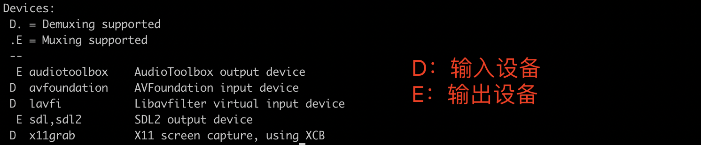

# FFmpeg 基础知识

FFmpeg是一套可以用来**记录**、**转换**数字音频、视频，并能将其转化为流的开源计算机程序，可以轻易地实现多种视频格式之间的相互转换，是非常强大的多媒体视频处理工具，能够解码（decode）、编码（encode）、转码（transcode）、复用（mux）、解复用（demux）、流（stream）、过滤（filter）和播放（play）等。

>容器（Container）：一种文件格式，比如flv，mkv等，包含下面5种流以及文件头信息
>
>流（stream）：一种视频数据信息的传输方式，包括音频，视频，字幕，附件，数据 等5种数据流
>
>编解码器（Codec）：对视频进行压缩或者解压缩，Codec = 编码（encode） + 解码（decode）
>
>复用（mux）：把不同的流按照某种容器的规则放入容器
>
>解复用（demux）：把不同的流从某种容器中解析出来

​    

FFmpeg包括如下几个部分：

* **libavformat**：用于各种音视频封装格式的生成和解析，包括获取解码所需信息以生成解码上下文结构和读取音视频帧等功能，包含demuxers和muxer库；
* **libavcodec**：用于各种类型声音/图像编解码；
* **libavutil**：包含一些公共的工具函数，如随机数生成器，数据结构，数学例程，核心多媒体实用程序等；
* **libswscale**：用于视频场景比例缩放、色彩映射转换，是一个执行高度优化的图像缩放和颜色空间/像素格式转换操作的库；
* **libpostproc**：用于后期效果处理；
* **ffmpeg**：是一个命令行工具，用来对视频文件转换格式，也支持对电视卡实时编码；
* **ffsever**：是一个HTTP多媒体实时广播流服务器，支持时光平移；
* **ffplay**：是一个简单的播放器，使用ffmpeg 库解析和解码，通过SDL显示；
* **ffprobe**：收集多媒体文件或流的信息，并以人和机器可读的方式输出；
* **libswresample**：是一个执行高度优化的音频重采样，重矩阵化和样本格式转换操作的库；

​    

接下来这里主要介绍FFmpeg程序的3个应用程序：ffmpeg、ffplay、 ffprobe的部分基础使用方法


# 一 ffmpeg

功能：常用于转换音频或视频格式的命令行工具

​      

## 1.1 常用参数

| 参数类型                    | 参数选项                                                     |
| --------------------------- | ------------------------------------------------------------ |
| a. 打印帮助/信息/能力的参数 | **Print help / information / capabilities**<br />-h 帮助，是列出常用的一些参数，如果想知道更多的参数可以在 -h 之后加一个long或者full<br />-version，显示版本<br />-formats，显示可用的格式，编解码的，协议的...<br />-codecs，显示可用的编解码器 |
| b. 全局参数                 | **Global options是全局生效，而不是只针对某一个文件**<br />-loglevel loglevel，设置日志级别,loglevel总共有6个值，每个值输出的信息量不同，分别为 quiet、panic、fatal、error、warning、info、verbose、debug、trace，其中info、debug、error三个级别比较常用<br />**-v loglevel**，设置日志级别<br />-report，生成一个报告<br />**-i filename** 输入文件<br />-y 覆盖输出文件<br />-n 不要覆盖输出文件 |
| c. 单独生效参数             | **Per-file main options操作每个文件单独生效**<br />**-f fmt**，强迫采用格式fmt，如 image2 / gif<br/>-c codec，codec名字<br/>-codec codec，codec 名字<br/>-fs filesize，输出文件最大（10MB）<br />-ss starttime，从第几秒开始处理（00:30）<br />-vf videofilter，视频过滤器，如左右翻转hflip<br />-pixv_fmt picfmt，图片编码，如rgb24<br />-map fmt，指定流操作，如 复制第一个声音流<br />-t duration 设置纪录时间（代表持续时间，单位为秒），其中 hh:mm:ss[.xxx]格式的记录时间也支持 |
| d. 视频选项                 | **Video options视频参数**<br />**-vframes** number，指定抽取的帧数 <br />**-r rate**，指定抽取的帧率，即从视频中每秒钟抽取图片的数量  <br />-fpsmax rate，设置最大帧率  <br />-b bitrate，视频比特率设置（24k or 24000）<br />-s size，分辨率设置（320x240）<br />-aspect aspect，设置长宽比（设置视频比例），一般是4:3, 16:9 或者 1.3333, 1.7777 <br />-vn，取消视频的输出<br />-vcodec codec，强制使用codec编解码方式，如果用copy表示原始编解码数据必须被拷贝 |
| e. 音频选项                 | **Audio options音频参数**<br />-aframes number，设置音频帧的数量输出<br/>-ar rate，设置音频采样率（24k or 24000）<br/>-ac channels，设置声道数，1单声道，2立体声<br/>-ab bitrate，音频比特率（24k or 24000）<br />-an 取消音频的输出（不处理音频）<br />-vol volue，设定音量(百分比)<br />-acodec codec，指定音频编码（如 aac），同理如果用copy表示原始编解码数据必须被拷贝 |
| f. 字幕选项                 | Subtitle options字幕参数<br />                               |

​      

## 1.2 使用案例 - 指令

ffmpeg使用：

```shell
ffmpeg [global_options] {[input_file_options] -i input_url} ... {[output_file_options] output_url} ...
```

​      

### 1.2.1 查询音视频的信息

可以获取到视频的时长，分辨率，码率，帧率，视频压缩标准、音频采样率等

```shell
ffmpeg -i xxx.xxx
```

<div align="center"></div>

​     

### 1.2.2 抽取音/视频流/只提取视频ES数据

把视频input.mp4的音频按照原有的编码方式取出来

```shell
ffmpeg -i input.mp4 -acodec copy -vn out.aac
```

<div align="center"></div>

​        

可以把视频input.mp4的视频按照原有的编码方式取出来

```shell
ffmpeg -i input.mp4 -vcodec copy -an out.h264
```

<div align="center"></div>

​      

只提取视频ES数据

```shell
ffmpeg –i input.mp4 –vcodec copy –an –f m4v output.h264
```

​        

### 1.2.3 音视频合成

把音频和视频按照各自原有的编码方式合并

```shell
ffmpeg -i out.h264 -i out.aac -vcodec copy -acodec copy out.mp4
ffmpeg -y –i input.mp4 –i input.mp3 –vcodec copy – acodec copy output.mp4
```

<div align="center"></div>

​       

### 1.2.4 格式转换

转换封装格式

```shell
ffmpeg -i input.mp4 -vcodec copy -acodec copy out.flv
```

转换编码格式（MPEG4转换成H264）

```shell
ffmpeg -i input.mp4 -vcodec h264 output.mp4
```

PS：但如果ffmpeg编译时，添加了外部的x265或者X264，那也可以用外部的编码器来编码（X265不包含在ffmpeg的源码里，是独立的一个开源代码，用于编码HEVC，ffmpeg编码时可以调用它。当然了ffmpeg 自己也有编码器）

```shell
ffmpeg -i input.mp4 -c:v libx265 output.mp4 

ffmpeg -i input.mp4 -c:v libx264 output.mp4
```

​        

### 1.2.5 视频与图片: 分解&合成

视频分解成图片 & 截图

```shell
ffmpeg -i video.mp4 img/image%d.jpg

# 截取0.001的视频图片, 并以320x240分辨率输出
fmpeg –i input.mp4 –f image2 -t 0.001 -s 320x240 image-%3d.jpg
```

<div align="center"></div>

​        

图片合成视频（无声音）

```shell
ffmpeg -f image2 -i img/image%d.jpg video.mp4
```

<div align="center"></div>

​     

### 1.2.6 图片/视频转GIF

图片转GIF

```shell
ffmpeg -i image%d.jpg -r 30 out.gif
```

视频转GIF

```shell
ffmpeg -i test.mp4 -ss 00:00:00 -t 10 test.gif
```

​             

### 1.2.7 视频裁剪&旋转&翻转

视频裁剪

```shell
# 使用 -ss 和 -t 选项，从第0秒开始，向后截取30秒视频，并保存
ffmpeg -ss 00:00:00 -i video.mp4 -vcodec copy -acodec copy -t 00:00:30 output1.mp4

# 从第 00:30:30 开始，向后截取 00:20:15 的视频，并保存
ffmpeg -ss 00:30:30 -i video.mp4 -vcodec copy -acodec copy -t 00:20:15 output2.mp4

# 截取视频局部
ffmpeg -i in.mp4 -filter:v "crop=out_w:out_h:x:y" out.mp4

# 截取部分视频: 从[80,60]的位置开始，截取宽200，高100的视频
ffmpeg -i in.mp4 -filter:v "crop=80:60:200:100" -c:a copy out.mp4

# 视频截去: 截去底部40像素高度
ffmpeg -i in.mp4 -filter:v "crop=in_w:in_h-40" -c:a copy out.mp4

# 截取右下角的四分之一
ffmpeg -i in.mp4 -filter:v "crop=in_w/2:in_h/2:in_w/2:in_h/2" - c:a copy out.mp4
```

视频旋转&翻转

```shell
# 旋转90 °（PI即π， PI/2即π/2，即90 度）
ffmpeg -i input.mp4 -vf rotate=PI/2 output.mp4 
ffmpeg -i input.mp4 -vf rotate=90 output.mp4

# 顺时针方向旋转90 度
ffplay -i input.mp4 -vf transpose=1

# 视频水平翻转: hflip左右翻转，vflip垂直翻转
ffplay -i input.mp4 -vf hflip
```

​           

### 1.2.8 视频缩放&拼接

视频缩放

```shell
# 宽度缩一半，保持宽高比，其中 iw是输入的宽度，iw/2就是一半，-1为保持宽高比
ffmpeg -i input.mp4 -vf scale=iw/2:-1 output.mp4
```

视频拼接：把两个视频合并成一个视频可以使用 **TS格式拼接视频**，因此需要先将 mp4 转化为同样编码形式的 ts 流，因为 ts流是可以 concate 的，即先把 mp4 封装成 ts ，然后 concate ts 流， 最后再把 ts 流转化为 mp4。

```shell
# 第一步：将mp4转化成ts流
ffmpeg -i output1.mp4 -vcodec copy -acodec copy -vbsf h264_mp4toannexb output1.ts
ffmpeg -i output2.mp4 -vcodec copy -acodec copy -vbsf h264_mp4toannexb output2.ts

# 第二步：为了减少命令的输入，需要一个filelist.txt文件，里面内容如下
file 'output1.ts'
file 'output2.ts'

# 第三步：concate ts 流， 然后把 ts 流转化为 mp4，其中filelist.txt即所拼接文件地址的txt文件
ffmpeg -f concat -i filelist.txt -acodec copy -vcodec copy -absf aac_adtstoasc output.mp4
```

​      

### 1.2.9 码率控制

码率控制对于在线视频比较重要，因为在线视频需要考虑其能提供的带宽，那么什么是码率？

> **bitrate = file size / duration**

比如一个文件20.8M，时长1分钟，那么

> biterate = 20.8M bit/60s = 20.8 \* 1024 \* 1024 \* 8 bit / 60s= 2831Kbps

一般音频的码率只有固定几种，比如是128Kbps，那么 video 的就是video biterate = 2831Kbps -128Kbps = 2703Kbps。

​     

ffmpg控制码率有3种选择，-minrate、 -b:v 、-maxrate

1）**-b:v**：主要是控制平均码率，比如一个视频源的码率太高了，有10Mbps，文件太大，想把文件弄小一点，但是又**不破坏分辨率**

```shell
ffmpeg -i input.mp4 -b:v 2000k output.mp4
```

上面把码率从原码率转成2Mbps码率，这样其实也间接让文件变小了，目测接近一半。不过，ffmpeg官方wiki比较建议，设置b:v时，同时加上 -bufsize

PS：**-bufsize** 用于设置码率控制缓冲器的大小，设置的好处是，**让整体的码率更趋近于希望的值**，减少波动（简单来说，比如 1 2的平均值是1.5， 1.49 1.51 也是1.5, 当然是第二种比较好）。

```shell
ffmpeg -i input.mp4 -b:v 2000k -bufsize 2000k output.mp4
```

2）-minrate、-maxrate：在线视频有时候，希望码率波动，不要超过一个阈值，可以设置maxrate

```shell
ffmpeg -i input.mp4 -b:v 2000k -bufsize 2000k -maxrate 2500k output.mp4
```

​         

### 1.2.10 关键帧提取

提取视频关键帧并保存在指定路径

```shell
ffmpeg -i test.mp4 -vframes 5 -vf select='eq(pict_type\,I)' -vsync 2 -f image2 imgs/pic_%02d.jpg
```

参数说明：

* -i：输入文件
* **-vframes 5**：表示要输出的视频帧数，这里是一共输出5个视频帧
* **-vf**：过滤器，select是一个选择过滤器，**pict_type**表示的帧类型，这里写了I，意思是要取I帧，即关键帧
* **-vsync 2**：阻止每个关键帧产生多余的拷贝
* **-f image2** imgs/pic_%02d.jpg：表示将视频帧写入到图片中，输出到imgs文件夹下，并且每一张图片命名为pic_xxx.jpg，这 样保存下来的关键帧的命名顺序是从1开始的，数字就表示第几个关键帧

​         

### 1.2.11 视频水印

| 水印类型      | 使用                                                         |
| ------------- | ------------------------------------------------------------ |
| 图片水印      | ffmpeg -i src.mp4 -acodec copy -b:v 42695k -vf "movie=logo.png[watermark];\[in][watermark]overlay=20:20" out.mp4<br />ffmpeg -i input.mp4 -vf  "movie=logo.png[wm]; \[in][wm]overlay=30:10[out]" movie.mp4<br /><br />将透明水印加入到视频中效果会更好一点，当只有纯色背景的logo，可以考虑使用movie 与colorkey滤镜配合做成半透明的效果<br />ffmpeg -i input.mp4 -vf  "movie=logo.png, colorkey=black:1.0:1.0 [wm]; \[in][wm]overlay=30:10[out]" colorkey.mp4<br /><br />PS：如需修改水印图片的尺寸，可以用如下命令：<br />ffmpeg -i logo.png -strict -2 -s 240x240 logo1.png<br /><br />参数说明：<br />  -i src.mp4：要处理的视频文件<br />  -acodec copy：保持音频不变 <br />  -b:v 42695k：设置视频比特率，默认200k，最好设置与原视频一致，不然清晰度可能变差 <br />  -vf “…”：水印处理参数，其中 logo.png 是水印图片，overlay=20:20是图片左上角距离视频左上角的距离 <br />  out.mp4：输出文件名 |
| 文字水印      | ffmpeg -i video.mov -vf "drawtext=fontfile=simhei.ttf: text='技术是第一生 产力':x=100:y=200:fontsize=100:fontcolor=white:shadowy=2" video_drawtext.mp4<br /><br /><br />参数说明：<br />fontfile：字体类型<br />text：要添加的文字内容<br />fontsize：字体大小<br />fontcolor：字体颜色 |
| 本地时间水印  | ffmpeg  -i src.mp4 -vf "drawtext=fontsize=160:text='%{localtime\:%T}'" -c:v libx264 -an -f mp4 output.mp4 -y |
| pts时间戳水印 | 把视频的pts时间戳添加为视频水印，精度到毫秒<br />ffmpeg -t 5 -i video.mov -vf "drawtext=fontsize=160:text='%{pts\:hms}'" -c:v libx264 -an -f mp4 output.mp4 -y |

​        

### 1.2.12 设备采集

| 操作       | 说明                                                         |
| ---------- | ------------------------------------------------------------ |
| 设备枚举   | 查看设备列表：ffmpeg -hide_banner -devices<br /><br /><br />设备采集举例：ffmpeg -f avfoundation -list_devices true -i " "<br /> |
| 采集摄像头 | 采集内置摄像头：ffmpeg -f avfoundation -i  "FaceTime高清摄像头" out.mp4<br />或者使用索引号 0 来代替摄像头设备名称：ffmpeg -f avfoundation -i  0 out.mp4<br /><br />从打印的日志 *Selected framerate (29.970030) is not supported by the device* ，默认的framerate 不被设备支持，下面也给出了支持的分辨率和framerate，因此设置分辨率 *640x480@[30.000030 30.000030]fps*：<br />ffmpeg -f avfoundation -video_size 640x480 -framerate 30 -i  "FaceTime高清摄像头" out.mp4<br /><br />如果把摄像头和麦克风的数据存到一个文件里<br />ffmpeg -f avfoundation -video_size 640x480 -framerate 30 -video_device_index 0 -i ":0" out.mp4<br />ffmpeg -f avfoundation -video_size 640x480 -framerate 30 -i "0:0"  out.mp4<br /><br />若播放录制的视频数据：ffplay out.mp4 |
| 采集桌面   | 采集桌面视频数据：ffmpeg -f avfoundation -i "Capture screen 0" -r:v 30 screen.mp4<br />或者使用索引号1 来代替屏幕设备名称：ffmpeg -f avfoundation -i 1 -r:v 30 screen.mp4<br />若参数"Capture screen 0"指定了输入设备，也可以将桌面图像带上鼠标一起录制下来，加上参数-capture_cursor<br />ffmpeg -f avfoundation -capture-cursor 1 -i "Capture screen 0" -r:v 30 screen.mp4 |

​        

### 1.2.13 音视频变速

```shell
# 视频2倍速
ffmpeg -i input.mp4 -filter:v setpts=0.5*PTS output.mp4 
ffmpeg -i input.mp4 -vf "setpts=0.5*PTS" output.mp4

# 音频2倍速
ffmpeg -i input.mp4 -filter:a atempo=2.0 output.mp4 
ffmpeg -i input.mp3 -vf "setpts=0.5*PTS" output.mp3

# 音视频倍速互倒
ffmpeg -i input.mp4 -filter_complex "[0:v]setpts=0.5*PTS[v]; [0:a]atempo=2.0[a]" -map "[v]" -map "[a]" output.mp4
```

​      

### 1.2.14 音视频设置（分辨率/比特率/帧率/比例）

```shell
# 分辨率转换: 转为720x1920分辨率，h264编码
ffmpeg -i input.mp4 -c:v h264 -c:a copy -s 720x1920 output.mp4

# 帧率设置: 设置帧率30
ffmpeg -i input.mp4 -r 30 output.mp4
ffmpeg -v input.mp4 -vf fps=fps=30 output.mp4

# 比特率设置:
ffmpeg -i input.mp4 -b 1.5M output.mp4     # 整体1.5Mbit
ffmpeg -i input.mp4 -b:v 1500K output.mp4  # 视频1.5Mbit

# 比例设置: 比例16:9
ffmpeg -i input.mp4 -aspect 16:9 output.mp4
```

​       

### 1.2.15 推拉流

推拉流命令：stream_loop: 循环次数，-1 无限循环

```shell
# 推流
# ffmpeg -stream_loop -1 -re -i "视频路径/xxx.flv(文件名)" -c copy -f flv "rtmp://...(推流地址)"
ffmpeg -stream_loop -1 -re -i "videos/zmpf.flv" -c copy -f flv "rtmp://live-push.website.com/live-bvc/? streamname=xxxx&key=xxxx&schedule=rtmp&pflag=1"

# 拉流
# ffplay -user_agent "Test Freedoooooom/MarkII" -referer "http://live.test.com/" "拉流地址:host+extra+base_url"
ffplay -user_agent "Test Freedoooooom/MarkII" -referer "http://live.test.com/" "http://www.website.com/live-bvc/xxxx/live_xxxx.flv?expires=xxx&len=90&....."
```

​     

推流到测试服务器命令：

```shell
# 推流
# ffmpeg -stream_loop -1 -re -i "视频文件地址" -c copy -f flv "服务器地址+流名"
ffmpeg -stream_loop -1 -re -i "videos/xxx.flv" -c copy -f flv "rtmp://test.website.com/live-bvc/live_385794871_26470493"
# ps: 正常推流, 流名后面加?hls_fmp4=0(没有fmp4切片)、hls_ts=1(有ts切片)

# 拉流
# ffplay -user_agent "Test Freedoooooom/MarkII" -referer "服务器地址" "流地址"
ffplay -user_agent "Test Freedoooooom/MarkII" -referer "http://test.website.com" "http://test.website.com/live- bvc/live_385794871_26470493/ts_index.m3u8?hls_ts=1"
```

​        

### 1.2.16 统计&抽取 I/P/B 帧

抽取视频关键帧（IPB帧） 

```shell
# 1) 使用ffprobe提取出IPB帧的时间
ffprobe -i video.mov -v quiet -select_streams v -show_entries frame=pkt_dts_time,pict_type 

# 2) 抽取IPB帧到jpg图片
## 抽取I帧
ffmpeg -i video.mov -vf "select=eq(pict_type\,I)" -vsync vfr -qscale:v 2 -f image2 ./%08d.jpg

## 抽取P帧
ffmpeg -i video.mov -vf "select=eq(pict_type\,P)" -vsync vfr -qscale:v 2 -f image2 ./%08d.jpg

## 抽取B帧
ffmpeg -i video.mov -vf "select=eq(pict_type\,B)" -vsync vfr -qscale:v 2 -f image2 ./%08d.jpg

# 3) 均匀抽帧: -r 指定抽取的帧率，即从视频中每秒钟抽取图片的数量, 其中1代表每秒抽取一帧
ffmpeg -i video.mov -r 1 -q:v 2 -f image2 ./%08d.000000.jpg
```

​       

## 1.3 注意事项Tips

1）文件转码后和原定的效果不一致，看是否音频或视频转换过程中流没拷全，如要转码一个多音轨的视频

```shell
# 将两个音轨和一个视频轨道拷贝
ffmpeg -i input.mp4 -map 0:a:0 -map 0:a:1 -map 0:v:0 output.mp4
```

2）文件大小计算（音视频流大小的和）

视频流的大小的方程式（除以8是由bits到bytes的转换）：

> video_size = video_bitrate * time_in_seconds / 8

如果音频是解压缩的，计算公式是：

> audio_size = smpaling_rate * bit_depth * channels * time_in_second / 8;

例如：计算10分钟的视频，1500kbits/s 视频比特率和 128kbits/s的音频比特率，用下面的计算方法：

> file_size = video_size + audio_size
>
> file_size = (video_bitrate + audio_bitrate) * time_in_seconds / 8
>
> file_size = (1500 kbits/s + 128kbits/s) * 600s 
>
> file_size = 1628kbits/s * 600s file_size = 976800kb = 976800000 b / 8 = 122100000 B / 1024 = 119238.28125KB 
>
> file_size = 119238.28125 KB / 1024 = 116.443634033203125MB = 116.44M

3）ffmpeg 为了加速会使用**关键帧技术**， 所以有时剪切出来的结果在起止时间上未必准确，且通常来说，**把 -ss 选项放在 -i 之前，会使用关键帧技术; 把 -ss 选项放在 -i 之后，则不使用关键帧技术**。 

如果要使用关键帧技术，又要保留时间戳，可以加上 -copyts 选项

```shell
ffmpeg -ss 00:01:00 -i video.mp4 -to 00:02:00 -c copy -copyts cut.mp4
```

4）-vf transpose值

* 0 为90°逆时针旋转，垂直翻转
* 1为顺时针旋转90°
* 2为逆时针旋转90°
* 3为顺时针旋转90°，垂直翻转

​         

​    


# 二 ffplay

ffplay是用于播放的应用程序，是ffmpeg工程中提供的播放器，凡是ffmpeg支持的视音频格式它基本上都支持。

​    

## 2.1 常用参数

ffplay常用选项参数：

* -formats，显示有效的格式
* -x width，强制以width显示视频宽度，不够的用黑边补充
* -y height，强制以height显示视频高度
* -an，禁止音频
* -vn，禁止视频
* -ss pos，跳转到指定位置(秒)播放
* -t duration，播放固定时长的音/视频
* -f fmt，强制使用指定格式播放
* -loop number，循环播放n次，如果number设置为0，则会一直循环播放

​     

## 2.2 使用案例 - 指令

```shell
# ffplay使用方式
ffplay [options] input_file

# 常规的播放命令
ffplay video.mp4 

# 如果希望能在播放完后自动退出，则可以使用命令
ffplay -autoexit freeze.mp4 

# 要以360 X 640的大小播放
ffplay -x 360 -y 640 video.mp4 

# 循环播放2次
ffplay -loop 2 video.mp4

# 播放双声道32k的pcm音频数据
ffplay -f s16le -ar 32000 -ac 2 video.pcm
```

​      

# 三 ffprobe

ffprobe是用于**查看音视频文件格式的应用程序**，比如 `封装格式`、`音频/视频流信息`、`数据包信息` 等。简单的说，ffprobe是 一个**多媒体流分析工具**，它从多媒体流中收集信息，并且以人类和机器可读的形式打印出来，其次它可以用来检测多媒体流的容器类型，以及每一个多媒体流的格式和类型。

​     

## 3.1 常用参数

ffprobe常用选项参数：

* -version：显示版本信息
* -formats：显示有效的格式
* -filters：显示libavfilter有效的过滤器
* -sample_fmts：显示有效的采样格式
* -show_error：显示探测输入文件时的错误信息 流中每一个包的信息
* -show_frames：显示输入多媒体流中的每一帧以及字幕的信息 流中每一个流的信息
* -show_programs：显示输入多媒体流中程序以及它们的流的信息 的章节信息
* -count_frames：计算每一个流中的帧数，在相应的段中进行显示
* -protocols：显示有效的协议 
* -pix_fmts：显示有效的像素格式
* -f format：强制使用的格式 
* -show_format：显示输入多媒体流
* -show_packets：显示输入多媒体 
* -show_streams：显示输入多媒体
* -show_chapters：显示格式中存储
* -print_format json：JSON格式输出，每一个section使用JSON符号来打印 的容器格式信息

​       

## 3.2 使用案例 - 指令

### 3.2.1 查看多媒体封装格式

查看封装格式：

```shell
ffprobe -show_format video.mov
```

<div align="center"></div>

输出信息：

* 文件名：filename=video.mov
* 容器中流的个数： nb_streams=2 
* 节目数：nb_programs=0
* 封装格式名称：format_name=mov,mp4,m4a,3gp,3g2,mj2 
* 封装格式完整名称：format_long_name=QuickTime / MOV
* 媒体文件的开始时间，单位秒：start_time=0.000000 
* 媒体文件的总时长，单位秒：duration=19.797000
* 媒体文件的大小，单位字节：size=29199425
* 媒体文件的码率：bit_rate=11799535

​       

### 3.2.2 查看多媒体数据包信息

查看的多媒体数据包信息：

```shell
ffprobe -show_packets video.mov
```

<div align="center"></div>

参数说明：

* codec_type：多媒体类型，如视频包、音频包等
* stream_index：多媒体的stream索引
* pts：多媒体的显示时间值
* pts_time：根据不同格式计算过的多媒体的显示时间
* dts：多媒体解码时间值
* dts_time ：根据不同格式计算后的多媒体解码时间值
* duration ：多媒体包占用的时间值
* duration_time ：根据不同格式计算后的多媒体包占用的时间值
* size：多媒体包的大小
* pos：多媒体包所在的文件偏移位置
* flags：多媒体包标记，如关键包（flags=K_ ）与非关键包（flags=__ ）的标记

​         

### 3.3.3 查看多媒体视频帧信息

查看的多媒体视频帧信息：

```shell
ffprobe -show_frames video.mov
```

<div align="center"></div>

参数说明：

* media_type：帧的类型，视频video、音频audio、字幕等
* key_frame ：是否关键帧
* pkt_pts ：
Frame包的pts
* pkt_pts_time ：Frame包的pts的时间显示
* pkt_dts ：Frame包的dts
* pkt_duration ：Frame包的时长
* pkt_pos ：Frame包所在文件的偏移位置
* width：帧显示的宽度
* height ：
帧显示的高度
* pix_fmt ：帧的图像色彩格式
* pict_type ：帧类型，如 I / P / B

​       

### 3.2.4 每个流的具体信息

查看指令：

```shell
ffprobe -v info -print_format json -show_format -show_streams video.mov
```

参数说明：

* -v info:日志级别
* -print_format json：输出格式为json字符串 
* -show_format：显示输入多媒体流的容器格式信息 
* -show_streams：显示输入多媒体流中每一个流的信息

​         

# 附录

1. [FFmpeg官方文档](http://ffmpeg.org/documentation.html)
2. [FFmpeg基础知识](https://www.kancloud.cn/idzqj/customer/1231609)
3. [ffmpeg examples](https://hhsprings.bitbucket.io/docs/programming/examples/ffmpeg/index.html#)
4. [FFmpeg原理介绍](https://ffmpeg.xianwaizhiyin.net/)
5. [Github: FFmpeg使用指南](https://github.com/feixiao/learn-ffmpeg/blob/master/src/B_FFmpeg%E4%BD%BF%E7%94%A8%E6%8C%87%E5%8D%97.md)


