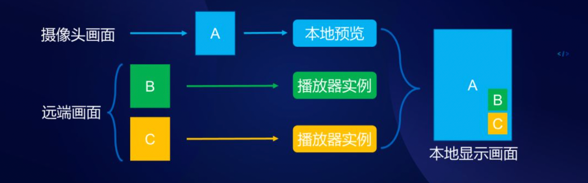
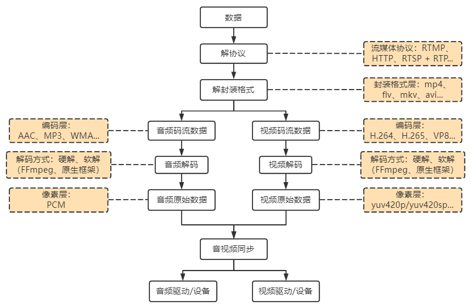

# 直播那些事

直播基础架构可以简单描述以下三端：

如下可比较直观的且完整表现了三端之间流程：

1）**推流端**：主播使用集成了推流SDK的App或开播工具采集图像&音频数据（**采集**），后经过美颜/磨皮/降噪等前处理（**预处理**），再进行编码压缩（**编码**），最后从主播端推流至CDN边缘节点（**推流**）；

2）**服务端**：边缘节点接收到源流后，会再将源流转推到直播源站，源站内部会进一步地将源流转推至其他集群完成分片、转码、录制、连麦等任务，并将转码后直播流分发至各CDN节点；

3）**拉流端**：拉流 SDK 会根据流地址向 CDN 边缘节点拉流，如果该节点命中这路流的缓存数据，则直接返回缓存数据，若未命中则触发回源，从直播源站取得流数据，并在该节点留下缓存数据；

4）**直播业务平台**： 主播和观众在发布/订阅直播内容时，都需要依赖直播APP/PC等设备，比如：主播只有在对应直播APP平台注册并通过审核后，才可以创建房间进行直播，然后观众也是通过直播APP进入某个主播的房间实时观看直播及互动，而其中对应直播APP后端平台就是直播业务平台，**实现用户注册和管理、房间管理、鉴权和授权管理等能力**；

总的来说，**直播是将每一帧数据，打上时序标签后进行流式传输的过程**。即发送端不断地采集音视频数据，经过编码、封包、推流，再经过中继分发网络进行扩散传播，播放端不断地下载数据并按时序进行解码播放，从而实现了 “**边生产、边传输、边消费**” 的直播过程。

​    

# 一 推流端（主播端）

功能：通过在直播APP/PC等设备中集成推流SDK，实现直播相关的采集、编码、推流及增值业务等能力

推流端流程：

1）采集音视频资源：从系统的采集设备中（如：摄像头/麦克风）获取原始音视频数据，将其输出到下一个环节

* 音频采集：即通过麦克风设备将环境中的音频模拟信号采集成PCM编码的原始数据，主要指标 采样频率 / 位宽 / 声道数 / 音频帧 等
* 图像采集：即由摄像头等设备拍摄成YUV 编码的原始数据，主要指标 分辨率 / 采样频率 / 采集格式 / 传输通道（正常一个，VR/AR多个）

2）预处理：即将音视频设备采集的原始音视频数据经过一些预处理，比如 添加图像特效（水印/美颜/滤镜，部分在编码前进行），音频降噪/混音，直播连麦处理也有部分工作在推流端完成等等 

3）编码封装：编码是直播过程中最重要的环节，也是视频直播中最耗费硬件的，因为原始视频流的数据量太大，必须经过编码压缩才能在网络上传输。

* 当前视频编码主流方案是H264，如果CPU使用率在50%以下，可以选择软件编码，如果电脑在cpu使用率高的时候，用 NvidiaENC硬件编码 /AMD Media Framework硬件编码等方案，硬件编码无论是画质还是速度都要胜于软件编码，因此结合电脑硬件信息切换编码方式，可尝试解决一些画面编码质量问题 

4）推流：即将直播流推送至直播边缘CDN节点，常见推流协议 rtmp（rtmp://...）、srt（srt://...）、webrtc（webrtc://...），且不同推流协议各有特点，可结合实际使用

| 推流协议 | 简介                                                         |
| -------- | ------------------------------------------------------------ |
| RTMP     | 一个基于 TCP协议族，包括 RTMP 基本协议及 RTMPT/RTMPS/RTMPE 等多种变种，广泛用于直播领域 优点：CDN支持良好，协议简单 缺点：TCP（高时延），传输成本较高，弱网丢包率高 |
| SRT      | 基于UDP协议的开源互联网传输协议 优点：具有较好的丢包重传能力，解决了复杂的传输时序问题并且可以减少延迟 缺点：带宽占用高，传输策略激进，会影响同网络下的其他用户，且底层基于UDP，而防火墙对于UDP并不友好，会导致握手失败 |
| WebRTC   | 网页即时通信框架，是一个支持网页浏览器进行实时语音对话或视频对话的技术方案 优点：低延时、流量更少、性能好 缺点：主要面向Web应用，维护费用高 |

**注**：srt和rtmp推流，网络状态良好，地址无差异，而网络状况较差时，srt地址可能会导致花屏（丢失部分帧内数据），rtmp 可能会出现黑屏重连（丢帧/卡顿）

​     

# 二 服务端（流媒体服务器）

功能：包含一系列的媒体服务器，实现对视频直播的控制面（用户认证、房间管理等）和数据面（音视频流的推流和拉流）的统一接入、管理和调度能力，同时媒体服务也可以根据直播平台业务需求，对视频流进行连麦、转码、内容审核、录制等功能。

| 功能点          | 说明/详情                                                    |
| --------------- | ------------------------------------------------------------ |
| 转码&转封装     | 1）支持**多终端观看**，因此需要在服务端对流进行 **转码 / 转封装**，比如支持 RTMP、HLS、HTTP-FLV、WebRTC等传输协议进行拉流 2）适应不同的网络带宽，支持**一路转多路码流**，适配**不同网络和分辨率**的终端设备进行播放（分辨率降级&切换） 3）适应不同终端的处理能力，进行**转封装**操作，比如将推来的FLV转为对 Android原生兼容性更好的TS/FMP4 4）支持不同的用户需求，进行定制化处理，比如打水印，加字幕等 ... ... |
| 录制截图        | 1）法律要求原因 2）用于封面，视频回放 3）鉴黄 ... ... |
| 内容分发网络CDN | 1）CDN 优化整个传输链路，CDN减少直播服务器的负载，解决跨网访问、传输拥塞等问题 2）降低由于地理距离导致的直播延迟（首帧延迟） 3）降低遭受DDos攻击风险 4）CDN快速响应的特性，可以提升直播质量  |

​      

## 1 边缘计算（加速直播）

当业务逐渐发展，直播平台需要实现为不同区域（国内或国外）、不同运营商的用户提供覆盖和直播服务，伴随而来可能产生如下的问题：

* **高并发瓶颈**： 直播中心（直播源站）难以承载百万级、千万级规模的用户瞬时高并发请求
* **带宽瓶颈**： 直播中心的网络资源难以满足大量用户的视频接入和分发
* **体验不一致**： 不同地方用户因为物理距离差异带来额外的网络时延，从而导致用户体验不一致

因此不断消减了中心的概念，往边缘的方向发展，旨在更加靠近用户的网络边缘，提供标准的计算能力和 IT 服务（同源站），并将时延敏感业务、流量接入业务部署在用户本地网络，**承载直播流的就近分发和就近访问**，一方面降低就近接入用户的直播时延（低时延），另一方面降低中心带宽压力，从而为用户提供高清、流畅的直播互动和观看体验。

* 边缘距离用户更近的优质节点
* 更强的弹性扩容能力
* 分散服务，可快速上下线问题节点
* 本地化的计算资源成本更低
* 可监控整个链路的质量

​    

### 1）推拉流加速

如果将所有主播的直播流都推送至直播中心，然后所有观众也都从直播中心拉流，那么势必对直播中心带来巨大的业务压力，同时主播/观众到直播中心间的网络链路存在长距离传输，其网络性能存在带宽受限、不稳定等因素也会影响最终的用户体验。

因此，通过边缘计算提供的边缘实例自建直播网络，将推拉流能力部署在更加靠近终端用户的边缘，**实现就近接入、转发用户直播流数据， 降低用户时延**，且同时边缘实例所在节点具备运营商高质量的**专线出口**，可以**有效保证用户-边缘节点-直播中心的网络传输质量，提升业务稳定性**。

* 1）**上行推流加速**： 基于用户地理位置亲和性，智能调度用户（主播）到最近的边缘计算节点提供视频直播流媒体推流服务，降低用户接入响应时延提升体验
* 2）**下行拉流加速**： 基于用户地址位置亲和性，智能调度用户（观众）到最近的边缘计算节点提供视频直播流媒体拉流服务。如果本地已经缓存直播流，直接分发，若本地无缓存，则回源直播中心拉流，有效降低用户拉流时延，并极大的节省直播中心带宽支出成本

​    

### 2）媒体处理加速

即将源站能力下沉到边缘，提供的通用算力，支持在用户本地即可对视频直播的用户媒体数据进行处理，比如将视频直播媒体服务中转码、切片、合流等服务直接在边缘本地部署，一方面**本地媒体数据处理可以提升用户交互相关业务的响应效率**，另一方面**在数据源头对数据进行压缩、优化处理可以提升边缘-中心的数据传输效率优化成本**。

同时，从全局系统架构来看，采用物理位置分散的边缘计算架构可以实现直播业务的分布式部署，从而实现更高并发、更稳定的业务能力。

即可考虑在边缘节点实现如下媒体服务处理：

* **窄带高清** / **转码**： 在保证用户观看视频质量的前提下，对直播流视频进行压缩，**降低回传带宽需求**
* **合流**： 对用户的多个视频流在边缘进行合流，降低回传带宽需求
* **转封装**： 针对用户不同终端类型（IOS、Android、HTML5等）动态转换流媒体封装协议
* **转码**： 实现视频流不同编码格式的转换
* **超分辨率**： 通过算法提升原片画质，满足高质量画面的用户需求
* **动态分辨率**： 基于用户的实时网络环境动态切换不同码率视频，保证视频流畅度

在直播场景中涌现出越来越多有趣的玩法和特效，可以极大丰富用户趣味性提升用户粘性，但高质量的视频特效，同样对用户终端提出更高的资源需求，而受限于硬件性能瓶颈，很多中档、低档的终端用户难以获得产品预期的效果从而影响体验。因此，**边缘计算节点提供通用的GPU算力资源，可以有效地辅助终端实现高质量的视频特效渲染，保证用户获得预期的直播体验**。

此外，由于边缘节点有个相同于源站的业务能力，因此针对不同热度（主播人气）使用不同转码架构实现以下4类分层治理：

​           

## 2 切片（FLV- > HLS）

HLS **基于 HTTP 协议传输小文件**，分片特性天然支持 P2P，也天然支持直播实时回看功能，且很容易实现动态清晰度和码率切换。此外，hls对 CDN 更加友好，和点播系统同属一种架构模式，有一定互补的空间，且原生支持IOS 生态，以及HEVC、AV1、杜比等新编码格式。

​      

## 3 转码清晰度策略

**转码成本**：平台主播数量房间和热度的增长，尾部主播向着腰部成长，腰部向着头部成长

**清晰度体验**：更多高清晰度技术的应用（如：4K直播，杜比清晰度，HDR清晰度，全景流清晰度等），对用户带宽也是一个不小的负担，也是造成卡顿的重要原因

更加细致的转码服务：

​     

## 4 直播回放

以HLS协议为例，由于HLS协议是将流媒体进行切片，因此只需要将切片的保存时间延长，就可以让用户访问到之前的内容，从而可得到直播回放的功能。

**方案**：在直播生成索引文件的过程中，除了将视频分片文件保存至指定的OSS（开放存储服务）存储位置外，只需要**同时生成对应的时间戳的索引文件**（存放新增的媒体分片文件地址），例如直播时索引文件叫 **index.m3u8**，此时同时生成一份 **utc.m3u8**。因此，在用户选择回放时服务端会返回对应时间点的索引文件 或 将各时间戳索引文件合并成回放的点播索引文件，从而完成了直播回放的功能。 

​     

## 5 直播连麦

**直播连麦**，与日常直播最大的一个不同就是，**实时性要求高**。而在典型的直播架构里，主播就近将直播流推流到上行加速边缘CDN节点以保证直播质量，再由边缘节点推流至直播云服务端进行系列处理（转码/录制等），后分发至直播下行边缘节点，而后观众客户端通过互联网访问就近的边缘CDN节点（具备RTMP、HLS、HTTP FLV能力的CDN）拉流进行观看。这个过程会经历多个网络节点，最终会有3-5s左右的时延，对于秀场、带货、游戏直播等等场景，这些都是完全可以接受的，但是一旦进入了连麦模式，连麦者与原主播之间的实时对话是无法接受这样的3-5s的时延的。

**注**：一般来说，如果主播和观众分布在不同地域，则跨地域推流由云直播内部完成，而各地域直播CDN只会从本地域云直播拉流。

由上可知，在这种模式下，从主播推流到观众拉流观看，视频数据流一直是单向的，互动性较差。

因此，如果要实现直播连麦功能，则直播架构需要实现以下几个功能点：

1. 原主播A的数据流要超低时延的到达连麦者；
2. 连麦者要成为新主播B角色进行推流；
3. 连麦新主播B的数据流要超低时延到达原主播；
4. 主播A和主播B的画面需要混合到一个画面；
5. 普通用户仍然是3-5s的一般时延观看混合画面的直播流；

​    

**补充**：合流工作

* 音频混流：主播将自己的声音与连麦者的声音做混音
* 视频混流：主播将自己的画面与连麦者的画面做视频合成
* 降噪：去除直播环境中的噪音，啸叫
* 回声消除：消除扬声器和麦克风的近端回声

​     

### 1）观众端合流

**思路**：主播端和连麦者端，都分别推一路直播流到就近的边缘CDN节点，而后观众端分别拉主播、连麦者的音视频数据，并在观众端进行合流并播放。

优势：简单易实现，主播端压力不大，可以快速搭建，支持多人连麦

劣势：

1. 观众端要接收多路流进行混流，带宽、流量消耗过大，下行带宽压力大，并且多路视频流解码播放，耗费CPU等资源也非常多，开销比较高；
2. 考虑到网络丢包/延时/抖动的情况，主播与连麦者交互延时增大，不利于实时交互；

​     

### 2）服务端合流

思路：在直播云服务端对主播和连麦端 音视频流进行合流处理，并推送至下行CDN边缘节点，而后观众端拉取合流后数据流进行播放观看

优势：支持多人连麦，主播和连麦者各路视频均推送云服务端进行合流，延时相对较小，且主播不需要很高的带宽和设备配置；

劣势：直播云服务端合流，需要额外开发工作，逻辑复杂，且服务器资源（CPU/GPU）消耗较高

​    

### 3）主播端合流

思路：主播拉取连麦端音视频流，并在本地与自身音视频流数据进行合流，后将合流后的音视频流推送至直播云服务端进行处理，而后观众端就近访问CDN节点获取合流后的直播流进行观看。

优势：

1. 无上行带宽瓶颈，推1路视频流，不存在主播端上行带宽瓶颈；
2. 直播云服务端成本降低（计算资源和网络带宽）；

劣势：

1. 主播端压力大，主播端需要视频混流以及面对计算压力，对手机性能和网络性能要求也比普通直播时更高一些，不适合多人连麦；
2. 主播端和观众端延迟稍大

​    

### 4）连麦技术难点

连麦直播问题：

​     

#### a 回音

**回声问题**：即大主播说的话通过麦克风采集，经通信线路传给小主播，通过小主播的扬声器播放出来，小主播说的话通过麦克风采集到大主播这边扬声器播放，这样双方就进行了音频的交换。这是理想的情况下，实际情况中遇到回声问题，回声一般分成两类：

* 1）**线路回声**：具体的细节就不多讲了，一般是由硬件厂商自己解决掉
* 2）**声学回声**：即大主播的原声在传到对方的扬声器播放之后，如果被对方的麦克风再采集一次（**回授**），然后再通过通信线路传回来，经扬声器播放出来，这时大主播就会听到自己的声音，也就是**回声**。此后，如果大主播的麦克风又采集并传输输出去，形成的**循环的回授**，就容易引起**啸叫**。

**注**：**人的耳朵特别灵敏，超过10毫秒以上的回声就能够分辨出来**，而通信线路往往是延时50毫秒以上，这样导致在连麦场景中回声几乎无法避免，所以必须要解决回声问题。

**怎么解决回声**？

回声产生原理已经知道了，那么可将通过播放器播放的声音，与麦克风采集的声音进行波形比对，把**回声做反向抵消**（**AEC过程**）。

​      

#### b 图像混合

画面混合：

1）**客户端混合**：即大主播和小主播之间都要看到对方的画面，需要在本地进行处理，一个是自己本地的预览，另一个是远端的数据渲染，这需要播放器支持多实例，这个过程相对来说比较简单，只要播放器支持多例，做好性能优化就可以搞定了。

2）**云端混合**：即通过upload拿到数据，在转码服务上有一个附加的混流模块，从 upload拿到数据之后，按照设定的参数分层叠加，再通过CDN进行分发，这就是云端混流（可以极大地减轻客户端的压力）

​       

## 6 主播PK

主播PK：即主播可以邀请另一个直播间的主播进行实时连麦，从而直播间内的观众可以同时观看两个房主互动，活跃气氛

如上图，主播A有普通观众A和B，主播B有普通观众C，主播A和主播B进行跨房间PK，需要做以下事情：

- 主播A：主播A使用主播B的拉流地址播放主播B的超低延时流，同时主播A发起混流操作，将自己和主播B的内容混成一路，供普通观众A和B观看；
- 主播B：主播B使用主播A的拉流地址播放主播A的超低延时流，同时主播B发起混流操作，将自己和主播A的内容混成一路，供普通观众C观看；
- 观众A/B和观众C不需要任何额外操作，观看画面自动从单主播画面切换成混流画面；

​      

# 三 播端（观众端）

功能：通过在直播APP/PC等设备中集成播放SDK，实现直播相关的拉流、解码、播放及播放体验优化等能力

播端过程：

* 解协议：将流媒体协议的数据解析获取到相应的封装格式数据，如 mp4 / m4s / flv / avi ...
* 解封装：从封装格式数据中分离出 音频流压缩编码数据 和 视频流压缩编码数据
* 音/视频解码：将视频/音频压缩编码数据，解码成为非压缩的图像数据（YUV，RGB）/ 音频抽样数据（PCM）
* 音视频同步：根据解封装模块处理过程中获取到的参数信息，同步解码出来的视频和音频数据，并将视频音频数据送至系统的显卡和声卡播放出来

​      

看端常见性能优化点：

| 优化点             | 详情                                                         |
| ------------------ | ------------------------------------------------------------ |
| 卡顿丢帧优化策略   | Android手机Camera采集不能指定固定帧率  由于Camera采集到原始数据后，会进行CV滤镜/美颜/特效/识别等操作，非常消耗手机性能，因此采集音视频数据后需进行丢帧操作，而IOS不存在该问题。 |
| 直播卡顿码率自适应 | 针对主播网络较差（或抖动）的情况，自动降低视频编码码率、帧率、分辨率以改善卡顿 1）秉承快降慢升原则：规避网络不稳定 2）码率切换：监控和调度会根据主播的开播情况（卡顿、直播流畅） 智能调度最优码率配置，提升主播开播体验  3）主播轻微/严重卡顿判断条件（满足一个即认为轻微/严重卡顿）： -- 丢帧行为 ，码率下降 -- 主播对应观众，观众发生轻微/严重卡顿 |
| 直播Buffer优化     | 通常Buffer 是设置好的，但是为了优化需要做动态调整，首次观看时，缓冲区有数据即可开始播放（秒开），播放视频通常也可以这么做。 比如： 直播观看过程中，发生首次卡顿后， 缓冲区缓冲数据时长需要达到 1000 毫秒，可开始播放，再次发生卡顿 ，缓冲数据时长要求翻倍，上限 为 5000 毫秒。 |
| 卡顿后追延时       | 比如：正常buffer时间2s 1）超过均值进行慢丢操作：buffer 2s—5s 慢丢，每个GOP丢1帧 2）远超均值进行快丢操作：buffer >= 5s，直接丢到2s |
| 秒开               | 首屏耗时，指第一次点击播放后，肉眼看到画面所等待的时间 ，技术上则指的是播放器解码第一帧渲染显示画面所花的耗时 1）GOP缓存：由于GOP 的第一帧通常都是关键帧，由于加载的数据较少，可以达到 “首帧秒开”，因此增加I帧获取几率，缓存 GOP 改成缓存双关键帧（减少图像数量） 2）减少GOP，低buffer播放（100ms）：即一拿到I帧就进行播放 |

​     

# 附录

## 直播基础

[1] [大型直播平台应用架构浅谈](https://cloud.tencent.com/developer/article/1956189)

[2] [视频直播技术大全、直播架构、技术原理和实现思路方案整理](https://cloud.tencent.com/developer/article/2107274)

[3] [视频直播技术干货](https://cloud.tencent.com/developer/article/2013841)

[4] [边缘计算加速视频直播场景：更清晰、流畅、实时](https://juejin.cn/post/7064842868560494623)

[5] [一文读懂直播卡顿优化那些事儿](https://juejin.cn/post/7062552765117136903?searchId=20230910103044EA25746ED3234806643B)

## 直播连麦

[1] [移动直播连麦技术实践（附视频回放）](https://mp.weixin.qq.com/s/yChYWXgMwHwZ1WXCFNG6TQ)

[2] [【实战分享】直播连麦解决方案分析](https://cloud.tencent.com/developer/article/1733386)

[3] [移动直播连麦几种处理方案（一）](https://www.jianshu.com/p/3a6fa4de373c)

