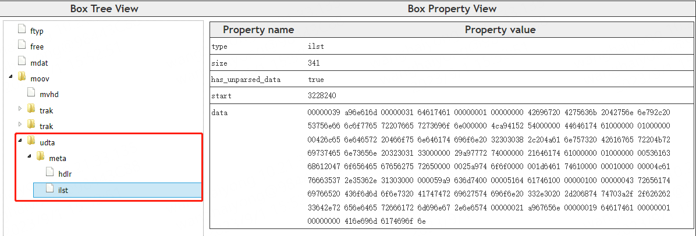
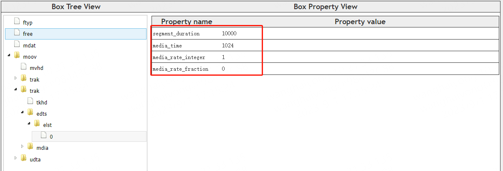
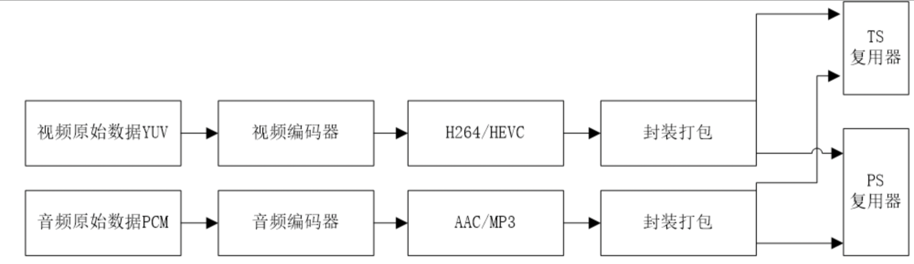
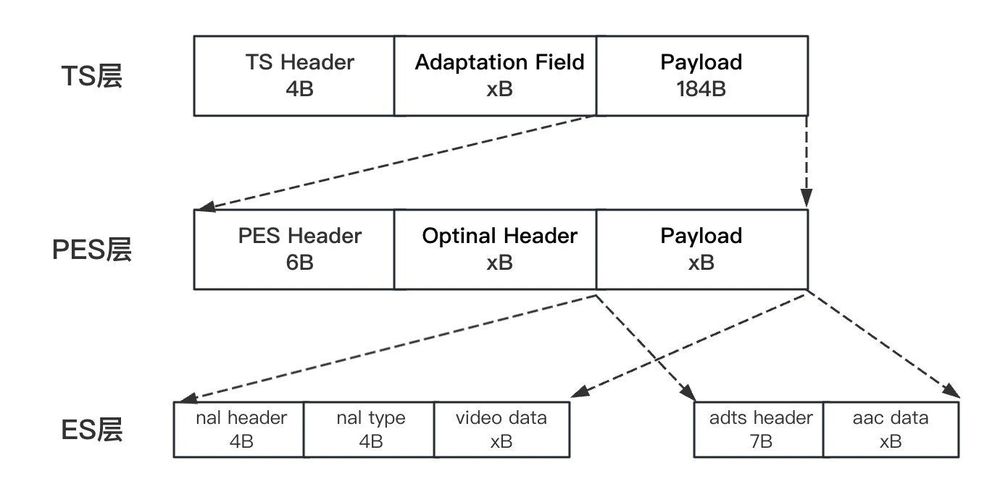
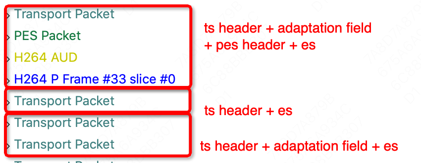
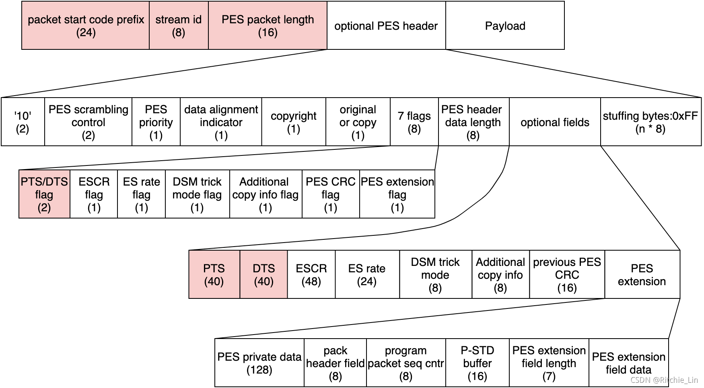

# 音视频封装格式基础

如：mp4（.mp4）、fmp4（.m4s）、flv（.flv）、ts、cmaf、mov、avi、webm、

   

# **一 MP4 & 快速MP4 & fMP4**

MP4或称MPEG-4第14部分（MPEG-4 Part 14）是一种标准的数字多媒体容器格式，扩展名为.mp4，且虽然被官方标准定义的唯一扩展名是.mp4，但第三方通常会使用各种扩展名来指示文件的内容：

* 同时拥有音频视频的MPEG-4文件通常使用标准扩展名 **.mp4**
* 仅有音频的MPEG-4文件会使用扩展名 **.m4a**

此外，大部分数据可以通过专用数据流嵌入到MP4文件中，因此MP4文件中包含了一个单独的用于存储流信息的轨道，目前得到广泛支持的编解码器或数据流格式有：

* 视频格式：H.264/AVC、H.265/HEVC、VP8/9等
* 音频格式：AAC、MP3、Opus等

在线分析工具： [Online Mp4 Parser](https://www.onlinemp4parser.com/) 、 [MP4Box.js - JavaScript MP4 Reader/Fragmenter](https://gpac.github.io/mp4box.js/test/filereader.html)

​    

## 1 文件组织方式（MP4 & 快速MP4 & fMP4）

三种组织方式：

| 组织方式      | 详情                                                         |
| ------------- | ------------------------------------------------------------ |
| MP4           | General MP4，box模式为 **ftyp-mdat-moov**<br />FFMPEG输出默认，其写入比较简单，但读取时需要seek，所以有些浏览器会需要完全下载后才能开始播放，有些应该可以用HTTP RANGE跳过mdat读取moov。<br /><br />举例：<br />ffmpeg -i input.flv -c copy -y avatar.mp4 |
| 快速MP4       | Faststart MP4，box模式为 **ftyp-moov-mdat**<br />FFMEPG输出需要指定参数（**-movflags faststart**），生成MP4后，再过一遍文件才能支持，虽相比于MP4对于某些浏览器会比较友好，但由于需要再过一遍文件，因此**文件录制容易造成IO阻塞，即等待的时间过长，导致服务线程挂起**（不可以长时间的做CPU操作或者磁盘操作）。<br /><br />举例：<br />ffmpeg -i input.flv -movflags faststart -c copy -y avatar_faststart.mp4 |
| 切片MP4或fMP4 | Fragmented MP4，box模式为 **ftyp-moov-moof-mdat**<br />FFMEPG输出需要指定参数（**-movflags frag_keyframe**）。fMP4 是基于 MPEG-4 Part 12 的流媒体格式，与 mp4 很相似，但也有一些区别，即**其视频/音频 metadata 信息与数据都存在一个个 moof、mdat 中，是一种流式的封装格式**，一般用在DASH中，不会直接用浏览器播放，而是通过JS解析后，给MSE播放。此外，fMP4 不需要一个 moov Box 来进行 initialization，fMP4 的 moov Box 只包含了一些 track 信息。<br /><br />fMP4 由分片组成，可以按整个文件存储，也可以按分片存储：<br />1)  如果按照**单个文件存储**，每个输出是一个m4s文件，完整的fMP4视频可以描述为如下形式：**moov + (moof + mdat) \* N**其中，moof box是分片（fragment）的标识， mdat box存放的是当前分片的媒体数据；<br />2)  如果按照**分片存储**，每个分片是一个m4s文件，输出对应了多个m4s，此外fMP4中的第一个分片，对应了DASH协议中Initialization Segment，其后的分片，则对应Media Segment。<br /><br />举例：<br />ffmpeg -i input.flv -movflags frag_keyframe -c copy -y avatar_fragment.mp4<br />ffmpeg -i input.mp4 -movflags empty_moov+frag_keyframe+default_base_moof f.mp4 |

​     

### 1）数据流构成

如下所示：


**相关名词**：

| 名词   | 说明                                                         |
| ------ | ------------------------------------------------------------ |
| Box    | 概念起源于QuickTime中的atom，也就是说**MP4文件就是由一个个Box组成的**，可以将其理解为一个数据块，它由 **Header+Data** 组成，**Data 可以存储媒体元数据和实际的音视频码流数据**，其次Box里面可以直接存储数据块，但是也可以包含其它类型的Box（**container box**） |
| Sample | **真正的音视频数据**，即对于视频可以理解为一帧数据或一组连续视频帧，音频一帧数据就是一段连续的压缩音频数据，且可以由多个Sample数据组成。<br />简而言之：存储媒体数据的单位是sample |
| Track  | 表示**一些sample的集合**，对于媒体数据而言就是**一个视频序列或者音频序列**，通常所说的音频轨和视频轨可以对照到这个概念上。<br />当然除了 Video Track 和 Audio Track，还可以有非媒体数据，比如 Hint Track，这种类型的Track就不包含媒体数据，可以包含一些将其他数据打包成媒体数据的指示信息或者字幕信息<br />简单来说：Track 就是视频中可以独立操作的媒体单位 |
| Chunk  | **一个track的连续几个sample组成的单元被称为chunk**，每个chunk在文件中有一个偏移量，整个偏移量从文件头算起，在这个chunk内，sample是连续存储的。 |

总的来说，**MP4文件里面有多个Track，一个Track又是由多个Chunk组成，每个Chunk里面包含着一组连续的Sample**。

​    

### 2）差异diff

| 差异         | 详情                                                         |
| ------------ | ------------------------------------------------------------ |
| fMP4 & MP4   | 普通mp4用于点播场景，fmp4通常用于直播或点播场景：<br />1）普通mp4的时长、内容通常是固定的，fMP4 时长、内容通常不固定，支持边生成边播放；<br />2）**普通mp4完整的 metadata 都在moov里**，因此需要加载完moov box后，才能对mdat中的媒体数据进行解码渲染，而 FMP4中，媒体数据的metadata 在 **moof box**（Movie Fragment Box）中，其中moof 中包含了sample duration、sample size等信息，且moof 跟 mdat 通常结对出现，因此fMP4可以边生成边播放；<br />**注**：MP4的格式本身是支持边下载边播放的，并不需要下载完整的MP4文件，但需要长时间缓冲MP4头部数据，而fMP4区别于MP4最大的一点，则是更好的适应流式播的需求<br />3）怎么判断mp4文件是普通mp4，还是fMP4呢？<br />一般可以看下是否存在存在 mvex box（Movie Extends Box），当存在mvex时，表示当前文件是fmp4（非严谨）。此时，sample相关的metadata不在moov里，需要通过解析moof box来获得。 |
| mp4和快速mp4 | 1）快速mp4的moov在前面可以边下载边播放<br />2）快速mp4的moov在前面有可以减少点播场景下的秒开时间 |


​    

## 2、Box内容结构

MP4文件**由多个box组成，每个box存储不同的信息，且box之间呈树状结构**，即box容器套box子容器，box子容器再套box子容器。

虽然box类型有很多，但基本结构都是一样的，都是由 box header和box body两部分组成：

1）**box header**：box的元数据，比如 box type、box size等，其中只有 type、size 是必选字段

* 当size==1时，存在largesize字段

* 当size==0时，表示该box为文件的最后一个box

2）**box body**：box的数据部分，实际存储的内容跟box类型有关，比如mdat中body部分存储的媒体数据。

3）此外，根据box中header以及body中包含的内容，可分为以下2个box类型

* **Full box**：在部分box header中，存在version、flags字段
* **Container box**：box body中嵌套其他box时


其中，文件最外层的BOX中主要有 ftyp、moov、mdat 三种类型的BOX

1）**ftyp（file type box）**：主要为MP4格式的标识信息（文件头），表示当前文件遵循的规范

2）**mdat（media data）**：媒体负载，即sample具体数据

3）**moov（movie box）**：记录文件媒体信息，主要是这个MP4文件sample数据的metadata，用来描述sample大小，位置，dts等

**注：**每个sample数据在文件中的位置，是通过moov中的trak得到的，其次mp4 box的解析其实就是读取各种类型box，将里面的一些数据通过file_read读取并赋值。

普通MP4文件完整box结构示例：

<div align="center"></div>

且每个box承载的数据内容如下：


### 1）box header

即 **box的元数据**，box header中，只有type、size是必选字段

| Field         | 详情                                                         |
| ------------- | ------------------------------------------------------------ |
| type          | box类型，包括 “预定义类型”、“自定义扩展类型”<br />1）**预定义类型**：比如 ftyp、moov、mdat 等预定义好的类型；<br />2）**自定义扩展类型**：如果 type==uuid，则表示是自定义扩展类型，其中size（或largesize）随后的16字节，为自定义类型的值（extended_type） |
| size          | 包含**box header在内的整个box的大小**，单位是字节，且当size为0或1时，需要特殊处理<br />1）size==1：box的大小由后续的largesize确定，通常只有装载媒体数据的mdat box会用到largesize<br />2）size==0：当前box为文件的最后一个box |
| largesize     | 包含box header在内的整个box的大小                            |
| extended_type | 自定义扩展类型                                               |
| version       | box版本，为扩展做准备                                        |
| flags         | 标志位，含义由具体的box定义                                  |

​     

### 2）box body

box数据体，不同box包含的内容不同，需要参考具体box的定义，有的 box body 很简单，比如 ftyp，而有的 box 比较复杂，可能嵌套了其他box，比如moov。虽然Box的类型非常多，大概有70多种，但是并不是都是必须的，一般的MP4文件都是含有必须的Box（如：ftyp、mdat、moov）和个别非必须Box（如：free），其中**非必须box即使去掉，对于播放音视频也没有啥影响**。

​     

#### a ftyp（File Type Box）

ftyp 一般出现在文件的开头，用来指示该 mp4 文件使用的标准规范，即当前文件遵循的规范

其box body结构包含信息如下表（PS：box header内容如上述所示）：

| Filed               | Comment                                                      |
| ------------------- | ------------------------------------------------------------ |
| major_brand         | **主版本**，比如常见的 isom、mp41、mp42、avc1、qt等，**表示“最好”基于哪种格式来解析当前的文件**。<br />举例：major_brand 是 A，compatible_brands 是 A1，当解码器同时支持 A、A1 规范时，最好使用A规范来解码当前媒体文件，如果不支持A规范，但支持A1规范，那么可以使用A1规范来解码； |
| minor_version       | 次版本，提供 major_brand 的说明信息，比如版本号，不得用来判断媒体文件是否符合某个标准/规范； |
| compatible_brands[] | 指定**兼容的版本brand列表**，比如 mp41 的兼容 brand 为 isom，即通过兼容列表里的 brand 规范，可以将文件 部分（或全部）解码出来； |

**注**：isom（ISO Base Media file）是在 MPEG-4 Part 12 中定义的一种基础文件格式，MP4、3gp、QT 等常见的封装格式，都是基于这种基础文件格式衍生的。

* MP4 文件可能遵循的规范有mp41、mp42，而mp41、mp42又是基于isom衍生出来
* 3gp（3PP）：一种文件格式，主要用于3G手机上
* QT（QuickTime）：.qt文件代表苹果QuickTime媒体文件


   

#### b mdat（Media Data Box）

其box body保存了**二进制的音视频数据**，但**音视频数据的编解码信息都在其它box中保存**，因此文件解析的时候先读取其它box的信息获取编解码信息，以及音视频包在mdat中的位置，然后再读取mdat获取音视频数据。

其次，对于 box body 部分，**采用一个一个 samples 的形式进行存储**，即**一个一个音频帧或视频帧的形式进行存储**，且码流组织方式采用 **avcc 格式**（可见h264的AVCC数据封装格式），即 AUD + slice size + slice 的形式。


​    

#### c free（free space box）

**free 中的内容是无关紧要的，可以被忽略**，该box被删除后，不会对播放产生任何影响，注意 Ftyp可以是free或skip。

​    

#### d moov（Movie box）

moov 存储 mp4 的元数据 metadata，moov位置可以紧随着ftyp出现，或出现在文件末尾

* **文件尾部**：适用于 **视频文件编码与压制系统**，可以在压制之后直接将moov写入输出文件中，实现简单且效率更高
* **文件头部（仅随ftyp）**：**适用于在线视频点播等流媒体应用场景**中，媒体的解码和播放会更加高效

​    

此外，moov的box body也是box，而且包含多个box，如：

1）**mvhd（Movie Header Box）**：mp4文件的整体信息，比如创建时间、文件时长等

2）**trak（Track Box）**：一个mp4可以包含**一个或多个**轨道（比如视频轨道、音频轨道），轨道相关的信息就在trak里，且trak是container box，至少包含两个box，即 tkhd和mdia

3）**udat（user data box）**：用户自定义数据


   

#### e udta（user data box）

即用户自定义数据



​    

#### f mvhd（movie header box）

mvhd 作为媒体信息的 header 出现（注意此header不是box header，而是moov媒体信息的header），用于描述一些所有媒体共享的基本信息，比如**文件的创建时间、文件时长**等，**跟具体的视频流、音频流信息无关**。

mvhd 语法继承自fullbox，注意下述示例出现的version和flags字段属于fullbox header（即包含 type、size、flags、version），其body内容包括：

| Filed             | Comment                                                      |
| ----------------- | ------------------------------------------------------------ |
| creation_time     | 文件创建时间                                                 |
| modification_time | 文件修改时间                                                 |
| timescale         | **一秒包含的时间单位**（整数）<br />举例：如果timescale等于1000，那么一秒包含1000个时间单位（后面track等的时间，都要用这个来换算，比如 track的duration为10,000，那么，track的实际时长为10,000/1000=10s） |
| duration          | 影片时长（整数），根据文件中的track的信息推导出来，等于时间最长的track的duration |
| rate              | 推荐的播放速率，32位整数，高16位、低16位分别代表整数部分、小数部分（[16.16]），举例 0x0001 0000 代表1.0，正常播放速度 |
| volume            | 播放音量，16位整数，高8位、低8位分别代表整数部分、小数部分（[8.8]），举例 0x01 00 表示 1.0，即最大音量 |
| matrix            | 视频的转换矩阵，一般可以忽略不计                             |
| next_track_ID     | 32位整数，非0，一般可以忽略不计<br />当**要添加一个新的track到这个影片时，可以使用的track id**，必须比当前已经使用的track id要大，也就是说，添加新的track时，需要遍历所有track，确认可用的track id。 |


​      

#### g trak（Track Box）

一个MP4文件中的媒体可以包含多个track，且至少有一个track（一般情况下有**两个trak，分别对应音频流和视频流**），这些**track之间彼此独立，有自己的时间和空间信息**。其中，**trak box 用于描述每一路媒体流，并在track中保存该媒体流所有的配置和播放控制等信息**。

track有三种类型：

1）**video track**：描述视频流

2）**audio track**：描述音频流

3）**hint track**：这个特殊的track并不包含媒体数据，而是包含了一些将其它数据track打包成流媒体的指示信息

**注：**如果媒体文件有1路视频2路音频，则mp4中应该有3个track，并且是1个video track和2个audio track

​     

此外，track box body中包含以下几种类型的子box：

1）**tkhd（Track Header Box）**：用于简单描述该路媒体流的信息，如时长，宽度等

2）**mdia（Track Media Structure）**：用于**详细描述该路媒体流的信息**，除tkhd外，主要的媒体配置信息在mdia中保存，描述了这条音视频轨/流(trak)的媒体数据样本的主要信息，对播放器来说是一个很重要的box

3）**edts（edit Box）**：子Box为elst（Edit List Box），它的作用是使某个track的时间戳产生偏移


​     

#### h tkhd（track header box）

tkhd 作为媒体信息的header出现（注意此 header 不是 box header，而是 track 媒体信息的 header），用于描述一些该track的基本信息。

tkhd语法继承自fullbox，注意下述示例出现的version和flags 字段属于fullbox header。

| Filed               | Comment                                                      |
| ------------------- | ------------------------------------------------------------ |
| type、size、version | 基本同上述box  header定义                                    |
| flags               | 按位或操作获得，默认值是7（0x000001 \| 0x000002 \| 0x000004），表示这个track是启用的、用于播放的 且 用于预览的<br />1）flags==0x000000时，表示这个track没有启用(Track_enabled)<br />2）flags==0x000001时，表示这个track是启用的(Track_enabled)<br />3）flags==0x000002时，表示当前track在播放时会用到(Track_in_movie)<br />4）flags==0x000004时，表示当前track用于预览模式(Track_in_preview)； |
| creation_time       | 当前track的创建时间                                          |
| modification_time   | 当前track的最近修改时间                                      |
| track_ID            | 当前track的唯一标识，不能为0，不能重复                       |
| duration            | 当前track的完整时长（需要除以timescale得到具体秒数）         |
| layer               | 视频轨道的叠加顺序，数字越小越靠近观看者，比如1比2靠上，0比1靠上 |
| alternate_group     | 当前track的分组ID，alternate_group值相同的track在同一个分组里面。同个分组里的track，同一时间只能有一个track处于播放状态。<br />当alternate_group为0时，表示当前track没有跟其他track处于同个分组，即一个分组里面，也可以只有一个track |
| volume              | audio track的音量，介于0.0~1.0之间                           |
| matrix              | 视频的转换矩阵，一般可以忽略不计                             |
| width               | 视频的宽                                                     |
| height              | 视频的高                                                     |


​    

#### i edts（edit box）

edts下边有一个elst（Edit List Box），它的作用是**使某个track的时间戳产生偏移**

| Filed            | Comment                                                      |
| ---------------- | ------------------------------------------------------------ |
| segment_duration | 表示该edit段的时长，以Movie Header Box（mvhd）中的timescale为单位,即 segment_duration/timescale = 实际时长（单位s） |
| media_time       | 表示该**edit段的起始时间**，以track中Media Header Box（mdhd）中的timescale为单位。如果值为-1(FFFFFF)，表示是空edit，一个track中最后一个edit不能为空。 |
| media_rate       | 码率                                                         |

**注意：**

1）为使PTS从0开始，media_time字段一般设置为第一个CTTS的值，计算PTS和DTS的时候，分别都减去media_time字段的值就可以将PTS调整为从0开始的值。

2）如果media_time是从一个比较大的值，则表示要求PTS值大于该值时画面才进行显示，这时应该将第一个大于或等于该值的PTS设置为0，其他的PTS和DTS也相应做调整。



​    

#### j mdia（Track Media Structure）

即在代表一流音频或视频流的track中，除tkhd外，**主要的媒体配置信息在mdia中保存，描述了这条音视频轨/流(trak)的媒体数据样本sample的主要信息**，对播放器来说是一个很重要的box。

其中，其box body包含以下子box：

1）**hdlr（Handler Reference Box）**：声明当前track的类型以及对应的处理器（handler）

2）**mdhd（Media Header Box）**：当前音/视频轨/流(trak)的总体信息，该box中有duration字段和timescale字段，duration/timescale的值即为当前流的时长

3）**minf（Media Information Box）**：音视频相关的采样等信息相关的容器，minf容器中的信息将作为音视频数据的映射存在

​    

#### k hdlr（Handler Reference Box）

声明当前track的类型，以及对应的处理器（handler）

| Filed   | Comment                                                      |
| ------- | ------------------------------------------------------------ |
| handler | 当=vide（0x76 69 64 65）时，表示track是video track；<br />当=soun（0x73 6f 75 6e）时，表示track是audio track；<br />当=hint（0x68 69 6e 74）时，表示track是hint track； |
| name    | 对handler进行描述，比如 VideoHandler、SoundHandler           |

   

#### **l mdhd（Media Header Box）**

mdhd 作为媒体信息的header出现，用于描述一些该media的基本信息，其中mdhd和tkhd ，内容大致都是一样的，不过tkhd通常是对指定的track设定相关属性和内容。而mdhd 是针对于独立的media来设置的。

**注**：mdhd中的timescale同mvhd中的timescale，但是需要注意虽然意义相同，但值有可能不同，下边stts,ctts等时间戳的计算都是以mdhd中的timescale。

​    

#### **m minf（Media Information Box）**

minf包含音视频相关的采样等信息，box body将作为音视频数据的映射存在，包含的重要的box有，vmhd、smhd、dinf、stbl

1）**vmhd（Video Media Information Header）**：定义**颜色和图形模式信息**，具体参考官方文档，只有video track才有此box

2）**smhd（Sound Media Information Header）**：定义了**声音媒体的控制信息**，具体参考官方文档，只有audio track才有此box

3）**stbl（Sample Table）**：包含了**音视频数据的索引以及时间信息**，也就是音视频数据的映射

   

#### **n stbl（Sample Table Box）**

在介绍stbl box之前，需要先介绍一下mp4中定义的sample与chunk：

1）**sample**：ISO/IEC 14496-12 中定义 samples 之间不能共享同一个时间戳，因此**在音视频 track 中，一个 sample 代表一个视频或音频帧**。

2）**chunk**：多个 sample 的集合，实际上音视频 track 中，**chunk 与 sample 一一对应**

<div align="center"></div>

​    

stbl box是一个container box，是整个track中最重要的一个box，其**子box描述了该路媒体流的解码相关信息、音视频位置信息、时间戳信息等**，包含的重要box有：stts、stss、ctts、stsc、stsz、stco

| Filed    | Comment                                                      |
| -------- | ------------------------------------------------------------ |
| **stsd** | **sample description box**<br />存储了**编码类型和初始化解码器需要的信息，并与具体编解码器类型有关**，比如视频/音频的编码、宽高、音量等信息，以及每个sample中包含多少个frame，即以视频为例，包含子box avc1，表示是H264的视频。 |
| **stts** | **decoding time to sample box**<br />存储了该 **track 每个 sample 到 dts 的时间映射关系**，包含了一个压缩版本的表，通过这个表可以从**解码时间映射到sample序号**，且表中的每一项是连续相同的编码时间增量（Decode Delta）的个数和编码时间增量，因此通过把时间增量累加就可以建立一个完整的time to sample表。<br /> |
| **stss** | **sync sample box**<br />包含**media中的关键帧的sample表，关键帧是为了支持随机访问**，且如果此表不存在，说明每一个sample都是一个关键帧<br /> |
| **ctts** | **composition time to sample box**<br />存储了该 track 中，**每个 sample 的从解码pts 到 渲染dts 时间差（cts = pts - dts）**，如果一个视频只有I帧和P帧，则ctts这个表就不需要了，因为解码顺序和显示顺序是一致的，但是如果视频中存在B帧，则需要ctts。 |
| **stsc** | **sample to chunk box**<br />存储了该 track 中每个 **sample 与 chunk 的映射关系**，即每个chunk中包含几个sample |
| **stsz** | **sample size box**<br />包含**sample的每个sample的字节大小和数量**（根据 sample_size 字段），这个box相对来说体积比较大的。表明视频帧或者音频帧大小，FFmpeg 里面的AVPacket 的size 数据大小，就是从这个box中来的。 |
| **stco** | **chunk offset box**<br />Chunk Offset表**存储了每个chunk在文件中的位置**（chunk在整个文件中的偏移量），这样就可以直接在文件中找到媒体数据，而不用解析box，针对小文件、大文件，有两种不同的box类型，分别是stco(32位)、co64(64位)，它们的结构是一样的，只是字段长度不同。<br />在构建mp4文件的时候，需要特别注意 moov 所处的位置，它对于chunk_offset 的值是有影响的。有一些MP4文件的 moov 在文件末尾，为了优化首帧速度，需要将 moov 移到文件前面，此时，需要对 chunk_offset 进行改写。 |

**注**：MP4文件的媒体数据部分在mdat box里，而stbl则包含了这些媒体数据的索引以及时间信息。

​     

### 3）fMP4 moof（movie fragment）

moof是**movie fragment，是分段形式解析**，如同hls中的ts分片一样，且moof如同moov一样，但moov一定要有，但moof可能没有，其次**每个moof后边都会接一个mdat数据段**。

moof box中主要包含 切片的信息：

<div align="center"></div>

​          

## 3 解析过程

这里说的解析基本是指解封装、播放的过程，都是**先读取box中的内容，然后根据box中内容可以找到每一个sample也就是每一帧数据，然后进行解封装、播放**。

由上可知，每个chunk有多少个类似的sample，还知道总的chunk个数，还知道每个chunk的偏移量offset，间接得出了每个chunk的大小，以及每个sample的字节大小。因此，通过这些信息可以建立一张表，这张表可以记录每个sample的文件偏移量，从开始到结束叠加。

**那么来看如何推算每个sample的offset？**

> 假如已知第1个sample的offset（其实就是chunk1的offset），以及第1个sample的字节大小（stsz中存放），那么第1个sample的offset就可以得出 offset1+sample_size1，以此类推就能建立一张表sample序号和其offset的表。

​    

**详细过程如下**：

1）通过stss确定关键帧的数据和每个关键帧的序号

2）通过stts获取音视频流的总帧数、每一帧的dts和整体时长

3）通过ctts获取每一帧中pts与dts的差值

4）通过stsz获取每个sample的大小及整个流的总大小

5）通过stco获取音视频流中chunk的数据和在文件中的位置（不是在mdat中的位置）

6）通过stsc计算出流中chunk的数据和在文件中的位置，并通过chunk在文件中的位置及chunk中每个sample的大小，确定每个sample在文件中的位置和大小

7）整理每个流的码流信息和时间戳信息，构成整体播放的时间轴，之后进行解码的渲染播放

​     

# 二 TS格式

在MPEG-2标准中，有两种不同类型的码流输出到信道：

* 节目码流（PS：program stream），适合没有误差产生的媒体存储，主要应用于存储的具有固定时长的节目，如DVD电影；

* 传输流（TS：Transport Stream），适用于有信道噪声产生的传输，可在网络中进行远距离的传送，主要应用于实时传送的节目，比如实时广播的电视节目（数字电视，IPTV）

<div align="center"></div>

​       

## 1 TS简介

TS ，即MPEG2-TS（MPEG-2 Transport Stream），MPEG-2 标准中的传输流，最初的作用是传输音视频数据，应用在电视广播系统，但是在直播、点播场景时，通常需要将音视频数据以 **.ts**  的文件格式进行落盘。

TS文件的基本单位是ts packet，在不同标准中，ts packet的大小也不相同，共有有四种大小：

* 1）188 bytes：MPEG-2标准
* 2）192 bytes：188 bytes + 4 bytes时间码 --> 日本DVH-S标准
* 3）204 bytes：188 bytes + 16 bytes前向纠错码(FEC) --> 美国ATSC标准
* 4）208 bytes：188 bytes + 4 bytes时间码 + 16 bytes前向纠错码(FEC)

在**同一个标准中ts packet的大小是固定的，便于找到帧的起止位置，易于从包丢失中恢复**，适合于有误码的环境，可在网络中进行远距离的传送。

> Q：ts packet的大小为什么是固定的？
>
> A：TS码流由于采用了固定长度的包结构，当传输误码破坏了某一TS包的同步信息时，接收机可在固定的位置检测它后面包中的同步信息，从而恢复同步，避免了信息丢失。因此，在信道环境较为恶劣，传输误码较高时，一般采用TS码流。
>
> 此外，由于**TS码流具有较强的抵抗传输误码的能力**，因此目前在传输媒体中进行传输的MPEG-2码流基本上都采用了TS码流的包格式。

​      

## 2 TS分层结构

ts流文件一般由多个ts packet组成，在MPEG-2标准中ts packet的大小固定是188 bytes，其次**ts文件的第一个ts packet是PAT，描述所有节目，第二个ts packet是PMT，有几个节目就有几个ts packet存储PMT，然后才是音视频数据**。正常情况下ts文件的第一帧一定是I帧，这样才能正常播放。

ts流示意：

```shell
PAT PMT PMT PMT DATA DATA ......DATA PAT PMT PMT PMT DATA DATA ......
```

<div align="center"></div>


**注**：一个PES Pacekt(pes header + es)是一帧数据，其大小可能是大于ts packet的长度，所以一个PES packet会存储于多个ts packet中，其中只有第一个ts packet有pes header，其余ts pacekt都只有es数据，最后一个ts packet可能会因为es数据不足而加入adaptation field（填充数据）。

​    

TS文件（流）可分为三层：

* **ES层**（Elementary Stream）：压缩编码后的音视频数据，即基本码流
* **PES层**（Packet Elemental Stream）：打包的基本码流，**把基本码流(ES)分割成段**，并分别加上头部信息打包而成
* **TS层**（Transport Stream）：PES层上加入了数据流识别和传输的必要信息

<div align="center"></div>

如上，显示了三层之间的关系，其中xB表示字节数不确定，4B表示字节数为4个，接下来对每一层数据进行简单介绍。

​         

### 1）TS（Transport Stream Packet）

每一个ts packet的内部**一定会有ts packet header**，有可能会存在填充数据adaptation field和ts payload，其中ts packet header固定是4字节，ts packet payload大小不固定。**视频流和音频流都需要加adaptation field，通常加在一个帧的第一个ts包和最后一个ts包里，中间的ts包不加**，第一个ts包和最后一个ts包里的adaptation field还不一样。

ts packet中携带两类信息：**已压缩的音视频（PES、ES）**和**与之相关的符号化表（PSI）**，包括PAT和PMT，且由包的PID来识别携带的是哪种信息。

* 1）PAT：Program Association Table的简称，节目关联表，是接收数据的入口点，解析TS文件的起点，其次PAT包含所有频道编号(PID)，比如共有CCTV1-CCTV14这些频道，通过读取PAT就会获取上述所有频道的编号(PID)，且通过频道编号(PID)可以找到频道对应的PMT。
* 2）PMT：Program Map Table的简称，节目映射表，是连接节目号和节目元素的桥梁，其次PMT描述频道的具体信息，**一个频道对应一个PMT，有几个频道就有几个PMT表**，比如CCTV1对应一个PMT，CCTV2对应另一个PMT，CCTV1-CCTV14会对应14个PMT。
* 3）PES：是在**每一个视频/音频帧的基础上增加了pes header**，形成了PES packet（pes header + es），pes header中最重要的就是PTS、DTS信息
* 4）ES：就是音视频裸数据了，常用的音频编码格式为AAC和MP3 ，视频编码格式为H.264和HEVC。其数据结构可以分别参考相应的编码规范手册。

<div align="center"></div>

   

#### a TS Header

TS包的包头提供关于传输方面的信息，其结构如下：

<div align="center"></div>

相关字段说明：

| Field                        | Comment                                                      |
| ---------------------------- | ------------------------------------------------------------ |
| sync_byte                    | 同步字节，固定为0x47，该字段是MPEG-2 TS传送包标识符          |
| transport_error_indicator    | 传输误差指示符<br />= 0：无错误<br />= 1：表示在相关的传送包中至少有一个不可纠正的错误位，只有在错误纠正之后，该位才能被重新置0 |
| payload_unit_start_indicator | 表示**有效载荷单元起始符**，不表示有效载荷的内容，PID才表示有效载荷的内容，因此要先获取PID，获取效载荷的内容，再获取payload_unit_start_indicator来获取有效载荷单元起始符。<br /><br />1）当TS包带有PES包数据时，payload_unit_start_indicator = 1表示TS包的有效净荷以PES包的第一个字节开始，而 = 0时表示在该传输流数据包中不应开始PES于数据包（此时开始位置可能不是PES头，直接是ES数据）。如果payload_unit_start_indicator**设置**为1，则只有一个PES数据包在此传输流数据包中开始。<br />2）当TS包带有PSI数据时，payload_unit_start_indicator = 1表示TS包带有PSI部分的第一个字节，即第一个字节带有指针pointer_field，而 = 0表示TS包不带有一个PSI部分的第一个字节，即有效净荷中没有指针pointer_field。<br />3）空包时，该位置为0 |
| transport_prority            | 传输优先级，= 1表示关联的数据包是优先级高于具有相同PID且位未设置为1的其它数据包 |
| PID                          | 表示传送包的有效净荷中的数据的类型<br />PID = 0x0000：节目关联表（program association table, PAT）<br />PID = 0x0001：条件访问表（conditional access table, CAT）<br />PID = 0x0002：传送流描述表（transport stream description table, TSDT）<br />PID = 0x0003~0x000F：保留<br />PID = 0x0010~0x1FFE：可以分配为network PID, Program map PID（PMT）, elementary PID, 或其它<br />PID = 0x1FFF：空包 |
| adaption_field_control       | 自适应字段控制，表示传送流包首部是否跟随有填充数据和/或有效净荷<br />adaption_field_control = 00：是保留值<br />adaption_field_control = 01：负载中只有有效载荷<br />adaption_field_control = 10：负载中只有填充数据<br />adaption_field_control = 11：先有填充数据，后有有效载荷 |
| continuity_counter           | 连续计数器，随着具有相同PID TS包的增加而增加，达到最大则恢复为0，且**可以通过该值来判断数据包是否连续**，比如音频的continuity_counter序号是1，2，3，4，5，6，但是实际收到的是1，3，4，6，则是说明2，5的包丢了。<br />在传输流中，**重复数据包应具有与原始数据包相同的continuity_counter值**。 |

​    

#### b Adaptation Field（填充数据）

TS packet 在以下2种情况下需要插入Adaptation Field：

* 1）在MPEG-2 TS中，为了传送打包后**长度不足188 bytes 的ts packet**，或者为了**在系统层插入节目时钟参考**（program clock reference， PCR），需要在ts packet中插入可变长字节的填充数据。

  可知，Adaptation Field其中一个重要作用是**解决编解码器的音视频同步问题**（音频、视频都可以通过pcr来设置时钟，保证音视频同步，但是很多播放器都不通过pcr来同步，都是以音频为基准来设置时钟）。

  一般在视频帧中的TS包的调整字段中，每隔一定传输时间，传送系统时钟27MHz的一个抽样值给接收机，作为解码器解码时的时钟参考信息PCR（通常每隔100ms至少被传输一次），其中PCR的数值所表示的是解码器在读完这个抽样值的最后那个字节时，解码器本地时钟所应处的状态。

  此外，通常情况下，PCR不直接改变解码器的本地时钟，而是作为参考基准来调整本地时钟，使之与PCR趋于一致。

* 2）当**一帧数据大于188 bytes时，会被拆分成多个ts packet存储**，一般这一帧的第一个和最后一个ts packet中存在adaptation field，其中第一个ts packet中的adaptation field包含了上文提到的时钟参考PCR，而最后一个ts packet中的adaptation field是为了填充ts packet使之达到188 bytes，此时的adaptation field中没有时钟参考。

**注**：PCR是节目时钟参考，PCR、DTS、PTS都是对同一个系统时钟的采样值，PCR是递增的，因此可以将其设置为DTS值，此外音频数据不需要PCR。其次，打包TS流时，PAT和PMT表是没有Adaptation Field的，不够的长度直接补0xff即可，通常视频流和音频流都需要加adaptation field，并加在一个帧的第一个ts包和最后一个ts包里，中间的ts包不加。

相关字段说明：

| Field                                                | Type    | Commect                                                      |
| ---------------------------------------------------- | ------- | ------------------------------------------------------------ |
| adaptation_field_length<br/>（填充数据长度）         | 8 bit   | **填充数据长度标识**，表示**此字节后面填充数据的长度**，其值在0～183 bytes，从上图的官方定义中可以看出，无论是否有填充数据，此字段一定存在。<br />1）adaptation_field_length = 0~182：adaptation_field_control = 11，既有填充数据，也有有效载荷<br/>2）adaptation_field_length = 183：adaptation_field_control = 10，只有**填充数据**（此时adaptation_field_length后面占183 bytes，adaptation_field_length占1 byte，ts header占4 bytes）。 |
| PCR_flag<br/>（PCR标志位）                           | 1 bit   | PCR_flag = 0：没有PCR<br/>PCR_flag = 1：有PCR                |
| program_clock_reference_base<br/>（节目时钟参考PCR） | 42 bit  | 音频、视频都可以通过pcr来设置时钟，保证音视频同步。但是很多播放器都不通过pcr来同步，都是以音频为基准来设置时钟。 |
| stuffing_bytes<br/>（填充字节）                      | Nx8 bit | 填充字节，取值0xff，只填充用，无实际意义。                   |

​     

#### c TS Payload

MPEG-2 TS传送的TS包携带两类信息：**已压缩的音视频**（PES）和**与之相关的符号化表**（PSI），由传送包PES的PID来标识。如果是PSI，那么payload内容为PAT表结构、PMT表结构，而如果为音视频，那么payload内容为PES包。

简而言之，ts payload如果存在，则其内容是**PAT**、**PMT**、**PES**、**ES**的其中一种，目前直播和点播场景中主要接触到的就是上述4种数据，但ts payload也有可能不存在，即ts packet只有ts header 和 adaptation field。此外，ts packet是188 bytes，ts header是4 bytes，所以 ts payload最多是184 bytes。如果需要加密，是在ts->payload加密，不是在ts->pes->pes payload加密。

​    

### 2）PSI/SI

**PSI**：Program Specific Information, 节目引导信息，在MPEG-2标准中定义的
**SI**：Service Information, 业务信息，在DVB标准中定义的

<div align="center"></div>

**注**：前边提到了PAT和PMT，它们都是PSI之一

​    

#### a PAT

节目关联表（PAT，Program Association Table），是**接收数据的入口点，解析TS的起点**，即定义了当前TS流中所有的节目PID，PID为0x0000，是PSI的根节点，要查找节目（获取音视频数据）必须从PAT开始。当播放器对视频开始检索分析的时候，针对每个TS 包的header中PID数据进行判断，直到找到PAT表开始的地方进行有效数据起始分析。

内部结构：

<div align="center"></div>

相关字段说明：

| Field                    | Commect                                                      |
| ------------------------ | ------------------------------------------------------------ |
| table id                 | 对于PAT来说，table id固定是0x00<br /> |
| Section syntax indicator | 分段句法指示符，PAT来说，固定为 ’1’                          |
| Section length           | 分段长度，表示从这个字节之后有用的字节数，即到CRC_32字段的字节数，不超过1021，超过此字节数为填充数据（FF）<br />前面两位固定为’00’ |
| Transport stream id      | 其值由用户规定，传输流标识号，标识网络内此传输流有别于任何其他多路复用流 |
| Version number           | PAT版本号<br />current_next_indicator 设置为‘1’时，version_number 必须为当前有效的节目相关表的版本号<br />current_next_indicator 设置为‘0’时，version_number 为下一个有效的节目相关表的版本号。 |
| Current next indicator   | 表示发生的PAT是当前有效还是下一个有效<br />=1 发送的节目相关表为当前有效的<br />=0 发送的该表尚未有效并且下一个表将生效 |
| Section number           | 分段号，表明该ts packet属于PAT的第几个分段，分段号从0开始（第一个分段为0x00），由于PAT可以描述很多PMT信息，所以长度可能比较长，ts packet的长度最多是188bytes，所以可能需要多个ts packt传输一个PAT（依次递增+1）。 |
| Last section number      | PAT最后一个分段号（分段原因可参考"section_number"），也可以理解为PAT的最大分段数目，一般情况都是一个PAT表由一个ts packet传输。 |
| N loop                   | 节目列表数组，每个元素4字节，包含16b节目编号，3b保留位，13bit的节目PID（或 网络PID）<br />program_number：节目编号，节目号为0x0000时表示这是NIT(network_PID)，节目号为非0x0000时表示这是PMT(program_map_PID)<br />network_PID：NIT（网络信息表）的PID值，指定应包含的传输流包的PID。network_PID 的值由用户自定义。用于描述整个网络，如多少TS流、频点和调制方式等信息<br />program_map_PID：PMT（节目映射表）的PID值，program_map_PID 的值由用户定义，但仅限于取表2-3 中所指定的值 |
| CRC32                    | CRC32校验码                                                  |

**获取PMT的PID**：在官方定义中，通过循环可获取每一个program_map_PID，但是循环次数N，却没有定义，那么N是如何确定的呢？

> N = (section_length-5-4)/4 字节
>
> 分子：根据定义section_length的值是表示transport_stream_id到CRC_32的字节数，减5是transport_stream_id到last_section_number的占5字节，减4是CRC_32占4字节
>
> 分母：循环中network_PID和program_map_PID只能存在一个，所以一个循环占4字节

​    

#### b PMT

节目映射表（PMT，Program Map Table I'm），该表的PID是由PAT给出的，且**PMT数据的信息可以理解为这个节目包含的音频和视频信息**，其中包含了该路节目由那些流构成，流的类型（视频、音频、数据等）指定节目中视频、音频对应的ID，和当前频道关联在一起的其它数据PID（例如该节目的PCR所对应的PID）。

<div align="center"></div>

相关字段说明：

| Field                      | Comment                                                      |
| -------------------------- | ------------------------------------------------------------ |
| table_id                   | 标识一个TS PSI分段的内容是节目关联分段，条件访问分段还是节目映射分段，对于PMT置为0x02 |
| Section syntax indicator   | 分段句法指示符，PAT来说，固定为 ’1’                          |
| section length             | 分段长度，section_length后面直到CRC_32校验字段的字节数，其值不超过1021 |
| program number             | 节目编号，指定program_map_PID 所适用的节目<br />一个节目定义必须仅在一个TS_program_map_section 内承载，这意味着节目定义从不超过1016（0x3F8）。 |
| PCR_PID                    | 指示应包含PCR字段的ts packet的PID                            |
| program_info_length        | 节目描述信息长度，表示紧跟在program_info_length后面的N个descriptor()的总长度 |
| N loop descriptors         | 节目元素描述符，详见官方文档                                 |
| stream_type                | 流类型，标志是Video还是Audio还是Metadata或其它数据           |
| elementary_PID             | 元素PID，指定携带相关元素的ts packet的PID，如果stream_type是video，则elementary_PID表示的是视频包的pid |
| ES_info_length             | ES信息长度，表示紧跟在ES_info_length后面的N2个descriptor()的总长度 |
| N loop: N loop descriptors | 用于描述节目内容，有视频和音频两种形式，描述了原始流的一些信息<br />Video stream descriptor：提供了标识视频元素的编码参数的基本信息<br />Audio stream descriptor：音频流描述符提供识别音频基本流的编码版本的基本信息 |
| CRC32                      | CRC32校验码                                                  |

在PMT表中，有三个循环，循环次数分别是N，N1，N2，官方文档中没有描述这3个数的取值，那么这3个值是如何确定的呢？

> 1）N = program_info_length/(1+1+descriptor_length) 字节
>
> * 分子：program_info_length描述循环的总字节数
>
> * 分母：前2个加1是因为descriptor_tag，descriptor_length分别占1字节。descriptor_length描述后面的字节数，所以1个descriptor()占的字节数就是1+1+descriptor_length
>
> 2）N1 = (section_length-9-program_info_length-4)/(5+ES_info_length) 字节
>
> * 分子：根据定义section_length的值是表示last_section_number到CRC_32的字节数，减9是last_section_number到program_info_length的占9字节，减program_info_length是紧跟在后面的循环占的字节数，减4是CRC_32占4字节
>
> * 分母：加5是stream_type到ES_info_length占的字节数，加ES_info_length是紧跟在后面的循环占的字节数
>
> 3）N2 = ES_info_length/(1+1+descriptor_length) 字节
>
> * 分子：ES_info_length描述循环的总字节数
> * 分母：前2个加1是因为descriptor_tag，descriptor_length分别占1字节。descriptor_length描述后面的字节数，所以1个descriptor()占的字节数就是1+1+descriptor_length

​     

### 3）PES

PES（Packetized Elementary Stream，打包的ES）是**对编码器原始数据的第一次打包**，在这个过程中将es流**分组**、**打包**、**加入包头信息**等操作，其中加入的最主要的信息就是dts，pts。

pes流的基本单位是pes packet，一般视频一帧被打包成一个pes packet，如果一个pes packet的长度一般都大于ts packet的188字节，所以还是要进行切分，即一个pes packet会被拆分成几部分，并由多个ts packet携带。此时，**只有携带第一个pes packet分组的ts packet才会有pes header，后面的ts packet只有es数据和填充字节**，即不是每一个携带音视频数据的ts packet都有pes的打包数据（pes header）。

<div align="center"></div>

此外，MPEG-2规定**一个pes packet必须由整数个ts packet传输**，如果承载一个pes packet的最后一个ts packet没有被装满，则用 adaptation field（填充数据）进行填充，如下所示：

> 第一个ts packet：ts header + (adaptation field) + pes header + 部分es
>
> 第二个ts packet：ts header + 部分es
>
> ..........
>
> 最后一个ts packet：ts header + adaptation field（填充数据）+ 部分es

注：第一个ts packet如果有adaptation field，则包含了同步时钟PCR_flag=1，最后一个ts packet的adaptation field是填充数据，没有同步时钟PCR_flag=0。其次，如果一个pes packet打包为多个ts packet，那么同一个pes的ts packet是排在一起的。

<div align="center"></div>

​    

pes packet由pes packet header和playload组成：

<div align="center"></div>

| Field                    | Comment                                                      |
| ------------------------ | ------------------------------------------------------------ |
| Packet start code prefix | 包头起始码，固定为 **0x00 00 01**，占位24bit，用来作为pes packet的分割符 |
| Stream id                | PES包中的负载流类型，比如音频流（0xC0 ~ 0xDF），视频流（0xE0 ~ 0xEF），通常音频是0xC0，视频是0xE0<br/>**注意**：packet start code prefix + stream id 这四个字节称为**PES起始码**（pes start code），用以识别pes packet的开始，共4个字节，比如<br />音频start code：0x 00 00 01 C0<br />视频start code：0x 00 00 01 E0 |
| PES packet length        | **PES包长度**，包括**此字节后的可选包头和负载的长度**，占位16bit，所以PES包的最大负载长度为65535bytes，如果一帧数据超过65535，那么就会被分为多个PES。同时，该栏位可以为0，表示pes packet是任意长度的，只有es data是video的情况下才允许设置为0。<br /><br />PES packet length = (2 bytes flag + 1 byte pes header length) + pes header data length +  N bytes payload<br />N(payload size) = PES packet length - pes header data length - 3，其中pes header data length只有一字节，所以最多255字节 |
| PTS_DTS_flags            | PTS DTS标志<br />PTS_DTS_flags = 10：只有PTS<br/><br />PTS_DTS_flags = 11：PTS、DTS都有<br/><br />PTS_DTS_flags = 00：PTS、DTS都没有<br/>禁止使用01 |
| PTS                      | 显示时间戳，分为3段                                          |
| DTS                      | 解码时间戳，分为3段                                          |
| ES_rate                  | ES接收速率，指定编码器接收pes packet字节的速率               |
| stuffing_byte            | 一般为 11111111，由编码器插入，解码器丢弃                    |

**注意**：

1）这里pts和dts的单位是timescale，因为ts在进行封装时的参考时钟频率是90KHz，那么1 timescale = 1/90 000 s = 1/90ms，所以dts/pts转换为毫秒的话，需要乘以1/90，即 pts/90 ms，dts/90 ms。

**pes payload**

| Field                 | Comment                                                      |
| --------------------- | ------------------------------------------------------------ |
| PES_packet_data_bytes | PES包数据，音视频数据，由stream_id或PID指示，包大小：8*PES_packet_length bit |

2）PES包往往会被拆分成多个ts packet存储，解析时**如何判断哪些ts payload属于同一个PES包**？

A：ts header中的有效载荷单元起始符(payload_unit_start_indicator)来判断，payload_unit_start_indicator=1时，就知道这是下一帧的开始了，将前面的所有ES数据组合成一帧数据。然后开始下一轮组帧。

​     

### 4）ES

ES（Elementary Stream），指的就是音视频数据，即**裸流不带pts**，类似H.264编码的原始数据NALU或音频AAC等编码原始数据，且一个 ES 流中只包含一种类型的数据，如视频、音频、字幕、sps、pps 等。

​    

## 3 TS封装&解析过程

### 1）封装过程

ES封装成TS需要经过两次封装过程：

1. 将原始音视频数据压缩之后，压缩结果组成一个基本码流（ES）
2. 对ES（基本码流）进行打包形成PES
3. 在PES包中加入时间戳信息(PTS/DTS)
4. 将PES包内容分配到一系列固定长度的传输包（TS Packet）中
5. 在传输包中加入定时信息(PCR)
6. 在传输包中加入节目专用信息(PSI) 
7. 连续输出传输包形成具有恒定比特率的MPEG-TS流

<div align="center"></div>

**注意**：如果一个pes packet打包为多个ts packet，那么同一个pes的ts packet是排在一起的，且**sps和pps的nalu通常是跟I frame nalu封在同一个pes packet里面的**。

<div align="center"></div>

​      

### 2）解析过程

TS文件解析过程：

1. 复用的MPEG-TS流中**解析出TS包**；

2. 从TS包中**获取PAT及对应的PMT**：

   通过sync_byte=0x47找到ts packet的起始位置，通过ts header中PID为0x0000找到PAT，也就是ts payload中table_id为0x00的TS包，读取PMT的PID(program_map_PID)。

3. 通过PMT获取**特定节目的音视频流PID**

   通过sync_byte=0x47找到ts packet的起始位置，通过ts header中PID在0x0010~0x1FFE中（不固定）确认是PMT，也就是ts payload中table_id为0x02的TS包，读取流类型(stream_type)及携带该类型流的ts packet的PID(elementary_PID)，此时就找到的音频流的PID和视频流的PID，流PID都存储于ts header中的PID字段。

4. 通过PID**筛选出特定音视频相关的TS包**，并**解析出PES**，并从PES中**读取到PTS/DTS**，并从PES中**解析出基本码流ES**

   根据ts header中的PID可以判断出ts payload携带的是音频还是视频，通过ts header中的有效载荷单元起始符(payload_unit_start_indicator)，可以判断出ts packet携带的PES是否是一个PES包的第一个分包。如果是PES包的第一个分包，先要找到PES包头，提取时间戳，再跳至ES数据，这就是一帧数据的开始部分。

5. 组包，后将ES交给解码器，**获得压缩前的原始音视频数据**

   ts header中的有效载荷单元起始符(payload_unit_start_indicator)为1时，就知道这是下一帧的开始了，将前面的所有ES数据组合成一帧数据。开始下一轮组帧。

<div align="center"></div>

​      

## 4 TS 使用场景&优缺点

| Type     | Detail                                                       |
| -------- | ------------------------------------------------------------ |
| 使用场景 | 1）ts流主要是广电领域使用，通常看到的电视节目就是ts流封装，然后再在机顶盒解码解封装和播放。苹果HLS协议的推出，在整个苹果家族产品里面支持都非常友好，安卓阵营的主流浏览器也支持HLS协议，其中HLS协议的码流封装格式也是ts；<br />2）TS码流由于采用了固定长度的包结构，当传输误码破坏了某一TS包的同步信息时，接收机可在固定的位置检测它后面包中的同步信息，从而恢复同步，避免了信息丢失。<br />因此在信道环境较为恶劣，传输误码较高时，一般采用TS码流，此外由于TS码流具有较强的抵抗传输误码的能力，因此目前在传输媒体中进行传输的MPEG-2码流基本上都采用了TS码流的包格式。（TS和PS的区别） |
| 优点     | 1）ts文件封装格式的优点是可以实现多路复用，即将多个音视频数据流封装到同一个TS数据流中，从而节省传输带宽。同时由于每个TS包的长度固定，也方便数据传输和存储<br />2）ts码流由于采用了固定长度的包结构，当传输误码破坏了某一ts包的同步信息时，接收机可在固定的位置检测它后面包中的同步信息，从而恢复同步，避免了信息丢失。 |
| 缺点     | 封装数据多，有两方面原因，由于ts packet大小固定为188 bytes，当数据不足188 bytes时，会有调整字段，此时增加了封装数据的大小。使得文件大小变大。PAT、PMT循环插入在音视频数据中，也增加了封装数据 |

​     

# 三 FLV格式

FLV 是FLASH VIDEO的简称，FLV流媒体格式是随着Flash MX的推出发展而来的视频格式，由于它形成的文件极小、加载速度极快，使得网络观看视频文件成为可能，它的出现有效地解决了视频文件导入Flash后，使导出的SWF文件体积庞大，不能在网络上很好的使用等问题。


由上可知，FLV 由 **FLV header** 和 **FLV file body** 两部分组成，而 FLV file body 又由多个 FLV tag组成，FLV tag由 tag header + tag body组成。

```python
FLV = FLV header + FLV body
FLV body = PreviousTagSize0 + Tag1 + PreviousTagSize1 + Tag2 + … 
+ PreviousTagSizeN-1 + TagN
Tag1 = Tag1 header + Tag1 body
```

<div align="center"></div>

**注**：flv是流媒体封装格式，可以将其数据看为二进制字节流

使用 flv parse专业工具分析了一个实际的flv文件，如下图：


​    

## 1 FLV Header

flv header中**包含了flv的版本号，是否包含音频，视频等信息**，结构如下所示：


相关字段：

| 字段              | 字段类型 | 字段含义                                                     |
| ----------------- | -------- | ------------------------------------------------------------ |
| Signature         | UI8      | 签名，固定 'F' （0x46）                                      |
| Signature         | UI8      | 签名，固定 'L' （0x4c）                                      |
| Signature         | UI8      | 签名，固定 'V' （0x56）                                      |
| Version           | UI8      | 通常0x01 表示FLV版本 1                                       |
| TypeFlagsReserved | UB[5]    | 必须 0                                                       |
| TypeFlagsAudio    | UB[1]    | 表示是否含有音频，1 表示audio tag，0表示没有                 |
| TypeFlagsReserved | UB[1]    | 0                                                            |
| TypeFlagsVideo    | UB[1]    | 表示是否含有视频，1 表示video tag，0表示没有                 |
| DataOffset        | UI32     | FLV header大小（从文件开始位置到body的偏移量），通常为9，单位字节 |

**说明**：

1. Flv header 的前三个字节是固定的FLV的 ASCII 码的值0x46 0x4C 0x56；

2. 接下来的一个字节表示 FLV 的版本号,例如 0x01 代表 FLV 版本号为 1；

3. 第 5 个字节中的第0位和第2位分别表示video和audio的存在情况（1表示存在，0 表示不存在），其余6位必须为0，最后的4字节表示FLV Header的长度，对于version 1，此处为9；

4. 一般判断格式是不是flv，先从收到数据的第一字节连续查找flv三个字符，如果找到一般可以判断是flv封装格式；

5. Header头数据一般是9字节，但是不绝对，所以需要读最后的长度字段来解析;

**举例**：


**十六进制**：0x46 4C 56 01 05 00 00 00 09

**二进制**：0100 0110 0100 1100 0101 0110 0000 0001 0000 0101 0000 0000 0000 0000 0000 0000 0000 1001

​    

## 2 FLV Body

FLV file body主要是由一系列PreviousTagSize和Tag组成，其中**PreviousTagSize表明了前一个Tag的大小**

* PreviousTagSize0 总是0
* Tag由Tag header + Tag body 组成
* 对于FLV版本1，Tag header固定11个字节，因此PreviousTagSize（除第1个）的值等于 11 + 前一个 Tag的Tag body的大小

<div align="center"></div>

​    

## 3 FLV Tag

Tag由tag header和data两部分组成，分为以下三类

* Video Tag 0x08：audio data
* Audio Tag 0x09：video data
* Script Tag 0x12：script data

​    

### **1）Tag Header**

Tag header中定义了Tag对应的Data的类型（音频、视频，脚本等），或称为音视频元数据，时间戳等信息。


相关字段：

| 字段                          | 占位               | 备注                                                         |
| ----------------------------- | ------------------ | ------------------------------------------------------------ |
| Tag类型(TagType)              | 1 bytes            | 1-2bit位：必须为0，保留位；第3bit位：0表示未加密，1表示加密，一般默认0；4-8bit位：8：音频、9：视频、18：script数据； |
| 数据大小(DataSize)            | 3 bytes            | 数据字段的长度，是Tag Data的长度，不包括11字节的Tag Header长度； |
| 时间戳(Timestamp)             | 3 bytes            | 毫秒为单位，第一个tag时，该值总是0，单位是毫秒，则意味着要将时间戳单位关系换算好； |
| 时间戳扩展(TimeStampExtended) | 1 bytes            | 时间戳扩展为4bytes，代表高8位，很少用到；                    |
| 流ID（Stream ID）             | 3bytes             | 总是0，暂时未用到，因为flv只封装一路音视频，但是对于TS和PS则有特殊含义； |
| 数据(Data)                    | 音频、视频或script | 数据实体，音频、视频和脚本数据；                             |

**说明**：

1. 无论那种类型的tag，tag头字节都是11字节，要解析里面的音频帧，视频帧或者元数据需要读取tag头里面的data长度字段；

2. 时间戳很关键，**播放过程中，FLV tag的时间信息完全依赖于 FLV 时间戳**，内置的其他时间信息都被忽略掉，一般非音视频的tag，时间戳就是0即可；

3. 注意计算好时间戳大小，这里的单位是毫秒，所以一定要根据采样率和视频帧率，音频帧采样多少计算好时间戳，然后还要换算成毫秒，对时间戳的理解参考以前的文章；

4. Tag头解析完后，Tag数据部分不是视频帧和音频帧，还要根据H264和AAC的打包方案解析才能得到真实的音视频裸数据；

​     

### **2）Video Tag**

Video类型**封装真实的视频裸数据**，由Video Tag Header和Video Data组成，其中支持H263、H264、H265等编码类型的视频（注：FLV官方尚不支持H265类型的编码）。


​     

**Video Tag Data数据**：1个字节Video类型 + AVC packet type数据

| 字段                | 占位             | 含义                                                         |
| ------------------- | ---------------- | ------------------------------------------------------------ |
| Frame type帧类型    | 第一字节1-4bit位 | 十进制 <br />1: keyframe (for AVC, a seekable frame)：h264的IDR，关键帧，可重入，该**关键帧时进行视频拖动 seek的关键**；<br />2: inter frame (for AVC, a non- seekable frame)：h264的普通幀 ，比如P帧，B帧等<br />3: disposable inter frame (H.263 only) <br />4: generated keyframe (reserved for server use only)<br />5: video info/command frame |
| Code ID编码ID       | 第一字节4-8bit位 | 视频的编码类型：<br />1: JPEG (currently unused) <br />2: Sorenson H.263<br />3: Screen video<br />4: On2 VP6<br />5: On2 VP6 with alpha channel<br />6: Screen video version 2 <br />7: **AVC也就是说的H264**（当前Flv承载的数据格式） |
| Packet Type视频数据 | --               | 如下表                                                       |

**Packet Type视频数据**：

| 字段                        | type     | Comment                                                      |
| --------------------------- | -------- | ------------------------------------------------------------ |
| AVC packet类型              | 1字节    | 0：AVC序列头<br />1：AVC NALU单元<br />2：AVC序列结束。低级别avc不需要。 |
| CTS    CompositionTime 字段 | 3字节    | 如果AVC   packet类型是1，則为cts偏移；<br />如果AVC   packet为0則为0； |
| 数据                        | 后面部分 | 如果AVC   packet类型是0，則是编码器配置，sps，pps。<br />如果AVC packet类型是1，則是nalu单元，可以是多个，具体格式见下面分析； |

**举例**：


​    

### 3）Audio Tag

Audio类型表明**Data中存储的是音频数据**，由Audio Tag Header和Audio Data组成，其中音频的编码类型可以是aac、mp3等。


**Audio Tag Data部分**：1个字节Audio类型 + AVC packet type数据

| 字段                     | 占位             | 含义                                                         |
| ------------------------ | ---------------- | ------------------------------------------------------------ |
| SoundFormat音频格式      | 第一字节1-4bit位 | 音频编码：十进制   <br />0 = Linear PCM, platform endian    <br />1 = ADPCM   <br />2 = MP3    <br />3 = Linear PCM, little endian    <br />4 = Nellymoser 16 kHz mono    <br />5 = Nellymoser 8 kHz mono    <br />6 = Nellymoser    <br />7 = G.711 A-law logarithmic PCM , reserved    <br />8 = G.711 mu-law logarithmic PCM , reserved <br />9 = reserved    <br />10 = AAC (supported in Flash Player 9,0,115,0 and higher)    <br />11 = Speex (supported in Flash Player 10 and higher)    <br />14 = MP3 8 kHz , reserved    <br />15 = Device-specific sound , reserved<br />说明：这里面一般就是10和14会用到，对于G711系列其实是不支持的，只是保留位而已； |
| SoundRate音频采样率      | 第一字节5-6bit位 | 采样率：   <br /> 0 = 5.5kHz    <br /> 1 = 11kHz    <br /> 2 = 22kHz    <br /> 3 = 44kHz<br />注意：这里是不支持48HKz的，对于音频AAC而言，基本就是3即44KHz； |
| SoundSize采样位宽        | 第一字节第7bit位 | 采样位宽也就会说采样精度：   <br /> 0 = 8bit samples   <br /> 1= 16bit samples<br />对于AAC而言就是1即16位表示一个采样点的大小； |
| SoundType 音频通道       | 第一字节第8bit位 | 通道个数：   <br /> 0 = Mono，单通道   <br /> 1 = Stereo，双通道<br />对于AAC一般就是双通道； |
| AAC Packet Type 音频数据 | 第二字节         | 0 则表示的是AAC sequence header<br />1 则表示的AAC Raw码流可选字段，只有是AAC音频有该字段。 |

​    

### **4）Script Tag**

脚本元数据Tag，又被称为Metadata Tag，会放**一些关于FLV视频和音频的元数据信息，是以AMF格式储存数据**，且该tag一般会在flv header的第一个tag出现，一般只出现一次，但如果没有也不影响视频播放。

该tag又由两个AMF包组成，AMF这种包的结构也经常出现在Adobe的相关协议和规范里：AMF1{“on MetaData”}|AMF2{“width height”}

> **AMF（Action Message Format）**，即操作消息格式，基于http方式传输，是一种二进制的数据格式。key和value都是 字段的类型+字段的长度+字段的值 构成。

**AMF1包**：

| 字段        | 占位       | 备注                                                     |
| ----------- | ---------- | -------------------------------------------------------- |
| AMF Type    | 1byte字节  | 固定值为0x02                                             |
| AMF 长度    | 2byte字节  | 一般是“onMetaData”长度即固定值0x00 0A即十字节            |
| AMF value值 | 10byte字节 | 一般默认值为：   <br />0x6F 6E 4D 65 74 61   44 61 74 61 |

**AMF2包**：

| 字段        | 占位         | 备注                                                         |
| ----------- | ------------ | ------------------------------------------------------------ |
| AMF Type    | 1byte字节    | 固定值为0x08                                                 |
| AMF 长度    | 4byte字节    | 数组元素的个数：   0x00 00 00 0D                             |
| AMF value值 | 计算得到字节 | 因为在该tag的头已经说明该tag的data有300字节，则用该值减去AMF1长度13字节和AMF2头的5字节即为剩余AMF2的Value值大小：   <br />300 -  13 - 5 = 283字节 |

其中，第1个字节表示AMF包类型，一般总是0x08，表示数组。第2-5个字节为四字节，表示数组元素的个数。其后即为各数组元素的封装，数组元素为元素名称和值组成的对。

| 值              | 含义         |
| --------------- | ------------ |
| duration        | 时长         |
| width           | 视频宽度     |
| height          | 视频高度     |
| videodatarate   | 视频码率     |
| framerate       | 视频帧率     |
| videocodecid    | 视频编码方式 |
| audiosamplerate | 音频采样率   |
| audiosamplesize | 音频采样精度 |
| stereo          | 是否为立体声 |
| audiocodecid    | 音频编码方式 |
| filesize        | 文件大小     |

​    

## **4 FLV格式解封装总结**

FLV协议解封装的基本步骤：

1) 分析flv的头字段，一般9字节作为开头，主要是根据头字段判断是不是FLV格式，其次判断是否有音视频。因为flv只封装视频，没有音频是可以传输和播放的，甚至没有Script Tag也是可以的；

2) 分析第一个Tag，一般是Script Tag。这个Tag前面是11字节的Tag Header头数据，后面AMF0和AMF1包，严格按照这两个包的定义分析即可；

3) 分析视频的第一个Video Tag，还是11字节的Tag Header头，紧接着分析Data的第一字节，分析帧类型和编码方式，其中帧类型能找出关键帧，这是很多特殊操作的关键；

4) 如果3分析出来的编码方式不是AVC（即H264），那么直接走5。如果是AVC，则继续分析下一个字节AVC packet类型，一般不是AVC的编码配置就是NALU字段。

第一个是AVC的编码配置，则提取出SPS PPS等信息，如果是NALU则根据NALU的类型分析出裸码流；

5) 直接按照指定的编码方式分析裸数据即可；

6) 分析第一个音频Video Tag，同样分析Tag Data字段的第一字节分析音频编码方式和基本信息，如果不是AAC则直接走7。如果是再分析第二字节，判断AAC的Packet类型是AAC Sequence Header还是AAV Law裸数据，若是AAC Sequence Header就进一步分析AAC相关信息，如果裸数据，则解析出AAC音频帧即可；

7) 分析AAC Sequence Header即可；

8) 后面交替分析Video Tag和Audio Tag的裸数据即可，直到分析结束；


其它：[m3u8格式详解_m3u8解析_~小生的博客-CSDN博客](https://blog.csdn.net/weixin_39399492/article/details/131687865)


# **附录**

[1] [Video File Formats](https://docs.fileformat.com/video/)

## **MP4**

[1] [MP4格式详解_~小生的博客-CSDN博客](https://blog.csdn.net/weixin_39399492/article/details/127837222)

[2] [封装格式--2：MP4格式详解 - 简书](https://www.jianshu.com/p/1a110c19d7b7)

[3] 官方文档：[QuickTime File Format](https://developer.apple.com/documentation/quicktime-file-format) 、https://b.goeswhere.com/ISO_IEC_14496-12_2015.pdf


## **FLV**

[1] [FLV视频文件格式图示](https://cloud.tencent.com/developer/article/1197337)


## **TS**

[1] [TS格式详解](https://blog.csdn.net/weixin_39399492/article/details/129019329)

[2] [封装格式--3：TS格式详解 - 简书](https://www.jianshu.com/p/e5f3456a0205)

[3] [多媒体文件格式（四）：TS 格式](https://www.cnblogs.com/renhui/p/10362640.html)

[4] [封装格式--TS](https://blog.csdn.net/Ritchie_Lin/article/details/121390882)


## **CMAF**

[1] [技术解码 | CMAF技术解码及实践 - 知乎](https://zhuanlan.zhihu.com/p/393511161?utm_id=0)


